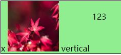
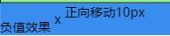
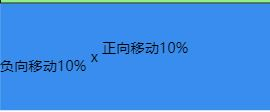
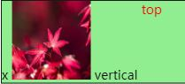
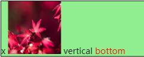
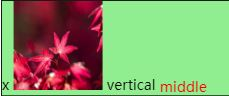
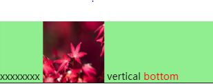

一、line-box

                line-box
-----------------------------------
|    inline-box      inline-box    |
|   -------------  -------------   |
|  |content-area|  |content-area|  |
|  | ---------  |  | ---------  |  |
|  | |       |  |  | |       |  |  |
|  | |       |  |  | |       |  |  |
|  | ---------  |  | ---------  |  |
|  -------------  -------------    |
-----------------------------------

1.content-area

  - 在非替换元素中，指元素中每个字符的字体大小串在一起所组成的框；在替换元素中，元素的固有高度加上任何margins, borders或padding

2.inline-box

  - 每个元素的content-area加上leading(leading为content-area和line-height的差值)
  - 对于非替换元素，元素的inline box的高度等于line-height的值；对于替换元素，元素的inline box的高度等于该元素的固有高度加上任何margins, borders或 padding
  - 由标签生成的inline-block和inline盒子都是有名字的inline-box，而文字则属于匿名的inline-box.

3.line-box

  - line-box 的高度是由它所有子元素inline-box的高度计算得出的。浏览器会计算这一行里每个子元素的高度，再得出 line-box 的高度（具体来说就是从子元素的最高点到最低点的高度），所以默认情况下，一个 line-box 总是有足够的高度来容纳它的子元素
  - 每一行就是一个line-box

二、line-height

- 对于一个内联元素，它有两个高度：content-area（内容区高度）和vitual-area（实际高度），实际高度就是 line-height，这个高度用于计算 line-box 的高度
- virtual-area 和 content-area 高度的差异叫做 leading。leading 的一半会被加到 content-area 顶部，另一半会被加到底部。因此 content-area 总是处于 virtual-area 的中间
- 计算出来的 line-height（也就是 virtual-area 的高度）可以等于、大于或小于 content-area。如果 virtual-area 小于 content-area，那么 leading 就是负的，因此 line-box 看起来就比内容还矮了
- 还有一些其他种类的内联元素：

     - 可替换的内联元素，如 img / input / svg 等
     - inline-block 元素，以及所有 display 值以 inline- 开头的元素，如 inline-table / inline-flex
     - 处于某种特殊格式化上下文的内联元素，例如 flexbox 元素中的子元素都处于flex formatting context（弹性格式化上下文）中，这些子元素的 display 值都是「blockified」

这类内联元素，其高度是基于 height、margin、padding 和 border 属性。如果将 height 设置为 auto 的话，那么其高度的取值就是 line-height，其 content-area 的取值也是 line-height。

- 如果一个标签没有定义height属性(包括百分比高度)，那么其最终表现的高度一定是由line-height起作用

     例：有一个空的div标签，如果没有设置至少大于1像素高度height值时，该div的高度就是个0。如果该div里面打入了一个空格或是文字，则此div就会有一个高度。那么您思考过没有，为什么div里面有文字后就会有高度呢？

          - 这是个看上去很简单的问题，是理解line-height非常重要的一个问题。可能有人会跟认为是：文字撑开的！文字占据空间，自然将div撑开。但是深入理解inline模型后发现，根本不是文字撑开了div的高度，而是line-height！
          - 证明：

                .test1{font-size:20px; line-height:0; border:1px solid #cccccc;}
                .test2{font-size:0; line-height:20px; border:1px solid #cccccc;}

          - test1 div有文字大小，但行高为0，结果div的高度就是个0；test2 div文字大小为0，但是有行高，为20像素，结果div高度就是20像素。这就说明撑开div高度的是line-height不是文字内容
          - 所以一个没有设置height属性的div的高度就是由一个一个line box的高度堆积而成的

三、vertical-align

1.概念

    - 其实vertical-align是用来设置行内元素对齐方式的。说白了就是display属性值为inline、inline-block、inline-table另加一个table-cell的元素

2.基线相关

    - 基线的位置并不是固定的：

       - 在文本之类内联元素中，基线是字符x的下边缘位置

       - 在像img元素中基线就是下边缘

       - 在inline-block元素中，也分两种情况

              - 如果该元素中有内联元素，基线就是最后一行内联元素的基线
              - 如果该元素内没有内联元素或者overflow不是visible，其基线就是margin的底边缘

3.值

   (1)baseline 基线对齐

	    例：

				x
				
				vertical 
				123
			

	
	   结果如下：
	
	           
	
	       由于vertical-align的默认值是baseline(基线对齐)，所以图中的四个inline-box是基线对齐的，x字符的下边缘，img元素的底边，有内容的inline-block元素，都是对齐的，overflow不是visible的inline-block元素的基线是margin的底边缘。从图中可以看出，那么为什么最下面有个空隙呢，这个空隙刚好是字符的基线和bottom之间的距离，这个距离其实是有line-height决定的，line-height的默认值是normal，我们经常将 normal 理解为 1，或者 1.2，我们知道 line-height 的值为数字时，表示的相对于 font-size 的倍数

   (2)具体的长度值

         - 正数表示基线向上移，负值表示基线向下移

             例：

					负值效果
					x
					正向移动10px
		        

             结果如下：

                     

  (3)百分比值

         - 正负情况和长度值一样，需要知道的值是相对于元素行高（line-height）的百分比

             例：

					负向移动10%
					x
					正向移动10%
		        

             结果如下：

                     

  (4)边界相关

     - top:元素的顶边和行内最高元素的顶边对齐

	        例：

				x
				
				vertical 
				top
			   

	
	        结果如下：
	
	              

        - 这里需要注意的是：
           - 1、是和最高元素的顶边而不是和行的顶边对齐。因为设置了行的padding-top之后元素并没有顶在最上面；
           - 2、最高元素的顶边包括margin，看图可以发现设置了maigin-top也是会算在内的。
           - 3、图片显示明显“top”的顶部和图片顶不对齐啊，不要忘了top这个元素是有行高的。而这里是说的元素的顶并不是字母的顶部

    - bottom：元素的底边和行的底边对齐
    
            例： 

					x
					
					vertical 
					bottom
				

		    
            结果如下:

                    

    - middle:元素的中垂点与父元素的基线加1/2父元素中字母X的高度对齐

           例：

				x
				
				vertical 
				middle
			  

			    
           结果如下：

                   

   - text-top：元素顶边和父级的内容区域顶边对齐

          例：

				xxxxxxxx
				
				vertical 
				bottom
			

          结果如下：

                   

   - text-bottom：元素底部和父级的内容区域底部对齐

          例：

				xxxxxxxx
				
				vertical 
				bottom
			

          结果如下：

                   

  

