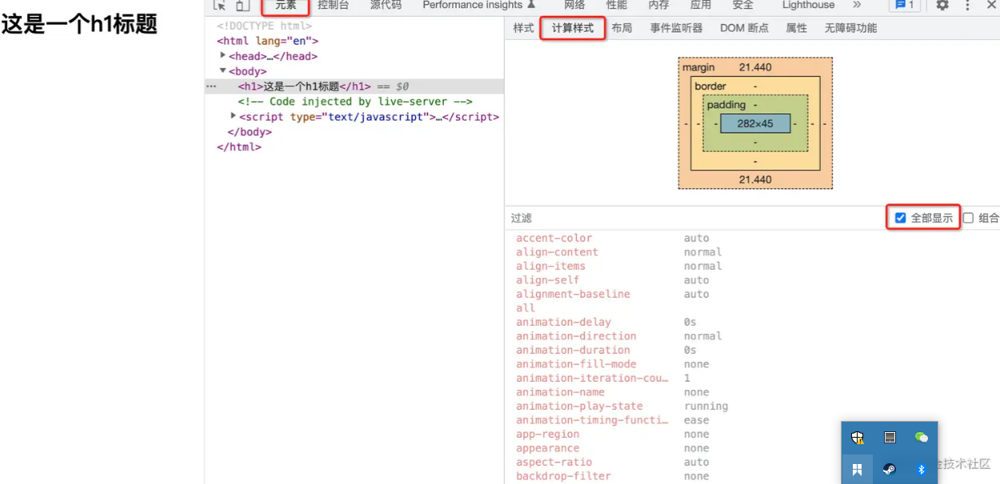
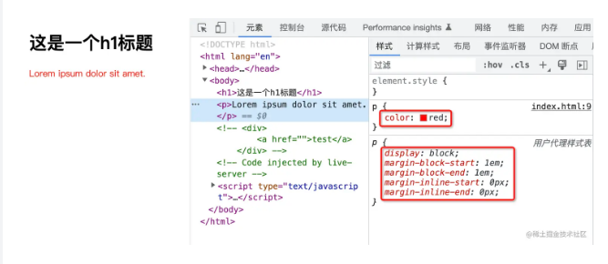
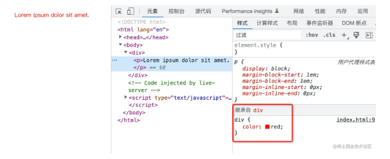
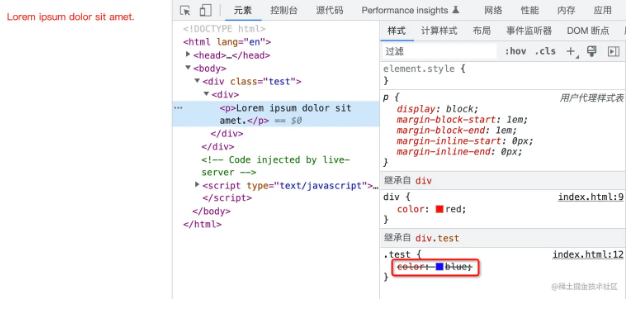

#### 一、问题引入 ####

- 假设在 HTML 中有这么一段代码：

	 <body>
	   <h1>这是一个h1标题</h1>
	 </body>

- 上面的代码也非常简单，就是在 body 中有一个 h1 标题而已，该 h1 标题呈现出来的外观是如下：
     
   

- 目前我们没有设置该 h1 的任何样式，但是却能看到该 h1 有一定的默认样式，例如有默认的字体大小、默认的颜色。

- 那么问题来了，我们这个 h1 元素上面除了有默认字体大小、默认颜色等属性以外，究竟还有哪些属性呢？

- 答案是该元素上面会有 CSS 所有的属性。 你可以打开浏览器的开发者面板，选择【元素】，切换到【计算样式】，之后勾选【全部显示】，此时你就能看到在此 h1 上面所有 CSS 属性对应的值。

   

- 换句话说，**我们所书写的任何一个 HTML 元素，实际上都有完整的一整套 CSS 样式**。这一点往往是让初学者比较意外的，因为我们平时在书写 CSS 样式时，往往只会书写必要的部分，例如前面的：

	 p{
	   color : red;
	 }

- 这往往会给我们造成一种错觉，认为该 p 元素上面就只有 color 属性。而**真实的情况确是，任何一个 HTML 元素，都有一套完整的 CSS 样式，只不过你没有书写的样式，大概率可能会使用其默认值**。例如上图中 h1 一个样式都没有设置，全部都用的默认值。

- 但是注意，我这里强调的是“大概率可能”，难道还有我们“没有设置值，但是不使用默认值”的情况么？

- 确实有的，接下来就了解一下“CSS 属性的计算过程”。

#### 二、CSS 属性的计算过程 ####

- 总的来讲，属性值的计算过程，分为如下这么 4 个步骤：

  - 确定声明值

  - 层叠冲突

  - 使用继承

  - 使用默认值

**1.确定声明值**

  - **声明值是指在css样式表中为每个属性设置的值**，而样式表主要分为两类：

   （1）开发者样式表：就是我们开发者所编辑的样式表。

   （2）浏览器默认样式表：浏览器自带的样式表。

  - **这两种样式表会同时作用于同一个选中的元素。而确定声明值就是在这两张样式表中找出没有冲突的属性值。 **
  
	  p{
	   color : red;
	  }

   

  - 我们可以看到的是其初始有两个样式表，分别是开发者编写的样式，与用户代理样式表（也就是浏览器自带的样式表），而确定声明值会把样式表中所有的未冲突属性赋予对应值。在上例中就是完全没有冲突，也就是两个样式表全部生效。
  
  - **同时我们还有要注意的是在这个过程中会把所有相对单位转化为具体的数值，比如像em、百分比之类的单位转化为具体多少px。**

**2.解决层叠冲突**

  - **当多个相同属性样式作用于同一个元素时，被最终赋予元素的只会有一个，而层叠规则就决定哪个样式会具体应用到该元素。**

  - 此时会进入解决层叠冲突的流程。而这一步又可以细分为下面这三个步骤：

 （1）**比较源重要性**

   - 当不同的 CSS 样式来源拥有相同的声明时，此时就会根据样式表来源的重要性来确定应用哪一条样式规则。
   
   - 按**重要性从高到低**分别是：

     - **带有 important 的开发者样式**

     - **带有 important 的浏览器默认样式**

     - **开发者样式**

     - **浏览器默认样式**

 （2）**比较优先级**

   - 那么接下来，如果是在在同一个源中有样式声明冲突怎么办呢？此时就会进行样式声明的优先级比较。

		 

		   <h1>test</h1>
		 

		
		 .test h1{
		   font-size: 50px;
		 }
		 ​
		 h1 {
		   font-size: 20px;
		 }

  - 在上面的代码中，同属于开发者样式，源的重要性是相同的，此时会以选择器的权重来比较重要性。

  - 很明显，上面的选择器的权重要大于下面的选择器，因此最终标题呈现为 50px。

（3）**比较源次序**

  - 经历了上面两个步骤，大多数的样式声明能够被确定下来。但是还剩下最后一种情况，那就是样式声明既是同源，权重也相同。

  - 此时就会进入第三个步骤，比较样式声明的次序。

		 h1 {
		   font-size: 50px;
		 }
		 ​
		 h1 {
		   font-size: 20px;
		 }

  - 在上面的代码中，同样都是开发者样式，选择器的权重也相同，此时**位于下面的样式声明会层叠掉上面的那一条样式声明**，最终会应用 20px 这一条属性值。

#### 三、使用继承 ####

- 层叠冲突这一步完成后，解决了相同元素被声明了多条样式规则究竟应用哪一条样式规则的问题。

- 那么如果没有声明的属性呢？此时就使用默认值么？

- No、No、No，别急，此时还有第三个步骤，那就是使用继承而来的值。

	 

	   
Lorem ipsum dolor sit amet.

	 

	
	 div {
	   color: red;
	 }

- 在上面的代码中，我们针对 div 设置了 color 属性值为红色，而针对 p 元素我们没有声明任何的属性，但是由于 color 是可以继承的，因此 p 元素从最近的 div 身上继承到了 color 属性的值。

   

- 这里有两个点需要同学们注意一下。

- **首先第一个是我强调了是最近的 div 元素**，看下面的例子：

		 

		   

		     
Lorem ipsum dolor sit amet.

		   

		 

		
		 div {
		   color: red;
		 }
		 .test{
		   color: blue;
		 }

   

- **因为这里并不涉及到选中 p 元素声明 color 值，而是从父元素上面继承到 color 对应的值，因此这里是谁近就听谁的，初学者往往会产生混淆，又去比较权重，但是这里根本不会涉及到权重比较，因为压根儿就没有选中到 p 元素。**

- **第二个就是哪些属性能够继承？**（别的文档总结了）

#### 四、使用默认值 ####

- 好了，目前走到这一步，如果属性值都还不能确定下来，它就会为每一个还没有值的属性赋予默认值，**在MDN上针对每一个css属性都会有一个默认值，最后使每一个元素的css中的每一个属性都有值。**

