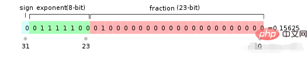
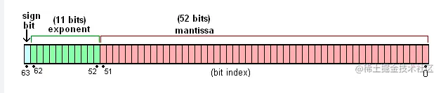

#### 一、简单介绍 ####

- **在 JavaScript 中数值只有一种，即 Number 类型，内部表示为双精度浮点型，即其他语言中的 double 类型，所以在 JavaScript 中实际上是没有整数类型的，数值都是按浮点数来处理的，存储方法相同，遵循 IEEE 754 国际标准。**因此，在 JavaScript 中 3 和 3.0 被视为同一个值：

        3.0 === 3 //true

- 对于整数情况，能够准确计算的整数范围为-2^53到 2^53之间,不包含两个端点，只要在这个范围内整数可以放心使用。

#### 二、位bit与字节Byte ####

- **众所周知计算机是通过二进制来存储数据的，其中的0和1就是二进制的两个数字。**

- **在计算机中可以操作的最小内存单元被称之为 位（bit）,一个位可以放一个0或者一个1。而我们通常在提到的电子产品容量所用到的KB、M、GB等，他的基础单元就是位。其中每8个位被称作1字节（Byte），也就是最小的B，他们的相互关系由小到大如下。**

   - 1B = 8bit
		
   - 1KB = 1024B
		
   - 1M = 1024KB
		
   - 1GB = 1024M
		
   - 1T = 1024GB

**JavaScript中的Number类型遵守的是IEEE 754 64标准，而这个标准中的64表示的就是64位， 也就是说遵守这种标准的数字是通过64个0或1来存储的。**

#### 三、科学计数法 ####

- 科学计数法常用来表示非常大或非常小的数，相比于普通的数字表示方法更加节省空间。

- **在JavaScript中所要表示的数字范围非常大，因此IEEE 754 64是通过二进制科学计数法的形式来存储数据的，而不是普通的二进制存储。**

-  科学计数法上学时都学过，当时学的是十进制。十进制相对来说很好理解，但是计算机中都是用二进制来存储，如果对于科学计数法掌握不扎实，那么很难看懂二进制的科学计数法。

** 1.十进制科学计数法 **

    普通计数法表示32345：  32345
		
    科学计数法表示32345：  3.2345 * 10^4 

  - 10表示科学计数法的进制

    十进制中的每一个数字为0-9，大于等于10则向前进一位。例如：9小于10则表示为单个数字9，10等于10不能用个位数来表示，要向前进一。原来的个位归为0，十位上进一。同理，二进制中每一个数字为0 ~ 1，大于等于2则向前进一位。 例如：1表示1、10表示2、11表示3、100表示4。

  - 4被称为指数，用来表示这个数的范围。

    这个值可以是正数也可以是负数。当数字超过当前指数下的最大值时，指数需要进一。例如3.2345变为9.9999，在大一时，就需要指数进一变为5,变为1.0∗10^5。这个数可以是正数也可以是负数，正数表示的数越大，负数表示的数越小。

  - 3被称之为首位

     - **首位必须是在当前进制范围内的数字。例如这个例子中，首位可以是3不能是32。在十进制中首位的范围是0 ~ 9，同理二进制中首位的范围是0 ~ 1。**

  - 2345被称之精确度，也叫有效数字

     这个精确度并不是指一个数字的小数部分，作为一个小于1的数来理解。他所指的精确度是指精确到哪一位（bit）。例如：

        32345，精确到千位，记作： 3.2345 * 10^4 

        32340，精确到百位，记作：3.234 * 10^4 

        32300，精确到十位，记作：3.23 * 10^4 

- 通过上面的介绍可知以下三点：

 **科学计数法主要由四部分所组成：首位、精确度（有效数字）、进制、指数；**

- 影响一个数字大小的关键就在于指数，只要指数够大数组可以成进制的倍数所增长。在指数确定的情况下，影响一个数组的大小就在于有效数字。当有效数字到达所处进制的最大时，则需要指数进位。例如：3.2345∗10^4想要指数进位就必须有效数字都变为十进制下的最大，变为9才可以9.9999∗10^4。

- 对于一个整数来说，有效数字的位数不能超过指数。 例如3.23456∗10^4有效数字为5位，指数为4位，转换为十进制后是32345.6就不是整数了。

#### 四、IEEE 754 64 存储格式 ####

** 1.二进制科学计数法 **

（1）首位

     - 二进制中首位的范围是0 ~ 1。0乘以任何数都等于0，所以他不具有什么代表意义，是一个特殊值。除却0之外，就只剩下1，二进制科学计数法的首位只能是1。

（2）进制

     - 2，计算机存储只有二进制

（3）指数

     - **从第52位开始到第62位结束总共11位表示的是指数位。这里有一个容易混淆的点，这11位表示指数位，并不代表指数位的范围是0 ~ 11。在二进制中，11位二进制表示的范围是[0, 2047]。**

     - 这个2047是怎么计算的呢？其实自己简单推导以一下就可以算出来：

		1位 =>  1 => 1*2^0 => [0, 1]
		
		2位  => 11 => 1*2^0+1*2^1 => [0, 3]
		
		3位  => 111 => 1*2^0+1*2^1+1*2^2 => [0,7]
		
		......
		
		n位  => 11111111111 => [0, 2^n - 1 ]

     - 通过这个推导也能得出一个显而易见的结论：**当一个二进制数每一位都为1时，就代表他所能表示的最大数字。**

（4）有效数字

     - 从第0位开始到第51位结束总共52位表示的是有效数字，在这里也叫小数位。 

     - 同理这里的52位所表示的范围也不是指[0, 52], 而是[0, 2^52 - 1]。

（5）符号位

     - 这一位是科学计数法中所没有的。计算机中数字分为有符号数和无符号数，就是数字有无正负号区分。有符号数是用最高位也就是63位当做符号位，很显然JavaScript是有符号数。

     - **符号位以-1为底数，位的值为指数。所以当指数为0时，-1的0次幂为1表示正数；当指数为1时，-1的一次幂为-1表示负数。即符号位等于0时表示正数，符号位等于1时表示负数；**

     - **在 IEEE 754中使用 sign 的首字母s来表示符号位。**

（6）指数调整

     - **掐头去尾**

       - **在存储中，指数部分的11位都是0（对应十进制的0）和指数部分11位都是1（对应十进制的2047）是两个特殊的数字。二者不能按照我们既定的公式来参与运算，被称为非规约数。这里暂时不需要理解非规约数的概念，只需知道掐头去尾即可。因此指数E的范围变为[1, 2046]。**

     - **指数偏移**

        - **此外，IEEE 754标准还制定了一个指数偏移值。指数偏移值的用法就是需要在原来的指数基础上减去这个值。这个值的大小为 2^(n-1) - 1，其中n的值为位数, 对应到11位指数就是 2^10 - 1 = 1023。因此指数E的范围在原来的基础上变为[-1022, 1023]。**

       
- **JavaScript 中的 Number 类型使用的是双精度浮点型，即其他语言中的 double 类型，双精度浮点数使用 8 个字节即 64bit 来进行存储，现代计算机中浮点数大多是以国际标准 IEEE 754 来存储，在JavaScript中所要表示的数字范围非常大，因此IEEE 754 64是通过二进制科学计数法的形式来存储数据的，而不是普通的二进制存储，存储过程分两步，**

   1.**把浮点数转换为对应的二进制数，并用科学计数法表示**

   2.**将转换之后的数通过 IEEE 754 标准表示成真正会在计算机存储的值。**

- 根据 IEEE 754 标准任何一个二进制浮点数 V 都可以表示成：

  **V = (-1)^S * M * 2^E**

  - (-1)^S表示符号位，当S=0，V为正数，当S=1，V为负数
  
  - M表示有效数字，大于等于1，小于2
  
  - 2^E表示指数位

	例如：十进制的5.0，写成二进制是 101.0，相当于 1.01∗2^2，其中 S=0，M=1.01，E=2。

- IEEE 754规定对于32位浮点数最高1位是符号位S，接下来8位是指数E，剩下的23位为有效数字M，具体如下图所示：

        

- 对于64位的浮点数最高1位是符号位S，接下来11位是指数E，剩下的52位是有效数字M，具体如下图所示：

- 注意：IEEE754 对于有效数字M和指数E还有一些特别的规定。

   - 前面说过，**1 <= M < 2，也就是说 M 总是可以写成 1.xxxxxxx 的形式，其中 xxxxxxx 表示效数部分。IEEE 754 规定，在计算机内部保存 M 时默认这个数的第一位总是1，因此可以被舍去，只保存后面的 xxxxxxx 部分。**比如保存1.01的时候只保存01，等到读取的时候再把第一位的1加上去，**这样做的目的就是为了节省一位有效数字，以32位浮点数为例，留给有效数字M的只有23位，将第一位的1舍去以后等于保存24位有效数字**

   - 至于指数E，情况较为复杂。首先，**E为一个无符号指数，这意味着，如果E为8位，它的取值范围为 0 ~ 255(2^8 = 256)，如果E为11位，它的取值范围为0 ~ 2047(2^11=2048)。但是我们知道科学计数中的E是是可以出现负值的，所以IEEE 754规定，E的真实值必须再减去一个中间数，对于8位的E，这个中间数是127(256/2 - 1)，对于11位的E，这个中间数是1023(2048/2 - 1)。就是对于指数部分，每次都加这个偏移量进行保存，这样即使指数是负数，那么加上这个偏移量也变为正数啦**

    比如：E为10的时候，必须保存成10+127=137，即10001001

   - ** 指数E还可以分成三种情况：**

        - **E不全为0或不全为1**：这时，浮点数就采用上面的规则表示，即指数E的计算值减去127（或1023），得到真实值，再将有效数字M前加上第一位的1。

        - **E全为0(指数值为 0)**：这时，浮点数的指数E等于1 ~ 127（或1 ~ 1023），有效数字M不再加上第一位的1，而是还原成0.xxxxxxx的小数，这样做是为了表示±0，以及接近0的很小的数字。

        - **E全为1(指数值为 2047)**：IEEE规定这个浮点数可用来表示3个特殊值，如果有效数字M全为0，表示±无穷大（正负取决于符号位S）；如果有效数字M不全为0，表示这个数不是一个数（NaN）。

    示例：浮点数 9.0 如何用二进制表示？还原成十进制又是多少？

    - 首先，浮点数 9.0 等于二进制的 1001.0，即 1.001∗e^3

    - 那么，第一位的符号位 S=0，有效数字 M 等于 001 后面再加 20 个 0，凑满 23 位，指数 E 等于 3+127=130，即 10000010。

    - 所以，写成二进制形式，应该是 S+E+M，即0 10000010 001 0000 0000 0000 0000 0000。这个 32 位的二进制数，还原成十进制，正是 1091567616。

- **注：虽然在 JavaScript 中无论是小数还是整数都是按照64位的浮点数形式存储，但是进行整数运算会自动转换为32位的有符号整数，例如位运算，有符号整数使用31位表示整数的数值，用第32位表示整数的符号，数值范围是-2^31到 2^31。**

#### 五、浮点数运算的精度丢失 ####

- 众所周知在 JavaScript 中 0.1+0.2 不等于 0.3，实际上所有浮点数值存储遵循 IEEE 754 标准的编程语言中都会存在这个问题，这是因为计算机中小数的存储先是转换成二进制进行存储的，而 0.1、0.2 转换成二进制分别为：

0.1 -> 0.0 0011 0011 0011 0011 ......  0011无限循环

0.2 -> 0.0011 0011 0011 0011 ......  0011无限循环

- 尾数位只能存储最多 53 位有效数字(**注意：从非零位开始数**)，这时候就必须来进行四舍五入了，而这个取舍的规则就是在 IEEE 754 中定义的（0 舍 1 入），0.1 最终能被存储的有效数字是

0.1的二进制（小数点后面的三个0不算）:
0.000 1100 1100 1100 1100 1100 1100 1100 1100 1100 1100 1100 1100 
1101(52位小数)

转换为科学计数法：

1.1001 1001 1001 1001 1001 1001 1001 1001 1001 1001 1001 1001 101 * e^(-4) (偏移量：-4)

0.2的二进制（小数点后面的两个0不算）:
0.00 1100 1100 1100 1100 1100 1100 1100 1100 1100 1100 1100 1100 1101(52位小数)

转换为科学计数法：

1.1001 1001 1001 1001 1001 1001 1001 1001 1001 1001 1001 1001 101*e^(-3) (偏移量：-3)

将64位双精度浮点数相加，首先把偏移量还原对齐，在进行相加：
0.1 + 0.2 ->  

1.1001 1001 1001 1001 1001 1001 1001 1001 1001 1001 1001 1001 101 * e^(-4) + 1.1001 1001 1001 1001 1001 1001 1001 1001 1001 1001 1001 1001 101*e^(-3) ->

0.1100 1100 1100 1100 1100 1100 1100 1100 1100 1100 1100 1100 1101 * e^(-3) + 
1.1001 1001 1001 1001 1001 1001 1001 1001 1001 1001 1001 1001 101 * e^(-3) ->

10.0110 0110 0110 0110 0110 0110 0110 0110 0110 0110 0110 0110 0111 * e^(-3) ->
                                            
1.00110011001100110011001100110011001100110011001100111 * e^(-2)
  
0.0100110011001100110011001100110011001100110011001100111 ->再次四舍五入->
0.0100110011001100110011001100110011001100110011001101(52位小数)

- **最终的这个二进制数转换成十进制的就是 0.30000000000000004 ，这儿需要注意，53 位的存储位指的是能存 53 位有效数字，因此前置的 0 不算，要往后再取到 53 位有效数字为止(注意：从非零位开始数)**

- **因此，精度丢失的问题实际上用一句话概括就是计算机中用二进制存储小数，而大部分小数转成二进制后都是无限循环的值，因此存在取舍问题，也就是精度丢失。**

**这里的52和53有点儿不明白，暂缓**