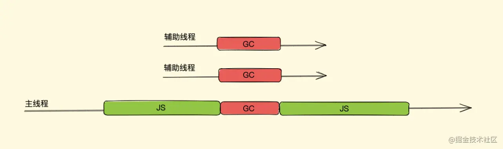
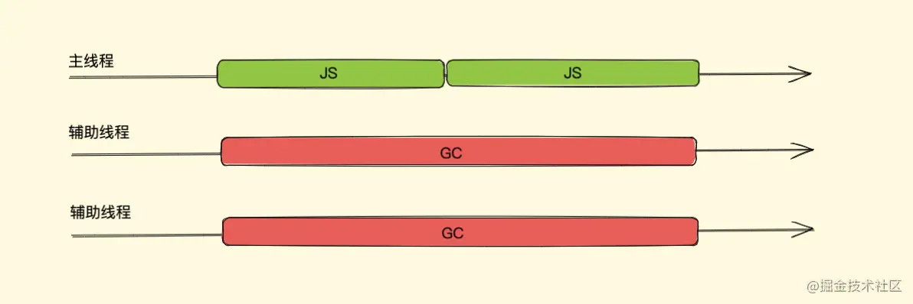

接上篇垃圾回收~

#### 一、V8内存限制 ####

- 所有的对象类型的数据在JS中都是通过堆进行空间分配的。当我们构造一个对象进行赋值操作的时候，其实相应的内存已经分配到了堆上。你可以不断的这样创建对象，让 V8 为它分配空间，直到堆的大小达到上限。那么问题来了，V8 为什么要给它设置内存上限？明明我的机器大几十G的内存，只能让我用这么一点？
- 究其根本，是由两个因素所共同决定的，一个是JS单线程的执行机制，另一个是JS垃圾回收机制的限制。

   - 首先JS是单线程运行的，这意味着一旦进入到垃圾回收，那么其它的各种运行逻辑都要暂停; 
   - 另一方面垃圾回收其实是非常耗时间的操作，在这么长的时间内，我们的JS代码执行会一直没有响应，造成应用卡顿，导致应用性能和响应能力直线下降。因此，V8 做了一个简单粗暴的选择，那就是限制堆内存，也算是一种权衡的手段，因为大部分情况是不会遇到操作几个G内存这样的场景的。

- 垃圾回收策略主要有标记清除和引用计数，现在大多数浏览器都是基于标记清除算法，V8 亦是，当然 V8 肯定也对其进行了一些优化加工处理，那接下来我们主要就来看 V8 中对垃圾回收机制的优化

#### 二、分代式垃圾回收 ####

- 我们上面所说的垃圾清理算法在每次垃圾回收时都要检查内存中所有的对象，这样的话对于一些大、老、存活时间长的对象来说同新、小、存活时间短的对象一个频率的检查很不好，因为前者需要时间长并且不需要频繁进行清理，后者恰好相反，怎么优化这点呢？？？分代式就来了

1. **新老生代** 

- V8中将堆内存分为新生代和老生代两区域，采用不同的垃圾回收器也就是不同的策略管理垃圾回收
- 新生代的对象为存活时间较短的对象，简单来说就是新产生的对象，在 64 位和 32 位系统下分别为 32MB 和 16MB，而老生代的对象为存活事件较长或常驻内存的对象，简单来说就是经历过新生代垃圾回收后还存活下来的对象，容量通常比较大
- V8 整个堆内存的大小就等于新生代加上老生代的内存
- 对于新老两块内存区域的垃圾回收，V8 采用了两个垃圾回收器来管控，我们暂且将管理新生代的垃圾回收器叫做新生代垃圾回收器（副垃圾回收器），同样的，我们称管理老生代的垃圾回收器叫做老生代垃圾回收器（主垃圾回收器）好了

2. **新生代垃圾回收**

- 新生代对象是通过一个名为 Scavenge 的算法进行垃圾回收，在 Scavenge算法 的具体实现中，主要采用了一种复制式的方法即 Cheney算法 
- Cheney算法 中将堆内存一分为二，一个是处于使用状态的空间我们暂且称之为 使用区，一个是处于闲置状态的空间我们称之为空闲区，如下图所示

- 新加入的对象都会存放到使用区，当使用区快被写满时，就需要执行一次垃圾清理操作
- 当开始进行垃圾回收时，新生代垃圾回收器会对使用区中的活动对象做标记，标记完成之后将使用区的活动对象复制进空闲区并进行排序，随后进入垃圾清理阶段，即将非活动对象占用的空间清理掉。最后进行角色互换，把原来的使用区变成空闲区，把原来的空闲区变成使用区
- 新生代中的变量如果经过多次回收后依然存在，那么就会被放入到老生代内存中，这种现象就叫晋升。
- 发生晋升其实不只是这一种原因，我们来梳理一下会有那些情况触发晋升:

   - 已经经历过一次 Scavenge 回收。
   - 空闲区空间的内存占用超过25%,设置为 25% 的比例的原因是，当完成 Scavenge 回收后，空闲区将翻转成使用区，继续进行对象内存的分配，若占比过大，将会影响后续内存分配

- 不过Scavenge 算法的劣势也非常明显，就是内存只能使用新生代内存的一半，但是它只存放生命周期短的对象，这种对象一般很少，因此时间性能非常优秀。

3. **老生代垃圾回收**

- 相比于新生代，老生代的垃圾回收就比较容易理解了，上面我们说过，对于大多数占用空间大、存活时间长的对象会被分配到老生代里，因为老生代中的对象通常比较大，如果再如新生代一般分区然后复制来复制去就会非常耗时，从而导致回收执行效率不高，所以老生代垃圾回收器来管理其垃圾回收执行，它的整个流程就采用的就是上文所说的标记清除算法了,标记清除算法在清除后会产生大量不连续的内存碎片，过多的碎片会导致大对象无法分配到足够的连续内存，而 V8 中就采用了我们上文中说的标记整理算法来解决这一问题来优化空间

	- 首先是标记阶段，从一组根元素开始，递归遍历这组根元素，遍历过程中能到达的元素称为活动对象，没有到达的元素就可以判断为非活动对象，清除阶段老生代垃圾回收器会直接将非活动对象，也就是数据清理掉
	- 标记清除算法有一个很大的缺点，就是在清除之后，剩余的对象内存位置是不变的，也会导致空闲内存空间是不连续的，出现了 内存碎片（如下图），并且由于剩余空闲内存不是一整块，它是由不同大小内存组成的内存列表，这就牵扯出了内存分配的问题

	
	- 假设我们新建对象分配内存时需要大小为 size，由于空闲内存是间断的、不连续的，则需要对空闲内存列表进行一次单向遍历找出大于等于 size 的块才能为其分配
	- 那如何找到合适的块呢？我们可以采取下面三种分配策略
	 
	  - First-fit，找到大于等于 size 的块立即返回
	  - Best-fit，遍历整个空闲列表，返回大于等于 size 的最小分块
	  - Worst-fit，遍历整个空闲列表，找到最大的分块，然后切成两部分，一部分 size 大小，并将该部分返回
	
	- 这三种策略里面 Worst-fit 的空间利用率看起来是最合理，但实际上切分之后会造成更多的小块，形成内存碎片，所以不推荐使用，对于 First-fit 和 Best-fit 来说，考虑到分配的速度和效率 First-fit 是更为明智的选择
	- 综上所述，标记清除算法或者说策略就有两个很明显的缺点
	
	   - 内存碎片化，空闲内存块是不连续的，容易出现很多空闲内存块，还可能会出现分配所需内存过大的对象时找不到合适的块
	   - 分配速度慢，因为即便是使用 First-fit 策略，其操作仍是一个 O(n) 的操作，最坏情况是每次都要遍历到最后，同时因为碎片化，大对象的分配效率会更慢
	
	- 而标记整理（Mark-Compact）算法 就可以有效地解决，它的标记阶段和标记清除算法没有什么不同，只是标记结束后，标记整理算法会将活着的对象（即不需要清理的对象）向内存的一端移动，最后清理掉边界的内存（如下图）

4. **并行回收(Parallel)**

- 在介绍并行之前，我们先要了解一个概念全停顿（Stop-The-World），我们都知道 JavaScript 是一门单线程的语言，它是运行在主线程上的，那在进行垃圾回收时就会阻塞 JavaScript 脚本的执行，需等待垃圾回收完毕后再恢复脚本执行，我们把这种行为叫做全停顿
- 既然存在执行一次 GC 比较耗时的情况，考虑到一个人盖房子难，那两个人、十个人...呢？切换到程序这边，那我们可不可以引入多个辅助线程来同时处理，这样是不是就会加速垃圾回收的执行速度呢？因此 V8 团队引入了并行回收机制
- 所谓并行，也就是同时的意思，它指的是垃圾回收器在主线程上执行的过程中，开启多个辅助线程，同时执行同样的回收工作

- 简单来说，使用并行回收，假如本来是主线程一个人干活，它一个人需要 3 秒，现在叫上了 2 个辅助线程和主线程一块干活，那三个人一块干一个人干 1 秒就完事了，但是由于多人协同办公，所以需要加上一部分多人协同（同步开销）的时间我们算 0.5 秒好了，也就是说，采用并行策略后，本来要 3 秒的活现在 1.5 秒就可以干完了,不过虽然 1.5 秒就可以干完了，时间也大大缩小了，但是这 1.5 秒内，主线程还是需要让出来的，也正是因为主线程还是需要让出来，这个过程内存是静态的，不需要考虑内存中对象的引用关系改变，只需要考虑协同，实现起来也很简单
- 新生代对象空间就采用并行策略，在执行垃圾回收的过程中，会启动了多个线程来负责新生代中的垃圾清理操作，这些线程同时将对象空间中的数据移动到空闲区域，这个过程中由于数据地址会发生改变，所以还需要同步更新引用这些对象的指针，此即并行回收

5. **增量标记与懒性清理**

- 我们上面所说的并行策略虽然可以增加垃圾回收的效率，对于新生代垃圾回收器能够有很好的优化，但是其实它还是一种全停顿式的垃圾回收方式，对于老生代来说，它的内部存放的都是一些比较大的对象，对于这些大的对象 GC 时哪怕我们使用并行策略依然可能会消耗大量时间,所以为了减少全停顿的时间，在 2011 年，V8 对老生代的标记进行了优化，从全停顿标记切换到增量标记
- 增量就是将一次 GC 标记的过程，分成了很多小步，每执行完一小步就让应用逻辑执行一会儿，这样交替多次后完成一轮 GC 标记（如下图）

- 试想一下，将一次完整的 GC 标记分次执行，那在每一小次 GC 标记执行完之后如何暂停下来去执行任务程序，而后又怎么恢复呢？那假如我们在一次完整的 GC 标记分块暂停后，执行任务程序时内存中标记好的对象引用关系被修改了又怎么办呢？
- 可以看出增量的实现要比并行复杂一点，V8 对这两个问题对应的解决方案分别是三色标记法与写屏障

6. **三色标记法(暂停与恢复)**

- 我们知道老生代是采用标记清理算法，而上文的标记清理中我们说过，也就是在没有采用增量算法之前，单纯使用黑色和白色来标记数据就可以了，其标记流程即在执行一次完整的 GC 标记前，垃圾回收器会将所有的数据置为白色，然后垃圾回收器在会从一组跟对象出发，将所有能访问到的数据标记为黑色，遍历结束之后，标记为黑色的数据对象就是活动对象，剩余的白色数据对象也就是待清理的垃圾对象
如果采用非黑即白的标记策略，那在垃圾回收器执行了一段增量回收后，暂停后启用主线程去执行了应用程序中的一段 JavaScript 代码，随后当垃圾回收器再次被启动，这时候内存中黑白色都有，我们无法得知下一步走到哪里了
- 为了解决这个问题，V8 团队采用了一种特殊方式： 三色标记法
- 三色标记法即使用每个对象的两个标记位和一个标记工作表来实现标记，两个标记位编码三种颜色：白、灰、黑

  - 白色指的是未被标记的对象
  - 灰色指自身被标记，成员变量（该对象的引用对象）未被标记
  - 黑色指自身和成员变量皆被标记

- 我们用最简单的表达方式来解释这一过程，最初所有的对象都是白色，意味着回收器没有标记它们，从一组根对象开始，先将这组根对象标记为灰色并推入到标记工作表中，当回收器从标记工作表中弹出对象并访问它的引用对象时，将其自身由灰色转变成黑色，并将自身的下一个引用对象转为灰色，就这样一直往下走，直到没有可标记灰色的对象时，也就是无可达（无引用到）的对象了，那么剩下的所有白色对象都是无法到达的，即等待回收
- 采用三色标记法后我们在恢复执行时就好办多了，可以直接通过当前内存中有没有灰色节点来判断整个标记是否完成，如没有灰色节点，直接进入清理阶段，如还有灰色标记，恢复时直接从灰色的节点开始继续执行就可以
- 三色标记法的 mark 操作可以渐进执行的而不需每次都扫描整个内存空间，可以很好的配合增量回收进行暂停恢复的一些操作，从而减少 全停顿 的时间

7. **写屏障**

- 假如我们有 A、B、C 三个对象依次引用，在第一次增量分段中全部标记为黑色（活动对象），而后暂停开始执行应用程序也就是 JavaScript 脚本，在脚本中我们将对象 B 的指向由对象 C 改为了对象 D ，接着恢复执行下一次增量分段
- 这时其实对象 C 已经无引用关系了，但是目前它是黑色（代表活动对象）此一整轮 GC 是不会清理 C 的，不过我们可以不考虑这个，因为就算此轮不清理等下一轮 GC 也会清理，这对我们程序运行并没有太大影响
- 我们再看新的对象 D 是初始的白色，按照我们上面所说，已经没有灰色对象了，也就是全部标记完毕接下来要进行清理了，新修改的白色对象 D 将在次轮 GC 的清理阶段被回收，还有引用关系就被回收，后面我们程序里可能还会用到对象 D 呢，这肯定是不对的
- 为了解决这个问题，V8 增量回收使用 写屏障 (Write-barrier) 机制，即一旦有黑色对象引用白色对象，该机制会强制将引用的白色对象改为灰色，从而保证下一次增量 GC 标记阶段可以正确标记，这个机制也被称作 强三色不变性
- 那在我们上图的例子中，将对象 B 的指向由对象 C 改为对象 D 后，白色对象 D 会被强制改为灰色

8. **懒性清理**

- 增量标记其实只是对活动对象和非活动对象进行标记，对于真正的清理释放内存 V8 采用的是惰性清理(Lazy Sweeping)
- 增量标记完成后，惰性清理就开始了。当增量标记完成后，假如当前的可用内存足以让我们快速的执行代码，其实我们是没必要立即清理内存的，可以将清理过程稍微延迟一下，让 JavaScript 脚本代码先执行，也无需一次性清理完所有非活动对象内存，可以按需逐一进行清理直到所有的非活动对象内存都清理完毕，后面再接着执行增量标记

9. **增量标记与惰性清理的优缺？**

- 增量标记与惰性清理的出现，使得主线程的停顿时间大大减少了，让用户与浏览器交互的过程变得更加流畅。但是由于每个小的增量标记之间执行了 JavaScript 代码，堆中的对象指针可能发生了变化，需要使用写屏障技术来记录这些引用关系的变化，所以增量标记缺点也很明显：
- 首先是并没有减少主线程的总暂停的时间，甚至会略微增加，其次由于写屏障机制的成本，增量标记可能会降低应用程序的吞吐量

10. **并发回收(Concurrent)**

- 前面我们说并行回收依然会阻塞主线程，增量标记同样有增加了总暂停时间、降低应用程序吞吐量两个缺点，那么怎么才能在不阻塞主线程的情况下执行垃圾回收并且与增量相比更高效呢？这就要说到并发回收了，它指的是主线程在执行 JavaScript 的过程中，辅助线程能够在后台完成执行垃圾回收的操作，辅助线程在执行垃圾回收的时候，主线程也可以自由执行而不会被挂起（如下图）

- 辅助线程在执行垃圾回收的时候，主线程也可以自由执行而不会被挂起，这是并发的优点，但同样也是并发回收实现的难点，因为它需要考虑主线程在执行 JavaScript  时，堆中的对象引用关系随时都有可能发生变化，这时辅助线程之前做的一些标记或者正在进行的标记就会要有所改变，所以它需要额外实现一些读写锁机制来控制这一点

11. **V8当前垃圾回收机制**

- V8 的垃圾回收策略主要基于分代式垃圾回收机制，这我们说过，关于新生代垃圾回收器，我们说使用并行回收可以很好的增加垃圾回收的效率，那老生代垃圾回收器用的哪个策略呢？我上面说了并行回收、增量标记与惰性清理、并发回收这几种回收方式来提高效率、优化体验，看着一个比一个好，那老生代垃圾回收器到底用的哪个策略？难道是并发？？内心独白：” 好像。。貌似。。并发回收效率最高 “
- 其实，这三种方式各有优缺点，所以在老生代垃圾回收器中这几种策略都是融合使用的
- （1）副垃圾回收器

    - V8在新生代垃圾回收中，使用并行（parallel）机制，在整理排序阶段，也就是将活动对象从from-to复制到space-to的时候，启用多个辅助线程，并行的进行整理。由于多个线程竞争一个新生代的堆的内存资源，可能出现有某个活动对象被多个线程进行复制操作的问题，为了解决这个问题，V8在第一个线程对活动对象进行复制并且复制完成后，都必须去维护复制这个活动对象后的指针转发地址，以便于其他协助线程可以找到该活动对象后可以判断该活动对象是否已被复制。
    
- （2）主垃圾回收器

    - V8在老生代垃圾回收中，如果堆中的内存大小超过某个阈值之后，会启用并发（Concurrent）标记任务。每个辅助线程都会去追踪每个标记到的对象的指针以及对这个对象的引用，而在JavaScript代码执行时候，并发标记也在后台的辅助进程中进行，当堆中的某个对象指针被JavaScript代码修改的时候，写入屏障（write barriers）技术会在辅助线程在进行并发标记的时候进行追踪。
    - 当并发标记完成或者动态分配的内存到达极限的时候，主线程会执行最终的快速标记步骤，这个时候主线程会挂起，主线程会再一次的扫描根集以确保所有的对象都完成了标记，由于辅助线程已经标记过活动对象，主线程的本次扫描只是进行check操作，确认完成之后，某些辅助线程会进行清理内存操作，某些辅助进程会进行内存整理操作，由于都是并发的，并不会影响主线程JavaScript代码的执行。

