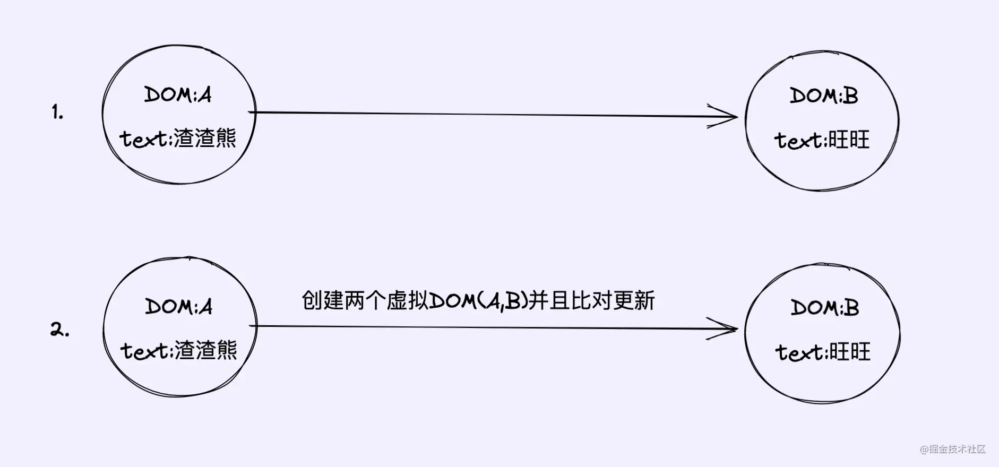
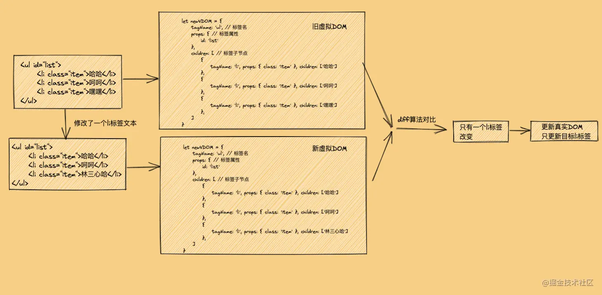
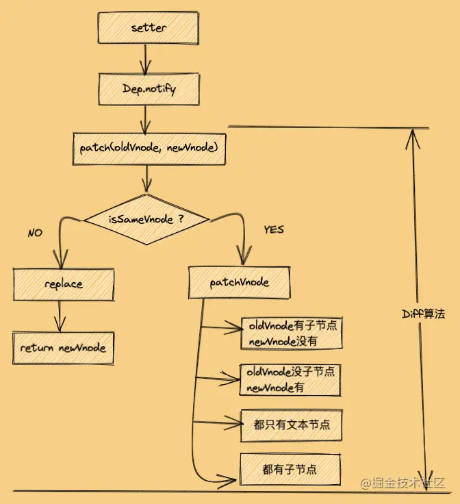
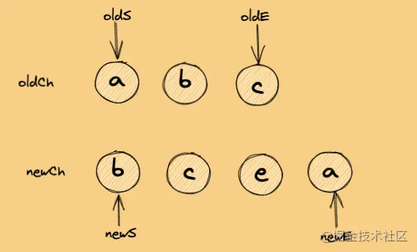
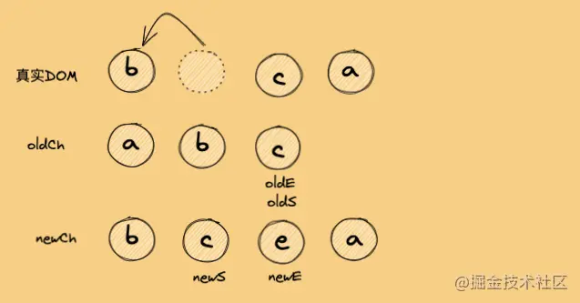
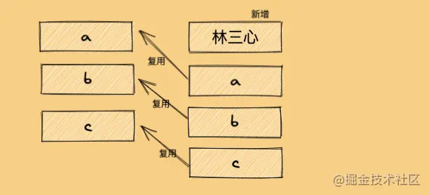
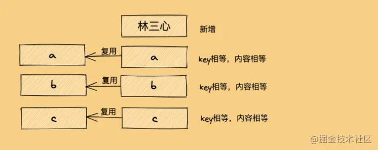

https://juejin.cn/post/6994959998283907102
#### 一、虚拟DOM ####

1. 什么是虚拟DOM？

- 虚拟DOM是一个对象，一个什么样的对象呢？一个用来表示真实DOM的对象，即虚拟DOM就是将真实的DOM的数据抽离出来，以对象的形式模拟树形结构，看下面例子：

		<ul id="list">
		    <li class="item">哈哈</li>
		    <li class="item">呵呵</li>
		    <li class="item">嘿嘿</li>
		</ul>

对应的虚拟DOM为：

        // 旧虚拟DOM

		let oldVDOM = { 
		        tagName: 'ul', // 标签名
		        props: { // 标签属性
		            id: 'list'
		        },
		        children: [ // 标签子节点
		            {
		                tagName: 'li', props: { class: 'item' }, children: ['哈哈']
		            },
		            {
		                tagName: 'li', props: { class: 'item' }, children: ['呵呵']
		            },
		            {
		                tagName: 'li', props: { class: 'item' }, children: ['嘿嘿']
		            },
		        ]
		    }

这时候，我修改一个li标签的文本：

		<ul id="list">
		    <li class="item">哈哈</li>
		    <li class="item">呵呵</li>
		    <li class="item">林三心哈哈哈哈哈</li> // 修改
		</ul>

这时候生成的新虚拟DOM为：

        // 新虚拟DOM

		let newVDOM = { 
		        tagName: 'ul', // 标签名
		        props: { // 标签属性
		            id: 'list'
		        },
		        children: [ // 标签子节点
		            {
		                tagName: 'li', props: { class: 'item' }, children: ['哈哈']
		            },
		            {
		                tagName: 'li', props: { class: 'item' }, children: ['呵呵']
		            },
		            {
		                tagName: 'li', props: { class: 'item' }, children: ['林三心哈哈哈哈哈']
		            },
		        ]
		    }

这就是咱们平常说的新旧两个虚拟DOM，这个时候的新虚拟DOM是数据的最新状态，那么我们直接拿新虚拟DOM去渲染成真实DOM的话，效率真的会比直接操作真实DOM高吗？那肯定是不会的，看下图：

示例1是创建一个DOMB然后替换掉DOMA;示例2去创建虚拟DOM+DIFF算法比对发现DOMB跟DOMA不是相同的节点,最后还是创建一个DOMB然后替换掉DOMA;可以明显看出1是更快的。同样的结果,2还要去创建虚拟DOM+DIFF算法对比，所以说使用虚拟DOM比直接操作真实DOM就一定要快这个说法是错误的，不严谨的。

#### 二、什么是diff算法 ####

上图中，其实只有一个li标签修改了文本，其他都是不变的，所以没必要所有的节点都要更新，只更新这个li标签就行，Diff算法就是查出这个li标签的算法。

- 所以，当一些复杂的节点,比如说一个父节点里面有多个子节点,当只是一个子节点的内容发生了改变,那么我们没有必要像示例1重新去渲染这个DOM树,这个时候虚拟DOM+DIFF算法就能够得到很好的体现,我们通过示例2使用**虚拟DOM+Diff算法**去找出改变了的子节点更新它的内容就可以了。
- diff 算法首先要明确一个概念就是 Diff 的对象是虚拟DOM（virtual dom），更新真实 DOM 是 Diff 算法的结果。Diff算法是一种对比算法，对比两者是旧虚拟DOM和新虚拟DOM，对比出是哪个虚拟节点更改了，找出这个虚拟节点，并只更新这个虚拟节点所对应的真实节点，而不用更新其他数据没发生改变的节点，实现精准地更新真实DOM，进而提高效率。

#### 三、为什么要使用虚拟DOM ####

- 当然是前端优化方面，避免频繁操作DOM，频繁操作DOM会可能让浏览器回流和重绘，性能也会非常低，还有就是手动操作 DOM 还是比较麻烦的，要考虑浏览器兼容性问题，当前jQuery等库简化了 DOM操作，但是项目复杂了，DOM操作还是会变得复杂，数据操作也变得复杂
- 并不是所有情况使用虚拟DOM 都提高性能，是针对在复杂的的项目使用。如果简单的操作，使用虚拟DOM,要创建虚拟DOM对象等等一系列操作，还不如普通的DOM 操作
- 虚拟DOM 可以实现跨平台渲染，服务器渲染 、小程序、原生应用都使用了虚拟DOM
- 使用虚拟DOM改变了当前的状态不需要立即的去更新DOM 而且更新的内容进行更新，对于没有改变的内容不做任何操作，通过前后两次差异进行比较
- 虚拟 DOM 可以维护程序的状态，跟踪上一次的状态

#### 四、diff算法原理 ####

1. Diff同层对比

-  传统的计算两颗树的差异时间复杂度为O(n^3),显然成本比较高（老树的每一个节点都去遍历新树的节点，直到找到新树对应的节点。那么这个流程就是 O(n^2)，再紧接着找到不同之后，再计算最短修改距离然后修改节点，这里是 O(n^3)。）

- 新旧虚拟DOM对比的时候，Diff算法比较只会在同层级进行, 不会跨层级比较。 所以Diff算法是:深度优先算法。 时间复杂度:O(n)

2. diff的对比流程

- 当数据改变时，会触发setter，并且通过Dep.notify去通知所有订阅者Watcher，订阅者们就会调用patch方法，给真实DOM打补丁，更新相应的视图
- newVnode和oldVnode：同层的新旧虚拟节点

- （1）patch方法

    - patch函数是diff流程的入口函数，这个方法作用就是，对比当前同层的虚拟节点是否为同一种类型的标签(同一类型的标准，下面会讲)：

      - 是：继续执行patchVnode方法进行深层比对
      - 否：没必要比对了，直接整个节点替换成新虚拟节点

    - 来看看patch的核心原理代码

       function patch(oldVnode, newVnode) {

		  // 比较是否为一个类型的节点
		  if (sameVnode(oldVnode, newVnode)) {

		    // 是：继续进行深层比较
		    patchVnode(oldVnode, newVnode)

		  } else {
		    // 否

		    const oldEl = oldVnode.el // 旧虚拟节点的真实DOM节点

		    const parentEle = api.parentNode(oldEl) // 获取父节点

		    createEle(newVnode) // 创建新虚拟节点对应的真实DOM节点

		    if (parentEle !== null) {

		      api.insertBefore(parentEle, vnode.el, api.nextSibling(oEl)) // 将新元素添加进父元素

		      api.removeChild(parentEle, oldVnode.el)  // 移除以前的旧元素节点

		      // 设置null，释放内存
		      oldVnode = null
		    }
		  }
		
		  return newVnode
		}

- （2）sameVnode方法

    - patch关键的一步就是sameVnode方法判断是否为同一类型节点，那问题来了，怎么才算是同一类型节点呢？这个类型的标准是什么呢？
    - 咱们来看看sameVnode方法的核心原理代码，就一目了然了

		function sameVnode(oldVnode, newVnode) {

		  return (
		    oldVnode.key === newVnode.key && // key值是否一样
		    oldVnode.tagName === newVnode.tagName && // 标签名是否一样
		    oldVnode.isComment === newVnode.isComment && // 是否都为注释节点
		    isDef(oldVnode.data) === isDef(newVnode.data) && // 是否都定义了data
		    sameInputType(oldVnode, newVnode) // 当标签为input时，type必须是否相同
		  )
       }

- （3）patchVnode方法

    - 这个函数做了以下事情：

         - 找到对应的真实DOM，称为el
         - 判断newVnode和oldVnode是否指向同一个对象，如果是，那么直接return
         - 如果他们都有文本节点并且不相等，那么将el的文本节点设置为newVnode的文本节点。
         - 如果oldVnode有子节点而newVnode没有，则删除el的子节点
         - 如果oldVnode没有子节点而newVnode有，则将newVnode的子节点真实化之后添加到el
         - 如果两者都有子节点，则执行updateChildren函数比较子节点，这一步很重要

			function patchVnode(oldVnode, newVnode) {

              // 获取真实DOM对象
			  const el = newVnode.el = oldVnode.el 

			  // 获取新旧虚拟节点的子节点数组
			  const oldCh = oldVnode.children, newCh = newVnode.children

			  // 如果新旧虚拟节点是同一个对象，则终止
			  if (oldVnode === newVnode) return

			  // 如果新旧虚拟节点是文本节点，且文本不一样
			  if (oldVnode.text !== null && newVnode.text !== null && oldVnode.text !== newVnode.text) {

			    // 则直接将真实DOM中文本更新为新虚拟节点的文本
			    api.setTextContent(el, newVnode.text)

			  } else {
			    // 否则
			
			    if (oldCh && newCh && oldCh !== newCh) {
			      // 新旧虚拟节点都有子节点，且子节点不一样
			
			      // 对比子节点，并更新
			      updateChildren(el, oldCh, newCh)

			    } else if (newCh) {
			      // 新虚拟节点有子节点，旧虚拟节点没有
			
			      // 创建新虚拟节点的子节点，并更新到真实DOM上去
			      createEle(newVnode)

			    } else if (oldCh) {
			      // 旧虚拟节点有子节点，新虚拟节点没有
			
			      //直接删除真实DOM里对应的子节点
			      api.removeChild(el)
			    }
			  }
			}

- （4）updateChildren方法

    - 这是patchVnode里最重要的一个方法，新旧虚拟节点的子节点对比，就是发生在updateChildren方法中，是怎么样一个对比方法呢？就是首尾指针法，新的子节点集合和旧的子节点集合，各有首尾两个指针，举个例子：

				<ul>
				    <li>a</li>
				    <li>b</li>
				    <li>c</li>
				</ul>
				
				修改数据后
				
				<ul>
				    <li>b</li>
				    <li>c</li>
				    <li>e</li>
				    <li>a</li>
				</ul>

     - 那么新旧两个子节点集合以及其首尾指针为：
     
   

     - 然后会进行互相进行比较，总共有五种比较情况：

        - oldS 和 newS 使用sameVnode方法进行比较，sameVnode(oldS, newS)，相同则执行patchVnode找出两者之间的差异;如没有差异则什么都不操作,结束一次循环
        - oldS 和 newE 使用sameVnode方法进行比较，sameVnode(oldS, newE)，相同则执行patchVnode找出两者之间的差异;如没有差异则什么都不操作,结束一次循环
        - oldE 和 newS 使用sameVnode方法进行比较，sameVnode(oldE, newS)，相同则执行patchVnode找出两者之间的差异;如没有差异则什么都不操作,结束一次循环
        - oldE 和 newE 使用sameVnode方法进行比较，sameVnode(oldE, newE)，相同则执行patchVnode找出两者之间的差异;如没有差异则什么都不操作,结束一次循环
        - 如果以上逻辑都匹配不到
        
            - 分为两种情况

               - 如果新旧节点都有key，那么会根据oldChild的key生成一张hash表（旧子节点的 key 做一个映射到旧节点下标的 key -> index 表），用newStartVnode的key与hash表做匹配，匹配成功，就通过sameVnode()比对

                   - 比对成功：在真实dom中将成功的节点移到newStartVnode对应的位置
                   - 比对失败：(虽然他们具有相同的key,但不是同一个元素)，当新元素对待，直接创建
                
                   https://juejin.cn/post/6990582632270528525#heading-13
                   
                  // 当四种策略都没有命中
			      // keyMap 为缓存，这样就不用每次都遍历老对象
			      if (!keyMap) {
			        // 初始化 keyMap
			        keyMap = {}
			        // 从oldStartIdx到oldEndIdx进行遍历
			        for (let i = oldStartIdx; i < oldEndIdx; i++) {
			          // 拿个每个子对象 的 key
			          const key = oldCh[i].data.key
			          // 如果 key 不为 undefined 添加到缓存中
			          if (!key) keyMap[key] = i
			        }
			      }

                - 如果没有key,则认为newStartVnode是一个新元素，则直接将newStartVnode生成新的节点插入真实DOM（ps：这下可以解释为什么v-for的时候需要设置key了，如果没有key那么就只会做四种匹配，就算指针中间有可复用的节点都不能被复用了）

           - 执行过程是一个循环,在每次循环里,只要执行了上述的情况的五种之一就会结束一次循环
           
    - 接下来就以上面代码为例，分析一下比较的过程

       - 分析之前，请大家记住一点，最终的渲染结果都要以newVDOM为准，这也解释了为什么之后的节点移动需要移动到newVDOM所对应的位置

   

          - 第一步

			oldS = a, oldE = c
			newS = b, newE = a

            - 比较结果：oldS 和 newE 相等，需要把节点a移动到newE所对应的位置，也就是末尾，同时oldS++，newE--

   

         - 第二步

           oldS = b, oldE = c
		   newS = b, newE = e

           - 比较结果：oldS 和 newS相等，需要把节点b移动到newS所对应的位置，同时oldS++,newS++

   

        - 第三步

		  oldS = c, oldE = c
		  newS = c, newE = e

          - 比较结果：oldS、oldE 和 newS相等，需要把节点c移动到newS所对应的位置，同时oldS++,newS++

   

        - 第四步

          oldS > oldE

          - 则oldCh先遍历完成了，而newCh还没遍历完，说明newCh比oldCh多，所以需要将多出来的节点，插入到真实DOM上对应的位置上

   

        - updateChildren的核心原理代码

			function updateChildren(parentElm, oldCh, newCh) {
			  let oldStartIdx = 0, newStartIdx = 0
			  let oldEndIdx = oldCh.length - 1
			  let oldStartVnode = oldCh[0]
			  let oldEndVnode = oldCh[oldEndIdx]
			  let newEndIdx = newCh.length - 1
			  let newStartVnode = newCh[0]
			  let newEndVnode = newCh[newEndIdx]
			  let oldKeyToIdx
			  let idxInOld
			  let elmToMove
			  let before
			  while (oldStartIdx <= oldEndIdx && newStartIdx <= newEndIdx) {
			    if (oldStartVnode == null) {
			      oldStartVnode = oldCh[++oldStartIdx]
			    } else if (oldEndVnode == null) {
			      oldEndVnode = oldCh[--oldEndIdx]
			    } else if (newStartVnode == null) {
			      newStartVnode = newCh[++newStartIdx]
			    } else if (newEndVnode == null) {
			      newEndVnode = newCh[--newEndIdx]
			    } else if (sameVnode(oldStartVnode, newStartVnode)) {
			      patchVnode(oldStartVnode, newStartVnode)
			      oldStartVnode = oldCh[++oldStartIdx]
			      newStartVnode = newCh[++newStartIdx]
			    } else if (sameVnode(oldEndVnode, newEndVnode)) {
			      patchVnode(oldEndVnode, newEndVnode)
			      oldEndVnode = oldCh[--oldEndIdx]
			      newEndVnode = newCh[--newEndIdx]
			    } else if (sameVnode(oldStartVnode, newEndVnode)) {
			      patchVnode(oldStartVnode, newEndVnode)
			      api.insertBefore(parentElm, oldStartVnode.el, api.nextSibling(oldEndVnode.el))
			      oldStartVnode = oldCh[++oldStartIdx]
			      newEndVnode = newCh[--newEndIdx]

			    } else if (sameVnode(oldEndVnode, newStartVnode)) {

			      patchVnode(oldEndVnode, newStartVnode)
			      api.insertBefore(parentElm, oldEndVnode.el, oldStartVnode.el)
			      oldEndVnode = oldCh[--oldEndIdx]
			      newStartVnode = newCh[++newStartIdx]

			    } else {
			      // 使用key时的比较
			      if (oldKeyToIdx === undefined) {
			        oldKeyToIdx = createKeyToOldIdx(oldCh, oldStartIdx, oldEndIdx) // 有key生成index表
			      }
			      idxInOld = oldKeyToIdx[newStartVnode.key]
			      if (!idxInOld) {
			        api.insertBefore(parentElm, createEle(newStartVnode).el, oldStartVnode.el)
			        newStartVnode = newCh[++newStartIdx]
			      }
			      else {
			        elmToMove = oldCh[idxInOld]
			        if (elmToMove.sel !== newStartVnode.sel) {
			          api.insertBefore(parentElm, createEle(newStartVnode).el, oldStartVnode.el)
			        } else {
			          patchVnode(elmToMove, newStartVnode)
			          oldCh[idxInOld] = null
			          api.insertBefore(parentElm, elmToMove.el, oldStartVnode.el)
			        }
			        newStartVnode = newCh[++newStartIdx]
			      }
			    }
			  }
			  if (oldStartIdx > oldEndIdx) {
			    before = newCh[newEndIdx + 1] == null ? null : newCh[newEndIdx + 1].el
			    addVnodes(parentElm, before, newCh, newStartIdx, newEndIdx)
			  } else if (newStartIdx > newEndIdx) {
			    removeVnodes(parentElm, oldCh, oldStartIdx, oldEndIdx)
			  }
			}

#### 五、key的作用 ####

1. key的作用主要是为了高效的更新虚拟dom，其原理是vue在patch过程中通过key可以精准判断两个节点是否是同一个，从而避免频繁更新不同元素，使得整个patch过程更加高效，减少dom操作量，提高性能。

- 上图中，没有key值时，在a、b、c的c前面加了一个z，新旧节点的a进行sameVnode（key都为undefined相同）返回true，然后进行pathVnode，新旧虚拟节点是同一个对象，直接return。b同a一样判断。重点看下c和z进行sameVnode（key都为undefined相同，标签什么都相同）返回true，然后进行pathVnode，只有text不相同，所以只是将真实DOM的text的c改为z。然后，新建一个节点c插入。

- 上图中，有key值时，每个节点都有自己的key值，则c和z进行sameVnode返回false，则新节点c又继续和旧节点c比较返回true，最后只需要新建一个z节点插入。

- 当没有key的时候，会认为永远是相同的节点，会一直走patchVnode。上面两种情况，dom操作次数不同。前面的遍历a,b过程dom一样，没有操作，但是从c开始后面两次是进行了DOM的操作的，一次dom更新和一次创建插入。

2. 为什么不建议使用index做key值 

- 平常v-for循环渲染的时候，为什么不建议用index作为循环项的key呢？我们举个例子，左边是初始数据，然后我在数据前插入一个新数据，变成右边的列表：

		<ul>                      <ul>
		    <li key="0">a</li>        <li key="0">林三心</li>
		    <li key="1">b</li>        <li key="1">a</li>
		    <li key="2">c</li>        <li key="2">b</li>
		                              <li key="3">c</li>
		</ul>                     </ul>

- 理说，最理想的结果是：只插入一个li标签新节点，其他都不动，确保操作DOM效率最高。但是我们这里用了index来当key的话，真的会实现我们的理想结果吗？可是实践发现，添加这一个li，所有li标签都更新了，为什么会这样呢？还是通过图来解释

- 按理说，a，b，c三个li标签都是复用之前的，因为他们三个根本没改变，改变的只是前面新增了一个林三心

- 但是我们前面说了，在进行子节点的 diff算法 过程中，会进行 旧首节点和新首节点的sameNode对比，这一步命中了逻辑，因为现在新旧两次首部节点 的 key 都是 0了，同理，key为1和2的也是命中了逻辑，导致相同key的节点会去进行patchVnode更新文本，而原本就有的c节点，却因为之前没有key为4的节点，而被当做了新节点，所以很搞笑，使用index做key，最后新增的居然是本来就已有的c节点。所以前三个都进行patchVnode更新文本，最后一个进行了新增，那就解释了为什么所有li标签都更新了。

- 那我们可以怎么解决呢？其实我们只要使用一个独一无二的值来当做key就行了

		<ul>
		   <li v-for="item in list" :key="item.id">{{ item.title }}</li>
		</ul>

- 为什么用了id来当做key就实现了我们的理想效果呢，因为这么做的话，a，b，c节点的key就会是永远不变的，更新前后key都是一样的，并且又由于a，b，c节点的内容本来就没变，所以就算是进行了patchVnode，也不会执行里面复杂的更新操作，节省了性能，而林三心节点，由于更新前没有他的key所对应的节点，所以他被当做新的节点，增加到真实DOM上去了。

