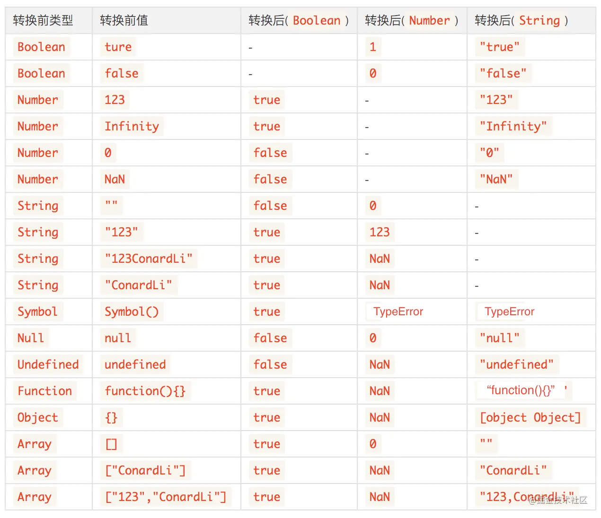
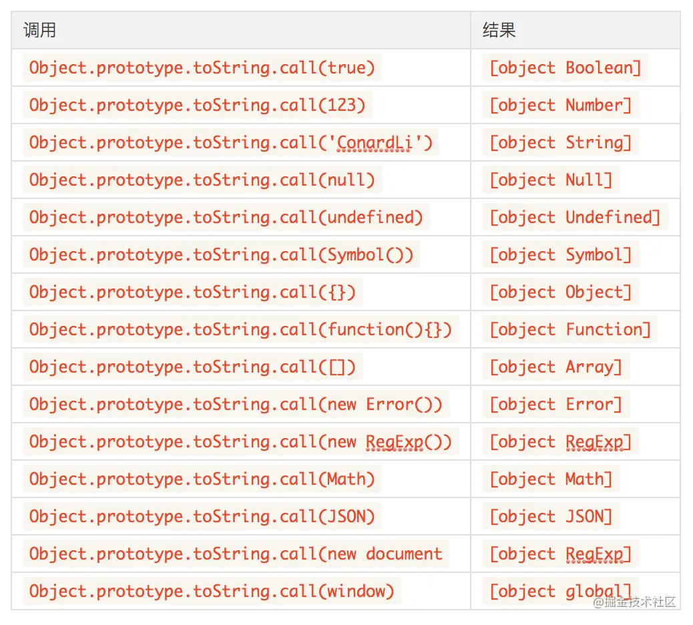

https://juejin.cn/post/6844903854882947080
#### 一、类型转换规则 ####

1. 转换为布尔值false的有：0，NaN，""，undefined，null
2. 转换为数值为0的有：false，""，null，[]（undefined转换为数值为NaN）
3. 转换为字符串为空串的有：[]

#### 二、if语句和逻辑语句 ####

- 在if语句和逻辑语句中，如果只有单个变量，会先将变量转换为Boolean值，只有下面几种情况会转换成false，其余被转换成true：

    - null，undefined，''，NaN，0，false

#### 三、各种运数学算符 ####

- 我们在对各种非Number类型运用数学运算符(- * /)时，会先将非Number类型转换为Number类型

		1 - true // 0             true=>1
		1 - null //  1            null=>0
		1 * undefined //  NaN     undefined=>NaN
		2 * ['5'] //  10          ['5']=>5

- 注意+是个例外，执行+操作符时：

  1. 只要有一侧为String类型，被识别为字符串拼接，并会优先将另一侧转换为字符串类型。
  2. 当一侧为Number类型，另一侧为除String之外的原始类型，则将原始类型转换为Number类型。
  3. 当一侧为Number类型，另一侧为引用类型，将引用类型和Number类型转换成字符串后拼接。

		123 + '123' // 123123   （规则1）
		123 + null  // 123    （规则2）
		123 + true // 124    （规则2）
		123 + {}  // 123[object Object]    （规则3）

#### 四、== ####

- 使用==时，若两侧类型相同，则比较结果和===相同，否则会发生隐式转换，使用==时发生的转换可以分为几种不同的情况（只考虑两侧类型不同）：

1. NaN

- NaN和其他任何类型比较永远返回false(包括和他自己)

2. Boolean

- Boolean和其他任何类型比较，Boolean首先被转换为Number类型

		true == 1  // true 
		true == '2'  // false
		true == ['1']  // true
		true == ['2']  // false

- 这里注意一个可能会弄混的点：undefined、null和Boolean比较，虽然undefined、null和false都很容易被想象成假值，但是他们比较结果是false，原因是false首先被转换成0：

		undefined == false // false
		null == false // false

3. String和Number

- String和Number比较，先将String转换为Number类型。

		123 == '123' // true
		'' == 0 // true

4. null == undefined比较结果是true，除此之外，null、undefined和其他任何结果的比较值都为false

		null == undefined // true
		null == '' // false
		null == 0 // false
		null == false // false
		undefined == '' // false
		undefined == 0 // false
		undefined == false // false

5. 原始类型和引用类型

- 当原始类型和引用类型做比较时，对象类型会依照ToPrimitive规则转换为原始类型:
- 对象的Symbol.toPrimitive属性，指向一个方法。该对象被转为原始类型的值时，会调用这个方法，返回该对象对应的原始类型值。

     - Symbol.toPrimitive被调用时，会接受一个字符串参数，表示当前运算的模式，一共有三种模式。

         - Number：该场合需要转成数值
         - String：该场合需要转成字符串
         - Default：该场合可以转成数值，也可以转成字符串

- 从引用类型到基本类型的转换，也就是拆箱的过程中，会遵循ECMAScript规范规定的toPrimitive原则，一般会调用引用类型的valueOf和toString方法，你也可以直接重写toPeimitive方法。一般转换成不同类型的值遵循的原则不同，例如：

    - 引用类型转换为Number类型，先调用valueOf，再调用toString
    - 引用类型转换为String类型，先调用toString，再调用valueOf
    - 若valueOf和toString都不存在，或者没有返回基本类型，则抛出TypeError异常。

- 来看看下面这个比较：

     [] == ![] // true

     !的优先级高于==，![]首先会被转换为false，然后根据上面第二点，false转换成Number类型0，左侧[]转换为0，两侧比较相等。

     [null] == false // true
     [undefined] == false // true

     根据数组的ToPrimitive规则，数组元素为null或undefined时，该元素被当做空字符串处理，所以[null]、[undefined]都会被转换为0。		

#### 五、一道有意思的面试题 ####

- 一道经典的面试题，如何让：a == 1 && a == 2 && a == 3。
- 根据上面的==的隐式转换，我们可以轻松写出答案：

		const a = {
		   value:[3,2,1],
		   valueOf: function () {return this.value.pop(); },
		} 

#### 六、判断JavaScript数据类型的方式 ####

1. typeof

- 适用场景

  - typeof操作符可以准确判断一个变量是否为下面几个原始类型：
		
        typeof 'ConardLi'  // string
		typeof 123  // number
		typeof true  // boolean
		typeof Symbol()  // symbol
		typeof undefined  // undefined

  - 你还可以用它来判断函数类型：
  
		typeof function(){}  // function

- 不适用场景

  - 当你用typeof来判断引用类型时似乎显得有些乏力了,除函数外所有的引用类型都会被判定为object:

		typeof [] // object
		typeof {} // object
		typeof new Date() // object
		typeof /^\d*$/; // object
     
    
  - 另外typeof null === 'object'也会让人感到头痛，这是在JavaScript初版就流传下来的bug，后面由于修改会造成大量的兼容问题就一直没有被修复...

2. instanceof

- instanceof操作符可以帮助我们判断引用类型具体是什么类型的对象：

		[] instanceof Array // true
		new Date() instanceof Date // true
		new RegExp() instanceof RegExp // true

- 我们先来回顾下原型链的几条规则：

	- 所有引用类型都具有对象特性，即可以自由扩展属性
	- 所有引用类型都具有一个__proto__（隐式原型）属性，是一个普通对象
	- 所有的函数都具有prototype（显式原型）属性，也是一个普通对象
	- 所有引用类型__proto__值指向它构造函数的prototype
	- 当试图得到一个对象的属性时，如果变量本身没有这个属性，则会去他的__proto__中去找

- [] instanceof Array实际上是判断Array.prototype是否在[]的原型链上。所以，使用instanceof来检测数据类型，不会很准确，这不是它设计的初衷：

		[] instanceof Object // true
		function(){}  instanceof Object // true

- 另外，使用instanceof也不能检测基本数据类型，所以instanceof并不是一个很好的选择。

3. toString

- 上面我们提到了toString函数，我们可以调用它实现从引用类型的转换。每一个引用类型都有toString方法，默认情况下，toString()方法被每个Object对象继承。如果此方法在自定义对象中未被覆盖，toString() 返回 "[object type]"，其中type是对象的类型。

		const obj = {};
		obj.toString() // [object Object]

- 注意，上面提到了如果此方法在自定义对象中未被覆盖，toString才会达到预想的效果，事实上，大部分引用类型比如Array、Date、RegExp等都重写了toString方法。

        let a = [1,2,3]
        a.toString() // 1,2,3

        let a = true
        a.toString() // true

- 我们可以直接调用Object原型上未被覆盖的toString()方法，使用call来改变this指向来达到我们想要的效果。

        Object.prototype.toString.call(true)        		[object Boolean]
		Object.prototype.toString.call(123)          		[object Number]
		Object.prototype.toString.call('sss')        		[object String]
		Object.prototype.toString.call(null)         		[object Null]
		Object.prototype.toString.call(undefined)    		[object Symbol]
		Object.prototype.toString.call(Symbol())     		[object Boolean]
		Object.prototype.toString.call({})                  [object Object]
		Object.prototype.toString.call(function fn(){})     [object Function]
		Object.prototype.toString.call([])    				[object Array]
		Object.prototype.toString.call(new Error)    		[object Error]
		Object.prototype.toString.call(new Regexp())    	[object Regexp]
		Object.prototype.toString.call(Math)    			[object Math]
		Object.prototype.toString.call(JSON)    			[object JSON]
		Object.prototype.toString.call(window)    			[object Window]

