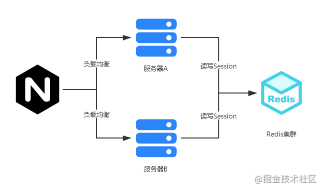
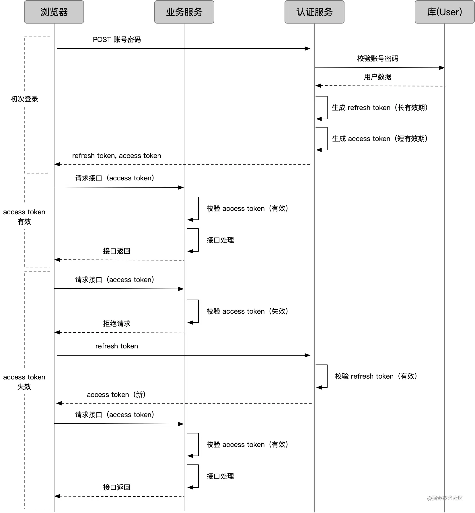
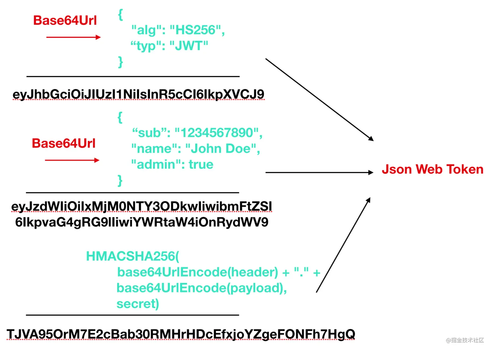

# 一、产生背景 #

- 由于http是无状态的，它不会去记录服务器和浏览器的会话信息，对它来说每一次请求都是一个新的请求。随着网络的发展，比如购物车功能就必须知道用户身份才能够执行接下来的一系列操作，所以就产生了cookie、session、token来帮助服务器来记住一些信息。

# 二、cookie #

1. 概念

- cookie是http头部的一个字段，它是由服务器产生的，是服务器发送到用户浏览器并保存在本地的一小块数据，它会在浏览器下次向同一服务器再发起请求时被携带并发送到服务器上
- cookie是存在当前访问服务器的浏览器中的，比如你使用的是chrome浏览器，cookie就会存在chrome浏览器中，如果此时你换成了Firefox等其他的浏览器，因为Cookie刚才是存储在Chrome里面的，所以服务器又蒙圈了，不知道你是谁，就会给Firefox再次发送一个cookie。

2. cookie识别用户身份过程：

   - 浏览器第一次访问服务端时，服务器此时肯定不知道他的身份，所以创建一个独特的身份标识数据，格式为key=value（比如：isLogin=true），放入到Set-Cookie字段里，随着响应报文发给浏览器。
   - 浏览器看到有Set-Cookie字段以后就知道这是服务器给的身份标识，于是就保存起来，下次请求时会自动将此key=value值放入到Cookie字段中发给服务端。
   - 服务端收到请求报文后，发现Cookie字段中有值，就能根据此值识别用户的身份然后提供个性化的服务。

3. cookie的缺点：

   - 用户本人可以通过修改document.cookie="isLogin = true"伪造登陆凭证
   - 如果将账户的一些信息都存入Cookie中的话，一旦信息被拦截，那么我们所有的账户信息都会丢失掉。
   - 能存储的数据量不能超过 4kb
   - 一个浏览器针对一个网站最多存 20 个Cookie，浏览器一般只允许存放 300 个Cookie
   - 移动端对 cookie 的支持不是很好，而 session 需要基于 cookie 实现，所以移动端常用的是 token

# 三、session #

1. 概念

- session 是另一种记录服务器和客户端会话状态的机制
- session 是基于 cookie 实现的，session 存储在服务器端，sessionId 会被存储到客户端的cookie 中

2. session认证流程：

     - 用户第一次请求服务器的时候，服务器根据用户提交的相关信息，开辟了一块 Session 空间（创建了Session对象），同时生成一个SessionId
     - 请求返回时将此 Session 的唯一标识信息 SessionId放入到Set-Cookie字段里，随着响应报文发给浏览器
     - 浏览器接收到服务器返回的 SessionId 信息后，会将此信息存入到 Cookie 中，同时 Cookie 记录此 SessionId 属于哪个域名
     - 当用户第二次访问服务器的时候，请求会自动判断此域名下是否存在 Cookie 信息，如果存在自动将 Cookie 信息也发送给服务端，服务端会从 Cookie 中获取 SessionId，再根据SessionId查找对应的Session信息，如果没有找到说明用户没有登录或者登录失效，如果找到 Session 证明用户已经登录可执行后面操作。

3. 有了 Cookie 为什么还要 Session

     - 使用 session 只需要在客户端保存一个 sessionId，实际上大量数据都是保存在服务端。如果全部用 cookie，数据量大的时候客户端是没有那么多空间的（ 单个 Cookie 保存的数据不能超过 4K，Session 可存储数据远高于 Cookie）。
     - 全部在客户端保存，服务端无法验证，这样伪造和仿冒会更加容易。（伪造一个随机的id很难，但伪造另一个用户名是很容易的）
     - cookie 只是实现 session 的其中一种方案。虽然是最常用的，但并不是唯一的方法。(禁用cookie后还有其他方法存储，比如放在url中,但放在url中涉及安全性和SEO的影响)
     - 全部保存在客户端，那么一旦被劫持，全部信息都会泄露
     - 客户端数据量变大，网络传输的数据量也会变大

4. session缺点

     - Session 机制有个缺点，比如 A 服务器存储了 Session，就是做了负载均衡后，假如一段时间内 A 的访问量激增，会转发到 B 进行访问，但是 B 服务器并没有存储 A 的 Session，会导致 Session 的失效。（解决方法：Nginx ip_hash 策略、Session 复制、共享 Session）
     - Session存储在服务器，大量的存储会给服务器带来压力

5. 如何考虑分布式 Session 问题？

      - 在互联网公司为了可以支撑更大的流量，后端往往需要多台服务器共同来支撑前端用户请求，那如果用户在 A 服务器登录了，第二次请求跑到服务 B 就会出现登录失效问题。

      - 分布式 Session 一般会有以下几种解决方案：

         - （1）session 复制

                - 采用 session 复制方案，整体的流程非常简单：假设现在有三台服务器，当一个 session 在其中一台服务器上被创建，则同时把这个 session 复制到其他两台服务器上。这样当用户的请求无论到达哪台服务器，都会有相应的 session 数据。
                - 这种方案的优势在于服务器可以任意水平扩展，每个服务器都保留着所有的 session 信息，当加入一台服务器只需要把所有的 session 信息复制过去即可。
                - 但是劣势更加明显
                     - 每个服务器上都保存着全部的 session 信息，服务器占用的资源大大增加。
                     - session 同步需要占用网络带宽，最重要的是如果采用的异步复制方式，数据会有短暂性的不一致，可能会导致用户访问失败。

         - （2）Nginx ip_hash 策略
         
               - nginx 可以根据“hash_ip”算法将同一个 IP 的请求固定到某台服务器，这样来自于同一个 ip 的 session 请求总是请求到同样的服务器。
               - 这种方式比 session 同步方式要好很多，每台服务器只存储对应的 session 数据，这大大节省了内存资源，而且服务器之间没有数据同步过程。当有新服务器加入的时候，只需要修改负载均衡器的配置即可，这样很方便就支持了服务器水平扩展。
               - 但是，同时也面临着一些不足

                     - 服务器重启意味着对应的 session 信息丢失，这在一些重要的业务场景中是不允许的
                     - 服务器的水平扩展需要修改负载均衡器的配置，修改之后可能会导致之前的 session 重新分布，这样会导致一部分用户路由不到正确的 session

        - （3）共享 Session

               - 现在应用更广泛的分布式 session 技术是把 session 数据彻底从业务服务器中剥离，单独存储在其他外部设备中，而这些外部设备可以采用主备或者主从，甚至集群的模式来达到高可用。比如现在最常用的方案是把 session 数据存储在 redis 中，虽然从 redis 读写 session 数据需要花费一定的网络耗时，但是对于一般的应用来说在可以接受范围之内。
               - 这种方案好处是整体架构更加清晰，也更加灵活，应用的服务器整体扩展能力再也不用考虑 session 的影响，而 session 的问题被转移到外部设备，通常可以利用内存性 NOSql 来解决性能问题，而这些外部设备一般都会有对应的分布式集群方案，例如 redis，可以利用主从或者哨兵模式甚至集群来提供更大规模的数据支撑能力。

               

6. 禁用cookies，如何使用session

     - 如果禁用了 Cookies，服务器仍会将 sessionId 以 cookie 的方式发送给浏览器，但是，浏览器不再保存这个cookie (即sessionId) 了。
     - 如果想要继续使用 session，需要采用 URL 重写 的方式来实现

# 四、Cookie 和 Session 的区别 #

- 安全性： Session 比 Cookie 安全，Session 是存储在服务器端的，Cookie 是存储在客户端的。
- 存取值的类型不同：Cookie 只支持存字符串数据，想要设置其他类型的数据，需要将其转换成字符串，Session 可以存任意数据类型。
- 有效期不同： Cookie 可设置为长时间保持，比如我们经常使用的默认登录功能，Session 一般失效时间较短，session在超过一定的操作时间(通常为30分钟)后会失效，但是当关闭浏览器时，为了保护用户信息，会自动调用session.invalidate()方法，该方法会清除掉session中的信息。
- 存储大小不同： 单个 Cookie 保存的数据不能超过 4K，Session 可存储数据远高于 Cookie，但是当访问量过多，会占用过多的服务器资源。

# 五、token #

1. 概念

- Token是在服务端将用户信息以及用户信息经过算法生成的签名传给在客户端，每次用户请求的时候都会带上这一段信息，因此服务端拿到此信息通过验证签名判断该请求的合法性。
- 基于token的鉴权机制类似于http协议也是无状态的，它不需要在服务端去保留用户的认证信息或者会话信息。这就意味着基于token认证机制的应用不需要去考虑用户在哪一台服务器登录了，这就为应用的扩展提供了便利。

2. token认证流程：

     - 客户端使用用户名跟密码请求登录
     - 服务端收到请求，去验证用户名与密码
     - 验证成功后，服务端会签发一个 token 并把这个 token 发送给客户端
     - 客户端收到 token 以后，会把它存储起来，比如放在 cookie 里或者 localStorage 里
     - 客户端每次向服务端请求资源的时候需要带着服务端签发的 token
     - 服务端收到请求，然后去验证客户端请求里面带着的 token（使用相同加密算法加密，将结果和token中的签名对比） ，如果验证成功，就向客户端返回请求的数据

3. token 的过期

   - 那我们如何控制 token 的有效期呢？很简单，把「过期时间」和数据一起塞进去，验证时判断就好

4. token优点

    - 基于 token 的用户认证是一种服务端无状态的认证方式，服务端不用存放 token 数据。用解析 token 的计算时间换取 session 的存储空间，从而减轻服务器的压力，减少频繁的查询数据库
    - token 完全由应用管理，所以它可以避开同源策略

5. access token和refresh token

    - token，作为权限守护者，最重要的就是「安全」。业务接口用来鉴权的 token，我们称之为 access token。越是权限敏感的业务，我们越希望 access token 有效期足够短，以避免被盗用。但过短的有效期会造成 access token 经常过期，过期后怎么办呢？

        - 一种办法是，让用户重新登录获取新 token，显然不够友好，要知道有的 access token 过期时间可能只有几分钟。
        - 另外一种办法是，再来一个 token，一个专门生成 access token 的 token，我们称为 refresh token。

            - access token 用来访问业务接口，由于有效期足够短，盗用风险小，也可以使请求方式更宽松灵活
            - refresh token 用来获取 access token，有效期可以长一些，通过独立服务和严格的请求方式增加安全性；由于不常验证，也可以如前面的 session 一样处理

        - 有了 refresh token 后，几种情况的请求流程变成这样：

          

# 六、JWT #

1. 概念

- JSON Web Token (JWT) 是一个开放标准，定义了一种传递 JSON 信息的方式。这些信息通过数字签名确保可信。它是一种成熟的 token 字符串生成方案,相当于规定了怎样定义一个token

2. JWT由三部分组成：头部、负载和签名

     - Header

         - Header通常由两部分组成：token的类型(即 JWT)和使用的签名算法，例如 HMAC SHA256 或 RSA。
         
			例如：{

				  "alg": "HS256",
				  "typ": "JWT"
				 }

        - 指定类型和签名算法后，Json 块被 Base64Url 编码形成 JWT 的第一部分。

    - Payload
    
        - 负载是Token要存储的信息（比如存储用户姓名和昵称信息）
        - JWT 规定了7个官方字段，供选用。
        
            - iss (issuer)：签发人
            - exp (expiration time)：过期时间
            - sub (subject)：主题
            - aud (audience)：受众
            - nbf (Not Before)：生效时间
            - iat (Issued At)：签发时间
            - jti (JWT ID)：编号
 
       - 除了官方字段，你还可以在这个部分定义私有字段，下面就是一个例子。

			例如：{
	
				  "name": "John Doe",
				  "admin": true
				}
        - 然后 payload Json 块会被Base64Url 编码形成 JWT 的第二部分。

    - signature

       - JWT 的第三部分是一个签证信息，这个签证信息由三部分组成
       
         - header (base64后的)
         - payload (base64后的)
         - secret（密钥）

       - 首先，需要指定一个密钥（secret）。这个密钥只有服务器才知道，不能泄露给用户。然后，使用 Header 里面指定的签名算法（默认是 HMAC SHA256），按照下面的公式产生签名形成JWT的第三部分

			HMACSHA256(
			  base64UrlEncode(header) + "." +
			  base64UrlEncode(payload),
			  secret)

    - 最后将这三部分用.号连接，就可以得到了一个Token了。
    

3. JWT 的几个特点：

    - JWT 默认是不加密，但也是可以加密的。生成原始 Token 以后，可以用密钥再加密一次。
    - JWT 不加密的情况下，不能将秘密数据写入 JWT。
    - JWT 不仅可以用于认证，也可以用于交换信息。有效使用 JWT，可以降低服务器查询数据库的次数。
    - JWT 的最大缺点是，由于服务器不保存 session 状态，因此无法在使用过程中废止某个 token，或者更改 token 的权限。也就是说，一旦 JWT 签发了，在到期之前就会始终有效，除非服务器部署额外的逻辑。
    - JWT 本身包含了认证信息，一旦泄露，任何人都可以获得该令牌的所有权限。为了减少盗用，JWT 的有效期应该设置得比较短。对于一些比较重要的权限，使用时应该再次对用户进行认证。
    - 为了减少盗用，JWT 不应该使用 HTTP 协议明码传输，要使用 HTTPS 协议传输。

# 七、session和token #

     - session 是「种在 cookie 上、数据存在服务端」的认证方案，token 是「客户端存哪都行、数据存在 token 里」的认证方案。
     - token保存在客户端，在分布式环境下不需要做额外工作。而session因为保存在服务端，分布式环境下需要实现多机数据共享
     - session一般需要结合Cookie实现认证，所以需要浏览器支持cookie，因此移动端无法使用session认证方案
     - JWT的payload使用的是base64编码的，因此在JWT中不能存储敏感数据。而session的信息是存在服务端的，相对来说更安全
     - 经过编码之后JWT将非常长，cookie的限制大小一般是4k，cookie很可能放不下，所以JWT一般放在local storage里面。并且用户在系统中的每一次http请求都会把JWT携带在Header里面，HTTP请求的Header可能比Body还要大。而sessionId只是很短的一个字符串，因此使用token的HTTP请求比使用session的开销大得多
     - session 是一种记录服务器和客户端会话状态的机制，使服务端有状态化，可以记录会话信息。而 token 是令牌，访问资源接口（API）时所需要的资源凭证。token 使服务端无状态化，不会存储会话信息。
     - session 和 Token 并不矛盾，作为身份认证 token 安全性比 session 好，因为每一个请求都有签名还能防止监听以及重放攻击，而 session 就必须依赖链路层来保障通讯安全了。如果你需要实现有状态的会话，仍然可以增加 session 来在服务器端保存一些状态。

 
