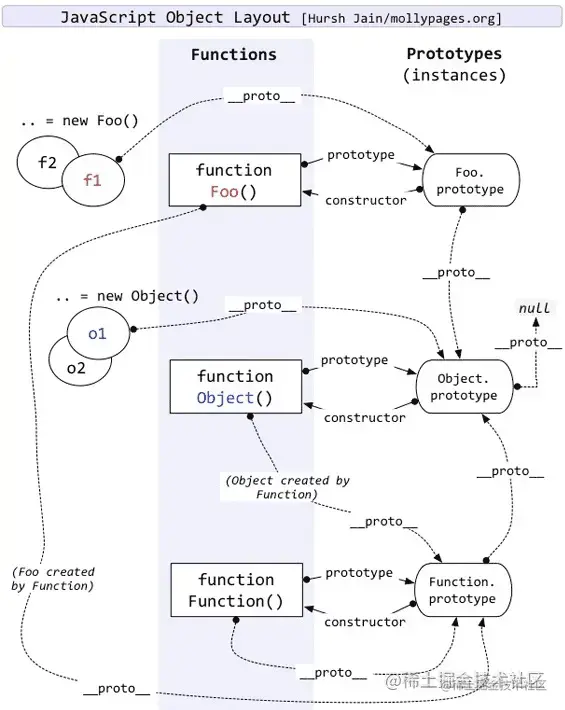

## 一、重要概念理解 ##
#### 1、原型（原型对象）

- **在`js`中，每一个函数对象都有一个特殊的属性叫做原型（`prototype`），它指向另一个对象，这个对象被称为原型对象，原型对象是用来共享属性和方法的**

- **原型对象有一个`constructor`属性指向构造函数本身**

- **原型对象是一个普通的对象，它包含属性和方法**

- **原型对象的属性和方法会被继承到所有通过原型链与它相连的对象**
  

#### 2、`js`分为函数对象和普通对象：

   - 函数对象：**像`Object`、`Function`都是`js`内置的函数，但函数也是对象，所以它们既是函数又是对象，类似的还有我们常用到的Array、`RegExp`、`Date`、`Boolean`、`Number`、`String`。**
   
   - **每一个`JavaScript`函数实际上都是一个`Function`对象**

3、**无论什么时候，只要创建了一个新函数，就会根据一组特定的规则为该函数创建一个`prototype`属性，这个属性指向函数的原型对象。所以`js`中的每个函数都有一个`prototype`属性**

4、**在默认情况下，所有的原型对象都会自动获得一个`constructor`属性，指向创建实例的构造函数。注意，不是所有对象都有`constructor`属性，而是原型对象才会有`constructor`属性。**

5、**每个对象包含一个内部指针`[[Prototype]]`。虽然在脚本中没有标准的方式访问`[[Prototype]]`，但`Firefix`、`Safai`和`Chrome`在每个对象上都支持一个属性`__proto__`，指向生成该实例的构造函数的原型对象。`__proto__`存在的意义在于为原型链查找提供方向，原型链查找靠的是`__proto__`，而不是`prototype`**

6、关于内部指针`[[Prototype]]`，虽然在所有实现中都无法访问到`[[Prototype]]`，但是可以通过`isPrototypeOf()`方法来确定对象之间是都存在这种关系。**从本质上讲，如果`[[Prototype]]`指向调用`isPrototypeOf()`方法的对象（`Person.prototype`），那么这个方法就返回`true`**，如下所示：

```
console.log(Person.prototype.isPrototypeOf(person1)) //true
console.log(Person.prototype.isPrototypeOf(person2)) //true
```

   - 这里我们用原型对象的`isPrototypeOf()`方法测试了`person1`和`person2`。因为它们内部都有一个指向`Person.prototype`的指针，因此都返回了`true`。

   - **`Object.prototype.isPrototypeOf(obj)` 方法用于判断当前对象(调用该方法的对象)是否在另一个对象的原型链中。也就是说，如果一个对象出现在另一个对象的原型链上，则返回 `true`；否则返回 `false`。**

     ```
     function Person(name) {
         this.name = name;
     }
      
     function Student(name, grade) {
         Person.call(this, name); // 继承Person
         this.grade = grade;
     }
     Student.prototype = Object.create(Person.prototype); // 设置Student的原型为Person的实例
      
     const student1 = new Student('Bob', 'A');
      
     console.log(Person.prototype.isPrototypeOf(student1)); // 输出：true
     console.log(Object.prototype.isPrototypeOf(student1)); // 输出：true，因为所有对象都继承自Object.prototype
     ```

- 在这个例子中，`Person.prototype.isPrototypeOf(student1)` 返回 `true`，因为 `student1` 的原型链中包含 `Person.prototype`。而 `Object.prototype.isPrototypeOf(student1)` 也返回 `true`，因为所有对象都继承自 `Object.prototype`。

7、**`ECMAScript5`增加了一个新方法，叫`Object.getPrototypeOf()`，方法用于获取一个对象的原型（即内部属性 `[[Prototype]]` 的值）。这个方法返回一个对象，它代表了指定对象的原型。例如：**

```
console.log(Object.getPrototypeOf(person1) === Person.prototype) //true
console.log(Object.getPrototypeOf(person1).name) //'Nicholas'
```

   - 上例中的第一行代码，**确定`Object.getPrototypeOf()`返回的对象实际就是这个对象的原型**

   - 第二行代码取得了原型对象中`name`属性的值，也就是`'Nicholas'`

   - **使用`Object.getPrototypeOf()`可以方便地取得一个对象的原型**

## 二、原型链神图理解 ##

 

```
function Foo().prototype = Foo.prototype  //Foo构造函数的prototype属性指向Foo的原型对象

Foo.prototype.constructor = function Foo() //Foo的原型对象指向Foo构造函数

function Foo().__proto__ = Function.prototype //构造函数对象都是Function的实例。所以Object的内部指针指向Object构造函数的原型对象。

Foo.prototype.__proto__ = Object.prototype  //所有对象都是Object构造函数的实例，所以实例的内部指针指向生成自己的构造函数的原型对象。

Object.prototype.__proto__ = null // 原型链到此为止

Object.prototype.constructor = function Object() //Object的原型对象指向**Object构造函数**

function Object().prototype = Object.prototype //Object构造函数的prototype属性指向Object的原型对象

function Object().__proto__ = Function.prototype //前面说过Object既是函数又是对象，这里作为对象，由Function构造函数生成的。也就是说构造函数对象都是Function的实例。所以Object的内部指针指向Object构造函数的原型对象。

Function.prototype.constructor = function Function() //Function的原型对象指向Function构造函数（和上面Object的原型对象指向Object构造函数一个道理
）

function Function().prototype = Function.prototype //Function构造函数的prototype属性指向Function的原型对象

function Function().__proto__ = Function.prototype /// Function也既是函数又是对象，这里作为对象。又因为所有构造函数对象都是Function的实例，所以Function的内部指针指向Function构造函数的原型对象。


Function.prototype.__proto__ = Object.prototype // Function.prototype是一个对象，所有对象都是Object构造函数的实例，所以Function的内部指针指向Object的原型对象。

- Object是所有对象的祖先，所有对象都可以通过__proto__找到它

- Function是所有函数的祖先，所有函数都可以__proto__找到它

- 对象由函数创建，函数都是Function对象实例
```


## 三、Object和Function的鸡和蛋的问题 ##

#### 1.先要了解清楚`Function.prototype`和`Object`构造函数

- **`Function.prototype`整体是个不同于一般函数（对象）的函数（对象）**

- **`Function.prototype`整体像普通函数一样可以调用，但总是返回`undefined`。**

    ```
    console.log(Function.prototype()) //undefined
    ```

- **普通函数实际上是`Function`的实例，即普通函数继承于`Function.prototype`。`func.__proto__ === Function.prototype`。**

- **`Function.prototype`函数（对象）整体继承于`Object.prototype`，并且没有`prototype`这个属性，`Function.prototype.prototype`是`null`。**

- **所以，`Function.prototype`其实是个另类的函数，可以独立于/先于`Function`产生**

- **`Object`本身是个（构造）函数，是Function的实例，即`Object.__proto__`就是`Function.prototype`。**

#### 2.第一问

    Function.__proto__ === Function.prototype;

  - `Function`对象是不是由`Function`构造函数创建的实例？
- **`Function` 是 `built-in` 的对象，也就是并不存在“`Function`对象由`Function`构造函数创建”这样显然会造成鸡生蛋蛋生鸡的问题。实际上，当你直接写一个函数时（如` function f() {}` 或 `x => x`），也不存在调用 `Function` 构造器，只有在显式调用 `Function` 构 造器时（如 `new Function('x', 'return x') `）才有。**
    
- **个人偏向先有的`Function.prototype`，再有的`function Function`，所有构造函数本质上都是集成于`Function.prototype`，所以`Function.__proto__ === Function.prototype`。**

#### 3.第二问

- 为什么`Function instanceof Object`为`true`，`Object instanceof Function`也为`true`，那么他们到底是什么关系？

    ```
    // Function.__proto__、Function.prototype指向同一个对象，Function.prototype.__proto__指向Object.prototype
// Function.__proto__ => Function.prototype.__proto__ => Object.prototype => Object.prototype.__proto__ => null
    
Function instanceof Object; // true
    
    // Object作为构造函数继承自Function.prototype
// Object.__proto__ => Function.prototype
    
    Object instanceof Function; // true
    
    // Object作为构造函数继承自Function.prototype，Function.prototype__proto__指向Object.prototype
    // Object.__proto__ => Function.prototype => Function.prototype.__proto__ => Object.prototype
    
    Object instanceof Object; // true
    
    // Function构造函数也是继承自Function.prototype
    // Function.__proto__ => Function.prototype
    
    Function instanceof Function; // true
    ```

- 总结一下：**先有 `Object.prototype`（原型链顶端），`Function.prototype `继承 `Object.prototype` 而产生，最后，`Function` 和 `Object `和其它构造函数继承 `Function.prototype` 而产生。**

**4.总结**

（1）**`Object.prototype`是浏览器底层根据` ECMAScript` 规范创造的一个对象。**

（2）**`Function.prototype`直接继承的`Object.prototype`，同样它也是由是引擎创建出来的函数，引擎认为不需要给这个函数对象添加 prototype 属性。**

（3）**`Function.prototype.prototype`为`undefined`。**

（4）**先有 `Object.prototype`（原型链顶端），`Function.prototype` 继承 `Object.prototype` 而产生，最后，Function 和 Object 和其它构造函数继承 `Function.prototype` 而产生。**


