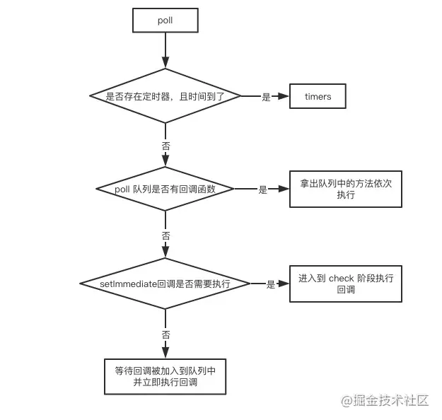

#### 一、浏览器事件循环 ####

1. 事件循环概念

- js分为同步任务和异步任务，同步任务都在主线程上执行形成一个执行栈，主线程之外存在一个回调队列
- 同步任务在执行的时候会调用浏览器的API，此时会产生一些异步任务
- 异步任务会在有了结果（比如被监听的事件发生时）后，将异步任务以及关联的回调函数放入回调队列中。
- 一旦执行栈中的所有同步任务执行完毕(此时js引擎空闲)，系统就会读取任务列队，将可运行的异步任务添加到可执行栈，开始执行
- 上述过程会不断重复，这就是 JavaScript 的运行机制，称为事件循环机制（Event Loop）。

- 回调队列可分为宏任务和微任务

2. async/await

- async 函数会返回一个 Promise 对象，如果在函数中 return 一个直接量（普通变量），async 会把这个直接量通过 Promise.resolve() 封装成 Promise 对象。如果你返回了promise那就以你返回的promise为准。
- await 是在等待，等待运行的结果也就是返回值。await后面通常是一个异步操作（promise），但是这不代表 await 后面只能跟异步操作 await 后面实际是可以接普通函数调用或者常量的。

   - 如果不是 promise , await会阻塞后面的代码，先执行async外面的同步代码，同步代码执行完，再回到async内部，把这个非promise的东西，作为 await表达式的结果
   - 如果它等到的是一个 promise 对象，await 也会暂停async后面的代码，先执行async外面的同步代码，等着 Promise 对象 fulfilled，然后把 resolve 的参数作为 await 表达式的运算结果。

			async function async1(){
			    await async2()
			    console.log('async1 end')
			} 
			
			  function async2(){
			    console.log('async2 end')
			}
			  async1()
			
			setTimeout(()=>{
			   console.log('setTimeout')
			},0)
			
			new Promise(reslove=>{
			    reslove()
			}).then(()=>{
			    console.log('promise')
			})
	
				async2 end
				async1 end
				promise
				setTimeout

 - 上面代码中，调用async1函数，里边await后面跟着async2函数，所以执行async2函数输出async2 end，async2是一个同步函数，所以await后面的语句相当于在.then函数里边，所以会被注册成微任务，继续执行遇到setTimeout加入宏任务队列，遇到Promise.then是微任务，加入微任务列队，第一个宏任务执行完，执行微任务队列的微任务，输出async1 end，promise，执行第二个宏任务输出setTimeout

 - 将上面async2函数改一下

		 async function async1(){
		    await async2()
		    console.log('async1 end')
		} 
		
		async function async2(){
		    console.log('async2 end')
		    return new Promise(reslove=>{
		        reslove()
		    }).then((res)=>{
		        console.log('async2.then end')
		    })
		}
		async1()
		
		setTimeout(()=>{
		   console.log('setTimeout')
		},0)
		
		new Promise(reslove=>{
		    reslove()
		}).then(()=>{
		    console.log('promise')
		})

		async2 end
		async2.then end
		promise
		async1 end
		setTimeout

- 输出变了，async1 end在promise之后了，这是因为await后面的函数返回一个promise，那么

	     await async2
	     console.log(async1 end)
	
	     相当于
	      new Promise(reslove=>{
			    reslove()
			 }).then((res)=>{
			    console.log('async2.then end')
			 }).then(()=>{
	            console.log('async1.then end')
	         })

- 所以是输出async2.then end的then函数先被注册为微任务，然后是下面的promise.then被注册微任务，执行async2.then end的then函数是又产生了一个输出async1 end的then函数微任务，添加到promis后面，所以async1 end在promise之后了
     

#### 二、node事件循环 ####

1. 阶段概述

   - 定时器检测阶段(timers)：本阶段执行 timer 的回调，即 setTimeout、setInterval 里面的回调函数。
   - I/O事件回调阶段(I/O callbacks)：执行延迟到下一个循环迭代的 I/O 回调，即上一轮循环中未被执行的一些I/O回调。比如网络通信的错误回调
   - 闲置阶段(idle, prepare)：仅系统内部使用。
   - 轮询阶段(poll)：检索新的 I/O 事件;执行与 I/O 相关的回调（几乎所有情况下，除了关闭的回调函数，那些由计时器和 setImmediate() 调度的之外），其余情况 node 将在适当的时候在此阻塞。
   - 检查阶段(check)：setImmediate() 回调函数在这里执行
   - 关闭事件回调阶段(close callback)：一些关闭的回调函数，如：socket.on('close', ...)。

- 输入数据阶段(incoming data)->轮询阶段(poll)->检查阶段(check)->关闭事件回调阶段(close callback)->定时器检测阶段(timers)->I/O事件回调阶段(I/O callbacks)->闲置阶段(idle, prepare)->轮询阶段...
- 通常情况下，当事件循环进入给定的阶段时，它将执行特定于该阶段的任何操作，然后执行该阶段队列中的回调，**直到队列用尽或最大回调数已执行**。当该队列已用尽或达到回调限制，执行该阶段产生的微任务，然后事件循环移动到下一阶段。【node11版本之前】

2. 三大重点阶段

- （1）timer
    - timers 阶段会执行 setTimeout 和 setInterval 回调，并且是由 poll 阶段控制的。 同样，在 Node 中定时器指定的时间也不是准确时间，只能是尽快执行。

- （2）poll
   

    - 进入poll阶段会先去看当前是否存在到时间的定时器，如果存在则进入timer阶段执行timer队列
    - 如果没有定时器, 会去看回调函数队列。

       - 如果 poll 队列不为空，会遍历回调队列并同步执行，直到队列为空或者达到系统限制
       - 如果 poll 队列为空时，会有两件事发生

         - 如果有 setImmediate 回调需要执行，poll 阶段会停止并且进入到 check 阶段执行回调
         - 如果没有 setImmediate 回调需要执行，会等待回调被加入到队列中并立即执行回调，这里同样会有个超时时间设置防止一直等待下去,一段时间后自动进入 check 阶段。

- （3）check 
   - check阶段。这是一个比较简单的阶段，直接执行 setImmdiate 的回调。

3. process.nextTick

- process.nextTick 是一个独立于 eventLoop 的任务队列。
- 在每一个 eventLoop 阶段完成后会去检查 nextTick 队列，如果里面有任务，会让这部分任务优先于微任务执行。

		setImmediate(() => {
		    console.log('timeout1')
		    Promise.resolve().then(() => console.log('promise resolve'))
		    process.nextTick(() => console.log('next tick1'))
		});
		setImmediate(() => {
		    console.log('timeout2')
		    process.nextTick(() => console.log('next tick2'))
		});
		setImmediate(() => console.log('timeout3'));
		setImmediate(() => console.log('timeout4'));

    - 在 node11 之前，因为每一个 eventLoop 阶段完成后会去检查 nextTick 队列，如果里面有任务，会让这部分任务优先于微任务执行，因此上述代码是先进入 check 阶段，执行所有 setImmediate，完成之后执行 nextTick 队列，最后执行微任务队列，因此输出为timeout1=>timeout2=>timeout3=>timeout4=>next tick1=>next tick2=>promise resolve
    - 在 node11 之后，process.nextTick 是微任务的一种,因此上述代码是先进入 check 阶段，执行一个 setImmediate 宏任务，然后执行其微任务队列，再执行下一个宏任务及其微任务,因此输出为timeout1=>next tick1=>promise resolve=>timeout2=>next tick2=>timeout3=>timeout

4. node版本差异

    - node11版本之前：当事件循环进入给定的阶段时，它将执行特定于该阶段的任何操作，然后执行该阶段队列中的回调，**直到队列用尽或最大回调数已执行**。当该队列已用尽或达到回调限制，执行该阶段产生的微任务，然后事件循环移动到下一阶段。
    - node11版本之后：一旦执行一个阶段里的一个宏任务(setTimeout,setInterval和setImmediate)就立刻执行对应的微任务队列

		setTimeout(()=>{
		    console.log('timer1')
		    Promise.resolve().then(function() {
		        console.log('promise1')
		    })
		}, 0)
		setTimeout(()=>{
		    console.log('timer2')
		    Promise.resolve().then(function() {
		        console.log('promise2')
		    })
		}, 0)
		
		
        - 如果是 node11 版本一旦执行一个阶段里的一个宏任务(setTimeout,setInterval和setImmediate)就立刻执行微任务队列，这就跟浏览器端运行一致，最后的结果为timer1=>promise1=>timer2=>promise2
        - 如果是 node10 及其之前版本要看第一个定时器执行完，第二个定时器是否在完成队列中.
        
           - 如果是第二个定时器还未在完成队列中，最后的结果为timer1=>promise1=>timer2=>promise2
           - 如果是第二个定时器已经在完成队列中，则最后的结果为timer1=>timer2=>promise1=>promise2
