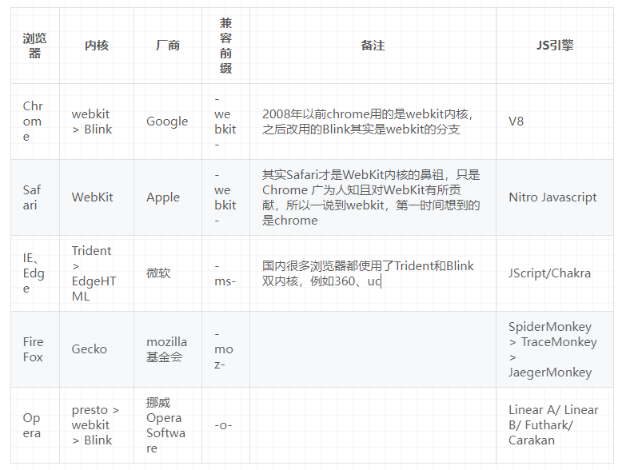

- https://blog.csdn.net/Liu_yunzhao/article/details/91550704
#### 一、浏览器的主要组成 ####

1.**用户界面**－包括地址栏、后退/前进按钮、书签目录等，也就是你所看到的除了用来显示你所请求页面的主窗口之外的其他部分

2.**浏览器引擎**－用来查询及操作渲染引擎的接口

3.**渲染引擎**－用来显示请求的内容，例如，如果请求内容为html，它负责解析html及css，并将解析后的结果显示出来

4.**网络**－用来完成网络调用，例如http请求，它具有平台无关的接口，可以在不同平台上工作

5.**UI 后端**－用来绘制类似组合选择框及对话框等基本组件，提供与平台无关的通用接口，底层使用操作系统的用户接口

6.**JS解释器（又称JavaScript引擎）**－用来解释执行JS代码

7.**数据存储**－属于持久层，浏览器需要在硬盘中保存类似cookie的各种数据，HTML5定义了web database技术，这是一种轻量级完整的客户端存储技术

#### 二、浏览器主要的功能 ####

- 浏览器的主要功能是将用户选择的web资源呈现出来，它需要从服务器请求资源，并将其显示在浏览器窗口中，资源的格式通常是HTML，也包括PDF、image及其他格式。用户用URI来指定所请求资源的位置。

#### 三、从输入 URL 到页面加载完成，发生了什么？####

- **浏览器中tab外面发生的一切都是由浏览器主进程控制的，浏览器主进程由很多负责不同工作的线程，其中包括：**

   （1）**UI线程**：绘制浏览器顶部按钮和导航栏输入框等组件，当你在导航栏里面输入一个URL的时候，其实就是UI线程在处理你的输入。

   （2）**存储线程**：控制文件读写。

**1.详细过程**

 （1）**处理输入**

      - 当用户开始在导航栏上面输入内容的时候，**这一步起作用的是浏览器主进程中的UI线程，它会去判断你输入的内容是普通的搜索内容还是一个网络地址。**

      - 因为对于Chrome浏览器来说，导航栏的输入既可能是一个可以直接请求的域名，也可能是用户想在搜索引擎里面搜索的关键词信息。

      - **如果是普通内容，则会直接跳转到对应的默认搜索引擎，例如直接跳转到百度搜索的结果页面。**

      - **如果输入的是网络地址则会通过IPC通信将信息传送给网络进程**，并且控制tab上面的图标进入loading状态，表示正在加载资源【也可以认为loading状态定停止时表示资源全部请求完成了】。

 （2）**DNS 解析（网络进程）**

 （3）**TCP 连接（网络进程）**

 （4）**HTTP 请求抛出（网络进程）**

 （5）**服务端处理请求，HTTP 响应返回**

 （6）**读取响应**

   - **tips: 如果网络进程收到服务器的HTTP 301重定向响应，它就会告知UI线程进行重定向然后它会再次发起一个新的网络请求。**

   - **响应类型判断**

     - 网络进程在收到HTTP响应的主体时，在必要的情况下它会先检查一下流的前几个字节以确定响应主体的具体媒体类型（MIME Type）。

     - 响应主体的媒体类型一般可以通过HTTP头部的Content-Type来确定，不过Content-Type有时候会缺失或者是错误的，这种情况下浏览器就要进行MIME类型嗅探来确定响应类型了。MIME类型嗅探并不是一件容易的事情，你可以从Chrome的源代码的注释来了解不同浏览器是如何根据不同的Content-Type来判断出主体具体是属于哪个媒体类型的。
 
   - **不同响应类型的处理**

     - 如果响应的主体是一个HTML文件，浏览器会将获取的响应数据交给渲染进程（renderer process）来进行下一步的工作。

     - 如果拿到的响应数据是一个压缩文件（zip file）或者其他类型的文件，响应数据就会交给下载管理器（download manager）来处理。

   - **安全检查**

     - 网络进程在把内容交给渲染进程之前还会对内容做SafeBrowsing检查。

     - 如果请求的域名或者响应的内容和某个已知的病毒网站相匹配，网络进程会给用户展示一个警告的页面。除此之外，网络进程还会做CORB（Cross Origin Read Blocking）检查来确定那些敏感的跨站数据不会被发送至渲染进程。

  （7）**寻找一个渲染进程来绘制页面**

    - 在**网络进程**做完所有的检查后并且能够确定浏览器应该导航到该请求的站点，它就会告诉**UI线程**所有的数据都已经被准备好了。

    - UI线程在收到网络进程的确认后会为这个网站寻找一个渲染进程（renderer process）来渲染界面。

    - **tips. 这里chrome有个小优化**

       - 因为网络请求的耗时可能会很长, 所以第二步中当UI线程发送URL链接给网络进程后，它其实已经知晓它们要被导航到哪个站点了。

       - 所以在网络进程干活的时候，UI线程会主动地为这个网络请求启动一个渲染线程。如果一切顺利的话（没有重定向之类的东西出现），网络进程准备好数据后页面的渲染进程已经就准备好了，这就节省了新建渲染进程的时间。

       - 不过如果发生诸如网站被重定向到不同站点的情况，刚刚那个渲染进程就不能被使用了，它会被摒弃，一个新的渲染进程会被启动。

   （8）**与渲染器进程【Render Process】进行通信**

     - 到这一步的时候，数据和渲染进程都已经准备好了，浏览器进程（browser process）会通过IPC告诉渲染进程去提交本次导航（commit navigation）。

     - 除此之外浏览器进程还会将刚刚接收到的响应数据流传递给对应的渲染进程让它继续接收到来的HTML数据。

     - **一旦浏览器进程收到渲染进程的回复说导航已经被提交了（commit），导航这个过程就结束了，文档的加载阶段（document loading phase）会正式开始。**

     - 到了这个时候，导航栏会被更新，安全指示符和站点设置会展示新页面相关的站点信息。

     - 当前tab的会话历史（session history）也会被更新，这样当你点击浏览器的前进和后退按钮也可以导航到刚刚导航完的页面。为了方便你在关闭了tab或窗口（window）的时候还可以恢复当前tab和会话（session）内容，当前的会话历史会被保存在磁盘上面。

   （9）**浏览器渲染流程开始，解析响应内容，把解析的结果展示给用户**

     - 当导航提交完成后，渲染进程开始着手加载资源以及渲染页面。

     - 一旦渲染进程完成渲染（load），它会通过IPC告知浏览器进程，然后UI线程就会停止导航栏上旋转的圈圈。

**2.导航到不同的站点**

  （1）上述一个最简单的导航情景已经描述完毕了，可是如果这时**用户在导航栏上输入一个不一样的URL**会发生什么呢？

    - 如果是这样，浏览器进程会重新执行一遍之前的那几个步骤来完成新站点的导航。不过在浏览器进程做这些事情之前，它需要让当前的渲染页面做一些收尾工作，具体就是询问一下当前的渲染进程需不需要处理一下beforeunload事件。

    - beforeunload可以在用户重新导航或者关闭当前tab时给用户展示一个'你确定要离开当前页面吗？'的二次确认弹框。

    - **浏览器进程之所以要在重新导航的时候和当前渲染进程确认的原因时，当前页面发生的一切（包括页面的JavaScript执行）是不受它控制而是受渲染进程控制而是受渲染进程控制，它不知道里面的具体情况。**

    - 注意：不要随便给页面添加beforeunload事件监听，你定义的监听函数会在页面被重新导航的时候执行，因此这会增加重导航的时延。beforeunload事件监听函数只有在十分必要的时候才能被添加，例如用户在页面上输入了数据，并且这些数据会随着页面消失而消失。

  （2）**如果重新导航是在页面内被发起的呢？**

    - 例如用户点击了页面的一个链接或者客户端的JavaScript代码执行了诸如window.location = "https://newsite.com"的代码。
    
    - 这种情况下，渲染进程会自己先检查一个它有没有注册beforeunload事件的监听函数，如果有的话就执行，执行完后发生的事情就和之前的情况没什么区别了，唯一的不同就是这次的导航请求是由渲染进程给浏览器进程发起的。

    - **如果是重新导航到不同站点（different site）的话，会有另外一个渲染进程被启动来完成这次重导航，而当前的渲染进程会继续处理现在页面的一些收尾工作**，例如unload事件的监听函数执行。浏览器进程告诉新的渲染进程去渲染新的页面并且告诉当前的渲染进程进行收尾工作

**3.Service Worker**

  - 这个导航过程最近发生的一个改变是引进了service worker的概念。**因为Service worker可以用来写网站的网络代理（network proxy），所以开发者可以对网络请求有更多的控制权，例如决定哪些数据缓存在本地以及哪些数据需要从网络上面重新获取等等。如果开发者在service worker里设置了当前的页面内容从缓存里面获取，当前页面的渲染就不需要重新发送网络请求了，这就大大加快了整个导航的过程。**

  - 这里要重点留意的是**service worker其实只是一些跑在渲染进程里面的JavaScript代码**。那么问题来了，当导航开始的时候，浏览器进程是如何判断要导航的站点存不存在对应的service worker并启动一个渲染进程去执行它的呢？

  - **其实service worker在注册的时候，它的作用范围（scope）会被记录下来。在导航开始的时候，网络线程会根据请求的域名在已经注册的service worker作用范围里面寻找有没有对应的service worker。如果有命中该URL的service worker，UI线程就会为这个service worker启动一个渲染进程（renderer process）来执行它的代码。Service worker既可能使用之前缓存的数据也可能发起新的网络请求。**

**4.导航预加载 - Navigation Preload**

  - 在上面的例子中，你应该可以感受到如果启动的service worker最后还是决定发送网络请求的话，浏览器进程和渲染进程这一来一回的通信包括service worker启动的时间其实增加了页面导航的时延。导航预加载就是一种通过在service worker启动的时候并行加载对应资源的方式来加快整个导航过程效率的技术。预加载资源的请求头会有一些特殊的标志来让服务器决定是发送全新的内容给客户端还是只发送更新了的数据给客户端

#### 四、浏览器渲染机制 ####

- 浏览器渲染的处理就是最后一步，浏览器拿到响应数据，解析响应内容，把解析的结果展示给用户。

**1.渲染进程的职责**

 （1）**HTML 解析**： 渲染进程负责解析 HTML 文档，构建 DOM 树；

 （2）**CSS 解析**： 解析样式表，生成 CSS 规则树（Style Rules / CSSOM ）；
 
 （3）**合成渲染树**： 将 DOM 树和 CSS 规则树合成为渲染树(Render Tree)，该树只包含需要渲染的节点（会去除display:none的元素）；

 （4）**布局（Layout）**： 计算每个渲染树节点的几何信息，包括位置和大小，生成布局树；

 （5）**绘制（Paint）**： 将渲染树的每个节点绘制到屏幕上，创建位图（Bitmap）；

 （6）**合成（Composite）**： 将各个图层按正确的顺序（根据层叠顺序z-index和透明度等因素）合成为最终的页面画面，提高绘制性能；

 （7）**处理用户输入**： 监听用户输入事件（鼠标点击、键盘输入等），并触发相应的事件处理程序；

 （8）**脚本执行**： 执行页面中的 JavaScript 脚本，响应用户交互、更新页面内容；

 （9）**处理网络请求**： 处理页面发起的网络请求，包括获取 HTML、CSS、JavaScript 文件等；

 （10）**插件管理**： 如果页面使用了插件（如 Flash、PDF 阅读器等），渲染进程会与插件进行交互；

 （11）**内存管理**： 管理渲染进程的内存使用，确保不发生内存泄漏等问题；

 （12）**安全性**： 实施浏览器的安全策略，防止恶意脚本和攻击；

**2.浏览器内核和JS引擎**

    - **以前人们常把浏览器内核分为渲染引擎和 Javascript 引擎。后面有了更明确的区分，浏览器内核单指渲染引擎，Javascript 引擎独立了出来。**

    - **所以浏览器内核，也就是渲染引擎，也可以叫排版引擎。浏览器内核是浏览器最核心的部分，负责对网页语法的解释（如HTML、JavaScript）并渲染（显示）网页。渲染引擎决定了浏览器如何显示网页的内容以及页面的格式信息。**

    - **Javascript 引擎的主要工作是将Javascript代码转换为快速优化的机器码，以便浏览器或服务器能够解释和执行。另外它还负责执行代码、分配内存以及垃圾回收。**

    - **这两条线程是互斥的，同时只能有一个线程在执行。也就是说在构建DOM树时，渲染引擎在执行**

   （1）常见的浏览器内核和JS引擎

   

   - 另外，在移动端，还有UC浏览器的u3内核，它是首个中国创造的浏览器内核，由UC研发团队耗时三年时间打造而成。以及腾讯系App内置webview（例如qq浏览器）的x5内核。这俩其实也是基于webkit内核改造的。

**3.渲染进程和浏览器引擎的关系**

  - 浏览器渲染进程有5大类线程：GUI渲染线程、JS引擎线程、事件触发线程、定时器线程、异步HTTP请求线程。

  - 从名称其实也能看出来，**GUI渲染线程是基于渲染引擎工作的，JS引擎线程是基于 JS 引擎工作的，而其他三个线程是浏览器内部机制在处理。**

  - 所以说浏览器渲染进程与浏览器引擎之间的关系是协同工作的关系，共同实现了浏览器的核心功能。

**4.关键渲染路径**

  - **关键渲染路径是指浏览器从最初接受到请求的HTML、CSS、javascript等资源，然后解析、构建树、渲染布局、绘制，最后呈现给客户能看到的界面这整个过程**。
  
  - 用户看到页面实际上可以分为两个阶段：**页面内容加载完成和页面资源完成，分别对应于DOMContentLoaded和Load。**
  
   - **DOMContentLoaded**:当 DOMContentLoaded 事件触发时，**仅当DOM加载完成，不包括样式表，图片。**
   
   - **Load**:当 onload 事件触发时，页面上所有的DOM，样式表，脚本，图片都已经加载完成了。（渲染完毕了）
   
  - 所以，顺序是：DOMContentLoaded -> load
  
  - 整个关键渲染路径包括以下几个步骤：
 
   （1）解析HTML，生成DOM树（DOM）
 
   （2）解析CSS，生成CSSOM树（CSSOM）

   （3）将DOM和CSSOM合并，生成渲染树（Render-Tree）

   （4）计算渲染树的布局（Layout）

   （5）将布局渲染到屏幕上（Paint）

  - 以上步骤没有包括脚本JS的处理，并不是脚本处理不在关键渲染路径中，而是因为JS的处理会对1、2产生影响，下面会介绍。

**5.浏览器渲染详解**

（1）**DOM的生成**

   - 首先我们知道，数据在网络传输中是以“数据包”的形式通过互联网发送，而数据包以字节为单位。当你编写一些 HTML、CSS 和 JS，并试图在浏览器中打开 HTML 文件时，浏览器会从你的硬盘（或网络）中读取 HTML 的原始字节。**浏览器读取的是原始数据字节，而不是你编写的代码的实际字符**。但是，它用这些数据什么都做不了。
   
   - 数据的原始字节必须转换为它所理解的形式。浏览器对象需要处理的是文档对象模型（DOM）对象。所以要将构建一个DOM对象：
    
      * 首先，**根据文件的指定编码（例如 UTF-8）将原始数据字节转换为字符,也就是我们写的代码。**
      
      * **将字符转换成标记（Token），例如： <html\>、 <body\>等。Token中会标识出当前Token是“开始标签”或是“结束标签”亦或是“文本”等信息。**
      
      * 生成节点对象并构建DOM

   - 事实上，**构建DOM的过程中，不是等所有Token都转换完成后再去生成节点对象，而是一边生成Token一边消耗Token来生成节点对象**。换句话说，每个Token被生成后，会立刻消耗这个Token创建出节点对象。
   
   - **注意：带有结束标签标识的Token不会创建节点对象。**
   

				<html>
				<head>
				    <title>Web page parsing</title>
				</head>
				<body>
				    

				        <h1>Web page parsing</h1>
				        
This is an example Web page.

				    

				</body>
				</html>

   - 上面这段HTML会解析成这样：
   

   - 解析完HTML，单纯使用DOM，浏览器并不知道如何渲染这棵树，DOM只是存储了元素的关系，并没有任何渲染信息，如宽高、颜色、背景、定位等。存储这些信息，就需要CSSOM了。
   
（2）**CSSOM生成**

   - 在HTML的解析过程中，会碰到style、link和内联样式，这时，浏览器会开始解析CSSOM。**HTML解析构建和CSS的解析是相互独立的并不会造成冲突，因此css不会阻塞DOM树的解析**。
   
   - 当浏览器接收到 CSS 的原始字节时，会启动一个和处理 HTML 原始字节类似的过程。就是说，原始数据字节被转换成字符，然后标记，然后形成节点，最后形成树结构。
 
  - **style和内联样式**

      - 对这两类样式，浏览器会直接根据样式声明生成CSSOM，因为它们本身就直接含有样式内容。

   - **link**

      - 对外联样式，浏览器会首先发送请求，待请求成功，获取外联样式后，浏览器便会解析该外联样式，并生成相应的CSSOM。

（3）**Script标签的处理**

    - **渲染过程中，如果遇到script标签就停止渲染，执行 JS 代码。因为浏览器渲染和 JS 执行共用一个线程，而且这里必须是单线程操作，多线程会产生渲染 DOM 冲突**。
    
    - **JavaScript的加载、解析与执行会阻塞DOM的构建，也就是说，在构建DOM时，HTML解析器若遇到了JavaScript，那么它会暂停构建DOM，将控制权移交给JavaScript引擎，等JavaScript引擎运行完毕，浏览器再从中断的地方恢复DOM构建。所以，如果你想首屏渲染的越快，就越不应该在首屏就加载 JS 文件，这也是都建议将 script 标签放在 body 标签底部的原因**。
    
    - 当然在当下，并不是说 script 标签必须放在底部，因为你可以给 script 标签添加 defer 或者 async 属性。
    
    - **async 和 defer**

      - async 和 defer 他们对于内联脚本无作用（即没有 src 属性的脚本）
      
      - 首先我们要搞清楚一个概念，js的下载是无法阻止的。并且正如上面所说，js是可以并行下载的，所以js只是同步执行，并非下载也是同步的，很多网上的文章描述会让人引起误会，总是说async和defer可以把js下载和运行变成异步的。**设置async、defer属性只是影响了js文件的执行时机，对下载并无影响。**

      - document对象派发DOMContentLoaded事件来标识dom树构建完成
        
        - **async该布尔属性指示浏览器是否在允许的情况下异步执行该脚本。async的下载过程是不阻塞html的解析的，但是如果已经加载好，就会开始执行，无论此刻是 HTML 解析阶段还是 DOMContentLoaded 触发之后(即：如果已经加载好，但html还没有解析完，则会暂停html的解析，先执行完成下载后的javascript代码再继续解析html)。需要注意的是，这种方式加载的 JavaScript 依然会阻塞 load 事件。换句话说，async-script 可能在 DOMContentLoaded 触发之前或之后执行，但一定在 load 触发之前执行。并且多个 async-script 的执行顺序是不确定的。**
        
        - **defer 属性表示延迟执行引入的 JavaScript，即这段 JavaScript 加载时 HTML 并未停止解析，这两个过程是并行的。整个 document 解析完毕且 defer-script 也加载完成之后（这两件事情的顺序无关），会执行所有由 defer-script 加载的 JavaScript 代码，然后触发 DOMContentLoaded 事件。所以defer会阻塞html的解析**
           
        - defer 与相比普通 script，有两点区别：载入 JavaScript 文件时不阻塞 HTML 的解析，执行阶段被放到 HTML 标签解析完成之后。

        - **async：js文件异步执行，哪个先下载完哪个先执行**

        - **defer：延迟执行，在文档被解析后，并且触发DOMContentLoaded事件之前执行。**
        
    - **预加载文件preload 和 prefetch**

       - 使用 preload 可以对当前页面所需的脚本、样式等资源进行预加载，而无需等到解析到 script 和 link 标签时才进行加载。这一机制使得资源可以更早的得到加载并可用，且更不易阻塞页面的初步渲染，进而提升性能

				<head>
				   <meta charset="utf-8"/>
				   <title>preload example</title>
				   <!-- 对 style.css 和 index.js 进行预加载 -->
				   <link rel="preload" href="style.css" as="style"/>
				   <link rel="preload" href="index.js" as="script"/>
				</head>

       - prerender 是一个重量级的选项，它可以让浏览器提前加载指定页面的所有资源。prerender 就像是在后台打开了一个隐藏的 tab，会下载所有的资源、创建DOM、渲染页面、执行js等等。如果用户进入指定的链接，隐藏的这个页面就会立马进入用户的视线。但是要注意，一定要在十分确定用户会点击某个链接时才使用该特性，否则客户端会无端的下载很多资源和渲染这个页面。

               <link rel="prerender" href="/thenextpage.html" />

    - **JS文件不只是阻塞DOM的构建，它会导致CSSOM也阻塞DOM的构建。**

      - 原本DOM和CSSOM的构建是互不影响，井水不犯河水，但是一旦引入了JavaScript，CSSOM也开始阻塞DOM的构建，只有CSSOM构建完毕后，DOM再恢复DOM构建。这是因为**JavaScript不只是可以改DOM，它还可以更改样式，也就是它可以更改CSSOM。因为不完整的CSSOM是无法使用的，如果JavaScript想访问CSSOM并更改它，那么在执行JavaScript时，必须要能拿到完整的CSSOM。所以就导致了一个现象，如果浏览器尚未完成CSSOM的下载和构建，而我们却想在此时运行脚本，那么浏览器将延迟脚本执行和DOM构建，直至其完成CSSOM的下载和构建。也就是说，在这种情况下，浏览器会先下载和构建CSSOM，然后再执行JavaScript，最后在继续构建DOM。**

   - **JavaScript 的加载会阻塞 Dom 的解析和渲染，并且也会阻塞 css 的解析和渲染。**
   
   - html从第一行开始解析，遇到外联资源(外联css、外联javascript、image、iframe等)就会请求对应资源,img,iframe的加载不会阻塞html的解析，但img加载后并不渲染，它需要等待Render Tree生成完后才和Render Tree一起渲染出来,而未下载完的图片需等下载完后才渲染。

   - **为什么 JavaScript 操作 DOM 慢？**

     - 因为 JavaScript 在 JS 引擎进程，而 DOM 在渲染进程中，所以 JavaScript 操作 DOM 是一个跨进程的的任务，既然是跨进程通信肯定会存在一定的通信开销的，所以 JavaScript 操作 DOM 会慢。

（4）**渲染树**

   - 当DOM和CSSOM构建完成，它们一个存储了节点信息，一个存储了节点渲染信息，都不能直接用来渲染，为此浏览器会将两者结合，生成渲染树（Render-Tree），这棵树就包含了页面所有可见元素及其渲染信息。

   - 生成渲染树，浏览器做了这些工作：

     * 从DOM的根节点开始，遍历每个**可视节点**：script、link、meta都属于不可视节点，另外，display: none的节点也属于不可视节点
     
     * 从CSSOM中搜索可视节点的样式
     
     * 计算这些样式，将计算值应用到可视节点上

   - **CSS阻塞DOM树（render树）的渲染**
   
     - 由于CSSOM负责存储渲染信息，浏览器就必须保证在合成渲染树之前，CSSOM是完备的，这种完备是指所有的CSS（内联、内部和外部）都已经下载完，并解析完，只有CSSOM和DOM的解析完全结束，浏览器才会进入下一步的渲染，这就是传说中的CSS阻塞渲染。
     
     - **CSS阻塞渲染意味着，在CSSOM完备前，页面将一直处理白屏状态，这就是为什么样式放在head中，仅仅是为了更快的解析CSS，保证更快的首次渲染。**
     
     - 需要注意的是，**即便你没有给页面任何的样式声明，CSSOM依然会生成，默认生成的CSSOM自带浏览器默认样式（default styles）。**
     
     - 样式解析生成的CSSOM便含有渲染信息，这些信息会与DOM一起，生成渲染树Render-Tree。

    - **css加载会阻塞后面js语句的执行**

       - 这是因为JavaScript不只是可以改DOM，它还可以更改样式，也就是它可以更改CSSOM。因为不完整的CSSOM是无法使用的，如果JavaScript想访问CSSOM并更改它，那么在执行JavaScript时，必须要能拿到完整的CSSOM。所以就导致了一个现象，如果浏览器尚未完成CSSOM的下载和构建，而我们却想在此时运行脚本，那么浏览器将延迟脚本执行。

   - **Css 的加载会阻塞 Dom 的渲染，并不会阻塞 Dom 的解析，也会阻塞 JavaScript 的执行。**
   
   - 渲染树生成后，还是没有办法渲染到屏幕上，渲染到屏幕需要得到各个节点的位置信息，这就需要布局（Layout）的处理了。

（5）**布局(layout)**

   - 当浏览器生成渲染树以后，就会根据渲染树来进行布局（也可以叫做回流）。这一阶段浏览器要做的事情是要弄清楚各个节点在页面中的确切位置和大小。通常这一行为也被称为“自动重排”。
   
   - **布局流程的输出是一个“盒模型”，它会精确地捕获每个元素在视口内的确切位置和尺寸，所有相对测量值都将转换为屏幕上的绝对像素。**
   
   - 布局使用流模型的Layout算法。所谓流模型，即是指Layout的过程只需进行一遍即可完成，后出现在流中的元素不会影响前出现在流中的元素，Layout过程只需从左至右从上至下一遍完成即可。
   
   - 但实际实现中，流模型会有例外。Layout是一个递归的过程，每个节点都负责自己及其子节点的Layout。Layout结果是相对父节点的坐标和尺寸。其过程可以简述为：

      * 父节点确定自己的宽度
      * 父节点完成子节点放置，确定其相对坐标
      * 节点确定自己的宽度和高度
      * 父节点根据所有的子节点高度计算自己的高度

（6）**渲染(绘制 painting)**

    - 知道了DOM节点以及它的样式和布局其实还是不足以渲染出页面来的。为什么呢？举个例子，假如你现在想对着一幅画画一幅一样的画，你已经知道了画布上每个元素的大小，形状以及位置，你还是得思考一下每个元素的绘画顺序，因为画布上的元素是会互相遮挡的（z-index）。
    
    - 举个例子，如果页面上的某些元素设置了z-index属性，绘制元素的顺序就会影响到页面的正确性。

    - 单纯按照HTML布局的顺序绘制页面的元素是错误的，因为元素的z-index元素没有被考虑到

    - 在绘画这个步骤中，主线程会遍历之前的到的布局树（layout tree）来生成一系列的绘画记录（paint records）。绘画记录是对绘画过程的注释，例如“首先画背景，然后是文本，最后画矩形”。如果你曾经在canvas画布上有使用过JavaScript绘制元素，你可能会觉着这个过程不是很陌生。

（7）** 合成(Composite)**

    - **如何绘制一个页面？**

    - 到目前为止，浏览器已经知道了关于页面以下的信息：文档结构，元素的样式，元素的几何信息以及它们的绘画顺序。那么浏览器是如何利用这些信息来绘制出页面来的呢？**将以上这些信息转化为显示器的像素的过程叫做光栅化（rasterizing）。**

    - 可能一个最简单的做法就是只光栅化视口内（viewport）的网页内容。如果用户进行了页面滚动，就移动光栅帧（rastered frame）并且光栅化更多的内容以补上页面缺失的部分。Chrome的第一个版本其实就是这样做的。然而，对于现代的浏览器来说，它们往往采取一种更加复杂的叫做合成（compositing）的做法。
  
    - **什么是合成?**

    - 合成是一种将页面分成若干层，然后分别对它们进行光栅化，最后在一个单独的线程 - 合成线程（compositor thread）里面合并成一个页面的技术。当用户滚动页面时，由于页面各个层都已经被光栅化了，浏览器需要做的只是合成一个新的帧来展示滚动后的效果罢了。页面的动画效果实现也是类似，将页面上的层进行移动并构建出一个新的帧即可。

    - **页面分层**

    - 为了确定哪些元素需要放置在哪一层，主线程需要遍历渲染树来创建一棵层次树（Layer Tree）（在DevTools中这一部分工作叫做“Update Layer Tree”）。如果页面的某些部分应该被放置在一个单独的层上面（滑动菜单）可是却没有的话，你可以通过使用will-change CSS属性来告诉浏览器对其分层。

    - 你可能会想要给页面上所有的元素一个单独的层，然而当页面的层超过一定的数量后，层的合成操作要比在每个帧中光栅化页面的一小部分还要慢，因此衡量你应用的渲染性能是十分重要的一件事情。

    - **在主线程之外光栅化和合成页面**

    - 一旦页面的层次树创建出来并且页面元素的绘制顺序确定后，主线程就会向合成线程（compositor thread）提交这些信息。然后合成线程就会光栅化页面的每一层。因为页面的一层可能有整个网页那么大，所以合成线程需要将它们切分为一块又一块的小图块（tiles）然后将图块发送给一系列光栅线程（raster threads）。光栅线程会栅格化每个图块并且把它们存储在GPU的内存中。

    - 合成线程可以给不同的光栅线程赋予不同的优先级（prioritize），进而使那些在视口中的或者视口附近的页面可以先被光栅化。为了响应用户对页面的放大和缩小操作，页面的图层（layer）会为不同的清晰度配备不同的图块。

    - 当图层上面的图块都被栅格化后，合成线程会收集图块上面叫做绘画四边形（draw quads）的信息来构建一个合成帧（compositor frame）。

      - 绘画四边形：包含图块在内存的位置以及图层合成后图块在页面的位置之类的信息。

      - 合成帧：代表页面一个帧的内容的绘制四边形集合。

     - 上面的步骤完成之后，**合成线程就会通过IPC向浏览器进程（browser process）提交（commit）一个渲染帧**。这个时候可能有另外一个合成帧被浏览器进程的UI线程（UI thread）提交以改变浏览器的UI。这些合成帧都会被发送给GPU从而展示在屏幕上。如果合成线程收到页面滚动的事件，合成线程会构建另外一个合成帧发送给GPU来更新页面。

     - 合成的好处在于这个过程没有涉及到主线程，所以合成线程不需要等待样式的计算以及JavaScript完成执行。这也就是为什么说只通过合成来构建页面动画是构建流畅用户体验的最佳实践的原因了。如果页面需要被重新布局或者绘制的话，主线程一定会参与进来的。
     

- https://segmentfault.com/a/1190000008015671

#### 五、浏览器显示优化 ####

1. 相关定义

    * 重绘（Repaint）：repaint 就是在不影响排版的情况下对这个元素重新绘制的过程。例如改变一个元素的背景颜色、字体颜色等。
    * 回流（Reflow）：当 render tree 中的一部分（或全部）因为元素的规模尺寸，布局，隐藏等改变而需要重新构建。这就称为回流（其实我觉得叫重新布局更简单明了些）。每个页面至少需要一次回流，就是在页面第一次加载的时候。（也叫重排）
    * 回流必将引起重绘，而重绘不一定会引起回流
    * 触发 repaint、reflow

      * 添加、删除元素（回流+重绘）
      * 隐藏元素，display:none(回流+重绘)，visibility:hidden(只重绘，不回流)
      * 移动元素，比如改变 top、left（jquery 的 animate 方法就是改变 top、left 不一定会影响回流），或者移动元素到另外 1 个父元素中。(重绘+回流)
      * 对 style 的操作（对不同的属性操作，影响不一样）（color、background-color）=>(重绘) (padding、margin)=>(回流)
      * 浏览器大小改变resize、font-size（重绘+回流）
      * transform/opacity （不会触发生重绘、回流）
      * 最复杂的一种：获取某些属性，引发回流 很多浏览器会对回流做优化，他会等到足够数量的变化发生，在做一次批处理回流。 但是除了 render 树的直接变化。 当获取一些属性时，浏览器为了获得正确的值也会触发回流。
  
         1. offsetTop, offsetLeft, offsetWidth, offsetHeight
         2. scrollTop/Left/Width/Height
         3. clientTop/Left/Width/Height
         4. width,height
         5. 调用了 getComputedStyle(), 或者 IE 的 currentStyle

    * 减少重绘和回流
 
       * 避免逐项更改样式。最好一次性更改 style 属性，或者将样式列表定义为 class 并一次性更改 class 属性。
       * 避免循环操作 DOM。创建一个 documentFragment 或 div，在它上面应用所有 DOM 操作，最后再把它添加到 window.document。
       * 避免多次读取 offsetLeft 等属性。无法避免则将它们缓存到变量。
       * 将复杂的元素绝对定位或固定定位，使它脱离文档流。否则回流代价十分高
       * 不要使用 table 布局，可能很小的一个小改动会造成整个 table 的重新布局
       * 动画实现的速度的选择，动画速度越快，回流次数越多，也可以选择使用 requestAnimationFrame
       * CSS 选择符从右往左匹配查找，避免 DOM 深度过深
       * 使用 visibility 替换 display: none ，因为前者只会引起重绘，后者会引发回流（改变了布局）
       * 使用 translate 替代 top
       * 把 DOM 离线后修改，比如：先把 DOM 给 display:none (有一次 Reflow)，然后你修改 100 次，然后再把它显示出来
       * 使用 flexbox 替代老的布局模型
    
    - 我们知道，当网页生成的时候，至少会渲染一次。在用户访问的过程中，还会不断重新渲染。重新渲染会重复回流+重绘或者只有重绘。回流必定会发生重绘，重绘不一定会引发回流。重绘和回流会在我们设置节点样式时频繁出现，同时也会很大程度上影响性能。回流所需的成本比重绘高的多，改变父节点里的子节点很可能会导致父节点的一系列回流。

    * 首屏时间——当浏览器显示第一屏页面所消耗的时间，在国内的网络条件下，通常一个网站，如果“首屏时间”在2秒以内是比较优秀的，5秒以内用户可以接受，10秒以上就不可容忍了。
    * 白屏时间——指浏览器开始显示内容的时间。但是在传统的采集方式里，是在HTML的头部标签结尾里记录时间戳，来计算白屏时间。在这个时刻，浏览器开始解析身体标签内的内容。而现代浏览器不会等待CSS树（所有CSS文件下载和解析完成）和DOM树（整个身体标签解析完成）构建完成才开始绘制，而是马上开始显示中间结果。所以经常在低网速的环境中，观察到页面由上至下缓慢显示完，或者先显示文本内容后再重绘成带有格式的页面内容。

2. 优化办法
  
      - 减少资源请求的次数和压缩数据内容。 因为资源的请求是一个复杂的过程。网速相同的条件下，下载一个100KB的图片比下载两个50KB的图片要快。所以，请减少HTTP请求。
    
        * 进行资源打包，将需要多次请求的资源进行打包减少资源请求次数，如webpack等。
        * 使用雪碧图，可以避免因不同图片引起的多次资源下载

      - 高效合理的css选择符可以减轻浏览器的解析负担。
  
        * 因为css是逆向解析的所以应当避免多层嵌套。
        * 避免使用通配规则。如 *{} 计算次数惊人！只对需要用到的元素进行选择
        * 不要去用标签限定ID或者类选择符。如：ul#nav,应该简化为#nav
        * 尽量少的去使用后代选择器，降低选择器的权重值。后代选择器的开销是最高的，尽量将选择器的深度降到最低，最高不要超过三层，更多的使用类来关联每一个标签元素。
        * 考虑继承。了解哪些属性是可以通过继承而来的，然后避免对这些属性重复指定规则

3. 从js层面谈页面优化
   
   * 解决渲染阻塞

     - 如果在解析HTML标记时，浏览器遇到了JavaScript，解析会停止。只有在该脚本执行完毕后，HTML渲染才会继续进行。所以这阻塞了页面的渲染。
     - 解决方法：在标签中使用 async或defer特性
    
  * 减少对DOM的操作

    - 对DOM操作的代价是高昂的，这在网页应用中的通常是一个性能瓶颈。
    - 解决办法：修改和访问DOM元素会造成页面的Repaint和Reflow，循环对DOM操作更是罪恶的行为。所以请合理的使用JavaScript变量储存内容，考虑大量DOM元素中循环的性能开销，在循环结束时一次性写入。
   
  * 减少对DOM元素的查询和修改，查询时可将其赋值给局部变量。
    
  * 使用JSON格式来进行数据交换

     - JSON是一种轻量级的数据交换格式，采用完全独立于语言的文本格式，是理想的数据交换格式。同时，JSON是 JavaScript原生格式，这意味着在 JavaScript 中处理 JSON数据不需要任何特殊的 API 或工具包。
   
  * 让需要经常改动的节点脱离文档流

     - 因为重绘有时确实不可避免，所以只能尽可能限制重绘的影响范围。

