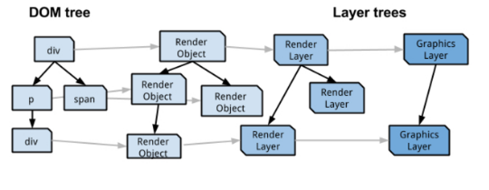
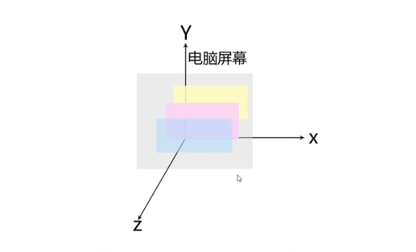
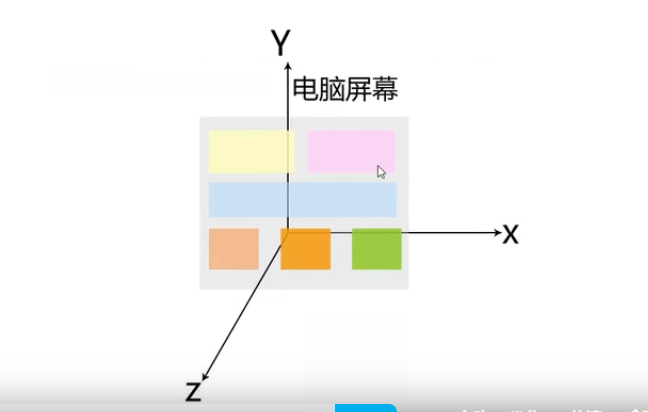
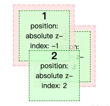
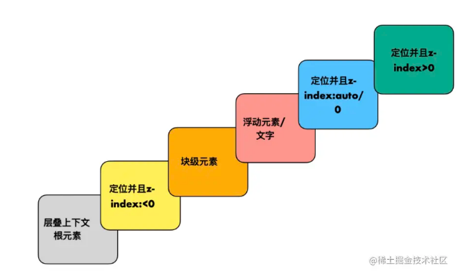
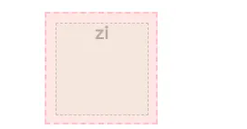

#### 一、渲染相关基础 ####

- 上图中，除了我们熟悉的 DOM 树外，还有 RenderObject树，RenderLayer树，GraphicsLayer 树，它们共同构成了 "渲染森林"。

**1.RenderObject树**

  - **RenderObject保存了绘制 DOM 节点所需要的各种信息，与 DOM 树对应，多个RenderObject也构成了一颗树。***

  - 但是**RenderObject 的树与 DOM 节点并不是一一对应关系**，《Webkit 技术内幕》指出，如果满足下列条件，则会创建一个 RenderObject：

   （1）**DOM 树中的 document 节点**；

   （2）**DOM 树中的可见节点**（webkit 不会为非可视节点创建 RenderObject 节点）；

   （3）**为了处理需要，Webkit 建立匿名的 RenderObject 节点**，如表示块元素的 RenderBlock（RenderObject 的子类）节点。

**2.RenderLayer树->渲染层**

  - RenderLayer 是浏览器基于 RenderObject 创建的，**当RenderObject处于相同的坐标空间的时候，就会形成一个渲染层(RenderLayers),渲染层来保证页面元素以正确的顺序合成。**
  
 
**3.GraphicsLayer树->合成层**

  - 为了节省 GPU 的内存资源，Webkit 并不会为每个渲染层分配一个对应的后端存储。而是按照一定的规则，将一些渲染层组合在一起，形成一个有后端存储的新层，用于之后的合成，称之为合成层。合成层中，存储空间使用 GraphicsLayer 表示。对于一个 RenderLayer对象，如果没有单独提升为合成层，则使用其父对象的合成层。

  - **某些特殊的渲染层会被认为是合成层（Compositing Layers），合成层拥有单独的图层(GraphicsLayer)，而其他不是合成层的渲染层，则和其第一个拥有图层父层公用一个**

  - 而每个图层都有一个 GraphicsContext，GraphicsContext 会负责输出该层的位图，位图是存储在共享内存中，作为纹理上传到 GPU 中，最后由 GPU 将多个位图进行合成，然后显示到屏幕上

#### 二、渲染层和合成层 ####

- **渲染过程中会发生“图层分层”。浏览器中的层分为两种：“渲染层”和“合成层（也叫复合层）”**。很多文章中还会提到一个概念叫“图形层”，其实可以把它当作合成层看待渲染过程中会发生“图层分层”。浏览器中的层分为两种：“渲染层”和“合成层（也叫复合层）”。很多文章中还会提到一个概念叫“图形层”，其实可以把它当作合成层看待

**1.层叠上下文**

 （1）**理解**

   - 层叠上下文是HTML中一个三维的概念，在css2.1规范中有明确强调，每个css盒模型都是处在一个三维空间里面，他们分别处在平面的'X轴'，'Y轴'以及表示层叠的'Z轴'。如下图所示的三个盒子，他们分别处在X轴和Y轴，同时在Z轴上发生层叠。

   

   - 但不是所有的盒子都会在Z轴发生层叠，我们都知道，默认情况下，HTML元素是沿X轴和Y轴平铺，如下图所示：元素默认从上往下，从左往右依次排列，所以我们就察觉不到它们在Z轴上的层叠关系。

   

   - 而一旦元素发生堆叠，我们就能感受到一个元素覆盖了另一个元素，这时我们就能感受到Z轴的存在，但是事实上，不管元素发不发生重叠，Z轴都存在。如果一个元素含有层叠上下文，(也就是说它是层叠上下文元素)，我们可以理解为这个元素在Z轴上就“高人一等”，最终表现就是它离屏幕观察者更近。

   - **层叠上下文是html中某些元素的一个特殊属性，这个属性决定了他在空间的上下位置，而这个位置会影响到他们的渲染顺序**

   - **最大的层叠上下文就是由文档根元素——html形成的：它自身连同它的子元素就形成了一个最大的层叠上下文，也就是说，我们写的所有代码都是在根层叠上下文里的**。
 
  （2）**特性**

    - 层叠上下文可以包含在其他层叠上下文中，并且一起创建一个层叠上下文的层级。（每个有z-index数值的元素也会连同它的子元素一起，生成一个小的层叠上下文，这个小层叠上下文和父级一样，拥有多个平面。）

    - **每个层叠上下文都是自包含的：当一个元素的内容发生层叠后，该元素将被作为整体在父级层叠上下文中按顺序进行层叠。**

    - 举例：
 
      - 有3个div，2个父元素，我用了粉红色的边框区分，3个子元素，用绿色的背景区分。他们的层级关系是这样的

		  <!-- container1:absolute z-index: 4 -->
		  <!-- --1号:absolute z-index: -1 -->
		  <!-- --2号:absolute z-index: 2 -->
		  <!-- container2:absolute z-index: 1 -->
		  <!-- --3号:absolute z-index: 3 -->
		  
      - 最后的顺序从下到上是：container2(3号)-container1(1号-2号)

   

    - 这里需要关注几个点：

      - z-index大的元素一定会盖在小的元素上面吗？ 

         - 答案不是的，可以看到zindex为3到元素被其余的盖住了，为什么？ 因为上面所讲的层叠上下文特性，**每个层叠上下文是自包含的，他的位置是受他的父级上下文影响的，因为3号的父级元素上下文等级低，所以即使给3号元素zindex设置9999也是无法盖过其余两个元素的**
  
      - 给元素设置负数z-index值，他的层级会被父级覆盖么（可以看到案例中没有，但是可不可以这样做呢？ 

         - 其实是可以的，利用层叠等级的规则就行

  （3）**层叠等级（规则）**

    - 在同一个层叠上下文中，它描述定义的是该层叠上下文中的层叠上下文元素在Z轴上的上下顺序。

    - 在其他普通元素中，它描述定义的是这些普通元素在Z轴上的上下顺序。
   
   

    - 父盖子案例 

      

        

          
zi

        

      

   

   - **这边给子元素设置负数的z-index后，为什么父级可以盖住子级，这就是利用了上面所讲的层叠等级规则，块级元素的层叠等级是高于定位并且zindex<0的**。 

**2.渲染层**

  - 渲染层的概念跟“层叠上下文”密切相关，简单来说，拥有z-index属性的定位元素会生成一个层叠上下文，**一个生成层叠上下文的元素就生成了一个渲染层。**（再强调一下，在开发者工具中看不到渲染层。）

  - **形成渲染层的条件也就是形成层叠上下文的条件**，有这几种情况：（只包含了部分日常开发中常用到的，全部的情况可以查mdn文档）
  
   （1）document 元素

   （2）拥有z-index属性的**定位**元素（position: relative|fixed|sticky|absolute）

   （3）弹性布局的**子项**（父元素display:flex|inline-flex)，并且z-index不是auto时

   （4）opacity非1的元素

   （5）transform非none的元素

   （6）filter非none的元素

   （7）will-change = opacity |  transform | filter

   （8）此外需要剪裁的元素也会形成一个渲染层，也就是overflow不是visible的元素

**2.合成层**

  - **在开发者工具中看到的不是渲染层，而是下面要讲的合成层，只有一些特殊的渲染层才会被单独提升为合成层，其余的渲染层合并成为合成层**，通常来说有这些情况：

   （1）document根元素

   （2）**transform:3D变换**，例如translate3d,translateZ等等（js一般通过这种方式，使元素获得复合层）
   
   （3）will-change:opacity | transform | filter

   （4）对 opacity | transform | fliter 应用了过渡和动画（transition/animation）

   （5）<video><iframe><canvas><webgl>等元素

   （6）元素有一个 z-index 较低且包含一个复合层的兄弟元素(换句话说就是该元素在复合层上面渲染)

  - 可以看出，上面这些条件属于生成渲染层的“加强版”，也就是说形成合成层的条件要更苛刻。

  - **合成层中的“层”可以被认为是真正物理上的层，浏览器把它独立出来，单独拿给GPU处理，而层叠上下文的“层”则是指渲染层，更像是一个概念上的层，一个合成层可以包含多个渲染层；**
  
#### 三、隐式合成 ####

- **当出现一个合成层后，层级顺序高于它的堆叠元素就会发生隐式合成。**

- 我们给C、D元素设置层级，z-index分别是3和4；又在C元素上使用3D变换，提升成了合成层。此时，层级高于它的D元素就发生了隐式合成，也变成了一个合成层。

- **隐式合成出现的根本原因式，元素发生了堆叠，浏览器为了保证最后的展示效果，不得不把层级顺序更高的元素拎出来盖在已有合成层上面。**

#### 四、层爆炸与层压缩 ####

- 当页面内容非常多，层级复杂的时候，低层级的渲染层在某一时刻提升为合成层，那么此时改产生了很多预期外的合成层，页面中所有 z-index 高于它的节点全部被提升，这些合成层都是相当消耗内存和GPU的，这个现象就是**层爆炸**。

**解决思路：**

  1.代码层面控制，在会形成合成层的元素增加一个大的z-index属性，人为干扰合成的排序，可以有效减少chrome创建不必要的合成层，提升渲染性能，移动端优化效果尤为明显。

  2.部分浏览器**层压缩**机制，多个渲染层同一个合成层重叠时，会自动将他们压缩到一起，避免“层爆炸”带来的损耗。

- 当然，浏览器的自动的层压缩也不是万能的，有很多特定情况下，浏览器是无法进行层压缩的，比如设置里mask属性、video 元素等等，另外也和使用等浏览器有关(safari)

#### 五、硬件加速 ####

**1.浏览器为什么要分层呢？**

- 答案是硬件加速。听起来很厉害，其实不过是给HTML元素加上某些CSS属性，比如3D变换，将其提升成一个合成层，独立渲染。之所以叫硬件加速，就是因为合成层会交给GPU（显卡）去处理，在硬件层面上开外挂，比在主线程（CPU）上效率更高。

**2.合成层的优点**

 （1）合成层的位图，会交由 GPU 合成，比 CPU 处理要快

 （2）提升成合成层的元素发生回流、重绘都只影响这一层，不会影响到其他的层，渲染效率得到提升。
    
 （3）对于 transform 和 opacity 效果，不会触发 layout 和 paint

**3.注意**
    
  - 提升到合成层后合成层的位图会交GPU处理，但请注意，仅仅只是合成的处理（把绘图上下文的位图输出进行组合）需要用到GPU，生成合成层的位图处理（绘图上下文的工作）是需要CPU。当需要repaint的时候可以只repaint本身，不影响其他层，但是paint之前还有style， layout,那就意味着即使合成层只是repaint了自己，但style和layout本身就很占用时间
    
  - 仅仅是transform和opacity不会引发回流和重绘，那么其他的属性不确定

  - 总结合成层的优势：一般一个元素开启硬件加速后会变成合成层，可以独立于普通文档流中，改动后可以避免整个页面重绘、回流，提升性能
  
- **有得必有失，开启硬件加速后的合成层会交给GPU处理，当图层过多时，将会占用大量内存，尤其在移动端会造成卡顿，让优化适得其反。正确使用硬件加速就是在渲染效率和性能损耗之间找到一个平衡点，让页面渲染迅速不白屏，又流畅丝滑。**

#### 六、transform 和 opacity提高动画的流畅度 ####

假如我们a元素和b元素，我们将a元素使用left属性，做一个移动动画：

	
	
A

	
B

这种情况对于动画的每一帧，浏览器会计算元素的几何形状，渲染新状态的图像，并把它们发送给GPU。因为重排和重绘发生在动画的每一帧，一个有效避免reflow和repaint的方式是我们仅仅画两个图像；一个是a元素，一个是b元素及整个页面；我们将这两张图片发送给GPU，然后动画发生的时候；只做两张图片相对对方的平移

我们使用translate来代替left：

	
	
A

	
B

浏览器在动画执行之前就知道动画如何开始和结束，因为浏览器没有看到需要reflow和repaint的操作；浏览器就会画两张图像作为复合层，并将它们传入GPU

* 这样做有两个优势：

     * 动画将会非常流畅

     * 动画不在绑定到CPU，即使js执行大量的工作；动画依然流畅

#### 七、GPU动画的优点和缺点 ####

* 每秒60帧，动画平滑、流畅

* 一个合适的动画工作在一个单独的线程，它不会被大量的js计算阻塞

* 3D“变换”是便宜的

缺点：

    * 提升一个元素到复合层需要额外的重绘，有时这是慢的。（即我们得到的是一个全层重绘，而不是一个增量）

    * 绘图层必须传输到GPU。取决于层的数量和传输可能会非常缓慢。这可能让一个元素在中低档设备上闪烁

    * 每个复合层都需要消耗额外的内存，过多的内存可能导致浏览器的崩溃

    * 如果你不考虑隐式合成，而使用重绘；会导致额外的内存占用，并且浏览器崩溃的概率是非常高的

#### 八、提高动画性能 ####

* 提高动画性能，减少动画卡顿的主要目标是减少reflow和repaint

1.js动画和css动画比较

(1)js动画

* 缺点：JavaScript在浏览器的主线程中运行，而其中还有很多其他需要运行的JavaScript、样式计算、布局、绘制等对其干扰。这也就导致了线程可能出现阻塞，从而造成丢帧的情况

* 优点：JavaScript的动画与CSS预先定义好的动画不同，可以在其动画过程中对其进行控制：开始、暂停、回放、中止、取消都是可以做到的。而且一些动画效果，比如视差滚动效果，只有JavaScript能够完成

(2)css动画

* 缺点：缺乏强大的控制能力。而且很难以有意义的方式结合到一起，使得动画变得复杂且易于出问题

* 优点：浏览器可以对动画进行优化。它必要时可以创建图层，然后在主线程之外运行

(3)注意

* 动画开始时，都会触发一次paint
    
* 对于纯css3操作transform和opacity的动画，在动画开始时，浏览器会自动将动画元素提升为合成层，但是在动画结束后，合成层会失效。在动画结束后(合成层失效)的那一帧，浏览器是会触发Paint的。如果我们强制将动画元素提升为合成层，动画结束后的那一帧，就不会触发Paint了
    
* 对于js操作css3的transform和opacity的动画，在动画过程中，浏览器不会自动将动画元素提升为合成层，但是也不会触发Paint。在动画结束的那一帧，不管我们是否强制将动画元素提升为合成层，当页面动画元素嵌套复杂时，可能会触发Paint

   
2.性能优化

(1)避免隐式合成

* 保持动画的对象的z-index尽可能的高。理想的，这些元素应该是body元素的直接子元素。当然，这不是总可能的。所以你可以克隆一个元素，把它放在body元素下仅仅是为了做动画

* 将元素上设置will-change CSS属性，元素上有了这个属性，浏览器会提升这个元素成为一个复合层（不是总是）。这样动画就可以平滑的开始和结束。但是不要滥用这个属性，否则会大大增加内存消耗

(2)开启GPU硬件加速

* 浏览器的GPU加速功能是将需要进行动画的元素提升到一个独立的层（layer），这样就可以避免浏览器进行重新布局（Reflow）和绘制（Repaint），将原先的浏览器使用CPU绘制位图来实现的动画效果转为让GPU使用图层合成（composite）来实现，如果两张图层内部没有发生改变，浏览器就不再进行布局和绘制，直接使用GPU的缓存来绘制每个图层，GPU只负责将各个图层合成来实现动画，这就可以充分利用GPU的资源和优势，减轻CPU的负载，可以使动画更流畅。通过改变两张图片之间的相对位置代替绘制一张图片的每一帧来实现动画，虽然视觉效果相同，但省去了许多绘制的时间。

* 为了让浏览器将动画元素提升到一个独立的层，可以使用transform和opacity属性来实现动画，当设置了这两个属性之一时，浏览器会自动进行这一优化操作（透明度的变化可以通过GPU改变a通道来实现，不需要浏览器进行重绘）。对于上面的动画，可以改变transform来代替改变left和top属性：

* 如果动画并不需要对transform和opacity属性做出改变，可以使用其他的方法强制浏览器为这些元素创建单独的层，比如设置一个没有效果的样式：transform：translateZ(0);这不会对元素的实际样式做出改变。但这是一种hack，规范的做法是使用will-change属性，设置它的值为需要做变换的属性，如will-change: left;浏览器就会知道left这个属性会发生变化，因此会开启硬件加速优化性能。

(3)减小复合层的尺寸

- 合成层的最大问题就是占用内存较多，而内存的占用和元素的尺寸是成正比的。如果要实现一个100X100的元素，可以给宽高都设置为10px，再使用transform:scale(10)放大10倍，这样占用的内存只有直接设置的1/100；

- 比如一张图片，开始的时候可以将它的尺寸设置的很小，然后再scale将它们放大，这样可以减少大量存储空间

	

	

	
	

(4)用css动画而不是js动画

* **css动画有一个重要的特性，它是完全工作在GPU上**。因为你声明了一个动画如何开始和如何结束，浏览器会在动画开始前准备好所有需要的指令；并把它们发送给GPU。而如果使用js动画，浏览器必须计算每一帧的状态；为了保证平滑的动画，我们必须在浏览器主线程计算新状态；把它们发送给GPU至少60次每秒。除了计算和发送数据比css动画要慢，主线程的负载也会影响动画； 当主线程的计算任务过多时，会造成动画的延迟、卡顿。所以尽可能地使用基于css的动画，不仅仅更快；也不会被大量的js计算所阻塞

#### 九、CSS 容器模块 ####

- CSS 容器模块（CSS Containment Module）最近刚发布了Level 3版本。**主要目标通过将特定的 DOM 元素和整个文档的 DOM 树隔离开来，使其元素的更改不会影响文档的其他部分，进而提高页面的渲染性能**。

- CSS 容器模块主要提供了两个属性来支持这样的优化。

**1.contain**

  - contain 属性允许开发者指定特定的 DOM 元素独立于 DOM 树以外。针对这些 DOM 元素，浏览器可以单独计算他们的布局、样式、大小等。所以当定义了 contain 属性的 DOM 元素发生改变后，不会造成整体渲染树的改变，导致整个页面的 Layout 和 Paint。

  - contain 有以下的取值：
 
   （1）layout

     - contain 值为 layout 的元素的布局将与页面整体布局独立，元素的改变不会导致页面的 Layout。

   （2）paint

     - contain值为 paint 的 DOM 节点，表明其子元素不会超出其边界进行展示。因此如果一个 DOM 节点是离屏或者不可见的，它的子元素可以被确保是不可见的。它还有以下作用：

        - 对于 position 值为 fixed 或者 absolute 的子节点，contain 值为 paint 的 DOM 节点成为了一个包含块（containing block)。

        - contain 值为 paint 的 DOM 节点会创建一个层叠上下文。

        - contain 值为 paint 的 DOM 节点会创建一个格式化上下文（BFC）。

   （3）size

     - contain值为 size 的 DOM 节点，它的 size 不会受其子节点的影响。
   
   （4）style
 
     - contain值为 style 的 DOM 节点，表明其 CSS 属性不会影响其子节点以外的其他元素。

   （5）inline-size

     - inline-size 是 Level 3 最新增加的值。contain 值为 inline-size 的 DOM 节点，它的 principal box的内联轴的 intrinsic-size 不受内容影响。

   （6）strict

     - 等同于 contain: size layout paint

   （7）content

    - 等同于 contain: layout paint

- 在具有大量 DOM 节点的复杂页面中，对没有在单独的合成层中的 DOM 元素进行修改会造成整个页面的 Layout 和 Paint，此时，对这些元素设置 contain 属性（比如 contain：strict）可以显著提高页面性能。

**2.content-visibility**

  - contain 属性需要我们在开发的时候就确定 DOM 元素是否需要进行渲染上的优化，并设定合适的值。content-visibility 则提供了另外一种方式，将它设定为 auto，则浏览器可以自动进行优化。上文中提到，合成线程会对每个页面大小的图层转化为图块（tile），然后针对于图块，按照一定的优先级进行光栅化，浏览器会渲染所有可能被用户查看的元素。content-visibility 的值设置为 auto 的元素，在离屏情况下，浏览器会计算它的大小，用来正确展示滚动条等页面结构，但是浏览器不用对其子元素生成渲染树，也就是说它的子元素不会被渲染。当页面滚动使其出现在视口中时，浏览器才开始对其子元素进行渲染。

  - 但是这样也会导致一个问题：content-visibility 的值设置为 auto 的元素，离屏状态下，浏览器不会对其子元素进行 Layout，因此也无法确定其子元素的尺寸，这时如果没有显式指定尺寸，它的尺寸会是 0，这样就会导致整个页面高度和滚动条的显示出错。为了解决这个问题，CSS 提供了另外一个属性 contain-intrinsic-size来设置 content-visibility 的值为 auto时的元素的占位大小。这样，即使其没有显式设置尺寸，也能保证在页面 Layout 时元素仍然占据空间。

	  .ele {
	    content-visibility: auto;
	    contain-intrinsic-size: 100px;
	  }
