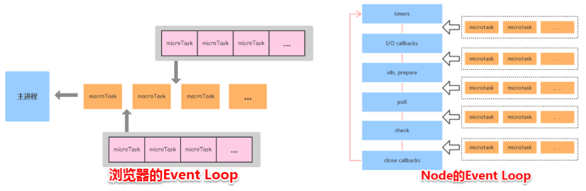

https://blog.csdn.net/gui951753/article/details/82345237 (I/O编程，非阻塞，阻塞，同步，异步)

一、node的三大特点

* 单线程
* 非阻塞I/O
* 事件驱动

1.多线程、阻塞式I/O
   
   * 传统的服务器端语言大多是多线程、阻塞式I/O，即在与用户进行连接时，每一个连接都是一个线程，当有十万个连接时就会有十万个连接。而阻塞式I/O指，当一个线程执行I/O操作时，这个线        
   程会阻塞，等待I/O操作完成后继续执行。
  
   * 举例理解：比如去餐厅吃饭，服务员都是一对一进行服务(每个用户都是一个线程)，从我们坐下开始，服务员就把菜单给你，然后等待我们点菜(等待I/O操作)，当你看完菜单，把要点的菜告诉服务员(I/O操作结束后线程继续执行)。当你看菜单的时候，其实服务员是被闲置的，如果你一直看，他就会一直等 ，直到你点完(I/O操作结束)，这就是阻塞式I/O

2.单线程、非阻塞式I/O

   * NodeJs不为每个客户连接创建一个新的线程，而仅仅使用一个线程。当有用户连接了，就触发一个内部事件，通过非阻塞I/O、事件驱动机制，让Node.js程序宏观上也是并行的

   * 举例理解：还是到餐厅吃饭，这个餐厅中只有一个服务员，当有顾客来时，服务员将菜单给顾客，顾客开始看菜单(I/O操作)，这时服务员是被释放了的，他不用等待顾客看菜单，服务员会告诉顾客：“您先看菜单，点好了叫我”(回调函数)，这个时候服务员可以抽身去服务其他顾客。用这种模式的话，一个服务员就可以服务多个顾客，而且不用等待I/O，只需要随时监听就好了，顾客点完后会主动叫服务员(执行回调函数)

**单线程、非阻塞式I/O的优点是性能强，一个服务员就能解决大量顾客。但他的缺点也很明显，比如一个顾客和服务员吵架了(线程崩了)，那其他顾客也就完了，因为所有人都在等着一个服务员。也就是说，如果线程崩掉了，那么与这个服务器连接的所有用户都会崩掉。还有一个问题是，如果同时有多个用户都在叫服务员该怎么处理？肯定要有一套规则，这就涉及到node的事件驱动。所以说，这三大特点，其实也是一个事，缺任何一个都不行**

3.事件驱动编程

   * 事件驱动编程，为需要处理的事件编写相应的事件处理程序。代码在事件发生时执行。早期则存在许多非事件驱动的程序，这样的程序，在需要等待某个条件触发时，会不断地检查这个条件，直到条件满足，这是很浪费cpu时间的。而事件驱动的程序，则有机会释放cpu从而进入睡眠态（注意是有机会，当然程序也可自行决定不释放cpu），当事件触发时被操作系统唤醒，这样就能更加有效地使用cpu
   
   * 事件驱动模型主要包含3个对象：事件源、事件和事件处理程序

        * 事件源：产生事件的地方(html元素) 
        * 事件：点击/鼠标操作/键盘操作等等
        * 事件对象：当某个事件发生时，可能会产生一个事件对象，该时间对象会封装好该时间的信息，传递给事件处理程序
        * 事件处理程序：响应用户事件的代码 

4.node运行原理分析

应用程序的请求过程可以分为俩个部分：CPU运算和I/O读写，CPU计算速度通常远高于磁盘读写速度，这就导致CPU运算已经完成，但是不得不等待磁盘I/O任务完成之后再继续接下来的业务。 所以I/O才是应用程序的瓶颈所在。node的单线程并不是真正的单线程，只是开启了单个线程进行业务处理（cpu的运算），同时开启了其他线程专门处理I/O。当一个指令到达主线程，主线程发现有I/O之后，直接把这个事件传给I/O线程，不会等待I/O结束后，再去处理下面的业务，而是拿到一个状态后立即往下走，这就是“单线程”、“异步I/O”。 I/O操作完之后呢？Node.js的I/O 处理完之后会有一个回调事件，这个事件会放在一个事件处理队列里头，在进程启动时node会创建一个类似于While(true)的循环，它的每一次轮询都会去查看是否有事件需要处理，是否有事件关联的回调函数需要处理，如果有就处理，然后加入下一个轮询，如果没有就退出进程，这就是所谓的“事件驱动”。这也从Node的角度解释了什么是”事件驱动”。 

二、node中的Event Loop

1.node简介

Node 中的 Event Loop 和浏览器中的是完全不相同的东西。Node.js 采用 V8 作为 js 的解析引擎，而 I/O 处理方面使用了自己设计的 libuv，libuv 是一个基于事件驱动的跨平台抽象层，封装了不同操作系统一些底层特性，对外提供统一的 API，事件循环机制也是它里面的实现

2.node.js的运行机制

* V8引擎解析JavaScript脚本
* 解析后的代码，调用Node API
* libuv库负责Node API的执行。它将不同的任务分配给不同的线程，形成一个Event Loop(事件循环)，以异步的方式将任务的执行结果返回给V8引擎
* V8引擎再将结果返回给用户

3.libuv引擎中的事件循环

在libuv内部有这样一个事件循环机制。在node启动时会初始化事件循环，处理目标脚本，脚本可能会进行异步API调用、定时任务或者process.nextTick()，然后开始进行事件循环。
   
   ┌───────────────────────┐ 
┌─>│     timers(计时器)     │ 
|  |   执行setTimeout以及   | 
|  |   setInterval的回调。   | 
│  └──────────┬────────────┘ 
│  ┌──────────┴────────────┐ 
│  │     I/O callbacks     | 
│  | 处理网络、流、tcp的错误   | 
|  | callback              | 
│  └──────────┬────────────┘ 
│  ┌──────────┴────────────┐ 
│  │     idle, prepare     │ 
|  |     node内部使用       | 
│  └──────────┬────────────┘      
│  ┌──────────┴────────────┐       ┌───────────────┐  
│  │       poll(轮询)      │       │   incoming:   │ 
|  | 执行poll中的i/o队列    | <─────┤  connections, │ 
|  | 检查定时器是否到时      |       │   data, etc.  |      
│  └──────────┬────────────┘       └───────────────┘     
│  ┌──────────┴────────────┐       
│  │      check(检查)      │ 
|  | 存放setImmediate回调   | 
│  └──────────┬────────────┘ 
│  ┌──────────┴────────────┐ 
└──┤    close callbacks    | 
   │ 关闭的回调例如          | 
   | sockect.on('close')   | 
   └───────────────────────┘ 

(1)每个阶段都有一个需要执行的回调函数的先入先出（FIFO）队列。同时，每个阶段都是特殊的，基本上，当事件循环进行到某个阶段时，会执行该阶段特有的操作，然后执行该阶段队列中的回调，直到队列空了或者达到了执行次数限制。这时候，事件循环会进入下一个阶段，循环往复

(2)外部输入数据-->轮询阶段(poll)-->检查阶段(check)-->关闭事件回调阶段(close callback)-->定时器检测阶段(timer)-->I/O 事件回调阶段(I/O callbacks)-->闲置阶段(idle, prepare)-->轮询阶段（按照该顺序反复运行）...

(3)阶段概述：

      * timers阶段： 
  
                * timers阶段会执行setTimeout和setIntravel回调，并且是由poll阶段控制的
                * 同样，在node中定时器指定的时间也是不准确的，只能是尽快执行

     * I/O callbacks 阶段：处理一些上一轮循环中的少数未执行的 I/O 回调

     * idle, prepare 阶段：仅 node 内部使用

     * poll阶段：

              * poll 是一个至关重要的阶段，这一阶段中，系统会做两件事情：

                 * 回到 timer 阶段执行回调
                 * 执行 I/O 回调

              * 并且在进入该阶段时如果没有设定了 timer 的话，会发生以下两件事情：

                 * 如果 poll 队列不为空，会遍历回调队列并同步执行，直到队列为空或者达到系统限制
                 * 如果 poll 队列为空时，会有两件事发生：
                          
                     * 如果有 setImmediate 回调需要执行，poll 阶段会停止并且进入到 check 阶段执行回调
                     * 如果没有 setImmediate 回调需要执行，会等待回调被加入到队列中并立即执行回调，这里同样会有个超时时间设置防止一直等待下去

             * 当然设定了 timer 的话且 poll 队列为空，则会判断是否有 timer 超时，如果有的话会回到 timer 阶段执行回调。

     * check 阶段：

                 * setImmediate()的回调会被加入 check 队列中，从 event loop 的阶段图可以知道，check 阶段的执行顺序在 poll 阶段之后

     * close callbacks 阶段：执行 socket 的 close 事件回调

		例： console.log('start')
			setTimeout(() => {
			  console.log('timer1')
			  Promise.resolve().then(function() {
			    console.log('promise1')
			  })
			}, 0)
			setTimeout(() => {
			  console.log('timer2')
			  Promise.resolve().then(function() {
			    console.log('promise2')
			  })
			}, 0)
			Promise.resolve().then(function() {
			  console.log('promise3')
			})
			console.log('end')

			//start=>end=>promise3=>timer1=>timer2=>promise1=>promise2

                  
(4) setTimeout 和 setImmediate

* 二者非常相似，区别主要在于调用时机不同。

    * setImmediate 设计在 poll 阶段完成时执行，即 check 阶段；
    * setTimeout 设计在 poll 阶段为空闲时，且设定时间到达后执行，但它在 timer 阶段执行

		setTimeout(function timeout () {
		  console.log('timeout');
		},0);
		setImmediate(function immediate () {
		  console.log('immediate');
		});

    对于以上代码来说，setTimeout 可能执行在前，也可能执行在后。
    首先 setTimeout(fn, 0) === setTimeout(fn, 1)，这是由源码决定的
    进入事件循环也是需要成本的，如果在准备时候花费了大于 1ms 的时间，那么在 timer 阶段就会直接执行 setTimeout 回调
    如果准备时间花费小于 1ms，那么就是 setImmediate 回调先执行了

* 但当二者在异步 i/o callback 内部调用时，总是先执行 setImmediate，再执行 setTimeout

		const fs = require('fs')
		fs.readFile(__filename, () => {
		    setTimeout(() => {
		        console.log('timeout');
		    }, 0)
		    setImmediate(() => {
		        console.log('immediate')
		    })
		})
		// immediate
		// timeout

在上述代码中，setImmediate 永远先执行。因为两个代码写在 IO 回调中，IO 回调是在 poll 阶段执行，当回调执行完毕后队列为空，发现存在 setImmediate 回调，所以就直接跳转到 check 阶段去执行回调了。

(5)process.nextTick

这个函数其实是独立于 Event Loop 之外的，它有一个自己的队列，当每个阶段完成后，如果存在 nextTick 队列，就会清空队列中的所有回调函数，并且优先于其他 microtask 执行

		setTimeout(() => {
		 console.log('timer1')
		 Promise.resolve().then(function() {
		   console.log('promise1')
		 })
		}, 0)
		process.nextTick(() => {
		 console.log('nextTick')
		 process.nextTick(() => {
		   console.log('nextTick')
		   process.nextTick(() => {
		     console.log('nextTick')
		     process.nextTick(() => {
		       console.log('nextTick')
		     })
		   })
		 })
		})
		// nextTick=>nextTick=>nextTick=>nextTick=>timer1=>promise1
		

(6)node与浏览器的Event Loop差异

浏览器环境下，microtask 的任务队列是每个 macrotask 执行完之后执行。而在 Node.js 中，microtask 会在事件循环的各个阶段之间执行，也就是一个阶段执行完毕，就会去执行 microtask 队列的任务。

		例：setTimeout(()=>{
		    console.log('timer1')
		    Promise.resolve().then(function() {
		        console.log('promise1')
		    })
		}, 0)
		setTimeout(()=>{
		    console.log('timer2')
		    Promise.resolve().then(function() {
		        console.log('promise2')
		    })
		}, 0)

     浏览器端的运行结果：timer1=>promise1=>timer2=>promise2

     node端的运行结果：timer1=>timer2=>promise1=>promise2

        * 全局脚本（main()）执行，将 2 个 timer 依次放入 timer 队列，main()执行完毕，调用栈空闲，任务队列开始执行
        * 首先进入 timers 阶段，执行 timer1 的回调函数，打印 timer1，并将 promise1.then 回调放入 microtask 队列，同样的步骤执行 timer2，打印 timer2；
        * 至此，timer 阶段执行结束，event loop 进入下一个阶段之前，执行 microtask 队列的所有任务，依次打印 promise1、promise2

浏览器和 Node 环境下，microtask 任务队列的执行时机不同：

    * Node 端，microtask 在事件循环的各个阶段之间执行
    * 浏览器端，microtask 在事件循环的 macrotask 执行完之后执行

