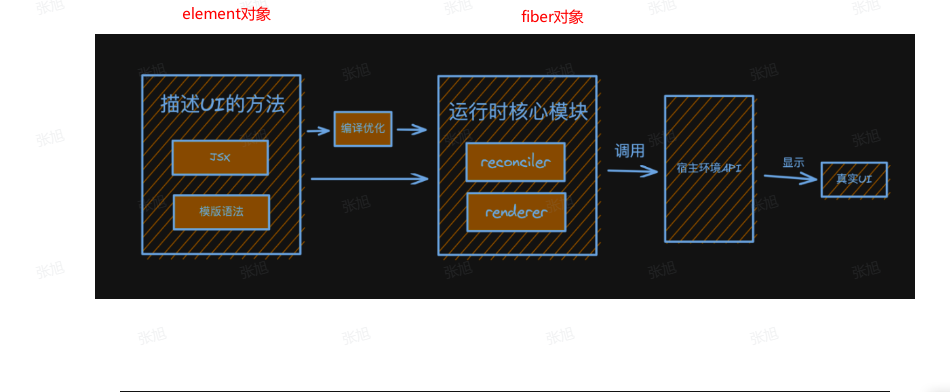
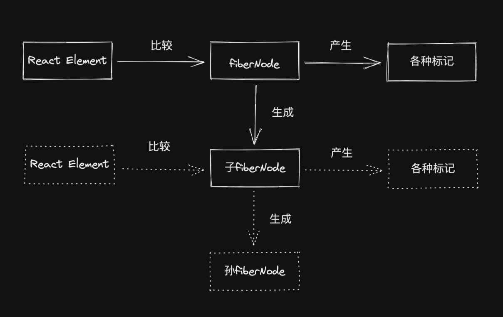

#### 一、element对象 ####

- element对象是对UI的描述

https://babeljs.io/repl(babel网站)

**1.jsx**

- react代码：

	function App(){
	  return (
	    

	      
	    

	  )
	}

- 通过babel编译后代码：

	import { jsx as _jsx } from "react/jsx-runtime";
	function App() {
	  return /*#__PURE__*/_jsx("div", {
	    id: "div",
	    class: "div",
	    children: /*#__PURE__*/_jsx("span", {})
	  });
	}

**总结：**

   (1)可以看到编译后就是一个纯js代码，_jsx是一个函数，所以jsx其实可以理解为让我们可以在JavaScript代码中编写类似HTML的标签，最终编译的时候被转译成js对象也就是上述的_jsx()

   (2)_jsx在老版本的时候就是createElement，新版本名字换成了_jsx

   (3)_jsx方法就是来生成element对象的，它的执行结果才是element对象

   (4)/*#__PURE__*/ 这个注释可以帮助webpack做tree shaking

- react代码：
	
	function App(){
	  return (
	    

	      
	      

	        
	      

	    

	  )
	}

- 通过babel编译后代码：

	import { jsx as _jsx, jsxs as _jsxs } from "react/jsx-runtime";
	function App() {
	  return /*#__PURE__*/_jsxs("div", {
	    id: "div",
	    class: "div",
	    children: [
          /*#__PURE__*/_jsx("span", {}), 
          /*#__PURE__*/_jsx("p", {
	         id: "22",
	         children: /*#__PURE__*/_jsx("span", {})
	     })]
	  });
	}

**总结：**

   (1)可以看出，通过递归调用_jsx()生成element

   (2)当子元素大于一个的时候，children就变成了一个数组

**2.element结构**

	function App(){
	  return (
	    <h1>
          <h2>
            <h3>333</h3>
          </h2>
        </h1>
	  )
	}

    const app = App()

    console.log('element对象',app)

    element对象

     {
        $$typeof: Symbol(react.element),
        key:null,
        props:{
          children:{
             $$typeof: Symbol(react.element),
             key:null,
             props:{
	          children:{
	             $$typeof: Symbol(react.element),
	             key:null,
                 props:{children:'333'},
	             ref:null,
                 type:'h3',
              }
	         },
             ref:null,
             type:'h2',
             ...
          }
        },
        ref:null,
        type:'h1',
        _owner:null
        ...
      }

- **element类型声明文件**

	export interface ReactElementType {
	    // 元素类型
	    $$typeof: symbol | number;
	
	    type: ElementType;
	    // for循环中的key，不加默认用index代替
	    key: Key;
	
	    // 组件的props
	    props: Props;
	
	    // 组件ref
	    ref: Ref;
	
	    // 我们自己的特殊标记
	    __mark: string;
	}

#### 二、fiber对象 ####

- fiber对象是对react执行过程中元素状态的描述，打上一些标记等等

- element对象它是没有状态的，纯粹的描述UI长什么样子。而fiber对象是元素运行时状态，加强对element元素的描述。

- fiber相对于element就是新增了一些状态的描述。（比如：元素之间的关系，运行时那些元素需要删除、移动，包括hooks的回调等等）
	
	export class FiberNode {
	    // 元素类型，函数式组件就是函数本身
	    type: any;   // div span li ul
	
	    // 组件对象类型
	    tag: WorkTag;
	
	    // 组件初始props
	    pendingProps: Props;
	    key: Key;
	
	    // 真实dom
	    stateNode: any;
	    ref: Ref;
	
	    return: FiberNode | null;
	    sibling: FiberNode | null;
	    child: FiberNode | null;
	    index: number;
	
	    // 更新后的props状态
	    memoizedProps: Props | null;
	    memoizedState: any;
	
	    // 连体婴儿  双缓存机制
	    alternate: FiberNode | null;    
	
	    // 副作用标记
	    flags: Flags;
	    subtreeFlags: Flags;
	    updateQueue: unknown;
	    constructor(tag: WorkTag, pendingProps: Props, key: Key) {
	        // 实例
	        this.tag = tag;
	        this.key = key;
	        // HostComponent 
 div DOM
	        this.stateNode = null;
	        // FunctionComponent () => {}
	        this.type = null;
	
	        // 构成树状结构
	        this.return = null;
	        this.sibling = null;
	        this.child = null;
	        this.index = 0;
	
	        this.ref = null;
	
	        // 作为工作单元
	        this.pendingProps = pendingProps;
	        this.memoizedProps = null;
	        this.memoizedState = null;
	        this.updateQueue = null;
	
	        this.alternate = null;
	
	        // 副作用, 更新元素的标记
	        this.flags = NoFlags;
	        this.subtreeFlags = NoFlags;
	    }
	}

- worktag是对元素类型的进一步抽象

	export type WorkTag =
	    | typeof FunctionComponent
	    | typeof HostRoot
	    | typeof HostComponent
	    | typeof HostText;
	
	export const FunctionComponent = 0;

    //全局只有一个
	export const HostRoot = 3;   // hsotroot代表生成的中间空节点
	
	export const HostComponent = 5;   // 原生节点  div span等
	// 
123

	export const HostText = 6;