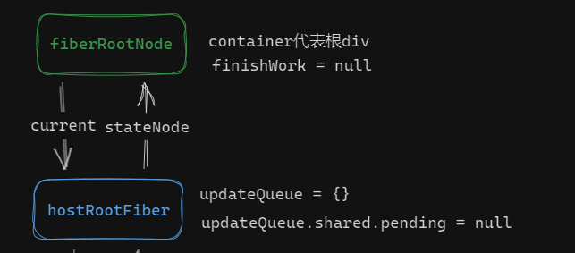
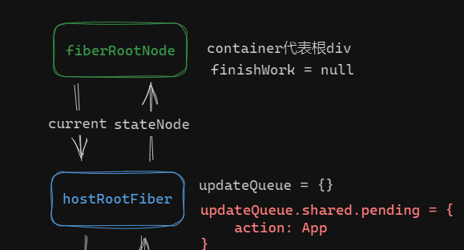

#### 一、断点调试-挂载流程 ####

**1.执行顺序**

(1)
    ReactDom.createRoot(root).render(App)

(2)createRoot方法

    // container是 根div id=root
	export function createRoot(container: Container) {

	    // container div root
	    const root = createContainer(container);

	    return {
	        render(element: ReactElementType) {
	            updateContainer(element, root);
	        }
	    };
	}

(3)createContainer方法

	export function createContainer(container: Container) {
	        // 凭空创建的， 是dom id=app的子节点 HostRoot是WorkTag中的3
	        const hostRootFiber = new FiberNode(HostRoot, {}, null);
	
	        // container是dom id = app
	        // 给容器和hostRootFiber之间建立关联关系
	        const root = new FiberRootNode(container, hostRootFiber);
	        hostRootFiber.updateQueue = createUpdateQueue();
	
	        // 这是 fiberRootNode
	        return root;
	}

 - **newFiberNode，创建fiber实例**

	export class FiberNode {
	    // 元素类型，函数式组件就是函数本身
	    type: any;
	
	    // 组件对象类型
	    tag: WorkTag;
	
	    // 组件初始props
	    pendingProps: Props;
	    key: Key;
	
	    // 真实dom
	    stateNode: any;
	    ref: Ref;
	
	    return: FiberNode | null;
	    sibling: FiberNode | null;
	    child: FiberNode | null;
	    index: number;
	
	    // 更新后的props状态
	    memoizedProps: Props | null;
	    memoizedState: any;
	
	    // 连体婴儿
	    alternate: FiberNode | null;
	
	    // 副作用标记
	    flags: Flags;
	    subtreeFlags: Flags;
	    updateQueue: unknown;
	    constructor(tag: WorkTag, pendingProps: Props, key: Key) {
	        // 实例
	        this.tag = tag;
	        this.key = key;
	        // HostComponent 
 div DOM
	        this.stateNode = null;
	        // FunctionComponent () => {}
	        this.type = null;
	
	        // 构成树状结构
	        this.return = null;
	        this.sibling = null;
	        this.child = null;
	        this.index = 0;
	
	        this.ref = null;
	
	        // 作为工作单元
	        this.pendingProps = pendingProps;
	        this.memoizedProps = null;
	        this.memoizedState = null;
	        this.updateQueue = null;
	
	        this.alternate = null;
	
	        // 副作用, 更新元素的标记
	        this.flags = NoFlags;
	        this.subtreeFlags = NoFlags;
	    }
	}

- **几种tag**
	
	export type WorkTag =
	    | typeof FunctionComponent
	    | typeof HostRoot
	    | typeof HostComponent
	    | typeof HostText;
	
	export const FunctionComponent = 0;   // 函数式组件
	export const HostRoot = 3;   // div span 等
	
	export const HostComponent = 5;  // class类组件
	// 
123

	export const HostText = 6;   // 文本节点

- **New FiberRootNode**

	export class FiberRootNode {
	    container: Container;
	    current: FiberNode;
	    finishedWork: FiberNode | null;
	    constructor(container: Container, hostRootFiber: FiberNode) {
	        this.container = container;
	        this.current = hostRootFiber;
	        hostRootFiber.stateNode = this;
	        this.finishedWork = null; //当前的工作状态
	    }
	}

实际上形成这种关系（图解）

(4)**接下来进入，render方法**
	
	export function createRoot(container: Container) {
	        // root是 fiberRootNode
	        const root = createContainer(container);
	        
	        return {
	                render(element: ReactElementType) {
	                        updateContainer(element, root);
	                }
	        };
	}

     ReactDom.createRoot(root).render(App) //ReactDom.createRoot(root)返回一个对象，里面有一个render方法，调用这个render方法

(5)**进入updateContainer**

	export function updateContainer(
	    element: ReactElementType | null,  // App组件的element
	    root: FiberRootNode
	) {
	    const hostRootFiber = root.current;
	    
	    //element App
	    const update = createUpdate<ReactElementType | null>(element);
	
	    // 给update赋值
	    enqueueUpdate(
	        hostRootFiber.updateQueue as UpdateQueue<ReactElementType | null>,
	        update
	    );
	    
	    scheduleUpdateOnFiber(hostRootFiber);
	    return element;
	}

(6)**createUpdate**

	export const createUpdate = <State>(action: Action<State>): Update<State> => {
	    return {
	        action
	    };
	};

 - 将传入的值包一层对象原样返回

(7)enqueueUpdate

	export const enqueueUpdate = <State>(
	    updateQueue: UpdateQueue<State>,
	    update: Update<State>
	) => {
	    updateQueue.shared.pending = update;
	};

- 此时内存中的状态

(8)scheduleUpdateOnFiber

	export function scheduleUpdateOnFiber(fiber: FiberNode) {
	        // TODO 调度功能
	        // fiberRootNode
	        
	        // 获取根节点
	        const root = markUpdateFromFiberToRoot(fiber);
	        renderRoot(root);
	}

- scheduleUpdateOnFiber（hostRootFiber）开始渲染，

- 调用markUpdateFromFiberToRoot 递归获取根节点，

	// 向上寻找顶层节点
	function markUpdateFromFiberToRoot(fiber: FiberNode) {
	    let node = fiber;
	    let parent = node.return;
	    while (parent !== null) {
	        node = parent;
	        parent = node.return;
	    }
	    if (node.tag === HostRoot) {
	        return node.stateNode;
	    }
	    return null;
	}

- 最后找到 root = fiberRootNode

- 进入renderRoot方法，调用prepareFreshStack（root），初始化wip 