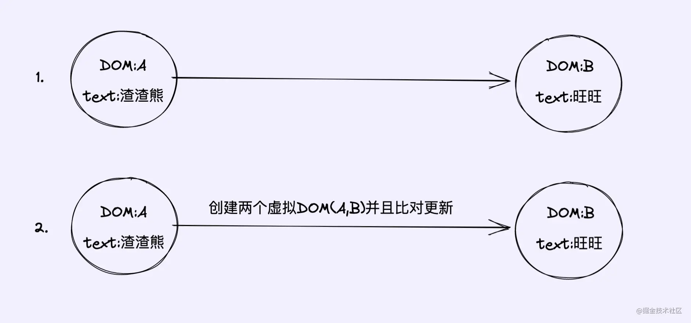

# 简答

## `diff`的对比流程

当数据改变时，会触发`setter`，并且通过`Dep.notify`去通知所有订阅者`Watcher`，订阅者们就会调用`patch`方法，给真实`DOM`打补丁，更新相应的视图

### `patch`

`newVnode`和`oldVnode`：同层的新旧虚拟节点**先调用`diff`流程的入口函数`patch`**，通过对比当前同层的虚拟节点（同级比较是指比较两组同深度的`Vnode`）的**`key`、`tag`,、`isComment`,、`inputType`相同并且`data`同为有定义或无定义**，来判断当前同层的虚拟节点是否为同一种类型的标签。如果是，继续执行`patchVnode`方法进行深层比对；如果否，没必要比对了，直接整个节点替换成新虚拟节点。

### `patchVnode`

在`patchVnode`方法中，

- 获取到新旧虚拟`dom`对应的真实`DOM`（`vnode`的`el`属性），
- 判断`newVnode`和`oldVnode`是否指向同一个对象，如果是，那么直接`return`
- 如果不是，则继续判断：
- 如果他们都是文本节点并且不相等，那么将`el`的文本节点设置为`newVnode`的文本节点。
- 如果`oldVnode`有子节点而`newVnode`没有，则删除`el`的子节点
- 如果`oldVnode`没有子节点而`newVnode`有，则将`newVnode`的子节点真实化之后添加到`el`
- 如果两者都有子节点，则执行`updateChildren`函数比较子节点

### `updateChildren`

`updateChildren`主要采用**递归+双指针**方式遍历新旧虚拟节点的子节点，新旧两个子节点集合的首尾指针会互相进行比较，总共有四种比较情况：**头头、尾尾、头尾、尾头**，当前面四种比较逻辑都不行的时候，拿新子节点的子项，直接去旧子节点数组中遍历，找一样的节点出来，这里分为两种情况：

- **`Vnode` 没有 `key`** ，那么就会采用遍历查找的方式去找到对应的旧节点。
-  **`Vnode` 有 `key`** ，生成旧子节点数组以 `vnode.key` 为`key` 的 `map` 表，新节点的 `key`  去对比旧节点`map`中的`key` ，从而找到相应旧节点。（这里对应的是一个`key => index` 的`map`映射）

**没找到**就认为是一个新增节点。

**找到这个旧子节点**，然后判断和新子节点是否 `sameVnode`，如果相同，直接移动到 `oldStartVnode` 前面；如果不同，直接创建插入 `oldStartVnode`  前面

在`updateChildren` 中，比较完新旧两个数组之后，可能某个数组会剩下部分节点没有被处理过，所以这里需要统一处理：

   新子节点遍历完毕，旧子节点可能还有剩，对剩下的旧节点进行批量删除！就是遍历剩下的节点，逐个删除`DOM`

   旧子节点遍历完毕，新子节点可能有剩，对剩余的新子节点全部新建


### `sameVnode`方法

`patch`关键的一步就是`sameVnode`方法判断是否为同一类型节点，那问题来了，怎么才算是同一类型节点呢？这个类型的标准是什么呢？

咱们来看看`sameVnode`方法的核心原理代码，就一目了然了

```
function sameVnode(oldVnode, newVnode) {
    return (
	    oldVnode.key === newVnode.key && // key值是否一样
	    oldVnode.tagName === newVnode.tagName && // 标签名是否一样
	    oldVnode.isComment === newVnode.isComment && // 是否都为注释节点
	    isDef(oldVnode.data) === isDef(newVnode.data) && // 是否都定义了data
	    sameInputType(oldVnode, newVnode) // 当标签为input时，type必须是否相同
	  )
   }
```


### `patch`方法

`patch`函数是`diff`流程的入口函数，这个方法作用就是，对比当前同层的虚拟节点是否为同一种类型的标签(同一类型的标准，下面会讲)：

- 是：继续执行`patchVnode`方法进行深层比对
- 否：没必要比对了，直接整个节点替换成新虚拟节点

来看看`patch`的核心原理代码

```
function patch(oldVnode, newVnode) {

  // 比较是否为一个类型的节点
  if (sameVnode(oldVnode, newVnode)) {

    // 是：继续进行深层比较
    patchVnode(oldVnode, newVnode)

  } else {
    // 否

    const oldEl = oldVnode.el // 旧虚拟节点的真实DOM节点

    const parentEle = api.parentNode(oldEl) // 获取父节点

    createEle(newVnode) // 创建新虚拟节点对应的真实DOM节点

    if (parentEle !== null) {

      api.insertBefore(parentEle, vnode.el, api.nextSibling(oEl)) // 将新元素添加进父元素

      api.removeChild(parentEle, oldVnode.el)  // 移除以前的旧元素节点

      // 设置null，释放内存
      oldVnode = null
    }
  }

  return newVnode
}
```

### `patchVnode`方法

这个函数做了以下事情：

- 找到对应的真实`DOM`，称为`el`

- 判断`newVnode`和`oldVnode`是否指向同一个对象，如果是，那么直接`return`

- 如果他们都是文本节点并且不相等，那么将`el`的文本节点设置为`newVnode`的文本节点。

- 如果`oldVnode`有子节点而`newVnode`没有，则删除`el`的子节点

- 如果`oldVnode`没有子节点而`newVnode`有，则将`newVnode`的子节点真实化之后添加到`el`

- 如果两者都有子节点，则执行`updateChildren`函数比较子节点，这一步很重要

  ​		

        function patchVnode(oldVnode, newVnode) {
            // 获取真实DOM对象
          const el = newVnode.el = oldVnode.el 
      
      	  // 获取新旧虚拟节点的子节点数组
          const oldCh = oldVnode.children, newCh = newVnode.children
      
      	  // 如果新旧虚拟节点是同一个对象，则终止
          if (oldVnode === newVnode) return
      
      	  // 如果新旧虚拟节点是文本节点，且文本不一样
          if (oldVnode.text !== null && newVnode.text !== null && oldVnode.text !== newVnode.text) {
      
      	    // 则直接将真实DOM中文本更新为新虚拟节点的文本
            api.setTextContent(el, newVnode.text)
      
      	  } else {
      	    // 否则
      	
      	    if (oldCh && newCh && oldCh !== newCh) {
      	      // 新旧虚拟节点都有子节点，且子节点不一样
      	
      	      // 对比子节点，并更新
              updateChildren(el, oldCh, newCh)
      
      	    } else if (newCh) {
      	      // 新虚拟节点有子节点，旧虚拟节点没有
      	
      	      // 创建新虚拟节点的子节点，并更新到真实DOM上去
              createEle(newVnode)
      
      	    } else if (oldCh) {
      	      // 旧虚拟节点有子节点，新虚拟节点没有
      	
      	      //直接删除真实DOM里对应的子节点
      	      api.removeChild(el)
      	    }
      	  }
      	}

### `updateChildren`方法

```
function updateChildren(parentElm, oldCh, newCh) {
  let oldStartIdx = 0, newStartIdx = 0
  let oldEndIdx = oldCh.length - 1
  let oldStartVnode = oldCh[0]
  let oldEndVnode = oldCh[oldEndIdx]
  let newEndIdx = newCh.length - 1
  let newStartVnode = newCh[0]
  let newEndVnode = newCh[newEndIdx]
  let oldKeyToIdx
  let idxInOld
  let elmToMove
  let before
  
  while (oldStartIdx <= oldEndIdx && newStartIdx <= newEndIdx) {
  
    if (oldStartVnode == null) {
      oldStartVnode = oldCh[++oldStartIdx]
    } else if (oldEndVnode == null) {
      oldEndVnode = oldCh[--oldEndIdx]
    } else if (newStartVnode == null) {
      newStartVnode = newCh[++newStartIdx]
    } else if (newEndVnode == null) {
      newEndVnode = newCh[--newEndIdx]
    } else if (sameVnode(oldStartVnode, newStartVnode)) {
      patchVnode(oldStartVnode, newStartVnode)
      oldStartVnode = oldCh[++oldStartIdx]
      newStartVnode = newCh[++newStartIdx]
    } else if (sameVnode(oldEndVnode, newEndVnode)) {
      patchVnode(oldEndVnode, newEndVnode)
      oldEndVnode = oldCh[--oldEndIdx]
      newEndVnode = newCh[--newEndIdx]
    } else if (sameVnode(oldStartVnode, newEndVnode)) {
      patchVnode(oldStartVnode, newEndVnode)
      api.insertBefore(parentElm, oldStartVnode.el, api.nextSibling(oldEndVnode.el))
      oldStartVnode = oldCh[++oldStartIdx]
      newEndVnode = newCh[--newEndIdx]

    } else if (sameVnode(oldEndVnode, newStartVnode)) {

      patchVnode(oldEndVnode, newStartVnode)
      api.insertBefore(parentElm, oldEndVnode.el, oldStartVnode.el)
      oldEndVnode = oldCh[--oldEndIdx]
      newStartVnode = newCh[++newStartIdx]

    } else {
      // 使用key时的比较
      if (oldKeyToIdx === undefined) {
        oldKeyToIdx = createKeyToOldIdx(oldCh, oldStartIdx, oldEndIdx) // 有key生成index表
      }
      idxInOld = oldKeyToIdx[newStartVnode.key]
      //不存在旧子节点数组中，直接创建DOM，并插入oldStartVnode 前面
      if (!idxInOld) {
        api.insertBefore(parentElm, createEle(newStartVnode).el, oldStartVnode.el)
        newStartVnode = newCh[++newStartIdx]
      } else {
        elmToMove = oldCh[idxInOld]
        if (elmToMove.sel !== newStartVnode.sel) {
          api.insertBefore(parentElm, createEle(newStartVnode).el, oldStartVnode.el)
        } else {
          patchVnode(elmToMove, newStartVnode)
          oldCh[idxInOld] = null
          api.insertBefore(parentElm, elmToMove.el, oldStartVnode.el)
        }
        newStartVnode = newCh[++newStartIdx]
      }
    }
  }
  
  if (oldStartIdx > oldEndIdx) {
  
    before = newCh[newEndIdx + 1] == null ? null : newCh[newEndIdx + 1].el
    addVnodes(parentElm, before, newCh, newStartIdx, newEndIdx)
    
  } else if (newStartIdx > newEndIdx) {
  
    removeVnodes(parentElm, oldCh, oldStartIdx, oldEndIdx)
  }
}
```


# 一、在虚拟`dom`之前

在聊虚拟`DOM`之前，我还是想先聊聊在没有虚拟`DOM`概念的时候，我们是如何更新页面的，所以在这里我将先引出前端框架（库）的发展史，通过这个变迁过程也便于大家理解虚拟`dom`的出现到底解决了什么问题。

## 石器时代`jQuery`

其实在15年以及更早之前，前端面试涉及到性能优化问题，往往都会提到**尽可能少的操作`DOM`**这一点。为什么呢？因为在原生`JS`的年代，前端项目文件都明确分为`html、js`与`css`三种，我们在`js`中获取`DOM`，并为其绑定事件，通过\**事件监听**感知用户在`UI`层的操作，并随之更新`DOM`，从而达到页面交互的目的：


而在后面，`jQuery`的出现极大简化了开发者操作`DOM`的成本，抹平了当时不同浏览器操作`DOM`的`API`差异，为当时苦于`ie`以及不同浏览器自研`API`的开发者解决了不少兼容性问题，当然`JQ`也并未改变开发者在`JS`层直接操作`DOM`这一现状。

那么我们为什么说要尽可能少的操作`DOM`呢，这里就涉及到重绘与回流两个概念，比如单纯修改颜色就会引发重绘，删除或新增一个`DOM`节点就会引发回流和重绘，用户虽然无法感知这个过程，但对于浏览器而言也存在消耗性能。所以针对于回流，在此之后又提出了`DocumentFragment`文档对象以优化多次操作`DOM`的方案。简单理解就是，假如我要依次替换五个`li`节点，那么我们可以创建一个`DocumentFragment`对象保存这五个节点，然后一次性替换。

## 青铜时代`angularjs`

在`JQ`之后，`angularjs`（这里指`angularjs1`而非`angular`）横空出世，一招双向绑定在当时更是惊为天人，除此之外，`angularjs`的模板语法也格外惊艳，我们将所有与数据挂钩的节点通过`{{}}`包裹（`vue`在早期设计上大量借鉴了`angularjs`），比如：

```html
<span>{{vm.name}}</span>
```

之后 `view` 视图层就自动与 `Model` 数据层进行挂钩（`MVC`那一套），只要 `Model` 层数据发生变化，`view` 层便自动更新。`angularjs` 的这种做法，彻底将开发者从操作 `DOM` 上解放了出来（为`jq`没落埋下伏笔），自此之后开发者只用专注 `Model` 层的数据加工以及业务处理，至于页面如何渲染全权交给 `angularjs` 底层处理即好了。

但需要注意的是，`angularjs` 在当时并没有虚拟`dom`的概念，那它是怎么做感知数据层变化以及更新视图层的呢？`angularjs`有一套脏检测机制`$digest`，`html`中凡是使用了模板语法`{{}}`或者`ng-bind`指令的部分，都会被加入到脏检测的`warchers`列表中，它是一个数组，之后只要用户通过`ng-click（与传统click不同，内置绑定了触发脏检测的机制）`等方法改变了`Model`的数据，`angularjs`就会从顶层`rootScope`向下递归，依次访问每个子`scope`中的`warchers`列表，并对其中监听的部分做新旧对比，如果不同则进行数据替换，以及`DOM`层的更新。

但是你要想想，一个应用那么大的结构，只要某一个数据变化了就得从顶层向下对比N个子 `scope` 中 `warchers` 下的所有监听对象，全量对比的性能有多差可想而知，`angularjs` 自身也意识到了这点，所以之后直接放弃了 `angularjs` 的维护转而新开了 `angular` 项目。

对于 `angularjs` 脏检测感兴趣可以读读博主[深入了解angularjs中的𝑑𝑖𝑔𝑒𝑠𝑡与apply方法，从区别聊到使用优化](https://link.juejin.cn?target=https%3A%2F%2Fwww.cnblogs.com%2Fecholun%2Fp%2F11988597.html)一文，同样是时代的眼泪了。

## 铁器时代`react`与`vue`

如果从 `angularjs` 转到 `vue` ，你会发现早期`vue`的模板语法、指令，双向绑定等很多灵感其实都借鉴了`angularjs`，但在更新机制上，`vue `并不是一个改动牵动全身，而是组件均独立更新。`react` 与 `vue` 一样相对 `angularjs` 也是局部更新，只是 `react` 中的局部是以当前组件为根以及之下的所有子组件。

打个比方，如果组件 `A` 状态发生变化，那么 `A` 的所有子组件默认都会触发更新，即使子组件的`props`未发生改变，所以对于`react`我们需要使用 `PureComponent`、`shouldComponentUpdate` 以及 `memo` 来避免这种场景下的多余渲染。而在更新体系中，`react` 与 `vue` 都引入了虚拟 `DOM` 的概念，当然这也是本文需要探讨的重点。

**我们先总结下上述的观点：**

`js` 和 `jq`：研发在专注业务的同时，还要亲自操作 `dom`。

`angularjs版本1`：将研发从操作 `dom` 中解脱了出来，更新 `dom` 交由 `angularjs` 底层实现，这一套机制由脏检测机制所支撑。

`react/vue`：同样由底层更新 `dom`，只是在此之前多了虚拟`dom`的对比，先对比再更新，以此达到最小更新目的。

所以相对传统更新 `dom` 的策略，虚拟`dom`的更新如下：


到这里，我们站在宏观的角度解释了前端框架的变迁，以及有虚拟`dom`前后我们如何更新`dom`，也许到这里你的脑中隐约对于虚拟`dom`有了一丝感悟，但又不是很清晰，虚拟`dom`到底解决了什么问题，别着急，接下来才是虚拟`dom`的正餐，我们接着聊。

# 二、虚拟`dom`

## 1、什么是虚拟`dom`？

虚拟`DOM`是通过状态生成一个**虚拟节点树（`vnode`）** ，然后使用虚拟节点树进行渲染。 在渲染之前，会使用新生成的虚拟节点树和上一次生成的虚拟节点树进行对比 **（`diff`算法）** ，只渲染不同的部分

> 虚拟节点树其实是由组件树建立起来的整个虚拟节点（`Virtual Node`，也经常简写为`vnode`）树

在`Vue.js`中，我们使用**模板**来描述**状态**与**`DOM`**之间的**映射**关系。`Vue.js`通过编译将模板转换成渲染函数（`render`），执行渲染函数就可以得到一个虚拟节点树，使用这个虚拟节点树就可以渲染页面

虚拟`DOM`是一个对象，一个什么样的对象呢？一个用来表示真实`DOM`的对象，即虚拟`DOM`就是将真实的`DOM`的数据抽离出来，以对象的形式模拟树形结构，看下面例子：

```
<ul id="list">
    <li class="item">哈哈</li>
    <li class="item">呵呵</li>
    <li class="item">嘿嘿</li>
</ul>
```

对应的虚拟`DOM`为：

    // 旧虚拟DOM
    
    let oldVDOM = { 
        tagName: 'ul', // 标签名
        props: { // 标签属性
            id: 'list'
        },
        children: [ // 标签子节点
            {
                tagName: 'li', props: { class: 'item' }, children: ['哈哈']
            },
            {
                tagName: 'li', props: { class: 'item' }, children: ['呵呵']
            },
            {
                tagName: 'li', props: { class: 'item' }, children: ['嘿嘿']
            }
        ]
    }


这时候，我修改一个`li`标签的文本：

		<ul id="list">
		    <li class="item">哈哈</li>
		    <li class="item">呵呵</li>
		    <li class="item">林三心哈哈哈哈哈</li> // 修改
		</ul>

这时候生成的新虚拟`DOM`为：

        // 新虚拟`DOM`
    
    	let newVDOM = { 
    	        tagName: 'ul', // 标签名
    	        props: { // 标签属性
    	            id: 'list'
    	        },
    	        children: [ // 标签子节点
    	            {
    	                tagName: 'li', props: { class: 'item' }, children: ['哈哈']
    	            },
    	            {
    	                tagName: 'li', props: { class: 'item' }, children: ['呵呵']
    	            },
    	            {
    	                tagName: 'li', props: { class: 'item' }, children: ['林三心哈哈哈哈哈']
    	            },
    	        ]
    	    }


这就是咱们平常说的新旧两个虚拟`DOM`，这个时候的新虚拟`DOM`是数据的最新状态，那么我们直接拿新虚拟`DOM`去渲染成真实`DOM`的话，效率真的会比直接操作真实`DOM`高吗？那肯定是不会的，看下图：




示例1是创建一个`DOMB`然后替换掉`DOMA`;示例2去创建虚拟`DOM`+`DIFF`算法比对发现`DOMB`跟`DOMA`不是相同的节点,最后还是创建一个`DOMB`然后替换掉`DOMA`;可以明显看出1是更快的。同样的结果，2还要去创建虚拟`DOM`+`DIFF`算法对比，所以说使用虚拟`DOM`比直接操作真实`DOM`就一定要快这个说法是错误的，不严谨的。

### 模板编译成`render`函数

将模板编译成渲染函数可以分两个步骤，先将模板解析成**`AST`（`Abstract Syntax Tree`，抽象语法树）**，然后再使用`AST`生成渲染函数。

但是由于静态节点不需要总是重新渲染，所以在生成`AST`之后、生成渲染函数之前这个阶段，需要做一个操作，那就是遍历一遍`AST`，**给所有静态节点做一个标记**，这样在虚拟`dom`中更新节点时，如果发现节点有这个标记，就不会重新渲染它。所以，在大体逻辑上，模板编译分三部分内容：

- 将模板解析为`AST`
- 遍历`AST`标记静态节点
- 使用`AST`生成渲染函数

## 2、为什么会需要虚拟`dom`

在主流框架 **`Angular`** , **`Vue.js (1.0)`** 和 **`React`** 中都有一个共同点，那就是它们都不知道哪些状态（`state`）变了。因此就需要进行比对，在**`React`**中使用的**虚拟`dom`**比对， **`Angular`** 中使用的是脏检查的流程

> 而在 **`Vue.js`**中使用的是变化侦测的方式，它在一定程度上知道具体哪些状态发生了变化，这样就可以通过更细粒度的绑定来更新视图。也就是说，在`Vue.js`中，当状态发生变化时，它在一定程度上知道哪些节点使用了这个状态，从而对这些节点进行更新操作，根本不需要比对

但是这样做的代价就是，粒度太细，每一个都有对应的 `watcher` 来观察状态变化，这样就会浪费一些内存开销，绑定的越多开销越大，如果这运用在一个大型项目中，那么他的开销无疑是非常大的

因此从 `Vue.js 2.0` 开始借鉴 `React` 中的虚拟`DOM` ，组件级别是一个`watcher`实例，就是说即便一个组件内有10个节点使用了某个状态，但其实也只有一个`watcher`在观察这个状态的变化。

### 框架设计

`Vue` 和 `React` 框架设计理念都是基于**数据驱动**的，当数据发生变化时 就要去更新视图，要想知道在页面众多元素中改动数据的元素 并根据改动后的数据去更新视图 是非常困难的

> 所以 `Vue` 和 `React` 中都会有一个 **`Render`函数** 或者类似于**`Render`函数**的功能，当数据变化时 全量生成`Dom` 元素 如果是直接操作 **真实`Dom`** 的话 是很昂贵的，就会严重拖累效率，所以就不生成真实的`Dom`，而是生成虚拟的`Dom`当数据变化时就是 对象 和 对象 进行一个对比 ，这样就能知道哪些数据发生了改变 从而去操作改变的数据后的`Dom`元素

这也是一个 “妥协 的结果”

### 跨平台

现阶段的框架他不仅仅能在浏览器里面使用，在小程序，移动端，或者桌面端也可以使用，但是**真实`Dom`**仅仅指的是在浏览器的环 境下使用，因此他不能直接生成**真实`Dom`** ，所以选择生成一个在任何环境下都能被认识的虚拟`Dom` 最后根据不同的环境，使用**虚拟`Dom`** 去生成界面，从而实现跨平台的作用 --- 一套代码在多端运行

## 3、虚拟`dom`做了什么？

虚拟`dom`在`Vue.js`中所做的事情其实并没有想象中那么复杂，它主要做了两件事。

- **提供与真实`dom`节点所对应的虚拟节点`vnode`。**
- **将虚拟节点`vnode`和旧虚拟节点`oldVnode`进行比对，然后更新视图。**

对两个虚拟节点对比是虚拟`dom` 中最核心的算法 （`diff`），它可以判断出哪些节点发生了变化，从而只对发生了变化的节点进行更新操作

## 4、虚拟`dom`的优势是什么？

### 销毁重建与局部更新

在提及虚拟`DOM`的优势之前，我们可以先抛开什么虚拟`DOM`以及什么`MVC`思想，回想下在纯 `js` 或者 `jq` 开发角度，我们是如何连接`UI`和数据层的。其实在16年之前，`UI`和数据处理都是强耦合，比如我们页面渲染完成，使用`onload`进行监听，然后发起`ajax`请求，并在回调中加工数据，以及在此生成`DOM`片段，并将其替换到需要更新的地方。

打个比方，后端返回了一个用户列表`userList`：

```javascript
const userList = [
  'echo',
  '听风是风',
  '时间跳跃'
]
```

前端在请求完成，于是在`ajax`回调中进行`dom`片段生成以及替换工作，比如：

```
<ul id='userList'></ul>
```

```html

const ulDom = document.querySelector('#userList');
// 生成代码片段
const fragment = document.createDocumentFragment();

for (let i = 0; i < userList.length; i++) {
  const liDom = document.createElement("li");
  liDom.innerHTML = userList[i];
  // 依次生成li，并加入到代码片段
  fragment.appendChild(liDom);
}

// 最终将代码片段塞入到ul
ulDom.appendChild(fragment);
```

所以不管是页面初始化，还是之后用户通过事件发起请求更新了用户数据，到头来还是都是调用上面生成`li`的这段逻辑。在当时能想着把这段逻辑复用成一个方法，再考虑用上`createDocumentFragment`减少操作`dom`的次数，能做到这些，这在当时都是能小吹一波的了....


所以你会发现，在原生`js`的角度，根本没有所谓的`dom`对比，都是重新创建，因为在写代码之前，我们已经**明确知道了哪部分是静态页面，哪部分需要结合数据进行动态展示**。那么只需要将需要动态生成的`dom`的逻辑提前封装成方法，然后在不同时期去调用，这在当年已经是非常不错的复用了（组件的前生）。

那么问题来了，假定现在我们有一个类似`form`表单的展示功能，点击不同用户，表单就会展示用户名，年龄等一系列信息：


用`js`写怎么做？还是一样的，点击不同用户，肯定会得到一个用户信息对象，我们根据这个对象动态生成多个信息展示的`input`等相关`dom`，然后塞入到`form`表单中，所以每次点击，这个`form`其实都等同于**完全重建**了。

假定现在我们不希望完整重建这个结构，而是希望做前后`dom`节点对比，比如`input`的`value`前后不一样，某个`style`颜色不同，我们单点更新这个属性，比较笨拙的想法肯定还是得生成一份新`dom`片段，然后递归对比两个结构，且属性一一对比，只有不同的部分我们才需要更新。但仅仅通过下面这段代码，你就能预想到这个做法的性能有多糟糕了：

```javascript
// 一个li节点自带的属性就有307个
const liDom = document.createElement("li");
let num = 0;
for (let key in liDom) {
  num += 1;
}
console.log(num); // 307
```

我们生成了一个最基本的`li`节点，并通过遍历依次访问节点的属性，经过统计发现`li`单属性就`307`个，而这仅仅是一个节点。

在前面我们也提到过，不管是`jq`封装，还是`react vue`的模板语法，它的前提一定是研发自己提前知道了哪部分内容未来是可变的，所以我们才要动态封装，才需要使用`{}`进行包裹，那既然如此，我们就对比**未来可能会变的部分**不是更好吗？

而回到上文我们对于虚拟结构的抽象，对于`react`而言，`props`是可变的，`child`是可变的，`state`也是可变的，而这些属性恰好都在虚拟`dom`中均有呈现。

所以到这里，我们解释了虚拟`dom`的第一个优势，站在对比更新的角度，虚拟`dom`能聚焦于需要对比什么，相对原生`dom`它提供更高效的对比可行性。

### 更佳的兼容性

我们在上文提到，`react与babel`将`jsx`转成了`js`对象（虚拟`dom`），之后又通过`render`生成`dom`，那为啥还要转成`js`而不是直接生成`dom`呢，因为在这个中间`react`还需要做`diff`对比，兼容处理，以及跨平台的考虑，我们先说兼容处理。

准确来说，虚拟`dom`只是`react`中的一部分，要真正体现虚拟`dom`的价值，肯定得结合`react`中的其它设计来一起讲，其中一点就是结合合成事件所体现的强大的兼容性。

我们在介绍`jq`时强调了它在操作`dom`的便捷，以及各类`api`兼容性上的贡献，而`react`中使用了虚拟`dom`也做了大量的兼容。

打个比方，原生的`input`有`change`事件，普通的`div`总没有`onchange`事件吧？不管你有没有留意，其实`dom`和事件在底层已经做了强关联，不同的`dom`能触发的事件，浏览器在一开始就已经定义好了，而且你根本改不了。

但是虚拟`dom`就不同了，虚拟`dom`一方面模仿了原生`dom`的行为，其次在事件方面也做了合成事件与原生事件的映射关系，比如：

```javascript
{
  onClick: ['click'],
  onChange: ['blur', 'change', 'click', 'focus', 'input', 'keydown', 'keyup', 'selectionchange']
}
```

`react`暴露给我们的合成事件，其实在底层会关联到多个原生事件，通过这种做法抹平了不同浏览器之间的`api`差异，也带来了更强大的事件系统。

若对于合成事件若感兴趣，可以阅读博主  [八千字长文深入了解react合成事件底层原理，原生事件中阻止冒泡是否会阻塞合成事件？](https://juejin.cn/post/7118626759162986526)一文。

### 渲染优化

我们知道`react`遵循`UI = Render(state)`，只要`state`发生了改变，那么`render`就会重新触发，以达到更新`ui`层的效果。而更改`state`依赖了`setState`，大家都知道`setState`对于`state`更新的行为其实是异步的，假设我们在一次事件中更改了多次`state`，你会发现页面也仅会渲染一次。

而假定我们是直接操作`dom`，那还有哪门子的异步和渲染等待，当你`append`完一个子节点，页面早渲染完了。所以虚拟`dom`的对比提前，以及`setState`的异步处理，本质上也是在像尽可能少的操作`dom`靠近。

若对于`setState`想有更深入的了解，可以阅读博主这两篇文章：

[react中的setState是同步还是异步？react为什么要将其设计成异步？](https://juejin.cn/post/7116834546007900197)

[react 聊聊setState异步背后的原理，react如何感知setState下的同步与异步？](https://juejin.cn/post/7117582507595268127)

###  跨平台能力

同理，之所以加入虚拟`dom`这个中间层，除了解决部分性能问题，加强兼容性之外，还有个目的是将`dom`的更新抽离成一个公共层，别忘了`react`除了做页面引用外，`react`还支持使用`React Native`做原生`app`。所以针对同一套虚拟`dom`体系，`react`只是在最终将体现在了不同的平台上而已。

## 5、虚拟DOM比原生快吗？

那么问题来了，聊了这么久的虚拟`dom`，虚拟`dom`性能真的比操作原生`dom`要更快吗？很遗憾的说，并不是，或者说不应该这样粗暴的去对比。

我们在前面虽然对比了虚拟`dom`属性以及原生`dom`的属性量级，但事实上我们并不会对原生`dom`属性进行递归对比，而是直接操作`dom`。而且站在`react`角度，即便经历了`diff`算法以及一系列的优化，`react`到头来还是要操作原生`dom`，只是对于研发来讲不用关注这一步罢了。

所以我们可以想象一下，现在要替换`p`标签的内容，用原生就是直接修改`innerHTML`属性，对于`react`而言它需要先生成虚拟`dom`，然后新旧`diff`找出变化的部分，最后才修改原生`dom`，单论这个例子，一定是原生快。

但我们既然说虚拟`dom`，就一定得结合`react`的使命来解释，虚拟`dom`的核心目的是**模拟了原生`dom`大部分特性，让研发高效无痛写`html`的同时，还达到了单点刷新而不是整个替换（前面表单替换的例子），最重要的，它也将研发从繁琐的`dom`操作中解放了出来**。

总结来说，单论修改一个`dom`节点的性能，不管`react`还是`vue`亦或是`angular`，一定是原生最快，但虚拟`dom`有原生`dom`比不了的价值，起码`react`这些框架能让研发更专注业务以及数据处理，而不是陷入繁琐的`dom`增删改查中。

# 三、什么是`diff`算法 #


上图中，其实只有一个`li`标签修改了文本，其他都是不变的，所以没必要所有的节点都要更新，只更新这个`li`标签就行，`Diff`算法就是查出这个`li`标签的算法。

所以，当一些复杂的节点,比如说一个父节点里面有多个子节点,当只是一个子节点的内容发生了改变,那么我们没有必要像示例1重新去渲染这个`DOM`树,这个时候虚拟`DOM`+`DIFF`算法就能够得到很好的体现,我们通过示例2使用**虚拟`DOM`+`Diff`算法**去找出改变了的子节点更新它的内容就可以了。

`diff `算法首先要明确一个概念就是 ``diff ``的对象是虚拟`DOM`（`virtual DOM`），更新真实 `DOM` 是 ``diff ``算法的结果。`Diff`算法是一种对比算法，对比两者是旧虚拟`DOM`和新虚拟`DOM`，对比出是哪个虚拟节点更改了，找出这个虚拟节点，并只更新这个虚拟节点所对应的真实节点，而不用更新其他数据没发生改变的节点，实现精准地更新真实`DOM`，进而提高效率。

#### `vue`采用递归+双指针方式进行遍历，原则是： 深度优先，同层比较

这里存在 三种树，一个是 页面`DOM` 树，一个是 旧`VNode` 树，一个是 新 `Vnode` 树.

页面`DOM` 树 和 旧`VNode` 树 节点一一对应的，而新`VNode` 树则是表示更新后页面`DOM`树该有的样子。

这里把旧`VNode`树和新`VNode` 树进行比较的过程中，不会对这两棵`VNode` 树进行修改，而是以比较的结果直接对 真实`DOM`进行修改。

比如说，在旧 `VNode` 树同一层中，找到和新`VNode` 树中一样但位置不一样节点，此时需要移动这个节点，但是不是移动旧 `VNode` 树中的节点，而是直接移动 `DOM`。

**总的来说，新旧 `VNode` 树是拿来比较的，页面`DOM`树是拿来根据比较结果修改的**

### `Diff` 算法的实现流程解析

`Diff` 算法的实现流程可以概括为以下几个步骤：

1. **比较根节点：** 首先，对比新旧虚拟 `DOM` 树的根节点，判断它们是否相同。
2. **逐层对比子节点：** 如果根节点相同，则逐层对比子节点。
   - 比较子节点类型：
     - 如果节点类型不同，则直接替换整个节点。
     - 如果节点类型相同，继续对比节点的属性和事件。
   - 对比子节点列表：
     - 通过双指针法对比新旧节点列表，查找相同位置的节点。
     - 如果节点相同，进行递归对比子节点。
     - 如果节点不同，根据情况执行插入、删除或移动节点的操作。
3. **处理新增、删除和移动的节点：**
   - 如果新节点列表中存在旧节点列表中没有的节点，执行新增操作。
   - 如果旧节点列表中存在新节点列表中没有的节点，执行删除操作。
   - 如果新旧节点列表中都存在相同的节点，但顺序不同，执行移动节点的操作。
4. **更新节点属性和事件：**
   - 如果节点相同但属性或事件发生了变化，更新节点的属性和事件。
5. **递归对比子节点：**
   - 如果节点类型相同且是容器节点（例如 `div`、`ul` 等），则递归对比子节点。

### 双端 `Diff` 算法流程

`Vue2` 采用了双端 `Diff` 算法，算法流程主要是：

1. 对比头头、尾尾、头尾、尾头是否可以复用，如果可以复用，就进行节点的更新或移动操作。
2. 如果经过四个端点的比较，都没有可复用的节点，则将就的子序列保存为节点 `key` 为 `key`  ，`index` 为 `value` 的 `map` 。
3. 拿新的一组子节点的头部节点去 `map` 中查找，如果找到可复用的节点，则将相应的节点进行更新，并将其移动到头部，然后头部指针右移。
4. 然而，拿新的一组子节点中的头部节点去旧的一组子节点中寻找可复用的节点，并非总能找到，这说明这个新的头部节点是新增节点，只需要将其挂载到头部即可。
5. 经过上述处理，最后还剩下新的节点就批量新增，剩下旧的节点就批量删除。

# 四、`diff`算法原理 #

## `Diff`同层对比

传统的计算两颗树的差异时间复杂度为`O(n^3)`,显然成本比较高（老树的每一个节点都去遍历新树的节点，直到找到新树对应的节点。那么这个流程就是 `O(n^2)`，再紧接着找到不同之后，再计算最短修改距离然后修改节点，这里是 `O(n^3)`。）因为每个节点都要去和另一棵树的全部节点对比一次，这就是 n 了，如果找到有变化的节点，执行插入、删除、修改也是 n 的复杂度。所有的节点都是这样，再乘以 n，所以是 O(n * n * n) 的复杂度。


这样的复杂度对于前端框架来说是不可接受的，这意味着 1000 个节点，渲染一次就要处理 1000 * 1000 * 1000，一共 10 亿次。

所以前端框架的 `diff` 约定了两种处理原则：**只做同层的对比，type 变了就不再对比子节点。**

因为 `dom` 节点做跨层级移动的情况还是比较少的，一般情况下都是同一层级的 `dom` 的增删改。

这样只要遍历一遍，对比一下 `type` 就行了，是 `O(n)` 的复杂度，而且 `type` 变了就不再对比子节点，能省下一大片节点的遍历。另外，因为 `vdom` 中记录了关联的 `dom` 节点，执行 `dom` 的增删改也不需要遍历，是 `O(1)`的，整体的 `diff` 算法复杂度就是 `O(n)` 的复杂度。


1000 个节点渲染一次最多对比 1000 次，这样的复杂度就是可接受的范围了。


**`Diff` 比较的内核是节点复用，所以 `Diff` 比较就是为了在 新旧节点中 找到 相同的节点**

**这个的比较逻辑是建立在上一步说过的同层比较基础之上的**

**所以说，节点复用，找到相同节点并不是无限制递归查找**

比如下图中，的确旧节点树和新节点树中有相同节点 6，但是并没有什么用，旧节点6并不会被复用


就算在同一层级，然而父节点不一样，依旧并没有什么用


只有这种情况的节点会被复用，相同父节点 8


## `Diff` 简单例子

比如下图存在这两棵 需要比较的新旧节点树 和 一棵 需要修改的页面 `DOM`树


### 第一轮比较开始

因为父节点都是 1，所以开始比较他们的子节点

按照我们上面的比较逻辑，所以先找 相同 && 不需移动  的点

毫无疑问，找到 2


拿到比较结果，这里不用修改`DOM`，所以 `DOM`保留在原地


### 第二轮比较开始

然后，没有 相同 && 不需移动  的节点 了

只能第二个方案，开始找相同的点

找到 节点5，相同但是位置不同，所以需要移动


拿到比较结果，页面 `DOM`树需要移动`DOM`了，不修改，原样移动


### 第三轮比较开始

继续，哦吼，相同节点也没得了，没得办法了，只能创建了

所以要根据 新`Vnode` 中没找到的节点去创建并且插入

然后旧`Vnode`  中有些节点不存在 新`Vnode`  中，所以要删除


于是开始创建节点 6 和 9，并且删除节点 4 和 5


## `diff`的对比流程

当数据改变时，会触发`setter`，并且通过`Dep.notify`去通知所有订阅者`Watcher`，订阅者们就会调用`patch`方法，给真实`DOM`打补丁，更新相应的视图

`newVnode`和`oldVnode`：同层的新旧虚拟节点


### `patch`方法

`patch`函数是`diff`流程的入口函数，这个方法作用就是，对比当前同层的虚拟节点是否为同一种类型的标签(同一类型的标准，下面会讲)：

- 是：继续执行`patchVnode`方法进行深层比对
- 否：没必要比对了，直接整个节点替换成新虚拟节点

来看看`patch`的核心原理代码

```
function patch(oldVnode, newVnode) {

  // 比较是否为一个类型的节点
  if (sameVnode(oldVnode, newVnode)) {

    // 是：继续进行深层比较
    patchVnode(oldVnode, newVnode)

  } else {
    // 否

    const oldEl = oldVnode.el // 旧虚拟节点的真实DOM节点

    const parentEle = api.parentNode(oldEl) // 获取父节点

    createEle(newVnode) // 创建新虚拟节点对应的真实DOM节点

    if (parentEle !== null) {

      api.insertBefore(parentEle, vnode.el, api.nextSibling(oEl)) // 将新元素添加进父元素

      api.removeChild(parentEle, oldVnode.el)  // 移除以前的旧元素节点

      // 设置null，释放内存
      oldVnode = null
    }
  }

  return newVnode
}
```
### `sameVnode`方法

`patch`关键的一步就是`sameVnode`方法判断是否为同一类型节点，那问题来了，怎么才算是同一类型节点呢？这个类型的标准是什么呢？

咱们来看看`sameVnode`方法的核心原理代码，就一目了然了


```
function sameVnode(oldVnode, newVnode) {
    return (
	    oldVnode.key === newVnode.key && // key值是否一样
	    oldVnode.tagName === newVnode.tagName && // 标签名是否一样
	    oldVnode.isComment === newVnode.isComment && // 是否都为注释节点
	    isDef(oldVnode.data) === isDef(newVnode.data) && // 是否都定义了data
	    sameInputType(oldVnode, newVnode) // 当标签为input时，type必须是否相同
	  )
   }
```
### `patchVnode`方法

这个函数做了以下事情：

- 找到对应的真实`DOM`，称为`el`
- 判断`newVnode`和`oldVnode`是否指向同一个对象，如果是，那么直接`return`
- 如果他们都有文本节点并且不相等，那么将`el`的文本节点设置为`newVnode`的文本节点。
- 如果`oldVnode`有子节点而`newVnode`没有，则删除`el`的子节点
- 如果`oldVnode`没有子节点而`newVnode`有，则将`newVnode`的子节点真实化之后添加到`el`
- 如果两者都有子节点，则执行`updateChildren`函数比较子节点，这一步很重要

	​		

        function patchVnode(oldVnode, newVnode) {
	          // 获取真实DOM对象
          const el = newVnode.el = oldVnode.el 
	    
	    	  // 获取新旧虚拟节点的子节点数组
          const oldCh = oldVnode.children, newCh = newVnode.children
	    
	    	  // 如果新旧虚拟节点是同一个对象，则终止
          if (oldVnode === newVnode) return
	    
	    	  // 如果新旧虚拟节点是文本节点，且文本不一样
          if (oldVnode.text !== null && newVnode.text !== null && oldVnode.text !== newVnode.text) {
	    
	    	    // 则直接将真实DOM中文本更新为新虚拟节点的文本
            api.setTextContent(el, newVnode.text)
	    
	    	  } else {
	    	    // 否则
	    	
	    	    if (oldCh && newCh && oldCh !== newCh) {
	    	      // 新旧虚拟节点都有子节点，且子节点不一样
	    	
	    	      // 对比子节点，并更新
              updateChildren(el, oldCh, newCh)
	    
	    	    } else if (newCh) {
	    	      // 新虚拟节点有子节点，旧虚拟节点没有
	    	
	    	      // 创建新虚拟节点的子节点，并更新到真实DOM上去
              createEle(newVnode)
	    
	    	    } else if (oldCh) {
	    	      // 旧虚拟节点有子节点，新虚拟节点没有
	    	
	    	      //直接删除真实DOM里对应的子节点
	    	      api.removeChild(el)
	    	    }
	    	  }
	    	}

### `updateChildren`方法

这是`patchVnode`里最重要的一个方法，新旧虚拟节点的子节点对比，就是发生在`updateChildren`方法中，是怎么样一个对比方法呢？就是首尾指针法，新的子节点集合和旧的子节点集合，各有首尾两个指针，举个例子：

```
<ul>
    <li>a</li>
    <li>b</li>
    <li>c</li>
</ul>
```


```
	修改数据后
	
	<ul>
	    <li>b</li>
	    <li>c</li>
	    <li>e</li>
	    <li>a</li>
	</ul>
```
那么新旧两个子节点集合以及其首尾指针为：


然后会进行互相进行比较，总共有五种比较情况：

#### 1、旧头 == 新头

```
sameVnode(oldStartVnode, newStartVnode)
```

当两个新旧的两个头一样的时候，并不用做什么处理

符合我们的步骤第一条，不移动`DOM`完成更新

但是看到一句，`patchVnode(oldStartVnode, newStartVnode)`

就是为了继续处理这两个相同节点的子节点，或者更新文本

因为我们不考虑多层`DOM` 结构，所以 新旧两个头一样的话，这里就算结束了

可以直接进行下一轮循环

```
newStartIdx ++ ， oldStartIdx ++
```


#### 2、旧尾 == 新尾

```
sameVnode(oldEndVnode, newEndVnode)
```

和 头头 相同的处理是一样的

尾尾相同，直接跳入下个循环

```
 newEndIdx ++ ， oldEndIdx ++
```


#### 3、旧头 == 新尾

```
sameVnode(oldStartVnode, newEndVnode)
```

这步不符合 不移动DOM，所以只能 移动DOM 了

##### 怎么移动？

源码是这样的

```
parentElm.insertBefore(
    oldStartVnode.elm, 
    oldEndVnode.elm.nextSibling
);
```

以新子节点的位置来移动的，旧头在新子节点的 末尾

所以把 `oldStartVnode` 的 `dom` 放到 `oldEndVnode` 的后面

但是因为没有把`dom` 放到谁后面的方法，所以只能使用 `insertBefore`

即放在 `oldEndVnode` 后一个节点的前面

图示是这样的


然后更新两个索引

```
 oldStartIdx++，newEndIdx--
```

#### 4、旧尾 == 新头

```
sameVnode(oldEndVnode, newStartVnode)
```

同样不符合 不移动DOM，也只能 移动DOM 了

##### 怎么移动？

```
parentElm.insertBefore(
    oldEndVnode.elm, 
    oldStartVnode.elm
);
```

把 `oldEndVnode DOM` 直接放到 当前 `oldStartVnode.elm` 的前面

图示是这样的


然后更新两个索引

```
 oldEndIdx--，newStartIdx++
```

#### 5、当前面四种比较逻辑都不行的时候，这是最后一种处理方法

由于前四步的对比都无法成立，接下来就是未知序列的处理，首先大体说下原理吧

**我们可以想到的是，我需要尽最大力来完成旧节点的复用，**所以我们遍历当前的`newStartVnode`的时候，需要看在`oldChildren`中的`[oldStartIndex, oldEndIndex]`区间内是否有相同节点可以复用

具体实现方式，对`oldChildren`中的`[oldStartIndex, oldEndIndex]`区间内所有旧节点生成`key --> oldIndex`的映射哈希表，也就是我们最一开始初始化时声明的变量`oldKeyToIdx`，拿新子节点的子项，直接去旧子节点数组中遍历，找一样的节点出来

##### 流程大概是

（1）生成旧子节点数组以 `vnode.key` 为`key` 的 `map` 表

（2）拿到新子节点数组中 一个子项，判断它的`key`是否在上面的`map` 中

（3）不存在，则新建`DOM`

（4）存在，继续判断是否 `sameVnode`

下面就详细说一下

##### 5.1、生成`map` 表

这个`map` 表的作用，就主要是判断存在什么旧子节点

比如你的旧子节点数组是

```
[{    
    tag:"div",  key:1
},{  

    tag:"strong", key:2
},{  

    tag:"span",  key:4
}]
```

经过 `createKeyToOldIdx` 生成一个 `map` 表 `oldKeyToIdx`

```
{ vnodeKey: 数组Index }
```

属性名是 `vnode.key`，属性值是 该 `vnode` 在`children` 的位置

是这样

```
 oldKeyToIdx = {
    1:0,
    2:1,
    4:2
}
```

##### 5.2、判断新子节点是否存在旧子节点数组中

拿到新子节点中的子项`Vnode`，然后拿到它的 `key`

去匹配`map` 表，判断是否有相同节点

```
oldKeyToIdx[newStartVnode.key]
```

##### 5.3、不存在旧子节点数组中

如果不存在旧子节点数组中，就说明`oldChildren`中没有可以复用的节点

直接创建`DOM`，并插入`oldStartVnode` 前面

```
createElm(newStartVnode, parentElm, oldStartVnode.elm);
```


##### 5.4、存在旧子节点数组中

如果存在旧子节点数组中，则说明`oldChildren`存在可以复用的节点

找到这个旧子节点，然后判断和新子节点是否 `sameVnode`

如果相同，直接移动到 `oldStartVnode` 前面

如果不同，直接创建插入 `oldStartVnode`  前面


我们上面说了比较子节点的处理的流程分为两个

1、比较新旧子节点

2、比较完毕，处理剩下的节点

比较新旧子节点上面已经说完了，下面就到了另一个流程，比较剩余的节点，详情看下面

### 处理可能剩下的节点

在`updateChildren` 中，比较完新旧两个数组之后，可能某个数组会剩下部分节点没有被处理过，所以这里需要统一处理

##### 新子节点遍历完了

```
newStartIdx > newEndIdx
```

新子节点遍历完毕，旧子节点可能还有剩

所以我们要对可能剩下的旧节点进行 批量删除！

就是遍历剩下的节点，逐个删除`DOM`

```
for (; oldStartIdx <= oldEndIdx; ++oldStartIdx) {
    oldCh[oldStartIdx].parentNode.removeChild(el);
}
```


##### 旧子节点遍历完了

```
oldStartIdx > oldEndIdx
```

旧子节点遍历完毕，新子节点可能有剩

所以要对剩余的新子节点处理

很明显，剩余的新子节点不存在 旧子节点中，所以全部新建

```
 for (; newStartIdx <= newEndIdx; ++newStartIdx) {
   createElm(
      newCh[newStartIdx], 

      parentElm, 

      refElm

   );
}
```

但是新建有一个问题，就是插在哪里？

所以其中的 `refElm` 就成了疑点，看下源码

```
var newEnd = newCh[newEndIdx + 1]

refElm = newEnd ? newEnd.elm :null;
```

`refElm` 获取的是 `newEndIdx` 后一位的节点

当前没有处理的节点是 `newEndIdx` 

也就是说 `newEndIdx+1` 的节点如果存在的话，肯定被处理过了

如果 `newEndIdx` 没有移动过，一直是最后一位，那么就不存在 `newCh[newEndIdx + 1]`

那么 `refElm` 就是空，那么剩余的新节点 就全部添加进 父节点孩子的末尾，相当于

```
 for (; newStartIdx <= newEndIdx; ++newStartIdx) {     
    parentElm.appendChild(

        newCh[newStartIdx]

    );

}
```

如果 `newEndIdx` 移动过，那么就逐个添加在 `refElm` 的前面，相当于

```
 for (; newStartIdx <= newEndIdx; ++newStartIdx) {
    parentElm.insertBefore(

        newCh[newStartIdx] ,

        refElm 

    );

}
```

如图


5. 如果以上逻辑都匹配不到，分为两种情况：

    **如果新旧节点都有`key`**，那么会根据`oldChild`的`key`生成一张`hash`表（旧子节点的 `key` 做一个映射到旧节点下标的 `key -> index` 表），用`newStartVnode`的`key`与`hash`表做匹配，匹配成功，就通过`sameVnode()`比对

    - 比对成功：在真实`DOM`中将成功的节点移到`newStartVnode`对应的位置
    - 比对失败：(虽然他们具有相同的`key`,但不是同一个元素)，当新元素对待，直接创建

    https://juejin.cn/post/6990582632270528525#heading-13

    ```
       // 当四种策略都没有命中
      // keyMap 为缓存，这样就不用每次都遍历老对象
      if (!keyMap) {
        // 初始化 keyMap
        keyMap = {}
        // 从oldStartIdx到oldEndIdx进行遍历
        for (let i = oldStartIdx; i < oldEndIdx; i++) {
          // 拿个每个子对象 的 key
          const key = oldCh[i].data.key
          // 如果 key 不为 undefined 添加到缓存中
          if (!key) keyMap[key] = i
        }
      }
    ```
      **如果没有`key`**，则认为`newStartVnode`是一个新元素，则直接将`newStartVnode`生成新的节点插入真实`DOM`（`ps`：这下可以解释为什么`v-for`的时候需要设置`key`了，如果没有`key`那么就只会做四种匹配，就算指针中间有可复用的节点都不能被复用了）
    
    

**执行过程是一个循环，在每次循环里，只要执行了上述的情况的五种之一就会结束一次循环**

接下来就以上面代码为例，分析一下比较的过程

分析之前，请大家记住一点，最终的渲染结果都要以`newVDOM`为准，这也解释了为什么之后的节点移动需要移动到`newVDOM`所对应的位置

   

#### 第一步

```
oldS = a, oldE = c
newS = b, newE = a
```

比较结果：`oldS `和 `newE `相等，需要把节点`a`移动到`newE`所对应的位置，也就是末尾，同时`oldS++`，`newE--`

   

#### 第二步

    oldS = b, oldE = c
    newS = b, newE = e
比较结果：`oldS `和 `newS`相等，需要把节点`b`移动到`newS`所对应的位置，同时`oldS++`，`newS++`

  

#### 第三步

```
oldS = c, oldE = c
newS = c, newE = e
```

比较结果：`oldS`、`oldE  `和 `newS`相等，需要把节点c移动到`newS`所对应的位置，同时`oldS++`，`newS++`

   

#### 第四步

```
oldS > oldE
```

则`oldCh`先遍历完成了，而`newCh`还没遍历完，说明`newCh`比`oldCh`多，所以需要将多出来的节点，插入到真实`DOM`上对应的位置上

   

`updateChildren`的核心原理代码


    function updateChildren(parentElm, oldCh, newCh) {
      let oldStartIdx = 0, newStartIdx = 0
      let oldEndIdx = oldCh.length - 1
      let oldStartVnode = oldCh[0]
      let oldEndVnode = oldCh[oldEndIdx]
      let newEndIdx = newCh.length - 1
      let newStartVnode = newCh[0]
      let newEndVnode = newCh[newEndIdx]
      let oldKeyToIdx
      let idxInOld
      let elmToMove
      let before
      
      while (oldStartIdx <= oldEndIdx && newStartIdx <= newEndIdx) {
      
        if (oldStartVnode == null) {
          oldStartVnode = oldCh[++oldStartIdx]
        } else if (oldEndVnode == null) {
          oldEndVnode = oldCh[--oldEndIdx]
        } else if (newStartVnode == null) {
          newStartVnode = newCh[++newStartIdx]
        } else if (newEndVnode == null) {
          newEndVnode = newCh[--newEndIdx]
        } else if (sameVnode(oldStartVnode, newStartVnode)) {
          patchVnode(oldStartVnode, newStartVnode)
          oldStartVnode = oldCh[++oldStartIdx]
          newStartVnode = newCh[++newStartIdx]
        } else if (sameVnode(oldEndVnode, newEndVnode)) {
          patchVnode(oldEndVnode, newEndVnode)
          oldEndVnode = oldCh[--oldEndIdx]
          newEndVnode = newCh[--newEndIdx]
        } else if (sameVnode(oldStartVnode, newEndVnode)) {
          patchVnode(oldStartVnode, newEndVnode)
          api.insertBefore(parentElm, oldStartVnode.el, api.nextSibling(oldEndVnode.el))
          oldStartVnode = oldCh[++oldStartIdx]
          newEndVnode = newCh[--newEndIdx]
    
        } else if (sameVnode(oldEndVnode, newStartVnode)) {
    
          patchVnode(oldEndVnode, newStartVnode)
          api.insertBefore(parentElm, oldEndVnode.el, oldStartVnode.el)
          oldEndVnode = oldCh[--oldEndIdx]
          newStartVnode = newCh[++newStartIdx]
    
        } else {
          // 使用key时的比较
          if (oldKeyToIdx === undefined) {
            oldKeyToIdx = createKeyToOldIdx(oldCh, oldStartIdx, oldEndIdx) // 有key生成index表
          }
          idxInOld = oldKeyToIdx[newStartVnode.key]
          //不存在旧子节点数组中，直接创建DOM，并插入oldStartVnode 前面
          if (!idxInOld) {
            api.insertBefore(parentElm, createEle(newStartVnode).el, oldStartVnode.el)
            newStartVnode = newCh[++newStartIdx]
          } else {
            elmToMove = oldCh[idxInOld]
            if (elmToMove.sel !== newStartVnode.sel) {
              api.insertBefore(parentElm, createEle(newStartVnode).el, oldStartVnode.el)
            } else {
              patchVnode(elmToMove, newStartVnode)
              oldCh[idxInOld] = null
              api.insertBefore(parentElm, elmToMove.el, oldStartVnode.el)
            }
            newStartVnode = newCh[++newStartIdx]
          }
        }
      }
      
      if (oldStartIdx > oldEndIdx) {
      
        before = newCh[newEndIdx + 1] == null ? null : newCh[newEndIdx + 1].el
        addVnodes(parentElm, before, newCh, newStartIdx, newEndIdx)
        
      } else if (newStartIdx > newEndIdx) {
      
        removeVnodes(parentElm, oldCh, oldStartIdx, oldEndIdx)
      }
    }

# 五、`key`的作用 #

`key` 这个特殊的 `attribute` 主要作为 `Vue` 的虚拟 `DOM` 算法提示，在比较新旧节点列表时用于识别 `vnode`。在没有 `key`  的情况下，`Vue` 将使用一种最小化元素移动的算法，并尽可能地就地更新/复用相同类型的元素。如果传了 `key` ，则将根据 `key` 的变化顺序来重新排列元素，并且将始终移除/销毁 `key`  已经不存在的元素。

## 用 `key` 管理可复用的元素

`Vue` 会尽可能高效地渲染元素，通常会复用已有元素而不是从头开始渲染。这种复用不仅仅是在使用列表时会有成效，当我们在使用 条件渲染时，依然成立。

例如：

```xml
// status 默认 true
methods: {
  toggle() {
    this.status = !this.status;
  }
},

<div>
  <template v-if="status">
    <label>Username：</label>
    <input placeholder="Enter your username">
  </template>
  <template v-else>
    <label>Email：</label>
    <input placeholder="Enter your email address">
  </template>
  <div><Button @click="toggle">切换状态</Button></div>
</div>
```


那么在上面的代码中点击切换状态按钮，将不会清除用户已经输入的内容。因为两个模板使用了相同的元素，不会被替换掉——仅仅是替换了它的 `placeholder`。

但是这种方式也并不是都是我们想要的，在某些场景下，我们需要在元素切换的时候是最新的，所以 `Vue` 为你提供了一种方式来表达“这两个元素是完全独立的，不要复用它们”。只需添加一个具有唯一值的 `key attribute` 即可：

```xml
// status 默认 true
methods: {
  toggle() {
    this.status = !this.status;
  }
},

<div>
  <template v-if="status">
    <label>Username：</label>
    <input placeholder="Enter your username" key="1">
  </template>
  <template v-else>
    <label>Email：</label>
    <input placeholder="Enter your email address" key="2">
  </template>
  <div><Button @click="toggle">切换状态</Button></div>
</div>
```


当有 `key` 设置和没有 `key`  设置时，`input` 元素表现并不是一样的。我们今天就来简单分析一下为什么出现这种现象。

## `AST` 是一样

`Vue` 使用虚拟 `DOM` 来构建 `Tree` 结构，采用`diff`算法来对比新旧虚拟节点，从而更新节点。虚拟 `DOM` 的本质就是 `AST` ，所以我们从最初的 `AST` 入手，上面的代码实例经过编译之后会生成这样一棵 `AST`  ，需要注意的是不管是有 `key` 还是无`key` 生成的 `AST` 基本是一样的，唯一的区别就是元素属性上是否有 `key` 键值对的存在。


`AST` 本质也是一个多层嵌套的树状结构。树的每一个节点都包含了当前元素的所有信息。

这里需要注意的是，在实例中使用的是条件渲染，条件渲染中状态为 `false` 的元素是不会渲染的，**在生成的 `DOM Tree` 也是不存在的，但是也并不是完全不存在。**

原因在于条件渲染的节点描述对象中，会存在一个名为`ifConditions`的描述。

```
ifConditions 是撒？
```

`ifConditions` 其实是条件渲染的集合，在 `Vue` 的`parse`阶段进行 `AST` 生成时，会将条件渲染元素进行收集。每一个`ifConditions`元素 的 `block` 描述就是节点内容。


也就意味着，虽然状态为 `false` 的元素虽然没有渲染，但是 `Vue` 还是生成了它的描述对象。


在编译生成`render code`时，也能将状态为 `false` 的节点，快速的插入三目表达式。

```less
with (this) { 
  return _c('div', [
    (status) 
    ? [_c('label', [_v("Username：")]), _v(" "), _c('input', { attrs: { "placeholder": "Enter your username" } })] 
    : [_c('label', [_v("Email：")]), _v(" "), _c('input', { attrs: { "placeholder": "Enter your email address" } })], 
    _v(" "), 
    _c('div', [_c('Button', { on: { "click": toggle } }, [_v("切换状态")])], 1)], 2) 
}
```

这样做的目的是为了在后续状态切换时，能快速响应处理，复用已经生成的描述对象，达到速度的最快。

## `key` 与 `diff` 算法

我们都知道 `Vue` 在进行更新时，会进行新旧 `Vnode` 的 `diff` 对比来判断虚拟`DOM` 节点是否可以复用，而虚拟`DOM`  的 `diff` 核心在于两个点：

- 两个相同的组件产生类似的`DOM` 结构，不同的组件产生不同的`DOM` 结构。
- 同一层级的一组节点，他们可以通过唯一的 `id` 进行区分。

基于这两个核心点，使得虚拟`DOM` 的 `diff` 算法的复杂度从 `O(n^3)`降到了`O(n)`。`diff`  算法并不是本文的重点，这里不做过多的输出，本文的重点在于元素 `key` 的设置对 元素复用的影响。

## 无 `key` 的 `diff`

首先我们看看无`key`状态下更新流程是如何走的。这种重点注意 `input` 元素的更新。


当在输入框输入值，点击`toggle`按钮，进行切换时，会触发更新。整个触发更新的调用栈如下图：


最终会调用 `updateChildren`进行元素的对比更新。对比很简单，同层的 `Vnode list` 的所有 `Vnode` 全部对比一遍。这个对比按照一种简单的对比策略进行比较：

- `old vnode 的首`和 `new vnode 的首`进行比较。
- `old vnode 的尾`和 `new vnode 的尾`进行比较。
- `old vnode 的首`和 `new vnode 的尾`进行比较。
- `old vnode 的尾`和 `new vnode 的首`进行比较。
- 其他状态


在每一次比较的过程中，都会用到一个方法叫做`sameVnode`，

这个方法是干什么的了？

```css
function sameVnode(a, b) {
  return (
    a.key === b.key && (
      (
        a.tag === b.tag &&
        a.isComment === b.isComment &&
        isDef(a.data) === isDef(b.data) &&
        sameInputType(a, b)
      ) || (
        isTrue(a.isAsyncPlaceholder) &&
        a.asyncFactory === b.asyncFactory &&
        isUndef(b.asyncFactory.error)
      )
    )
  )
}
```

这个方法就是复用的关键，这个方法的返回值，直接决定了你当前新的 `Vnode` 能否复用旧的 `Vnode`。

而这个方法首先比较的就是 `key` 值，然后比较 `tag`是否一样。当我们没有设置 `key` 值时，`key` 都为 `undefined`，`tag` 都是 `input`。


**已经可以判断为相同节点，然后调用 `patchVnode`。这就决定了在不带 `key` 的情况下，`input` 元素在更新时，直接被复用了。**

这里可能有同学还会疑问❓元素被复用，为什么 `placeholder` 会改变 ？

**其实在进行`patchVnode`时， 会进行元素 `data` （记录元素属性、`class`、`style`、事件等等的一个集合）的更新。**


这样一来就将旧的节点完美的复用了。

## 有 `key` 的 `diff`

接下来我们看看有 `key` 状态下更新流程是如何走的。这种重点也是 `input` 元素的更新。

```xml
<div>
  <template v-if="status">
    <label>Username：</label>
    <input placeholder="Enter your username" key="1">
  </template>
  <template v-else>
    <label>Email：</label>
    <input placeholder="Enter your email address" key="2">
  </template>
  <div><Button @click="toggle">切换状态</Button></div>
</div>
```

更新时的调用栈还是一样的，最终也会调用 `updateChildren`进行元素的对比更新。不过这次由于 `key` 值的不一样。新节点跟旧节点头尾交叉对比没有结果时，会根据新节点的`key` 去对比旧节点数组中的`key` ，从而找到相应旧节点。

比如，我们设置了`username: input key = 1`，`email: input key = 2`。通过`createKeyToOldIdx`找到一个旧节点 `key` 到新节点 `index` 的映射。不要误认为是旧节点 `key` 到新节点 `key`  的映射。这里是旧节点 `key` 到新节点 `index` 的映射。


```vbnet
function createKeyToOldIdx (children, beginIdx, endIdx) {
  let i, key
  const map = {}
  for (i = beginIdx; i <= endIdx; ++i) {
    key = children[i].key
    if (isDef(key)) map[key] = i
  }
  return map
}
```

创建成功后的映射是：

```css
{ 1: 2}
```

这种情况下，`email: inputkey` 为 2，在映射中找不到对应的关系。所以会重新创建元素。这也就是当都有 `key` 设置和都没有 `key` 设置时，`input` 元素表现不是一样的原因了。因为元素被重新创建，所以原本的输入也没有了。


当然还有一种情况，一个有 `key` ，一个没有 `key` ，例如：`username: input key = 1`，`email: input key = undefined`。新 `Vnode` 没有 `key` ，那么就会采用遍历查找的方式去找到对应的旧节点。

```css
function findIdxInOld(node, oldCh, start, end) {
  for (var i = start; i < end; i++) {
    var c = oldCh[i];
    if (isDef(c) && sameVnode(node, c)) { return i }
  }
}
```

当新 `Vnode` 设置 `key` 了会通过`map`映射来查找，找不到就重新创建，当新 `Vnode` 没有设置 `key` 就会遍历查找。在遍历查找时，查找机制也是通过`sameVnode`来对比。

## 小结

所以当 `Vue` 进行更新，如果元素没有设置 `key` 值，同层级上的虚拟 `Dom Tree` 可能就会进行元素的复用操作，但是只适用于**不依赖子组件状态或临时`DOM`状态（例如：表单输入值）的列表渲染输出**。而对于设置了 `key` 的元素，会根据新节点的 `key` 去对比旧节点数组中的 `key` ，从而找到相应旧节点（这里对应的是一个`key => index` 的`map`映射）。如果没找到就认为是一个新增节点。

## 总结

在 `Vue` 的官网也说道，“复用” 的模式是高效的，但是只适用于**不依赖子组件状态或临时`DOM`状态（例如：表单输入值）的列表渲染输出**。对于大多数场景来说，组件都有自己的状态。并且在 `Vue3.x` 版本中，对于 `v-if / v-else / v-else-if` 的各分支项 `key` 将不再是必须的，因为现在 `Vue` 会自动生成唯一的 `key` 。

同理在`v-for` 列表渲染时，设置的 `key` 给每一个 `vnode`的唯一 `id`，可以依靠 `key` ，更准确，更快的拿到 `oldVnode` 中对应的` vnode` 节点。

## 准确

在进行 `diff` 对比时， `sameVnode` 函数需要进行判断：`a.k ey === b.key`。对于列表渲染来说，已经可以判断为相同节点，然后调用 `patchVnode` 。在带key的情况下，`a.key === b.key`对比中可以避免就地复用的情况，所以会更加准确。

## 更快

利用 `key` 的唯一性生成 `map` 对象来获取对应节点，比遍历方式更快。`updateChild` 函数中，会对新旧节点进行交叉对比，当新节点跟旧节点头尾交叉对比没有结果时，会根据新节点的 `key`  去对比旧节点数组中的`key` ，从而找到相应旧节点（这里对应的是一个`key => index` 的`map`映射），没找到就认为是一个新增节点。而如果没有 `key` ，那么就会采用遍历查找的方式去找到对应的旧节点。一种一个 `map` 映射，另一种是遍历查找。相比而言。`map` 映射的速度更快。

## 为什么不建议使用`index`做`key`值 

平常`v-for`循环渲染的时候，为什么不建议用`index`作为循环项的key呢？我们举个例子，左边是初始数据，然后我在数据前插入一个新数据，变成右边的列表：

```
<ul>                      <ul>
<li key="0">a</li>       	<li key="0">林三心</li>
<li key="1">b</li>        	<li key="1">a</li>
<li key="2">c</li>        	<li key="2">b</li>
                            <li key="3">c</li>
</ul>                     </ul>
```


按理说，最理想的结果是：只插入一个`li`标签新节点，其他都不动，确保操作`DOM`效率最高。但是我们这里用了`index`来当`key`的话，真的会实现我们的理想结果吗？可是实践发现，添加这一个`li`，所有`li`标签都更新了，为什么会这样呢？还是通过图来解释

按理说，`a`、`b`、`c`三个`li`标签都是复用之前的，因为他们三个根本没改变，改变的只是前面新增了一个林三心


但是我们前面说了，在进行子节点的 `diff`算法 过程中，会进行 旧首节点和新首节点的`sameNode`对比，这一步命中了逻辑，因为现在新旧两次首部节点 的 `key` 都是 0了，同理，`key`为1和2的也是命中了逻辑，导致相同`key`的节点会去进行`patchVnode`更新文本，而原本就有的c节点，却因为之前没有`key`为4的节点，而被当做了新节点，所以很搞笑，使用`index`做`key`，最后新增的居然是本来就已有的c节点。所以前三个都进行`patchVnode`更新文本，最后一个进行了新增，那就解释了为什么所有`li`标签都更新了。

那我们可以怎么解决呢？其实我们只要使用一个独一无二的值来当做`key`就行了

```
<ul>
   <li v-for="item in list" :key="item.id">{{ item.title }}</li>
</ul>
```

为什么用了`id`来当做`key`就实现了我们的理想效果呢，因为这么做的话，`a`、`b`、`c`节点的`key`就会是永远不变的，更新前后`key`都是一样的，并且又由于`a`、`b`、`c`节点的内容本来就没变，所以就算是进行了`patchVnode`，也不会执行里面复杂的更新操作，节省了性能，而林三心节点，由于更新前没有他的`key`所对应的节点，所以他被当做新的节点，增加到真实`DOM`上去了。


# 六、`Vue2`中`updateChildren`的缺点

> 但是`Vue2`中的`updateChildren`这个流程一样存在性能上的一些缺点。
>
> 如果有注意，以上图5、图6、图7、图8、图9都统计了`dom`节点移动的次数，一共移动了5次。
>
> 但是，其实我们来看这个序列

```js
oldChildren : 2 3 4 5 6 7 8
newChildren : 8 5 6 7 3 4 2
// 在Vue3中，尤大的团队采用了移动次数更少的diff算法来解决这个缺点
// 其实更少的移动次数是依据最大递增子序列来处理的
// 以上的oldChildren和newChildren，因为我这个例子是newChildren中的key的顺序就是各自在oldChildren中的相对位置，所以我们可以直接找到最大递增子序列为 5 6 7
// 也就是说5 6 7 这三个节点我们不需要移动
// 只需要将8 移动到 5之前
// 其次将3 4 2依次追加到父节点的末尾即可
// 在Vue3中的diff算法中，这个例子只移动了4次，所以节省了一些dom操作次数，达到了性能优化的目的
```

# 七、`Vue3`的`diff`

`Vue3`的`diff`也是双指针来处理同级的`diff`的

但是不同的是，规则是：

- 旧的头部与新的头部对比

- 旧的尾部与新的尾部对比

- 如果`oldStartIndex > oldEndIndex && newStartIndex <= newEndIndex`，则进行新节点的创建并插入

- 如果`oldStartIndex <= oldEndIndex && newStartIndex > newEndIndex`，则进行旧节点的卸载

- 如果`oldStartIndex <= oldEndIndex && newStartIndex <= newEndIndex`，则进入这一步

  - 先为`newChildren`创建`keyToNewIndexMap`，用来判断是否需要移动节点
  - 循环`oldChildren`（未知子序列区间内）
    - 如果`oldChild.key`存在于`keyToNewIndexMap`，就说明有这个节点可以复用，然后与对应的新节点`patch`更新
      - 这一步还需要看拿到的`newIndex`是否是递增的，如果不是递增的，就说明是需要移动的，就需要去计算最大递增子序列
      - 以及需要将`newChildren`对应`newIndex`位置设置为已经diff过的标志（`newIndexToOldIndexMap`）（也是为了用来计算最大递增子序列），因为说明已经diff过，就可以判断某个索引位置是否是diff过的，需不需要新建的节点
    - 如果不存在，就卸载掉这个旧节点

  - 如果需要移动，计算最大递增子序列（根据`newIndexToOldIndexMap`）

  - 循环`newChildren`（未知子序列区间内）

    - 如果`newIndexToOldIndexMap`中对应索引的位置`diff`过（条件不赘述了，未`diff`是0）
      - 如果索引位置在最大递增子序列中，则不动跳过，更新指针
      - 如果索引位置不在最大递增子序列中，则移动，锚点需要注意

    - 如果没被`diff`过，则新建节点插入


