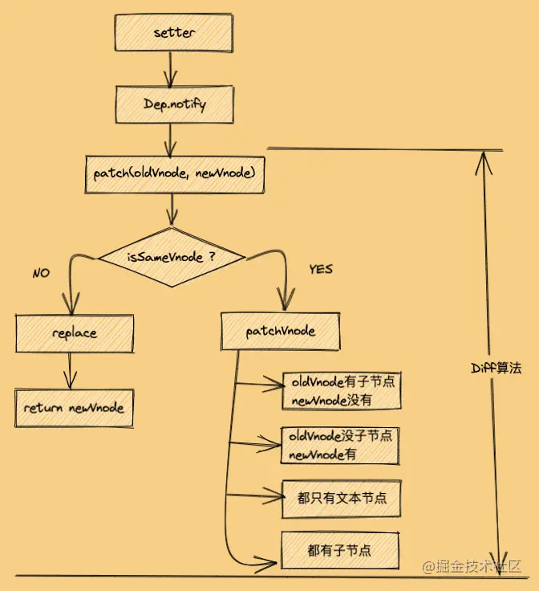

https://juejin.cn/post/6994959998283907102

# 一、在虚拟`dom`之前

在聊虚拟`DOM`之前，我还是想先聊聊在没有虚拟`DOM`概念的时候，我们是如何更新页面的，所以在这里我将先引出前端框架（库）的发展史，通过这个变迁过程也便于大家理解虚拟`dom`的出现到底解决了什么问题。

## 石器时代`jQuery`

其实在15年以及更早之前，前端面试涉及到性能优化问题，往往都会提到**尽可能少的操作`DOM`**这一点。为什么呢？因为在原生`JS`的年代，前端项目文件都明确分为`html、js`与`css`三种，我们在`js`中获取`DOM`，并为其绑定事件，通过\**事件监听**感知用户在`UI`层的操作，并随之更新`DOM`，从而达到页面交互的目的：


而在后面，`jQuery`的出现极大简化了开发者操作`DOM`的成本，抹平了当时不同浏览器操作`DOM`的`API`差异，为当时苦于`ie`以及不同浏览器自研`API`的开发者解决了不少兼容性问题，当然`JQ`也并未改变开发者在`JS`层直接操作`DOM`这一现状。

那么我们为什么说要尽可能少的操作`DOM`呢，这里就涉及到重绘与回流两个概念，比如单纯修改颜色就会引发重绘，删除或新增一个`DOM`节点就会引发回流和重绘，用户虽然无法感知这个过程，但对于浏览器而言也存在消耗性能。所以针对于回流，在此之后又提出了`DocumentFragment`文档对象以优化多次操作`DOM`的方案。简单理解就是，假如我要依次替换五个`li`节点，那么我们可以创建一个`DocumentFragment`对象保存这五个节点，然后一次性替换。

## 青铜时代`angularjs`

在`JQ`之后，`angularjs`（这里指`angularjs1`而非`angular`）横空出世，一招双向绑定在当时更是惊为天人，除此之外，`angularjs`的模板语法也格外惊艳，我们将所有与数据挂钩的节点通过`{{}}`包裹（`vue`在早期设计上大量借鉴了`angularjs`），比如：

```html
<span>{{vm.name}}</span>
```

之后 `view` 视图层就自动与 `Model` 数据层进行挂钩（`MVC`那一套），只要 `Model` 层数据发生变化，`view` 层便自动更新。`angularjs` 的这种做法，彻底将开发者从操作 `DOM` 上解放了出来（为`jq`没落埋下伏笔），自此之后开发者只用专注 `Model` 层的数据加工以及业务处理，至于页面如何渲染全权交给 `angularjs` 底层处理即好了。

但需要注意的是，`angularjs` 在当时并没有虚拟`dom`的概念，那它是怎么做感知数据层变化以及更新视图层的呢？`angularjs`有一套脏检测机制`$digest`，`html`中凡是使用了模板语法`{{}}`或者`ng-bind`指令的部分，都会被加入到脏检测的`warchers`列表中，它是一个数组，之后只要用户通过`ng-click（与传统click不同，内置绑定了触发脏检测的机制）`等方法改变了`Model`的数据，`angularjs`就会从顶层`rootScope`向下递归，依次访问每个子`scope`中的`warchers`列表，并对其中监听的部分做新旧对比，如果不同则进行数据替换，以及`DOM`层的更新。

但是你要想想，一个应用那么大的结构，只要某一个数据变化了就得从顶层向下对比N个子 `scope` 中 `warchers` 下的所有监听对象，全量对比的性能有多差可想而知，`angularjs` 自身也意识到了这点，所以之后直接放弃了 `angularjs` 的维护转而新开了 `angular` 项目。

对于 `angularjs` 脏检测感兴趣可以读读博主[深入了解angularjs中的𝑑𝑖𝑔𝑒𝑠𝑡与apply方法，从区别聊到使用优化](https://link.juejin.cn?target=https%3A%2F%2Fwww.cnblogs.com%2Fecholun%2Fp%2F11988597.html)一文，同样是时代的眼泪了。

## 铁器时代`react`与`vue`

如果从 `angularjs` 转到 `vue` ，你会发现早期`vue`的模板语法、指令，双向绑定等很多灵感其实都借鉴了`angularjs`，但在更新机制上，`vue `并不是一个改动牵动全身，而是组件均独立更新。`react` 与 `vue` 一样相对 `angularjs` 也是局部更新，只是 `react` 中的局部是以当前组件为根以及之下的所有子组件。

打个比方，如果组件 `A` 状态发生变化，那么 `A` 的所有子组件默认都会触发更新，即使子组件的`props`未发生改变，所以对于`react`我们需要使用 `PureComponent`、`shouldComponentUpdate` 以及 `memo` 来避免这种场景下的多余渲染。而在更新体系中，`react` 与 `vue` 都引入了虚拟 `DOM` 的概念，当然这也是本文需要探讨的重点。

我们先总结下上述的观点：

`js` 和 `jq`：研发在专注业务的同时，还要亲自操作 `dom`。

`angularjs版本1`：将研发从操作 `dom` 中解脱了出来，更新 `dom` 交由 `angularjs` 底层实现，这一套机制由脏检测机制所支撑。

`react/vue`：同样由底层更新 `dom`，只是在此之前多了虚拟`dom`的对比，先对比再更新，以此达到最小更新目的。

所以相对传统更新 `dom` 的策略，虚拟`dom`的更新如下：


到这里，我们站在宏观的角度解释了前端框架的变迁，以及有虚拟`dom`前后我们如何更新`dom`，也许到这里你的脑中隐约对于虚拟`dom`有了一丝感悟，但又不是很清晰，虚拟`dom`到底解决了什么问题，别着急，接下来才是虚拟`dom`的正餐，我们接着聊。

# 二、为什么会需要虚拟`dom`

在主流框架 **`Angular`** , **`Vue.js (1.0)`** 和 **`React`** 中都有一个共同点，那就是它们都不知道哪些状态（`state`）变了。因此就需要进行比对，在**`React`**中使用的**虚拟`dom`**比对， **`Angular`** 中使用的是脏检查的流程

> 而在 **`Vue.js`**中使用的是变化侦测的方式，它在一定程度上知道具体哪些状态发生了变化，这样就可以通过更细粒度的绑定来更新视图。也就是说，在`Vue.js`中，当状态发生变化时，它在一定程度上知道哪些节点使用了这个状态，从而对这些节点进行更新操作，根本不需要比对

但是这样做的代价就是，粒度太细，每一个都有对应的 `watcher` 来观察状态变化，这样就会浪费一些内存开销，绑定的越多开销越大，如果这运用在一个大型项目中，那么他的开销无疑是非常大的

因此从 `Vue.js 2.0` 开始借鉴 `React` 中的虚拟`DOM` ，组件级别是一个`watcher`实例，就是说即便一个组件内有10个节点使用了某个状态，但其实也只有一个`watcher`在观察这个状态的变化。

## 框架设计

`Vue` 和 `React` 框架设计理念都是基于**数据驱动**的，当数据发生变化时 就要去更新视图，要想知道在页面众多元素中改动数据的元素 并根据改动后的数据去更新视图 是非常困难的

> 所以 `Vue` 和 `React` 中都会有一个 **`Render`函数** 或者类似于**`Render`函数**的功能，当数据变化时 全量生成`Dom` 元素 如果是直接操作 **真实`Dom`** 的话 是很昂贵的，就会严重拖累效率，所以就不生成真实的`Dom`，而是生成虚拟的`Dom`当数据变化时就是 对象 和 对象 进行一个对比 ，这样就能知道哪些数据发生了改变 从而去操作改变的数据后的`Dom`元素

这也是一个 “妥协的结果”

## 跨平台

现阶段的框架他不仅仅能在浏览器里面使用，在小程序，移动端，或者桌面端也可以使用，但是**真实`Dom`**仅仅指的是在浏览器的环境下使用，因此他不能直接生成**真实`Dom`** ，所以选择生成一个在任何环境下都能被认识的虚拟`Dom` 最后根据不同的环境，使用**虚拟`Dom`** 去生成界面，从而实现跨平台的作用 --- 一套代码在多端运行

# 三、什么是虚拟`dom`

虚拟`DOM`是通过状态生成一个**虚拟节点树（`vnode`）** ，然后使用虚拟节点树进行渲染。 在渲染之前，会使用新生成的虚拟节点树和上一次生成的虚拟节点树进行对比 **（`diff`算法）** ，只渲染不同的部分

> 虚拟节点树其实是由组件树建立起来的整个虚拟节点（`Virtual Node`，也经常简写为`vnode`）树

在`Vue.js`中，我们使用**模板**来描述**状态**与**`DOM`**之间的**映射**关系。`Vue.js`通过编译将模板转换成渲染函数（`render`），执行渲染函数就可以得到一个虚拟节点树，使用这个虚拟节点树就可以渲染页面

### 模板编译成`render`函数

将模板编译成渲染函数可以分两个步骤，先将模板解析成**`AST`（`Abstract Syntax Tree`，抽象语法树）**，然后再使用`AST`生成渲染函数。

但是由于静态节点不需要总是重新渲染，所以在生成`AST`之后、生成渲染函数之前这个阶段，需要做一个操作，那就是遍历一遍`AST`，**给所有静态节点做一个标记**，这样在虚拟`dom`中更新节点时，如果发现节点有这个标记，就不会重新渲染它。所以，在大体逻辑上，模板编译分三部分内容：

- 将模板解析为`AST`
- 遍历`AST`标记静态节点
- 使用`AST`生成渲染函数

# 四、虚拟`dom`做了什么？

虚拟`dom`在`Vue.js`中所做的事情其实并没有想象中那么复杂，它主要做了两件事。

- **提供与真实`dom`节点所对应的虚拟节点`vnode`。**
- **将虚拟节点`vnode`和旧虚拟节点`oldVnode`进行比对，然后更新视图。**

对两个虚拟节点对比是虚拟`dom` 中最核心的算法 （`diff`），它可以判断出哪些节点发生了变化，从而只对发生了变化的节点进行更新操作

# 三、虚拟`dom`的优势是什么？

## 销毁重建与局部更新

在提及虚拟`DOM`的优势之前，我们可以先抛开什么虚拟`DOM`以及什么`MVC`思想，回想下在纯 `js` 或者 `jq` 开发角度，我们是如何连接`UI`和数据层的。其实在16年之前，博主所经历的项目开发中，`UI`和数据处理都是强耦合，比如我们页面渲染完成，使用`onload`进行监听，然后发起`ajax`请求，并在回调中加工数据，以及在此生成`DOM`片段，并将其替换到需要更新的地方。

打个比方，后端返回了一个用户列表`userList`：

```javascript
const userList = [
  'echo',
  '听风是风',
  '时间跳跃'
]
```

前端在请求完成，于是在`ajax`回调中进行`dom`片段生成以及替换工作，比如：

```
<ul id='userList'></ul>
```

```html

const ulDom = document.querySelector('#userList');
// 生成代码片段
const fragment = document.createDocumentFragment();

for (let i = 0; i < userList.length; i++) {
  const liDom = document.createElement("li");
  liDom.innerHTML = userList[i];
  // 依次生成li，并加入到代码片段
  fragment.appendChild(liDom);
}

// 最终将代码片段塞入到ul
ulDom.appendChild(fragment);
```

所以不管是页面初始化，还是之后用户通过事件发起请求更新了用户数据，到头来还是都是调用上面生成`li`的这段逻辑。在当时能想着把这段逻辑复用成一个方法，再考虑用上`createDocumentFragment`减少操作`dom`的次数，能做到这些，这在当时都是能小吹一波的了....


所以你会发现，在原生`js`的角度，根本没有所谓的`dom`对比，都是重新创建，因为在写代码之前，我们已经**明确知道了哪部分是静态页面，哪部分需要结合数据进行动态展示**。那么只需要将需要动态生成的`dom`的逻辑提前封装成方法，然后在不同时期去调用，这在当年已经是非常不错的复用了（组件的前生）。

那么问题来了，假定现在我们有一个类似`form`表单的展示功能，点击不同用户，表单就会展示用户名，年龄等一系列信息：


用`js`写怎么做？还是一样的，点击不同用户，肯定会得到一个用户信息对象，我们根据这个对象动态生成多个信息展示的`input`等相关`dom`，然后塞入到`form`表单中，所以每次点击，这个`form`其实都等同于**完全重建**了。

假定现在我们不希望完整重建这个结构，而是希望做前后`dom`节点对比，比如`input`的`value`前后不一样，某个`style`颜色不同，我们单点更新这个属性，比较笨拙的想法肯定还是得生成一份新`dom`片段，然后递归对比两个结构，且属性一一对比，只有不同的部分我们才需要更新。但仅仅通过下面这段代码，你就能预想到这个做法的性能有多糟糕了：

```javascript
// 一个li节点自带的属性就有307个
const liDom = document.createElement("li");
let num = 0;
for (let key in liDom) {
  num += 1;
}
console.log(num); // 307
```

我们生成了一个最基本的`li`节点，并通过遍历依次访问节点的属性，经过统计发现`li`单属性就`307`个，而这仅仅是一个节点。

在前面我们也提到过，不管是`jq`封装，还是`react vue`的模板语法，它的前提一定是研发自己提前知道了哪部分内容未来是可变的，所以我们才要动态封装，才需要使用`{}`进行包裹，那既然如此，我们就对比**未来可能会变的部分**不是更好吗？

而回到上文我们对于虚拟结构的抽象，对于`react`而言，`props`是可变的，`child`是可变的，`state`也是可变的，而这些属性恰好都在虚拟`dom`中均有呈现。

所以到这里，我们解释了虚拟`dom`的第一个优势，站在对比更新的角度，虚拟`dom`能聚焦于需要对比什么，相对原生`dom`它提供更高效的对比可行性。

## 更佳的兼容性

我们在上文提到，`react与babel`将`jsx`转成了`js`对象（虚拟`dom`），之后又通过`render`生成`dom`，那为啥还要转成`js`而不是直接生成`dom`呢，因为在这个中间`react`还需要做`diff`对比，兼容处理，以及跨平台的考虑，我们先说兼容处理。

准确来说，虚拟`dom`只是`react`中的一部分，要真正体现虚拟`dom`的价值，肯定得结合`react`中的其它设计来一起讲，其中一点就是结合合成事件所体现的强大的兼容性。

我们在介绍`jq`时强调了它在操作`dom`的便捷，以及各类`api`兼容性上的贡献，而`react`中使用了虚拟`dom`也做了大量的兼容。

打个比方，原生的`input`有`change`事件，普通的`div`总没有`onchange`事件吧？不管你有没有留意，其实`dom`和事件在底层已经做了强关联，不同的`dom`能触发的事件，浏览器在一开始就已经定义好了，而且你根本改不了。

但是虚拟`dom`就不同了，虚拟`dom`一方面模仿了原生`dom`的行为，其次在事件方面也做了合成事件与原生事件的映射关系，比如：

```javascript
{
  onClick: ['click'],
  onChange: ['blur', 'change', 'click', 'focus', 'input', 'keydown', 'keyup', 'selectionchange']
}
```

`react`暴露给我们的合成事件，其实在底层会关联到多个原生事件，通过这种做法抹平了不同浏览器之间的`api`差异，也带来了更强大的事件系统。

若对于合成事件若感兴趣，可以阅读博主  [八千字长文深入了解react合成事件底层原理，原生事件中阻止冒泡是否会阻塞合成事件？](https://juejin.cn/post/7118626759162986526)一文。

### 渲染优化

我们知道`react`遵循`UI = Render(state)`，只要`state`发生了改变，那么`render`就会重新触发，以达到更新`ui`层的效果。而更改`state`依赖了`setState`，大家都知道`setState`对于`state`更新的行为其实是异步的，假设我们在一次事件中更改了多次`state`，你会发现页面也仅会渲染一次。

而假定我们是直接操作`dom`，那还有哪门子的异步和渲染等待，当你`append`完一个子节点，页面早渲染完了。所以虚拟`dom`的对比提前，以及`setState`的异步处理，本质上也是在像尽可能少的操作`dom`靠近。

若对于`setState`想有更深入的了解，可以阅读博主这两篇文章：

[react中的setState是同步还是异步？react为什么要将其设计成异步？](https://juejin.cn/post/7116834546007900197)

[react 聊聊setState异步背后的原理，react如何感知setState下的同步与异步？](https://juejin.cn/post/7117582507595268127)

###  跨平台能力

同理，之所以加入虚拟`dom`这个中间层，除了解决部分性能问题，加强兼容性之外，还有个目的是将`dom`的更新抽离成一个公共层，别忘了`react`除了做页面引用外，`react`还支持使用`React Native`做原生`app`。所以针对同一套虚拟`dom`体系，`react`只是在最终将体现在了不同的平台上而已。

# 四、虚拟DOM比原生快吗？

那么问题来了，聊了这么久的虚拟`dom`，虚拟`dom`性能真的比操作原生`dom`要更快吗？很遗憾的说，并不是，或者说不应该这样粗暴的去对比。

我们在前面虽然对比了虚拟`dom`属性以及原生`dom`的属性量级，但事实上我们并不会对原生`dom`属性进行递归对比，而是直接操作`dom`。而且站在`react`角度，即便经历了`diff`算法以及一系列的优化，`react`到头来还是要操作原生`dom`，只是对于研发来讲不用关注这一步罢了。

所以我们可以想象一下，现在要替换`p`标签的内容，用原生就是直接修改`innerHTML`属性，对于`react`而言它需要先生成虚拟`dom`，然后新旧`diff`找出变化的部分，最后才修改原生`dom`，单论这个例子，一定是原生快。

但我们既然说虚拟`dom`，就一定得结合`react`的使命来解释，虚拟`dom`的核心目的是**模拟了原生`dom`大部分特性，让研发高效无痛写`html`的同时，还达到了单点刷新而不是整个替换（前面表单替换的例子），最重要的，它也将研发从繁琐的`dom`操作中解放了出来**。

总结来说，单论修改一个`dom`节点的性能，不管`react`还是`vue`亦或是`angular`，一定是原生最快，但虚拟`dom`有原生`dom`比不了的价值，起码`react`这些框架能让研发更专注业务以及数据处理，而不是陷入繁琐的`dom`增删改查中。

# 一、虚拟``DOM`` #

## 什么是虚拟`DOM`？

虚拟`DOM`是一个对象，一个什么样的对象呢？一个用来表示真实`DOM`的对象，即虚拟`DOM`就是将真实的`DOM`的数据抽离出来，以对象的形式模拟树形结构，看下面例子：

```
<ul id="list">
    <li class="item">哈哈</li>
    <li class="item">呵呵</li>
    <li class="item">嘿嘿</li>
</ul>
```

对应的虚拟`DOM`为：

    // 旧虚拟DOM
    
    let oldVDOM = { 
        tagName: 'ul', // 标签名
        props: { // 标签属性
            id: 'list'
        },
        children: [ // 标签子节点
            {
                tagName: 'li', props: { class: 'item' }, children: ['哈哈']
            },
            {
                tagName: 'li', props: { class: 'item' }, children: ['呵呵']
            },
            {
                tagName: 'li', props: { class: 'item' }, children: ['嘿嘿']
            }
        ]
    }


这时候，我修改一个`li`标签的文本：

		<ul id="list">
		    <li class="item">哈哈</li>
		    <li class="item">呵呵</li>
		    <li class="item">林三心哈哈哈哈哈</li> // 修改
		</ul>

这时候生成的新虚拟`DOM`为：

        // 新虚拟`DOM`
    
    	let newVDOM = { 
    	        tagName: 'ul', // 标签名
    	        props: { // 标签属性
    	            id: 'list'
    	        },
    	        children: [ // 标签子节点
    	            {
    	                tagName: 'li', props: { class: 'item' }, children: ['哈哈']
    	            },
    	            {
    	                tagName: 'li', props: { class: 'item' }, children: ['呵呵']
    	            },
    	            {
    	                tagName: 'li', props: { class: 'item' }, children: ['林三心哈哈哈哈哈']
    	            },
    	        ]
    	    }


这就是咱们平常说的新旧两个虚拟`DOM`，这个时候的新虚拟`DOM`是数据的最新状态，那么我们直接拿新虚拟`DOM`去渲染成真实`DOM`的话，效率真的会比直接操作真实`DOM`高吗？那肯定是不会的，看下图：


示例1是创建一个`DOMB`然后替换掉`DOMA`;示例2去创建虚拟`DOM`+`DIFF`算法比对发现`DOMB`跟`DOMA`不是相同的节点,最后还是创建一个`DOMB`然后替换掉`DOMA`;可以明显看出1是更快的。同样的结果，2还要去创建虚拟`DOM`+`DIFF`算法对比，所以说使用虚拟`DOM`比直接操作真实`DOM`就一定要快这个说法是错误的，不严谨的。

# 二、什么是`diff`算法 #


上图中，其实只有一个`li`标签修改了文本，其他都是不变的，所以没必要所有的节点都要更新，只更新这个`li`标签就行，`Diff`算法就是查出这个`li`标签的算法。

所以，当一些复杂的节点,比如说一个父节点里面有多个子节点,当只是一个子节点的内容发生了改变,那么我们没有必要像示例1重新去渲染这个`DOM`树,这个时候虚拟`DOM`+`DIFF`算法就能够得到很好的体现,我们通过示例2使用**虚拟`DOM`+`Diff`算法**去找出改变了的子节点更新它的内容就可以了。

`diff `算法首先要明确一个概念就是 ``diff ``的对象是虚拟`DOM`（`virtual DOM`），更新真实 `DOM` 是 ``diff ``算法的结果。`Diff`算法是一种对比算法，对比两者是旧虚拟`DOM`和新虚拟`DOM`，对比出是哪个虚拟节点更改了，找出这个虚拟节点，并只更新这个虚拟节点所对应的真实节点，而不用更新其他数据没发生改变的节点，实现精准地更新真实`DOM`，进而提高效率。

# 三、为什么要使用虚拟`DOM` #

当然是前端优化方面，避免频繁操作`DOM`，频繁操作`DOM`会可能让浏览器回流和重绘，性能也会非常低，还有就是手动操作 `DOM` 还是比较麻烦的，要考虑浏览器兼容性问题，当前`jQuery`等库简化了 `DOM`操作，但是项目复杂了，`DOM`操作还是会变得复杂，数据操作也变得复杂

并不是所有情况使用虚拟`DOM` 都提高性能，是针对在复杂的的项目使用。如果简单的操作，使用虚拟`DOM`,要创建虚拟`DOM`对象等等一系列操作，还不如普通的`DOM` 操作

虚拟`DOM` 可以实现跨平台渲染，服务器渲染 、小程序、原生应用都使用了虚拟`DOM`

使用虚拟`DOM`改变了当前的状态不需要立即的去更新`DOM` 而且更新的内容进行更新，对于没有改变的内容不做任何操作，通过前后两次差异进行比较

虚拟 `DOM` 可以维护程序的状态，跟踪上一次的状态

# 四、`diff`算法原理 #

## `Diff`同层对比

传统的计算两颗树的差异时间复杂度为`O(n^3)`,显然成本比较高（老树的每一个节点都去遍历新树的节点，直到找到新树对应的节点。那么这个流程就是 `O(n^2)`，再紧接着找到不同之后，再计算最短修改距离然后修改节点，这里是 `O(n^3)`。）

新旧虚拟`DOM`对比的时候，`Diff`算法比较只会在同层级进行, 不会跨层级比较。 所以`Diff`算法是:深度优先算法。 时间复杂度:`O(n)`


## `diff`的对比流程

当数据改变时，会触发`setter`，并且通过`Dep.notify`去通知所有订阅者`Watcher`，订阅者们就会调用`patch`方法，给真实`DOM`打补丁，更新相应的视图

`newVnode`和`oldVnode`：同层的新旧虚拟节点



### `patch`方法

`patch`函数是`diff`流程的入口函数，这个方法作用就是，对比当前同层的虚拟节点是否为同一种类型的标签(同一类型的标准，下面会讲)：

- 是：继续执行`patchVnode`方法进行深层比对
- 否：没必要比对了，直接整个节点替换成新虚拟节点

来看看`patch`的核心原理代码

```
function patch(oldVnode, newVnode) {

  // 比较是否为一个类型的节点
  if (sameVnode(oldVnode, newVnode)) {

    // 是：继续进行深层比较
    patchVnode(oldVnode, newVnode)

  } else {
    // 否

    const oldEl = oldVnode.el // 旧虚拟节点的真实DOM节点

    const parentEle = api.parentNode(oldEl) // 获取父节点

    createEle(newVnode) // 创建新虚拟节点对应的真实DOM节点

    if (parentEle !== null) {

      api.insertBefore(parentEle, vnode.el, api.nextSibling(oEl)) // 将新元素添加进父元素

      api.removeChild(parentEle, oldVnode.el)  // 移除以前的旧元素节点

      // 设置null，释放内存
      oldVnode = null
    }
  }

  return newVnode
}
```
### `sameVnode`方法

`patch`关键的一步就是`sameVnode`方法判断是否为同一类型节点，那问题来了，怎么才算是同一类型节点呢？这个类型的标准是什么呢？

咱们来看看`sameVnode`方法的核心原理代码，就一目了然了


```
function sameVnode(oldVnode, newVnode) {
    return (
	    oldVnode.key === newVnode.key && // key值是否一样
	    oldVnode.tagName === newVnode.tagName && // 标签名是否一样
	    oldVnode.isComment === newVnode.isComment && // 是否都为注释节点
	    isDef(oldVnode.data) === isDef(newVnode.data) && // 是否都定义了data
	    sameInputType(oldVnode, newVnode) // 当标签为input时，type必须是否相同
	  )
   }
```
### `patchVnode`方法

这个函数做了以下事情：

- 找到对应的真实`DOM`，称为`el`
- 判断`newVnode`和`oldVnode`是否指向同一个对象，如果是，那么直接`return`
- 如果他们都有文本节点并且不相等，那么将`el`的文本节点设置为`newVnode`的文本节点。
- 如果`oldVnode`有子节点而`newVnode`没有，则删除`el`的子节点
- 如果`oldVnode`没有子节点而`newVnode`有，则将`newVnode`的子节点真实化之后添加到`el`
- 如果两者都有子节点，则执行`updateChildren`函数比较子节点，这一步很重要

			

        function patchVnode(oldVnode, newVnode) {
	          // 获取真实DOM对象
    	  const el = newVnode.el = oldVnode.el 
	    
	    	  // 获取新旧虚拟节点的子节点数组
    	  const oldCh = oldVnode.children, newCh = newVnode.children
	    
	    	  // 如果新旧虚拟节点是同一个对象，则终止
    	  if (oldVnode === newVnode) return
	    
	    	  // 如果新旧虚拟节点是文本节点，且文本不一样
    	  if (oldVnode.text !== null && newVnode.text !== null && oldVnode.text !== newVnode.text) {
	    
	    	    // 则直接将真实DOM中文本更新为新虚拟节点的文本
    	    api.setTextContent(el, newVnode.text)
	    
	    	  } else {
	    	    // 否则
	    	
	    	    if (oldCh && newCh && oldCh !== newCh) {
	    	      // 新旧虚拟节点都有子节点，且子节点不一样
	    	
	    	      // 对比子节点，并更新
    	      updateChildren(el, oldCh, newCh)
	    
	    	    } else if (newCh) {
	    	      // 新虚拟节点有子节点，旧虚拟节点没有
	    	
	    	      // 创建新虚拟节点的子节点，并更新到真实DOM上去
    	      createEle(newVnode)
	    
	    	    } else if (oldCh) {
	    	      // 旧虚拟节点有子节点，新虚拟节点没有
	    	
	    	      //直接删除真实DOM里对应的子节点
	    	      api.removeChild(el)
	    	    }
	    	  }
	    	}

### `updateChildren`方法

这是`patchVnode`里最重要的一个方法，新旧虚拟节点的子节点对比，就是发生在`updateChildren`方法中，是怎么样一个对比方法呢？就是首尾指针法，新的子节点集合和旧的子节点集合，各有首尾两个指针，举个例子：

```
<ul>
    <li>a</li>
    <li>b</li>
    <li>c</li>
</ul>
```


```
	修改数据后
	
	<ul>
	    <li>b</li>
	    <li>c</li>
	    <li>e</li>
	    <li>a</li>
	</ul>
```
那么新旧两个子节点集合以及其首尾指针为：


然后会进行互相进行比较，总共有五种比较情况：

1. `oldS `和 `newS  `使用`sameVnode`方法进行比较，`sameVnode`(`oldS`, `newS`)，相同则执行`patchVnode`找出两者之间的差异;如没有差异则什么都不操作,结束一次循环
2. `oldS `和 `newE `使用`sameVnode`方法进行比较，`sameVnode`(`oldS`, `newE`)，相同则执行`patchVnode`找出两者之间的差异;如没有差异则什么都不操作,结束一次循环
3. `oldE  `和 `newS  `使用`sameVnode`方法进行比较，`sameVnode`(`oldE`, `newS`)，相同则执行`patchVnode`找出两者之间的差异;如没有差异则什么都不操作,结束一次循环
4. `oldE  `和 `newE `使用`sameVnode`方法进行比较，`sameVnode`(`oldE`, `newE`)，相同则执行`patchVnode`找出两者之间的差异;如没有差异则什么都不操作,结束一次循环
5. 如果以上逻辑都匹配不到，分为两种情况：

    **如果新旧节点都有`key`**，那么会根据`oldChild`的`key`生成一张`hash`表（旧子节点的 `key` 做一个映射到旧节点下标的 `key -> index` 表），用`newStartVnode`的`key`与`hash`表做匹配，匹配成功，就通过`sameVnode()`比对

    - 比对成功：在真实`DOM`中将成功的节点移到`newStartVnode`对应的位置
    - 比对失败：(虽然他们具有相同的`key`,但不是同一个元素)，当新元素对待，直接创建

    https://juejin.cn/post/6990582632270528525#heading-13

    ```
       // 当四种策略都没有命中
      // keyMap 为缓存，这样就不用每次都遍历老对象
      if (!keyMap) {
        // 初始化 keyMap
        keyMap = {}
        // 从oldStartIdx到oldEndIdx进行遍历
        for (let i = oldStartIdx; i < oldEndIdx; i++) {
          // 拿个每个子对象 的 key
          const key = oldCh[i].data.key
          // 如果 key 不为 undefined 添加到缓存中
          if (!key) keyMap[key] = i
        }
      }
    ```
      **如果没有`key`**，则认为`newStartVnode`是一个新元素，则直接将`newStartVnode`生成新的节点插入真实`DOM`（`ps`：这下可以解释为什么`v-for`的时候需要设置`key`了，如果没有`key`那么就只会做四种匹配，就算指针中间有可复用的节点都不能被复用了）

执行过程是一个循环，在每次循环里，只要执行了上述的情况的五种之一就会结束一次循环

接下来就以上面代码为例，分析一下比较的过程

分析之前，请大家记住一点，最终的渲染结果都要以`newVDOM`为准，这也解释了为什么之后的节点移动需要移动到`newVDOM`所对应的位置

   

#### 第一步

```
oldS = a, oldE = c
newS = b, newE = a
```

比较结果：`oldS `和 `newE `相等，需要把节点`a`移动到`newE`所对应的位置，也就是末尾，同时`oldS++`，`newE--`

   

#### 第二步

    oldS = b, oldE = c
    newS = b, newE = e
比较结果：`oldS `和 `newS`相等，需要把节点`b`移动到`newS`所对应的位置，同时`oldS++`，`newS++`

  

#### 第三步

```
oldS = c, oldE = c
newS = c, newE = e
```

比较结果：`oldS`、`oldE  `和 `newS`相等，需要把节点c移动到`newS`所对应的位置，同时`oldS++`，`newS++`

   

#### 第四步

```
oldS > oldE
```

则`oldCh`先遍历完成了，而`newCh`还没遍历完，说明`newCh`比`oldCh`多，所以需要将多出来的节点，插入到真实`DOM`上对应的位置上

   

`updateChildren`的核心原理代码


    function updateChildren(parentElm, oldCh, newCh) {
      let oldStartIdx = 0, newStartIdx = 0
      let oldEndIdx = oldCh.length - 1
      let oldStartVnode = oldCh[0]
      let oldEndVnode = oldCh[oldEndIdx]
      let newEndIdx = newCh.length - 1
      let newStartVnode = newCh[0]
      let newEndVnode = newCh[newEndIdx]
      let oldKeyToIdx
      let idxInOld
      let elmToMove
      let before
      
      while (oldStartIdx <= oldEndIdx && newStartIdx <= newEndIdx) {
      
        if (oldStartVnode == null) {
          oldStartVnode = oldCh[++oldStartIdx]
        } else if (oldEndVnode == null) {
          oldEndVnode = oldCh[--oldEndIdx]
        } else if (newStartVnode == null) {
          newStartVnode = newCh[++newStartIdx]
        } else if (newEndVnode == null) {
          newEndVnode = newCh[--newEndIdx]
        } else if (`sameVnode`(oldStartVnode, newStartVnode)) {
          patchVnode(oldStartVnode, newStartVnode)
          oldStartVnode = oldCh[++oldStartIdx]
          newStartVnode = newCh[++newStartIdx]
        } else if (`sameVnode`(oldEndVnode, newEndVnode)) {
          patchVnode(oldEndVnode, newEndVnode)
          oldEndVnode = oldCh[--oldEndIdx]
          newEndVnode = newCh[--newEndIdx]
        } else if (`sameVnode`(oldStartVnode, newEndVnode)) {
          patchVnode(oldStartVnode, newEndVnode)
          api.insertBefore(parentElm, oldStartVnode.el, api.nextSibling(oldEndVnode.el))
          oldStartVnode = oldCh[++oldStartIdx]
          newEndVnode = newCh[--newEndIdx]
    
        } else if (`sameVnode`(oldEndVnode, newStartVnode)) {
    
          patchVnode(oldEndVnode, newStartVnode)
          api.insertBefore(parentElm, oldEndVnode.el, oldStartVnode.el)
          oldEndVnode = oldCh[--oldEndIdx]
          newStartVnode = newCh[++newStartIdx]
    
        } else {
          // 使用key时的比较
          if (oldKeyToIdx === undefined) {
            oldKeyToIdx = createKeyToOldIdx(oldCh, oldStartIdx, oldEndIdx) // 有key生成index表
          }
          idxInOld = oldKeyToIdx[newStartVnode.key]
          if (!idxInOld) {
            api.insertBefore(parentElm, createEle(newStartVnode).el, oldStartVnode.el)
            newStartVnode = newCh[++newStartIdx]
          }
          else {
            elmToMove = oldCh[idxInOld]
            if (elmToMove.sel !== newStartVnode.sel) {
              api.insertBefore(parentElm, createEle(newStartVnode).el, oldStartVnode.el)
            } else {
              patchVnode(elmToMove, newStartVnode)
              oldCh[idxInOld] = null
              api.insertBefore(parentElm, elmToMove.el, oldStartVnode.el)
            }
            newStartVnode = newCh[++newStartIdx]
          }
        }
      }
      
      if (oldStartIdx > oldEndIdx) {
      
        before = newCh[newEndIdx + 1] == null ? null : newCh[newEndIdx + 1].el
        addVnodes(parentElm, before, newCh, newStartIdx, newEndIdx)
        
      } else if (newStartIdx > newEndIdx) {
      
        removeVnodes(parentElm, oldCh, oldStartIdx, oldEndIdx)
      }
    }

# 五、`key`的作用 #

`key`的作用主要是为了高效的更新虚拟`DOM`，其原理是`vue`在`patch`过程中通过`key`可以精准判断两个节点是否是同一个，从而避免频繁更新不同元素，使得整个`patch`过程更加高效，减少`DOM`操作量，提高性能。


上图中，没有`key`值时，在`a`、`b`、`c`的`c`后面加了一个`z`，新旧节点的`a`进行`sameVnode`（`key`都为`undefined`相同）返回`true`，然后进行`pathVnode`，新旧虚拟节点是同一个对象，直接`return`。`b`同`a`一样判断。重点看下`c`和`z`进行`sameVnode`（`key`都为`undefined`相同，标签什么都相同）返回`true`，然后进行`pathVnode`，只有`text`不相同，所以只是将真实`DOM`的`text`的`c`改为`z`。然后，新建一个节点`c`插入。

上图中，有`key`值时，每个节点都有自己的key值，则`c`和`z`进行`sameVnode`返回`false`，则新节点`c`又继续和旧节点`c`比较返回`true`，最后只需要新建一个`z`节点插入。

当没有`key`的时候，会认为永远是相同的节点，会一直走`patchVnode`。上面两种情况，`DOM`操作次数不同。前面的遍历`a`、`b`过程`DOM`一样，没有操作，但是从`c`开始后面两次是进行了`DOM`的操作的，一次`DOM`更新和一次创建插入。

## 为什么不建议使用`index`做`key`值 

平常`v-for`循环渲染的时候，为什么不建议用`index`作为循环项的key呢？我们举个例子，左边是初始数据，然后我在数据前插入一个新数据，变成右边的列表：

```
<ul>                      <ul>
<li key="0">a</li>       	<li key="0">林三心</li>
<li key="1">b</li>        	<li key="1">a</li>
<li key="2">c</li>        	<li key="2">b</li>
                            <li key="3">c</li>
</ul>                     </ul>
```


按理说，最理想的结果是：只插入一个`li`标签新节点，其他都不动，确保操作`DOM`效率最高。但是我们这里用了`index`来当`key`的话，真的会实现我们的理想结果吗？可是实践发现，添加这一个`li`，所有`li`标签都更新了，为什么会这样呢？还是通过图来解释

按理说，`a`、`b`、`c`三个`li`标签都是复用之前的，因为他们三个根本没改变，改变的只是前面新增了一个林三心


但是我们前面说了，在进行子节点的 `diff`算法 过程中，会进行 旧首节点和新首节点的`sameNode`对比，这一步命中了逻辑，因为现在新旧两次首部节点 的 `key` 都是 0了，同理，`key`为1和2的也是命中了逻辑，导致相同`key`的节点会去进行`patchVnode`更新文本，而原本就有的c节点，却因为之前没有`key`为4的节点，而被当做了新节点，所以很搞笑，使用`index`做`key`，最后新增的居然是本来就已有的c节点。所以前三个都进行`patchVnode`更新文本，最后一个进行了新增，那就解释了为什么所有`li`标签都更新了。

那我们可以怎么解决呢？其实我们只要使用一个独一无二的值来当做`key`就行了

```
<ul>
   <li v-for="item in list" :key="item.id">{{ item.title }}</li>
</ul>
```

为什么用了`id`来当做`key`就实现了我们的理想效果呢，因为这么做的话，`a`、`b`、`c`节点的`key`就会是永远不变的，更新前后`key`都是一样的，并且又由于`a`、`b`、`c`节点的内容本来就没变，所以就算是进行了`patchVnode`，也不会执行里面复杂的更新操作，节省了性能，而林三心节点，由于更新前没有他的`key`所对应的节点，所以他被当做新的节点，增加到真实`DOM`上去了。


