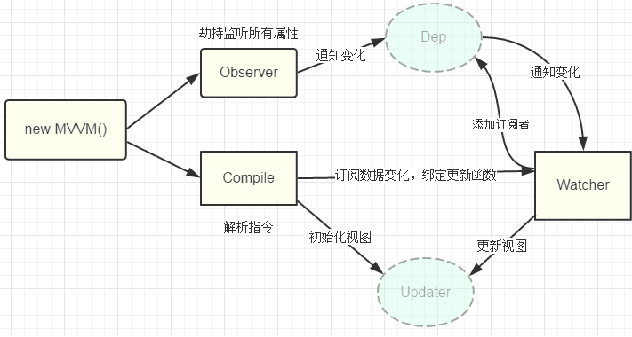

https://juejin.cn/post/6844903601416978439#heading-1

一、前言

  1. vue的三要素

       - 响应式：例如如何监听数据变化,其中的实现方法就是我们提到的双向绑定
       - 模板引擎: 如何解析模板
       - 渲染: Vue如何将监听到的数据变化和解析后的HTML进行渲染

  2. 双向绑定简述

     - 可以实现双向绑定的方法有很多,KnockoutJS基于观察者模式的双向绑定,Ember基于数据模型的双向绑定,Angular基于脏检查的双向绑定,本篇文章我们重点讲面试中常见的基于数据劫持的双向绑定。
     - 常见的基于数据劫持的双向绑定有两种实现,一个是目前Vue在用的Object.defineProperty,另一个是ES2015中新增的Proxy,而Vue的作者宣称将在Vue3.0版本后加入Proxy从而代替Object.defineProperty。严格来讲Proxy应该被称为『代理』而非『劫持』,不过由于作用有很多相似之处,我们在下文中就不再做区分,统一叫『劫持』。

二、基于数据劫持实现的双向绑定的特点

   1. 什么是数据劫持？

        - 通常我们利用Object.defineProperty劫持对象的访问器，在属性值发生变化的时候我们可以获取到变化，从而进行进一步操作。

   2. 数据劫持的优势

        - 无需显式调用：例如vue运用数据劫持+发布订阅模式，直接可以通知变化并驱动视图。
        - 可精确的得知变化数据：我们劫持了属性的setter，当属性值改变，我们可以精确获知变化的内容newVal，因此这部分不需要额外的diff操作，否则我们只知道数据发生了变化，而不知道具体那些数据变化了，这个时候需要大量diff来找出变化值，这是额外性能损耗。

   3. 基于数据劫持双向绑定的实现思路

        - 基于数据劫持的双向绑定离不开proxy和Object.defineProperty等方法对对象/对象的属性的劫持，我们要实现一个完整的双向绑定需要以下几个要点：
        
           - （1）利用Proxy或Object.defineProperty生成的Observer针对对象/对象的属性进行"劫持",在属性发生变化后通知订阅者
           - （2）解析器Compile解析模板中的Directive(指令)，收集指令所依赖的方法和数据,等待数据变化然后进行渲染
           - （3）Watcher属于Observer和Compile桥梁,它将接收到的Observer产生的数据变化,并根据Compile提供的指令进行视图渲染,使得数据变化促使视图变化

                   

三、基于Object.defineProperty双向绑定的特点

  1. 使用Object.defineProperty实现的双向绑定
  
      https://segmentfault.com/a/1190000006599500

  2. Object.defineProperty的缺陷

   （1）Object.defineProperty不具备监听数组的能力

          - 由于Object.defineProperty不具备监听数组的能力，所以vue在实现数组的响应式时，把无法监听数组的情况通过重写数组的部分方法来实现响应式，这也只限制在数组的push/pop/shift/unshift/splice/sort/reverse七个方法，其他数组方法及数组的使用则无法检测到，比如对数组基于下标的修改、对于 .length 修改的监测。

                const aryMethods = ['push', 'pop', 'shift', 'unshift', 'splice', 'sort', 'reverse'];
                const oldArrayProperty = Array.prototype
				const arrayAugmentations = Object.create(oldArrayProperty);
				
				aryMethods.forEach((method)=> {
				
				    // 这里是原生Array的原型方法
				    let original = oldArrayProperty[method];
				
				   // 将push, pop等封装好的方法定义在对象arrayAugmentations的属性上
				   // 注意：是属性而非原型属性
				    arrayAugmentations[method] = function () {
				         updateView();
				        // 调用对应的原生方法并返回结果
				        return original.apply(this, arguments);
				    };
				
				});
				
				
             将传入的data属性进行深度监听，判断是对象还是数组

                 function observer(target){
				     if(typeof target !== 'object' || target === null){
				         return target
				     }
				 
				     // 如果是数组类型,重写数组原型的方法("push","pop","shift","unshift","splice")
				     if(Array.isArray(target)){
				         target.__proto__ == arrayAugmentations;
				     }
				 
				     // 如果是对象，遍历对象所有的属性，并使用Object.defineProperty把这些属性全部转为getter/setter
				     for(let key in target){
				         defineReactive(target,key,target[key])
				     }
				 }

   （2）由于Vue会在初始化实例时对属性执行getter/setter转化，所有属性必须在data对象上存在才能让Vue将它转换为响应式。
   （3）Object.defineProperty只能劫持对象的属性,因此我们需要对每个对象的每个属性进行遍历，如果属性值也是对象那么需要深度遍历,显然能劫持一个完整的对象是更好的选择。
   （4）无法检测到对象属性的新增或删除。

         - 由于js的动态性，可以为对象追加新的属性或者删除其中某个属性，这点对经过Object.defineProperty方法建立的响应式对象来说，只能追踪对象已有数据是否被修改，无法追踪新增属性和删除属性，这就需要另外处理。
         

四、Proxy实现的双向绑定的特点

   1. Proxy可以直接监听对象而非属性
   2. Proxy可以直接监听数组的变化
   3. Proxy有多达13种拦截方法,不限于apply、ownKeys、deleteProperty、has等等是Object.defineProperty不具备的
   4. Proxy返回的是一个新对象,我们可以只操作新的对象达到目的,而Object.defineProperty只能遍历对象属性直接修改。
   5. Proxy的劣势就是兼容性问题,而且无法用polyfill磨平,因此Vue的作者才声明需要等到下个大版本(3.0)才能用Proxy重写。

  