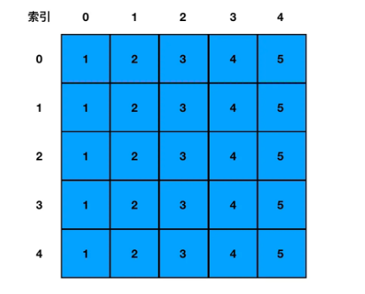
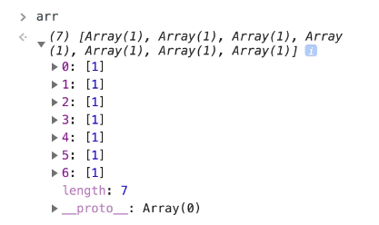
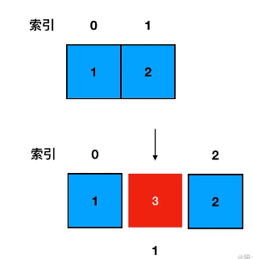

 #### 一、数组的创建 ####

 - 大家平时用的最多的创建方式想必就是直接方括号+元素内容这种形式：

    const arr = [1, 2, 3, 4] 

 - 不过**在算法题中**，很多时候我们初始化一个数组时，并不知道它内部元素的情况。这种场景下，要给大家**推荐的是构造函数创建数组的方法**：

    const arr = new Array()

- 当我们以构造函数的形式创建数组时，若我们像楼上这样，不传任何参数，得到的就会是一个空数组。等价于：

    const arr = []

- **使用构造函数创建空数组，往往是因为我们有“创造指定长度的空数组”这样的需求。需要多长的数组，就给它传多大的参数**：

    const arr = new Array(7)

- 这样的写法就可以得到一个长度为7的数组

- 在一些场景中，这个需求会稍微变得有点复杂—— “**创建一个长度确定、同时每一个元素的值也都确定的数组”。这时我们可以调用 fill 方法**，假设需求是每个坑里都填上一个1，只需给它 fill 一个1：

    const arr = (new Array(7)).fill(1)

- 如此便可以得到一个长度为7，且每个元素都初始化为1的数组：

#### 二、数组的访问和遍历 ####

- **访问数组中的元素，我们直接在中括号中指定其索引即可**：

     arr[0] // 访问索引下标为0的元素

- 而**遍历数组，这个方法就多了，不过目的往往都是一致的——访问到数组中的每个元素，并且知道当前元素的索引**。这里我们讲三个方法：

**1.for 循环**

  - 这个是最最基础的操作。我们可以通过循环数组的下标，来依次访问每个值：

		// 获取数组的长度
		const len = arr.length

		for(let i=0;i<len;i++) {

		    // 输出数组的元素值，输出当前索引
		    console.log(arr[i], i)
		}

**2.forEach方法**

  - 通过取 forEach 方法中传入函数的第一个入参和第二个入参，我们也可以取到数组每个元素的值及其对应索引：

		arr.forEach((item, index)=> {
		    // 输出数组的元素值，输出当前索引
		    console.log(item, index)
		})

**3.map 方法**

  - map 方法在调用形式上与 forEach 无异，区别在于 map 方法会根据你传入的函数逻辑对数组中每个元素进行处理、进而返回一个全新的数组。
  
  - 所以其实 map 做的事情不仅仅是遍历，而是在遍历的基础上“再加工”。当我们需要对数组内容做批量修改、同时修改的逻辑又高度一致时，就可以调用 map 来达到我们的目的：
 
		const newArr = arr.map((item, index)=> {
		    // 输出数组的元素值，输出当前索引
		    console.log(item, index)
		    // 在当前元素值的基础上加1
		    return item+1
		})

   - 这段代码就通过 map 来返回了一个全新的数组，数组中每个元素的值都是在其现有元素值的基础上+1后的结果。

   - **这里给个小建议：个人推荐如果没有特殊的需要，那么统一使用 for 循环来实现遍历。因为从性能上看，for 循环遍历起来是最快的。**

#### 三、二维数组 ####

	const arr = [
	  [1,2,3,4,5],
	  [1,2,3,4,5],
	  [1,2,3,4,5],
	  [1,2,3,4,5],
	  [1,2,3,4,5]
	]

- 直接把它的逻辑结构画出来看，是这样：

  

- 二维数组的特点：从形状上看，相对于一维数组一条“线”一般的布局，二维数组更像是一个“面”

- 在数学中，形如这样长方阵列排列的复数或实数集合，被称为“矩阵”。因此**二维数组的别名就叫“矩阵”。**

- 讲到这里，如果有对“矩阵”的定义一脸懵逼的同学，也不用怕——不知道“矩阵”是啥，一点不打紧，但你必须要**记住“矩阵”和“二维数组”之间的等价关系**。在算法题目中，见到“矩阵”时，能够立刻反射出它说的是二维数组，不被别名整懵逼，这就够了。

#### 四、二维数组的初始化 ####

**1.fill 的局限性**

- 有同学用 fill 方法用顺了手，就本能地想用 fill 解决所有的问题，比如初始化一个二维数组：

    const arr =(new Array(7)).fill([])

- 乍一看没啥毛病，7个坑都被乖乖地填上了数组元素：

- 但是当你想修改某一个坑里的数组的值的时候：

	arr[0][0] = 1

- 你会发现一整列的元素都被设为了 1：

  

这是因为**当你给 fill 传递一个入参时，如果这个入参的类型是引用类型，那么fill在填充坑位时填充的其实就是入参的引用**。也就是说下图中虽然看似我们给7个坑位各初始化了一个数组，**其实这7个数组对应了同一个引用、指向的是同一块内存空间，它们本质上是同一个数组**。因此当你修改第0行第0个元素的值时，第1-6行的第0个元素的值也都会跟着发生改变。

**2.初始化一个二维数组**

- 本着安全的原则，这里**我推荐大家采纳的二维数组初始化方法非常简单（而且性能也不错）。直接用一个 for 循环来解决**：

	const len = arr.length
	for(let i=0;i<len;i++) {
	    // 将数组的每一个坑位初始化为数组
	    arr[i] = []
	}

- for 循环中，每一次迭代我们都通过“[]”来创建一个新的数组，这样便不会有引用指向问题带来的尴尬。

**3.二维数组的访问**

- 访问二维数组和访问一维数组差别不大，区别在于我们现在需要的是两层循环：

	// 缓存外部数组的长度
	const outerLen = arr.length
	for(let i=0;i<outerLen;i++) {
	    // 缓存内部数组的长度
	    const innerLen = arr[i].length
	    for(let j=0;j<innerLen;j++) {
	        // 输出数组的值，输出数组的索引
	        console.log(arr[i][j],i,j)
	    }
	}

- 一维数组用 for 循环遍历只需一层循环，二维数组是两层，三维数组就是三层。依次类推，**N 维数组需要 N 层循环来完成遍历。**

#### 五、灵活增删的数组 ####

- 数组的增删操作可以说是没有任何限制的，允许我们在任何位置执行想要的操作。

**1.数组中增加元素的三种方法**

 (1) **unshift方法**-添加元素到数组的头部

		const arr = [1,2]
		arr.unshift(0) // [0,1,2]

 (2) **push 方法**-添加元素到数组的尾部

		const arr = [1,2]
		arr.push(3) // [1,2,3]

 (3) **splice 方法**-添加元素到数组的任何位置

		const arr = [1,2] 
		arr.splice(1,0,3) // [1,3,2]

- 在这个例子里，我们就指明了从 arr[1] 开始，删掉 0 个元素，并且在索引为1的地方新增了值为3的元素。

- 因为删掉的元素是0个，所以说 arr[1] 中原有的元素值“2”仍然会被保留下来；同时**因为我们后面又指定了 arr[1] 处需要新增一个元素3，那么这个3就会把原来arr[1]这个地方的元素给“挤到后面去”。这样我们就做到了在数组中任意位置进行元素的新增**。这个过程如下图：

  

**2.数组中删除元素的三种方法**

 (1) **shift方法**-添加元素到数组的头部

		const arr = [1,2,3]
		arr.shift() // [2,3]

 (2) **pop 方法**-删除数组尾部的元素

		const arr = [1,2,3]
		arr.pop() // [1,2]

 (3) **splice 方法**-删除数组任意位置的元素

        arr.splice(1,1)
