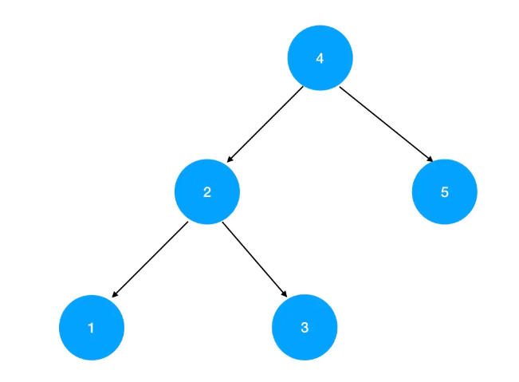
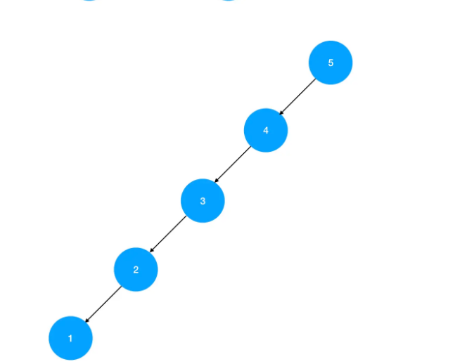

#### 一、“遍历三兄弟”的迭代实现  ####

**1.前序**

力扣地址：https://leetcode.cn/problems/binary-tree-preorder-traversal/

**思路分析**

前序遍历的规则是，先遍历根结点、然后遍历左孩子、最后遍历右孩子——这正是我们所期望的出栈序列。按道理，入栈序列和出栈序列相反，我们似乎应该按照 右->左->根 这样的顺序将结点入栈。不过需要注意的是，我们遍历的起点就是根结点，难道我们要假装没看到这个根结点、一鼓作气找到最右侧结点之后才开始进行入栈操作吗？答案当然是否定的，我们的出入栈顺序应该是这样的：  

将根结点入栈 
取出栈顶结点，将结点值 push 进结果数组 
若栈顶结点有右孩子，则将右孩子入栈
若栈顶结点有左孩子，则将左孩子入栈

这整个过程，本质上是将当前子树的根结点入栈、出栈，随后再将其对应左右子树入栈、出栈的过程。

重复 2、3、4 步骤，直至栈空，我们就能得到一个先序遍历序列。

**编码实现**

	/**
	 * @param {TreeNode} root
	 * @return {number[]}
	 */
	const preorderTraversal = function(root) {
	  // 定义结果数组
	  const res = []  
	  // 处理边界条件
	  if(!root) {
	      return res
	  }
	  // 初始化栈结构
	  const stack = [] 
	  // 首先将根结点入栈
	  stack.push(root)  
	  // 若栈不为空，则重复出栈、入栈操作
	  while(stack.length) {
	      // 将栈顶结点记为当前结点
	      const cur = stack.pop() 
	      // 当前结点就是当前子树的根结点，把这个结点放在结果数组的尾部
	      res.push(cur.val)
	      // 若当前子树根结点有右孩子，则将右孩子入栈
	      if(cur.right) {
	          stack.push(cur.right)
	      }
	      // 若当前子树根结点有左孩子，则将左孩子入栈
	      if(cur.left) {
	          stack.push(cur.left)
	      }
	  }
	  // 返回结果数组
	  return res
	};

**2.后序**

**思路分析**

后序遍历的出栈序列，按照规则应该是 左 -> 右 -> 根 。这个顺序相对于先序遍历，最明显的变化就是根结点的位置从第一个变成了倒数第一个。   

如何做到这一点呢？与其从 stack 这个栈结构上入手，不如从 res 结果数组上入手：我们可以直接把 pop 出来的当前结点 unshift 进 res 的头部，改造后的代码会变成这样： 

	while(stack.length) {
	  // 将栈顶结点记为当前结点
	  const cur = stack.pop() 
	  // 当前结点就是当前子树的根结点，把这个结点放在结果数组的头部
	  res.unshift(cur.val)
	  // 若当前子树根结点有右孩子，则将右孩子入栈
	  if(cur.right) {
	    stack.push(cur.right)
	  }
	  // 若当前子树根结点有左孩子，则将左孩子入栈
	  if(cur.left) {
	    stack.push(cur.left)
	  }
	}

大家可以尝试在大脑里预判一下这个代码的执行顺序：由于我们填充 res 结果数组的顺序是从后往前填充（每次增加一个头部元素），因此先出栈的结点反而会位于 res 数组相对靠后的位置。出栈的顺序是 当前结点 -> 当前结点的左孩子 -> 当前结点的右孩子 ，其对应的 res 序列顺序就是 右 -> 左 -> 根 。这样一来， 根结点就成功地被我们转移到了遍历序列的最末尾。

现在唯一让人看不顺眼的只剩下这个右孩子和左孩子的顺序了，这两个孩子结点进入结果数组的顺序与其被 pop 出栈的顺序是一致的，而出栈顺序又完全由入栈顺序决定，因此只需要相应地调整两个结点的入栈顺序就好了：  

	// 若当前子树根结点有左孩子，则将左孩子入栈
	if(cur.left) {
	  stack.push(cur.left)
	}  
	// 若当前子树根结点有右孩子，则将右孩子入栈
	if(cur.right) {
	  stack.push(cur.right)
	}

如此一来，右孩子就会相对于左孩子优先出栈，进而被放在 res 结果数组相对靠后的位置， 左 -> 右 ->根 的排序规则就稳稳地实现出来了。   
  
我们把以上两个改造点结合一下，就有了以下代码：   

**编码实现**

	/**
	 * @param {TreeNode} root
	 * @return {number[]}
	 */
	const postorderTraversal = function(root) {
	  // 定义结果数组
	  const res = []  
	  // 处理边界条件
	  if(!root) {
	      return res
	  }
	  // 初始化栈结构
	  const stack = [] 
	  // 首先将根结点入栈
	  stack.push(root)  
	  // 若栈不为空，则重复出栈、入栈操作
	  while(stack.length) {
	      // 将栈顶结点记为当前结点
	      const cur = stack.pop() 
	      // 当前结点就是当前子树的根结点，把这个结点放在结果数组的头部
	      res.unshift(cur.val)
	      // 若当前子树根结点有左孩子，则将左孩子入栈
	      if(cur.left) {
	        stack.push(cur.left)
	      }  
	      // 若当前子树根结点有右孩子，则将右孩子入栈
	      if(cur.right) {
	        stack.push(cur.right)
	      }
	  }
	  // 返回结果数组
	  return res
	};

**3.中序**

力扣地址：https://leetcode.cn/problems/binary-tree-inorder-traversal/

**思路分析**

经过上面的讲解，大家会发现先序遍历和后序遍历的编码实现其实是非常相似的，它们遵循的都是同一套基本框架。那么我们能否通过对这个基本框架进行微调、从而同样轻松地实现中序遍历呢？ 
  
答案是不能，为啥不能？因为先序遍历和后序遍历之所以可以用同一套代码框架来实现，本质上是因为两者的出栈、入栈逻辑差别不大——都是先处理根结点，然后处理孩子结点。而中序遍历中，根结点不再出现在遍历序列的边界、而是出现在遍历序列的中间。这就意味着无论如何我们不能再将根结点作为第一个被 pop 出来的元素来处理了——出栈的时机被改变了，这意味着入栈的逻辑也需要调整。这一次我们不能再通过对 res 动手脚来解决问题，而是需要和 stack 面对面 battle。     
  
中序遍历的序列规则是 左 -> 中 -> 右 ，这意味着我们必须首先定位到最左的叶子结点。在这个定位的过程中，必然会途径目标结点的父结点、爷爷结点和各种辈分的祖宗结点：

途径过的每一个结点，我们都要及时地把它入栈。这样当最左的叶子结点出栈时，第一个回溯到的就是它的父结点，有了父结点，就不愁找不到兄弟结点，遍历结果就变得唾手可得了~     

基于这个思路，我们来写代码：  

**编码实现**

	/**
	 * @param {TreeNode} root
	 * @return {number[]}
	 */
	const inorderTraversal = function(root) {
	  // 定义结果数组
	  const res = []  
	  // 初始化栈结构
	  const stack = []   
	  // 用一个 cur 结点充当游标
	  let cur = root  
	  // 当 cur 不为空、或者 stack 不为空时，重复以下逻辑
	  while(cur || stack.length) {
	      // 这个 while 的作用是把寻找最左叶子结点的过程中，途径的所有结点都记录下来 
	      while(cur) {
	          // 将途径的结点入栈
	          stack.push(cur)  
	          // 继续搜索当前结点的左孩子
	          cur = cur.left  
	      }
	      // 取出栈顶元素
	      cur = stack.pop()  
	      // 将栈顶元素入栈
	      res.push(cur.val)  
	      // 尝试读取 cur 结点的右孩子
	      cur = cur.right
	  }
	  // 返回结果数组
	  return res
	};

**编码复盘**

- 两个 while ：内层的 while 的作用是在寻找最左叶子结点的过程中，把途径的所有结点都记录到 stack 里。记录工作完成后，才会走到外层 while 的剩余逻辑里——这部分逻辑的作用是从最左的叶子结点开始，一层层回溯遍历左孩子的父结点和右侧兄弟结点，进而完成整个中序遍历任务。  

- 外层 while 的两个条件： cur 的存在性和stack.length 的存在性，各自是为了限制什么？

   - stack.length 的存在性比较好理解， stack 中存储的是没有被推入结果数组 res 的待遍历元素。只要 stack 不为空，就意味着遍历没有结束， 遍历动作需要继续重复。 

   - cur 的存在性就比较有趣了。它对应以下几种情况： 

      - 初始态， cur 指向 root 结点，只要 root 不为空， cur 就不为空。此时判断了 cur 存在后，就会开始最左叶子结点的寻找之旅。这趟“一路向左”的旅途中， cur 始终指向当前遍历到的左孩子。 

      - 第一波内层 while 循环结束， cur 开始承担中序遍历的遍历游标职责。 cur 始终会指向当前栈的栈顶元素，也就是“一路向左”过程中途径的某个左孩子，然后将这个左孩子作为中序遍历的第一个结果元素纳入结果数组。假如这个左孩子是一个叶子结点，那么尝试取其右孩子时就只能取到 null ，这个 null 的存在，会导致内层循环 while 被跳过，接着就直接回溯到了这个左孩子的父结点，符合 左->根  的序列规则  

      - 假如当前取到的栈顶元素不是叶子结点，同时有一个右孩子，那么尝试取其右孩子时就会取到一个存在的结点。 cur 存在，于是进入内层 while 循环，重复“一路向左”的操作，去寻找这个右孩子对应的子树里最靠左的结点，然后去重复刚刚这个或回溯、或“一路向左”的过程。如果这个右孩子对应的子树里没有左孩子，那么跳出内层 while 循环之后，紧接着被纳入 res 结果数组的就是这个右孩子本身，符合 根->右 的序列规则

#### 二、层序遍历的衍生问题 ####

力扣地址：https://leetcode.cn/problems/binary-tree-level-order-traversal/description/

题目描述：给你一个二叉树，请你返回其按 层序遍历 得到的节点值。 （即逐层地，从左到右访问所有节点）。

示例： 二叉树：[3,9,20,null,null,15,7]

**法一：递归**

	var levelOrder = function(root) {
	    if(!root){
	        return []
	    }
	    let res = []
	    dfs(root,0)
	    function dfs(node,n){
	        if(!node){
	            return
	        }
	       if(!res[n]) {
	         res[n] = []
	       }
	       res[n].push(node.val)
	       dfs(node.left,n+1)
	       dfs(node.right,n+1)
	    }
	   return res
	};

**法二：BFS + 队列**
	
	/**
	 * @param {TreeNode} root
	 * @return {number[][]}
	 */
	var levelOrder = function(root) {
	    if(!root){
	        return []
	    }
	    let res = []
	    let queue = []
	    let nodeObj = {
	        node:root,
	        index:0
	    }
	    queue.push(nodeObj)
	    while(queue.length){
	       let nodeObj = queue.shift()
	       if(!res[ nodeObj.index]){
	        res[ nodeObj.index] = []
	       }
	       res[ nodeObj.index].push(nodeObj.node.val)
	       nodeObj.node.left && queue.push({node:nodeObj.node.left,index:nodeObj.index+1})
	       nodeObj.node.right && queue.push({node:nodeObj.node.right,index:nodeObj.index+1})
	   
	    }
	   return res
	};

**法三：BFS + 队列**

	/**
	 * @param {TreeNode} root
	 * @return {number[][]}
	 */
	const levelOrder = function(root) {
	    // 初始化结果数组
	    const res = []  
	    // 处理边界条件
	    if(!root) {
	        return res
	    }  
	    // 初始化队列
	    const queue = []   
	    // 队列第一个元素是根结点
	    queue.push(root)  
	    // 当队列不为空时，反复执行以下逻辑
	    while(queue.length) {
	        // level 用来存储当前层的结点
	        const level = []  
	        // 缓存刚进入循环时的队列长度，这一步很关键，因为队列长度后面会发生改变
	        const len = queue.length  
	        // 循环遍历当前层级的结点
	        for(let i=0;i<len;i++) {
	            // 取出队列的头部元素
	            const top = queue.shift()  
	            // 将头部元素的值推入 level 数组
	            level.push(top.val)
	            // 如果当前结点有左孩子，则推入下一层级
	            if(top.left) {
	                queue.push(top.left)
	            }
	            // 如果当前结点有右孩子，则推入下一层级
	            if(top.right) {
	                queue.push(top.right)
	            }
	        }
	        // 将 level 推入结果数组
	        res.push(level)
	    }
	    // 返回结果数组
	    return res
	};

#### 三、翻转二叉树 ####

力扣地址：https://leetcode.cn/problems/er-cha-shu-de-jing-xiang-lcof/description/

题目描述：翻转一棵二叉树。

示例：
输入：

	     4
	   /   \
	  2     7
	 / \   / \
	1   3 6   9

输出：

	     4
	   /   \
	  7     2
	 / \   / \
	9   6 3   1

**法一**

  - 一层一层交换

	var flipTree = function(root) {
	    if(!root){
	        return null
	    }
	    let newRoot = null
	    let queue = [root]
	    while(queue.length){
	        let len = queue.length
	        for(let i=0;i<len;i++){
	            let node  = queue.pop()
	            let x = node.right
	            node.right = node.left
	            node.left = x
	            node.left && queue.push(node.left)
	            node.right && queue.push(node.right)
	        }
	    }
	    return root
	};

**法二：递归**

	/**
	 * @param {TreeNode} root
	 * @return {TreeNode}
	 */
	const invertTree = function(root) {

	    // 定义递归边界
	    if(!root) {
	        return root;
	    }

	    // 递归交换右孩子的子结点
	    let right = invertTree(root.right);

	    // 递归交换左孩子的子结点
	    let left = invertTree(root.left);

	    // 交换当前遍历到的两个左右孩子结点
	    root.left = right;
	    root.right = left;

	    return root;
	};

#### 四、二叉搜索树 ####

**1.什么是二叉搜索树**

  - 二叉搜索树有很多别名，比如排序二叉树、二叉查找树等等。

  - 树的定义总是以递归的形式出现，二叉搜索树也不例外，它的递归定义如下：

      - **是一棵空树**

      - **是一棵由根结点、左子树、右子树组成的树，同时左子树和右子树都是二叉搜索树，且左子树上所有结点的数据域都小于根结点的数据域，右子树上所有结点的数据域都大于根结点的数据域**
    
  - **满足以上两个条件之一的二叉树，就是二叉搜索树。**

  - **以任意一个节点作为根节点，它的左子树上的所有数据都必须小于根节点，右子树上的所有数据都必须大于根节点**

  - 从这个定义我们可以看出，**二叉搜索树强调的是数据域的有序性。也就是说，二叉搜索树上的每一棵子树，都应该满足 左孩子 < 根结点 < 右孩子 这样的大小关系**。

**2.二叉搜索树：编码基本功**

  - 关于二叉搜索树，大家需要掌握以下高频操作：

    - 查找数据域为某一特定值的结点

    - 插入新结点

    - 删除指定结点

  **(1)查找数据域为某一特定值的结点**

    - 假设这个目标结点的数据域值为 n，我们借助二叉搜索树数据域的有序性，可以有以下查找思路：

       - 递归遍历二叉树，若当前遍历到的结点为空，就意味着没找到目标结点，直接返回。

       - 若当前遍历到的结点对应的数据域值刚好等于n，则查找成功，返回。

       - 若当前遍历到的结点对应的数据域值大于目标值n，则应该在左子树里进一步查找，设置下一步的遍历范围为 root.left 后，继续递归。

       - 若当前遍历到的结点对应的数据域值小于目标值n，则应该在右子树里进一步查找，设置下一步的遍历范围为 root.right 后，继续递归。

   **编码实现**

		function search(root, n) {
		    // 若 root 为空，查找失败，直接返回
		    if(!root) {
		        return 
		    }
		    // 找到目标结点，输出结点对象
		    if(root.val === n) {
		        console.log('目标结点是：', root)
		    } else if(root.val > n) {
		        // 当前结点数据域大于n，向左查找
		        search(root.left, n)
		    } else {
		        // 当前结点数据域小于n，向右查找
		        search(root.right, n)
		    }
		}

  **(2)插入新结点**

     - 插入结点的思路其实和寻找结点非常相似。大家反思一下，在上面寻找结点的时候，为什么我们会在判定当前结点为空时，就认为查找失败了呢？

     - 这是因为，二叉搜索树的查找路线是一个非常明确的路径：我们会根据当前结点值的大小，决定路线应该是向左走还是向右走。如果最后走到了一个空结点处，这就意味着我们没有办法再往深处去搜索了，也就没有了找到目标结点的可能性。

     - 换一个角度想想，如果这个空结点所在的位置恰好有一个值为 n 的结点，是不是就可以查找成功了？那么如果我把 n 值塞到这个空结点所在的位置，是不是刚好符合二叉搜索树的排序规则？

     - 实不相瞒，二叉搜索树插入结点的过程，和搜索某个结点的过程几乎是一样的：从根结点开始，把我们希望插入的数据值和每一个结点作比较。若大于当前结点，则向右子树探索；若小于当前结点，则向左子树探索。最后找到的那个空位，就是它合理的栖身之所。

   **编码实现**
	
	function insertIntoBST(root, n) {
	    // 若 root 为空，说明当前是一个可以插入的空位
	    if(!root) { 
	        // 用一个值为n的结点占据这个空位
	        root = new TreeNode(n)
	        return root
	    }
	    
	    if(root.val > n) {
	        // 当前结点数据域大于n，向左查找
	        root.left = insertIntoBST(root.left, n)
	    } else {
	        // 当前结点数据域小于n，向右查找
	        root.right = insertIntoBST(root.right, n)
	    }
	
	    // 返回插入后二叉搜索树的根结点
	    return root
	}

   力扣题目：https://leetcode.cn/problems/insert-into-a-binary-search-tree/description/

  **(3)删除指定结点（target）**

     - 想要删除某个结点，首先要找到这个结点。在定位结点后，我们需要考虑以下情况：

        - 结点不存在，定位到了空结点。直接返回即可。

        - 需要删除的目标结点没有左孩子也没有右孩子——它是一个叶子结点，删掉它不会对其它结点造成任何影响，直接删除即可。

        - 需要删除的目标结点存在左子树，右子树为空，则直接让父节点指向target.left

        - 需要删除的目标结点存在右子树，左子树为空，则直接让父节点指向target.right
        
        - 需要删除的目标结点既有左子树、又有右子树，将target,left的树枝放到target.right的左子树最后一个左节点之后

  **编码实现**

   力扣地址：https://leetcode.cn/problems/delete-node-in-a-bst/description/

	var deleteNode = function (root, key) {
	    // 第一种：没找到要删除的节点
	    if (root === null) return root;
	
	    // key 小于当前节点的值，要继续向左子树寻找
	    if (root.val > key) root.left = deleteNode(root.left, key);
	
	    // key 大于当前节点的值，要继续向右子树寻找
	    if (root.val < key) root.right = deleteNode(root.right, key);
	
	    if (root.val === key) {
	        // 第二种：需要删除的目标节点 target 的左右节点都为空，即叶子节点，无需处理；
	        if (root.left === null && root.right === null) return null;
	
	        // 第三种：需要删除的目标节点 target 的左节点为空，右节点不为空，则直接让 父结点指向左结点 即可；
	        if (root.right === null) return root.left;
	
	        // 第四种：需要删除的目标节点 target 的右节点为空，左节点不为空，则直接让 父结点指向右结点 即可；
	        if (root.left === null) return root.right;
	
	        // 第五种：需要删除的目标节点 target 的左右节点都不为空，将 target.left 的树枝放到 target.right 的左子树最后一个左节点之后；
	        let curr = root.right;
	        while (curr.left) curr = curr.left;
	        curr.left = root.left;
	        root = root.right;
	        return root;
	
	    }
	
	    return root;
	};

**3.二叉搜索数的特性**

**二叉搜索树的中序遍历序列是有序的！**

**4.真题实战**

 (1)对定义的考察：二叉搜索树的验证

    - 力扣地址：https://leetcode.cn/problems/validate-binary-search-tree/description/

    - 题目描述：给定一个二叉树，判断其是否是一个有效的二叉搜索树。

    - 假设一个二叉搜索树具有如下特征：

      - 节点的左子树只包含小于当前节点的数。

      - 节点的右子树只包含大于当前节点的数。

      - 所有左子树和右子树自身必须也是二叉搜索树。

    - 示例 1:
    - 输入:

	    2
	   / \
	  1   3

    - 输出: true

    - 示例 2:
    - 输入:

	    5
	   / \
	  1   4
	     / \
	    3   6

   - 输出: false
   - 解释: 输入为: [5,1,4,null,null,3,6]。
   - 根节点的值为 5 ，但是其右子节点值为 4 。

**编码实现**

  **递归**

	/**
	 * @param {TreeNode} root
	 * @return {boolean}
	 */
	const isValidBST = function(root) {

	  // 定义递归函数
	  function dfs(root, minValue, maxValue) {

	      // 若是空树，则合法
	      if(!root) {
	          return true
	      }

	      // 若右孩子不大于根结点值，或者左孩子不小于根结点值，则不合法
	      if(root.val <= minValue || root.val >= maxValue) return false

	      // 左右子树必须都符合二叉搜索树的数据域大小关系
	      return dfs(root.left, minValue,root.val) && dfs(root.right, root.val, maxValue)
	  }

	  // 初始化最小值和最大值为极小或极大
	  return dfs(root, -Infinity, Infinity)
	};

  **中序遍历**

  - 从二叉搜素树的性质可知，中序遍历二叉搜索树，得到的就是升序的数组

  - 非递归版本：

    var isValidBST = function(root) {
	    if(!root){
	        return true
	    }
	    let res = []
	    let cur = root
	    let stack = []
	    while(cur || stack.length){
	         while(cur){
	            stack.push(cur)
	            cur = cur.left
	         }
	         cur = stack.pop()
	         if(cur.val<=res[res.length-1]){
	            return false
	         }
	         res.push(cur.val)
	         cur = cur.right
	    }
	     return true
	};

  - 递归版本：

	var isValidBST = function(root) {
	    if(!root){
	        return true
	    }
	    let res = []
	    let flag = true
	    dfs(root)
	    function dfs(node){
	        if(!node || !flag){
	            return
	        }
	        dfs(node.left)
	        if(node.val <= res[res.length-1]){
	            flag = false
	            return false
	        }
	        res.push(node.val)
	        dfs(node.right) 
	    }
	    return flag
	};

 (2)对特性的考察：将排序数组转化为二叉搜索树

  力扣地址：https://leetcode.cn/problems/convert-sorted-array-to-binary-search-tree/

  题目描述：将一个按照升序排列的有序数组，转换为一棵高度平衡二叉搜索树。
  本题中，一个高度平衡二叉树是指一个二叉树每个节点 的左右两个子树的高度差的绝对值不超过 1。

  示例: 给定有序数组: [-10,-3,0,5,9],
  一个可能的答案是：[0,-3,9,-10,null,5]，它可以表示下面这个高度平衡二叉搜索树：

          0
         / \
       -3   9
       /   /
     -10  5

**思路分析**

做这个题，可以先观察一下它的输入和输出，你会发现它们之间有着很微妙的关系。先看输入：

[-10,-3,0,5,9]

再看输出：

      0
     / \
   -3   9
   /   /
 -10  5

这个二叉树从形状上来看，像不像是把数组从 0 这个中间位置给“提起来”了？

在想办法之前，我们先来反思一下为什么可以通过“提起来”来实现数组到目标二叉树的转换，这里面蕴含了两个依据：

  - 二叉搜索树的特性：题目中指明了目标树是一棵二叉搜索树，二叉搜索树的中序遍历序列是有序的，题中所给的数组也是有序的，因此我们可以认为题目中给出的数组就是目标二叉树的中序遍历序列。中序遍历序列的顺序规则是 左 -> 根 -> 右，因此数组中间位置的元素一定对应着目标二叉树的根结点。以根结点为抓手，把这个数组“拎”起来，得到的二叉树一定是符合二叉搜索树的排序规则的。

  - 平衡二叉树的特性：虽然咱们还没有讲啥是平衡二叉树，但是题目中已经妥妥地给出了一个平衡二叉树的定义：

一个高度平衡二叉树是指一个二叉树每个节点 的左右两个子树的高度差的绝对值不超过 1。

要做到这一点，只需要把“提起来”这个动作贯彻到底就行了：当我们以有序数组的中间元素为根结点，“提”出一个二叉树时，有两种可能的情况：

  - 数组中元素为奇数个，此时以数组的中间元素为界，两侧元素个数相同：

    [-10,-3,0,5,9]

  - 如果我们以中间元素为根结点，把数组“提”成二叉树，那么根结点左右两侧的元素个数是一样的，所以站在根结点来看，左右子树的高度差为0：

	      0
	     / \
	   -3   9
	   /   /
	 -10  5

  - 数组中元素为偶数个，此时无论是选择中间靠左的元素为界、还是选择中间靠右的元素为界，两侧元素个数差值的绝对值都是1：

    [-10,-3,0,5]

在这个例子里，若以 -3 为根结点，那么左右子树的高度差的绝对值就是1：

	     -3
	     / \
	   -10   0
	          \
	           5

以 0 为根结点亦然。

通过对以上情况进行探讨，我们发现“以中间元素为根结点，将数组提成树”这种操作，可以保证根结点左右两侧的子树高度绝对值不大于1。要想保证每一棵子树都满足这个条件，我们只需要对有序数组的每一个对半分出来的子序列都递归地执行这个操作即可。

**编码实现**
	
	/**
	 * @param {number[]} nums
	 * @return {TreeNode}
	 */
	const sortedArrayToBST = function(nums) {
	    // 处理边界条件
	    if(!nums.length) {
	        return null
	    }
	    
	    // root 结点是递归“提”起数组的结果
	    const root = buildBST(0, nums.length-1)
	
	    // 定义二叉树构建函数，入参是子序列的索引范围
	    function buildBST(low, high) {
	        // 当 low > high 时，意味着当前范围的数字已经被递归处理完全了
	        if(low > high) {
	            return null
	        }
	        // 二分一下，取出当前子序列的中间元素
	        const mid = Math.floor(low + (high - low)/2)  
	        // 将中间元素的值作为当前子树的根结点值
	        const cur = new TreeNode(nums[mid]) 
	        // 递归构建左子树，范围二分为[low,mid)
	        cur.left = buildBST(low,mid-1)
	        // 递归构建左子树，范围二分为为(mid,high]
	        cur.right = buildBST(mid+1, high)
	        // 返回当前结点
	        return cur
	    }
	    // 返回根结点
	    return root
	};

#### 五、平衡二叉树 ####

**1.什么是平衡二叉树**

  - 平衡二叉树（又称 AVL Tree）指的是任意结点的左右子树高度差绝对值都不大于1的二叉搜索树。

**2.为什么要有平衡二叉树**

  - 平衡二叉树的出现，是为了降低二叉搜索树的查找时间复杂度。

  - 大家知道，对于同样一个遍历序列，二叉搜索树的造型可以有很多种。拿 [1,2,3,4,5]这个中序遍历序列来说，基于它可以构造出的二叉搜索树就包括以下两种造型：

 
 

  - 结合平衡二叉树的定义，我们可以看出，第一棵二叉树是平衡二叉树，第二棵二叉树是普通的二叉搜索树。

  - 现在，如果要你基于上一节学过的二叉搜索树查找算法，在图上两棵树上分别找出值为1的结点，问你各需要查找几次？在1号二叉树中，包括根结点在内，只需要查找3次；而在2号二叉树中，包括根结点在内，一共需要查找5次。

  - 我们发现，在这个例子里，对于同一个遍历序列来说，平衡二叉树比非平衡二叉树（图上的结构可以称为链式二叉树）的查找效率更高。这是为什么呢？

  - 大家可以仔细想想，为什么科学家们会无中生有，给二叉树的左右子树和根结点之间强加上排序关系作为约束，进而创造出二叉搜索树这种东西呢？难道只是为了装x吗？当然不是啦。**二叉搜索树的妙处就在于它把“二分”这种思想以数据结构的形式表达了出来**。在一个构造合理的二叉搜索树里，我们可以通过对比当前结点和目标值之间的大小关系，缩小下一步的搜索范围（比如只搜索左子树或者只搜索右子树），进而规避掉不必要的查找步骤，降低搜索过程的时间复杂度。但是如果一个二叉搜索树严重不平衡，比如说上面这棵链式搜索树：每一个结点的右子树都是空的，这样的结构非常不合理，它会带来高达O(N)的时间复杂度。
  
  - 而平衡二叉树由于利用了二分思想，查找操作的时间复杂度仅为 O(logN)。因此，为了保证二叉搜索树能够确实为查找操作带来效率上的提升，我们有必要在构造二叉搜索树的过程中维持其平衡度，这就是平衡二叉树的来由。

**3.命题思路解读**

  - 平衡二叉树和二叉搜索树一样，都被归类为“特殊”的二叉树。对于这样的数据结构来说，其“特殊”之处也正是其考点所在，因此真题往往稳定地分布在以下两个方向：

    - 对特性的考察（本节以平衡二叉树的判定为例）

    - 对操作的考察（本节以平衡二叉树的构造为例）

**4.平衡二叉树的判定**

力扣地址：https://leetcode.cn/problems/balanced-binary-tree/

题目描述：给定一个二叉树，判断它是否是高度平衡的二叉树。
本题中，一棵高度平衡二叉树定义为： 一个二叉树每个节点 的左右两个子树的高度差的绝对值不超过1。

示例 1: 给定二叉树 [3,9,20,null,null,15,7]

	    3
	   / \
	  9  20
	    /  \
	   15   7

返回 true 

示例 2: 给定二叉树 [1,2,2,3,3,null,null,4,4]
	
	       1
	      / \
	     2   2
	    / \
	   3   3
	  / \
	 4   4

返回 false 

**思路分析**
 
  **平衡二叉树是任意结点的左右子树高度差绝对值都不大于1的二叉搜索树**。 抓住其中的三个关键字：

    - **任意结点**

    - **左右子树高度差绝对值都不大于1**

    - **二叉搜索树**

  - 注意，结合题意，上面3个关键字中的3对这道题来说是不适用的，因此我们不必对二叉搜索树的性质进行校验。现在只看 1 和 2，“任意结点”什么意思？每一个结点都需要符合某个条件，也就是说每一个结点在被遍历到的时候都需要**重复**某个校验流程，

  - **重复----递归**

  - “任意结点”这四个字，就是在暗示你用递归。而“左右子树高度差绝对值都不大于1”这个校验规则，就是递归式。

**编码实现**

	const isBalanced = function(root) {
	  // 立一个flag，只要有一个高度差绝对值大于1，这个flag就会被置为false
	  let flag = true
	  // 定义递归逻辑
	  function dfs(root) {
	      // 如果是空树，高度记为0；如果flag已经false了，那么就没必要往下走了，直接return
	      if(!root || !flag) {
	          return 0 
	      }
	      // 计算左子树的高度
	      const left = dfs(root.left)  
	      // 计算右子树的高度
	      const right = dfs(root.right)  
	      // 如果左右子树的高度差绝对值大于1，flag就破功了
	      if(Math.abs(left-right) > 1) {
	          flag = false
	          // 后面再发生什么已经不重要了，返回一个不影响回溯计算的值
	          return 0
	      }
	      // 返回当前子树的高度
	      return Math.max(left, right) + 1
	  }
	  
	  // 递归入口
	  dfs(root) 
	  // 返回flag的值
	  return flag
	};

**5.平衡二叉树的构造**

力扣地址：

题目描述：给你一棵二叉搜索树，请你返回一棵平衡后的二叉搜索树，新生成的树应该与原来的树有着相同的节点值。

如果一棵二叉搜索树中，每个节点的两棵子树高度差不超过 1 ，我们就称这棵二叉搜索树是平衡的。
如果有多种构造方法，请你返回任意一种。

**思路分析**

我们来分析一下这道题的核心诉求：要求我们构造一棵平衡的二叉搜索树。先抛开题干中各种前置条件不谈，单看这个输出结果，你会不会有一种似曾相识的感觉呢？没错，在上一节的最后一道真题中，我们也构造过这样的一棵二叉树。

那么这两道题之间会不会有什么微妙的联系呢？答案是会，不然，笔者也不会把它们放得这么近（疯狂暗示）。两道题之间唯一的差别在于输入：在我们已经做过的那道题中，输入参数是一个有序数组；而这道题中，输入参数是一个二叉搜索树。

唔，再想想！上一节那道题里的“有序数组”，和眼前这道题里的“二叉搜索树”之间，会不会有什么妙不可言的关系呢？

别忘了，二叉搜索树的中序遍历序列是有序的！所谓有序数组，完全可以理解为二叉搜索树的中序遍历序列啊，对不对？现在树都给到咱们手里了，求它的中序遍历序列是不是非常 easy？如果能把中序遍历序列求出来，这道题是不是就跟之前做过那道是一模一样的解法了？

没错，这道题的解题思路正是：

 **中序遍历求出有序数组**
 
 **逐个将二分出来的数组子序列“提”起来变成二叉搜索树**

**编码实现**
	
	/**
	 * @param {TreeNode} root
	 * @return {TreeNode}
	 */
	const balanceBST = function(root) {

	    // 初始化中序遍历序列数组
	    const nums = []

	    // 定义中序遍历二叉树，得到有序数组
	    function inorder(root) {
	        if(!root) {
	            return 
	        }
	        inorder(root.left)  
	        nums.push(root.val)  
	        inorder(root.right)
	    }
	    
	    // 这坨代码的逻辑和上一节最后一题的代码一模一样
	    function buildAVL(low, high) {

	        // 若 low > high，则越界，说明当前索引范围对应的子树已经构建完毕
	        if(low>high) {
	            return null
	        }

	        // 取数组的中间值作为根结点值
	        const mid = Math.floor(low + (high -low)/2)

	        // 创造当前树的根结点
	        const cur = new TreeNode(nums[mid])  

	        // 构建左子树
	        cur.left = buildAVL(low, mid-1) 

	        // 构建右子树
	        cur.right = buildAVL(mid+1, high)  

	        // 返回当前树的根结点 
	        return cur
	    }

	    // 调用中序遍历方法，求出 nums
	    inorder(root)

	    // 基于 nums，构造平衡二叉树
	    return buildAVL(0, nums.length-1)
	};
