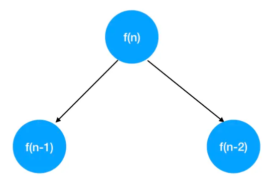
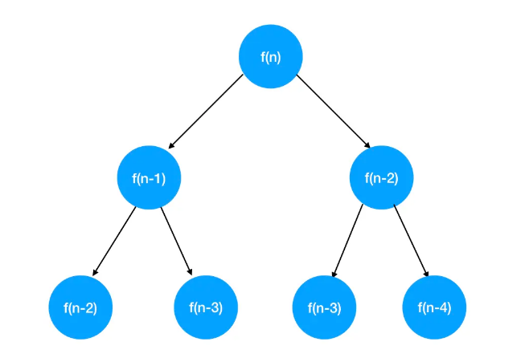
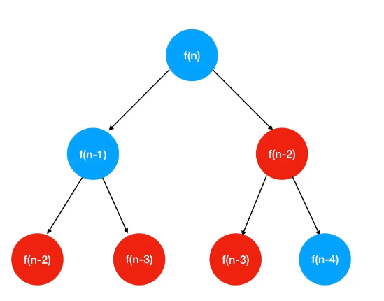
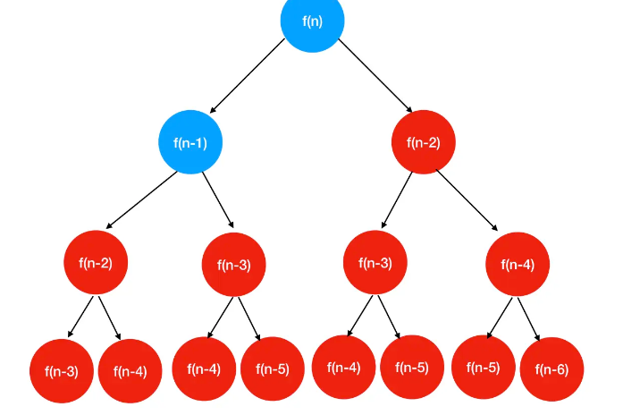
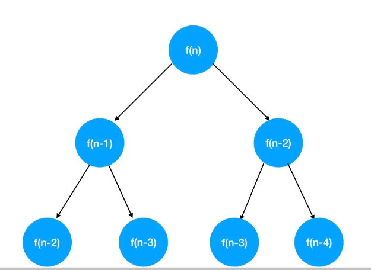
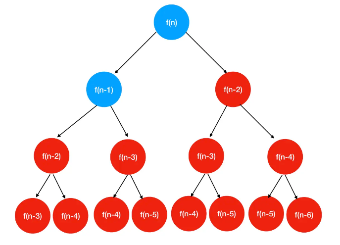
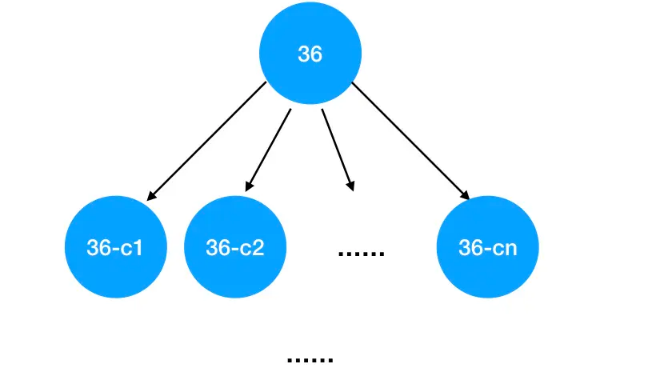
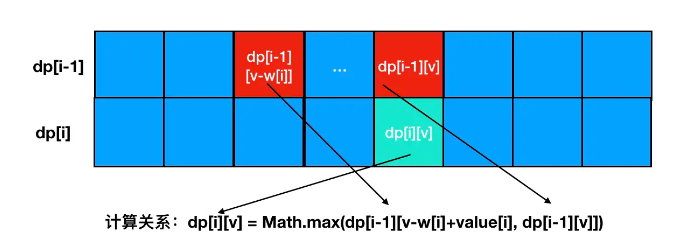
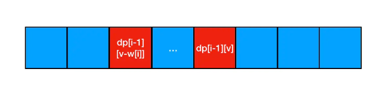
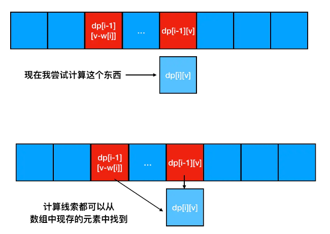

#### 一、从“爬楼梯”问题说起 ####

题目描述：假设你正在爬楼梯。需要 n 阶你才能到达楼顶。
每次你可以爬 1 或 2 个台阶。你有多少种不同的方法可以爬到楼顶呢？

注意：给定 n 是一个正整数。

示例 1：
输入： 2
输出： 2
解释： 有两种方法可以爬到楼顶。

1 阶 + 1 阶
2 阶

示例 2：
输入： 3
输出： 3
解释： 有三种方法可以爬到楼顶。

1 阶 + 1 阶 + 1 阶
1 阶 + 2 阶
2 阶 + 1 阶

**1.思路分析与编码实现**

  - 这道题目有两个关键的特征：

    - 要求你给出达成某个目的的解法个数

    - 不要求你给出每一种解法对应的具体路径

  - 这样的问题，往往可以用动态规划进行求解（这个结论大家先记下来，后面我们会有很多验证它的机会）。

**Step1：递归思想分析问题**

  - 基于动态规划的思想来做题，我们首先要想到的思维工具就是“倒着分析问题”。“倒着分析问题”分两步走：

      - 定位到问题的终点

      - 站在终点这个视角，思考后退的可能性

   - 在这道题里，“问题的终点”指的就是走到第 n 阶楼梯这个目标对应的路径数，我们把它记为 f(n)。

   - 那么站在第 n 阶楼梯这个视角， 有哪些后退的可能性呢？按照题目中的要求，一次只能后退 1 步或者 2 步。因此可以定位到从第 n 阶楼梯只能后退到第 n-1 或者第 n-2 阶。我们把抵达第 n-1 阶楼梯对应的路径数记为f(n-1)，把抵达第 n-2 阶楼梯对应的路径数记为 f(n-2)，不难得出以下关系：

    f(n) = f(n-1) + f(n-2)

   - 这个关系用树形结构表示会更加形象

   

   - 现在我们不难看出，要想求出 f(n)，必须求出f(n-1) 和f(n-2)（我们假设 n 是一个大于 5 的数字）。

   - 接下来站在第 n-1 阶台阶上，思考后退的姿势，也无非只能是退到 n-1-1层台阶 或 n-1-2层台阶上，所以f(n-1) 和 f(n-2)、f(n-3)间同样具有以下关系：

    f(n-1) = f(n-2) + f(n-3)

   - 同理， f(n-2)也可以按照同样的规则进行拆分：

    f(n-2) = f(n-3) + f(n-4)

   - 现在我们的树结构渐渐丰满起来了：

   

   - 随着拆分的进行，一定会有一个时刻，求解到了 f(1) 或 f(2)。按照题设规则，第 1 阶楼梯只能走 1 步抵达，第 2 阶楼梯可以走 1 步或者走 2 步抵达，因此我们不难得出 f(1) 和 f(2) 的值：

    f(1) = 1   
	f(2) = 2

   - 我们在学习递归与回溯思想的时候，曾经给大家强调过，遇到“树形思维模型”，就要想办法往递归上靠。这道题明显用到了树形思维模型，有着明确的重复内容(不断地按照 f(n) = f(n-1) + f(n-2)的规则拆分），同时有着明确的边界条件(遇到f(1)或f(2)就可以返回了)，因此我们不难写出其对应的递归解法代码：
	
		/**
		* @param {number} n
		* @return {number}
		*/
		const climbStairs = function(n) {
		    // 处理递归边界
		    if(n === 1) {
		        return 1
		    }
		    if(n === 2){
		        return 2
		    }
		    // 递归计算
		    return climbStairs(n-1) + climbStairs(n-2)
		};

    - 但是这个解法问题比较大，丢进 OJ 会直接超时。我们一起来看看原因，回到我们上面这张树形结构图上来：

   

    - 这次我把 f(n-2) 和f(n-3)给标红了。大家不难看出，我们在图中对 f(n-2)和f(n-3) 进行了重复的计算。事实上，随着我们递归层级的加深，这个重复的问题会越来越严重：

   

    - （图上标红的均为发生过重复计算的结点）

**Step2：记忆化搜索来提效**

  - 重复计算带来了时间效率上的问题，要想解决这类问题，最直接的思路就是用空间换时间，也就是想办法记住之前已经求解过的结果。这里我们只需要定义一个数组： 

    const f = []

  - 每计算出一个 f(n) 的值，都把它塞进 f 数组里。下次要用到这个值的时候，直接取出来就行了：

		/**
		* @param {number} n
		* @return {number}
		*/
		// 定义记忆数组 f
		const f = []
		const climbStairs = function(n) {
		  if(n==1) {
		      return 1
		  }
		  if(n==2) {
		      return 2
		  }
		  // 若f[n]不存在，则进行计算
		  if(f[n]===undefined)  f[n] = climbStairs(n-1) + climbStairs(n-2)
		  // 若f[n]已经求解过，直接返回
		  return f[n]
		};

   - 以上这种在递归的过程中，不断保存已经计算出的结果，从而避免重复计算的手法，叫做记忆化搜索。

   - 对于一些实用派的面试官来说，“记忆化搜索”和“动态规划”没有区别，它们都能够以不错的效率帮我们达到同样的目的。这种情况下，上面这个答案就足够了。

   - 但是还有一部分面试官，比较讲究，善于咀嚼理论概念。他会告诉你记忆化搜索和动态规划是两个东西，别想糊弄哥，哥要的是动态规划的解法。

   - 行吧，就给你动态规划的解法。

**Step3：记忆化搜索转化为动态规划**

  - 要想完成记忆化搜索与动态规划之间的转化，首先要清楚两者间的区别。

  - 先说记忆化搜索，记忆化搜索可以理解为优化过后的递归。递归往往可以基于树形思维模型来做，以这道题为例：

   

  - 我们基于树形思维模型来解题时，实际上是站在了一个比较大的未知数量级（也就是最终的那个n），来不断进行拆分，最终拆回较小的已知数量级（f(1)、f(2)）。这个过程是一个明显的**自顶向下**的过程。

  - **动态规划则恰恰相反，是一个自底向上的过程**。它要求我们站在已知的角度，通过定位已知和未知之间的关系，一步一步向前推导，进而求解出未知的值。

  - 在这道题中，已知 f(1) 和 f(2) 的值，要求解未知的 f(n)，我们唯一的抓手就是这个等价关系：

    f(n) = f(n-1) + f(n-2)

  - 以 f(1) 和 f(2) 为起点，不断求和，循环递增 n 的值，我们就能够求出f(n)了：

		/**
		* @param {number} n
		* @return {number}
		*/
		const climbStairs = function(n) {
		    // 初始化状态数组
		    const f = [];
		    // 初始化已知值
		    f[1] = 1;
		    f[2] = 2;
		    // 动态更新每一层楼梯对应的结果
		    for(let i = 3;i <= n;i++){
		        f[i] = f[i-2] + f[i-1];
		    }
		    // 返回目标值
		    return f[n];
		};

- 以上便是这道题的动态规划解法。

#### 二、从题解思路看动态规划 ####

- 下面我们基于这个题解的过程，站在专业的角度来重新认识一下动态规划。

- 前面咱们在排序专题学过“分治”思想，提到了“子问题”这个概念。**分治问题的核心思想是：把一个问题分解为相互独立的子问题，逐个解决子问题后，再组合子问题的答案，就得到了问题的最终解。**

- **动态规划的思想和“分治”有点相似。不同之处在于，“分治”思想中，各个子问题之间是独立的：比如说归并排序中，子数组之间的排序并不互相影响。而动态规划划分出的子问题，往往是相互依赖、相互影响的。**

- **什么样的题应该用动态规划来做？我们要抓以下两个关键特征：**

    - **最优子结构**
    
    - **重叠子问题**

- 拿这道题的分析过程来说：

   

- **最优子结构**，它指的是问题的最优解包含着子问题的最优解——不管前面的决策如何，此后的状态必须是基于当前状态（由上次决策产生）的最优决策。就这道题来说，f(n)和f(n-1)、f(n-2)之间的关系印证了这一点（这玩意儿叫状态转移方程，大家记一下）。

- **重叠子问题**，它指的是在递归的过程中，出现了反复计算的情况。就这道题来说，图上标红的一系列重复计算的结点印证了这一点。
因此，这道题适合用动态规划来做。

#### 三、动态规划问题的分析技巧 ####

- 现在，大家理解了动态规划的概念，明确了其“自底向上”的脑回路特征。但在实际做题过程中，“自底向上”分析问题往往不是最舒服的解题姿势，按照这个脑回路去想问题，容易拧巴。

- 什么姿势不拧巴？

- 递归！

- 你现在回过头去看看咱们前面递归+记忆化搜索那一通操作，你觉得拧巴吗？不拧巴！舒服不？相当舒服了——只要你掌握了递归与回溯，就不难分析出图上的树形思维模型和递归边界条件，树形思维模型将帮助我们更迅速地定位到状态转移关系，边界条件往往对应的就是已知子问题的解；基于树形思维模型，结合一下记忆化搜索，难么？不难，谁还不会初始化个记忆数组了呢；最后再把递归往迭代那么一转，答案不就有了么！

- 当然，咱们上面一通吹牛逼都只是为了衬托递归思路分析下来有多么爽，并不是说动态规划有多么简单。实际上，动态规划可复杂了，递归+记忆化搜索的思想只是帮助我们简化问题，但并不能送佛送到西。说到底，还是得靠我们自己。
动态规划到底复杂在什么地方，这里我先预告一下：

  - 状态转移方程不好确定

  - 已知的状态可能不明显

  - 递归转迭代，一部分同学可能不知道怎么转（这个就是纯粹的编程基础问题了，多写多练哈）

- 总结一下，对于动态规划，笔者建议大家优先选择这样的分析路径：

   - **递归思想明确树形思维模型：找到问题终点，思考倒退的姿势，往往可以帮助你更快速地明确状态间的关系**

   - **结合记忆化搜索，明确状态转移方程**

   - **递归代码转化为迭代表达**（这一步不一定是必要的，1、2本身为思维路径，而并非代码实现。若你成长为熟手，2中分析出来的状态转移方程可以直接往循环里塞，根本不需要转换）。

#### 四、“最值”型问题典范：如何优雅地找硬币 ####

力扣地址:https://leetcode.cn/problems/coin-change/

题目描述：给定不同面额的硬币 coins 和一个总金额 amount。编写一个函数来计算可以凑成总金额所需的最少的硬币个数。如果没有任何一种硬币组合能组成总金额，返回 -1。

示例1：
输入: coins = [1, 2, 5], amount = 11
输出: 3
解释: 11 = 5 + 5 + 1

示例2：
输入: coins = [2], amount = 3
输出: -1

- 提示：最值问题是动态规划的常见对口题型，见到最值问题，应该想到动态规划  

**思路分析**

要明确状态转移关系，我们依然是借助“倒推”的思想：解决爬楼梯问题时，我们首先思考的是站在第 n 阶楼梯上的后退姿势。这道题也一样，我们需要思考的是站在 amount 这个组合结果上的“后退姿势”。

硬币的英文是 coin，因此我们这里用 c1、c2、c3......cn 分别来表示题目中给到我们的第 1-n 个硬币。现在我如果从 36 美分的总额中拿走一个硬币，那么有以下几种可能：

	拿走 c1
	拿走 c2
	拿走 c3
	......
	拿走 cn

重复往前推导这个“拿走”的过程，我们可以得到以下的树形思维模型：

   

假如用 f(x）表示每一个总额数字对应的最少硬币数，**注意f(x)表示的是硬币个数**，那么我们可以得到以下的对应关系：

    f(36) = Math.min(f(36-c1)+1,f(36-c2)+1,f(36-c3)+1......f(36-cn)+1)

这套对应关系，就是本题的状态转移方程。

找出了状态转移方程，我们接下来需要思考的是递归的边界条件：在什么情况下，我的“后退”（实际是做减法）可以停下来？这里需要考虑的是硬币总额为 0 的情况，这种情况对应的硬币个数毫无疑问也会是 0，因而不需要任何的回溯计算。由此我们就得到了一个已知的最基本的子问题的结果：

    f[0] = 0

具体到我们这个题目中：

在硬币 [1, 2, 5] 中，求11的最小硬币个数

我们可以通过“退一步”的思维将问题简单化，

即求11的最小个数可以转化为求 10的硬币个数、9的硬币个数，6的硬币个数的最小值 + 1
这里为什么突然出现10，9，6呢？

- 10是通过11 - 1得到， 9是通过11-2得到，6是通过11-5得到，因此后面需要加1，这里的加1就是对应的1/2/5的硬币

因此我们可以得到一条关系式 f(n) = Math.min(f(n-c1), f(n-c2), f(n-c3)) + 1;

通过树型结构可以得到

f(n)

f(n-c1) f(n-c2) f(n-c3)

求f(n-c1)需要递归的去调用，因此循环，直到f(0)为止，f(0)等于0

**编码实现**

	const coinChange = function(coins, amount) {
	    // 用于保存每个目标总额对应的最小硬币个数
	    const f = []
	    // 提前定义已知情况
	    f[0] = 0
	    // 遍历 [1, amount] 这个区间的硬币总额
	    for(let i=1;i<=amount;i++) {
	        // 求的是最小值，因此我们预设为无穷大，确保它一定会被更小的数更新
	        f[i] = Infinity
	        // 循环遍历每个可用硬币的面额
	        for(let j=0;j<coins.length;j++) {
	            // 若硬币面额小于目标总额，则问题成立
	            if(i-coins[j]>=0) {
	                // 状态转移方程
	                f[i] = Math.min(f[i],f[i-coins[j]]+1)
	            }
	        }
	    }
	    // 若目标总额对应的解为无穷大，则意味着没有一个符合条件的硬币总数来更新它，本题无解，返回-1
	    if(f[amount]===Infinity) {
	        return -1
	    }
	    // 若有解，直接返回解的内容
	    return f[amount]
	};

#### 五、背包模型 ####

有 n 件物品，物品体积用一个名为 w 的数组存起来，物品的价值用一个名为 value 的数组存起来；每件物品的体积用 w[i] 来表示，每件物品的价值用 value[i] 来表示。现在有一个容量为 c 的背包，问你如何选取物品放入背包，才能使得背包内的物品总价值最大？

注意：每种物品都只有1件

**思路分析**

**“倒推”法明确状态间关系**

现在，假设背包已满，容量已经达到了 c。站在c这个容量终点往后退，考虑从中取出一样物品，那么可能被取出的物品就有 i 种可能性。我们现在尝试表达“取出一件”这个动作对应的变化，我用 f(i, c) 来表示前 i 件物品恰好装入容量为 c 的背包中所能获得的最大价值。现在假设我试图取出的物品是 i，那么只有两种可能：

  - 第 i 件物品在背包里

  - 第 i 件物品不在背包里

- 如果说本来这个背包中就**没有 i 这个东西**，那么尝试取之前和尝试取之后，背包中的价值总量是不会发生变化的。：

  f(i, c) = f(i-1, c)

- 但如果背包中是**有 i 的**，那么取出这个动作就会带来价值量和体积量的减少：

  f(i, c) - value[i] = f(i-1, c-w[i])

- 把这个减法关系稍微转化一下，变为加法关系：

  f(i, c) = f(i-1, c-w[i]) + v alue[i]

- 可以看出，想要求出 f(i, c)，我们只要定位到正确的 f(i-1, c) 和 f(i-1, c-w[i]) + value[i] 的值，并且取出两者中较大的值就可以了。如此，我们便明确出了这道题的状态转移关系。现在我们需要思考的是如何把这种关系用代码的形式表达出来。

- 首先，基于上面的分析，我们抽取出自变量和因变量：自变量是物品的索引（假设为i）和当前背包内物品的总体积（假设为 v），因变量是总价值。我们仍然是用一个数组来记忆不同状态下的总价值，考虑到这道题中存在两个自变量，我们需要开辟的是一个二维数组。现在我利用二维数组来将上述的状态关系编码化：

  dp[i][v] = Math.max(dp[i-1][v], dp[i-1][v-w[i]] + c[i])

- 以上便是这道题对应的状态转移方程。你会发现我前面真没忽悠你——只要能够利用“倒推”法明确出状态转移关系，我们根本没有必要去构造一个完整而复杂的树形思维模型，直接把状态转移方程往循环里塞就行。

- 动态规划的关键特性就是“最优子结构”。这道题符合最优子结构的特征——dp[i]只和它之前的状态dp[i-1]有关。最优子结构允许我们推导一次就知晓全局，就是这么爽。

- 现在我们来瞅瞅这个状态转移方程怎么往循环里塞才合适。仍然是从变量入手：变量是 i 和 v，但本质上来说 v 其实也是随着 i 的变化而变化的，因此我们可以在外层遍历i、在内层遍历 v。明白了这一点，我们就可以编码如下：

	for(let i=1;i<=n;i++) {
	    for(let v=w[i]; v<=c;v++) {
	      dp[i][v] = Math.max(dp[i-1][v], dp[i-1][v-w[i]]+value[i])
	    }
	}

- 现在，时间复杂度已经被我们优化到了 O(n)的水平，相当不错。但是空间复杂度其实还可以抢救一下。不过不着急，初学背包问题，我们先站在巩固思路的角度，重现一下这个二维数组的填充过程：

   

- 从图中我们可以看出，计算 dp[i][v] 的时候，其实只需要图中标红位置的数据就可以了（这与我们前面讲解过的最优子结构特性不谋而合），也就是说未标红的地方对于 dp[i][v] 的计算来说都属于冗余数据。实际上，对于第 i 行的计算来说，只有第 i-1 行的数据是有意义的，更早的数据它都不关心。也就是说我们其实根本不需要记录所有的数据，理论上只要保留当前行和上一行的数据就足够了，我们干脆把二维数组干掉，用一维数组来做。

**插播小知识——滚动数组**

- 这里要给大家介绍的是一种叫做“滚动数组”的编码思想——所谓“滚动数组”，顾名思义，就是让数组“滚动”起来：固定一块存储空间，滚动更新这块存储空间的内容，确保每个时刻空间内的数据都是当前真正会用到的最新数据，从而达到节约内存的效果，这种手段就叫做滚动数组。

**用滚动数组来优化状态转移方程**

- 我可以只定义一个一维数组，通过倒着遍历v的方法来实现数组的滚动更新：

	for(let i=1;i<=n;i++) {
	    for(let v=c;v>=w[i];v--) {
	        dp[v] = Math.max(dp[v], d[v-w[i]]+value[i])
	    }
	}

- 它为什么可以实现数组的滚动更新？接下来咱们就一起来瞅瞅这个数组是怎么“滚”的：

- 拿第 i-1行和第i行来举例，首先我肯定是刷刷刷地用第 i-1 行的数据把一维数组给填满了（这里我保留了对关键计算线索的高亮）：

   

- 接下来我尝试用第 i 行的数据更新它。当数据更新走到 dp[i][v] 这里的时候，dp[i-1][v] 和 dp[i-1][v-w[i]] 都是存在的状态（分别对应一维数组中现在的 dp[v]和dp[v-w[i]]的值，完全可以满足我们的计算需要：

   

- 当我们计算出 dp[i][v] 的值以后，dp[i-1][v-w[i]]可能还会在以后的计算中用到，但dp[i-1][v]其实已经完全用不到了（这个点对初学的同学来说可能会有点绕，不要慌，你品，你细品。注意这里dp[i][v]已经求解出来了，对于 i 这个索引来说只需要求解 dp[i][v-1]到dp[i][w[i]]之间的值，仔细想想，求解这些值是不是完全用不到dp[i-1][v]？）。

- 此时我们刚好用 dp[i][v] 去更新了 dp[v] 的值，把用不到的数据给及时地替换掉了，岂不美滋滋？

- 基于上面的分析，我们可以写出背包问题的完整求解代码：

#### 六、题目练习 ####

**1.使用最小花费爬楼梯**

- 力扣地址：https://leetcode.cn/problems/GzCJIP/description/

- 爬到顶表示的是超出题目给的数组

- 分析（五部曲）：

   (1) dp[i]：表示爬到顶所花费的最小体力值，i表示到楼顶，dp[i]就是表示所花费的最小体力值

   (2) 递推公式推导：

        - 要到达dp[i]有两种方式，要么是i-1跳一步道到达，要么是i-2跳两步到达，所以：

        - 到达i花费的最小力气 = min（到达i-1花费的最小力气 + i-1要跳到i需要花费的力气，到达i-2花费的最小力气 + i-2要跳到i需要花费的力气）

        - dp[i] = min(dp[i-1] + cost[i-1], dp[i-2] + cos[i-2])

   (3) 如何初始化

        - 由于我们一开始可以选择从下标为 0 或 1 的元素作为初始阶梯，站在台阶处是不需要花费体力的，只有在向上跳的时候才花费体力，所以在这两个地方的**最小**花费力气为0

        - dp[0] = 0
          
        - dp[1] = 0

  (4)确定遍历顺序

     - 本题可以看出，后面的值是依赖前面的结果的，所以i应该从前往后遍历

  (5)打印dp数组（debug的时候使用）

- 代码

	var minCostClimbingStairs = function(cost) {

	   let dp = []
	   dp[0] = 0
	   dp[1] = 0
	   for(let i=2;i<=cost.length;i++){
	     dp[i] = Math.min(dp[i-1]+cost[i-1],dp[i-2]+cost[i-2])
	   }
	   return dp[cost.length]

	};

**2.不同路径**

  - 力扣地址：https://leetcode.cn/problems/GzCJIP/description/

  - 问到达右下角有几种不同路径，我们需要记录到达每一个格子的状态，图中是一个矩阵，所以我们需要一个二维数组
  
  - 分析（五部曲）：

   (1) dp[i][j]：表示走到第i列第j行这个格子所有不同的路径数

   (2) 递推公式推导：

        - 要到达dp[i][j]有两种方式，要么是dp[i-1][j]向右走一步，要么是dp[i][j-1]向下走一步，所以：

        - 到达第i列第j行这个格子所有不同的路径数 = 到达第i-1列第j行所有不同的路径数 + 到达第i列第j-1行所有不同的路径数 

        - dp[i][j] = dp[i-1][j] + dp[i][j-1]

   (3) 如何初始化

        - 由于我们只能向右或者向下走，所以第一行和第一列的格子的路径都只有一种

        - dp[0][j] = 1
          
        - dp[i][0] = 1

  (4)确定遍历顺序

     - 本题可以看出，后面的各自都是由它的上边格子或者下边格子结果计算得来的，所以遍历顺序是从左往右，从上往下或者从上往下，从左往右都是可以的

  (5)打印dp数组（debug的时候使用）

- 代码

	var uniquePaths = function(m, n) {
	     //到达当前位置【i, j】的路径数 = 从左边来的【i, j-1】 + 从上边来的【i-1， j】
	
	    var dp = new Array(n).fill(new Array(m))
	
	    for(var i=0;i<n;i++){
	
	        for(var j=0;j<m;j++){
	
	            if(i==0||j==0){
	
	                dp[i][j]=1
	            }else{
	
	                dp[i][j] = dp[i][j-1]+dp[i-1][j]
	            }
	        }
	    }
	
	    return dp[n-1][m-1]
	};

**3.不同路径2**

  - 力扣地址：https://leetcode.cn/problems/unique-paths-ii/description/

  - 问到达右下角有几种不同路径，我们需要记录到达每一个格子的状态，图中是一个矩阵，所以我们需要一个二维数组
  
  - 分析（五部曲）：

   (1) dp[i][j]：表示走到第i列第j行这个格子所有不同的路径数

   (2) 递推公式推导：

        - 要到达dp[i][j]有两种方式，要么是dp[i-1][j]向右走一步，要么是dp[i][j-1]向下走一步，所以：

        - 到达第i列第j行这个格子所有不同的路径数 = 到达第i-1列第j行所有不同的路径数 + 到达第i列第j-1行所有不同的路径数 

        - dp[i][j] = dp[i-1][j] + dp[i][j-1]，由于有障碍物所以，改递推公式前提条件是obstacleGrid[i][j]!==1
 

   (3) 如何初始化

        - 由于我们只能向右或者向下走，所以第一行和第一列的格子的路径都只有一种

        - dp[0][j] = 1障碍物之前，dp[0][j] = 0障碍物之后
          
        - dp[i][0] = 1障碍物之前，dp[i][0] = 0障碍物之前

  (4)确定遍历顺序

     - 本题可以看出，后面的各自都是由它的上边格子或者下边格子结果计算得来的，所以遍历顺序是从左往右，从上往下或者从上往下，从左往右都是可以的

  (5)打印dp数组（debug的时候使用）

- 代码
	
	var uniquePathsWithObstacles = function(obstacleGrid) {
	    console.log(obstacleGrid[0][1])
	    let rows = obstacleGrid.length
	    let cols = obstacleGrid[0].length 
	    let dp = new Array(rows).fill(new Array(cols))
	    //初始位置有障碍直接return 0 
	    if(obstacleGrid[0][0]===1){
	        return 0
	    }
	    //终点位置有障碍直接return 0 
	    if(obstacleGrid[rows-1][cols-1]===1){
	        return 0
	    }
	    for(let i=0;i<rows;i++){
	        for(j=0;j<cols;j++){
	            //当为障碍物时，到达该格子的路径数为0
	            if(obstacleGrid[i][j]===1){
	                dp[i][j] = 0
	                continue;
	            }
	            //初始位置路径数为1
	            if(i===0&&j===0){
	                dp[i][j] = 1
	            }else if(i===0){
	            //第一行有一个为障碍物时，由于能到达第一行格子的路径只能时前一个格子向右，所以障碍物之后的格子全部都会到达不了
	                dp[i][j] = dp[i][j-1]
	            }else if(j===0){
	            //第一列有一个为障碍物时，由于能到达第一列格子的路径只能时前一个格子向下，所以障碍物之后的格子全部都会到达不了
	                dp[i][j] = dp[i-1][j]
	            }else{
	                dp[i][j] = dp[i-1][j] + dp[i][j-1]
	            }
	        }
	    }
	
	    return dp[rows-1][cols-1]
	};

**4.整数拆分**

  - 力扣地址：https://leetcode.cn/problems/integer-break/

  - 问到达右下角有几种不同路径，我们需要记录到达每一个格子的状态，图中是一个矩阵，所以我们需要一个二维数组
  
  - 分析（五部曲）：

   (1) dp[i]：表示对i进行拆分，得到的最大乘积就是dp[i]

   (2) 递推公式推导：

        - 拆解为2个数：假设i要拆解的一个数字为j(1->i)，另外一个数字为i-j

        - 拆解数大于2个：假设i要拆解的一个数字为j(1->i)，后面的数字的乘积dp[i-j]

        - dp[i][j] = j * dp[i-j]

        - max(j*(i-j),j*dp[i-j],dp[i])
 

   (3) 如何初始化

        - 至少拆成两个数，所以

        - dp[0] = 0
          
        - dp[1] = 0

        - dp[2] = 1

  (4)确定遍历顺序

     - 本题可以看出，拆分i，所以从1到i遍历

  (5)打印dp数组（debug的时候使用）

- 代码

	   var integerBreak = function(n) {
	    let dp = []
	    dp[1] = 0
	    dp[2] = 1
	    for(let i=3;i<=n;i++){
	        dp[i] = 1 //初始化一定要记得，不然下面加的结果就为NaN了
	        for(let j=1;j<i;j++){
	            //在这个循环里面要求出dp[i]的最大值，所以比较的时候会加上dp[i]，相当于后一个计算的值要和前一个值比较
	          dp[i] = Math.max(j * (i-j), j*dp[i-j], dp[i])
	        }
	    }
	    return dp[n]
      }

//小优化，由于近似相等的两个数乘积最大，所以j可以循环到i/2就可以了

    var integerBreak = function(n) {
	    let dp = []
	    dp[1] = 0
	    dp[2] = 1
	    for(let i=3;i<=n;i++){
	        dp[i] = 1
	        for(let j=1;j<=i/2;j++){
	            //在这个循环里面要求出dp[i]的最大值，所以比较的时候会加上dp[i]，相当于后一个计算的值要和前一个值比较
	          dp[i] = Math.max(j * (i-j), j*dp[i-j], dp[i])
	        }
	    }
	    return dp[n]
      }

**5.不同的二叉搜索树**

  - 力扣地址：https://leetcode.cn/problems/unique-binary-search-trees/description/

  - 分析（五部曲）：

   (1) dp[i]：表示输入i，共有dp[i]种二叉搜索数

   (2) 递推公式推导：

        - dp[i]所有的二叉搜索树就等于，根节点为1的二叉搜索树+根节点为2的二叉搜索树+...+根节点为i的二叉搜索树

        - 根节点为j的二叉搜索树，由于是二叉搜索树，左节点一定小于根节点，右节点一定大于根节点，所以节点的左子树为j-1个，右子树为i-j个，该节点可以组成的二叉搜索树为左子树可以组成二叉搜索树个数*右子树可以组成二叉搜索数个数，所以dp[j] = dp[j-1]*dp[i-j]

        - 所以递推公式就是dp[i] += dp[j-1]*dp[i-j](j=1...i)
 

   (3) 如何初始化

        - dp[0] = 1(空也是二叉搜索数)

  (4)确定遍历顺序

     - dp[i]都是从小于i的状态推出来的，所以从小到大遍历

  (5)打印dp数组（debug的时候使用）

- 代码
	
	var numTrees = function(n) {
	    let dp = []
	    dp[0] = 1
	    for(let i=1;i<=n;i++){
	        dp[i] = 0 //初始化一定要记得，不然下面加的结果就为NaN了
	       for(let j=1;j<=i;j++){
	         dp[i] += dp[j-1] * dp[i-j]
	       }
	    }
	    return dp[n]
	};

**6.背包问题**

  - 力扣地址：

  - 分析（五部曲）：

   (1) dp[i][j]：表示下标为0到i之间的物品任取放进容量为j的背包中，背包的总价值

   (2) 递推公式推导：

        - dp[i][j]当前背包的状态就取决于你放不放这个物品i：

            - 不放物品i,背包容量为j是所装物品的最大价值dp[i-1][j]

            - 放物品i，背包容量为j是所装物品的最大价值dp[i-1][j-weight[i]] + value[i]

        - 所以递推公式就是dp[i][j] = max(dp[i-1][j],dp[i-1][j-weight[i]] + value[i])
 
   (3) 如何初始化

        - 由递推关系画一个二位数组知道，需要初始化第一行和第一列

        - （第一列）背包容量为0时，所产生的价值一定为0，所以dp[i][0] = 0

        - （第一行）背包容量为0时，只放物品0，价值为0，背包容量为1到j时，只放物品0，需要用物品0的重量和背包容量比较，可以放下初始化为背包0的价值，放不下初始化为0 

  (4)确定遍历顺序

     - 如果dp为二维数组，第一层for循环遍历物品，第二层遍历背包（第一层遍历背包，第二次遍历物品也可以）

  (5)打印dp数组（debug的时候使用）

- 代码