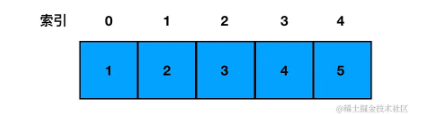
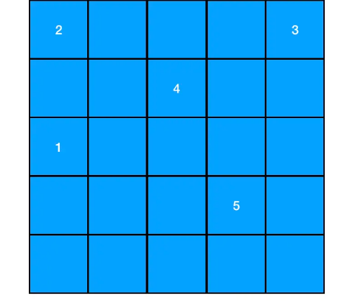
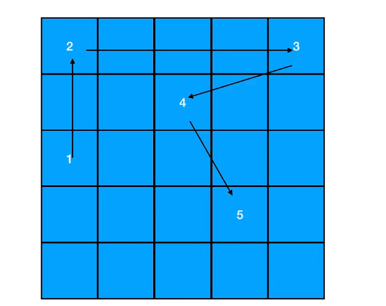
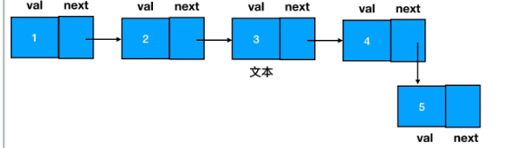
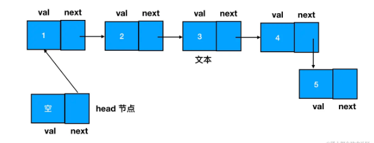
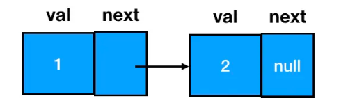
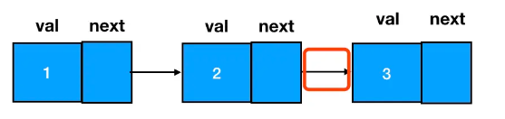
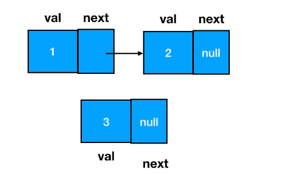
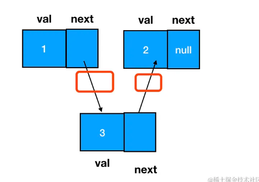
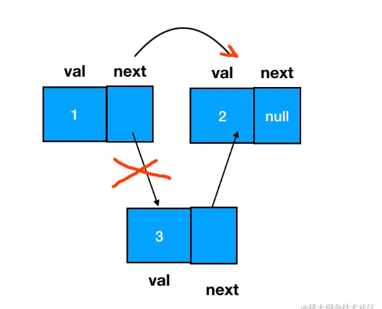

#### 一、概念 ####

- **链表和数组相似，它们都是有序的列表、都是线性结构（有且仅有一个前驱、有且仅有一个后继）**。

- **不同点在于，链表中，数据单位的名称叫做“结点”，而结点和结点的分布，在内存中可以是离散的。**

- 这个“离散”是相对于数组的“连续”来说的。上一节咱们给大家画过数组的元素分布示意图：

  

- **数组在内存中最为关键的一个特征，就是它一般是对应一段位于自己上界和下界之间的、一段连续的内存空间。元素与元素之间，紧紧相连（当然啦，还有二般情况，我们在下文的辨析环节会提到）。**

- **而链表中的结点，则允许散落在内存空间的各个角落里**。一个内容为1->2->3->4->5的链表，在内存中的形态可以是散乱如下的：

  

- 正是**由于数组中的元素是连续的，每个元素的内存地址可以根据其索引距离数组头部的距离来计算出来。因此对数组来说，每一个元素都可以通过数组的索引下标直接定位。**

- 但是对链表来说，元素和元素之间似乎毫无内存上的瓜葛可言。就比如说咱们图上这种情况，1、2、3、4、5各据山头，站在元素1的坑位里，我们对元素2、3、4、5的内存地址一无所知，连遍历都没法遍历，这可咋整？

- 没有关联，就创造关联！

- **在链表中，每一个结点的结构都包括了两部分的内容：数据域和指针域**。JS 中的链表，是以嵌套的对象的形式来实现的：

		{
		    // 数据域
		    val: 1,
		    // 指针域，指向下一个结点
		    next: {
		        val:2,
		        next: ...
		    }
		}   

- **数据域存储的是当前结点所存储的数据值，而指针域则代表下一个结点（后继结点）的引用**。 有了 next 指针来记录后继结点的引用，每一个结点至少都能知道自己后面的同学是哪位了，原本相互独立的结点之间就有了如下的联系：

  

- 我们把这个关系给简化一下：

  

- 要想访问链表中的任何一个元素，我们都得从起点结点开始，逐个访问 next，一直访问到目标结点为止。为了确保起点结点是可抵达的，我们有时还会设定一个 head 指针来专门指向链表的开始位置：

  

- 以上，就是链表的基本形态啦。

#### 二、链表结点的创建 ####

- 创建链表结点，咱们需要一个构造函数：

	function ListNode(val) {
	    this.val = val;
	    this.next = null;
	}

- 在使用构造函数创建结点时，传入 val （数据域对应的值内容）、指定 next （下一个链表结点）即可：

	const node = new ListNode(1)  
	node.next = new ListNode(2)

- 以上，就创建出了一个数据域值为1，next 结点数据域值为2的链表结点：

  

#### 三、链表节点的添加 ####

- **直接在尾部添加结点相对比较简单，我们改变一个 next 指针就行**。这里记值为2的 node 结点为 node2（假设 node2 是现在的尾部结点），值为3的 node 结点为 node3。假如我要把 node3 添加到 node2 所在链表的尾部，直接把 node2 的 next 指针指向 node3 即可：

  

- 需要大家引起重视的是**另一种添加操作：如何在两个结点间插入一个结点**？注意，由于链表有时会有头结点，这时即便你是往链表头部增加结点，其本质也是“在头结点和第一个结点之间插入一个新结点”。所以说，任意两结点间插入一个新结点这种类型的增加操作，将会是链表基础中的一个关键考点。

- **要想完成这个动作，我们需要变更的是前驱结点和目标结点的 next 指针指向**，过程如下图：

- 插入前：

  

- 插入后：

  

- 注意我圈红的地方，就是咱们要动手脚的地方。下面我用代码来表述一下这个改变。：

	// 如果目标结点本来不存在，那么记得手动创建
	const node3 = new ListNode(3)   
  
	// 把node3的 next 指针指向 node2（即 node1.next）
	node3.next = node1.next

	// 把node1的 next 指针指向 node3
	node1.next = node3

#### 四、链表节点的删除 ####

- 链表元素的删除也是非常高频的操作。延续我们前面的思路，仍然把重心放在对 next 指针的调整上。我们思考一下：如何把刚刚添加进来的 node3 从现在的链表里删掉？

- 注意，**删除的标准是：在链表的遍历过程中，无法再遍历到某个结点的存在。按照这个标准，要想遍历不到 node3，我们直接让它的前驱结点 node1 的 next 指针跳过它、指向 node3 的后继即可**：

  

- 如此一来，node3 就成为了一个完全不可抵达的结点了，它会被 JS 的垃圾回收器自动回收掉。这个过程用代码表述如下：

	node1.next = node3.next 

- **注意：在涉及链表删除操作的题目中，重点不是定位目标结点，而是定位目标结点的前驱结点。做题时，完全可以只使用一个指针（引用），这个指针用来定位目标结点的前驱结点**。比如说咱们这个题里，其实只要能拿到 node1 就行了：

	// 利用 node1 可以定位到 node3
	const target = node1.next  
	node1.next = target.next

- 因此做题的时候，千万别跑过了头，最后找到了目标结点、回头却发现忘了记录真正重要的前驱结点。

#### 五、链表和数组的辨析 ####

- 在大多数的计算机语言中，数组都对应着一段连续的内存。如果我们想要在任意位置删除一个元素，那么该位置往后的所有元素，都需要往前挪一个位置；相应地，如果要在任意位置新增一个元素，那么该位置往后的所有元素也都要往后挪一个位置。

- **我们假设数组的长度是 n，那么因增加/删除操作导致需要移动的元素数量，就会随着数组长度 n 的增大而增大，呈一个线性关系。所以说数组增加/删除操作对应的复杂度就是 O(n)。**

- **但 JS 中不一定是。JS比较特别**。

- 如果我们在一个数组中只定义了一种类型的元素，比如：

    const arr = [1,2,3,4]

- 它是一个纯数字数组，那么对应的确实是连续内存。

- 但如果我们定义了不同类型的元素：

	const arr = ['haha', 1, {a:1}]

- **它对应的就是一段非连续的内存。此时，JS 数组不再具有数组的特征，其底层使用哈希映射分配内存空间，是由对象链表来实现的。**

- 说起来有点绕口，但大家**谨记“JS 数组未必是真正的数组”即可**。

- **何谓“真正的数组”？在各大教材（包括百科词条）对数组的定义中，都有一个“存储在连续的内存空间里”这样的必要条件。因此在本文中，我们描述的“数组”就是符合这个定义的数组。面试时，若考到数组和链表的辨析，大家也沿着这个思路往下说，是没有问题的。如果能够说出 JS 数组和常规数组的不同，那就是锦上添花了。**

- **相对于数组来说，链表有一个明显的优点，就是添加和删除元素都不需要挪动多余的元素。**

#### 六、高效的增删操作 ####

- **在链表中，添加和删除操作的复杂度是固定的——不管链表里面的结点个数 n 有多大，只要我们明确了要插入/删除的目标位置，那么我们需要做的都仅仅是改变目标结点及其前驱/后继结点的指针指向。 因此我们说链表增删操作的复杂度是常数级别的复杂度，用大 O 表示法表示为 O(1)。**

#### 七、麻烦的访问操作 ####

- **但是链表也有一个弊端：当我们试图读取某一个特定的链表结点时，必须遍历整个链表来查找它**。比如说我要在一个长度为 n（n>10） 的链表里，定位它的第 10 个结点，我需要这样做：

	// 记录目标结点的位置
	const index = 10  
	
	// 设一个游标指向链表第一个结点，从第一个结点开始遍历
	let node = head  
	
	// 反复遍历到第10个结点为止
	for(let i=0;i<index&&node;i++) {
	    node = node.next
	}

- **随着链表长度的增加，我们搜索的范围也会变大、遍历其中任意元素的时间成本自然随之提高。这个变化的趋势呈线性规律，用大 O 表示法表示为 O(n)。**

- **但在数组中，我们直接访问索引、可以做到一步到位，这个操作的复杂度会被降级为常数级别(O(1))：**

	arr[9]

