#### 一、理解树结构 ####

- 数据结构中的树，首先是对现实世界中树的一层简化：把树根抽象为“根结点”，树枝抽象为“边”，树枝的两个端点抽象为“结点”，树叶抽象为“叶子结点”。抽象后的树结构如下：

  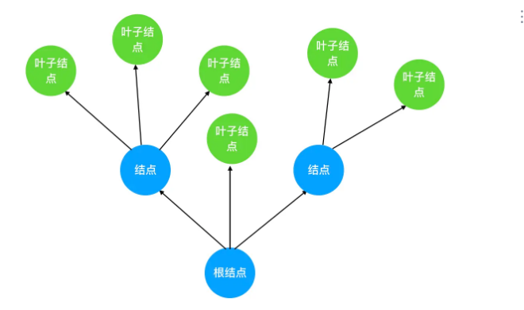

- 把这棵抽象后的树颠倒一下，就得到了计算机中的树结构：

  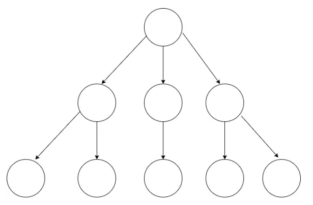

- 结合这张图，我们来讲解**树的关键特性和重点概念**。希望大家可以牢记以下几点：

   **1.树的层次计算规则：根结点所在的那一层记为第一层，其子结点所在的就是第二层，以此类推。**

   **2.结点和树的“高度”计算规则：叶子结点高度记为1，每向上一层高度就加1，逐层向上累加至目标结点时，所得到的的值就是目标结点的高度。树中结点的最大高度，称为“树的高度”。**

   **3.“度”的概念：一个结点开叉出去多少个子树，被记为结点的“度”。比如我们上图中，根结点的“度”就是3。**

   **4.“叶子结点”：叶子结点就是度为0的结点。在上图中，最后一层的结点的度全部为0，所以这一层的结点都是叶子结点。**

#### 二、理解二叉树结构 ####

- 二叉树是指满足以下要求的树：

  - **它可以没有根结点，作为一棵空树存在**

  - **如果它不是空树，那么必须由根结点、左子树和右子树组成，且左右子树都是二叉树**。如下图：

  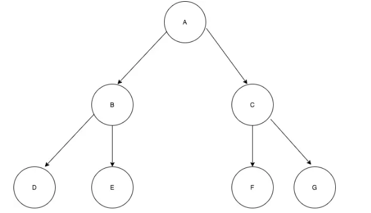

  - **注意，二叉树不能被简单定义为每个结点的度都是2的树。普通的树并不会区分左子树和右子树，但在二叉树中，左右子树的位置是严格约定、不能交换的**。对应到图上来看，也就意味着 B 和 C、D 和 E、F 和 G 是不能互换的。  

#### 三、二叉树的编码实现 ####

- 在 JS 中，二叉树使用对象来定义。它的结构分为三块：

  - 数据域

  - 左侧子结点（左子树根结点）的引用

  - 右侧子结点（右子树根结点）的引用

- 在定义二叉树构造函数时，我们需要把左侧子结点和右侧子结点都预置为空：

		// 二叉树结点的构造函数
		function TreeNode(val) {
		    this.val = val;
		    this.left = this.right = null;
		}

- 当你需要新建一个二叉树结点时，直接调用构造函数、传入数据域的值就行了：

		const node  = new TreeNode(1)

- 如此便能得到一个值为 1 的二叉树结点，从结构上来说，它长这样：

  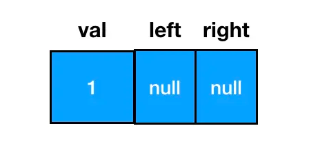

- 以这个结点为根结点，我们可以通过给 left/right 赋值拓展其子树信息，延展出一棵二叉树。因此从更加细化的角度来看，一棵二叉树的形态实际是这样的：

  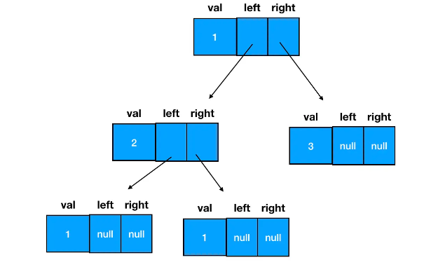

#### 四、二叉树的遍历——命题思路解读 ####

- 以一定的顺序规则，逐个访问二叉树的所有结点，这个过程就是二叉树的遍历。

- **按照顺序规则的不同，遍历方式有以下四种**：

    - 先序遍历

    - 中序遍历

    - 后序遍历

    - 层次遍历

- **按照实现方式的不同，遍历方式又可以分为以下两种**：

    - 递归遍历（先、中、后序遍历）

    - 迭代遍历（层次遍历）

#### 五、递归遍历初相见 ####

- 编程语言中，函数Func(Type a,……)直接或间接调用函数本身，则该函数称为递归函数。

- 简单来说，**当我们看到一个函数反复调用它自己的时候，递归就发生了**。“递归”就意味着“反复”，像咱们之前对二叉树的定义，就可以理解为是一个递归式的定义：

  - 它可以没有根结点，作为一棵空树存在

  - 如果它不是空树，那么必须由根结点、左子树和右子树组成，且左右子树都是二叉树。

- 这个定义有着这样的内涵：如果我们想要创建一个二叉树结点作为根结点，那么它左侧的子结点和右侧的子结点也都必须符合二叉树结点的定义，这意味着我们要反复地执行“创建一个由数据域、左右子树组成的结点”这个动作，直到数据被分配完为止。

- 结合这个定义来看，每一棵二叉树都应该由这三部分组成：

  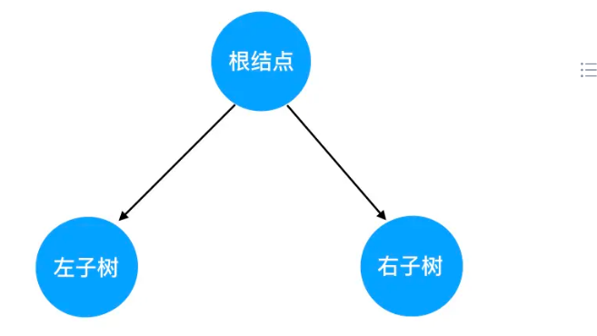

- 对树的遍历，就可以看做是对这三个部分的遍历。这里就引出一个问题：三个部分中，到底先遍历哪个、后遍历哪个呢？我们此处其实可以穷举一下，假如在保证“左子树一定先于右子树遍历”这个前提，那么遍历的可能顺序也不过三种：

  根结点 -> 左子树 -> 右子树

  左子树 -> 根结点 -> 右子树

  左子树 -> 右子树 -> 根结点

- 上述三个遍历顺序，就分别对应了二叉树的先序遍历、中序遍历和后序遍历规则。

- 在这三种顺序中，**根结点的遍历分别被安排在了首要位置、中间位置和最后位置。所谓的“先序”、“中序”和“后序”，“先”、“中”、“后”其实就是指根结点的遍历时机**。

#### 六、遍历方法图解与编码实现 ####

**1.先序遍历**

  - 先序遍历的“旅行路线”如下图红色数字 所示：

  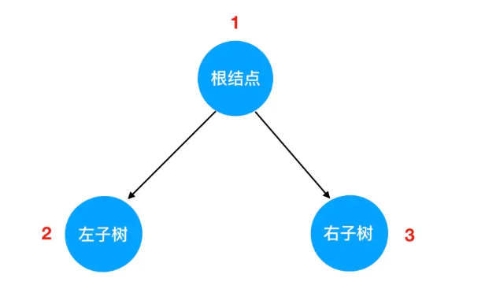

  - 如果说有 N 多个子树，那么我们在每一棵子树内部，都要重复这个“旅行路线”，这个“重复”，我们就用递归来实现。

  - 注：上面这个二叉树的结构，可以试着用我们前面学过的知识编码实现一把。

		const root = {
		  val: "A",
		  left: {
		    val: "B",
		    left: {
		      val: "D"
		    },
		    right: {
		      val: "E"
		    }
		  },
		  right: {
		    val: "C",
		    right: {
		      val: "F"
		    }
		  }
		};

**2.递归函数的编写要点**

  - 编写一个递归函数之前，大家首先要明确两样东西：

    - **递归式**

    - **递归边界**

  - **递归式，它指的是你每一次重复的内容是什么**。在这里，我们要做先序遍历，那么每一次重复的其实就是 根结点 -> 左子树 -> 右子树 这个旅行路线。

  - 在遍历的场景下，当我们发现遍历的目标树为空的时候，就意味着旅途已达终点、需要画上句号了。**这个“画句号”的方式，在编码实现里对应着一个 return 语句——这就是二叉树遍历的递归边界。**

**3.第一个递归遍历函数**

	// 所有遍历函数的入参都是树的根结点对象
	function preorder(root) {
	    // 递归边界，root 为空
	    if(!root) {
	        return 
	    }
	     
	    // 输出当前遍历的结点值
	    console.log('当前遍历的结点值是：', root.val)  

	    // 递归遍历左子树 
	    preorder(root.left)  

	    // 递归遍历右子树  
	    preorder(root.right)
	}

**4.图解先序遍历的完整过程**

  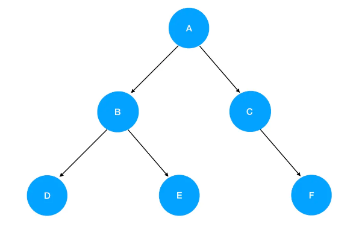

- 我们直接把它套进 preorder 函数里，一步一步来认清楚先序遍历的每一步做了什么：

  (1) 调用 preorder(root)，这里 root 就是 A，它非空，所以进入递归式，输出 A 值。接着优先遍历左子树，preorder(root.left) 此时为 preorder(B) ：

  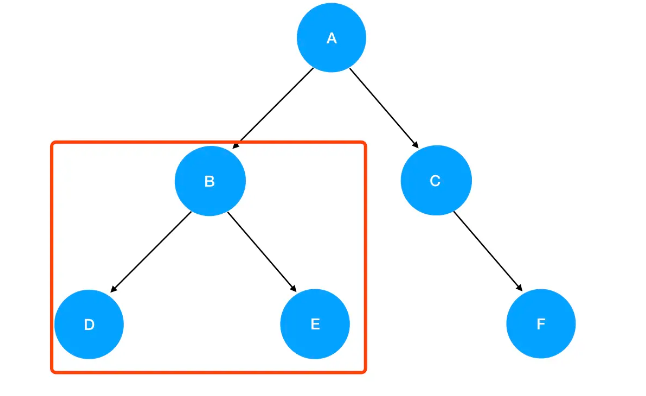

  (2) 进入 preorder(B) 的逻辑： 入参为结点 B，非空，进入递归式，输出 B 值。接着优先遍历 B 的左子树，preorder(root.left) 此时为 preorder(D) ：

  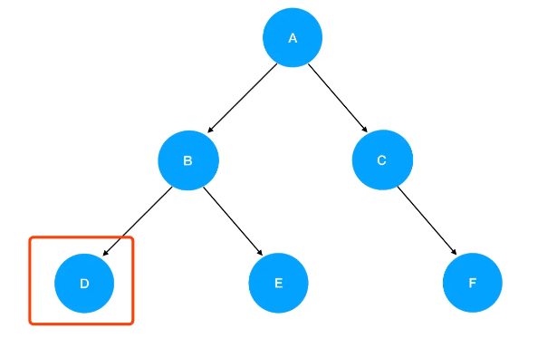

  (3) 进入 preorder(D) 的逻辑： 入参为结点 D，非空，进入递归式，输出 D 值。接着优先遍历 D 的左子树，preorder(root.left) 此时为 preorder(null)：

  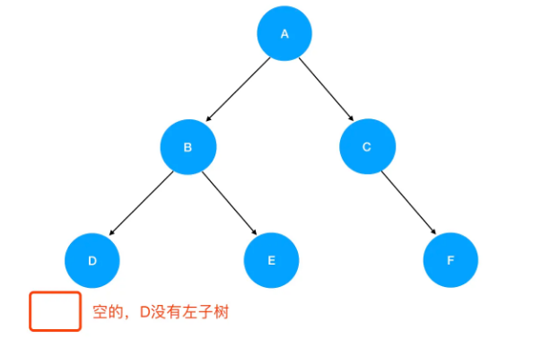

  (4) 进入preorder(null) ，发现抵达了递归边界，直接 return 掉。紧接着是 preorder(D) 的逻辑往下走，走到了 preorder(root.right) ：

  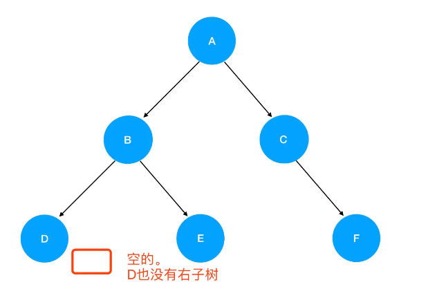

  (5) 再次进入preorder(null) ，发现抵达了递归边界，直接 return 掉，回到preorder(D) 里。接着 preorder(D) 的逻辑往下走，发现 preorder(D) 已经执行完了。于是返回，回到preorder(B) 里，接着preorder(B) 往下走，进入 preorder(root.right) ，也就是 preorder(E) ：

  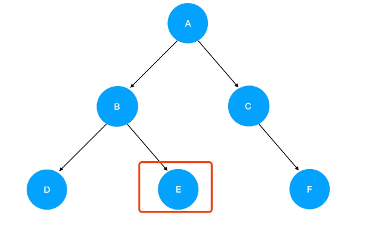

  E 不为空，进入递归式，输出 E 值。接着优先遍历 E 的左子树，preorder(root.left) 此时为 preorder(null)，触碰递归边界，直接返回 preorder(E)；继续preorder(E)执行下去，是preorder(root.right) ，这里 E 的 right 同样是 null，故直接返回。如此一来，preorder(E)就执行完了，回到preorder(B)里去；发现preorder(B)也执行完了，于是回到preorder(A)里去，执行preorder(A)中的 preorder(root.right)。

  (6) root 是A，root.right 就是 C 了，进入preorder(C)的逻辑：

   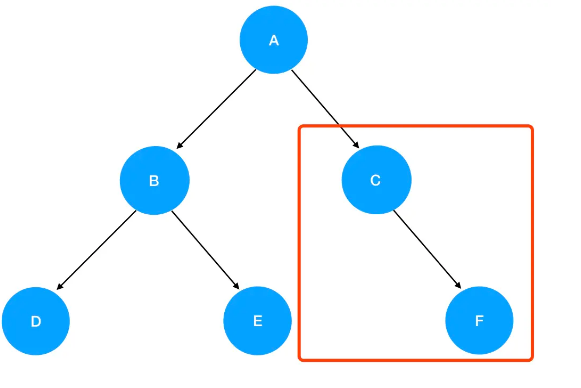

  C 不为空，进入递归式，输出 C 值。接着优先遍历 C 的左子树，preorder(root.left) 此时为 preorder(null)，触碰递归边界，直接返回。继续preorder(C)执行下去，是preorder(root.right) ，这里 C 的 right 是 F：

   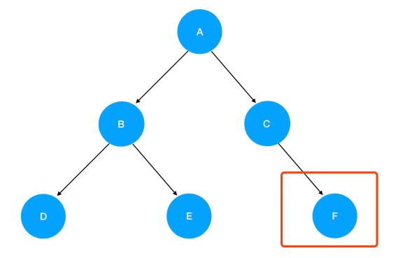

  (7)进入preorder(F)的逻辑，F 不为空，进入递归式，输出 F 值。接着优先遍历 F 的左子树，preorder(root.left) 此时为 preorder(null)，触碰递归边界，直接返回 preorder(F)；继续preorder(F)执行下去，是preorder(root.right) ，这里 F 的 right 同样是 null，故直接返回preorder(F)。此时preorder(F)已经执行完了，返回preorder(C)；发现preorder(C)也执行完了，就回到 preorder(A)；发现preorder(A)作为递归入口，它的逻辑也已经执行完了，于是我们的递归活动就正式画上了句号。到此为止，6个结点也已全部按照先序遍历顺序输出：

	当前遍历的结点值是： A
	当前遍历的结点值是： B
	当前遍历的结点值是： D
	当前遍历的结点值是： E
	当前遍历的结点值是： C
	当前遍历的结点值是： F

**5.中序遍历**

  - 理解了先序遍历的过程，中序遍历就不是什么难题。唯一的区别只是把遍历顺序调换了左子树 -> 根结点 -> 右子树：

   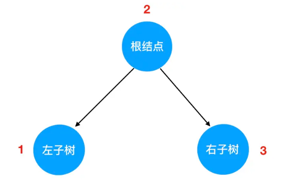
	
	// 所有遍历函数的入参都是树的根结点对象
	function inorder(root) {
	    // 递归边界，root 为空
	    if(!root) {
	        return 
	    }
	     
	    // 递归遍历左子树 
	    inorder(root.left)  

	    // 输出当前遍历的结点值
	    console.log('当前遍历的结点值是：', root.val) 
 
	    // 递归遍历右子树  
	    inorder(root.right)
	}

  - 按照中序遍历的逻辑，同样的一棵二叉树，结点内容的输出顺序如下：

		当前遍历的结点值是： D
		当前遍历的结点值是： B
		当前遍历的结点值是： E
		当前遍历的结点值是： A
		当前遍历的结点值是： C
		当前遍历的结点值是： F

**6.后序遍历**

  - 在后序遍历中，我们先访问左子树，再访问右子树，最后访问根结点：

   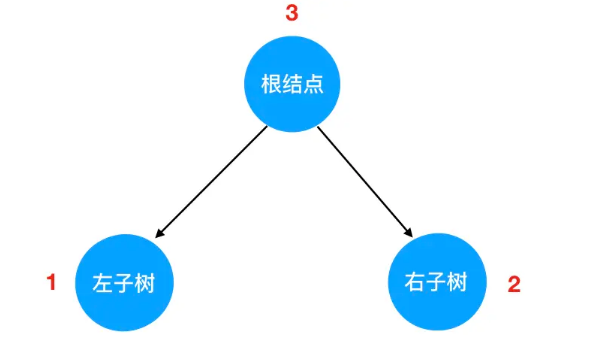

  - 在编码实现的时候，递归边界照旧，唯一发生改变的仍然是是递归式里调用递归函数的顺序：

	function postorder(root) {
	    // 递归边界，root 为空
	    if(!root) {
	        return 
	    }
	     
	    // 递归遍历左子树 
	    postorder(root.left)  

	    // 递归遍历右子树  
	    postorder(root.right)

	    // 输出当前遍历的结点值
	    console.log('当前遍历的结点值是：', root.val)  
	}

   - 按照后序遍历的逻辑，同样的一棵二叉树，结点内容的输出顺序如下：

		当前遍历的结点值是： D
		当前遍历的结点值是： E
		当前遍历的结点值是： B
		当前遍历的结点值是： F
		当前遍历的结点值是： C
		当前遍历的结点值是： A

