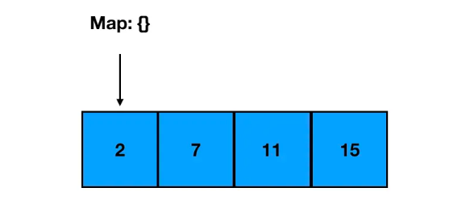
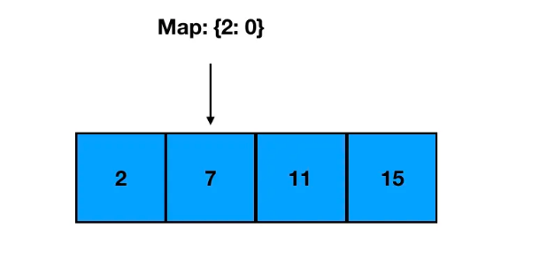
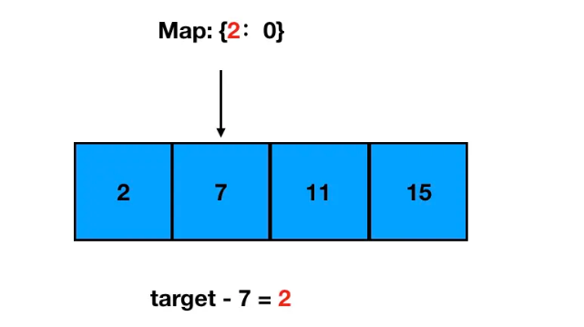
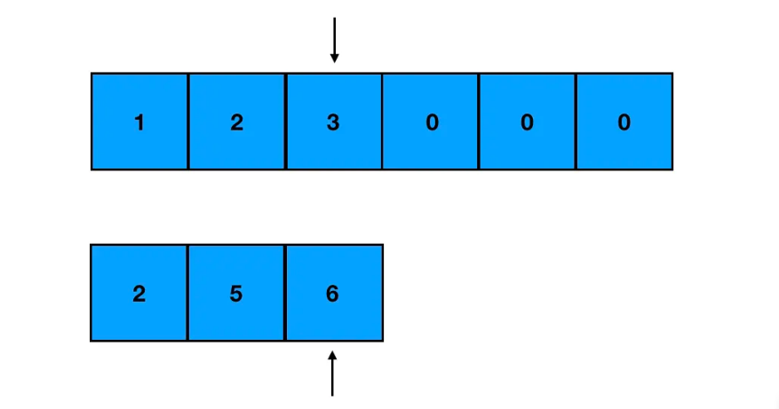
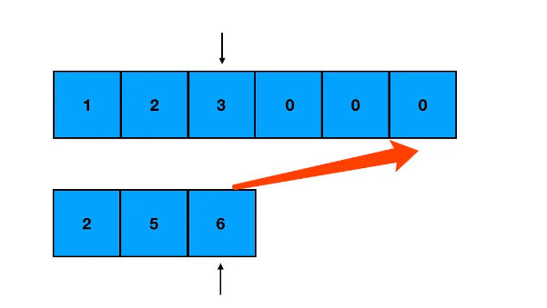

#### 一、Map的妙用---两数求和问题 ####

- 真题描述： 给定一个整数数组 nums 和一个目标值 target，请你在该数组中找出和为目标值的那 两个 整数，并返回他们的数组下标。

- 你可以假设每种输入只会对应一个答案。但是，你不能重复利用这个数组中同样的元素。

- 示例: 给定 nums = [2, 7, 11, 15], target = 9

- 因为 nums[0] + nums[1] = 2 + 7 = 9 所以返回 [0, 1]

**1.一个“淳朴”的解法**

- 这道题相信很多同学看一眼就很快能得出一个最基本的思路：两层循环来遍历同一个数组；第一层循环遍历的值记为 a，第二层循环时遍历的值记为 b；若 a+b = 目标值，那么 a 和 b 对应的数组下标就是我们想要的答案。

**2.对“淳朴”解法的反思**

- 大家以后做算法题的时候，要有这样的一种本能：**当发现自己的代码里有两层循环时，先反思一下，能不能用空间换时间，把它优化成一层循环。**

- **因为两层循环很多情况下都意味着 O(n^2) 的复杂度，这个复杂度非常容易导致你的算法超时。即便没有超时，在明明有一层遍历解法的情况下，你写了两层遍历，面试官对你的印象分会大打折扣。**

**3.空间换时间，Map 来帮忙**

- 拿我们这道题来说，其实二层遍历是完全不必要的。

- **大家记住一个结论：几乎所有的求和问题，都可以转化为求差问题**。 这道题就是一个典型的例子，通过把求和问题转化为求差问题，事情会变得更加简单。

- **我们可以在遍历数组的过程中，增加一个 Map 来记录已经遍历过的数字及其对应的索引值。然后每遍历到一个新数字的时候，都回到 Map 里去查询 targetNum 与该数的差值是否已经在前面的数字中出现过了。若出现过，那么答案已然显现，我们就不必再往下走了。**

- 我们以 nums = [2, 7, 11, 15] 这个数组为例，来模拟一下这个思路：
第一次遍历到 2，此时 Map 为空：

 

- 以 2 为 key，索引 0 为 value 作存储，继续往下走；遇到了 7：

 

- 计算 targetNum 和 7 的差值为2，去 Map 中检索 2 这个 key，发现是之前出现过的值：

  

- 那么 2 和 7 的索引组合就是这道题的答案啦。

- 键值对存储我们可以用 ES6 里的 Map 来做，如果图省事，直接用对象字面量来定义也没什么问题。

**4.编码实现**

	/**
	 * @param {number[]} nums
	 * @param {number} target
	 * @return {number[]}
	 */
	const twoSum = function(nums, target) {
	    // 这里我用对象来模拟 map 的能力
	    const diffs = {}
	    // 缓存数组长度
	    const len = nums.length
	    // 遍历数组
	    for(let i=0;i<len;i++) {
	        // 判断当前值对应的 target 差值是否存在（是否已遍历过）
	        if(diffs[target-nums[i]]!==undefined) {
	            // 若有对应差值，那么答案get！
	            return [diffs[target - nums[i]], i]
	        }
	        // 若没有对应差值，则记录当前值
	        diffs[nums[i]]=i
	    }
	};

- 这道题也可以用 ES6 中的 Map 来做

		const twoSum = function(nums, target) {
		  let resArr = []
		  let map = new Map
		  for(let i=0;i<nums.length;i++){
		    let rest = target - nums[i]
		    let mapVal = map.get(rest)
		    if(mapVal!== undefined){
		      resArr.push(mapVal,i)
		      return resArr
		    }
		    map.set(nums[i],i)
		  }
		  console.log(resArr)
		  
		}

#### 二、强大的双指针法 ####

**1.合并两个有序数组**

	- 真题描述：给你两个有序整数数组 nums1 和 nums2，请你将 nums2 合并到 nums1 中，使 nums1 成为一个有序数组。（力扣地址：https://leetcode.cn/problems/merge-sorted-array/）

	- 说明: 初始化 nums1 和 nums2 的元素数量分别为 m 和 n 。 你可以假设 nums1 有足够的空间（空间大小大于或等于 m + n）来保存 nums2 中的元素。
	
	示例: 输入:
	nums1 = [1,2,3,0,0,0], m = 3
	nums2 = [2,5,6], n = 3
	输出: [1,2,2,3,5,6]

	**(1)思路分析**

	- 标准解法
	
	这道题没有太多的弯弯绕绕，**标准解法就是双指针法**。首先我们定义两个指针，各指向两个数组生效部分的尾部：
	
	  
	
	- 每次只对指针所指的元素进行比较。取其中较大的元素，把它从 nums1 的末尾往前面填补：
	
	  
	
	- 这里有一点需要解释一下：
	
	- **为什么是从后往前填补？因为是要把所有的值合并到 nums1 里，所以说我们这里可以把 nums1 看做是一个“容器”。但是这个容器，它不是空的，而是前面几个坑有内容的。如果我们从前往后填补，就没法直接往对应的坑位赋值了（会产生值覆盖）。**
	
	- **从后往前填补，我们填的都是没有内容的坑，这样会省掉很多麻烦。**
	
	- **由于 nums1 的有效部分和 nums2 并不一定是一样长的。我们还需要考虑其中一个提前到头的这种情况：**
	
	   - **如果提前遍历完的是 nums1 的有效部分，剩下的是 nums2。那么这时意味着 nums1 的头部空出来了，直接把 nums2 整个补到 nums1 前面去即可。**
	
	   - **如果提前遍历完的是 nums2，剩下的是 nums1。由于容器本身就是 nums1，所以此时不必做任何额外的操作。**
	
	**(2)编码实现**
	
		/**
		 * @param {number[]} nums1
		 * @param {number} m
		 * @param {number[]} nums2
		 * @param {number} n
		 * @return {void} Do not return anything, modify nums1 in-place instead.
		 */
		const merge = function(nums1, m, nums2, n) {
		    // 初始化两个指针的指向，初始化 nums1 尾部索引k
		    let i = m - 1, j = n - 1, k = m + n - 1
		    // 当两个数组都没遍历完时，指针同步移动
		    while(i >= 0 && j >= 0) {
		        // 取较大的值，从末尾往前填补
		        if(nums1[i] >= nums2[j]) {
		            nums1[k] = nums1[i] 
		            i-- 
		            k--
		        } else {
		            nums1[k] = nums2[j] 
		            j-- 
		            k--
		        }
		    }
		    
		    // nums2 留下的情况，特殊处理一下 
		    while(j>=0) {
		        nums1[k] = nums2[j]  
		        k-- 
		        j--
		    }
		};
	
	- 上面我们给出的，是面试官最喜欢看到的一种解法，这种解法适用于各种语言。
	但是就 JS 而言，我们还可以“另辟蹊径”
	
		var merge = function(nums1, m, nums2, n) {
		    nums1.splice(m,n,...nums2)
		    return nums1.sort((a,b)=>a-b)
		};

**2.三数求和问题**

