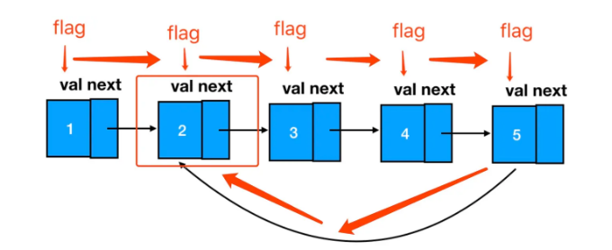

#### 一、链表的合并 ####

- 真题描述：将两个有序链表合并为一个新的有序链表并返回。新链表是通过拼接给定的两个链表的所有结点组成的。 （力扣地址：https://leetcode.cn/problems/merge-two-sorted-lists/description/）

- 示例： 输入：1->2->4, 1->3->4 输出：1->1->2->3->4->4

**1.编码实现**

	/**
	 * @param {ListNode} l1
	 * @param {ListNode} l2
	 * @return {ListNode}
	 */
	const mergeTwoLists = function(l1, l2) {
	  // 定义头结点，确保链表可以被访问到
	  let head = new ListNode()
	  // cur 这里就是咱们那根“针”
	  let cur = head
	  // “针”开始在 l1 和 l2 间穿梭了
	  while(l1 && l2) {
	      // 如果 l1 的结点值较小
	      if(l1.val<=l2.val) {
	          // 先串起 l1 的结点
	          cur.next = l1
	          // l1 指针向前一步
	          l1 = l1.next
	      } else {
	          // l2 较小时，串起 l2 结点
	          cur.next = l2
	          // l2 向前一步
	          l2 = l2.next
	      }
	      
	      // “针”在串起一个结点后，也会往前一步
	      cur = cur.next 
	
	  }
	  
	  // 处理链表不等长的情况
	  cur.next = l1!==null?l1:l2
	  // 返回起始结点
	  return head.next
	};

#### 二、链表结点的删除 ####

**1.第一题**

 - 真题描述：给定一个排序链表，删除所有重复的元素，使得每个元素只出现一次。（力扣地址：https://leetcode.cn/problems/merge-two-sorted-lists/description/）

   示例 1:
   输入: 1->1->2
   输出: 1->2

   示例 2:
   输入: 1->1->2->3->3
   输出: 1->2->3

  **(1)编码实现**

		/**
		 * @param {ListNode} head
		 * @return {ListNode}
		 */
		const deleteDuplicates = function(head) {
		    // 设定 cur 指针，初始位置为链表第一个结点
		    let cur = head;
		    // 遍历链表
		    while(cur != null && cur.next != null) {
		        // 若当前结点和它后面一个结点值相等（重复）
		        if(cur.val === cur.next.val) {
		            // 删除靠后的那个结点（去重）
		            cur.next = cur.next.next;
		        } else {
		            // 若不重复，继续遍历
		            cur = cur.next;
		        }
		    }
		    return head;
		};

**2.第二题：删除问题的延伸**

  - 真题描述：给定一个排序链表，删除所有含有重复数字的结点，只保留原始链表中 没有重复出现的数字。

   示例 1:
   输入: 1->2->3->3->4->4->5
   输出: 1->2->5
   
   示例 2:
   输入: 1->1->1->2->3
   输出: 2->3

  **(1)编码实现**

	/**
	 * Definition for singly-linked list.
	 * function ListNode(val, next) {
	 *     this.val = (val===undefined ? 0 : val)
	 *     this.next = (next===undefined ? null : next)
	 * }
	 */
	/**
	 * @param {ListNode} head
	 * @return {ListNode}
	 */

	var deleteDuplicates = function(head) {

         // 极端情况：0个或1个结点，则不会重复，直接返回
	    if(!head || !head.next){
	        return head
	    }

	    let prev = new ListNode()
	    let p = head

	    while(p && p.next){

	        if(p.val === p.next.val){
                // 若值重复，反复地排查后面的元素是否存在多次重复该值的情况
	           while(p && p.next && p.val === p.next.val){

	             p = p.next

	            } 
                //删除重复节点
	            prev.next = p.next
                //若第一个节点就有重复，需要删除，则要更新一下head节点
	            if(p.val === head.val){

	                head = prev.next
	            }
	        }else{
	           
	            prev = p
	        }
	        
	         p = p.next
	    }
	     return head
	};

#### 三、快慢指针与多指针 ####

- 涉及反复遍历的题目，还有一个更明显的特征，就是它们往往会涉及相对复杂的链表操作，比如反转、指定位置的删除等等。

- 解决这类问题，我们用到的是双指针中的“快慢指针”。**快慢指针指的是两个一前一后的指针，两个指针往同一个方向走，只是一个快一个慢。快慢指针严格来说只能有俩，不过实际做题中，可能会出现一前、一中、一后的三个指针，这种超过两个指针的解题方法也叫“多指针法”。**

- 快慢指针+多指针，双管齐下，可以帮助我们解决链表中的大部分复杂操作问题。

**1.快慢指针——删除链表的倒数第 N 个结点(力扣地址：https://leetcode.cn/problems/remove-nth-node-from-end-of-list/description/)**

  - 真题描述：给定一个链表，删除链表的倒数第 n 个结点，并且返回链表的头结点。

  - 示例： 给定一个链表: 1->2->3->4->5, 和 n = 2.

  - 当删除了倒数第二个结点后，链表变为 1->2->3->5.

  - 说明： 给定的 n 保证是有效的。

 **(1)思路分析**

    **dummy 结点的使用**

      - 它可以帮我们处理掉头结点为空的边界问题，帮助我们简化解题过程。因此涉及链表操作、尤其是涉及结点删除的题目（对前驱结点的存在性要求比较高），我都建议大家写代码的时候直接把 dummy 给用起来，建立好的编程习惯：

		const dummy = new ListNode()
		// 这里的 head 是链表原有的第一个结点
		dummy.next = head

   **“倒数”变“正数”**

     - 链表的删除我们上节已经讲过，相信都难不倒大家。这道题的难点实际在于这个“倒数第 N 个”如何定位。

     - 考虑到咱们的遍历不可能从后往前走，因此这个“倒数第 N 个” 咱们完全可以转换为“正数第 len - n + 1"个。这里这个 len 代表链表的总长度，比如说咱们链表长为 7，那么倒数第 1 个就是正数第 7 个。按照这个思路往下分析，如果走直接遍历这条路，那么这个 len 就非常关键了。

     - 我们可以直接遍历两趟：第一趟，设置一个变量 count = 0，每遍历到一个不为空的结点，count 就加 1，一直遍历到链表结束为止，得出链表的总长度 len；根据这个总长度，咱们就可以算出倒数第 n 个到底是正数第几个了（M = len - n + 1），那么我们遍历到第 M - 1（也就是 len - n） 个结点的时候就可以停下来，执行删除操作（想一想，为什么是第 M-1 个，而不是第 M 个？如果你认真读了我们前面的章节，心中一定会有一个清晰的答案^_^）
 
     - 不过这种超过一次的遍历必然需要引起我们的注意，我们应该主动去思考，“如果一次遍历来解决这个问题，我可以怎么做？”，这时候，就要请双指针法来帮忙了。

   **快慢指针登场**

     - step1:首先两个指针 slow 和 fast，全部指向链表的起始位——dummy 结点：

   

     - 快指针先出发！闷头走上 n 步，在第 n 个结点处打住，这里 n=2：

   

     - 然后，快慢指针一起前进，当快指针前进到最后一个结点处时，两个指针再一起停下来：

   
   

   

     - 此时，慢指针所指的位置，就是倒数第 n 个结点的前一个结点：
     
   

     - 我们基于这个结点来做删除，可以说是手到擒来：
          
   

- 到这里，我们总结一下：

- 链表删除问题中，若走两次遍历，我们做了两件事：

   - **求长度**

   - **做减法，找定位。**

- **若用快慢指针，我们其实是把做减法和找定位这个过程给融合了。通过快指针先行一步、接着快慢指针一起前进这个操作，巧妙地把两个指针之间的差值保持在了“n”上（用空间换时间，本质上其实就是对关键信息进行提前记忆，这里咱们相当于用两个指针对差值实现了记忆），这样当快指针走到链表末尾（第 len 个）时，慢指针刚好就在 len - n 这个地方稳稳落地。**

 **(2)编码实现**

	/**
	 * @param {ListNode} head
	 * @param {number} n
	 * @return {ListNode}
	 */
	const removeNthFromEnd = function(head, n) {
	    // 初始化 dummy 结点
	    const dummy = new ListNode()
	    // dummy指向头结点
	    dummy.next = head
	    // 初始化快慢指针，均指向dummy
	    let fast = dummy
	    let slow = dummy
	
	    // 快指针闷头走 n 步
	    while(n!==0){
	        fast = fast.next
	        n--
	    }
	    
	    // 快慢指针一起走
	    while(fast.next){
	        fast = fast.next
	        slow = slow.next
	    }
	    
	    // 慢指针删除自己的后继结点
	    slow.next = slow.next.next
	    // 返回头结点
	    return dummy.next
	};

**2.多指针法——链表的反转**

  (1)**完全反转一个链表(力扣地址：https://leetcode.cn/problems/reverse-linked-list/)**

   - 真题描述：定义一个函数，输入一个链表的头结点，反转该链表并输出反转后链表的头结点。

   示例:
   输入: 1->2->3->4->5->NULL
   输出: 5->4->3->2->1->NULL

   **思路解读**

   

   - 要把上述链表颠倒顺序呢就是想办法把每个结点 next 指针的指向给反过来就行了：

   

   - 接下来我们需要琢磨的是如何去反转指针的指向，这里我们需要用到三个指针，它们分别指向目标结点（cur）、目标结点的前驱结点（pre）、目标结点的后继结点（next）。这里咱们随便找个结点来开刀：

   

   - 这里我只需要一个简单的cur.next = pre，就做到了 next 指针的反转：

   

   - 那 next 不是完全没用到吗？当然有用，你瞅瞅，咱们反转完链表变成啥样了：

   

   - 这会儿我要是不用 next 给你指着 cur 原本的后继结点，你上哪去定位下一个结点呢？遍历都没法继续了嗷。

  **编码实现**

	/**
	 * @param {ListNode} head
	 * @return {ListNode}
	 */
	const reverseList = function(head) {
	    // 初始化前驱结点为 null
	    let pre = null;
	    // 初始化目标结点为头结点
	    let cur = head;
	    // 只要目标结点不为 null，遍历就得继续
	    while (cur !== null) {
	        // 记录一下 next 结点
	        let next = cur.next;
	        // 反转指针
	        cur.next = pre;
	        // pre 往前走一步
	        pre = cur;
	        // cur往前走一步
	        cur = next;
	    }
	    // 反转结束后，pre 就会变成新链表的头结点
	    return pre
	};

  **(2)局部反转一个链表(力扣地址：https://leetcode.cn/problems/reverse-linked-list-ii/description/)**

    - 真题描述：反转从位置 m 到 n 的链表。请使用一趟扫描完成反转。
	
	- 说明: 1 ≤ m ≤ n ≤ 链表长度。
	
   示例:
   输入: 1->2->3->4->5->NULL, m = 2, n = 4
   输出: 1->4->3->2->5->NULL

**编码实现**

	/**
	 * @param {ListNode} head
	 * @param {number} m
	 * @param {number} n
	 * @return {ListNode}
	 */
	// 入参是头结点、m、n
	const reverseBetween = function(head, m, n) {
	    // 定义pre、cur，用leftHead来承接整个区间的前驱结点
	    let pre,cur,leftHead
	    // 别忘了用 dummy 嗷
	    const dummy = new ListNode()  
	    // dummy后继结点是头结点
	    dummy.next = head
	    // p是一个游标，用于遍历，最初指向 dummy
	    let p = dummy  
	    // p往前走 m-1 步，走到整个区间的前驱结点处
	    for(let i=0;i<m-1;i++){
	        p = p.next
	    }
	    // 缓存这个前驱结点到 leftHead 里
	    leftHead = p
	    // start 是反转区间的第一个结点
	    let start = leftHead.next  
	    // pre 指向start
	    pre = start
	    // cur 指向 start 的下一个结点
	    cur = pre.next
	    // 开始重复反转动作
	    for(let i=m;i<n;i++){
	        let next = cur.next
	        cur.next = pre
	        pre = cur
	        cur = next
	    }
	    //  leftHead 的后继结点此时为反转后的区间的第一个结点
	    leftHead.next = pre
	    // 将区间内反转后的最后一个结点 next 指向 cur
	    start.next=cur
	    // dummy.next 永远指向链表头结点
	    return dummy.next
	};

#### 四、环形链表 ####

**1.基本问题——如何判断链表是否成环？ **

真题描述：给定一个链表，判断链表中是否有环。(力扣地址：https://leetcode.cn/problems/linked-list-cycle/description/)

示例 1：
输入：[3,2,0,4]（链表结构如下图） 输出：true
解释：链表中存在一个环

**(1)思路解读**

  - 一个环形链表的基本修养，是能够让遍历它的游标回到原点：

   

  - 从 flag 出发，只要我能够再回到 flag 处，那么就意味着，我正在遍历一个环形链表。

  - 我们按照这个思路来做题：

**(2)编码实现**

	/**
	 * @param {ListNode} head
	 * @return {boolean}
	 */
	// 入参是头结点 
	const hasCycle = function(head) {
	    // 只要结点存在，那么就继续遍历
	    while(head){
	        // 如果 flag 已经立过了，那么说明环存在
	        if(head.flag){
	            return true;
	        }else{
	            // 如果 flag 没立过，就立一个 flag 再往
	            下走
	            head.flag = true;
	            head = head.next;
	        }
	    }
	    return false;
	};

**2.环形链表衍生问题——定位环的起点(力扣地址：https://leetcode.cn/problems/c32eOV/description/)**

  - 真题描述：给定一个链表，返回链表开始入环的第一个结点。 如果链表无环，则返回 null。

   示例 1：
   输入：head = [3,2,0,-4]（如下图） 输出：tail connects to node index 1 解释：链表中有一个环，其尾部连接到第二个结点。

 **(1)思路解读**

    - 这道题在上道题的基础上，仅仅增加了一个“返回链表的成环起点”，其难度定义就从 easy 上升到了 medium。不过对于掌握了关键解题思路的各位来说，这道题仍然是 easy——因为如果一个结点是环形链表成环的起点，那么它一定是第一个被发现 flag 标志已存在的结点：

   

    - 这一点不难理解，我们试想如果从头开始遍历一个链表，假如途中进入了一个环，那么首先被打上 flag 标签的其实就是环的起点。待我们遍历完这个环时，即便环上所有的结点都已经被立了 flag，但起点处的 flag 一定最先被我们定位到。因此，我们只需要在第一次发现 flag 已存在时，将对应的结点返回即可：

 **(2)编码实现**

	/**
	 * @param {ListNode} head
	 * @return {ListNode}
	 */
	const detectCycle = function(head) {
	    while(head){
	        if(head.flag){
	            return head;
	        }else{
	            head.flag = true;
	            head = head.next;
	        }
	    }
	    return null;
	};

**如果不让改链表结构，可以使用map**

	var detectCycle = function(head) {
	    let map = new Map()
	    while(head){
	        if(map.get(head)){
	            return head
	        }else{
	            map.set(head,true)
	            head = head.next
	        }
	    }
	    return null
	};

 **快慢指针的思路**
