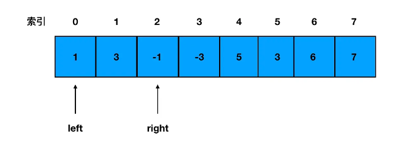

#### 一、典型真题快速上手-“有效括号”问题 ####

力扣地址：https://leetcode.cn/problems/valid-parentheses/ 

题目描述：给定一个只包括 '('，')'，'{'，'}'，'['，']' 的字符串，判断字符串是否有效。

有效字符串需满足： 左括号必须用相同类型的右括号闭合。
左括号必须以正确的顺序闭合。
注意空字符串可被认为是有效字符串。

  示例 1:
  输入: "()"
  输出: true

  示例 2: 
  输入: "()[]{}"
  输出: true

  示例 3:
  输入: "(]"
  输出: false

  示例 4:
  输入: "([)]"
  输出: false
  示例 5:
  输入: "{[]}"
  输出: true

**编码实现**

	/**
	 * @param {string} s
	 * @return {boolean}
	 */
	var isValid = function(s) {
	    let obj = {
	        '(':')',
	        '{':'}',
	        '[':']'
	    }
	    let stack = []
	    for(let i=0;i<s.length;i++){
	        if(obj[s[i]]){
	            stack.push(s[i])
	            continue;
	        }
	        let x = stack.pop()
	        if(obj[x] !== s[i]){
	            return false
	        }
	    }
	
	    if(stack.length){
	        return false
	    }else{
	        return true
	    }
	};

#### 二、栈问题进阶-每日温度问题 ####

力扣地址：https://leetcode.cn/problems/iIQa4I/description/

题目描述: 根据每日气温列表，请重新生成一个列表，对应位置的输出是需要再等待多久温度才会升高超过该日的天数。如果之后都不会升高，请在该位置用 0 来代替。

例如，给定一个列表 temperatures = [73, 74, 75, 71, 69, 72, 76, 73]，你的输出应该是 [1, 1, 4, 2, 1, 1, 0, 0]。

提示：气温 列表长度的范围是 [1, 30000]。每个气温的值的均为华氏度，都是在 [30, 100] 范围内的整数。

**1.思路分析**

看到这道题，大家不难想到暴力遍历法：直接两层遍历，第一层定位一个温度，第二层定位离这个温度最近的一次升温是哪天，然后求出两个温度对应索引的差值即可。

一个数组两层遍历，属于比较少见且高危的操作。事出反常必有妖，此时我们就需要反思：这道题是不是压根不该用暴力遍历来做？

答案是肯定的。因为在这个暴力遍历的过程中，我们其实做了很多“多余”的事情。

拿第三个索引位上这个 75 来说，我们在定位比 75 高的第一个温度的过程中，就路过了 71、69、72 这三个温度，其中，72 正是 71 对应的目标温度，可我们却像没看见它一样、啥也没干。只有等最外层遍历走到 71 时，我们才又重复了一遍刚刚走过的路、确认了 71 和 72 之间的关系——像这种不必要的重复，我们要想办法把它干掉。

**栈结构可以帮我们避免重复操作。**

**避免重复操作的秘诀就是及时地将不必要的数据出栈，避免它对我们后续的遍历产生干扰。**

拿这道题来说，我们的思路就是：**尝试去维持一个递减栈。**

当遍历过的温度，维持的是一个单调递减的态势时，我们就对这些温度的索引下标执行入栈操作；只要出现了一个数字，它打破了这种单调递减的趋势，也就是说它比前一个温度值高，这时我们就对前后两个温度的索引下标求差，得出前一个温度距离第一次升温的目标差值。

**2.编码实现**

	/**
	 * @param {number[]} T
	 * @return {number[]}
	 */
	// 入参是温度数组
	const dailyTemperatures = function(T) {
	    const len = T.length // 缓存数组的长度 
	    const stack = [] // 初始化一个栈   
	    const res = (new Array(len)).fill(0) //  初始化结果数组，注意数组定长，占位为0
	    for(let i=0;i<len;i++) {
	      // 若栈不为0，且存在打破递减趋势的温度值
	      while(stack.length && T[i] > T[stack[stack.length-1]]) {
	        // 将栈顶温度值对应的索引出栈
	        const top = stack.pop()  
	        // 计算 当前栈顶温度值与第一个高于它的温度值 的索引差值
	        res[top] = i - top 
	      }
	      // 注意栈里存的不是温度值，而是索引值，这是为了后面方便计算
	      stack.push(i)
	    }
	    // 返回结果数组
	    return res 
	};

#### 三、栈的设计——“最小栈”问题 ####

力扣地址：https://leetcode.cn/problems/min-stack/

题目描述：设计一个支持 push ，pop ，top 操作，并能在常数时间内检索到最小元素的栈。

push(x) —— 将元素 x 推入栈中。
pop() —— 删除栈顶的元素。
top() —— 获取栈顶元素。
getMin() —— 检索栈中的最小元素。

示例:
MinStack minStack = new MinStack();
minStack.push(-2);
minStack.push(0);
minStack.push(-3);
minStack.getMin(); --> 返回 -3.
minStack.pop();
minStack.top(); --> 返回 0.
minStack.getMin(); --> 返回 -2.

**思路分析**

这道题并不难，但是综合性很强，整个题做下来能够相对全面地考察到候选人对栈结构、栈操作的理解和掌握，是不少一面/少数二面面试官的心头好。

其中前三个操作：push、pop 和 top，我们在数据结构快速上手环节已经给大家讲过了，这里不多赘述。需要展开讲的是 getMin 这个接口，这个接口有时候会直接单独拎出来作为一道题来考察，需要大家对它的实现思路有一个真正扎实的掌握。

getMin 要做的事情，是从一个栈里找出其中最小的数字。我们仍然是抛砖引玉，先说一个大部分人都能想到的思路：

初始化一个最小值变量，它的初始值可以设一个非常大的数（比如 Infinity），然后开始遍历整个栈。在遍历的过程中，如果遇到了更小的值，就把最小值变量更新为这个更小的值。这样遍历结束后，我们就能拿到栈中的最小值了。
这个过程中，我们对栈进行了一次遍历，时间复杂度无疑是 O(n)。

按照这个思路，整个栈的设计我们可以这样写：

**编码实现1**
	
	/**
	 * 初始化你的栈结构
	 */
	const MinStack = function() {
	  this.stack = []
	};
	
	/** 
	 * @param {number} x
	 * @return {void}
	 */
	// 栈的入栈操作，其实就是数组的 push 方法
	MinStack.prototype.push = function(x) {
	  this.stack.push(x)
	};
	
	/**
	 * @return {void}
	 */
	// 栈的入栈操作，其实就是数组的 pop 方法
	MinStack.prototype.pop = function() {
	  this.stack.pop()
	};
	
	/**
	 * @return {number}
	 */
	// 取栈顶元素，咱们教过的哈，这里我本能地给它一个边界条件判断（其实不给也能通过，但是多做不错哈）
	MinStack.prototype.top = function() {
	  if(!this.stack || !this.stack.length) {
	      return 
	  }
	  return this.stack[this.stack.length - 1]
	};
	
	/**
	 * @return {number}
	 */
	// 按照一次遍历的思路取最小值
	MinStack.prototype.getMin = function() {
	    let minValue = Infinity  
	    const  { stack } = this
	    for(let i=0; i<stack.length;i++) {
	        if(stack[i] < minValue) {
	            minValue = stack[i]
	        }
	    }
	    return minValue
	};

这样写，用例也能跑通，但是不够酷。如果你在面试时这样做了，面试官有99%的可能性会追问你这句：

“这道题有没有时间效率更高的做法？”

人家都这样问了，咱当然要说“有”。然后，面试官就会搬个小板凳，坐你旁边看你如何妙手回春，变 O(n) 为 O(1)。

时间效率的提升，从来都不是白嫖，它意味着我们要付出更多的空间占用作为代价。在这道题里，如果继续沿着栈的思路往下走，我们可以考虑再搞个栈（stack2）出来作为辅助，让这个栈去容纳当前的最小值。

如何确保 stack2 能够确切地给我们提供最小值？ 这里我们需要实现的是一个从栈底到栈顶呈递减趋势的栈（敲黑板！递减栈出现第二次了哈）：

取最小值：由于整个栈从栈底到栈顶递减，因此栈顶元素就是最小元素。
若有新元素入栈：判断是不是比栈顶元素还要小，否则不准进入 stack2。
若有元素出栈：判断是不是和栈顶元素相等，如果是的话，stack2 也要出栈。
按照这个思路，我们可以有以下编码：

**编码实现2**

	const MinStack = function() {
	    this.stack = [];
	    // 定义辅助栈
	    this.stack2 = [];
	};
	
	/** 
	 * @param {number} x
	 * @return {void}
	 */
	MinStack.prototype.push = function(x) {
	    this.stack.push(x);
	    // 若入栈的值小于当前最小值，则推入辅助栈栈顶
	    if(this.stack2.length == 0 || this.stack2[this.stack2.length-1] >= x){
	        this.stack2.push(x);
	    }
	};
	
	/**
	 * @return {void}
	 */
	MinStack.prototype.pop = function() {
	    // 若出栈的值和当前最小值相等，那么辅助栈也要对栈顶元素进行出栈，确保最小值的有效性
	    if(this.stack.pop() == this.stack2[this.stack2.length-1]){
	        this.stack2.pop();
	    }
	};
	
	/**
	 * @return {number}
	 */
	MinStack.prototype.top = function() {
	    return this.stack[this.stack.length-1];
	};
	
	/**
	 * @return {number}
	 */
	MinStack.prototype.getMin = function() {
	    // 辅助栈的栈顶，存的就是目标中的最小值
	    return this.stack2[this.stack2.length-1];
	};

#### 四、如何用栈实现一个队列？ ####

力扣地址：https://leetcode.cn/problems/implement-queue-using-stacks/description/

题目描述：使用栈实现队列的下列操作：
push(x) -- 将一个元素放入队列的尾部。
pop() -- 从队列首部移除元素。
peek() -- 返回队列首部的元素。
empty() -- 返回队列是否为空。

示例: MyQueue queue = new MyQueue();
queue.push(1);
queue.push(2);
queue.peek(); // 返回 1
queue.pop(); // 返回 1
queue.empty(); // 返回 false

说明:

你只能使用标准的栈操作 -- 也就是只有 push to top, peek/pop from top, size, 和 is empty 操作是合法的。
你所使用的语言也许不支持栈。你可以使用 list 或者 deque（双端队列）来模拟一个栈，只要是标准的栈操作即可。
假设所有操作都是有效的 （例如，一个空的队列不会调用 pop 或者 peek 操作）。

**1.思路分析**

做这道题大家首先要在心里清楚一个事情：栈和队列的区别在哪里？
仔细想想，栈，后进先出；队列，先进先出。也就是说两者的进出顺序其实是反过来的。用栈实现队列，说白了就是用栈实现先进先出的效果，再说直接点，就是想办法让栈底的元素首先被取出，也就是让出栈序列被逆序。
乍一看有点头大：栈结构决定了栈底元素只能被死死地压在最底下，如何使它首先被取出呢？
一个栈做不到的事情，我们用两个栈来做：

- 首先，准备两个栈：

- 现在问题是，怎么把第一个栈底下的那个 1 给撬出来。仔细想想，阻碍我们接触到 1 的是啥？是不是它头上的 3 和 2？那么如何让 3 和 2 给 1 让路呢？实际上咱们完全可以把这三个元素按顺序从 stack1 中出栈、然后入栈到 stack 2 里去：

- 此时 1 变得触手可及。不仅如此，下一次我们试图出队 2 的时候，可以继续直接对 stack2 执行出栈操作——因为转移 2 和 3 的时候已经做过一次逆序了，此时 stack2 的出栈序列刚好就对应队列的出队序列。

- 有同学会问，那如果 stack1 里入栈新元素怎么办？比如这样：

- 你会发现这个4按照顺序应该在 1、2、3 后出栈。当 4 需要被出栈时，stack2 一定已经空掉了。当 stack2 为空、而 stack1 不为空时，我们需要继续把 stack1 中的元素转移到 stack2 中去，然后再从 stack2 里取元素。也就是说，所有的出队操作都只能依赖 stack2 来完成——只要我们坚持这个原则，就可以确保 stack1 里的元素都能够按照正确的顺序（逆序）出栈。

- 我们按照这个思路来写代码：

**编码实现**

	/**
	 * 初始化构造函数
	 */
	const MyQueue = function () {
	  // 初始化两个栈
	  this.stack1 = [];
	  this.stack2 = [];
	};
	
	/**
	* Push element x to the back of queue.
	* @param {number} x
	* @return {void}
	*/
	MyQueue.prototype.push = function (x) {
	  // 直接调度数组的 push 方法
	  this.stack1.push(x);
	};
	
	/**
	* Removes the element from in front of queue and returns that element.
	* @return {number}
	*/
	MyQueue.prototype.pop = function () {
	  // 假如 stack2 为空，需要将 stack1 的元素转移进来
	  if (this.stack2.length <= 0) {
	    // 当 stack1 不为空时，出栈
	    while (this.stack1.length !== 0) {
	      // 将 stack1 出栈的元素推入 stack2
	      this.stack2.push(this.stack1.pop());
	    }
	  }
	  // 为了达到逆序的目的，我们只从 stack2 里出栈元素
	  return this.stack2.pop();
	};
	
	/**
	* Get the front element.
	* @return {number}
	* 这个方法和 pop 唯一的区别就是没有将定位到的值出栈
	*/
	MyQueue.prototype.peek = function () {
	  if (this.stack2.length <= 0) {
	    // 当 stack1 不为空时，出栈
	    while (this.stack1.length != 0) {
	      // 将 stack1 出栈的元素推入 stack2
	      this.stack2.push(this.stack1.pop());
	    }
	  }
	  // 缓存 stack2 的长度
	  const stack2Len = this.stack2.length;
	  return stack2Len && this.stack2[stack2Len - 1];
	};
	
	/**
	* Returns whether the queue is empty.
	* @return {boolean}
	*/
	MyQueue.prototype.empty = function () {
	  // 若 stack1 和 stack2 均为空，那么队列空
	  return !this.stack1.length && !this.stack2.length;
	};

#### 五、认识双端队列 ####

- 双端队列就是允许在队列的两端进行插入和删除的队列。

- 体现在编码上，最常见的载体是既允许使用 pop、push 同时又允许使用 shift、unshift 的数组：

	const queue = [1,2,3,4] // 定义一个双端队列   
	queue.push(1) // 双端队列尾部入队 
	queue.pop() // 双端队列尾部出队   
	queue.shift() // 双端队列头部出队 
	queue.unshift(1) // 双端队列头部入队

#### 六、滑动窗口问题 ####

力扣地址：https://leetcode.cn/problems/sliding-window-maximum/description/

题目描述：给定一个数组 nums 和滑动窗口的大小 k，请找出所有滑动窗口里的最大值。

示例: 输入: nums = [1,3,-1,-3,5,3,6,7], 和 k = 3 输出: [3,3,5,5,6,7]

解释: 滑动窗口的位置
---------------
[1 3 -1] -3 5 3 6 7
1 [3 -1 -3] 5 3 6 7
1 3 [-1 -3 5] 3 6 7
1 3 -1 [-3 5 3] 6 7
1 3 -1 -3 [5 3 6] 7
1 3 -1 -3 5 [3 6 7]

最大值分别对应：
3 3 5 5 6 7

提示：你可以假设 k 总是有效的，在输入数组不为空的情况下，1 ≤ k ≤ 输入数组的大小。

**思路分析：双指针+遍历法**

这道题如果只是为了做对，那么思路其实不难想，我们直接模拟题中描述的这个过程就行。
按照题意，它要求我们在遍历数组的过程当中，约束一个窗口——窗口的本质其实就是一个范围，像这样：

[1  3  -1] -3  5  3  6  7 

范围就被圈定在了前三个元素。
我们前面学过，约束范围，可以用双指针。因此我这里定义一个 left 左指针、定义一个 right 右指针，分别指向窗口的两端即可：

接下来我们可以把这个窗口里的数字取出来，直接遍历一遍、求出最大值，然后把最大值存进结果数组。这样第一个窗口的最大值就有了。

接着按照题意，窗口每次前进一步（左右指针每次一起往前走一步），此时的范围变成了这样：

我们要做的仍然是取出当前范围的所有元素、遍历一遍求出最大值，然后将最大值存进结果数组。

反复执行上面这个过程，直到数组完全被滑动窗口遍历完毕，我们也就得到了问题的答案。

基于这个淳朴的思路，我们来写一波代码：

**编码实现：双指针+遍历法**
	
	/**
	 * @param {number[]} nums
	 * @param {number} k
	 * @return {number[]}
	 */
	const maxSlidingWindow = function (nums, k) {
	  // 缓存数组的长度
	  const len = nums.length;
	  // 定义结果数组
	  const res = [];
	  // 初始化左指针
	  let left = 0;
	  // 初始化右指针
	  let right = k - 1;
	  // 当数组没有被遍历完时，执行循环体内的逻辑
	  while (right < len) {
	    // 计算当前窗口内的最大值
	    const max = calMax(nums, left, right);
	    // 将最大值推入结果数组
	    res.push(max);
	    // 左指针前进一步
	    left++;
	    // 右指针前进一步
	    right++;
	  }
	  // 返回结果数组
	  return res;
	};
	
	// 这个函数用来计算最大值
	function calMax(arr, left, right) {
	  // 处理数组为空的边界情况
	  if (!arr || !arr.length) {
	    return;
	  }
	  // 初始化 maxNum 的值为窗口内第一个元素
	  let maxNum = arr[left];
	  // 遍历窗口内所有元素，更新 maxNum 的值
	  for (let i = left; i <= right; i++) {
	    if (arr[i] > maxNum) {
	      maxNum = arr[i];
	    }
	  }
	  // 返回最大值
	  return maxNum;
	}

**解法复盘**

- 上面这个解法，你在面试的时候写上去，完全没有问题，也不用担心超时。

- 有的同学可能会觉得 calMax 这个函数多余了，认为可以直接用 Math.max 这个 JS 原生方法。其实就算是Math.max，也不可避免地需要对你传入的多个数字做最小值查找，calMax 和Math.max做的工作可以说是一样的辛苦。我这里手动实现一个 calMax， 大家会对查找过程造成的时间开销有更直观的感知。

- 现在我们来思考一下，上面这一波操作下来，时间复杂度是多少？
这波操作里其实涉及了两层循环，外层循环是 while，它和滑动窗口前进的次数有关。滑动窗口前进了多少次，while 就执行了多少次。

- 假设数组的规模是 n，那么从起始位置开始，滑动窗口每次走一步，一共可以走 n - k 次。注意别忘了初始位置也算作一步的，因此一共走了 n - k + 1次。然后每个窗口内部我们又会固定执行 k 次遍历。注意 k 可不是个常数，它和 n 一样是个变量。因此这个时间复杂度简化后用大 O 表示法可以记为 O(kn)。

- O(kn) 虽然不差，但对这道题来说，还不是最好。因此在面试过程中，如果你采用了上面这套解法做出了这个题，面试官有 99% 的可能性会追问你：这个题可以优化吗？如何优化？（或者直接问你，你能在线性时间复杂度内解决此题吗？）

- 答案当然是能，然后面试官就会搬个小板凳坐你旁边，看看你怎么妙手回春，变 O(kn) 为 O(n)。

- 接下来你需要表演的，正是面试官期待已久的双端队列解法啊！

**思路分析：双端队列法**

要想变 O(kn) 为 O(n)，我们就要想怎么做才能丢掉这个 k。
k 之所以会产生，是因为我们现在只能通过遍历来更新最大值。那么更新最大值，有没有更高效的方法呢？
大家仔细想想，当滑动窗口往后前进一步的时候，比如我从初始位置前进到第二个位置：

（图中红色的范围是初始位置时，滑动窗口覆盖到的元素）

此时滑动窗口内的元素少了一个 1，增加了一个 -3——减少的数不是当前最大值，增加的数也没有超越当前最大值，因此最大值仍然是 3。此时我们不禁要想：如果我们能在窗口发生移动时，只根据发生变化的元素对最大值进行更新，那复杂度是不是就低很多了？

双端队列可以完美地帮助我们达到这个目的。

使用双端队列法，核心的思路是维护一个有效的递减队列。

在遍历数组的前期，我们尝试将遍历到的每一个元素都推入队列内部（下图是第一个元素入队的示意图）：

每尝试推入一个元素前，都把这个元素与队列尾部的元素作对比。根据对比结果的不同，采取不同的措施：

 - 如果试图推入的元素（当前元素）大于队尾元素，则意味着队列的递减趋势被打破了。此时我们需要将队列尾部的元素依次出队（注意由于是双端队列，所以队尾出队是没有问题的）、直到队尾元素大于等于当前元素为止，此时再将当前元素入队。

 - 如果试图推入的元素小于队列尾部的元素，那么就不需要额外的操作，直接把当前元素入队即可。

维持递减队列的目的，就在于确保队头元素始终是当前窗口的最大值。
当遍历到的元素个数达到了 k 个时，意味着滑动窗口的第一个最大值已经产生了，我们把它 push 进结果数组里：

然后继续前进，我们发现数组索引 0 处的元素（1）已经被踢出滑动窗口了（图中红色方块对应的是当前滑动窗口覆盖到的元素们）：

为了确保队列的有效性，需要及时地去队列检查下 1 这个元素在不在队列里（在的话要及时地踢出去，因为队列本身只维护当前滑动窗口内的元素）。

这里大家思考一下，我在查找 1 的时候，需不需要遍历整个队列？答案是不需要，因为 1 是最靠前的一个元素，如果它在，那么它一定是队头元素。这里我们只需要检查队头元素是不是 1 就行了。 此时我们检查队头，发现是 3：

没错，1早就因为不符合递减趋势被从队头干掉了。此时我们可以断定，当前双端队列里的元素都是滑动窗口已经覆盖的有效元素——没毛病，继续往下走就行了。

接下来，每往前遍历一个元素，都需要重复以上的几个步骤。这里我总结一下每一步都做了什么：

  - 检查队尾元素，看是不是都满足大于等于当前元素的条件。如果是的话，直接将当前元素入队。否则，将队尾元素逐个出队、直到队尾元素大于等于当前元素为止。

  - 将当前元素入队
 
  - 检查队头元素，看队头元素是否已经被排除在滑动窗口的范围之外了。如果是，则将队头元素出队。

  - 判断滑动窗口的状态：看当前遍历过的元素个数是否小于 k。如果元素个数小于k，这意味着第一个滑动窗口内的元素都还没遍历完、第一个最大值还没出现，此时我们还不能动结果数组，只能继续更新队列；如果元素个数大于等于k，这意味着滑动窗口的最大值已经出现了，此时每遍历到一个新元素（也就是滑动窗口每往前走一步）都要及时地往结果数组里添加当前滑动窗口对应的最大值（最大值就是此时此刻双端队列的队头元素）。

这四个步骤分别有以下的目的：

  - 维持队列的递减性：确保队头元素是当前滑动窗口的最大值。这样我们每次取最大值时，直接取队头元素即可。

  - 这一步没啥好说的，就是在维持队列递减性的基础上、更新队列的内容。

  - 维持队列的有效性：确保队列里所有的元素都在滑动窗口圈定的范围以内。

  - 排除掉滑动窗口还没有初始化完成、第一个最大值还没有出现的特殊情况。

结合以上的分析，我们来写代码：

**编码实现**

	/**
	 * @param {number[]} nums
	 * @param {number} k
	 * @return {number[]}
	 */
	const maxSlidingWindow = function (nums, k) {
	  // 缓存数组的长度
	  const len = nums.length;
	  // 初始化结果数组
	  const res = [];
	  // 初始化双端队列
	  const deque = [];
	  // 开始遍历数组
	  for (let i = 0; i < len; i++) {
	    // 当队尾元素小于当前元素时
	    while (deque.length && nums[deque[deque.length - 1]] < nums[i]) {
	      // 将队尾元素（索引）不断出队，直至队尾元素大于等于当前元素
	      deque.pop();
	    }
	    // 入队当前元素索引（注意是索引）
	    deque.push(i);
	    // 当队头元素的索引已经被排除在滑动窗口之外时
	    while (deque.length && deque[0] <= i - k) {
	      // 将队头元素索引出队
	      deque.shift();
	    }
	    // 判断滑动窗口的状态，只有在被遍历的元素个数大于 k 的时候，才更新结果数组
	    if (i >= k - 1) {
	      res.push(nums[deque[0]]);
	    }
	  }
	  // 返回结果数组
	  return res;
	};
