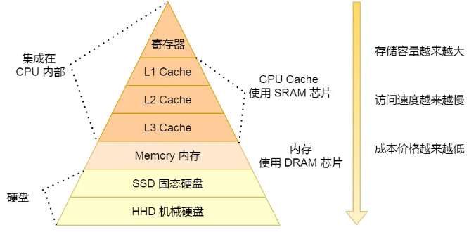

## 一、内存

#### 1.什么是内存？

- 首先，任何应用程序想要运行都离不开内存。

- 另外，我们提到的内存在不同的层面上有着不同的含义。

- **硬件层面**

  - 计算机硬件由5个部分组成：控制器、运算器、存储器、输入设备、输出设备。

  - 存储器的层次结构如下：

    
    
  - 在硬件层面上，内存指的是随机存取存储器。

  - 随机存取存储器分为静态随机存取存储器 SRAM（Static Random-Access Memory)和动态随机存取存储器DRAM （Dynamic Random Access Memory），在速度上 SRAM 要远快于 DRAM，而 SRAM 的速度仅次于 CPU 内部的寄存器。

  - 在现代计算机中，高速缓存使用的是 SRAM，而主存储器使用的是 DRAM。

  - **CPU Cache(CPU高速缓存)**

    - CPU Cache 用的是一种叫 SRAM（Static Random-Access Memory，静态随机存储器） 的芯片。

    - **SRAM 之所以叫「静态」存储器，是因为只要有电，数据就可以保持存在，而一旦断电，数据就会丢失了。**

    - 在 SRAM 里面，一个 bit 的数据，通常需要 6 个晶体管，所以 SRAM 的存储密度不高，同样的物理空间下，能存储的数据是有限的，不过也因为 SRAM 的电路简单，所以访问速度非常快。

    - **CPU 的高速缓存，通常可以分为 L1、L2、L3 这样的三层高速缓存，也称为一级缓存、二级缓存、三级缓存。**

    

    (1)**L1高速缓存**

     - **L1 高速缓存的访问速度几乎和寄存器一样快，通常只需要 2~4 个时钟周期，而大小在几十 KB 到几百 KB 不等。**

     - **每个 CPU 核心都有一块属于自己的 L1 高速缓存，指令和数据在 L1 是分开存放的，所以 L1 高速缓存通常分成指令缓存和数据缓存。**

    (2)**L2高速缓存**

     - **L2 高速缓存同样每个 CPU 核心都有，但是 L2 高速缓存位置比 L1 高速缓存距离 CPU 核心更远，它大小比 L1 高速缓存更大，CPU 型号不同大小也就不同，通常大小在几百 KB 到几 MB 不等，访问速度则更慢，速度在 10~20 个时钟周期。**

    (3)**L3高速缓存**

     - **L3 高速缓存通常是多个CPU 核心（一个CPU可以拥有多个核）共用的，位置比 L2 高速缓存距离 CPU 核心 更远，大小也会更大些，通常大小在几 MB 到几十 MB 不等，具体值根据 CPU 型号而定。**
     - **访问速度相对也比较慢一些，访问速度在 20~60个时钟周期。**

  - **内存（主存）** 

    - 内存用的芯片和 CPU Cache 有所不同，它使用的是一种叫作 DRAM （Dynamic Random Access Memory，动态随机存取存储器） 的芯片。
    - 相比 SRAM，DRAM 的密度更高，功耗更低，有更大的容量，而且造价比 SRAM 芯片便宜很多。
    - DRAM 存储一个 bit 数据，只需要一个晶体管和一个电容就能存储，但是**因为数据会被存储在电容里，电容会不断漏电，所以需要「定时刷新」电容，才能保证数据不会被丢失，这就是 DRAM 之所以被称为「动态」存储器的原因，只有不断刷新，数据才能被存储起来。**
    - **DRAM 的数据访问电路和刷新电路都比 SRAM 更复杂，所以访问的速度会更慢，内存速度大概在 200~300 个 时钟周期之间。**
    - **计算机中的主存其实就是我们平时说的内存条（硬件）**

  - **SSD/HDD 硬盘**

    - SSD（Solid-state disk） 就是我们常说的固体硬盘，结构和内存类似，但是**它相比内存的优点是断电后数据还是存在的，而内存、寄存器、高速缓存断电后数据都会丢失。内存的读写速度比 SSD 大概快 10~1000 倍。**
    - 当然，还有一款传统的硬盘，也就是**机械硬盘（Hard Disk Drive, HDD），它是通过物理读写的方式来访问数据的，因此它访问速度是非常慢的，它的速度比内存慢 10W 倍左右。**
    - 由于 SSD 的价格快接近机械硬盘了，因此机械硬盘已经逐渐被 SSD 替代了。

- **软件层面**

  - 在软件层面上，内存通常指的是操作系统从主存中划分（抽象）出来的内存空间。
  - **硬件内存架构没有区分栈和堆。对于硬件而言，所有的栈和堆都分布在主内存中**。部分栈和堆可能有时候会出现在CPU缓存中和CPU内部的寄存器中。**栈和堆是由操作系统制定规则，通过虚拟机（如JVM、V8引擎等）动态创建的内存模型的一个抽象概念。**
  - **栈和堆都是JS引擎或JVM虚拟机等运行环境创建的内存模型，由CPU管理控制。既然是模型，那就是虚构的，是一种对内存的管理方式和模型概念。**
  - JavaScript只是一种语言，真正进行内存的调用和分配的是JavaScript引擎。
  - **JavaScript引擎是一个专门处理JavaScript脚本的虚拟机。它本质上就是一段程序，可以将JavaScript代码编译为不同CPU对应的汇编代码，此外还负责执行代码，分配内存和垃圾回收等等。**
  - **JavaScript引擎的内存结构可以粗略分为两个部分：栈(Stack)**、**堆(Heap)。现在市面上比较流行的JavaScript引擎有Google的v8引擎、Apple的JavaScriptCore等等。不同的引擎它的内存结构有所差别。**

 

### 一、js的堆栈和其他语言的堆栈的区别 ###

- ~~**在其他常见的语言中，用来保存变量和对象的内存一般分为栈内存和堆内存，而在JavaScript中，所谓的栈和堆都是放在堆内存中的，而在堆内存中，js把其分为栈结构和堆结构，这里常被误认为是堆内存和栈内存，但是我们可以把它简称为栈和堆**~~

- ~~**实际上，js的所有数据都是引用类型。因此我们才能看到js的值类型也有属性和方法（严格来讲，只有引用类型采用属性和方法）。所以，js的所有数据都是存储在堆内存中**~~

- **在JavaScript中，堆内存和栈内存的区别不是由语言本身直接实现的，而是由JavaScript引擎在底层处理**

#### 1. 堆和栈的区别

- 理解堆与栈这两个概念时，需要放到具体的场景下去理解。一般情况下有两层含义
  - 内存操作场景下，堆与栈表示两种内存的管理方式。
    - 栈由操作系统自动分配和释放，用于存放简单的数据段，占据固定大小的空间，比如基本数据类型和函数的参数值等。
    - 堆由开发人员自主分配和释放，若不主动释放，程序结束时由浏览器回收，用于存储引用类型（引用类型的变量实际上保存的不是变量本身，而是指向内存空间的指针）
  - 数据结构场景下，堆与栈表示两种常用的数据结构。
- JavaScript存在栈和队列的概念，通过数组的方式，模拟实现堆栈。
  - 栈：栈是一种运算受限的线性表，其限制是指只仅允许在表的一端进行插入和删除操作，这一端被称为栈顶（Top），相对地，把另一端称为栈底（Bottom）。把新元素放到栈顶元素的上面，使之成为新的栈顶元素称作进栈、入栈或压栈（Push）；把栈顶元素删除，使其相邻的元素成为新的栈顶元素称作出栈或退栈（Pop）。通过数组的push()、pop()方法实现栈。
  - 堆：堆其实是一种优先队列，也就是说队列中存在优先级，比如队列中有很多待执行任务，执行时会根据优先级找优先度最高的先执行。

