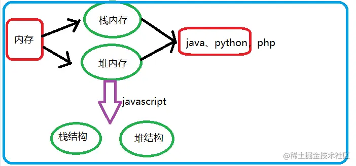
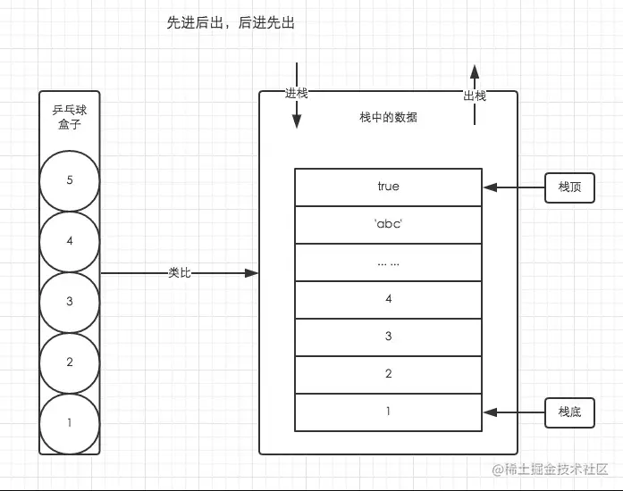
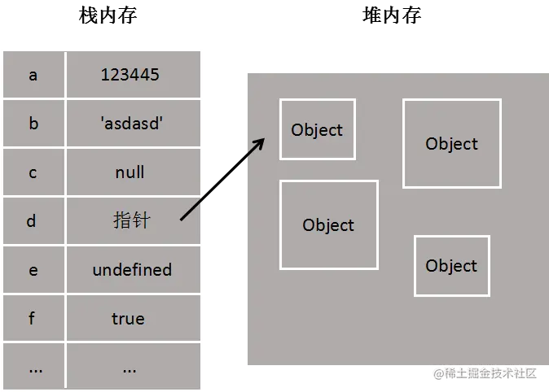
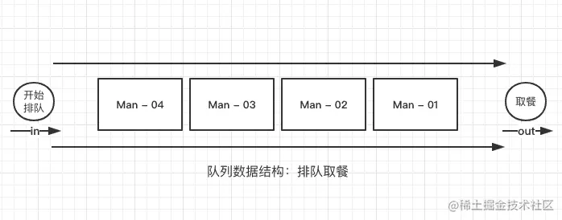
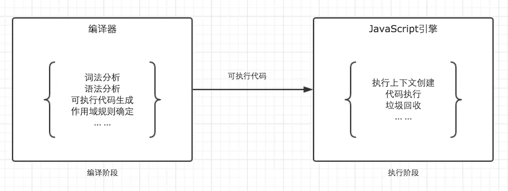

#### 一、语法 ####

「**1.区分大小写**」

「**2.标识符**」

-所谓标识符，就是指变 量、函  数、属性的名字或者函数的参数。

#### 二、变量 ####

- ECMAScript的变量松散类型的，所谓松散类型就是可以用来保存任何类型的数据。

- 换句话说，每个变量仅仅是一个用于保存值的占位符而已。

- 使用var操作符定义的变量将成为定义该变量的作用域中的局部变量。也就是说如果在函数中使用var定义一个变量，那么这个变量在函数退出后就会被销毁。

	function test(){
	  var a = 'hi' //局部变量
	}
	
	test()
	alert(a); //错误

- 省略var操作符，变量就成了全局变量。这样，只要调用过一次函数，这个变量就有了定义，就可以在函数外部的任何地方被访问到、

	function test(){
	  a = 'hi' //全局变量
	}
	
	test()
	alert(a); //hi

#### 三、数据类型 ####

JavaScript共有八种数据类型，分别是 Undefined、Null、Boolean、Number、String、Object、Symbol、BigInt。

其中 Symbol 和 BigInt 是ES6 中新增的数据类型：

Symbol 代表创建后独一无二且不可变的数据类型，它主要是为了解决可能出现的全局变量冲突的问题。

BigInt 是一种数字类型的数据，它可以表示任意精度格式的整数，使用 BigInt 可以安全地存储和操作大整数，即使这个数已经超出了 Number 能够表示的安全整数范围。

- ECMAScript变量可能包含两种不同的数据类型的值：基本数据类型值和引用数据类型值。

- javascript代码在执行的时候会将不同的变量存于内存中的不同位置。

   - 栈：原始数据类型（Undefined、Null、Boolean、Number、String、Symbol、BigInt）以及 引用数据类型的指针

   - 堆：引用数据类型（对象、数组和函数）的值
   
- 因此当我们要访问堆内存中的引用数据类型时，实际上我们首先是从栈中获取了该对象的地址引用（或者地址指针），然后再从堆内存中取得我们需要的数据。

**请注意，不存在闭包的时候，上面的存储结论是对的。但是存在闭包时，闭包用到的变量（原始数据类型、引用数据类型）都会存到[[Scopes]]，然后放到堆内存**

**1.Number类型**

（1）**整数**

     - 十进制整数

      let intNum = 55 //整数

     - 八进制整数
     
       - **八进制字面值的第一位必须是零（0），然后是八进制数字序列（0-7）。如果字面值中的数值超出了范围，那么前导零将被忽略，后面的数值将被当作十进制数值解析。**

         let octalNum1 = 070 //八进制的56
         let octalNum2 = 079 //无效的八进制数值---解析为79
         let octalNum3 = 08  //无效的八进制数值---解析为8

        - **八进制字面量在严格模式下是无效的，会导致支持的JavaScript引擎抛出错误**

     - 十六进制

        - 十六进制字面值  的前两位必须是0x，后跟任何十六进制数字（0-9及A-F）。其中，字母A-F可以大写，也可以小写。

         let hexNum1 = 0xA; //十六进制的10
         let hexNum2 = 0x1f;//十六进制的31

  - **在进行算术计算时，所有以八进制和十六进制表示的数值最终将被转换成十进制数值。**

（2）**浮点数值**

     - **由于浮点数值需要的内存空间时保存整数值的两倍，因此ECMAScipt会不失时机地将浮点数值转换为整数值。显然，如果小数点后面没有跟任何数字，那么这个数值就可以作为整数来保存。同样地，如果浮点数值本身表示的就是一个整数（如1.0），那么该值也会被转换为整数。**

      let floatNum1 = 1     //小数点后面没有数字---解析为1
      let floatNum2 = 10.0  //整数---解析为10

     - **默认情况下，ECMAScript会将那个小数点后面带有6个零以上的浮点数值转换为以e表示法表示的数值**（例如，0.0000003会被转换为3e的-7次方）

     - **浮点数值的最高精度是17位小数，但在进行算数计算时其精确度远远不如整数**。例如，0.1加0.2的结果不是0.3，而是0.30000000000000004。

     - 关于浮点数值计算会产生舍入误差的问题，有一点需要明确：这是使用基于IEEE754数值的浮点计算的通病，ECMAScript并非独此一家，其他使用相同数值格式的语言也存在这个问题。

（3）**数值范围**

    - **由于内存的限制，ECMAScript并不能保存世界上所有的数值，ECMAScript能够表示的最小数值保存在Number.MIN_VALUE中，在大多数浏览器中，这个值是5e的-324次方。能够表示的最大数值保存在Number.MAX_VALUE中，在大多数浏览器中，这个值是1.7976931348623157e的308次方。**
    
    - **如果某次计算的结果得到了一个超出JavaScript数值范围的值，那么这个数值将被自动转换成特殊的Infinity值，具体来说，如果这个数值是负数，则会被转换成-Infinity（负无穷），如果这个数值是正数，则会被转换成Infinity（正无穷）**

    - **所以，如果某次计算返回了正或负的Infinity值，那么该值将无法继续参与下一次的计算，因为Infitify不是能够参与计算的数值。**

    - **可以使用isFinity()函数来校验一个数值是不是有穷的（换句话说 ，是不是位于最小和最大的数值之间）**

    -访问Number.NEGATIVE_INFINITY和Number.POSITIVE_INFINITY也可以得到负和正infinity的值。

      console.log(Number.NEGATIVE_INFINITY) //-infinity
      console.log(Number.POSITIVE_INFINITY) //infinit

（4）**NaN**

     - **NaN，即非数值，是一个特殊的数值，这个数值用于表示一个本来要返回数值的操作数未返回数值的情况（这样就不会抛出错误了）。 **例如，在其他编程语言中，任何数值除以0都会导致错误，从而停止代码执行，但在ECMASctipt中，任何数值除以0会返回NaN，因此不会影响其他代码的执行。
     
     -  **特点**

        - **任何涉及NaN的操作（例如NaN/10）都会返回NaN，这个特点在多步计算中有可能导致问题。**
        
        - **NaN与任何值都不相等，包括NaN本身。**

         console.log(NaN == NaN) //false

     - ** isNaN() **

         - 该函数接收一个参数，该参数可以是任何类型，而函数会帮我们确定这个参数是否'不是数值'。

         - **isNaN()在接收到一个值之后，会尝试将这个值转换成数值，某些不是数值的值会直接转换为数值，例如字符串'10'或Boolean值。而任何不能被转换为数值的值都会导致这个函数返回true**

         console.log(isNaN(NaN))     //true
         console.log(isNaN(10))      //false(10是一个数值)
         console.log(isNaN('10'))    //false(可以被转换成数值10)
         console.log(isNaN('blue'))  //true(不能转换成数值)
         console.log(isNaN(true))    //false(可以被转换成数值)

         - **isNaN()也适用于对象。在基于对象调用isNaN()函数是，会首先调用对象的valueOf()方法，然后确定该方法返回的值是否可以转换为数值。如果不能，则基于这个返回值再调用toString()方法，再测试返回值。**

（5）**数值转换 **
 
     - 有3个函数可以把非数值转换为数值：Number()、parseInt()、parseFloat()。**Number可以用于任何数据类型，而另两个函数则专门用于把字符串转换成数值。**

     - **Number()函数的转换规则：**

        - **如果是Boolean值，true和false将分别被转换为1和0**
        
        - **如果是数字值，只是简单的传入和返回**
        
        - **如果是null值，返回0**
        
        - **如果是undefined，返回NaN**
        
        - **如果是字符串，遵循下列规则：**

            - **如果字符串中只包含数字(包括前面带正号或负号的情况)，则将其转换为十进制数值，即'1'会变成1，'123'会变成123，而'011'会变成11(注意：前导的零被忽略了)**

            - **如果字符串中包含有效浮点格式，如'1.1'，则将其转换为对应的浮点数值(同样，也会忽略前导零)**

            - **如果字符串中包含有效的十六进制格式，例如'0xf'，则将其转换为相同大小的十进制整数值**

            - **如果字符串是空的(不包含任何字符)，则将其转换为0**

            - **如果字符串中包含除上述格式之外的字符，则将其转换为NaN**

         - **如果是对象，则调用对象的valueOf()方法，然后依照前面的规则转换返回的值。如果转换的结果是NaN，则调用对象toString()方法，然后再次依照前面的规则转换返回的字符串值。**

         let num1 = Number('Hello world')   //NaN
         let num2 = Number('')             //0
		 let num3 = Number('000011')      //11
		 let num4 = Number(true)          //1

  - **一元加操作符的操作与Number()函数相同**

  - **parseInt()**

       - parseInt()函数在转换字符串时，更多的是看其是否符合数值模式。**它会忽略字符串前面的空格，直至找到第一个非空格字符。**

       - **如果第一个字符不是数字字符或者负号，parseInt()就会返回NaN，也就是说，用parseInt()转换空字符串会返回NaN(Number()对空字符返回0)。**

       - **如果第一个字符是试字字符，parseInt()会继续解析第二个字符，直到解析完所有后续字符或者遇到了一个非数字字符。**

       - **如果字符串中的第一个字符是数字字符，parseInt()也能够识别出各种整数格式（即前面讨论的十进制、八进制、十六进制数）。也就是说，如果字符串以'0x'开头后跟数字字符，就会将其当作一个十六进制整数，如果字符串以'0'开头且厚跟数字字符，则会将其当作一个八进制数来解析。**

        let num1 = parseInt('1234blue') //1234
        let num2 = parseInt('')         //NaN
		let num3 = parseInt('0xA')      //10(十六进制数转换为十进制)
		let num4 = parseInt('22.5')     //22
		let num5 = parseInt('070')      //56(八进制数转换为十进制)
		let num6 = parseInt('70')      //70 (十进制数)
		let num7 = parseInt('0xf')     //15(十六进制数转换为十进制)
        let num8 = parseInt('0xg')     //NaN

       - 在ECMASctipt 3 JavaScript引擎中，'070'被当成八进制字面量，因此转换后值是十进制的56。而在ECMASctipt 5 JavaScript引擎中，parseInt()已经不具有解析八进制值的能力，因此前导的零会被认为无效，从而将这个值当成0，结果就得到十进制的0

       - 为了消除在使用parseInt()函数时可能导致的上述困惑，**可以为这个函数提供第二个参数：转换时使用的基数（即多少进制）**。如果知道要解析的值是十六进制格式的字符串，那个指定基数16作为第二个参数，可以保证得到正确的结果。
     
        let num1 = parseInt('0xAF',16) //175
       
       - 如果制定了16作为第二个参数，字符串可以不带前面的'0x'

        let num1 = parseInt('AF',16) //175
        let num1 = parseInt('AF') //NaN
       
       - 指定基数意味着让parseInt()决定如何解析输入的字符串，因此为了避免错误的解析，沃恩建议无论在什么情况下都明确指定基数。
           
        let num1 = parseInt('10',2) //2(按二进制解析)
        let num2 = parseInt('10',8) //8(按八进制解析)
        let num3 = parseInt('10',10) //10(按十进制解析)
		let num4 = parseInt('10',16) //16(按十六进制解析)

 - **parseFloat()**

    - **parseFloat()也是从第一个字符（位置0）开始解析每个字符。而且也是一直解析到字符串末尾，或者解析到遇见第一个无效的浮点数字字符为止。也就是说，字符串中的第一个小数点是有效的，而第二个小数点就是无效的了，因此它后面的字符串将被忽略**

    - **除了第一个小数点有效之外，parseFloat()与parseInt()的第二个区别在于它始终都会忽略前导的零，所以parseFloat()只解析十进制值，因此它没有用第二个参数指定基数的用法。**

    - **如果字符串包含的是一个可解析为整数的数（没有小数点，或者小数点后都是零），parseFloat()会返回整数**

        let num1 = parseFloat('1234blue')   //1234(整数)
        let num2 = parseFloat('0xA')        //0
        let num3 = parseFloat('22.5')       //22.5
		let num4 = parseFloat('22.34.5')    //22.34
        let num5 = parseFloat('0908.5')     //908.5
		let num6 = parseFloat('3.125e7')    //31250000

		    
####四、判断数据类型的方法####

「**1.typeof**」

	console.log(typeof 1);               // number
    console.log(typeof true);            // boolean
	console.log(typeof 'str');           // string
	console.log(typeof undefined);       // undefined
	console.log(typeof null);            // object
	console.log(typeof Symbol());        // symbol    
	console.log(typeof BigInt(123));   	 // bigint 
    console.log(typeof []);              // object    
	console.log(typeof function(){});    // function
	console.log(typeof {});              // object
	console.log(typeof new RegExp());    // object
	console.log(typeof new Date());      // object

- 其中数组、对象、null都会被判断为object，其他判断正确。

- 不同对象在底层都表示为二进制，在JavaScript中，二进制前三位都为0的话会被判断为object类型，null的二进制表示全0，自然前三位也是0，所以执行typeof时会返回object

- 使用typeof操作符检测函数时，该操作符会返回'function'。

- 在Safari 5及之前版本和Chrome 7及之前版本中，使用typeof检查正则表达式时，由于规范的原因，这个操作符也返回'function'。**ECMA-262规定任何在内部实现[[Call]]方法的对象都应该在应用typeof操作符时返回'function'。**由于上述浏览器中的正则表达式也实现了这个方法，因此对正则表达式应用typeof会返回'function'。在IE和Firefox中，对正则表达式应用typeof会返回'object'。

- **typeof的判断原理是：将值转换为二进制后，看其前三位是不是0，所有的引用类型（除了function）的二进制前三位都是0，null的二进制全部是0。因此，在需要区分具体引用类型时，typeof并不是最佳选择。**

- **typeof 注意事项**

    - **typeof 返回值为 string 格式，注意类似这种考题: typeof(typeof(undefined)) -> "string"**

    - **typeof 未定义的变量不会报错，返回 "undefiend"**

      console.log(typeof a) // undefined (这里的a变量没有定义)

    - **typeof(null) -> "object": 遗留已久的 bug**

    - **typeof无法区别数组与普通对象: typeof([]) -> "object"**

    - **typeof(NaN) -> "number"**

「**2.instanceof**」

- instanceof 是JavaScript中的一个运算符，**用于判断一个对象是否为某个构造函数的实例，或者说是该构造函数（或其原型链上的任何构造函数）实例化的。因此instanceof()只能用于引用类型判断。**

- instanceof可以正确判断对象的类型，其内部运行机制是判断在其原型链中能否找到该类型的原型。

- 根据规定，所有引用类型的值都是Object的实例。因此，在检测一个引用类型值和Object构造函数时，instanceof操作符始终会返回true。

- 如果使用instanceof操作符检测基本类型的值，则该操作符始终会返回false，因为基本类型不是对象。

	console.log(2 instanceof Number);                    // false
	console.log(true instanceo f Boolean);                // false 
	console.log('str' instanceof String);                // false 
	 
	console.log([] instanceof Array);                    // true
	console.log(function(){} instanceof Function);       // true
	console.log({} instanceof Object);                   // true

- **instanceof的弊端**
  
  （1）只能用于引用类型的判断

  （2）篡改原型链

        - 由于 instanceof 是沿着原型链去判断，因此当我们尝试修改原有原型链的指向就会造成判断错误：

	        function Person() {}
			function Monster() {}
			
			const p = new Person();
			
			console.log(p instanceof Person); // true
			Person.prototype = Monster.prototype;
			console.log(p instanceof Person); // false
			console.log(p.__proto__ === Person.prototype); // false

         - 但针对一些内置的构造函数：Object、Array、Date等它们的prototype是不允许进行修改的，因此可以大胆的进行使用instanceof进行判断

            console.log(Object.getOwnPropertyDescriptor(Object, "prototype")); 
			console.log(Object.getOwnPropertyDescriptor(Array, "prototype"));
			console.log(Object.getOwnPropertyDescriptor(Date, "prototype"));
			console.log(Object.getOwnPropertyDescriptor(RegExp, "prototype"));
			console.log(Object.getOwnPropertyDescriptor(Map, "prototype"));
			console.log(Object.getOwnPropertyDescriptor(Set, "prototype"));

            {value: {…}, writable: false, enumerable: false, configurable: false}
            {value: Array(0), writable: false, enumerable: false, configurable: false}
            {value: {…}, writable: false, enumerable: false, configurable: false}
            {value: {…}, writable: false, enumerable: false, configurable: false}
            {value: Map, writable: false, enumerable: false, configurable: false}
            {value: Set, writable: false, enumerable: false, configurable: false}

         - 所以这种操作就别想辣：

            const cache = Array.prototype;
			const emptyObj = Object.create(null);
			Array.prototype = emptyObj; // no use 
			console.log(Array.prototype === emptyObj, Array.prototype === cache); // false  true
			console.log([] instanceof Array); // true

  （3）不同全局执行上下文

       - **在浏览器中，我们的脚本可能需要在多个窗口之间进行交互。多个窗口意味着多个全局环境，不同的全局环境拥有不同的全局对象，从而拥有不同的内置类型构造函数。**比如两个不同版本的Array构造函数，如果要把数组从一个框架传给另一个框架，则这个给数组的构造函数将有别于在第二个框架内本地创建的数组。

           例如：window1  const arr = [1,2,3]

                 window2 arr instanceof Array => false

       - 起初，你会认为这样并没有意义，但是当你在你的脚本中开始处理多个 frame 或多个 window 以及通过函数将对象从一个窗口传到另一个窗口时，这就是一个有效而强大的话题。
       
       - 解决这个问题的一种方法是使用 Object.prototype.toString.call，它不依赖于具体的构造函数或原型链，而是直接检查对象的内部标识。
       
		<!DOCTYPE html>
		<html lang="en">
		  <head>
		    <meta charset="UTF-8" />
		    <meta name="viewport" content="width=device-width, initial-scale=1.0" />
		    <title>Document</title>
		  </head>
		  <body>
		    <h1>page1</h1>
		    <!-- 引入 iframe -->
		    <iframe src="./two.html"></iframe>
		    
		  </body>
		</html>
		
**综上所述判断类型要斟酌当前的场景再合理的使用 instanceof，当然也可以使用 Array.isArray 或者 Object.prototype.toString.call 来进行判断，更加准确和安全。**

「**3.constructor 属性**」

- 基于原型链判断，对象的constructor属性指向创建实例的构造函数

    function Person(name, age, job) {
		this.name = name;
		this.age = age;
		this.job = job;
		this.sayName = function() {
		   console.log(this.name);
		};
	}
	const person1 = new Person("Nicholas", 29, "Software Engineer");
	const person2 = new Person("Greg", 27, "Doctor");
	console.log(person1.constructor === Person) //true
    console.log(person2.constructor === Person) //true
    console.log(person2.constructor === Object) //false

「**4.Object.prototype.toString.call()**」

- Object.prototype.toString.call() 使用 Object 对象的原型方法 toString 来判断数据类型：这种方案还是非常强大的，不仅基础数据类还是引用数据类型，甚至是正则对象，时间对象，Error对象等都能准确判断出来。

    const _toString = Object.prototype.toString;
    console.log(_toString.call({}));                  // [object Object]
    console.log(_toString.call([]));                  // [object Array]
    console.log(_toString.call(1));                   // [object Number]
    console.log(_toString.call("abc"));               // [object String]
    console.log(_toString.call(false));               // [object Boolean]
    console.log(_toString.call(function () {}));      // [object Function]
    console.log(_toString.call(null));                // [object Null]
    console.log(_toString.call(undefined));           // [object Undefined]
    console.log(_toString.call(Symbol("")));          // [object Symbol]
    console.log(_toString.call(BigInt(9007199254740991))); // [object BigInt]
    console.log(_toString.call(new Date()));          // [object Date]
    console.log(_toString.call(new RegExp()));        // [object RegExp]
    console.log(_toString.call(new Error()));         // [object Error]
    console.log(_toString.call(new Map()));           // [object Map]
    console.log(_toString.call(new Set()));           // [object Set]

#### 五、js的堆栈和其他语言的堆栈的区别 ####

** 在其他常见的语言中，用来保存变量和对象的内存一般分为栈内存和堆内存，而在JavaScript中，所谓的栈和堆都是放在堆内存中的，而在堆内存中，js把其分为栈结构和堆结构，这里常被误认为是堆内存和栈内存，但是我们可以把它简称为栈和堆**
 
**实际上，js的所有数据都是引用类型。因此我们才能看到js的值类型也有属性和方法（严格来讲，只有引用类型采用属性和方法）。所以，js的所有数据都是存储存储在堆内存中**

**在JavaScript中，堆内存和栈内存的区别不是由语言本身直接实现的，而是由JavaScript引擎在底层处理**

 
「**1.堆和栈的区别**」

- 理解堆与栈这两个概念时，需要放到具体的场景下去理解。一般情况下有两层含义：

（1）内存操作场景下，堆与栈表示两种内存的管理方式。
   
     - 栈由操作系统自动分配和释放，用于存放简单的数据段，占据固定大小的空间，比如基本数据类型和函数的参数值等。
     - 堆由开发人员自主分配和释放，若不主动释放，程序结束时由浏览器回收，用于存储引用类型（引用类型的变量实际上保存的不是变量本身，而是指向内存空间的指针）

（2）数据结构场景下，堆与栈表示两种常用的数据结构。

     - JavaScript存在栈和队列的概念，通过数组的方式，模拟实现堆栈。
     - 
     - 栈：栈是一种运算受限的线性表，其限制是指只仅允许在表的一端进行插入和删除操作，这一端被称为栈顶（Top），相对地，把另一端称为栈底（Bottom）。把新元素放到栈顶元素的上面，使之成为新的栈顶元素称作进栈、入栈或压栈（Push）；把栈顶元素删除，使其相邻的元素成为新的栈顶元素称作出栈或退栈（Pop）。通过数组的push()、pop()方法实现栈。

     - 堆：堆其实是一种优先队列，也就是说队列中存在优先级，比如队列中有很多待执行任务，执行时会根据优先级找优先度最高的先执行。
     

#### 六、js的内存 ####

「**1.背景**」

- 不管什样的编程语言，在代码的执行过程中都是需要给它分配内存的，不同的是某些编程语言需要我们自己手动的管理内存，某些编程语言会自动帮助我们管理内存。

- 而js它所具备的内存管理就是自动进行了，不对使用者开放。

- js的内存管理对我们来说，变成了黑盒一样的存在，一旦我们因为错的引用持有（例如闭包或全局变量），就会导致内存泄露。

「**2.认识内存管理**」

- 但不管以什么样的方式来管理内存，内存的管理都会有如下的生命周期：

    第一步：分配申请我们需要的内存（申请）；

    第二步：使用分配的内存（存放一些东西，比如对象等）；

    第三步：不需要使用时，对其进行释放；
   
    **全局变量一般不会回收（关闭页面回收）。一般情况下局部变量的值，不用了，会被自动回收。**

- 不同的编程语言对于第一步和第三步会有不同的实现：

   （1）手动管理内存：比如C、C++，包括早期的OC，都是需要手动来管理内存的申请和释放的（malloc和free函数）；

       这种方式需要程序员手动管理内存，容易出现内存泄漏和野指针等问题，程序的稳定性和安全性有一定的风险。

   （2）自动管理内存：比如Java、JavaScript、Python、Swift、Dart等，它们有自动帮助我们管理内存；

      在这些语言中，存在垃圾回收机制来自动回收不再使用的内存空间，程序员只需要正确地使用变量和对象等引用类型数据，垃圾回收器就会自动进行内存管理，释放不再被引用的内存空间。

      这种方式可以避免内存泄漏和野指针等问题，提高程序的稳定性和安全性

- 对于开发者来说，JavaScript 的内存管理是自动的、无形的，也是抽象的

   （1）我们创建的原始值、对象、函数……这一切都会占用内存

   （2）好处在于我们并不需要手动来对它们进行管理，JavaScript引擎会帮助我们处理好它，但同样会带来一定的坏处(人为)：我们可能会忽略掉内存管理在其中的作用，导致相关理解产生偏差

「**3.在JavaScript的执行过程中，主要有三种类型的内存空间：代码空间、栈空间、堆空间**」

- 代码空间：用来存放可执行代码

- 栈空间：一块连续的内存区域，容量较小，读取速度快，被设计成先进后出结构

- 堆空间：不连续的内存区域，容量较大，用于储存大数据，读取速度慢

#### 七、栈、堆、队列 ####

**js以执行上下文的方式在堆内存中模拟实现类似栈内存的操作模式，因此，我们可以以传统的堆栈概念来理解js的内存空间**

- 栈（stack）、堆（heap）、队列（queue）是js的三种数据结构。

「**1.栈**」

- 栈的特点是：出口和入口是同一个，遵循着先进后出、后进先出的原则。数据只能顺序的入栈，顺序的出栈。
- 在栈里，新元素都靠近栈顶，旧元素都接近栈底。

    let a1 = 0; // 栈内存
    let a2 = "this is string" // 栈内存
	let a3 = null; // 栈内存

「**2.堆**」

- 堆的特点是无序的key-value键值对存储方式。
- 堆的存取方式跟顺序没有关系，不局限出入口。

	let b = { x: 10 }; // 变量 b 存在于栈中，{ x: 10 } 作为对象存在于堆中
	let c = [1, 2, 3]; // 变量 c 存在于栈中，[1, 2, 3] 作为对象存在于堆中
    var arr1 = []
    var arr2 = []
    console.log(arr1===arr2] ///false
    因为在栈里的变量，存的是地址，而不是它的值，此时比较的是两个数组的存储地址，地址当然是不一样的，所以是false

「**3.堆与栈比较**」

- 堆是动态分配内存，内存大小不一，也不会自动释放。
- 栈是自动分配相对固定大小的内存空间，并由系统自动释放。
- 栈是线性结构，后进先出，便于管理
- 堆，一个混沌，杂乱无章，方便存储和开辟内存空间。

下图有助理解栈内存、堆内存

「**4.为什么大部分高级语言都用栈来管理函数调用？**」

（1）函数调用栈

每个函数的调用时，解释器都会现在栈中创建一个调用栈（call stack）来存储函数的调用流程顺序。然后把该函数添加进调用栈，解释器会为被添加进的函数再创建一个栈帧（Stack Frame）并立即执行。如果正在执行的函数还调用了其它函数，那么新函数也将会被添加进调用栈并执行。直到这个函数执行结束，对应的栈帧也会被立即销毁。栈帧中一般会存放信息包括：

  - 函数的返回地址和参数
 
  - 临时变量：函数局部变量+编译器自动生成的其他临时变量

  - 函数调用的上下文

（2）从函数自身的特性来分析这个问题

     - 函数具有可被调用的特性，代码执行控制权从最开始父函数调用子函数开始，移交给子函数，再由子函数执行完成后又移交给父函数，这个控制权的转移证明了：函数调用者的生命周期总是长于被调用者（后进），而且被调用者的生命周期总是先于调用者结束（先出）
     
     - 函数还有作用域的限制，在执行的时候，定义在函数内部的临时变量与外部环境隔离，只能在函数内访问，外部函数无权访问，当函数执行介绍后，临时变量也会随之被销毁。关于临时变量的资源占用情况证明了：被调用者的资源分配总是晚于调用者（后进），同时被调用者的资源释放却又总先于调用者（先出）

「**5.为什么会有堆内存和栈内存之分？**」

 **JS中的内存分类与JS引擎有关，在浏览中一般是V8引擎；要进行内存区分主要是为了进行垃圾回收（比如在V8的垃圾回收机制中会根据新生代、老生代内存采用不同回收算法来保证垃圾回收效率），从而使程序运行时占用的内存最小**

（1）栈内存：变量基本上用完就回收了，相比于堆来说存取速度会快，并且栈内存中的数据是可以共享的。

（2）堆内存：堆内存中的对象不会随方法的结束而销毁，就算方法结束了，这个对象也可能会被其他引用变量所引用(参数传递)。创建对象是为了反复利用（因为对象的创建成本通常较大），这个对象将被保存到运行时数据区（也就是堆内存）。只有当一个对象没有任何引用变量引用它时，系统的垃圾回收机制才会在核实的时候回收它。

「**6.队列**」

- 队列的特点是是 先进先出，数据存取时 "从队尾插入，从队头取出"。
- 与栈的区别：栈的存入取出都在顶部一个出入口，而队列分两个，一个出口，一个入口

#### 八、执行上下文（ES3版本）####

「**1.概念**」

- 执行上下文可以理解为函数运行的环境。每个函数执行时，都会给对应的函数创建这样一个执行环境。

- JS运行环境大概包括三种情况：全局环境、函数环境、eval环境（不推荐使用，所以不讨论）。

- 一个JS程序中，必定会产生多个执行上下文，JS引擎会以栈的方式处理它们，这个栈，我们称之为函数调用栈。

- 栈底永远都是全局上下文，栈顶就是当前正在执行的上下文。

- 由于栈是先进后出的结构，我们不难推出以下四点：

  - 只有栈顶的上下文处于执行中，其他上下文需要等待

  - 全局上下文只有唯一的一个，它在浏览器关闭时出栈

  - 函数的执行上下文的个数没有限制

  - 每次某个函数被调用，就会有个新的执行上下文为其创建。

「**2.执行上下文的生命周期**」

- 当调用一个函数时，一个新的执行上下文就会被创建。而一个执行上下文的生命周期可以分为两个阶段

（1）创建阶段

     - 在这个阶段中，执行上下文会分别创建**变量对象，建立作用域链，以及确定this的指向**。

（2）代码执行阶段

     - 创建完成之后，就会开始执行代码，这个时候，会完成**变量赋值，函数引用，以及执行其他代码**。

「**3.变量对象(VO)**」

（1）当一个函数被调用时，执行上下文就创建了，执行上下文包含了函数所有声明的变量和函数，保存这些变量跟函数的对象，我们称之为变量对象。

（2） 变量对象的创建，依次经历了以下几个过程：

   - **建立arguments对象。**检查当前上下文中的参数，建立该对象下的属性与属性值。
    
   - **检查当前上下文的函数声明**，也就是使用function关键字声明的函数。在变量对象中以函数名建立一个属性，属性值为指向该函数所在内存地址的引用。**如果有和函数名字相同的属性已经存在，则就不用新建函数名字的属性了，直接覆盖该属性。**

   - **检查当前上下文中的变量声明**，每找到一个变量声明，就在变量对象中以变量名建立一个属性，属性值为undefined。**如果该变量名的属性已经存在，为了防止同名的函数被修改为undefined，将不会进行任何操作直接跳过并继续扫描（注意和函数声明的区别），原属性值不会被修改。**

		function foo() { 
          console.log('function foo')
        }
		var foo = 20;
		
		console.log(foo); // 20

   上述说了，变量声明的foo遇到函数声明的foo会跳过，可是为什么最后foo的输出结果仍然是被覆盖了？

    **这是因为上面的三条规则仅仅适用于变量对象的创建过程。也就是执行上下文的创建过程。而foo = 20是在执行上下文的执行过程中运行的，输出结果自然会是20。**

   对比下例：

	   console.log(foo); // function foo

	   function foo() { 
		console.log('function foo') 
	   }

	   var foo = 20;

	- 上例的执行顺序为：
	
	   首先将所有函数声明放入变量对象中function foo() { console.log('function foo') }
	
       其次将所有变量声明放入变量对象中，但是因为foo已经存在同名函数，因此此时会跳过undefined的赋值

	   然后开始执行阶段代码的执行
	
       console.log(foo); // function foo
	   foo = 20;

（3） VO的初始化过程是有顺序的：**形参->函数声明->变量声明**

        例如：function foo(i){
			  var a = 'hello'
			  var b = function(){}
			  function c(){}
			}
			
			foo(22)

        - 当我们调用foo(22)时，先进入创建执行上下文阶段(VO初始化阶段)

    
			         ECObj={
			           scopeChain:{...},
			           variableObject:{
			             arguments:{
			                0:22,
			                length:1
			             },
			             i:22,//形参
			             c:pointer to function c(),//函数声明
			             a:undefined,//变量声明
			             b:undefined//变量声明（函数表达式）
			           },
			           this:{...}
			         }

            
        - 名字相同情况下，函数声明比变量优先级要高，并且定义过程不会被变量覆盖，除非是赋值
       
            例1：function foo1(a){
			      console.log(a)
			      function a(){}
			     }
		
		         foo1(20) //'function a(){}' //在创建过程中，形参被函数覆盖了
  
            例2：function foo2(a){
		          console.log(a)
		          var a = 10  
		    	 }

                 foo2(20) //'20' //在创建过程中，变量名和形参一样了，直接跳过
              
            例3：function foo2(){
		          console.log(a)
		          var a = 10  
		          function a(){}
		         }
		              
		         foo2(20) //'function a(){}' 在创建过程中，变量名和形参一样了，直接跳过，函数直接覆盖

            例5：function foo3(a){
			       var a = 10  
			       function a(){}
			       console.log(a)
			     }
			               
			     foo3(20) //'10' //赋值情况下
			
			                
			 例6：function foo3(a){
			       var a
			       function a(){}
			       console.log(a)
			      }
			               
			      foo3(20) //'function a(){}' //没有赋值情况下
 
- **未进入执行阶段之前，变量对象中的属性都不能访问！但是进入执行阶段之后，变量对象转变为了活动对象(AO)，里面的属性都能被访问了，然后开始进行执行阶段的操作。**

- **变量对象和活动对象其实都是同一个对象，只是处于执行上下文的不同生命周期。不过只有处于函数调用栈栈顶的执行上下文中的变量对象，才会变成活动对象。**

             ECObj={
				    scopeChain:{...},
				    variableObject:{
				       arguments:{
				         0:22,
				         length:1
				       },
				       i:22,
				       c:pointer to function c(),
				       a:'hello',//赋值
				       b:pointer to function privateB()//赋值
				     },
				     this:{...}
				}

「**4.作用域**」

- 作用域最大的用处就是隔离变量，不同作用域下同名变量不会有冲突。

- es5中作用域只有全局作用域和函数作用域，es6新增了块级作用域。

- 块级作用域在如下情况被创建：

  * 在一个函数内部
  * 在一个代码块（由一对花括号包裹）内部

- JavaScript代码的整个执行过程，分为两个阶段，代码编译阶段与代码执行阶段。

    - 编译阶段由编译器完成，将代码翻译成可执行代码，这个阶段作用域规则会确定。
        - 词法分析、语法分析、可执行代码生成、作用域规则确定......

    - 执行阶段由引擎完成，主要任务是执行可执行代码，执行上下文在这个阶段创建。

        - 执行上下文创建、代码执行、垃圾回收......
        

- **自由变量**

   什么是“自由变量”？先看个例子：

        var x = 10;
		function fn() {
		    var b = 20;
		    console.log(x+b); // x在这里就是一个自由变量
		}

        - 取x的值时，需要到另一个作用域中取，x就被称作“自由变量”。

		var x = 10;
		function fn() {
		    console.log(x);
		}
		function show(f){
		    var x = 20;
		    (function () {
		        f(); // 这里输出什么？？？
		    })();
		}
		show(fn); //10

        - 自由变量要到创建这个函数的那个作用域中取值——是“创建”，而不是“调用”。

        - 为什么呢？因为作用域是在代码编译过程就确定下来的，然后就不会改变，这就是所谓的“静态作用域”。

「**5.作用域链**」

- 每个执行环境的作用域链由**当前环境的变量对象及父级环境的作用域链**构成,作用域链的用途是保证对执行环境有权访问的所有变量和函数的有序访问。

- **作用域链本质上是一个指向变量对象的指针列表，它只引用但不实际包含变量对象**

- 作用链的前端，始终都是当前执行的代码所在环境的变量对象。如果这个环境是函数，则将其活动对象作为变量对象。活动对象在最开始时只包含一个变量，即arguments对象(这个对象在全局环境中是不存在的)。作用链中的下一个变量对象来自包含（外部）环境，而再下一个变量对象则来自下一个包含环境。这样，一直延续到全局执行环境，全局执行环境的变量对象始终都是作用域链中的最后一个对象。

		function fn(a,b){
		    var x = 'string',
		}
		fn(1,2);

在一个函数定义的时候,会创建一个这个函数对象的[[scope]]属性（内部属性,只有JS引擎可以访问, 但FireFox的几个引擎（SpiderMonkey和Rhino）提供了私有属性__parent__来访问它)，并将这个[[scope]]属性指向定义它的作用域链上。

(1)函数被调用前，初始化function fn，fn有个私有属性[[scope]],它会被初始化为定义它的作用域链(即当前全局的作用域)，fn.[[scope]="globalScope"。

(2)调用函数fn(1,2)，开始创建fn执行上下文，同时创建作用域链fn.scopeChain = [fn.[[scope]]]，此时作用域链中有全局作用域。

(3)fn活动对象AO被初始化后，把活动对象作为变量对象推到作用域链前端，此时fn.scopeChain = [fn.AO,fn.[[scope]]]，构建完成，此时作用域链中有两个值，一个当前活动对象，一个全局作用域。

fn的作用域链构建完成，作用域链中有两个值，第一个是fn函数自身的活动对象，能访问自身的变量，还有一个是全局作用域，所以fn能访问外部的变量。这里就说明了为什么函数中能够访问函数外部的变量，因为有作用域链，在自身找不到就顺着作用域链往上找。

#### 九、执行上下文（ES5版本） ####

「**1.执行上下文的生命周期**」

- 当调用一个函数时，一个新的执行上下文就会被创建。而一个执行上下文的生命周期可以分为两个阶段

（1）创建阶段

     - 在这个阶段中，执行上下文会分别创建**词法环境，变量环境，以及确定this的指向**。

（2）代码执行阶段

     - 创建完成之后，就会开始执行代码，这个时候，会完成**变量赋值，函数引用，以及执行其他代码**。
     
    **注意：var在创建阶段为undefined，如果有值就对应赋值，像let const值为未初始化，如果有值就赋值，无值则赋予undefined**

「**2.词法环境（LexicalEnvironment）**」

- 简单来说，词法环境是一种持有**标识符—变量映射**的结构。
- 这里的标识符指的是变量/函数的名字，而变量是对实际对象（包含函数类型对象）或原始数据的引用。

（1）在词法环境中有两个组成部分：

- 环境记录(EnvironmentRecord)： 储存变量和函数声明的实际位置

- 对外部环境的引用(Outer)：当前可以访问的外部词法环境，通过其访问父级词法环境（作用域），词法作用域链也是保存在[[Scope]]属性上的。

（2）词法环境分为两种类型：

- 全局环境： 全局执行上下文，他没有外部环境的引用，拥有一个全局对象window和关联的方法和属性（比如: Math,String,Date等）。还有用户定义的全局变量，并将this指向全局对象。

- 函数环境： 用户在函数定义的变量将储存在环境记录中。对外部环境的引用可以是全局环境，也可以是包含内部函数的外部函数环境。环境记录中包含：用户声明的变量、函数、还有arguments对象。

- 举例词法环境在伪代码中如下：

		GlobalExectionContent = {//全局执行上下文
		  LexicalEnvironment: {//词法环境
		    EnvironmentRecord: {//环境记录
		      Type: "Object",
		      // 剩余标识符
		    },
		    Outer: null,//对外部环境的引用
		  }
		}
		
		FunctionExectionContent = {//函数执行上下文
		  LexicalEnvironment: {//词法环境
		    EnvironmentRecord: {//环境记录
		      Type: "Declarative",
		      // 剩余标识符
		    },
		    Outer: [Global or outer function environment reference],//对外部环境的引用
		  }
		}

「**3.变量环境（VariableEnvironment）**」

- 变量环境也是一个词法环境，他具有词法环境中所有的属性。

- 单独分出这个变量环境的概念是为 ES6 服务的：

   - ES6 中，词法环境组件和 变量环境的一个不同就是**前者被用来存储函数声明和变量（let 和 const）绑定**，而**后者只用来存储 var 变量绑定**

		 例：let a = 20;  
			const b = 30;  
			var c;
			
			function add(e, f) {  
			 var g = 20;  
			 function c(){}
			 return e + f + g;  
			}
			
			c = add(20, 30);

   - 在预编译阶段。生成的词法环境和变量环境如下：

		GlobalExectionContent = {
		  thisBinding: Global,
		  LexicalEnvironment: {//词法环境
		    EnvironmentRecord: {//环境记录
		      Type: "Object",
		      a: <uninitialied>,
		      b: <uninitialied>,
		      add: <func>
		      // 剩余标识符
		    },
		    Outer: null,//对外部环境的引用
		  },
		
		  VariableEnvironment: {//变量环境
		    EnvironmentRecord: {//环境记录
		      Type: "Object",
		      c: undefined,
		      // 剩余标识符
		    },
		    Outer: null,//对外部环境的引用
		  }
		}
		
		FunctionExectionContent = {
		  thisBinding: Global,
		  LexicalEnvironment: {//词法环境
		    EnvironmentRecord: {//环境记录
		      Type: "Declarative",
		      arguments: {
		        0: 20,
		        1: 30,
		        length: 2,
		      },
		      e: 20,
		      f: 30,
		      c: reference to function c(){}
		      // 剩余标识符
		    },
		    Outer: GlobalLexicalEnvironment,//对外部环境的引用
		  },
		  VariableEnvironment: {//变量环境
		    EnvironmentRecord: {//环境记录
		      Type: "Declarative",
		      g: undefined,
		      // 剩余标识符
		    },
		    Outer: GlobalLexicalEnvironment,//对外部环境的引用
		  }
		}

**我们发现使用let和const声明的变量在词法环境创建时是未赋值初始值。而使用var定义的变量在变量环境创建时赋值为undefined。这也就是为什么const、let声明的变量在声明钱调用会报错，而var声明的变量不会**

「**4.变量提升**」

（1）**变量提升（Hoisting）**被认为是，Javascript 中执行上下文（特别是创建和执行阶段）工作方式的一种认识,从概念的字面意义上说，“变量提升”意味着变量和函数的声明会在物理层面移动到代码的最前面，但这么说并不准确。实际上变量和函数声明在代码里的位置是不会动的，而是在编译阶段被放入内存中

- 由上述概念我们可以得出一个关键信息：**js代码在执行之前需要进行编译，变量和函数的声明在编译阶段会被放在内存中**

（2）**变量提升的本质：**js执行一段代码需要先编译，编译的过程中会生成对应的执行上下文，变量和函数的声明会保存到其中的变量对象中，代码执行的时候会从当前执行上下文的变量对象逐层往上（词法作用域规则）寻找变量和函数，直到全局执行上下文。

（3）**var的缺陷：**

    - 受变量提升的影响，容易出现变量污染、变量覆盖、代码层面不好理解等问题
  
    - 不支持块级作用域，很容易在不知情的情况下声明全局变量，本应销毁的变量没有被销毁

  为了解决这个设计缺陷，es6引入支持块级作用域的关键字let、const

（4）**暂时性死区**

通过前面对词法环境和变量环境的学习，我们发现使用let和const声明的变量在词法环境创建时是未赋值初始值。而使用var定义的变量在变量环境创建时赋值为undefined。

**这不就是暂时性死区的原因吗？**

- 用 let、const 或 class 声明的变量可以称其从代码块的开始一直到代码执行到变量声明的位置并被初始化前，都处于一个“暂时性死区”（Temporal dead zone，TDZ）中。

- 当变量处于暂时性死区之中时，其尚未被初始化，并且任何访问其的尝试都将导致抛出 ReferenceError。当代码执行到变量被声明的位置时，变量会被初始化为一个值。如果变量声明中未指定初始值，则变量将被初始化为 undefined。

**为什么存在变量提升？**

     - 变量提升的原因是因为js执行代码前需要先进行编译，它是通过变量环境实现的。

**为什么要引入let、const，它们是怎么支持块级作用域的?**

     - 引入支持块级作用域关键字let、const是为了避免var由于设计缺陷在变量提升的作用下，引发的一系列问题：不经意的情况定义全局变量，污染变量、覆盖变量等。让代码执行更加的规范以及符合我们的常识：代码块执行完了里面的变量应该被立刻销毁。外部无法访问内部代码块的变量。
     
     - 块级作用域是通过词法环境实现的，每一个块级作用域内的变量都会在当前执行上下文中的词法组件以栈的形式保存下来。每当一个块级作用域代码执行完成。便会从栈顶弹出。

**暂时性死区触发的原因是什么，为什么会引入这么一个概念？**

      - **let、const也存在变量提升的情况**, 但是对它们做了一道限制：没有默认值 undefined。直到代码执行到声明语句之后，才可以对其使用。代码块开头到声明语句前的这段区域为暂时性死区,在暂时性死区内使用变量，会有ReferenceError错误。解决了var在声明前就可以使用，给人带来困扰、难以理解的问题

「**5.可执行代码执行阶段**」

代码执行时根据之前的环境记录对应赋值，比如早期var在创建阶段为undefined，如果有值就对应赋值，**像let const值为未初始化，如果有值就赋值，无值则赋予undefined**，最后执行代码。

「**6.梳理创建执行上下文的步骤**」

**（1）创建全局执行上下文的步骤**
  
- this绑定，把全局执行上下文中的this指向window对象；

- 确定词法环境，把全局执行上下文中的所有**函数声明和使用let、const声明的变量存储到词法环境的环境记录器**，把全局执行上下文的对外部环境的引用指向null；

- 确定变量环境：把全局执行上下文中的**var声明的变量存储变量环境的环境记录器**，并把这些变量的值**初始化为undefined；**

**（2）创建函数执行上下文的步骤**

- this绑定，函数执行上下文中的this的指向取决于函数是如何调用，在代码运行前已经确定好了每一次调用函数的代码中的this的指向；

- 确定词法环境，把函数执行上下文中的所有**函数声明和使用let、const声明的变量存储到词法环境的环境记录器**，另外还会把包含**函数参数的arguments对象存储到词法环境的环境记录器**，把函数执行上下文的对外部环境的引用指向；

- 确定变量环境：把函数执行上下文中的**var声明的变量存储变量环境的环境记录器**，并把这些变量的值**初始化为undefined**；

**（3）全局和函数执行上下文的不同**

- 函数可以被多次调用，所以同一个函数被调用多次会有多个函数执行上下文，每个函数执行上下文的this不一定相同，但是都会在代码运行前确定；

- 函数的词法环境的变量中，还包含给函数传入的参数组成的arguments对象，这也表明函数的参数可以理解为函数内部声明的内部变量，和函数内部定义的函数变量一样；

- 函数的执行上下文的词法环境还包含对外部环境的引用（包含对父级作用域1的引用），**这意味在代码还没执行的时候，函数可以访问的父级作用域就已经确定了（思考一下闭包？）**。
- 

#### 十、垃圾回收机制 ####

「**1.内存的生命周期**」

**内存分配**：当我们声明变量，对象，函数的时候，系统会自动为他们分配内存（申请）；

**内存使用**：即读写内存，使用分配的内存（存放一些东西，比如对象等）；

**内存回收**：使用完毕，由垃圾回收器自动回收不使用的内存，（释放内存）；
 
**全局变量一般不会回收（关闭页面回收）**

**一般情况下局部变量的值，不用了，会被自动回收**

		//为变量分配内存
		const age = 18;

		//为对象分配内存
		const obj = {
		  name: '小明',
		  age: 18,
		};

		//为函数分配内存
		function fn (){

		    //局部变量的值，在函数调用完后，不使用就会被自动回收
		    const age = 18;
		    console.log(age);
		}
		fn()

		
「**2.垃圾回收机制的对象**」

- 基本类型存放在栈中，引用类型存放在堆中。javascript 是在创建变量（对象，字符串等）时自动进行了分配内存，并且在不使用它们时“自动”释放。释放的过程称为垃圾回收。

-在JavaScript中，垃圾回收机制不仅适用于引用类型（如对象、数组等），也适用于基本类型（如Number、String、Boolean等）。基本类型的值通常存储在栈内存中，这些值的大小是固定的，因此它们的生命周期相对简单。当基本类型的变量不再被使用时，它们所占用的内存会被自动回收。这是因为JavaScript的内存管理机制会自动分配和释放内存，包括基本类型和引用类型的内存。

- **垃圾回收机制的核心目的是防止内存泄漏**，即确保不再使用的内存能够被释放，避免程序因占用过多内存而导致性能下降或崩溃。

- 对于基本类型，由于其生命周期相对简单（即声明后立即存在，直到变量作用域结束或变量被显式删除），因此它们的内存管理相对直接。

- 而对于引用类型，如对象、数组等，垃圾回收机制通过更复杂的算法（如标记清除和引用计数）来管理内存，确保只有当这些引用类型完全不再被引用时，它们的内存才会被回收‌。

- 总的来说，无论是基本类型还是引用类型，JavaScript的垃圾回收机制都确保了内存的有效管理，防止了内存泄漏的发生，从而保证了程序的稳定运行和性能优化。

「**3.全停顿**」

- 在介绍垃圾回收算法之前，我们先了解一下「**全停顿**」。垃圾回收算法在执行前，需要将应用逻辑暂停，执行完垃圾回收后再执行应用逻辑，这种行为称为 「**全停顿**」（`Stop The World`）。例如，如果一次GC需要50ms，应用逻辑就会暂停50ms。

**全停顿的目的，是为了解决应用逻辑与垃圾回收器看到的情况不一致的问题。**

举个例子，在自助餐厅吃饭，高高兴兴地取完食物回来时，结果发现自己餐具被服务员收走了。这里，服务员好比垃圾回收器，餐具就像是分配的对象，我们就是应用逻辑。在我们看来，只是将餐具临时放在桌上，但是服务员看来觉得你已经不需要使用了，因此就收走了。你与服务员对于同一个事物看到的情况是不一致，导致服务员做了与我们不期望的事情。因此，为避免应用逻辑与垃圾回收器看到的情况不一致，垃圾回收算法在执行时，需要停止应用逻辑。

「**4.垃圾回收(GC)算法**」

（1）**引用计数法**
 
   - 设置引用数，判断当前引用数是否为0，如果为0则是垃圾对象，就会被垃圾回收器回收。
   
   - 语言引擎有一张"引用表"，保存了内存里面所有的资源（通常是各种值）的引用次数，这也算是引用计数算法的一个缺点，就是我们需要单独拿出一片空间去维护每个变量的引用计数，这对于比较大的程序，空间开销还是比较大的。
   
   - 具体流程：
        - 设置引用计数器
        - 当对象的引用关系发生变化时，引用计数器就会修改引用数字
        - 当引用数字为 0 时，立即回收
            
    - 优点：
        - 发现垃圾时，**立即回收**
        - 最大限度减少程序暂停，当发现内存即将到达临界点时，就开始进行引用计数清除，即空间不会被占满

    - 缺点：
        - 无法回收循环引用的对象
        - 时间复杂度比较高
        - 资源消耗比较大，会对所有对象进行数值的监控和修改，本身就会占用时间和资源
 

（2）**标记清除法**

   - 标记清除法其实就是可达性测试，垃圾回收器从根集合出发，检查所有的根节点和他们的子节点并且把他们标记为活跃的（意思是他们不是垃圾）。任何根节点不能访问的变量将被标记为垃圾。

   - 根节点：一般来说，根是代码中引用的全局变量。例如，在 JavaScript 中，可以充当根节点的全局变量是“window”对象。Node.js 中的全局对象被称为“global”，兼容写法：可以使用最新的 ( globalThis ) 代替两者，实现两种环境的兼容。完整的根节点列表由垃圾收集器构建。

   - 标记清除分为标记阶段和清除阶段
        
       - 标记阶段：标记清除其实就是可达性（对象是否可访问）测试，垃圾回收器从根集合出发，检查所有的根节点和他们的子节点并且把他们标记为活跃的（意思是他们不是垃圾）。任何根节点不能访问的变量将被标记为垃圾。
	       
       - 清除阶段：从根节点开始遍历堆，垃圾收集器释放所有未被标记为活跃的内存块，并将这些内存返回给操作系统

    - 优点：
        - 解决**循环引用**的问题

    - 缺点：
        - **不会立即回收垃圾对象**，即使发现了垃圾对象，也必须遍历完后才进行清除，清除时程序停止工作产生卡顿
        
        - 产生**空间碎片化**，即链表地址不连续

（3）**标记整理**
 
   - 为了解决内存碎片化的问题，提高对内存的利用，引入了标记整理算法。

   - 标记整理可以看做是标记清除的**增强**。标记阶段的操作和标记清除一致。

   - 清除阶段会先执行整理，移动对象位置,将存活的对象移动到一边，然后再清理端边界外的内存。（在标记和清除中间，还添加了内存空间的整理）

   - 具体流程：
        - 标记阶段：递归遍历，对可达对象可达对象即活动对象做标记
        
        - 整理阶段：清除前先进行整理，移动对象位置，让地址产生连续
        
        - 清除阶段：递归遍历，清除未标记的对象未标记的对象即非活动对象

    - 优点：
    
        - 比标记清除法过程多了对碎片化空间的整理，即会有较少碎片空间 
        
        - 标记 -> 整理碎片化空间 -> 清除

     - 缺点：和标记清除法一样，不会立即清除垃圾对象，清除时程序仍然是暂停的，多了移动对象位置过程，回收的效率比较慢。

（4）**增量标记**

   - 为了减少**全停顿**的时间，V8对标记进行了优化，将一次停顿进行的标记过程，分成了很多小步。每执行完一小步就让应用逻辑执行一会儿，这样交替多次后完成标记。
   
   - 长时间的GC，会导致应用暂停和无响应，将会导致糟糕的用户体验。从2011年起，v8就将**全暂停标记**换成了**增量标记**。改进后的标记方式，最大停顿时间减少到原来的1/6。

「**5.v8引擎垃圾回收策略---分代式垃圾回收**」

- 垃圾回收策略主要有标记清除和引用计数，**现在大多数浏览器都是基于标记清除算法，V8 亦是，当然 V8 肯定也对其进行了一些优化加工处理，那接下来我们主要就来看 V8 中对垃圾回收机制的优化**

（1）**介绍**

    - 采用分代回收的思想，内存分为新生代、老生代；

    - 针对不同对象采用不同算法：

      - 新生代：对象的存活时间较短。新生对象或只经过一次垃圾回收的对象。
      - 老生代：对象存活时间较长。经历过一次或多次垃圾回收的对象。

    - **V8堆的空间等于新生代空间加上老生代空间，且针对不同的操作系统对空间做了内存的限制。**

    - 针对浏览器来说，这样的内存是足够使用的。限制内存的原因：

    **首先JS是单线程运行的，这意味着一旦进入到垃圾回收，那么其它的各种运行逻辑都要暂停。**
    **另一方面垃圾回收其实是非常耗时间的操作，在这么长的时间内，我们的JS代码执行会一直没有响应，造成应用卡顿，导致应用性能和响应能力直线下降。针对浏览器的GC机制，经过不断的测试，如果内存再设置大一点，`GC`回收的时间就会达到用户的感知，会造成感知上的卡顿。**
   
（2） **回收新生代对象**

- 回收新生代对象主要采用**Scavenge 算法加标记整理算法**。而Scavenge 算法的具体实现，主要采用了Cheney算法。**回收器策略：并行回收**

- Cheney算法 中将堆内存一分为二（两个等大空间），一个是处于使用状态的空间我们暂且称之为使用区(from)，一个是处于闲置状态的空间我们称之为空闲区(to)。如下图所示

- 新加入的对象都会存放到使用区，当使用区快被写满时，就需要执行一次垃圾清理操作。

- 当开始进行垃圾回收时，新生代垃圾回收器会对使用区中的活动对象做标记，标记完成之后将使用区的活动对象复制进空闲区并进行排序，随后进入垃圾清理阶段，即将非活动对象占用的空间清理掉。最后进行角色互换，把原来的使用区变成空闲区，把原来的空闲区变成使用区。

- **新生代中的变量如果经过多次回收后依然存在，那么就会被放入到老生代内存中，这种现象就叫晋升。**

- 发生晋升其实不只是这一种原因，我们来梳理一下会有那些情况**触发晋升**:

   - 已经经历过一次 Scavenge 回收（一轮GC还存活的新生代需要晋升）。
   
   - 当对象从使用区空间复制到空闲区空间时，空闲区空间的内存占用超过25%,设置为 25% 的比例的原因是，当完成 Scavenge 回收后，空闲区将翻转成使用区，继续进行对象内存的分配，若占比过大，将会影响后续内存分配。

- 不过Scavenge 算法的劣势也非常明显，就是内存只能使用新生代内存的一半，但是它只存放生命周期短的对象，这种对象一般很少，因此时间性能非常优秀。

（3） **回收老生代对象**

  - 回收老生代对象主要采用**标记清除、标记整理、增量标记算法，主要使用标记清除算法，只有在内存分配不足时，采用标记整理算法。**
  
   - 首先使用标记清除完成垃圾空间的回收；
   - 采用标记整理进行空间优化；
   - 采用增量标记进行效率优化；

 **Orinoco优化**

 - orinoco为V8的垃圾回收器的项目代号，为了提升用户体验，解决全停顿问题，它提出了增量标记、懒性清理、并发、并行的优化方法。
 

「**6.内存泄露**」（虽然有垃圾回收机制，但我们编写代码操作不当还是会造成内存泄露。）

- 内存泄漏指应用程序已经不再需要的内存，由于某种原因，未释放或无法释放

- 内存泄露可能带来的问题：变慢、卡顿、高延迟。

**常见的内存泄露情况**

（1）**意外的**全局变量

  - 在js中，一个未声明变量的使用，会在全局对象中创建一个新的变量；在浏览器环境下，全局对象就是window：
  
		function  data() {
		     a = 'test'
		}
		// 上面的写法等价于
		function data() {
		     window.a = 'test'
		}
		
		function data() {
		   this.a = 'test'
		    // 函数自身发生调用，this指向全局对象window
		}
		data();

  - 上面的a变量应该是data()内部作用域变量的引用，由于没有使用关键词（let、const、var）来声明这个变量，这时变量a就被创建成了全局变量，这时候就会导致内存泄漏。

**解决方式：使用var、let、const来定义变量，或者在js文件开头添加'use strict'，开启严格模式**

（2）**定时器**

  - 定时器setInterval或者setTimeout在不需要使用的时候，没有被清除，导致定时器的回调函数及其内部依赖的变量都不能被回收，这就会造成内存泄漏。另外，浏览器中的requestAnimationFrame也存在这个问题，在不需要的时候用cancelAnimationFrame来取消使用。

		var someResource = getData();
		setInterval(function() {
		    var node = document.getElementById('Node');
		    if(node) {
		        // 处理 node 和 someResource
		        node.innerHTML = JSON.stringify(someResource));
		    }
		}, 1000);

        - 上例中，如果id为Node的元素从DOM中移除，该定时器仍会存在，同时，因为回调函数中包含对someResource的引用，定时器外面的someResource也不会被释放。

**解决方式：当不需要interval或者timeout的时候，调用clearInterval或者clearTimeout。**

（3）**没有清理对DOM元素的引用同样造成内存泄露**

		const refA = document.getElementById('refA');
		document.body.removeChild(refA); // dom删除了
		console.log(refA, 'refA'); // 但是还存在引用能console出整个div 没有被回收
		refA = null;
		console.log(refA, 'refA'); // 解除引用

   **解决方式：refA = null；包括使用事件监听addEventListener监听的时候，在不监听的情况下使用removeEventListener取消对事件监听。**

（4）**闭包**

  - 闭包是指有权访问另一个**函数作用域**的变量的**函数**

  - 闭包的本质就是**当前函数作用域**存在指向**父级函数作用域**的引用

  - 闭包 = 函数 + 函数能够访问的自由变量

  - 自由变量是指在函数中使用的，但既不是当前函数参数也不是当前函数的局部变量的变量。

  **个人理解：函数+函数的原因是，全局作用域本身就是关闭页面才会被释放，而函数作用域是函数执行完就应该被释放，由于子函数的引用导致没被释放，就形成了闭包。**

	   function fn(){
	    let result = {}
	    return function(){
	        //因为闭包内i你用了result，导致它不会被垃圾机制回收，导致内存泄露
	        return result
	    }
	   }
	   let fn1 = fn()
	   fn1()

   **解决方式：上面代码可以直接通过将fn1置为null来清除引用，也可以少用闭包的方式**

（5）**循环引用**

  - 循环引用在引用计数策略下会导致内存泄露，标记清除不会。

     function fn() {
       const o1 = {}
       const o2 = {}
       o1.p = o2
       o2.p  = o1
     }
    
     fn()

    a和b的引用次数都是2，fn()执行完毕后，两个对象都已经离开环境。在标记清除方式下是没有问题的，但在引用计数策略下，a和b的引用次数为1不为0，不会被垃圾回收器回收内存。如果fn函数被大量调用，就会造成内存泄露，这时候就需要手动解除引用（置为null）

   **解决方式：不使用的时候手动清除：o1.p = null o2.p = null**
             
（6）**未清理的console**
  
  - 如果在console中输出了对象，那么浏览器就需要把这个引用关系保存下来，才能在控制台上看到相应的对象，这样同样也会造成内存泄露。

  **解决方式：清除或者注释掉console.log()**

（7）**事件监听器**

- 活动事件侦听器将**防止在其范围内捕获的所有变量被垃圾收集。添加后，事件侦听器将一直有效，直到：**

   - **使用 removeEventListener() 显式删除**

   - **关联的 DOM 元素被移除**

- 对于某些类型的事件，它会一直保留到用户离开页面，就像应该多次单击的按钮一样。但是，有时我们希望事件侦听器执行一定次数。
	
	const hugeString = new Array(100000).join('x');
	
	document.addEventListener('keyup', function() { // 匿名内联函数，无法删除它
	  doSomething(hugeString); // hugeString 将永远保留在回调的范围内
	});

- 在上面的示例中，匿名内联函数用作事件侦听器，这意味着不能使用 removeEventListener() 删除它。同样，document 不能被删除，因此只能使用 listener 函数以及它在其范围内保留的内容，即使只需要启动一次。

- 那该如何防止这个问题呢？**一旦不再需要，我们应该通过创建指向事件侦听器的引用并将其传递给 removeEventListener() 来注销事件侦听器。**

	function listener() {
	  doSomething(hugeString);
	}
	
	document.addEventListener('keyup', listener); 
	document.removeEventListener('keyup', listener);

- 如果事件侦听器只能执行一次，addEventListener() 可以接受第三个参数，这是一个提供附加选项的对象。假定将 {once:true} 作为第三个参数传递给 addEventListener() ，则侦听器函数将在处理一次事件后自动删除

	document.addEventListener('keyup', function listener() {
	  doSomething(hugeString);
	}, {once: true}); 

（8）**缓存**

- 如果我们不断地将内存添加到缓存中，而不删除未使用的对象，并且没有一些限制大小的逻辑，那么缓存可以无限增长。

		let user_1 = { name: "Peter", id: 12345 };
		let user_2 = { name: "Mark", id: 54321 };
		const mapCache = new Map();
		
		function cache(obj){
		  if (!mapCache.has(obj)){
		    const value = `${obj.name} has an id of ${obj.id}`;
		    mapCache.set(obj, value);
		
		    return [value, 'computed'];
		  }
		
		  return [mapCache.get(obj), 'cached'];
		}
		
		cache(user_1); // ['Peter has an id of 12345', 'computed']
		cache(user_1); // ['Peter has an id of 12345', 'cached']
		cache(user_2); // ['Mark has an id of 54321', 'computed']
		
		console.log(mapCache); // {{…} => 'Peter has an id of 12345', {…} => 'Mark has an id of 54321'}
		user_1 = null;
		
		console.log(mapCache); // {{…} => 'Peter has an id of 12345', {…} => 'Mark has an id of 54321'}

- 在上面的示例中，缓存仍然保留 user_1 对象。因此，我们需要将那些永远不会被重用的变量从缓存中清除。

- **可以使用 WeakMap 来解决此问题。它是一种具有弱键引用的数据结构，仅接受对象作为键。如果我们使用一个对象作为键，并且它是对该对象的唯一引用——相关变量将从缓存中删除并被垃圾收集。**在以下示例中，将 user_1 对象清空后，相关变量会在下一次垃圾回收后自动从 WeakMap 中删除。

		let user_1 = { name: "Peter", id: 12345 };
		let user_2 = { name: "Mark", id: 54321 };
		const weakMapCache = new WeakMap();
		
		function cache(obj){
		  // ...
		
		  return [weakMapCache.get(obj), 'cached'];
		}
		
		cache(user_1); // ['Peter has an id of 12345', 'computed']
		cache(user_2); // ['Mark has an id of 54321', 'computed']
		console.log(weakMapCache); // {(…) => "Peter has an id of 12345", (…) => "Mark has an id of 54321"}
		user_1 = null;
		
		console.log(weakMapCache); // {(…) => "Mark has an id of 54321"}

#### 十一、引用类型 ####

「**1.Object类型**」

(1)创建Object实例方式

   - 使用new操作符后跟Object构造函数

     let obj = new Object()
     obj.name = 'offer'

   - 对象字面量
   
     let obj = {
        name:'offer'
     }

「**2.Array类型**」

(1)创建Array实例方式

  - 使用Array构造函数
     
     let arr = new Array(3) //创建一个包含3项的数组
     let arr = new Array('offer') //创建一个包含1项，即字符串'offer'的数组

   - 数组字面量

     let arr = ['offer']

 (2)数组的length属性很有特点------它不是只读的，通过设置length，可以从数组末尾移除项或向数组中添加新项。新项值为undefined

「**3.Array的方法**」

（1）Array.isArray()

（2）toString()

     - 返回由数组中每个值的字符串形式拼接而成的一个以逗号分隔的字符串。

（3）valueOf()

     - 返回的还是数组

（4）toLocaleString()

     - 将数组转化为本地数组，并返回结果

        var arr = [1, 2, 3, 4, 5];
		console.log(arr.toString()); //1,2,3,4,5
		console.log(arr.valueOf()); [1, 2, 3, 4, 5] 数组
        console.log(arr.toLocaleString()) //1,2,3,4,5

 （5）join()

      - 只接收一个参数，即用作分隔符的字符串，然后返回包含所有数组项的字符串
      
      - 若不传值或者传入undefined，则使用逗号作为分隔符

      - 传入null会以null作为分隔符

      - 如果数组中的某一项的值是null或者undefined，那么该值在join()、toLocaleString()、toString()和valueOf()方法返回的结果中以空字符串表示。

（6）栈方法：push()、pop()（后进先出）

      - push()：**可以接收任意数量的参数**，把它们逐个添加到数组末尾，并**返回修改后数组的长度**。

      - pop()：**从数组末尾移除最后一项**，减少数组的length值，**返回移除的项**
      
       var arr = [1, 2, 3, null, 5];

       console.log(arr.push('f','ff'),arr) //7  (7) [1, 2, 3, null, 5, 'f', 'ff']

        console.log(arr.pop(),arr) // 'ff' [1, 2, 3, null, 5, 'f']

（7）队列方法：unshift()、shift()（先进先出）

     - unshift：**能在数组前端添加任意个项，并返回新数组的长度**
     
     - shift：**能够去除数组的第一项并返回该项，同时数组长度减1**

       var arr = [1, 2, 3, null, 5];

       console.log(arr.unshift('f','ff'),arr) //7  ['f', 'ff', 1, 2, 3, null, 5]

       console.log(arr.shift(),arr) // f  ['ff', 1, 2, 3, null, 5]

（8）重排序方法：reverse()和sort()

      - reverse():反转数组，**会改变原数组**
      
      - sort()： 数组排序，**会改变原数组**

           - **对字符串的排序是从第一个开始一个个字符比对ASCII码来实现的。a<c<j，所以我们自然就得到了如上的输出结果。如果出现首个字符相同，则比较第二个……以此类推**
           
           - **但要注意，大小写字符的ASCII码是不一样的**

           - **sort会自动把所有元素转化成字符串类型，再按照字符串的比较方式进行排序。即使数组中的每一项都是数值，比较的也是字符串。**

           - **sort方法可以接受一个比较函数作为参数**

             var arr = [1,12,10,5,6,8,9]
             function compare(value1,value2){
                return value1-value2
             }
             console.log(arr.reverse(),arr) //[9, 8, 6, 5, 10, 12, 1] [9, 8, 6, 5, 10, 12, 1]
             var sortArr = arr.sort(compare)
             console.log(sortArr) //[ 1, 5, 6, 8, 9, 10, 12 ]
             console.log(arr) //[ 1, 5, 6, 8, 9, 10, 12 ]

（9）concat
       
     - 方法会先创建一个当前数组的副本，然后将所接收到的参数添加到该副本的末尾
     
     - 该方法不改变原数组

             var arr = ['red','green','blue']
             var concatArr = arr.concat('orange')
             console.log(concatArr) //['red','green','blue','orange']
             console.log(arr) //['red','green','blue']

（10）slice方法

      - 能够基于当前数组的一项或者多项创建一个新数组
        
      - slice方法接受两个参数，即要返回项的起始和结束位置
      
      - 若slice方法有两个参数，则**返回从起始位置到结束位置之间的项不包括结束位置的项**
      
      - **若slice方法只有一个参数，则返回从该参数位置到当前数组结尾的全部项**
        
      - **若参数中有一个为负数，则用数组长度加上该负数来确定相应位置(若加完结果还是负数，默认0),如果结束位置小于等于起始位置，则返回空数组**
      
      - **该方法不会改变原数组**

              var arr =['red','green','blue']

              var sliceArr1 = arr.slice(1,2)

              console.log(sliceArr1) //[ 'green' ]

              var sliceArr2 = arr.slice(1)

              console.log(sliceArr2) //[ 'green', 'blue' ]

              var sliceArr3 = arr.slice(-1,-2)

              console.log(sliceArr3) //[]

              var sliceArr3 = arr.slice(-10)

              console.log(sliceArr3) //['red','green','blue']

    7.splice方法
      
        - 该方法可以删除，插入，替换
        
        - 参数说明：**第一个参数表示开始位置，第二个参数表示删除的项数，后面可以有任意多项表示插入或者替换的项**
        
        - **该方法始终返回一个数组，该数组由删除的项组成，如果没有删除的项，则返回一个空数组**
        
        - **第一项参数为负值，则用数组长度加上该负数来确定相应位置（若加完结果还是负数，默认0），第二项参数为负数，则表示删除项数为零**
        
        - 该方法会改变原数组
        
              var arr =['red','green','blue','white']

              var deleteArr = arr.splice(1,2)

              console.log(deleteArr) //['green','blue']

              console.log(arr) //['red','white']

              var insertArr = arr.splice(1,0,'orange')
              console.log(insertArr) //[]

              console.log(arr) //['red','orange', 'white']
              var replaceArr = arr.splice(1,1,'blue','yellow')
              console.log(replaceArr) //['orange']
              console.log(arr) //['red', 'blue', 'yellow', 'white']

              var arr = [1,12,10,5,6,8,9]
              console.log(arr.splice(-2,1)) //[8]

              var arr = [1,12,10,5,6,8,9]
              console.log(arr.splice(-10,1)) //[1]

              var arr = [1,12,10,5,6,8,9]
              console.log(arr.splice(1,-1)) //[]

    8.indexOf和lastindexOf

        - 这两个方法都接受两个参数，**要查找的项和开始查找的位置(可选)**，返回要查找的项在数组中的位置，如果没找到返回-1
        
        - 这两个方法比较的时候使用的是**全等操作符**
        
        - **这两个方法不改变原数组**
        
        - **这两个方法识别不了NaN**

              var arr = ['red','green','blue','yellow','blue',NaN]

              var indexOf = arr.indexOf('blue')
              var lastIndexOf = arr.lastIndexOf('blue')
              console.log(indexOf) // 2
              console.log(lastIndexOf) // 4

              console.log(arr.indexOf('blue'，3)) // 4
              console.log(arr.lastIndexOf('blue'，3)) // 2

              console.log(arr.indexOf(NaN)) // -1
              console.log(arr.lastIndexOf(NaN)) // -1

    9.迭代方法

        - every():对数组的每一项运行给定的函数，如果该函数的**每一项都返回true，则该函数返回true**
        
        - filter():对数组的每一项运行给定的函数，**返回该函数会返回true的项组成的数组**
        
        - forEach():对数组的每一项运行给定的函数，**无返回值**
        
        - map():对数组的每一项运行给定的函数，**返回函数每次调用结果组成的数组**
        
        - some():对数组的每一项运行给定的函数，**如果该函数中任意一项返回true，则返回true**

            - 传入这些方法的函数会接受三个参数，数组项的值，该项在数组中的位置，数组对象本身

            - **不改变原数组**

    10.reduce和reduceRight方法

        - **这两个方法会迭代数组中的每一项，然后构建一个最终返回的值**
        
        - 接受两个参数：一个在每一项上调用的函数，一个初始值(可选)
        
        - 传给这两个方法的函数可接受四个参数：前一个值，当前值，项的索引，数组对象
        
        - 这个函数返回的任何值都会做为第一个参数自动传给下一项

            var arr = [1,2,3,4,5]
            var sum = arr.reduce(function(prv,cur,index,arr){

                        return prv + cur
                        
            })
            
            console.log(sum) // 15

            // 第一次prv=1,cur = 2
            // 第二次prv=3,cur = 3
            // 第三次prv=6,cur = 4
            // 第四次prv=10,cur = 5
            // 最后sum=15

           // 有初始值
            var arr = [1,2,3,4,5]
            var sum = arr.reduce(function(prv,cur,index,arr){

                        return prv + cur
                        
            },3)
            
            console.log(sum) // 18

            // 第一次prv=3,cur = 1
            // 第二次prv=4,cur = 2
            // 第三次prv=6,cur = 3
            // 第四次prv=9,cur = 4
            // 第五次prv=13,cur=5
            // 最后sum=18
       
       - reduceRight只是和reduce方向相反
 
        var arr = [1,2,3,4,5]
        var sum = arr.reduce(function(prv,cur,index,arr){

               return prv + cur
                        
         })
            
         // 第一次prv=5,cur = 4
         // 第二次prv=9,cur = 3
         // 第三次prv=12,cur = 2
         // 第四次prv=14,cur = 1
         // 最后sum=15
        console.log(sum) // 15

11.Array.of()

   - Array.of() 方法创建一个具有可变数量参数的新数组实例，而不考虑参数的数量或类型。
   - 这个方法的主要目的是弥补构造函数Array()的不足。**Array.of(3)创建一个具有单个元素 3 的数组，而 Array(3) 创建一个长度为3的空数组（注意： 这是指一个有 3 个空位(empty)的数组，而不是由3个undefined组成的数组，打印出单独项的值是undefined）。**

       Array.of('s','ss','s') // ['s','ss','s']
	   Array.of(3) // [3]
		
	   Array('s','ss','s') // ['s','ss','s']
	   Array(3) //[empty × 3]

12.Array.from()

 (1)Array.from方法用于将两类对象转为真正的数组：
      
        - 类似数组的对象即具有length属性的对象
        - 可遍历（iterable）的对象（包括 ES6 新增的数据结构 Set 和 Map）

	              var obj = {
	                  '0':'a',
	                  '1':'b',
	                  '2':'c',
	                  length:3
	              }
	
	            
	              var arrayObj = Array.from(obj)
	
	              console.log(arrayObj) //['a','b','c']

  (2)Array.from方法还可以接收第二个参数，用来对每个参数进行处理，将处理后的值放入返回的数组

	            var newArray = Array.from([1,2,3],(x)=>x*x)
	            console.log(newArray) // [1,4,9]

13.find()和findIndex()

   (1)**数组实例的find方法用于找出第一个符合条件的数组成员**。**它的参数是一个回调函数**，所有数组成员依次执行该回调函数，**直到找出第一个返回值为true的成员，然后返回该成员。如果没有符合条件的成员，则返回undefined。**

   (2)回调函数接收三个参数，依次为**当前的值、当前的位置和原数组。**

      [1,2,3].find((value,index,arr)=>{
		       return value>0
      }) // 1

   (3) 数组实例的findIndex方法的用法与find方法非常类似，**返回第一个符合条件的数组成员的位置，如果所有成员都不符合条件，则返回-1**

       [1, 5, 10, 15].findIndex(function(value, index, arr) {
		        return value > 9;
	   }) // 2

   (4)**这两个方法都可以接受第二个参数，用来绑定回调函数的this对象。**

	   function f(v){   
         return v > this.age;
	   }
		        
       let person = {name: 'John', age: 20};
	   [10, 12, 26, 15].find(f, person);    // 26

   (5)另外，**这两个方法都可以发现NaN，弥补了数组的indexOf方法的不足。**

		        [NaN].indexOf(NaN)
		        // -1
		
		        [NaN].findIndex(y => Object.is(NaN, y))
		        // 0

    - 上面代码中，indexOf方法无法识别数组的NaN成员，但是findIndex方法可以借助Object.is方法做到。因为NaN不等于自身，所以借助Object.is()

14.fill()

   (1)**fill方法使用给定值，填充一个数组，若数组中本来有值则会被覆盖**

             [1,2,3].fill(7) //[7,7,7]
        
   (2)**fill方法还可以接受第二个和第三个参数，用于指定填充的起始位置和结束位置,结束位置是指定值-1**

             [1,2,3].fill(7,1,2)  //[1,7,3]

   (3)**如果填充的类型为对象，那么被赋值的是同一个内存地址的对象，而不是深拷贝对象**

             var arr = new Array(3).fill({name:'milk'})
             console.log(arr) // [ { name: 'milk' }, { name: 'milk' }, { name: 'milk' } ]

             arr[0].name = 'ben'
             console.log(arr) // [ { name: 'ben' }, { name: 'ben' }, { name: 'ben' } ]

15.flat()，flatMap() 

   (1)flat
        
      - flat方法是将嵌套的数组拉平，**返回一个新数组，对原来的数组没有影响**
      
      - **falt默认参数是1，表示只会拉平一层，如果要拉平多少层 就直接将参数带为几就可以了**
      
      - **如果不管有多少层嵌套，都要转成一维数组，可以用Infinity关键字作为参数**
      
      - **如果原数组有空位，flat()方法会跳过空位。**

             [1,,[2,[3,4],5],6].flat() //[1, 2, [3,4], 5, 6]
             [1,,[2,[3,4],5],6].flat(Infinity) //[1, 2, 3, 4, 5, 6]

   (2)flatMap

       - **flatMap()方法对原数组的每个成员执行一个函数（相当于执行Array.prototype.map()），然后对返回值组成的数组执行flat()方法。该方法返回一个新数组，不改变原数组。**
       
       - flatMap()方法的**参数是一个遍历函数**，该函数可以接受三个参数，分别是**当前数组成员、当前数组成员的位置（从零开始）、原数组**
       
       - **flatMap()方法还可以有第二个参数，用来绑定遍历函数里面的this**
       
       - **flatMap()只能展开一层数组。**

                        相当于 [[2, 4], [3, 6], [4, 8]].flat()
                        [2, 3, 4].flatMap((x) => [x, x * 2])
                        // [2, 4, 3, 6, 4, 8]

                        // 相当于 [[[2]], [[4]], [[6]], [[8]]].flat()
                        [1, 2, 3, 4].flatMap(x => [[x * 2]])
                        // [[2], [4], [6], [8]]
   
16.includes()

   (1)返回一个布尔值，表示某个数组是否包含给定的值，与字符串的includes方法类似。

   (2)**该方法的第二个参数表示搜索的起始位置，默认为0。如果第二个参数为负数，则表示倒数的位置，如果这时它大于数组长度（比如第二个参数为-4，但数组长度为3），则会重置为从0开始。**

   (3)之前是使用的indexOf方法(返回当前值在数组中的位置)检查是否包含某个值，它有两个缺点：

                 [1,2,3].indexOf(3) // 2

       - 不够语义化，它的含义是找到参数值的第一个出现位置，所以要去比较是否不等于-1，不够直观
               
                      // 检查是否包含某个值
         
                        if(arr.indexOf(x)!=-1){

                        }
                     
       - 它内部使用严格相等运算符（===）进行判断，这会导致对NaN的误判
          
                     [NaN].indexOf(NaN) // -1
               
        - **includes使用的是不同的判断方法，就没有问题**

                     [NaN].includes(NaN) //true
              
   (4)Map和Set数据结构有一个has方法，需要与includes方法区别
         
      - Map 结构的has方法，是用来查找键名的，比如Map.prototype.has(key)、WeakMap.prototype.has(key)、Reflect.has(target, propertyKey)。
                
      - Set 结构的has方法，是用来查找值的，比如Set.prototype.has(value)、WeakSet.prototype.has(value)。

17.entries()，keys() 和 values() 

   (1)用于遍历数组。它们都返回一个遍历器对象,可以用for...of循环进行遍历
   
   (2)keys()是对键名的遍历、values()是对键值的遍历，entries()是对键值对的遍历。

	     var arr = ['a','b','c']
	     var newArr = arr.keys()
	     for(var key of newArr ){
	       console.log(key)
	     }

18.copyWithin()

 (1)数组实例的copyWithin方法，在当前数组内部，将指定位置的成员复制到其他位置，（会覆盖原数组成员），然后返回当前数组，数组总长度不变。

 (2)copyWithin(target,start,end)

      - target(必须):**从该位置开始替换数据。如果为负数，表示倒数（-1表示最后一个元素的位置），负值大于数组长度，重置为0，正值大于数组长度，不操作数组**
     
      - start(可选)：**从该位置开始读取数据，默认为 0。如果为负值，表示从末尾开始计算（-1表示最后一个元素的位置），负值大于数组长度，重置为0，正值大于数组长度，不操作数组**
      - 
      - end（可选）：**到该位置前停止读取数据（数值-1），默认等于数组长度。如果为负值，表示从末尾开始计算（-1表示最后一个元素的位置。负值大于数组长度，重置为0，正值大于数组长度，默认等于数组长度。**
        
      - 这三个值都为数值，如果不是则会自动转为数值

		    var array=[1,2,3,4,5,6]
		    var newArray = array.copyWithin(0,3) 
		    console.log(newArray) // [4,5,6,4,5,6]
		    console.log(array)  // [4,5,6,4,5,6]

 (3)**使用这个方法，会修改当前数组。**

#### 十二、Date类型 ####

看对应详细笔记

#### 十三、RegExp类型 ####

**1.定义正则表达式**
    
  （1）字面量方式：var reg = /\d/
   
  （2）构造函数方式

       - **第一种情况是，参数是字符串，这时第二个参数表示正则表达式的修饰符**

            var regex = new RegExp('xyz', 'i');
			// 等价于
			var regex = /xyz/i;

       - **第二种情况是，参数是一个正则表达式，这时会返回一个原有正则表达式的拷贝**

			var regex = new RegExp(/xyz/i);
			// 等价于
			var regex = /xyz/i;

        - **但是，ES5不允许此时使用第二个参数添加修饰符，否则会报错**

           var regex = new RegExp(/xyz/, 'i');
		   // Uncaught TypeError: Cannot supply flags when constructing one RegExp from another

        - **ES6改变了这种行为。如果RegExp构造函数第一个参数是一个正则对象，那么可以使用第二个参数指定修饰符。而且，返回的正则表达式会忽略原有的正则表达式的修饰符，只使用新指定的修饰符。**

            new RegExp(/abc/ig, 'i').flags
			// "i"
			上面代码中，原有正则对象的修饰符是ig，它会被第二个参数i覆盖。
			
**2.正则表达式的基本语法**0
 
  （1）.     匹配**除了换行符(\n)和回车符(\r)之外的任何单个字符**

  （2）\     将下一个字符标记为或特殊字符、或原义字符、或向后引用、或八进制转义符。例如，  'n' 匹配字符 'n'。'\n' 匹配换行符。序列 '\\' 匹配 "\"，而 '\(' 则匹配 "("。

  （3）|     逻辑或操作符

  （4）[]    定义一个字符集合，**匹配字符集合中的一个字符**，[abc]表示 a、b、c,[a-z]表示 a-z 的单个字符
 
  （5）[^]   对上面一个集合取非，[^abc]表示除a、b、c之外的单个字符

  （6）-     定义一个区间，例如[A-Z]，其首尾字符在 ASCII 字符集里面

  （7）^	     匹配字符串开头 ^abc表示 abc 且在一个字符串的开头

  （8）$      匹配字符串结尾 abc$表示 abc 且在一个字符串结尾
   
  （9）\d     [0-9]，表示一位数字，记忆方式 digit

  （10）\D    [^0-9]，表示一位非数字

  （11）\s    [\t\v\n\r\f]，表示空白符，包括空格，水平制表符（\t），垂直制表符（\v），换行符（\n），回车符（\r），换页符（\f），记忆方式 space character

  （12）\S    [^\t\v\n\r\f]，表示非空白符

  （13）\w    [0-9a-zA-Z_]，表示数字大小写字母和下划线，记忆方式 word

  （14）\W    [^0-9a-zA-Z_]，表示非单词字符

  （15）()    分组标记内部只能使用	(abc)表示 abc,(abc|def)表示 abc、def

  （16）{m,n} **匹配前面一个字符至少 m 次至多 n 次重复，还有{m}表示匹配 m 次，{m,}表示至少 m 次**，ab{1,2}c表示 abc、abbc、ab{2}c表示 abbc

  （17）+     **匹配前面一个表达式一次或者多次，相当于 {1,}**，记忆方式追加(+)，起码得有一次

  （18）*     **匹配前面一个表达式零次或者多次，相当于 {0,}**，记忆方式乘法(*)，可以一次都没有

  （19）?     **单独使用匹配前面一个表达式零次或者一次，相当于 {0,1}，如果跟在任何量词*,+,?,{}后面的时候将会使量词变为非贪婪模式（尽量匹配少的字符），默认是使用贪婪模式。**比如对 "123abc" 应用 /\d+/ 将会返回 "123"，如果使用 /\d+?/,那么就只会匹配到 "1"。
 
  （20）g      全局搜索，记忆方式global

  （21）i	   不区分大小写 记忆方式 ignore

  （22）m	   多行搜索

**3.实例属性**

- RegExp的每个实例都具有下列属性，通过这些属性可以取得有关模式的各种信息。

 （1）global：布尔值，表示是否设置了g标志

 （2）ignoreCase：布尔值，表示是都设置了i标志

 （3）lastIndex：整数，表示开始搜索下一个匹配项的字符位置，从0算起

 （4）multiline：布尔值，表示是否这是了m标志

 （5）source：正则表达式的字符串表示，按照字面量形式而非传入构造函数中的字符串模式返回。

      let pattern1 = /\[bc\]at/i
      console.log(pattern1.global) //false
      console.log(pattern1.ignoreCase) //true
      console.log(pattern1.multiline) //false
      console.log(pattern1.lastIndex) //0
      console.log(pattern1.source) //"\[bc\]at"

      let pattern1 = new RegExp("\\[bc\\]at",'i')
      console.log(pattern1.global) //false
      console.log(pattern1.ignoreCase) //true
      console.log(pattern1.multiline) //false
      console.log(pattern1.lastIndex) //0
      console.log(pattern1.source) //"\[bc\]at"

- 由上例可以看出，**尽管第一个模式使用的是字面量，第二个模式使用了RegExp构造函数，但它们的source属性是相同的。可见，source属性保存的是规范形式的字符串，即字面量形式所用的字符串。**
			
**4.实例方法**

- RegExp 实例置了test()和exec() 这两个方法来校验正则表达式

（1）test()

     - **接受一个字符串参数** 

     - 用于检测一个字符串是否匹配某个模式，如果字符串中含有匹配的文本，则返回 true，否则返回 false。

     - test 函数与 exec 函数在对待 lastIndex 上的行为完全一样，**在携带 g 标志时，从正则表达式变量的 lastIndex（默认为 0）起开始检索原始字符串，一旦匹配成功就会停止继续向后匹配，并会在执行后把正则表达式变量的 lastIndex 值置成此次匹配的子串末尾的下标 + 1（如果匹配成功），或置回 0（如果匹配失败）；不携带 g 标志时，test 函数同样一旦匹配成功就会停止继续向后匹配，并且不会改变正则表达式变量的 lastIndex：**

			let myRe = /d(b+)(c*)d/g;
			let str = 'cdbbcdbsbzdbd';
			
			myRe.test(str);
			// 第 1 次执行结果 => true
			// 执行完后 myRe.lastIndex 为 6，下一次 test 将从原始字符串下标 6 开始检索
			
			myRe.test(str);
			// 第 2 次执行结果 => true
			// 执行完后 myRe.lastIndex 为 13，下一次 test 将从原始字符串下标 13 开始检索
			
			myRe.test(str);
			// 第 3 次执行 => false
			// 执行完后 myRe.lastIndex 为 0，下一次 test 将从原始字符串下标 0 开始检索
			
			myRe.test(str);
			// 第 4 次执行结果 => true
			// 执行完后 myRe.lastIndex 为 6
			
			
			let myRe2 = /d(b+)(c*)d/;  // myRe2 不携带 g 标志
			
			myRe2.test(str);
			// 第 1 次执行结果 => true
			// 执行完后 myRe.lastIndex 为 0，下一次 test 将从原始字符串下标 0 开始检索
			
			myRe2.test(str);
			// 第 2 次执行结果 => true
			// 执行完后 myRe.lastIndex 为 0，下一次 test 将从原始字符串下标 0 开始检索
			
			myRe2.test(str);
			// 第 3 次执行 => true
			// 执行完后 myRe.lastIndex 为 0，下一次 test 将从原始字符串下标 0 开始检索

（2）exec()

     - 该方法是专门为捕获组而设计的

     - 用于检索字符串中的正则表达式的匹配。**接受一个字符串参数，返回一个数组**，其中存放匹配的结果。如果未找到匹配，则返回值为 null。

     - exec()返回的数组虽然是Array的实例，但包含两个额外的属性：index和input。

     - **index表示匹配项在字符串中的位置，而input表示应用正则表达式的字符串**。

     - **在数组中，第一项是与整个模式匹配的字符串，其他项是与模式中的捕获组匹配的字符串（如果模式中没有捕获组，则该数组只包含一项）**

	        let text = "mom and dad and baby"
	        let pattern = /mom( and dad( and baby)?)?/gi
	        let matches = pattern.exec(text)
	        console.log(matches.index)  //0
	        console.log(matches.input)  //"mom and dad and baby"
	        console.log(matches[0])  //"mom and dad and baby"
	        console.log(matches[1])  //" and dad and baby"
	        console.log(matches[2])  //" and baby"

         - 上例中的模式包含两个捕获组。最内部的捕获组匹配"and baby",而包含它的捕获组匹配"and dad"或者"and dad and baby"。因为整个字符串本身与模式匹配，所以返回的数组matchs的index属性值为0。

     - **对于exec()方法而言，即使在模式中设置了全局标志（g），它每次也只会返回一个匹配项。在不设置全局标志的情况下，在同一个字符串上多次调用exec()将始终返回第一个匹配项的信息。而在设置全局标志的情况下，每次调用exec()则都会在字符串中继续查找新匹配项。**

            let text = "cat, bat, sat, fat"
            let pattern1 = /.at/
            let matches = pattern1.exec(text)
            console.log(matches.index)  //0
            console.log(matches[0])  //cat
            console.log(pattern1.lastIndex)  //0

            matches = pattern1.exec(text)
            console.log(matches.index)  //0
            console.log(matches[0])  //cat
            console.log(pattern1.lastIndex)  //0

            let pattern2 = /.at/g
            let matches = pattern2.exec(text)
            console.log(matches.index)  //0
            console.log(matches[0])  //cat
            console.log(pattern2.lastIndex)  //3

            matches = pattern2.exec(text)
            console.log(matches.index)  //5
            console.log(matches[0])  //bat
            console.log(pattern2.lastIndex)  //8

         - 上例中，第一个模式pattern1不是全局模式，因此每次调用exec()返回的都是第一个匹配项（"cat"）。而第二个模式pattern2是全局模式，因此每次调用exec()都会返回字符串中的下一个匹配项，直至搜索到字符串末尾为止。

         - 在全局匹配模式下，index和lastIndex的值在每次调用exec()后都会增加，而在全局模式下则会始终保持不变。

 （3）toLocaleString()和toString()
 
     - **RegExp实例继承的toLocaleString()和toString()方法都会返回正则表达式的字面量的字符串形式，与创建正则表达式的方式无关。**

         let pattern = new RegExp("\\[bc\\]at", "gi")
         console.log(pattern.toString()) // /\[bc\]at/gi 
         console.log(pattern.toLocaleString()) // /\[bc\]at/gi  

        - 即使上例中的模式是通过RegExp构造函数创建的，但toLocaleString()和toString()方法仍然会像它是**字面量形式创建的一样显示其字符串表示**。

（4）valueOf()

     - **返回正则表达式本身**

**5.字符串方法**

（1）search()

     - 用于检索字符串中指定的子字符串，或检索与正则表达式相匹配的子字符串，并**返回字符串中第一个匹配项的索引。如果没有找到任何匹配的子串，则返回 -1。**

     - **search方法始终是从字符串开头向后查找模式。**

         let text = 'cat, bat, sat, fat'
         let pos = text.search(/at/)
         console.log(pos) //1
         console.log(text.search(/at/)) //1

（2）match() 

    - match() 方法可在字符串内检索指定的值，或**找到一个或多个正则表达式的匹配**。如果没有找到任何匹配的文本， match() 将返回 null。否则，它将**返回一个数组，其中存放了与它找到的匹配文本有关的信息。**

    - **match方法只接受一个参数，要么是一个正则表达式，要么是一个RegExp对象**
 
         let text = 'cat, bat, sat, fat'
         let pattern1 = /.(a)t/
         let matches = text.match(pattern1)
         console.log(matches) //['cat', 'a', index: 0, input: 'cat, bat, sat, fat', groups: undefined]
         console.log(matches.index) //0
         console.log(pattern1.lastIndex) //0

         let pattern2 = /.(a)t/g
         let matches = text.match(pattern2)
         console.log(matches) //['cat', 'bat', 'sat', 'fat']
         console.log(matches.index) //undefined
         console.log(pattern2.lastIndex) //0

    - 从上例中可以看到，**当没有g修饰符时，就只能在字符串中执行一次匹配，结果除了返回第一个匹配外，还会列出其所有捕获项**

    - **如果正则表达式中有g修饰，结果返回所有与正则表达式匹配的字符串的列表。捕获项会被忽略**

（3）matchAll() 

    - **返回迭代器**，要想查看其结果需要遍历迭代器

    - **会匹配出字符串中所有的匹配项**

    - **参数为正则表达式对象，如果传的参数不是一个正则表达式对象，则会隐式地使用new RegExp(obj)将其转换为一个RegExp**

    - **RegExp必须是设置了全局模式g的形式，否则会抛出异常TypeError**

    - **不会更改正则表达式变量的 lastIndex**

         let text = 'cat, bat, sat, fat'
         let pattern1 = /.(a)t/
         let matches = text.matchAll(pattern1) //
         console.log(matches) //Uncaught TypeError: String.prototype.matchAll called with a non-global RegExp argument

         let pattern2 = /.(a)t/g
         let matches = text.matchAll(pattern2)
         console.log([...matches]) 
         //[
             0:['cat', 'a', index: 0, input: 'cat, bat, sat, fat', groups: undefined]

             1:['bat', 'a', index: 5, input: 'cat, bat, sat, fat', groups: undefined]

             2: ['sat', 'a', index: 10, input: 'cat, bat, sat, fat', groups: undefined]

             3: ['fat', 'a', index: 15, input: 'cat, bat, sat, fat', groups: undefined]
 
             length: 4
          ]

         console.log(pattern2.lastIndex) //0

   - 从上例可以看出，**matchAll返回的迭代项是一个个的数组，数组中除了包含匹配的完整字符串和所有捕获项外，还包含有index、input、groups这三个属性。**index表示当前匹配项在原字符串中的索引位置，input表示输入的原始字符串，groups是一个包含所有分组的对象。

（4）replace()

     -  replace() 用于在字符串中用一些字符串替换另一些字符串，或替换一个与正则表达式匹配的子串。

     - 接收两个参数：
     
         - **第一个参数可以是一个RegExp对象或者一个字符串（这个字符串不会被转换成正则表达式）。**

         - **第二个参数可以是一个字符串或者一个函数**

      - 如果第一个参数是字符串，那么指挥替换找到的第一个字串。要想替换所有子字符串，唯一的办法就是提供一个正则表达式，而且要指定全局（g)标志

       let text = 'cat, bat, sat, fat'
       let res = text.replace('at','ond')
       console.log(res) // 'cond, bat, sat, fat'

       res = text.replace(/at/g, 'ond')
       console.log(res) //'cond，bond，sond, fond'

      - 当第二个参数是字符串时，那么话可以使用一些特殊的字符序列，将正则表达式操作得到的值插入到结果字符串中。

        - $$    $
        
        - $&    **匹配整个模式的子字符串。**与RegExp.lastMatch的值相同

        - $'  **匹配的子字符串之前的子字符串。**与RegExp.leftContext的值相同
       
        - $`   ** 匹配的子字符串之后的子字符串。**与RegExp.rightContext的值相同

        - $n    **匹配第n个捕获组的子字符串，其中n等于0-9。**例如，$1是匹配第一个捕获组的子字符串，$2是匹配第二个捕获组的子字符串。以此类推，如果正则表达式中没有定义捕获组，则使用空字符串。

        - $nn  ** 匹配第nn个捕获组的子字符串，其中nn等于01-99。**例如，$01是匹配第一个捕获组的子字符串，$02是匹配第二个捕获组的子字符串。以此类推，如果正则表达式中没有定义捕获组，则使用空字符串。

           let text = 'cat, bat, sat, fat'
           let res = text.replace(/(.at)/g,'word($1)')
           console.log(res) // 'word(cat), word(bat), word(sat),  word(fat)'

      - replace()方法的第二个参数也可以是一个函数。

           - 在只有**一个匹配项**（即与模式匹配的字符串）的情况下，会向这个函数传递3个参数：**模式的匹配项、模式匹配项在字符串中的位置和原始字符串**

           - 在正则表达式中定义了**多个捕获组的情况下**，传递给**函数的参数依次是模式额匹配项、第一个捕获组的匹配项、第二个捕获组的而匹配项......，但最后两个参数仍然分别是模式的匹配项在字符串中的位置和原始字符串**

           - 函数return啥就会把当前正则匹配的地方替换成啥，不写return就返回undefined

                let str = 'zhufeng2019zhufeng2018'
 
			    // 把zhufeng替换成zhufengpeixun
			    // console.log(str.replace('zhufeng','zhufengpeixun').replace('zhufeng','zhufengpeixun'));//一直匹配第一个，无法实现需求
			
			   //搭配正则进行匹配和替换，可以进行全局替换 console.log(str.replace(/zhufeng/g,'zhufengpeixun'));
			    
			   let res = str.replace(/zhufeng/g,function(){
			       console.log(arguments);
			        return 'zhufengpeixun'
			    })
			    console.log(res);
			
			    // 'zhufengpeixun2019zhufengpeixun2018'

（5）split()

     - 基于指定的分隔符将一个字符串分割成多个子字符串，并将结果放在一个数组中。

     - **分隔符可以是字符串，也可以是一个RegExp对象（这个方法不会将字符串看成正则表达式）**

     - **split()方法可以接受可选的第二个参数，用于指定数组的大小，以便确保返回的数组不会超过既定大小。**

      let colorText = 'red,blue,gre en,yellow'
      let colors1 = colorText.split(',')  // ['red','blue','green','yellow']
      let colors2 = colorText.split(',',2) //['red','blue']
      let colors3 = colorText.split(/[^\,]+/) //['', ',', ',', ',', '']  

   - 第三个，[^]对上面一个集合取非，[^abc]表示非a或b或c的单个字符，所以第三个例子就是用除了逗号的东西分隔，相当于用字母分隔了，才产生了下面的结果。

**6.捕获组**

- **当你把一个正则表达式用一对小括号包起来的时候，就形成了一个捕获组。它会把括号里面的正则表达式匹配到的内容保存到该分组里面，**也就是说，它捕获的就是分组里面的正则表达式匹配到的内容。

      let str = '2018-6-6'
      let pattern = /\d{4}-\d{1,2}-\d{1,2}/
      console.log(str.match(pattern)) //['2018-6-6', index: 0, input: '2018-6-6', groups: undefined]

      let pattern1 = /(\d{4})-(\d{1,2})-(\d{1,2})/
      console.log(str.match(pattern1)) //['2018-6-6', '2018', '6', '6', index: 0, input: '2018-6-6', groups: undefined]

- 上例中，在年月日对应的正则两边用小括号括起来的时候，陆续出现了分组的信息。**这就是捕获组的第一个应用，用来拆分匹配到的数据**

- **捕获组的第二个应用，反向引用**

      let text = '1212,3434,7979'
      let pattern = /(\d{2})\1/g
      console.log(text.match(pattern))

- **正则里面，引用捕获组的语法是这样的\number，其中number是大于等于1的正整数（PS：，group0表示整个正则表达式匹配到的内容，而捕获组的编号是从1开始的，也就是\1，大多数正则引擎最大支持99个捕获组，也就是\99）。我们知道，正则表达式是从字符串的左边开始往右匹配的，且一般都是消耗掉已经被匹配的字符串的（环视语法不需要消耗字符串）。因此，当前面已经出现了捕获组1、2、3等等的捕获组，我们就可以在后面的正则里面用\1、\2、\3等来进行相应的引用了。**

**7.非捕获组**

- **非捕获组的语法是在捕获组的基础上，在左括号的右侧加上?:就可以了，那就是(?:)，既然是非捕获组，那它就不会把正则匹配到的内容保存到分组里面。这样可以进行分组而不进行捕获，括号只表示最原始的功能---划分整体**

- 当我们把捕获组改为非捕获组的时候，那些**分组的信息就不见了**，这个时候，(?:\d{4})-(?:\d{2})-(?:\d{2})和\d{4}-\d{2}-\d{2}**匹配到的内容其实是一样的。**

      let str = '2018-6-6'
      let pattern = /(\d{4})-(\d{1,2})-(\d{1,2})/
      console.log(str.match(pattern)) //['2018-6-6', '2018', '6', '6', index: 0, input: '2018-6-6', groups: undefined]

      let pattern1 = /(?:\d{4})-(?:\d{1,2})-(?:\d{1,2})/
      console.log(str.match(pattern1)) //['2018-6-6', index: 0, input: '2018-6-6', groups: undefined]

- 什么时候需要用到非捕获组呢?

  （1）不需要用到分组里面的内容的时候，用非捕获组，主要是为了提升效率，因为**捕获组多了一步保存数据的步骤，所以一般会多耗费一些时间，虽然时间很短。**

  （2）用在可选分支的时候，**当我们不需要分组里面的数据的时候**，也可以用非捕获组，如果需要的话，则用捕获组。

       - 比如，(red|blue|green) color也可以实现该功能，但一般情况下，为了提高些许的性能，还是推荐用非捕获组(?:red|blue|green) color，但这不是强制性的，只是个建议。
         

**8.命名捕获组**
	
- **捕获组其实是分为编号捕获组（Numbered Capturing Groups）和命名捕获组（Named Capturing Groups）**的，我们上面说的捕获组，默认指的是编号捕获组。

- 命名捕获组，也是捕获组，只是语法不一样。**命名捕获组的语法如下：(?<name>group) 或 (?'name'group)，其中name表示捕获组的名称，group表示捕获组里面的正则。**

- 命名捕获组的优点是用命名捕获组会比较直观，可以用名称描述捕获到的内容的含义，因为可以命名。

      let str = '2018-6-6'
      let pattern = /(?<year>\d{4})-(?<month>\d{1,2})-(?<day>\d{1,2})/

      console.log(str.match(pattern))
      // ['2018-6-6', '2018', '6', '6', index: 0, input: '2018-6-6', groups: {…}]
     
      // groups: {year: '2018', month: '6', day: '6'}
 
      let pattern1 = /(\d{4})-(\d{1,2})-(\d{1,2})/
      console.log(str.match(pattern1))
      //['2018-6-6', '2018', '6', '6', index: 0, input: '2018-6-6', groups: undefined]

- 如上例，**编号捕获组会把匹配到的年月日分别保存到group1、group2和group3中，也就是说，它是按从左到右给捕获组编号的，然后捕获到的内容分别放在对应的组里面。**

- **而命名捕获组，是把分组匹配到的内容保存到对应名称的分组里面**，如下两种写法的命名捕获组，会把2018保存到名称为year的捕获组里面，把6保存到名称为month的捕获组里面，把6保存到名称为day的捕获组里面。

**（1）思考一：命名捕获组能用?:改为非捕获组吗？**

- 答案是不行的，原因很简单，命名捕获组的作用本来就是为了更明确地给捕获组捕获到的内容命名的，如果能用?:改为非捕获组，那就失去了它本来的价值了。

**（2）思考二：命名捕获组是怎么反向引用的？**

- 我们可以**用\k<name> 或 \k'name'的形式来对前面的命名捕获组捕获到的值进行引用**

      let text = '1212,3434,7979'
      let pattern =  /(?<key>\d{2})\k<key>/g
      console.log(text.match(pattern)) //['1212', '3434', '7979']

    - 上例中，key是我们对捕获组的命名，而\k<key>是对key这个分组捕获到的内容进行引用，**所谓的引用，就是利用它前面匹配到的字符串的值**

**（3）思考三：一个正则里，多个命名捕获组能同名吗？**

- 这个问题，**一般是不允许的，但有个别编程语言是允许的**，例如java、python等是不允许的，而C#、Perl等是允许的。因此，最好不要这么写。

- **那编号捕获组有存在编号重复的情况吗？答案是没有的，因为编号捕获组的编号是根据()去自动识别的，而命名分组是人为命名的。另外，虽然命名捕获组看起来比较明确捕获到的内容是什么，但其写法也是比较繁琐的，并且存在编程语言的兼容性问题，因此，能用编号捕获组去解决的问题，就不需要用命名捕获组了。**

**（4）思考四：正则里面，怎么计算捕获组的个数?**

- 在正则里面，计算整个表达式里面有几个捕获组的规律如下：

**从左到右，计算小左括号(的个数，有几个就有几个捕获组，编号的顺序也是按出现的先后顺序去排序的。以下三种情况除外：**

 - **\(   被转义过的括号不算**

 - **(?:) 非捕获组的不算**

 - **[(]   放在方括号里面的小括号也不算，这也属于被转义过。**

     (?:\d{4})-(\d{2})-(\d{1,2}) 

     - 该 正则有三个分组，第一个为非捕获组，第二个为捕获组1，第三个为捕获组2。

**9.零宽断言**

- 零宽断言用于在匹配字符的位置时，不消耗字符。

（1）** 先行断言(正向前瞻) **

    - **exp1(?=exp2)**
   
    - **查找exp2前面的exp1**
    
       console.log('我是中国人，我爱中国'.replace(/中(?=国人)/, 'rr'))

       //我是rr国人，我爱中国
    
     - **上例中，目标是寻找'中'，但这个'中'有个条件，就是后面必须跟着'国人'，找到替换成rr**

（2）**先行非断言 (正向后瞻)**

     - **exp1(?!exp2)**

     - ** 查找后面不是exp2的exp1 **
     
      console.log('我是中国人，我爱中国'.replace(/中(?!国人)/, 'rr'))

      // 我是中国人，我爱rr国

      - **上例中，目标是寻找'中'，但这个'中'有个条件，就是后面不能跟着'国人'，找到替换成rr'**  

（3）**后行断言 (负向前瞻)**

     - **(?<=exp2)exp1**

     - **查找exp2后面的exp1**

      console.log('我是中国人，我爱中国'.replace(/(?<=是)中/, 'rr'))

      // 我是rr国人，我爱中国

     - **上例中，目标是寻找'中'，但这个'中'有个条件，就是前面必须是'是'，找到替换成rr'**  
    
（4）**后行非断言 (负向后瞻)**

     - **(?<!exp2)exp1**
     
     - **查找前面不是exp2的exp1**

      console.log('我是中国人，我爱中国'.replace(/(?<!是)中/, 'rr'))

      // 我是中国人，我爱rr国

     - **上例中，目标是寻找'中'，但这个'中'有个条件，就是前面不能是'是'，找到替换成rr'**  

- 例题1：数字的千位分隔符表示法

  把"012345678"，变成"012,345,678"。

  思路：
 
      - 弄出最后一个逗号
      
      var result = "12345678".replace(/(?=\d{3}$)/g, ',')
	  console.log(result); 
	  // => "012345,678"

      - 弄出所有的逗号

        - 因为逗号出现的位置，要求后面3个数字一组，也就是\d{3}至少出现一次。此时可以使用量词+：

      var result = "12345678".replace(/(?=(\d{3})+$)/g, ',')
      console.log(result); 
      // => ",012,345,678"

     - 去掉开头的逗号。

       (?!^)

		var string1 = "12345678",
		string2 = "123456789";
		reg = /(?!^)(?=(\d{3})+$)/g;
		
		var result = string1.replace(reg, ',')
		console.log(result); 
		// => "12,345,678"
		
		result = string2.replace(reg, ',');
		console.log(result); 
		// => "123,456,789"

#### 十四、Function类型 ####

**1.概述**

   - **函数实际上是对象，每个函数都是Function类型的实例，而且都和其他引用类型一样具有属性和方法。**
    
   - 由于函数是对象，因此**函数名实际上也是一个指向函数对象的指针，不会与某个函数绑定**
   
   - **由于函数名仅仅是指向函数的指针，因此函数名与包含对象指针的其他变量没有什么不同。换句话说，一个函数可能会有多个名字。**

     function sum (num1, num2){
       return num1 + num2
     }
     console.log(sum (10, 10)) // 20

     let anotherSum  = sum
     console.log(anotherSum (10, 10)) // 20

     sum = null
     console.log(anotherSum (10, 10)) // 20
  

**2.定义函数的方式**

   （1）函数声明

   （2）函数表达式 

   （3）Function构造函数

       - 可以接收任意数量的参数，但最后一个参数始终被看成是函数体
       
          var sum = new Function('num1','num2')
       
       - **不推荐使用这种方法定义函数，因为这种语法会导致解析两次代码（第一次是解析常规ECMAScript代码，第二次是解析传入构造函数中的字符串），从而影响性能。**

**3.arguments(实参)**

 - argunments对象存储函数的所有参数，访问这个参数对象，可以获取传递给函数的每一个参数。
 
	 fn(a,b){
	   console.log(a,b,arguments) //  Arguments(4) [1, 2, 'sjjsjsj0', 256]
	 }
	
	 fn(1,2,'sjjsjsj0',256)
 
 - **在给函数的形参传值的情况下，改变arguments对象中的值会直接反映到对应的形参，反之亦然。但是形参和实参arguments这两个值的内存空间是独立的。**
 - 
	//改变实参arguments[1],形参b也跟着变化了
	 function fn(a,b,c){
	   arguments[1] = 10
	   console.log(a,b,c,arguments) //1 10 undefined Arguments(2) [1, 10]
	      
	 }
	 fn(1,'kkdkdk')
	
	//改变形参b,实参arguments[1]也跟着变化了
	 function fn(a,b,c){
	   b=25
	   console.log(a,b,c,arguments) //1 25 undefined Arguments(2) [1, 25]
	      
	 }
	 fn(1,'kkdkdk')

- **函数某个形参没有传值的情况下，arguments和形参的值不会相互影响**

    //形参c没有传值，改变实参arguments[2],形参c的值仍未undefined
	 function fn(a,b,c){
	   arguments[2] = 20
	   console.log(a,b,c,arguments) //1 'kkdkdk' undefined Arguments(2) [1, 'kkdkdk', 2: 20]  
	 }
	 fn(1,'kkdkdk')
	
	//形参c没有传值,改变形参c,实参arguments[1]也跟着变化了
	 function fn(a,b,c){
	   c=10
	   console.log(a,b,c,arguments) //1 'kkdkdk' 10 Arguments(2) [1, 'kkdkdk']
	      
	 }
	 fn(1,'kkdkdk')

 - 严格模式下，对arguments对象做出了一些限制，比如上面例子中那样的赋值会变得无效。重写arguments的值会导致语法错误。

 - **arguments有一个名叫callee的属性，该属性是一个指针，指向拥有这个arguments对象的函数**

       function factorial (num) {
         if(num <= 1){
           return 1
         } else {
           return num * factorial (num - 1)
         }
       }
     
       - 使用arguments.callee解耦合

       function factorial (num) {
         if(num <= 1){
           return 1
         } else {
           return num * arguments.callee (num - 1)
         }
       }
      

**4.没有重载**

- **函数重载是指在同一个作用域内定义多个同名函数，但这些函数的参数列表不同，以便根据传入的参数类型和数量自动选择调用哪个函数。**‌ 函数重载是面向对象编程语言（如‌C++和‌Java）中的一种特性，**它允许使用相同的函数名称来实现不同的功能，从而提高了代码的复用性和灵活性。**

- **ECMAScript函数不能像传统意义上那样实现重载。**而在其他语言（如JAVA）中，可以为一个函数编写两个定义，只要这两个定义的签名（接受的参数的类型和数量）不同即可。

- **ECMAScript函数没有签名，因为其参数是由包含零或多个值的数组来表示的。而没有函数真正的重载是不可能做到的。**

	function overload(a){
		console.log('一个参数')
	}
	
	function overload(a,b){
		console.log('两个参数')
	}
	
	// 在支持重载的编程语言中，比如 java
	overload(1);   	  //一个参数
	overload(1,2);    //两个参数
	
	
	// 在 JavaScript 中
	overload(1);   	  //两个参数
	overload(1,2);    //两个参数

- **在JavaScript中，同一个作用域，出现两个名字一样的函数，后面的会覆盖前面的，所JavaScript 没有真正意义的重载。** 

**5.函数属性和方法**

  - 由于函数是对象，所以函数也有属性和方法。每个函数都包含两个属性：length和prototype。
  
  (1)length属性表示函数希望接收的命名参数的个数

    function overload1(){
		console.log('无参数')
	}

    function overload2(a){
		console.log('一个参数')
	}
	
    function overload3(a,b){
		console.log('两个参数')
	}

    console.log(overload1.length) //0
    console.log(overload2.length) //1
    console.log(overload3.length) //2

  (2)prototype（后面详细讲）

   - 对于ECMAScript中的引用类型而言，prototype是保存它们所有实例方法的真正所在。换句话说，诸如toString()和valueOf()d等方法实际上都保存在prototype名下，只不过是通过各自对象的实例访问罢了。

  （3）apply()和call()、bind()

    - 每个函数都包含三个**非继承而来的方法**：apply()、call()和bind()，这俩个方法的作用都是在特定作用域中调用函数，实际上等于设置函数体内this对象的值。

    - **call()**

      - 使用一个指定的this值和单独给出的**一个或多个参数**来调用一个函数
       
      - 使用调用者提供的this值和参数调用该函数的返回值。**若该方法没有返回值，则返回undefined**

      - **注意：**

          - **this参数可以传null或者undefined，此时this指向window**
	
          - **this参数可以传基本类型数据，原生的call会自动用Object()转换**
	
          - **函数是可以有返回值的**
	
          - **将函数添加到指定对象中，并用delete删除（消除副作用）**

      - **步骤：**

          - 获取第一个参数（注意第一个参数为null或undefined时，this指向window）

          - 将对应函数传入该对象中，作为该对象的属性

          - 获取参数，并使用该对象来调用这个函数

          - 删除刚才为该对象新增的函数属性，消除副作用

          - 返回结果

   - **apply()**

      - 使用一个指定的this值和**一个数组或者类数组对象***来调用一个函数
       
      - 使用调用者提供的this值和参数调用该函数的返回值。**若该方法没有返回值，则返回undefined**

      - **注意：**

          - **this参数可以传null或者undefined，此时this指向window**
	
          - **this参数可以传基本类型数据，原生的call会自动用Object()转换**
	
          - **函数是可以有返回值的**
	
          - **将函数添加到指定对象中，并用delete删除（消除副作用）**

      - **步骤：**

          - 获取第一个参数（注意第一个参数为null或undefined时，this指向window）

          - 将对应函数传入该对象中，作为该对象的属性

          - 获取参数，并使用该对象来调用这个函数

          - 删除刚才为该对象新增的函数属性，消除副作用

          - 返回结果

    - **bind()**

       - bind()方法调用并改变函数运行时的上下文的之后，**返回一个新的函数，在我们需要调用的地方去调用他**

       - **bind()方法会创建一个新函数，当这个新函数被调用时，它的this值是传递给bind()的第一个参数, 它的参数是bind()的其他参数和其原本的参数**

       - **注意**

           - **多次bind绑定无效，指挥绑定在第一个上面**

           - **bind之后，七prototype为undefined**

           - **bind()返回值时改造参数后的原函数的拷贝，所以调用bind()必须是函数**

           - **使用new调用bind返回的函数时，this仍然指向该构造函数的实例**
            

#### 十五、基本包装类型 ####

**1.概述**

- 为了便于操作基本类型值，ECMAScript还提供了3个特殊的引用类型：Boolean、Number、String。

- 实际上，每当读取一个基本类型值的时候，后来就会创建一个对应的基本包装类型的对象，从而让我们能够调用一些方法来操作这些数据。

     var s1 = 'some text'
     var s2 = s1.substring(2)

- 上例中，变量s1是一个字符串，是基本类型值。下一行调用了s1的substring()方法。基本类型值不是对象，因而从逻辑上讲它们不应该有方法。

- 而上面的操作能够实现，是因为后台帮我们自动完成了一系列的处理。**当第二段代码访问s1时，访问过程处于一种读取模式，也就是要从内存中读取这个字符串的值。**而在读取模式中访问字符串时，后台都会自动完成下列处理：

   **（1）创建String类型的一个实例**

   **（2）在实例上调用指定的方法**

   **（3）销毁这个实例**

- 可以将以上三个步骤想象成是执行了下列ECMAScript代码：

    var s1 = new String('some text')
    var s2 = s1.substring(2)
    s1 = null

- 经过此番处理，基本类型的字符串值就变得跟对象一样了。上面这三个步骤也分别适用于Boolean和Number类型对应的布尔值和数字值

**2.引用类型和基本包装类型的区别**

- **区别主要就是对象的生存期。**

   - **使用new操作符创建的引用类型的实例，在执行流离开当前作用域之前都一直保存在内存中。**

   - **自动创建的基本包装类型的对象，则只存在于一行代码的执行瞬间，然后立即被销毁。这意味着我们不能在运行时为基本类型值添加属性和方法。**

     var s1 = 'some text'
     s1.color = 'red'
     console.log(s1.color) //undefined

   - 上述代码可以看出，**第二行创建的String对象在执行第三行代码时已经被销毁了。第三行代码又创建了自己的String对象，而该对象没有color属性。** 

    
**3.注意点**

- 可以显示地调用Boolean、Number和String来创建基本包装类型的对象。

- **对基本包装类型的实例调用typeof会返回'object'**

- **而且所有的基本包装类型的对象都会被转换为布尔值true**

- **Object构造函数也会像工厂方法一样，根据传入值的类型返回相应基本包装类型的实例。**

	   let obj = new Object('some text')
	   console.log(obj instanceof String) //true

    - 上例中，**把字符串传给Object构造函数，就会创建String的实例;而传入数值参数会得到Number的实例，传入布尔值参数就会得到Boolean的实例。**

- 使用new调用基本包装类型的构造函数，与直接调用同名的转型函数是不一样的。

      let value = '25'
      let num = Number(value) // 转型函数
      console.log(typeof number) // 'number'

      let obj = new Number(value) // 构造函数
      console.log(typeof obj) //'object'

**4.Boolean类型**    

	  let falseObject = new Boolean(false)
	  let result = falseObject && true
	  console.log(result) //true
	
	  let falseObject = false
	  let result = falseObject && true
	  console.log(result) //false

- 上例中，第一个输出为true，**是因为falseObject是一个基本包装类型，是一个对象，布尔表达式中的所有对象都会被转为true。**

- **typeof操作符对基本类型返回'boolean'，对基本包装类型返回'object'**

- **instanceof操作符对基本类型返回false，对基本包装类型返回true**

**5.Number类型**    

- 除了继承的方法（valueOf、toLocaleString、toString）之外，Number类型还提供了一些用于将数值格式化为字符串的方法。

（1）**toFixed()**

 - **按照指定的小数位返回数值的字符串表示**

	   let num = 10
	   console.log(num.toFixed(2))  //"10.00"

 - 如果数值本身包含的包含的小数位比指定的还多，那么接近指定的最大小数位的值就会舍入
 
       let num = 10.005
       console.log(num.toFixed(2)) // '10.01' (四舍五入到指定位数)

 - toFixed()方法可以表示带有0到20个小数位的数值。但这只是标准实现的范围，有些浏览器也可能支持更多位数。

（2）toExponential()

 - **该方法返回以指数表示法（也称e表示法）表示的数值的字符串形式。**

 - 与toFixed()一样，toExponential()也接收一个参数，而且该参数同样也是指定输出结果中的小数位数。

       let num = 10
       console.log(num.toExponential(1)) //"1.0e+1"

 （3）toPrecision()

  - **可能会返回固定大小（fixed）格式，也可能会返回指数（exponential）格式，具体规则是看那种格式最合适。**

  - 这个方法接收一个参数，即表示数值的所有数字的位数（不包括指数部分）

       var num = 99
       console.log(num.toPrecision(1)) //"1e+2"
       console.log(num.toPrecision(2)) //"99'
       console.log(num.toPrecision(3)) //"99.0"

       - 上例中，第一个以一位数来表示99，结果是"1e+2"，即100。因为一位数无法准确地表示99，因此toPrecision()就将它向上舍入为100，这样就可以使用一位数来表示它了。

   - 实际上，toPrecision()会根据要处理的数字决定到底是调用toFixed()还是调用toExponential()。**而这三个方法都可以向上或向下舍入，做到以最准确的形式来表示带有正确小数位的值**

**6.String类型**  

**（1）字符方法 (charAt()和charCodeAt())**

   - 这个两个方法都**接收一个参数，即基于0的字符位置**。
   
   - 其中，charAt()方法**以单字符字符串的形式返回给定位置的那个字符**

   - charCodeAt()方法**以字符编码的形式返回给定位置的那个字符**

     let stringVal = 'hello world'
     console.log(stringVal.charAt(1)) // "e"
     console.log(stringVal.charCodeAt(1)) // "101"

  - **不是数字的值，会尝试转化，转化不了，默认0**

     let stringVal = 'hello world'
     console.log(stringVal.charAt(NaN)) // "h"
     console.log(stringVal.charCodeAt(NaN)) // "104"
     console.log(stringVal.charAt('pp')) // "h"
     console.log(stringVal.charCodeAt('pp')) // "104"
     console.log(stringVal.charAt({'a':1})) // "h"
     console.log(stringVal.charCodeAt({'a':1})) // "104"

  - **超过字符串长度的值，返回空字符串和NaN**
  
     let stringVal = 'hello world'
     console.log(stringVal.charAt(11)) // ""
     console.log(stringVal.charCodeAt(11)) // NaN
     console.log(stringVal.charAt(-1)) // ""
     console.log(stringVal.charCodeAt(-1)) // NaN

**（2）字符串操作方法 (concat、slice、substring、substr) **
 
   - **concat**

       - **可以接收任意多个参数，将一或多个字符串拼接起来，返回拼接得到的新字符串**

       - **不改变原来字符串**

        let str = 'hello '
        let res = str.concat('word','!')
        console.log(res) // 'hello word!'
        console.log(str) //'hello'

   - **slice、substring、substr**

       - 这三个方法都接受一个或两个参数，第一个参数指定子字符串的开始位置，第二个参数（在指定的情况下）表示子字符串到哪里结束。
       
       - slice()和substring()的第二个参数指定的是子字符串**最后一个字符后面的位置，所以取值取第二个参数-1**。

       - substr()的第二个参数指定的则是**返回的字符个数。**

       - **如果没有给这些方法传递第二个参数，则将字符串的长度作为结束位置。**

       - ** **

       - **当参数为负值时，slice会将传入的负值与字符串的长度相加，substr将负的第一个参数加上字符串的长度，而将负的第二个参数转换为0。substring会把所有  负值参数都转换为0。**

          var str = 'hello world';
          console.log(str.slice(3,7)) //"lo w"
		  console.log(str.substring(3,7)) //"lo w"
          console.log(str.substr(3,7)) //"lo worl"

          console.log(str.slice(-5)) //"world" => str.slice(6)
		  console.log(str.substring(-5)) //"hello world" => str.slice(0)
          console.log(str.substr(-5)) //"world" => str.slice(6)

          console.log(str.slice(-5,-2)) //"wor" => str.slice(6,9)
		  console.log(str.substring(-5,-2)) //"" => str.slice(6,0)
          console.log(str.substr(-5,-2)) //""=> str.slice(0,0)

**（3）字符串位置方法 (indexOf、lastIndexOf) **

   - 从一个字符串中是搜索给定的子字符串，返回子字符串的位置，没有找到返回-1

   - indexOf从前开始查找，lastIndexOf从后开始查找

   - 可以接收可选的第二个参数，表示从字符串中的那个位置开始搜索。

       let str = 'hello word'
       console.log(str.indexOf('o',6)) //7，从6开始向后找
       console.log(str.lastIndexOf('o',6)) //4 从6开始向前找，找到之后的位置还是正方向数的位置

**（4）trim()方法 **     

    - 这个方法会创建一个字符串的副本，**删除前置及后缀的所有空格**，然后返回结果。

    - **不改变原来字符串**

       let str = ' hello word  '
       let trimStr = str.trim()
       console.log(str) //' hello word  '
       console.log(trimStr) //'hello word'

**（5）字符串大小写转换方法 (toLowerCase、toLocaleLowerCase、toUpperCase()、toLocaleUpperCase()) ** 

    - toUpperCase和toLowerCase是通用方法
    
    - toLocaleUpperCase和toLocaleLowerCase方法是针对特定地区来实现的。对有些地区来说，针对地区的方法与其通用方法得到的结果相同，但少数语言（如土耳其语）会为Unicode大小写转换应用特殊的规则，这时候就必须使用针对地区的方法来保证实现正确的转换。

    - **不改变原来字符串**
        let str = 'hello word'
        console.log(str.toLocaleUpperCase()) //'HELLO WORLD'
        console.log(str.toUpperCase()) //'HELLO WORLD'
        console.log(str.toLocaleLowerCase()) //'hello word'
        console.log(str.toLowerCase()) //'hello word'

**（6）字符串的模式匹配方法 (match、replace) ** 

- search()

     - 参数可以是正则也可以是字符串
     
     - 用于检索字符串中指定的子字符串，或检索与正则表达式相匹配的子字符串，并**返回字符串中第一个匹配项的索引。如果没有找到任何匹配的子串，则返回 -1。**

     - **search方法始终是从字符串开头向后查找模式。**

         let text = 'cat, bat, sat, fat'
         let pos = text.search(/at/)
         console.log(pos) //1
         console.log(text.search('at')) //1

- match() 

    - match() 方法可在字符串内检索指定的值，或**找到一个或多个正则表达式的匹配**。如果没有找到任何匹配的文本， match() 将返回 null。否则，它将**返回一个数组，其中存放了与它找到的匹配文本有关的信息。**

    - **match方法只接受一个参数，要么是一个正则表达式，要么是一个RegExp对象**
 
         let text = 'cat, bat, sat, fat'
         let pattern1 = /.(a)t/
         let matches = text.match(pattern1)
         console.log(matches) //['cat', 'a', index: 0, input: 'cat, bat, sat, fat', groups: undefined]
         console.log(matches.index) //0
         console.log(pattern1.lastIndex) //0

         let pattern2 = /.(a)t/g
         let matches = text.match(pattern2)
         console.log(matches) //['cat', 'bat', 'sat', 'fat']
         console.log(matches.index) //undefined
         console.log(pattern2.lastIndex) //0

         let text = 'cat'
         let pattern3 = /.(a)t/g
         let matches = text.match(pattern2)
         console.log(matches) //['cat']
         console.log(matches.index) //undefined
         console.log(pattern3.lastIndex) //0

    - 从上例中可以看到，**当没有g修饰符时，就只能在字符串中执行一次匹配，结果除了返回第一个匹配外，还会列出其所有捕获项**，index表示当前匹配项在原字符串中的索引位置

    - **如果正则表达式中有g修饰，结果返回所有与正则表达式匹配的字符串的列表。捕获项会被忽略**

- matchAll() 

    - **返回迭代器**，要想查看其结果需要遍历迭代器

    - **会匹配出字符串中所有的匹配项**

    - **参数为正则表达式对象，如果传的参数不是一个正则表达式对象，则会隐式地使用new RegExp(obj)将其转换为一个RegExp**

    - **RegExp必须是设置了全局模式g的形式，否则会抛出异常TypeError**

    - **不会更改正则表达式变量的 lastIndex**

         let text = 'cat, bat, sat, fat'
         let pattern1 = /.(a)t/
         let matches = text.matchAll(pattern1) 
         console.log(matches) 
         //Uncaught TypeError: String.prototype.matchAll called with a non-global RegExp argument

         let pattern2 = /.(a)t/g
         let matches = text.matchAll(pattern2)
         console.log([...matches]) 
         //[
             0:['cat', 'a', index: 0, input: 'cat, bat, sat, fat', groups: undefined]

             1: (2) ['bat', 'a', index: 5, input: 'cat, bat, sat, fat', groups: undefined]

             2: (2) ['sat', 'a', index: 10, input: 'cat, bat, sat, fat', groups: undefined]

             3: (2) ['fat', 'a', index: 15, input: 'cat, bat, sat, fat', groups: undefined]
 
             length: 4
          ]

         console.log(pattern2.lastIndex) //0

   - 从上例可以看出，**matchAll返回的迭代项是一个个的数组，数组中除了包含匹配的完整字符串和所有捕获项外，还包含有index、input、groups这三个属性。**index表示当前匹配项在原字符串中的索引位置，input表示输入的原始字符串，groups是一个包含所有分组的对象。

- replace()

     -  replace() 用于在字符串中用一些字符串替换另一些字符串，或替换一个与正则表达式匹配的子串。

     - 接收两个参数：
     
         - **第一个参数可以是一个RegExp对象或者一个字符串（这个字符串不会被转换成正则表达式）。**

         - **第二个参数可以是一个字符串或者一个函数**

      - **如果第一个参数是字符串，那么指挥替换找到的第一个字串。要想替换所有子字符串，唯一的办法就是提供一个正则表达式，而且要指定全局（g)标志**
	
	       let text = 'cat, bat, sat, fat'
	       let res = text.replace('at','ond')
	       console.log(res) // 'cond, bat, sat, fat'
	
	       res = text.replace(/at/g, 'ond')
	       console.log(res) //'cond，bond，sond, fond'

      - 当第二个参数是字符串时，可以使用一些特殊的字符序列，将正则表达式操作得到的值插入到结果字符串中。

        - $$   $
        
        - $&   **匹配整个模式的子字符串。**与RegExp.lastMatch的值相同

        - $`    **匹配的子字符串之前的子字符串。**与RegExp.leftContext的值相同
       
        - $'  ** 匹配的子字符串之后的子字符串。**与RegExp.rightContext的值相同

        - $n    **匹配第n个捕获组的子字符串，其中n等于0-9。**例如，$1是匹配第一个捕获组的子字符串，$2是匹配第二个捕获组的子字符串。以此类推，如果正则表达式中没有定义捕获组，则使用空字符串。

        - $nn  ** 匹配第nn个捕获组的子字符串，其中nn等于01-99。**例如，$01是匹配第一个捕获组的子字符串，$02是匹配第二个捕获组的子字符串。以此类推，如果正则表达式中没有定义捕获组，则使用空字符串。

           let text = 'cat, bat, sat, fat'
           let res = text.replace(/(.at)/g,'word($1)')
           console.log(res) // 'word(cat), word(bat), word(sat),  word(fat)'

      - replace()方法的第二个参数也可以是一个函数。

           - 在只有**一个匹配项**（即与模式匹配的字符串）的情况下，会向这个函数传递3个参数：**模式的匹配项、模式匹配项在字符串中的位置和原始字符串**

           - 在正则表达式中定义了**多个捕获组的情况下**，传递给**函数的参数依次是模式额匹配项、第一个捕获组的匹配项、第二个捕获组的而匹配项......，但最后两个参数仍然分别是模式的匹配项在字符串中的位置和原始字符串**

           - 函数return啥就会把当前正则匹配的地方替换成啥，不写return就返回undefined

                let str = 'zhufeng2019zhufeng2018'
 
			    // 把zhufeng替换成zhufengpeixun
			    // console.log(str.replace('zhufeng','zhufengpeixun').replace('zhufeng','zhufengpeixun'));//一直匹配第一个，无法实现需求
			
			   //搭配正则进行匹配和替换，可以进行全局替换 console.log(str.replace(/zhufeng/g,'zhufengpeixun'));
			    
			   let res = str.replace(/zhufeng/g,function(){
			       console.log(arguments);
			        return 'zhufengpeixun'
			    })
			    console.log(res);
			
			    // 'zhufengpeixun2019zhufengpeixun2018'

- split()

     - 基于指定的分隔符将一个字符串分割成多个子字符串，并将结果放在一个数组中。

     - **分隔符可以是字符串，也可以是一个RegExp对象（这个方法不会将字符串看成正则表达式）**

     - **split()方法可以接受可选的第二个参数，用于指定数组的大小，以便确保返回的数组不会超过既定大小。**

      let colorText = 'red,blue,green,yellow'
      let colors1 = colorText.split(',')  // ['red','blue','green','yellow']
      let colors2 = colorText.split(',',2) //['red','blue']
      let colors3 = colorText.split(/[^\,]+/) //['', ',', ',', ',', '']  

   - 第三个，[^]对上面一个集合取非，[^abc]表示非a或b或c的单个字符，所以第三个例子就是用除了逗号的东西分隔，相当于用字母分隔了，才产生了下面的结果。

**（7）localeCompare()方法 **    

    - 比较两个字符串：
    
         - 如果字符串在字母表中应该排在字符串参数之前，则返回一个负数（大多数情况下是-1，具体的值视实现而定） 

         - 如果字符串等于字符串参数，则返回0

         - 如果字符串在字母表中应该排在字符串参数之后，则返回一个正数（大多数情况下是1，具体的值同样要视实现而定）

         var str = 'yellow'
         console.log(str.localeCompare('brick')) //1
         console.log(str.localeCompare('yellow')) //0
         console.log(str.localeCompare('zoo')) //-1

     - 由于localeCompare()返回的数值取决于实现，所以最好是像下面例子所示的这样使用这个方法：
  
          function determinOrder(value) {
            var res = str.localeCompare(value)
            if(res < 0){
              ......
             }else if(res > 0){
              ......
             }else {
              ......
             }
          }

          determinOrder('brick')

     - 使用这种结构，就可以确保自己的代码在任何实现中都可以正确地运行了。

**（8）fromCharCode()方法 ** 

    - 接收一个或多个字符编码，然后将他们转换成一个字符串。从本质上来看，这个方法与实例方法charCodeAt()执行的是相反的操作。

       console.log(String.formCharCode(104,101,108,108,111)) //'hello' 

#### 十六、JavaScript中的对象 ####

- **JavaScrip对象分为宿主对象和原生对象，而原生对象又分为内置对象和本地对象**

** 1.宿主对象 **

（1）'宿主'是什么？

    - ECMA仅仅是一套编程规范，这套规范是要依赖平台或者说环境才能发挥作用，**它所依赖的环境或平台就是ECMA的宿主**。

    - **对于ECMAScript来说，宿主就是我们网页的运行环境，即'操作系统'和'浏览器'**。

    - **所有的非原生对象都是宿主对象，即由ECMAScript实现的宿主环境提供的对象**。

（2）宿主对象提供的原理

     - **由宿主框架通过某种机制注册到JavaScript引擎中的对象。**

     - **宿主对象的属性和方法取决于特定的宿主环境。不同宿主环境可能提供不同的宿主对象。并且这些对象的属性和方法可能会有所不同**。例如，浏览器环境中的window对象和DOM对象在属性和方法上由特定的差异，而Node.js环境中的宿主对象也会有其独特的属性和方法。

     - **浏览器提供的window对象以及其下边所有的子对象（如BOM和DOM等等）都是宿主对象（对于不同的宿主环境所展示的内容不同），他不是ECMAscript官房提供的，而是浏览器这个宿主为了方便开发者而加上去的，所以实际上所有非原生对象都是宿主对象。**

** 2.原生对象---本地对象 **

- 独立于宿主环境的ECMAScript实现提供的对象，与宿主无关。**简单来说，本地对象就是ECMA-262定义的类（引用类型）。在运行过程中动态创建的对象，需要new。**

- 包括：

Object,Function,Array,String,Boolean,Number,Date,RegExp,EvalError,RangeError,ReferenceError,SyntaxError,TypeError,URLError,Global,Math

** 3.原生对象---内置对象 **

- **由ECMAScript实现提供的、独立于宿主环境的所有对象，在ECMAScript程序开始执行时出现，即在引擎初始化阶段就被创建好的对象。这意味着开发者不必明确实例化内置对象，它已被实例化了。**

- 前半部分和本地对象很像，区别在于后半句“在ECMAScript程序开始执行时出现”，这意味着**开发者无需使用new + 构造函数创建，而是JavaScript引擎初始化的时候就被创建，可以直接使用。**

- 目前定义的内置对象只有两个Global和Math。

** 4.global和window **

（1）global

  - js是面向对象的语言，或者说它本身就是一个大对象，就像一个大箱子里面装着很多大盒子，每个大盒子里面都装着小盒子....那么**最顶层的箱子是什么呢？这个对象在ES标准中叫做Global对象。**

   - **这里的Global是表示功能的词，不代表具体的对象名，更像是一个抽象的概念。事实上并不一定存在Global对象，但是每个具体的宿主环境都需要有一个Global对象。不属于任何其他对象的属性和方法，最终都是它的属性和方法。例如，浏览器中的window对象就是Global对象，Node.js或者其他，这里的Global就不一定是window了**

  - **ES标准中规定Global对象要在进入执行环境前就已创建，它是所有对象的根对象，找不到归属的那些'子子孙孙'都可以到它这里来认祖归宗。所以，事实上没有全局变量或全局函数，所有在全局作用域中定义的属性和函数，都是global对象的属性。**比如isNaN()、isFinite()、parseInt()以及parseFloat()，实际上全都是Global对象的方法

  - **总结：global更像是一个表示全局变量或者根对象的抽象概念，告诉宿主环境需要实现global对象这个功能，但不同环境对应的是什么，不重要。例如，浏览器中的window对象就是Global对象，Node.js或者其他，这里的Global就不一定是window了**

 （2）window

   - **window对象是相对于web浏览器而言的，它并不是ECMAScript规定的内置对象，它是浏览器提供的宿主对象，也是浏览器环境中的global对象。**

   - **window对象是宿主对象，也就是在一定的环境中才会生成的对象（这里也就是指浏览器）。**
      
     var color = 'red'  

     function sayColor() {
       console.log(window.color)
     }
  
     window.sayColor() //red

** 5.global对象的其他一些方法 **

（1）**URI编码方法（encodeURI、encodeURIComponent、decodeURI、decodeURIComponent）**

   - encodeURI()和encodeURIComponent()方法可以**对URI进行编码，以便发送给浏览器。有效的URL中不能包含某些字符，例如空格。**

   - **这两个URI用特殊的UTF-8编码替换所有无效的字符，从而让浏览器能够接受和理解。**  

   - **encodeURI()主要用于整个URI（例如，http://www.wrox.com/illegal value.htm）**

   - **encodeURIComponent()主要用于对URI中的某一段（例如前面URI中的illegal value.htm）进行编码。**

   - 它们的主要区别在于，**encodeURI()不会对本身属于URI的特殊字符进行编码，例如冒号、正斜杠、问号和井字号；而encodeURIComponent()则会对它发现的任何非标准字符进行编码。**

        var url = "http://www.wrox.com/illegal value.htm#start"

        console.log(encodeURI(url)) 
        //http://www.wrox.com/illegal%20value.htm#start

        console.log(encodeURIComponent(url))
        //http%3A%2F%2Fwww.wrox.com%2Fillegal%20value.htm%23start

      - **使用encodeURI()编码后的结果是除了空格之外的其他字符都原封不动，只有空格被替换成了%20。而encodeURIComponent()方法则会使用对应的编码替换所有非字母数字字符。**

    - **decodeURI只能对使用encodeURI()替换的字符进行解码。**

    - **decodeURIComponent能够解码使用encodeURIComponent()编码的所有字符，即它可以解码任何特殊字符的编码。**

        var url = "http%3A%2F%2Fwww.wrox.com%2Fillegal%20value.htm%23start"

        console.log(decodeURI(url)) 
        //http%3A%2F%2Fwww.wrox.com%2Fillegal value.htm%23start

        console.log(encodeURIComponent(url))
        //http://www.wrox.com/illegal value.htm#start

       - 上例中，变量url包含着一个由encodeURIComponent()编码的字符串。在第一次调用decodeURI()输出的结果中，只有%20被替换成了空格。而在第二次调用decodeURIComponent()输出的结果中，所有特殊字符的编码都被替换了原来的字符，得到了一个未经转义的字符串。

（2）**eval方法**

    - eval()方法就像是一个完整的ECMAScript解析器，它只接受一个参数，即要执行的ECMAScript(或JavaScript)字符串。

        eval('console.log('hi')')

        等价于

        console.log('hi')

    - **当解析器发现代码中调用eval()方法时，它会将传入的参数当作实际的ECMAScript语句来解析，然后把执行结果插入到原位置。**

    - **通过eval()执行的代码被认为是包含该次调用的执行环境的一部分，因此被执行的代码具有与该执行环境相同的作用域链。这意味着通过eval()执行的代码可以引用在包含环境中定义的变量。**

         var msg = 'hello world'
         eval('console.log(msg)')
         //'hello world'

        - 上例中，变量msg是在eval()调用的环境之外定义的，但其中调用的alert()仍然能够显示'hello world'。这是因为上面第二行代码最终被替换成了一行真正的代码。同样地，我们也可以在eval()调用中定义一个函数，然后再在该调用的外部代码中引用这个函数：

          eval("function sayHi() { console('hi') }")
          sayHi()

        - 上例中，函数sayHi()实在eval()内部定义的。但由于对eval()的调用最终会替换成定义函数的实际代码，因此可以在下一行调用sayHi()。对于变量也一样
         
          console.log(msg);//Uncaught ReferenceError: msg is not defined
          eval('var msg = 'hello world')
          console.log(msg); //'hello world'

   - **在eval()中创建的任何变量或函数都不会被提升，因为在解析代码的时候，它们被包含在一个字符串中。它们只是在eval()执行的时候创建。**

（3）**Math对象**

   - ** min()和max()方法 **

      - 用于确定**一组数值中**的最小值和最大值，这两个方法都**可以接收任意多个数值参数**。

         var max = Math.max(3, 54, 32, 16)
         console.log(max) //54

         var min = Math.min(3, 54, 32, 16)
         console.log(min) //3

      - 要找到数组中的最大或最小值，可以像下面这样使用apply()方法
      
	      var values = [1,2,3,4,5,6,7,8]
	      console.log(Math.max.apply(Math,values))
        
        - 上例中，因为Math接受数组参数，所以使用apply转换，将Math对象作为apply的第一个参数，关键步骤是把数组作为apply的第二个参数，因为apply的第二个参数刚好是数组或者类数组，通过的apply的转换将数组参数转为参数列表转给Math.max()函数 
      
       - 也可以使用展开运算符

          console.log(Math.max(...values))

   - ** 舍入方法 （Math.ceil()、Math.floor()、Math.round()）**

          - Math.ceil()：执行向上舍入，即它总是将数值向上舍入为最接近的整数

          - Math.floor()：执行向下舍入，即它总是将数值向下舍入为最接近的整数

          - Math.round()：执行标准舍入，即它总是将数值四舍五入为最接近的整数

          console.log(Math.celi(25.9)) //26
          console.log(Math.celi(25.5)) //26
          console.log(Math.celi(25.1)) //26

          console.log(Math.round(25.9)) //26
          console.log(Math.round(25.5)) //26
          console.log(Math.round(25.1)) //25

          console.log(Math.floor(25.9)) //25
          console.log(Math.floor(25.5)) //25
          console.log(Math.floor(25.1)) //25
         
  - ** random()方法 **

    - **Math.random()方法返回介于0和1之间一个随机数，不包括0和1。**

    - 对于某些站点来说，这个方法非常实用，因为可以利用它来随机显示一些名人名言和新闻事件。

    - 套用下面的公式，就可以利用Math.random()从某个**整数范围**内随机选择一个值。
    
      值 = Math.floor(Math.random() * 可能值的总数 + 第一个可能的值) 

    - 公式中用到了Math.floor()方法，这是因为Math.random总返回一个小数值。而用这个小数值乘以一个整数，然后再加上一个整数，最终结果仍然还是一个小数。

      var num = Math.floor(Math.random() * 10 + 1 ) 

      - 上例中，可以选择一个1到10之间的数值，总共有10个可能的值（1到10），而第一个可能的值是1。

      - 选择一个介于2到10之间的值，代码可以改成下面这样

      var num = Math.floor(Math.random() * 9 + 2)

      - 上例中，从2数到10要数9个数，因此可能值的总数就是9，而第一个可能的值就是2。 多数情况下，其实都可以通过一个函数来计算可能值的总数和第一个可能的值，例如：

        function selectFrom (lowerValue, upperValue) {
          var choices = upperValue - lowerValue + 1
          return Math.floor(Math.random() * choices + lowerValue)
        }

        var num = selectFrom(2,10)
        console.log(num) //介于2和10之间（包括2和10）的一个数值

      - 利用这个函数，可以方便地从数组中随机去除一项，例如：

         var colors = ['red', 'green', 'blue', 'yellow', 'black', 'purple','brown']

         var color = colors[selectFrom(0, colors.length-1)]

          console.log(color) // 可能是数组中包含的任何一个字符串

   - **其他方法**

     - Math.abs(num)   返回num的绝对值

     - Math.exp(num)   返回Math.E的num次幂

     - Math.log(num)   返回num的自然对数

     - Math.pow(num,power) 返回num的power次幂

     - Math.sqrt(num,power) 返回num的平方根

     - Math.acos(x)  返回x的反余弦值

     - Math.asin(x)  返回x的反正弦值

     - Math.atan(x)  返回x的反正切值

     - Math.atan2(y,x)  返回y/x的反正切值

     - Math.cos(x)  返回x的余弦值

     - Math.sin(x)  返回x的正弦值

     - Math.tan(x)  返回x的正切值

#### 十七、理解对象 ####

** 1. 定义对象 **

- 使用Object构造函数
  
   let obj = new Object()

- 使用字面量形式：

   let obj = {}

** 2.属性的内部特性 **

- 对象中的属性有一些内部特性， 描述了属性的各种特征，可以控制对象属性的性为。

- 它提供了对属性的更细致管理，允许开发者定义属性的各种特性

- 这些内部特性的名称会用两个中括号括起来，如[[Enumerable]]

- 根据内部特性的不同，可以将属性分为数据属性和访问器属性

（1）**数据属性**

  - 数据属性包含一个数据值的位置。在这个位置可以读取和写入值。数据属性有4个描述其行为的特性。

     - [[Configurable]]：表示能否通过delete删除属性，以及除writable特性和value特性外的其他特性是否可以被修改，或者能否将属性修改为访问器属性。
 
     - [[Enumerable]]：表示能否通过for-in循环返回属性。

     - [[Writable]]：表示能否修改属性的值。

     - [[Value]]：包含这个属性的数据值。读取属性值的时候，从这个位置读，写入属性值的时候，把新值保存在这个位置。这个特性的默认值为undefined。

  - **使用字面量或new操作符定义对象时，默认就是一个数据属性。前三个特性都默认为true，而[[value]]则为指定的值。**

  - ** Object.getOwnPropertyDescriptor **
  
     - 可以使用Object.getOwnPropertyDescriptor()查看属性的描述符，他接收两个参数，第一个参数为对象，第二个参数为需要查看描述符的属性。

		const o = { name: "wang" }
			
		console.log(Object.getOwnPropertyDescriptor(o, "name"))

		// {
		//   value: 'wang',
		//   writable: true,
		//   enumerable: true,
		//   configurable: true
		// }

  - ** Object.defineProperty **

     - Object.defineProperty()方法会直接**在一个对象上定义一个新属性，或者修改一个对象的现有属性，并返回此对象**

     - 可接收三个参数：

        - obj：要定义属性的对象

        - prop：要定义或修改的属性的名称或者Symbol

        - descriptor：要定义或修改的属性描述符

          Object.defineProperty(obj, prop, descriptor)

     - 返回值：传递给Object.defineProperty的对象

     - **在调用 Object.defineProperty() 时，configurable、enumerable 和 writable 的值如果不指定，则都默认为 false。 在严格模式下，尝试删除不可配置属性会抛出错误，尝试修改只读属性也会抛出错误。**

        var obj = {
		    name:"xiaoyu",
		    age:20
		}
		Object.defineProperty(obj,"height",{
		    //很多的配置
		    value:1.75
		})
		
		console.log(obj)

		//node环境下打印
		//{ name: 'xiaoyu', age: 20 }
    
        //浏览器控制台打印
        //{name: 'xiaoyu', age: 20, height: 1.75}
     

      - 由上例，我们能够看到，返回值obj对象身上确实生效了height属性，那为什么两种环境下所显示的结果会不同，这又是什么原理？

        - 因为height的属性是不可枚举，不可遍历的。所以我们在node环境下整体打印就看不到新增的height，但是我们可以局部打印还是可以出来的，例如浏览器控制台打印，说明这个height已经真真实实的添加到我们的obj里面了，只是我们看不到而已

        - **浏览器控制台（如Chrome, Firefox等）往往对用户更加友好，它们在打印对象时可能显示所有属性，包括非枚举属性。**浏览器开发者工具的目的本身就是调试，通常会提供更多的信息，帮助我们更全面地了解对象的状态，因此会选择显示非枚举属性
  
        - **Node.js环境通常遵循严格的ECMAScript标准，使用像 console.log() 这样的方法打印对象时，默认只显示那些可枚举的属性。**这是因为Node.js的 console.log 在底层使用 util.inspect() 方法，该方法默认只考虑可枚举属性

        var obj = {
		    name: "xiaoyu",
		    age: 20
		};
		Object.defineProperty(obj, "height", {
		    value: 1.75,
		    enumerable: true  // 设置为true使其可枚举
		});
		

		console.log(obj);  // 将在所有环境中显示 { name: 'xiaoyu', age: 20, height: 1.75 }

（2）**访问器属性**

    - 访问器属性不包含数据值，它包含一对 getter 和 setter 函数，不过这两个函数并不是必须的。

    - 在读取访问器属性时，会调用 getter 函数，这个函数负责返回有效的值；

    - 在写入访问器属性时，会调用 setter 函数并传入新值，这个函数负责决定如何处理数据。

    - 访问器属性有如下 4 个特性：

        - [[Configurable]]: 表示能否通过 delete 删除属性重定义属性，能否修改属性的特性，或者能否把属性修改为数据属性。默认值为 true。

        - [[Enumerable]]: 表示能够通过 for-in 循环返回属性，默认值 true。

        - [[Get]]: 在读取函数时调用的函数。**默认值是 undefined。**

        - [[Set]]: 在写入属性时调用的函数。**默认值 undefined。**

    - **不一定非要同时指定getter和setter。只指定getter意味着属性是不能写，尝试写入属性会被忽略。在严格模式下，尝试写入只指定了getter函数的属性会抛出错误。类似地，没有指定setter函数的属性也不能读，否则在非严格模式下会返回undefined，而在严格模式下会抛出错误。**

     - **访问器属性不能直接定义，必须使用Object.defineProperty() 或 Object.defineProperties() 来定义**

            // 定义一个对象，包含伪私有成员year_和公共成员edition
			let book = {
			  year_: 2017,
			  edition: 1
			}
			
			Object.defineProperty(book, "year", {
			  get() {
			    return this.year_;
			  },
			  set(newValue) {
			    if (newValue > 2017) {
			      this.year_ = newValue;
			      this.edition += newValue - 2017;
			    }
			  }
			})
			
			// 设置时，会调用 setter 函数
			book.year = 2018
			console.log(book.edition) // 2
			
			// 读取时，会调用 getter 函数
			console.log(book.year_) // 2018
			
			// configurable 和 enumerable 的值如果不指定，则都默认为 false
			console.log(Object.getOwnPropertyDescriptor(book, "year"))
			// {
			//   get: [Function: get],
			//   set: [Function: set],
			//   enumerable: false,
			//   configurable: false
			// }

（3）**Object.defineProperties()**

  - 如果有多个属性需要定义特性，用 defineProperty逐个定义有些繁琐。ECMAScript5 又定义了一个 **Object.defineProperties()方法。利用这个方法可以通过描述符一次定义多个属性。**

  - **这个方法接受两个对象参数**：
  
      - **第一个对象是要添加和修改其属性的对象**
      
      - **第二个对象的属性与第一个对象中要添加或者修改的属性一一对应。**

		var book = {};
		Object.defineProperties(book, {
		    _year: {
		        writable: true,
		        value: 2018
		    },
		    edition: {
		        configurable: true,
		        writable: true,
		        value: 1
		    },
		    year: {
		        get() {
		            return this._year;
		        },
		        set(newValue) {
		            this._year = newValue;
		            this.edition += newValue - 2018;
		        }
		    }
		});
		
		book.year = 2020;
		console.log(book.edition);

     - 以上方法在 book 对象上定义了两个数据属性和一个访问器属性。

#### 十八、创建对象 ####

** 1.创建对象的几种基本方式 **

   （1）{}对象字面量

          let person1 = {
	            name: 'Alice',
	            age: 18,
	            gender: '女',
	            sayHi: function () {
	                console.log(`我是${this.name},我今年${this.age}岁了`)
	            }
	        }
	​
	        let person2 = {
	            name: 'Bob',
	            age: 20,
	            gender: '男',
	            sayHi: function () {
	                console.log(`我是${this.name},我今年${this.age}岁了`)
	            }
	        }
	​
	        let person3 = {
	            name: 'Jane',
	            age: 19,
	            gender: '女',
	            sayHi: function () {
	                console.log(`我是${this.name},我今年${this.age}岁了`)
	            }
	        }
	        
	        person1.sayHi()
	        person2.sayHi()
	        person3.sayHi()
	        console.log(person1, person2, person3)

   （2）Object(value)或者new Object(value)

       - **如果value为基本数据类型String、Number、Boolean，则返回对应类型的对象**
       
       - **如果value本身为对象，则返回其本身**
       
       - **如果省略了value参数，或value为null、undefined，则返回自身无任何属性的Object对象，即返回一个空对象**

   （3） new Constructor()

   （4） Object.create()

           object.create(proto, propertiesObject)

         - Object.create()是**使用指定的原型proto对象及其属性propertiesObject去创建一个新的对象。**
         
         - 这个方法接收两个参数，一个是用作新对象原型的对象，另一个是要添加到新对象上的可枚举的属性。

              - **proto 是必填参数，就是新创建出来的对象的原型 （新对象的 __proto__属性指向的对象），值得注意的是当proto为null的时候创建的新对象完全是一个空对象，没有原型，也就是没有继承Object.prototype上的方法。（如hasOwnProperty() toString() 等）**

              - **propertiesObject是可选参数，作用就是给新对象添加新属性以及描述器，需要注意的是新添加的属性是新对象自身具有的属性也就是通过hasOwnProperty() 方法可以获取到的属性，而不是添加在原型对象里。**
        
                 例一：
					const person = {
					    isHuman: false,
					    func: function () {
					        console.log(`My name is ${this.name}. Am I human? ${this.isHuman}`);
					    }
					};
					
					const me = Object.create(person, {
					    p: {  //  添加到me
					        value: 42,
					        writable: true, // 是否可以修改属性的值
					        enumerable: true, // 属性是否可以枚举
					        configurable: true // 是否可以配置该属性，比如删除操作
					    }
					});
					me.name = 'Matthew';
					me.isHuman = true;
					console.log(me.__proto__ === person) // true
					me.func();  // My name is Matthew. Am I human? true
					console.log(person) //{isHuman: false, func: ƒ}
					console.log(me) //{p: 42, name: 'Matthew', isHuman: true}
                    console.log(person.p) //undefined
                  
                 例二：
			        let obj =Object.create(null)
			        console.log(obj.__proto__) //undefined
                    console.log(obj.toString)//undefined

                   - 由上面例子可以看出，当传入的第一个参数为null时，创建的新对象完全是一个空对象，没有原型，也就是没有继承。

          - **和字面量和new关键字创建的对象的区别：**

             - **字面量和new关键字创建的对象是Object的实例，原型指向Object.prototype，继承内置对象Object**

             - **Object.create(arg, pro)创建的对象的原型取决于arg，arg为null，新对象是空对象，没有原型，不继承任何对象；arg为指定对象，新对象的原型指向指定对象，继承指定对象**

   
（5） Object.assign()
    
      - 该方法用于对象的合并，将源对象的所有**可枚举属性**，**复制到目标对象，该方法的第一个参数是目标对象，后边的参数全是源对象**

                let target = {}
                let source1 = {a:1},source2={b:2},source3={c:3}
                Object.assign(target,source1,source2,source3)
                console.log(target) // {a:1,b:2,c:3}

      - **若目标对象与源对象，或者多个源对象有同名的属性，则后面的属性会覆盖前面的属性**
      
                let target = {}
                let source1 = {a:1},source2={a:'xx',b:2},source3={b:'pp',c:3}
                Object.assign(target,source1,source2,source3)
                console.log(target) // {a: 'xx', b: 'pp', c: 3}

      - **若Object.assign方法只有一个参数（目标对象），则会直接返回该参数。如果该参数不是对象，会先转换为对象然后再返回，由于null和undefined不能转换成对象，所以用作第一个参数会报错**
            
	            let obj = {a:1}
	            Object.assign(obj)===obj  //true
	
	            typeof Object.assign(2)  //'object'
	
	            Object.assign(null)  // 报错
	            Object.assign(undefined) // 报错

       - **如果非对象参数出现在源对象位置，则处理方式有所不同，会先转化为对象，如果不能转化为对象，则会跳过，这意味着，如果undefined和null不在首参数（目标对象位置），就不会报错。**
       
       - **其它类型的值(即数值，字符串，布尔值)，不在首参数（目标对象位置），也不会报错，但是除了字符串会以数组的形式拷贝到目标对象，其他值都不会产生效果(因为只有字符串的的包装对象会产生可枚举属性)**

		        let obj = {}
		        Object.assign(obj,2,{a:1},true,undefined,'string')
		        console.log(obj) // {0: 's', 1: 't', 2: 'r', 3: 'i', 4: 'n', 5: 'g', a: 1}
    
                - **这里属性顺序的问题，参考快慢属性**

       - Objcet.assign方法**只拷贝源对象自身的属性，不拷贝继承属性，也不拷贝不可枚举的属性（enumerable:false）**

		            let obj = {a:1}
		            let source = {}
		            Object.defineProperty(source,'foo',{
		                value:'hello',
		                enumerable:false
		            })
		            Object.assign(obj,source)
		            console.log(obj) //{a:1}

        - **属性名为Symbol值的属性，也会被Object.assign拷贝**
    
		            let obj = {a:1}
		            let source = {[Symbol('c')]:'d'}
		            Object.assign(obj,source)
		            console.log(obj) // {a:1,[Symbol(c)]：'d'}

   - **注意点**

      - 该方法**是浅拷贝**，而不是深拷贝
      
      - 该方法可以用来处理数组，只不过**会把数组当作对象处理**
            
                Object.assign([1,2,3],[4,5]) //[4,5,3]
        
       - 上面代码中，Object.assign()把数组视为属性名为 0、1、2 的对象，因此源数组的 0 号属性4覆盖了目标数组的 0 号属性1。
       
       - 该方法**只能进行值的复制**，如果要复制的值是一个取值函数，那么将求值后的再复制

                 const source = {
                     get foo() {return 1}
                 }

                 Object.assign({},source)  // {foo:1}

    - **用途**

       - 为对象添加属性

                class Point {
                    constructor(x, y) {
                        Object.assign(this, {x, y});
                    }
                }
            
       - 为对象添加方法

                Object.assign(SomeClass.prototype, {
                someMethod(arg1, arg2) {
                    ···
                },
                anotherMethod() {
                    ···
                }
                });

                // 等同于下面的写法
                SomeClass.prototype.someMethod = function (arg1, arg2) {
                ···
                };
                SomeClass.prototype.anotherMethod = function () {
                ···
                };

         - 克隆对象

                function(obj){
                    Object.assign({},obj)
                }
                这样只能克隆该对象自身的属性，要想保持继承链，可用以下代码

                function clone(origin){

                    let originProto = Object.getPrototypeOf(origin) //获取origin的原型对象
                    Object.assign(Object.create(originProto),origin) //Object.create(originProto)生成originProto的实例对象，则就继承了origin原型上的对象
                } 

          - 合并多个对象
            
                let merge =(target,...source)=>{
                    Object.assign(target,...source)
                }

          - 为属性指定默认值

                const DEFAULTS = {
                logLevel: 0,
                outputFormat: 'html'
                };

                function processContent(options) {
                options = Object.assign({}, DEFAULTS, options);
                console.log(options);
                // ...
                }

                上面代码中，DEFAULTS对象是默认值，options对象是用户提供的参数。Object.assign方法将DEFAULTS和options合并成一个新对象，如果两者有同名属性，则options的属性值会覆盖DEFAULTS的属性值。

	        

 - 虽然上面的方式都可以用来创建单个对象，但是这种创建方式对于创建大量相似对象的时候，会产生大量的重复代码。但 js和一般的面向对象的语言不同，在 ES6 之前它没有类的概念。但是可以使用函数来进行模拟，从而产生出可复用的对象创建方式，常见的有以下几种：

** 2.工厂模式 **

   - 顾名思义，它就像一个工厂一样能大批量生产。工厂模式是最简单的一种创建对象的方式。**它通过一个函数来封装创建对象的过程，从而避免了代码的重复。**
   
   - 然而，**工厂模式有一个明显的缺点：它创建的对象之间没有任何关联，无法通过类型来识别这些对象。**

		function createPerson(name,age,job){
		    var o=new Object();
		    o.name=name;
		    o.age=age;
		    o.job=job;
		    o.sayName=function(){
		        alert(this.name);
		    };
		    return o;
		}
		
		var person1 = createPerson("Nicholas",29,"Software Engineer");
		var person2 = createPerson("Greg",27,"Doctor");

   

   **优点：**

     - 简单易用，易于理解。 
     
     - 封装了创建逻辑，减少了重复代码。

   **缺点：**

     - 创建的对象无法通过类型来识别，即不知道创建实例的是哪一个对象（构造函数），因为所有的实例都是object创造的。
     
     - 缺乏面向对象语言中固有的继承机制。

** 3.构造函数模式 **

  - 构造函数模式使用new关键字来创建对象。

  - 按照惯例，**构造函数始终都应该以一个大写字母开头**，而非构造函数则应该以一个小写字母开头。这个做法借鉴自其他OO语言，**主要是为了区别于ECMAScript中的其他函数。因为构造函数本身也是函数，只不过可以用来创建对象而已。**

		function Person(name, age, job) {
		  this.name = name;
		  this.age = age;
		  this.job = job;
		  this.sayName = function() {
		    console.log(this.name);
		  };
		}
		const person1 = new Person("Nicholas", 29, "Software Engineer");
		const person2 = new Person("Greg", 27, "Doctor");
		person1.sayName(); // Nicholas
		person2.sayName(); // Greg

  - **构造函数和工厂的区别：**

   （1）没有显式创建对象；
 
   （2）直接把属性和方法赋值给 this

   （3）没有 return

   （4）要创建新实例，必须使用new操作符；（否则属性和方法将会被添加到window对象）

  - **使用new操作符创建新实例会经历以下4个步骤：**

   （1）创建一个新对象

   （2）新对象内部的 [[Prototype]] 指针指向构造函数的 prototype 属性指向的对象；

   （3）将构造函数的作用域赋给新对象（因此this就指向了这个新对象）

   （4）执行构造函数中的代码（为这个新对象添加属性）

   （5）返回新对象。

    **如果构造函数return一个非null的对象，那返回的就是这个return的对象。否则返回新创建的这个对象。 **

    **没有 return 时，隐式返回新创建的对象，return null 会返回新创建的对象；**

  - 上面例子中，**person1和person2分别保存这Person的一个不同的实例。这两个对象都有一个constructor（构造函数）属性，该属性指向Person**

        console.log(person1.constructor === Person) //true
        console.log(person2.constructor === Person) //true

  - person1和person2既是Object的实例，同时也是Person的实例。

        console.log(person1 instanceof Object) //true
        console.log(person1 instanceof Person) //true
        console.log(person2 instanceof Object) //true
        console.log(person2 instanceof Person) //true

- **将构造函数当作函数**

   - **构造函数和其他函数的唯一区别，就在于调用它们的方式不同。**

   - **但构造函数毕竟也是函数，不存在定义构造函数的特殊语法。任何函数，只要通过new操作符来调用，那它就可以作为构造函数；而任何函数，如果不通过new操作符来调用，那它跟普通函数也不会有什么两样。**

      //当作构造函数使用

       var person = new Person('milk',29,'ss')
       person.sayName() //milk

      //作为普通函数调用

       Person('Greg',27,'Doctor') //添加到window
       window.sayName() //Greg

      //在另一个对象的作用域中调用

       var o = new Object()
       Person.call(o, 'Kristen' , 25 ,'Nurse')
       o.sayName() //Kristen

- **构造函数的问题**

     - **使用构造函数的主要问题，就是每个方法都要在每个实例上重新创建一遍。**在前面的例子中，person1和person2都有一个名为sayName()的方法，但那两个方法不是同一个Function的实例。不要忘了，ECAMScript中的函数是对象，因此每定义一个函数，也就是实例化了一个对象。

     console.log(person1.sayName === person2.sayName) //false

- **优点：**

   - 创建的对象可以关联到特定的构造函数。

   - 可以通过原型链来共享方法。

- **缺点：**

  - 如果构造函数中有引用类型的属性，则这些属性会被所有实例共享。

  - 函数方法会在每个实例中创建一份，造成内存浪费。

** 3.原型模式** 

 - 原型模式利用了JavaScript中的原型链特性。他可以将公共的属性和方法放在原型对象上，从而实现代码的复用。

		function Person() {}
		
		Person.prototype.name = 'zx'
        Person.prototype.age = 0
        Person.prototype.job = 'zijie'
        Person.prototype.sayName = function() {
		    console.log(this.name);
		  }
		
		
		const person1 = new Person();
		person1.greet(); // 输出 "Hello, my name is zx"

- **当实例中的属性和实例原型上的属性同名的时候，就会屏蔽掉原型中的那个属性。换句话说，添加这个属性只会阻止我们访问原型中的那个属性，但不会修改那个属性。即使将这个属性设置为null，也只会在实例中设置这个属性，而不会恢复其指向原型的连接。不过，使用delete操作符则可以完全删除实例属性，从而让我们能够重新访问原型中的属性。**

        function Person() {}
		
		Person.prototype.name = 'zx'
        Person.prototype.age = 0
        Person.prototype.job = 'zijie'
        Person.prototype.sayName = function() {
		    console.log(this.name);
		  }
		
		let person1 = new Person();
        let person2 = new Person();

		person1.name = 'milk' 
        console.log(person1.name) //'milk' ------来自实例
        console.log(person2.name) //'zx' ------来自原型

        delete person1.name // 恢复对原型中name属性的连接
        console.log(person1.name)//'zx' ------来自原型

（1）hasOwnProperty()
 可以检测一个属性是否存在于实例中，还是存在于原型中。**

  - **这个方法（不要忘了它是从Object继承来的）只在给定属性存在于对象实例中时，才会返回true。**

       function Person() {}
		
		Person.prototype.name = 'zx'
        Person.prototype.age = 0
        Person.prototype.job = 'zijie'
        Person.prototype.sayName = function() {
		    console.log(this.name);
		  }
		
		let person1 = new Person();
        let person2 = new Person();

        console.log(person1.hasOwnProperty('name')) //false

		person1.name = 'milk' 
        console.log(person1.name) //'milk' ------来自实例
        console.log(person1.hasOwnProperty('name')) //true

        console.log(person2.name) //'zx' ------来自原型
        console.log(person2.hasOwnProperty('name')) //false

        delete person1.name // 恢复对原型中name属性的连接
        console.log(person1.name)//'zx' ------来自原型
        console.log(person1.hasOwnProperty('name')) //false

- 通过使用hasOwnProperty()方法，什么时候访问的是实例属性，什么时候访问的是原型属性就一清二楚了。

- **Object.getOwnPropertyDescriptor()方法只能用于实例属性，要取得原型属性的描述符，必须直接在原型对象上调用Object.getOwnPropertyDescriptor()方法**

（2）**原型与in操作符**

   - 有两种方式使用in操作符：**单独使用和在for-in循环中使用。**

   - **在单独使用时，in操作符会在通过对象能够访问给定属性时返回true，无论该属性存在与实例中还是原型中。**

       function Person() {}
		
		 Person.prototype.name = 'zx'
         Person.prototype.age = 0
         Person.prototype.job = 'zijie'
         Person.prototype.sayName = function() {
		    console.log(this.name);
		  }
		
		let person1 = new Person();
        let person2 = new Person();

        console.log(person1.hasOwnProperty('name')) //false
        console.log('name' in person1) //true

		person1.name = 'milk' 
        console.log(person1.name) //'milk' ------来自实例
        console.log(person1.hasOwnProperty('name')) //true
        console.log('name' in person1) //true

        console.log(person2.name) //'zx' ------来自原型
        console.log(person2.hasOwnProperty('name')) //false
        console.log('name' in person2) //true

        delete person1.name // 恢复对原型中name属性的连接
        console.log(person1.name)//'zx' ------来自原型
        console.log(person1.hasOwnProperty('name')) //false
        console.log('name' in person1) //true

    - 在以上代码执行的整个过程中，name属性要么是直接在对象上访问到的，要么是通过原型访问到的。因此，调用'name in person1'始终都返回true，无论该属性存在于实例中还是存在于原型中。
    
    - **同时使用hasOwnProperty()方法和in操作符，就可以确定该属性到底是存在于对象中，还是存在于原型中。**

        function hasPrototypeProperty(object,name) {
          return !object.hasOwnProperty(name) && (name in Object)
        }

    - **由于in操作符只要通过对象能够访问到属性就返回true，hasOwnProperty()只在属性存在于实例中时才返回true，因此只要in操作符返回true而hasOwnPrototype()返回false，就可以确定属性是原型中的属性。**

          

       function Person() {}
		
		 Person.prototype.name = 'zx'
         Person.prototype.age = 0
         Person.prototype.job = 'zijie'
         Person.prototype.sayName = function() {
		    console.log(this.name);
		  }
		
		let person = new Person();
        console.log(hasPrototypeProperty(person, 'name')) //true

        person.name = 'milk'
        console.log(hasPrototypeProperty(person, 'name')) //false

   - 在使用**for-in循环**时，返回的时所有能够通过**对象访问的、可枚举**的（enumcratcd）属性，其中**既包括存在于实例中的属性，也包括存在于原型中的属性。屏蔽了原型中不可枚举属性的实例属性也会在for-in循环中返回，因为根据规定，所有开发人员定义的属性都是可枚举的。**

      Person.prototype.name = 'zx'
      Person.prototype.age = 0
      Person.prototype.job = 'zijie'
      Person.prototype.sayName = function() {
		console.log(this.name);
      }

      let p1 = new Person()
      p1.name = 'Rob'
      p1.ss = 31

      for(let key in p1){
         console.log(key) //name,ss,age,job,sayName
      }

（3）**Object.keys()**

  - 要取得**对象上所有可枚举的实例属性**，可以使用Object.keys()。该方法接收一个对象作为参数，返回一个包含所有可枚举属性的字符串数组。

  - **该方法只返回对象本身的可枚举属性，不包含原型上的**

        function Person() {}
		
		Person.prototype.name = 'zx'
        Person.prototype.age = 0
        Person.prototype.job = 'zijie'
        Person.prototype.sayName = function() {
		    console.log(this.name);
		  }

        let keys = Object.keys(Person.prototype)
        console.log(keys) //'name,age,job,sayName'

        let p1 = new Person()
        p1.name = 'Rob'
        p1.age = 31
        let p1keys = Object.keys(p1)
        console.log(p1keys) //'name,age'

（4）**Object.getOwnPropertyNames()**

  - 如果想要得到所有的实例属性，无论它是否可枚举，可以使用Object.getOwnPropertyNames()

  - **该方法只返回对象本身的所有属性，不包含原型上的**

        function Person() {}
		
	    Person.prototype.name = 'zx'
        Person.prototype.age = 0
        Person.prototype.job = 'zijie'
        Person.prototype.sayName = function() {
		    console.log(this.name);
		  }

        let keys = Object.getOwnPropertyNames(Person.prototype)
        console.log(keys) //'constructor,name,age,job,sayName'

        let p1 = new Person()
        p1.name = 'Rob'
        p1.age = 31
        let p1keys = Object.getOwnPropertyNames(p1)
        console.log(p1keys) //'name,age'

   - 注意上述结果中包含了不可枚举的constructor属性。
   
   - Object.keys()和Object.getOwnPropertyNames()方法都可以用来替代for-in循环

（5）**更简单的原型语法**

    - 上面的例子中，每增加一个属性和方法就要敲一遍Person.prototype。为减少不必要的输入，也为了从视觉上更好的封装原型的功能，更常见额做法是用一个包含所有属性和方法的对象字面量来重写整个原型对象。

        function Person() {}
		
	    Person.prototype = {
           name:'zx',
           age:0,
           job:'zijie',
           sayName:function() {
		     console.log(this.name);
		   }
        }

    - 上例中的写法，constructor属性不再指向Person了。

    - 前面介绍过，每创建一个函数，就会同时创建它的prototype对象，这个对象也会自动获得constructor属性。而这种写法，本质上完全重写了默认的prototype对象，因此constructor属性也就变成了新对象的constructor属性（指向Object构造函数），不再指向Person函数。

       let person = new Person()

       console.log(person instanceof Object) //true
       console.log(person instanceof Person) //true
       console.log(person.constructor == Person) //false
       console.log(person.constructor == Object) //true

   - 可以像下面特意将它设置回适当的值

        function Person() {}
		
	    Person.prototype = {
           constructor:Person,
           name:'zx',
           age:0,
           job:'zijie',
           sayName:function() {
		     console.log(this.name);
		   }
        }

   - **注意，以这种方式重设constructor属性回导致它的[[Enumerable]]特性被设置为true。默认情况下，原生的constructor属性是不可枚举的，因此可以使用Object.defineProperty()**

       function Person() {}
		
	    Person.prototype = {
           constructor:Person,
           name:'zx',
           age:0,
           job:'zijie',
           sayName:function() {
		     console.log(this.name);
		   }
        }

       //重设构造函数，只适用于ECMAScript5兼容的浏览器
       Object.defineProperty(Person.prototype, 'constructor', {
         enumerable:false,
         value:Person
       })

（6）**原型的动态性**

  - **由于再原型中查找值的过程是一次搜索，因此我们对原型对象所做的任何修改都能够立即从实例上反映出来，即使先创建了实例后修改原型也照样如此。**

        let person = new Person()
        Person.prototype.sayName = function() {
		    console.log('name');
		  }
    
       person.sayName() //'name'

   - 但如果重写了整个原型对象，那么情况就不一样了。我们知道，**调用构造函数时会为实例添加一个指向最初原型的[[Prototype]]指针，而把原型修改为另外一个对象就等于切断了构造函数与最初原型之间的联系。**
       function Person() {}
	
       let person = new Person()
 
	    Person.prototype = {
           constructor:Person,
           name:'zx',
           age:0,
           job:'zijie',
           sayName:function() {
		     console.log(this.name);
		   }
        } 
     
       person.sayName() //error

（7）**原生对象的原型**

    - **原型模式的重要性不仅体现在创建自定义类型方面，就连所有原生的引用类型，都是采用的这种模式创建的**

    - **所有原生的引用类型（Object、Array、String......）都在其构造函数的原型上定义了方法**

      例如再Array.prototype中可以找到sort()方法，再String.prototype中可以找到substring()方法

    - **通过原生对象的原型，不仅可以取得所有默认方法的引用，而且也可以定义新方法。可以像修改自定义对象的原型一样修改原生对象的原型，因此可以随时添加方法**
 
        String.prototype.startsWidth = function(text) {
          return this.indexOf(text) == 0
        }
        let msg = 'hello world!'
        console.log(msg.startsWidth('hello')) //true
 

（8）**原型对象的优点和缺点**
   
    **优点：**

      - **方法只被创建一次，节省内存空间。**
      
      - **支持动态添加属性和方法。**

   ** 缺点 **

      - **因忽略了构造函数的传参，每个实例的属性都是相同的，缺乏灵活性；（不能给实例传递初始化参数。）**

      - **对于引用类型的属性值，一个实例对其修改会反映到所有实例**

** 4.组合使用构造函数模式和原型模式 ** 

-创建自定义类型的最常见方式，就是组合使用构造函数模式与原型模式。

- **构造函数模式用于定义实例属性，而原型模式用于定义方法和共享的属性。**

- 这样，**每个实例都会有自己的一份实例属性的副本，但同时又共享着对方的引用，最大限度地节省了内存。并且，这种混成模式还支持向构造函数传递参数**，可谓是集两种模式之长。

		function Person(name, age ,job){
		   this.name = name
		   this.age = age
		   this.job = job
		   this.friends = ['Shelby' , 'Court']
		}
		
		Person.prototype = {
		   constructor:Person,
		   sayName:function(){
		      alert(this.name)
		   }
		}
		
		let person1 = new Person('Nicholas', 29, 'software Engineer')
		let person2 = new Person('Greg', 27, 'Doctor')
		
		
		console.log(person1.friends) //['Shelby' , 'Court']
		console.log(person2.friends) // ['Shelby' , 'Court']
		
		person1.friends.push('Van')
		
		console.log(person1.friends) //['Shelby' , 'Court','Van']
        console.log(person2.friends) // ['Shelby' , 'Court']
		
		console.log(person1.friends === person2.friends) //false
		console.log(person1.sayName === person2.sayName) //true 
 
    - 上例中，实例属性都是在构造函数中定义的，而所有实例共享的属性constructor和方法sayName()则是在原型中定义的。修改了person1.friends并不会影响到person2.friends，因为它们分别引用了不同的数组。

- **优点**

   - **解决了原型模式对于引用对象的缺点（对于引用类型的属性值，一个实例对其修改会反映到所有实例）**
   
   - **解决了原型模式没有办法传递参数的缺点**

   - **解决了构造函数模式不能共享方法的缺点**
   

-**缺点**

   - 代码结构相对复杂
   
   - 属性和方法分离，由于是两种模式，所以对于代码的封装性不够好

** 5.动态原型模式（构造函数+prototype放在构造函数if判断） ** 

- 这一种模式**将原型方法赋值的创建过程移动到了构造函数的内部，通过对属性是否存在的判断，可以实现仅在第一次调用函数时对原型对象赋值一次的效果。这一种方式很好地对上面的混合模式进行了封装。**

	  function Person(name, age) {
		    this.name = name;
		    this.age = age;
		    if (Person.prototype.say === "undefined") { //为了避免重复创建say对象方法，所以添加判断，使得智能执行一次。
		        Person.prototype.say = function () {
		            console.log(this.name);
		        };
		    }
		}
		var p1 = new Person("jason", 11);
		var p2 = new Person("jason2", 12); 
		console.log(p1.say === p2.say); //true

    - **上述代码中，只在sayName()方法不存在的情况下，才会将它添加到原型中。这里对原型所做的修改，能够立即在所有实例中得到反映。**

    - **这里再次提醒，使用动态原型模式时，不能使用使用字面量重写原型。前面解释过，如果在已经创建了实例的情况下重写原型，那么就会切断现有实例与新原型之间的联系。**

- **缺点**

   - 虽然已经把构造函数里的变量和方法合并在一起。但是整体可编写性和可读性差

** 6.寄生构造函数模式 **

- 寄生构造函数模式和工厂模式极为相似，区别在于：

     - 寄生构造函数模式将工厂模式中的你这通用函数createPerson()改名为Person()，**并将其看作为对象的构造函数。**

     - **创建对象实例时，寄生构造函数模式采用new操作符**

- 那么两者有什么功能上的差别呢？

    -** 事实上，两者本质上的差别仅在于new操作符（因为函数取什么名字无关紧要），工厂模式创建对象时将createPerson看作是普通的函数，而寄生构造函数模式创建对象时将Person看作是构造函数，不过这对于创建出的对象来说，没有任何差别。**

    - **除了使用new操作符并把使用的包装函数叫做构造函数之外，这个模式跟工厂模式其实是一模一样的。构造函数在不返回值的情况下，默认会返回新对象实例。而通过在构造函数的末尾添加一个return语句，可以重写调用构造函数时返回的值。**

    - **基于这个规则，在Person()构造函数中，由于最后通过return语句返回了一个Object类型的对象实例，所以通过该构造函数创建的对象实际上是Object类型而不是Person类型；这样一来就与createPerson()函数返回的对象类型相同，因此可以说工厂模式和寄生构造函数模式在功能上是等价的。**

    - 所谓寄生指的是：**寄生构造函数模式的主要特点是在构造函数内部创建并返回一个新的对象实例，而本来它应该返回this的**

     //工厂模式
     function createPerson(name,age,job){
		    var o=new Object();
		    o.name=name;
		    o.age=age;
		    o.job=job;
		    o.sayName=function(){
		        alert(this.name);
		    };
		    return o;
		}
		
        //创建实例直接调用函数
		var person1 = createPerson("Nicholas",29,"Software Engineer");
		var person2 = createPerson("Greg",27,"Doctor");

    //寄生构造函数模式
     function Person(name,age,job){
		    var o=new Object();
		    o.name=name;
		    o.age=age;
		    o.job=job;
		    o.sayName=function(){
		        alert(this.name);
		    };
		    return o;
		}
		
        //创建实例直接调用函数
		var person1 = new Person("Nicholas",29,"Software Engineer");
		var person2 = new Person("Greg",27,"Doctor");

        console.log(person1 instanceof Person) //false 

- **由于返回的时内部自定义的新对象，就像你在Person()外面创建的其他对象一样，与 Person()构造函数或者与构造函数的原型对象 之间没有任何关系, 所以如果用 instanceof 操作符来检测的话, 结果只能是 false**

- **此种方法应用在不能直接修改构造函数，而要为其添加新的方法的时候； **

- 这个模式可以在特殊的情况下用来为对象创建构造函数。假设我们想创建一个具有额外方法的特殊数组。由于不能直接修改Array构造函数，因此可以使用这个模式。

		function SpecialArray() {
            //创建数组
		    var values = new Array();

            //添加值
		    values.push.apply(values, arguments);

            //添加方法
		    values.toPipedString = function() {
		        return this.join('|');
		    };

            //返回数组
		    return values;
		}

        var colors = new SpecialArray('red','blue','green')
        console.log(colors.toPipedString()) //'red|blue|green'

- **优点（和工厂模式一样）：**

     - 简单易用，易于理解。 
     
     - 封装了创建逻辑，减少了重复代码。

- **缺点（和工厂模式一样）：**

     - 创建的对象无法通过类型来识别，即不知道创建实例的是哪一个对象（构造函数），因为所有的实例都是object创造的。
     
     - 创建出来的对象和构造函数没有任何关系，缺乏面向对象语言中固有的继承机制。

** 7.稳妥构造函数模式 **

		function Person(para_name, para_age, para_job) {
		    //创建要返回的对象
		    var o = {};
		
		    //在这里定义私有属性和方法
		    var name = para_name;
		    var age = para_age;
		    var job = para_job;
		
		    var sayAge = function() {
		        alert(age);
		    };
		
		    //在这里定义公共方法
		    o.sayName = function() {
		        alert(name);
		    };
		
		    //返回对象
		    return o;
		}
		
		var person1 = Person("Nicholas", 29, "Software Engineer");    //创建对象实例
		person1.sayName();    //Nicholas
		person1.name;         //undefined
		person1.sayAge();     // 报错

- 稳妥构造函数模式与前面介绍的两种设计模式具有相似的地方，都是**在函数内部定义好对象之后返回该对象来创建实例**。

- 然而稳妥构造函数模式的独特之处在于具有以下**特点**：

   - 没有通过对象定义公共属性

   - 在公共方法中不使用this引用对象自身

   - 不使用new操作符调用构造函数
   
- **这种设计模式最适合在一些安全的环境中使用（这些环境中会禁止使用this和new）**

- 为了较好地理解这种设计模式，我们可以采取类比的方法——这种构造对象的方式就如同C++/Java语言中通过访问控制符private定义出包含私有成员的类的方式一样（将上例按C++中类的方式来定义）：

		class Person {
			//定义私有成员变量和函数
			private: 
			    string name;
			    int age;
			    string job;
			    int sayAge() {return age;}
			//定义构造函数和公共方法（函数）
			public:
			    string sayName() {return name;}    //公共方法
			    Person(string p_name, int p_age, string p_job):name(p_name),age(p_age),job(p_job) {}  //构造函数
		}
		
		//创建对象实例
		Person person1("Nicholas", 29, "Software Engineer");
		person1.sayName();    //Nicholas
		person1.name;         //报错（无法访问）
		person1.sayAge();     //报错（无法访问）

- 可见，利用C++定义出了一个Person类，其中的name、age、job以及sayAge()是**私有成员**，无法通过类似person1.name的方式直接访问，这是一种类的保护机制；而定义为public的sayName()函数则可以直接访问。

- **JS中的稳妥构造函数模式正是为了实现这样的数据保护机制。它巧妙地利用了函数的作用域实现了对象属性的私有化：在函数中定义的变量是局部变量，按道理本应该在函数执行完毕退出后进行销毁或清理，但由于通过对象的公共方法对该局部变量保持着引用，所以该变量即便是在构造函数退出之后也依然保持有效（闭包）。**

- 这样一来，**创建出的对象既能通过公共方法提供的访问接口对私有属性进行访问（引用的是构造函数的局部变量），也能保证无法通过对象自身对其直接访问（person1.name无法访问到对应数据，因为name是构造函数的局部变量而不是对象的属性），从而保证了对象属性的访问安全。**

#### 十九、继承 ####

**1.原型链**

- **原型与原型之间层层链接称为原型链。也就是每个对象都有一个原型对象（prototype），它指向另外一个对象，而指向的对象又存在属性（__proto__）指向另外一个对象。当我们访问对象的属性时，会先在对象定义的属性中进行查找，没找到就会沿着__proto__一路向上查找，最终形成一个链式结构，这整个链式结构就叫做原型链 **

- **原型链是 JavaScript 中用于实现继承和属性查找的一种机制**。每个对象都有一个原型对象（prototype），通过原型对象可以实现属性和方法的继承。当访问一个对象的属性或方法时，如果对象本身不存在这个属性或方法，JavaScript 引擎会沿着原型链向上查找，直到找到相应的属性或方法或者到达原型链的顶端（Object.prototype）为止。
Object.prototype.__proto__ 为null，表示原型链的终点。

	    function SuperType() {
	       this.property = true
	    }
	    
	    SuperType.prototype.getSuperValue = function() {
	       return this.property
	    }
	
	    function SubType() {
	       this.subproperty = false
	    }
	    
	    //继承了SuperType
	    SubType.prototype = new SuperType()
	    
	    SubType.prototype.getSubValue = function() {
	       return this.subproperty
	    }
	  
	    let instance = new SubType()
	    console.log(instance.getSuperValue()) //true

**2.确定原型和实例的关系**

（1）instanceof操作符

（2）isPrototypeof()方法
  
  - 只要是原型链中出现过的原型，都可以说是该原型链所派生的实例的原型，因此isPrototypeof()方法也会返回true

      console.log(Object.prototype.isPrototypeOf(instance)) //true
      console.log(SuperType.prototype.isPrototypeOf(instance)) //true
      console.log(SubType.prototype.isPrototypeOf(instance)) //true

**3.继承**（看详细文档）

- 继承实现的效果就是一个函数 (或对象) 可以从别的函数 (或对象) 那里继承到属性

#### 二十、BOM（浏览器对象模型） ####

- ECMAScript是JavaScript的核心，但**如果要在Web中使用JavaScript，那么BOM则无疑才是真正的核心**。

- **BOM提供了很多对象，用于访问浏览器的功能，这些功能与任何网页内容无关。**

**1.window对象**

- BOM的核心对象是window，它**表示浏览器的一个实例**。在浏览器中，window对象有双重角色，**它既是通过JavaScript访问浏览器窗口的一个接口，又是ECMAScript规定的Global对象，，因此有权访问parseInt()等方法。**

- **由于window对象同时扮演着ECMAScript中Global对象的角色，因此所有在全局作用域中声明的变量、函数都会变成window对象的属性和方法。**

- 定义全局变量与window对象上直接定义属性还是有一点差别：**全局变量不能通过delete操作符删除，而直接在window对象上的定义的属性可以。**

	   var age = 29
	   window.color = 'red'
	
       //在IE < 9时抛出错误，在其他所有浏览器中都返回false
	   delete window.age

       //在IE < 9时抛出错误，在其他所有浏览器中都返回true
	   delete window.color
	   console.log(window.age)
	   console.log(window.color)

  - 上例中使用var语句添加的window属性有一个名为[[Configurable]]的特性，这个特性的值被设置为false，因此这样定义的属性不可以通过delete操作符删除。

- 尝试**访问未声明的变量会抛出错误，但是通过查询window对象，可以知道某个可能未声明的变量是否存在。**

      //这里会抛出错误，因为oldValue未定义
      var newValue = oldValue

      //这里不会抛出错误，因为这是一次属性查询，newValue的值时undefined
      var newValue = window.oldValue

** 2.窗口关系及框架 **

- **如果页面中包含框架，则每个框架都拥有自己的window对象，并且保存在frames集合中。在frames集合中，可以通过数值索引（从0开始，从左至右，从上到下）或者框架名称来访问相应的window对象。每个window对象都有一个name属性，其中包含框架的名称。**

	<head>
	  <meta charset="UTF-8">
	  <meta name="viewport" content="width=device-width, initial-scale=1.0">
	  <title>Document</title>
	</head>

	<frameset rows = "160,*" border="20" borderColor="red">
	    <frame src="./test1.html" name="topFrame">
	      <frameset cols = "50%,50%">
	         <frame src="./test2.html" name="leftFrame">
	         <frame src="./test3.html" name="rightFrame">  
	     </frameset>
	</frameset>

    - 以上代码创建了一个框架集，其中一个框架居上，两个框架居下。对这个例子而言，可以通过window.frames[0]或者window.frames['topFrame']来引用上方的框架。不过，最好使用top而非window来引用这些框架（例如，通过top.frames[0]、top.frames[1]）

- **top对象始终指向最高层（最外层）的框架，也就是浏览器窗口。使用它可以确保在一个框架中正确地访问另一个框架。因为对于在一个框架中编写的任何代码来说，其中的window对象指向的都是那个框架的特定实例，而非最高层的框架。**

- 与top相对的另一个window对象是parent。顾名思义，**parent(父)对象始终指向当前框架的直接上层框架。**在某些情况下，parent有可能等于top;但没有框架的情况下，parent一定等于top(此时它们都等于window)

- 注意，除非最高层窗口是通过window.open()打开的，否则其window对象的name属性不会包含任何值。

- **与框架有关的最后一个对象是self，它始终指向window。实际上，self和window对象可以互换使用。**引入self对象的目的只是为了与top和parent对象对应起来，因此它不格外包含其他值。

- **所有的这些对象都是window对象的属性，可以通过window.parent、window.top等形式来访问。**

** 3.location对象 **

- **location对象既是window对象的属性，也是document对象的属性。换句话说，window.loaction和document.loaction引用的是同一个对象。**

- location对象的用处不只表现在它保存着当前文档的信息，还表现在它将URL解析为独立的片段。让开发人员可以通过不同的属性访问这些片段。

（1）**hash**      '#contents' **返回URL中的hash（#号后跟零或多个字符**），如果URL中不包含散列，则返回空字符串。

（2）**host**      'www.wrox.com:80'  返回服务器名称和端口号（如果有）**域名+端口**

（3）**hostname**  'www.wrox.com'  返回不带端口号的服务器名称 **域名**

（4）**href**      'http:/www.wrox.com' 返回当前加载页面的完整URL。而location对象的toString()方法也返回这个值 **协议+域名**

（5）**pathname**   '/WileyCDA/' **返回URL中的目录和（或）文件名**

（6）**port**       '8080'  **返回URL中指定的端口号**，如果URL中不包含端口号，则这个属性返回空字符串

（7）**protocol**   **'http:'**  返回页面使用的协议。通常是http:或https:

（8）**search**     '7q=javascript'  **返回URL的查询字符串。这个字符串以问号开头**

** 4.location对象的位置操作 **

（1）**loaction.assign()**

- 使用loaction.assign()方法并为其传递一个URL，**可以立即打开新的URL并在浏览器的历史记录中生成一条记录。**

      location.assign('http://www.wrox.com')

- 如果是将**location.href或window.location设置为一个URL值，也会以该值调用assign()方法**。下面两行代码与显示调用assign()方法的效果完全一样。

     window.location = 'http://www.wrox.com';
     location.href = 'http://www.wrox.com';

- 修改location对象的其他属性也可以改变当前加载的页面。

     //初始url
     http://www.wrox.com/WileyCDA

     location.hash = '#search'
     http://www.wrox.com/WileyCDA/#search

     location.search = '?q=javascript'
     http://www.wrox.com/WileyCDA/?q=javascript

     location.hostname = 'www.yahoo.com'
     http://www.yahoo.com/WileyCDA/

     location.pathname = 'mydir'
     http://www.yahoo.com/mydir/

     location.port = 8080
     http://www.yahoo.com:8080/WileyCDA/

- **通过上述任何一种方式修改URL之后，浏览器的历史记录中就会生成一条新记录，因此用户通过单机"后退"按钮都会导航到前一个页面。**

（2）**location.replace()**

- **replace()方法只接受一个参数，即要导航到的URL，结果虽然会导致浏览器位置改变，但不会在历史记录中生成新记录。在调用replace()方法之后，用户不能回到前一个页面。**

（3）**location.reload()**

- **该方法的作用是重新加载当前显示的页面。**

- **如果调用reload()时不传递任何参数**，页面就会以最有效的方式重新加载。也就是说，**如果页面自上次请求以来并没有改变过，页面就会从浏览器缓存中重新加载。如果要强制从服务器重新加载，则需要像下面这样为该方法传递参数true**

	  location.reload() //重新加载（有可能从缓存中加载）
	  location.reload(true) //重新加载（从服务器重新加载）

** 5. history**

- history对象保存着用户上网的历史记录，**从窗口被打开的那一刻算起。**

- **因为history是window对象的属性，因此每个浏览器窗口、每个标签页乃至每个框架，都有自己的history对象与特定的window对象关联。**

（1）**history.go()**

- 使用go()方法可以**在用户的历史记录中任意跳转，可以向后也可以向前。**

- **这个方法接受一个参数，表示向后或向前跳转的页面数的一个整数值。负数表示向后跳转（类似于单击浏览器的后退按钮），正数表示向前跳转（类似于单击浏览器的前进按钮）**

     //后退一页
     history.go(-1)

    //前进一页
     history.go(1)

    //前进两页
     history.go(2)

- **也可以给go()方法传递一个字符串参数，此时浏览器会跳转到历史记录中包含该字符串的第一个位置---可能后退，也可能前进，具体要看那个位置最近。如果历史记录中不包含该字符串，那么这个方法什么也不做。**

    //跳转到最近的wrox.com页面
    history.go('wrox.com')

    //跳转到最近的nczonline.net页面
    history.go('nczonline.net')

（2）**history.back()和history.forward()**

  - 这两个方法可以模仿浏览器的'后退'和'前进'按钮

     //后退一页
     history.back()

     //前进一页
     history.forward()

（3）**history.length**

  - length属性，**保存着历史记录的数量，这个数量包括所有历史记录，即所有向后和向前的记录。**

  - **对于加载到窗口、标签页或框架中的第一个页面而言，history.length等于0**。通过像下面这样测试该属性的值，可以确定用户是否一开始就打开了你的页面。

      if(history.length === 0){
         //这应该是用户打开窗口后的第一个页面
      }

- **当页面的URL改变时，就会生成一条历史记录，在IE8及更高版本、Opera、Firefox、Safari3及更高版本以及Chrome中，这里所说的改变包括URL中hash的变化（因此，设置location.hash会在这些浏览器中生成一条新的历史记录）**

#### 二十一、DOM（文档对象模型） ####

**1.节点关系**

（1）** childNodes属性 **

	- **每个节点都有一个childNodes属性，其中保存着一个NodeList对象。**
	
	- **NodeList是一个类属性组对象**，可以通过方括号语法来访问NodeList的值，还有length属性。它是基于DOM结构动态执行查询的结果，因此**DOM结构的变化能够自动反映在NodeList对象中。**
	
	- 下面的例子展示了如何访问保存在NodeList中的节点---可以通过方括号，也可以使用item()方法。
	
	     let firstChild = someNode.childNodes[0]
	     let secondChild = someNode.childNodes.item(1)
	     let count = someNode.childNodes.length

（2）** parentNode属性 **

	- **该属性指向文档树中的父节点。包含在childNodes列表中的所有节点都具有相同的父节点，因此它们的parentNode属性都指向同一个节点。**

（3）** previousSibling属性和nextSibling属性 **

    - **包含在childNodes列表中的每个节点相互之间都是同胞节点。通过使用列表中每个节点的previousSibling和nextSibling属性，可以访问同一列表中的其他节点。（访问兄弟元素）**

    - **列表中第一个节点的peviousSlbling属性值为null，而列表中最后一个节点的nextSibling属性的值同样也为null。**

（4）**hasChildNodes()**

    - 查询当前节点是否包含子节点。

（5）**ownerDocument**

     - **所有节点都有这个属性，该属性指向表示整个文档的文档根节点**。这种关系表示的是**任何节点都属于它所在的文档，任何节点都不能同时存在于两个或更多个文档中。**通过这个属性，我们可以不必在节点层次中通过层层回溯到达顶端，而是可以直接访问文档根节点。

**2.操作节点**

（1）**appendChild()**

     - **用于向childNodes列表的末尾添加一个节点**。添加节点后，childNodes的新增节点、父节点及以前的最后一个子节点的关系指针都会相应地得到更新。**更新完成后，appendChild()返回新增的节点。**

     - **如果传入到appendChild()中的节点已经是文档的一部分了，那结果就是将该节点从原来的位置转移到新位置。**

（2）**insertBefore()**

     - 接受两个参数：**要插入的节点和作为参照的节点。**

     - 插入节点后，**被插入的节点会变成参照节点的前一个同胞节点，同时返回被插入的节点**

     - **如果参照节点是null，则insertBefore()与appendChild()执行相同的操作，即向childNodes列表的末尾添加一个节点**

          //插入后成为最后一个子节点
          //returnedNode = someNode.insertBefore(newNode,null)
          //console.log(newNode == someNode.lastChild)//true

          //插入后成为第一个子节点
          //returnedNode = someNode.insertBefore(newNode,someNode.firstChild)
          //console.log(newNode == returnedNode)//true
          //console.log(newNode == someNode.firstChild)//true

（3）**replaceChild()**

     - 接受两个参数：**要插入的节点和要替换的节点**

     - 要替换的节点将由这个方法返回并从文档书中被移除，同时由要插入的节点占据其位置。

         //替换第一个子节点
         //let returnedNode = someNode.replaceChild(newNode,someNode.firstChild)

         //替换最后一个子节点
         //let returnedNode = someNode.replaceChild(newNode,someNode.lastChild)

     - **旧节点的所有关系指针都会从被它替换的节点复制过来，尽管从技术上讲，被替换的节点仍然还在文档中，但它在文档中已经没有了自己的位置。**

（4）**removeChild()**

     - **接受一个参数，即要移除的节点，返回值为被移除的节点**

        //移除第一个子节点

        var formerFirstChild = someNode.removeChild(someNode.firstChild)

       //移除最后一个子节点

        var formerFirstChild = someNode.removeChild(someNode.lastChild)

      - **与使用replaceChild()方法一样，通过removeChild()移除的节点仍然为文档所有，只不过在文档中已经没有了自己的位置**

（5）**cloneNode()**

     - **用于创建调用这个方法的节点的一个完全相同的副本接受一个布尔值参数，表示是否执行深复制。true执行深复制，也就是复制节点及其整个子节点树。false执行浅复制，即只复制节点本身。**

     - **复制后返回的节点属于文档所有，但并没有为它指定父节点。因此，这个节点副本就成为了一个孤儿，除非通过appendChild()、insertBefore()或replaceChild()将它添加到文档中**

           <ul>
             <li>item 1</li>
			 <li>item 2</li>
			 <li>item 3</li>
           </ul>

     - 如果我们已经讲<ul>元素的引用保存在了变量myList中，那么通常下列代码就可以看出使用cloneNode()方法的两种模式。

           let deepList = myList.cloneNode(true)
           console.log(deepList.childNodes.length)  //3

           let shallowList = myList.cloneNode(false)
           console.log(shallowList.childNodes.length)  //0

  - **cloneNode()方法不会复制添加到DOM节点中的JavaScript属性，例如事件处理程序等。这个方法只复制特性、（在明确指定的情况下也复制）子节点，其他一切都不会复制。**

（6）**normalize()**

     - **处理文档树中的文本节点。**
     
     - **由于解析器的实现或DOM操作等原因，可能会出现文本节点不包含文本，或者接连出现两个文本节点的情况。当某个节点上调用这个方法时，就会在该节点的后代节点中查找上述两种情况。如果找到了空文本节点，则删除它。如果找到相邻的文本节点，则将它们合并为一个文本节点。**  

     
** 3.Document类型 **

- JavaScript通过Document类型表示文档。**在浏览器中，document对象是HTMLDocument(继承自Document类型)的一个实例，表示整个HTML页面。**

- 而且，**document对象是window对象的一个属性，因此可以将其作为全局对象来访问**。

- nodeType值为9，nodeName值为'#document'

- **document的documentElement属性指向HTML页面中的<html>元素。**

    let html = document.documentElement //取得对<html>的引用
    console.log(html === document.childNodes[0]) //true
    console.log(html === document.firstChild) //true

- **document的body属性指向HTML页 面中的<body>元素。**

- **document的title属性，包含着<title>元素中的文本---显示在浏览器窗口的标题栏或标签页上**

     //取得文档标题

     let originalTitle = document.title
      
     //设置文档标题
     document.title = 'New page title'

- ** document.URL属性中包含页面完整的URL，即地址栏中显示的URL **

- ** document.domain属性中包含页面的域名 **

- ** document.referrer属性中保存着链接到当前页面的那个页面的URL。在没有来源页面的情况下，referrer属性中可能会包含空字符串 **

- **上面的URL、domain、referrer三个属性中，只有domain是可以设置的**。但由于安全方面的限制，也并非可以给domain设置任何值。**不能将这个属性设置为URL中不包含的域**

    //假设页面来自p2p.wrox.com域

    document.domain = 'wrox.com' //成功
    document.domain = 'ncaonline.net' //出错

- 当页面中包含来自其他子域的框架或内嵌框架时，能够设置document.domain就非常方便了。**由于跨域安全限制，来自不同子域的页面无法通过JavaScript通信。而通过将每个页面的document.domain设置为相同的值，这些页面就可以互相访问对方包含的JavaScript对象了。**

例如有一个页面加载自www.wrox.com，其中包含一个内嵌框架，框架内的页面加载自p2p.wrox.com。由于document.domain字符串不一样，内外两个页面之间无法相互访问对方的JavaScript对象。但如果这两个页面的document.domain值都设置为'wrox.com'，它们之间就可以通信了。

- **浏览器对domain属性还有一个限制，即如果域名一开始是'松散的'，那么不能将它再设置为紧绷的。换句话说，在将document.domain设置为'wrox.com'之后，就不能再将其设置回'p2p.wrox.com'，否则将会导致错误。**

    //假设页面来自p2p.wrox.com域

    document.domain = 'wrox.com' //松散的（成功）
    document.domain = 'p2p.wrox.com' //紧绷的（出错）

- **document.getElementById()，接收一个参数，要取得的元素的ID，如果找到相应的元素则返回该元素，如果不存在带有相应ID的元素，则返回null。如果页面中多个元素的ID值相同，则只返回文档中第一次出现的元素。**

- **document.getElementByTagName()，接受一个参数，即要取得元素的标签名，而返回的是包含零或多个元素的NodeList**。在HTML文档中，这个方法会返回一个HTMLCollection对象，作为一个'动态'集合，该对象与NodeList非常类似。

- HTMLCollection对象有两个两个方法：

   - **item()接受数字索引**
   
   - **namedItem()接受字符串形式的索引值**

- **对HTMLCollection而言，我们可以向方括号中传入数值或字符串形式的索引值。在后台，对数值索引就会调用item()，而对字符串索引就会调用namedItem()**

- **要想取得文档中的所有元素，可以向getElementsByTagName()传入'*'。**在JavaScript及CSS中，星号通常表示全部。

      let images = document.getElementsByTagName('img')
      console.log(images.length)      //输出图像的数量
	  console.log(images[0].src)      //输出第一个图像元素的src特性
	  console.log(images.item(0).src) //输出第一个图像元素的src特性

      let allElements = document.getElementsByTagName('*') 

      //HTMLCollection(13) [html, head, meta, meta, title, style, body, div.box, div#box.left, div#box.center, div.right, iframe, script, viewport: meta, box: div#box.left]

- **document.getElementByName()，这个方法回返回带有给定name特性的所有元素**

      <input type="radio" value="red" name="color" id="colorRed">

      let radios = document.getElementByName('color')

- **文档写入**

    - write()和writeIn()方法都接受一个字符串参数，即要写入到输出流中的文本。**write()会原样写入，而writeIn()则会在字符串的末尾添加一个换行符（\n）**。在页面被加载的过程中，可以使用这两个方法向页面中动态地加入内容。

      document.write("<strong>" + (new Date()).toString() +"</strong>")

    -上例中，会创建一个DOM元素，而且可以在将来访问该元素。

    - **还可以使用write()和writeIn()方法动态地包含外部资源，例如JavaScript文件等。在包含JavaScript文件时，必须注意不能像下面的例子那样直接包含字符串'</script>'，因为这会导致该字符串被解释为脚本块的结束，它后面的代码将无法执行。**

     document.write("<script type=\'text/javascript\' src=\"file.js"\">"  +"<\/script>")

    - 前面的例子使用document.write()在页面被呈现的过程中直接向其中输出了内容。如果在文档加载结束后再调用document.write()，那么输出的内容将会重写整个页面。

     window.onload = function() {
       document.write('Hello world!')
     }
 
     - 上例中，我们使用了window.onload事件处理程序，等到页面完全加载之后延迟执行函数。函数执行之后，字符串'Hello world!'会重写整个页面内容。

     - 方法open()和close()分别用于打开和关闭网页的输出流，如果是在页面加载期间使用write()或writeIn()方法，则不需 要用到这两个方法。

** 4.Element类型 **

   - nodeType的值为1，nodeName的值为元素的标签名

  （1）HTML元素

     - 所有HTML元素都有HTMLElement类型表示，不是直接通过这个类型，也是通过它的子类型来表示。HTMLElement类型直接继承自Element并添加了一些属性。添加的这些属性分别对应于每个HTML元素中都存在下列标准特性。

       - id，元素在文档中的唯一标识符
       - title，有关元素的附加说明信息，一般通过工具提示条显示出来
       - lang，元素内容的语言代码，很少使用
       - dir，语言的方向，值为'ltr'或'rtl'，也很少使用
       - className，与元素的class特性对应，即为元素指定的CSS类。没有将这个属性命名为class，是因为class是ECMAScript的保留字。

 （2）**取得特性（getAttribute()）**

	     let div = document.getElementById('myDiv')
	     console.log(div.getAttribute('id'))

     - **通过getAttribute()方法也可以取得自定义特性（即标准HTML语言中没有的特性）的值**

       	

        console.log(div.getAttribute('my_special_attribute'))

     - **特性名称不区分大小写**

     - **根据HTML5规范，自定义特性应该加上data-前缀以便验证**

     - 有两类特殊的特性，它们虽然有对象的属性名，但属性的值与通过getAttribute()返回的值并不相同

          - **style，用于通过CSS为元素指定样式，在通过getAttribute()访问时，返回的style特性值中包含的时CSS文本，而通过属性来访问它则会返回一个对象**

          - **onclick这样的事件处理程序，当在元素上使用时，onclick特性中包含的时JavaScript代码，如果通过getAttribute()访问，则会返回相应代码的字符串。而在访问onclick属性时，则会返回一个JavaScript函数**

（3）**设置特性（setAttribute()）**

  - 这个方法接受两个参数：要设置的特性名和值。

  - 如果特性已经存在，setAttribute()会以指定的值替换现有的值。如果特性不存在，setAttribute()则创建该属性并设置相应的值。

       div.setAttribute('id','someOtherId')

  - 通过setAttribute()方法即可以操作HTML也可以操作自定义特性。**通过这个方法设置的特性名会被统一转换为小写形式**，即'ID'最终会变成'id'

（4）**删除特性（removeAttribute()）**

  - 彻底删除元素的特性，调用这个方法不仅会清除特性的值，而且也会从元素中完全删除特性。

      div.removeAttribute('class')

（5）** attributes属性 **

  - attributes属性中包含一个NamedNodeMap，与NodeList类似，也是一个'动态'集合。

  - NamedNodeMap对象拥有下列方法：

      - getNamedItem(name)：返回nodeName属性等于name的节点
      - removeNamedItem(name)：从列表中移除nodeName属性等于name的节点
      - setNamedItem(node)：向列表中添加节点，以节点的nodeName属性为索引
      - item(pos)：返回位于数字pos位置处的节点。

         let id = element.attributes['id'].nodeValue
         let id = element.attributes.getNamedItem('id').nodeValue

  - 调用removeNamedItem()方法与在元素上调用removeAttribute()方法的效果相同---直接删除具有给定名称的特性。

         let oldAttr = element.attributes.removeNamedItem('id')

（6）** 创建元素 **

  - document.createElement()创建新元素，这个方法只接受一个参数，即要创建元素的标签名。

  - document.createTextNode()创建新文本节点，这个方法接受一个参数---要插入节点中的文本。

** 4.DocumentFragment类型 **

    - 在所有节点类型中，只有DocumentFragment在文档中没有对应的标记。DOM规定文档片段是一种'轻量级'的文档，可以包含和控制节点，但不会像完整的文档那样占用额外的资源。

    - **要创建文档片段，可以使用document.createDocumentFragment()方法**

    - 文档片段继承了Node的所有方法，通常用于执行那些针对文档的DOM操作。

    - **如果将文档中的节点添加到文档片段中，就会从文档树中移除该节点，也不会从浏览器中再看到该节点。**

    - **添加到文档片段中的新节点同样也不属于文档树。可以通过appendChild()或insertBefore()将文档片段中内容添加到文档中。**

    - **在将文档片段作为参数传递给这两个方法时，实际上只会将文档片段的所有子节点添加到相应位置上。文档片段本身永远不会成为文档树的一部分。**

#### 二十二、DOM扩展 ####

** 1.querySelector()方法 **

   - 该方法接收一个CSS选择符，返回与该模式匹配的第一个元素，如果没有找到匹配的元素，返回null

** 2.querySelectorAll()方法 **

   - 该方法接收一个CSS选择符，返回与该模式匹配的所有元素，是一个NodeList实例。

** 3.HTML5**

（1）**getElementsByClassName() **

   - 该方法接收一个参数，即**一个包含一或多个类名的字符串**，返回带有指定类的所有元素的NodeList。传入多个类名时，类名的先后顺序不重要。

    //取得所有类中包含'username'和'current'的元素，类名的先后顺序无所谓
     let allCurrentUsername = document.getElementsByClassName('username current')
       
   - **调用这个方法时，只有位于调用元素子树中的元素才会返回，在document对象上调用getElementsByClassName()始终会返回与类名匹配的所有元素，在元素上调用该方法就只会返回后代元素中匹配的元素。**

（2）** classList属性 **

   - **所有元素都有一个classList属性，该属性有一个表示自己包含多少元素的length属性，而要取得每个元素可以使用item()方法，也可以使用方括号语法。**

   - 属性方法：

       - **add(value)**：将给定的字符串值添加到列表中。如果值已经存在，就不添加了。
       
       - **contains(value)**：表示列表中是否存在给定的值，如果存在则返回true，否则返回false。

       - remove(value)：从列表中删除给定的字符串。

       - toggle(value):如果列表中已经存在给定的值，删除它；如果列表中没有给定的值，添加它。

         //删除disabled类
         div.classList.remove('disabled')

         //添加current类
         div.classList.add('current')

         //切换user类
         div.classList.toggle('user')

         //确定元素中是否包含既定的类名
         if(div.classList.contains('bd') && !div.classList.contains('disabled')){
            //执行操作
         }

         for(var i=0,len=div.classList.length;i<len;i++){
           doSomething(div.classList[i])
         }

（3）** 焦点管理 **

  - **document.activeElement**属性始终会引用DOM中当前获得了焦点的元素，元素获得焦点的方式有页面加载、用户输入（通常是通过按Tab键）和在代码中调用focus()方法。

    let button = document.getElementById('myButton')
    button.focus()
    console.log(document.activeElement === button) //true

  - **默认情况下，文档刚刚加载完成时，document.activeElement中保存的是document.body元素的引用。文档加载期间，document.activeElement的值为null**

  - **document.hasFocus()方法，用于确定文档是否获得了焦点。**

    let button = document.getElementById('myButton')
    button.focus()
    console.log(document.hasFocus()) //true

- 通过检测文档是否获得了焦点，可以知道用户是不是正在与页面交互

（4）** readyState属性 **

   - Document的readyState属性有两个可能的值：

      - loading，正在加载文档
      - complete，已经加载完文档

    if(document.readyState === 'complete'){
      //执行操作
    }

（5）** 兼容模式 **

    - document.compatMode用来区分渲染页面的模式是标准的还是混杂的。

    - 在标准模式下，document.compatMode的值等于'CSS1Compat'，在混杂模式下，document.compatMode的值等于'BackCompat'

（6）** head属性 **

     - 作为对document.body引用文档的<body>元素的补充，HTML5新增了document.head属性，引用文档的<head>元素。

（7）** charset属性和defaultCharset属性 **

     - **charset属性表示文档中实际使用的字符集，也可以用来指定新字符集。默认情况下，这个属性的值为'UTF-16'，但可以通过<meta>元素、响应头部或直接设置charset属性修改这个值**

      console.log(document.charset) //'UTF-16'
      document.charset = 'UTF-8'

     - **defaultCharset属性表示根据默认浏览器及操作系统的设置，当前文档默认的字符集应该是什么**。如果文档没有使用默认的字符集，那charset和defaultCharset属性的值可能会不一样

（8）** 自定义数据属性 **

    - **HTML5规定可以为元素添加非标准的属性，但要添加前缀data-，目的是为元素提供和渲染无关的信息，或者提供语义信息。**

    - **添加了自定义属性之后，可以通过元素的dataset属性来访问自定义属性的值**。dataset属性的值是DOMStringMap的一个实例，也就是一个名值对儿的映射。**在这个映射中，每个data-name形式的属性都会有一个对应的属性，只不过属性名没有data-前缀**（比如，自定义属性是data-myname，那映射中对应的属性就是myname）

         let div = document.getElementById('myDiv')

         //取得自定义属性的值
         let appId = div.dataset.appId
         let myName = div.dataset.myname

         //设置值
         div.dataset.appId = 123456
         div.dataset.myname = 'Michael'

（9）** innerHTML属性 **

     - **在读模式下，innerHTML属性返回与调用元素的所有子节点（包括元素、注释和文本节点）对应的HTML标记。**

     - **在写模式下，innerHTML会根据指定的值创建新的DOM树，然后用这个DOM树完全替换调用元素原先的所有子节点。**

（10）** outerHTML属性 **

      - ** 在读模式下，outerHTML返回调用它的元素及所有子节点的HTML标签 **
      
      - ** 在写模式下，outerHTML会根据指定的HTML字符串创建新的DOM子树，然后用这个DOM子树完全替换调用元素 **

         //使用outerHTML属性以下面这种方式设置值：

         div.outerHTML = '
 This is a paragraph 
'

         //这行代码完成的操作与下面这些DOM脚本代码一样：

         let p = document.createElement('p')
         p.appendChild(document.createTextNode('This is a paragraph'))
         div.parentNode.replaceChild(p,div)
     
（11）** insertAdjacentHTML()方法 **
     
      - 接收两个参数：插入位置和要插入的HTML文本。第一个参数必是下列值之一：

        - beforebegin：在当前元素之前插入一个紧邻的同辈元素

        - afterbegin：在当前元素之下插入一个新的子元素或在第一个子元素之前再插入新的子元素

        - beforeend：在当前元素之下插入一个新的子元素或在最后一个子元素之后再插入新的子元素

        - afterend：在当前元素之后插入一个紧邻的同辈元素

        element.insertAdjacentHTML('beforebegin', '
Hello word!
')

（12）** scrollIntoView()方法 **

      - **scrollIntoView()可以在所有HTML元素上调用，通过滚轮浏览器窗口或某个容器元素，调用元素就可以出现在视口中。**

      - **如果给这个方法传入true作为参数，或者不传入任何参数，那么窗口滚动之后会让调用元素的顶部与视口顶部尽可能平齐。**

      - **如果传入false作为参数，调用元素会尽可能全部出现在视口中，（可能的话，调用元素的底部会与视口顶部平齐）不过顶部不一定平齐。**

       document.forms[0].scrollIntoView()

** 4.专有扩展 **
         
（1）scrollIntoViewIfNeeded(alignCenter)：只有当前元素在视口中不可见的情况下，才滚动浏览器窗口或容器元素，最终让它可见。如果当前元素在视口中可见，这个方法什么也不做。如果将可选的alignCenter参数设置为true，则表示尽量将元素显示在视口中部（垂直方向），Safari和Chrome实现了这个方法。

（2）scrollByLines(lineCount)：将元素的内容滚动指定的行高，lineCount值可以是正值，也可以是负值。Safari和Chrome实现了这个方法。

（3）scrollByPages(pageCount)：将元素的内容滚动指定的页面高度，具体高度由元素的高度决定。Safari和Chrome实现了这个方法。

- scrollIntoView()和scrollIntoViewIfNeeded()的作用对象是元素的容器，而scrollByLines()和scrollByPages()影响的则是元素自身。

#### 二十三、DOM2和DOM3  ####

**1.isSameNode()和isEqualNode()**  

  - DOM3级引入了两个辅助比较节点的方法： isSameNode()和isEqualNode()。**这两个方法都接受一个节点参数，并在传入节点与引用的节点相同或相等时返回true**  

  - **isSameNode()，所谓相同，指的是两个节点引用的是同一个对象。**
  
  - **isEqualNode()，所谓相等，指的是两个节点是相同的类型，具有相等的属性（nodeName、nodeValue等等），而且它们的attributes和childNodes属性也相等（相同位置包含相同的值）  **
  
      let div1 = document.createElement('div') 
      div1.setAttribute('class', 'box')

      let div2 = document.createElement('div') 
      div2.setAttribute('class', 'box')

      console.log(div1.isSameNode(div1)) //true
      console.log(div1.isEqualNode(div2)) //true
      console.log(div1.isSameNode(div2)) //false

  - 上例中创建了两个具有相同特性的
元素，**这两个元素相等，但不相同。**

**2.getComputedStyle()** 

  -接受两个参数：要取得计算样式的元素和一个伪元素字符串（例如：':after'）。

  - 如果不需要伪元素信息，第二个参数可以是null

  - 返回一个**包含着通过HTML的style特性指定的所有样式信息，但不包含与外部象是表或嵌入样式表经层叠而来的样式的对象**

    let myDiv = document.getElementById('myDiv')
    let computedStyle = document.defaultView.getComputedStyle(myDiv, null)
    console.log(computedStyle.backgroundColor) //red

** 3.元素大小 ** 

- **clientWidth = content的width + 两个padding的width**

- **clientHeight = content的height + 两个padding的height**

   - 这个属性很多博客中都说它是可见区域的高或宽，这样不是很准确，它其实和可见不可见是没有关系的，它表示的仅仅是元素的content的width/height + 两个padding的width/height，你可以尝试写很多个相同div，然后获取它们的clientHeight，你会发现无论有没有隐藏你获取到的都是相同的值。而平时我们使用document.documentElement.clientHeight这样获取的是html的clientHeight，给我们一种假象感觉获取到的是可视区域的高度，其实是因为溢出部分不属于html的height，可以使用两个嵌套div来测试。

- **offsetWidth = content的width + 两个padding的width + 两个border的width + 垂直滚动条的width**

- **offsetHeight =  content的height + 两个padding的height + 两个border的height + 垂直滚动条的height**

- **offsetLeft = 元素左外边框至包含元素的左内边框之间的距离**

- **offsetTop = 元素上外边框至包含元素的上内边框之间的像素距离**

- **其中，offsetLeft和offsetTop属性与包含元素有关，包含元素的引用保存在offsetParent属性中。offsetParent属性不一定与parentNode的值相等。**例如，<td>元素的offsetParent是作为其祖先元素的<table>元素。

- **scrollWidth = 在没有滚动条的情况下，元素内容的总宽度**

- **scrollHeight = 在没有滚动条的情况下，元素内容的总高度**

- **scrollLeft = 水平滚动条滚动的距离**

- **scrollTop = 垂直滚动条滚动的距离**

- **通过scrollLeft和scrollTop属性既可以确定元素当前滚动的状态，也可以设置元素的滚动位置。将元素的scrollLeft和scrollTop设置为0，就可以重置元素的滚动位置**

** 4.确定元素大小(getBoundingClientRect()) ** 

- 该方法会返回一个矩形对象，包含4个属性：left、top、right和bottom。

    getBoundingClientRect().left

#### 二十四、事件 ####

- currentTarget：指事件处理程序当前正在处理事件的那个元素（也就是绑定事件的元素）

- target：事件的目标（也就是触发事件的那个元素）

- preventDefault()：取消事件的默认行为

- stopPropagation()：取消事件的进一步捕获或冒泡

- type：被触发的事件的类型（比如：'click','mouseover'）

- 在事件处理程序内部，对象this始终等于currentTarget的值，而target则只包含事件的实际目标。如果直接将事件处理程序给了目标元素，则this、currentTarget和target包含相同的值。

      let btn = document.getElementById('myBtn')
      btn.onclick = function(event) {
        console.log(event.currentTarge === this) //true
		console.log(event.target === this) //true
      }

  - 上例检测了currentTarget和target与this的值，由于click事件的目标是按钮，因此这三个值是相等的。如果事件处理程序存在于按钮的父节点中（看i如document.body），那么这些值是不相同的。

    document.body.onclick = function(event) {
       console.log(event.currentTarget === document.body) //true
       console.log(this === document.body)//true
       console.log(event.target === document.getElementById('myBtn'))//true
    }

  - 上例中，当单击这个按钮时，this和currentTarget都等于document.body，因为事件处理程序是注册到这个元素上的。然而，target元素却等于按钮元素，因为真正点击的是按钮元素，所以它是click事件真正的目标。由于按钮上并没有注册事件处理程序，结果click事件就冒泡到了document.body，在哪里事件才得到了处理。

** 1.load事件 **

   - 当页面完全加载后（包括所有的图像、JavaScript文件、css文件等外部资源），就会触发window上面的load事件。

** 2.unload事件 **

   - 与load事件对应的是unload事件，这个事件在文档被完全卸载后触发。只要用户从一个页面切换到另一个页面，就会发生unload事件。而利用这个事件最多的情况是清除引用，以避免内存泄露。

** 3.resize事件 **

   - 浏览器窗口大小变化的时候，就会触发resize事件。
   - window.onresize = ()=>{}

** 4.scroll事件 **

   - 滚动滚动条时触发
   - window.onscroll = ()=>{}

** 5.blur事件和focus事件 **

   - blur事件：在元素失去焦点时触发，这个事件不会冒泡，所有浏览器都支持
   - focus事件：在元素获得焦点时触发，这个事件不会冒泡，所有浏览器都支持

** 6.click事件和dbclick事件 **

   - click：**在用户单击主鼠标按钮（一般是左边的按钮）或者按下回车键时触发**。这一点对确保易访问性很重要，意味着**onclick事件处理程序既可以通过键盘也可以通过鼠标执行。**

   - dbclick：**在用户双击主鼠标按钮（一般是左边的按钮）时触发。**

** 7.mousedown事件 **

   - **在用户按下了任意鼠标按钮时触发。不能通过键盘触发这个事件。**

** 8.mouseenter事件 **

   - **在鼠标光标从元素外部首次移动到元素范围之内时触发。这个事件不冒泡，而且在光标移动到后代元素上不会触发。**

** 9.mouseleave事件 **

   - ** 在位于元素上方的鼠标光标移动到元素范围之外时触发。这个事件不冒泡，而且在光标移动到后代元素上不会触发。 **

** 10.mousemove事件 **

   - ** 当鼠标指针在元素内部移动时重复地触发。不能通过键盘触发这个事件 **

** 11.mouseout事件 **
 
   - ** 在鼠标指针位于一个元素上方，然后用户将其移入另一个元素时触发。又移入的另一个元素可能位于前一个元素的外部，也可能是这个元素的子元素。不能通过键盘触发这个事件 **

** 12.mouseover事件 **

   - ** 在鼠标指针位于一个元素外部，然后用户将其首次移入另一个元素边界之内时触发，不能通过键盘触发这个事件 **

** 13.mouseup事件 **

   - ** 在用户释放鼠标按钮时触发，不能通过键盘触发这个事件。 **

- **页面上的所有元素都支持鼠标事件，除了mouseenter和mouseleave，所有鼠标事件都会冒泡，也可以取消，而取消鼠标事件将会影响浏览器的默认行为。取消鼠标事件的默认行为还会影响其他事件，因为鼠标事件与其他事件时密不可分的关系**

- ** 只有在同一个元素上相继触发mousedown和mouseup事件，才会触发click事件；如果mousedown或mouseup中的一个被取消，就不会触发click事件。 **

- ** 类似地，只有触发两次click事件，才会触发一次dbclick事件(可能是直接取消click事件，也可能通过取消mousedown或mouseup间接实现)，那么就不会触发dbclick事件了 **

- 这4个事件触发的顺序如下：

    - mousedown
    - mouseup
    - click
    - mousedown
    - mouseup
    - click
    - dbclick

** 13.DOMContentLoaded事件 **

    - **window的load事件会在页面中的一切都加载完毕时触发，但这个过程可能会因为要加载的外部资源过多而颇费周折。**
    
    - **而DOMContentLoaded事件则在形成完整的DOM树之后就会触发，不理会图像、JavaScript文件、css文 件或其他资源是否已经下载完毕。**

** 13.hashchange事件 **

    - HTML5新增了hashchange事件，以便在URL的参数列表(及URL中'#'号后面的所有字符串)发生变化时通知开发人员。

    - 必须要把**hashchange事件处理程序添加给window对象**，然后URL参数列表只要变化就会调用它。**此时的event对象应该额外包含两个属性：oldUR和newURL。**这两个属性分别保存着参数列表变化前后的完整URL

#### 二十五、错误处理 ####

** 1.Error实例对象 **

   - JavaScript解析或运行时，一旦发生错误，引擎就会抛出一个错误对象。
   
   - **JavaScript 原生提供 Error 构造函数，所有抛出的错误都是这个构造函数的实例。**

       var err = new Error('出错了');
       err.message // "出错了"
 
       - 这个例子只是生成了一个实例对象err，并没有抛出错误，所以不会影响程序的运行。
   
   - **Error()构造函数接受一个参数，表示错误提示，可以从实例的message属性读到这个参数。抛出Error实例对象以后，整个程序就中断在发生错误的地方，不再往下执行。**

   - JavaScript语言标准只提到，Error实例对象必须有message属性，表示出错时的提示信息，没有提到其他属性。但大多数JavaScript引擎，对Error实例还提供name和stack属性，分别表示错误的名称和错误的堆栈，但它们是非标准的，不是每种实现都有。

** 2.原生错误类型**

  - **Error是基类型，其他错误类型都继承自该类型。因此，所有错误类型共享了一组相同的属性（错误对象中的方法全是默认的对象方法）**。Error类型的错误很少见，如果有也是浏览器抛出的，这个基类型的主要目的是供开发人员抛出自定义错误。

  - **这些原生错误类型都是实际的构造函数，旨在返回一个新的错误对象**

（1）** EvalError对象 **

  - **EvalError类型的错误会在使用eval()函数而发生异常时被抛出，简单的说，如果没有把eval()当成函数调用，就会抛出错误。**该错误类型已经不再使用了，只是为了保证与以前代码兼容，才继续保留。

     new eval(); //抛出EvalError
     eval = foo; //抛出EvalError

  - 在实践中，浏览器不一定会在应该抛出错误时，就抛出EvalError。例如，Firefox 4+和IE8对第一种情况会抛出TypeError，而第二种情况会成功执行，不发生错误。

（2）** RangeError对象 **

  - **在数值超过相应范围时触发**。
  
  - **主要有几种情况，一是数组长度为负数，二是Number对象的方法参数超出范围，以及函数堆栈超过最大值。**
  
  - 例如，在定义数组时，如果指定了数组不支持的项数(如-20或Number.MAX_VALUE)，就会触发这种错误。

	    let items1 = new Array(-20)              //抛出RangeError
	    let items2 = new Array(Number.MAX_VALUE) //抛出RangeError

（3）** ReferenceError对象 **

  - **ReferenceError通常发生在我们尝试访问不存在的变量或函数时。这可能是由于拼写错误、作用域问题或者未声明的变量引起的。**

    	let obj = x //在x并未声明的情况下抛出ReferenceError

  - **另一种触发场景是，将一个值分配给无法分配的对象，比如对函数的运行结果赋值。**

	    // 等号左侧不是变量
		console.log() = 1
		// Uncaught ReferenceError: Invalid left-hand side in assignment

（4）** SyntaxError对象 **

  - **SyntaxError 表示语法错误**。这些错误是最容易修复的错误之一，因为它们表明代码语法中存在错误。由于 JavaScript 是一种解释而非编译的脚本语言，因此当应用程序执行包含错误的脚本时会抛出这些错误。在编译语言的情况下，此类错误在编译期间被识别。因此，在修复这些问题之前，不会创建应用程序二进制文件。

  - **SyntaxError 发生的一些常见原因是：**
	
     - 缺少引号
	
     - 缺少右括号
	
     - 大括号或其他字符对齐不当

		// 变量名错误
		var 1a;
		// Uncaught SyntaxError: Invalid or unexpected token
		
		// 缺少括号
		console.log 'hello');
		// Uncaught SyntaxError: Unexpected string

（5）** TypeError对象 **

 - **TypeError对象是变量或参数不是预期类型时发生的错误。比如，对字符串、布尔值、数值等原始类型的值使用new命令，就会抛出这种错误，因为new命令的参数应该是一个构造函数。**

		new 123
		// Uncaught TypeError: 123 is not a constructor
		
		var obj = {};
		obj.unknownMethod()
		// Uncaught TypeError: obj.unknownMethod is not a function

（6）** URIError对象 **

 - **URIError对象是 URI 相关函数的参数不正确时抛出的错误，主要涉及encodeURI()、decodeURI()、encodeURIComponent()、decodeURIComponent()、escape()和unescape()这六个函数。**

	decodeURI('%2')
	// URIError: URI malformed

**总结**

- 以上这6种派生错误，连同原始的Error对象，都是构造函数。开发者可以使用它们，手动生成错误对象的实例。这些构造函数都接受一个参数，代表错误提示信息
	
	var err1 = new Error('出错了！');
	var err2 = new RangeError('出错了，变量超出有效范围！');
	var err3 = new TypeError('出错了，变量类型无效！');
	
	err1.message // "出错了！"
	err2.message // "出错了，变量超出有效范围！"
	err3.message // "出错了，变量类型无效！"

** 3.自定义错误 **

- **除了 JavaScript 原生提供的七种错误对象，还可以定义自己的错误对象。 **

	function UserError(message) {
	  this.message = message || '默认信息';
	  this.name = 'UserError';
	}
	
	UserError.prototype = new Error();
	UserError.prototype.constructor = UserError;

- 上面代码自定义一个错误对象UserError，让它继承Error对象。然后，就可以生成这种自定义类型的错误了。

    new UserError('这是自定义的错误！');

** 4.throw 语句 **

- **throw语句的作用是手动中断程序执行，抛出一个错误。**

	var x = -1;
	
	if (x <= 0) {
	  throw new Error('x 必须为正数');
	}
	// Uncaught Error: x 必须为正数

- **throw也可以抛出自定义错误。**

	function UserError(message) {
	  this.message = message || '默认信息';
	  this.name = 'UserError';
	}
	
	throw new UserError('出错了！');
	// Uncaught UserError {message: "出错了！", name: "UserError"}

  - 上面代码中，throw抛出的是一个UserError实例。

- ** 实际上，throw可以抛出任何类型的值。也就是说，它的参数可以是任何值。**

		// 抛出一个字符串
		throw 'Error！';
		// Uncaught Error！
		
		// 抛出一个数值
		throw 42;
		// Uncaught 42
		
		// 抛出一个布尔值
		throw true;
		// Uncaught true
		
		// 抛出一个对象
		throw {
		  toString: function () {
		    return 'Error!';
		  }
		};
		// Uncaught {toString: ƒ}

- **对于 JavaScript 引擎来说，遇到throw语句，程序就中止了。引擎会接收到throw抛出的信息，可能是一个错误实例，也可能是其他类型的值。**

** 5.try...catch 结构 **

- 一旦发生错误，程序就中止执行了。JavaScript 提供了try...catch结构，允许对错误进行处理，选择是否往下执行。

- **如果 catch 不存在的话 程序会中止 起不到拦截错误的作用**

	try {
	  throw new Error('出错了!');
	} catch (e) {
	  console.log(e.name + ": " + e.message);
	  console.log(e.stack);
	}
	// Error: 出错了!
	//   at <anonymous>:3:9
	//   ...

- 上面代码中，try代码块抛出错误（上例用的是throw语句），JavaScript 引擎就立即把代码的执行，转到catch代码块，或者说错误被catch代码块捕获了。catch接受一个参数，表示try代码块抛出的值。

- **catch代码块捕获错误之后，程序不会中断，会按照正常流程继续执行下去。**
		
		try {
		  throw "出错了";
		} catch (e) {
		  console.log(111);
		}
		console.log(222);
		// 111
		// 222

- **catch代码块之中，还可以再抛出错误，甚至使用嵌套的try...catch结构。**

		var n = 100;
		
		try {
		  throw n;
		} catch (e) {
		  if (e <= 50) {
		    // ...
		  } else {
		    throw e;
		  }
		}
		// Uncaught 100

   - 上面代码中，catch代码之中又抛出了一个错误。

- **为了捕捉不同类型的错误，catch代码块之中可以加入判断语句**

		try {
		  foo.bar();
		} catch (e) {
		  if (e instanceof EvalError) {
		    console.log(e.name + ": " + e.message);
		  } else if (e instanceof RangeError) {
		    console.log(e.name + ": " + e.message);
		  }
		  // ...
		}

** 6.finally 代码块 **	

- **try...catch结构允许在最后添加一个finally代码块，表示不管是否出现错误，都必须在最后运行的语句。**

- **但是这里有一个注意点。是先执行 finally， 再报错的。**

- **理解：因为 throw err 之后程序不会再运行 所以会先执行完 finally 里面的代码之后抛出错误**

		function cleansUp() {
		  try {
		    throw new Error('出错了……');
		    console.log('此行不会执行');
		  } finally {
		    console.log('完成清理工作');
		  }
		}
		
		cleansUp()

		// 完成清理工作
		// Uncaught Error: 出错了……
		//    at cleansUp (<anonymous>:3:11)
		//    at <anonymous>:10:1

- 上面代码中，由于没有catch语句块，一旦发生错误，代码就会中断执行。中断执行之前，会先执行finally代码块，然后再向用户提示报错信息。

		function idle(x) {
		  try {
		    console.log(x);
		    return 'result';
		  } finally {
		    console.log('FINALLY');
		  }
		}
		
		idle('hello')
		// hello
		// FINALLY

- 上面代码中，try代码块没有发生错误，而且里面还包括return语句，但是finally代码块依然会执行。而且，这个函数的返回值还是result。

		var count = 0;
		function countUp() {
		  try {
		    return count;
		  } finally {
		    count++;
		  }
		}
		
		countUp()
		// 0
		count
		// 1

- 上面代码说明，return语句的执行是排在finally代码之前，只是等finally代码执行完毕后才返回。
		
		
		function f() {
		  try {
		    console.log(0);
		    throw 'bug';
		  } catch(e) {
		    console.log(1);
		    return true; // 这句原本会延迟到 finally 代码块结束再执行
		    console.log(2); // 不会运行
		  } finally {
		    console.log(3);
		    return false; // 这句会覆盖掉前面那句 return
		    console.log(4); // 不会运行
		  }
		
		  console.log(5); // 不会运行
		}
		
		var result = f();
		// 0
		// 1
		// 3
		
		result
		// false

- 上面代码中，catch代码块结束执行之前，会先执行finally代码块。

- **catch代码块之中，触发转入finally代码块的标志，不仅有return语句，还有throw语句。**

		function f() {
		  try {
		    throw '出错了！';
		  } catch(e) {
		    console.log('捕捉到内部错误');
		    throw e; // 这句原本会等到finally结束再执行
		  } finally {
		    return false; // 直接返回
		  }
		}
		
		try {
		  f();
		} catch(e) {
		  // 此处不会执行
		  console.log('caught outer "bogus"');
		}
		
		//  捕捉到内部错误

   - 上面代码中，进入catch代码块之后，一遇到throw语句，就会去执行finally代码块，其中有return false语句，因此就直接返回了，不再会回去执行catch代码块剩下的部分了。

- **try代码块内部，还可以再使用try代码块。**

		try {
		  try {
		    consle.log('Hello world!'); // 报错
		  }
		  finally {
		    console.log('Finally');
		  }
		  console.log('Will I run?');
		} catch(error) {
		  console.error(error.message);
		}
		// Finally
		// consle is not defined

#### 二十六、JSON ####

- JSON字符串必须使用双引号（单引号会导致语法错误）

- 布尔值和null也是有效的JSON形式。

- JSON中对象的属性必须加双引号

** 1.JSON.stringify() **

- **默认情况下，JSON.stringify()输出的JSON字符串不包含任何空格字符或缩进。**

- **在序列化JavaScript对象时，所有函数及原型成员都会被有意忽略，不体现在结果中。此外，值为undefined的任何属性也都会被跳过。结果中最终都是值为有效JSON数据类型的实例属性。**

- JSON.stringify()除了要序列化的JavaScript对象外，还可以接收另外两个参数，这两个参数用于指定以不同的方式序列化JavaScript对象。

- **第一个参数是个过滤器，可以是一个数组，也可以是一个函数。第二个参数是一个选项，表示是否在JSON字符串中保留缩进。**

（1）**过滤结果**

        let book = {
            "title":"Professional JavaScript",
            "authors":[
               "Nicholas C. Zakas"
             ],
             edition:3,
             year:2011
        }

        let jsonText = JSON.stringify(book,['title','edition'])
       //{"title":"Professional JavaScript","edition":3,}

     - 上例中，JSON.stringify()的第二个参数是一个数组，其中包含两个字符串：'title'和'edition'。这两个属性与将要序列化的对象中的属性是对应的，因此在返回的结果字符串中，就只会包含这两个属性。

- **如果，第二个参数是函数，行为会稍有不同。传入的函数接受两个参数，属性（键）名和属性值。属性名只能是字符串，而在值并非键值对儿结构的值时，键名可以是空字符串。为了改变序列化对象的结果，函数返回的值就是相应键的值。不过要注意，如果函数返回了undefined，那么相应的属性会被忽略。**

       let book = {
            "title":"Professional JavaScript",
            "authors":[
               "Nicholas C. Zakas"
             ],
             edition:3,
             year:2011
        }

        let jsonText = JSON.stringify(book,function(key, value){

          switch(key){
            case 'authors':
                 return value.join(',')
            case 'year':
                 return 5000;
            case 'edition':
                 return undefined;
            default:
                 return value;
          }
        })

		console.log(jsonText)

		//{"title":"Professional JavaScript","authors":"Nicholas C. Zakas","year":5000}

（2）**字符串缩进**

  - JSON.stringify()的第三个参数用于控制结果中的缩进和空白符。

  - 如果这个参数是一个数值，那它表示的是每个级别缩进的空格数

        let book = {
            "title":"Professional JavaScript",
            "authors":[
               "Nicholas C. Zakas"
             ],
             edition:3,
             year:2011
        }

        let jsonText = JSON.stringify(book,null,4)
        console.log(jsonText)
    
       // {
            "title":"Professional JavaScript",
            "authors":[
               "Nicholas C. Zakas"
             ],
             edition:3,
             year:2011
        }

  - 上例可以看出，**只要传入有效的控制缩进的参数值，结果字符串就会包含换行符。（只缩进而不换行意义不大），最大缩进空格数为10，所有大于10的值都会自动转换为10**

- **如果缩进参数是一个字符串而非数值，则这个字符串将在JSON字符串中被用作缩进字符（不再使用空格）。**在使用字符串的情况下，可以将缩进字符设置为制表符，或者两个短划线之类的任意字符。
 
    let jsonText = JSON.stringify(book,null,'--')

    console.log(jsonText)
    
    // {
		--"title": "Professional JavaScript",
		--"authors": [
		----"Nicholas C. Zakas"
		--],
		--"edition": 3,
		--"year": 2011
	   }

- 缩进字符串最长不能超过10个字符长，如果字符串长度超过了10个，结果中将只出现前10个字符。
    

** 2.JSON.parse() **

- **JSON.parse方法也可以接受另一个参数，该参数是一个函数，将在每个键值对儿上调用。该函数接受两个参数，一个键和一个值，需要返回一个值。如果函数返回undefined，则表示要从结果中删除相应的键，如果返回其他值，则将该值插入到结果中** 

       let book = {
            "title":"Professional JavaScript",
            "authors":[
               "Nicholas C. Zakas"
             ],
             edition:3,
             year:2011,
             releaseDate:new Date(2011,11,1)
        }

        let jsonText = JSON.stringify(book)

        let bookCopy = JSON.parse(jsonText,function(key, value){

           if(key == 'releaseDate'){
             return new Date(value)
           }else{
             return value
           }
        })
		
         console.log(bookCopy.releaseDate)

		//Thu Dec 01 2011 00:00:00 GMT+0800 (中国标准时间)

#### 二十七、Ajax与Comet ####

** 1.XMLHttpRequest对象 **

    //适用域IE7之前的版本

    function createXHR(){
      if(typeof arguments.callee.activeXString != 'string'){
         let versions = ['MSXML2.XMLHttp.6.0','MSXML2.XMLHttp.3.0','MSXML2.XMLHttp'],i,len;

       for(i=0,len=versions.length;i<len;i++){
          try{
            new ActiveXObject(versions[i])
            arguments.callee.activeXString = versions[i]
            break;
          } catch(ex) {
            //跳过
          }
       }
      }
      return new ActiveXObject(arguments.callee.activeXString);
    }

- IE7、Firefox、Opera、Chrome和Safari都支持原生的XHR对象，在这些浏览器中创建XHR对象要像下面这样使用XMLHttpRequest构造函数。

    let xhr = new XMLHttpRequest();

- 如果你只想支持IE7及更高版本，那么可以直接使用构造函数创建就可以了。如果还想兼容IE早期版本，可以使用下面的函数

	    function createXHR(){
          if(typeof XMLHttpRequest != 'undefined'){

              return new XMLHttpRequest()

           }else if(typeof ActiveXObject != 'undefined'){

	        if(typeof arguments.callee.activeXString != 'string'){

		         let versions = ['MSXML2.XMLHttp.6.0','MSXML2.XMLHttp.3.0','MSXML2.XMLHttp'],i,len;
		
		       for(i=0,len=versions.length;i<len;i++){
		          try{
		            new ActiveXObject(versions[i])
		            arguments.callee.activeXString = versions[i]
		            break;
		          } catch(ex) {
		            //跳过
		          }
		       }
		    }
		    return new ActiveXObject(arguments.callee.activeXString);
	      }else {
            throw new Error('No XHR object available')
          }
	      
	    }

 - 这个函数中新增的代码首先检测原生XHR对象是否存在，如果存在则返回它的新实例。如果原生对象不存在，则检测ActiveX对象。如果这两种对象都不存在，就抛出一个错误。

** 2.XHR的用法 **

（1）** open() **

    - 它接受3个参数：**要发送的请求的类型（'get'、'post'等）、请求的URL和表示是否异步发送请求的布尔值。**

      xhr.open('get','example.php',false)

    - 这段代码会启动一个针对example.php的GET请求。有关这行代码，需要说明两点：

    ** 1.URL相对于执行代码的当前页面（当然也可以使用绝对路径）**
    ** 2.调用open()方法并不会真正发送请求，而只是启动一个请求以备发送 **

    - ** 注意：只能向同一个域中使用相同端口和协议的URL发送请求。如果URL与启动请求的页面有任何差别，都会引发安全错误 **

（2）** send() **

     - **该方法接收一个参数，即要作为请求主体发送的数据。如果不需要通过请求主体发送数据，则必须传入null，因为这个参数对有些浏览器来说是必需的**。

     - 调用send()之后，请求就会被分派到服务器。

      xhr.open('get','example.txt',false)
      xhr.send(null)

     - 上例中的请求是同步的，JavaScript代码会等到服务器响应之后再继续执行。在受到响应后，响应的数据会自动填充XHR对象的属性，相关的属性简介如下：

       - **responseText:作为响应主体被返回的文本。**
      
       - **responseXML:如果响应的内容类型是'text/xml'或'application/xml'，这个属性中将包含着响应数据的XML DOM文档。**
      
       - **status：响应的HTTP状态**
      
       - **statusText:HTTP状态的说明**

     - 在接收到响应后，第一步是检查status属性，以确定响应已经成功返回。一般来说，可以将HTTP状态代码为200作为成功的标志。此时，responseText属性的内容已经就绪，而且在内容类型正确的情况下，responseXML也应该能够访问了。此外，状态代码为304表示请求的资源并没有被修改，可以直接使用浏览器中缓存的版本。当然，也意味着响应是有效的，为确保接收到适当的响应，应该像下面这样检查上述这两种状态代码：

        xhr.open('get','example.txt',false)
        xhr.send(null)

        if((xhr.status >= 200 && xhr.status < 300) || xhr.status === 304){
                console.log(xhr.responseText)
        }else{
                console.log('Request was unsuccessful:' + xhr.status)
        }

     - 上例中，根据返回的状态代码，可能会显示由服务器返回的内容，也可能会显示一条错误消息。

     - ** 建议读者要通过检测status来决定下一步的操作，不要依赖statusText，因为后者在跨浏览器使用时不太可靠。另外，无论内容类型是什么，响应主体的内容都会保存到responseText属性中，而对于非XML数据而言，responseXML属性的值将为null **

（2）** readyState属性和readystatechange事件 **

  - 在发送异步请求的时候，可以检测XHR对象的**readyState属性**，该属性表示请求/响应过程的当前活动阶段。这个属性可取的值如下：

      - ** 0：未初始化。尚未调用open()方法 **
      - ** 1：启动。已经调用open()方法，但尚未调用send()方法 **
      - ** 2：发送。已经调用send()方法，但尚未接收到响应 **
      - ** 3：接收。已经接收到部分响应数据 **
      - ** 4：完成。已经接收到全部响应数据，而且已经可以在客户端使用了 **

- **只要readyState属性的值由一个值变成另一个值，都会触发一次readystatechange事件。**

      let xhr = createXHR()
      xhr.onreadystatechange = function() {
         if(xhr.readyStatus == 4){
            if((xhr.status >= 200 && xhr.status <300) || xhr.status ==304){
               console.log(xhr.responseText)
            }else{
               console.log('Request was unsuccessful:' + xhr.status)
            }
         }
      }

     xhr.open('get','example.txt',true)
     xhr.send(null)

- 另外，**在接收到响应之前还可以调用abort()方法来取消异步请求**，如下所示：

     xhr.abort()

- **调用这个方法后，xhr对象会停止触发事件，而且也不再允许访问任何和响应有关的对象属性，在终止请求之后，还应该对XHR对象进行解引用操作。**

** 3.HTTP头部信息 **

（1）** 请求头 **

     - Accept：浏览器能够处理的内容类型
     
     - Accept-Charset：浏览器能够显示的字符集

     - Accept-Encodeing：浏览器能够处理的压缩编码

     - Accept-Language：浏览器当前设置的语言

     - Connection：浏览器与服务器之间连接的类型

     - Cookie：当前页面设置的任何Cookie

     - Host：发出请求的页面所在的域

     - Referer：发出请求的页面的URL。注意，HTTP规范将这个头部字段拼写错了，而为保证与规范一直，也只能将错就错了（这个英文单词的正确拼法应该时referrer）

     - User-Agent：浏览器的用户代理字符串
    
   - 虽然不同浏览器实际发送的头部信息会有所不同，但以上列出的基本上时所有浏览器都会发送的。

   - **使用setRequestHeader()方法可以设置自定义的请求头部信息。这个方法接收两个参数：头部字段的名称和头部字段的值**

   - **要成功发送请求头部信息，必须在调用open()方法之后且调用send()方法之前调用setRequestHeader()**

      let xhr = createXHR()
      xhr.onreadystatechange = function() {
         if(xhr.readyStatus == 4){
            if((xhr.status >= 200 && xhr.status <300) || xhr.status ==304){
               console.log(xhr.responseText)
            }else{
               console.log('Request was unsuccessful:' + xhr.status)
            }
         }
      }

     xhr.open('get','example.txt',true)
     xhr.setRequestHeader('MyHeader','MyValue')
     xhr.send(null)

- 调用xhr对象的getResponseHeader()方法并传入头部字段名称，可以取得相应的响应头部信息。

- 调用getAllResponseHeaders()方法则可以取得一个包含所有头部信息的长字符串。

     let myHeader = xhr.getResponseHeader('MyHeader')
     let allHeaders = xhr.getAllResponseHeaders('MyHeader')

** 4.XMLHttpRequest 2级 **

  （1）** FormData **

  （2）** 超时设定 **

      - ** 表示请求在等待响应多少毫秒之后就会终止。在给timeout设置一个数值后，如果在规定的时间内浏览器还没有接收到响应，那么就会触发timeout事件，进而会调用ontimeout事件处理程序。 **

      let xhr = createXHR()
      xhr.onreadystatechange = function() {
         if(xhr.readyStatus == 4){
           try{

	           if((xhr.status >= 200 && xhr.status <300) || xhr.status ==304){
	               console.log(xhr.responseText)
	            }else{
	               console.log('Request was unsuccessful:' + xhr.status)
	            }

           } catch(ex){
             //假设由ontimeout事件处理程序处理
           }
            
         }
      }

     xhr.open('get','example.txt',true)
     xhr.timeout = 1000 //将超时设置为1秒钟
     xhr.ontimeout = function(){
        console.log('Request did return in a second')
     }
     xhr.send(null)

  - 上例示范了如何使用timeout属性，将这个属性设置为1000毫秒，以为这个如果请求在1秒内还没返回，就会自动终止。请求终止时，会调用ontimeout事件处理程序。但此时readyState可能已经改变为4了，这意味着会调用onreadystatechange事件处理程序。可是，如果在超市终止请求之后再访问status属性，就会导致错误。为避免浏览器报告错误，可以将检查status属性的语句封装在一个try-catch语句中。

（3）overrideMimeType()方法

   - **用于重写XHR响应的MIME类型。**

   - 比如，服务器返回的MIME类型时text/plain，但数据中实际包含的时XML。根据MIME类型，即使数据时XML，responseXML属性中仍然是null。通过调用overrideMimeType()方法，可以保证把响应当作XML而非纯文本来处理。

         let xhr = createXHR()
         xhr.open('get','text.php',true)
         xhr.overrideMimeType('text/xml')
         xhr.send(null)

   - 这个例子强迫XHR对象将响应当作XML而非纯文本来处理。调用overrideMimeType()必须再send()方法之前，才能保证重写响应的MIME类型。

** 5.进度事件 **

- Progress Events规范是W3C的一个工作草案，定义了与客户端服务器通信有关的事件。这些事件最早其实只针对XHR操作，但目前也被其他API借鉴。有以下6个进度事件：

   - loadstart:在接收到响应数据的第一个字节是触发
   - progress：在接收响应期间持续不断地触发
   - error：在请求发生错误时触发
   - abort：在因为调用abort()方法而终止连接时触发
   - load：在接收到完整的响应数据时触发
   - loadend：在通信完成或者触发error、abort或load事件后触发

- ** 每个请求都从触发loadstart事件开始，接下来是一或多个progress事件，然后触发error、abort或load事件中的一个，最后以触发loadend事件结束 **

** 6.跨源资源共享 **

- 通过XHR实现Ajax通信的一个主要限制，来源于跨域安全策略。默认情况下，XHR对象只能访问与包含它的页面位于同一个域中的资源。这种安全策略可以预防某些恶意行为。

- CORS(跨域资源共享)定义了在必须访问跨域资源时，浏览器与服务器应该如何沟通。

- **CORS背后的基本思想，就是使用自定义的HTTP头部让浏览器与服务器进行沟通，从而决定请求或响应是应该成功，还是应该失败。**

- 