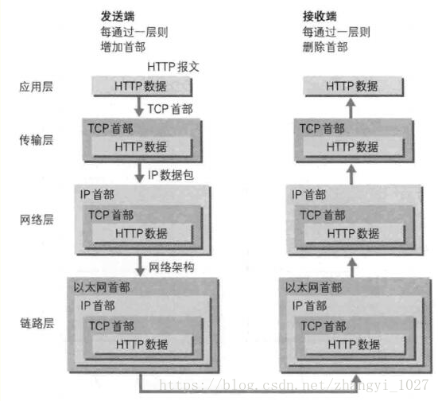

https://blog.csdn.net/taotongning/article/details/81352985
https://blog.csdn.net/beauytlife_1985/article/details/86594496

一、OSI七层

第七层：应用层：协议和应用-http,https,DNS,ftp,tftp,telnet,smtp
第六层：表示层：协议和应用-ebcdic,ascii,jpeg,tiff,midi,mpeg
第五层：会话层:协议和应用-nfs,sql,rpc,x-windows,netbios
第四层：传输层（此层数据单位【数据段】:协议和应用-TCP,UDP,spx
第三层：网络层（此层数据单位【数据包】）协议和应用-IP,ARP,ipx,appletalk,icmp
第二层：数据链路层（此层数据单位【帧】）协议和应用-802.3,802.2,atm,fr，MAC
第一层：物理层（此层数据单位【比特流】）协议和应用-v.35,eia/tia 323

二、各层作用简介

1.物理层

字面意思解释：物理传输、硬件、物理特性。在深圳的你与北京的朋友聊天，你的电脑必须要能上网，物理体现是什么？是不是接一根网线，插个路由器，北京的朋友那边是不是也有根网线，也得插个路由器。也就是说计算机与计算机之间的通信，必须要有底层物理层方面的连通，就类似于你打电话，中间是不是必须得连电话线。

中间的物理链接可以是光缆、电缆、双绞线、无线电波。中间传的是电信号，即010101...这些二进制位

可是底层传输的010010101001...这些二级制位怎么才能让它有意义呢？

要让这些010010101001...有意思，人为的分组再适合不过了，8位一组，发送及接收都按照8位一组来划分。接收到8位为一组的话，那么就可以按照这8位数来做运算。如果没有分组，对方接收的计算机根本就不知道从哪一位开始来做计算，也解析不了收到的数据。我发了16位你就按照16位来做计算吗？我发100位你就按照100位做计算吗？没什么意义是吧。因此要想让底层的电信号有意义，必须要把底层的电信号做分组。我做好8位一组，那么我收到数据，我就知道这几个8位做一组，这几个8位做一组。那么每个8位就可以得到一个确定的数。分组是谁干的活呢？物理层干不了，这个是数据链路层干的

2.数据链路层

早期的时候，数据链路层就是来对电信号来做分组的。以前每个公司都有自己的分组方式，非常的乱，后来形成了统一的标准（标准就是协议），即以太网协议Ethernet

Ethernet规定

   - 一组电信号称之为一个数据包，或者叫做一个“帧”

   - 每一数据帧分成：报头head和数据data两部分

       - head包含：（固定18个字节）

         - 发送者（源地址，6个字节）
         - 接收者（目标地址，6个字节）
         - 数据类型（6个字节）

       - data包含：（最短46字节，最长1500字节）

         - 数据包的具体内容

       - head长度+data长度=最短64字节，最长1518字节，超过最大限制就分片发送。

这就像写信，发送者的地址（源地址）就是你家的地址，接收者地址（目标地址）就是对方的收信地址，你家的路由器就相当于邮局。其实在计算机通信中的源地址和目标地址指的是mac地址

Mac地址的由来：

   head中包含的源和目标地址由来：Ethernet规定接入Internet的设备都必须具备网卡，发送端的和接收端的地址便是指网卡的地址，即Mac地址。
	
   每块网卡出厂时都被烧录上一个实际上唯一的Mac地址，长度为48位2进制，通常由12位16进制数表示，（前六位是厂商编码，后六位是流水线号）
	
   有了mac地址以后，计算机就可以通信了，假设一个教室就是一个局域网（隔离的网络），这个教室里面有几台计算机，计算机的通信和人的通信是一个道理，把教室里面的人都比作一个个计算机，假设教室里面的人都是瞎子，其实计算机就是瞎子的，计算机通信基本靠吼，现在我要找教室里面的飞哥要战狼2的片，然后我就吼一声，说我要找飞哥要战狼2的片，战狼2的片就属于我的数据，但是我在发的时候我是不是要标识我是谁，我要找谁，我是谁就是我的mac地址，我要找谁就是飞哥的mac地址，这两个地址做数据包的头部，再加上数据战狼2的片就构成了一个数据帧。
	
   这个数据包封装好以后就往外发，到物理层以后就全部转成二级制，往外发是怎么发的呢？就是靠吼。即“我是Edison，我找飞哥要战狼2的片”。这么吼了一嗓子以后，全屋子的人都能听到，这就是广播。
	
   计算机底层，只要在一个教室里（一个局域网），都是靠广播的方式，吼。
	
   局域网的理解：什么是互联网，互联网就是由一个个局域网组成，局域网内的计算机不管是对内还是对外都是靠吼，这就是数据链路层的工作方式-----广播。
	
   广播出去以后，所有人都听得见，所有人都会拆开这个包，读发送者是谁，接收者是谁，只要接收者不是自己就丢弃掉。对计算机来说，它会看自己的Mac地址，飞哥收到以后，他就会把片发给我，发送回来同样采用广播的方式了，靠吼。
	
   同一个教室（同一个局域网）的计算机靠吼来通信，那不同教室的计算机又如何？
	
   比如说局域网1的pc1与局域网2的pc10如何通信？你在教室1（局域网1）吼，教室2（局域网2）的人肯定是听不见的。这就是跨网络进行通信，数据链路层就解决不了这个问题了，这就得靠网络层出面了。
	
3.网络层

网络层定义了一个IP协议，

你想，我是这个教室的一个学生，我想找隔壁教室一个叫老王的学生，我也不认识老王，那怎么办，我吼？老王在另外一个教室肯定是听不到的。找教室的负责人，这个教室的负责人就负责和隔壁教室的负责人说话，说我们教室的有个学生要找你们教室的老王。往外传的东西交给负责人就可以了，内部的话上面已经提到，通过广播的方式，对外的东西广播失效。教室的负责人就是网关，网关即网络关口的意思。

Mac地址是用来标识你这个教室的某个位置，IP地址是用来标识你在哪个教室（哪个局域网）。你要跨网络发包你是不是要知道对方的IP地址，比如你要访问百度，你肯定得知道百度服务器的IP地址。计算机在发包前，会判断你在哪个教室，对方在哪个教室，如果在一个教室，基于mac地址的广播发包就OK了；如果不在一个教室，即跨网络发包，那么就会把你的包交给教室负责人（网关）来转发。Mac地址及IP地址唯一标识了你在互联网中的位置。

数据链路层中会把网络层的数据包封装到数据链路层的数据位置，然后再添加上自己的包头，再发给物理层，物理层发给网关，网关再发给对方教室的网关，对方教室的网关收到后在那个教室做广播。

国家IP地址是按照区域划分的，也就是说，网络中的路由器，接收到一个数据包后，可以srcIP中判断出，这个数据包是哪个区域发过来的，是宁波还是杭州还是上海；同时可以从destIP中判断出这个数据包是发送到哪里的，是郑州还是喀什还是珠海；

实际的物理链路传送的是MAC帧数据包，在物理链路中IP地址是不可见的（原因：IP数据包又封装了一层，被封装到MAC帧里），只有到路由节点后，才会将IP帧从MAC帧中解析出来，获取到IP地址，来判断destIP是属于哪个区域的。

最终变成

现在来看另一个问题，在吼之前怎么知道对方的Mac地址？这就得靠ARP协议。

ARP协议的由来：在你找飞哥要片之前，你的先干一件事，想办法知道飞哥的Mac地址。即你的机器必须先发一个ARP包出去，ARP也是靠广播的方式发，ARP发送广播包的方式如下：

局域网中怎么获取对方的Mac地址：

肯定要知道对方的IP地址，这是最基本的，就像你要访问百度，肯定得知道百度的域名，域名就是百度的IP地址。自己的IP可以轻松获得，自己的Mac也轻松获取，目标Mac为12个F，我们叫广播地址，表达的意思是我想要获取这个目标IP地址172.16.10.11的机器的Mac地址。Mac为12个F代表的是一种功能，这个功能就是获取对方的MAC地址，计算机的Mac永远不可能是12个F。假设是在本教室广播，一嗓子吼出去了，所有人开始解包，只有IP地址是172.16.10.11的这个人才会返回他的Mac地址，其他人全部丢弃。发回来源Mac改成飞哥自己的Mac地址，同时把飞哥的Mac地址放在数据部分。

跨网络怎么获取对方的Mac地址：

通过IP地址区分，计算机运算判断出飞哥不在同一个教室，目标IP就变成了网关的IP了。网关的IP在计算机上配死了，可以轻松获取

每台主机都有一个默认网关，当你要向另一台主机发送数据包，首先你肯定得知道对方的IP，拿到IP之后，计算机会判断你的IP和目标IP在不在同一个局域网内，如果在就通过广播的方式拿到对方的MAC地址就可以了，如果不在，你的主机就会先把数据包发送给你的默认网关，然后你的默认网关从MAC帧中解析出IP包，然后判断目标IP和自己的IP属不属于同一个局域网，如果不是他会在将数据包转发给下一个网关，前提是得通过ARP协议获取到下一个网关的MAC地址，然后将数据包重新封装MAC帧（注意这时候MAC帧中包含的MAC地址已经替换为下一个网关的MAC地址了），通过物理链路发送到下一个的网关，以此类推，直到找到目标主机

这样网关就会把它的Mac地址返回给你，然后正常发包

网关帮你去找飞哥，但对用户来说，我们根本就感觉不到网关的存在。

说明，以上步骤认为各个节点都是初次访问，还没有形成路由表，理想的情况是，我们家里的路由器有了这个路由信息后，直接将数据包发给疏勒县的路由网关。

4.传输层

传输层的由来：网络层的ip帮我们区分子网，以太网层的mac帮我们找到主机，然后大家使用的都是应用程序，你的电脑上可能同时开启qq，暴风影音，等多个应用程序，

那么我们通过ip和mac找到了一台特定的主机，如何标识这台主机上的应用程序，答案就是端口，端口即应用程序与网卡关联的编号。

传输层功能：建立端口到端口的通信

补充：端口范围0-65535，0-1023为系统占用端口

5.会话层

会话层管理主机之间的会话进程，负责建立、管理、终止进程之间的会话。会话层还利用在数据中插入校验点来实现数据的同步。

6.表示层

我们通过微信视频聊天，视频传输前先要压缩，到对方那边再解压缩还原，这样传输带宽就小很多，这个压缩和解压缩就处于表示层。腾讯对微信传输的数据也是加密的，即使中间有人捕获了，你没有腾讯的加密和解密的方法，也看不见

7.应用层

应用层由来：用户使用的都是应用程序，均工作于应用层，互联网是开发的，大家都可以开发自己的应用程序，数据多种多样，必须规定好数据的组织形式 。

应用层功能：规定应用程序的数据格式。

例：TCP协议可以为各种各样的程序传递数据，比如Email、WWW、FTP等等。那么，必须有不同协议规定电子邮件、网页、FTP数据的格式，这些应用程序协议就构成了”应用层”。

