https://blog.csdn.net/tylt6688/article/details/122575150(操作系统发展史)
https://xiaolincoding.com/os/4_process/process_base.html
#### 一、你一定需要一个操作系统吗？ ####

- 答案是：不是。操作系统并不是 magic，它也是一个程序，只不过是比较特殊的程序。理论上完全可能不借助于操作系统写程序。操作系统只是给你提供了一套现成的接口，让你可以轻松高效地控制硬件。（当然，操作硬件是非常繁琐的，感谢操作系统，才能让我们能够高效地开发应用程序。）

**1.计算机系统的层次结构**

  - 一台电脑的诞生：

     step1：厂家组装一台裸机

     step2：出售前安装操作系统

     step3：用户安装应用程序（eg：QQ）

     step4：使用QQ聊天

  - 计算机系统层次结构

     用户

     应用程序（软件，如QQ、微信） 

     操作系统（如：Windows 10） 

     裸机（纯硬件：包含CPU、内存、硬盘、主板等）

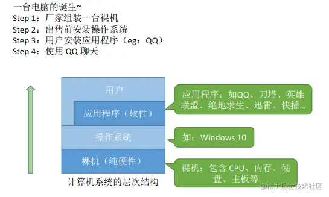

#### 二、为何要有操作系统？ ####

- 电脑是由硬件和软件组成的，缺了任何一样都无法运行。我们对电脑进行操作，都是利用操作系统来完成。最初的电脑没有操作系统，人们通过各种操作按钮来控制计算机，后来出现了汇编语言，并将它的编译器内置到电脑中，操作人员通过有孔的纸带将程序输入电脑进行编译。这些将语言内置的电脑只能由操作人员自己编写程序来运行，不利于设备、程序的共用。为了解决这种问题，就出现了**操作系统，这样就很好实现了程序的共用，以及对计算机硬件资源的管理，使人们可以从更高层次对电脑进行操作，而不用关心其底层的运作。** 操作系统是现代电脑必不可少的系统软件，是电脑的灵魂所在。现代的电脑都是通过操作系统来解释人们的命令，从而达到控制电脑的目的。几乎所有的应用程序也是基于操作系统的

- **操作系统就是为了让我们更好地使用各种硬件资源**

- 操作系统其实就相当于计算机的大管家，它负责管理计算机的各种资源和功能，将这些资源分配给用户，使用户可以更加高效地使用计算机。**操作系统位于计算机硬件和用户之间，使用户能够通过应用程序来访问硬件资源。通过操作系统，用户可以更加方便地使用计算机，无需了解计算机硬件和资源的细节。**

#### 三、什么是操作系统?  ####

- 操作系统是运行在计算机上最重要的一种**软件**，它管理计算机的资源和进程以及所有的硬件和软件。**它为计算机硬件和软件提供了一种中间层**

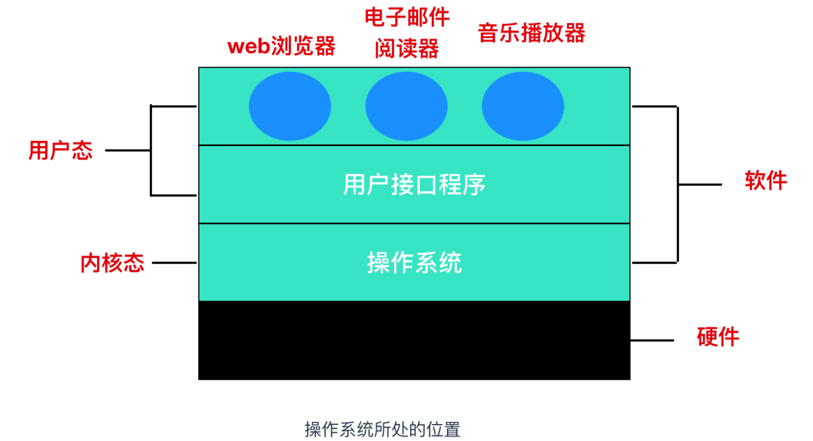

- 上图是一个操作系统的简化图，最下面的是硬件，硬件包括芯片、电路板、磁盘、键盘、显示器等设备，在硬件之上是软件。**大部分计算机有两种运行模式：内核态 和 用户态，软件中最基础的部分是操作系统，它运行在内核态中，内核态也称为 管态 和 核心态，它们都是操作系统的运行状态，只不过是不同的叫法而已。操作系统具有硬件的访问权，可以执行机器能够运行的任何指令。软件的其余部分运行在用户态下。**

- **用户接口程序(shell 或者 GUI)处于用户态中，并且它们位于用户态的最低层，允许用户运行其他程序**，例如 Web 浏览器、电子邮件阅读器、音乐播放器等。而且，越靠近用户态的应用程序越容易编写，如果你不喜欢某个电子邮件阅读器你可以重新写一个或者换一个，但你不能自行写一个操作系统或者是中断处理程序。这个程序由硬件保护，防止外部对其进行修改。

- **操作系统可以看作是对硬件的一种抽象，不同的操作系统对硬件有不同的抽象接口，应用程序通过调用这些接口来完成对硬件的操控，从而避免了直接和硬件进行接触。**

- 以 word 程序为例，我们来看看一个 word 程序牵涉到了哪些和硬件的交互。

 （1）将 word 程序加载到 RAM（也是一种硬件）。

 （2）把输入的文件显示在屏幕上。

 （3）点击保存的时候，保存到磁盘上。

 （4）需要打印的时候，直接打印机打印出来。

- 试想一下，如果没有操作系统，你得手动控制硬件，那会有多困难！你写程序的时候，这些功能基本都可以通过很简单的 API 调用实现。比如你要显示一个字符到屏幕上，只要调用 printf 方法就行了。

- 再比如说存储一个文件，如果要你自己实现的话，你得考虑具体把数据存在哪个物理位置，该如何保存，为了保存文件得分配多少内存......有了操作系统，这些过程就只是一个简单的system call 调用了。

#### 四、操作系统的主要目的 ####

1.管理计算机资源，这些资源包括CPU、内存、磁盘驱动器、打印机等

2.提供一种图形界面，就像我们前面描述的那样，它提供了用户和计算机之间的桥梁

3.为其他软件提供服务，操作系统与软件进行交互，以便为其分配运行所需的任何必要资源。

#### 五、常用的操作系统 ####

- Windows：Windows是微软公司开发的操作系统，是目前最流行的桌面操作系统之一。它具有友好的用户界面、丰富的应用程序和易于使用的系统工具。

- macOS：macOS是苹果公司开发的操作系统，它具有优秀的性能和稳定的系统稳定性。它适用于设计和创意工作负载以及日常办公和Web浏览等任务。

- Linux：Linux是一种开源的操作系统，它具有强大的网络功能和良好的安全性。它适用于服务器和嵌入式设备等领域。

- Android：Android是一种开源的移动设备操作系统，它具有优秀的性能和稳定性，丰富的应用程序和游戏。它适用于智能手机和平板电脑等设备。

- iOS：iOS是苹果公司开发的移动设备操作系统，它具有优秀的性能和稳定性，以及优秀的隐私保护功能。它适用于iPhone和iPad等设备。

#### 六、不同操作系统API差异性 ####

- 同样机型的计算机，可安装的操作系统类型也会有多种选择。例如：AT 兼容机除了可以安装 Windows 之外，还可以采用 Unix 系列的 Linux 以及 FreeBSD （也是一种Unix操作系统）等多个操作系统。当然，**应用软件则必须根据不同的操作系统类型来专门开发。CPU 的类型不同，所对应机器的语言也不同,同样的道理，操作系统的类型不同，应用程序向操作系统传递指令的途径也不同。**

- **应用程序向系统传递指令的途径称为 API(Application Programming Interface)。Windows 以及 Linux 操作系统的 API，提供了任何应用程序都可以利用的函数组合。因为不同操作系统的 API 是有差异的。所以，如何要将同样的应用程序移植到另外的操作系统，就必须要覆盖应用所用到的 API 部分。**

- 键盘输入、鼠标输入、显示器输出、文件输入和输出等同外围设备进行交互的功能，都是通过 API 提供的。

- **这也就是为什么 Windows 应用程序不能直接移植到 Linux 操作系统上的原因，API 差异太大了。**

- **在同类型的操作系统下，不论硬件如何，API 几乎相同。但是，由于不同种类 CPU 的机器语言不同，因此本地代码也不尽相同。**

#### 七、操作系统的功能和目标 ####

**1.作为计算机系统资源的管理者（功能）**

  功能：

- 处理机管理（进程管理）

   - 存储器管理（内存）

   - 文件管理（文件系统）

   - 设备管理（I/O）

   - 处理机管理（进程）   

（1）**处理器管理（进程管理）**

  - 在多道程序环境下，处理机的分配和运行都以进程（或线程）为基本单位，因而**对处理机的管理可归纳为进程的管理**。并发是指在计算机内同时运行多个进程，因此进程何时创建、何时撤销、如何避免冲突、合理共享就是进程管理的最主要的任务。**进程管理的主要功能包括进程控制、进程同步、进程通信、死锁通信、处理机调度等。**

  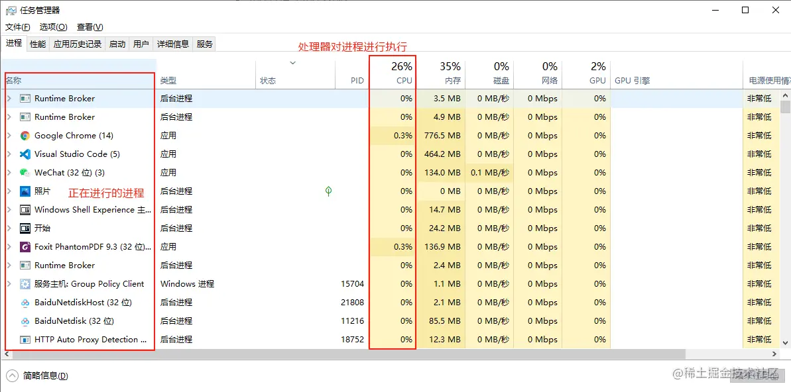

（2）**存储器管理**

  - 为多道程序的运行提供良好的环境，方便用户使用及提高内存的利用率，**主要包括内存的分配与回收、地址映射、内存保护与共享和内存扩充等功能。**

  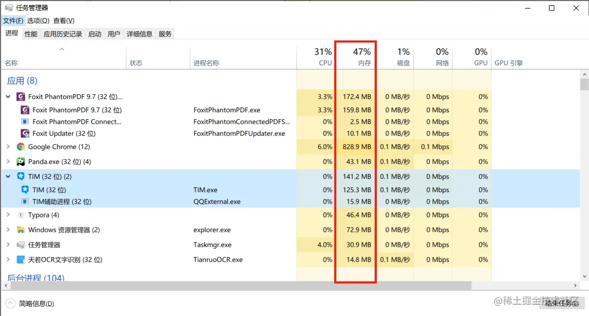

（3）**文件管理**

  - 计算机中所有的信息都是以文件的形式存在的，操作系统中负责文件管理的部分称为文件系统，**文件管理包括文件存储空间的管理、目录管理及文件读写管理和保护等。**

  

（4）**设备管理**

  - 设备管理的主要任务是完成用户的I/O请求，方便用户使用各种设备，并提高设备的利用率，**主要包括缓存管理、设备分配、设备处理和虚拟设备等功能。**

  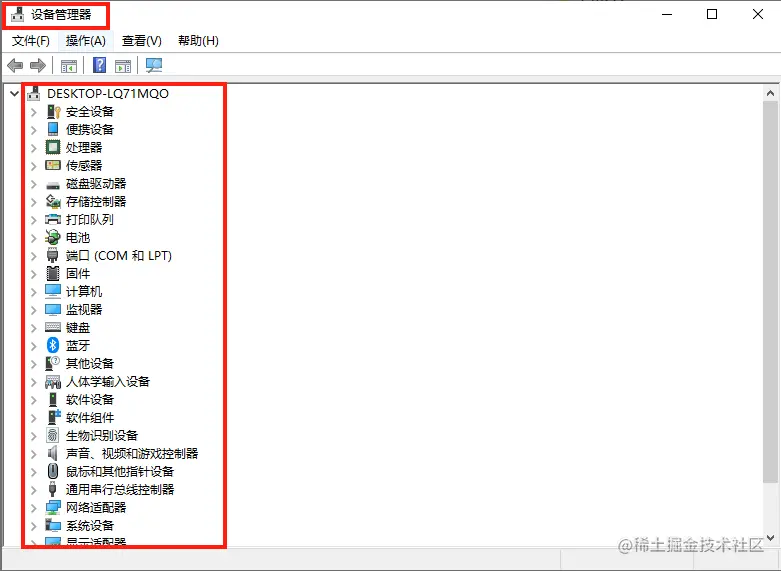

  目标：安全、高效

**2.作为用户和计算机硬件系统之间的接口**

  功能：

  - 为了让用户方便、快捷、可靠的操作计算机硬件并执行自己的程序，操作系统提供了用户接口（命令接口和程序接口统称为用户接口）

  - 操作系统提供的接口分为两类：**命令接口和程序接口**

 （1）**命令接口**

   - 用户可以直接使用的，利用这些操作命令来组织和控制作业的执行

   - **联机命令接口**： 又称交互式命令接口，适用于分时或实时系统的接口，由一组键盘操作命令组成。**用户输入一条指令，操作系统就执行一条指令。**

  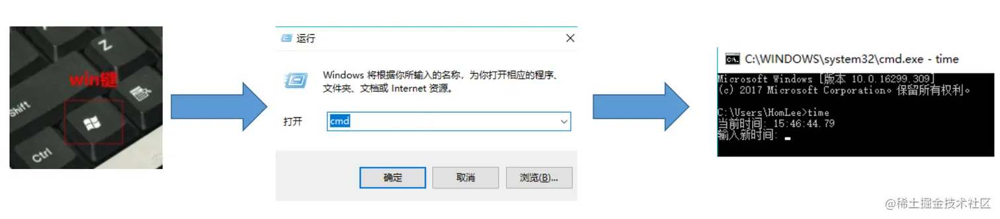

   - **脱机命令接口**： 又称批处理命令接口，使用于批处理系统，由一组作业控制命令组成。**用户输入一堆指令，操作系统运行一堆指令。在操作系统运行这些命令时用户不可干预。**

  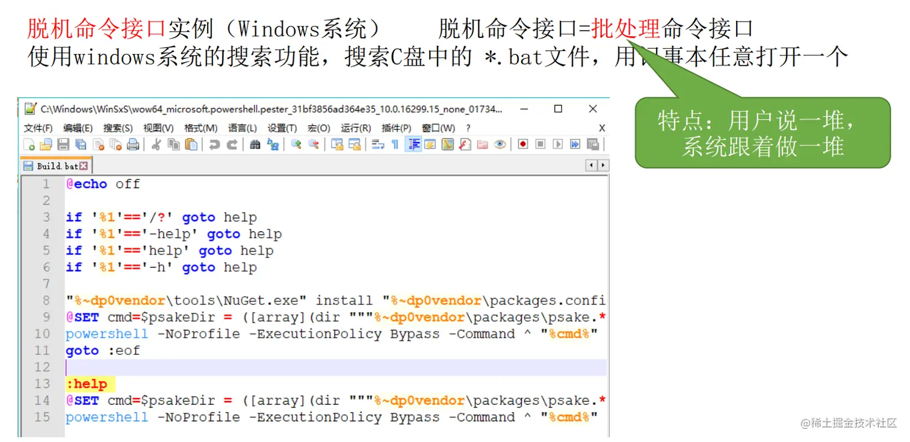

（2）**程序接口**

   - 用户通过程序间接使用的，编程人员可以使用它们来请求操作系统服务

   - 由一组系统调用（也称广义指令）组成，用户通过在程序中使用这些系统调用请求操作系统为其提供服务，只能通过用户程序间接调用，如使用各种外部设备、申请分配和回收内存及其他各种要求

  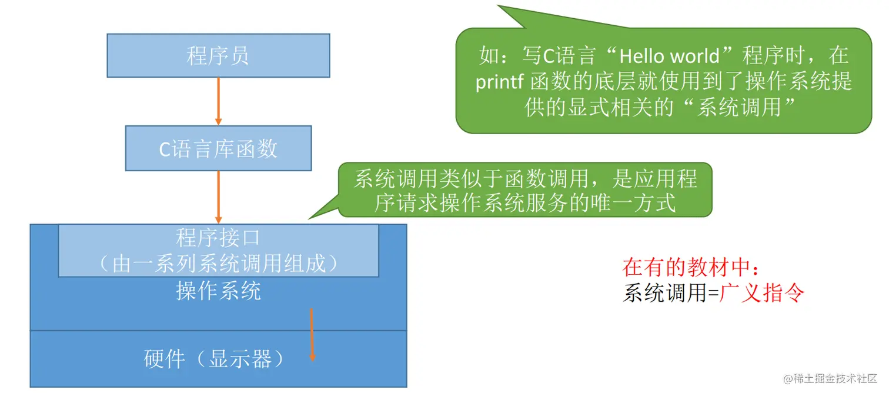

 目标：方便用户使用

#### 八、计算机硬件系统 ####

**1.组成**

  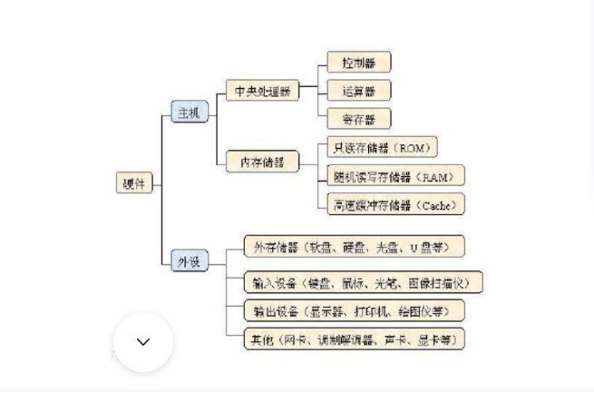

  - 硬件：

     - 主机：
     
        - 中央处理器：控制器、运算器、寄存器
        
        - 内存储器：只读存储器（ROM）、随机读写存储器（RAM）、高速缓冲存储器（Cache）

     - 外设：

        - 外存储器（如：软盘、硬盘、光盘、U盘等）

        - 输入设备（如：键盘、鼠标、光笔、图像扫描仪）

        - 输出设备（如：显示器、打印机、绘图仪等）

        - 其他（网卡、调制解调器、声卡、显卡等）

#### 九、操作系统的特征 ####

**1.并发**

  - **并发：两个或多个事件在同一时间间隔内发生。这些事件宏观上是同时发生的，但微观上是交替发生【CPU时间分片】的。**

  - **并行（两个或多个事件在同一时刻同时发生）**

  

  - 举例：

      - 并行约会（小渣：和一号、二号一起约会）：同一时刻同时进行两个约会任务
      
      - 并发约会（老渣：8-9点：一号，9-10点：二号）：宏观上看，这一天老渣在同时进行两个约会任务。微观上看，在某一个时刻，老渣最多正在进行一个约会任务。

  - **操作系统的并发性指计算机系统中同时存在着多个运行着的程序：一个单核处理机（CPU）同一时刻只能执行一个程序，因此操作系统会负责协调多个程序交替执行（这些程序微观上是交替执行的，但宏观上看起来就像在同时执行，比如我电脑可以同时打开QQ或微信处理事情）。**

  - **事实上，操作系统就是伴随着多道程序技术出现的，因此，操作系统和程序并发是一起诞生的。**

  - **当今的计算机，一般都是多核CPU，比如Intel的第八代i3处理器就是4核CPU这意味着同一时刻可以有4个程序并行执行，但是操作系统的并发性依然必不可少，比如我们使用计算机有时候要开4个以上的程序需要同时工作。**

**2.共享**

  - 即资源共享，是指系统中的资源可供内存中多个并发执行的进程共同使用

  - 两种资源共享方式：

    - **互斥共享方式（一个时间段内只允许一个进程访问该资源）**

    - **同时共享方式（允许一个时间段内由多个进程"同时"对该资源进行访问，宏观上的同时，而在微观上，这些进程可能是交替的对该资源进行访问的【分时共享CPU等资源】）**

   - 生活实例：

      - 互斥共享方式:使用QQ和微信视频。同一时间段内摄像头只能分配给其中一个进程。

      - 同时共享方式:使用QQ发送文件A，同时使用微信发送文件B。宏观上看，两边都在同时读取并发送文件，说明两个进程都在访问硬盘资源，从中读取数据。微观上看，两个进程是交替着访问硬盘的。 

   - 并发和共享是两个最基本的特征，二者互为存在条件。

     - **并发和共享的关系：如果失去并发性，则系统中只能有一个应用程序正在运行，则共享性失去存在的意义；如果失去共享性，则QQ和微信不能同时访问硬盘资源，就无法实现同时发送文件，也就无法并发。**

**3.虚拟**

- 所谓虚拟（Virtual）是指通过某种技术把一个物理实体变成为若干个逻辑上的对应物。

- 物理实体是实际存在的东西，逻辑实体是虚的，它并不存在，但是用户却感觉它存在。

- 用于实现虚拟的技术称为虚拟技术，**在操作系统中利用了两种方式实现虚拟技术：时分复用技术和空分复用技术**

- **多道程序设计**：是指在计算机内存中同时存放几道相互独立的程序，使它们在管理程序控制之下，相互穿插的运行。 两个或两个以上程序在计算机系统中同处于开始到结束之间的状态。这就称为多道程序设计。

- 多道程序技术运行的特征：多道、宏观上并行、微观上串行。

- 时分复用技术：处理器的分时共享

   - 虚拟处理器（CPU）：通过多道程序设计技术，采用让多道程序并发执行的方法，分时来使用一个CPU，实际物理上只有一个CPU，但是用户感觉到有多个CPU

  

   - 举例：某单核CPU的计算机中，用户打开了6个软件，一个程序需要被分配CPU才能正常执行，那么为什么单核CPU的电脑中能同时运行这么多个程序呢？

   - 答：这是虚拟处理器技术，实际上只有一个单核CPU，在用户看来似乎有6个CPU在同时为自己服务。

- 空分复用技术：虚拟存储器

   - 举例:	GTA5需要4GB的运行内存，QQ需要256MB的内存，迅雷需要256MB的内存，网易云音乐需要256MB的内存......
   
   - 我的电脑：4GB内存
    
   - 问题：这些程序同时运行需要的内存远大于4GB，那么为什么它们还可以在我的电脑上同时运行呢？（**一个程序需要放入内存并给它分配CPU才能执行**）

   - 答：这是虚拟存储器技术，实际只有4GB的内存，在用户看来似乎远远大于4GB

**4.异步**

   - 在多道程序环境下，允许多个程序并发执行，但由于资源有限，进程的执行不是一贯到底的，而是走走停停【比如执行进程A到一半，突然时间片到了就去执行下一个进程B[让出CPU--单核处理器]，然后这个进程执行到一半，然后又回到原来进程A的未执行位置继续执行】，以不可预知的速度向前推进，这就是进程的异步性。

   - 显然，如果失去了并发性，则系统只能串行地处理各个程序，每个进程的执行会一贯到底【即执行完一个程序以后才会执行下一个】。只有系统拥有并发性，才有可能导致异步性。

#### 十、操作系统的结构 ####

 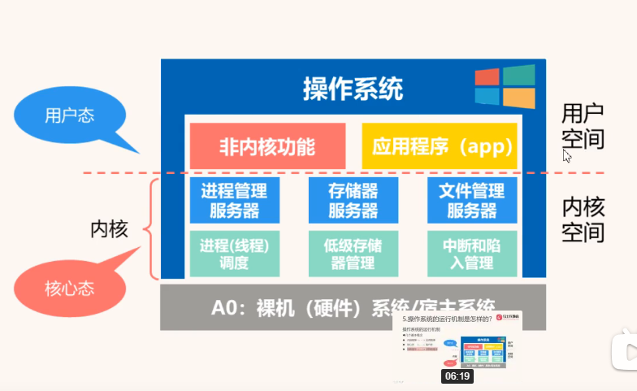

**1.几个概念**

- CPU的运行模式分为：用户态（CPU运行用户空间的程序）和核心态（CPU运行内核空间的程序）

- 那CPU怎么知道自己运行的是用户空间的程序还是内核空间的程序呢？

  - 程序状态字的值为1表示用户空间，值为0表示内核空间

- 特权指令：当CPU执行核心空间的 程序时，我们称它执行的时特权指令

- 非特权指令：当CPU执行用户空间的程序时，我们称它执行的时非特权指令

**2.传统的操作系统结构（大内核）**  

**3.微内核结构**

 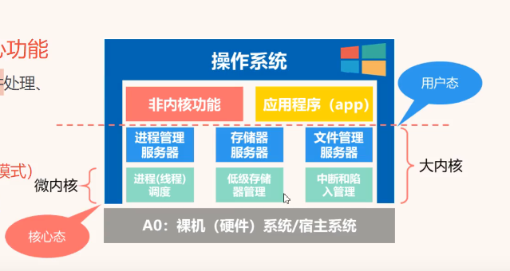

 - 足够小的内核，只实现OS核心功能

 - 客户和服务器之间通信（客户/服务器模式）：微内核是服务器，微内核上层是客户

 - 优点：

   （1）提高OS的可扩展性、可靠性、可移植性

   （2）对分布式系统支持更好

   （3）融入了面向对象技术

 - 缺点：

    - 相较早期OS，降低了一定的效率（用户态和核心态切换次数增加了）

#### 十一、操作系统的运行机制 ####

- 时钟管理
- 中断机制
- 原语
- 系统数据结构
- 系统调用

**1.时钟管理**

  - 计时：提供系统时间
  - 时钟中断：比如系统切换

**2.中断机制**

  - 所有的中断都有对应的中断处理程序

（1）目的：提高多道程序环境下CPU利用率。

-  理解：比如一个应用程序要执行的时候，突然间遇到了IO，需要IO设备操作，IO设备操作又比较低效，这个时候应用程序只能等待。那我们进行一个中断，让应用程序不要等了，直接切换到另一个应用程序上，等第一个设备的IO操作完成之后再回来继续执行就好了。这样就提升了CPU的利用率。

（2）分类： 

 - 外中断：中断信号来源于->外部设备（外部设备告诉程序需要中断，其实是被迫中断）

 - 内中断：中断信号来源于->当前指令

   - **陷阱/陷入（Trap）**:由应用程序主动引发
   
     
   
   - CPU执行到指令三的时候，发现需要调用系统服务：读文件，CPU就立刻从当前程序中断，**中断之后，CPU会产生一个陷入指令，去执行这个陷入指令，CPU从用户态切换到内核态去做读文件的一系列操作(特权指令)**。
   
   - **注意陷入指令是由CPU产生的，并不是由应用程序产生的，是由应用程序引发的 **
   
   - **故障（fault）**：由错误条件引发
   
     - 比如我们运行一个游戏程序，内存很大，程序不是一次性加载进来的，需要的时候发生内存缺页故障（**故障中断**），需要去磁盘加载需要的程序。
   
   - **终止（about）**:由致命错误引发（比如:非法访问）
   
     

 （3）中断处理过程（9步）

   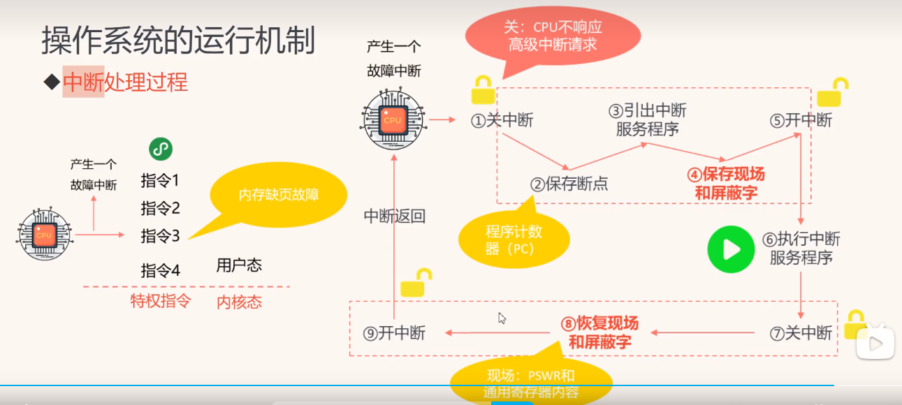

   - 关中断：CPU不再响应高级中断请求
   
   - 保存断点：保存程序计数器，程序执行到的地方

   - 引出中断服务程序：读取中断服务程序的内存地址

   - 保存现场和屏蔽字：指令，数据等保存好快照

   - 开中断：可以响应其他的中断了

   - 执行中断服务程序：执行中断服务程序的过程中，CPU是可以并发的响应其他的中断的

   - 关中断：CPU不再响应高级中断请求

   - 恢复现场和屏蔽字：把原来从寄存器中拿走的数据快照还给寄存器

   - 开中断：可以响应其他的中断了

   - 中断返回

**3.原语**

  - 是一个程序段，运行在内核空间，执行过程中不会被中断，运行时间短
  
  - 由若干条指令组成
  
  - 用来完成某个特定功能（可能是进程调度的一部分，可能是文件读取的一部分）：相当于把某个通用功能封装成一个通用模块
  
  - 执行过程中不会被中断（具有'原子性'）

  - 原语的底层实现其实就是靠开中断和关中断实现的。

**4.系统数据结构**

  - 进程管理：作业控制块、进程控制块
  - 存储器管理：存储器分配与回收
  - 设备管理：缓冲区、设备控制块

- 一般只涉及到对数据结构的操作，不涉及硬件

**5.系统调用**

  - 系统调用指的是应用程序去访问操作系统内核的时候，去调用系统内核的过程

  - 系统调用通过陷入指令（内中断），调用操作系统提供的一整套接口去访问操作系统内核的服务，所以系统调用的处理运行在核心态。（用户态->内核态）

#### 十一、进程 ####

**1.什么是进程？**

- 进程（Process），是一个具有一定独立功能的程序关于某个数据集合的一次运行活动，是系统进行资源分配和调度的一个独立单位。

- **几个要点：**

   （1）**进程是程序的一次执行，同一个程序执行两次就是两个进程，进程想要执行必须加载到内存中**

   （2）**进程是一个程序及其数据在处理机上顺序执行时所发生的活动**

   （3）**进程是程序在一个数据集合上运行的过程**

   （4）**进程是操作系统进行资源分配和调度的一个独立单位（或者说基本单位）**

**2.进程的结构**

 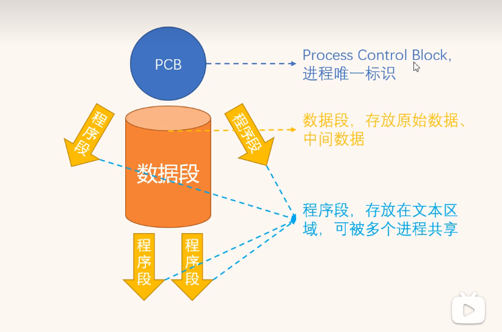

（1）**控制块（PCB）**

  - 在操作系统中，是**用进程控制块（process control block，PCB）数据结构来描述进程的。**

  - **PCB 是进程存在的唯一标识**，这意味着一个进程的存在，必然会有一个 PCB，如果进程消失了，那么 PCB 也会随之消失。

  - **PCB 具体包含什么信息呢？**

   <1>**进程描述信息：**

        - 进程标识符：标识各个进程，每个进程都有一个并且唯一的标识符；
    
        - 用户标识符：进程归属的用户，用户标识符主要为共享和保护服务；

   <2>**进程控制和管理信息：**

        - 进程当前状态，如 new、ready、running、waiting 或 blocked 等；
    
        - 进程优先级：进程抢占 CPU 时的优先级；

   <3>**资源分配清单：**

        - 有关内存地址空间或虚拟地址空间的信息，所打开文件的列表和所使用的 I/O 设备信息。

   <4>**CPU 相关信息：**

        - CPU 中各个寄存器的值，当进程被切换时，CPU 的状态信息都会被保存在相应的 PCB 中，以便进程重新执行时，能从断点处继续执行。

  - **每个 PCB 是如何组织的呢？**

     - **通常是通过链表的方式进行组织，把具有相同状态的进程链在一起，组成各种队列**。比如：

       - 将所有处于就绪状态的进程链在一起，称为就绪队列；

       - 把所有因等待某事件而处于等待状态的进程链在一起就组成各种阻塞队列；

       - 另外，对于运行队列在单核 CPU 系统中则只有一个运行指针了，因为单核 CPU 在某个时间，只能运行一个程序。

   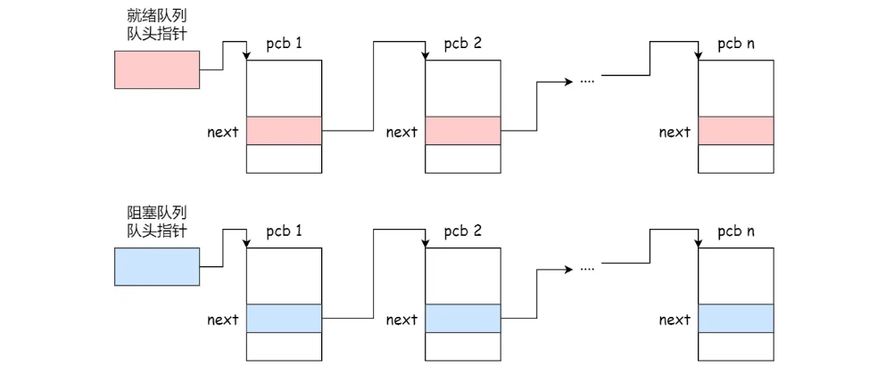

      - **除了链接的组织方式，还有索引方式**，它的工作原理：将同一状态的进程组织在一个索引表中，索引表项指向相应的 PCB，不同状态对应不同的索引表。
    
      - 一般会选择链表，因为可能面临进程创建，销毁等调度导致进程状态发生变化，所以链表能够更加灵活的插入和删除。

（2）**数据段**

  - 存放原始数据、中间数据

（3）**程序段** 

  - 存放在文本区域，可被多个进程共享

  - **同一个应用程序的多个进程之间只是数据段不相同，程序段是可以共用的**

**3.进程的特征**

（1）动态性：由创建而生，由撤销而亡

（2）并发性：多个进程同时运行

（3）独立性：独立资源分配

（4）异步性：相互独立、互不干扰

**4.并行和并发有什么区别？**

  - **并发就是在一段时间内，多个任务都会被处理；但在某一时刻，只有一个任务在执行。**单核处理器做到的并发，其实是利用时间片的轮转，例如有两个进程A和B，A运行一个时间片之后，切换到B，B运行一个时间片之后又切换到A。因为切换速度足够快，所以宏观上表现为在一段时间内能同时运行多个程序。

  - **并行就是在同一时刻，有多个任务在执行。这个需要多核处理器才能完成，在微观上就能同时执行多条指令，不同的程序被放到不同的处理器上运行，这个是物理上的多个进程同时进行。**

 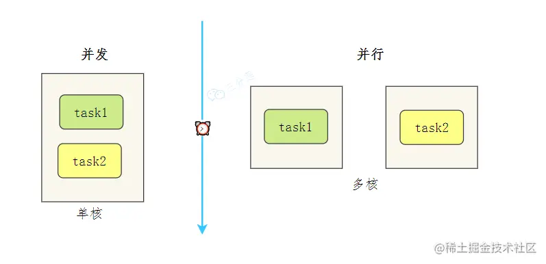

**5.进程有哪些状态？**

（1）创建状态（new）：进程正在被创建时的状态；

（2）运⾏状态（Runing）：该时刻进程占⽤ CPU；

（3）就绪状态（Ready）：可运⾏而未运行 ，由于其他进程处于运⾏状态⽽暂时停⽌运⾏；

（4）阻塞状态（Blocked）：该进程正在等待某⼀事件发⽣（如等待输⼊/输出操作的完成）⽽暂时停⽌运⾏，这时，即使给它CPU控制权，它也⽆法运⾏；

（5）结束状态（Exit）：进程正在从系统中消失时的状态；

 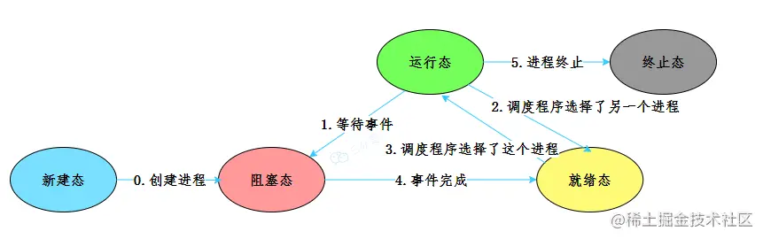

 - 再来详细说明一下**进程的状态变迁**：

（1）**NULL -> 创建状态**：一个新进程被创建时的第一个状态；

（2）**创建状态 -> 就绪状态**：当进程被创建完成并初始化后，一切就绪准备运行时，变为就绪状态，这个过程是很快的；

（3）**就绪态 -> 运行状态**：处于就绪状态的进程被操作系统的进程调度器选中后，就分配给 CPU 正式运行该进程；

（4）**运行状态 -> 结束状态**：当进程已经运行完成或出错时，会被操作系统作结束状态处理；

（5）**运行状态 -> 就绪状态**：处于运行状态的进程在运行过程中，由于分配给它的运行时间片用完，操作系统会把该进程变为就绪态，接着从就绪态选中另外一个进程运行；

（6）**运行状态 -> 阻塞状态**：当进程请求某个事件且必须等待时，例如请求 I/O 事件；

（7）**阻塞状态 -> 就绪状态**：当进程要等待的事件完成时，它从阻塞状态变到就绪状态；

- 如果有大量处于阻塞状态的进程，进程可能会占用着物理内存空间，显然不是我们所希望的，毕竟物理内存空间是有限的，被阻塞状态的进程占用着物理内存就一种浪费物理内存的行为。

- 所以，**在虚拟内存管理的操作系统中，通常会把阻塞状态的进程的物理内存空间换出到硬盘，等需要再次运行的时候，再从硬盘换入到物理内存。**

 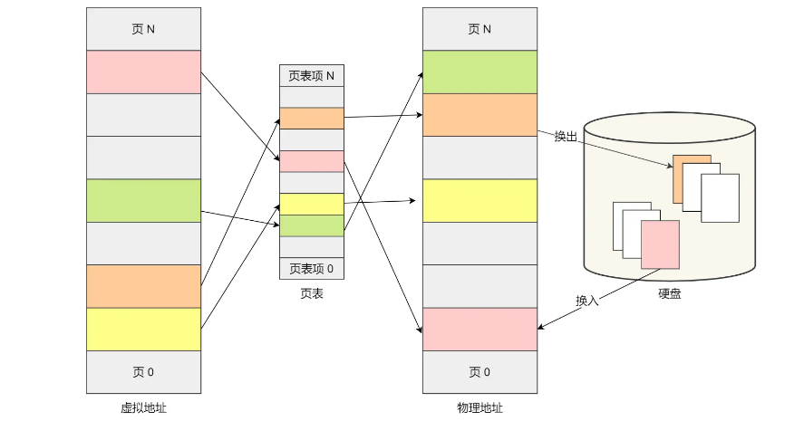

- 那么，就需要一个新的状态，来**描述进程没有占用实际的物理内存空间的情况，这个状态就是挂起状态。**这跟阻塞状态是不一样，阻塞状态是等待某个事件的返回。

- 另外，挂起状态可以分为两种：

  - **阻塞挂起状态**：进程在外存（硬盘）并等待某个事件的出现；

  - **就绪挂起状态**：进程在外存（硬盘），但只要进入内存，即刻立刻运行；

- 这两种挂起状态加上前面的五种状态，就变成了七种状态变迁，见如下图：

 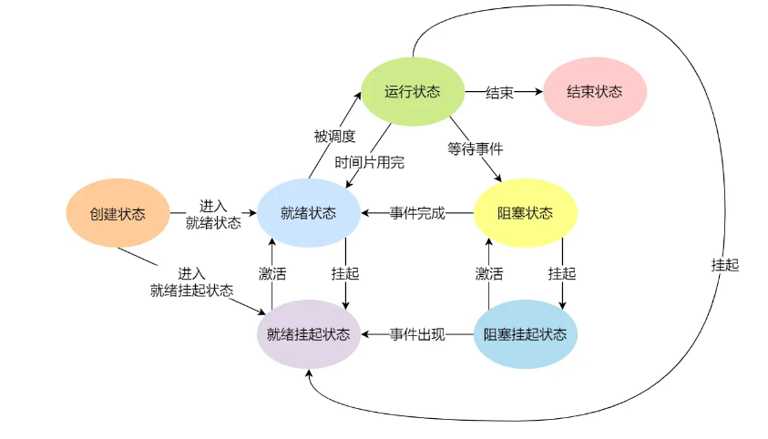

- 导致进程挂起的原因不只是因为进程所使用的内存空间不在物理内存，还包括如下情况：

   - 通过 sleep 让进程间歇性挂起，其工作原理是设置一个定时器，到期后唤醒进程。

   - 用户希望挂起一个程序的执行，比如在 Linux 中用 Ctrl+Z 挂起进程

**6.进程的控制**

  - 我们熟知了进程的状态变迁和进程的数据结构 PCB 后，再来看看进程的创建、终止、阻塞、唤醒的过程，这些过程也就是进程的控制。操作系统通过原语操作实现进程控制。

 （1）**创建进程**

   - 操作系统允许一个进程创建另一个进程，而且允许子进程继承父进程所拥有的资源。

   - 创建进程的过程如下：

     - 申请一个空白的 PCB，并向 PCB 中填写一些控制和管理进程的信息，比如进程的唯一标识等；

     - 为该进程分配运行时所必需的资源，比如内存资源；

     - 将 PCB 插入到就绪队列，等待被调度运行；

 （2）**终止进程**

   - 进程可以有 3 种终止方式：正常结束、异常结束以及外界干预（信号 kill 掉）。

   - 当子进程被终止时，其在父进程处继承的资源应当还给父进程。而当父进程被终止时，该父进程的子进程就变为孤儿进程，会被 1 号进程收养，并由 1 号进程对它们完成状态收集工作。

   - **终止进程的过程如下**：

     - 查找需要终止的进程的 PCB；

     - 如果处于执行状态，则立即终止该进程的执行，然后将 CPU 资源分配给其他进程；

     - 如果其还有子进程，则应将该进程的子进程交给 1 号进程接管；

     - 将该进程所拥有的全部资源都归还给操作系统；

     - 将其从 PCB 所在队列中删除；

 （3）**阻塞进程** 

   - 当进程需要等待某一事件完成时，它可以调用阻塞语句把自己阻塞等待。而一旦被阻塞等待，它只能由另一个进程唤醒。

   - 阻塞进程的过程如下：

      - 找到将要被阻塞进程标识号对应的 PCB；

      - 如果该进程为运行状态，则保护其现场，将其状态转为阻塞状态，停止运行；

      - 将该 PCB 插入到阻塞队列中去；

 （4）**唤醒进程** 

   - 进程由「运行」转变为「阻塞」状态是由于进程必须等待某一事件的完成，所以处于阻塞状态的进程是绝对不可能叫醒自己的。

   - 如果某进程正在等待 I/O 事件，需由别的进程发消息给它，则只有当该进程所期待的事件出现时，才由发现者进程用唤醒语句叫醒它。

   - 唤醒进程的过程如下：

     - 在该事件的阻塞队列中找到相应进程的 PCB；

     - 将其从阻塞队列中移出，并置其状态为就绪状态；

     - 把该 PCB 插入到就绪队列中，等待调度程序调度；

   - 进程的阻塞和唤醒是一对功能相反的语句，如果某个进程调用了阻塞语句，则必有一个与之对应的唤醒语句。

**7.进程的上下文切换**

 （1）**简述**

   - 各个进程之间是共享 CPU 资源的，在不同的时候进程之间需要切换，让不同的进程可以在 CPU 执行，那么这个**一个进程切换到另一个进程运行，称为进程的上下文切换。**

  - 对于单核单线程 CPU 而言，在某一时刻只能执行一条 CPU 指令。**上下文切换 (Context Switch) 是一种将 CPU 资源从一个进程分配给另一个进程的机制**。从用户角度看，计算机能够并行运行多个进程，这恰恰是操作系统通过快速上下文切换造成的结果。在切换的过程中，操作系统需要先存储当前进程的状态 (包括内存空间的指针，当前执行完的指令等等)，再读入下一个进程的状态，然后执行此进程。

 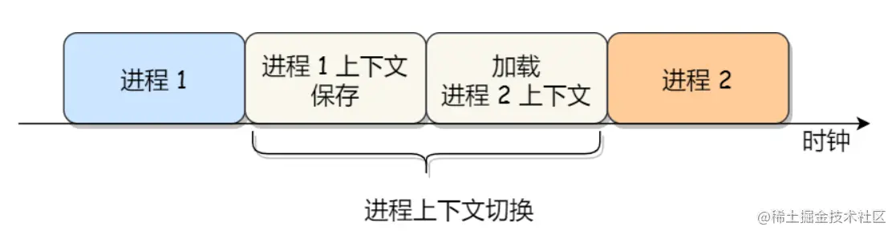

 （2）**CPU 上下文切换**

   - 大多数操作系统都是多任务，通常支持大于 CPU 数量的任务同时运行。实际上，这些任务并不是同时运行的，只是因为系统在很短的时间内，让各个任务分别在 CPU 运行，于是就造成同时运行的错觉。

   - **任务是交给 CPU 运行的，那么在每个任务运行前，CPU 需要知道任务从哪里加载，又从哪里开始运行。**

   - 所以，**操作系统需要事先帮 CPU 设置好 CPU 寄存器和程序计数器。**

   - **CPU 寄存器是 CPU 内部一个容量小，但是速度极快的内存（缓存）**。我举个例子，寄存器像是你的口袋，内存像你的书包，硬盘则是你家里的柜子，如果你的东西存放到口袋，那肯定是比你从书包或家里柜子取出来要快的多。

   - 再来，**程序计数器则是用来存储 CPU 正在执行的指令位置、或者即将执行的下一条指令位置。**

   - 所以说，CPU 寄存器和程序计数是 CPU 在运行任何任务前，所必须依赖的环境，这些环境就叫做** CPU 上下文。**

   - **CPU 上下文切换就是先把前一个任务的 CPU 上下文（CPU寄存器和程序计数器）保存起来，然后加载新任务的上下文到这些寄存器和程序计数器，最后再跳转到程序计数器所指的新位置，运行新任务。**

   - **系统内核会存储保持下来的上下文信息，当此任务再次被分配给 CPU 运行时，CPU 会重新加载这些上下文，这样就能保证任务原来的状态不受影响，让任务看起来还是连续运行。**

   - **上面说到所谓的「任务」，主要包含进程、线程和中断。所以，可以根据任务的不同，把 CPU 上下文切换分成：进程上下文切换、线程上下文切换和中断上下文切换。**

 （3）**进程的上下文切换**

   - **进程是由内核管理和调度的，所以进程的切换只能发生在内核态。**

   - 所以，**进程的上下文切换不仅包含了虚拟内存、栈、全局变量等用户空间的资源，还包括了内核堆栈、寄存器等内核空间的资源。**

   - 通常，**会把交换的信息保存在进程的 PCB，当要运行另外一个进程的时候，我们需要从这个进程的 PCB 取出上下文，然后恢复到 CPU 中，这使得这个进程可以继续执行**，如下图所示：

   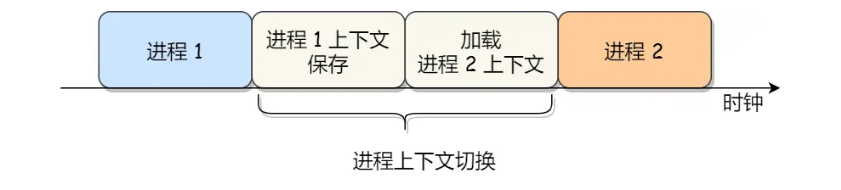

 （4）**发生进程上下文切换有哪些场景？**

   - 为了保证所有进程可以得到公平调度，CPU 时间被划分为一段段的时间片，这些时间片再被轮流分配给各个进程。这样，当某个进程的时间片耗尽了，进程就从运行状态变为就绪状态，系统从就绪队列选择另外一个进程运行；

   - 进程在系统资源不足（比如内存不足）时，要等到资源满足后才可以运行，这个时候进程也会被挂起，并由系统调度其他进程运行；

   - 当进程通过睡眠函数 sleep 这样的方法将自己主动挂起时，自然也会重新调度；

   - 当有优先级更高的进程运行时，为了保证高优先级进程的运行，当前进程会被挂起，由高优先级进程来运行；

   - 发生硬件中断时，CPU 上的进程会被中断挂起，转而执行内核中的中断服务程序；

**8.什么是僵尸进程？**

  - **僵尸进程是已完成且处于终止状态，但在进程表中却仍然存在的进程。**

  - 僵尸进程一般发生有父子关系的进程中，一个子进程的进程描述符在子进程退出时不会释放，只有当父进程通过 wait() 或 waitpid() 获取了子进程信息后才会释放。如果子进程退出，而父进程并没有调用 wait() 或 waitpid()，那么子进程的进程描述符仍然保存在系统中。

**9.什么是孤儿进程？**

  - **一个父进程退出，而它的一个或多个子进程还在运行，那么这些子进程将成为孤儿进程。**孤儿进程将被 init 进程 (进程 ID 为 1 的进程) 所收养，并由 init 进程对它们完成状态收集工作。因为孤儿进程会被 init 进程收养，所以孤儿进程不会对系统造成危害。

**10.进程的调度**

  - **进程的调度是由操作系统完成的，其目的是为了在一个进程占用CPU执行自己的操作后，选择下一个进程来占用CPU。**
  
  - 调度发生的原因很简单，每个进程都希望能够占用CPU进行工作。因此，调度程序会进行上下文切换，并选择一个进程来执行其功能。**提高资源利用率，减少处理机空闲时间**

  - **所谓进程调度，就是从进程的就绪队列（阻塞）中按照一定的算法选择一个进程并将 CPU 分配给它运行**，以实现进程的并发执行。

**11.何时调度**

  - 进程的调度可以理解为在进程的状态发生变化时进行：

     - 就绪态 -> 运行态：当一个进程被创建后，它进入就绪队列中等待执行。当操作系统从就绪队列中选择一个进程时，它进入运行态并开始执行。

     - 运行态 -> 阻塞态：当一个进程执行I/O操作时，它可能会进入阻塞态，等待I/O操作完成。此时，操作系统会将当前进程放入阻塞队列，并切换到其他可运行的进程继续执行。

     - 运行态 -> 结束态：当一个进程完成其任务或遇到终止指令时，它会进入结束态。操作系统会从就绪队列中选择下一个进程进行执行。

  - 因为**进程的状态发生变化时，操作系统需要考虑是否切换进程来占用CPU执行业务。因此，只要进程状态发生变化，就会触发进程调度**。

**12.进程的调度算法？**

  - 进程调度策略有很多，根据**如何处理时钟的周期性中断**把进程调度算法分为两大类：

  - 补充：**所谓时钟中断，是指硬件上CPU的每秒数字脉冲的震荡次数，代表CPU的主频，每一次周期的到来，对应着一次CPU运算。也就是说，时钟频率越高，CPU单位时间内的运算量越大。硬件发烧友常说的“超频”来提升CPU性能，就是这个原理。**

    - **非抢占式调度算法**：不理会时钟中断，只有在进程被阻塞或退出时，才会把 CPU 让给其他进程。

    - **抢占式调度算法**：会让每个进程运行一个周期，而在周期结束时，如果该进程仍在运行，则会把它挂起，然后操作系统从就绪队列中选择一个进程执行。每一次周期的末端发生一次中断，CPU给每个进程执行一小会，称**为时间片机制。**

    - **常见的非抢占式算法有：先来先服务（FCFS，First-Come, First-Served）和最短作业优先（SJF，Shortest Job First）等。**
    
    - **常见的抢占式算法有：时间片轮转调度（Round Robin）、最短剩余时间优先（SRTF，Shortest Remaining Time First）和优先级调度等。**

   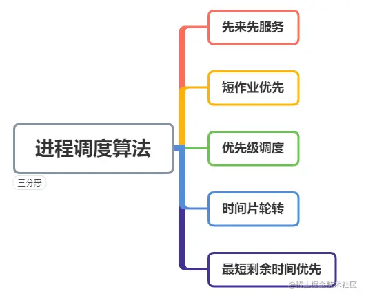

 （1）**先来先服务算法**

   - 这个是一种最简单的进程调度算法，**所有进程按照到达时间的先后顺序排队，先到达的进程先被调度执行。**这种调度算法类似于Java中的队列，采用先进先出（FIFO）的原则。

   

   - **这种调度算法存在一个明显的问题，即如果一个进程执行时间较长，后面的进程就必须等待。**

 （2）**最短作业优先算法**

   - **最短作业优先调度算法是一种非抢占式的调度算法，它根据进程的执行时间长短进行排队，将作业时间短的进程排在前面先执行。**

  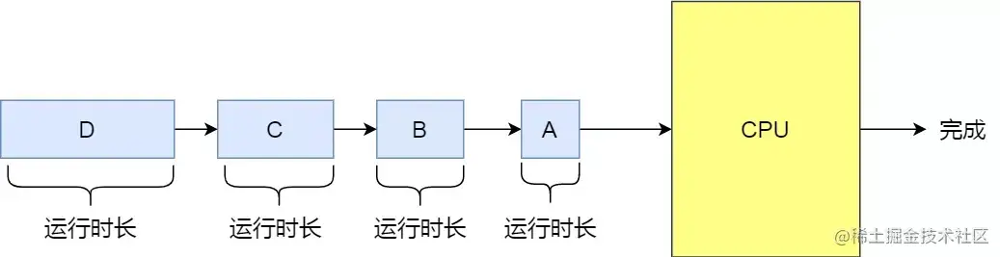

   - 我都不知道进程的执行时间长短的，系统咋知道的？其实**系统通过预估进程的执行时间来进行调度，一般可以使用过去的历史执行时间进行估算。**但是预估的准不准呢，那肯定不准，所以问题来了，预估的准确性是一个问题。如果预估不准确，可能会导致进程的等待时间增加或者执行时间不均衡。如果短时间的进程一直在排在前面执行，那么长时间的进程可能会一直等待执行的机会。

 （3）**时间片轮转调度算法**

   - 时间片轮转调度是一种常见的进程调度算法，**它将CPU时间划分为固定大小的时间片（也称为时间量），每个进程在一个时间片内执行，如果时间片用完后仍未执行完，则被移至就绪队列的末尾，等待下一轮调度**。
   
   - **对于轮转算法，最主要的设计问题是时间片的长度。**如果时间片过长，可能会导致资源浪费，因为某些进程可能只需要很短的时间就能执行完毕，但它们仍然会占用整个时间片。另一方面，如果时间片过短，会导致进程切换的频率增加，增加了上下文切换的开销，可能降低系统的性能。因此时间片的长度，需要有大致合理的数值。**（《现代操作系统》的观点是建议时间片长度在20ms~50ms）**

   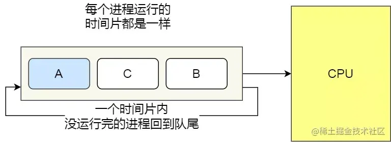

 （4）**最短剩余时间优先算法**

   - 最短剩余时间优先（Shortest Remaining Time Next，SRTN）算法是最短作业优先的抢占式版本。如果没有时间片的限制，最短剩余时间优先算法会变成最短作业优先算法，因为每个进程都能从头到尾一次性执行完毕。

   - **当一个新的进程到达时，把它所需要的整个运行时间与当前进程的剩余运行时间作比较。如果新的进程需要的时间更少，则挂起当前进程，运行新的进程，否则新的进程等待。**

   - **该算法会根据进程的剩余执行时间进行排队，将剩余执行时间最短的进程优先执行。但是这个时间也是预估的而且每个进程的剩余执行时间需要进行实时监控和计算。**

 （5）**优先级调度**

   - **优先级调度算法（Highest Priority First，HPF）就是从就绪队列中选择最高优先级的进程进行运行**。
   
   - 进程的优先级是怎么规定的呢？分为静态优先级或动态优先级：

      - **静态优先级**：创建进程时候，就预先规定优先级，并且整个运行过程中该进程的优先级都不会发生变化。**一般来说，内核进程的优先级都是高于用户进程的。**

      - **动态优先级**：根据进程的动态变化调整优先级。比如随着进程的运行时间增加，适当的降低其优先级；随着就绪队列中进程的等待时间增加，适当的升高其优先级。

   - **另外，需要注意的是，最高优先级算法并非是固定的抢占式策略或非抢占式，系统可预先规定使用哪种策略**：

      - **非抢占式**：当就绪队列中出现优先级高的进程，则运行完当前进程后，再选择该优先级高的进程。

      - **抢占式**：当就绪队列中出现优先级高的进程，则立即强制剥夺当前运行进程的 CPU 资源，分配给优先级更高的进程运行。

（6）**多级反馈队列调度算法**

  - 多级反馈队列（Multilevel Feedback Queue）调度算法是「时间片轮转算法」和「最高优先级算法」的综合和发展。

  - **多级**：表示有多个队列，每个队列优先级从高到低，同时优先级越高时间片越短。

  - **反馈**：表示如果有新的进程加入优先级高的队列时，立刻停止当前正在运行的进程，转而去运行优先级高的队列；

  - 来看看，它是如何工作的：

     - **设置了多个队列，赋予每个队列不同的优先级，每个队列优先级从高到低，同时优先级越高时间片越短；**

     - **新的进程会被放入到第一级队列的末尾，按先来先服务的原则排队等待被调度。程从等待状态进入就绪队列时，首先进人序数较小的队列中;当某进程分到处理机时，就给它一个与就绪队列对应的时间片;该时间片用完时，它被迫释放处理机，并进入到下一级(序数增加1,对应时间片也增加1倍)的就绪队列中：虽然它重新执行的时间被推迟了一些，但在下次得到处理机时，时间片却增加了倍;当处于最大的序数就绪队列时，时间片可以无限大，即一旦分得处理机就一直运行结束。**

     - **当较高优先级的队列为空，才调度较低优先级的队列中的进程运行。如果进程运行时，有新进程进入较高优先级的队列，则停止当前运行的进程并将其移入到原队列末尾，接着让较高优先级的进程运行；**

  - 可以发现，**对于短作业可能可以在第一级队列很快被处理完。对于长作业，如果在第一级队列处理不完，可以移入下次队列等待被执行，虽然等待的时间变长了，但是运行时间也会更长了，所以该算法很好的兼顾了长短作业，同时有较好的响应时间。**

  - **多级反馈队列调度算法的优点是能够根据进程的行为动态地调整优先级，使得长时间运行的进程逐渐降低优先级，而短时间运行的进程逐渐提高优先级。这样可以实现公平性和响应性的平衡。另外，多级反馈队列调度算法也能够有效地处理不同类型的进程，如CPU密集型和I/O密集型进程。**

**13.进程间的通信**

  - **管道、消息队列、共享内存、信号量、信号、socket。**

  - **由于每个进程的的用户地址空间都是独立的，一般而言是无法进程相互访问，但内核空间是每个进程所共享的，所以进程间要通信，必须通过内核。**

（1）**管道**

  - 管道可以理解成不同进程之间的对白，一方发声，一方接收，声音的介质可是是空气或者电缆，进程之间就可以通过管道，**所谓的管道就是内核中的一串缓存，从管道的一端写入数据，就是缓存在了内核里，另一端读取，也是从内核中读取这段数据。**

  - **探究问题，要看其本质。UNIX的设计原则是一切皆文件，那我们猜测，管道的本质也是一个文件，前面的进程以写方式打开文件，后面的进程以读方式打开。这样前面写完后面读，于是就实现了通信**
  
  - **管道可以分为两类：匿名管道和命名管道**。
  
  - **匿名管道**
  
     - **匿名管道是单向的（半双工：它可以在一个信号载体的两个方向上传送，但不能同时传送），只能在有亲缘关系（父子、兄弟）的进程间通信。**由于管道本身没有实体，也就是没有管道文件，所以只能通过fork来复制父进程的文件描述符，以实现进程间的通信。（fork是一个操作系统调用，用于创建一个新的进程。当调用fork时，操作系统会复制当前进程的副本）

     - 在创建匿名管道的时候底层实际上是调用了 pipe() 系统调用，它会返回两个文件描述符，分别用作管道的读取端和写入端；这时候 fork 出子进程，所以父子进程都同时具有了两个文件描述符，即读取端和写入段；但是**又因为管道必须是单向通信的**，所以父子进程需要各关闭一端，比如父进程关闭读端，则子进程需要关闭写端。（谁决定，父子关闭什么读写？不是由管道本身决定的，而是由需求决定的。）

     - **生命周期：匿名管道会随着创建的进程一起出现，当进程消失时它也就消失了。**
     
  - **命名管道（半双工）**
  
    - 匿名管道只能在亲缘关系的进程间通信大大限制了管道的使用，命名管道突破了这个限制。
    
    - **命名管道通过指定路径名的形式，以文件的形式存储在文件系统，实现不相关进程间的通信，因为命名管道通信使用的管道是一个实体文件，在磁盘上的存在的，即使进程与创建 FIFO 的进程不存在亲缘关系，只要可以访问该路径，就能够通过 FIFO 相互通信。而无名管道是存在内存中的虚拟文件，其他进程无法访问，导致没有关联的进程无法进行通信。**
    
    - 命名管道是双向的，可以实现本机任意两个进程通信。

    - **生命周期：命名管道使用结束后，命名管道依然存在于文件系统中，除非对其进行删除操作**

  - **管道的优缺点**

    - 通**过管道传输的数据是无格式的流且大小受限**
    
    - 通过上面的介绍，可以看到，**管道这种通信方式效率低，不适合进程间频繁地交换数据**。当然，它的好处，自然就是简单，同时也我们很容易得知管道里的数据已经被另一个进程读取了。

 （2）**消息队列**

   - **消息是存储在内核中的消息链表，遵循队列的先进先出原则。**

   - 进程A给进程B传输消息，进程A直接写入消息队列就可以了，然后进程B在需要的时候去队列中取消息。写消息就往队列中入队一个消息块，读消息就删除队列中队头的消息块。

   - **而消息块遵循进程双方自定义的数据类型，有固定大小。消息队列不适合传输较大的数据，因为每个消息块的大小有限制。**

   - **由于消息队列存在于内核中，所以进程的读写消息需要在用户态与内核态频繁切换，系统开销较大。**

   - **消息队列相比于管道具有更高的效率和灵活性**。消息队列是通过在内核中创建一个消息链表来实现的，进程可以将数据放入消息队列中，然后其他进程可以从队列中读取这些数据。

   - **与管道不同的是，消息队列是有格式的，每个消息体都是固定大小的存储块，进程在读取数据时需要约定好消息体的数据类型**。
   
   - **消息队列的优势在于可以支持进程间的异步通信，发送方和接收方不需要同时运行，消息可以在队列中等待对方读取。不像管道是无格式的字节流数据。如果进程从消息队列中读取了消息体，内核就会把这个消息体删除。**

   - **消息队列的生命周期与内核相关，如果没有显式地释放消息队列或关闭操作系统，消息队列将一直存在。**

   - **消息队列也存在一些缺点。由于数据在用户态和内核态之间进行拷贝，消息队列通信过程中存在一定的开销**。当进程将数据写入消息队列时，需要将数据从用户态拷贝到内核态；而另一个进程从消息队列中读取数据时，需要将数据从内核态拷贝到用户态。这种数据拷贝开销会影响通信的效率。

 （3）**共享内存**

  - 共享内存的思路其实就是内核为需要通信的进程建立共享区域。一旦共享区域完成建立，内核就基本上不需要参与进程间通信，大大提高了性能。

  - **现代操作系统对于内存管理，采用的是虚拟内存技术，每个进程都有自己独立的虚拟内存空间，不同进程的虚拟内存映射到不同的物理内存中。**
  
   - **而共享内存，就是拿出一块内存空间，允许一个或多个进程所在的虚拟内存空间映射过去，从而实现通信。** 这样这个进程写入的东西，另外一个进程马上就能看到了，都不需要拷贝来拷贝去，传来传去，大大提高了进程间通信的速度。

   - **注意：建立共享内存之后，内核并不是完全不参与进程间的通信，因为当进程使用共享内存时，可能会发生缺页，引发缺页中断，这种情况下，内核还是会参与进来的。**

   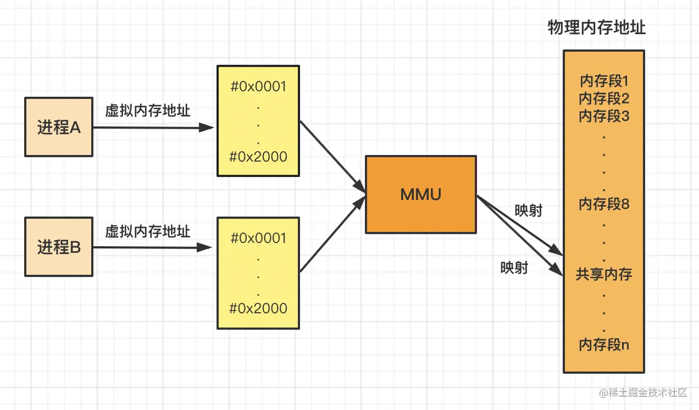

   - **缺点：前面的共享内存虽然速度快，但有一个缺陷，多个进程同时修改一块共享内存，会导致数据被覆盖而产生冲突。**

 （4）**信号量**

   - 而信号量有效解决了进程间竞争共享资源而导致的数据错误，用于实现进程的访问共享资源的互斥与同步。

   - **其实信号量，和我们平时接触到的锁很像，它标志着共享资源有多少，即有多少个进程可以同时占用， 这里面就是一堆的 PV 操作了，进程只有 P 成功了，才可以继续操作。**

   - 可以把信号量理解为一个整数，信号量有两个原子操作，分别为减1和加1，分别称为P操作和V操作。

      - P操作：把信号量减1，如果此时信号量<0，则当前进程被阻塞，如果信号量>=0，当前进程正常执行。

      - V操作：把信号量加1，如果此时信号量<=0，则表明阻塞队列中有进程，会唤醒阻塞中的进程执行，如果信号量>0，则表明没有进程被阻塞。

   - 看一个场景，假设进程A在访问共享内存时不允许进程B访问，则可以用信号量实现互斥：

   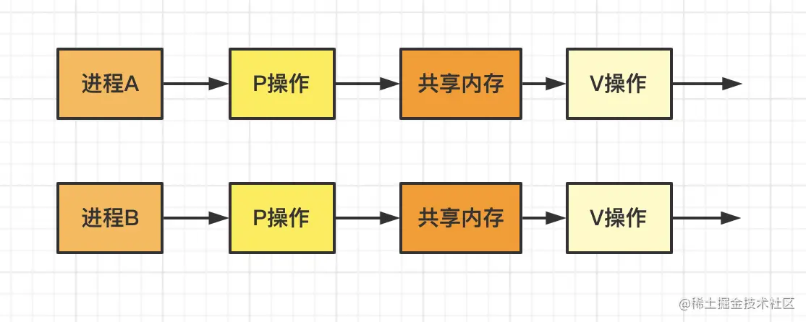

   - 信号量初始值为1，若进程A先访问共享内存，则先执行了P操作，此时信号量为0。表示资源可用，正常访问。

   - 而进程B此时也想访问共享内存，进程B经过P操作后，信号量为-1，小于0，进程B被阻塞。

   - 接着进程A访问完毕，执行V操作，信号量为0，表示有进程被阻塞，则唤醒阻塞队列中的进程B，然后进程B访问共享内存，执行V操作，信号量变为初始值1。

   - 实现了进程间访问共享资源的互斥问题，接下来看如何实现进程同步问题，所谓进程同步，就是有时候需要进程按一定顺序执行。

   - 例如进程A实现读取数据，进程B实现运算数据，所以进程A一定要在进程B之前执行，同样可以用信号量实现。

   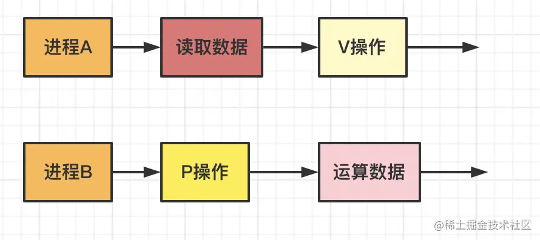

   - 设信号量初始值为0，如果进程B先执行，则经过P操作后，信号量为-1，小于0，此时进程B被阻塞。

   - 而当进程A读取数据完数据，执行了V操作，信号量加1变为0，表明阻塞队列中有进程，则唤醒进程B，接着进程B正常执行，运算数据。

   - **总结来说，PV操作是成对出现的，解决互斥问题时信号量初始值为共享资源的数量，解决同步问题时信号量初始值为0。**

 （5）**信号**

   - 前面说的管道、消息队列、共享内存等方式都是在常规状态下的工作模式，主要关注的是数据传输设计，而**对于异常情况下的工作模式，就需要用「信号」的方式通知进程。** 比如：在Linux终端中按ctrl + c可不是复制，而是给当前进程发送终止信号，终止运行当前进程。通过kill命令也可以杀死一个正在运行的进程，可以在任何时候给进程发送信号，信号是一种异步通信机制。

   - 信号和信号量对比：

      - 信号量也有通知能力，但需要进程主动去查询计数器状态或陷入阻塞状态（来等待通知）。

       - 使用信号，一个进程可以随时发送一个事件到特定的进程、线程或进程组等，并且接收事件的进程不需要阻塞等待该事件，内核会帮助其切换到对应的处理函数中响应信号事件，并在处理完成后恢复之前的上下文。

        - **信号是进程间通信机制中唯一的异步通信机制，它传递的信息很短，只有一个编号**。在 Linux 操作系统中， 为了响应各种各样的事件，提供了几十种信号，分别代表不同的意义。我们可以通过 kill -l 命令，查看所有的信号：

 （6）**socket**

   - 前面提到的管道、消息队列、共享内存、信号量和信号都是在同一台主机上进行进程间通信，**要想跨网络与不同主机上的进程之间通信，就需要 socket 通信。**

   - **socket 实际上不仅用于不同的主机进程间通信，还可以用于本地主机进程间通信，可根据创建 socket 的类型不同，分为三种常见的通信方式，一个是基于 TCP 协议的通信方式，一个是基于 UDP 协议的通信方式，一个是本地进程间通信方式。**

#### 十二、线程 ####

**1.什么是线程(Thread)？**

   

  - 线程是**进程的轻型实体，也叫'轻量级进程**'，是一系列活动按事先设定好的顺序依次执行的过程，**是一系列指令的集合**。

  - 是一条执行路径，不能单独存在，必须包含在进程中

  - 线程是OS中运算调度的最小单位

  - **线程是进程当中的⼀条执⾏流程。**

  - **同⼀个进程内多个线程之间可以共享代码段、数据段、打开的⽂件等资源，但每个线程各⾃都有⼀套独⽴的寄存器和栈，这样可以确保线程的控制流是相对独⽴的。**

**2.为什么引入线程？**

  - **提高操作系统的并发性**

    - 比如360杀毒软件，既要进行木马查杀，又要进行垃圾清理，如果没有线程，要么只能用一个进程串行实现，要么再申请一个进程，但是再创建一个进程的成本是很高的，需要重新分配资源，调度，比较麻烦。这个时候线程就派上用场了，在进程内部划分很多个线程，多个线程之间进行并发。

**3.线程的属性**

 （1）轻型实体

 （2）独立调度和分派的基本单位

 （3）可并发执行

 （4）共享进程资源 

**4.线程的实现方式**

  - **进程的创建**：操作系统加载一个应用程序，给它创建了一个实例，在内存中有一个进程的实例，就是创建了一个进程。

  - **线程的创建**：创建线程也会有线程控制块、数据段、程序段

  - **无论进程切换还是线程切换，切换的都是它们的控制块，数据段和程序段还在原来的位置**

   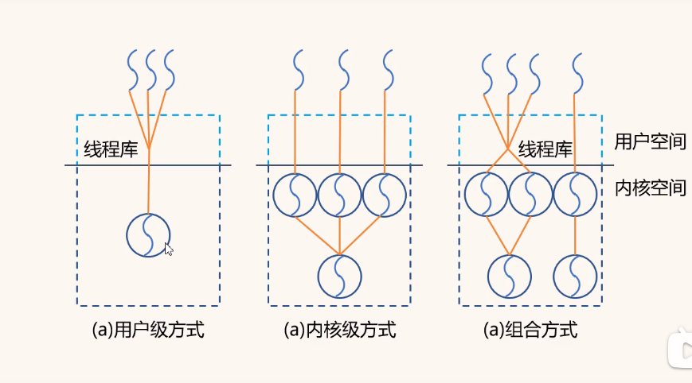

 （1）**用户级线程**

   - 在用户空间实现的线程，所有线程管理的动作的都在用户空间完成

   - 多对一模型：内核线程只有一个，映射到的用户线程是多个

   - 线程控制块在用户空间

   - 一个线程系统调用切换到内核态，整个进程都会阻塞，停止执行

   - 线程和线程之间的切换，只是由当前进程管理，切换效率高

 （2）**内核级线程**

   - 在内核空间实现的线程

   - 一对一模型：内核线程只有一个，映射到的用户线程也是一个

   - 线程控制块在内核空间，数据段、程序段都在用户空间

   - 线程和线程之间的切换，需要先切换到内核空间，内核空间切换到不同的线程，再由不同的线程切换到用户空间执行对应的程序，切换效率低

 （3）组合方式

   - 多对多模型：内核线程多个，映射到的用户线程也可以是多个

1.**多线程竞争共享资源的问题**

 - 同个进程下的线程之间都是共享进程的资源，只要是共享变量都可以做到线程间通信，比如全局变量，所以对于线程间关注的不是通信方式，而是关注多线程竞争共享资源的问题，信号量也同样可以在线程间实现互斥与同步：

 - 互斥的方式，可保证任意时刻只有一个线程访问共享资源；

 - 同步的方式，可保证线程 A 应在线程 B 之前执行。

- **同步和互斥的概念**：

   - 所谓同步，就是并发进程 / 线程在一些关键点上可能需要互相等待与互通消息，这种相互制约的等待与互通消息称为进程 / 线程同步。

   - 而互斥，由于多线程执行操作共享变量的代码段时可能会导致竞争状态，我们要保证任意时刻一个线程在临界区执行，其他线程都被阻止进入，称这种方式为互斥。

- **为了实现进程 / 线程间正确的协作，主要有以下两种方法：**

  - 锁：加锁、解锁操作；

  - 信号量：P、V操作。

- 其中，信号量不仅能实现 进程/线程 的互斥，还能方便的实现 进程/线程 同步。

- **临界区：我们把对共享资源访问的程序片段称为临界区**，我们希望这段代码是互斥的，保证在某时刻只能被一个线程执行，也就是说一个线程在临界区执行时，其它线程应该被阻止进入临界区。

（1）**锁**

  - 使⽤加锁操作和解锁操作可以解决并发线程/进程的**互斥问题**

  - 任何想进⼊临界区的线程，必须先执⾏加锁操作。若加锁操作顺利通过，则线程可进⼊临界区；在完成对临界资源的访问后再执⾏解锁操作，以释放该临界资源。
  
  - **加锁的目的就是保证共享资源在任意时间内，只有一个线程访问，这样就可以避免多线程导致共享数据错乱的问题。根据锁的实现不同，可以分为「忙等待锁」和「无忙等待锁」。**

  - **忙等待锁**就是加锁失败的线程，会不断尝试获取锁，也被称为自旋锁，它会一直占用CPU。

  - **⽆忙等待锁**就是加锁失败的线程，会进入阻塞状态，放弃CPU，等待被调度。

（2）**信号量**

  - 信号量是操作系统提供的⼀种协调共享资源访问的⽅法。

  - 通常信号量表示资源的数量，对应的变量是⼀个整型（ sem ）变量。

   - 另外，还有两个原⼦操作的系统调⽤函数来控制信号量的，分别是：

       - P 操作：将 sem 减 1 ，相减后，如果 sem < 0 ，则进程/线程进⼊阻塞等待，否则继续，表明 P操作可能会阻塞；
		
       - V 操作：将 sem 加 1 ，相加后，如果 sem <= 0 ，唤醒⼀个等待中的进程/线程，表明 V 操作不会阻塞；

  - P 操作是⽤在进⼊临界区之前，V 操作是⽤在离开临界区之后，这两个操作是必须成对出现的。

2.**线程与进程的比较**

   （1）进程是资源（包括内存、打开的文件等）分配的单位，线程是 CPU 调度的单位；
    
   （2）进程拥有一个完整的资源平台，而线程只独享必不可少的资源，如寄存器和栈；

   （3）线程同样具有就绪、阻塞、执行三种基本状态，同样具有状态之间的转换关系；

   （4）线程能减少并发执行的时间和空间开销； 

     - 对于，线程相比进程能减少开销，体现在：
    
         - 线程的创建时间比进程快，因为进程在创建的过程中，还需要资源管理信息，比如内存管理信息、文件管理信息，而线程在创建的过程中，不会涉及这些资源管理信息，而是共享它们；
    
         - 线程的终止时间比进程快，因为线程释放的资源相比进程少很多；
    
         - 同一个进程内的线程切换比进程切换快，因为线程具有相同的地址空间（虚拟内存共享），这意味着同一个进程的线程都具有同一个页表，那么在切换的时候不需要切换页表。而对于进程之间的切换，切换的时候要把页表给切换掉，而页表的切换过程开销是比较大的；
    
         - 由于同一进程的各线程间共享内存和文件资源，那么在线程之间数据传递的时候，就不需要经过内核了，这就使得线程之间的数据交互效率更高了；

 - 所以，不管是时间效率，还是空间效率线程比进程都要高。

3.**线程的上下文切换**

（1）**前言**

- 在前面我们知道了，线程与进程最大的区别在于：**线程是调度的基本单位，而进程则是资源拥有的基本单位。**

- 所以，**所谓操作系统的任务调度，实际上的调度对象是线程，而进程只是给线程提供了虚拟内存、全局变量等资源。**

- 对于线程和进程，我们可以这么理解：

  - **当进程只有一个线程时，可以认为进程就等于线程；**

  - **当进程拥有多个线程时，这些线程会共享相同的虚拟内存和全局变量等资源，这些资源在上下文切换时是不需要修改的**；

- 另外，**线程也有自己的私有数据，比如栈和寄存器等，这些在上下文切换时也是需要保存的。**

（2）**线程上下文切换**

  - 这还得看线程是不是属于同一个进程：

     - **当两个线程不是属于同一个进程，则切换的过程就跟进程上下文切换一样；**

     - **当两个线程是属于同一个进程，因为虚拟内存是共享的，所以在切换时，虚拟内存这些资源就保持不动，只需要切换线程的私有数据、寄存器等不共享的数据；**

  - 所以，线程的上下文切换相比进程，开销要小很多
    
#### 十三、死锁 ####

**1.前言**

  - **计算机系统中有很多独占性的资源，在同一时刻只能每个资源只能由一个进程使用**，打印机就是一个独占性的资源，同一时刻不能有两个打印机同时输出结果，否则会引起文件系统的瘫痪。所以，操作系统具有授权一个进程单独访问资源的能力。
  
  - **两个进程独占性的访问某个资源，从而等待另外一个资源的执行结果，会导致两个进程都被阻塞，并且两个进程都不会释放各自的资源，这种情况就是 死锁(deadlock)。**

  - **死锁可以发生在任何层面**，在不同的机器之间可能会发生死锁，在数据库系统中也会导致死锁，比如进程 A 对记录 R1 加锁，进程 B 对记录 R2 加锁，然后进程 A 和 B 都试图把对象的记录加锁，这种情况下就会产生死锁。

**2.资源**

  - **大部分的死锁都和资源有关，在进程对设备、文件具有独占性（排他性）时会产生死锁。我们把这类需要排他性使用的对象称为资源(resource)。**
  
  - 资源主要分为：可抢占资源和不可抢占资源

  - **可抢占资源(preemptable resource)**： 可以从拥有它的进程中抢占而不会造成其他影响，内存就是一种可抢占性资源，任何进程都能够抢先获得内存的使用权。

  - **不可抢占资源(nonpreemtable resource)** 指的是除非引起错误或者异常，否则进程无法抢占指定资源，这种不可抢占的资源比如有光盘，在进程执行调度的过程中，其他进程是不能得到该资源的。

  - 死锁与不可抢占资源有关，虽然抢占式资源也会造成死锁，不过这种情况的解决办法通常是在进程之间重新分配资源来化解。所以，我们的重点自然就会放在了不可抢占资源上。

**3.死锁**

- **每个进程都在等待其他进程释放资源，而其他资源也在等待每个进程释放资源，这样没有进程抢先释放自己的资源，这种情况会产生死锁，所有进程都会无限的等待下去。**

- 换句话说，**死锁进程结合中的每个进程都在等待另一个死锁进程已经占有的资源。但是由于所有进程都不能运行，它们之中任何一个资源都无法释放资源，所以没有一个进程可以被唤醒。这种死锁也被称为资源死锁(resource deadlock)。**

- 资源死锁是最常见的类型，但不是所有的类型

- **死锁产生需要同时满足四个条件**：

  （1）**互斥条件**：指线程对己经获取到的资源进行使用，**即该资源同时只由一个线程占用。如果此时还有其它线程请求获取获取该资源，则请求者只能等待，直至占有资源的线程释放该资源。**

  （2）**请求并持有条件**：指一个线程己经持有了至少一个资源，但又提出了新的资源请求，而新资源己被其它线程占有，所以当前线程会被阻塞，但阻塞的同时并不释放自己已经获取的资源。
  
  （3）**不可抢占条件**：指线程获取到的资源在自己使用完之前不能被其它线程抢占，只有在自己使用完毕后才由自己释放该资源。

  （4）**环路等待条件**：死锁发生时，系统中一定有两个或者两个以上的进程组成一个循环，循环中的每个进程都在等待下一个进程释放的资源。

- **如何避免死锁呢？**

  - 产⽣死锁的有四个必要条件：互斥条件、持有并等待条件、不可剥夺条件、环路等待条件。**避免死锁，破坏其中的一个就可以。**

  （1）**消除互斥条件**

    - 这个是没法实现，因为很多资源就是只能被一个线程占用，例如锁。

  （2）**消除请求并持有条件**

    - 如果我们能阻止持有资源的进程请求其他资源，我们就能够消除死锁。一种实现方式是让所有的进程开始执行前请求全部的资源。如果所需的资源可用，进程会完成资源的分配并运行到结束。如果有任何一个资源处于频繁分配的情况，那么没有分配到资源的进程就会等待。

    - 很多进程无法在执行完成前就知道到底需要多少资源，如果知道的话，就可以使用银行家算法；还有一个问题是这样无法合理有效利用资源。

    - 还有一种方式是进程在请求其他资源时，先释放所占用的资源，然后再尝试一次获取全部的资源。

  （3）**消除不可抢占条件**

    - 占用部分资源的线程进一步申请其他资源时，如果申请不到，可以主动释放它占有的资源，这样不可剥夺这个条件就破坏掉了。

  （4）**消除环路等待条件**

    - 一种方式是制定一个标准，一个进程在任何时候只能使用一种资源。如果需要另外一种资源，必须释放当前资源。对于需要将大文件从磁带复制到打印机的过程，此限制是不可接受的。
    
    - 另一种方式是将所有的资源统一编号，进程可以在任何时间提出请求，但是所有的请求都必须按照资源的顺序提出。如果按照此分配规则的话，那么资源分配之间不会出现环。
    
    - 尽管通过这种方式来消除死锁，但是编号的顺序不可能让每个进程都会接受。

**4.活锁**

  - 在活锁状态下，处于活锁线程组里的线程状态可以改变，但是整个活锁组的线程无法推进。

  - 活锁可以用两个人过一条很窄的小桥来比喻：为了让对方先过，两个人都往旁边让，但两个人总是让到同一边。这样，虽然两个人的状态一直在变化，但却都无法往前推进。

  - 现在假想有一对并行的进程用到了两个资源。它们分别尝试获取另一个锁失败后，两个进程都会释放自己持有的锁，再次进行尝试，这个过程会一直进行重复。很明显，这个过程中没有进程阻塞，但是进程仍然不会向下执行，这种状况我们称之为 活锁(livelock)。

**5.饥饿锁**

  - 对于进程来讲，最重要的就是资源，如果一段时间没有获得资源，那么进程会产生饥饿，这些进程会永远得不到服务。

  - 我们假设打印机的分配方案是每次都会分配给最小文件的进程，那么要打印大文件的进程会永远得不到服务，导致进程饥饿，进程会无限制的推后，虽然它没有阻塞。

**4.进程和线程的联系和区别？**

（1）联系

  - 线程是进程当中的⼀条执⾏流程。

  - 同⼀个进程内多个线程之间可以共享代码段、数据段、打开的⽂件等资源，但每个线程各⾃都有⼀套独⽴的寄存器和栈，这样可以确保线程的控制流是相对独⽴的。

（2）区别

  - 调度：进程是资源（包括内存、打开的⽂件等）分配的单位，线程是 CPU 调度的单位；

  - 资源：进程拥有⼀个完整的资源平台，⽽线程只独享必不可少的资源，如寄存器和栈；

  - 拥有资源：线程同样具有就绪、阻塞、执⾏三种基本状态，同样具有状态之间的转换关系；

  - 系统开销：线程能减少并发执⾏的时间和空间开销——创建或撤销进程时，系统都要为之分配或回收系统资源，如内存空间，I/O设备等，OS所付出的开销显著大于在创建或撤销线程时的开销，进程切换的开销也远大于线程切换的开销。

