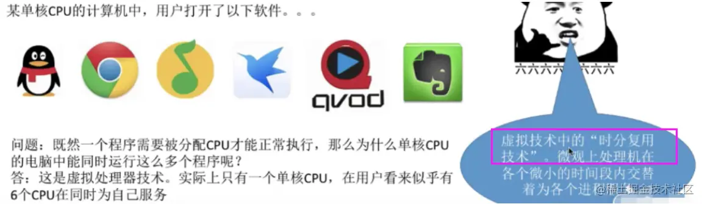

https://blog.csdn.net/tylt6688/article/details/122575150(操作系统发展史)

#### 一、你一定需要一个操作系统吗？ ####

- 答案是：不是。操作系统并不是 magic，它也是一个程序，只不过是比较特殊的程序。理论上完全可能不借助于操作系统写程序。操作系统只是给你提供了一套现成的接口，让你可以轻松高效地控制硬件。（当然，操作硬件是非常繁琐的，感谢操作系统，才能让我们能够高效地开发应用程序。）

**1.计算机系统的层次结构**
 
  - 一台电脑的诞生：

     step1：厂家组装一台裸机

     step2：出售前安装操作系统

     step3：用户安装应用程序（eg：QQ）

     step4：使用QQ聊天

  - 计算机系统层次结构

     用户

     应用程序（软件，如QQ、微信） 

     操作系统（如：Windows 10） 

     裸机（纯硬件：包含CPU、内存、硬盘、主板等）

#### 二、为何要有操作系统？ ####

- 电脑是由硬件和软件组成的，缺了任何一样都无法运行。我们对电脑进行操作，都是利用操作系统来完成。最初的电脑没有操作系统，人们通过各种操作按钮来控制计算机，后来出现了汇编语言，并将它的编译器内置到电脑中，操作人员通过有孔的纸带将程序输入电脑进行编译。这些将语言内置的电脑只能由操作人员自己编写程序来运行，不利于设备、程序的共用。为了解决这种问题，就出现了**操作系统，这样就很好实现了程序的共用，以及对计算机硬件资源的管理，使人们可以从更高层次对电脑进行操作，而不用关心其底层的运作。** 操作系统是现代电脑必不可少的系统软件，是电脑的灵魂所在。现代的电脑都是通过操作系统来解释人们的命令，从而达到控制电脑的目的。几乎所有的应用程序也是基于操作系统的

- **操作系统就是为了让我们更好地使用各种硬件资源**

- 操作系统其实就相当于计算机的大管家，它负责管理计算机的各种资源和功能，将这些资源分配给用户，使用户可以更加高效地使用计算机。**操作系统位于计算机硬件和用户之间，使用户能够通过应用程序来访问硬件资源。通过操作系统，用户可以更加方便地使用计算机，无需了解计算机硬件和资源的细节。**

#### 三、什么是操作系统?  ####

- 操作系统是运行在计算机上最重要的一种**软件**，它管理计算机的资源和进程以及所有的硬件和软件。**它为计算机硬件和软件提供了一种中间层**

- 上图是一个操作系统的简化图，最下面的是硬件，硬件包括芯片、电路板、磁盘、键盘、显示器等设备，在硬件之上是软件。**大部分计算机有两种运行模式：内核态 和 用户态，软件中最基础的部分是操作系统，它运行在 内核态 中，内核态也称为 管态 和 核心态，它们都是操作系统的运行状态，只不过是不同的叫法而已。操作系统具有硬件的访问权，可以执行机器能够运行的任何指令。软件的其余部分运行在用户态下。**

- **用户接口程序(shell 或者 GUI)处于用户态中，并且它们位于用户态的最低层，允许用户运行其他程序**，例如 Web 浏览器、电子邮件阅读器、音乐播放器等。而且，越靠近用户态的应用程序越容易编写，如果你不喜欢某个电子邮件阅读器你可以重新写一个或者换一个，但你不能自行写一个操作系统或者是中断处理程序。这个程序由硬件保护，防止外部对其进行修改。

- **操作系统可以看作是对硬件的一种抽象，不同的操作系统对硬件有不同的抽象接口，应用程序通过调用这些接口来完成对硬件的操控，从而避免了直接和硬件进行接触。**

- 以 word 程序为例，我们来看看一个 word 程序牵涉到了哪些和硬件的交互。

 （1）将 word 程序加载到 RAM（也是一种硬件）。

 （2）把输入的文件显示在屏幕上。

 （3）点击保存的时候，保存到磁盘上。

 （4）需要打印的时候，直接打印机打印出来。

- 试想一下，如果没有操作系统，你得手动控制硬件，那会有多困难！感谢操作系统，你写程序的时候，这些功能基本都可以通过很简单的 API 调用实现。比如你要显示一个字符到屏幕上，只要调用 printf 方法就行了。

- 再比如说存储一个文件，如果要你自己实现的话，你得考虑具体把数据存在哪个物理位置，该如何保存，为了保存文件得分配多少内存......有了操作系统，这些过程就只是一个简单的system call 调用了。

#### 四、操作系统的主要目的 ####

1.管理计算机资源，这些资源包括CPU、内存、磁盘驱动器、打印机等

2.提供一种图形界面，就像我们前面描述的那样，它提供了用户和计算机之间的桥梁

3.为其他软件提供服务，操作系统与软件进行交互，以便为其分配运行所需的任何必要资源。

#### 五、常用的操作系统 ####

- Windows：Windows是微软公司开发的操作系统，是目前最流行的桌面操作系统之一。它具有友好的用户界面、丰富的应用程序和易于使用的系统工具。

- macOS：macOS是苹果公司开发的操作系统，它具有优秀的性能和稳定的系统稳定性。它适用于设计和创意工作负载以及日常办公和Web浏览等任务。

- Linux：Linux是一种开源的操作系统，它具有强大的网络功能和良好的安全性。它适用于服务器和嵌入式设备等领域。

- Android：Android是一种开源的移动设备操作系统，它具有优秀的性能和稳定性，丰富的应用程序和游戏。它适用于智能手机和平板电脑等设备。

- iOS：iOS是苹果公司开发的移动设备操作系统，它具有优秀的性能和稳定性，以及优秀的隐私保护功能。它适用于iPhone和iPad等设备。

#### 六、不同操作系统API差异性 ####

- 同样机型的计算机，可安装的操作系统类型也会有多种选择。例如：AT 兼容机除了可以安装 Windows 之外，还可以采用 Unix 系列的 Linux 以及 FreeBSD （也是一种Unix操作系统）等多个操作系统。当然，**应用软件则必须根据不同的操作系统类型来专门开发。CPU 的类型不同，所对应机器的语言也不同,同样的道理，操作系统的类型不同，应用程序向操作系统传递指令的途径也不同。**

- **应用程序向系统传递指令的途径称为 API(Application Programming Interface)。Windows 以及 Linux 操作系统的 API，提供了任何应用程序都可以利用的函数组合。因为不同操作系统的 API 是有差异的。所以，如何要将同样的应用程序移植到另外的操作系统，就必须要覆盖应用所用到的 API 部分。**

- 键盘输入、鼠标输入、显示器输出、文件输入和输出等同外围设备进行交互的功能，都是通过 API 提供的。

- **这也就是为什么 Windows 应用程序不能直接移植到 Linux 操作系统上的原因，API 差异太大了。**

- **在同类型的操作系统下，不论硬件如何，API 几乎相同。但是，由于不同种类 CPU 的机器语言不同，因此本地代码也不尽相同。**

#### 七、操作系统的功能和目标 ####

**1.作为计算机系统资源的管理者（功能）**

  功能：

       - 处理机管理（进程管理）

       - 存储器管理（内存）

       - 文件管理（文件系统）

       - 设备管理（I/O）

       - 处理机管理（进程）

（1）**处理器管理（进程管理）**

  - 在多道程序环境下，处理机的分配和运行都以进程（或线程）为基本单位，因而**对处理机的管理可归纳为进程的管理**。并发是指在计算机内同时运行多个进程，因此进程何时创建、何时撤销、如何避免冲突、合理共享就是进程管理的最主要的任务。**进程管理的主要功能包括进程控制、进程同步、进程通信、死锁通信、处理机调度等。**

  

（2）**存储器管理**

  - 为多道程序的运行提供良好的环境，方便用户使用及提高内存的利用率，**主要包括内存的分配与回收、地址映射、内存保护与共享和内存扩充等功能。**

  

（3）**文件管理**

  - 计算机中所有的信息都是以文件的形式存在的，操作系统中负责文件管理的部分称为文件系统，**文件管理包括文件存储空间的管理、目录管理及文件读写管理和保护等。**

  

（4）**设备管理**

  - 设备管理的主要任务是完成用户的I/O请求，方便用户使用各种设备，并提高设备的利用率，**主要包括缓存管理、设备分配、设备处理和虚拟设备等功能。**

  

  目标：安全、高效

**2.作为用户和计算机硬件系统之间的接口**
  
  功能：
  
  - 为了让用户方便、快捷、可靠的操作计算机硬件并执行自己的程序，操作系统提供了用户接口（命令接口和程序接口统称为用户接口）

  - 操作系统提供的接口分为两类：**命令接口和程序接口**

 （1）**命令接口**

   - 用户可以直接使用的，利用这些操作命令来组织和控制作业的执行

   - **联机命令接口**： 又称交互式命令接口，适用于分时或实时系统的接口，由一组键盘操作命令组成。**用户输入一条指令，操作系统就执行一条指令。**

  

   - **脱机命令接口**： 又称批处理命令接口，使用于批处理系统，由一组作业控制命令组成。**用户输入一堆指令，操作系统运行一堆指令。在操作系统运行这些命令时用户不可干预。**
   
  

（2）**程序接口**

   - 用户通过程序间接使用的，编程人员可以使用它们来请求操作系统服务

   - 由一组系统调用（也称广义指令）组成，用户通过在程序中使用这些系统调用请求操作系统为其提供服务，只能通过用户程序间接调用，如使用各种外部设备、申请分配和回收内存及其他各种要求

  

 目标：方便用户使用

#### 八、计算机硬件系统 ####

**1.组成**

  

  - 硬件：

     - 主机：
     
        - 中央处理器：控制器、运算器、寄存器
        
        - 内存储器：只读存储器（ROM）、随机读写存储器（RAM）、高速缓冲存储器（Cache）

     - 外设：

        - 外存储器（如：软盘、硬盘、光盘、U盘等）

        - 输入设备（如：键盘、鼠标、光笔、图像扫描仪）

        - 输出设备（如：显示器、打印机、绘图仪等）

        - 其他（网卡、调制解调器、声卡、显卡等）

#### 九、操作系统的特征 ####

**1.并发**

  - **并发：两个或多个事件在同一时间间隔内发生。这些事件宏观上是同时发生的，但微观上是交替发生【CPU时间分片】的。**

  - **并发 VS 并行（两个或多个事件在同一时刻同时发生）**

  

  - 举例：

      - 并行约会（小渣：和一号、二号一起约会）：同一时刻同时进行两个约会任务
      
      - 并发约会（老渣：8-9点：一号，9-10点：二号）：宏观上看，这一天老渣在同时进行两个约会任务。微观上看，在某一个时刻，老渣最多正在进行一个约会任务。

  - **操作系统的并发性指计算机系统中同时存在着多个运行着的程序：一个单核处理机（CPU）同一时刻只能执行一个程序，因此操作系统会负责协调多个程序交替执行（这些程序微观上是交替执行的，但宏观上看起来就像在同时执行，比如我电脑可以同时打开QQ或微信处理事情）。**
 
  - **事实上，操作系统就是伴随着多道程序技术出现的，因此，操作系统和程序并发是一起诞生的。**

  - **当今的计算机，一般都是多核CPU，比如Intel的第八代i3处理器就是4核CPU这意味着同一时刻可以有4个程序并行执行，但是操作系统的并发性依然必不可少，比如我们使用计算机有时候要开4个以上的程序需要同时工作。**

**2.共享**

  - 即资源共享，是指系统中的资源可供内存中多个并发执行的进程共同使用

  - 两种资源共享方式：

    - **互斥共享方式（一个时间段内只允许一个进程访问该资源）**

    - **同时共享方式（允许一个时间段内由多个进程"同时"对该资源进行访问，宏观上的同时，而在微观上，这些进程可能是交替的对该资源进行访问的【分时共享CPU等资源】）**

   - 生活实例：

      - 互斥共享方式:使用QQ和微信视频。同一时间段内摄像头只能分配给其中一个进程。

      - 同时共享方式:使用QQ发送文件A，同时使用微信发送文件B。宏观上看，两边都在同时读取并发送文件，说明两个进程都在访问硬盘资源，从中读取数据。微观上看，两个进程是交替着访问硬盘的。 

   - 并发和共享是两个最基本的特征，二者互为存在条件。

     - **并发和共享的关系：如果失去并发性，则系统中只能有一个应用程序正在运行，则共享性失去存在的意义；如果失去共享性，则QQ和微信不能同时访问硬盘资源，就无法实现同时发送文件，也就无法并发。**

**3.虚拟**

- 所谓虚拟（Virtual）是指通过某种技术把一个物理实体变成为若干个逻辑上的对应物。

- 物理实体是实际存在的东西，逻辑实体是虚的，它并不存在，但是用户却感觉它存在。

- 用于实现虚拟的技术称为虚拟技术，**在操作系统中利用了两种方式实现虚拟技术：时分复用技术和空分复用技术**

- **多道程序设计**：是指在计算机内存中同时存放几道相互独立的程序，使它们在管理程序控制之下，相互穿插的运行。 两个或两个以上程序在计算机系统中同处于开始到结束之间的状态。这就称为多道程序设计。

- 多道程序技术运行的特征：多道、宏观上并行、微观上串行。

- 时分复用技术：处理器的分时共享

   - 虚拟处理器（CPU）：通过多道程序设计技术，采用让多道程序并发执行的方法，分时来使用一个CPU，实际物理上只有一个CPU，但是用户感觉到有多个CPU

  

   - 举例：某单核CPU的计算机中，用户打开了6个软件，一个程序需要被分配CPU才能正常执行，那么为什么单核CPU的电脑中能同时运行这么多个程序呢？

   - 答：这是虚拟处理器技术，实际上只有一个单核CPU，在用户看来似乎有6个CPU在同时为自己服务。

- 空分复用技术：虚拟存储器

   - 举例:	GTA5需要4GB的运行内存，QQ需要256MB的内存，迅雷需要256MB的内存，网易云音乐需要256MB的内存......
   
   - 我的电脑：4GB内存
  
   - 问题：这些程序同时运行需要的内存远大于4GB，那么为什么它们还可以在我的电脑上同时运行呢？（**一个程序需要放入内存并给它分配CPU才能执行**）

   - 答：这是虚拟存储器技术，实际只有4GB的内存，在用户看来似乎远远大于4GB

**4.异步**

   - 在多道程序环境下，允许多个程序并发执行，但由于资源有限，进程的执行不是一贯到底的，而是走走停停【比如执行进程A到一半，突然时间片到了就去执行下一个进程B[让出CPU--单核处理器]，然后这个进程执行到一半，然后又回到原来进程A的未执行位置继续执行】，以不可预知的速度向前推进，这就是进程的异步性。

   - 显然，如果失去了并发性，则系统只能串行地处理各个程序，每个进程的执行会一贯到底【即执行完一个程序以后才会执行下一个】。只有系统拥有并发性，才有可能导致异步性。

#### 十、操作系统的结构 ####

#### 十一、进程和线程 ####

**1.并行和并发有什么区别？**

  - **并发就是在一段时间内，多个任务都会被处理；但在某一时刻，只有一个任务在执行。**单核处理器做到的并发，其实是利用时间片的轮转，例如有两个进程A和B，A运行一个时间片之后，切换到B，B运行一个时间片之后又切换到A。因为切换速度足够快，所以宏观上表现为在一段时间内能同时运行多个程序。

  - **并行就是在同一时刻，有多个任务在执行。这个需要多核处理器才能完成，在微观上就能同时执行多条指令，不同的程序被放到不同的处理器上运行，这个是物理上的多个进程同时进行。**

 

**2.什么是进程上下文切换？**
  
  - 对于单核单线程 CPU 而言，在某一时刻只能执行一条 CPU 指令。**上下文切换 (Context Switch) 是一种将 CPU 资源从一个进程分配给另一个进程的机制**。从用户角度看，计算机能够并行运行多个进程，这恰恰是操作系统通过快速上下文切换造成的结果。在切换的过程中，操作系统需要先存储当前进程的状态 (包括内存空间的指针，当前执行完的指令等等)，再读入下一个进程的状态，然后执行此进程。

 
  
**3.进程有哪些状态？**

（1）创建状态（new）：进程正在被创建时的状态；
 
（2）运⾏状态（Runing）：该时刻进程占⽤ CPU；

（3）就绪状态（Ready）：可运⾏，由于其他进程处于运⾏状态⽽暂时停⽌运⾏；

（4）阻塞状态（Blocked）：该进程正在等待某⼀事件发⽣（如等待输⼊/输出操作的完成）⽽暂时停⽌运⾏，这时，即使给它CPU控制权，它也⽆法运⾏；

（5）结束状态（Exit）：进程正在从系统中消失时的状态；

 

