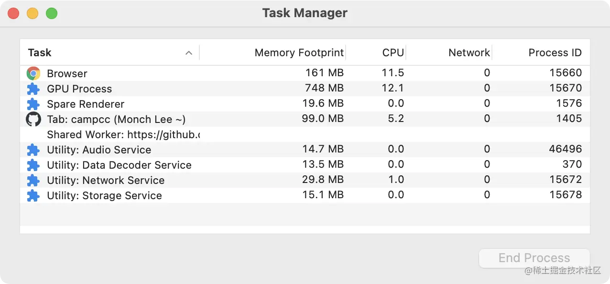
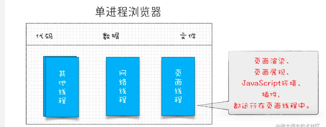
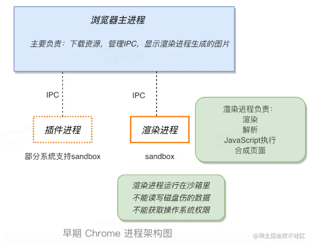
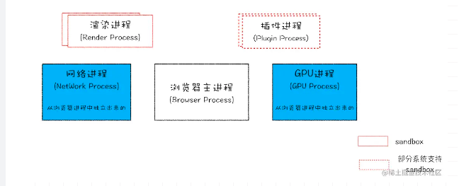
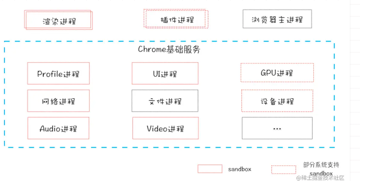
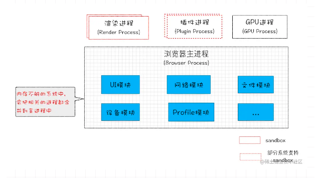

#### 一、前言 ####

- 目前世界上使用率最高的浏览器是 Chrome，它的核心是 Chromium（Chrome 的开发实验版），微软的 Edge 以及国内的大部分主流浏览器，都是基于 Chromium 二次开发而来，它们都有一个共同的特点：多进程架构。

- 当我们用 Chrome 打开一个页面时，会同时启动多个进程，

- **Chrome 使用了由 Apple 发展来的号称 “地表最快” 的 Webkit 排版引擎，搭载 Google 独家开发的 V8 Javascript 引擎**

- 高性能的 Web 应用的设计和优化都离不开浏览器的多进程架构

- 以 Chrome 为例，了解浏览器的架构发展。

#### 二、单进程架构 ####

- 2007 年以前，市面上的浏览器基本都是单进程的，**浏览器所有的功能模块都是运行在同一个进程，包括：网络、插件、JS 运行环境、渲染引擎、页面。**

- 这会导致什么问题呢？

**1.不稳定**

  - **进程中的任意一线程执行出错，都会导致整个进程的崩溃。**

  - 早期的浏览器许多功能（比如 Web 视频，Web 游戏）都需要借助插件来实现，而插件是最容易出问题的模块，并且还运行在浏览器进程之中，可想而知，一个插件的意外崩溃就会引起整个浏览器的崩溃；此外，渲染引擎模块也是很不稳定的，通常一些复杂的 JavaScript 代码就有可能引起渲染引擎模块的崩溃，进而导致浏览器崩溃，所以单进程架构是不稳定的。

**2.不流畅**

  - 导致单进程架构不流畅的原因主要有两个：
  
     - 一是**所有页面的渲染模块，JavaScript 的执行环境和插件都运行在一个页面线程中，这意味着同一时刻只能有一个模块被执行**。想象一下，如果一个耗时的脚本运行在页面线程中，脚本执行时会独占整个线程，导致其他任务都没有机会执行，带来的用户体验就是整个浏览器失去响应，变得卡顿；
     
     - 除此之外，**页面的内存泄漏也是单进程变慢的一个原因，我们知道进程关闭时，操作系统会回收进程占用的内存，但是页面是运行在线程中的，当我们运行一个复杂点的页面再关闭页面时，会存在内存不能完全回收的情况，这样导致的问题是使用时间越长，内存占用越高，浏览器会变得越慢。**

**3.不安全**

  - 插件可以使用 C/C++ 等代码编写，通过插件可以获取到操作系统的任意资源，当你在页面运行一个插件时也就意味着这个插件能完全操作你的电脑。如果是个恶意插件，那么它就可以释放病毒、窃取你的账号密码，引发安全性问题。

  - 页面脚本也可以通过浏览器的漏洞来获取系统权限，引发安全问题。

#### 三、早期多进程架构 ####

  - 早期的多进程架构第一次出现在 Chrome 中是 2008 年，为了解决单进程浏览器的问题，，**Chrome 用独立的渲染进程来运行页面，插件也被放到一个单独的插件进程中执行，浏览器的主线程只负责下载资源，管理进程通信和显示渲染进程生成的页面，而进程之间是通过 IPC 机制进行通信**

  

  - 我们来简单解释一下多进程架构是如何解决上述问题的：

    **1.稳定性**：进程间相互隔离通过 IPC 机制进行通信，所有页面或插件的崩溃不会影响到主进程和其他页面

    **2.流畅性**：1个页面就是1个进程，关闭页面整个进程也关闭了不存在内存泄漏；JavaScript 运行在渲染进程中，所以即使 JavaScript 阻塞了渲染进程，影响到的也只是当前的渲染页面，而并不会影响浏览器和其他页面，因为其他页面的脚本是运行在它们自己的渲染进程中的。

    **3.安全性**：采用多进程架构的额外好处是可以使用安全沙箱，你**可以把沙箱看成是操作系统给进程上了一把锁，沙箱里面的程序可以运行，但是不能在你的硬盘上写入任何数据，也不能在敏感位置读取任何数据，例如你的文档和桌面。**Chrome 把插件进程和渲染进程锁在沙箱里面，这样即使在渲染进程或者插件进程里面执行了恶意程序，恶意程序也无法突破沙箱去获取系统权限。

#### 四、目前多进程架构 ####

  

- 演变后的多进程架构将 GPU，网络进程等再次独立出来，不同版本可能会有差异吗，总的来说包括：

  - **1 个浏览器主进程**(Browser Process)：负责界面显示、用户交互、子进程管理等

  - **多个渲染进程**(Renderer)：渲染进程负责将 HTML、CSS 和 JavaScript 转换为用户可以与之交互的网页，我们之前提到的 Webkit 排版引擎，JavaScript 引擎都位于渲染进程，默认情况下每打开一个 Tab 页签，Chrome 都会为其创建一个渲染进程

  - **1 个GPU 进程**(GPU Process)：GPU 最初是为了实现 3D CSS 的效果，现在也用来绘制 UI 界面

  - **1 个网络进程**(Network Process)：负责页面的网络资源加载

  - **多个插件进程**(Plugin Process)：主要负责插件的运行，独立是为了防止插件崩溃对浏览器和其他页面造成影响

- 不过你可能发现，上面的架构和我们开篇用 Chrome 打开一个页面时在 Task Manager 看到的还是不尽相同，**拆分后的多进程模型虽然提升了浏览器的稳定性、流畅性和安全性，但还是存在一些问题**，

  - **资源占用过高**，每个进程都包含了公共基础结构的副本（如 JavaScript 运行环境），意味着浏览器会消耗更多的内存资源

  - **架构体系复杂**，主要体现在浏览器各模块之间耦合性过高、扩展性较差等问题，会导致现在的架构已经很难适应新的需求了。

#### 五、面向服务架构 ####

- 为了解决这些问题，Chrome 团队在 2016 年提出了 “面向服务的架构”（Services Oriented Architecture，SOA）思想。**原来的各种模块会被重构成独立的服务（Service），每个服务（Service）都可以在独立的进程中运行，访问服务（Service）必须使用定义好的接口，通过 IPC 来通信，从而构建一个更内聚、松耦合、易于维护和扩展的系统，更好实现 Chrome 简单、稳定、高速、安全的目标。**

- 在最新的 Chrome 版本中，**除了浏览器的主进程，渲染进程和插件进程外，UI、数据库、文件、设备、网络等模块基本都已重构为基础服务（Chrome Foundation Service），这样高内聚，低耦合的设计使得多进程的架构更易于维护和扩展。**

  

- 同时 Chrome 还提供灵活的弹性架构，在强大性能设备上会以上面我们讲到的面向服务的多进程的方式运行基础服务，但**如果在资源受限的设备上，Chrome 会将多个服务整合到一个进程中，以节省内存的占用**

  

#### 六、Tips ####

1.即使是如今的多进程架构，我偶尔还会碰到一些**由于单个页面卡死最终崩溃导致所有页面崩溃**的情况，请问这是什么原因呢?

- 答：Chrome的默认策略是，每个标签对应一个渲染进程。但是如果从一个页面打开了新页面，而新页面和当前页面属于同一站点时，那么新页面会复用父页面的渲染进程。官方把这个默认策略叫process-per-site-instance。

- 直白的讲，**就是如果几个页面符合同一站点，那么他们将被分配到一个渲染进程里面去。**

- **所以，这种情况下，一个页面崩溃了，会导致同一站点的页面同时崩溃，因为他们使用了同一个渲染进程。**

- 为什么要让他们跑在一个进程里面呢？

- **因为在一个渲染进程里面，他们就会共享JS的执行环境，也就是说A页面可以直接在B页面中执行脚本。因为是同一家的站点，所以是有这个需求的。**

2.**单进程浏览器开多个页面，渲染线程也只有一个吗？感觉一个页面开一个线程不是更合理吗？**

- 答：基于卡顿的原因，国内浏览器就开始尝试支持页面多线程，也就是让部分页面运行在单独的线程之中，运行在单独的线程之中，意味着每个线程拥有单独的JavaScript执行环境，和Cookie环境，这时候问题就来了：

- 比如A站点页面登陆一个网站，保存了一些Cookie数据到磁盘上，再在当前线程环境中保存部分Session数据，由于Session是不需要保存到硬盘上的，所以Session只会保存在当前的线程环境中。

- 这时候再打开另外一个A站点的页面，假设这个页面在另外一个线程中里面，那么它首先读取硬盘上的Cookie信息，但是，由于Session信息是保存在另外一个线程里面的，无法直接读取，这样就要实现一个Session同步的问题，由于IE并没有源代码，所以实现起来非常空难，国内浏览器花了好长一点时间才解决这个问题的。

- Session问题解决了，但是假死的问题依然有，因为进程内使用了一个窗口，这个窗口是依附到浏览器主窗口之上的，所以他们公用一套消息循环机制，消息循环我们后面会详细地讲，这也就意味这一个窗口如果卡死了。也会导致整个浏览器的卡死。

- 国产浏览器又出了一招，就是把页面做成一个单独的弹窗，如果这个页面卡死了，就把这个弹窗给隐藏掉。

- 这里还要提一下为什么Chrome中的一个页面假死不会影响到主窗口呢？

   - 这是因为chrome输出的实际上图片，然后浏览器端把图片贴到自己的窗口上去，在Chrome的渲染进程内，并没有一个渲染窗口，输出的只是图片，如果卡住了，顶多图片不更新了。

3.**如果打开了 2个页面，会有几个进程呢？是 1 个网络进程、1 个浏览器进程、1 个 GPU 进程以及 2个渲染进程，共 5个吗？**

 - 通常情况下会是五个，但是有很多其他情况：

  （1）如果页面里有**iframe**的话，iframe也会运行在单独的进程中！

  （2）如果页面里有**插件**，同样插件也需要开启一个单独的进程！

  （3）如果你装了**扩展**的话，扩展也会占用进程

  （4）如果**2个页面属于同一站点**的话，并且从a页面中打开的b页面，那么他们会**公用一个渲染进程**

 - 这些进程都可以通过chrome的任务管理器来查看。

4.**对于浏览器中的页面崩溃的原因该怎么定位呢？**

- 要定位页面崩溃页面，我们先要了解下有可能造成页面崩溃的因素，根据我的实际统计数据看来，主要有以下三个方便的因素：

  - 首先，**主要因素是一些第三方插件注入浏览器或者页面进程，拦截了网页的一些正常操作而导致页面或者浏览器崩溃，如一些杀毒软件，或者卫士类软件，或者一些流量劫持软件。**

  - **第二个因素是插件**，虽然容易崩溃，但是通常情况下只会影响到自身的进程，不过我们以前的统计数据来看，也会小概率地影响到页面的崩溃，不过整体数据来看还好了。另外一个方向来看，插件的使用率已经越来越低了，所以插件不是个大问题。

  - 第**三个因素是浏览器的一些bug，如渲染引擎，JavaScript引擎等**，不过从统计数据来看，这类因素导致的崩溃也是越来越低的了，而且随着浏览器的更新升级，引起问题的因素也是在不断变化的。

  - 所以要直接给出页面崩溃原因是很难的，而且直接从JS的层面来看，也是很难跟踪崩溃原因的。

  - 提一个我之前使用的方法，那就是使用JS来统计页面是否崩溃，这类统计不是100%准备，但是可以通过数据来大致判断页面是否崩溃，然后再找一些典型的用户环境来实地排查。

5.**为什么单进程浏览器当时不可以采用安全沙箱？**

- 如果一个进程使用了安全沙箱之后，**该进程对于操作系统的权限就会受到限制**，比如不能对一些位置的文件进行读写操作，而**这些权限浏览器主进程所需要的，所以安全沙箱是不能应用到浏览器主进程之上的。** 

