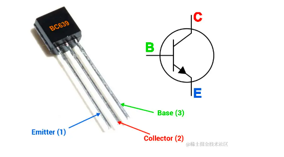

#### 一、CPU的组成 ####

**1.从晶体管到ALU和信息存储**

- 在大学数电的课上，晶体管组成的与门，或门，非门，与非门等等构成的逻辑电路组合，只要巧妙安排，就能够设计成很多复杂的电路，完成计算。**这些晶体管组成了CPU 中专门负责运算的模块，这就是算术逻辑单元ALU。**

- **同样，晶体管通过巧妙的设计组合，也能完成信息存储。**

- **这样具备存储能力的组合电路就是我们在上几篇文章中都有提到的寄存器。在此基础上搭建起更加复杂的电路存储更多的信息，同时提供寻址功能，能够读取信息，这样，内存也诞生了。**

- 同时，也可以看出，**寄存器，内存的本质都是电路，也就是说，一断电，保存的信息都丢掉了。这也就是一些计算机在没保存文件的情况下断电重启后，数据丢失的原因。**

**2.软件与硬件的接口：指令集**

- **指令集就是定义了一台计算机能够理解和执行的指令集合。** 每个指令都告诉计算机执行特定的操作，例如执行算术运算、逻辑运算、内存访问、分支和跳转等。

- **指令集是计算机的底层编程接口，它确定了计算机能够执行的所有操作。** 换句话说，**指令集是软件与硬件的交汇点，在指令集之上，是软件的世界，在指令集之下，是硬件的世界。**

**3.时钟信号**

- 现在，我们的电路具备了计算能力，储存能力，还可以通过指令告诉电路应该执行什么操作，但是现在，我们要靠什么协调或者靠什么来同步各个部分的电路让它们协同工作呢？

- 答案就是在数电课堂上学过的时钟信号，**时钟信号每改变一次电压，整个电路中的各个寄存器也就是整个电路的状态就会更新一下，这样就能确保整个电路都是协同工作。**

- **我们常说的CPU主频就是在一秒钟内时钟信号的频率，显然主频越高，CPU 在一秒钟内完成的操作也就越多。**

- 从此，**有了能够完成各种计算的ALU，可以存储信息的寄存器，以及控制他们协同工作的时钟信号，他们在一起，就成为了CPU**，从此，人类拥有了人类的第二个大脑。

#### 二、CPU的发展 ####

- 处理器技术的发展主要是提高处理器的运行性能。、

**1.指令的执行速度**
 
  - CPU的硬件参数都会有GHz这个参数，比如一个1GHz的CPU，指的是时钟频率是1G，代表着1秒会产生1G次数的脉冲信号，每一次脉冲信号高低电平的转换就是一个周期，称为时钟周期。（T=1/f）

  - **对于CPU来说，在一个时钟周期内，CPU仅能完成一个最基本的动作，时钟频率越高，时钟周期就越短，工作速度也就越快。**

  - **一个时钟周期内一定能执行完一条指令吗？答案是不一定的，大多数指令不能在一个时钟周期完成，通常需要若干个时钟周期**。不同的指令需要的时钟周期是不同的，加法和乘法都对应着一条CPU指令，但是乘法需要的时钟周期就要比加法多。

  - **程序执行的时候，耗费的CPU时间少就说明程序是快的，对于程序的CPU执行时间，我们可以拆解成CPU时钟周期数（CPU Cycle）和时钟周期时间（Clock Cycle Time）的乘积**

     程序的CPU执行时间 = CPU时钟周期数 X 时钟周期时间(1/f)

  - **时钟周期时间就是CPU主频，主频越高说明CPU的工作速度就越快，比如电脑的CPU是2.4GHz四核Intel Core i5，这里的2.4GHz就是电脑的主频，时钟周期时间就是1/2.4G。**

  - **要想CPU跑的更快，自然缩短时钟周期时间，也就是提升CPU主频。**因此工程师们，就在CPU上多放晶体管，不断提升CPU的时钟频率，让CPU更快，程序的执行时间就会缩短。

     - 从1978年Intel发布的8086 CPU开始，计算机的主频从5MHz开始，不断攀升
     - 1980年代中期的80386能够跑到40MHz
     - 1989年的486能够跑到100MHz
     - 直到2000年的奔腾4处理器，主频已经到达了1.4GHz

  - 奔腾4的CPU主频从来没有达到过10GHz，最终定格在3.8GHz是因为功耗。

  - **当前提升处理器性能遇到的最大的挑战就是功耗墙。电流通过晶体管会带来热量，太高的功耗导致处理器温度过高无法运行，同时移动设备电池技术发展也非常缓慢**。我们先来看看处理器动态功耗计算公式，即处理器晶体管开关切换过程中产生的能耗：

	功耗 = 晶体管数量 * 电容 * 电压^2 * 时钟频率

   - 注：这里只是一种简单的功耗工时，还需要考虑半导体制造工艺和漏电造成的影响。

   - 从功耗公式可以看出功耗和晶体管数量、电容、电压、时钟频率成正比，**增加晶体管数量和提高频率都会增加处理器的功耗。**

   - **技术定律**
 
       - **登纳德缩放定律**：1974年罗伯特·登纳德发现，由于晶体管尺寸变小，在固定的芯片面积上增加晶体管的数量不会增加功耗。

       - **摩尔定律**：1965年戈登·摩尔预测，由于晶体管尺寸逐渐变小，同样面积的芯片上晶体管数量每隔一年翻一番，1975 年改为每隔两年翻一番。

   - **功耗墙**

     - 从2004年开始登纳德缩放定律失效。缩短晶体管栅长本来能降低电压、提高晶体管开关频率，但在栅长缩短到65nm左右时，晶体管开关频率增加导致芯片功耗和温度急剧上升。同时，栅长缩短导致漏电流急剧增加，这些电能也会转化为热量。目前大概40%的功耗是由于漏电导致的，即使晶体管处于关闭状态也会增加漏电能耗。早期每一代新工艺至少可以让晶体管栅长缩小30%，虽然现在半导体制造商继续使用现有工艺节点乘以0.7作为下一代的节点名称，例如 10nm、7nm、5nm、3nm，然而栅长缩小尺寸已远远达不到这个要求，需要二十年左右才能使晶体管数量翻一番。同时每一代新技术节点的制造成本越来越高，每代制造成本相比前一代高几倍。

**2.并行优化-阿姆达尔定律**

  - **由于功耗墙的限制，相同电压和电容条件下增加晶体管数量提高核心数量相比增加时钟频率带来的功耗影响更小。同时晶体管尺寸减少速度变缓，增加晶体管数量可能需要增加芯片的面积，但是增加芯片的面积会导致生产良率更低成本更高。处理器设计不再追求单核时钟周期快速提升，朝着多核心方向发展通过增加核心数提高指令吞吐量而非响应时间，即通过并行执行提高性能。**

  - 但要使用这种思想，需满足以下条件:

     - **需要进行的计算，本身即可分解成几个可并行任务 比如向量的点乘运算**

     - **需要能够分解好问题，并确保几个人的结果能够汇总到一起**

     - **在“汇总”这个阶段，是没有办法并行进行的，还是得顺序执行，一步一步来**

  - 这就引出了阿姆达尔定律（Amdahl’s Law）： 对一个程序优化后，处理器并行运算之后效率提升的情况可用如下公式表示：

     优化后的执行时间 = 受优化影响的执行时间/加速倍数+不受影响的执行时间

  - 比如向量点乘，同时计算向量的一小段点积，就是并行提高部分计算性能。但最终还是要在一个人那汇总相加，这部分时间无法并行优化，即不受影响的执行时间。
比如向量

    - 点积需要100ns
   
    - 加法需要20ns

  - 总共需要120ns。这里通过并行4个CPU有了4倍的加速度。那么最终优化后，就有了100/4+20=45ns。即使增加并行度来提供加速倍数，比如有100个CPU，整个时间也需要100/100+20=21ns，所以并非越多就肯定越快。

**3.总结**

  - **无论是简单提升主频，还是增加CPU核心数，通过并行提升性能，都会遇到瓶颈。仅靠'堆硬件'，已经不能很好地满足性能。**于是，工程师们需要从其他方面开始下功夫。在“摩尔定律”和“并行计算”之外，在整个计算机组成层面，还有如下：

（1）3.1 大概率事件

  - 深度学习，整个计算过程中基本都是向量矩阵计算。所以用GPU替代CPU，大幅度提升了深度学习的模型训练过程，Google不满足GPU性能，还推出了TPU。

（2）流水线

  - 现代的工厂里的生产线叫“流水线”。可以把装配iPhone这样的任务拆分成一个个细分的任务，让每个人都只需要处理一道工序，最大化整个工厂的生产效率。
CPU就是一个运算工厂，把CPU指令执行的过程进行拆分，细化运行。

（3）预测

  - 预测下一步该干，而非等上一步结果，提前运算，也能程序更快。
循环访问数组时，你也会猜到下一步会访问数组下一项。比如“分支和冒险”、“局部性原理”

	