#### 一、进程运行的基本原理 ####

- **进程运行的原理其实就是我们普通的用户程序变成进程的一个过程。**

 **1.用户程序 -> 进程的步骤**

 

**（1）编译（编译动作由用户完成）**

  - 将我们的代码通过编译程序（编译器）编译成二进制指令。除了我们自己的程序之外，还需要依赖一些编程语言内置库。**单独我们自己的程序经过编译是不能够运行的，需要一些底层库（函数库、类库）的支持才能够运行，因为本身我们的编程语言往下想要访问操作系统的功能，都是在底层库中去实现的**

**（2） 链接**

- 链接程序（本身也是一个程序）将编译后的目标模块和库整合起来，变成一个完整的可执行程序，变成一个可装入模块。
- 程序的链接分为：**静态链接、动态链接（装入时动态链接、运行时动态链接）**
  - **静态链接**
    - 最大的特点是在程序运行之前就已经完成了链接，准确的说是在装入程序完成之前就已经完成了链接工作。
    - 适合比较小的程序，装入之前一次性把所有的内容都打包成装入模块
  - **装入时动态链接**
    - 一边装入一边链接
    - 适合比较大的程序
  - **运行时动态链接**
    - 程序工作的时候发现需要某些模块的时候，才进行链接装入（缺页中断）
    -  适合更大的程序

**（3）装入**

- 装入模块（本身也是一个程序）通过装入程序加载进内存中去。

- 装入分为：绝对装入、可重定位装入、动态运行时装入，由于装入内存的物理地址不确定才产生的这三种装入方式。

  -  **绝对装入**

     - 绝对指的就是绝对地址，内存中空闲的这些物理地址我很清楚，我就直接放到这些地址上。

      - 那程序员怎么知道我要放到那个位置呢？

        - 早期程序员直接在程序中定义好程序要放入的位置，对程序员要求非常非常高。

      - **适合单道程序，运行前一次性装入**

      - 这种方式已经不再使用了

        

  - **可重定位装入**

     - 每一个程序，根据内存的占用情况计算给它分配空闲的内存空间

     - **适合多道程序，运行前一次性装入**

       

  - **动态运行时装入**

    - 程序边运行边装入，一个程序进程在内存中的物理地址不连续（因为多个进程都是边运行边装入，会有穿插情况）

   - 物理地址：内存中的地址，程序进入内存中后放入哪个位置

   - 逻辑地址：程序中的地址（默认都是从0开始的）
   
   - 内存保护（保护内存）：我们装入当前的程序过程中，保护此内存地址不受其他用户进程的影响。

**2.内存扩充的两种方式**

（1）覆盖

  - 把新加载的程序放到一个可以覆盖的空间上去，新程序覆盖旧程序

（2）交换

  - 从硬盘（磁盘）上开辟一段空间，将不活跃的进程先加载到外存（硬盘缓存）中

#### 二、虚拟内存 ####  

**1.虚拟内存的概念** 

  - 具有请求调入和置换功能，从**逻辑上**对内存容量加以扩充的一种存储器系统。

  - 虚拟内存 = 内存+外存之和

  - **虚拟内存是逻辑上的概念并不是物理上的**

  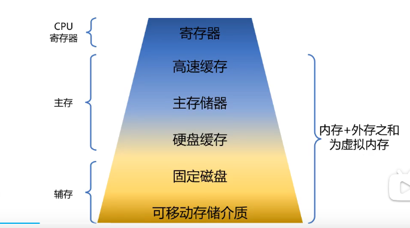

**2.局部性原理**

（1）时间局部性：短时间内又一次操作数据

（2）空间局部性：短时间内又一次访问存储单元

 - **局部性原理催生的是缓存技术**

**3.虚拟内存的特征**

（1）多次性

- 需要的程序的时候，多次请求

（2）对换性

- 程序在内存中运行时在内存中，不运行时可以暂时被移到磁盘缓存，需要时再换入内存

（3）虚拟性

- 逻辑上的概念，让内存看起来比实际内存大一些

**4.虚拟内存的实现**

  

  - 请求分页存储管理

  - 请求分段存储管理

  - 请求段页式存储管理

**5.虚拟地址与物理地址**

- 比如单片机没有虚拟内存的概念，每次写完代码，需要通过工具烧录进去，然后就直接运行，**单片机没有操作系统，其CPU是直接操作内存的物理地址的。**

- **在这种情况下，要想在内存中同时运行两个程序是不可能的**。如果第一个程序在 2000 的位置写入一个新的值，将会擦掉第二个程序存放在相同位置上的所有内容，所以同时运行两个程序是根本行不通的，这两个程序会立刻崩溃。

- 所谓内存管理，其最基本的操作就是由CPU把程序装入到内存中执行。远古批处理时代，进程独占各种计算机资源依次执行，因此只要小于可用内存总大小（主要是除去操作系统本身所占内存）的进程均可 加载运行。 

- **这里关键的问题是这两个程序都引用了绝对物理地址**，而这正是我们最需要避免的。

- 我们可以**把进程所使用的地址「隔离」开来，即让操作系统为每个进程分配独立的一套「虚拟地址」**，人人都有，大家自己玩自己的地址就行，互不干涉。但是有个**前提每个进程都不能访问物理地址**，至于虚拟地址最终怎么落到物理内存里，对进程来说是透明的，操作系统已经把这些都安排的明明白白了。

- **操作系统会提供一种机制，将不同进程的虚拟地址和不同内存的物理地址映射起来。如果程序要访问虚拟地址的时候，由操作系统转换成不同的物理地址，这样不同的进程运行的时候，写入的是不同的物理地址，这样就不会冲突了。**

- 于是，这里就引出了两种地址的概念：

  - **我们程序所使用的内存地址叫做虚拟内存地址**（Virtual Memory Address）

  - **实际存在硬件里面的空间地址叫物理内存地址**（Physical Memory Address）。

- **操作系统引入了虚拟内存，进程持有的虚拟地址会通过 CPU 芯片中的内存管理单元（MMU）的映射关系，来转换变成物理地址，然后再通过物理地址访问内存**，如下图所示：

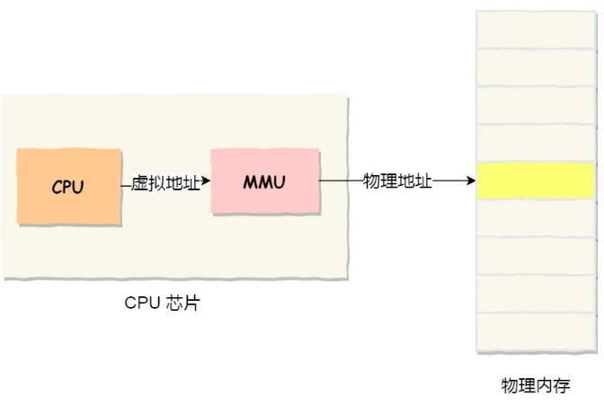

- **MMU内存管理单元**：基址寄存器和界限寄存器（即MMU内存管理单元），基址寄存器中存放着进程的初始地址，每次执行指令时用程序计数器+基址寄存器就可以得到指令所在的物理地址，而界限寄存器提供了访问保护，当进程访问了超过这个界限的虚拟地址，CPU将触发异常。

- 操作系统是如何管理虚拟地址与物理地址之间的关系？主要有两种方式，分别是**内存分段和内存分页**

#### 三、内存的分配 ####

**1.连管理方式**

  - 分配给一个进程的内存空间是连续的。

  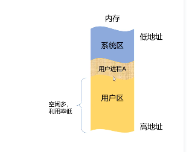

（1）单一连续分配

  - 优点：
    
    - 实现简单
    - 无外部碎片（进程间的内存碎片）
    - 不一定需要内存保护

  - 缺点：

    - 只能用于单用户、单任务OS；
    - 有内部碎片（内存空间可能用不完）
    - 存储器利用率低

（2）固定分区分配

- 预先把用户区内存空间分好了，可以是等分的也可以不等分

  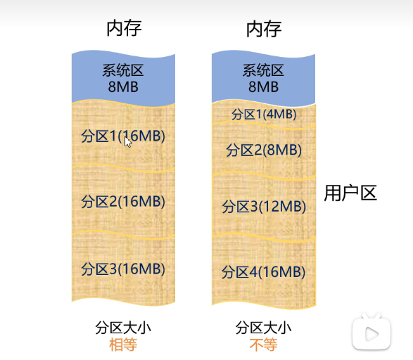

  - 优点：
  
    - 实现简单
    - 无外部碎片

   - 缺点：

     - 较大用户程序时，需要采用覆盖技术，降低了性能
     - 会产生内部碎片，利用率低

（3）动态分区分配

- 预先不会对整个用户区分区，而是**当进程需要装入内存中的时候，根据进程的大小或者说根据进程或请求的需要的空间大小来建立对应的分区。**

  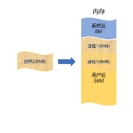

**2.非连续分配管理方式**

  - 进程在工作时所使用的地址空间是可以不连续的，可以分散成多块儿。

 **（1）内存分段**

   - 分段是把**应用程序的用户进程的逻辑地址空间**按照一定规则（如可由代码分段、数据分段、栈段、堆段组成）划分成多个模块/多个段。

   - **每个段的地址都是从0开始的，每个段大小不确定，段内地址连续，段和段之间的地址没有关系**

   - 分段机制下的虚拟地址由两部分组成，**段选择因子和段内偏移量。**

   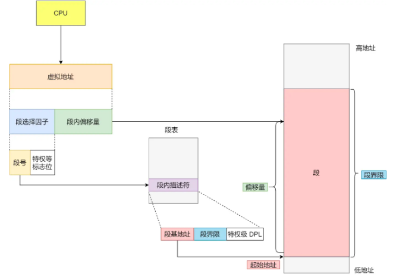

   - **段选择因子**就保存在段寄存器里面。段选择子里面最重要的是**段号**，用作段表的索引。**段表**里面保存的是这个**段的基地址、段的界限和特权等级**等。

   - 虚拟地址中的**段内偏移量**应该位于 0 和段界限之间，如果段内偏移量是合法的，就将段基地址加上段内偏移量得到物理内存地址。

   - 在上面，知道了虚拟地址是通过段表与物理地址进行映射的，分段机制会把程序的虚拟地址分成 4 个段，每个段在段表中有一个项，在这一项找到段的基地址，再加上偏移量，于是就能找到物理内存中的地址，如下图：

   

   - 如果要访问段 3 中偏移量 500 的虚拟地址，我们可以计算出物理地址为，段 3 基地址 7000 + 偏移量 500 = 7500。

   - 分段的办法很好，解决了程序本身不需要关心具体的物理内存地址的问题，但它也有一些**不足之处**：

      - 第一个就是**外部碎片（段间的内存碎片）**的问题。

        - 我们来看看这样一个例子。假设有 1G 的物理内存，用户执行了多个程序，其中：

          - 游戏占用了 512MB 内存
          - 浏览器占用了 128MB 内存
          - 音乐占用了 256 MB 内存。

         - 这个时候，如果我们**关闭了浏览器**，则空闲内存还有 1024 - 512 - 256 = 256MB。
      
   - 如果这个 256MB 不是连续的，被分成了两段 128 MB 内存，这就会导致没有空间再打开一个 200MB 的程序。
      
     
      
- **内存碎片主要分为，内部内存碎片（段内的内存碎片）和外部内存（段间的内存碎片）碎片。**
     
 - **内存分段管理可以做到段根据实际需求分配内存，所以有多少需求就分配多大的段，所以不会出现内部内存碎片。但是由于每个段的长度不固定，所以多个段未必能恰好使用所有的内存空间，会产生了多个不连续的小物理内存，导致新的程序无法被装载，所以会出现外部内存碎片的问题。**
     
- **解决「外部内存碎片」的问题就是内存交换。**
     
       - 可以把音乐程序占用的那 256MB 内存写到硬盘上，然后再从硬盘上读回来到内存里。不过再读回的时候，我们不能装载回原来的位置，而是紧紧跟着那已经被占用了的 512MB 内存后面。这样就能空缺出连续的 256MB 空间，于是新的 200MB 程序就可以装载进来。
     - 这个内存交换空间，在 Linux 系统里，也就是我们常看到的 Swap 空间，这块空间是从硬盘划分出来的，用于内存与硬盘的空间交换。
       
       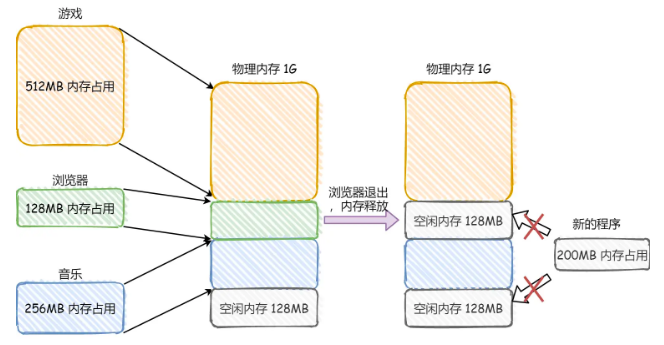
       
     - 第二个就是**内存交换的效率低**的问题。
     
        - 对于多进程的系统来说，用分段的方式，外部内存碎片是很容易产生的，产生了外部内存碎片，那不得不重新 Swap 内存区域，这个过程会产生性能瓶颈。
        - **因为硬盘的访问速度要比内存慢太多了，每一次内存交换，我们都需要把一大段连续的内存数据写到硬盘上。**
        - **所以，如果内存交换的时候，交换的是一个占内存空间很大的程序，这样整个机器都会显得卡顿。**

- 为了解决内存分段的「外部内存碎片和内存交换效率低」的问题，就出现了内存分页。

 **（2）内存分页**

   - 分段的好处就是能产生连续的内存空间，但是会出现「外部内存碎片和内存交换的空间太大」的问题。要解决这些问题，那么就要想出能少出现一些内存碎片的办法。另外，当需要进行内存交换的时候，让需要交换写入或者从磁盘装载的数据更少一点，这样就可以解决问题了。这个办法，也就是内存分页（Paging）。

   - **分页是把整个虚拟和物理内存空间切成一段段固定尺寸的大小。这样一个连续并且尺寸固定的内存空间，我们叫页（Page）**。在 Linux 下，每一页的大小为 4KB。

   - 虚拟地址与物理地址之间通过页表来映射，如下图：

   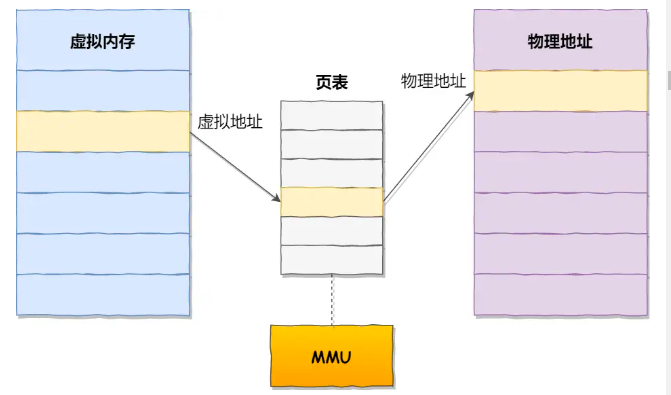

   - **页表是存储在内存里的，内存管理单元 （MMU）就做将虚拟内存地址转换成物理地址的工作。**

   - **而当进程访问的虚拟地址在页表中查不到时，系统会产生一个缺页异常，进入系统内核空间分配物理内存、更新进程页表，最后再返回用户空间，恢复进程的运行。**

   - **分页是怎么解决分段的「外部内存碎片和内存交换效率低」的问题？**
- 内存分页由于内存空间都是预先划分好的，也就不会像内存分段一样，在段与段之间会产生间隙非常小的内存，这正是分段会产生外部内存碎片的原因。而采用了分页，页与页之间是紧密排列的，所以不会有外部碎片。
      - 但是，因为内存分页机制分配内存的最小单位是一页，即使程序不足一页大小，我们最少只能分配一个页，所以页内会出现内存浪费，所以针对**内存分页机制会有内部内存碎片的现象。**
- 如果内存空间不够，操作系统会把其他正在运行的进程中的「最近没被使用」的内存页面给释放掉，也就是暂时写在硬盘上，称为换出（Swap Out）。一旦需要的时候，再加载进来，称为换入（Swap In）。所以，**一次性写入磁盘的也只有少数的一个页或者几个页，不会花太多时间，内存交换的效率就相对比较高。**

   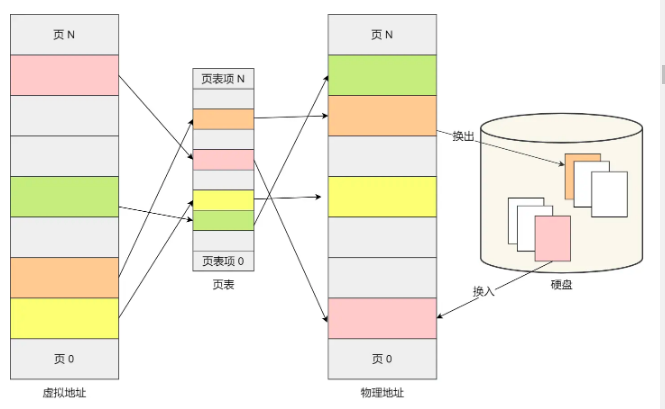

- 更进一步地，**分页的方式使得我们在加载程序的时候，不再需要一次性都把程序加载到物理内存中。我们完全可以在进行虚拟内存和物理内存的页之间的映射之后，并不真的把页加载到物理内存里，而是只有在程序运行中，需要用到对应虚拟内存页里面的指令和数据时，再加载到物理内存里面去。**

   - **分页机制下，虚拟地址和物理地址是如何映射的？**

     - **在分页机制下，虚拟地址分为两部分，页号和页内偏移。页号作为页表的索引，页表包含物理页每页所在物理内存的基地址，这个基地址与页内偏移的组合就形成了物理内存地址**，见下图。

   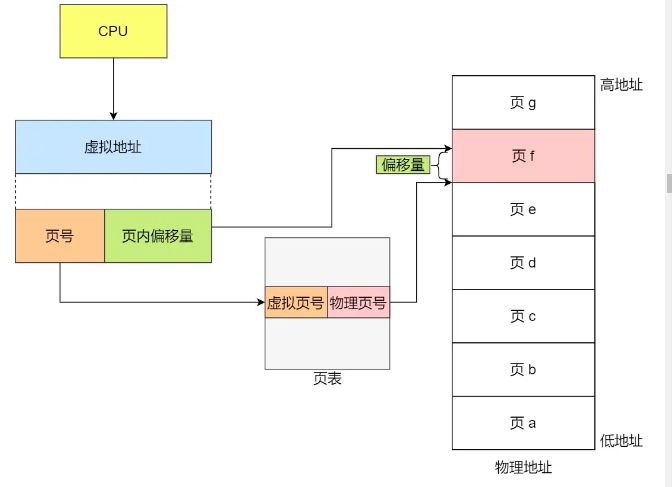

   - 总结一下，对于一个**内存地址转换，其实就是这样三个步骤**：

     - 把虚拟内存地址，切分成页号和偏移量；

     - 根据页号，从页表里面，查询对应的物理页号；

     - 直接拿物理页号，加上前面的偏移量，就得到了物理内存地址。

   - 下面举个例子，虚拟内存中的页通过页表映射为了物理内存中的页，如下图：

   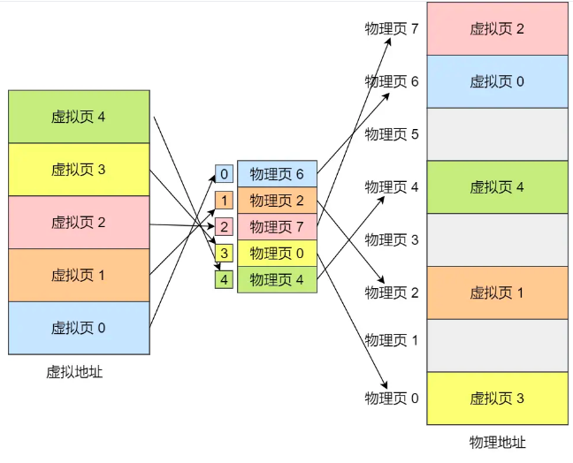

   - 这看起来似乎没什么毛病，但是放到实际中操作系统，这种简单的分页是肯定是会有问题的。

   - **简单的分页有什么缺陷吗？**

     - **有空间上的缺陷。**

     - 因为操作系统是可以同时运行非常多的进程的，那这不就意味着页表会非常的庞大。

     - 在 32 位的环境下，虚拟地址空间共有 4GB，假设一个页的大小是 4KB（2^12），那么就需要大约 100 万 （2^20） 个页，每个「页表项」需要 4 个字节大小来存储，那么整个 4GB 空间的映射就需要有 4MB 的内存来存储页表。

     - 这 4MB 大小的页表，看起来也不是很大。但是要知道每个进程都是有自己的虚拟地址空间的，也就说都有自己的页表。

     - 那么，100 个进程的话，就需要 400MB 的内存来存储页表，这是非常大的内存了，更别说 64 位的环境了

 （3）**多级页表**

   - 要解决上面的问题，就需要采用一种叫作多级页表（Multi-Level Page Table）的解决方案。
  
   - 在前面我们知道了，对于单页表的实现方式，在 32 位和页大小 4KB 的环境下，一个进程的页表需要装下 100 多万个「页表项」，并且每个页表项是占用 4 字节大小的，于是相当于每个页表需占用 4MB 大小的空间。
    
   - **两级页表**

   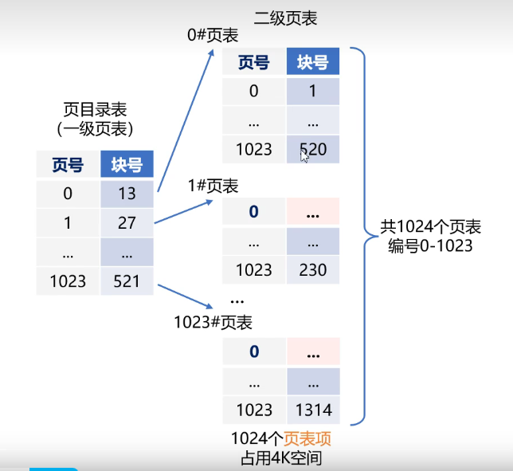

     - 我们对这个 100 多万个「页表项」的单级页表再分页，每一项以1024为单位分为多个二级页表。
    
     - 为什么是1024呢？因为每一个页框是4个字节，那么1024个正好是4KB，正好能丢到一级页表的页框里面去，不浪费内存。
    
     - **所以一级页表存放的是二级页表信息，二级页表才真正的存储的进程中逻辑地址与物理地址的对应关系**
    
     - **查找步骤：**
    
       - 将逻辑地址拆分成三部分
    
       - 从进程控制块中读取页目录表始址
    
       - 根据以及页号查出二级页表位置
    
       - 根据二级页号查出内存块号，加偏移量计算物理地址

   

     - **你可能会问，分了二级表，映射 4GB 地址空间就需要 4KB（一级页表）+ 4MB（二级页表）的内存，这样占用空间不是更大了吗？**
    
       - 当然如果 4GB 的虚拟地址全部都映射到了物理内存上的话，二级分页占用空间确实是更大了，但是，我们往往不会为一个进程分配那么多内存。
    
       - 其实我们应该换个角度来看问题，还记得计算机组成原理里面无处不在的局部性原理么？
    
       - 每个进程都有 4GB 的虚拟地址空间，而显然对于大多数程序来说，其使用到的空间远未达到 4GB，因为会存在部分对应的页表项都是空的，根本没有分配，对于已分配的页表项，如果存在最近一定时间未访问的页表，在物理内存紧张的情况下，操作系统会将页面换出到硬盘，也就是说不会占用物理内存。
    
       - 如果使用了二级分页，一级页表就可以覆盖整个 4GB 虚拟地址空间，但**如果某个一级页表的页表项没有被用到，也就不需要创建这个页表项对应的二级页表了**，即可以在需要时才创建二级页表。做个简单的计算，假设只有 20% 的一级页表项被用到了，那么页表占用的内存空间就只有 4KB（一级页表） + 20% * 4MB（二级页表）= 0.804MB，这对比单级页表的 4MB 是不是一个巨大的节约？
    
    - **那么为什么不分级的页表就做不到这样节约内存呢？**
    
        - 我们从页表的性质来看，保存在内存中的页表承担的职责是将虚拟地址翻译成物理地址。假如虚拟地址在页表中找不到对应的页表项，计算机系统就不能工作了。所以**页表一定要覆盖全部虚拟地址空间，不分级的页表就需要有 100 多万个页表项来映射，而二级分页则只需要 1024 个页表项**（此时一级页表覆盖到了全部虚拟地址空间，二级页表在需要时创建）。

   - 我们把二级分页再推广到多级页表，就会发现页表占用的内存空间更少了，这一切都要归功于对局部性原理的充分应用。

   - **快表(TLB)**

      - **多级页表虽然解决了空间上的问题，但是虚拟地址到物理地址的转换就多了几道转换的工序，这显然就降低了这俩地址转换的速度，也就是带来了时间上的开销。**

      - 程序是有局部性的，即在一段时间内，整个程序的执行仅限于程序中的某一部分。相应地，执行所访问的存储空间也局限于某个内存区域。

      - 我们就可以利用这一特性，把**最常访问的几个页表项存储到访问速度更快的硬件**，于是计算机科学家们，就在 CPU 芯片中，加入了一个专门存放程序最常访问的页表项的 Cache，这个 Cache 就是 TLB（Translation Lookaside Buffer） ，通常称为页表缓存、转址旁路缓存、快表等。(**就是在高速缓存中加入页表，高速缓存的访问速度比内存快**)

   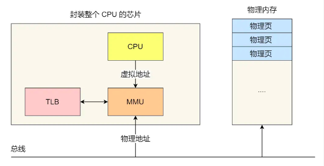

     - 在 CPU 芯片里面，封装了内存管理单元（Memory Management Unit）芯片，它用来完成地址转换和 TLB 的访问与交互。
    
     - **有了快表（高速缓存中的页表）后，那么 CPU 在寻址时，会先查快表，如果没找到，才会继续查常规的页表（内存中的页表，也叫慢表）。**
    
     - TLB 的命中率其实是很高的，因为程序最常访问的页就那么几个。

 （4）**#段页式内存管理**

   - **段页式内存管理实现的方式：**

      - 先将程序划分为多个有逻辑意义的段，也就是前面提到的分段机制；

      - 接着再把每个段划分为多个页，也就是对分段划分出来的连续空间，再划分固定大小的页；
      
   - **这样，地址结构就由段号、段内页号和页内位移三部分组成。**

   - **用于段页式地址变换的数据结构是每一个程序一张段表，每个段又建立一张页表，段表中的地址是页表的起始地址，而页表中的地址则为某页的物理页号**，如图所示：

   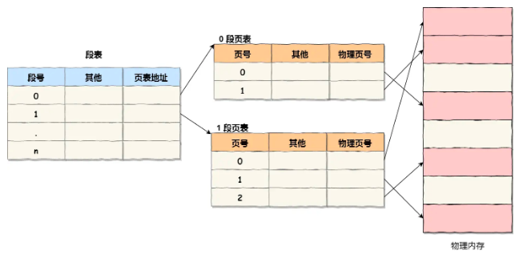

   - **段页式地址变换中要得到物理地址须经过三次内存访问：**

       - 第一次访问段表，得到页表起始地址；

       - 第二次访问页表，得到物理页号；

       - 第三次将物理页号与页内位移组合，得到物理地址。

        - 可用软、硬件相结合的方法实现段页式地址变换，这样虽然增加了硬件成本和系统开销，但提高了内存的利用率。

