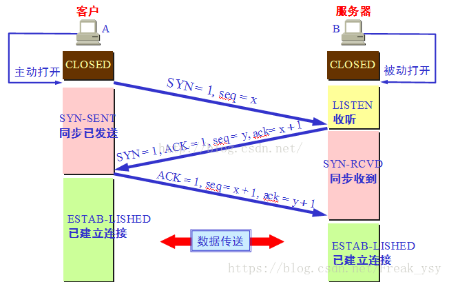
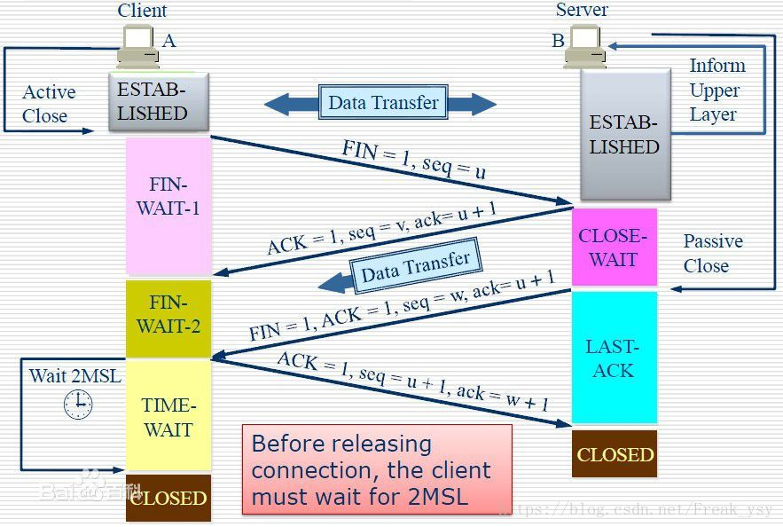

 https://segmentfault.com/a/1190000008543172
 https://blog.csdn.net/freak_ysy/article/details/81543873
 https://www.cnblogs.com/shineyoung/p/10656914.html

 TCP是面向字节流的，但传送的数据单位是报文段

一、什么是报文？

   例如一个要传送一个100kb的HTML文档，并不会将整个文档一下传过去，而是会将文档切割成几个小部分，进行传送，比如分为四个分别为25kb的数据段，而每个数据段再加上一个TCP头部就组成了TCP报文。
    
   一共四个 TCP 报文，发送到另外一个端。另外一端收到数据包，然后再剔除 TCP 首部，组装起来，等到四个数据包都收到了，就能还原出来一个完整的 HTML 文档了
      
二、TCP报文段的几个名词

1.SYN:建立连接
2.ACK:响应
3.FIN:关闭连接
4.seq:
 
     - 序号，占四个字节
     - TCP是面向字节流的，在一个TCP连接中传输的字节流中的每个字节都按照顺序编号
     
        例如 100 kb 的 HTML 文档数据，一共 102400 (100 * 1024) 个字节，那么每一个字节就都有了编号，设第一个字节的序号为0(随机产生)，整个文档的编号的范围是 0 ~ 102399。

		序号字段值指的是本报文段所发送的数据的第一个字节的序号。
		那么 100 的 HTML 文档分割成四个等分之后，
		第一个 TCP 报文段包含的是第一个 25kb 的数据，0 ~ 25599 字节， 该报文的序号的值就是：0，即seq=0
		第二个 TCP 报文段包含的是第二个 25kb 的数据，25600 ~ 51199 字节，该报文的序号的值就是：25600,即seq=25600
		......
		
		根据 8 位 = 1 字节，那么 4 个字节可以表示的数值范围：[0, 2^32]，一共 2^32 (4294967296) 个序号。
		序号增加到最大值的时候，下一个序号又回到了 0.
		也就是说 TCP 协议可对 4GB 的数据进行编号，在一般情况下可保证当序号重复使用时，旧序号的数据早已经通过网络到达终点或者丢失了

5.ack:

     - 确认号，占四个字节
     - 期待收到对方下一个报文段的第一个数据字节的序号,因此当前报文段最后一个字节的编号+1即为确认号

             例如，通讯的一方收到了第一个 25kb 的报文，该报文的 序号值=0，那么就需要回复一个确认报文，其中的确认号 = 25600.
     
     - TCP 的可靠性，是建立在每一个数据报文都需要确认收到的基础之上的。就是说，通讯的任何一方在收到对方的一个报文之后，都要发送一个相对应的确认报文，来表达确认收到。那么，确认报文，就会包含确认号
     

       
ACK、SYN和FIN这些大写的单词表示标志位，其值要么是1，要么是0；ack、seq小写的单词表示序号

三、三次握手

1.图片过程

2.文字过程描述

  (1)主机A向主机B发送TCP连接请求数据包，其中包含主机A的初始序列号seq(A)=x(随机产生)。（其中报文中同步标志位SYN=1，ACK=0，表示这是一个TCP连接请求数据报文；序号seq=x，表明传输数据时的第一个数据字节的序号是x）,建立连接时不携带数据，但要消耗一个序号

  (2)主机B收到请求后，会发回连接确认数据包。（其中确认报文段中，标识位SYN=1，ACK=1，表示这是一个TCP连接响应数据报文，并含主机B的初始序列号seq(B)=y，以及主机B对主机A初始序列号的确认号ack(B)，由于建立连接不携带数据，所以ack(B)=x+1

  (3)第三次，主机A收到主机B的确认报文后，还需作出确认，即发送一个序列号seq(A)=x+1(由于建立连接不携带数据，所以seq(A)=x+1)；确认号为ack(A)=y+1的报文）

3.三次握手的作用

   主机A向主机B发请求

   (1)第一次握手：主机B确认自己可以接受主机A的报文段
  
   (2)第二次握手:主机A可以确认主机B收到了自己发送的报文段，并且可以确认自己可以接收主机B的请求

   (3)第三次握手：主机B可以确认主机A收到了自己的报文段

四、四次挥手

1.图片过程

2.文字过程描述

   (1)第一次挥手：当client没有东西向server发送的时候，就要释放client这边的连接，client会发送一个报文(没有数据)，其中FIN设置为1,seq=u,然后client进入FIN_WAIT状态
    
   (2)第二次挥手：server收到FIN后，发送一个ACK(ACK=1,seq=v,ack=u+1),告诉server你的请求我收到了，server进入CLOSE_WAIT状态

   (3)第三次挥手：server发送一个FIN(FIN=1，seq=w,ack=u+1),用来关闭server到client的数据传输，server进入LAST_ACK状态
 
   (4)第四次挥手：client收到FIN后，client进入TIME_WAIT状态，接着发一个ACK(ACK=1,seq=u+1,ack=w+1)给server，server进入CLOSED状态，完成四次挥手，连接关闭

3.理解

中断端可以是client端也可以是server端

通俗版解释：假设client端发起中断连接请求，即就是发送FIN报文。server端收到FIN报文后知道client端没有数据要发送给自己了，但如果自己的数据还没有发送完成，则不用着急关闭连接，可以继续发送,所以server端可以先发送一个ACK给client端，"告诉client,你的请求我收到了，但我还没有准备好，请继续等待我的消息",这个时候client端就进入FIN_WAIT状态，继续等待server的的FIN报文。当server端确定数据已经发送完成，则向client端发送FIN报文，"告诉Client端，好了，我这边数据发完了，准备好关闭连接了"。Client端收到FIN报文后，"就知道可以关闭连接了，但是他还是不相信网络，怕Server端不知道要关闭，所以发送ACK后进入TIME_WAIT状态，如果Server端没有收到ACK则可以重传。Server端收到ACK后，"就知道可以断开连接了"。Client端等待了2MSL后依然没有收到回复，则证明Server端已正常关闭，那好，我Client端也可以关闭连接了。Ok，TCP连接就这样关闭了！（是服务端先关闭，后客户端关闭）

4.为什么TIME_WAIT状态需要经过2MSL(最大报文段生存时间)才能返回到CLOSE状态？

答：为了保证server能收到client的确认应答。 若client发完确认应答后直接进入CLOSED状态，那么如果该应答丢失，server等待超时后就会重新发送连接释放请求，但此时client已经关闭了，不会作出任何响应，因此server永远无法正常关闭。

5.为什么连接的时候是三次握手，关闭的时候却是四次握手？

因为服务端在LISTEN状态下，收到建立连接请求的SYN报文后，把ACK和SYN放在一个报文里发送给客户端。而关闭连接时，当收到对方的FIN报文时，仅仅表示对方不再发送数据了但是还能接收数据，己方也未必全部数据都发送给对方了，所以己方可以立即close，也可以发送一些数据给对方后，再发送FIN报文给对方来表示同意现在关闭连接，因此，己方ACK和FIN一般都会分开发送

6.为什么是三次握手而不是两次握手或四次握手？

简单点来说就是两次握手不能保证连接的稳定性，四次握手太浪费资源

A发出连接请求，但因为丢失了，故而不能收到B的确认。于是A重新发出请求，然后收到确认，建立连接，数据传输完毕后，释放连接，A发了2个，一个丢掉，一个到达，没有“已失效的报文段”    但是，某种情况下，A的第一个在某个节点滞留了，延误到达，本来这是一个早已失效的报文段，但是在A发送第二个，并且得到B的回应，建立了连接以后，这个报文段竟然到达了，于是B就认为，A又发送了一个新的请求，于是发送确认报文段，同意建立连接，假若没有三次的握手，那么这个连接就建立起来了（有一个请求和一个回应），此时，A收到B的确认，但A知道自己并没有发送建立连接的请求，因为不会理睬B的这个确认，于是呢，A也不会发送任何数据，而B呢却以为新的连接建立了起来，一直等待A发送数据给自己，此时B的资源就被白白浪费了。但是采用三次握手的话，A就不发送确认，那么B由于收不到确认，也就知道并没有要求建立连接。所以第三次握手，主机A发送一次确认是为了防止：如果客户端迟迟没有收到服务器返回的确认报文，这时他会放弃连接，重新启动一条连接请求；但问题是：服务器不知客户端没收到，所以他会收到两个连接请求，白白浪费了一条连接开销。而四次或更多次的握手，则是浪费资源，因为三次握手已经可以达到的效果没有必要再去多次连接

  

