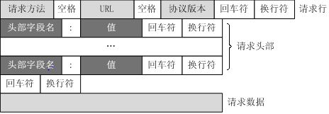

一、http请求和响应

 1.http请求报文

   - 一个HTTP请求报文由请求行（request line）、请求头部（header）、空行和请求数据4个部分组成，下图给出了请求报文的一般格式。

 (1)请求行

  - 请求行由请求方法字段，URL字段和HTTP协议版本等3个字段组成，它们用空格分隔
    
     例如：GET /index.html HTTP/1.1

 (2)请求头部

  - 请求头部由关键字/值对组成，每行一对，关键字和值用英文冒号“:”分隔。请求头部通知服务器有关于客户端请求的信息。
  - 请求头都有：

      - Accept：
      
			例：Accept: text/html,application/xhtml+xml,application/xml;q=0.9,image/webp,image/apng,/;q=0.8

			表示客户端支持的数据格式，或者说客户端“希望”接受到的内容类型。这里只是希望，但是服务器具体返回什么样的内容类型，还是由服务器自己决定，但是无论服务器返回什么样的内容类型，客户端都会接收响应报文，不可能说因为内容类型不同，接收不到服务器响应报文，这不符合http协议规范。

			我们通过浏览器发起get或post请求，该字段都是浏览器自动添加的，同样在服务器端也不会解析该字段的值；
			通过ajax请求或其他手段，我们可以设置该字段的值，但是通常也不进行设置。
			
			该字段的应用场景可以是这样的，有两个终端，比如一个是纯文本阅读器，如Kinder（不能显示图片），另一个是移动终端（可以播放图片和视频），均向服务器请求有关“斑马”的信息，那么这时候服务器端就需要判断什么样的终端应该返回什么样的信息，那么它就可以根据Accept的信息来进行判断，如果解析到的Accept的值为“text/plain”，那么就表示客户端只支持文本类型；如果向上面例子中的那样，则表示客户端文本图片视频都可以。如果我们不加判断，当返回给文本阅读器一张图片时，可能它显示的就是乱码。

      - Accept-Encoding:
      
			例：Accept-Encoding:gzip, deflate, br
			
			表示客户端所支持的解码（解压缩）格式。网络数据的传输都是占据带宽的，而将文件数据压缩能够降低数据量，减少传输时间。所以服务器在返回数据给客户端时，常常对数据进行压缩（对用户透明，通常由服务器或代理来做），而压缩的方式有多种，到底采用哪一种则需要看客户端支持哪种解码方式，这时候就可以根据header中Accept-Encoding的值。
			
			文件或数据的压缩，由服务器或代理来做，一般不需要程序员干预；客户端接收到数据时解压缩，通常由浏览器自动完成，对用户透明。
			对于我们主动发起的ajax请求，一般数据量较少，不需要设置该字段。

     - Accept-Language:
     
			例：Accept-Language:zh-CN,zh;q=0.9
			
			表示客户端支持的语言格式（不是编码格式），如中文/英文，通常浏览器直接发起请求时，浏览器会根据被设置的语言环境（默认语言），来附加上该字段。
			
			一般我们服务器解析报文时，是不理会该字段的。
			
			他的使用场景可以是这样的，假如有个文件，有各种语言的版本，这样当不同请求发来时，我们可以根据Accept-Language的值来判断到底返回哪种语言版本给客户端。
			（其实这种应用场景也一般不采用判断Accept-Language字段的方法，不靠谱，还不如直接在url中体现语言版本呢）

    - Accept-Charset：
    
			例：Accept-Charset:gbk,utf-8;q=0.8
			
			表示客户端支持编码格式。服务器在返回报文时，需要将字符按照一定的编码格式转换为字节序列发送给客户端，那么该采用哪种编码格式呢？
			当然作为服务器端，他可以采用任何一种编码方式，客户端都得完完整整的接收响应报文。因为目前客户端几乎都支持常见编码类型，所以服务器在返回数据时，只需要按照既定的编码方式编码，然后在响应报文中告知客户端所使用的编码方式。这样客户端在接收到报文后按照该方式进行解码，就就不会出现乱码问题。
			
			但是，如果客户端已经定了就使用某种解码方式，那么这时候服务器端就不能那么任性了，他就需要解析Accept-Charset字段，根据这个值，来设定采用的编码方式。
			如上例中，以逗号分隔，客户端支持两种编码方式，gbk和utf-8（gbk优先级高于utf8），其中utf-8后的q值，表示utf-8占的“权重”。
			
            - 题外话：

			服务器端怎么通知浏览器所采用的编码格式呢？
			如果不通知浏览器，那么浏览器会采用什么样的格式解码呢？
			
			服务器端以原生的Servlet & JSP为例：

			  1）当返回的是HTML页面，那么页面meta charset就指定了编码格式
			  2）当返回的是JSP页面，那么页面pageEncoding就指定了编码格式
			  3）当通过resp的Outputstream返回原生内容时，我们可以通过设置响应头content-type/content-charset字段来指定编码格式
			
			那么如果服务器不指定编码格式呢？

			  我的测试环境为win10中文操作系统，浏览器：Chrome 64.0.3282.186（正式版本）
				
				1）返回的html页面不设置meta标签，但是文件本身是utf-8或gbk编码，中文不乱码，服务器会将html页面转换为字节流写给浏览器，浏览器读取字节流，由于找不到meta标签设置的文件格式，就会按照默认的格式解码。这时出现的情况是，当原页面是gbk编码时，浏览器能正常显示页面；当原页面是utf-8编码时，浏览器显示中文乱码。这说明当前Chrome浏览器的默认编码格式为gbk。使用微软自带的Microsoft Edge测试结果一样 。
				
				2）返回JSP页面时，必须指定pageEncoding。
				
				3）通过response的输入流，直接返回生成的字节流。
 
                     当服务器使用gbk编码返回字节流时，地址栏的http请求不乱码，但是ajax请求响应乱码；
			         当服务器使用utf-8返回字节流时，地址栏的http请求乱码，但是ajax不乱码。
			
			
			这说明同一个浏览器，在不同的地方采用的编码格式不同，当浏览器解析页面时，它默认使用的是gbk编码（可能因为我们的中文操作系统，同时是中文版的软件，所以浏览器默认使用gbk格式来解析页面）；当浏览器使用内核XMLHttpRequest对象来解析响应时，默认采用的是utf-8（这个应该跟操作系统语言没关系，内核层面的应该在哪个国家都一样）。所以，如果为了确保在各种情况下都不乱码，服务器一定要通知客户端所采用的编码格式

    - Referer：
    
			例：Referer:http://localhost:8080/test/11.html
			
			表示当前请求是从哪个资源发起的；或者是请求的上一步的地址。
			
			我在11.html页面发起一个请求，这时候浏览器封装的请求头就有上例中的referer字段，表示当前请求是这个资源链接中发起的。
			
			Referer是常用于网站的访问统计，比如我在很多地方都做了广告链接到我网站的主页，这时候我就可以通过Referer来查看哪些地方跳转过来的人多，就说广告的效果好。
			另外，Referer还经常用于防盗链。
			
			   1.防盗链：所谓防盗链是指防止其他web站点页面通过连接本站点的页面来访问本站点内容，这样对于本站点来说侵犯了本站点的版权
               
               2.非法用户： 

                  常访问本站点页面的链接有三种出处:

					  (1) 地址栏输入链接地址。如地址栏上输入www.csdn.net/a.jsp；
					
					  (2)其他站点上的应用程序的页面上通过链接本站点页面资源。如(www.b.com/index.jsp页面上有一链接指向www.csdn.net/a.jsp)；
					
					  (3)本站点上的页面资源连接到本站点的另外的页面资源。如(www.csdn.net/index.jsp页面上有一链接指向www.csdn.net/a.jsp)；
					
				  这三类用户中第一类和第二类通常是非法用户。

               3.如何防盗链

                  通过调用request.getHeader("Referer");判断访问本页面的链接来自哪里。
                  Refer代表网页的来源，及上一页的地址，如果是直接在浏览器上输入地址，回车进来，则没有Refer头。

   - If-Modified-Since：
   
         例：If-Modified-Since:Thu, 29 Mar 2018 08:37:45 GMT

表示客户端缓存文件的时间。字面翻译的意思是，“如果从…时间改变了”（就请再发送给我一遍新的文件）。

当客户端访问服务器的静态文件时，通常会将资源结果缓存下来，并标记一下文件的缓存时间（根据响应头中的Last-Modified字段）；当接下来再发送同样的请求时，会在请求头中添加上这个字段If-Modified-Since；

服务器端读取字段值，判断服务器端文件的最后修改时间，如果如果不晚于该值，说明浏览器缓存的文件是最新的，然后就不会重新发送文件内容，而是将相应报文的状态设置为304，表示你读取缓存的文件就可以了，这就很大程度上节省了带宽。
第一次请求头：

GET /mvctest/11.html HTTP/1.1
Host: localhost:8080
Connection: keep-alive
Upgrade-Insecure-Requests: 1
User-Agent: Mozilla/5.0 (Windows NT 10.0; Win64; x64) AppleWebKit/537.36 (KHTML, like Gecko) Chrome/64.0.3282.186 Safari/537.36
Accept: text/html,application/xhtml+xml,application/xml;q=0.9,image/webp,image/apng,*/*;q=0.8
Accept-Encoding: gzip, deflate, br
Accept-Language: zh-CN,zh;q=0.9
1
2
3
4
5
6
7
8
第一次响应头：
这里写图片描述

第二次请求头：
这里写图片描述
第二次响应头：
这里写图片描述

需要说明的是，If-Modified-Since字段的值，为服务器端文件最后修改的时间，不是请求的访问时间，时间值为GMT格林尼治时间，不是本地时间。
浏览器一般只对.html,.jpg,.css,.js等这些静态资源进行缓存，对于jsp页面以及ajax请求的动态结果，不缓存。服务器如Tomcat会自动给静态文件的响应报文添加“Last-Modified”字段，同时解析请求报文中的If-Modified-Since字段，这些都是对我们透明的。

例如，我们将11.html改为11.jsp，那么浏览器将不会缓存页面内容，服务器每次都响应一个完整的页面内容给客户端，也不会在响应报文中添加“Last-Modified”字段。
每次对于JSP请求的响应结果：
这里写图片描述

If-None-Match:
例：
If-None-Match:W/”607-1522312665174”
该字段同If-Modified-Since字段一样，都是用来表示资源文件是否是最新的。只不过If-Modified-Since的值为文件的最后修改时间，而该值为资源实体的哈希值，同样是由服务器生成的。
从上面的截图中我们可以看到：
第一次请求时，服务器的响应报文中有字段Etag，这就是实体的哈希值，浏览器会缓存文件并记录该值。
第二次请求时，请求头字段中就有If-None-Match，值为Etag的值，而服务器会判断该值与服务器中文件的哈希值是否相同，如果相同，就返回304，让浏览器读取缓存；否则会返回新的资源文件，并在响应头中设置新的Etag值。

Last-Modified/If-Modified-Since 和 Etag/If-None-Match这两对头字段都是来标记缓存资源的，但是后者的优先级要高于前者。

Cache-Control:
例：
Cache-Control:no-cache
字段的字面意思为“缓存-控制”，前面我们将了几个字段表面客户端/服务器如何使用缓存机制，而这个字段就是用来控制缓存的。

Cache-Control在请求/响应报文头中均可设置，分别表明不同的意思，下面我们以响应报文为例：cache-control在响应报文的的取值可以为：public、private、no-cache、no- store、no-transform、must-revalidate、proxy-revalidate、max-age。
所代表的意思为：
这里写图片描述
其中，no-cache、no-store、max-age为常用的取值。
比如，服务器在响应报文中添加Cache-Control：no-store，表示浏览器或各级代理，不要缓存本次的相应内容（即使响应报文中有Etag和Last-Modified）;

比如，响应报文中有Cache-Control：no-cache，表示浏览器可以缓存响应文件，但是在使用缓存之前，必须通过令牌（Etag）来与服务器进行沟通确认缓存有效。

比如，响应报文中有Cache-Control：max-age=500，表示在接下来的500秒内，浏览器可以自主使用缓存内容，不需要向服务器发送同样的请求。

在请求报文中，也可以添加cache-control字段，其取值可以为no-cache、no-store、max-age、 max-stale、min-fresh、only-if-cached。
客户端在发送请求到服务器时，可能会经过很多层代理，而这些代理可能就缓存了本次请求想要的文件，而请求中的cache-control就可以控制，是否使用代理中的缓存文件。

比如，请求报文头中有cache-control：no-cache，那就表示，代理如果返回给我缓存文件时，需要到服务器端进行确认，缓存是不是最新的。

比如，请求报文头中有cache-control：no-store，那就表示，我不需要代理中的缓存文件，我需要直接请求服务器。

所以我们可以看到，cache-control就是用来控制缓存使用的，如是否缓存，是否使用缓存，缓存到期时间等，而Last-Modified/If-Modified-Since 和 Etag/If-None-Match是标识C/S之间怎么使用缓存。
缓存的使用都是服务器和客户端的默认行为，对用户和程序员的透明的，当然我们可以通过配置文件或程序修改他们的行为规则。
附：http协议中对缓存的说明

User-Agent:
例：
User-Agent:Mozilla/5.0 (Windows NT 10.0; Win64; x64) AppleWebKit/537.36 (KHTML, like Gecko) Chrome/64.0.3282.186 Safari/537.36
表示客户端的软件环境。如上可以看出使用的是Window10 64位操作系统，Chrome浏览器等信息。服务器可以根据该字段评估客户端的环境从而给出不同的响应。（比如根据请求是从手机端或是电脑端发起的，返回不同版本的页面）

Host：
例：
Host:localhost:8080
表示请求者的主机地址（IP地址）和端口号。
服务器端可以根据该字段进行ip过滤等操作。

响应头
Etag、Last-Modified、cache-control在前文中已经说明。

Content-Length:
例：
Content-Length:607
表示接收到的响应报文的总长度为607。
根据这个长度，客户端可以更准确的接收和解析报文内容。或者可以根据当前接收/解析的长度占总长度的百分比，做出进度条的效果。

Accept-Ranges:
例：
Accept-Ranges:bytes
表示服务器支持http中的Range功能，能够分段请求客户端能够分段请求服务器。
我们上网时常用的“断点续传”，或者服务器所谓的“多线程下载”就是靠的服务器端的Range技术。
Range功能的请求-响应流程如此：
客户端发起带range的请求：

GET  /test.rar  HTTP/1.1
Connection:  close
Host:  116.1.219.219
Range:  bytes=0-100
1
2
3
4
在头中添加Range字段，表示我要请求[0-100]这101个字节的数据。
此处Range的值，可以添加多个片段，如 Range：bytes=0-100,200-300等。

服务器响应报文：

HTTP/1.1 206 OK
Content-Length:  801     
Content-Type:  application/octet-stream 
Content-Location: http://www.onlinedown.net/hj_index.htm
Content-Range:  bytes  0-100/2350        //2350:文件总大小
Last-Modified: Mon, 16 Feb 2009 16:10:12 GMT
Accept-Ranges: bytes
ETag: "d67a4bc5190c91:512"
Date: Wed, 18 Feb 2009 07:55:26 GMT
1
2
3
4
5
6
7
8
9
响应报文中有Content-Range字段，表示响应的报文片段内容范围，已经总的数据大小。
同时Range请求的正常的返回码是206，不是200。

而即使我们请求的不是Range功能请求，那么服务器的返回字段中会有Accept-Range，表示服务器支持Range功能。

Server:
例：
Server: Apache/2.4.1 (Unix)
表示服务器的名称，是Unix下的Apache服务器

二、http的请求方法

  - HTTP1.0 定义了三种请求方法： GET, POST 和 HEAD方法。
  - HTTP1.1 新增了六种请求方法：OPTIONS、PUT、PATCH、DELETE、TRACE 和 CONNECT 方法。

   1.GET - 默认的请求方式，返回页面具体内容，参数会显示在地址栏中
   2.POST - 向指定资源提交数据进行处理请求（例如提交表单或者上传文件）。数据被包含在请求体中。POST 请求可能会导致新的资源的建立和/或已有资源的修改。
   3.HEAD - 类似于 GET 请求，只不过返回的响应中没有具体的内容，用于获取报头。这一方法可以再不必传输整个响应内容的情况下，就可以获取包含在响应小消息头中的元信息。
   4.PUT - 从客户端向服务器传送的数据取代指定的文档的内容。
   5.DELETE	- 请求服务器删除指定的页面。
   6.CONNECT - HTTP/1.1 协议中预留给能够将连接改为管道方式的代理服务器。
   7.OPTIONS - 允许客户端查看服务器的性能。
   8.TRACE - 回显服务器收到的请求，主要用于测试或诊断。

三、http常用状态码

 1.1xx - 信息提示：这类状态码表示一个临时的响应信息，并需要请求者继续执行操作的一个状态码

   - 100：继续，客户端应当继续发送请求。这个临时响应是用来通知客户端它的部分请求已经被服务器接收,且仍未被拒绝.客户端应当继续发送请求的剩余部分,或者如果请求已经完成,忽略这个响应.服务器必须在请求完成后向客户端发送一个最终响应。（http1.1可用）
   - 101：切换协议，服务器已经理解了客户端的请求，并将通过Upgrade消息头通知客户端采用不同的协议来完成这个请求。在发送完这个响应最后的空行后，服务器将会切换到 在Upgrade消息头中定义的那些协议。只有在切换新的协议更有好处的时候才应该采取类似措施。例如，切换到新的HTTP版本比旧版本更有优势，或者切换到一个实时且同步的协议以传送利用此类特 性的资源。（http1.1可用）

 2.2xx - 成功：这类状态代码表明服务器成功地接受了客户端请求

   - 200:成功,服务器已成功处理了请求。通常，这表示服务器提供了请求的网页。
   - 201:已创建,请求成功且服务器已创建了新的资源。 
   - 202:已接受,服务器已接受了请求，但尚未对其进行处理。 
   - 203:非授权信息,服务器已成功处理了请求，但返回了可能来自另一来源的信息。 
   - 204:无内容,服务器成功处理了请求，但未返回任何内容。 
   - 205:重置内容,服务器成功处理了请求，但未返回任何内容。与 204 响应不同，此响应要求请求者重置文档视图（例如清除表单内容以输入新内容）。 
   - 206:部分内容,服务器成功处理了部分 GET 请求。

 3.3xx - 重定向：客户端浏览器必须采取更多操作来实现请求。例如，浏览器可能不得不请求服务器上的不同的页面，或通过代理服务器重复该请求。

   - 301：永久重定向，请求的网页已永久移动到新位置，返回信息的location头中会包含新的url，服务器返回此响应（对 GET 或 HEAD 请求的响应）时，会自动将请求者转到新位置。
   - 302：暂时重定向
   - 304：使用缓存（协商缓存）
   - 301，302，303，307详解

         - 302

              - HTTP1.0中，在 POST 请求方式上，客户端收到服务端的301或302状态码，那么不能自动的向新的URI发送重复请求，必须跟用户确认是否该重发，因为第二次 POST 时，POST 方法不是幂等，（也就是请求时服务器的资源有可能已经发生了变化），POST 操作会不符合用户预期。但是很多浏览器（user agent）在这种情况下都会把 POST 请求变为 GET 请求。

              - HTTP1.1中，如果客户端发出非 GET、HEAD 请求后，收到服务端的301或302状态码，那么就不能自动的向新URI发送重复请求，除非得到用户的确认。但是，很多浏览器都把301或302当作303 处理了（注意，303 是 HTTP1.1 才加进来的，其实从 HTTP1.0 进化到 HTTP1.1，浏览器什么都没动），它们获取到 HTTP 响应报文头部的 Location 字段信息，并发起一个 GET 请求。

         - 303和307

              - 从上面的介绍可以知道，HTTP1.1和HTTP1.0的302或301状态码意义是一样的，浏览器对它的处理也是一样的，POST方法的重定向在未询问用户的情况下就变成GET，HTTP1.1新加入303和307状态码。
              - 文档中规定303状态码的响应，也就是上边提到的现在浏览器对302状态码的处理：POST重定向为GET。
              - HTTP1.1文档中307状态码则相当于HTTP1.0文档中的302状态码，当客户端的POST请求收到服务端307状态码响应时，需要跟用户询问是否应该在新URI上发起POST方法，也就是说，307是不会把POST转为GET的。
              - 文档也说到，为兼容很多HTTP1.1之前的浏览器，服务端在需要发出303状态码时，会选择用302状态码替代；而对于307的处理，则需要在响应实体中包含信息，以便不能处理307状态码的用户有能力在新URI中发起重复请求，也就是说，把重定向的页面展示给用户，让用户去点重定向URI链接。
              - 303和307的存在，归根结底是由于POST方法的非幂等属性引起的。

 4.4xx - 客户端错误/请求错误

   - 400：错误请求，客户端请求语法出现错误，服务器无法理解请求的语法。
   - 401：未授权， 请求要求身份验证。 需要身份验证后才能获取所请求的内容,类似于403错误.不同点是.401错误后,只要正确输入帐号密码,验证即可通过.对于需要登录的网页，服务器可能返回此响应。
   - 403：禁止，客户端没有权利访问所请求内容,服务器拒绝本次请求。服务器理解客户的请求，但拒绝处理它。通常由于服务器上文件或目录的权限设置导致。
   - 404：未找到，服务器找不到所请求的资源。

 5.5xx - 服务器错误:这些状态代码表示服务器在尝试处理请求时发生内部错误。 这些错误可能是服务器本身的错误，而不是请求出错。

   - 500:服务器内部错误,服务器遇到错误，无法完成请求。 
   - 501:尚未实施,服务器不具备完成请求的功能。 例如，服务器不支持该请求中使用的方法,比如POST 和 PUT.只有GET 和 HEAD 是RFC2616规范中规定服务器必须实现的方法.
   - 502:错误网关,服务器作为网关或代理，从上游服务器收到无效响应。 
   - 503:服务不可用,由于临时的服务器维护或者过载,服务器当前无法处理请求.这个状况是临时的,并且将在一段时间以后恢复.如果能够预计延迟时间,那么响应中可以包含一个Retry-After:头用以标明这个
         延迟时间.如果没有给出这个Retry-After:信息，那么客户端应当以处理500响应的方式处理它.同时,这种情况下,一个友好的用于解释服务器出现问题的页面应当被返回,并且,缓存相关的HTTP头信息
         也应该包含,因为通常这种错误提示网页不应当被客户端缓存. 
   - 504:网关超时,服务器作为网关或代理，但是没有及时从上游服务器收到请求。 
   - 505:HTTP 版本不受支持,服务器不支持请求中所用的 HTTP 协议版本。

