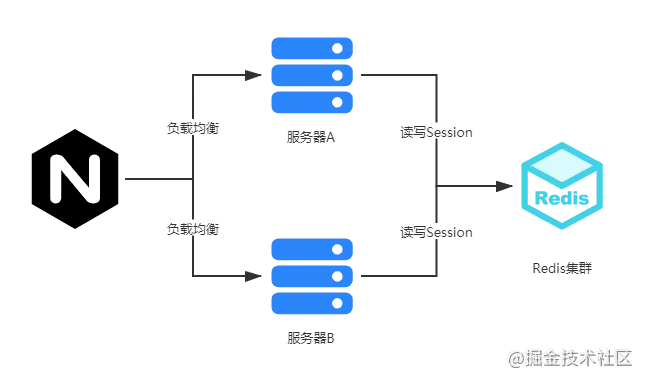
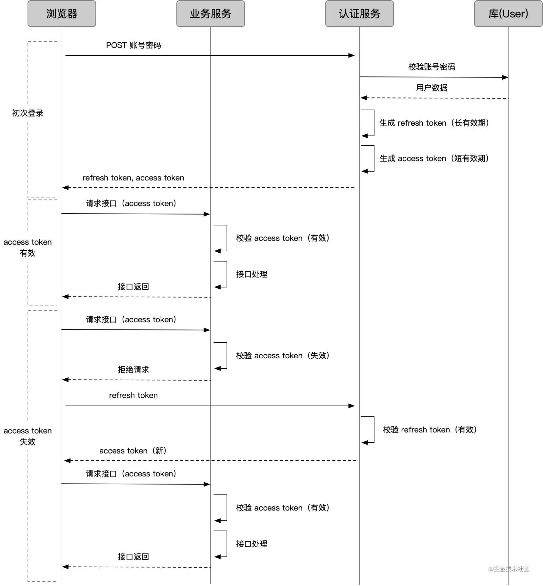

一、null是对象吗？为什么？

答案：不是，typeof null='object'为什么他不是一个对象呢，其实这是JavaScript的一个BUG，编程语言最后的形式都是二进制，所以JavaScript中的对象在底层也是以二进制表示的。如果底层有前三位都等于0的二进制，就会被判定为对象，而null在底层中的二进制表示是全零，所以在对 null 的类型判定时，发现其二进制前三位都是零，因此判定为 object。

二、0.1+0.2=0.3？

答案：不等于，因为计算机在底层是以二进制形式表示的，由于0.1转换成二进制表示时是无限循环的，由于标准位数的限制后面多余的位数会被截掉，此时就已经出现了精度的损失，相加后因浮点数小数位的限制而截断的二进制数字在转换为十进制就会变成0.30000000000000004。

解决办法：es6提供了Number.EPSILON，这个值等于2^-52，这个值非常非常小，在底层计算机已经帮我们运算好，并且无限接近0，但不等于0，这个时候我们只要判断误差值在这个范围内就可以说明是相等的。

function numbersequal(a,b){

return Math.abs(a-b)<Number.EPSILON;

}

0.1+0.1为什么等于0.2？ 因为两个有相同

二进制可以精确的表示位数有限且分母是2的倍数的小数，比如0.5+0.5=1，因为0.5表示成分数是1/2，分母是2的倍数

三、js事件流

 1.事件流

   - js事件流就是指，元素触发事件时，事件在页面中的传播过程。它一共分为三个阶段，捕获阶段、处于目标阶段和冒泡阶段。捕获阶段就是由最不具体的节点先接收事件，由上至下依次传播直至目标节
点。冒泡阶段就是目标节点先接收事件，由下至上依次传播直至window。

   - 默认情况下，事件使用冒泡事件流，不使用捕获事件流。addEventListener方法可以显式的指定事件是使用捕获事件流还是冒泡事件流。addEventListener事件接受三个参数，第一个事件名称，第二个是作为事件处理程序的函数，第三个为一个布尔值，true表示捕获阶段，false表示冒泡阶段（btn.addEventListener('click',handler,false)）。addEventListener是DOM2级事件，与DOM0级事件（btn.onclick)不同的是同一事件（如click)它可以添加多个事件处理程序,执行顺序按照添加时的顺序。与之对应的移除事件处理程序的方法是removeEventListener,接收的参数和添加事件处理程序时的参数是相同的，所以这也意味着，添加的匿名事件处理程序函数将无法移除。DOM0级移除（btn.onclick=null）。

   - IE实现了和DOM中类似的两个方法attachEvent和detachEvent,这两个方法接收相同的两个参数，事件名称(注意是onclick)和事件处理程序函数（btn.attachEvent('onclick',handler)）。由于IE8及更早的版本只支持事件冒泡，所以通过attachEvent添加的事件都会被添加到冒泡阶段。attachEvent和addEventListener一样都可以为同一个元素添加相同的事件，不过它俩不同的是，attachEvent添加的事件处理程序不是以添加的顺序执行的，而是以相反的顺序执行的。

   - IE中的attachEvent和DOM中的方法的主要区别还在于，事件处理程序的作用域不同，使用DOM级方法的情况下，事件处理程序会在其所属元素的作用域运行，this执行该元素。使用attachEvent情况下，事件处理程序会在全局作用域中运行，因此this等于window

 2.事件委托（事件代理）

    - 事件委托就是利用了事件冒泡，把事件处理器添加到父元素，等待子元素事件冒泡，并且父元素能够通过target（IE为srcElement）判断是哪个子元素，从而做相应处理。事件委托的好处就是将多个事件处理器减少到一个，因为事件处理器要驻留内存，这样就提高了性能。DOM更新无需重新绑定事件处理器，因为事件代理对不同子元素可采用不同处理方法。如果新增其他子元素（a,span,div等），直接修改事件代理的事件处理函数即可，不需要重新绑定处理器，不需要再次循环遍历

 
 3.阻止冒泡和默认行为

    event.preventDefault可以阻止默认行为但不阻止冒泡
    event.stoppropagation 可以阻止冒泡但不阻止默认行为
    return false 可以阻止默认行为但不阻止冒泡

四、节流和防抖

  1.节流

     - 节流就是指一定时间内只执行一次事件处理函数。
     - 原理就是通过判断是否到达规定时间来触发函数。
     - 应用场景：鼠标不断点击，监听滚动事件，比如是否滑到底自动加载更多

        var throttle = function(fn,delay){
             var timer = null
             var startTime = new Date()

             return function(){
              var curTime = new Date()
              var remaining = delay-(curTime - startTime)
              var context = this
              var arg = arguments
              clearTimeout(timer)
              if(remaining<=0){
                  fn.apply(context,arg)
                  startTime = Date.now()
              }else{
                 timer = setTimeout(fn,demaining)
              }
            }
 
        }

      var handler = function(){
         console.log('666')
      }

     window.addEventListener('scroll',handler,false)

在节流函数内部使用开始时间startTime、当前时间curTime与delay来计算剩余时间remaining，当remaining<=0时表示该执行事件处理函数了（保证了第一次触发事件就能立即执行事件处理函数和每隔delay时间执行一次事件处理函数）。如果还没到时间的话就设定在remaining时间后再触发 （保证了最后一次触发事件后还能再执行一次事件处理函数）。当然在remaining这段时间中如果又一次触发事件，那么会取消当前的计时器，并重新计算一个remaining来判断当前状态

2.防抖

   - 持续触发事件时，一定时间段内没有再次触发事件，事件处理函数才会执行一次，如果设定的时间到来之前，又一次触发了事件，就重新开始延时
   - 应用场景:search搜索联想，用户在不断输入值时，用防抖来节约请求资源

      function debounce(fn, delay){
	  
	     var time = null
	
	     return function(){
	         if(time!==null){
	           clearTimeout(time)
	        }
	        
	       time = setTimeout(fn,delay)
	        
	     }
	}

	
	function handle(){
	    console.log('666')
	}

	window.addEventListener('scroll', debounce(handle, 1000));

三、token认证(https://www.cnblogs.com/moyand/p/9047978.html)

  - 浏览器请求服务器的时候，服务器将浏览器的信息和一个只有服务器知道的密钥一起使用算法生成一个签名，然后将这个签名和浏览器的信息一起作为一个token给浏览器，浏览器将它存储（cookie或者localstroage）起来，以后每次请求服务器都要带着这个token，然后服务器会验证这个token是否正确来决定是否要可以访问

四、直接使用字面量的方法定义一个对象即就是let obj = {}和使用Object.create(null)定义一个对象有什莫区别？

  - 先了解一下Object.create(proto,propertiesObject)这个方法

      - Object.create(proto,propertiesObject)是指使用指定的原型对象proto和属性propertiesObject去创建一个新的对象，创建出来的对象的__proto__属性指向proto
      
  - Object.create(null)就是指创建的对象完全是一个空对象，没有原型对象，也没有继承Object.prototype上的方法（如hasOwnProperty(),toString()）
  - 而我们使用字面量或者new Object()来生成一个对象的时候，默认它的原型对象就是Object.prototype了，所以他会继承Object.prototype上的属性和方法

五、js异步编程方案

  1.回调函数

      - 回调函数嵌套层级太高，可读性和可维护性都比较差，还有一个很严重的错误就是，因为每次任务都可能失败，需要在回调函数里对每个任务的失败情况进行处理，增加了代码的混乱程度

  2.promise

      - promise很好的解决了回调地狱的问题，并且合并了错误处理，大大方便了异步编程

六、token、cookie、session

# 一、产生背景 #

- 由于http是无状态的，它不会去记录服务器和浏览器的会话信息，对它来说每一次请求都是一个新的请求。随着网络的发展，比如购物车功能就必须知道用户身份才能够执行接下来的一系列操作，所以就产生了cookie、session、token来帮助服务器来记住一些信息。

# 二、cookie #

1. 概念

- cookie是http头部的一个字段，它是由服务器产生的，是服务器发送到用户浏览器并保存在本地的一小块数据，它会在浏览器下次向同一服务器再发起请求时被携带并发送到服务器上
- cookie是存在当前访问服务器的浏览器中的，比如你使用的是chrome浏览器，cookie就会存在chrome浏览器中，如果此时你换成了Firefox等其他的浏览器，因为Cookie刚才是存储在Chrome里面的，所以服务器又蒙圈了，不知道你是谁，就会给Firefox再次发送一个cookie。

2. cookie识别用户身份过程：

   - 浏览器第一次访问服务端时，服务器此时肯定不知道他的身份，所以创建一个独特的身份标识数据，格式为key=value（比如：isLogin=true），放入到Set-Cookie字段里，随着响应报文发给浏览器。
   - 浏览器看到有Set-Cookie字段以后就知道这是服务器给的身份标识，于是就保存起来，下次请求时会自动将此key=value值放入到Cookie字段中发给服务端。
   - 服务端收到请求报文后，发现Cookie字段中有值，就能根据此值识别用户的身份然后提供个性化的服务。

3. cookie的缺点：

   - 用户本人可以通过修改document.cookie="isLogin = true"伪造登陆凭证
   - 如果将账户的一些信息都存入Cookie中的话，一旦信息被拦截，那么我们所有的账户信息都会丢失掉。
   - 能存储的数据量不能超过 4kb
   - 一个浏览器针对一个网站最多存 20 个Cookie，浏览器一般只允许存放 300 个Cookie
   - 移动端对 cookie 的支持不是很好，而 session 需要基于 cookie 实现，所以移动端常用的是 token

# 三、session #

1. 概念

- session 是另一种记录服务器和客户端会话状态的机制
- session 是基于 cookie 实现的，session 存储在服务器端，sessionId 会被存储到客户端的cookie 中

2. session认证流程：

     - 用户第一次请求服务器的时候，服务器根据用户提交的相关信息，开辟了一块 Session 空间（创建了Session对象），同时生成一个SessionId
     - 请求返回时将此 Session 的唯一标识信息 SessionId放入到Set-Cookie字段里，随着响应报文发给浏览器
     - 浏览器接收到服务器返回的 SessionId 信息后，会将此信息存入到 Cookie 中，同时 Cookie 记录此 SessionId 属于哪个域名
     - 当用户第二次访问服务器的时候，请求会自动判断此域名下是否存在 Cookie 信息，如果存在自动将 Cookie 信息也发送给服务端，服务端会从 Cookie 中获取 SessionId，再根据SessionId查找对应的Session信息，如果没有找到说明用户没有登录或者登录失效，如果找到 Session 证明用户已经登录可执行后面操作。

3. 有了 Cookie 为什么还要 Session

     - 使用 session 只需要在客户端保存一个 sessionId，实际上大量数据都是保存在服务端。如果全部用 cookie，数据量大的时候客户端是没有那么多空间的（ 单个 Cookie 保存的数据不能超过 4K，Session 可存储数据远高于 Cookie）。
     - 全部在客户端保存，服务端无法验证，这样伪造和仿冒会更加容易。（伪造一个随机的id很难，但伪造另一个用户名是很容易的）
     - cookie 只是实现 session 的其中一种方案。虽然是最常用的，但并不是唯一的方法。(禁用cookie后还有其他方法存储，比如放在url中,但放在url中涉及安全性和SEO的影响)
     - 全部保存在客户端，那么一旦被劫持，全部信息都会泄露
     - 客户端数据量变大，网络传输的数据量也会变大

4. session缺点

     - Session 机制有个缺点，比如 A 服务器存储了 Session，就是做了负载均衡后，假如一段时间内 A 的访问量激增，会转发到 B 进行访问，但是 B 服务器并没有存储 A 的 Session，会导致 Session 的失效。（解决方法：Nginx ip_hash 策略、Session 复制、共享 Session）
     - Session存储在服务器，大量的存储会给服务器带来压力

5. 如何考虑分布式 Session 问题？

      - 在互联网公司为了可以支撑更大的流量，后端往往需要多台服务器共同来支撑前端用户请求，那如果用户在 A 服务器登录了，第二次请求跑到服务 B 就会出现登录失效问题。

      - 分布式 Session 一般会有以下几种解决方案：

         - （1）session 复制

                - 采用 session 复制方案，整体的流程非常简单：假设现在有三台服务器，当一个 session 在其中一台服务器上被创建，则同时把这个 session 复制到其他两台服务器上。这样当用户的请求无论到达哪台服务器，都会有相应的 session 数据。
                - 这种方案的优势在于服务器可以任意水平扩展，每个服务器都保留着所有的 session 信息，当加入一台服务器只需要把所有的 session 信息复制过去即可。
                - 但是劣势更加明显
                     - 每个服务器上都保存着全部的 session 信息，服务器占用的资源大大增加。
                     - session 同步需要占用网络带宽，最重要的是如果采用的异步复制方式，数据会有短暂性的不一致，可能会导致用户访问失败。

         - （2）Nginx ip_hash 策略
         
               - nginx 可以根据“hash_ip”算法将同一个 IP 的请求固定到某台服务器，这样来自于同一个 ip 的 session 请求总是请求到同样的服务器。
               - 这种方式比 session 同步方式要好很多，每台服务器只存储对应的 session 数据，这大大节省了内存资源，而且服务器之间没有数据同步过程。当有新服务器加入的时候，只需要修改负载均衡器的配置即可，这样很方便就支持了服务器水平扩展。
               - 但是，同时也面临着一些不足

                     - 服务器重启意味着对应的 session 信息丢失，这在一些重要的业务场景中是不允许的
                     - 服务器的水平扩展需要修改负载均衡器的配置，修改之后可能会导致之前的 session 重新分布，这样会导致一部分用户路由不到正确的 session

        - （3）共享 Session

               - 现在应用更广泛的分布式 session 技术是把 session 数据彻底从业务服务器中剥离，单独存储在其他外部设备中，而这些外部设备可以采用主备或者主从，甚至集群的模式来达到高可用。比如现在最常用的方案是把 session 数据存储在 redis 中，虽然从 redis 读写 session 数据需要花费一定的网络耗时，但是对于一般的应用来说在可以接受范围之内。
               - 这种方案好处是整体架构更加清晰，也更加灵活，应用的服务器整体扩展能力再也不用考虑 session 的影响，而 session 的问题被转移到外部设备，通常可以利用内存性 NOSql 来解决性能问题，而这些外部设备一般都会有对应的分布式集群方案，例如 redis，可以利用主从或者哨兵模式甚至集群来提供更大规模的数据支撑能力。

               

6. 禁用cookies，如何使用session

     - 如果禁用了 Cookies，服务器仍会将 sessionId 以 cookie 的方式发送给浏览器，但是，浏览器不再保存这个cookie (即sessionId) 了。
     - 如果想要继续使用 session，需要采用 URL 重写 的方式来实现

# 四、Cookie 和 Session 的区别 #

- 安全性： Session 比 Cookie 安全，Session 是存储在服务器端的，Cookie 是存储在客户端的。
- 存取值的类型不同：Cookie 只支持存字符串数据，想要设置其他类型的数据，需要将其转换成字符串，Session 可以存任意数据类型。
- 有效期不同： Cookie 可设置为长时间保持，比如我们经常使用的默认登录功能，Session 一般失效时间较短，session在超过一定的操作时间(通常为30分钟)后会失效，但是当关闭浏览器时，为了保护用户信息，会自动调用session.invalidate()方法，该方法会清除掉session中的信息。
- 存储大小不同： 单个 Cookie 保存的数据不能超过 4K，Session 可存储数据远高于 Cookie，但是当访问量过多，会占用过多的服务器资源。

# 五、token #

1. 概念

- Token是在服务端将用户信息以及用户信息经过算法生成的签名传给在客户端，每次用户请求的时候都会带上这一段信息，因此服务端拿到此信息通过验证签名判断该请求的合法性。
- 基于token的鉴权机制类似于http协议也是无状态的，它不需要在服务端去保留用户的认证信息或者会话信息。这就意味着基于token认证机制的应用不需要去考虑用户在哪一台服务器登录了，这就为应用的扩展提供了便利。

2. token认证流程：

     - 客户端使用用户名跟密码请求登录
     - 服务端收到请求，去验证用户名与密码
     - 验证成功后，服务端会签发一个 token 并把这个 token 发送给客户端
     - 客户端收到 token 以后，会把它存储起来，比如放在 cookie 里或者 localStorage 里
     - 客户端每次向服务端请求资源的时候需要带着服务端签发的 token
     - 服务端收到请求，然后去验证客户端请求里面带着的 token（使用相同加密算法加密，将结果和token中的签名对比） ，如果验证成功，就向客户端返回请求的数据

3. token 的过期

   - 那我们如何控制 token 的有效期呢？很简单，把「过期时间」和数据一起塞进去，验证时判断就好

4. token优点

    - 基于 token 的用户认证是一种服务端无状态的认证方式，服务端不用存放 token 数据。用解析 token 的计算时间换取 session 的存储空间，从而减轻服务器的压力，减少频繁的查询数据库
    - token 完全由应用管理，所以它可以避开同源策略

5. access token和refresh token

    - token，作为权限守护者，最重要的就是「安全」。业务接口用来鉴权的 token，我们称之为 access token。越是权限敏感的业务，我们越希望 access token 有效期足够短，以避免被盗用。但过短的有效期会造成 access token 经常过期，过期后怎么办呢？

        - 一种办法是，让用户重新登录获取新 token，显然不够友好，要知道有的 access token 过期时间可能只有几分钟。
        - 另外一种办法是，再来一个 token，一个专门生成 access token 的 token，我们称为 refresh token。

            - access token 用来访问业务接口，由于有效期足够短，盗用风险小，也可以使请求方式更宽松灵活
            - refresh token 用来获取 access token，有效期可以长一些，通过独立服务和严格的请求方式增加安全性；由于不常验证，也可以如前面的 session 一样处理

        - 有了 refresh token 后，几种情况的请求流程变成这样：

          

# 六、JWT #

1. 概念

- JSON Web Token (JWT) 是一个开放标准，定义了一种传递 JSON 信息的方式。这些信息通过数字签名确保可信。它是一种成熟的 token 字符串生成方案,相当于规定了怎样定义一个token

2. JWT由三部分组成：头部、负载和签名

     - Header

         - Header通常由两部分组成：token的类型(即 JWT)和使用的签名算法，例如 HMAC SHA256 或 RSA。
         
			例如：{

				  "alg": "HS256",
				  "typ": "JWT"
				 }

        - 指定类型和签名算法后，Json 块被 Base64Url 编码形成 JWT 的第一部分。

    - Payload
    
        - 负载是Token要存储的信息（比如存储用户姓名和昵称信息）
        - JWT 规定了7个官方字段，供选用。
        
            - iss (issuer)：签发人
            - exp (expiration time)：过期时间
            - sub (subject)：主题
            - aud (audience)：受众
            - nbf (Not Before)：生效时间
            - iat (Issued At)：签发时间
            - jti (JWT ID)：编号
 
       - 除了官方字段，你还可以在这个部分定义私有字段，下面就是一个例子。

			例如：{
	
				  "name": "John Doe",
				  "admin": true
				}
        - 然后 payload Json 块会被Base64Url 编码形成 JWT 的第二部分。

    - signature

       - JWT 的第三部分是一个签证信息，这个签证信息由三部分组成
       
         - header (base64后的)
         - payload (base64后的)
         - secret（密钥）

       - 首先，需要指定一个密钥（secret）。这个密钥只有服务器才知道，不能泄露给用户。然后，使用 Header 里面指定的签名算法（默认是 HMAC SHA256），按照下面的公式产生签名形成JWT的第三部分

			HMACSHA256(
			  base64UrlEncode(header) + "." +
			  base64UrlEncode(payload),
			  secret)

    - 最后将这三部分用.号连接，就可以得到了一个Token了。
    

3. JWT 的几个特点：

    - JWT 默认是不加密，但也是可以加密的。生成原始 Token 以后，可以用密钥再加密一次。
    - JWT 不加密的情况下，不能将秘密数据写入 JWT。
    - JWT 不仅可以用于认证，也可以用于交换信息。有效使用 JWT，可以降低服务器查询数据库的次数。
    - JWT 的最大缺点是，由于服务器不保存 session 状态，因此无法在使用过程中废止某个 token，或者更改 token 的权限。也就是说，一旦 JWT 签发了，在到期之前就会始终有效，除非服务器部署额外的逻辑。
    - JWT 本身包含了认证信息，一旦泄露，任何人都可以获得该令牌的所有权限。为了减少盗用，JWT 的有效期应该设置得比较短。对于一些比较重要的权限，使用时应该再次对用户进行认证。
    - 为了减少盗用，JWT 不应该使用 HTTP 协议明码传输，要使用 HTTPS 协议传输。

# 七、session和token #

     - session 是「种在 cookie 上、数据存在服务端」的认证方案，token 是「客户端存哪都行、数据存在 token 里」的认证方案。
     - token保存在客户端，在分布式环境下不需要做额外工作。而session因为保存在服务端，分布式环境下需要实现多机数据共享
     - session一般需要结合Cookie实现认证，所以需要浏览器支持cookie，因此移动端无法使用session认证方案
     - JWT的payload使用的是base64编码的，因此在JWT中不能存储敏感数据。而session的信息是存在服务端的，相对来说更安全
     - 经过编码之后JWT将非常长，cookie的限制大小一般是4k，cookie很可能放不下，所以JWT一般放在local storage里面。并且用户在系统中的每一次http请求都会把JWT携带在Header里面，HTTP请求的Header可能比Body还要大。而sessionId只是很短的一个字符串，因此使用token的HTTP请求比使用session的开销大得多
     - session 是一种记录服务器和客户端会话状态的机制，使服务端有状态化，可以记录会话信息。而 token 是令牌，访问资源接口（API）时所需要的资源凭证。token 使服务端无状态化，不会存储会话信息。
     - session 和 Token 并不矛盾，作为身份认证 token 安全性比 session 好，因为每一个请求都有签名还能防止监听以及重放攻击，而 session 就必须依赖链路层来保障通讯安全了。如果你需要实现有状态的会话，仍然可以增加 session 来在服务器端保存一些状态。

七、JavaScript是如何运行起来的？解释型语言和编译型语言的差异是什么？

#### 一、前言 ####

- 我们编写的源代码是人类语言，我们自己能够轻松理解；但是对于计算机硬件（CPU），源代码就是天书，根本无法执行，计算机只能识别某些特定的二进制指令，在程序真正运行之前必须将源代码转换成二进制指令。所谓的二进制指令，也就是机器码，是 CPU 能够识别的硬件层面的“代码”，然而，究竟在什么时候将源代码转换成二进制指令呢？不同的编程语言有不同的规定：

     - 有的编程语言要求必须提前将所有源代码一次性转换成二进制指令，也就是生成一个可执行程序（Windows 下的 .exe），比如C语言、C++、Golang、Pascal（Delphi）、汇编等，这种编程语言称为编译型语言，使用的转换工具称为编译器。
     - 有的编程语言可以一边执行一边转换，需要哪些源代码就转换哪些源代码，不会生成可执行程序，比如 Python、JavaScript、PHP、Shell、MATLAB 等，这种编程语言称为解释型语言，使用的转换工具称为解释器。

- Java 和 C# 是一种比较奇葩的存在，它们是半编译半解释型的语言，源代码需要先转换成一种中间文件（字节码文件），然后再将中间文件拿到虚拟机中执行。Java 引领了这种风潮，它的初衷是在跨平台的同时兼顾执行效率；C# 是后来的跟随者，但是 C# 一直止步于 Windows 平台，在其它平台鲜有作为。

#### 二、编程语言  ####

- 编程语言可以分为机器语言、汇编语言、高级语言。

     - 机器语言：由 0 和 1 组成的二进制码，对于人类来说是很难记忆的，还要考虑不同 CPU 平台的兼容性。
     - 汇编语言：用更容易记忆的英文缩写标识符代替二进制指令，但还是需要开发人员有足够的硬件知识。
     - 高级语言：更简单抽象且不需要考虑硬件，但是需要更复杂、耗时更久的翻译过程才能被执行。

- 高级语言一定要转化为机器语言才能被计算机执行，而且越高级的语言转化的时间越久。高级语言又可以分为解释型语言、编译型语言。

#### 三、编译型语言 ####

- 对于编译型语言，开发完成以后需要将所有的源代码都转换成可执行程序，比如 Windows 下的.exe文件，可执行程序里面包含的就是机器码。只要我们拥有可执行程序，就可以随时运行，不用再重新编译了，也就是“一次编译，无限次运行”。

     - 在运行的时候，我们只需要编译生成的可执行程序，不再需要源代码和编译器了，所以说编译型语言可以脱离开发环境运行。

     - 编译型语言一般是不能跨平台的，也就是不能在不同的操作系统之间随意切换。

     - 编译型语言不能跨平台表现在两个方面：

          1. 可执行程序不能跨平台

              - 可执行程序不能跨平台很容易理解，因为不同操作系统对可执行文件的内部结构有着截然不同的要求，彼此之间也不能兼容。比如，不能将 Windows 下的可执行程序拿到 Linux 下使用，也不能将 Linux 下的可执行程序拿到 Mac OS 下使用（虽然它们都是类 Unix 系统）。另外，相同操作系统的不同版本之间也不一定兼容，比如不能将 x64 程序（Windows 64 位程序）拿到 x86 平台（Windows 32 位平台）下运行。但是反之一般可行，因为 64 位 Windows 对 32 位程序作了很好的兼容性处理。

         2. 源代码不能跨平台

              - 不同平台支持的函数、类型、变量等都可能不同，基于某个平台编写的源代码一般不能拿到另一个平台下编译。我们以C语言为例来说明。

                    在C语言中要想让程序暂停可以使用“睡眠”函数，在 Windows 平台下该函数是 Sleep()，在 Linux 平台下该函数是 sleep()，首字母大小写不同。其次，Sleep() 的参数是毫秒，sleep() 的参数是秒，单位也不一样。
                    以上两个原因导致使用暂停功能的C语言程序不能跨平台，除非在代码层面做出兼容性处理，非常麻烦。

#### 四、解释型语言 ####

- 对于解释型语言，每次执行程序都需要一边转换一边执行，用到哪些源代码就将哪些源代码转换成机器码，用不到的不进行任何处理。每次执行程序时可能使用不同的功能，这个时候需要转换的源代码也不一样。
- 因为每次执行程序都需要重新转换源代码，所以解释型语言的执行效率天生就低于编译型语言，甚至存在数量级的差距。计算机的一些底层功能，或者关键算法，一般都使用 C/C++ 实现，只有在应用层面（比如网站开发、批处理、小工具等）才会使用解释型语言。
- 在运行解释型语言的时候，我们始终都需要源代码和解释器，所以说它无法脱离开发环境。
- 当我们说“下载一个程序（软件）”时，不同类型的语言有不同的含义：

   - 对于编译型语言，我们下载到的是可执行文件，源代码被作者保留，所以编译型语言的程序一般是闭源的。
   - 对于解释型语言，我们下载到的是所有的源代码，因为作者不给源代码就没法运行，所以解释型语言的程序一般是开源的。

- 相比于编译型语言，解释型语言几乎都能跨平台，“一次编写，到处运行”是真是存在的，而且比比皆是。那么，为什么解释型语言就能跨平台呢？

  - 这一切都要归功于解释器！我们所说的跨平台，是指源代码跨平台，而不是解释器跨平台。解释器用来将源代码转换成机器码，它就是一个可执行程序，是绝对不能跨平台的。官方需要针对不同的平台开发不同的解释器，这些解释器必须要能够遵守同样的语法，识别同样的函数，完成同样的功能，只有这样，同样的代码在不同平台的执行结果才是相同的。    
  - 你看，解释型语言之所以能够跨平台，是因为有了解释器这个中间层。在不同的平台下，解释器会将相同的源代码转换成不同的机器码，解释器帮助我们屏蔽了不同平台之间的差异。
 

#### 五、解释型语言和编译型语言对比 ####

- 解释器是一条一条的解释执行源语言(边解释边运行)。比如php，postscritp，javascript就是典型的解释性语言。 运行效率低，所以通常会进行一些预编译的优化。
- 编译器是把源代码整个编译成目标代码，执行时不在需要编译器，直接在支持目标代码的平台上运行，这样执行效率比解释执行快很多。比如C语言代码被编译成二进制代码（exe程序），在windows平台上执行。
- 他们最大的区别是程序运行时需要解释器边解释边执行，而编译器则在运行时是完全不需要的。
- 解释器的优点是比较容易让用户实现自己跨平台的代码，比如java，php等，同一套代码可以在几乎所有的操作系统上执行，而无需根据操作系统做修改；
- 编译器的目的就是生成目标代码再由连接器生成可执行的机器码，这样的话需要根据不同的操作系统编制代码，虽然有像Qt这样的源代码级跨平台的编程工具库，但在不同的平台上仍然需要重新编译连接成可执行文件，但其执行效率要远远高于解释运行的程序。

#### 六、js是怎样运行起来的 ####

- js是由js引擎运行的，Js 引擎有很多种，比如 Chrome 使用的 V8 引擎，Webkit 使用的是 JavaScriptCore，React Native 使用的是 Hermes。
- 着重看下V8引擎

    1. V8引擎内部有许多小的模块组成。这里我们只需要了解其中最常用的四个模块即可。

          - Parser（解析器）
          - Ignition（解释器）
          - TurboFan（编译器）
          - Orinoco（垃圾回收）

	2. V8执行JavaScript的过程
	
          - 初始化基础环境；
          - 解析源码生成 AST 和作用域；
          - 依据 AST 和作用域生成字节码；
          - 解释执行字节码；
          - 监听热点代码，优化热点代码为二进制的机器代码；
          - 反优化生成的二进制机器代码。
             
          - （1）初始化基础环境
              - V8 执行 Js 代码是离不开宿主环境的，V8 的宿主可以是浏览器，也可以是 Node.js。当打开一个渲染进程时，就为 V8 初始化了一个运行时环境
              - 运行时环境为 V8 提供了堆空间，栈空间、全局执行上下文、消息循环系统、宿主对象及宿主 API 等。V8 的核心是实现了 ECMAScript 标准，此外还提供了垃圾回收器等内容。
	
          - （2）解析源码生成AST和作用域
              - 这里有词法分析和语法分析两个过程
              - 词法分析
         
                - V8引擎会扫描所有源代码，将一行行的源码拆解成一个个 token。所谓词法单元 token，指的是语法上不可能再分的、最小的单个字符或字符串。固定 type 表述类型/属性，value 表示对应的值
	
	                           比如：var a = 2;这句代码经过词法分析会被分成以下token
	
	                                [{
	                                   "type":"Keyword",
	                                   "value":"var"
	                                 },
	                                 {
	                                   "type":"Identifier",
	                                   "value":"a"
	                                 },
	                                 {
	                                   "type":"Punctuator",
	                                   "value":"="
	                                 },
	                                 {
	                                   "type":"Numeric",
	                                    "value":"2"
	                                 },
	                                 {
	                                   "type":"Punctuator",
	                                    "value":";"
	                                 }
	                               ]
	    
              - 语法分析
              
                 - 在V8中有两个解析器用于解析 JavaScript 代码，分别是 Parser 和 Pre-Parser 。
                 - Parser解析器又称为 full parser（全量解析） 或者 eager parser（饥饿解析）。它会解析所有立即执行的代码，包括语法检查，生成 AST，以及确定词法作用域。
                               
                   - Parser 是 V8 的解析器，负责根据生成的 Tokens 进行语法分析。Parser 的主要工作包括：
                   - 分析语法错误：遇到错误的语法会抛出异常；
                   - 输出 AST：将词法分析输出的词法单元流（数组）转换为一个由元素逐级嵌套所组成的代表了程序语法结构的树——抽象语法树（Abstract Syntax Tree, AST）；
                   - 确定词法作用域；
                   - 生成执行上下文
                                  
                 - Pre-Parser又称为惰性解析，它只解析未被立即执行的代码（如函数），不生成 AST ，只确定作用域，以此来提高性能。当预解析后的代码开始执行时，才进行 Parser 解析。
                   - Pre-Parser（预解析）

                               function foo () {
								 console.log('function foo')
								}
								
								function bar () {
								  console.log('function bar')
								}
								
								foo()

                           - 上面这段代码中，如果使用 Parser 解析后，会生成 foo 函数 和 bar 函数的 AST。然而 bar 函数并没有被调用，所以生成 bar 函数的 AST 实际上是没有任何意义且浪费时间的。那么有没有办法解决呢？此时就用到了 Pre-Parser 技术。

										我们还是以示例来说明：
										function foo() {
										    console.log('a');
										    function inline() {
										        console.log('b')
										    }
										}
										
										(function bar() {
										    console.log('c')
										})()；
										
										foo();

                           - 当 V8 引擎遇到 foo 函数声明时，发现它未被立即执行，就会采用  Pre-Parser 对其进行解析（inline 函数同）。
                           - 当 V8 遇到(function bar() {console.log(c)})()时，它会知道这是一个立即执行表达式（IIFE），会立即被执行，所以会使用 Parser 对其解析。
                           - 当 foo 函数被调用时，会使用 Parser 对 foo 函数进行解析，此时会对 inline 函数再进行一次预解析，也就是说 inline 函数被预解析了两次。如果嵌套层级较深，那么内层的函数会被预解析多次，所以在写代码时，尽可能避免嵌套多层函数，会影响性能。

              - （3）依据 AST 和作用域生成字节码
             
                   - 在解析器（Parser）将 JS 代码解析成 AST 之后，解释器（Ignition）根据 AST 来生成字节码（也称中间码）。前文提到 CPU 只能识别机器码，对字节码是识别不了的，这里就衍生出一个问题，如果 CPU 识别不了字节码，那为什么还要在中间插一步来耗费资源转字节码呢？效率不是很更低吗？
                   - 在计算机学科里聊效率，都逃避不了时间和空间这两个概念，绝大部分的优化都是空间换时间和时间换空间，两者的平衡，效率如何达到最高，是一个很值得深入研究的问题。拿之前版本的 V8 引擎执行 JS 来说，是没有转字节码这一步骤的，直接从 AST 转成机器码，这个过程称为编译过程，所以每次拿到 JS 文件的时候，首先都会编译，而这个过程还是比较浪费时间的，这是一件比较头疼的事情，需要一个解决办法。
                   - 缓存机器码
                   
                      - 绝大多数情况下，文件不会修改，那编译后的机器码可以考虑缓存下来，这样一来，下次再打开或者刷新页面的时候就省去编译的过程了，可以直接执行了，存储机器码被分成了两种情况，一个是浏览器未关闭时候，直接存储到浏览器本地的内存中，一个是浏览器关闭了，直接存储在磁盘上，而早期的 V8 也确实是这么做的，典型的牺牲空间换时间。
                      - 但是一个很小的代码片段，转换成 AST 之后，变大了很多，文件大了导致一个问题就是需要更大的内存来存储，而 JS 文件转成机器码（即二进制文件），会比原来的 JS 文件大几百甚至几千倍，这就意味这一个几十 KB 的 JS 文件将会达到几十 MB，这就很可怕，本来 Chrome 多进程架构就已经很占用内存了，再来这一出，配置再好的电脑，也怕是无福消受 Chrome 了，毕竟使用者体验的好坏，直接决定了一个产品在市场上是否能生存下去，尽管 V8 缓存了编译后的代码，减少了编译的时间，提高了时间上的效率，但代价是内存占用太大了，所以 Chrome 团队是有必要优化这个问题的。
                         
                  - 惰性编译

                      - 早期版本的 V8 为了解决占用内存和启动速度，引进了惰性编译，那么问题来了，惰性编译做了什么去提高效率的呢？
                      - 惰性编译还是比较容易理解的，从作用域的角度思考，ES6 之前之只有全局作用域和函数作用域，而惰性编译的思路就是 V8 启动的时候只编译和缓存全局作用域的代码，而函数作用域中的代码，会在调用的时候去编译，同样函数内部编译后的代码一样不会被缓存下来。
                      - 引入惰性编译之后，在编译速度和缓存上看来，都得到了提升，一切看起来似乎很完美了，对，是看起来，但是设计出来的东西，你永远不知道使用者会怎么使用，在 ES6 和 Vue、React 等这些没有普及之前，绝大部分开发者都使用的是 jQuery，以及 RequireJS 等类似产品，JQ 插件各种引用，各种插件或者开发者自己封装的方法，为了不污染其他使用者的变量，一般都封装成一个函数，这样问题就来了，惰性编译不会保存函数编译后的机器码和理解编译函数，如果一个插件太大那等到使用函数再去编译，编译的时间上就会变得很慢，这相当于是开发者将惰性编译给玩完了，路给封死了。
                   - 引入字节码

                     - 首先要理解什么是字节码，字节码其实是机器码的抽象，各种字节码的相互构成，可以实现 JS 所需的所有功能，当然首先一点，字节码比机器码占用的内存要小很多很多，基本是机器码所在内存的几十甚至几百分之一，这样一来字节码缓存下来所消耗的内存还是可以接受的。
                     - 这里会有一个疑问，既然 CPU 不能识别字节码，那是不是还需要将字节码转成机器码呢？不然怎么执行，答案是肯定。解释器在将 AST 转为字节码之后，会在执行的时候将字节码转成机器码，这个执行过程肯定是比直接执行机器码要慢的，所以在执行方面，速度上会比较慢，但是 JS 源码通过解析器转 AST，然后再通过解释器转字节码，这个过程是比编译器直接将 JS 源码转机器码要快很多的，全流程看来，整个时间上是差不了多少的，但是却减小了大量的内存占用，何乐而不为。

               - （4）解释执行字节码
               
                    - 通过Ignition（解释器）将AST转为字节码之后，Ignition（解释器）会逐行解释字节码成机器码并执行（已经开始执行JavaScript代码了）
                           
               - （5）监听热点代码，优化热点代码为二进制的机器代码

                    - 当 Ignition 开始执行 JavaScript 代码后，V8 会一直观察 JavaScript 代码的执行情况，并记录执行信息，如每个函数的执行次数、每次调用函数时，传递的参数类型等。如果一个函数被调用的次数超过了内设的阈值，监视器就会将当前函数标记为热点函数（Hot Function），并将该函数的字节码以及执行的相关信息发送给 TurboFan（优化编译器）。TurboFan 会根据执行信息做出一些进一步优化此代码的假设，在假设的基础上将字节码编译为优化的机器代码。如果假设成立，那么当下一次调用该函数时，就会执行优化编译后的机器代码，以提高代码的执行性能。这种字节码配合解释器和编译器的技术被称为即时编译（JIT）
                    - 那如果假设不成立，将优化编译后的机器代码还原为字节码。

                            
               - （6）反优化生成的二进制机器代码。

                    - JS 语言是动态语言，非常之灵活，对象的结构和属性在运行时是可以发生改变的，设想一个问题，如果热代码在某次执行的时候，突然其中的某个属性被修改了，那么编译成机器码的热代码还能继续执行吗？答案是肯定不能。这个时候就要使用到优化编译器的反优化了，他会将热代码退回到 AST 这一步，这个时候解释器会重新解释执行被修改的代码，如果代码再次被标记为热代码，那么会重复执行优化编译器的这个步骤。

							function sum (a, b) {
							    return a + b;
							}
							
							我们都知道 JavaScript 是基于动态类型的，a 和 b 可以是任意类型数据，当执行 sum 函数时，Ignition 解释器会检查 a 和 b 的数据类型，并相应地执行加法或者连接字符串的操作。
							如果 sum 函数被调用多次，每次执行时都要检查参数的数据类型是很浪费时间的。此时 TurboFan 就出场了。它会分析监视器收集的信息，如果以前每次调用 sum 函数时传递的参数类型都是数字，那么 TurboFan 就预设 sum 的参数类型是数字类型，然后将其编译为机器指令。
							但是当某一次的调用传入的参数不再是数字时，表示 TurboFan 的假设是错误的，此时优化编译生成的机器代码就不能再使用了，于是就需要进行优化回退。

八、ASI（自动分号插入机制）

#### 一、前言 ####

- 学习C#的时候我们知道分号是用作断句的，而且必须加分号，否则编译就不通过了。但JavaScript由于存在ASI机制，因此允许我们省略分号。
- ASI机制不是说在解析过程中解析器自动把分号添加到代码中，而是说解析器除了分号还会以换行为基础按一定的规则作为断句的依据，从而保证解析的正确性。
- 这些规则是基于两点：

   - 以换行为基础；
   - 解析器会尽量将新行并入当前行，当且仅当符合ASI规则时才会将新行视为独立的语句。

#### 二、ASI规则 ####

1. 新行并入当前行将构成非法语句，自动插入分号

        if(1 < 10) a = 1
		console.log(a)

		// 等价于
		if(1 < 10) a = 1;
		console.log(a);

2. 在continue,return,break,throw后自动插入分号

        return
		{a: 1}

		// 等价于
		return;
		{a: 1};

3. ++、--后缀表达式作为新行的开始，在行首自动插入分号

        x
		++
		y
		
        //等价于
		x;
		++y；

4. 代码块的最后一个语句会自动插入分号

		function(){ a = 1 }

		// 等价于
		function(){ a = 1; }

#### 三、	NO ASI规则 ####

1. 新行以 ( 开始

	var a = 1
	var b = a
	(a+b).toString()

	// 会被解析为以a+b为入参调用函数a，然后调用函数返回值的toString函数
	var a = 1
	var b =a(a+b).toString()

2. 新行以 [ 开始

	var a = ['a1', 'a2']
	var b = a
	[0,1].slice(1)

	// 会被解析先获取a[1]，然后调用a[1].slice(1)。
	// 由于逗号位于[]内，且不被解析为数组字面量，而被解析为运算符，而逗号运算符会先执行左侧表达式，然后执行右侧表达式并且以右侧表达式的计算结果作为返回值
	var a = ['a1', 'a2']
	var b = a[0,1].slice(1)

3. 新行以 / 开始

	var a = 1
	var b = a
	/test/.test(b)

	// /会被解析为整除运算符，而不是正则表达式字面量的起始符号。浏览器中会报test前多了个.号
	var a = 1
	var b = a / test / .test(b)

4. 新行以 + 、 - 、 % 和 * 开始

	var a = 2
	var b = a
	 +a

	// 会解析如下格式
	var a = 2
	var b = a + a

5.  新行以 , 或 . 开始

	var a = 2
	var b = a
	.toString()
	console.log(typeof b)
	
	// 会解析为
	var a = 2
	var b = a.toString()
	console.log(typeof b)

- 因为这些符号开头的话，根据上述的ASI的第一条规则，这一行和上一行并成一行的时候，并不会形成非法语句。例如[]会被识别成属性。()会被识别成函数执行语句。
- 在以 ([/+- 开头的语句前加分号，由于正常写法均不会出现以 .,*% 作为语句开头，因此只需记住前面5个即可

      ；(function(){})()

九、V8如何存储js对象

#### 一、前言 ####

- JS对象存储在堆中，它更像一个字典，字符串作为键名，任意对象都可以作为键值，通过键名读写键值。然而在 V8 实现对象存储时，并没有完全采用字典的存储方式，这主要是出于性能的考量。因为字典是非线性的数据结构，查询效率会低于线性的数据结构，V8 为了提升存储和查找效率，采用了一套复杂的存储策略。线性结构是一块连续的内存，如线性表和数组，非线性结构一般占用非连续性内存，如链表和树
- 在V8中对象主要由三个指针构成，Element、property、隐藏类。其中Element、property用于存放对象的属性，隐藏类用于描述对象的结构，隐藏类的出现主要是为了提高存取对象属性的效率

#### 二、Element和property ####

先看下下面的一个实例：

	function Foo() {
	    this[100] = 'test-100'
	    this[1] = 'test-1'
	    this["B"] = 'bar-B'
	    this[50] = 'test-50'
	    this[9] =  'test-9'
	    this[8] = 'test-8'
	    this[3] = 'test-3'
	    this[5] = 'test-5'
	    this["A"] = 'bar-A'
	    this["C"] = 'bar-C'
	}
	var bar = new Foo()
	
	for(key in bar){
	    console.log(`index:${key}  value:${bar[key]}`)
	}
	
	console.log(bar)   

    输出：index:1  value:test-1
		 index:3  value:test-3    
		 index:5  value:test-5    
		 index:8  value:test-8    
		 index:9  value:test-9    
		 index:50  value:test-50  
		 index:100  value:test-100
		 index:B  value:bar-B     
		 index:A  value:bar-A     
		 index:C  value:bar-C  

明显看结果没按顺序我们设置的顺序来，这是为什么呢？

- 在 V8 的对象中有两种属性，排序属性 (elements)和常规属性 (properties)。

   - 把对象中的数字属性称为排序属性，在 V8 中被称为 elements。数字属性应该按照索引值大小升序排列。
   - 字符串属性就被称为常规属性，在 V8 中被称为 properties，字符串属性根据创建时的顺序升序排列。
   - 两个属性都有时，排序属性 (elements)先于常规属性(properties)。

- 在 V8 内部，为了有效地提升存储和访问这两种属性的性能，分别使用了两个线性数据结构 来分别保存排序属性和常规属性。分解成这两种线性数据结构之后，如果执行索引操作，那么 V8 会先从 elements 属性中按照顺序读取所有的元素，然后再在 properties 属性中读取所有的元素，这样就完成一次索引操作。
- element默认应该采用连续的存储结构，通过浪费空间换取时间，直接下标访问，提升访问速度。 但当element的序号十分不连续时，会优化成为hash表，因为要浪费的空间太大了，不合算。

	function Foo() {}
	var bar = new Foo()
	for (let i = 0; i < 10; i++) {
	    bar[i] = 'bar' + i
	}
	// bar[1111] = 'bar1111'

    当我们添加了 bar[1111] 之后，数组会变成稀疏数组。为了节省空间，稀疏数组会转换为哈希存储的方式，而不再是用一个完整的数组描述这块空间的存储。

#### 三、快属性和慢属性 ###

- V8将不同的属性分别保存到 elements 属性和 properties 属性中，无疑简化了程序的复杂度，但是在查找元素时，却多了一步操作，比如执行 obj.B这个语句来查找 B 的属性值，那么在 V8 会先查找出 properties 属性所指向的对象 properties，然后再在 properties 对象中查找 B 属性，这种方式在查找过程中增加了一步操作，因此会影响到元素的查找效率。基于这个原因，V8 采取了一个权衡的策略以加快查找属性的效率，这个策略是将部分常规属性直接存储到对象本身，我们把这称为对象内属性 (in-object properties)。
- 采用对象内属性之后，常规属性就被保存到 testObj 对象本身了，这样当再次使用testObj.B来查找 B 的属性值时，V8 就可以直接从 testObj 对象本身去获取该值就可以了，这种方式减少查找属性值的步骤，增加了查找效率。
- 不过 对象内属性的数量是固定的，默认是 10 个，如果添加的属性 超出了对象分配的空间，则它们将被保存在常规属性存储中。相较于对象内属性，在properties中的常规属性需要额外多一次 properties 的寻址时间，之后便是与对象内属性一致的线性查找（properties 的属性是有规律的类似数组、链表存放）。虽然属性存储多了一层间接层，但可以自由地扩容。
- 通常，我们将保存在线性数据结构中的属性称之为“【快属性】”，因为线性数据结构中只需要通过索引即可以访问到属性，虽然访问线性结构的速度快，但是如果从线性结构中添加或者删除大量的属性时，则执行效率会非常低，这主要因为会产生大量时间和内存开销。
- 因此，如果一个对象的属性过多时，V8 就会采取另外一种存储策略，那就是“【慢属性】”策略，但慢属性的对象内部会有独立的非线性数据结构 (词典) 作为属性存储容器。所有的属性元信息不再是线性存储的，而是直接保存在属性字典中。
- 实例分析对象在内存中是如何布局的

    - 小于等于10个

        function testObj() {}

		var test10 = new testObj()
		
		for (var i = 0; i < 10; i++) {
		  test10[i+'x'] = 'xxx'
		}

      - 这时候属性的内存布局：10 属性直接存放在 testObj 的对象内;
      - 并没有 properties 属性 而是直接保存在对象内的，为了减少查找这些属性查找流程，在对象内直接生成映射，快速查找，但是最多 10 个。

    - 大于 10 个

		function testObj() {}
		
		var test20 = new testObj()
		
		for (var i = 0; i < 20; i++) {
		  test20[i+'x'] = 'xxx'
		}

       - 这时候属性的内存布局：10 属性直接存放在 testObj 的对象内，其他常规属性以线性数据结构方式存放在 properties 属性里面;
       - 当对象内属性放满（属性超过了 10 个）之后，会以快属性的方式，在 properties 下按创建顺序存放（0、1...9），注意因为 properties 中只有 10 个属性，所以依然是线性的数据结构，我们可以看其都是按照创建时的顺序来排列的。
       - 相较于对象内属性，快属性需要额外多一次 properties 的寻址时间，之后便是与对象内属性一致的线性查找（properties 的属性是有规律的类似数组、链表存放）

    - 大于 20 个
    
		function testObj() {}
		
		var test50 = new testObj()
		
		for (var i = 0; i < 50; i++) {
		  test50[i+'x'] = 'xxx'
		}

       - 这时候属性的内存布局：10 属性直接存放在 testObj 的对象内;其他常规属性以非线性字典的数据结构方式存放在 properties 属性里面;
       - 我们可以看到，当数据量大起来以后，在 properties 里的属性已经不线性（119、120），而是以非线性的散列表（字典）（哈希-分离链路）形式存储的。
       - 附：分离链路是哈希 key+链表 value 的结构

#### 四、隐藏类 ####

- JavaScript 是一门动态语言，其执行效率要低于静态语言，V8 为了提升 JavaScript 的执行速度，借鉴了很多静态语言的特性，比如实现了 JIT 机制，为了提升对象的属性访问速度而引入了隐藏类

1. 为什么静态语言的效率更高?

- 静态语言中，如 C++ 在声明一个对象之前需要定义该对象的结构，代码在执行之前需要先被编译，编译的时候，每个对象的形状都是固定的，也就是说，在代码的执行过程中是无法被改变的。引擎就可以通过这个数据来提前计算好该属性相对于对象地址的偏移值，在后面需要用到该对象的属性时，可以直接通过偏移量查询来查询对象的属性值，这也就是静态语言的执行效率高的一个原因。
- JavaScript 在运行时，对象的属性是可以被修改的，所以当 V8 使用了一个对象时，比如使用了 obj.x 的时候，它并不知道该对象中是否有 x，也不知道 x 相对于对象的偏移量是多少，也就是说 V8 并不知道该对象的具体的形状。那么，当在 JavaScript 中要查询对象 obj 中的 x 属性时，V8 会按照具体的规则一步一步来查询，这个过程非常的慢且耗时。

2. 将静态的特性引入到 V8

- V8 采用的一个思路就是将 JavaScript 中的对象静态化，也就是 V8 在运行 JavaScript 的过程中，会假设 JavaScript 中的对象是静态的。
具体地讲，V8 对每个对象做如下两点假设：

  - 对象创建好了之后就不会添加新的属性；
  - 对象创建好了之后也不会删除属性。
  
- 符合这两个假设之后，V8 就可以对 JavaScript 中的对象做深度优化了。V8 会为每个对象创建一个隐藏类，对象的隐藏类中记录了该对象一些基础的布局信息，包括以下两点：

  - 对象中所包含的所有的属性；
  - 每个属性相对于对象的偏移量。

- 有了隐藏类之后，那么当 V8 访问某个对象中的某个属性时，就会先去隐藏类中查找该属性相对于它的对象的偏移量，有了偏移量和属性类型，V8 就可以直接去内存中取出对应的属性值，而不需要经历一系列的查找过程，那么这就大大提升了 V8 查找对象的效率。
- 在 V8 中，把隐藏类又称为 map，每个对象都有一个 map 属性，其值指向内存中的隐藏类；
- map 描述了对象的内存布局，比如对象都包括了哪些属性，这些数据对应于对象的偏移量是多少。

3. 多个对象共用一个隐藏类

- 在 V8 中，每个对象都有一个 map 属性，该属性值指向该对象的隐藏类。不过如果两个对象的形状是相同的，V8 就会为其复用同一个隐藏类，这样有两个好处：

   - 减少隐藏类的创建次数，也间接加速了代码的执行速度；
   - 减少了隐藏类的存储空间。

- 那么，什么情况下两个对象的形状是相同的，要满足以下条件

   - 从相同的起点，以相同的顺序，添加结构相同的属性（除 Value 外，属性的 Attribute 一致）。

     let a = {};
	 a.name = 'thorn1'
	 let b = { name: 'thorn2' }

     上例中a和b的隐藏类不一样，那是因为在创建 b 的对象时，省略了下创建空对象这一步，所以a和b的起点不一样

4. 重新构建隐藏类

- 给一个对象添加新的属性，删除新的属性，或者改变某个属性的数据类型都会改变这个对象的形状，那么势必也就会触发 V8 为改变形状后的对象重建新的隐藏类。

5. 对象操作的最佳实践

- 前文我们知道频繁改变对象的属性或属性值的数据类型会导致频道重新构建隐藏类的性能问题，基于此我们可以推测出操作对象的最佳实践。

  - 使用字面量初始化对象时，尽量保证属性的顺序一致。

	// bad
	let point = {x:100,y:200};
	let point2 = {y:100,x:200};
	
	// good
	let point = {x:100,y:200};
	let point2 = {x:100,y:200};
	
	为什么不推荐第一种做法呢？因为两个对象的形状不同，会生成不同的隐藏类。
 
 - 尽量使用字面量一次性初始化完整对象属性。
 
   - 因为每次为对象添加属性时V8都需要为该对象重新设置隐藏类。

 - 避免使用delete方法

  - 同样的，删除对象的属性会导致V8会重新构建隐藏类。

#### 五、内联缓存 ####

- 首先我们来看一个代码片:

	function loadX(o) { 
	    return o.x
	}
	var o = { x: 1,y:3}
	var o1 = { x: 3 ,y:6}
	for (var i = 0; i < 90000; i++) {
	    loadX(o)
	    loadX(o1)
	}

- 我们定义了一个 loadX 函数，它有一个参数 o ，该函数只是返回了 o.x 。
- 通常 V8 获取 o.x 的流程是这样的： 查找对象 **o** 的隐藏类，再通过隐藏类查找 **x** 属性偏移量，然后根据偏移量获取属性值 ，在这段代码中 loadX 函数会被反复执行，那么获取 o.x 流程也需要反复被执行。我们有没有办法再度简化这个查找过程，最好能一步到位查找到 x 的属性值呢？答案是，有的。

- V8通过内联缓存策略压缩这个查找过程，提升对象的查找效率。那什么是内联缓存呢？它具体是怎么工作的呢？
 
   - 内联缓存(Inline Cache)，简称IC。在 V8 执行函数的过程中，会观察函数中一些调用点 (CallSite) 上的关键的中间数据，然后将这些数据缓存起来，当下次再次执行该函数的时候，V8 就可以直接利用这些中间数据，节省了再次获取这些数据的过程，因此 V8 利用 IC，可以有效提升一些重复代码的执行效率。
   
   - 接下来我们以示例代码为例详细看看IC的工作流程：
   
     - IC 会为每个函数维护一个 反馈向量 (FeedBack Vector)，反馈向量记录了函数在执行过程中的一些关键的中间数据。反馈向量其实就是一个表结构，它由很多项组成的，每一项称为一个插槽 (Slot)，V8 会依次将执行 loadX 函数的中间数据写入到反馈向量的插槽中。
     - 代码片中 return o.x 是一个调用点，因为它使用了对象和属性，那么V8会在 loadX 函数的反馈向量中为这个调用点分配一个插槽，每个插槽中包括了插槽的索引 (slot index)、插槽的类型 (type)、插槽的状态 (state)、隐藏类 (map) 的地址、还有属性的偏移量，当V8再次调用 loadX 函数执行到 return o.x 时，它会在对应的插槽中查找 x 属性的偏移量，之后 V8就能直接去内存中获取 o.x 的属性值了，可以大大提升执行效率。

#### 六、多态和超态 ####

- 通过缓存执行过程中的基础信息，就能够提升下次执行函数时的效率，但是这有一个前提，那就是多次执行时，对象的形状是固定的，如果对象的形状不是固定的，那 V8 会怎么处理呢？
- 我们调整一下上面这段 loadX 函数的代码，调整后的代码如下所示：
	
    function loadX(o) { 
	    return o.x
	}
	var o = { x: 1,y:3}
	var o1 = { x: 3, y:6,z:4}
	for (var i = 0; i < 90000; i++) {
	    loadX(o)
	    loadX(o1)
	}

  - 我们可以看到，对象 o 和 o1 的形状是不同的，这意味着 V8 为它们创建的隐藏类也是不同的。
  - 第一次执行时 loadX 时，V8 会将 o 的隐藏类记录在反馈向量中，并记录属性 x 的偏移量。那么当再次调用 loadX 函数时，V8 会取出反馈向量中记录的隐藏类，并和新的 o1 的隐藏类进行比较，发现不是一个隐藏类，那么此时 V8 就无法使用反馈向量中记录的偏移量信息了。
  - 面对这种情况，V8 会选择将新的隐藏类也记录在反馈向量中，同时记录属性值的偏移量，这时，反馈向量中的第一个槽里就包含了两个隐藏类和偏移量。当 V8 再次执行 loadX 函数中的 o.x 语句时，同样会查找反馈向量表，发现第一个槽中记录了两个隐藏类。这时，V8 需要额外做一件事，那就是拿这个新的隐藏类和第一个插槽中的两个隐藏类来一一比较，如果新的隐藏类和第一个插槽中某个隐藏类相同，那么就使用该命中的隐藏类的偏移量。如果没有相同的呢？同样将新的信息添加到反馈向量的第一个插槽中。
  - 一个反馈向量的一个插槽中可以包含多个隐藏类的信息，那么：

     - 如果一个插槽中只包含 1 个隐藏类，那么我们称这种状态为单态 (monomorphic)；
     - 如果一个插槽中包含了 2～4 个隐藏类，那我们称这种状态为多态 (polymorphic)；
     - 如果一个插槽中超过 4 个隐藏类，那我们称这种状态为超态 (magamorphic)。

- 如果函数 loadX 的反馈向量中存在多态或者超态的情况，其执行效率肯定要低于单态的，比如当执行到 o.x 的时候，V8 会查询反馈向量的第一个插槽，发现里面有多个 map 的记录，那么 V8 就需要取出 o 的隐藏类，来和插槽中记录的隐藏类一一比较，如果记录的隐藏类越多，那么比较的次数也就越多，这就意味着执行效率越低。
- 所以我们得出一个结论是 尽量保持单态，因为单态的性能优于多态和超态 。

 

   

