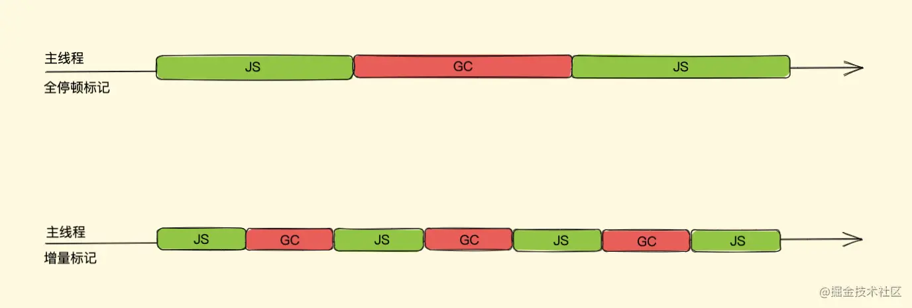
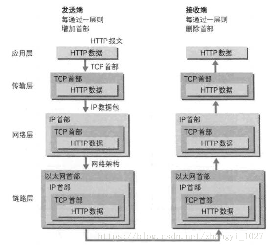

* [html总结](#html总结)
  * [一、src和href的区别](#一、src和href的区别)
  * [二、html语义化](#二、html语义化)
  * [三、浏览器的怪异模式和标准模式](#三、浏览器的怪异模式和标准模式)
  * [四、script标签中defer和async的区别](#四、script标签中defer和async的区别)
  * [五、html5有哪些更新](#五、html5有哪些更新)
  * [六、块级元素和行内元素的区别](#六、块级元素和行内元素的区别)
  * [七、webworker](#七、webworker)
  * [八、HTML5离线缓存](#八、HTML5离线缓存)
  * [九、Canvas和SVG的区别](#九、Canvas和SVG的区别)
  

* [js总结](#js总结)
  * [一、js事件流](#一、js事件流)
  * [二、token、cookie、session](#二、token、cookie、session)
  * [三、深入理解函数执行上下文](#三、深入理解函数执行上下文)
  * [四、闭包](#四、闭包)
  * [五、js函数的参数按值传递](#五、js函数的参数按值传递)
  * [六、JavaScript是如何运行起来的？解释型语言和编译型语言的差异是什么？](#六、JavaScript是如何运行起来的？解释型语言和编译型语言的差异是什么？)
  * [七、ASI自动分号插入机制](#七、ASI自动分号插入机制)
  * [八、V8如何存储js对象](#八、V8如何存储js对象)
  * [九、垃圾回收机制](#九、垃圾回收机制)
  * [十、V8引擎对垃圾回收的优化](#十、V8引擎对垃圾回收的优化)
  * [十一、浏览器和node事件循环的区别](#十一、浏览器和node事件循环的区别)
  * [十二、观察者模式和发布订阅模式](#十二、观察者模式和发布订阅模式)
  * [十三、判断js的数据类型的方法](#十三、判断js的数据类型的方法)
  * [十四、js数据类型转换](#十四、js数据类型转换)
  * [十五、深拷贝与浅拷贝](#十五、深拷贝与浅拷贝)
  * [十六、跨域的几种方式](#十六、跨域的几种方式)
  * [十七、jsonp的安全问题](#十七、jsonp的安全问题)
  * [十八、内部属性Class是什么？](#十八、内部属性[[Class]]是什么？)
  * [十九、面向对象编程](#十九、面向对象编程)
  * [二十、js继承](#二十、js继承)
  * [二十一、localStorage,sessionStorage,session,cookie](#二十一、localStorage,sessionStorage,session,cookie)
  * [二十二、localStorage设置过期时间](#二十二、localStorage设置过期时间)
  * [二十三、浏览器渲染机制](#二十三、浏览器渲染机制)
  
* [css总结](#css总结)
  * [一、BFC（块级格式化上下文）](#一、BFC（块级格式化上下文）)
  * [二、清除浮动](#二、清除浮动)
  * [三、css3动画](#三、css3动画)
  * [四、box-sizing](#四、box-sizing)
  * [五、min/max-width/height](#五、min/max-width/height)
  * [六、css选择器](#六、css选择器)
  * [七、css选择器权重的计算以及性能优化](#七、css选择器权重的计算以及性能优化)
  * [八、css可继承属性和不可继承属性](#八、css可继承属性和不可继承属性)
  * [九、隐藏元素的方法](#九、隐藏元素的方法)
  * [十、引入css样式的方式以及优先级](#十、引入css样式的方式以及优先级)
  * [十一、requestAnimationframe动画](#十一、requestAnimationframe动画)
  * [十二、盒模型](#十二、盒模型)
  * [十三、css3新特性](#十三、css3新特性)
  * [十四、替换元素的概念及计算规则](#十四、替换元素的概念及计算规则)
  * [十五、常见的图片格式及使用场景](#十五、常见的图片格式及使用场景)
  * [十六、雪碧图](#十六、雪碧图)
  * [十七、对line-height的理解及其赋值方式](#十七、对line-height的理解及其赋值方式)
  * [十八、CSS优化和提高性能的方法有哪些？](#十八、CSS优化和提高性能的方法有哪些？)
  * [十九、单行、多行文本溢出隐藏](#十九、单行、多行文本溢出隐藏)
  * [二十、对CSS工程化的理解](#二十、对CSS工程化的理解)
  * [二十一、z-index属性在什么情况下会失效](#二十一、z-index属性在什么情况下会失效)
  * [二十二、css单位](#二十二、css单位)
  * [二十三、flex布局](#二十三、flex布局)
  * [二十四、flex1详解](#二十四、flex1详解)
  * [二十五、两栏布局](#二十五、两栏布局)
  * [二十六、三栏布局](#二十六、三栏布局)
  * [二十七、水平垂直居中](#二十七、水平垂直居中)
  * [二十八、移动端适配](#二十八、移动端适配)
  * [二十九、清除浮动](#二十九、清除浮动)
  * [三十、margin塌陷和重叠](#三十、margin塌陷和重叠)
  * [三十一、元素的层叠顺序](#三十一、元素的层叠顺序)
  * [三十二、position](#三十二、position)
  * [三十三、移动端点透现象](#三十三、移动端点透现象)
  * [三十四、伪类和伪元素](#三十四、伪类和伪元素)
  * [三十五、用css绘制一个三角形原理](#三十五、用css绘制一个三角形原理)
  * [三十六、品字布局](#三十六、品字布局)
  * [三十七、多列等高布局](#三十七、多列等高布局)
  * [三十八、什么是包含块？](#三十八、什么是包含块？)
  * [三十九、css的visibility属性的collapse值](#三十九、css的visibility属性的collapse值)
  * [四十、width是auto和width是100%的区别](#四十、width是auto和width是100%的区别)
  * [四十一、图片base64编码的优点和缺点](#四十一、图片base64编码的优点和缺点)
  * [四十二、'display'、'position'和'float'的相互关系？](#四十二、'display'、'position'和'float'的相互关系？)
  * [四十三、margin重叠](#四十三、margin重叠)
  * [四十四、IFC是什么？](#四十四、IFC是什么？)
  * [四十五、zoom和transform的scale](#四十五、zoom和transform的scale)
  * [四十六、浏览器是怎样解析CSS选择器的？](#四十六、浏览器是怎样解析CSS选择器的？)
  * [四十七、在网页中应该使用奇数还是偶数的字体？为什么呢？](#四十七、在网页中应该使用奇数还是偶数的字体？为什么呢？)
  * [四十八、margin和padding分别适合什么场景使用？](#四十八、margin和padding分别适合什么场景使用？)
  * [四十九、抽离样式模块怎么写？](#四十九、抽离样式模块怎么写？)
  * [五十、简单说一下css3的all属性](#五十、简单说一下css3的all属性)
  * [五十一、hasLayout](#五十一、hasLayout)
  * [五十二、清除浮动](#五十二、清除浮动)


* [vue总结](#vue总结)
  * [一、MVVM](#一、MVVM)
  * [二、vue双向绑定原理](#二、vue双向绑定原理)
  * [三、vue双向绑定原理再理解](#三、vue双向绑定原理再理解)
  * [四、diff算法](#四、diff算法)
  * [五、vue的nextTick](#五、vue的nextTick)
  * [六、vue2.0为什么不能检查数组变化](#六、vue2.0为什么不能检查数组变化)
  * [七、computed原理](#七、computed原理)
  * [八、watch实现原理](#八、watch实现原理)
  * [九、vue生命周期](#九、vue生命周期)
  * [十、vuex](#十、vuex)
  * [十一、vue组件之间传值](#十一、vue组件之间传值)
  * [十二、vue中央事件总线EventBus](#十二、vue中央事件总线EventBus)
  * [十三、v-if和v-show的区别](#十三、v-if和v-show的区别)
  * [十四、单页面应用和多页面应用](#十四、单页面应用和多页面应用)
  * [十五、前端路由](#十五、前端路由)
  * [十六、](#十六、)


* [网络总结](#网络总结)
  * [一、http请求和响应](#一、http请求和响应)
  * [二、http的请求方法](#二、http的请求方法)
  * [三、http常用状态码](#三、http常用状态码)
  * [四、DNS](#四、DNS)
  * [五、浏览器的HTTP缓存机制](#五、浏览器的HTTP缓存机制)
  * [六、http](#六、http)
  * [七、http1.0,http1.1,http2.0](#七、http1.0,http1.1,http2.0)
  * [八、https](#八、https)
  * [九、三次握手和四次挥手](#九、三次握手和四次挥手)
  * [十、OSI分层](#十、OSI分层)
  * [十一、UDP协议与TCP协议的区别](#十一、UDP协议与TCP协议的区别)
  * [十二、XSS](#十二、XSS)
  * [十三、CSRF](#十三、CSRF)
  * [十四、DOS和DDOS](#十四、DOS和DDOS)
  * [十五、DNS劫持和HTTP劫持](#十五、DNS劫持和HTTP劫持)
  * [十六、SQL注入](#十六、SQL注入)
  * [十七、URL的组成](#十七、URL的组成)
  * [十八、线程和进程的区别](#十八、线程和进程的区别)
  * [十九、CPU&内存&硬盘](#十九、CPU&内存&硬盘)
  * [二十、域名](#二十、域名)
  
  


* [es6总结](#es6总结)
  * [一、promise](#一、promise)
  * [二、promise实现原理](#二、promise实现原理)
  * [三、async/await](#三、async/await)
  * [四、try...catch...](#四、try...catch...)
  * [五、Object&Map&WeakMap&Set&WeakSet](#五、Object&Map&WeakMap&Set&WeakSet)
  * [六、AMD、CMD、CommonJS、ESM](#六、AMD、CMD、CommonJS、ESM)
  * [七、es6新特性](#七、es6新特性)
  * [八、rest参数和扩展运算符](#八、rest参数和扩展运算符)
  * [九、Generator函数](#九、Generator函数)
  * [十、iterator](#十、iterator)
  * [十一、数组的扩展](#十一、数组的扩展)
  * [十二、对象新增方法](#十二、对象新增方法)

* [手写代码](#手写代码)
  * [一、数组去重](#一、数组去重)
  * [二、实现一个flatten](#二、实现一个flatten)
  * [三、防抖](#三、防抖)
  * [四、节流](#四、节流)
  * [五、将虚拟dom转为真正的dom](#五、将虚拟dom转为真正的dom)
  * [六、深拷贝](#六、深拷贝)
  * [七、实现apply](#七、实现apply)
  * [八、实现call](#八、实现call)
  * [九、实现bind](#九、实现bind)
  * [十、实现new](#十、实现new)
  * [十一、实现instanceof](#十一、实现instanceof)
  * [十二、实现const](#十二、实现const)
  * [十三、发布订阅模式](#十三、发布订阅模式)
  * [十四、模板引擎](#十四、模板引擎)
  * [十五、vue双向绑定](#十五、vue双向绑定)
  * [十六、实现promise](#十六、实现promise)
  * [十七、实现promise.All](#十七、实现promise.All)
  * [十八、实现promise.race](#十八、实现promise.race)
  * [十九、实现promise.any](#十九、实现promise.any)
  * [二十、实现promise.allSettled](#二十、实现promise.allSettled)
  * [二十一、实现promise.resolve](#二十一、实现promise.resolve)
  * [二十二、实现promise.reject](#二十二、实现promise.reject)
  * [二十三、图片懒加载](#二十三、图片懒加载)
  * [二十四、ajax+promise模仿fetch](#二十四、ajax+promise模仿fetch)
  * [二十五、实现hash模式路由](#二十五、实现hash模式路由)
  * [二十六、](#二十六、)


* [node总结](#node总结)


<h1 id='html总结'>html总结<h1>

<h3 id='一、src和href的区别'>一、src和href的区别</h3>

#### 一、区别 ####

- src和href都是用来引用外部的资源，它们的区别如下：

   - src： (Source)是指向物件的来源地址，是**引入**，在 img、script、iframe 等元素上使用；表示对资源的引用，它指向的内容会嵌入到当前标签所在的位置。src会将其指向的资源下载并应⽤到⽂档内，如请求js脚本。当浏览器解析到该元素时，会暂停其他资源的下载和处理，直到将该资源加载、编译、执⾏完毕，所以⼀般js脚本会放在页面底部。
   - href： 表示超文本**引用**，它指向一些网络资源，建立和当前元素或本文档的链接关系。当浏览器识别到它他指向的⽂件时，就会并⾏下载资源，不会停⽌对当前⽂档的处理。 常用在a、link等标签上。
   - src通常用作“拿取”（引入），href 用作 "连结前往"（引用）。

<h3 id='二、html语义化'>二、html语义化</h3>

#### 一、理解 ####

- 通俗的来讲就是从代码上来展示页面的结构，而不是从最终视觉上来展示结构。单纯的HTML代码是不带任何样式的只是用来标记这一段是标题、这一块是代码、那一个是要强调的内容等等，但是为什么我们只写HTML在浏览器中不同的标签也是有不同的样式呢？那是因为各个浏览器都自带的有相应标签的默认样式，为了方便在没有设定样式的情况下友好的展示页面。良好的语义化代码可以直接从代码上就能看出来那一块到底是要表达什么内容。

#### 二、为什么要使用HTML语义化标签 ####

- 为什么要使用语义化标签？我用DIV+CSS也能做出来一样的效果，确实单纯看效果两者并没有什么区别，但是页面不止是给人看的，机器也要看爬虫也要看。
- 随着 Web 规模的不断扩大，信息量之大已经不在人肉处理的范围之内了。这个时候人们开始用机器来处理 Web 上发布的各种内容，搜索引擎就诞生了。再后来，人们又设计了各种智能程序来对索引好的内容作各种处理和挖掘。所以让机器能够更好地读懂 Web 上发布的各种内容就变得越来越重要。机器也要借助 HTML 提供的语义以及自然语言处理的手段来「读懂」它们从网上获取的 HTML 文档，

#### 三、优点 ####

- 网页加载慢导致CSS文件还未加载时（没有CSS），页面仍然清晰、可读、好看。
- 提升用户体验，例如title、alt可用于解释名词或解释图片信息。
- 有利于SEO：和搜索引擎建立良好沟通，有助于爬虫抓取更多的有效信息。简单来说，试想在H1标签中匹配到的关键词和在div中匹配到的关键词搜索引擎会吧那个结果放在前面。
- 方便其他设备（如屏幕阅读器、盲人阅读器、移动设备）更好的解析页面。
- 使代码更具可读性，便于团队开发和维护。

#### 三、写语义化代码应该注意什么 ####

- 尽可能少的使用无语义的标签div和span；在语义不明显时，既可以使用div或者p时，尽量用p, 因为p在默认情况下有上下间距，对兼容特殊终端有利；
- 不要使用纯样式标签，如：b、font、u等，改用css设置。需要强调的文本，可以包含在strong或者em标签中（浏览器预设样式，能用CSS指定就不用他们），strong默认样式是加粗（不要用b），em是斜体（不用i）；
- 使用表格时，标题要用caption，表头用thead，主体部分用tbody包围，尾部用tfoot包围。表头和一般单元格要区分开，表头用th，单元格用td；
- 表单域要用fieldset标签包起来，并用legend标签说明表单的用途；每个input标签对应的说明文本都需要使用label标签，并且通过为input设置id属性，在lable标签中设置for=someld来让说明文本和相对应的input关联起来。


#### 四、常见的语义化标签 ####

- h1~h6 ，作为标题使用，并且依据重要性递减，h1 是最高的等级。
- p段落标记，知道了p作为段落，你就不会再使用 br 来换行了，而且不需要 br 来区分段落与段落。p 中的文字会自动换行，而且换行的效果优于 br 。段落与段落之间的空隙也可以利用 CSS 来控制，很容易而且清晰的区分出段落与段落。
- ul、ol、li，ul 无序列表，这个被大家广泛的使用，ol 有序列表不常用。在 Web 标准化过程中，ul 还被更多的用于导航条，本来导航条就是个列表，这样做是完全正确的，而且当你的浏览器不支持 CSS 的时候，导航链接仍然很好使，只是美观方面差了一点而已。
- dl、dt、dd，dl 就是“定义列表”。比如说词典里面的词的解释、定义就可以用这种列表。**dl不单独使用，它通常与dt和dd一起使用。dl开启一个定义列表，dt表示要定义的项目名称，dd表示对dt的项目的描述。**
- em、strong，em 是用作强调，strong 是用作重点强调。
- table、thead、tbody、td、th、caption， 就是用来做表格不要用来布局

#### 五、HTML5新增的那些 ####

- header元素：header 元素代表“网页”或“section”的页眉。
- footer元素：footer元素代表“网页”或“section”的页脚，通常含有该节的一些基本信息，譬如：作者，相关文档链接，版权资料。
- hgroup元素：
- nav元素：nav元素代表页面的导航链接区域。用于定义页面的主要导航部分。
- aside元素：aside元素被包含在article元素中作为主要内容的附属信息部分，其中的内容可以是与当前文章有关的相关资料、标签、名次解释等。（特殊的section）
- section元素：section元素代表文档中的“节”或“段”，“段”可以是指一篇文章里按照主题的分段；“节”可以是指一个页面里的分组。section通常还带标题，虽然html5中section会自动给标题h1-h6降级，但是最好手动给他们降级。
- article元素：article元素最容易跟section和div容易混淆，其实article代表一个在文档，页面或者网站中自成一体的内容，其目的是为了让开发者独立开发或重用。譬如论坛的帖子，博客上的文章，一篇用户的评论，一个互动的widget小工具。（特殊的section）除了它的内容，article会有一个标题（通常会在header里），会有一个footer页脚。

<h3 id='三、浏览器的怪异模式和标准模式'>三、浏览器的怪异模式和标准模式</h3>

#### 一、出现原因 ####

   - 由于历史原因，各个浏览器在对页面的渲染上存在差异，甚至同一浏览器在不同的版本中，对页面的渲染也会产生差异。
   - 在W3C标准出现之前，浏览器对页面的渲染没有统一的规范，产生了差异；由于W3C标准的推出，浏览器渲染页面有了统一的标准。
   - W3C标准推出之后，浏览器都开始采纳新标准，但存在一个问题就是旧的网页还能继续浏览，在标准出来之前，很多页面都是根据旧的渲染方法编写的，如果用新标准来渲染将会导致页面显示异常。所以为了保证浏览器的兼容性，使以前的页面能够正常浏览，浏览器都保留了旧的渲染方法，这样浏览器渲染上就产生了Quircks mode（怪异模式或兼容模式）和Standars mode（标准模式或严格模式），两种渲染方法共存在一个浏览器上。
   
#### 二、如何决定使用哪一种渲染模式呢？####

- 在知道这个问题的答案之前我们先了解一些知识

  1. HTML-超文本标记语言

     - （1）超文本

         - 什么使文本文件：就是只有文本内容，不包含格式。例如

            - 在记事本中输入“带你出师、闯荡江湖！”，并设置相应的格式，但是在其它电脑上打开并没有显示同样的格式，说明其不包含任何格式信息。

         - 超文本：不仅仅能表示文本信息，还能表示音视频、格式等等信息。和普通文本相比，超文本文件中多了一些对文件内容的注释，这些注释表明了当前文字显示的位置、颜色等信息，更重要的是，在有些注释中包含了对用户计算机应做出何种反应的说明，这些注释的内容经过浏览器的翻译后就成了不同的操作。

           - 在word中输入同样的内容，同时设置格式，在另一个电脑上看到的是同样的内容和同样的格式。说明word文档中除了存储内容，还存储了格式等信息（document.xml,）ml就是标记语言（Markup Language）的缩写。

    - （2）标记语言

         - 标记语言注释文本的语言，以便计算机可以操作文本。例如

            - <p>我是一个段落</p>，这个例子由一个开始标记（<p>），一个结束标记（</p>）和一个将在屏幕上显示的的实际文本组成。这个标记就告诉了该段文字是一个段落。

  2. SGML

     - SGML是标准通用标记语言，它是一个用于定义标记语言的系统，它的组成包括语法定义，DTD，文件实例三部分。每一个使用SGML定义的标记语言都被称为SGML应用。
             

  3. XML,HTML,XHTML之间的区别

    - （1）XML是可扩展标记语言，它是基于SGML的，XML被设计用来存储和传输数据，它没有被预定义，需要自己定义标签，标签具有自我描述性。
    - （2）HTML是超文本标记语言，它也是基于SGML的，HTML被设计是用来显示数据的，它是被定义好的，不能自己定义标签
    - （3）XHTML是可扩展超文本标记语言，它是基于XML的，本质上说，XHTML是一个过渡技术，结合了部分XML的强大功能及大多数HTML的简单特性。建立XHTML的目的就是实现HTML向XML的过渡。

        - XHTML 出现的原因是：HTML 是一种语法形式比较松散的标记语言，语法要求也不严格。比如大小可以混用，属性值随便你加不加引号，单引号还是双引号也随便你，标签也可以不闭合。HTML 标准的制定者 W3C 一看这样下去不行，所谓无规矩不成方圆，所以就把 XML 的语法形式往 HTML 上一套，出现了 XHTML，所以你也可以把 XHTML 理解为 HTML 的严格语法形式，除此之外，其它方面基本一样

  4. HTML5

     - 现在说的HTML一般指HTML4.01，而HTML5是HTML的第五个修订版，HTML5本身并非技术而是标准， 它所使用的技术早已很成熟，国内通常所说的html5实际上是html与css3及JavaScript和api等的一个组合，大概可以用以下公式说明：HTML5≈HTML+CSS3+JavaScript+API
     - 如今的HTML5标准制定了两种实现语法HTML和XHTML。HTML不再基于任何特定的标记语言系统，它有自己完整的标准。而XHTML是XML的一个应用。

  5. DTD和DOCTYPE

    - （1）DTD为英文Document Type Definition,中文意思为“文档类型定义”，它规定了XML或html文件结构，为XML或html文件提供了语法和规则。在DTD中定义XML或html文件的结构，然后按照DTD的声明来编写XML或html文件。它就好像编程语言中的函数定义，在使用函数时要根据函数声明的格式进行来引用。
    - （2）DOCTYPE标签是一种标准通用标记语言的文档类型声明，声明文档的解析类型，它的目的是要告诉标准通用标记语言解析器，它应该使用什么样的DTD（用什么样的文档标准）来解析文档。该标签可声明三种DTD类型，分别表示严格版本、过渡版本以及基于框架的HTML版本。

      - HTML4.01中<!DOCTYPE>的用法：

		<!DOCTYPE html PUBLIC "-//W3C//DTD XHTML 1.0 Strict//EN" "http://www.w3.org/TR/xhtml1/DTD/xhtml1-strict.dtd">

		解析：在上面的声明中，声明了文档的根元素是 html，它在公共标识符被定义为 "-//W3C//DTD XHTML 1.0 Strict//EN" 的 DTD 中进行了定义。浏览器将明白如何寻找匹配此公共标识符的 DTD。如果找不到，浏览器将使用公共标识符后面的 URL 作为寻找 DTD 的位置。

    - （3）HTML 4.01 规定了三种文档类型：Strict、Transitional 以及 Frameset。

       - 如果需要干净的标记，免于表现层的混乱，用HTML Strict DTD类型：
	
	      <!DOCTYPE HTML PUBLIC "-//W3C//DTD HTML 4.01//EN" " http://www.w3.org/TR/html4/strict.dtd">
	
       - Transitional DTD 可包含 W3C 所期望移入样式表的呈现属性和元素. 如果用户使用了不支持层叠样式表（CSS）的浏览器以至于你不得不使用 HTML 的呈现特性时，用TransitionalDTD 类型：
	
	     <!DOCTYPE HTML PUBLIC "-//W3C//DTD HTML 4.01 Transitional//EN" " http://www.w3.org/TR/html4/loose.dtd">
	
       - Frameset DTD 被用于带有框架的文档。除 frameset 元素取代了 body 元素之外，Frameset DTD 等同于 Transitional DTD：
	
	     <!DOCTYPE HTML PUBLIC "-//W3C//DTD HTML 4.01 Frameset//EN" " http://www.w3.org/TR/html4/frameset.dtd">

    - （4）XHTML 1.0 规定了三种 XML 文档类型：Strict、Transitional 以及 Frameset。

       - 如果需要干净的标记，免于表现层的混乱，用XHTML Strict DTD类型：

         <!DOCTYPE html PUBLIC "-//W3C//DTD XHTML 1.0 Strict//EN" "http://www.w3.org/TR/xhtml1/DTD/xhtml1-strict.dtd">

       - Transitional DTD 可包含 W3C 所期望移入样式表的呈现属性和元素. 如果用户使用了不支持层叠样式表（CSS）的浏览器以至于你不得不使用 HTML 的呈现特性时，用     Transitional DTD 类型：

         <!DOCTYPE html PUBLIC "-//W3C//DTD XHTML 1.0 Transitional//EN" "http://www.w3.org/TR/xhtml1/DTD/xhtml1-transitional.dtd">

       - Frameset DTD 被用于带有框架的文档。除 frameset 元素取代了 body 元素之外，Frameset DTD 等同于 Transitional DTD：

         <!DOCTYPE html PUBLIC "-//W3C//DTD XHTML 1.0 Frameset//EN" "http://www.w3.org/TR/xhtml1/DTD/xhtml1-frameset.dtd">

    - （5）HTML5的文档类型声明

         <!DOCTYPE HTML>

    - （6）HTML5为什么只需要写 <!DOCTYPE HTML>？

       - <!DOCTYPE> 声明不是一个 HTML 标签，它是用来告知 Web 浏览器页面使用了哪种 HTML 版本，<!DOCTYPE html>这个的意思就是告诉浏览器页面是html，并且使用html5最新规范来处理。HTML5 不是基于 SGML的，因此不需要对DTD进行引用，但是仍然需要doctype来规范浏览器的行为，至于不声明DOCTYPE的后果，就是某些css的处理方式是根据浏览器喜好定的，不是根据标准走的，这样同一份代码在不同浏览器可能产生不同效果，所以写之前必须声明！而HTML4.01基于SGML,所以需要对DTD进行引用，才能告知浏览器文档所使用的文档类型

   
   - 所以回答前边的问题，声明了文档类型就是标准模式，不声明文档类型就是怪异模式。

#### 三、标准模式和怪异模式的区别 ####

 1. 盒模型不同

    - 标准盒模型：width = content的width,height = content的height
    - IE盒模型：width = content的width + padding + border，height = content的height + padding + border

 2. 可以设置行内元素的高宽

    - 在标准模式下，给span等行内元素设置wdith和height都不会生效，而在怪异模式下，则会生效。
    
 3. 可设置百分比的高度
        
    - 在标准模式下，一个元素的高度是由其包含的内容来决定的，如果父元素没有设置高度，子元素设置一个百分比的高度是无效的。
    
 4. 用margin:0 auto设置水平居中在IE下会失效
        
    - 使用margin:0 auto在标准模式下可以使元素水平居中，但在怪异模式下却会失效, 怪异模式下的解决办法，用text一align属性:body{text一align:center};#content{text一align:left}
    
 5. 怪异模式下设置图片的padding会失效
    
 6. 怪异模式下Table中的字体属性不能继承上层的设置
    
 7. 怪异模式下white一space:pre会失效


<h3 id='四、script标签中defer和async的区别'>四、script标签中defer和async的区别</h3>

#### 一、问题引入 ####

- 在 HTML 中会遇到以下三类 script：

		<script src='xxx'></script>
		<script src='xxx' async></script>
		<script src='xxx' defer></script>

- async 和 defer 他们对于内联脚本无作用（即没有 src 属性的脚本）
- 那么这三类 script 有什么区别呢？

#### 二、script ####

- 浏览器在解析 HTML 的时候，如果遇到一个没有任何属性的 script 标签，就会暂停解析，先发送网络请求获取该 JS 脚本的代码内容，然后让 JS 引擎执行该代码，当代码执行完毕后恢复解析。所以，script 阻塞了浏览器对 HTML 的解析，如果获取 JS 脚本的网络请求迟迟得不到响应，或者 JS 脚本执行时间过长，都会导致白屏，用户看不到页面内容。

#### 三、async script ####

- async 表示异步，当浏览器遇到带有 async 属性的 script 时，请求该脚本的网络请求是异步的，不会阻塞浏览器解析 HTML，一旦网络请求回来之后，如果此时 HTML 还没有解析完，浏览器会暂停解析，先让 JS 引擎执行代码，执行完毕后再进行解析。当然，如果在 JS 脚本请求回来之前，HTML 已经解析完毕了，那就啥事没有，立即执行 JS 代码，所以 async 是不可控的，因为执行时间不确定，你如果在异步 JS 脚本中获取某个 DOM 元素，有可能获取到也有可能获取不到。而且如果存在多个 async 的时候，它们之间的执行顺序也不确定，完全依赖于网络传输结果，谁先到执行谁。

#### 四、defer script ####

- defer 表示延迟，当浏览器遇到带有 defer 属性的 script 时，获取该脚本的网络请求也是异步的，不会阻塞浏览器解析 HTML，一旦网络请求回来之后，如果此时 HTML 还没有解析完，浏览器不会暂停解析并执行 JS 代码，而是等待 HTML 解析完毕再执行 JS 代码，如果存在多个 defer script 标签，浏览器（IE9及以下除外）会保证它们按照在 HTML 中出现的顺序执行，不会破坏 JS 脚本之间的依赖关系。

#### 五、总结 ####

- 最后，根据上面的分析，不同类型 script 的执行顺序及其是否阻塞解析 HTML 总结如下：

  - script：

    - js执行顺序：在HTML中的标签顺序
    - 是否阻塞解析HTML：阻塞

  - async script：

    - js执行顺序：网络请求返回顺序
    - 是否阻塞解析HTML：可能阻塞，也可能不阻塞

  - defer script：

    - js执行顺序：在HTML中的标签顺序
    - 是否阻塞解析HTML：不阻塞

<h3 id='五、html5有哪些更新'>五、html5有哪些更新</h3>

#### 一、语义化标签 ####

- header：定义文档的页眉（头部）；
- nav：定义导航链接的部分；
- footer：定义文档或节的页脚（底部）；
- article：定义文章内容；
- section：定义文档中的节（section、区段）；
- aside：定义其所处内容之外的内容（侧边）；

#### 二、媒体标签 ####

1. audio：音频

	<audio src='' controls autoplay loop='true'></audio>

  - 属性：

	- controls 控制面板
	- autoplay 自动播放
	- loop=‘true’ 循环播放

2. video视频

	<video src='' poster='imgs/aa.jpg' controls></video>

   - 属性：

     - poster：指定视频还没有完全下载完毕，或者用户还没有点击播放前显示的封面。默认显示当前视频文件的第一针画面，当然通过poster也可以自己指定。
     - controls 控制面板
     - width
     - height

3. source标签

   - 因为浏览器对视频格式支持程度不一样，为了能够兼容不同的浏览器，可以通过source来指定视频源。

	<video>
	 	<source src='aa.flv' type='video/flv'></source>
	 	<source src='aa.mp4' type='video/mp4'></source>
	</video>

#### 三、表单 ####

1. 表单类型：

- email ：能够验证当前输入的邮箱地址是否合法
- url ： 验证URL
- number ： 只能输入数字，其他输入不了，而且自带上下增大减小箭头，max属性可以设置为最大值，min可以设置为最小值，value为默认值。
- search ： 输入框后面会给提供一个小叉，可以删除输入的内容，更加人性化。
- range ： 可以提供给一个范围，其中可以设置max和min以及value，其中value属性可以设置为默认值
- color ： 提供了一个颜色拾取器
- time ： 时分秒
- data ： 日期选择年月日
- datatime ： 时间和日期(目前只有Safari支持)
- datatime-local ：日期时间控件
- week ：周控件
- month：月控件

2. 表单属性：

- placeholder ：提示信息
- autofocus ：自动获取焦点
- autocomplete=“on” 或者 autocomplete=“off” 使用这个属性需要有两个前提：

  - 表单必须提交过
  - 必须有name属性。

- required：要求输入框不能为空，必须有值才能够提交。
- pattern=" " 里面写入想要的正则模式，例如手机号patte="^(+86)?\d{10}$"
- multiple：可以选择多个文件或者多个邮箱
- form=" form表单的ID"

3. 表单事件：

- oninput 每当input里的输入框内容发生变化都会触发此事件。
- oninvalid 当验证不通过时触发此事件。

#### 四、进度条、度量器 ####

- progress标签：用来表示任务的进度（IE、Safari不支持），max用来表示任务的进度，value表示已完成多少
- meter属性：用来显示剩余容量或剩余库存（IE、Safari不支持）

  - high/low：规定被视作高/低的范围
  - max/min：规定最大/小值
  - value：规定当前度量值
  - 设置规则：min < low < high < max

#### 五、DOM查询操作 ####

- document.querySelector()
- document.querySelectorAll()
  
  - 它们选择的对象可以是标签，可以是类(需要加点)，可以是ID(需要加#)

#### 六、Web存储 ####

- HTML5 提供了两种在客户端存储数据的新方法：

  - localStorage - 没有时间限制的数据存储
  - sessionStorage - 针对一个 session 的数据存储

#### 七、其他 ####

- 拖放：拖放是一种常见的特性，即抓取对象以后拖到另一个位置。设置元素可拖放：

	

- 画布（canvas ）： canvas 元素使用 JavaScript 在网页上绘制图像。画布是一个矩形区域，可以控制其每一像素。canvas 拥有多种绘制路径、矩形、圆形、字符以及添加图像的方法。

	<canvas id="myCanvas" width="200" height="100"></canvas>

- SVG：SVG 指可伸缩矢量图形，用于定义用于网络的基于矢量的图形，使用 XML 格式定义图形，图像在放大或改变尺寸的情况下其图形质量不会有损失，它是万维网联盟的标准
- 地理定位：Geolocation（地理定位）用于定位用户的位置。

#### 八、总结： ####

- 新增语义化标签：nav、header、footer、aside、section、article
- 音频、视频标签：audio、video
- 数据存储：localStorage、sessionStorage
- canvas（画布）、Geolocation（地理定位）、websocket（通信协议）
- input标签新增属性：placeholder、autocomplete、autofocus、required
- history API：go、forward、back、pushstate

- 移除的元素有：

  - 纯表现的元素：basefont，big，center，font, s，strike，tt，u;
  - 对可用性产生负面影响的元素：frame，frameset，noframes；


<h3 id='六、块级元素和行内元素的区别'>六、块级元素和行内元素的区别</h3>

#### 一、行内元素与块级元素的区别 ####

1. 块级元素

   * 总是从新行开始，独占一行
   * 高度，宽度，内边距，外边距都可控制
   * 如果没有设置宽度，默认为父元素的100%
   * 它可以容纳行内元素和其他块级元素

2. 行内元素

   * 和其他元素都在一行上
   * 宽度就是它的文字或图片的宽度，不可改变
   * height无效(可以设置inline-height)，margin上下无效，padding上下无效
   * 内联元素只能容纳文本或者其他内联元素

#### 二、相互转换 ####

* display:inline
* display:block

#### 三、inline-block ####

* img、video、input、textarea、button

* inline-block 的元素（如input、img)既具有 block 元素可以设置宽高的特性，同时又具有 inline 元素默认不换行的特性。当然不仅仅是这些特性，比如 inline-block 元素也可以设置 vertical-align（因为这个垂直对齐属性只对设置了inline-block的元素有效） 属性。

#### 四、内联元素之间有时候会有空白间隔是为什么？

- 浏览器会把inline或inline-block内联元素间的换行符、空格符、制表符等合并为空白符，字体大小不为 0 的情况下，空白符自然占据一定的宽度，使用元素间会产生空隙

		  比如：<span>lalla</span>
		       <span>lllll</span>

  - 浏览器显示出来会有空格
  
          比如：<span>lalla</span><span>lllll</span>

  - 这样写就没有空格了


- 消除空隙

   - (1)全写在一行
	
			<div class="space">
			    <a href="##">惆怅</a><a href="##">淡定</a><a href="##">热血</a>
			</div>

   - (2)margin负边距

			如：.space a {
				    display: inline-block;
				    margin-right: -3px;
				}

     - margin负值的大小与上下文的字体和文字大小相关


  - (3)font-size:0

	      .space{
	            font-size:0;
	        }
	
		 .space a {
	            display: inline-block;
	            padding: .5em 1em;
	            background-color: #cad5eb;
	            font-size: 12px;
	        }

       
  - (4)letter-spacing(字符间距)
     - 可以用来控制字符之间的间距，这里说的“字符”包括英文字母、汉字以及空格等。
	
			.space a {
	            display: inline-block;
	            padding: .5em 1em;
	            background-color: #cad5eb;
	            font-size: 12px;
	        }
	
	        .space {
	            letter-spacing: -3px;
	        }
	        .space a {
	            letter-spacing: 0;
	        }

  - (5)word-spacing(单词间距)
  
     - letter-spacing作用于所有字符，但word-spacing仅作用于空格字符，即只用来增加空格的间隙宽度

			.space a {
			            display: inline-block;
			            padding: .5em 1em;
			            background-color: #cad5eb;
			            font-size: 12px;
			        }
			
			.space {
			    word-spacing: -6px;
			}

#### 五、空元素 ####

- 空元素，即没有内容的HTML元素。空元素是在开始标签中关闭的，也就是空元素没有闭合标签：
- 常见的有：br、hr、img、input、link、meta；
- 鲜见的有：area、base、col、colgroup、command、embed、keygen、param、source、track、wbr。

<h3 id='七、webworker'>七、webworker</h3>

#### 一、前言 ####

- 我们都知道JS是单线程的，所有任务在一个线程上，一次只能做一件事。虽然可以通过AJAX、定时器等可以实现"并行"，但还是没有改变JS单线程的本质，把一些复杂的运算放在页面上执行，还是会导致很卡，甚至卡死。
- 而HTML5标准中的Web Worker为JS创造多线程环境，允许主线程创建Worker线程并给它分配任务，而且在主线程执行任务的时候，worker线程可以同时在后台执行它的任务，互不干扰。这让我们可以将一些复杂运算、高频输入的响应处理、大文件分片上传等放在worker线程处理，最后再返回给主线程。很大程度上缓解了主线程UI渲染阻塞的问题，页面就会很流畅

#### 二、异步和webworker的区别是什么？ ####

- 异步主要是当主线程在进行处理的时候，遇到同步的就直接运行，如果遇到异步的就将异步的方法放到事件队列中，当主线程中所有的同步任务处理完成之后，再进行异步任务的处理，这也就是为什么会出现setTIme 0 设定了时间之后不是立即执行了。
- 他们的一个主要的区别是：异步任务实质上是在主线程上进行处理的，而webworker是创建了一个新的子线程进行处理。

#### 三、那么webWork所创建的这个线程的主要的功能是什么呢 ####

- 主要是负责处理一些数据的问题，比如请求数据，他并不可以对DOM进行操作，他和主线程所在的上下文并不一致，而且他只能够处理网络请求的文件

#### 四、使用限制 ####

1. 同源限制

- 分配给worker线程运行的脚本文件，必须与主线程的脚本文件同源。

2. 文件限制

- Worker 线程无法读取本地文件，即不能打开本机的文件系统（file://），它所加载的脚本，必须来自服务器。即使UI线程所属页面也是本地页面

3. DOM限制

- worker线程所在的全局对象，与主线程不一样，Worker 的全局对象WorkerGlobalScope，通过self或this引用,调用全局对象的属性和方法时可以省略全局对象。所以worker线程无法读取主线程所在网页的 DOM 对象，也无法使用document、window、parent这些对象。但是，Worker 线程可以使用navigator对象和location对象，不过只能只读不能改写；还可以使用XMLHttpRequest发送AJAX请求；还可以使用缓存。

4. 通信联系

- Worker 线程和主线程不在同一个上下文环境，它们不能直接通信，必须通过消息完成。

#### 五、基本用法 ####

1. 主线程

- 浏览器原生提供Worker()构造函数，用来供主线程生成 Worker 线程。

		var worker = new Worker(jsUrl, options)

- Worker()构造函数，可以接受两个参数。第一个参数是脚本的网址（必须遵守同源政策），该参数是必需的，且只能加载 JS 脚本，否则会报错。第二个参数是配置对象，该对象可选。它的一个作用就是指定 Worker 的名称，用来区分多个 Worker 线程。
	
		// 主线程
		var worker = new Worker('worker.js', { name : 'myWorker' });
		
		// Worker 线程
		self.name // myWorker

- Worker()构造函数的参数是一个脚本文件，该文件就是 Worker 线程所要执行的任务。由于 Worker 不能读取本地文件，所以这个脚本必须来自网络。如果下载没有成功（比如404错误），Worker 就会默默地失败。
- 然后，主线程调用worker.postMessage()方法，向 Worker 发消息。worker.postMessage()方法的参数，就是主线程传给 Worker 的数据。它可以是各种数据类型，包括二进制数据。

		worker.postMessage('这是发给worker线程的消息')

- 主线程通过worker.onmessage指定监听函数，接收子线程发回来的消息。通过 event.data 可以获取 Worker 子线程发过来的数据。

		worker.onmessage = function (event) {
		  doSomething(event.data);
		}
		function doSomething() {
		  ...
		}

- Worker 完成任务以后，主线程就可以把它关掉。

		worker.terminate()

2. Worker 线程

- Worker 线程内部需要有一个监听函数，监听message事件。通过 e.data 可以获取主线程发过来的数据。

		self.addEventListener('message', function (e) {
		  doSomething(e.data)
		}, false)
		function doSomething() {
		  ...
		}

- 上面代码中，self代表子线程自身，即子线程的全局对象。
- self.postMessage()方法用来向主线程发送消息。

		self.postMessage(...)

- Worker 也可以关闭自身

		self.close()

3.  Worker 加载脚本

- Worker 内部如果要加载其他脚本，有一个专门的方法importScripts()。

		importScripts('script1.js')

- 该方法可以同时加载多个脚本。

		importScripts('script1.js', 'script2.js');

    - 脚本的下载顺序是不固定的，但执行时会按照传入 importScripts() 中的文件名顺序进行，这个过程是同步的。直到所有脚本都下载并运行完毕， importScripts() 才会返回。

4. 错误处理

- 主线程可以监听 Worker 是否发生错误。如果发生错误，Worker 会触发主线程的error事件。Worker 内部也可以监听error事件。

		worker.addEventListener('error', function (event) {
		   console.log(
		    'ERROR: Line ', event.lineno, ' in ', event.filename, ': ', event.message
		  )
		});

#### 六、worker 线程直接写在主线程的页面里 ####

		const script = `onmessage = function (e) {
				        var data = e.data;
				        data.push('hello');
				        console.log('worker:', data); // worker: [1, 2, 3, "hello"]
				        postMessage(data);
                       }`;                                                                                                                                                                                                              
	                                                                                                                                                                                                                                      
		                                                                                                                                                                                                                                                                                                                                                                                                                                                                                            
		var blob = new Blob([myTask]);
		var myWorker = new Worker(window.URL.createObjectURL(blob));
		
		myWorker.onmessage = function (e) {
		    var data = e.data;
		    console.log('page:', data); // page: [1, 2, 3, "hello"]
		    console.log('arr:', arr); // arr: [1, 2, 3]
		};

		var arr = [1,2,3];
		myWorker.postMessage(arr);

- worker与其主页面之间的通信是通过onmessage事件和postMessage（）方法实现的。
- 在主页面与Worker之间传递的数据是通过拷贝（深拷贝），而不是共享来完成的。传递给worker对象会自动经过序列化，接下来在另一端还需要反序列化，所以worker不会共享同一个实例，最终的结果就是在每次通讯结束时生成了数据的一个副本。
- 也就是说，worker与其主页面之间只能单纯的传递数据，不能传递复杂的引用类型：如通过构造函数创建的对象等。并且，传递的数据也是经过拷贝生成的一个副本，在一端对数据进行修改不会影响另一端。 

#### 七、线程间转移二进制数据 ####

- 因为主线程与 worker 线程之间的通信是拷贝关系，当我们要传递一个巨大的二进制文件给 worker 线程处理时(worker 线程就是用来干这个的)，这时候使用拷贝的方式来传递数据，无疑会造成性能问题。
- 幸运的是，Web Worker 提供了一中转移数据的方式，允许主线程把二进制数据直接转移给子线程。这种方式比原先拷贝的方式，有巨大的性能提升。
- 一旦数据转移到其他线程，原先线程就无法再使用这些二进制数据了，这是为了防止出现多个线程同时修改数据的麻烦局面

		// 创建二进制数据
		var uInt8Array = new Uint8Array(1024*1024*32); // 32MB
		for (var i = 0; i < uInt8Array .length; ++i) {
		    uInt8Array[i] = i;
		}
		console.log(uInt8Array.length); // 传递前长度:33554432
		// 字符串形式创建worker线程
		var myTask = `
		    onmessage = function (e) {
		        var data = e.data;
		        console.log('worker:', data);
		    };
		`;
		
		var blob = new Blob([myTask]);
		var myWorker = new Worker(window.URL.createObjectURL(blob));
		
		// 使用这个格式(a,[a]) 来转移二进制数据
		myWorker.postMessage(uInt8Array.buffer, [uInt8Array.buffer]); // 发送数据、转移数据
		
		console.log(uInt8Array.length); // 传递后长度:0，原先线程内没有这个数据了


#### 八、多个worker线程 ####

- 在主线程内可以创建多个 worker 线程
- worker 线程内还可以新建 worker 线程，使用同源的脚本文件创建。
- 在 worker 线程内再新建 worker 线程就不能使用window.URL.createObjectURL(blob)，需要使用同源的脚本文件来创建新的 worker 线程，因为我们无法访问到window对象。

#### 九、共享Worker ####

- 上面介绍的worker是只能被生成它的父页面所调用，他是被一个主页面所独占的，这样的worker就叫做专用worker
- 除了专用worker，还有一种工作线程可以被多个主页面所调用，这种worker就叫做共享Worker。
- window提供shareWorker类来创建共享Worker

    // 传入的参数与专用worker一致
    const share = new ShareWorker(URL, options)
    
     //share返回一个port属性
     //share.port
     //share.port.start() 开放传输的端口
     //share.port.end() 关闭传输的端口
     //share.port.postMessage() 发送消息，必须先调用share.port.start方法

- 简单示例

  - UI主线程

		const worker = new SharedWorker('./worker.js')                                                                                                                                                                                             
		worker.port.addEventListener('message', e => {                                                                                                                                                                                             
		  console.log(e.data)                                                                                                                                                                                                                      
		}, false)                                                                                                                                                                                                                                  
		worker.port.start()  // 连接worker线程                                                                                                                                                                                                     
		worker.port.postMessage('hi')                                                                                                                                                                                                              
		                                                                                                                                                                                                                                              
		setTimeout(()=>{                                                                                                                                                                                                                           
		  worker.port.close() // 关闭连接                                                                                                                                                                                                          
		}, 10000)                                                                                                                                                                                                                                  
		

  - Shared Web Worker线程

		let conns = 0                                                                                                                                                                                                                              
		                                                                                                                                                                                                                                              
		// 当UI线程执行worker.port.start()时触发建立连接                                                                                                                                                                                           
		self.addEventListener('connect', e => {                                                                                                                                                                                                    
		  const port = e.ports[0]                                                                                                                                                                                                                  
		  conns+=1                                                                                                                                                                                                                                 
		                                                                                                                                                                                                                                              
		  port.addEventListener('message', e => {                                                                                                                                                                                                  
		    console.log(e.data)  // 注意console对象指向第一个创建Worker线程的UI线程的console对象。即如果A先创建Worker线程，那么后续B、C等UI线程执行worker.port.postMessage时回显信心依然会发送给A页面。                                            
		  })                                                                                                                                                                                                                                       
		                                                                                                                                                                                                                                              
		  // 建立双向连接，可相互通信                                                                                                                                                                                                              
		  port.start()                                                                                                                                                                                                                             
		  port.postMessage('hey')                                                                                                                                                                                                                  
		})                                             


#### 十、应用场景 ####

1. 使用专用线程进行数学运算

- Web Worker 最简单的应用就是用来做后台计算，而这种计算并不会中断前台用户的操作

2. 图像处理

- 通过使用从<canvas> 或者<video> 元素中获取的数据，可以把图像分割成几个不同的区域并且把它们推送给并行的不同 Workers 来做计算

3. 大量数据的检索

- 当需要在调用 ajax 后处理大量的数据，如果处理这些数据所需的时间长短非常重要，可以在 Web Worker 中来做这些，避免冻结 UI 线程。

4. 背景数据分析

- 由于在使用 Web Worker 的时候，我们有更多潜在的 CPU 可用时间，我们现在可以考虑一下 JavaScript 中的新应用场景。例如，我们可以想像在不影响 UI 体验的情况下实时处理用户输入。利用这样一种可能，我们可以想像一个像 Word（Office Web Apps 套装）一样的应用：当用户打字时后台在词典中进行查找，帮助用户自动纠错等等。


<h3 id='八、HTML5离线缓存'>八、HTML5离线缓存</h3>

#### 一、什么是离线缓存？ ####

- HTML5 引入离线缓存（Application Cache），这意味着 web 应用可进行缓存，并可在没有因特网连接时进行访问。

#### 二、优势 ####

- 离线浏览 - 用户可在应用离线时使用它们。
- 速度 - 已缓存资源加载得更快。
- 减少服务器负载 - 浏览器将只从服务器下载更新过或更改过的资源。

#### 三、应用场景 ####

- h5游戏及一些页面内容不经常会变动、相对较为固定的内容。

#### 四、原理 ####

- HTML5的离线存储是基于一个manifest文件(缓存清单文件，后缀为.appcache)的缓存机制(不是存储技术)，通过这个文件上的清单解析离线存储资源，这些资源就会像cookie一样被存储了下来。之后当网络在处于离线状态时，浏览器会通过被离线存储的数据进行页面展示。

#### 五、如何使用？ ####

- 目前html5 manifest也可以纯前端开发，不需要后端和服务器端的配合。
- html5 manifest纯前端开发是如何做的呢？之前的写法是

		<html lang="en" manifest="haorooms.manifest">

- 这种写法要在web 服务器上配置正确的 MIME-type，即 "text/cache-manifest"。例如对Apache服务器进行配置的时候，需要找到 ｛apache_home｝/conf/mime.type这个文件(.htaccess)，并在文件最后添加如下所示代码：text/cache-manifest .manifest 等等。

- 新的写法：

		<html manifest="haorooms.appcache">

- 扩展名".appcache"为后缀，不需要我们再进行服务器端的配置了。就可以纯前端的进行离线缓存的操作

- 使用过程：

  - step1:在文档的demo.html标签中设置manifest 属性，引用manifest文件 。
    - demo.appcache文件名和html文件名一致
    - manifest 属性可指向绝对网址或相对路径，但绝对网址必须与相应的网络应用同源。
  
		demo.html代码如下：
		
		&lt;!DOCTYPE html&gt;
		&lt;html lang="en" manifest="demo.appcache"&gt;
		&lt;head&gt;
		    &lt;meta charset="UTF-8"&gt;
		    &lt;title&gt;demo</title&gt;
		&lt;/head&gt;
		&lt;body&gt;
		    &lt;img src="img.jpg" height="500" width="900" alt=""&gt;
		    其它内容...
		&lt;/body&gt;
		&lt;/html&gt;

   - step2:配置manifest文件，在manifest文件中编写离线存储的资源。

        demo.appcache代码如下：
		
		CACHE MANIFEST
		#version 1.0
		CACHE：
		    img.jpg
		NETWORK:
		    *
		FALLBACK:
		    /demo/ /404.html

       - demo.appcache中的配置意为：demo.html中的img在首次下载后进行缓存；其他文件内容都需要因特网连接；如果无法建立因特网连接，则用 "404.html" 替代 /demo/ 目录中的所有文件。

      - manifest 文件是简单的文本文件，它告知浏览器被缓存的内容（以及不缓存的内容）。
      - CACHE MANIFEST写在第一行
      - manifest 文件可分为三个部分：

        - CACHE  
          - 在此标题下列出的文件将在首次下载后进行缓存。
          
        - NETWORK 
          - 在此标题下列出的文件需要与服务器的连接，且不会被缓存。可以使用*，表示除CACHE 外的所有其他资源/文件都需要因特网连接。
          
        - FALLBACK 
          - 在此标题下列出的文件指定了一个后备页面，当资源无法访问时，浏览器会使用该页面。
          - 该段落的每条记录都列出两个 URI。第一个表示资源， 第二个表示后备页面。
          - 两个 URI 都必须使用相对路径并且与清单文件同源。可以使用通配符。


#### 六、更新缓存 ####

- 一旦应用被缓存，它就会保持缓存直到发生下列情况：

  - manifest文件被修改：给manifest添加或删除文件，都可更新缓存，如果我们更改了js，而没有新增或删除，前面例子中注释中的版本号、时间戳或者md5码等进行修改，都可以很好的用来更新manifest文
  - 通过javascript操作：html5中引入了js操作离线缓存的方法，下面的js可以手动更新本地缓存。window.applicationCache.update();
  - 清除浏览器缓存：如果用户清除了浏览器缓存（手动或用其他一些工具）都会重新下载文件。 

#### 七、浏览器是如何对 HTML5 的离线储存资源进行管理和加载？ ####

- 在线的情况下，浏览器发现 html 头部有 manifest 属性，它会请求 manifest 文件，如果是第一次访问页面 ，那么浏览器就会根据 manifest 文件的内容下载相应的资源并且进行离线存储。如果已经访问过页面并且资源已经进行离线存储了，那么浏览器就会使用离线的资源加载页面，然后浏览器会对比新的 manifest 文件与旧的 manifest 文件，如果文件没有发生改变，就不做任何操作，如果文件改变了，就会重新下载文件中的资源并进行离线存储。
- 离线的情况下，浏览器会直接使用离线存储的资源。

#### 八、注意事项 ####

- 更新清单中列出的某个文件并不意味着浏览器会重新缓存该资源，清单文件本身必须进行更改。
- 浏览器对缓存数据的容量限制可能不太一样（某些浏览器设置的限制是每个站点5MB）。
- 如果manifest文件，或者内部列举的某一个文件不能正常下载，整个更新过程都将失败，浏览器继续全部使用老的缓存。
- 引用manifest的html必须与manifest文件同源，在同一个域下。FALLBACK中的资源必须和manifest文件同源。
- 站点中的其他页面即使没有设置manifest属性，请求的资源如果在缓存中也从缓存中访问。
- 浏览器会自动缓存引用manifest文件的HTML文件，这就导致如果改了HTML内容，也需要更新manifest 文件版本或者由程序来更新应用缓存才能做到更新。

#### 九、与传统浏览器缓存区别 ####

- 离线缓存是针对整个应用，浏览器缓存是单个文件。
- 离线缓存断网了还是可以打开页面，浏览器缓存不行。
- 离线缓存可以主动通知浏览器更新资源。


<h3 id='九、Canvas和SVG的区别'>九、Canvas和SVG的区别</h3>

#### 一、SVG ####

- SVG叫可伸缩的矢量图形，它是基于XML格式的，特点是不管放大多少倍都不会失真。 svg绘图时，每个图形都是以DOM节点的形式插入到页面中的，我们可以通过js来直接操作这些图形，所以支持事件处理器

1. 圆形

		<svg width="300" height="180">
		  <circle cx="30"  cy="50" r="25" />
		  <circle cx="90"  cy="50" r="25" class="red" />
		  <circle cx="150" cy="50" r="25" class="fancy" />
		</svg>
		
		.fancy {
		  fill: none;
		  stroke: black;
		  stroke-width: 3pt;
		}

- cx,cy,r表示圆心横纵坐标，半径。fill填充色，stroke描边色，stroke-width描边宽度。

2. 直线

		<svg width="300" height="180">
		  <line x1="0" y1="0" x2="200" y2="0" style="stroke:rgb(0,0,0);stroke-width:5" />
		</svg>

3. <polyline>标签绘制一根折线

		<svg width="300" height="180">
		  <polyline points="3,3 30,28 3,53" fill="none" stroke="black" />
		</svg>

4. <polygon>标签用于绘制多边形

		<svg width="300" height="180">
		  <polygon fill="green" stroke="orange" stroke-width="1" points="0,0 100,0 100,100 0,100 0,0"/>
		</svg>

#### 二、canvas ####

- 和svg不同，canvas是基于像素进行渲染的，通过javascript进行绘制。所以一旦图形被绘制完成，就不会再得到浏览器的关注，不支持事件绑定。

		<canvas id="myCanvas" width="200px" height="100px" style="border:1px solid #333">
		</canvas>
		<script type="text/javascript">
		    var c=document.getElementById("myCanvas");
		    var ct=c.getContext("2d");
		    ct.fillStyle="#ccc";
		    ct.fillRect(5,10,150,10);
		</script>

- canvas标签本身并没有绘制图像的能力，是通过javascript绘制的

#### 三、区别 ####

- 在HTML5之前，人们通常使用SVG来在页面上绘制出图形。SVG使用XML来定义图形，就像使用HTML标签和样式定义DIV一样，我们也可以将一个空白的DIV想象为长方形的SVG，两者的设计思想是相通的，SVG的本质就是一个DOM元素。而Canvas则不同，Canvas提供的是 JavaScript 的绘图 API，而不是像 SVG那样使用XML 描述绘图，通过JavaScript API直接完成绘制，比起修改XML来说要更简便、更直接。
- 除了定义的方式不同，Canvas和DOM（当然也包含SVG）的差异更多的体现在浏览器的渲染方式上。浏览器在做页面渲染时，Dom元素是作为矢量图进行渲染的。每一个元素的边距都需要单独处理，浏览器需要将它们全都处理成像素才能输出到屏幕上，计算量十分庞大。当页面上内容非常多，存在大量DOM元素的时候，这些内容的渲染速度就会变得很慢。而Canvas与DOM的区别则是Canvas的本质就是一张位图，类似img标签，或者一个div加了一张背景图（background-image）。所以，DOM那种矢量图在渲染中存在的问题换到Canvas身上就完全不同了。在渲染Canvas时，浏览器只需要在JavaScript引擎中执行绘制逻辑，在内存中构建出画布，然后遍历整个画布里所有像素点的颜色，直接输出到屏幕就可以了。不管Canvas里面的元素有多少个，浏览器在渲染阶段也仅需要处理一张画布。
- canvas绘画出来的图形一般成为位图，也就是放大缩小的情况下会出现失真的情况，svg绘制的图形是矢量图，不存在失真的情况
- canvas绘制的图形不会出现在DOM结构中，svg绘制的会存在于DOM结构
- canvas类似于动画，每次图形的改变都是先清除原来的图形，然后把新的图形画上去，svg则是可以直接通过js来进行某些操作
- canvas依赖于分辨率，svg不依赖分辨率
- canvas最适合图像密集型的游戏，其中的许多对象会被频繁重绘，svg不适合游戏应用


<h1 id='js总结'>js总结<h1>

<h3 id='一、js事件流'>一、js事件流</h3>

1.事件流

   - js事件流就是指，元素触发事件时，事件在页面中的传播过程。它一共分为三个阶段，捕获阶段、处于目标阶段和冒泡阶段。捕获阶段就是由最不具体的节点先接收事件，由上至下依次传播直至目标节
点。冒泡阶段就是目标节点先接收事件，由下至上依次传播直至window。

   - 默认情况下，事件使用冒泡事件流，不使用捕获事件流。addEventListener方法可以显式的指定事件是使用捕获事件流还是冒泡事件流。addEventListener事件接受三个参数，第一个事件名称，第二个是作为事件处理程序的函数，第三个为一个布尔值，true表示捕获阶段，false表示冒泡阶段（btn.addEventListener('click',handler,false)）。addEventListener是DOM2级事件，与DOM0级事件（btn.onclick)不同的是同一事件（如click)它可以添加多个事件处理程序,执行顺序按照添加时的顺序。与之对应的移除事件处理程序的方法是removeEventListener,接收的参数和添加事件处理程序时的参数是相同的，所以这也意味着，添加的匿名事件处理程序函数将无法移除。DOM0级移除（btn.onclick=null）。

   - IE实现了和DOM中类似的两个方法attachEvent和detachEvent,这两个方法接收相同的两个参数，事件名称(注意是onclick)和事件处理程序函数（btn.attachEvent('onclick',handler)）。由于IE8及更早的版本只支持事件冒泡，所以通过attachEvent添加的事件都会被添加到冒泡阶段。attachEvent和addEventListener一样都可以为同一个元素添加相同的事件，不过它俩不同的是，attachEvent添加的事件处理程序不是以添加的顺序执行的，而是以相反的顺序执行的。


   - IE中的attachEvent和DOM中的方法的主要区别还在于，事件处理程序的作用域不同，使用DOM级方法的情况下，事件处理程序会在其所属元素的作用域运行，this执行该元素。使用attachEvent情况下，事件处理程序会在全局作用域中运行，因此this等于window

 2.事件委托（事件代理）

  - 事件委托就是利用了事件冒泡，把事件处理器添加到父元素，等待子元素事件冒泡，并且父元素能够通过target（IE为srcElement）判断是哪个子元素，从而做相应处理。事件委托的好处就是将多个事件处理器减少到一个，因为事件处理器要驻留内存，这样就提高了性能。DOM更新无需重新绑定事件处理器，因为事件代理对不同子元素可采用不同处理方法。如果新增其他子元素（a,span,div等），直接修改事件代理的事件处理函数即可，不需要重新绑定处理器，不需要再次循环遍历

 
 3.阻止冒泡和默认行为

   - event.preventDefault可以阻止默认行为但不阻止冒泡
   - event.stoppropagation 可以阻止冒泡但不阻止默认行为
   - return false 可以阻止默认行为但不阻止冒泡


<h3 id='二、token、cookie、session'>二、token、cookie、session</h3>

#### 一、产生背景 ####

- 由于http是无状态的，它不会去记录服务器和浏览器的会话信息，对它来说每一次请求都是一个新的请求。随着网络的发展，比如购物车功能就必须知道用户身份才能够执行接下来的一系列操作，所以就产生了cookie、session、token来帮助服务器来记住一些信息。

#### 二、cookie ####

1. 概念

   - cookie是http头部的一个字段，它是由服务器产生的，是服务器发送到用户浏览器并保存在本地的一小块数据，它会在浏览器下次向同一服务器再发起请求时被携带并发送到服务器上
   - cookie是存在当前访问服务器的浏览器中的，比如你使用的是chrome浏览器，cookie就会存在chrome浏览器中，如果此时你换成了Firefox等其他的浏览器，因为Cookie刚才是存储在Chrome里面的，所以服务器又蒙圈了，不知道你是谁，就会给Firefox再次发送一个cookie。

2. cookie识别用户身份过程：

   - 浏览器第一次访问服务端时，服务器此时肯定不知道他的身份，所以创建一个独特的身份标识数据，格式为key=value（比如：isLogin=true），放入到Set-Cookie字段里，随着响应报文发给浏览器。
   - 浏览器看到有Set-Cookie字段以后就知道这是服务器给的身份标识，于是就保存起来，下次请求时会自动将此key=value值放入到Cookie字段中发给服务端。
   - 服务端收到请求报文后，发现Cookie字段中有值，就能根据此值识别用户的身份然后提供个性化的服务。

3. cookie的缺点：

   - 用户本人可以通过修改document.cookie="isLogin = true"伪造登陆凭证
   - 如果将账户的一些信息都存入Cookie中的话，一旦信息被拦截，那么我们所有的账户信息都会丢失掉。
   - 能存储的数据量不能超过 4kb
   - 一个浏览器针对一个网站最多存 20 个Cookie，浏览器一般只允许存放 300 个Cookie
   - 移动端对 cookie 的支持不是很好，而 session 需要基于 cookie 实现，所以移动端常用的是 token


#### 三、session ####

1. 概念

     - session 是另一种记录服务器和客户端会话状态的机制
     - session 是基于 cookie 实现的，session 存储在服务器端，sessionId 会被存储到客户端的cookie 中

2. session认证流程：

     - 用户第一次请求服务器的时候，服务器根据用户提交的相关信息，开辟了一块 Session 空间（创建了Session对象），同时生成一个SessionId
     - 请求返回时将此 Session 的唯一标识信息 SessionId放入到Set-Cookie字段里，随着响应报文发给浏览器
     - 浏览器接收到服务器返回的 SessionId 信息后，会将此信息存入到 Cookie 中，同时 Cookie 记录此 SessionId 属于哪个域名
     - 当用户第二次访问服务器的时候，请求会自动判断此域名下是否存在 Cookie 信息，如果存在自动将 Cookie 信息也发送给服务端，服务端会从 Cookie 中获取 SessionId，再根据SessionId查找对应的Session信息，如果没有找到说明用户没有登录或者登录失效，如果找到 Session 证明用户已经登录可执行后面操作。

3. 有了 Cookie 为什么还要 Session

     - 使用 session 只需要在客户端保存一个 sessionId，实际上大量数据都是保存在服务端。如果全部用 cookie，数据量大的时候客户端是没有那么多空间的（ 单个 Cookie 保存的数据不能超过 4K，Session 可存储数据远高于 Cookie）。
     - 全部在客户端保存，服务端无法验证，这样伪造和仿冒会更加容易。（伪造一个随机的id很难，但伪造另一个用户名是很容易的）
     - cookie 只是实现 session 的其中一种方案。虽然是最常用的，但并不是唯一的方法。(禁用cookie后还有其他方法存储，比如放在url中,但放在url中涉及安全性和SEO的影响)
     - 全部保存在客户端，那么一旦被劫持，全部信息都会泄露
     - 客户端数据量变大，网络传输的数据量也会变大

4. session缺点

     - Session 机制有个缺点，比如 A 服务器存储了 Session，就是做了负载均衡后，假如一段时间内 A 的访问量激增，会转发到 B 进行访问，但是 B 服务器并没有存储 A 的 Session，会导致 Session 的失效。（解决方法：Nginx ip_hash 策略、Session 复制、共享 Session）
     - Session存储在服务器，大量的存储会给服务器带来压力

5. 如何考虑分布式 Session 问题？

      - 在互联网公司为了可以支撑更大的流量，后端往往需要多台服务器共同来支撑前端用户请求，那如果用户在 A 服务器登录了，第二次请求跑到服务 B 就会出现登录失效问题。

      - 分布式 Session 一般会有以下几种解决方案：

         - （1）session 复制

             - 采用 session 复制方案，整体的流程非常简单：假设现在有三台服务器，当一个 session 在其中一台服务器上被创建，则同时把这个 session 复制到其他两台服务器上。这样当用户的请求无论到达哪台服务器，都会有相应的 session 数据。
             - 这种方案的优势在于服务器可以任意水平扩展，每个服务器都保留着所有的 session 信息，当加入一台服务器只需要把所有的 session 信息复制过去即可。
             - 但是劣势更加明显
                - 每个服务器上都保存着全部的 session 信息，服务器占用的资源大大增加。
                - session 同步需要占用网络带宽，最重要的是如果采用的异步复制方式，数据会有短暂性的不一致，可能会导致用户访问失败。

         - （2）Nginx ip_hash 策略
         
             - nginx 可以根据“hash_ip”算法将同一个 IP 的请求固定到某台服务器，这样来自于同一个 ip 的 session 请求总是请求到同样的服务器。
             - 这种方式比 session 同步方式要好很多，每台服务器只存储对应的 session 数据，这大大节省了内存资源，而且服务器之间没有数据同步过程。当有新服务器加入的时候，只需要修改负载均衡器的配置即可，这样很方便就支持了服务器水平扩展。
             - 但是，同时也面临着一些不足

                - 服务器重启意味着对应的 session 信息丢失，这在一些重要的业务场景中是不允许的
                - 服务器的水平扩展需要修改负载均衡器的配置，修改之后可能会导致之前的 session 重新分布，这样会导致一部分用户路由不到正确的 session

        - （3）共享 Session

            - 现在应用更广泛的分布式 session 技术是把 session 数据彻底从业务服务器中剥离，单独存储在其他外部设备中，而这些外部设备可以采用主备或者主从，甚至集群的模式来达到高可用。比如现在最常用的方案是把 session 数据存储在 redis 中，虽然从 redis 读写 session 数据需要花费一定的网络耗时，但是对于一般的应用来说在可以接受范围之内。
            - 这种方案好处是整体架构更加清晰，也更加灵活，应用的服务器整体扩展能力再也不用考虑 session 的影响，而 session 的问题被转移到外部设备，通常可以利用内存性 NOSql 来解决性能问题，而这些外部设备一般都会有对应的分布式集群方案，例如 redis，可以利用主从或者哨兵模式甚至集群来提供更大规模的数据支撑能力。

  


6. 禁用cookies，如何使用session

    - 如果禁用了 Cookies，服务器仍会将 sessionId 以 cookie 的方式发送给浏览器，但是，浏览器不再保存这个cookie (即sessionId) 了。
    - 如果想要继续使用 session，需要采用 URL 重写 的方式来实现

#### 四、Cookie 和 Session 的区别 ####

- 安全性： Session 比 Cookie 安全，Session 是存储在服务器端的，Cookie 是存储在客户端的。
- 存取值的类型不同：Cookie 只支持存字符串数据，想要设置其他类型的数据，需要将其转换成字符串，Session 可以存任意数据类型。
- 有效期不同： Cookie 可设置为长时间保持，比如我们经常使用的默认登录功能，Session 一般失效时间较短，session在超过一定的操作时间(通常为30分钟)后会失效，但是当关闭浏览器时，为了保护用户信息，会自动调用session.invalidate()方法，该方法会清除掉session中的信息。
- 存储大小不同： 单个 Cookie 保存的数据不能超过 4K，Session 可存储数据远高于 Cookie，但是当访问量过多，会占用过多的服务器资源。


#### 五、token ####

1. 概念

     - Token是在服务端将用户信息以及用户信息经过算法生成的签名传给在客户端，每次用户请求的时候都会带上这一段信息，因此服务端拿到此信息通过验证签名判断该请求的合法性。
     - 基于token的鉴权机制类似于http协议也是无状态的，它不需要在服务端去保留用户的认证信息或者会话信息。这就意味着基于token认证机制的应用不需要去考虑用户在哪一台服务器登录了，这就为应用的扩展提供了便利。

2. token认证流程：

     - 客户端使用用户名跟密码请求登录
     - 服务端收到请求，去验证用户名与密码
     - 验证成功后，服务端会签发一个 token 并把这个 token 发送给客户端
     - 客户端收到 token 以后，会把它存储起来，比如放在 cookie 里或者 localStorage 里
     - 客户端每次向服务端请求资源的时候需要带着服务端签发的 token
     - 服务端收到请求，然后去验证客户端请求里面带着的 token（使用相同加密算法加密，将结果和token中的签名对比） ，如果验证成功，就向客户端返回请求的数据

3. token 的过期

   - 那我们如何控制 token 的有效期呢？很简单，把「过期时间」和数据一起塞进去，验证时判断就好

4. token优点

    - 基于 token 的用户认证是一种服务端无状态的认证方式，服务端不用存放 token 数据。用解析 token 的计算时间换取 session 的存储空间，从而减轻服务器的压力，减少频繁的查询数据库
    - token 完全由应用管理，所以它可以避开同源策略

5. access token和refresh token

    - token，作为权限守护者，最重要的就是「安全」。业务接口用来鉴权的 token，我们称之为 access token。越是权限敏感的业务，我们越希望 access token 有效期足够短，以避免被盗用。但过短的有效期会造成 access token 经常过期，过期后怎么办呢？

        - 一种办法是，让用户重新登录获取新 token，显然不够友好，要知道有的 access token 过期时间可能只有几分钟。
        - 另外一种办法是，再来一个 token，一个专门生成 access token 的 token，我们称为 refresh token。

            - access token 用来访问业务接口，由于有效期足够短，盗用风险小，也可以使请求方式更宽松灵活
            - refresh token 用来获取 access token，有效期可以长一些，通过独立服务和严格的请求方式增加安全性；由于不常验证，也可以如前面的 session 一样处理

        - 有了 refresh token 后，几种情况的请求流程变成这样：
   


#### 六、JWT ####

1. 概念

     - JSON Web Token (JWT) 是一个开放标准，定义了一种传递 JSON 信息的方式。这些信息通过数字签名确保可信。它是一种成熟的 token 字符串生成方案,相当于规定了怎样定义一个token

2. JWT由三部分组成：头部、负载和签名

     - Header

         - Header通常由两部分组成：token的类型(即 JWT)和使用的签名算法，例如 HMAC SHA256 或 RSA。
         
			例如：{

				  "alg": "HS256",
				  "typ": "JWT"
				 }

        - 指定类型和签名算法后，Json 块被 Base64Url 编码形成 JWT 的第一部分。


    - Payload
    
        - 负载是Token要存储的信息（比如存储用户姓名和昵称信息）
        - JWT 规定了7个官方字段，供选用。
        
            - iss (issuer)：签发人
            - exp (expiration time)：过期时间
            - sub (subject)：主题
            - aud (audience)：受众
            - nbf (Not Before)：生效时间
            - iat (Issued At)：签发时间
            - jti (JWT ID)：编号
 
       - 除了官方字段，你还可以在这个部分定义私有字段，下面就是一个例子。

			例如：{
	
				  "name": "John Doe",
				  "admin": true
				}
        - 然后 payload Json 块会被Base64Url 编码形成 JWT 的第二部分。


    - signature

       - JWT 的第三部分是一个签证信息，这个签证信息由三部分组成
       
         - header (base64后的)
         - payload (base64后的)
         - secret（密钥）

       - 首先，需要指定一个密钥（secret）。这个密钥只有服务器才知道，不能泄露给用户。然后，使用 Header 里面指定的签名算法（默认是 HMAC SHA256），按照下面的公式产生签名形成JWT的第三部分

			HMACSHA256(
			  base64UrlEncode(header) + "." +
			  base64UrlEncode(payload),
			  secret)

    - 最后将这三部分用.号连接，就可以得到了一个Token了。
   

3. JWT 的几个特点：

    - JWT 默认是不加密，但也是可以加密的。生成原始 Token 以后，可以用密钥再加密一次。
    - JWT 不加密的情况下，不能将秘密数据写入 JWT。
    - JWT 不仅可以用于认证，也可以用于交换信息。有效使用 JWT，可以降低服务器查询数据库的次数。
    - JWT 的最大缺点是，由于服务器不保存 session 状态，因此无法在使用过程中废止某个 token，或者更改 token 的权限。也就是说，一旦 JWT 签发了，在到期之前就会始终有效，除非服务器部署额外的逻辑。
    - JWT 本身包含了认证信息，一旦泄露，任何人都可以获得该令牌的所有权限。为了减少盗用，JWT 的有效期应该设置得比较短。对于一些比较重要的权限，使用时应该再次对用户进行认证。
    - 为了减少盗用，JWT 不应该使用 HTTP 协议明码传输，要使用 HTTPS 协议传输。


#### 七、session和token ####
    
- session 是「种在 cookie 上、数据存在服务端」的认证方案，token 是「客户端存哪都行、数据存在 token 里」的认证方案。
- token保存在客户端，在分布式环境下不需要做额外工作。而session因为保存在服务端，分布式环境下需要实现多机数据共享
- session一般需要结合Cookie实现认证，所以需要浏览器支持cookie，因此移动端无法使用session认证方案
- JWT的payload使用的是base64编码的，因此在JWT中不能存储敏感数据。而session的信息是存在服务端的，相对来说更安全
- 经过编码之后JWT将非常长，cookie的限制大小一般是4k，cookie很可能放不下，所以JWT一般放在local storage里面。并且用户在系统中的每一次http请求都会把JWT携带在Header里面，HTTP请求的Header可能比Body还要大。而sessionId只是很短的一个字符串，因此使用token的HTTP请求比使用session的开销大得多
- session 是一种记录服务器和客户端会话状态的机制，使服务端有状态化，可以记录会话信息。而 token 是令牌，访问资源接口（API）时所需要的资源凭证。token 使服务端无状态化，不会存储会话信息。
- session 和 Token 并不矛盾，作为身份认证 token 安全性比 session 好，因为每一个请求都有签名还能防止监听以及重放攻击，而 session 就必须依赖链路层来保障通讯安全了。如果你需要实现有状态的会话，仍然可以增加 session 来在服务器端保存一些状态。

<h3 id='三、深入理解函数执行上下文'>三、深入理解函数执行上下文</h3>

#### 一、词法作用域（静态作用域）和动态作用域 ####

1. 作用域

- 作用域是指程序源代码中定义变量的区域，作用域规定了如何查找变量，也就是当前执行代码对变量的访问权限
- JavaScript采用词法作用域，也叫静态作用域

2. 静态作用域和动态作用域

- 因为 JavaScript 采用的是词法作用域，函数的作用域在函数定义的时候就决定了。
- 而与词法作用域相对的是动态作用域，函数的作用域是在函数调用的时候才决定的。

			var value = 1;
	
			function foo() {
			    console.log(value);
			}
			
			function bar() {
			    var value = 2;
			    foo();
			}
			
			bar();
			
			// 结果是 ???

        上面例子，如果是静态作用域结果就为1，动态作用域结果就为2，原因我们看接下来的分析

3. 作用域链

    - 我们知道在执行一段代码的时候，会创建对应的执行上下文，执行上下文中包含了this、变量对象VO、作用域链。但在创建执行上下文之前，我们还有一个创建作用域链的过程，最后我们的作用域链就是这两个作用域链之和。
    - 上面我们讲到函数的作用域在函数定义的时候就已经决定了，这是因为我们的函数有一个内部属性[[scope]]，当函数创建时，就会保存所有的父变量对象到其中。当执行函数时，创建函数的执行上下文，先创建变量对象，然后复制函数[[scope]]属性创建作用域链，将变量对象加到作用域的最前边形成完整作用域链，开始执行函数，随着函数的执行，修改 AO 的属性值。

         例：
			var value = 1;
		
			function foo() {
			    console.log(value);
			}
			
			function bar() {
			    var value = 2;
			    foo();
			}
			
			bar(); // 1

     - 过程分析：

        - （1）foo函数被创建，保存作用域链到内部属性[[scope]]
        
               foo.[[scope]] = [
				    globalContext.VO
				];
        
        - （2）bar函数被创建，保存作用域链到内部属性[[scope]]

               bar.[[scope]] = [
				    globalContext.VO
				];

        - （3）执行bar函数，创建bar函数执行上下文，bar函数执行上下文被压入执行上下文栈

				ECStack = [
				    barContext,
				    globalContext
				];
		
        - （4）barscope 函数并不立刻执行，开始做准备工作，第一步：复制函数[[scope]]属性创建作用域链

				barContext = {
				    Scope: barscope.[[scope]],
				}

        - （5）第二步：用 arguments 创建变量对象，随后初始化活动对象，加入形参、函数声明、变量声明

				barContext = {
				    VO: {
				        arguments: {
				            length: 0
				        },
				        value: undefined
				    }，
				    Scope: barscope.[[scope]],
				}

        - （6）第三步：将变量对象压入 barscope 作用域链顶端

				barContext = {
				    VO: {
				        arguments: {
				            length: 0
				        },
				        value: undefined
				    },
				    Scope: [VO, [[Scope]]]
				}

       - （7）准备工作做完，开始执行函数，随着函数的执行，函数执行时，变量对象（VO）变为活动对象AO，修改 AO 的属性值

				barContext = {
				    VO: {
				        arguments: {
				            length: 0
				        },
				        vaule: 2
				    },
				    Scope: [AO, [[Scope]]]
				}

       - （8）执行过程中，遇到foo()，则创建foo的执行上下文将其压入执行上下文栈中，和上边过程一样，复制函数[[scope]]属性创建作用域链

                fooContext = {
				    Scope: fooscope.[[scope]],
				}

       - （9）创建变量对象
 
                fooContext = {
				    VO: {
				        arguments: {
				            length: 0
				        },
				    }，
				    Scope: fooscope.[[scope]],
				}

         - （10）将变量对象压入 fooscope 作用域链顶端

				fooContext = {
				    VO: {
				        arguments: {
				            length: 0
				        }				   
				    },
				    Scope: [VO, [[Scope]]]
				}

               这块就能看出，foo的作用域链是自己的变量对象+定义foo时的父级作用域链，所以最后结果为1
                
        - （11）准备工作做完，开始执行函数，随着函数的执行，函数执行时，变量对象（VO）变为活动对象AO，修改 AO 的属性值

				fooContext = {
				    VO: {
				        arguments: {
				            length: 0
				        },
				    },
				    Scope: [AO, [[Scope]]]
				}


#### 二、函数执行上下文（EC）####
https://segmentfault.com/a/1190000009041008

- 每当控制器转到ECMScript的可执行代码的时候，就会进入一个执行上下文
- 可执行代码包括：

   - 全局代码：例如加载外部js文件或者本地的<script></script>标签内的代码。全局代码不包括任何函数体内的代码，这个是默认的代码运行环境，一旦代码被载入，引擎最先进入的就是这个环境。
      
   - 函数代码：任何一个函数体内的代码，需要注意的是，任何一个函数体的代码是不包括内部函数的代码的

   - Eval代码：eval内部的代码

#### 三、执行环境栈（ECS）####

 - 我们知道js引擎是单线程的，也就是说同一时间只能发生一件事情，其他事情将被放在执行栈中排队等待。
 
 - 所以当浏览器首次载入你的脚本的时候，默认进入全局执行上下文，这时全局上下文就会被推入执行环境栈。如果你在你的全局代码中调用一个函数,这时，你的程序时序将进入被调用的函数，并创建一个新的执行上下文，并将该执行上下文推入执行环境栈的顶部。如果你调用的函数内部又调用了一个内部函数，会重复上述过程。

 - 上述是在一层一层的创建执行上下文的过程，并没有执行代码，该过程中会存在一个变量对象（VO）。
 
 - 先创建完所有的执行上下文之后才开始执行上下文，该过程中会存在一个活动对象（AO）。
 
 - 浏览器总会执行位于栈顶的执行上下文，一旦当前执行上下文函数执行结束，它将从栈顶弹出，并将上下文控制权交给当前栈

#### 四、变量对象（VO）和活动对象（AO）####

 1. 变量对象（VO）

    - js的执行上下文都有一个对象用来存放执行上下文可被访问但是不能被delete的函数标识符、形参、变量声明等，这个对象就叫变量对象（VO），它们会被挂在这个对象上。对象的属性名对应它们的名字，对象的属性值对应它们的值，但这个对象是规范上的或者说是引擎实现上的不可在js环境中访问到的活动对象。

 2. 活动对象（AO）

    - 有了变量对象存每个上下文中的东西，但是它什么时候能被访问到呢？就是每进入一个执行上下文时，这个执行上下文中的变量对象就会被激活，也就是该上下文中的函数标识符、形参、变量声明等就可以被访问到了。

#### 五、执行上下文建立细节分析 ####

1. 创建阶段（当函数被调用，函数所在的执行上下文被推入执行环境栈中，还未执行函数内部代码）

    - 创建作用域链（Scope Chain）
    - 创建参数、函数和变量
    - 求this的值

      - 我们可以将每个执行上下文抽象成一个对象，这个对象具有三个属性

	          ECObj={
	             scopeChain:{/*变量对象+所有腹肌执行上下文的变量对象*/}，
	             variableObject:{/*函数 arguments/参数，内部变量和函数声明*/}，
	             this:{}
	          }

2. 执行阶段

   - 初始化变量的值和函数的引用，执行代码

3. 解释器执行代码流程

   - （1）查找调用函数的代码
      
   - （2）执行代码之前，先进入创建执行上下文阶段

      - 初始化作用域链

         - 进入一个新的执行环境之后就会创建该环境的作用域链。
         - 作用链的作用是保证执行环境有权访问的所有变量和函数的有序访问。
         - 作用链的前端始终都是当前执行环境的活动对象，作用域链的下一个变量对象来自包含(外部)环境，而再下一个变量对象则来自下一个包含环境，这样一直延续到全局执行环境。

      - 创建变量对象（VO）

         - 创建arguments对象，检查上下文
         - 初始化参数名称和值并创建引用的复制
         - 扫描上下文的函数声明（而非函数表达式）

           - 为发现的每一个函数，在变量对象上创建一个属性，属性名字为函数名字，其有一个指向函数在内存中的引用
           - 如果有和函数名字相同的属性已经存在，则就不用新建函数名字的属性了，直接覆盖该属性
                
         - 扫描上下文的变量声明

           - 为发现的每个变量声明，在变量对象上创建一个属性，属性名字为变量的名字，并且将变量的值初始化为undefined
           - 如果有和变量名字相同的属性已经存在，将不会进行任何操作并继续扫描（注意和函数声明的区别）

         - 求出上下文内部的this值

   - （3）激活/代码执行阶段

       - 在当前上下文上运行/解释函数代码，并随着代码一行行执行为变量赋值

			     例如：function foo(i){
			            var a = 'hello'
			            var b = function(){}
			            function c(){}
			          }
			
			          foo(22)

    
        - 当我们调用foo(22)时，先进入创建执行上下文阶段(VO初始化阶段)

    
			         ECObj={
			           scopeChain:{...},
			           variableObject:{
			             arguments:{
			                0:22,
			                length:1
			             },
			             i:22,
			             c:pointer to function c(),
			             a:undefined,
			             b:undefined
			           },
			           this:{...}
			         }
 
        - 正如上述过程所述：VO的初始化过程是有顺序的：形参->函数声明->变量声明

           - 形参：变量对象的一个属性，其属性名为形参的名字，属性值为实参的值，如果没有传递参数，其值为undefined
           - 函数声明：变量对象的一个属性，其属性名和属性值都是函数对象创建出来的，如果变量对象已经包含了相同名字的属性，则替换它的值

		                例：function foo1(a){
		                     console.log(a)
		                     function a(){}
		                   }
		
		                   foo1(20) //'function a(){}'

           - 变量声明：变量对象的一个属性，其属性名即如果变量名和已经声明的函数名或者函数的参数名相同，则不会影响已经存在的属性

		                例1：function foo2(a){
		                      console.log(a)
		                      var a = 10  
		                    }
		              
		                    foo2(20) //'20'
		
		                例2：function foo2(){
		                      console.log(a)
		                      var a = 10  
		                      function a(){}
		                    }
		              
		                    foo2(20) //'function a(){}'

           - 函数声明比变量优先级要高，并且定义过程不会被变量覆盖，除非是赋值

			                例1：function foo3(a){
			                      var a = 10  
			                      function a(){}
			                      console.log(a)
			                    }
			               
			                    foo3(20) //'10'
			
			                
			                例2：function foo3(a){
			                      var a
			                      function a(){}
			                      console.log(a)
			                    }
			               
			                    foo3(20) //'function a(){}'


       - （4） 然后是执行阶段（AO）

            - 正如上面过程所述，创建的过程仅负责处理定义属性的名字，而并不为他们指派具体的值，当然还有对形参/实参的处理。一旦创建阶段完成，执行流进入函数并且激活/代码执行阶段，看下面函数执行完成后的样子：

                          ECObj={
				           scopeChain:{...},
				           variableObject:{
				             arguments:{
				                0:22,
				                length:1
				             },
				             i:22,
				             c:pointer to function c(),
				             a:'hello',
				             b:pointer to function privateB()
				           },
				           this:{...}
				         }


#### 六、总结 ####

  1. 函数作用域链分为两部分，[[scope]]中的作用域链+变量对象
  1. EC分为两个阶段。创建执行上下文和执行代码
  2. 每个EC都可以抽离成一个对象，这个对象具有三个属性，分别为：作用域链Scope，VO/AO（VO和AO只能有一个）以及this
  3. 函数EC中的AO在进入函数EC时，确定了arguments对象的属性，在执行函数EC时，其他变量属性具体化
  4. EC创建过程是有先后顺序的：参数声明 > 函数声明 > 变量声明
  

<h3 id='四、闭包'>四、闭包</h3>

#### 一、概念 ####

- 闭包是指有权访问另一个函数作用域中的变量的函数
 - 闭包的本质就是当前环境中存在指向父级作用域的引用

         例：function f1() {
			  var a = 2
			  function f2() {
			    console.log(a);//2
			  }
			  return f2;
			}
			var x = f1();
			
- 上面函数如果只执行到这里是没有产生闭包的，因为当js引擎一进入程序的时候，就创建了一个全局执行上下文。然后在全局代码中又调用了函数f1()这时又产生了f1的函数执行上下文，由于没有调用f2函数，所以没有产生f2函数的执行上下文，所以当前环境指的是f1的作用域，所以当前环境中并没有对父级作用域的引用，所以没有产生闭包

- 如果要产生闭包最后加一句 x()就可以了

#### 二、原理理解 ###

1. 理论上的闭包

- 闭包是指那些能够访问自由变量的函数。
- 自由变量是指在函数中使用的，但既不是函数参数也不是函数的局部变量的变量。
- 由此，我们可以看出闭包共有两部分组成：

   - 闭包 = 函数 + 函数能够访问的自由变量

				举个例子：
				
				var a = 1;
				
				function foo() {
				    console.log(a);
				}
				
				foo();

    - foo 函数可以访问变量 a，但是 a 既不是 foo 函数的局部变量，也不是 foo 函数的参数，所以 a 就是自由变量。
    - 那么，函数 foo + foo 函数访问的自由变量 a 不就是构成了一个闭包嘛……

- 所以在《JavaScript权威指南》中就讲到：从技术的角度讲，所有的JavaScript函数都是闭包。

2. 实践上的闭包

- ECMAScript中，闭包指的是：

    - 从理论角度：所有的函数。因为它们都在创建的时候就将上层上下文的数据保存起来了。哪怕是简单的全局变量也是如此，因为函数中访问全局变量就相当于是在访问自由变量，这个时候使用最外层的作用域。
    - 从实践角度：以下函数才算是闭包：
    
       - 即使创建它的上下文已经销毁，它仍然存在（比如，内部函数从父函数中返回）
       - 在代码中引用了自由变量

	     	var scope = "global scope";
			function checkscope(){
			    var scope = "local scope";
			    function f(){
			        return scope;
			    }
			    return f;
			}
			
			var foo = checkscope();
			foo();

         - 进入全局代码，创建全局执行上下文，全局执行上下文压入执行上下文栈
         - 全局执行上下文初始化
         - 执行 checkscope 函数，创建 checkscope 函数执行上下文，checkscope 执行上下文被压入执行上下文栈
         - checkscope 执行上下文初始化，创建变量对象、作用域链、this等
         - checkscope 函数执行完毕，checkscope 执行上下文从执行上下文栈中弹出
         - 执行 f 函数，创建 f 函数执行上下文，f 执行上下文被压入执行上下文栈
         - f 执行上下文初始化，创建变量对象、作用域链、this等
         - f 函数执行完毕，f 函数上下文从执行上下文栈中弹出

      - 了解到这个过程，我们应该思考一个问题，那就是：

         - 当 f 函数执行的时候，checkscope 函数上下文已经被销毁了啊(即从执行上下文栈中被弹出)，怎么还会读取到 checkscope 作用域下的 scope 值呢？

            - 我们知道 f 执行上下文维护了一个作用域链：

					fContext = {
					    Scope: [AO, checkscopeContext.AO, globalContext.VO],
					}

              - 对的，就是因为这个作用域链，f 函数依然可以读取到 checkscopeContext.AO 的值，说明当 f 函数引用了 checkscopeContext.AO 中的值的时候，即使 checkscopeContext 被销毁了，但是 JavaScript 依然会让 checkscopeContext.AO 活在内存中，f 函数依然可以通过 f 函数的作用域链找到它，正是因为 JavaScript 做到了这一点，从而实现了闭包这个概念。

     - 所以，让我们再看一遍实践角度上闭包的定义：

       - 即使创建它的上下文已经销毁，它仍然存在（比如，内部函数从父函数中返回）
       - 在代码中引用了自由变量


					接下来，看这道刷题必刷，面试必考的闭包题：
					
					var data = [];
					
					for (var i = 0; i < 3; i++) {
					  data[i] = function () {
					    console.log(i);
					  };
					}
					
					data[0]();
					data[1]();
					data[2]();
					答案是都是 3，让我们分析一下原因：
					
					当执行到 data[0] 函数之前，此时全局上下文的 VO 为：
					
					globalContext = {
					    VO: {
					        data: [...],
					        i: 3
					    }
					}
					当执行 data[0] 函数的时候，data[0] 函数的作用域链为：
					
					data[0]Context = {
					    Scope: [AO, globalContext.VO]
					}
					data[0]Context 的 AO 并没有 i 值，所以会从 globalContext.VO 中查找，i 为 3，所以打印的结果就是 3。
					
					data[1] 和 data[2] 是一样的道理。
					
					所以让我们改成闭包看看：
					
					var data = [];
					
					for (var i = 0; i < 3; i++) {
					  data[i] = (function (i) {
					        return function(){
					            console.log(i);
					        }
					  })(i);
					}
					
					data[0]();
					data[1]();
					data[2]();
					当执行到 data[0] 函数之前，此时全局上下文的 VO 为：
					
					globalContext = {
					    VO: {
					        data: [...],
					        i: 3
					    }
					}
					跟没改之前一模一样。
					
					当执行 data[0] 函数的时候，data[0] 函数的作用域链发生了改变：
					
					data[0]Context = {
					    Scope: [AO, 匿名函数Context.AO globalContext.VO]
					}
					匿名函数执行上下文的AO为：
					
					匿名函数Context = {
					    AO: {
					        arguments: {
					            0: 0,
					            length: 1
					        },
					        i: 0
					    }
					}
					data[0]Context 的 AO 并没有 i 值，所以会沿着作用域链从匿名函数 Context.AO 中查找，这时候就会找 i 为 0，找到了就不会往 globalContext.VO 中查找了，即使 globalContext.VO 也有 i 的值(值为3)，所以打印的结果就是0。
					
					data[1] 和 data[2] 是一样的道理。


#### 三、闭包的表现形式 ####

 1. 返回一个函数。刚刚已经举例。
 2. 作为函数参数传递

		    var a = 1;
			function foo(){
			  var a = 2;
			  function baz(){
			    console.log(a);
			  }
			  bar(baz);
			}
			function bar(fn){
			  // 这就是闭包
			  fn();
			}
			// 输出2，而不是1
			foo();

#### 四、闭包的用途 ####

* 可以读取内部函数的变量
* 让这些变量的值始终保存在内存中，不会被调用后就被垃圾回收机制收回
* 用来模块化代码（类块级作用域）

#### 五、优点 ####

* 可以将一个变量长期驻扎在内存中
* 避免全局变量的污染
* 私有成员的存在

#### 六、缺点 ####

* 会使函数的变量被保存在内存中，内存消耗极大，会造成网页性能问题，在IE中会导致内存泄漏
* 闭包会在父函数外部改变父函数内部变量的值。所以，如果把父函数当作对象使用，把闭包当作它的公用方法，把内部变量当作它的私有属性，注意不要随意改变父函数内部的值

<h3 id='五、js函数的参数按值传递'>五、js函数的参数按值传递</h3>

#### 一、概念 ####

- ECMAScript中所有函数的参数都是按值传递的。
- 按值传递：也就是说，把函数外部的值复制给函数内部的参数，就和把值从一个变量复制到另一个变量一样。
- 按引用传递：就是传递对象的引用，函数内部对参数的任何改变都会影响该对象的值，因为两者引用的是同一个对象。


   - 基本类型值

			var value = 1;
			function foo(v) {
			    v = 2;
			    console.log(v); //2
			}
			foo(value);
			console.log(value) // 1

            很好理解，当传递 value 到函数 foo 中，相当于拷贝了一份 value，假设拷贝的这份叫 _value，
            函数中修改的都是 _value 的值，而不会影响原来的 value 值。


   - 复杂类型

           var obj = {
			    value: 1
			};
			function foo(o) {
			    o.value = 2;
			    console.log(o.value); //2
			}
			foo(obj);
			console.log(obj.value) // 2


- 哎，不对啊，连我们的红宝书都说了 ECMAScript 中所有函数的参数都是按值传递的，这怎么能按"引用传递"成功呢？而这究竟是不是引用传递呢？

			var obj = {
			    value: 1
			};
			function foo(o) {
			    o = 2;
			    console.log(o); //2
			}
			foo(obj);
			console.log(obj.value) // 1

- 上面例子，如果 JavaScript 采用的是引用传递，就是obj和o两个是绑定在一块的，o指向了新的值，obj必定也指向新的值
- 所以对于引用类型拷贝的是指向堆内存的指针，所以也是值的传递


			
            

<h3 id='六、JavaScript是如何运行起来的？解释型语言和编译型语言的差异是什么？'>六、JavaScript是如何运行起来的？解释型语言和编译型语言的差异是什么？</h3>

#### 一、前言 ####

- 我们编写的源代码是人类语言，我们自己能够轻松理解；但是对于计算机硬件（CPU），源代码就是天书，根本无法执行，计算机只能识别某些特定的二进制指令，在程序真正运行之前必须将源代码转换成二进制指令。所谓的二进制指令，也就是机器码，是 CPU 能够识别的硬件层面的“代码”，然而，究竟在什么时候将源代码转换成二进制指令呢？不同的编程语言有不同的规定：

     - 有的编程语言要求必须提前将所有源代码一次性转换成二进制指令，也就是生成一个可执行程序（Windows 下的 .exe），比如C语言、C++、Golang、Pascal（Delphi）、汇编等，这种编程语言称为编译型语言，使用的转换工具称为编译器。
     - 有的编程语言可以一边执行一边转换，需要哪些源代码就转换哪些源代码，不会生成可执行程序，比如 Python、JavaScript、PHP、Shell、MATLAB 等，这种编程语言称为解释型语言，使用的转换工具称为解释器。

- Java 和 C# 是一种比较奇葩的存在，它们是半编译半解释型的语言，源代码需要先转换成一种中间文件（字节码文件），然后再将中间文件拿到虚拟机中执行。Java 引领了这种风潮，它的初衷是在跨平台的同时兼顾执行效率；C# 是后来的跟随者，但是 C# 一直止步于 Windows 平台，在其它平台鲜有作为。

#### 二、编程语言  ####

- 编程语言可以分为机器语言、汇编语言、高级语言。

     - 机器语言：由 0 和 1 组成的二进制码，对于人类来说是很难记忆的，还要考虑不同 CPU 平台的兼容性。
     - 汇编语言：用更容易记忆的英文缩写标识符代替二进制指令，但还是需要开发人员有足够的硬件知识。
     - 高级语言：更简单抽象且不需要考虑硬件，但是需要更复杂、耗时更久的翻译过程才能被执行。

- 高级语言一定要转化为机器语言才能被计算机执行，而且越高级的语言转化的时间越久。高级语言又可以分为解释型语言、编译型语言。


#### 三、编译型语言 ####

- 对于编译型语言，开发完成以后需要将所有的源代码都转换成可执行程序，比如 Windows 下的.exe文件，可执行程序里面包含的就是机器码。只要我们拥有可执行程序，就可以随时运行，不用再重新编译了，也就是“一次编译，无限次运行”。

     - 在运行的时候，我们只需要编译生成的可执行程序，不再需要源代码和编译器了，所以说编译型语言可以脱离开发环境运行。

     - 编译型语言一般是不能跨平台的，也就是不能在不同的操作系统之间随意切换。

     - 编译型语言不能跨平台表现在两个方面：

          1. 可执行程序不能跨平台

              - 可执行程序不能跨平台很容易理解，因为不同操作系统对可执行文件的内部结构有着截然不同的要求，彼此之间也不能兼容。比如，不能将 Windows 下的可执行程序拿到 Linux 下使用，也不能将 Linux 下的可执行程序拿到 Mac OS 下使用（虽然它们都是类 Unix 系统）。另外，相同操作系统的不同版本之间也不一定兼容，比如不能将 x64 程序（Windows 64 位程序）拿到 x86 平台（Windows 32 位平台）下运行。但是反之一般可行，因为 64 位 Windows 对 32 位程序作了很好的兼容性处理。

         2. 源代码不能跨平台

              - 不同平台支持的函数、类型、变量等都可能不同，基于某个平台编写的源代码一般不能拿到另一个平台下编译。我们以C语言为例来说明。

                    在C语言中要想让程序暂停可以使用“睡眠”函数，在 Windows 平台下该函数是 Sleep()，在 Linux 平台下该函数是 sleep()，首字母大小写不同。其次，Sleep() 的参数是毫秒，sleep() 的参数是秒，单位也不一样。
                    以上两个原因导致使用暂停功能的C语言程序不能跨平台，除非在代码层面做出兼容性处理，非常麻烦。

#### 四、解释型语言 ####

- 对于解释型语言，每次执行程序都需要一边转换一边执行，用到哪些源代码就将哪些源代码转换成机器码，用不到的不进行任何处理。每次执行程序时可能使用不同的功能，这个时候需要转换的源代码也不一样。
- 因为每次执行程序都需要重新转换源代码，所以解释型语言的执行效率天生就低于编译型语言，甚至存在数量级的差距。计算机的一些底层功能，或者关键算法，一般都使用 C/C++ 实现，只有在应用层面（比如网站开发、批处理、小工具等）才会使用解释型语言。
- 在运行解释型语言的时候，我们始终都需要源代码和解释器，所以说它无法脱离开发环境。
- 当我们说“下载一个程序（软件）”时，不同类型的语言有不同的含义：

   - 对于编译型语言，我们下载到的是可执行文件，源代码被作者保留，所以编译型语言的程序一般是闭源的。
   - 对于解释型语言，我们下载到的是所有的源代码，因为作者不给源代码就没法运行，所以解释型语言的程序一般是开源的。

- 相比于编译型语言，解释型语言几乎都能跨平台，“一次编写，到处运行”是真是存在的，而且比比皆是。那么，为什么解释型语言就能跨平台呢？

  - 这一切都要归功于解释器！我们所说的跨平台，是指源代码跨平台，而不是解释器跨平台。解释器用来将源代码转换成机器码，它就是一个可执行程序，是绝对不能跨平台的。官方需要针对不同的平台开发不同的解释器，这些解释器必须要能够遵守同样的语法，识别同样的函数，完成同样的功能，只有这样，同样的代码在不同平台的执行结果才是相同的。    
  - 你看，解释型语言之所以能够跨平台，是因为有了解释器这个中间层。在不同的平台下，解释器会将相同的源代码转换成不同的机器码，解释器帮助我们屏蔽了不同平台之间的差异。
 

#### 五、解释型语言和编译型语言对比 ####

- 解释器是一条一条的解释执行源语言(边解释边运行)。比如php，postscritp，javascript就是典型的解释性语言。 运行效率低，所以通常会进行一些预编译的优化。
- 编译器是把源代码整个编译成目标代码，执行时不在需要编译器，直接在支持目标代码的平台上运行，这样执行效率比解释执行快很多。比如C语言代码被编译成二进制代码（exe程序），在windows平台上执行。
- 他们最大的区别是程序运行时需要解释器边解释边执行，而编译器则在运行时是完全不需要的。
- 解释器的优点是比较容易让用户实现自己跨平台的代码，比如java，php等，同一套代码可以在几乎所有的操作系统上执行，而无需根据操作系统做修改；
- 编译器的目的就是生成目标代码再由连接器生成可执行的机器码，这样的话需要根据不同的操作系统编制代码，虽然有像Qt这样的源代码级跨平台的编程工具库，但在不同的平台上仍然需要重新编译连接成可执行文件，但其执行效率要远远高于解释运行的程序。


#### 六、js是怎样运行起来的 ####

- js是由js引擎运行的，Js 引擎有很多种，比如 Chrome 使用的 V8 引擎，Webkit 使用的是 JavaScriptCore，React Native 使用的是 Hermes。
- 着重看下V8引擎

    1. V8引擎内部有许多小的模块组成。这里我们只需要了解其中最常用的四个模块即可。

          - Parser（解析器）
          - Ignition（解释器）
          - TurboFan（编译器）
          - Orinoco（垃圾回收）

	2. V8执行JavaScript的过程
	
          - 初始化基础环境；
          - 解析源码生成 AST 和作用域；
          - 依据 AST 和作用域生成字节码；
          - 解释执行字节码；
          - 监听热点代码，优化热点代码为二进制的机器代码；
          - 反优化生成的二进制机器代码。
             
          - （1）初始化基础环境
              - V8 执行 Js 代码是离不开宿主环境的，V8 的宿主可以是浏览器，也可以是 Node.js。当打开一个渲染进程时，就为 V8 初始化了一个运行时环境
              - 运行时环境为 V8 提供了堆空间，栈空间、全局执行上下文、消息循环系统、宿主对象及宿主 API 等。V8 的核心是实现了 ECMAScript 标准，此外还提供了垃圾回收器等内容。
	
          - （2）解析源码生成AST和作用域
              - 这里有词法分析和语法分析两个过程
              - 词法分析
         
                - V8引擎会扫描所有源代码，将一行行的源码拆解成一个个 token。所谓词法单元 token，指的是语法上不可能再分的、最小的单个字符或字符串。固定 type 表述类型/属性，value 表示对应的值
	
	                           比如：var a = 2;这句代码经过词法分析会被分成以下token
	
	                                [{
	                                   "type":"Keyword",
	                                   "value":"var"
	                                 },
	                                 {
	                                   "type":"Identifier",
	                                   "value":"a"
	                                 },
	                                 {
	                                   "type":"Punctuator",
	                                   "value":"="
	                                 },
	                                 {
	                                   "type":"Numeric",
	                                    "value":"2"
	                                 },
	                                 {
	                                   "type":"Punctuator",
	                                    "value":";"
	                                 }
	                               ]
	    
              - 语法分析
              
                 - 在V8中有两个解析器用于解析 JavaScript 代码，分别是 Parser 和 Pre-Parser 。
                 - Parser解析器又称为 full parser（全量解析） 或者 eager parser（饥饿解析）。它会解析所有立即执行的代码，包括语法检查，生成 AST，以及确定词法作用域。
                               
                   - Parser 是 V8 的解析器，负责根据生成的 Tokens 进行语法分析。Parser 的主要工作包括：
                   - 分析语法错误：遇到错误的语法会抛出异常；
                   - 输出 AST：将词法分析输出的词法单元流（数组）转换为一个由元素逐级嵌套所组成的代表了程序语法结构的树——抽象语法树（Abstract Syntax Tree, AST）；
                   - 确定词法作用域；
                   - 生成执行上下文
                                  
                 - Pre-Parser又称为惰性解析，它只解析未被立即执行的代码（如函数），不生成 AST ，只确定作用域，以此来提高性能。当预解析后的代码开始执行时，才进行 Parser 解析。
                   - Pre-Parser（预解析）

                               function foo () {
								 console.log('function foo')
								}
								
								function bar () {
								  console.log('function bar')
								}
								
								foo()


                           - 上面这段代码中，如果使用 Parser 解析后，会生成 foo 函数 和 bar 函数的 AST。然而 bar 函数并没有被调用，所以生成 bar 函数的 AST 实际上是没有任何意义且浪费时间的。那么有没有办法解决呢？此时就用到了 Pre-Parser 技术。

										我们还是以示例来说明：
										function foo() {
										    console.log('a');
										    function inline() {
										        console.log('b')
										    }
										}
										
										(function bar() {
										    console.log('c')
										})()；
										
										foo();


                           - 当 V8 引擎遇到 foo 函数声明时，发现它未被立即执行，就会采用  Pre-Parser 对其进行解析（inline 函数同）。
                           - 当 V8 遇到(function bar() {console.log(c)})()时，它会知道这是一个立即执行表达式（IIFE），会立即被执行，所以会使用 Parser 对其解析。
                           - 当 foo 函数被调用时，会使用 Parser 对 foo 函数进行解析，此时会对 inline 函数再进行一次预解析，也就是说 inline 函数被预解析了两次。如果嵌套层级较深，那么内层的函数会被预解析多次，所以在写代码时，尽可能避免嵌套多层函数，会影响性能。

              - （3）依据 AST 和作用域生成字节码
             
                   - 在解析器（Parser）将 JS 代码解析成 AST 之后，解释器（Ignition）根据 AST 来生成字节码（也称中间码）。前文提到 CPU 只能识别机器码，对字节码是识别不了的，这里就衍生出一个问题，如果 CPU 识别不了字节码，那为什么还要在中间插一步来耗费资源转字节码呢？效率不是很更低吗？
                   - 在计算机学科里聊效率，都逃避不了时间和空间这两个概念，绝大部分的优化都是空间换时间和时间换空间，两者的平衡，效率如何达到最高，是一个很值得深入研究的问题。拿之前版本的 V8 引擎执行 JS 来说，是没有转字节码这一步骤的，直接从 AST 转成机器码，这个过程称为编译过程，所以每次拿到 JS 文件的时候，首先都会编译，而这个过程还是比较浪费时间的，这是一件比较头疼的事情，需要一个解决办法。
                   - 缓存机器码
                   
                      - 绝大多数情况下，文件不会修改，那编译后的机器码可以考虑缓存下来，这样一来，下次再打开或者刷新页面的时候就省去编译的过程了，可以直接执行了，存储机器码被分成了两种情况，一个是浏览器未关闭时候，直接存储到浏览器本地的内存中，一个是浏览器关闭了，直接存储在磁盘上，而早期的 V8 也确实是这么做的，典型的牺牲空间换时间。
                      - 但是一个很小的代码片段，转换成 AST 之后，变大了很多，文件大了导致一个问题就是需要更大的内存来存储，而 JS 文件转成机器码（即二进制文件），会比原来的 JS 文件大几百甚至几千倍，这就意味这一个几十 KB 的 JS 文件将会达到几十 MB，这就很可怕，本来 Chrome 多进程架构就已经很占用内存了，再来这一出，配置再好的电脑，也怕是无福消受 Chrome 了，毕竟使用者体验的好坏，直接决定了一个产品在市场上是否能生存下去，尽管 V8 缓存了编译后的代码，减少了编译的时间，提高了时间上的效率，但代价是内存占用太大了，所以 Chrome 团队是有必要优化这个问题的。
                         
                  - 惰性编译

                      - 早期版本的 V8 为了解决占用内存和启动速度，引进了惰性编译，那么问题来了，惰性编译做了什么去提高效率的呢？
                      - 惰性编译还是比较容易理解的，从作用域的角度思考，ES6 之前之只有全局作用域和函数作用域，而惰性编译的思路就是 V8 启动的时候只编译和缓存全局作用域的代码，而函数作用域中的代码，会在调用的时候去编译，同样函数内部编译后的代码一样不会被缓存下来。
                      - 引入惰性编译之后，在编译速度和缓存上看来，都得到了提升，一切看起来似乎很完美了，对，是看起来，但是设计出来的东西，你永远不知道使用者会怎么使用，在 ES6 和 Vue、React 等这些没有普及之前，绝大部分开发者都使用的是 jQuery，以及 RequireJS 等类似产品，JQ 插件各种引用，各种插件或者开发者自己封装的方法，为了不污染其他使用者的变量，一般都封装成一个函数，这样问题就来了，惰性编译不会保存函数编译后的机器码和理解编译函数，如果一个插件太大那等到使用函数再去编译，编译的时间上就会变得很慢，这相当于是开发者将惰性编译给玩完了，路给封死了。
                   - 引入字节码

                     - 首先要理解什么是字节码，字节码其实是机器码的抽象，各种字节码的相互构成，可以实现 JS 所需的所有功能，当然首先一点，字节码比机器码占用的内存要小很多很多，基本是机器码所在内存的几十甚至几百分之一，这样一来字节码缓存下来所消耗的内存还是可以接受的。
                     - 这里会有一个疑问，既然 CPU 不能识别字节码，那是不是还需要将字节码转成机器码呢？不然怎么执行，答案是肯定。解释器在将 AST 转为字节码之后，会在执行的时候将字节码转成机器码，这个执行过程肯定是比直接执行机器码要慢的，所以在执行方面，速度上会比较慢，但是 JS 源码通过解析器转 AST，然后再通过解释器转字节码，这个过程是比编译器直接将 JS 源码转机器码要快很多的，全流程看来，整个时间上是差不了多少的，但是却减小了大量的内存占用，何乐而不为。

               - （4）解释执行字节码
               
                    - 通过Ignition（解释器）将AST转为字节码之后，Ignition（解释器）会逐行解释字节码成机器码并执行（已经开始执行JavaScript代码了）
                           
               - （5）监听热点代码，优化热点代码为二进制的机器代码

                    - 当 Ignition 开始执行 JavaScript 代码后，V8 会一直观察 JavaScript 代码的执行情况，并记录执行信息，如每个函数的执行次数、每次调用函数时，传递的参数类型等。如果一个函数被调用的次数超过了内设的阈值，监视器就会将当前函数标记为热点函数（Hot Function），并将该函数的字节码以及执行的相关信息发送给 TurboFan（优化编译器）。TurboFan 会根据执行信息做出一些进一步优化此代码的假设，在假设的基础上将字节码编译为优化的机器代码。如果假设成立，那么当下一次调用该函数时，就会执行优化编译后的机器代码，以提高代码的执行性能。这种字节码配合解释器和编译器的技术被称为即时编译（JIT）
                    - 那如果假设不成立，将优化编译后的机器代码还原为字节码。

                            
               - （6）反优化生成的二进制机器代码。

                    - JS 语言是动态语言，非常之灵活，对象的结构和属性在运行时是可以发生改变的，设想一个问题，如果热代码在某次执行的时候，突然其中的某个属性被修改了，那么编译成机器码的热代码还能继续执行吗？答案是肯定不能。这个时候就要使用到优化编译器的反优化了，他会将热代码退回到 AST 这一步，这个时候解释器会重新解释执行被修改的代码，如果代码再次被标记为热代码，那么会重复执行优化编译器的这个步骤。


							function sum (a, b) {
							    return a + b;
							}
							
							我们都知道 JavaScript 是基于动态类型的，a 和 b 可以是任意类型数据，当执行 sum 函数时，Ignition 解释器会检查 a 和 b 的数据类型，并相应地执行加法或者连接字符串的操作。
							如果 sum 函数被调用多次，每次执行时都要检查参数的数据类型是很浪费时间的。此时 TurboFan 就出场了。它会分析监视器收集的信息，如果以前每次调用 sum 函数时传递的参数类型都是数字，那么 TurboFan 就预设 sum 的参数类型是数字类型，然后将其编译为机器指令。
							但是当某一次的调用传入的参数不再是数字时，表示 TurboFan 的假设是错误的，此时优化编译生成的机器代码就不能再使用了，于是就需要进行优化回退。


<h3 id='七、ASI自动分号插入机制'>七、ASI（自动分号插入机制）</h3>

#### 一、前言 ####

- 学习C#的时候我们知道分号是用作断句的，而且必须加分号，否则编译就不通过了。但JavaScript由于存在ASI机制，因此允许我们省略分号。
- ASI机制不是说在解析过程中解析器自动把分号添加到代码中，而是说解析器除了分号还会以换行为基础按一定的规则作为断句的依据，从而保证解析的正确性。
- 这些规则是基于两点：

   - 以换行为基础；
   - 解析器会尽量将新行并入当前行，当且仅当符合ASI规则时才会将新行视为独立的语句。


#### 二、ASI规则 ####

1. 新行并入当前行将构成非法语句，自动插入分号

        if(1 < 10) a = 1
		console.log(a)

		// 等价于
		if(1 < 10) a = 1;
		console.log(a);

2. 在continue,return,break,throw后自动插入分号

        return
		{a: 1}

		// 等价于
		return;
		{a: 1};

3. ++、--后缀表达式作为新行的开始，在行首自动插入分号

        x
		++
		y
		
        //等价于
		x;
		++y；

4. 代码块的最后一个语句会自动插入分号

		function(){ a = 1 }

		// 等价于
		function(){ a = 1; }

#### 三、	NO ASI规则 ####

1. 新行以 ( 开始

	var a = 1
	var b = a
	(a+b).toString()

	// 会被解析为以a+b为入参调用函数a，然后调用函数返回值的toString函数
	var a = 1
	var b =a(a+b).toString()

2. 新行以 [ 开始

	var a = ['a1', 'a2']
	var b = a
	[0,1].slice(1)

	// 会被解析先获取a[1]，然后调用a[1].slice(1)。
	// 由于逗号位于[]内，且不被解析为数组字面量，而被解析为运算符，而逗号运算符会先执行左侧表达式，然后执行右侧表达式并且以右侧表达式的计算结果作为返回值
	var a = ['a1', 'a2']
	var b = a[0,1].slice(1)

3. 新行以 / 开始

	var a = 1
	var b = a
	/test/.test(b)

	// /会被解析为整除运算符，而不是正则表达式字面量的起始符号。浏览器中会报test前多了个.号
	var a = 1
	var b = a / test / .test(b)

4. 新行以 + 、 - 、 % 和 * 开始

	var a = 2
	var b = a
	 +a

	// 会解析如下格式
	var a = 2
	var b = a + a

5.  新行以 , 或 . 开始

	var a = 2
	var b = a
	.toString()
	console.log(typeof b)
	
	// 会解析为
	var a = 2
	var b = a.toString()
	console.log(typeof b)

- 因为这些符号开头的话，根据上述的ASI的第一条规则，这一行和上一行并成一行的时候，并不会形成非法语句。例如[]会被识别成属性。()会被识别成函数执行语句。
- 在以 ([/+- 开头的语句前加分号，由于正常写法均不会出现以 .,*% 作为语句开头，因此只需记住前面5个即可

      ；(function(){})()


<h3 id='八、V8如何存储js对象'>八、V8如何存储js对象</h3>

#### 一、前言 ####

- JS对象存储在堆中，它更像一个字典，字符串作为键名，任意对象都可以作为键值，通过键名读写键值。然而在 V8 实现对象存储时，并没有完全采用字典的存储方式，这主要是出于性能的考量。因为字典是非线性的数据结构，查询效率会低于线性的数据结构，V8 为了提升存储和查找效率，采用了一套复杂的存储策略。线性结构是一块连续的内存，如线性表和数组，非线性结构一般占用非连续性内存，如链表和树
- 在V8中对象主要由三个指针构成，Element、property、隐藏类。其中Element、property用于存放对象的属性，隐藏类用于描述对象的结构，隐藏类的出现主要是为了提高存取对象属性的效率

#### 二、Element和property ####

先看下下面的一个实例：

	function Foo() {
	    this[100] = 'test-100'
	    this[1] = 'test-1'
	    this["B"] = 'bar-B'
	    this[50] = 'test-50'
	    this[9] =  'test-9'
	    this[8] = 'test-8'
	    this[3] = 'test-3'
	    this[5] = 'test-5'
	    this["A"] = 'bar-A'
	    this["C"] = 'bar-C'
	}
	var bar = new Foo()
	
	for(key in bar){
	    console.log(`index:${key}  value:${bar[key]}`)
	}
	
	console.log(bar)   

    输出：index:1  value:test-1
		 index:3  value:test-3    
		 index:5  value:test-5    
		 index:8  value:test-8    
		 index:9  value:test-9    
		 index:50  value:test-50  
		 index:100  value:test-100
		 index:B  value:bar-B     
		 index:A  value:bar-A     
		 index:C  value:bar-C  

明显看结果没按顺序我们设置的顺序来，这是为什么呢？

- 在 V8 的对象中有两种属性，排序属性 (elements)和常规属性 (properties)。

   - 把对象中的数字属性称为排序属性，在 V8 中被称为 elements。数字属性应该按照索引值大小升序排列。
   - 字符串属性就被称为常规属性，在 V8 中被称为 properties，字符串属性根据创建时的顺序升序排列。
   - 两个属性都有时，排序属性 (elements)先于常规属性(properties)。

- 在 V8 内部，为了有效地提升存储和访问这两种属性的性能，分别使用了两个线性数据结构 来分别保存排序属性和常规属性。分解成这两种线性数据结构之后，如果执行索引操作，那么 V8 会先从 elements 属性中按照顺序读取所有的元素，然后再在 properties 属性中读取所有的元素，这样就完成一次索引操作。
- element默认应该采用连续的存储结构，通过浪费空间换取时间，直接下标访问，提升访问速度。 但当element的序号十分不连续时，会优化成为hash表，因为要浪费的空间太大了，不合算。

		function Foo() {}
		var bar = new Foo()
		for (let i = 0; i < 10; i++) {
		    bar[i] = 'bar' + i
		}
		// bar[1111] = 'bar1111'
	
	    当我们添加了 bar[1111] 之后，数组会变成稀疏数组。为了节省空间，稀疏数组会转换为哈希存储的方式，而不再是用一个完整的数组描述这块空间的存储。


#### 三、快属性和慢属性 ###

- V8将不同的属性分别保存到 elements 属性和 properties 属性中，无疑简化了程序的复杂度，但是在查找元素时，却多了一步操作，比如执行 obj.B这个语句来查找 B 的属性值，那么在 V8 会先查找出 properties 属性所指向的对象 properties，然后再在 properties 对象中查找 B 属性，这种方式在查找过程中增加了一步操作，因此会影响到元素的查找效率。基于这个原因，V8 采取了一个权衡的策略以加快查找属性的效率，这个策略是将部分常规属性直接存储到对象本身，我们把这称为对象内属性 (in-object properties)。
- 采用对象内属性之后，常规属性就被保存到 testObj 对象本身了，这样当再次使用testObj.B来查找 B 的属性值时，V8 就可以直接从 testObj 对象本身去获取该值就可以了，这种方式减少查找属性值的步骤，增加了查找效率。
- 不过 对象内属性的数量是固定的，默认是 10 个，如果添加的属性 超出了对象分配的空间，则它们将被保存在常规属性存储中。相较于对象内属性，在properties中的常规属性需要额外多一次 properties 的寻址时间，之后便是与对象内属性一致的线性查找（properties 的属性是有规律的类似数组、链表存放）。虽然属性存储多了一层间接层，但可以自由地扩容。
- 通常，我们将保存在线性数据结构中的属性称之为“【快属性】”，因为线性数据结构中只需要通过索引即可以访问到属性，虽然访问线性结构的速度快，但是如果从线性结构中添加或者删除大量的属性时，则执行效率会非常低，这主要因为会产生大量时间和内存开销。
- 因此，如果一个对象的属性过多时，V8 就会采取另外一种存储策略，那就是“【慢属性】”策略，但慢属性的对象内部会有独立的非线性数据结构 (词典) 作为属性存储容器。所有的属性元信息不再是线性存储的，而是直接保存在属性字典中。
- 实例分析对象在内存中是如何布局的

    - 小于等于10个

        function testObj() {}

		var test10 = new testObj()
		
		for (var i = 0; i < 10; i++) {
		  test10[i+'x'] = 'xxx'
		}

      - 这时候属性的内存布局：10 属性直接存放在 testObj 的对象内;
      - 并没有 properties 属性 而是直接保存在对象内的，为了减少查找这些属性查找流程，在对象内直接生成映射，快速查找，但是最多 10 个。

    - 大于 10 个

		function testObj() {}
		
		var test20 = new testObj()
		
		for (var i = 0; i < 20; i++) {
		  test20[i+'x'] = 'xxx'
		}

       - 这时候属性的内存布局：10 属性直接存放在 testObj 的对象内，其他常规属性以线性数据结构方式存放在 properties 属性里面;
       - 当对象内属性放满（属性超过了 10 个）之后，会以快属性的方式，在 properties 下按创建顺序存放（0、1...9），注意因为 properties 中只有 10 个属性，所以依然是线性的数据结构，我们可以看其都是按照创建时的顺序来排列的。
       - 相较于对象内属性，快属性需要额外多一次 properties 的寻址时间，之后便是与对象内属性一致的线性查找（properties 的属性是有规律的类似数组、链表存放）

    - 大于 20 个
    
		function testObj() {}
		
		var test50 = new testObj()
		
		for (var i = 0; i < 50; i++) {
		  test50[i+'x'] = 'xxx'
		}

       - 这时候属性的内存布局：10 属性直接存放在 testObj 的对象内;其他常规属性以非线性字典的数据结构方式存放在 properties 属性里面;
       - 我们可以看到，当数据量大起来以后，在 properties 里的属性已经不线性（119、120），而是以非线性的散列表（字典）（哈希-分离链路）形式存储的。
       - 附：分离链路是哈希 key+链表 value 的结构

#### 四、隐藏类 ####

- JavaScript 是一门动态语言，其执行效率要低于静态语言，V8 为了提升 JavaScript 的执行速度，借鉴了很多静态语言的特性，比如实现了 JIT 机制，为了提升对象的属性访问速度而引入了隐藏类

1. 为什么静态语言的效率更高?

- 静态语言中，如 C++ 在声明一个对象之前需要定义该对象的结构，代码在执行之前需要先被编译，编译的时候，每个对象的形状都是固定的，也就是说，在代码的执行过程中是无法被改变的。引擎就可以通过这个数据来提前计算好该属性相对于对象地址的偏移值，在后面需要用到该对象的属性时，可以直接通过偏移量查询来查询对象的属性值，这也就是静态语言的执行效率高的一个原因。
- JavaScript 在运行时，对象的属性是可以被修改的，所以当 V8 使用了一个对象时，比如使用了 obj.x 的时候，它并不知道该对象中是否有 x，也不知道 x 相对于对象的偏移量是多少，也就是说 V8 并不知道该对象的具体的形状。那么，当在 JavaScript 中要查询对象 obj 中的 x 属性时，V8 会按照具体的规则一步一步来查询，这个过程非常的慢且耗时。

2. 将静态的特性引入到 V8

- V8 采用的一个思路就是将 JavaScript 中的对象静态化，也就是 V8 在运行 JavaScript 的过程中，会假设 JavaScript 中的对象是静态的。
具体地讲，V8 对每个对象做如下两点假设：

  - 对象创建好了之后就不会添加新的属性；
  - 对象创建好了之后也不会删除属性。
  
- 符合这两个假设之后，V8 就可以对 JavaScript 中的对象做深度优化了。V8 会为每个对象创建一个隐藏类，对象的隐藏类中记录了该对象一些基础的布局信息，包括以下两点：

  - 对象中所包含的所有的属性；
  - 每个属性相对于对象的偏移量。

- 有了隐藏类之后，那么当 V8 访问某个对象中的某个属性时，就会先去隐藏类中查找该属性相对于它的对象的偏移量，有了偏移量和属性类型，V8 就可以直接去内存中取出对应的属性值，而不需要经历一系列的查找过程，那么这就大大提升了 V8 查找对象的效率。
- 在 V8 中，把隐藏类又称为 map，每个对象都有一个 map 属性，其值指向内存中的隐藏类；
- map 描述了对象的内存布局，比如对象都包括了哪些属性，这些数据对应于对象的偏移量是多少。

3. 多个对象共用一个隐藏类

- 在 V8 中，每个对象都有一个 map 属性，该属性值指向该对象的隐藏类。不过如果两个对象的形状是相同的，V8 就会为其复用同一个隐藏类，这样有两个好处：

   - 减少隐藏类的创建次数，也间接加速了代码的执行速度；
   - 减少了隐藏类的存储空间。

- 那么，什么情况下两个对象的形状是相同的，要满足以下条件

   - 从相同的起点，以相同的顺序，添加结构相同的属性（除 Value 外，属性的 Attribute 一致）。

	     let a = {};
		 a.name = 'thorn1'
		 let b = { name: 'thorn2' }
	
	     上例中a和b的隐藏类不一样，那是因为在创建 b 的对象时，省略了下创建空对象这一步，所以a和b的起点不一样

4. 重新构建隐藏类

- 给一个对象添加新的属性，删除新的属性，或者改变某个属性的数据类型都会改变这个对象的形状，那么势必也就会触发 V8 为改变形状后的对象重建新的隐藏类。

5. 对象操作的最佳实践

- 前文我们知道频繁改变对象的属性或属性值的数据类型会导致频道重新构建隐藏类的性能问题，基于此我们可以推测出操作对象的最佳实践。

  - 使用字面量初始化对象时，尽量保证属性的顺序一致。

		// bad
		let point = {x:100,y:200};
		let point2 = {y:100,x:200};
		
		// good
		let point = {x:100,y:200};
		let point2 = {x:100,y:200};
		
	为什么不推荐第一种做法呢？因为两个对象的形状不同，会生成不同的隐藏类。
 
 - 尽量使用字面量一次性初始化完整对象属性。
 
   - 因为每次为对象添加属性时V8都需要为该对象重新设置隐藏类。

 - 避免使用delete方法

  - 同样的，删除对象的属性会导致V8会重新构建隐藏类。


#### 五、内联缓存 ####

- 首先我们来看一个代码片:

		function loadX(o) { 
		    return o.x
		}
		var o = { x: 1,y:3}
		var o1 = { x: 3 ,y:6}
		for (var i = 0; i < 90000; i++) {
		    loadX(o)
		    loadX(o1)
		}

- 我们定义了一个 loadX 函数，它有一个参数 o ，该函数只是返回了 o.x 。
- 通常 V8 获取 o.x 的流程是这样的： 查找对象 **o** 的隐藏类，再通过隐藏类查找 **x** 属性偏移量，然后根据偏移量获取属性值 ，在这段代码中 loadX 函数会被反复执行，那么获取 o.x 流程也需要反复被执行。我们有没有办法再度简化这个查找过程，最好能一步到位查找到 x 的属性值呢？答案是，有的。

- V8通过内联缓存策略压缩这个查找过程，提升对象的查找效率。那什么是内联缓存呢？它具体是怎么工作的呢？
 
   - 内联缓存(Inline Cache)，简称IC。在 V8 执行函数的过程中，会观察函数中一些调用点 (CallSite) 上的关键的中间数据，然后将这些数据缓存起来，当下次再次执行该函数的时候，V8 就可以直接利用这些中间数据，节省了再次获取这些数据的过程，因此 V8 利用 IC，可以有效提升一些重复代码的执行效率。
   
   - 接下来我们以示例代码为例详细看看IC的工作流程：
   
     - IC 会为每个函数维护一个 反馈向量 (FeedBack Vector)，反馈向量记录了函数在执行过程中的一些关键的中间数据。反馈向量其实就是一个表结构，它由很多项组成的，每一项称为一个插槽 (Slot)，V8 会依次将执行 loadX 函数的中间数据写入到反馈向量的插槽中。
     - 代码片中 return o.x 是一个调用点，因为它使用了对象和属性，那么V8会在 loadX 函数的反馈向量中为这个调用点分配一个插槽，每个插槽中包括了插槽的索引 (slot index)、插槽的类型 (type)、插槽的状态 (state)、隐藏类 (map) 的地址、还有属性的偏移量，当V8再次调用 loadX 函数执行到 return o.x 时，它会在对应的插槽中查找 x 属性的偏移量，之后 V8就能直接去内存中获取 o.x 的属性值了，可以大大提升执行效率。

#### 六、多态和超态 ####

- 通过缓存执行过程中的基础信息，就能够提升下次执行函数时的效率，但是这有一个前提，那就是多次执行时，对象的形状是固定的，如果对象的形状不是固定的，那 V8 会怎么处理呢？
- 我们调整一下上面这段 loadX 函数的代码，调整后的代码如下所示：
	
	    function loadX(o) { 
		    return o.x
		}
		var o = { x: 1,y:3}
		var o1 = { x: 3, y:6,z:4}
		for (var i = 0; i < 90000; i++) {
		    loadX(o)
		    loadX(o1)
		}

  - 我们可以看到，对象 o 和 o1 的形状是不同的，这意味着 V8 为它们创建的隐藏类也是不同的。
  - 第一次执行时 loadX 时，V8 会将 o 的隐藏类记录在反馈向量中，并记录属性 x 的偏移量。那么当再次调用 loadX 函数时，V8 会取出反馈向量中记录的隐藏类，并和新的 o1 的隐藏类进行比较，发现不是一个隐藏类，那么此时 V8 就无法使用反馈向量中记录的偏移量信息了。
  - 面对这种情况，V8 会选择将新的隐藏类也记录在反馈向量中，同时记录属性值的偏移量，这时，反馈向量中的第一个槽里就包含了两个隐藏类和偏移量。当 V8 再次执行 loadX 函数中的 o.x 语句时，同样会查找反馈向量表，发现第一个槽中记录了两个隐藏类。这时，V8 需要额外做一件事，那就是拿这个新的隐藏类和第一个插槽中的两个隐藏类来一一比较，如果新的隐藏类和第一个插槽中某个隐藏类相同，那么就使用该命中的隐藏类的偏移量。如果没有相同的呢？同样将新的信息添加到反馈向量的第一个插槽中。
  - 一个反馈向量的一个插槽中可以包含多个隐藏类的信息，那么：

     - 如果一个插槽中只包含 1 个隐藏类，那么我们称这种状态为单态 (monomorphic)；
     - 如果一个插槽中包含了 2～4 个隐藏类，那我们称这种状态为多态 (polymorphic)；
     - 如果一个插槽中超过 4 个隐藏类，那我们称这种状态为超态 (magamorphic)。

- 如果函数 loadX 的反馈向量中存在多态或者超态的情况，其执行效率肯定要低于单态的，比如当执行到 o.x 的时候，V8 会查询反馈向量的第一个插槽，发现里面有多个 map 的记录，那么 V8 就需要取出 o 的隐藏类，来和插槽中记录的隐藏类一一比较，如果记录的隐藏类越多，那么比较的次数也就越多，这就意味着执行效率越低。
- 所以我们得出一个结论是 尽量保持单态，因为单态的性能优于多态和超态 。

#### 七、在 V8 引擎里 5 个优化代码的技巧 ####

- 对象属性的顺序: 在实例化你的对象属性的时候一定要使用相同的顺序，这样隐藏类和随后的优化代码才能共享；
- 动态属性: 在对象实例化之后再添加属性会强制使得隐藏类变化，并且会减慢为旧隐藏类所优化的代码的执行。所以，要在对象的构造函数中完成所有属性的分配；
- 方法: 重复执行相同的方法会运行的比不同的方法只执行一次要快 (因为内联缓存)；
- 数组: 避免使用 keys 不是递增的数字的稀疏数组，这种 key 值不是递增数字的稀疏数组其实是一个 hash 表。在这种数组中每一个元素的获取都是昂贵的代价。同时，要避免提前申请大数组。最好的做法是随着你的需要慢慢的增大数组。最后，不要删除数组中的元素，因为这会使得 keys 变得稀疏；


<h3 id='九、垃圾回收机制'>九、垃圾回收机制</h3>

#### 一、概念####

   - 垃圾回收机制只作用于对象，因为原始类型的值存在于栈中，当ESP指针下移，也就是上下文切换之后，栈顶的空间会自动被回收，而引用类型的值存在于堆中，它们的内存地址存在于栈中，我们在变量中保存的其实是指向引用变量的指针，所以我们不引用一个保存在堆内存中的引用类型的值的时候，需要垃圾回收机制帮我们回收掉这个对象，然后释放掉它的内存
   - 栈使用的是一级缓存， 他们通常都是被调用时处于存储空间中，调用完毕立即释放；堆是存放在二级缓存中，生命周期由虚拟机的垃圾回收算法来决定（并不是一旦成为孤儿对象就能被回收）。所以调用这些对象的速度要相对来得低一些。
   
   - JavaScript的内存管理是自动的，而且是不可见的，当我们创建一个基本类型的值，对象，函数...所有这些都是需要内存的，只要我们创建的值被引用了，该值就保证存在内存中，当该值没有被引用的时候，就需要被回收释放掉它所占用的内存。垃圾回收机制就是找出那些没有被引用的引用类型的值，然后释放掉它的内存。由于垃圾回收器回收内存这个过程的开销比较大，所以这个过程不是实时的，而是定期（周期性）的。

      例1：var a={
               obj:2
              }

         上例中，由于{obj:2}这个对象被a变量引用了，所以这个值就一直存在内存中，如果将a重新赋值为null,这时{obj:2}没有被引用了，则{obj:2}就会被回收，它的内存会被释放掉。

      例2：var a={
               obj:2
              }

           var b = a
           a=null

         上例中，{obj:2}不会被回收，因为虽然a没有引用它，但b引用了它。如果b=null，那么{obj:2}就会被回收。

#### 二、垃圾回收策略####

1. 引用计数(不太常用)

  - （1）原理

         - 引用计数就是跟踪每个引用类型被引用的次数，被引用一次加1，当引用次数为0的时候，就被视为可回收的对象，每当过一段时间开始垃圾回收的时候，就把引用次数为0的变量回收。

  - （2）过程

         - 声明了一个变量并将一个引用类型的值赋值给这个变量，这个引用类型的值的引用次数就是1
         - 同一个值又被赋值给了另一个变量，这个引用类型值的引用次数加1
         - 当包含这个引用类型值的变量又被赋值成另一个值了，那麽这个引用类型值的引用次数减1
         - 当引用次数变成0时，说明没办法访问这个值了
         - 当垃圾收集器下一次运行时，它就会释放引用次数是0的值所占的内存。

         例：var a={name:'jone'}
             var b = a
             a=12
             b=456

          上例中，声明了一个变量并将{name:'jone'}赋值给a,所以{name:'jone'}的引用次数为1，又将{name:'jone'}赋值给了b,所以{name:'jone'}的引用次数为2，第三行又将a的值重新赋值为12，所以{name:'jone'}的引用次数又变成1，第四行又将b的值重新赋值为456，所以{name:'jone'}的引用次数又变成0，这是{name:'jone'}就变成了可回收的对象，垃圾回收器运行的时候它就会被回收。

  - （3）循环引用

          function f() {
           var o1 = {name:566}
           var o2 = {name:122}
           o1.p = o2
           o2.p = o1
          }
             
         上例中,{name:566}和{name:122}两个对象都被引用了两次，由于函数的局部变量只在函数的执行过程中存在，当函数运行结束，会将局部变量o1和o2赋值为null，但此时{name:566}和{name:122}两个对象的引用次数为1不为0，所以这两个对象都不会被垃圾回收机制回收，但是这两个对象已经没有作用了，在函数外部也不可能使用到它们，所以这就造成了内存泄露

         解决方式：

             不使用的时候手动清除：o1.p = null
                                o2.p = null


2. 标记清除（常用）

  - （1）原理

        - 根节点：一般来说，根是代码中引用的全局变量。例如，在 JavaScript 中，可以充当根节点的全局变量是“window”对象。Node.js 中的全局对象被称为“global”。完整的根节点列表由垃圾收集器构建。
      
        - 标记清除分为标记阶段和清除阶段
        
             - 标记阶段：标记清除其实就是可达性（对象是否可访问）测试，垃圾回收器从根集合出发，检查所有的根节点和他们的子节点并且把他们标记为活跃的（意思是他们不是垃圾）。任何根节点不能访问的变量将被标记为垃圾。
	       
             - 清除阶段：从根节点开始遍历堆，垃圾收集器释放所有未被标记为活跃的内存块，并将这些内存返回给操作系统

        - 在使用标记清除算法时,未引用对象并不会被立即回收.取而代之的做法是,垃圾对象将一直累计到内存耗尽为止.当内存耗尽时,程序将会被挂起,垃圾回收开始执行.当所有的未引用对象被清理完毕时,程序才会继续执行.
   
  - （2）解决循环引用

           function f() {
           var o1 = {name:566}
           var o2 = {name:122}
           o1.p = o2
           o2.p = o1
          }

         上例中，由于函数执行结束后，局部变量o1和o2就会被回收，全局对象就访问不到这两个对象了，因此，垃圾回收器会认为它们不可访问


<h3 id='十、V8引擎对垃圾回收的优化'>十、V8引擎对垃圾回收的优化</h3>

接上篇垃圾回收~

#### 一、V8内存限制 ####

- 所有的对象类型的数据在JS中都是通过堆进行空间分配的。当我们构造一个对象进行赋值操作的时候，其实相应的内存已经分配到了堆上。你可以不断的这样创建对象，让 V8 为它分配空间，直到堆的大小达到上限。那么问题来了，V8 为什么要给它设置内存上限？明明我的机器大几十G的内存，只能让我用这么一点？
- 究其根本，是由两个因素所共同决定的，一个是JS单线程的执行机制，另一个是JS垃圾回收机制的限制。

   - 首先JS是单线程运行的，这意味着一旦进入到垃圾回收，那么其它的各种运行逻辑都要暂停; 
   - 另一方面垃圾回收其实是非常耗时间的操作，在这么长的时间内，我们的JS代码执行会一直没有响应，造成应用卡顿，导致应用性能和响应能力直线下降。因此，V8 做了一个简单粗暴的选择，那就是限制堆内存，也算是一种权衡的手段，因为大部分情况是不会遇到操作几个G内存这样的场景的。

- 垃圾回收策略主要有标记清除和引用计数，现在大多数浏览器都是基于标记清除算法，V8 亦是，当然 V8 肯定也对其进行了一些优化加工处理，那接下来我们主要就来看 V8 中对垃圾回收机制的优化

#### 二、分代式垃圾回收 ####

- 我们上面所说的垃圾清理算法在每次垃圾回收时都要检查内存中所有的对象，这样的话对于一些大、老、存活时间长的对象来说同新、小、存活时间短的对象一个频率的检查很不好，因为前者需要时间长并且不需要频繁进行清理，后者恰好相反，怎么优化这点呢？？？分代式就来了

1. **新老生代** 

- V8中将堆内存分为新生代和老生代两区域，采用不同的垃圾回收器也就是不同的策略管理垃圾回收
- 新生代的对象为存活时间较短的对象，简单来说就是新产生的对象，在 64 位和 32 位系统下分别为 32MB 和 16MB，而老生代的对象为存活事件较长或常驻内存的对象，简单来说就是经历过新生代垃圾回收后还存活下来的对象，容量通常比较大
- V8 整个堆内存的大小就等于新生代加上老生代的内存
- 对于新老两块内存区域的垃圾回收，V8 采用了两个垃圾回收器来管控，我们暂且将管理新生代的垃圾回收器叫做新生代垃圾回收器（副垃圾回收器），同样的，我们称管理老生代的垃圾回收器叫做老生代垃圾回收器（主垃圾回收器）好了


2. **新生代垃圾回收**

- 新生代对象是通过一个名为 Scavenge 的算法进行垃圾回收，在 Scavenge算法 的具体实现中，主要采用了一种复制式的方法即 Cheney算法 
- Cheney算法 中将堆内存一分为二，一个是处于使用状态的空间我们暂且称之为 使用区，一个是处于闲置状态的空间我们称之为空闲区，如下图所示


- 新加入的对象都会存放到使用区，当使用区快被写满时，就需要执行一次垃圾清理操作
- 当开始进行垃圾回收时，新生代垃圾回收器会对使用区中的活动对象做标记，标记完成之后将使用区的活动对象复制进空闲区并进行排序，随后进入垃圾清理阶段，即将非活动对象占用的空间清理掉。最后进行角色互换，把原来的使用区变成空闲区，把原来的空闲区变成使用区
- 新生代中的变量如果经过多次回收后依然存在，那么就会被放入到老生代内存中，这种现象就叫晋升。
- 发生晋升其实不只是这一种原因，我们来梳理一下会有那些情况触发晋升:

   - 已经经历过一次 Scavenge 回收。
   - 空闲区空间的内存占用超过25%,设置为 25% 的比例的原因是，当完成 Scavenge 回收后，空闲区将翻转成使用区，继续进行对象内存的分配，若占比过大，将会影响后续内存分配

- 不过Scavenge 算法的劣势也非常明显，就是内存只能使用新生代内存的一半，但是它只存放生命周期短的对象，这种对象一般很少，因此时间性能非常优秀。

3. **老生代垃圾回收**

- 相比于新生代，老生代的垃圾回收就比较容易理解了，上面我们说过，对于大多数占用空间大、存活时间长的对象会被分配到老生代里，因为老生代中的对象通常比较大，如果再如新生代一般分区然后复制来复制去就会非常耗时，从而导致回收执行效率不高，所以老生代垃圾回收器来管理其垃圾回收执行，它的整个流程就采用的就是上文所说的标记清除算法了,标记清除算法在清除后会产生大量不连续的内存碎片，过多的碎片会导致大对象无法分配到足够的连续内存，而 V8 中就采用了我们上文中说的标记整理算法来解决这一问题来优化空间

	- 首先是标记阶段，从一组根元素开始，递归遍历这组根元素，遍历过程中能到达的元素称为活动对象，没有到达的元素就可以判断为非活动对象，清除阶段老生代垃圾回收器会直接将非活动对象，也就是数据清理掉
	- 标记清除算法有一个很大的缺点，就是在清除之后，剩余的对象内存位置是不变的，也会导致空闲内存空间是不连续的，出现了 内存碎片（如下图），并且由于剩余空闲内存不是一整块，它是由不同大小内存组成的内存列表，这就牵扯出了内存分配的问题

	
	- 假设我们新建对象分配内存时需要大小为 size，由于空闲内存是间断的、不连续的，则需要对空闲内存列表进行一次单向遍历找出大于等于 size 的块才能为其分配
	- 那如何找到合适的块呢？我们可以采取下面三种分配策略
	 
	  - First-fit，找到大于等于 size 的块立即返回
	  - Best-fit，遍历整个空闲列表，返回大于等于 size 的最小分块
	  - Worst-fit，遍历整个空闲列表，找到最大的分块，然后切成两部分，一部分 size 大小，并将该部分返回
	
	- 这三种策略里面 Worst-fit 的空间利用率看起来是最合理，但实际上切分之后会造成更多的小块，形成内存碎片，所以不推荐使用，对于 First-fit 和 Best-fit 来说，考虑到分配的速度和效率 First-fit 是更为明智的选择
	- 综上所述，标记清除算法或者说策略就有两个很明显的缺点
	
	   - 内存碎片化，空闲内存块是不连续的，容易出现很多空闲内存块，还可能会出现分配所需内存过大的对象时找不到合适的块
	   - 分配速度慢，因为即便是使用 First-fit 策略，其操作仍是一个 O(n) 的操作，最坏情况是每次都要遍历到最后，同时因为碎片化，大对象的分配效率会更慢
	
	- 而标记整理（Mark-Compact）算法 就可以有效地解决，它的标记阶段和标记清除算法没有什么不同，只是标记结束后，标记整理算法会将活着的对象（即不需要清理的对象）向内存的一端移动，最后清理掉边界的内存（如下图）


4. **并行回收(Parallel)**

- 在介绍并行之前，我们先要了解一个概念全停顿（Stop-The-World），我们都知道 JavaScript 是一门单线程的语言，它是运行在主线程上的，那在进行垃圾回收时就会阻塞 JavaScript 脚本的执行，需等待垃圾回收完毕后再恢复脚本执行，我们把这种行为叫做全停顿
- 既然存在执行一次 GC 比较耗时的情况，考虑到一个人盖房子难，那两个人、十个人...呢？切换到程序这边，那我们可不可以引入多个辅助线程来同时处理，这样是不是就会加速垃圾回收的执行速度呢？因此 V8 团队引入了并行回收机制
- 所谓并行，也就是同时的意思，它指的是垃圾回收器在主线程上执行的过程中，开启多个辅助线程，同时执行同样的回收工作


- 简单来说，使用并行回收，假如本来是主线程一个人干活，它一个人需要 3 秒，现在叫上了 2 个辅助线程和主线程一块干活，那三个人一块干一个人干 1 秒就完事了，但是由于多人协同办公，所以需要加上一部分多人协同（同步开销）的时间我们算 0.5 秒好了，也就是说，采用并行策略后，本来要 3 秒的活现在 1.5 秒就可以干完了,不过虽然 1.5 秒就可以干完了，时间也大大缩小了，但是这 1.5 秒内，主线程还是需要让出来的，也正是因为主线程还是需要让出来，这个过程内存是静态的，不需要考虑内存中对象的引用关系改变，只需要考虑协同，实现起来也很简单
- 新生代对象空间就采用并行策略，在执行垃圾回收的过程中，会启动了多个线程来负责新生代中的垃圾清理操作，这些线程同时将对象空间中的数据移动到空闲区域，这个过程中由于数据地址会发生改变，所以还需要同步更新引用这些对象的指针，此即并行回收

5. **增量标记与懒性清理**

- 我们上面所说的并行策略虽然可以增加垃圾回收的效率，对于新生代垃圾回收器能够有很好的优化，但是其实它还是一种全停顿式的垃圾回收方式，对于老生代来说，它的内部存放的都是一些比较大的对象，对于这些大的对象 GC 时哪怕我们使用并行策略依然可能会消耗大量时间,所以为了减少全停顿的时间，在 2011 年，V8 对老生代的标记进行了优化，从全停顿标记切换到增量标记
- 增量就是将一次 GC 标记的过程，分成了很多小步，每执行完一小步就让应用逻辑执行一会儿，这样交替多次后完成一轮 GC 标记（如下图）


- 试想一下，将一次完整的 GC 标记分次执行，那在每一小次 GC 标记执行完之后如何暂停下来去执行任务程序，而后又怎么恢复呢？那假如我们在一次完整的 GC 标记分块暂停后，执行任务程序时内存中标记好的对象引用关系被修改了又怎么办呢？
- 可以看出增量的实现要比并行复杂一点，V8 对这两个问题对应的解决方案分别是三色标记法与写屏障

6. **三色标记法(暂停与恢复)**

- 我们知道老生代是采用标记清理算法，而上文的标记清理中我们说过，也就是在没有采用增量算法之前，单纯使用黑色和白色来标记数据就可以了，其标记流程即在执行一次完整的 GC 标记前，垃圾回收器会将所有的数据置为白色，然后垃圾回收器在会从一组跟对象出发，将所有能访问到的数据标记为黑色，遍历结束之后，标记为黑色的数据对象就是活动对象，剩余的白色数据对象也就是待清理的垃圾对象
如果采用非黑即白的标记策略，那在垃圾回收器执行了一段增量回收后，暂停后启用主线程去执行了应用程序中的一段 JavaScript 代码，随后当垃圾回收器再次被启动，这时候内存中黑白色都有，我们无法得知下一步走到哪里了
- 为了解决这个问题，V8 团队采用了一种特殊方式： 三色标记法
- 三色标记法即使用每个对象的两个标记位和一个标记工作表来实现标记，两个标记位编码三种颜色：白、灰、黑

  - 白色指的是未被标记的对象
  - 灰色指自身被标记，成员变量（该对象的引用对象）未被标记
  - 黑色指自身和成员变量皆被标记

- 我们用最简单的表达方式来解释这一过程，最初所有的对象都是白色，意味着回收器没有标记它们，从一组根对象开始，先将这组根对象标记为灰色并推入到标记工作表中，当回收器从标记工作表中弹出对象并访问它的引用对象时，将其自身由灰色转变成黑色，并将自身的下一个引用对象转为灰色，就这样一直往下走，直到没有可标记灰色的对象时，也就是无可达（无引用到）的对象了，那么剩下的所有白色对象都是无法到达的，即等待回收
- 采用三色标记法后我们在恢复执行时就好办多了，可以直接通过当前内存中有没有灰色节点来判断整个标记是否完成，如没有灰色节点，直接进入清理阶段，如还有灰色标记，恢复时直接从灰色的节点开始继续执行就可以
- 三色标记法的 mark 操作可以渐进执行的而不需每次都扫描整个内存空间，可以很好的配合增量回收进行暂停恢复的一些操作，从而减少 全停顿 的时间

7. **写屏障**

- 假如我们有 A、B、C 三个对象依次引用，在第一次增量分段中全部标记为黑色（活动对象），而后暂停开始执行应用程序也就是 JavaScript 脚本，在脚本中我们将对象 B 的指向由对象 C 改为了对象 D ，接着恢复执行下一次增量分段
- 这时其实对象 C 已经无引用关系了，但是目前它是黑色（代表活动对象）此一整轮 GC 是不会清理 C 的，不过我们可以不考虑这个，因为就算此轮不清理等下一轮 GC 也会清理，这对我们程序运行并没有太大影响
- 我们再看新的对象 D 是初始的白色，按照我们上面所说，已经没有灰色对象了，也就是全部标记完毕接下来要进行清理了，新修改的白色对象 D 将在次轮 GC 的清理阶段被回收，还有引用关系就被回收，后面我们程序里可能还会用到对象 D 呢，这肯定是不对的
- 为了解决这个问题，V8 增量回收使用 写屏障 (Write-barrier) 机制，即一旦有黑色对象引用白色对象，该机制会强制将引用的白色对象改为灰色，从而保证下一次增量 GC 标记阶段可以正确标记，这个机制也被称作 强三色不变性
- 那在我们上图的例子中，将对象 B 的指向由对象 C 改为对象 D 后，白色对象 D 会被强制改为灰色

8. **懒性清理**

- 增量标记其实只是对活动对象和非活动对象进行标记，对于真正的清理释放内存 V8 采用的是惰性清理(Lazy Sweeping)
- 增量标记完成后，惰性清理就开始了。当增量标记完成后，假如当前的可用内存足以让我们快速的执行代码，其实我们是没必要立即清理内存的，可以将清理过程稍微延迟一下，让 JavaScript 脚本代码先执行，也无需一次性清理完所有非活动对象内存，可以按需逐一进行清理直到所有的非活动对象内存都清理完毕，后面再接着执行增量标记

9. **增量标记与惰性清理的优缺？**

- 增量标记与惰性清理的出现，使得主线程的停顿时间大大减少了，让用户与浏览器交互的过程变得更加流畅。但是由于每个小的增量标记之间执行了 JavaScript 代码，堆中的对象指针可能发生了变化，需要使用写屏障技术来记录这些引用关系的变化，所以增量标记缺点也很明显：
- 首先是并没有减少主线程的总暂停的时间，甚至会略微增加，其次由于写屏障机制的成本，增量标记可能会降低应用程序的吞吐量

10. **并发回收(Concurrent)**

- 前面我们说并行回收依然会阻塞主线程，增量标记同样有增加了总暂停时间、降低应用程序吞吐量两个缺点，那么怎么才能在不阻塞主线程的情况下执行垃圾回收并且与增量相比更高效呢？这就要说到并发回收了，它指的是主线程在执行 JavaScript 的过程中，辅助线程能够在后台完成执行垃圾回收的操作，辅助线程在执行垃圾回收的时候，主线程也可以自由执行而不会被挂起（如下图）


- 辅助线程在执行垃圾回收的时候，主线程也可以自由执行而不会被挂起，这是并发的优点，但同样也是并发回收实现的难点，因为它需要考虑主线程在执行 JavaScript  时，堆中的对象引用关系随时都有可能发生变化，这时辅助线程之前做的一些标记或者正在进行的标记就会要有所改变，所以它需要额外实现一些读写锁机制来控制这一点

11. **V8当前垃圾回收机制**

- V8 的垃圾回收策略主要基于分代式垃圾回收机制，这我们说过，关于新生代垃圾回收器，我们说使用并行回收可以很好的增加垃圾回收的效率，那老生代垃圾回收器用的哪个策略呢？我上面说了并行回收、增量标记与惰性清理、并发回收这几种回收方式来提高效率、优化体验，看着一个比一个好，那老生代垃圾回收器到底用的哪个策略？难道是并发？？内心独白：” 好像。。貌似。。并发回收效率最高 “
- 其实，这三种方式各有优缺点，所以在老生代垃圾回收器中这几种策略都是融合使用的
- （1）副垃圾回收器

    - V8在新生代垃圾回收中，使用并行（parallel）机制，在整理排序阶段，也就是将活动对象从from-to复制到space-to的时候，启用多个辅助线程，并行的进行整理。由于多个线程竞争一个新生代的堆的内存资源，可能出现有某个活动对象被多个线程进行复制操作的问题，为了解决这个问题，V8在第一个线程对活动对象进行复制并且复制完成后，都必须去维护复制这个活动对象后的指针转发地址，以便于其他协助线程可以找到该活动对象后可以判断该活动对象是否已被复制。
    
- （2）主垃圾回收器

    - V8在老生代垃圾回收中，如果堆中的内存大小超过某个阈值之后，会启用并发（Concurrent）标记任务。每个辅助线程都会去追踪每个标记到的对象的指针以及对这个对象的引用，而在JavaScript代码执行时候，并发标记也在后台的辅助进程中进行，当堆中的某个对象指针被JavaScript代码修改的时候，写入屏障（write barriers）技术会在辅助线程在进行并发标记的时候进行追踪。
    - 当并发标记完成或者动态分配的内存到达极限的时候，主线程会执行最终的快速标记步骤，这个时候主线程会挂起，主线程会再一次的扫描根集以确保所有的对象都完成了标记，由于辅助线程已经标记过活动对象，主线程的本次扫描只是进行check操作，确认完成之后，某些辅助线程会进行清理内存操作，某些辅助进程会进行内存整理操作，由于都是并发的，并不会影响主线程JavaScript代码的执行。


<h3 id='十一、浏览器和node事件循环的区别'>十一、浏览器和node事件循环的区别</h3>

#### 一、浏览器事件循环 ####

1. 事件循环概念

- js分为同步任务和异步任务，同步任务都在主线程上执行形成一个执行栈，主线程之外存在一个回调队列
- 同步任务在执行的时候会调用浏览器的API，此时会产生一些异步任务
- 异步任务会在有了结果（比如被监听的事件发生时）后，将异步任务以及关联的回调函数放入回调队列中。
- 一旦执行栈中的所有同步任务执行完毕(此时js引擎空闲)，系统就会读取任务列队，将可运行的异步任务添加到可执行栈，开始执行
- 上述过程会不断重复，这就是 JavaScript 的运行机制，称为事件循环机制（Event Loop）。

- 回调队列可分为宏任务和微任务

2. async/await

- async 函数会返回一个 Promise 对象，如果在函数中 return 一个直接量（普通变量），async 会把这个直接量通过 Promise.resolve() 封装成 Promise 对象。如果你返回了promise那就以你返回的promise为准。
- await 是在等待，等待运行的结果也就是返回值。await后面通常是一个异步操作（promise），但是这不代表 await 后面只能跟异步操作 await 后面实际是可以接普通函数调用或者常量的。

   - 如果不是 promise , await会阻塞后面的代码，先执行async外面的同步代码，同步代码执行完，再回到async内部，把这个非promise的东西，作为 await表达式的结果
   - 如果它等到的是一个 promise 对象，await 也会暂停async后面的代码，先执行async外面的同步代码，等着 Promise 对象 fulfilled，然后把 resolve 的参数作为 await 表达式的运算结果。

			async function async1(){
			    await async2()
			    console.log('async1 end')
			} 
			
			  function async2(){
			    console.log('async2 end')
			}
			  async1()
			
			setTimeout(()=>{
			   console.log('setTimeout')
			},0)
			
			new Promise(reslove=>{
			    reslove()
			}).then(()=>{
			    console.log('promise')
			})
	
				async2 end
				async1 end
				promise
				setTimeout

 - 上面代码中，调用async1函数，里边await后面跟着async2函数，所以执行async2函数输出async2 end，async2是一个同步函数，所以await后面的语句相当于在.then函数里边，所以会被注册成微任务，继续执行遇到setTimeout加入宏任务队列，遇到Promise.then是微任务，加入微任务列队，第一个宏任务执行完，执行微任务队列的微任务，输出async1 end，promise，执行第二个宏任务输出setTimeout

 - 将上面async2函数改一下

		 async function async1(){
		    await async2()
		    console.log('async1 end')
		} 
		
		async function async2(){
		    console.log('async2 end')
		    return new Promise(reslove=>{
		        reslove()
		    }).then((res)=>{
		        console.log('async2.then end')
		    })
		}
		async1()
		
		setTimeout(()=>{
		   console.log('setTimeout')
		},0)
		
		new Promise(reslove=>{
		    reslove()
		}).then(()=>{
		    console.log('promise')
		})

		async2 end
		async2.then end
		promise
		async1 end
		setTimeout

- 输出变了，async1 end在promise之后了，这是因为await后面的函数返回一个promise，那么

	     await async2
	     console.log(async1 end)
	
	     相当于
	      new Promise(reslove=>{
			    reslove()
			 }).then((res)=>{
			    console.log('async2.then end')
			 }).then(()=>{
	            console.log('async1.then end')
	         })

- 所以是输出async2.then end的then函数先被注册为微任务，然后是下面的promise.then被注册微任务，执行async2.then end的then函数是又产生了一个输出async1 end的then函数微任务，添加到promis后面，所以async1 end在promise之后了
     

#### 二、node事件循环 ####

1. 阶段概述

   - 定时器检测阶段(timers)：本阶段执行 timer 的回调，即 setTimeout、setInterval 里面的回调函数。
   - I/O事件回调阶段(I/O callbacks)：执行延迟到下一个循环迭代的 I/O 回调，即上一轮循环中未被执行的一些I/O回调。比如网络通信的错误回调
   - 闲置阶段(idle, prepare)：仅系统内部使用。
   - 轮询阶段(poll)：检索新的 I/O 事件;执行与 I/O 相关的回调（几乎所有情况下，除了关闭的回调函数，那些由计时器和 setImmediate() 调度的之外），其余情况 node 将在适当的时候在此阻塞。
   - 检查阶段(check)：setImmediate() 回调函数在这里执行
   - 关闭事件回调阶段(close callback)：一些关闭的回调函数，如：socket.on('close', ...)。


- 输入数据阶段(incoming data)->轮询阶段(poll)->检查阶段(check)->关闭事件回调阶段(close callback)->定时器检测阶段(timers)->I/O事件回调阶段(I/O callbacks)->闲置阶段(idle, prepare)->轮询阶段...
- 通常情况下，当事件循环进入给定的阶段时，它将执行特定于该阶段的任何操作，然后执行该阶段队列中的回调，**直到队列用尽或最大回调数已执行**。当该队列已用尽或达到回调限制，执行该阶段产生的微任务，然后事件循环移动到下一阶段。【node11版本之前】

2. 三大重点阶段

- （1）timer
    - timers 阶段会执行 setTimeout 和 setInterval 回调，并且是由 poll 阶段控制的。 同样，在 Node 中定时器指定的时间也不是准确时间，只能是尽快执行。

- （2）poll
   

    - 进入poll阶段会先去看当前是否存在到时间的定时器，如果存在则进入timer阶段执行timer队列
    - 如果没有定时器, 会去看回调函数队列。

       - 如果 poll 队列不为空，会遍历回调队列并同步执行，直到队列为空或者达到系统限制
       - 如果 poll 队列为空时，会有两件事发生

         - 如果有 setImmediate 回调需要执行，poll 阶段会停止并且进入到 check 阶段执行回调
         - 如果没有 setImmediate 回调需要执行，会等待回调被加入到队列中并立即执行回调，这里同样会有个超时时间设置防止一直等待下去,一段时间后自动进入 check 阶段。

- （3）check 
   - check阶段。这是一个比较简单的阶段，直接执行 setImmdiate 的回调。

3. process.nextTick

- process.nextTick 是一个独立于 eventLoop 的任务队列。
- 在每一个 eventLoop 阶段完成后会去检查 nextTick 队列，如果里面有任务，会让这部分任务优先于微任务执行。

		setImmediate(() => {
		    console.log('timeout1')
		    Promise.resolve().then(() => console.log('promise resolve'))
		    process.nextTick(() => console.log('next tick1'))
		});
		setImmediate(() => {
		    console.log('timeout2')
		    process.nextTick(() => console.log('next tick2'))
		});
		setImmediate(() => console.log('timeout3'));
		setImmediate(() => console.log('timeout4'));


    - 在 node11 之前，因为每一个 eventLoop 阶段完成后会去检查 nextTick 队列，如果里面有任务，会让这部分任务优先于微任务执行，因此上述代码是先进入 check 阶段，执行所有 setImmediate，完成之后执行 nextTick 队列，最后执行微任务队列，因此输出为timeout1=>timeout2=>timeout3=>timeout4=>next tick1=>next tick2=>promise resolve
    - 在 node11 之后，process.nextTick 是微任务的一种,因此上述代码是先进入 check 阶段，执行一个 setImmediate 宏任务，然后执行其微任务队列，再执行下一个宏任务及其微任务,因此输出为timeout1=>next tick1=>promise resolve=>timeout2=>next tick2=>timeout3=>timeout

4. node版本差异

    - node11版本之前：当事件循环进入给定的阶段时，它将执行特定于该阶段的任何操作，然后执行该阶段队列中的回调，**直到队列用尽或最大回调数已执行**。当该队列已用尽或达到回调限制，执行该阶段产生的微任务，然后事件循环移动到下一阶段。
    - node11版本之后：一旦执行一个阶段里的一个宏任务(setTimeout,setInterval和setImmediate)就立刻执行对应的微任务队列

			setTimeout(()=>{
			    console.log('timer1')
			    Promise.resolve().then(function() {
			        console.log('promise1')
			    })
			}, 0)
			setTimeout(()=>{
			    console.log('timer2')
			    Promise.resolve().then(function() {
			        console.log('promise2')
			    })
			}, 0)
		
		
        - 如果是 node11 版本一旦执行一个阶段里的一个宏任务(setTimeout,setInterval和setImmediate)就立刻执行微任务队列，这就跟浏览器端运行一致，最后的结果为timer1=>promise1=>timer2=>promise2
        - 如果是 node10 及其之前版本要看第一个定时器执行完，第二个定时器是否在完成队列中.
        
           - 如果是第二个定时器还未在完成队列中，最后的结果为timer1=>promise1=>timer2=>promise2
           - 如果是第二个定时器已经在完成队列中，则最后的结果为timer1=>timer2=>promise1=>promise2


<h3 id='十二、观察者模式和发布订阅模式'>十二、观察者模式和发布订阅模式</h3>

#### 一、观察者模式 ####

1. 概念

   - 观察者模式中有两个角色观察者和被观察者，它定义了对象间的一对多的依赖关系，当一个被观察者对象的状态发生改变时，依赖于它的所有观察者对象都会收到通知

2. 观察者模式的简单流程

   - 将观察者注册到目标对象的观察者列表中
   - 目标对象进行 通知（notify） 操作
   - 目标对象调用观察者的 更新（update） 方法，将通知的信息传递给观察者

3. 联系实际

   - 报纸期刊的订阅。当你订阅了一份报纸，每天都会有一份最新的报纸送到你手上，有多少人订阅报纸，报社就会发多少份报纸，报社和订报纸的客户就是上面文章开头所说的“一对多”的依赖关系。

4. 简单实现

       //被观察者
		class Subject{
		    constructor() {
		      this.subs = []
		    }
		
		    add(sub) {
		        this.subs.push(sub)
		    }
		
		    remove(sub) {
		        this.subs.filter(item=>{
		            return item!==sub
		        })
		    }
		    
            //当被观察者状态改变时，通知每个观察者进行相应操作
		    notify() {
		        this.subs.forEach(sub=>{
		            sub.update.apply(sub)
		        })
		    }
		}
		
 
        //观察者
		class Observer{
		    constructor(name) {
		        this.name = name
		    }
		    update() {
		        console.log(this.name)
		    }
		}

		let sub = new Subject()
		let obj1 = new Observer('小明')
		let obj2 = new Observer('小红')
  
        //改变了obj2的update函数，被观察者只是在自己状态发生改变时，通知观察者，观察者具体要干什么由观察者自己决定，所以update函数可以任意改变
		obj2.update=function(){
		    console.log('666')
		}
		sub.add(obj1)
		sub.add(obj2)
		sub.notify()

    - 观察者模式中，被观察者自己维护了一个观察者列表，观察者和被观察者都知道对方的存在

#### 二、发布订阅模式 ####

1. 概念

     - 在软件架构中，发布-订阅是一种消息范式，消息的发送者（称为发布者）不会将消息直接发送给特定的接收者（称为订阅者）。而是将发布的消息分为不同的类别，无需了解哪些订阅者（如果有的话）可能存在。同样的，订阅者可以表达对一个或多个类别的兴趣，只接收感兴趣的消息，无需了解哪些发布者（如果有的话）存在。
     - 在发布者和订阅者之间存在第三个组件，称为事件中心或事件通道，它维持着发布者和订阅者之间的联系，过滤所有发布者传入的消息并相应地分发它们给订阅者。
     - 发布订阅模式有三个角色：发布者、订阅者、事件中心

2. 发布-订阅模式的简单流程：

   - 订阅者需要向事件中心订阅指定的事件
   - 发布者需要向事件中心发布指定的事件
   - 事件中心通知订阅者

3. 简单实现

		 class event {
		    constructor() {
                // 订阅者集合
               // 集合的每个对象里都包含了订阅者类型 type，及要做的事情 callback
		        this.subs = {}
		    }
		
           //订阅者订阅
		    on(key,fn) {
		        if(!this.subs[key]){
		            this.subs[key] = []
		        }
		        this.subs[key].push(fn)
		    }
		
          //发布者发布
		    emit(key,...args) {
		      if(!this.subs[key] || this.subs[key].length===0){
		          return false
		      }
		
		      this.subs[key].forEach((fn)=>{
		          fn(...args)
		      })
		
		    }
		
		    remove(key,fn) {
		        if(!this.subs[key]){
		            return false
		        }
		        if(!fn){
		            this.subs[key].length=0
		        }
		
		        this.subs[key]=this.subs[key].filter((sub)=>{
		            return sub!==fn
		        })
		    }
		}
		
		function dog(name){
		   this.name = name
		   console.log(this.name)
		}
		
		function cat(){
		   console.log('喵喵喵')
		}
		
		let obj = new event()
		obj.on('pet',dog)
		obj.on('pet',cat)
		obj.remove('pet',dog)
		obj.emit('pet','花花')

#### 三、区别 ####

1. 观察者模式中的目标和观察者是直接联系的，而发布-订阅模式中的订阅者和发布者中间是由事件中心来联系的。

   - 观察者模式：目标和观察者是低耦合的，有很强的依赖关系。
   - 发布-订阅模式：由于事件中心的存在使得订阅者和发布者是完全解耦的。

2. 观察者要想订阅目标事件，由于没有事件中心，因此必须将自己添加到目标(Subject) 中进行管理；
   目标在触发事件的时候，也无法将通知操作(notify) 委托给事件中心，因此只能亲自去通知所有的观察者。

3. 从代码实现的角度，
 
   - 观察者模式是面向目标和观察者编程的。
   - 发布-订阅模式是面向调度中心编程的。

#### 四、注意 ####

- 在给出的实例中，观察者模式中在观察者列表中添加的是观察者对象；而发布-订阅模式在事件中心中添加的是回调函数。个人理解观察者模式中可能更倾向于将通知信息返回到观察者自身，而发布-订阅模式可能更倾向于对相应发布事件的处理（通过回调函数）。


<h3 id='十三、判断js数据类型的方法' >十三、判断js数据类型的方法）</h3>

一、typeof

  - typeof对于基本类型的值可以判断出其类型（对于null返回object），对于引用类型的值，除了function都会返回object

二、instanceof

  - instanceof运算符是用来判断一个构造函数的prototype属性所指向的对象是否存在在另一个要检测的对象的原型链上，表达式为A instanceof B，instanceof 只能用来判断两个对象是否属于实例关系， 而不能判断一个对象实例具体属于哪种类型。
  - instanceof 操作符的问题在于，它假定只有一个全局执行环境。如果网页中包含多个框架，那实际上就存在两个以上不同的全局执行环境，从而存在两个以上不同版本的构造函数。如果你从一个框架向另一个框架传入一个数组，那么传入的数组与在第二个框架中原生创建的数组分别具有各自不同的构造函数。

三、toString

  - toString() 是 Object 的原型方法，调用该方法，默认返回当前对象的 [[Class]] 。这是一个内部属性，其格式为 [object Xxx] ，其中 Xxx 就是对象的类型。

  - 对于 Object 对象，直接调用 toString()  就能返回 [object Object] 。而对于其他对象，则需要通过 call / apply 来调用才能返回正确的类型信息。


	Object.prototype.toString.call('') ;   // [object String]
	Object.prototype.toString.call(1) ;    // [object Number]
	Object.prototype.toString.call(true) ; // [object Boolean]
	Object.prototype.toString.call(Symbol()); //[object Symbol]
	Object.prototype.toString.call(undefined) ; // [object Undefined]
	Object.prototype.toString.call(null) ; // [object Null]
	Object.prototype.toString.call(newFunction()) ; // [object Function]
	Object.prototype.toString.call(newDate()) ; // [object Date]
	Object.prototype.toString.call([]) ; // [object Array]
	Object.prototype.toString.call(newRegExp()) ; // [object RegExp]
	Object.prototype.toString.call(newError()) ; // [object Error]
	Object.prototype.toString.call(document) ; // [object HTMLDocument]
	Object.prototype.toString.call(window) ; //[object global] window 是全局对象 global 的引用


<h3 id='十四、js数据类型转换' >十四、js数据类型转换）</h3>

https://juejin.cn/post/6844903854882947080
#### 一、类型转换规则 ####


1. 转换为布尔值false的有：0，NaN，""，undefined，null
2. 转换为数值为0的有：false，""，null，[]（undefined转换为数值为NaN）
3. 转换为字符串为空串的有：[]

#### 二、if语句和逻辑语句 ####

- 在if语句和逻辑语句中，如果只有单个变量，会先将变量转换为Boolean值，只有下面几种情况会转换成false，其余被转换成true：

    - null，undefined，''，NaN，0，false

#### 三、各种运数学算符 ####

- 我们在对各种非Number类型运用数学运算符(- * /)时，会先将非Number类型转换为Number类型

		1 - true // 0             true=>1
		1 - null //  1            null=>0
		1 * undefined //  NaN     undefined=>NaN
		2 * ['5'] //  10          ['5']=>5

- 注意+是个例外，执行+操作符时：

  1. 只要有一侧为String类型，被识别为字符串拼接，并会优先将另一侧转换为字符串类型。
  2. 当一侧为Number类型，另一侧为除String之外的原始类型，则将原始类型转换为Number类型。
  3. 当一侧为Number类型，另一侧为引用类型，将引用类型和Number类型转换成字符串后拼接。

			123 + '123' // 123123   （规则1）
			123 + null  // 123    （规则2）
			123 + true // 124    （规则2）
			123 + {}  // 123[object Object]    （规则3）


#### 四、== ####

- 使用==时，若两侧类型相同，则比较结果和===相同，否则会发生隐式转换，使用==时发生的转换可以分为几种不同的情况（只考虑两侧类型不同）：

1. NaN

- NaN和其他任何类型比较永远返回false(包括和他自己)

2. Boolean

- Boolean和其他任何类型比较，Boolean首先被转换为Number类型

		true == 1  // true 
		true == '2'  // false
		true == ['1']  // true
		true == ['2']  // false

- 这里注意一个可能会弄混的点：undefined、null和Boolean比较，虽然undefined、null和false都很容易被想象成假值，但是他们比较结果是false，原因是false首先被转换成0：

		undefined == false // false
		null == false // false

3. String和Number

- String和Number比较，先将String转换为Number类型。

		123 == '123' // true
		'' == 0 // true

4. null == undefined比较结果是true，除此之外，null、undefined和其他任何结果的比较值都为false

		null == undefined // true
		null == '' // false
		null == 0 // false
		null == false // false
		undefined == '' // false
		undefined == 0 // false
		undefined == false // false

5. 原始类型和引用类型

- 当原始类型和引用类型做比较时，对象类型会依照ToPrimitive规则转换为原始类型:
- 对象的Symbol.toPrimitive属性，指向一个方法。该对象被转为原始类型的值时，会调用这个方法，返回该对象对应的原始类型值。

     - Symbol.toPrimitive被调用时，会接受一个字符串参数，表示当前运算的模式，一共有三种模式。

         - Number：该场合需要转成数值
         - String：该场合需要转成字符串
         - Default：该场合可以转成数值，也可以转成字符串

- 从引用类型到基本类型的转换，也就是拆箱的过程中，会遵循ECMAScript规范规定的toPrimitive原则，一般会调用引用类型的valueOf和toString方法，你也可以直接重写toPeimitive方法。一般转换成不同类型的值遵循的原则不同，例如：

    - 引用类型转换为Number类型，先调用valueOf，再调用toString
    - 引用类型转换为String类型，先调用toString，再调用valueOf
    - 若valueOf和toString都不存在，或者没有返回基本类型，则抛出TypeError异常。

- 来看看下面这个比较：

     [] == ![] // true

     !的优先级高于==，![]首先会被转换为false，然后根据上面第二点，false转换成Number类型0，左侧[]转换为0，两侧比较相等。

     [null] == false // true
     [undefined] == false // true

     根据数组的ToPrimitive规则，数组元素为null或undefined时，该元素被当做空字符串处理，所以[null]、[undefined]都会被转换为0。		

#### 五、一道有意思的面试题 ####

- 一道经典的面试题，如何让：a == 1 && a == 2 && a == 3。
- 根据上面的==的隐式转换，我们可以轻松写出答案：

		const a = {
		   value:[3,2,1],
		   valueOf: function () {return this.value.pop(); },
		} 


#### 六、判断JavaScript数据类型的方式 ####

1. typeof

- 适用场景

  - typeof操作符可以准确判断一个变量是否为下面几个原始类型：
		
        typeof 'ConardLi'  // string
		typeof 123  // number
		typeof true  // boolean
		typeof Symbol()  // symbol
		typeof undefined  // undefined

  - 你还可以用它来判断函数类型：
  
		typeof function(){}  // function

- 不适用场景

  - 当你用typeof来判断引用类型时似乎显得有些乏力了,除函数外所有的引用类型都会被判定为object:

		typeof [] // object
		typeof {} // object
		typeof new Date() // object
		typeof /^\d*$/; // object
     
    
  - 另外typeof null === 'object'也会让人感到头痛，这是在JavaScript初版就流传下来的bug，后面由于修改会造成大量的兼容问题就一直没有被修复...

2. instanceof

- instanceof操作符可以帮助我们判断引用类型具体是什么类型的对象：

		[] instanceof Array // true
		new Date() instanceof Date // true
		new RegExp() instanceof RegExp // true

- 我们先来回顾下原型链的几条规则：

	- 所有引用类型都具有对象特性，即可以自由扩展属性
	- 所有引用类型都具有一个__proto__（隐式原型）属性，是一个普通对象
	- 所有的函数都具有prototype（显式原型）属性，也是一个普通对象
	- 所有引用类型__proto__值指向它构造函数的prototype
	- 当试图得到一个对象的属性时，如果变量本身没有这个属性，则会去他的__proto__中去找

- [] instanceof Array实际上是判断Array.prototype是否在[]的原型链上。所以，使用instanceof来检测数据类型，不会很准确，这不是它设计的初衷：

		[] instanceof Object // true
		function(){}  instanceof Object // true

- 另外，使用instanceof也不能检测基本数据类型，所以instanceof并不是一个很好的选择。

3. toString

- 上面我们提到了toString函数，我们可以调用它实现从引用类型的转换。每一个引用类型都有toString方法，默认情况下，toString()方法被每个Object对象继承。如果此方法在自定义对象中未被覆盖，toString() 返回 "[object type]"，其中type是对象的类型。

		const obj = {};
		obj.toString() // [object Object]

- 注意，上面提到了如果此方法在自定义对象中未被覆盖，toString才会达到预想的效果，事实上，大部分引用类型比如Array、Date、RegExp等都重写了toString方法。

        let a = [1,2,3]
        a.toString() // 1,2,3

        let a = true
        a.toString() // true

- 我们可以直接调用Object原型上未被覆盖的toString()方法，使用call来改变this指向来达到我们想要的效果。


        Object.prototype.toString.call(true)        		[object Boolean]
		Object.prototype.toString.call(123)          		[object Number]
		Object.prototype.toString.call('sss')        		[object String]
		Object.prototype.toString.call(null)         		[object Null]
		Object.prototype.toString.call(undefined)    		[object Symbol]
		Object.prototype.toString.call(Symbol())     		[object Boolean]
		Object.prototype.toString.call({})                  [object Object]
		Object.prototype.toString.call(function fn(){})     [object Function]
		Object.prototype.toString.call([])    				[object Array]
		Object.prototype.toString.call(new Error)    		[object Error]
		Object.prototype.toString.call(new Regexp())    	[object Regexp]
		Object.prototype.toString.call(Math)    			[object Math]
		Object.prototype.toString.call(JSON)    			[object JSON]
		Object.prototype.toString.call(window)    			[object Window]


<h3 id='十五、深拷贝与浅拷贝' >十五、深拷贝与浅拷贝</h3>

#### 一、前言 ####

- js的数据类型分为基本类型和引用类型，深拷贝和浅拷贝是针对引用类型来说的
- 浅拷贝：浅拷贝是创建一个新对象，这个对象有着原始对象的属性值的一份精确拷贝，如果属性是基本类型，拷贝的就是基本类型的值，如果属性是引用类型，拷贝的就是内存地址，所以如果其中一个对象改变了这个属性就会对另一个产生影响
- 深拷贝：深拷贝是将一个对象从内存中完整的拷贝一份出来，从堆内存中开辟一个新的区域存放新对象，且修改新对象不会影响原对象

#### 二、浅拷贝的实现方式 ####

1. Object.assign()

- Object.assign() 方法可以把任意多个的源对象自身的可枚举属性拷贝给目标对象，然后返回目标对象。
		
		let obj1 = { person: {name: "kobe", age: 41},sports:'basketball' };
		let obj2 = Object.assign({}, obj1);
		obj2.person.name = "wade";
		obj2.sports = 'football'
		console.log(obj1); // { person: { name: 'wade', age: 41 }, sports: 'basketball' }

2. 展开运算符...

- 展开运算符是一个 es6 / es2015特性，它提供了一种非常方便的方式来执行浅拷贝，这与 Object.assign ()的功能相同。

		let obj1 = { name: 'Kobe', address:{x:100,y:100}}
		let obj2= {... obj1}
		obj1.address.x = 200;
		obj1.name = 'wade'
		console.log('obj2',obj2) // obj2 { name: 'Kobe', address: { x: 200, y: 100 } }

3. Array.prototype.concat()

		let arr = [1, 3, {
		    username: 'kobe'
		    }];
		let arr2 = arr.concat();    
		arr2[2].username = 'wade';
		console.log(arr); //[ 1, 3, { username: 'wade' } ]
		
4. Array.prototype.slice()

		let arr = [1, 3, {
		    username: ' kobe'
		    }];
		let arr3 = arr.slice();
		arr3[2].username = 'wade'
		console.log(arr); // [ 1, 3, { username: 'wade' } ]
		

#### 三、深拷贝的实现 ####

1. JSON.parse(JSON.stringify())

		let arr = [1, 3, {
		    username: ' kobe'
		}];
		let arr4 = JSON.parse(JSON.stringify(arr));
		arr4[2].username = 'duncan'; 
		console.log(arr, arr4) //[ 1, 3, { username: ' kobe' } ] [ 1, 3, { username: 'duncan' } ]

- 这也是利用JSON.stringify将对象转成JSON字符串，再用JSON.parse把字符串解析成对象，一去一来，新的对象产生了，而且对象会开辟新的栈，实现深拷贝。
- 但是这种方法存在一些缺点，由于它是依赖于JSON，因此它不支持JSON不支持的其他格式，通过JSON的官网可知，JSON只支持object,array,string,number,true,false,null这几种数据或者值，其他的比如函数，undefined，Date，RegExp等数据类型都不支持。对于它不支持的数据都会直接忽略该属性。
- 注意的就是：

	- 会忽略undefined Symbol    =>忽略
	- 不能序列化函数             =>忽略
	- 不能解决循环引用的对象
	- 不能正确处理 new Date()   =>如果对象中存在Date类型的数据，会被转换成字符串，从而丢失Date的一些特性，比如时间格式化等方法。
	- 不能处理正则              =>{}

		let obj = {
		    h1:undefined,
		    h2:null,
		    h3:function (){},
		    h4:Symbol(),
		    h5:2,
		    h6:new RegExp('ss'),
		    h7:new Date()
		};
		let obj1 = JSON.parse(JSON.stringify(obj));
		obj1.h5 = 'aaa'
		console.log(obj, obj1,typeof obj.h7,typeof obj1.h7)

		//  {
			  h1: undefined,
			  h2: null,
			  h3: [Function: h3],
			  h4: Symbol(),
			  h5: 2,
			  h6: /ss/,
			  h7: 2021-09-16T10:32:32.540Z
			} 

            { h2: null, h5: 'aaa', h6: {}, h7: '2021-09-16T10:32:32.540Z' }
            Object
            String

       循环引用情况下，会报错。
       所谓循环引用的对象，就是对象的属性又指向了自身，window就是最常见的一个环状对象。

       let obj = {name:'hello'}
       obj.self = obj   // self属性又指向了obj对象，形成了一个换
		
       let obj1 = JSON.parse(JSON.stringify(obj));
	   // Uncaught TypeError: Converting circular structure to JSON

2. 递归实现

https://juejin.cn/post/6889327058158092302#heading-7

- 拷贝简单数据类型

   - 如果是简单的数据类型，由于保存的是值，因此只需要返回这个值就行，不存在相互影响的问题。实现如下：
		
        function deepClone(target){
		  return target
		}
		
- 拷贝简单的对象

   - 所谓简单的对象，是指这些对象是由上卖弄的简单数据类型组成的，不存在Array,Function,Date等子类型的数据。比如这种：

		let obj1 = {
		  name:"hello",
		  child:{
		    name:"小明"
		  }
		}

   - 实现思路就是创建一个新的对象，然后把每个对象上的属性拷贝到新对象上。如果这个属性是简单类型的那么就直接返回这个属性值。如果是Object类型，那么就通过for...in遍历讲对象上的每个属性一个一个地添加到新的对象身上。因为无法区分对象的层级，因此使用递归，每次赋值时都是调用自己，反正如果时简单类型就递归一次直接返回值，如果是Object类型，那么就往下递归查找赋值。

		function deepClone(target){
		  if(target instanceof Object){
		      let dist = {};
		      for(let key in target){
		        // 递归调用自己获取到每个值
		          dist[key] = deepClone(target[key]);
		      }
		      return dist;
		  }else{
		      return target;
		  }
		}


- 拷贝复杂对象——数组

   - 使用上面的方法我们能够实现拷贝简单的对象，但是对于一些包含子类型的对象，比如数组无法实现。我们看下代码：
   
	    const a = [[11,12],[21,22]];
	    const a2 = deepClone(a);
	    console.log('........:',a2); //{ '0': { '0': 11, '1': 12 }, '1': { '0': 21, '1': 22 } }

   - 我们发现拷贝后的数组，得到的是一个特殊的对象。这个对象以数组的下标作为key值，数组的每一项作为value值，这是因为for in 在遍历数组时由于找不到key值会默认以数组的下表作为key值，数组的每一项作为value值。这样的话最终克隆后得到的数据类型就跟数组不一致了（实际上这就是数组本身的特殊造成的）。最终由数组拷贝后变成了对象。
   - 我们发现问题出在我们把所有的东西都定义成一个{}了，而数组是不能用{}来描述的，因此我们需要根据对象的类型来区分一下最终返回的数据类型。实现代码如下：

		// 先不优化代码
		function deepClone(target){
		  if(target instanceof Object){
		      let dist ;
		      if(target instanceof Array){
		        // 如果是数组，就创建一个[]
		        dist = []
		      }else{
		        dist = {};
		      }
		      for(let key in target){
		          dist[key] = deepClone(target[key]);
		      }
		      return dist;
		  }else{
		      return target;
		  }
		}

   - 由于数组也可以通过for in进行遍历，因此实际上我们要修改的就是在克隆时，先判断要克隆的对象是不是数组即可。

- 拷贝复杂对象——函数

   - 拷贝函数这个其实有点争议，因为在很多人看来函数是无法拷贝的。在我看来函数实际上不应该有深拷贝的，如果真的要有，那么也就是实现函数的功能，同时函数的对象也必须是符合深拷贝的逻辑(引用属性不等，简单类型属性相等)：
   - 函数实现的功能要相同——返回的值相同
   - 函数身上的引用类型的属性要不相同，直接类型的属性的值要相同。

   - 如下代码所示：
    
		    const fn = function(){return 1};
		    fn.xxx = {yyy:{zzz:1}};
		    const fn2 = deepClone(fn);
		    console.log(fn !== fn2);                 // 函数不相同
		    console.log(fn.xxx!== fn2.xxx);          // 函数引用类型的属性不相同
		    console.log(fn.xxx.yyy!== fn2.xxx.yyy);  // 函数引用类型的属性不相同
		    console.log(fn.xxx.yyy.zzz === fn2.xxx.yyy.zzz);// 函数简单类型的属性值相同
		    console.log(fn() === fn2());            //  函数执行后相等

   - 那么应该如何实现一个函数的拷贝了？

      - 首先需要返回一个新的函数
      - 新的函数执行结果必须与原函数相同。

			function deepClone(target){
			  if(target instanceof Object){
			      let dist ;
			      if(target instanceof Array){
			        dist = []
			      }else if(target instanceof Function){
			        dist = function(){
			            // 在函数中去执行原来的函数，确保返回的值相同
			            return target.call(this, ...arguments);
			        }
			      }else{
			        dist = {};
			      }
			      for(let key in target){
			          dist[key] = deepClone(target[key]);
			      }
			      return dist;
			  }else{
			      return target;
			  }
			}


- 拷贝复杂对象——正则表达式

    - 如何拷贝一个正则了？以一个简单的正则为例：

        const a = /hi\d/ig;

     - 一个正则，其实由两部分组成，正则的模式（斜杠之间的内容）hi\d,以及参数ig。因此，只要能够拿到这两部分就可以得到一个正则表达式。从而实现克隆这个正则。通过正则的source属性就能够拿到正则模式，通过正则的flags属性就能够拿到正则的参数。
   
		const a = /hi\d/ig;
		console.log(a.source);   //   hi\d
		console.log(a.flags)    // ig

     - 因此，我们深拷贝一个正则实际上就是拿到这两部分，然后重新创建一个新的正则，从而实现跟原来的正则相同的功能即可。

		function deepClone(target){
		  if(target instanceof Object){
		      let dist ;
		      if(target instanceof Array){
		        // 拷贝数组
		        dist = [];
		      }else if(target instanceof Function){
		        // 拷贝函数
		        dist = function () {
		          return target.call(this, ...arguments);
		        };
		      }else if(target instanceof RegExp){
		        // 拷贝正则表达式
		       dist = new RegExp(target.source,target.flags);
		      }else{
		        // 拷贝普通对象
		        dist = {};
		      }
		      for(let key in target){
		          dist[key] = deepClone(target[key]);
		      }
		      return dist;
		  }else{
		      return target;
		  }
		}


- 拷贝复杂对象——日期

  - 如果拷贝的是一个日期，在通过我们上面的方法拷贝后，返回的是一个字符串。这个字符串不是Date类型的，它无法调用Date的任何方法。因此，我们需要支持日期格式的拷贝。事实上，通过上面的Array,Function,RexExp复杂对象类型的拷贝，我们可以发现，实际上这些拷贝都是通过new XXX()，相当于创建一个新的对象返回回去。因此，日期的拷贝也是一样：
  
        dist = new Date(source);

  - 将要拷贝的日期，作为参数然后生成一个新的Date。最终实现如下：

		function deepClone(target){
		  if(target instanceof Object){
		      let dist ;
		      if(target instanceof Array){
		        // 拷贝数组
		        dist = [];
		      }else if(target instanceof Function){
		        // 拷贝函数
		        dist = function () {
		          return target.call(this, ...arguments);
		        };
		      }else if(target instanceof RegExp){
		        // 拷贝正则表达式
		       dist = new RegExp(target.source,target.flags);
		      }else if(target instanceof Date){
		          dist = new Date(target);
		      }else{
		        // 拷贝普通对象
		        dist = {};
		      }
		      for(let key in target){
		          dist[key] = deepClone(target[key]);
		      }
		      return dist;
		  }else{
		      return target;
		  }
		}

- 好了，到目前为止我们的深拷贝已经支持了简答数据类型，普通对象，数组，函数，正则，日期这些最常见的数据了。虽然我们的代码中有很多if else结构，但是我觉得这是最容易让大家理解的写法。

- 进一步优化

- 到目前为止，我们虽然写出了一个可使用的深拷贝函数，但是这个函数仍然存在着许多可优化的地方。（这些优化的地方也是面试官容易问到的地方）。

   - 忽略原型上的属性

      - 我们在遍历对象的属性的时候，使用的是for in，for in 会遍历包括原型上的所有可迭代的属性。

			比如：
			let a = Object.create({name:'hello'});
			a.age = 14;

            那么使用遍历时，会遍历name和age属性。而不仅仅是a自身身上的age属性。但是，事实上我们不应该去遍历原型上的属性，因为这样会导致对象属性非常深。因此，使用for in遍历时我们最好把原型上的属性和自身属性区分开来，通过hasOwnProperty筛选出自身的属性进行遍历。
		    
		    for (let key in source) {
		      // 只遍历本身的属性
		      if(source.hasOwnProperty(key)){
		        dist[key] = deepClone(source[key]);
		      }
		    }

      - 因此，优化后的代码如下：

			function deepClone(target){
			  if(target instanceof Object){
			      let dist ;
			      if(target instanceof Array){
			        // 拷贝数组
			        dist = [];
			      }else if(target instanceof Function){
			        // 拷贝函数
			        dist = function () {
			          return target.call(this, ...arguments);
			        };
			      }else if(target instanceof RegExp){
			        // 拷贝正则表达式
			       dist = new RegExp(target.source,target.flags);
			      }else if(target instanceof Date){
			          dist = new Date(target);
			      }else{
			        // 拷贝普通对象
			        dist = {};
			      }
			      for(let key in target){
			          // 过滤掉原型身上的属性
			        if (target.hasOwnProperty(key)) {
			            dist[key] = deepClone(target[key]);
			        }
			      }
			      return dist;
			  }else{
			      return target;
			  }
			}


   - 环状对象的爆栈问题
   
     - 我们在之前使用JSON.parse(JSON.stringify())拷贝对象时，就遇到过如果出现环状对象，会导致报错问题。那么使用我们自己的深拷贝函数同样会遇到问题。这是由于我们在deepClone函数中使用了递归，按理来说每一个递归应该有一个终止条件的，但是由于对象树结构一般会有终点，因此会自动在终点结束递归。但是如果一个对象有属性指向自身，那么就会形成一个环，比如：

			let a = {name:"小明"};
			a.self = a;   // a的self属性指向a

     - 这样的话，在进行递归调用的过程中会无限循环，最终爆栈。因此，我们需要添加递归终止条件。所谓的递归终止条件，就是判断一个对象是否已经被克隆过了，如果被克隆过了那么就直接使用克隆后的对象，不再进行递归。因此，我们需要一个东西来保存可能重复的属性以及它的克隆地址。最好的方式就是map。

		let cache = new Map();
		function deepClone(target){
		  if(cache.get(target)){
		      return cache.get(target)
		  }
		  if(target instanceof Object){
		      let dist ;
		      if(target instanceof Array){
		        // 拷贝数组
		        dist = [];
		      }else if(target instanceof Function){
		        // 拷贝函数
		        dist = function () {
		          return target.call(this, ...arguments);
		        };
		      }else if(target instanceof RegExp){
		        // 拷贝正则表达式
		       dist = new RegExp(target.source,target.flags);
		      }else if(target instanceof Date){
		          dist = new Date(target);
		      }else{
		        // 拷贝普通对象
		        dist = {};
		      }
		      // 将属性和拷贝后的值作为一个map
		      cache.set(target, dist);
		      for(let key in target){
		          // 过滤掉原型身上的属性
		        if (target.hasOwnProperty(key)) {
		            dist[key] = deepClone(target[key]);
		        }
		      }
		      return dist;
		  }else{
		      return target;
		  }
		}


    - 共用缓存导致的互相影响问题
    
       - 在上面的deepClone函数中，我们通过新增了一个缓存cache来保存已经克隆过的对象和它对应的克隆地址。但是这种方式会带来一个新的问题：由于每次克隆创建一个对象都会使用这个cache，这样的话会导致克隆一个新的对象受到上一个克隆对象的影响。示例：
       
		  let a = {
		    name:"hello",
		  }     
		  let a1 = deepClone(a);
		  console.log(map);  //{ name: 'hello' } => { name: 'hello' }
		  let b = {
		    age:24
		  }
		  let b1 = deepClone(b);
		  console.log(map);  //   { name: 'hello' } => { name: 'hello' },{ age: 24 } => { age: 24 } }

      - 我们发现在深拷贝对象b的时候，map中已经有值了{ name: 'hello' }。而事实上这些值不是b身上已经拷贝过的属性。也就是说b的拷贝受到了a的拷贝的影响，这会导致问题。因此，我们不能让所有的深拷贝共用同一个缓存，而是让每一个深拷贝使用自己的属性。

      - 解决办法是：在调用函数时，每次都创建一个新的map（默认参数），然后如果需要递归，就把这个map往下传。
      
		function deepClone(target,cache = new Map()){
		  if(cache.get(target)){
		      return cache.get(target)
		  }
		  if(target instanceof Object){
		      let dist ;
		      if(target instanceof Array){
		        // 拷贝数组
		        dist = [];
		      }else if(target instanceof Function){
		        // 拷贝函数
		        dist = function () {
		          return target.call(this, ...arguments);
		        };
		      }else if(target instanceof RegExp){
		        // 拷贝正则表达式
		       dist = new RegExp(target.source,target.flags);
		      }else if(target instanceof Date){
		          dist = new Date(target);
		      }else{
		        // 拷贝普通对象
		        dist = {};
		      }
		      // 将属性和拷贝后的值作为一个map
		      cache.set(target, dist);
		      for(let key in target){
		          // 过滤掉原型身上的属性
		        if (target.hasOwnProperty(key)) {
		            dist[key] = deepClone(target[key], cache);
		        }
		      }
		      return dist;
		  }else{
		      return target;
		  }
		}

   - 对象过长导致的爆栈问题
   
      - 我们知道我们深拷贝中使用了递归，而递归是有递归栈的，递归栈的深度是有限的，一旦对象的递归深度超过了递归栈的深度，那么就可能出现爆栈。
      - 比如，下面的对象a的对象深度有20000个属性。这样的话基本上递归到5000时就出现爆栈了，导致报错。
      
	     let a = {
	        child:null 
	      }
	      let b = a;
	      for(let i = 0;i < 20000;i++){
	        b.child = {
	          child:null
	        }
	        b = b.child;
	      }
	      console.log(a);

    - 这种由于对象过深导致的爆栈问题，暂时没有什么解决办法，而且也很少会有这么深的对象。

  - 好了，到目前为止，我们基本上实现了一个功能较为完整的深拷贝。最终的实现函数如下：
  
		function deepClone(target,cache = new Map()){
		  if(cache.get(target)){
		      return cache.get(target)
		  }
		  if(target instanceof Object){
		      let dist ;
		      if(target instanceof Array){
		        // 拷贝数组
		        dist = [];
		      }else if(target instanceof Function){
		        // 拷贝函数
		        dist = function () {
		          return target.call(this, ...arguments);
		        };
		      }else if(target instanceof RegExp){
		        // 拷贝正则表达式
		       dist = new RegExp(target.source,target.flags);

		      }else if(target instanceof Date){
		          dist = new Date(target);
		      }else{
		        // 拷贝普通对象
		        dist = {};
		      }
		      // 将属性和拷贝后的值作为一个map
		      cache.set(target, dist);
		      for(let key in target){
		          // 过滤掉原型身上的属性
		        if (target.hasOwnProperty(key)) {
		            dist[key] = deepClone(target[key], cache);
		        }
		      }
		      return dist;
		  }else{
		      return target;
		  }
		}

  - 接下来我们就写一个复杂的对象，使用这个对象进行深拷贝，测试我们的函数性能。
  
          const a = {
            i: Infinity,
            s: "",
            bool: false,
            n: null,
            u: undefined,
            sym: Symbol(),
            obj: {
              i: Infinity,
              s: "",
              bool: false,
              n: null,
              u: undefined,
              sym: Symbol(),
            },
            array: [
              {
                nan: NaN,
                i: Infinity,
                s: "",
                bool: false,
                n: null,
                u: undefined,
                sym: Symbol(),
              },
              123,
            ],
            fn: function () {
              return "fn";
            },
            date: new Date(),
            re: /hi\d/gi,
          };
          let a2 = deepClone(a);


<h3 id='十六、跨域的几种方式' >十六、跨域的几种方式</h3>

#### 一、为什么要跨域 ####

- 受浏览器同源策略(所谓同源是指域名、协议和端口号都相同)的限制，本域的js不能操作其他域的页面对象（比如DOM），安全限制的同时也给注入iframe或是ajax应用带来了不少麻烦。所以我们要通过一些方法使得本域的js能够操作其他域的页面对象，或者其他域的js能操作本域的页面对象（iframe之间）

#### 二、跨域理解 ####

* 跨域是浏览器本身施加的安全限制，并不是人为的给某一个特定的网站设置的

* 其次，跨域是浏览器上的概念，服务端不存在跨域的说法

* 本质，浏览器的同源策略决定了一个网站不可以执行非本网站下的脚本

* 只要协议，域名，端口有任意一个不同，都被当做不同的域，js不能在不同的域之间进行通信和传输数据

#### 三、跨域的情况 ####

* 通过Ajax向不同域请求数据
* 通过js获取页面中不同域的框架中的数据

#### 四、同源策略 ####

1. 定义

- 两个页面地址中的协议，域名，端口号一致，则表示同源

2. 为什么有同源策略

- 设置同源策略的主要目的是为了安全，如果没有同源限制，在浏览器中的cookie等其他数据可以任意读取，不同域下的DOM任意操作，ajax任意请求其他网站的数据，包括隐私数据

3. 同源策略的限制

  * 无法用js读取非同源的Cookie、LocalStorage 和 IndexDB 无法读取

  * 无法用js获取非同源的DOM 

  * 无法用js发送非同源的AJAX请求 

#### 五、跨域的方法 ####

1. CORS（Cross-Origin Resource Sharing）跨域资源共享

   - 它允许浏览器向跨源服务器，发出XMLHttpRequest请求，从而克服了AJAX只能同源使用的限制
	
   - 整个CORS通信过程，都是浏览器自动完成，不需要用户参与。对于开发者来说，CORS通信与同源的AJAX通信没有差别，代码完全一样。浏览器一旦发现AJAX请求跨源，就会自动添加一些附加的头信息，有时还会多出一次附加的请求，但用户不会有感觉
	
   - CORS需要浏览器和服务器同时支持，目前所有的浏览器都支持(IE浏览器不能低于IE10)，所以，要支持CORS，服务端都需要做好相应的配置,只要服务器实现了CORS接口，就可以跨源通信

   - 浏览器将CORS请求分为两类:

     - (1)简单请求

        - 同时满足以下两个条件就叫简单请求：

           - 请求方法是以下三种之一：

              - GET
              - POST
              - HEAD

           - HTTP的头信息不超过以下几种字段：

             - Accept
             - Accept-Language
             - Content-Language
             - Last-Event-ID
             - Content-Type：只限于三个值application/x-www-form-urlencoded（form表单数据被编码为key/value格式发送到服务器（表单默认的提交数据的格式））、multipart/form-data（ 需要在表单中进行文件上传时，就需要使用该格式）、text/plain（纯文本格式）

        - 基本流程

          - 对于简单请求，浏览器直接发出CORS请求，即就是在头信息之中，增加一个origin字段

            - 如下面的例子，浏览器发现这次跨源AJAX请求是简单请求，就自动在头信息之中，添加一个Origin字段
	
						GET /cors HTTP/1.1
						Origin: http://api.bob.com
						Host: api.alice.com
						Accept-Language: en-US
						Connection: keep-alive
						User-Agent: Mozilla/5.0...

             - origin字段用来说明本次请求来自那个源(协议+域名+端口)，服务器会根据这个值决定是否同意这次请求
                
                - 如果Origin指定的源，不在许可范围内，服务器会返回一个正常的HTTP回应。浏览器发现，这个回应的头信息没有包含Access-Control-Allow-Origin字段（详见下文），就知道出错了，从而抛出一个错误，被XMLHttpRequest的onerror回调函数捕获。注意，这种错误无法通过状态码识别，因为HTTP回应的状态码有可能是200
                - 如果origin指定的域名在许可范围之内，服务器返回的响应会多出几个头信息字段

             - Access-Control-Allow-Origin: http://api.bob.com

               - 该字段是必须的，它的值要么是请求时origin字段的值，要么是一个*，表示接受任意域名的请求

             - Access-Control-Allow-Credentials: true

               - 该字段可选，它的值是一个布尔值，表示是否允许发送cookie。默认情况下，Cookie不包括在CORS请求之中。设为true，即表示服务器明确许可，Cookie可以包含在请求中，一起发给服务器。这个值也只能设为true，如果服务器不要浏览器发送Cookie，删除该字段即可
                 
             - Access-Control-Expose-Headers: FooBar

               - 该字段可选。CORS请求时，XMLHttpRequest对象的getResponseHeader()方法只能拿到6个基本字段：Cache-Control、Content-Language、Content-Type、Expires、Last-Modified、Pragma。如果想拿到其他字段，就必须在Access-Control-Expose-Headers里面指定。上面的例子指定，getResponseHeader('FooBar')可以返回FooBar字段的值。
           

             - withCredentials属性

                - CORS默认不发送Cookie和HTTP认证信息，如果要把Cookie发送到服务器，一方面服务器同意，指定Access-Control-Allow-Credentials字段，另一方面，开发者必须在Ajax请求中打开withCredentials属性

				          var xhr = new XMLHttpRequest();
				          xhr.withCredentials = true;

                 - 否则，即使服务器同意发送Cookie，浏览器也不会发送。或者，服务器要求设置Cookie，浏览器也不会处理。
                 - 但是，如果省略withCredentials设置，有的浏览器还是会一起发送Cookie。这时，可以显式关闭withCredentials

         				  xhr.withCredentials = false

                 - 需要注意的是，如果要发送Cookie，Access-Control-Allow-Origin就不能设为星号，必须指定明确的、与请求网页一致的域名。同时，Cookie依然遵循同源政策，只有用服务器域名设置的Cookie才会上传，其他域名的Cookie并不会上传，且（跨源）原网页代码中的document.cookie也无法读取服务器域名下的Cookie


- (2)非简单请求

  * 非简单请求是那种对服务器有特殊要求的请求，比如请求方法是PUT或DELETE，或者Content-Type字段类型是application/json

  * 非简单请求的CORS请求会在正式通信之前，增加一次HTTP查询请求，称为预检请求

  * 浏览器先询问服务器，当前网页所在的域名是否在服务器的许可名单之中，以及可以使用哪些HTTP动词和头信息字段。只有得到肯定答复，浏览器才会发出正式的XMLHttpRequest请求，否则就报错

  * 预检请求

     * 如下面是一段浏览器的js脚本

		    var url = 'http://api.alice.com/cors';
		    var xhr = new XMLHttpRequest();
		    xhr.open('PUT', url, true);
		    xhr.setRequestHeader('X-Custom-Header', 'value');
		    xhr.send();

	       上面代码中，HTTP请求的方法是PUT，并且发送一个自定义头信息X-Custom-Header
	
    * 浏览器发现，这是一个非简单请求，就自动发出一个"预检"请求，要求服务器确认可以这样请求。下面是这个"预检"请求的HTTP头信息


		    OPTIONS /cors HTTP/1.1
		    Origin: http://api.bob.com
		    Access-Control-Request-Method: PUT
		    Access-Control-Request-Headers: X-Custom-Header
		    Host: api.alice.com
		    Accept-Language: en-US
		    Connection: keep-alive
		    User-Agent: Mozilla/5.0...

            预检"请求用的请求方法是OPTIONS，表示这个请求是用来询问的。头信息里面，关键字段是Origin，表示请求来自哪个源


   * 除了Origin字段，"预检"请求的头信息包括两个特殊字段。
	
       * Access-Control-Request-Method
	
	      该字段是必须的，用来列出浏览器的CORS请求会用到哪些HTTP方法，上例是PUT
	
       * Access-Control-Request-Headers
	
	      该字段是一个逗号分隔的字符串，指定浏览器CORS请求会额外发送的头信息字段，上例是X-Custom-Header

* 预检请求回应

    * 服务器收到了预检请求以后，检查了Origin，Access-Control-Request-Method，Access-Control-Request-Headers字段以后，确认允许跨源请求，就可以作出回应

			HTTP/1.1 200 OK
			Date: Mon, 01 Dec 2008 01:15:39 GMT
			Server: Apache/2.0.61 (Unix)
			Access-Control-Allow-Origin: http://api.bob.com
			Access-Control-Allow-Methods: GET, POST, PUT
			Access-Control-Allow-Headers: X-Custom-Header
			Content-Type: text/html; charset=utf-8
			Content-Encoding: gzip
			Content-Length: 0
			Keep-Alive: timeout=2, max=100
			Connection: Keep-Alive
			Content-Type: text/plain

   * 上面的HTTP回应中，关键的是Access-Control-Allow-Origin字段，表示http://api.bob.com可以请求数据。该字段也可以设为星号，表示同意任意跨源请求。

   * 如果浏览器否定了"预检"请求，会返回一个正常的HTTP回应，但是没有任何CORS相关的头信息字段。这时，浏览器就会认定，服务器不同意预检请求，因此触发一个错误，被XMLHttpRequest对象的onerror回调函数捕获。控制台会打印出如下的报错信息

   * 服务器回应的其他CORS相关字段如下：


	    Access-Control-Allow-Methods: GET, POST, PUT
	    Access-Control-Allow-Headers: X-Custom-Header
	    Access-Control-Allow-Credentials: true
	    Access-Control-Max-Age: 1728000

       * Access-Control-Allow-Methods

           * 该字段必需，它的值是逗号分隔的一个字符串，表明服务器支持的所有跨域请求的方法。注意，返回的是所有支持的方法，而不单是浏览器请求的那个方法。这是为了避免多次"预检"请求。

       * Access-Control-Allow-Headers

           * 如果浏览器请求包括Access-Control-Request-Headers字段，则Access-Control-Allow-Headers字段是必需的。它也是一个逗号分隔的字符串，表明服务器支持的所有头信息字段，不限于浏览器在"预检"中请求的字段。

       * Access-Control-Allow-Credentials

           * 该字段与简单请求时的含义相同。

       * Access-Control-Max-Age

           * 该字段可选，用来指定本次预检请求的有效期，单位为秒。上面结果中，有效期是20天（1728000秒），即允许缓存该条回应1728000秒（即20天），在此期间，不用发出另一条预检请求。

* 浏览器的正常请求和回应

      * 一旦服务器通过了"预检"请求，以后每次浏览器正常的CORS请求，就都跟简单请求一样，会有一个Origin头信息字段。服务器的回应，也都会有一个Access-Control-Allow-Origin头信息字段。
	
      * 下面是"预检"请求之后，浏览器的正常CORS请求。
	
	
		    PUT /cors HTTP/1.1
		    Origin: http://api.bob.com
		    Host: api.alice.com
		    X-Custom-Header: value
		    Accept-Language: en-US
		    Connection: keep-alive
		    User-Agent: Mozilla/5.0...
	
	     上面头信息的Origin字段是浏览器自动添加的。
	
      * 下面是服务器正常的回应。
	
		    Access-Control-Allow-Origin: http://api.bob.com
		    Content-Type: text/html; charset=utf-8
	
	    上面头信息中，Access-Control-Allow-Origin字段是每次回应都必定包含的

* 完整的例子：ajax.html在http://localhost:8080服务器上运行，点击提交按钮，将数据提交到http://localhost:8081服务器上，端口不同跨域

          * ajax.js

              function ajax(url,fuSucc,fnFaild){
				    var oAjax=null;
				    if(window.XMLHttpRequest){
				        oAjax=new XMLHttpRequest();
				    }else{
				        oAjax=new ActiveXObject("Microsoft.XMLHTTP");
				    }
				    
				    oAjax.open("get",url,true);
				    oAjax.send();
				    oAjax.onreadystatechange=function(){
				      
				          if(oAjax.readyState==4){
				              
				              if(oAjax.status==200){
				                fuSucc(oAjax.responseText);
				              }else{
				                if(fnFaild){
				                    fnFaild();
				                }
				                
				              }
				          }
				    };
				}
             

          * ajax.html

              <!DOCTYPE html>
				<html>
				    <head>
				        <meta charset="UTF-8">
				        <title>ajax</title>
				    </head>
				    <body>
				        <input id="butn1" type="button" value="提交">
				        <script src='ajax.js'></script>
				        <script >
				       
				            var oBtn=document.getElementById("butn1");
				            oBtn.onclick=function(){
				                ajax("http://localhost:8081?name=milk",function(){
				                  alert('suss')
				                },function(){
				                    alert("faild");
				                })
				            }
				        </script>
				    </body>
				</html>

          * server.js

                var express = require('express');
				var fs = require('fs');  //用于读取ajax.html文件
				var server = new express();
				server.use('/',function(req,res){
	
				    fs.readFile('.'+req.url,function(err,data){
				        if(err){
				            res.write('404');
				        }else{
				            res.write(data);
				        }
				        res.end();
				    })
				  
				})
				server.listen(8080);
          
          * server1.js

                var express = require('express');
				var server = new express();
				server.use('/',function(req,res){
				    console.log(req.url)
				    res.header("Access-Control-Allow-Origin", "http://localhost:8080"); //设置请求来源不受限制
				    res.header("Access-Control-Allow-Headers", "X-Requested-With");  
				    res.header("Access-Control-Allow-Methods", "PUT,POST,GET,DELETE,OPTIONS"); //请求方式
				    res.header("Content-Type", "application/json;charset=utf-8");
				    res.end()
				})
				server.listen(8081);


2. JSONP

	* 在js中，我们直接用XMLHttpRequest请求不同域上的数据时，是不可以的。但是，在页面上引入不同域上的js脚本文件却是可以的，我们知道img,script,这种标签如果有相应的src，那么便会发起一个http请求来请求相应的资源,如果有script标签对应的路径是一个js文件，那么在下载完毕这个js之后会马上执行，jsonp正是利用这个特性来实现的
	
	* 怎么使用script来发送请求
	
	       * 我们使用动态标签来实现
	
	            如：let script = document.createElement('script');
					srcipt.src = 'www.somewhere.com/getdata';
					document.querySelector('head').appendChild(script);
	
	* 请求得到的数据应该怎么在前端页面上接收并处理
	
	
	       * 我们使用callback回调函数来实现，因为有可能是多个不同站点都要访问这个服务端，那么各个站点要调用的方法可能是各不相同的，如果把方法名写死的话，就会很不和谐。所以解决的办法是各个站点来访问服务端时，在url中带一个参数（callback）过来，服务端获取到这个参数，就会在生成js代码时，以这个callback参数作为方法名，再把数据放到这个方法里。这样各个站点就可以调用各自的方法了。这也是jsonp的一个要点
	
	           <script>
	
				    var script = document.createElement('script');
				    script.type = 'text/javascript';
				
				    // 传参一个回调函数名给后端，方便后端返回时执行这个在前端定义的回调函数
				    script.src = 'http://www.domain2.com:8080/login?user=admin&callback=handleCallback';
				    document.head.appendChild(script);
				
				    // 回调执行函数
				    function handleCallback(res) {
				        alert(JSON.stringify(res));
				    }
	
			 </script>
	
	
	* 缺点
	
	    * 只能发送get请求，因为script只能处理get请求
	    * 需要后台配合
	
	          * 服务端接收到url时，获取到callback参数，在后端进行了一次拼接返回
	
	            node.js
	
					var querystring = require('querystring');
					var http = require('http');
					var server = http.createServer();
					
					server.on('request', function(req, res) {
					    var params = qs.parse(req.url.split('?')[1]);
					    var fn = params.callback;
					
					    // jsonp返回设置
					    res.writeHead(200, { 'Content-Type': 'text/javascript' });
					    res.write(fn + '(' + JSON.stringify(params) + ')');
					
					    res.end();
					});
					
					server.listen('8080');
					console.log('Server is running at port 8080...')
	
	
	* 完整的例子：ajax.html在http://localhost:8080服务器上运行，点击提交按钮，将数据提交到http://localhost:8081服务器上，端口不同跨域
	
	
	       * jsonp.html
	
	               <!DOCTYPE html>
						<html lang="en">
						<head>
						    <meta charset="UTF-8">
						    <meta name="viewport" content="width=device-width, initial-scale=1.0">
						    <meta http-equiv="X-UA-Compatible" content="ie=edge">
						    <title>jsonp</title>
						</head>
						<body>
						    <input id="butn1" type="button" value="提交">
						    <script>
						        var btn = document.getElementById('butn1')
						        btn.onclick = function(){
						            var script = document.createElement('script')
						            script.type = 'text/javascript'
						            script.src = 'http://localhost:8081/jsonp?user=admin&callback=handleCallback'
						            document.body.appendChild(script);
						        }
						
						        function handleCallback(res){
						           console.log(JSON.stringify(res))
						        }
						    </script>
						</body>
						</html>
	
	       * jsonp-server.js
	
	            var express = require('express');
				var fs = require('fs'); //读取jsonp.html文件
				var server = new express();
				server.use('/',function(req,res){
				    fs.readFile('.'+req.url,function(err,data){
				        if(err){
				            res.write('404');
				        }else{
				            res.write(data);
				        }
				        res.end();
				    })
				  
				})
				server.listen(8080);
	
	
	     * jsonp-server1.js
	
	          	var express = require('express');
				var fs = require('fs'); //读取ajax.html文件
				var server = new express();
				server.use('/jsonp',function(req,res){
				    var name = req.query.user
				    var callback = req.query.callback
				    var back = `${callback}(${JSON.stringify(name)})`
				    res.send(back)
				    res.end()
				})
				server.listen(8081);
	

3. window.name

	* 从一个页面跳转到另一个页面,window.name的值是不会改变的，基于这个思想我们可以在某个页面设置好 window.name 的值，然后跳转到另外一个页面。在这个页面中就可以获取到我们刚刚设置的 window.name 了
	
	* 完整的例子：a页面在80端口的服务器上运行，b页面在81端口的服务器上运行，在a页面上点击链接跳转到b页面，端口不同跨域
	
	   * a.html
	
		    <!DOCTYPE html>
				<html>
				    <head>
				        <meta charset="UTF-8">
				        <title>a.html</title>
				    </head>
				    <body>
				       
				       <a href='http://localhost:8081/b.html'>点击跳转到b页面</a>
				       <script>
				       
				           window.name = '222'
				       
		               </script>
				        
				</body>
				</html>
	
	   * b.html
	
	 		
			<!DOCTYPE html>
				<html>
				    <head>
				        <meta charset="UTF-8">
				        <title>b.html</title>
				    </head>
				    <body>
				       
				       <script>
				       
				           console.log(window.name) // 222
				       
		               </script>
				        
				</body>
				</html>
	
	
	* 由于安全原因，浏览器始终会保持 window.name 是 string 类型
	
	* 这个方法也可以用到与<iframe>的交互上来
	
	   * 完整的例子：iframe页面在80端口的服务器上运行，iframe-content页面在81端口的服务器上运行，在iframe-content页面设置window.name，在iframe页面可以获取到
		
	       * iframe-content
		
					<!DOCTYPE html>
					<html>
					    <head>
					        <meta charset="UTF-8">
					        <title>iframe-content</title>
					       
					    </head>
					    <body>
					        <p>蒹葭苍苍，白露为霜。所谓伊人，在水一方。</p>
					
					        <p>溯洄从之，道阻且长。溯游从之，宛在水中央。</p>
					          
					        <p>蒹葭萋萋，白露未晞。所谓伊人，在水之湄。</p>
					          
					        <p>溯洄从之，道阻且跻。溯游从之，宛在水中坻。</p>
					        <script>
					          
					            window.name = '222'
					           
					           </script>
					    </body>
					</html>
			
	       * iframe
		
					<!DOCTYPE html>
					<html>
					    <head>
					        <meta charset="UTF-8">
					        <title>iframe</title>
					    </head>
					    <body>
					        <iframe src="iframe-content.html" width="400px" height="150px" frameborder="1"
					
					           scrolling="auto" id="frame1" name="ifr1">
					     
					       </iframe> 
					       <div>hello</div>
					       
							<script>
							       
							    var iframe = document.getElementById("frame1"); 
							    
							   
							    iframe.onload=function(){
							        
							        console.log(window.name) //222
							    }
							   
							 
							 </script>
					        
					    </body>
					</html>
	
	
	* 这个方法非常适合单向的数据请求
	
4. 使用HTML5的postMessage方法
	 
   * 向外界窗口发送消息
	
     - 语法：otherWindow.postMessage(message, targetOrigin)
	
        * otherWindow:指目标窗口，也就是给哪个window发消息,比如iframe的contentWindow属性,执行window.open返回的窗口对象,或者是命名过(有name属性)的或数值索引的window.frames[]
	   
          * window.parent 获取上一级的window对象
          * window.self 返回自身window的引用
          * iframe.contentWindow, 获取iframe的window对象 
          * iframe.contentDocument, 获取iframe的document对象 
          * window.frames[]:frames[]是窗口中所有命名的框架组成的数组。这个数组的每个元素都是一个Window对象，对应于窗口中的一个框架
	                             
             - 方括号里面可以填该框架的name属性或者索引，都可以取到该框架的window对象
          * message：将要发送到其他window的数据（可以不受限制的将数据对象安全的传送给目标窗口而无需自己序列化，原因是因为采用了结构化克隆算法）
          * targetOrigin：目标窗口的源，协议+主机+端口号[+URL]，URL会被忽略，所以可以不写。如果要传递给所有窗口，值可以为"*"。如果传给当前窗口同源的话，值可以为"/"
	             
	
	* 目标窗口接收消息
	
      - 语法：监听message方法
	
	         window.addEventListener('message',function(e){
				  console.log(e.data);
				 })
	
         * event对象有三个属性，分别是origin，data和source
	                 
           * event.data表示接收到的消息
           * event.origin表示postMessage的发送来源，包括协议，域名和端口
           *  event.source表示发送消息的窗口对象的引用
	           
	
	* 完整的例子：
	
       * iframe + postMessage
	
		             //主页面：
					      
						<script>
						      var iframe = document.createElement("iframe");
						      iframe.src = "http://localhost:3000";
						      iframe.id = "myFrame";
						      iframe.width = "100%";
						      iframe.height = "100%";
						
						      iframe.onload = function () {
						        document.getElementById('myFrame').contentWindow.postMessage('主页面消息', 'http://localhost:3000');
						      };
						      document.body.appendChild(iframe);
					     </script>
		
		            //iframe页 http://localhost:3000
					  
		               <script>
						    window.addEventListener('message', function (event) {
						      if(event.origin !== "主页面域名") return;
						      console.log(event);
						    }, false);
					   </script>
	       
      *  window.open() + postMessage
	
				      //主页面：http://192.168.xxx.xxx:5000
		              
						<script>
						      let newWin = window.open("http://localhost:3000");
						      let timer = setInterval(() => {
						        newWin.postMessage('testtest', 'http://localhost:3000');
						      }, 500);
						      window.addEventListener('message', function (event) {
						        if (event.origin !== 'http://localhost:3000') return;
						        if (event.data === 'Received') clearInterval(timer)
						      }, false);
			             </script>
		
		                 // window.open 页  http://localhost:3000
		
		                    <script>
							    window.addEventListener('message', function (event) {
							      if(event.origin !== "http://192.168.xxx.xxx:5000") return;
							      event.source.postMessage('Received',event.origin);
							    }, false);
		                   </script> 

5. document.domain(只适用于两个iframe之间跨域)

   * (1)document.domain介绍

      * 用来得到当前网页的域名
      * 我们也可以给document.domain属性赋值，不过是有限制的，你只能赋成当前的域名或者基础域名(二级域名)

		      如：若当前域名为www.baidu.com
		
		      document.domain = 'www.baidu.com'  //当前域名
			  document.domain = 'baidu.com'  //基础域名

  - (2)利用document.domain实现跨域

     * 条件：
	
       * 二级域名相同
       * 协议相同
       * 端口相同

      - 如：两个子域名aaa.xxx.com和bbb.xxx.com

         - aaa里的一个网页（a.html）引入了bbb 里的一个网页（b.html），这时a.html里同样是不能操作b.html里面的内容的，因为document.domain不一样，一个是aaa.xxx.com，另一个是bbb.xxx.com。这时我们就可以通过Javascript，将两个页面的domain改成一样的，需要在a.html里与b.html里都加入：

           - document.domain = "xxx.com"

      - 这样这两个页面就可以互相操作了。也就是实现了同一基础域名之间的"跨域

6. location.hash(两个iframe之间)

* 原理：

      * 用location.hash解决域名完全不同的跨域，例如，http://www.baidu.com#helloworld中的"#helloworld"就是location.hash，改变hash值不会刷新页面，因此可以利用hash值来传递数据

* 前提准备：

    * a.html,起在localhost:8080上
    * b.html,起在localhost:8080上
    * c.html,起在localhost:8081上

- 可见a和b是同域的，c是独立的

* 需求：

      * 在a页面获取c页面发送的数据

* 思路:

      * a给c传一个hash值，c收到hash值后，c把hash值传递给b，b把结果放到a的hash中


* 完整例子：

	   //a.html

	    <!DOCTYPE html>
		  <html>
		  <head>
		   <title></title>
		  </head>
		  <body>
		   <iframe src="http://localhost:4000/c.html#yuhua"></iframe>
		    <script type="text/javascript">
		     //hash一变化，就获取变化后的hash值，这个hash值就是a传给c，c得到后响应，返回给b，b传递给a的
		     window.onhashchange = function(){
		      console.log(location.hash);
		     }
		    </script>
		  </body>
		  </html>
	
	    //b.html

	    <!DOCTYPE html>
		  <html>
		  <head>
		   <title></title>
		  </head>
		  <body>
		   <!-- 
		    window 当前b的window
		    window.parent b的父级，也就是c
		    window.parent.parent b的爷爷，也就是c的爸爸，也就是a
		
		    -->
		   <script type="text/javascript">
		    window.parent.parent.location.hash = location.hash;
		   </script>
		  </body>
		  </html>
	
	    //c.html

	    <!DOCTYPE html>
		  <html>
		  <head>
		   <title></title>
		  </head>
		  <body>
		   <script type="text/javascript">
		    let iframe = document.createElement("iframe");
		    iframe.src = 'http://localhost:3000/b.html#18';
		    document.body.appendChild(iframe);
		   </script>
		  </body>
		  </html>

* 缺点：数据直接暴露在了url中，数据容量和类型都有限

7. websocket

* 简介:WebSocket和HTTP都是应用层协议，都基于 TCP 协议。但是 WebSocket 是一种双向通信协议，在建立连接之后，WebSocket 的 server 与 client 都能主动向对方发送或接收数据。同时，WebSocket 在建立连接时需要借助 HTTP 协议，连接建立好了之后 client 与 server 之间的双向通信就与 HTTP 无关了

* WebSocket通信是点对点：

     * 一是建立WebSocket链接的URL加上时间戳保证通信会话是唯一的

     * 二是在服务端保证父子页面WebSocket一一对应关系。父子页面的WebSocket在Open时都会向服务端发出消息进行注册，建立Senssion之间的对应关系。然后父子页面就可通过双方约束的通信协议进行通信了
     
* 原理：利用webSocket的API，可以直接new一个socket实例，然后通过open方法内send要传输到后台的值，也可以利用message方法接收后台传来的数据。后台是通过new WebSocket.Server({port:3000})实例，利用message接收数据，利用send向客户端发送数据

* 代码解析：websocket.html运行在8080端口上，向3000端口发送数据，跨域了

* 代码演示

    //websocket.html

	 <!DOCTYPE html>
	 <html>
	 <head>
	  <title></title>
	 </head>
	 <body>
	
	   <script type="text/javascript">

	    let socket = new WebSocket("ws://localhost:3000");//ws协议是webSocket自己创造的
	    socket.onopen = function(){
	     socket.send("我叫俞华");
	    }
	    socket.onmessage = function(e){
	     console.log(e.data);//你好,我叫俞华！
         setTimeout(function(){
              socket.close()  // 关闭连接   

            },3000)
	    }

        //关闭连接后的回调函数
         
         socket.onclose=function(){
                alert('client关闭连接')
            }
         
         socket.onerror=function(err){
                alert('出错了')
            }

	   </script>
	 </body>
	 </html>

    //服务端

     // websocket_server1.js

        express= require('express')
		var fs = require('fs')
		var server = express()
		
		server.use('/',function(req,res){
		
		    fs.readFile('.'+req.url,function(err,data){
		        if(err){
		            res.write('404')
		        }else{
		            res.write(data)
		        }
		
		        res.end()
		    })
		})
		
		server.listen(8080)

     //websocket_server2.js
      
     一般起的服务是http服务，但是websocket需要起ws服务，ws是webSocket自己定义的

         /*
		  要使用ws协议，那么就要装一个ws的包 使用 npm install ws --save安装
		 */

         var express = require('express')
         var server = express()
		 let WebSocket = require("ws");
		 let wss = new WebSocket.Server({port:3000});
		 wss.on("connection",function(ws){//先连接

			  ws.on("message",function(data){//用message来监听客户端发来的消息

				   console.log(data);//俞华
				   ws.send("你好,"+data+"！");
			  })
		 })

         server.use('/',function(req,res){

              })


* 如何保证websocket的通信会话是唯一的？

  * 建立WebSocket链接的url上加上时间戳

* 原生WebSocket API使用起来不太方便，我们使用Socket.io，它很好地封装了webSocket接口，提供了更简单、灵活的接口，也对不支持webSocket的浏览器提供了向下兼容

    * 代码演示

           //前端代码
 
            <div>user input：<input type="text"></div>
			<script src="https://cdn.bootcss.com/socket.io/2.2.0/socket.io.js"></script>
			<script>
			var socket = io('http://www.domain2.com:8080');
			
			// 连接成功处理
			socket.on('connect', function() {
			    // 监听服务端消息
			    socket.on('message', function(msg) {
			        console.log('data from server: ---> ' + msg); 
			    });
			
			    // 监听服务端关闭
			    socket.on('disconnect', function() { 
			        console.log('Server socket has closed.'); 
			    });
			});
			
			document.getElementsByTagName('input')[0].onblur = function() {
			    socket.send(this.value);
			};
			</script>
        
          //后台代码

            var http = require('http');
			var socket = require('socket.io');
			
			// 启http服务
			var server = http.createServer(function(req, res) {
			    res.writeHead(200, {
			        'Content-type': 'text/html'
			    });
			    res.end();
			});
			
			server.listen('8080');

			
			// 监听socket连接
			socket.listen(server).on('connection', function(client) {
			    // 接收信息
			    client.on('message', function(msg) {
			        client.send('hello：' + msg);
			        console.log('data from client: ---> ' + msg);
			    });
			
			    // 断开处理
			    client.on('disconnect', function() {
			        console.log('Client socket has closed.'); 
			    });
			});
			

8. node代理跨域

* node中间件实现跨域代理，是通过启一个代理服务器，实现数据的转发，也可以通过设置cookieDomainRewrite参数修改响应头中cookie中域名，实现当前域的cookie写入，方便接口登录认证


(1)非vue框架的跨域（2次跨域）

* 利用node + express + http-proxy-middleware搭建一个proxy服务器

* 代码演示

	//前端代码
	
		var xhr = new XMLHttpRequest();
		
		// 前端开关：浏览器是否读写cookie
		xhr.withCredentials = true;
		
		// 访问http-proxy-middleware代理服务器
		xhr.open('get', 'http://www.domain1.com:3000/login?user=admin', true);
		xhr.send();

	//后台代码
	
		var express = require('express');
		var proxy = require('http-proxy-middleware');
		var app = express();
		
		app.use('/', proxy({
		    // 代理跨域目标接口
		    target: 'http://www.domain2.com:8080',
		    changeOrigin: true,
		
		    // 修改响应头信息，实现跨域并允许带cookie
		    onProxyRes: function(proxyRes, req, res) {
		        res.header('Access-Control-Allow-Origin', 'http://www.domain1.com');
		        res.header('Access-Control-Allow-Credentials', 'true');
		    },
		
		    // 修改响应信息中的cookie域名
		    cookieDomainRewrite: 'www.domain1.com'  // 可以为false，表示不修改
		}));
		
		app.listen(3000);
		console.log('Proxy server is listen at port 3000...');
	
(2)vue框架的跨域(1次跨域)

* 利用node + webpack + webpack-dev-server代理接口跨域。在开发环境下，由于vue渲染服务和接口代理服务都是webpack-dev-server同一个，所以页面与代理接口之间不再跨域，无须设置headers跨域信息了

* webpack.config.js部分配置：

	module.exports = {
	    entry: {},
	    module: {},
	    ...
	    devServer: {
	        historyApiFallback: true,
	        proxy: [{
	            context: '/login',
	            target: 'http://www.domain2.com:8080',  // 代理跨域目标接口
	            changeOrigin: true,
	            secure: false,  // 当代理某些https服务报错时用
	            cookieDomainRewrite: 'www.domain1.com'  // 可以为false，表示不修改
	        }],
	        noInfo: true
	    }
	}


9. nginx代理跨域

https://www.cnblogs.com/BoatGina/p/8409549.html


<h3 id='十七、jsonp的安全问题' >十七、jsonp的安全问题</h3>

#### 一、callback参数可自定义导致的安全问题 (防止callback参数恶意添加标签（如script），造成XSS漏洞) ####

1. Content-type与XSS漏洞 

- http://127.0.0.1/getUsers.php?callback=<script>alert(/xss/)</script>

- 输出时没有对callback进行过滤，再加上如果没有严格设置Content-type的值为application/json,会使得浏览器将返回数据当成HTML解析，就会造成XSS漏洞

- 解决方案：
  * 严格定义输出的 Content-Type: application/json，浏览器不解析恶意插入的 XSS 代码
  * 限制callback函数名长度，严格过滤callback函数名
  * 过滤JSON里数据的输出

#### 二、jsonp劫持(属于CSRF范畴) ####

- jsonp劫持属于CSRF范畴，也可以说，jsonp可能会引起CSRF攻击，如果服务器的某个接口使用的是jsonp跨域，传递用户的敏感信息，那么攻击者可以构造一个恶意的jsonp调用页面，在用户登陆了目标网站之后，诱导用户访问恶意页面，利用用户的敏感信息去访问目标服务器，来达到攻击者的一些非法操作的目的

- 解决方案：CSRF攻击的解决方案

 
<h3 id='十八、内部属性[[Class]]是什么？'>十八、内部属性[[Class]]是什么？</h3>

#### 一、理解 ####

- 所有 typeof 返回值为 "object" 的对象（如数组）都包含一个内部属性 [[Class]]（我们可以把它看作一个内部的分类，而非传统的面向对象意义上的类）。这个属性无法直接访问，一般通过 Object.prototype.toString(..) 来查看。例如：

		Object.prototype.toString.call( [1,2,3] );
		// "[object Array]"
		
		Object.prototype.toString.call( /regex-literal/i );
		// "[object RegExp]"

- 我们自己创建的类就不会有这份特殊待遇，因为 toString() 找不到 toStringTag 属性时只好返回默认的 Object 标签
- 默认情况类的[[Class]]返回[object Object]

		class Class1 {}
		Object.prototype.toString.call(new Class1()); // "[object Object]"

- 需要定制[[Class]]

		class Class2 {
		  get [Symbol.toStringTag]() {
		    return "Class2";
		  }
		}
		Object.prototype.toString.call(new Class2()); // "[object Class2]"

#### 二、回答 ####

- 所有typeof返回值为"object"的对象（如数组）都包含一个内部属性[[Class]],这个属性无法直接访问，一般通过Object.prototype.toString()来查看，可以通过Symbol.toStringTag来定制[[class]]

		function Person(){}
		console.log(Object.prototype.toString.call(new Person())) //"[object Object]"
		persong.prototype[Symbol.toStringTag] = 'Person'
		console.log(Object.prototype.toString.call(new Person())) //"[object Person]"


<h3 id='十九、面向对象编程' >十九、面向对象编程</h3>

#### 一、面向过程编程和面向对象编程 ####

1. 面向过程和面向对象的区别

   - 面向过程：面向过程就是分析出解决问题所需要的所有步骤，然后用函数把这些步骤一步步全部实现，使用时一个一个依次调用就好了
   - 面向对象：面向对象是依据功能来划分问题的，它是分析解决问题所需要的所有功能，将这些功能分别对应于一个对象，这个对象可以描述自己在解决问题时的所产生的作用。
              - 面向对象是把构成问题的事物分解成各个对象，建立对象的目的不是为了完成一个步骤，而是为了描述某个事物在整个解决问题步骤中的行为

   - 举例：例如要设计一个五子棋系统

     - 面向过程设计思路：
     
       - 1.开始游戏 2.黑子先走 3.绘制画面 4.判断输赢 5.轮到白子 6.绘制画面 7.判断输赢 8.返回步骤2 9.输出最后结果。
       - 将上面的每个步骤都用不同的函数来实现，然后依次调用。
       
     - 面向对象设计思路：
       - 1.黑白双方，这两方的行为是一模一样的 2.棋盘系统，负责绘制画面 3.规则系统，负责判断诸如犯规，输赢等
       - 第一类对象（玩家对象）负责接收用户输入，并告知第二类对象（棋盘对象）棋子布局的变化，棋盘对象接收到棋子的变化就要负责在屏幕上面显示出这种变化，同时利用第三类对象（规则系统）来对棋盘进行判定。

   - 从上面例子可以很明显的看出，面向对象编程是以功能来划分问题的，而不是步骤。同样是绘制画面，这样的行为在面向过程的设计中分散在了多个步骤中，很可能会出现不同的绘制版本，因为通常设计人员会考虑到实际情况进行各种各样的简化。而面向对象的设计中，绘图只可能在棋盘对象中出现，从而保证了绘图的统一。
　 - 功能上的统一保证了面向对象设计的可扩展性。比如我要加入悔棋的功能，假如要改动面向过程的设计，那么从输入到判定到显示这一连串的步骤都要改动，甚至步骤之间的循序都要进行大规模调整。假如是面向对象的话，只用改动棋盘对象就行了，棋盘系统保存了黑白双方的棋谱，简单回溯就可以了，而显示和规则判定则不用顾及，同时整个对对象功能的调用顺序都没有变化，改动只是局部的。

2. 优缺点

   - (1)面向过程

      - 优点：性能比面向对象高，因为类调用时需要实例化，开销比较大，比较消耗资源;比如单片机、嵌入式开发、 Linux/Unix等一般采用面向过程开发，性能是最重要的因素。
      - 缺点：没有面向对象易维护、易复用、易扩展

   - （2）面向对象

       - 优点：易维护、易复用、易扩展，由于面向对象有封装、继承、多态性的特性，可以设计出低耦合的系统，使系统 更加灵活、更加易于维护 
       - 缺点：性能比面向过程低

   - 举例：面向过程就相当于蛋炒饭，面向对象就相当于盖饭。蛋炒饭的好处就是入味均匀，吃起来香，但如果你恰好不喜欢鸡蛋，只想吃青菜的话，那麽唯一的办法就是全部倒掉，重新做一份青菜炒饭 。盖饭就没那麽多麻烦，把上面盖的菜更换掉就好了。盖浇饭的缺点是入味不均，可能没有蛋炒饭那么香。盖饭的好处就是"菜"“饭"分离，从而提高了制作盖浇饭的灵活性。饭不满意就换饭，菜不满意换菜。用软件工程的专业术语就是"可维护性"比较好，“饭” 和"菜"的耦合度比较低。蛋炒饭将"蛋”“饭"搅和在一起，想换"蛋”"饭"中任何一种都很困难，耦合度很高，以至于"可维护性"比较差。软件工程追求的目标之一就是可维护性，可维护性主要表现在3个方面：可理解性、可测试性和可修改性。面向对象的好处之一就是显著的改善了软件系统的可维护性。
     

#### 二、面向对象编程的要素 ####

1. 类：定义某一事物的抽象特点，包含属性和方法，如狗这个类包含狗的一些基本特征，如毛皮颜色，吠叫等能力
2. 对象：类的一个实例，如小明家的白色的狗和小红家的红色的狗
3. 属性：对象的特征，如上面说的狗的毛皮颜色
4. 方法：对象的行为，如上面说的狗的吠叫能力
5. 封装:封装就是把属性和方法封装到一个类中,隐藏事物的属性和方法的实现细节，仅对外公开接口。它通常由两部分组成：相关的数据（用于存储属性），基于这些数据所能做的事（所能调用的方法）
6. 继承：继承就是子类可以使用父类的所有功能，并且对这些功能进行扩展。继承的过程，就是从一般到特殊的过程。
7. 多态：多态就是不同对象作用于同一操作产生不同的效果（相当于不同对象调用同一方法返回结果不同）
8. 理解
   - 面向对象编程中，类是对象的模板，定义了同一组对象（又称实例）共有的属性和方法
   - 面向对象编程其实就是把一类具有相同属性和动作的实体抽象成为计算机中的类，也就是对象的模板,把属性和方法封装成一个类中   
   - 面向对象的核心思想：一些皆对象, 同类型之间的对象有相同的属性和方法, 同类型的对象都可以处理相同的消息, 以对象为基础, 对象当中封装了属性和方法, 所有的业务操作转变成对象的行为和对象之间的消息传递.
   - 由于js并没有类(class)的概念，更多的时候我们把它叫做对象，然后把对象叫做实例
   - 因为js没有真正意义上的类，所以的类还是基于原型链和继承，即使ES6中加入了class，extends关键字，来实现类和继承，但实际上还是基于原型链和继承，ES6是JavaScript现有原型继承的语法糖


#### 三、面向对象的特性（封装，继承，多态）####

1. 封装

   - 封装就是把属性和方法封装到一个类中,隐藏事物的属性和方法的实现细节，仅对外公开接口。它通常由两部分组成：相关的数据（用于存储属性），基于这些数据所能做的事（所能调用的方法）
   - 实现

      - ES6之前，没有class这个概念的时候借助原型对象和构造函数实现
      - ES6的class

2. 继承

    - 继承就是子类可以使用父类的所有功能，并且对这些功能进行扩展。继承的过程，就是从一般到特殊的过程。
    - 实现
       
      - 类型就是js继承那些(原型链，构造函数，组合，寄生组合)
      - es6继承(extends)

3. 多态

    - 多态就是不同对象作用于同一操作产生不同的效果（相当于不同对象调用相同方法名字返回结果不同）。
    - 多态是在面向对象的语境下，将数据模型封装为类对象，而对象之间又含有继承关系，一个基类（base class）可以有不同的派生类（derived class），不同的派生类有各自不同的行为，这种用法就叫做多态
    - 多态的具体表现为方法的重载和方法的重写：

       - 方法重载：重载是指不同的函数使用相同的函数名，但是函数的参数个数或类型不同。调用的时候根据函数的参数区别不同的函数

                    例如：function add() {
						   var sum = 0 ;
						   for ( var i = 0 ; i < arguments.length; i ++ ) {
						     sum += arguments[i];
						   }
						   return sum;
						 }
						 console.log(add()) // 0
						 console.log(add(1,2)) // 3
						 console.log(add(1,2,3)) // 6

        - 方法重写：重写是指在派生类中重新对基类中的虚函数重新实现。即函数名和参数都一样，只是函数的实现体不一样
          
                    例如：class Father{
                            constructor(){},
                            work(){
                              console.log('啦啦啦')
                            }
                         }


                         class Son extends Father{
                            constructor(){},
                            work(){
                              console.log('噜噜噜')
                            }
                         }
              
                        var father = new Father()
                        father.work() //啦啦啦
                        var son = new Son()
                        son.work() //噜噜噜


<h3 id='二十、js继承' >二十、js继承</h3>

#### 一、继承的核心 ####

1. 说明 

   * __proto__

     * 对象特有
     * 指向上层(创建自己的那个构造函数)的原型对象(prototype)
     * 对象从prototype继承属性和方法
	
   * prototype

     * 函数特有
     * 用于存储共享的属性和方法

  * constructor

    * 函数特有，定义在prototype里面
    * 通过new创建实例的时候，该实例便继承了prototype里的属性和方法
    
2. 对象是由构造函数创建的

   * Object既是对象，也是构造函数

     * 作为函数：Object.prototype是原型链的顶端，Object.prototype.__proto__=null
     * 作为对象：Object.__proto__=Function.prototype
   
   * Function既是对象，也是构造函数

     * 作为函数：Function.prototype用于共享，而Function.prototype.__proto__继承自Object.prototype
     * 作为对象：Function.__proto__=Function.prototype(Function是被自己创建的)
    
   * Array(Date...)既是对象，也是构造函数

     * 作为函数：Array.prototype用于共享，而Array.prototype.__proto__继承自Object.prototype
     * 作为对象：Array.__proto__=Function.prototype

  * 普通对象Person

    * 作为函数：Person.prototype用于共享，而Person.prototype.__proto__继承自Object.prototype
    * 作为对象：Person.__proto__=Function.prototype

3. 结论

   * 原型链的顶端是Object.prototype
   * 所有对象(包括Object,Function,Array,普通对象等)，它们的__proto__均指向Function.prototype。构造函数创建的对象都是Function的实例
   * 除了Object，所有对象(应该叫构造函数)的prototype，均继承自Object.prototype

#### 二、继承方式 ####

1. 原型链

   * 原理：将父类的实例作为子类的原型

		function Person(){
		   this.name = 'milk'
		}
		
		Person.prototype.sayName=function(){
		  console.log(this.name)
		}
		
		function Child(){
		   this.age = 18
		}
		 
		Child.prototype=new Person()
		
		Child.prototype.sayAge=function(){
		  console.log(this.age)
		}
		
		var child = new Child()

   * 实现的本质是重写原型对象
   * 给Child添加方法不能使用字面量形式，这样会覆盖原型链

		Child.prototype = {
		 sayAge: function() {
		   console.log(this.age)
		 }
		}


  * 特点：

    * 实例可继承的属性有：实例的构造函数的属性，父类构造函数属性，父类原型的属性。（新实例不会继承父类实例的属性！）

  * 缺点：

    * 新实例无法向父类构造函数传参
    * 继承单一
    * 所有新实例都会共享父类实例的属性（原型上的属性是共享的，一个实例修改了原型属性，另一个实例的原型属性也会被修改！）

2. 构造函数

   * 原理：改变函数的this指向(用.call()和.apply()将父类构造函数引入子类函数（在子类函数中做了父类函数的自执行（复制））)

			   function Person(name){
			    this.name = name
			    this.sayName=function(){
			        console.log(this.name)
			      }
			  }
			 
			 
			 function Child(name){
			    Person.call(this,name)
			    this.age = 18
			 }
			  
			 var child = new Child('milk')

  * 特点：

    * 只继承了父类构造函数的属性，没有继承父类原型的属性。
    * 解决了原型链继承缺点1、2、3
    * 可以继承多个构造函数属性（call多个）
    * 在子实例中可向父实例传参。

  * 缺点：

    * 只能继承父类构造函数的属性
    * 无法实现构造函数的复用（每次用每次都要重新调用）
    * 每个新实例都有父类构造函数的副本，臃肿。
     
3. 组合继承(原型链+构造函数)

   * 原理：原型链可以继承原型对象的属性和方法，构造函数可以继承实例的属性且可以给父类传参
		
			function Person(name){
			    this.name = name
		        this.colors = ["red", "blue", "green"]
			 }
			 
			 Person.prototype.sayName=function(){
			   console.log(this.name)
			 }
			 
			 function Child(name){
		
			    Person.call(this,name)  //第二次调用父类构造函数
			    this.age = 18
		
			 }
			  
			 Child.prototype = new Person() //第一次调用父类构造函数
			
			 Child.prototype.sayAge=function(){
			   console.log(this.age)
			 }
			 
			 var child = new Child('milk')

   * 特点：

      * 可以继承父类原型上的属性，可以传参，可复用
      * 每个新实例引入的构造函数属性是私有的

  * 缺点：

    * 调用了两次父类构造函数(耗内存)
    * 子类的构造函数会代替原型上的那个父类构造函数
         * 在第一次调用Person构造函数时，Child.prototype会得到两个属性： name和colors； 他们都是Person的实例属性，只不过现在位于Child的原型中。当调用Child构造函数时，又会调用一次Person构造函数，这一次又在新对象上创建了实例属性name和colors。于是这两个属性就屏蔽了原型中的两个同名属性

4. 原型式继承

		function object(o){
		    function F(){}
		    F.prototype = o
		    return new F()
		}
	
		person={
		    age:18
		}
		
		var per=object(person)
		
		console.log(per.age) //18

  * 在object函数内部，先创建一个临时性的构造函数，然后将传入的对象作为这个构造函数的原型，最后返回这个临时类型的一个新实例
  * 本质上来说，object是对传入的person对象实行了一次浅复制
  * 这种模式下，必须有一个对象作为另一个对象的基础

    * 在这个例子下，person作为另一个对象的基础，把person传入object中，该函数就会返回一个新的对象
    * 这个新对象将person作为原型，所以它的原型中就包含一个基本类型和一个引用类型
    * 所以意味着如果还有另外一个对象关联了person，anotherPerson修改数组friends的时候，也会体现在这个对象中

  * 特点：

    * 类似于复制一个对象，用函数来包装。

  * 缺点：

     * 所有实例都会继承原型上的属性。
     * 无法实现复用（新实例属性都是后面添加的）

5. 寄生式继承

   * 与寄生构造函数和工厂模式类似，创建一个仅用于封装继承过程的函数，该函数在内部以某种方式来增强对象，最后返回对象

			function createAnother(original){
			    var clone = Object.create(original);    //通过调用函数创建一个新对象
			    clone.sayHi = function(){               //以某种方式来增强这个对象
			       console.log("Hi");
			    };
			    
			    return clone;                        //返回这个对象
			}
			
			var person = {
			    name: "Bob",
			    friends: ["Shelby", "Court", "Van"]
			};
			var anotherPerson = createAnother(person);
			anotherPerson.sayHi();

   * 优点：

     * 没有创建自定义类型，因为只是套了个壳子返回对象（这个），这个函数顺理成章就成了创建的新对象

  * 缺点：
    
    * 没用到原型，无法复用
    
6. 寄生组合式继承

   * 为了解决组合继承的第二条缺点
   * 原理:本质上就是使用寄生式继承来继承父类的原型，在将结果指定给子类型的原型
   * 实现思路：不必为了指定子类型的原型而调用父类的构造函数，我们需要的无非就是父类原型的一个副本

			function inheritPrototype(subType, superType) { 
			 var prototype = Object.create(superType.prototype) 
			 prototype.constructor = subType 
			 subType.prototype = prototype 
			}

     * 该函数实现了寄生组合继承的最简单形式
     * 这个函数接受两个参数，一个子类，一个父类
     * 第一步创建父类原型的副本，第二步给创建的副本添加constructor属性，第三步将子类的原型指向这个副本

   * 所以寄生组合继承并不是使用原型链的原理达成继承效果的，而是借用构造函数 + 拷贝对象的方式实现继承。

   * 完整例子

		   function SuperType(name) { 
			    this.name = name 
			    this.colors = ['red', 'blue', 'green'] 
		   } 
	
		   SuperType.prototype.sayName = function () { 
		        console.log(this.name) 
		   } 
	
		   function SubType(name, job) { 
			    // 继承属性 
			    SuperType.call(this, name) 
			    this.job = job 
		   } 
		
		   function inheritPrototype(subType, superType) { 
			    var prototype = Object.create(superType.prototype) 
			    prototype.constructor = subType 
			    subType.prototype = prototype 
		   }
	
		   // 继承 
		   inheritPrototype(SubType, SuperType) 
		   var instance = new SubType('Jiang', 'student') 
		   console.log(instance.colors)


<h3 id='二十一、localStorage,sessionStorage,session,cookie' >二十一、localStorage,sessionStorage,session,cookie</h3>

#### 一、cookie ####

1. 原理

- 由于http是无状态的协议，一旦客户端和服务器的数据交换完毕，就会断开连接，再次请求，会重新连接，这就说明服务器单从网络连接上是没有办法知道用户身份的。怎么办呢？那就给每次新的用户请求时，给它颁发一个身份证（独一无二）吧，下次访问，必须带上身份证，这样服务器就会知道是谁来访问了，针对不同用户，做出不同的响应

2. 工作流程

   * 首先，我们假设当前域名下还是没有 Cookie 的
   * 接下来，浏览器发送了一个请求给服务器（这个请求是还没带上 Cookie 的）
   * 服务器设置 Cookie 并发送给浏览器（当然也可以不设置）
   * 浏览器将 Cookie 保存下来
   * 接下来，以后的每一次对该域的请求，都会带上这些 Cookie，发送给服务器

   - Cookie 虽然是存储在浏览器，但是通常由服务器端进行设置，当然客户端也可以设置

3. 属性介绍

   - 其实cookie是一个很小的文本文件，是浏览器储存在用户的机器上的Cookie是纯文本，没有可执行代码。储存一些服务器需要的信息，每次请求站点，会发送相应的cookie，这些cookie可以用来辨别用户身份信息等作用

     * NAME=VALUE：键值对，可以设置要保存的 Key/Value，注意这里的 NAME 不能和其他属性项的名字一样
     * Expires：过期时间，在设置的某个时间点后该 Cookie 就会失效
     * Domain：生成该 Cookie 的域名，如 domain="www.baidu.com"
     * Path：该 Cookie 是在当前的哪个路径下生成的，如 path=/wp-admin/
     * Secure：如果设置了这个属性，那么只会在 SSH 连接时才会回传该 Cookie

   - Expires

     * 该属性用来设置Cookie的有效期，必须是 GMT 格式的时间
     * 如果maxAge属性为正数，则表示该Cookie会在maxAge秒之后自动失效
     * 当maxAge属性为负数，则表示该Cookie只是一个临时Cookie，不会被持久化，仅在本浏览器窗口或者本窗口打开的子窗口中有效，关闭浏览器后该Cookie立即失效
     * 当maxAge为0时，表示立即删除Cookie
     * 如果不设置过期时间，则表示这个cookie的生命期为浏览器会话期间，只要关闭浏览器窗口，cookie就消失了。这种生命期为浏览器会话期的cookie被称为会话cookie。会话cookie一般不存储在硬盘上而是保存在内存里
     * 如果设置了过期时间，浏览器就会把cookie保存在硬盘里，关闭后再次打开浏览器，这些cookie仍然有效直到超过设定的过期时间

   - Domain

     * 该属性用来的设置cookie的域，**如果没有设置Domain，默认为该页面的域（不包含子域名），如果设置Domain=mozilla.org，则Cookie也包含在子域名中（如developer.mozilla.org）**
     * domain参数可以设置父域名以及自身，但不能设置其它域名，包括子域名，否则cookie不起作用
       * 如：网站的域名为i.xiaohan.com,那么前端cookie的domain只能设置，i.xiaohan.com和其父域名xiaohan.com，如果设置成同级域名如api.xiaohan.com或者子域名api.i.xiaohan.com 那么cookie设置将无效
    * 同样在服务端上，如果制定你的server服务的域名为server.xiaohan.com那么在服务端生成的cookie的domain只能指定为server.xiaohan.com或者xiaohan.com其他domain都无法成功设置cookie
    * cookie的作用域是domain本身以及domain下的所有子域名。例如设置xiaohan.com为domain的cookie时，只有该域名或者其子域名才能获取到这个cookie

  - Path

    * path表示cookie所在页面，**如果没有设置path值，则默认为该页面的path（不包含子页面），如果设置了path，则包含子页面**
    * 要想同域名下的所有页面都可以访问到cookie值，则可以将path设置为'/'
    * 比如path值设为'/E:/Demo/'，则在'/E:/Demo/'下的所有页面都可以访问到该cookie
    * 比如path值设为'/E:/Demo/dir'，则在'/E:/Demo/dir'下的所有页面都可以访问到该cookie,而'/E:/Demo/'下的页面不能访问

  - secure

    * secure 选项用来设置 Cookie 只在确保安全的请求中才会发送
    * 当请求是HTTPS或者其他安全协议时，包含 secure 选项的 Cookie 才能被保存到浏览器或者发送至服务器。
    * 默认情况下，Cookie 不会带 secure 选项(即为空)。所以默认情况下，不管是 HTTPS 协议还是 HTTP 协议的请求，Cookie 都会被发送至服务端

  - httpOnly

    * 这个选项用来设置 Cookie 是否能通过 js 去访问
    * 默认情况下，Cookie 不会带 httpOnly 选项(即为空)，客户端是可以通过js代码去访问（包括读取、修改、删除等）这个 Cookie 的。当 Cookie 带 httpOnly 选项时，客户端则无法通过 js 代码去访问（包括读取、修改、删除等）这个 Cookie
 
4. cookie的设置

   * cookie既可以在客户端设置又可以在服务端设置
   * 客户端设置
 
      * 设值
     
             如：document.cookie = 'name=value'

      * 自定义存、取、删除cookie函数
   
		     如：function setCookie(name,value,iDay){
				    var oDate=new Date();
				    oDate.setDate(oDate.getDate()+iDay);
				    document.cookie=name+'='+value+';expires='+oDate+';path=/E:/Demo'+';domain=www.baidu.com';
				}
				
				function getCookie(name){
				   var arr=document.cookie.split('; ');
				   for(var i=0;i<arr.length;i++){
				       var arr1=arr[i].split('=');
				       if(arr1[0]==name){
				           return arr1[1];
				       }
				   }
				    return '';
				}
				
				function removeCookie(name){
				   setCookie(name,'1',-1);
				}


#### 二、localstorage与sessionstorage ####

1. 简介

   * 在HTML5中，新加入了一个localStorage(本地存储)特性，这个特性主要是用来作为本地存储来使用的，解决了cookie存储空间不足的问题(cookie中每条cookie的存储空间为4k)，localStorage中一般浏览器支持的是5M大小，这个在不同的浏览器中localStorage会有所不同
   * localstorage在浏览器的API有两个：localStorage和sessionStorage，存在于window对象中：localStorage对应window.localStorage，sessionStorage对应window.sessionStorage
   * localstorage与sessionstorage唯一的区别是生存期不同

2. 作用域

   * localStorage只要在相同的协议、相同的主机名、相同的端口下（同源），就能读取/修改到同一份localStorage数据
   * sessionStorage比localStorage更严苛一点，除了协议、主机名、端口外，还要求在同一窗口（也就是浏览器的标签页）下

3. 生存期

   * localStorage理论上来说是永久有效的，即不主动清空的话就不会消失，即使保存的数据超出了浏览器所规定的大小，也不会把旧数据清空而只会报错。但需要注意的是，在移动设备上的浏览器或各Native App用到的WebView里，localStorage都是不可靠的，可能会因为各种原因（比如说退出App、网络切换、内存不足等原因）被清空
   * sessionStorage的生存期顾名思义，类似于session，只要关闭浏览器（也包括浏览器的标签页），就会被清空。由于sessionStorage的生存期太短，因此应用场景很有限，但从另一方面来看，不容易出现异常情况，比较可靠

4. 数据结构

   * localstorage为标准的键值对（Key-Value,简称KV）数据类型，简单但也易扩展，只要以某种编码方式把想要存储进localstorage的对象给转化成字符串，就能轻松支持。举点例子：把对象转换成json字符串，就能让存储对象了；把图片转换成DataUrl（base64），就可以存储图片了。另外对于键值对数据类型来说，“键是唯一的”这个特性也是相当重要的，重复以同一个键来赋值的话，会覆盖上次的值。LocalStorage 只能存储字符串

5. 用法

   * setItem(): "增（改）"，将数据以键值对的形式存到 LocalStorage 中
   * getItem(): "查"，从 LocalStorage 获得对应键值的数据
   * removeItem(): "删"，删除 LocalStorage 中给定键的数据条目
   * clear(): 清空 LocalStorage
   * key(): 传递一个数字 n，获取第 n 个键的数据

			如：window.localStorage.setItem('name', 'Cola Frontend');
			    const developer = {
			      name: 'Cola Frontend',
			      skills: ['React', 'Redux', 'RxJS', 'TypeScript'],
			    }
			
			   window.localStorage.setItem('developer', JSON.stringify(developer));
			   window.localStorage.getItem('developer');
    
               返回的数据是这样的：
               
               "{"name":"Cola Frontend","skills":["React","Redux","RxJS","TypeScript"]}"
       
               这显然不是我们想要的结果，要想正常的使用这个值，你需要先将它转换回对象类型。我们可以使用 JSON.parse() 来将一个 JSON 字符串转换成 JavaScript 对象：
      
               JSON.parse(window.localStorage.getItem('developer'));

               window.localStorage.removeItem('developer'); 
               window.localStorage.clear();
               var keyName = window.localStorage.key(index)

5. 使用限制

   * 浏览器的大小不统一，并且在IE8以上的IE版本才支持localStorage这个属性
   * 目前所有的浏览器中都会把localStorage的值类型限定为string类型，这个在对我们日常比较常见的JSON对象类型需要一些转换
   * localStorage在浏览器的隐私模式下面是不可读取的
   * localStorage本质上是对字符串的读取，如果存储内容多的话会消耗内存空间，会导致页面变卡
   * localStorage不能被爬虫抓取到
   * localStorage 是同步的，这意味着任何的操作都是一个接一个执行的

#### 三、cookie,localStorage,sessionStorage三者的区别 ####

1. 存储数据大小

   * cookie：4KB左右
   * localStorage,sessionStorage:5MB左右

2. 生命周期

   * cookie：可设置失效时间，没有设置的话，默认是关闭浏览器后失效
   * localStorage：除非被手动清除，否则将会永久保存。
   * sessionStorage： 仅在当前网页会话下有效，关闭页面或浏览器后就会被清除。

3. http请求

   * cookie：每次都会携带在HTTP头中，如果使用cookie保存过多数据会带来性能问题
   * localStorage和sessionStorage：仅在客户端（即浏览器）中保存，不参与和服务器的通信

4. 作用域

   * sessionStorage不在不同的浏览器窗口中共享，即使是同一个页面
   * localstorage在所有同源窗口中都是共享的
   * cookie也是在所有同源窗口中都是共享的

5. 易用性

    * cookie：需要程序员自己封装，源生的Cookie接口不友好
    * localStorage和sessionStorage：源生接口可以接受，亦可再次封装来对Object和Array有更好的支持


#### 四、session ####

1. 理解

   * Session是另一种记录客户状态的机制，不同的是Cookie保存在客户端浏览器中，而Session保存在服务器上。客户端浏览器访问服务器的时候，服务器把客户端信息以某种形式记录在服务器上。这就是Session。客户端浏览器再次访问时只需要从该Session中查找该客户的状态就可以了。
   * 如果说Cookie机制是通过检查客户身上的“通行证”来确定客户身份的话，那么Session机制就是通过检查服务器上的“客户明细表”来确认客户身份。Session相当于程序在服务器上建立的一份客户档案，客户来访的时候只需要查询客户档案表就可以了


			var express=require("express")
			var app=express()

			//引用session
			var session=require("express-session");
			var cookieparser=require("cookie-parser")

			app.use(session({
			  secret:"dsafsafsf",//设置签名秘钥  内容可以任意填写
			  cookie:{maxAge:80*1000},//设置cookie的过期时间，例：80s后session和相应的cookie失效过期
			  resave:true,//强制保存，如果session没有被修改也要重新保存
			  saveUninitialized:false//如果原先没有session那么就设置，否则不设置
			}))

			//读取session
			app.get("/select",function(req,res){
			  //查看session
			  console.log(req.session)
			  res.send("查询成功")
			})

			//设置session里面的内容
			app.get("/add",function(req,res){
			  //往session里存储数据
			  req.session.loginok=true;//loginok:可以是任意内容，可以为true或false
			  res.send("添加成功")
			})
			app.get("/del",function(req,res){
			  req.session.destroy();
			  res.redirect("http://www.baidu.com");//删除成功后转到百度页面
			  res.send("删除成功")
			})
			
			app.listen(3000)


<h3 id='二十二、localStorage设置过期时间' >二十二、localStorage设置过期时间</h3>

- 因为localStorage是永久存储的，不支持设置过期时间，而我们有时又不希望把本地的存储一起发往服务器，所以也不会使用cookie，基于这样的业务场景，就对localStorage进行了二次封装，让它具备过期时间的特点。

		class Storage{
		   constrouctor(){
		
		   }
		   set(key,value,expire) {
		      let obj = {
		         data:value,
		         expire:expire,
		         startTime:new Date().getTime()
		      }
		      window.localStorage.setItem(key,JSON.stringify(obj))
		   }
		
		   get(key) {
		     let item = window.localStorage.getItem(key)
		     console.log(item)
		     if(!item){
		        return null
		     }
		     item = JSON.parse(item)
		     let nowTime = new Date().getTime()
		     if(item.expire && item.expire < (nowTime - item.startTime)){
		        this.remove(key)
		        return null
		     }else{
		        return item.data
		     }
		   }
		
		   remove(key) {
		      window.localStorage.removeItem(key)
		   }
		
		   clear() {
		      window.localStorage.clear()
		   }
		}
		
		let storage = new Storage()
		
		storage.set('token',556,3000)
		console.log(storage.get('token'))

<h3 id='二十三、浏览器渲染机制' >二十三、浏览器渲染机制</h3>

- https://blog.csdn.net/Liu_yunzhao/article/details/91550704
#### 一、浏览器的主要组成 ####

* 用户界面－包括地址栏、后退/前进按钮、书签目录等，也就是你所看到的除了用来显示你所请求页面的主窗口之外的其他部分
* 浏览器引擎－用来查询及操作渲染引擎的接口
* 渲染引擎－用来显示请求的内容，例如，如果请求内容为html，它负责解析html及css，并将解析后的结果显示出来
* 网络－用来完成网络调用，例如http请求，它具有平台无关的接口，可以在不同平台上工作
* UI 后端－用来绘制类似组合选择框及对话框等基本组件，具有不特定于某个平台的通用接口，底层使用操作系统的用户接口
* JS解释器（又称JavaScript引擎）－用来解释执行JS代码
* 数据存储－属于持久层，浏览器需要在硬盘中保存类似cookie的各种数据，HTML5定义了web database技术，这是一种轻量级完整的客户端存储技术

#### 二、浏览器主要的功能 ####

- 浏览器的主要功能是将用户选择的web资源呈现出来，它需要从服务器请求资源，并将其显示在浏览器窗口中，资源的格式通常是HTML，也包括PDF、image及其他格式。用户用URI来指定所请求资源的位置。

#### 三、从输入 URL 到页面加载完成，发生了什么？####

- 浏览器输入url
- 浏览器主进程接管，开一个下载线程
- DNS 解析
- TCP 连接  
- HTTP 请求抛出
- 服务端处理请求，HTTP 响应返回
- 浏览器拿到响应数据
- 将内容通过RendererHost接口转交给Renderer进程
- 浏览器渲染流程开始，解析响应内容，把解析的结果展示给用户

#### 四、浏览器渲染机制 ####

- 浏览器渲染的处理就是最后一步，浏览器拿到响应数据，解析响应内容，把解析的结果展示给用户。
- 浏览器内核

  - 浏览器的内核是指支持浏览器运行的最核心的程序，负责将页面转变为可视化的图像结果,分为两个部分，一是渲染引擎，另一个是JS引擎。
    - 渲染引擎，负责对网页语法的解释（如HTML、JavaScript）并渲染网页。渲染引擎决定了浏览器如何显示网页的内容以及页面的格式信息。
    - JavaScript引擎的主要作用是，读取网页中的JavaScript代码，对其处理后运行。
  - 这两条线程是互斥的，同时只能有一个线程在执行。也就是说在构建DOM树时，渲染引擎在执行

- 关键渲染路径

  - 关键渲染路径是指浏览器从最初接受到请求的HTML、CSS、javascript等资源，然后解析、构建树、渲染布局、绘制，最后呈现给客户能看到的界面这整个过程。用户看到页面实际上可以分为两个阶段：页面内容加载完成和页面资源完成，分别对应于DOMContentLoaded和Load。

   - DOMContentLoaded:当 DOMContentLoaded 事件触发时，仅当DOM加载完成，不包括样式表，图片。
   - Load:当 onload 事件触发时，页面上所有的DOM，样式表，脚本，图片都已经加载完成了。（渲染完毕了）
  - 所以，顺序是：DOMContentLoaded -> load
  - 整个关键渲染路径包括以下几个步骤：
 
    * 解析HTML，生成DOM树（DOM）
    * 解析CSS，生成CSSOM树（CSSOM）
    * 将DOM和CSSOM合并，生成渲染树（Render-Tree）
    * 计算渲染树的布局（Layout）
    * 将布局渲染到屏幕上（Paint）

  - 以上步骤没有包括脚本JS的处理，并不是脚本处理不在关键渲染路径中，而是因为JS的处理会对1、2产生影响，下面会介绍。

1. DOM的生成

   - 首先我们知道，数据在网络传输中是以“数据包”的形式通过互联网发送，而数据包以字节为单位。当你编写一些 HTML、CSS 和 JS，并试图在浏览器中打开 HTML 文件时，浏览器会从你的硬盘（或网络）中读取 HTML 的原始字节。浏览器读取的是原始数据字节，而不是你编写的代码的实际字符。但是，它用这些数据什么都做不了。数据的原始字节必须转换为它所理解的形式。
   - 浏览器对象需要处理的是文档对象模型（DOM）对象。所以要将构建一个DOM对象：
    
      * 首先，根据文件的指定编码（例如 UTF-8）将原始数据字节转换为字符,也就是我们写的代码。
      * 将字符转换成Token，例如： <html\>、 <body\>等。Token中会标识出当前Token是“开始标签”或是“结束标签”亦或是“文本”等信息。
      * 生成节点对象并构建DOM

   - 事实上，构建DOM的过程中，不是等所有Token都转换完成后再去生成节点对象，而是一边生成Token一边消耗Token来生成节点对象。换句话说，每个Token被生成后，会立刻消耗这个Token创建出节点对象。**注意：带有结束标签标识的Token不会创建节点对象。**
   

					<html>
					<head>
					    <title>Web page parsing</title>
					</head>
					<body>
					    <div>
					        <h1>Web page parsing</h1>
					        <p>This is an example Web page.</p>
					    </div>
					</body>
					</html>

   - 上面这段HTML会解析成这样：
   


   - 解析完HTML，单纯使用DOM，浏览器并不知道如何渲染这棵树，DOM只是存储了元素的关系，并没有任何渲染信息，如宽高、颜色、背景、定位等。存储这些信息，就需要CSSOM了。
   
2. CSSOM生成

   - 在HTML的解析过程中，会碰到style、link和内联样式，这时，浏览器会开始解析CSSOM。HTML解析构建和CSS的解析是相互独立的并不会造成冲突，因此css不会阻塞DOM树的解析。
   - 当浏览器接收到 CSS 的原始字节时，会启动一个和处理 HTML 原始字节类似的过程。就是说，原始数据字节被转换成字符，然后标记，然后形成节点，最后形成树结构。
   - style和内联样式

      - 对这两类样式，浏览器会直接根据样式声明生成CSSOM，因为它们本身就直接含有样式内容。

   - link

      - 对外联样式，浏览器会首先发送请求，待请求成功，获取外联样式后，浏览器便会解析该外联样式，并生成相应的CSSOM。

3. Script标签的处理

    - 渲染过程中，如果遇到script标签就停止渲染，执行 JS 代码。因为浏览器渲染和 JS 执行共用一个线程，而且这里必须是单线程操作，多线程会产生渲染 DOM 冲突。JavaScript的加载、解析与执行会阻塞DOM的构建，也就是说，在构建DOM时，HTML解析器若遇到了JavaScript，那么它会暂停构建DOM，将控制权移交给JavaScript引擎，等JavaScript引擎运行完毕，浏览器再从中断的地方恢复DOM构建。也就是说，如果你想首屏渲染的越快，就越不应该在首屏就加载 JS 文件，这也是都建议将 script 标签放在 body 标签底部的原因。当然在当下，并不是说 script 标签必须放在底部，因为你可以给 script 标签添加 defer 或者 async 属性。
    - async 和 defer

      - async 和 defer 他们对于内联脚本无作用（即没有 src 属性的脚本）

        - document对象派发DOMContentLoaded事件来标识dom树构建完成
        
           - async该布尔属性指示浏览器是否在允许的情况下异步执行该脚本。async的下载过程是不阻塞html的解析的，但是如果已经加载好，就会开始执行，无论此刻是 HTML 解析阶段还是 DOMContentLoaded 触发之后(即：如果已经加载好，但html还没有解析完，则会暂停html的解析，先执行完成下载后的javascript代码再继续解析html)。需要注意的是，这种方式加载的 JavaScript 依然会阻塞 load 事件。换句话说，async-script 可能在 DOMContentLoaded 触发之前或之后执行，但一定在 load 触发之前执行。并且多个 async-script 的执行顺序是不确定的。
           - defer 属性表示延迟执行引入的 JavaScript，即这段 JavaScript 加载时 HTML 并未停止解析，这两个过程是并行的。整个 document 解析完毕且 defer-script 也加载完成之后（这两件事情的顺序无关），会执行所有由 defer-script 加载的 JavaScript 代码，然后触发 DOMContentLoaded 事件。所以defer会阻塞html的解析
           - defer 与相比普通 script，有两点区别：载入 JavaScript 文件时不阻塞 HTML 的解析，执行阶段被放到 HTML 标签解析完成之后。
    - 预加载文件preload 和 prefetch

       - 使用 preload 可以对当前页面所需的脚本、样式等资源进行预加载，而无需等到解析到 script 和 link 标签时才进行加载。这一机制使得资源可以更早的得到加载并可用，且更不易阻塞页面的初步渲染，进而提升性能

				<head>
				   <meta charset="utf-8"/>
				   <title>preload example</title>
				   <!-- 对 style.css 和 index.js 进行预加载 -->
				   <link rel="preload" href="style.css" as="style"/>
				   <link rel="preload" href="index.js" as="script"/>
				</head>

       - prerender 是一个重量级的选项，它可以让浏览器提前加载指定页面的所有资源。prerender 就像是在后台打开了一个隐藏的 tab，会下载所有的资源、创建DOM、渲染页面、执行js等等。如果用户进入指定的链接，隐藏的这个页面就会立马进入用户的视线。但是要注意，一定要在十分确定用户会点击某个链接时才使用该特性，否则客户端会无端的下载很多资源和渲染这个页面。

               <link rel="prerender" href="/thenextpage.html" />

    - JS文件不只是阻塞DOM的构建，它会导致CSSOM也阻塞DOM的构建。

      - 原本DOM和CSSOM的构建是互不影响，井水不犯河水，但是一旦引入了JavaScript，CSSOM也开始阻塞DOM的构建，只有CSSOM构建完毕后，DOM再恢复DOM构建。这是因为JavaScript不只是可以改DOM，它还可以更改样式，也就是它可以更改CSSOM。因为不完整的CSSOM是无法使用的，如果JavaScript想访问CSSOM并更改它，那么在执行JavaScript时，必须要能拿到完整的CSSOM。所以就导致了一个现象，如果浏览器尚未完成CSSOM的下载和构建，而我们却想在此时运行脚本，那么浏览器将延迟脚本执行和DOM构建，直至其完成CSSOM的下载和构建。也就是说，在这种情况下，浏览器会先下载和构建CSSOM，然后再执行JavaScript，最后在继续构建DOM。

   - JavaScript 的加载会阻塞 Dom 的解析和渲染，并且也会阻塞 css 的解析和渲染。
   - html从第一行开始解析，遇到外联资源(外联css、外联javascript、image、iframe等)就会请求对应资源,img,iframe的加载不会阻塞html的解析，但img加载后并不渲染，它需要等待Render Tree生成完后才和Render Tree一起渲染出来,而未下载完的图片需等下载完后才渲染。

4. 渲染树

   - 当DOM和CSSOM构建完成，它们一个存储了节点信息，一个存储了节点渲染信息，都不能直接用来渲染，为此浏览器会将两者结合，生成渲染树（Render-Tree），这棵树就包含了页面所有可见元素及其渲染信息。

   - 生成渲染树，浏览器做了这些工作：

     * 从DOM的根节点开始，遍历每个可视节点：script、link、meta都属于不可视节点，另外，display: none的节点也属于不可视节点
     * 从CSSOM中搜索可视节点的样式
     * 计算这些样式，将计算值应用到可视节点上

   - CSS阻塞DOM树（render树）的渲染
   
     - 由于CSSOM负责存储渲染信息，浏览器就必须保证在合成渲染树之前，CSSOM是完备的，这种完备是指所有的CSS（内联、内部和外部）都已经下载完，并解析完，只有CSSOM和DOM的解析完全结束，浏览器才会进入下一步的渲染，这就是传说中的CSS阻塞渲染。
     - CSS阻塞渲染意味着，在CSSOM完备前，页面将一直处理白屏状态，这就是为什么样式放在head中，仅仅是为了更快的解析CSS，保证更快的首次渲染。
     - 需要注意的是，即便你没有给页面任何的样式声明，CSSOM依然会生成，默认生成的CSSOM自带浏览器默认样式（default styles）。
     - 样式解析生成的CSSOM便含有渲染信息，这些信息会与DOM一起，生成渲染树Render-Tree。

    - css加载会阻塞后面js语句的执行

       - 这是因为JavaScript不只是可以改DOM，它还可以更改样式，也就是它可以更改CSSOM。因为不完整的CSSOM是无法使用的，如果JavaScript想访问CSSOM并更改它，那么在执行JavaScript时，必须要能拿到完整的CSSOM。所以就导致了一个现象，如果浏览器尚未完成CSSOM的下载和构建，而我们却想在此时运行脚本，那么浏览器将延迟脚本执行。

   - Css 的加载会阻塞 Dom 的渲染，并不会阻塞 Dom 的解析，也会阻塞 JavaScript 的执行。
   - 渲染树生成后，还是没有办法渲染到屏幕上，渲染到屏幕需要得到各个节点的位置信息，这就需要布局（Layout）的处理了。

5. 布局(layout)

   - 当浏览器生成渲染树以后，就会根据渲染树来进行布局（也可以叫做回流）。这一阶段浏览器要做的事情是要弄清楚各个节点在页面中的确切位置和大小。通常这一行为也被称为“自动重排”。
   - 布局流程的输出是一个“盒模型”，它会精确地捕获每个元素在视口内的确切位置和尺寸，所有相对测量值都将转换为屏幕上的绝对像素。
   - 布局使用流模型的Layout算法。所谓流模型，即是指Layout的过程只需进行一遍即可完成，后出现在流中的元素不会影响前出现在流中的元素，Layout过程只需从左至右从上至下一遍完成即可。
   - 但实际实现中，流模型会有例外。Layout是一个递归的过程，每个节点都负责自己及其子节点的Layout。Layout结果是相对父节点的坐标和尺寸。其过程可以简述为：

      * 父节点确定自己的宽度
      * 父节点完成子节点放置，确定其相对坐标
      * 节点确定自己的宽度和高度
      * 父节点根据所有的子节点高度计算自己的高度

6. 渲染(绘制 painting)

    - 此时renderTree已经构建完毕，不过浏览器渲染树引擎并不直接使用渲染树进行绘制，为了方便处理定位（裁剪），溢出滚动（页内滚动），CSS转换/不透明/动画/滤镜，蒙版或反射，Z （Z排序）等，浏览器需要生成另外一棵树 - 层树。因此绘制过程如下：

       * 获取 DOM 并将其分割为多个层(RenderLayer)
       * 对每个层进行绘制，绘制是填充像素的过程，一般包括绘制文本，颜色，图像，边框，阴影，基本上包括元素的每个可视部分

7. 合成(Composite)

    - 对页面中 DOM 元素的绘制是在多个层上进行的。在每个层上完成绘制过程之后，浏览器会将所有渲染层按照合理的顺序合并成图层，将每个图层栅格化，并独立的绘制进位图中，将这些位图作为纹理上传至 GPU，在GPU中合成位图，然后显示在屏幕上
  

- https://segmentfault.com/a/1190000008015671

#### 五、浏览器显示优化 ####

1. 相关定义

    * 重绘（Repaint）：repaint 就是在<font color='red'>不影响排版的情况下对这个元素重新绘制的过程。例如改变一个元素的背景颜色、字体颜色等。
    * 回流（Reflow）：当 render tree 中的一部分（或全部）因为元素的规模尺寸，布局，隐藏等改变而需要重新构建。这就称为回流（其实我觉得叫重新布局更简单明了些）。每个页面至少需要一次回流，就是在页面第一次加载的时候。（也叫重排）
    * 回流必将引起重绘，而重绘不一定会引起回流
    * 触发 repaint、reflow

      * 添加、删除元素（回流+重绘）
      * 隐藏元素，display:none(回流+重绘)，visibility:hidden(只重绘，不回流)
      * 移动元素，比如改变 top、left（jquery 的 animate 方法就是改变 top、left 不一定会影响回流），或者移动元素到另外 1 个父元素中。(重绘+回流)
      * 对 style 的操作（对不同的属性操作，影响不一样）（color、background-color）=>(重绘) (padding、margin)=>(回流)
      * 浏览器大小改变resize、font-size（重绘+回流）
      * transform/opacity （不会触发生重绘、回流）
      * 最复杂的一种：获取某些属性，引发回流 很多浏览器会对回流做优化，他会等到足够数量的变化发生，在做一次批处理回流。 但是除了 render 树的直接变化。 当获取一些属性时，浏览器为了获得正确的值也会触发回流。
  
         1. offsetTop, offsetLeft, offsetWidth, offsetHeight
         2. scrollTop/Left/Width/Height
         3. clientTop/Left/Width/Height
         4. width,height
         5. 调用了 getComputedStyle(), 或者 IE 的 currentStyle

    * 减少重绘和回流
 
       * 避免逐项更改样式。最好一次性更改 style 属性，或者将样式列表定义为 class 并一次性更改 class 属性。
       * 避免循环操作 DOM。创建一个 documentFragment 或 div，在它上面应用所有 DOM 操作，最后再把它添加到 window.document。
       * 避免多次读取 offsetLeft 等属性。无法避免则将它们缓存到变量。
       * 将复杂的元素绝对定位或固定定位，使它脱离文档流。否则回流代价十分高
       * 不要使用 table 布局，可能很小的一个小改动会造成整个 table 的重新布局
       * 动画实现的速度的选择，动画速度越快，回流次数越多，也可以选择使用 requestAnimationFrame
       * CSS 选择符从右往左匹配查找，避免 DOM 深度过深
       * 使用 visibility 替换 display: none ，因为前者只会引起重绘，后者会引发回流（改变了布局）
       * 使用 translate 替代 top
       * 把 DOM 离线后修改，比如：先把 DOM 给 display:none (有一次 Reflow)，然后你修改 100 次，然后再把它显示出来
       * 使用 flexbox 替代老的布局模型
    
    - 我们知道，当网页生成的时候，至少会渲染一次。在用户访问的过程中，还会不断重新渲染。重新渲染会重复回流+重绘或者只有重绘。回流必定会发生重绘，重绘不一定会引发回流。重绘和回流会在我们设置节点样式时频繁出现，同时也会很大程度上影响性能。回流所需的成本比重绘高的多，改变父节点里的子节点很可能会导致父节点的一系列回流。

    * 首屏时间——当浏览器显示第一屏页面所消耗的时间，在国内的网络条件下，通常一个网站，如果“首屏时间”在2秒以内是比较优秀的，5秒以内用户可以接受，10秒以上就不可容忍了。
    * 白屏时间——指浏览器开始显示内容的时间。但是在传统的采集方式里，是在HTML的头部标签结尾里记录时间戳，来计算白屏时间。在这个时刻，浏览器开始解析身体标签内的内容。而现代浏览器不会等待CSS树（所有CSS文件下载和解析完成）和DOM树（整个身体标签解析完成）构建完成才开始绘制，而是马上开始显示中间结果。所以经常在低网速的环境中，观察到页面由上至下缓慢显示完，或者先显示文本内容后再重绘成带有格式的页面内容。

2. 优化办法
  
      - 减少资源请求的次数和压缩数据内容。 因为资源的请求是一个复杂的过程。网速相同的条件下，下载一个100KB的图片比下载两个50KB的图片要快。所以，请减少HTTP请求。
    
        * 进行资源打包，将需要多次请求的资源进行打包减少资源请求次数，如webpack等。
        * 使用雪碧图，可以避免因不同图片引起的多次资源下载

      - 高效合理的css选择符可以减轻浏览器的解析负担。
  
        * 因为css是逆向解析的所以应当避免多层嵌套。
        * 避免使用通配规则。如 *{} 计算次数惊人！只对需要用到的元素进行选择
        * 不要去用标签限定ID或者类选择符。如：ul#nav,应该简化为#nav
        * 尽量少的去使用后代选择器，降低选择器的权重值。后代选择器的开销是最高的，尽量将选择器的深度降到最低，最高不要超过三层，更多的使用类来关联每一个标签元素。
        * 考虑继承。了解哪些属性是可以通过继承而来的，然后避免对这些属性重复指定规则

3. 从js层面谈页面优化
   
   * 解决渲染阻塞

     - 如果在解析HTML标记时，浏览器遇到了JavaScript，解析会停止。只有在该脚本执行完毕后，HTML渲染才会继续进行。所以这阻塞了页面的渲染。
     - 解决方法：在标签中使用 async或defer特性
    
  * 减少对DOM的操作

    - 对DOM操作的代价是高昂的，这在网页应用中的通常是一个性能瓶颈。
    - 解决办法：修改和访问DOM元素会造成页面的Repaint和Reflow，循环对DOM操作更是罪恶的行为。所以请合理的使用JavaScript变量储存内容，考虑大量DOM元素中循环的性能开销，在循环结束时一次性写入。
   
  * 减少对DOM元素的查询和修改，查询时可将其赋值给局部变量。
    
  * 使用JSON格式来进行数据交换

     - JSON是一种轻量级的数据交换格式，采用完全独立于语言的文本格式，是理想的数据交换格式。同时，JSON是 JavaScript原生格式，这意味着在 JavaScript 中处理 JSON数据不需要任何特殊的 API 或工具包。
   
  * 让需要经常改动的节点脱离文档流

     - 因为重绘有时确实不可避免，所以只能尽可能限制重绘的影响范围。


<h3 id='二十四、'clientHeight等几个属性详解>二十三、clientHeight等几个属性详解</h3>

#### 一、document.documentElement和document.body的区别 ####
 
   1. 概念上

       - documentElement是整个节点树的根节点root,即<html>标签
       - body是DOM对象中的body子节点，即<body>标签

#### 二、几个元素大小属性详解 ####

- clientWidth = content的width + 两个padding的width
- clientHeight = content的height + 两个padding的height

   - 这个属性很多博客中都说它是可见区域的高或宽，这样不是很准确，它其实和可见不可见是没有关系的，它表示的仅仅是元素的content的width/height + 两个padding的width/height，你可以尝试写很多个相同div，然后获取它们的clientHeight，你会发现无论有没有隐藏你获取到的都是相同的值。而平时我们使用document.documentElement.clientHeight这样获取的是html的clientHeight，给我们一种假象感觉获取到的是可视区域的高度，其实是因为溢出部分不属于html的height，可以使用两个嵌套div来测试。

- offsetWidth = content的width + 两个padding的width + 两个border的width + 垂直滚动条的width
- offsetHeight =  content的height + 两个padding的height + 两个border的height + 垂直滚动条的height
- offsetLeft = 元素左外边框至包含元素的左内边框之间的距离
- offsetTop = 元素上外边框至包含元素的上内边框之间的像素距离
- scrollWidth = 元素内容的总宽度
- scrollHeight = 元素内容的总高度
- scrollLeft = 水平滚动条滚动的距离
- scrollTop = 垂直滚动条滚动的距离

<h3 id='二十五、>二十五、</h3>


   
<h1 id='css总结' style='background-color:darkgrey;'>css总结<h1>

<h3 id='一、BFC（块级格式化上下文）' >一、BFC（块级格式化上下文）</h3>

- 我们看到的页面是由一个一个的盒子组成的，元素的类型和display属性决定了这个盒子的类型，不同类型的盒子会参与不同的格式化上下文。格式化上下文就是页面中一块独立的渲染区域，并且有一套自己的渲染规则，它规定了其内部的子元素如何布局，而BFC就是display属性为block（此元素将显示为块级），list-item（此元素将显示为列表），table（此元素会作为块级表格来显示）的元素参与的格式化上下文，直译为块级格式化上下文。
 - 它的布局规则是：
       - 内部的盒子会在垂直方向上一个接一个的排列
       - 盒子垂直方向上的距离由margin决定，属于同一个BFC的相邻的两个盒子的margin会发生重叠
       - 对于从左往右的格式来说，盒子的左外边缘（margin-left）会触碰到容器的左边缘（border-left）
       - BFC区域和浮动区域不会重叠（自适应两栏布局）
       - BFC区域就是页面中的一块独立的区域，容器里面的子元素不会影响到外面的元素
       - 计算BFC时浮动元素也会参与计算（解决高度塌陷）        

 - 开启BFC:
       
       - 根元素（html）
       - float属性不为none
       - position属性为absolute,fixed
       - overflow属性不为visible
       - display属性为inline-block,table-cell,table-caption,flex,inline-flex

 - 应用

    - 解决高度塌陷

         - 高度塌陷是由于父元素没有设置高度，高度是由子元素撑起来的，当子元素设置了浮动脱离文档流之后，父元素就会塌陷，这时候我们可以给父元素开启BFC,因为计算BFC时浮动元素也会参与计算，所以就解决了父元素的高度塌陷问题

    - 实现自适应两栏布局BFC

         - 设置两个div，第一个div宽度固定，设置左浮动，第二个div就会自动填满剩余的宽度，正常情况下，第一个div会覆盖一部分第二个div。这时候我们可以给第二个div开启BFC，由于BFC和浮动元素不会重叠，这样就实现了两栏布局

    - 解决margin重叠

         - 由于属于同一个BFC相邻的两个块级元素会发生margin重叠，所以我们可以给其中一个盒子包一层div，然后激活它的BFC，这样它俩就不属于同一个BFC了，就不会margin重叠了


<h3 id='二、清除浮动'>二、清除浮动（https://blog.csdn.net/u012207345/article/details/78279961）</h3>

- 清除浮动的方法主要分为两类，一类是使用clear属性，一类是使用BFC
  - clear属性只能影响使用该属性的元素本身，不能影响其他元素。clear属性规定元素盒子的边不能和浮动元素相邻，所以我们使用clear清除浮动的原理就是，在父元素的最后加一个具有clear属性的块级元素，由于该块级元素不能和浮动元素相邻，而浮动元素的位置我们已经确定了，所以为了满足该元素的需求，将该元素渲染在了浮动元素的下面，由于该元素在父元素的边界内，所以父元素必须增加高度将它包含在内，这样就达到了清除浮动的目的
  - BFC原理是由于开启了BFC的元素在计算其高度时，是要包含浮动元素的，所以给父元素开启BFC就能清除浮动

<h3 id='三、css3动画'>三、css3动画</h3>

- css动画主要有transform，translation，animation。transform可以理解为元素的几何变形，它不会产生动画效果。translation和animation都可以实现过渡动画，不同的是translation只能定义开始状态和结束状态，不能定义中间状态，并且translation动画是需要事件触发的（：hover,:focus,js触发），不能在网页加载时自动执行，并且动画是不能循环的。

<h3 id='四、box-sizing'>四、box-sizing</h3>

- box-sizing 是用于告诉浏览器如何计算一个元素是总宽度和总高度
  - 标准盒模型 box-sizing: content-box

       - width = content width
       - height = content height

  - IE盒模型 box-sizing: border-box

       - width = border + padding + content width
       - heigth = border + padding + content heigth

<h3 id='五、min/max-width/height'>五、min/max-width/height</h3>

#### 一、min-width/height ####

- min-width/height默认值是auto。
- 给元素设置最小宽度，当width小于 min-width ，min-width会覆盖width的值。

		div{
		    min-width: 100px;
		    height: 100px;
		    width:20px;
		    border: 1px solid #000;
		}


- 针对这个div我们设置了width为20px,min-widthn:1000px。此时宽度是小于最小宽度的，导致最小宽度生效，最后div的宽度为100px。

- 给元素设置最小高度，当height小于 min-height ，min-height会覆盖height的值。

		.parent {
		  height: 200px;
		}
		.child {
		  min-height: 50%;
		  height: 50px;
		}

- 针对这个div我们设置了height为50px,min-height:50%(100px)。此时高度度是小于min-height的，导致min-height生效，最后div的高度为100px。

#### 二、max-width/height ####

- max-width/height默认值是none。
- 给元素设置最大宽度，当width大于 max-width ，max-width会覆盖width的值。
- 给元素设置最大高度，当height大于 max-height ，max-heighth会覆盖height的值。

#### 三、min-width与max-width的优先级 ####

- min-width和 都max-width用于一个元素时，它们中的哪一个会覆盖另一个？换句话说，哪一个具有更高的优先级？

   - 如果min-width的值 大于max-width，则该min-width值将被视为元素的宽度

		.parent {
		  width: 500px;
		}
		.child {
		  min-width:100%;(500px)
		  max-width: 50%;(250px)
		}

   - 当设定了width ,并且min-width大于width,min-width小于max-width时，这个时候min-width 生效。

       .child {
		  min-width: 50%;(250px)
		  max-width: 100%;（500px）
		  width: 200px;
		}


#### 四、应用场景 ####

1. flex布局 内部元素overflow:hidden;失效。

		.parent {
		  width: 250px;
		  display: flex;
		  background: rgb(182, 67, 67);
		}
		.child {
		  border: 1px solid #000;
		}
		p {
		  white-space: nowrap;
		  overflow: hidden;
		  text-overflow: ellipsis;
		}
		<div class="parent">
		  <div class="child">
		    <p>
		      我说道：“爸爸，你走吧。”他往车外看了看，说：“我买几个橘子去。你就在此地，不要走动。”我看那边月台的栅栏外有几个卖东西的等着顾客。
		    </p>
		  </div>
		</div>

- 如图所示，最终的效果：文字并没有隐藏显示省略号，这是因为啥呢？？？
- div.parent在设定为flex的时候,其子元素div.child的min-width自动设置为auto,导致浏览器按照p标签的宽度来自动设置宽度了。则min-width大于width，就覆盖了min-width，也就是：

		.child {
		  border: 1px solid #000;
		  min-width:auto;
		}

- 所以我们只要设置min-width:0；覆盖掉auto。 

2. 高度未知的元素动画

- 场景：一个下拉菜单，菜单项未知，导致无法设置高度，当鼠标放在上面可以缓慢的（动画）展开菜单。
- 当然你也可以使用js解决，直接获取高度，然后设置动画，这样也是ok的，但是max-height也可以解决。

      #menu #list {
        max-height: 0;
        transition: max-height 0.15s ease-out;
        overflow: hidden;
        background: #d5d5d5;
      }

      #menu:hover #list {
        max-height: 500px;
        transition: max-height 5s ease-in;
      }
    <div id="menu">
      <a>菜单</a>
      <ul id="list">
        <li>item</li>
        <li>item</li>
      </ul>
    </div>

3. 高度为 100% 的 HTML/Body

- 这个场景真的是经常遇到，比如说侧边栏的高度要铺满。

		html {
		  height: 100%;
		}
		
		body {
		  min-height: 100%;
		}

4. 最小宽的button

- 因为公司有自己的组件库，在设计button的时候，领导要求buttonBun不能太小。 像下面着两个按钮，当文字只有一个的时候，会显得特别小，所以这个时候领导为了统一样式，设定最小宽度。

5. 多列布局

- 比如常见的三栏布局，我们可以设定左侧和右侧布局的最大最小宽度，这样可以保证在不同设备下主栏的宽度，同时也保证左右两栏不会太小。
比较常见的应用应该是网站首页的三栏布局类型，一般是两边的侧边栏会设定一个最大最小宽度，中间为主栏，这样不管如何缩放都能突出主栏，且侧边栏也不会缩太小影响观感

<h3 id='六、css选择器'>六、css选择器</h3>

#### 一、选择器简介 ####

1. id选择器   #id名{属性名：属性值}
2. 类选择器   .class名{属性名：属性值}
3. 标签选择器 标签名{属性名：属性值}
4. 关系选择器
	
	- （1）包含选择器(后代选择器)（E F）
	
        - 选择所有被E包含的F元素，中间用空格隔开，更深一层也能检测到
	
	             如：ul li{color:red}
	
	                <ul>
	
	                   <li>web</li>
	                   <li>java</li>
	
	                </ul>
	
	- (2)子选择器（E > F）
	
       - 选择所有作为E元素的直接子元素F，对更深一层的元素不起作用，用>表示
	
	             如：div > a{color:red}
	
	                  <div>
	
	                     <a href="#">子元素1</a>
	                     <p>
	
	                        <a href='#'>孙元素</a>
	 
	                     </p>
	                     <a href="#">子元素2</a>
	
	                 </div>
	
	- (3)相邻选择器（E + F)
	
       - 选择紧跟E元素后的F元素，用加号表示，选择相邻的第一个兄弟元素，对更深一层的元素不起作用
	
	               如：h1 + p{color:red}
	
					  <h1>h1元素</h1>
					  <p>第一个元素<p>不起作用</p></p>
					  <p>第二个元素</p>
	
	- (4)兄弟选择器（E~F）
	
       - 选择E元素之后的所有兄弟元素F，作用于多个元素，用~隔开，对更深一层的元素也起作用
	
	             如：h1~p{color:red;}
	
					<h1>h1元素</h1>
					<p>第一个元素<p>起作用</p></p>
					<p>第二个元素</p>
	
5. 伪类选择器

    - 伪类选择器用于向某些选择器添加特殊的效果。比如给链接添加特殊效果， 比如可以选择 第1个，第n个元素
    - 链接伪类选择器

       - :link      /* 未访问的链接 */  
       - :visited   /* 已访问的链接 */
       - :hover     /* 鼠标移动到链接上 */
       - :active    /* 选定的链接 */

       - a:hover 必须在 CSS 定义中的 a:link 和 a:visited 之后，才能生效！a:active 必须在 CSS 定义中的 a:hover 之后才能生效！伪类名称对大小写不敏感。
       
     - 结构(位置)伪类选择器（CSS3)

        - :first-child :选取属于其父元素的首个子元素的指定选择器
        - :last-child :选取属于其父元素的最后一个子元素的指定选择器
        - :nth-child(n) ： 匹配属于其父元素的第 N 个子元素，不论元素的类型，odd:奇数，even：偶数，3的倍数行：tr:nth-child(3n){}
        - :nth-last-child(n) ：选择器匹配属于其元素的第 N 个子元素的每个元素，不论元素的类型，从最后一个子元素开始计数。
        -  n 可以是数字、关键词或公式

6. 伪元素选择器

    - ::first-letter文本的第一个单词或字（如中文、日文、韩文等）
    - ::first-line 文本第一行；
    - ::selection 可改变选中文本的样式；
    - E::before和E::after

      - 在E元素内部的开始位置和结束位创建一个元素，该元素为行内元素，且必须要结合content属性使用

7. 属性选择器

   - 属性选择器可以根据元素的属性及属性值来选择元素

   - (1)简单属性选择

      - 如果希望选择有某个属性的元素，而不论属性值是什么，可以使用简单属性选择器

         - 例1：如果您希望把包含标题（title）的所有元素变为红色，可以写作：

					*[title] {color:red;}

         - 例2：与上面类似，可以只对有 href 属性的锚（a 元素）应用样式：

					a[href] {color:red;}

         - 例3：还可以根据多个属性进行选择，只需将属性选择器链接在一起即可。
          
         - 例如，为了将同时有 href 和 title 属性的 HTML 超链接的文本设置为红色，可以这样写：
				
				   a[href][title] {color:red;}
   
   - (2)根据具体属性值选择

      - 除了选择拥有某些属性的元素，还可以进一步缩小选择范围，只选择有特定属性值的元素

        - 例1：例如，假设希望将指向 Web 服务器上某个指定文档的超链接变成红色，可以这样写：

				 a[href="http://www.w3school.com.cn/about_us.asp"] {color: red;}
             
         - 例2：与简单属性选择器类似，可以把多个属性-值选择器链接在一起来选择一个文档。

                 a[href="http://www.w3school.com.cn/"][title="W3School"] {color: red;}

   - (3)属性与属性值必须完全匹配

         - 请注意，这种格式要求必须与属性值完全匹配

                  例1：<p class="important warning">This paragraph is a very important warning.</p>

            - 如果写成 p[class="important"]，那么这个规则不能匹配示例标记

   - (4)根据部分属性值选择

         - 如果需要根据属性值中的词列表的某个词进行选择，则需要使用波浪号（~）

            - 例1：假设您想选择 class 属性中包含 important 的元素，可以用下面这个选择器做到这一点：

                 p[class~="important"] {color: red;}

         - 如果忽略了波浪号，则说明需要完成完全值匹配

   - (5)子串匹配属性选择器

      - 它是 CSS2 完成之后发布的，其中包含了更多的部分值属性选择器。按照规范的说法，应该称之为“子串匹配属性选择器”
      - [abc^="def"] 	选择 abc 属性值以 "def" 开头的所有元素
      - [abc$="def"] 	选择 abc 属性值以 "def" 结尾的所有元素
      - [abc*="def"] 	选择 abc 属性值中包含子串 "def" 的所有元素

        - 例1：如果希望对指向 W3School 的所有链接应用样式，不必为所有这些链接指定 class，再根据这个类编写样式，而只需编写以下规则：

				 a[href*="w3school.com.cn"] {color: red;}

   - (6)特定属性选择类型

         		例：*[lang|="en"] {color: red;}

      - 上面这个规则会选择 lang 属性等于 en 或以 en- 开头的所有元素。因此，以下示例标记中的前三个元素将被选中，而不会选择后两个元素：
			
				<p lang="en">Hello!</p>
				<p lang="en-us">Greetings!</p>
				<p lang="en-au">G'day!</p>
				<p lang="fr">Bonjour!</p>
				<p lang="cy-en">Jrooana!</p>

8. 通配符选择器
	
	     例：*{
	            color:red
	           }


#### 二、选择器优先顺序 ####

- 内联样式 > ID选择器 > 类选择器 = 属性选择器 = 伪类选择器 > 元素选择器 = 关系选择器 = 伪元素选择器 > 通配符选择器
- 样式表的来源不同时，优先级顺序为：内联样式 > 内部样式 > 外部样式 > 浏览器用户自定义样式 > 浏览器默认样式。
- 注意：
 
  1. 使用！important 标记的CSS属性总是最优先的

           .class { color: yellow !important } 
  
  2. 优先级相同时，则采用就近原则，选择最后出现的样式
  3. 继承得来的属性，其优先级最低
                 

<h3 id='七、css选择器权重的计算以及性能优化'>七、css选择器权重的计算以及性能优化</h3>

#### 一、css优先级规则 ####

- 同一样式表：

   1. 权值相同

      - 就近原则（离被设置元素越近优先级越高）

   2. 权值不同

      - 根据权值来判断css样式
      - 那种css样式权值高，就使用那种样式


#### 二、权值等级划分 ####

- 第一等：行内样式，权值为1000
- 第二等：ID选择器，权值为100
- 第三等：类选择器、伪类、属性选择器，权值为10
- 第四等：标签选择器、伪元素选择器，权值为1
- 通配符选择器，关系选择器：权值为0
- 继承的样式没有权值，通配选择器定义的规则优先级高于元素继承过来的规则的优先级
- 最后比较特殊的一个标志!important（权重），它没有特殊性值，但它的优先级是最高的，为了方便记忆，可以认为它的特殊性值为1,0,0,0,0

#### 三、权值计算公式 ####

- 权值 = 第一等级选择器*个数，第二等级选择器*个数，第三等级选择器*个数，第四等级选择器*个数

#### 四、权值比较规则 ####

- 当两个权值进行比较的时候，是从高到低逐级将等级位上的权重值（如 权值 1,0,0,0 对应--> 第一等级权重值，第二等级权重值，第三等级权重值，第四等级权重值）来进行比较的，而不是简单的
 1000 x 个数 + 100 x 个数 + 10 x 个数 + 1 x 个数 的总和来进行比较的，**换句话说，低等级的选择器个数再多也不会越等级超过高等级的选择器的优先级的;比如十一个class的优先级没有一个Id的优先级高**

#### 五、权值规则 ####

- 先从高等级进行比较，高等级相同时，再比较低等级的，以此类推；
- 完全相同的话，就采用 后者优先原则（也就是样式覆盖）；
- css属性后面加 !important 时，无条件绝对优先（比内联样式还要优先）；

#### 六、回答 ####

- 判断优先级时，首先先看某一条属性上有没有加！important，一条属性（宽高有例外情况，由于宽高会被max-width/min-width覆盖，所以!important会失效。）上如果加上了！important，那么它的优先级就是最高的，前提是它之后不再出现相同权重的声明。如果权重相同，我们则需要去比较匹配规则的权重。

			<div class='box' id='box'></div>
	
			例一：.box{
			      background-color: chocolate;
			      width:100px !important;
			      height:100px !important;
			      max-width:60px;
			      max-height:60px;
			     }

           - div显示为60x60

		   例二：.box{
			     background-color: chocolate;
			     width:100px !important;
				 height:100px
		        }
		
				#box{
				background-color: chocolate;
				width:80px !important;
			    height:100px
				}
		

        - div显示为80x100，两套匹配规则里同一个元素上的同一个属性都使用了!important，这个时候就会比较匹配规则的权重，id大于class所以显示下面的

- 一条匹配规则一般是由多个选择器组成的，选择器的权重分为四个等级，第一个等级是行内样式，为1000，第二个等级是id选择器，为0100，第三个等级是类选择器、伪类选择器和属性选择器，为0010，
第四个等级是元素选择器和伪元素选择器，为0001。在比较权重的时候，是分等级比较的，将相同等级上的选择器个数叠加，所以等级低的选择器个数再多优先级都不会超过等级高的选择器，比如十一个class的优先级没有一个Id的优先级高。如果两个匹配规则的权重值相等的时候，那么就会根据它们引入的顺序，后出现的规则的优先级最高。

<h3 id='八、css可继承属性和不可继承属性'>八、css可继承属性和不可继承属性</h3>

#### 一、无继承性的属性 ####

1. display：规定元素应该生成的框的类型
文本属性：
2. vertical-align：垂直文本对齐
3. text-decoration：规定添加到文本的装饰
4. text-shadow：文本阴影效果
5. white-space：空白符的处理
6. unicode-bidi：设置文本的方向
7. 盒子模型的属性：width、height、margin、border、padding
8. 背景属性：background、background-color、background-image、background-repeat、background-position、background-attachment
9. 定位属性：float、clear、position、top、right、bottom、left、min-width、min-height、max-width、max-height、overflow、clip、z-index
10. 生成内容属性：content、counter-reset、counter-increment
11. 轮廓样式属性：outline-style、outline-width、outline-color、outline
12. 页面样式属性：size、page-break-before、page-break-after
13. 声音样式属性：pause-before、pause-after、pause、cue-before、cue-after、cue、play-during

#### 二、有继承性的属性 ####

1. 字体系列属性

   - font-family：字体系列
   - font-weight：字体的粗细
   - font-size：字体的大小
   - font-style：字体的风格

2. 文本系列属性

   - text-indent：文本缩进
   - text-align：文本水平对齐
   - line-height：行高
   - word-spacing：单词之间的间距
   - letter-spacing：中文或者字母之间的间距
   - text-transform：控制文本大小写（就是uppercase、lowercase、capitalize这三个）
   - color：文本颜色


3. 元素可见性

    - visibility：控制元素显示隐藏


4. 列表布局属性

   - list-style：列表风格，包括list-style-type、list-style-image等


5. 光标属性

   - cursor：光标显示为何种形态


#### 三、回答 ####

- 每一个属性在定义中都给出了该属性是否具有继承性，一个具有继承性的属性会在没有指定值的时候，会使用父元素的同属性的值来作为自己的值
- 一般具有继承性的属性有，字体相关的属性，font-size和font-weight等。文本相关的属性，color和text-align等。表格的一些布局属性、列表属性如list-style等。还有光标属性cursor、元素可见性visibility。
- 当一个属性不是继承属性的时候，我们也可以通过将它的值设置为inherit来使它从父元素那获取同名的属性值来继承。


<h3 id='九、隐藏元素的方法'>九、隐藏元素的方法</h3>

#### 一、隐藏元素的方法 ####

1. display: none：渲染树不会包含该渲染对象，因此该元素不会在页面中占据位置，也不会响应绑定的监听事件。
2. visibility: hidden：元素在页面中仍占据空间，但是不会响应绑定的监听事件。
3. opacity: 0：将元素的透明度设置为 0，以此来实现元素的隐藏。元素在页面中仍然占据空间，并且能够响应元素绑定的监听事件。
4. transform: scale(0,0)：将元素缩放为 0，来实现元素的隐藏。这种方法下，元素仍在页面中占据位置，但是不会响应绑定的监听事件。
5. position: absolute：通过使用绝对定位将元素移除可视区域内，以此来实现元素的隐藏。
6. z-index: 负值：来使其他元素遮盖住该元素，以此来实现隐藏。
7. clip/clip-path ：使用元素裁剪的方法来实现元素的隐藏，这种方法下，元素仍在页面中占据位置，但是不会响应绑定的监听事件。

#### 二、display：none和visibility：hidden区别

1. 在渲染树中

- display:none会让元素完全从渲染树中消失，渲染时不会占据任何空间；
- visibility:hidden不会让元素从渲染树中消失，渲染的元素还会占据相应的空间，只是内容不可见。

2. 是否是继承属性

- display:none是非继承属性，子孙节点会随着父节点从渲染树消失，通过修改子孙节点的属性也无法显示；
- visibility:hidden是继承属性，子孙节点消失是由于继承了hidden，通过设置visibility:visible可以让子孙节点显示；

3. 修改常规文档流中元素的 display 通常会造成文档的重排，但是修改visibility属性只会造成本元素的重绘；
4. 如果使用读屏器，设置为display:none的内容不会被读取，设置为visibility:hidden的内容会被读取。


<h3 id='十、引入css样式的方式以及优先级'>十、引入css样式的方式以及优先级</h3>

#### 一、引入css样式的方式 ####

- CSS可以通过三种方式引入样式表，三种方式分别是行内样式表，内部样式表和外部样式表

  1. 行内样式表

     - 通过给标签设定style属性

	         <body>
				<div style="background-color: pink;width:200px;height:200px"></div>
			</body>

  2. 内部样式表

      - 通过在head标签中的style标签中编写样式

	        <head>
				<style type="text/css">
						div{
							width: 200px;
							height: 200px;
							background-color: pink;
						}
				</style>
			</head>

  3. 外部样式表

     - 通过创建外部的css样式表文件，然后在html文件中引入，引入的方式有两种，分别是链接引入css样式表文件和导入css样式表文件

     - html文件中的head标签下插入：

       - (1)链接引入css样式表

            	 <link rel="stylesheet" type="text/css" href="index.css"> //ref规定当前文档与被链接文档之间的关系

       - (2)导入css样式表文件
	
	              <style type="text/css">
						法一：@import url(index.css) //css样式表的路径
	                    法二：@import "index.css" //css样式表的路径
				  </style>

       - link和@import的区别：

          - link是html的标签，不仅可以加载 CSS 文件，还可以定义 RSS、rel 连接属性等；而@import是css的语法，只有导入样式表的作用。
          - link引入属于html的标签语法，在加载页面时，就会同时加载css样式表。@import导入css样式表，属于css中的语法，在加载页面时，加载页面完成之后才会加载css样式表
          - 兼容性：@import是 CSS2.1 才有的语法，所以只能在 IE5以上 才能识别；而link是 HTML 标签，所以不存在兼容性问题。
          - DOM：javascript只能控制dom去改变link标签引入的样式，而@import的样式不是dom可以控制的。


#### 二、引入样式方式比较 ####

   类别                    引入方法                      位置                               加载

 行内样式                开始标签内style               html文件内                            同时

 内部样式              <head>中的<style>内            html文件内                             同时

 链入外部样式          <head>中的<link>引用       css样式文件与html文件分离           页面加载时，同时加载css样式

 导入式@import           样式代码最开始处         css样式文件与html文件分离             在读取完html文件之后加载


#### 三、css样式引入的优先级 ####

- 行内样式 > 内部样式 > 外部样式

- 说明：- 链入外部样式表与内部样式表之间的优先级取决于所处位置的先后

          <link></link>           <style></style>
          <style></style>         <link></link>
 
- 最后定义的优先级最高（就近原则）

<h3 id='十一、requestAnimationframe动画'>十一、requestAnimationframe动画</h3>

#### 一、前言 ####

- 实现动画效果的方法比较多，Javascript 中可以通过定时器 setTimeout 来实现，CSS3 中可以使用 transition 和 animation 来实现，HTML5 中的 canvas 也可以实现。除此之外，HTML5 提供一个专门用于请求动画的API，那就是 requestAnimationFrame，顾名思义就是请求动画帧。

#### 二、window.requestAnimationFrame()是什么？ ####

- 告诉浏览器——你希望执行一个动画，并且要求浏览器在下次重绘之前调用指定的回调函数更新动画。该方法需要传入一个回调函数作为参数，该回调函数会在浏览器下一次重绘之前执行。
- 我们先初步认识一下它，根据文档。我们给它传递一个回调函数 test 。

		   let test = document.querySelector('#test')
		   let i=100
		   function animation(){
		     test.style.marginLeft = i+'px'
		   }
		
		   window.requestAnimationFrame(animation)

           可以看到，div向右移动了100px

- 但是它只执行了一次，怎么做动画呢？别急，再看看 MDN 怎么说。
- 注意：若你想在浏览器下次重绘之前继续更新下一帧动画，那么回调函数自身必须再次调用window.requestAnimationFrame()

		   let test = document.querySelector('#test')
		   let i=0
		   function animation(){

		     test.style.marginLeft = i+'px'
		     i++
		     window.requestAnimationFrame(animation)
		   }
		
		   window.requestAnimationFrame(animation)

           这个div会一直移动下去

#### 三、执行频率 ####

- 这时候有小伙伴就要问了，我没有像 setTimeout 和 setInterval 那样设置时间，它为什么会间隔执行呢？
- 它根本就不用手动设置执行间隔时间，而是根据浏览器屏幕刷新次数自动调整了,也就是说浏览器屏幕刷新多少次，它就执行多少次。
- 屏幕刷新频率（次数）： 屏幕每秒出现图像的次数。普通笔记本为60Hz，也就是 1s 大约执行 60 次，然后每执行一次大约是 16.6ms。

#### 四、回调参数 ####

- 回调函数会有一个参数指示当前被 requestAnimationFrame() 排序的回调函数被触发的时间。

		   let test = document.querySelector('#test')
		   let i=0
		   function animation(time){
		     if(i>300){
		       return
		     }
		     console.log(time)
		     test.style.marginLeft = i+'px'
		     i++
		     window.requestAnimationFrame(animation)
		   }
		
		   window.requestAnimationFrame(animation)

- 在同一个帧中的 多个回调函数 ，它们每一个都会接受到一个 相同的时间戳

		(() => {
		  function test1(timestamp) {
		    console.log(`🚀🚀hello ~ requestAnimationFrame1 ${timestamp}`);
		    requestAnimationFrame(test1)
		  }
		  function test2(timestamp) {
		    console.log(`🚀🚀hello ~ requestAnimationFrame2 ${timestamp}`);
		    requestAnimationFrame(test2)
		  }
		  requestAnimationFrame(test1)
		  requestAnimationFrame(test2)
		
		})()

- 可以看到，两个 requestAnimationFrame 在控制台输出的时间戳是一样的。也就是浏览器刷新一次的时候，执行所有的 requestAnimationFrame ，并且它们的回调参数是一模一样的。

#### 五、浏览器的自我拯救 ####

- 为了提高性能和电池寿命，因此在大多数浏览器里，当requestAnimationFrame() 运行在后台标签页或者隐藏的<iframe> 里时，requestAnimationFrame() 会被暂停调用以提升性能和电池寿命。
- 这个就厉害了，你要是当时没有浏览页面，并且也没关掉，那么 requestAnimationFrame() 一直在这跑，多消耗性能啊。

		   let test = document.querySelector('#test')
		   let i=0
		   function animation(){
		     if(i>300){
		       return
		     }
		     test.style.marginLeft = i+'px'
		     console.log(i)
		     i++
		     window.requestAnimationFrame(animation)
		   }
		
		   window.requestAnimationFrame(animation)


- 可以看到，控制台打印i，我切到另一个页面，几秒钟后我切回来的时候，依然是接着刚才的位置进行输出。

#### 六、返回值 ####

- requestAnimationFrame 会返回一个请求 ID，是回调函数列表中的一个唯一值，可以使用 cancelAnimationFrame 通过传入该请求 ID 取消回调函数。

		   let test = document.querySelector('#test')
		   let i=0
		   let requestId = null
		   function animation(){
		     test.style.marginLeft = i+'px'
		     console.log(i)
		     i++
		     requestId = window.requestAnimationFrame(animation)
		     if(i>300){
		      cancelAnimationFrame(requestId);
		     }
		   }
		
		   animation()

#### 七、优势 ####

- requestAnimationFrame采用系统时间间隔，保持最佳绘制效率。不会因为间隔时间过短，造成过度绘制，增加开销；也不会因为间隔时间过长，使动画卡顿。
- 从实现的功能和使用方法上，requestAnimationFrame与定时器setTimeout都相似，所以说其优势是同setTimeout实现的动画相比。

1. 提升性能，防止掉帧

- 浏览器 UI 线程：浏览器让执行 JavaScript 和更新用户界面（包括重绘和回流）共用同一个单线程，称为“浏览器 UI 线程”
- 浏览器 UI 线程的工作基于一个简单的队列系统，任务会被保存到队列中直到进程空闲。一旦空闲，队列中的下一个任务就被重新提取出来并运行。这些任务要么是运行 JavaScript 代码，要么执行 UI 更新。

- 通过setTimeout实现动画

   - setTimeout通过设置一个间隔时间不断改变图像，达到动画效果。该方法在一些低端机上会出现卡顿、抖动现象。这种现象一般有两个原因：
     - setTimeout的执行时间并不是确定的。

        - 在 JavaScript 中，setTimeout任务被放进异步队列中，只有当主线程上的任务执行完以后，才会去检查该队列的任务是否需要开始执行。所以，setTimeout的实际执行时间一般比其设定的时间晚一些。这种运行机制决定了时间间隔参数实际上只是指定了把动画代码添加到【浏览器 UI 线程队列】中以等待执行的时间。如果队列前面已经加入了其他任务，那动画代码就要等前面的任务完成后再执行
        
			let startTime = performance.now();
			setTimeout(() => {
			  let endTime = performance.now();
			  console.log(endTime - startTime);
			}, 50);
			/* 一个非常耗时的任务 */
			for (let i = 0; i < 20000; i++) {
			  console.log(0);
			}


 - 刷新频率受屏幕分辨率和屏幕尺寸影响，不同设备的屏幕刷新率可能不同，setTimeout只能设置固定的时间间隔，这个时间和屏幕刷新间隔可能不同
 - 以上两种情况都会导致setTimeout的执行步调和屏幕的刷新步调不一致，从而引起丢帧现象。
 - setTimeout的执行只是在内存中对图像属性进行改变，这个改变必须要等到下次浏览器重绘时才会被更新到屏幕上。如果和屏幕刷新步调不一致，就可能导致中间某些帧的操作被跨越过去，直接更新下下一帧的图像。
   
    - 假如使用定时器设置间隔 10ms 执行一个帧，而浏览器刷新间隔是 16.6ms（即 60FPS）
    - 在 20ms 时，setTimeout调用回调函数在内存中将图像的属性进行了修改，但是此时浏览器下次刷新是在 33.2ms 的时候，所以 20ms 修改的图像没有更新到屏幕上。
而到了 30ms 的时候，setTimeout又一次调用回调函数并改变了内存中图像的属性，之后浏览器就刷新了，20ms 更新的状态被 30ms 的图像覆盖了，屏幕上展示的是 30ms 时的图像，所以 20ms 的这一帧就丢失了。丢失的帧多了，画面就卡顿了。
使用 requestAnimationFrame 执行动画，最大优势是能保证回调函数在屏幕每一次刷新间隔中只被执行一次，这样就不会引起丢帧，动画也就不会卡顿


2. 节约资源，节省电源

- 使用 setTimeout 实现的动画，当页面被隐藏或最小化时，定时器setTimeout仍在后台执行动画任务，此时刷新动画是完全没有意义的（实际上 FireFox/Chrome 浏览器对定时器做了优化：页面闲置时，如果时间间隔小于 1000ms，则停止定时器，与requestAnimationFrame行为类似。如果时间间隔>=1000ms，定时器依然在后台执行）

		// 当开始输出count后，切换浏览器tab页，再切换回来，可以发现打印的值没有停止，甚至可能已经执行完了
		let count = 0;
		let timer = setInterval(() => {
		  if (count < 20) {
		    count++;
		    console.log(count);
		  } else {
		    clearInterval(timer);
		    timer = null;
		  }
		}, 2000);


- 使用requestAnimationFrame，当页面处于未激活的状态下，该页面的屏幕刷新任务会被系统暂停，由于requestAnimationFrame保持和屏幕刷新同步执行，所以也会被暂停。当页面被激活时，动画从上次停留的地方继续执行，节约 CPU 开销。

		// 当开始输出count后，切换浏览器tab页，再切换回来，可以发现打印的值从离开前的值继续输出
		let count = 0;
		function requestAnimation() {
		  if (count < 500) {
		    count++;
		    console.log(count);
		    requestAnimationFrame(requestAnimation);
		  }
		}
		requestAnimationFrame(requestAnimation);


3. 函数节流

- 一个刷新间隔内函数执行多次时没有意义的，因为显示器每 16.7ms 刷新一次，多次绘制并不会在屏幕上体现出来
- 在高频事件（resize，scroll等）中，使用requestAnimationFrame可以防止在一个刷新间隔内发生多次函数执行，这样保证了流畅性，也节省了函数执行的开销
- 某些情况下可以直接使用requestAnimationFrame替代 Throttle 函数，都是限制回调函数执行的频率

4. 减少DOM操作

- requestAnimationFrame 会把每一帧中的所有DOM操作集中起来，在一次重绘或回流中就完成，并且重绘或回流的时间间隔紧紧跟随浏览器的刷新频率，一般来说，这个频率为每秒60帧。


<h3 id='十二、盒模型'>十二、盒模型</h3>

#### 一、css盒模型 ####

* 主要属性：width,height,padding,border,margin
* 标准盒模型与IE盒模型的区别
     
   * 在标准盒模型中，width和height指的是内容区域的宽度和高度
   * 在IE盒模型中，width和height指的是内容区域的宽度和高度+padding+border

#### 二、box-sizing属性 ####

* 用来控制元素的盒子模型的解析模式，默认为content-box

  * content-box：W3C的标准盒子模型，设置元素的 height/width 属性指的是content部分的高/宽
  * border-box：IE传统盒子模型。设置元素的height/width属性指的是border + padding + content部分的高/宽
  * inherit:规定应从父元素继承 box-sizing 属性的值。

#### 三、回答 ####

- 盒模型一般由content、padding、border、margin四部分组成。
- 标准盒模型盒IE盒模型的区别在于设置width和height所对应的范围不同，标准盒模型的width和height属性的范围只包含了content，而IE盒模型的width和height属性的范围包含了border、padding和content
- 一般来说，我们可以通过修改元素的box-sizing属性来改变元素的盒模型。content-box表示以标准盒模型解析，border-box表示以IE盒模型解析


<h3 id='十三、css3新特性'>十三、css3新特性</h3>

https://juejin.cn/post/6844903518520901639#heading-24
#### 一、动画 ####

- transform(变形)、transition、animation

#### 二、选择器 ####

- element1~element2 ：选择element1元素之后的所有兄弟元素element2。兄弟选择器
- [attribute^=value]: 选择某元素attribute属性是以value开头的。属性选择器 
- [attribute$=value]: 选择某元素attribute属性是以value结尾的。属性选择器
- [attribute*=value]: 选择某元素attribute属性包含value字符串的。属性选择器
- E:first-of-type: 选择属于其父元素的首个E元素的每个E元素。
- E:last-of-type: 选择属于其父元素的最后E元素的每个E元素。
- E:only-of-type: 选择属于其父元素唯一的E元素的每个E元素。
- E:only-child: 选择属于其父元素的唯一子元素的每个E元素。
- E:nth-child(n): 选择属于其父元素的第n个子元素的每个E元素。
- E:nth-last-child(n): 选择属于其父元素的倒数第n个子元素的每个E元素。
- E:nth-of-type(n): 选择属于其父元素第n个E元素的每个E元素。
- E:nth-last-of-type(n): 选择属于其父元素倒数第n个E元素的每个E元素。
- E:last-child: 选择属于其父元素最后一个子元素每个E元素。
- :root: 选择文档的根元素。
- E:empty: 选择没有子元素的每个E元素（包括文本节点)。
- E:target: 选择当前活动的E元素。
- E:enabled: 选择每个启用的E元素。
- E:disabled: 选择每个禁用的E元素。
- E:checked: 选择每个被选中的E元素。
- E:not(selector): 选择非selector元素的每个元素。
- E::selection: 选择被用户选取的元素部分。

#### 三、边框 ####

- CSS3新增了三个边框属性，分别是border-radius、box-shadow和border-image。border-radius可以创建圆角边框，box-shadow可以为元素添加阴影，border-image可以使用图片来绘制边框。IE9+支持border-radius和box-shadow属性。Firefox、Chrome以及Safari支持所有新的边框属性。

#### 四、背景 ####

- CSS3新增了几个关于背景的属性，分别是background-clip、background-origin、background-size和background-break。

1. background-clip

   - background-clip属性用于确定背景画区，有以下几种可能的属性：

     - background-clip: border-box; 背景从border开始显示
     - background-clip: padding-box; 背景从padding开始显示
     - background-clip: content-box; 背景显content区域开始显示
     - background-clip: no-clip; 默认属性，等同于border-box

   - 通常情况，背景都是覆盖整个元素的，利用这个属性可以设定背景颜色或图片的覆盖范围。

2. background-origin

   - background-clip属性用于确定背景的位置，它通常与background-position联合使用，可以从 border、padding、content来计算background-position（就像background-clip）。

     - background-origin: border-box; 从border开始计算background-position
     - background-origin: padding-box; 从padding开始计算background-position
     - background-origin: content-box; 从content开始计算background-position

3. background-size

   - background-size属性常用来调整背景图片的大小，主要用于设定图片本身。有以下可能的属性：

     - background-size: contain; 缩小图片以适合元素（维持像素长宽比）
     - background-size: cover; 扩展元素以填补元素（维持像素长宽比）
     - background-size: 100px 100px; 缩小图片至指定的大小
     - background-size: 50% 100%; 缩小图片至指定的大小，百分比是相对包 含元素的尺寸

4. background-break

   - CSS3中，元素可以被分成几个独立的盒子（如使内联元素span跨越多行），background-break 属性用来控制背景怎样在这些不同的盒子中显示。

     - background-break: continuous; 默认值。忽略盒之间的距离（也就是像元素没有分成多个盒子，依然是一个整体一样）
     - background-break: bounding-box; 把盒之间的距离计算在内；
     - background-break: each-box; 为每个盒子单独重绘背景。

#### 五、反射 ####

- 这个也可以说是倒影，用起来也挺有趣的。
- 语法

  -webkit-box-reflect:方向[ above-上 | below-下 | right-右 | left-左 ]，偏移量，遮罩图片

#### 六、文字效果 ####

1. word-wrap

   - word-wrap: normal|break-word; break-word：允许在长单词或url地址换行

2. text-overflow

  - 它与word-wrap是协同工作的，word-wrap设置或检索当当前行超过指定容器的边界时是否断开转行，而 text-overflow则设置或检索当当前行超过指定容器的边界时如何显示。对于“text-overflow”属性，有“clip”和“ellipsis”两种可供选择。

3. text-shadow

  - CSS3中，text-shadow可向文本应用阴影。能够规定水平阴影、垂直阴影、模糊距离，以及阴影的颜色。

		h1{
		    text-shadow: 5px 5px 5px #FF0000;
		}

4. text-decoration

- CSS3里面开始支持对文字的更深层次的渲染，具体有三个属性可供设置：

   - text-fill-color: 设置文字内部填充颜色
   - text-stroke-color: 设置文字边界填充颜色
   - text-stroke-width: 设置文字边界宽度

#### 七、颜色 ####

1. rgba

   - rgb为颜色值，a为透明度
   
		color: rgba(255,00,00,1);
		background: rgba(00,00,00,.5);

2. hsla

   - h:色相”，“s：饱和度”，“l：亮度”，“a：透明度”

		color: hsla( 112, 72%, 33%, 0.68);
		background-color: hsla( 49, 65%, 60%, 0.68);

#### 八、渐变 ####

- CSS3新增了渐变效果，包括linear-gradient(线性渐变)和radial-gradient(径向渐变)。

#### 九、滤镜 #### 

#### 十、弹性布局 ####

- flex
- https://link.juejin.cn/?target=http%3A%2F%2Fwww.ruanyifeng.com%2Fblog%2F2015%2F07%2Fflex-grammar.html
- https://link.juejin.cn/?target=http%3A%2F%2Fwww.ruanyifeng.com%2Fblog%2F2015%2F07%2Fflex-examples.html

#### 十一、栅格布局 ####

- grid
- https://link.juejin.cn/?target=http%3A%2F%2Fwww.jianshu.com%2Fp%2Fd183265a8dad

#### 十二、多列布局 ####

	<div class="newspaper">
	当我年轻的时候，我梦想改变这个世界；当我成熟以后，我发现我不能够改变这个世界，我将目光缩短了些，决定只改变我的国家；当我进入暮年以后，我发现我不能够改变我们的国家，我的最后愿望仅仅是改变一下我的家庭，但是，这也不可能。当我现在躺在床上，行将就木时，我突然意识到：如果一开始我仅仅去改变我自己，然后，我可能改变我的家庭；在家人的帮助和鼓励下，我可能为国家做一些事情；然后，谁知道呢?我甚至可能改变这个世界。
	</div>
	
	.newspaper
	{
	    column-count: 3;
	    -webkit-column-count: 3;
	    -moz-column-count: 3;
	    column-rule:2px solid #000;
	    -webkit-column-rule:2px solid #000;
	    -mox-column-rule:2px solid #000;
	}    

#### 十三、盒模型定义 ####

#### 十二、媒体查询 ####

- 媒体查询，就在监听屏幕尺寸的变化，在不同尺寸的时候显示不同的样式

			<!DOCTYPE html>
			<html>
			<head>
			<meta charset="utf-8"> 
			<title></title> 
			<style>
			body {
			    background-color: pink;
			}
			@media screen and (max-width: 960px) {
			    body {
			        background-color: darkgoldenrod;
			    }
			}
			@media screen and (max-width: 480px) {
			    body {
			        background-color: lightgreen;
			    }
			}
			</style>
			</head>
			<body>
			
			<h1>重置浏览器窗口查看效果！</h1>
			<p>如果媒体类型屏幕的可视窗口宽度小于 960 px ，背景颜色将改变。</p>
			<p>如果媒体类型屏幕的可视窗口宽度小于 480 px ，背景颜色将改变。</p>
			
			</body>
			</html>


<h3 id='十四、替换元素的概念及计算规则'>十四、替换元素的概念及计算规则</h3>

#### 一、概念 ####

- 可替换元素的展现不是由css控制的，这是一类外观渲染独立于css的外部对象。浏览器会根据元素的标签和属性，来决定元素的具体显示内容。

#### 二、特性 ####

- 内容的外观不受页面上的CSS的影响：用专业的话讲就是在样式表现在CSS作用域之外。如何更改替换元素本身的外观需要类似appearance属性，或者浏览器自身暴露的一些样式接口。
- 有自己的尺寸：在Web中，很多替换元素在没有明确尺寸设定的情况下，其默认的尺寸（不包括边框）是300像素×150像素，如
- 在很多CSS属性上有自己的一套表现规则：比较具有代表性的就是vertical-align属性，对于替换元素和非替换元素，vertical-align属性值的解释是不一样的。比方说vertical-align的默认值的baseline，很简单的属性值，基线之意，被定义为字符x的下边缘，而替换元素的基线却被硬生生定义成了元素的下边缘。
- 所有的替换元素都是内联水平元素：也就是替换元素和替换元素、替换元素和文字都是可以在一行显示的。但是，替换元素默认的display值却是不一样的，有的是inline，有的是inline-block

#### 三、尺寸 ####

1. 固有尺寸

  - 即替换元素本身的尺寸，例如，一张图片，它的尺寸是900*383px，这个就是它的固有尺寸
  - 当一个替换元素单独存在，没有设置任何尺寸时，它就会保持它原有的尺寸

2. HTML尺寸

   - 所谡HTML尺寸，就是在HTML标签中指定替换元素的大小
   
		例如：在标签中设置了width = 450px
		

   - 当你设置HTML尺寸时，替换元素将不再使用固有尺寸，而是变成你设置的尺寸
   - HTML尺寸的设置也分为两种情况：

     - 只设置宽度或高度

        - 当只设置一个宽度或高度时，替换元素的尺寸将会成比例进行变化。

           - 当只设置宽度时，设置的宽度是原有的宽度的一半，为了保持图片成比例，图片的高度也减小一半
           - 当只设置高度时,为了保持图片成比例，浏览器进行计算得出宽度应该成比例的变为多少

     - 同时设置宽度和高度

        - 如果同时设置宽度和高度，如果你设置的宽度和高度刚好和原图成比例，那么图片还是成比例进行缩放。但是如果设置的不成比例，图片就会变形


3. CSS尺寸

- CSS尺寸就是指通过CSS样式设置的尺寸。当你设置了CSS样式后，替换元素的尺寸将会覆盖掉HTML尺寸（当然，也会覆盖掉固有尺寸）

<h3 id='十五、常见的图片格式及使用场景'>十五、常见的图片格式及使用场景</h3>

#### 一、前置知识 ####

- 无压缩。无压缩的图片格式不对图片数据进行压缩处理，能准确地呈现原图片。BMP格式就是其中之一。
- 无损压缩。压缩算法对图片的所有的数据进行编码压缩，能在保证图片的质量的同时降低图片的尺寸。png是其中的代表。
- 有损压缩。压缩算法不会对图片所有的数据进行编码压缩，而是在压缩的时候，去除了人眼无法识别的图片细节。因此有损压缩可以在同等图片质量的情况下大幅降低图片的尺寸。其中的代表是jpg。
- 索引色(Indexed color)和直接色(Direct color)：按照不同的颜色深度可以将颜色分为索引色和直接色。索引色就是图像作者指定图片的用色总共不超过256种；而直接色则是对颜色使用没有限制，可以存在成千上万的颜色值。
- 光栅格式(raster)和矢量格式(vector)：图像根据信息的表示方式可以分为光栅图和矢量图。光栅图也叫作位图，点阵图或者像素图，图的最小单位是由一个个带颜色的像素组合而成，在 Photoshop 里把图片放到最大，将看到许许多多的像素方块，所以光栅图在伸缩的时候图像可能会失真；而矢量图则是以由点、线和一些几何图形为基础，通过数学计算来排列组合而成，这种图在伸缩的时候能完好的保护质量。

#### 二、图片格式分类  ####

1. BMP

   - 是无损的、既支持索引色也支持直接色的点阵图。这种图片格式几乎没有对数据进行压缩，所以BMP格式的图片通常是较大的文件。

2. gif

   - 采用LZW压缩算法进行编码，是一种无损的基于索引色的图片格式。由于采用了无损压缩，相比古老的bmp格式，尺寸较小，而且支持透明和动画。缺点是由于gif只存储8位索引（也就是最多能表达2^8=256种颜色），色彩复杂、细节丰富的图片不适合保存为gif格式。色彩简单的logo、icon、线框图适合采用gif格式。

3. jpg

   - jpg是一种有损的基于直接色的图片格式。由于采用直接色，jpg可使用的颜色有1600w之多（2^24），而人眼识别的颜色数量大约只有1w多种，因此jpg非常适合色彩丰富图片、渐变色。jpg有损压缩移除肉眼无法识别的图片细节后，可以将图片的尺寸大幅度地减小。JPEG非常适合用来存储照片，与GIF相比，JPEG不适合用来存储企业Logo、线框类的图。因为有损压缩会导致图片模糊，而直接色的选用，又会导致图片文件较GIF更大。

4. png-8

  - png-8采用无损压缩，是基于8位索引色的位图格式。png-8相比gif对透明的支持更好，同等质量下，尺寸也更小。非常适合作为gif的替代品。但png-8也一个明显的不足就是不支持动画。这也是png-8没办法完全替代gif的重要原因。如果没有动画需求推荐使用png-8来替代gif。

5. png-24

    - png-24采用无损压缩，是基于直接色的位图格式。png-24的图片质量堪比bmp，但是却有bmp不具备的尺寸优势。当然相比于jpg，gif，png-8，尺寸上还是要大。正是因为其高品质，无损压缩，非常适合用于源文件或需要二次编辑的图片格式的保存。
    - png-24与jpg一样能表达丰富的图片细节，但并不能替代jpg。图片存储为png-24比存储为jpg，文件大小至少是jpg的5倍，但在图片品质上的提升却微乎其微。所以除非对品质的要求极高，否则色彩丰富的网络图片还是推荐使用jpg。
   - png-24与png-8一样也支持透明。

6. SVG 

   -  SVG是无损的矢量图。SVG是矢量图意味着SVG图片由直线和曲线以及绘制它们的方法组成。当放大SVG图片时，看到的还是线和曲线，而不会出现像素点。SVG图片在放大时，不会失真，所以它适合用来绘制Logo、Icon等。

7. WebP

   - WebP是谷歌开发的一种新图片格式，WebP是同时支持有损和无损压缩的、使用直接色的点阵图。从名字就可以看出来它是为Web而生的，什么叫为Web而生呢？就是说相同质量的图片，WebP具有更小的文件体积。现在网站上充满了大量的图片，如果能够降低每一个图片的文件大小，那么将大大减少浏览器和服务器之间的数据传输量，进而降低访问延迟，提升访问体验。目前只有Chrome浏览器和Opera浏览器支持WebP格式，兼容性不太好。
   - 在无损压缩的情况下，相同质量的WebP图片，文件大小要比PNG小26%；
   - 在有损压缩的情况下，具有相同图片精度的WebP图片，文件大小要比JPEG小25%~34%；
   - WebP图片格式支持图片透明度，一个无损压缩的WebP图片，如果要支持透明度只需要22%的格外文件大小。

<h3 id='十六、雪碧图'>十六、雪碧图</h3>

#### 一、background-position属性

1. background-position属性的定义

- background-position 属性设置背景图像的起始位置

2. background-position的属性值

- background-position有两个属性值， background-position：x | y，用法上可以对其一个属性单独使用 background-position-x 和 background-position-y。
- background-position属性值有三种情况:

  - 方向值：x轴方向：left|center|right，y轴方向：top|center|bottom
  - 百分比：x轴方向：x%，y轴方向：x%
  - 数值：x轴方向：xpx，y轴方向：xpx

- background-position两个属性值可以混用，例如：方向值和数值、数值和百分比，并非x轴和y轴需要设置为同一类型的属性值，这点也正是说明了background-position属性可以衍生单独设置background-position-x 或 background-position-y。

3. background-position的属性值分析

- 我们都知道background-position 属性的作用：设置背景图像的起始位置。这里的起始位置是相对于自身容器而言，如果属性值为数值，大家可能很好理解，例如：background-position：100px 50px 这个属性值意味着图片在距离自身容器x轴为100px、y轴为50px的位置作为图片显示的起点位置。

#### 二、雪碧图 ####

- CSS雪碧图即CSS Sprites，也有人叫它CSS精灵，是一种CSS图像合并技术，该方法是将小图标和背景图像合并到一张图片上，然后利用CSS的背景定位来显示需要显示的图片部分。


- 上面这张图片是由多个小图片合成的，前端成它为CSS雪碧图。

1. background-position属性在雪碧图中的用法

- 了解了background-position属性的用法，那么对于如何使用雪碧图的学习就相对简单了很多。使用雪碧图之前，我们需要知道雪碧图中各个图标的位置。


- 从上面的图片不难看出雪碧图中各个小图标（icon）在整张雪碧图的起始位置，例如第一个图标（裙子）在雪碧图的起始位置为 x：0，y：0，第二个图标（鞋子）在雪碧图的起始位置为 x：0，y：50px，第三个图标（足球）在雪碧图的起始位置为x：0，y：100px，依次类推可以得出各个图片相对于雪碧图的起始位置。

- 以上面的雪碧图为例，用一个Demo来阐述它的使用方法。

		<style>
		    .box{width: 600px; height:300px; border: 3px solid #ccc; background-color: #8064A2; }
		    span{display: inline-block; width: 25px; height: 25px; border: 3px solid #ccc;
		    background-image: url(css/img/sidebar.png); background-repeat: no-repeat; margin: 5px;}
		    .icon1{background-position: 0 0;}
		    .icon2{background-position: -50px 0;}
		    .icon3{background-position: 0 -50px;}
		    .icon4{background-position: -50px -50px;}
		</style>

		<div class="box">
		    <span class="icon1"></span>
		    <span class="icon2"></span>
		    <span class="icon3"></span>
		    <span class="icon4"></span>
		</div>


2. 为什么使用雪碧图时background-position属性值为负数

- 上面的span标签是一个50px长宽的容器，在使用背景图时，背景图的初始位置会从容器的左上角的开始铺满整个容器，然而容器的大小限制了背景图呈现的大小，超出容器部分被隐藏起来。假如设置background-position: 0 0 那么意味着，背景图相对于容器（span标签）x轴=0；y轴=0的位置作为背景图的起始位置来显示图片。所以如果需要在容器中显示第二个图标，意味着雪碧图x轴方向要左移动，左移动雪碧图即它的值会设置为负数，同理y轴方向也一样。

#### 三、雪碧图优缺点 ####

1. 优点

- 利用CSS Sprites能很好地减少网页的http请求，从而大大提高了页面的性能，这是CSS Sprites最大的优点；
- CSS Sprites能减少图片的字节，把3张图片合并成1张图片的字节总是小于这3张图片的字节总和。

2. 缺点：

- 在图片合并时，要把多张图片有序的、合理的合并成一张图片，还要留好足够的空间，防止板块内出现不必要的背景。在宽屏及高分辨率下的自适应页面，如果背景不够宽，很容易出现背景断裂；
- CSSSprites在开发的时候相对来说有点麻烦，需要借助photoshop或其他工具来对每个背景单元测量其准确的位置
- 维护方面：CSS Sprites在维护的时候比较麻烦，页面背景有少许改动时，就要改这张合并的图片，无需改的地方尽量不要动，这样避免改动更多的CSS，如果在原来的地方放不下，又只能（最好）往下加图片，这样图片的字节就增加了，还要改动CSS。


<h3 id='十七、对line-height 的理解及其赋值方式'>十七、对line-height 的理解及其赋值方式</h3>

#### 一、line-height的概念 ####

- line-height 指一行文本的高度，包含了字间距，实际上是下一行基线到上一行基线距离；
- 如果一个标签没有定义 height 属性，那么其最终表现的高度由 line-height 决定；
- 一个容器没有设置高度，那么撑开容器高度的是 line-height，而不是容器内的文本内容；
- 把 line-height 值设置为 height 一样大小的值可以实现单行文字的垂直居中；
- line-height 和 height 都能撑开一个高度；

#### 二、line-height 的赋值方式 ####

- 带单位：px 是固定值，而 em 会参考父元素 font-size 值计算自身的行高
- 纯数字：会把比例传递给后代。例如，父级行高为 1.5，子元素字体为 18px，则子元素行高为 1.5 * 18 = 27px
- 百分比：将计算后的值传递给后代


<h3 id='十八、CSS 优化和提高性能的方法有哪些？'>十八、CSS 优化和提高性能的方法有哪些？</h3>

#### 一、加载性能 ####

1. css压缩：将写好的css进行打包压缩，可以减小文件体积。
2. css单一样式：当需要下边距和左边距的时候，很多时候会选择使用 margin:top 0 bottom 0；但margin-bottom:bottom;margin-left:left;执行效率会更高。
3. 减少使用@import，建议使用link，因为后者在页面加载时一起加载，前者是等待页面加载完成之后再进行加载。

#### 二、选择器性能 ####

1. 关键选择器（key selector）。选择器的最后面的部分为关键选择器（即用来匹配目标元素的部分）。CSS选择符是从右到左进行匹配的。当使用后代选择器的时候，浏览器会遍历所有子元素来确定是否是指定的元素等等；
2. 如果规则拥有ID选择器作为其关键选择器，则不要为规则增加标签。过滤掉无关的规则（这样样式系统就不会浪费时间去匹配它们了）。
3. 避免使用通配规则，如*{}计算次数惊人，只对需要用到的元素进行选择。
4. 尽量少的去对标签进行选择，而是用class。
5. 尽量少的去使用后代选择器，降低选择器的权重值。后代选择器的开销是最高的，尽量将选择器的深度降到最低，最高不要超过三层，更多的使用类来关联每一个标签元素。
6. 了解哪些属性是可以通过继承而来的，然后避免对这些属性重复指定规则。

#### 三、渲染性能 ####

1. 慎重使用高性能属性：浮动、定位。
2. 尽量减少页面重排、重绘。
3. 去除空规则：｛｝。空规则的产生原因一般来说是为了预留样式。去除这些空规则无疑能减少css文档体积。
4. 属性值为0时，不加单位。
5. 属性值为浮动小数0.**，可以省略小数点之前的0。
6. 标准化各种浏览器前缀：带浏览器前缀的在前。标准属性在后。
7. 不使用@import前缀，它会影响css的加载速度。
8. 选择器优化嵌套，尽量避免层级过深。
9. css雪碧图，同一页面相近部分的小图标，方便使用，减少页面的请求次数，但是同时图片本身会变大，使用时，优劣考虑清楚，再使用。
10. 正确使用display的属性，由于display的作用，某些样式组合会无效，徒增样式体积的同时也影响解析性能。
11. 不滥用web字体。对于中文网站来说WebFonts可能很陌生，国外却很流行。web fonts通常体积庞大，而且一些浏览器在下载web fonts时会阻塞页面渲染损伤性能。

#### 四、可维护性、健壮性 ####

1. 将具有相同属性的样式抽离出来，整合并通过class在页面中进行使用，提高css的可维护性。
2. 样式与内容分离：将css代码定义到外部css中。

<h3 id='十九、单行、多行文本溢出隐藏'>十九、单行、多行文本溢出隐藏</h3>

1. 单行文本溢出

		overflow: hidden;            // 溢出隐藏
		text-overflow: ellipsis;      // 溢出用省略号显示
		white-space: nowrap;         // 规定段落中的文本不进行换行

2. 多行文本溢出

		overflow: hidden;            // 溢出隐藏
		text-overflow: ellipsis;     // 溢出用省略号显示
		display:-webkit-box;         // 作为弹性伸缩盒子模型显示。
		-webkit-box-orient:vertical; // 设置伸缩盒子的子元素排列方式：从上到下垂直排列
		-webkit-line-clamp:3;        // 显示的行数

- 注意：由于上面的三个属性都是 CSS3 的属性，没有浏览器可以兼容，所以要在前面加一个-webkit- 来兼容一部分浏览器。

<h3 id='二十、对 CSS 工程化的理解'>二十、对 CSS 工程化的理解</h3>

#### 一、CSS 工程化是为了解决以下问题 ####

- 宏观设计：CSS 代码如何组织、如何拆分、模块结构怎样设计？
- 编码优化：怎样写出更好的 CSS？
- 构建：如何处理我的 CSS，才能让它的打包结果最优？
- 可维护性：代码写完了，如何最小化它后续的变更成本？如何确保任何一个同事都能轻松接手？

#### 二、方向 ####

- 以下三个方向都是时下比较流行的、普适性非常好的 CSS 工程化实践：

  - 预处理器：Less、 Sass 等；
  - 重要的工程化插件： PostCss；
  - Webpack loader 等 。

- 基于这三个方向，可以衍生出一些具有典型意义的子问题，这里我们逐个来看：

  -（1）预处理器：为什么要用预处理器？它的出现是为了解决什么问题？

    - 预处理器，其实就是 CSS 世界的“轮子”。预处理器支持我们写一种类似 CSS、但实际并不是 CSS 的语言，然后把它编译成 CSS 代码：
    - 那为什么写 CSS 代码写得好好的，偏偏要转去写“类 CSS”呢？这就和本来用 JS 也可以实现所有功能，但最后却写 React 的 jsx 或者 Vue 的模板语法一样——为了爽！要想知道有了预处理器有多爽，首先要知道的是传统 CSS 有多不爽。随着前端业务复杂度的提高，前端工程中对 CSS 提出了以下的诉求：

      - 宏观设计上：我们希望能优化 CSS 文件的目录结构，对现有的 CSS 文件实现复用；
      - 编码优化上：我们希望能写出结构清晰、简明易懂的 CSS，需要它具有一目了然的嵌套层级关系，而不是无差别的一铺到底写法；我们希望它具有变量特征、计算能力、循环能力等等更强的可编程性，这样我们可以少写一些无用的代码；
      - 可维护性上：更强的可编程性意味着更优质的代码结构，实现复用意味着更简单的目录结构和更强的拓展能力，这两点如果能做到，自然会带来更强的可维护性。
    - 这三点是传统 CSS 所做不到的，也正是预处理器所解决掉的问题。预处理器普遍会具备这样的特性：

       - 嵌套代码的能力，通过嵌套来反映不同 css 属性之间的层级关系 ；
       - 支持定义 css 变量；
       - 提供计算函数；
       - 允许对代码片段进行 extend 和 mixin；
       - 支持循环语句的使用；
       - 支持将 CSS 文件模块化，实现复用。

  - （2）PostCss：PostCss 是如何工作的？我们在什么场景下会使用 PostCss？

      - 它和预处理器的不同就在于，预处理器处理的是 类CSS，而 PostCss 处理的就是 CSS 本身。Babel 可以将高版本的 JS 代码转换为低版本的 JS 代码。PostCss 做的是类似的事情：它可以编译尚未被浏览器广泛支持的先进的 CSS 语法，还可以自动为一些需要额外兼容的语法增加前缀。更强的是，由于 PostCss 有着强大的插件机制，支持各种各样的扩展，极大地强化了 CSS 的能力。

      - PostCss 在业务中的使用场景非常多：

        - 提高 CSS 代码的可读性：PostCss 其实可以做类似预处理器能做的工作；
        - 当我们的 CSS 代码需要适配低版本浏览器时，PostCss 的 Autoprefixer 插件可以帮助我们自动增加浏览器前缀；
        - 允许我们编写面向未来的 CSS：PostCss 能够帮助我们编译 CSS next 代码；

  - （3）Webpack 能处理 CSS 吗？如何实现？

      - Webpack 在裸奔的状态下，是不能处理 CSS 的，Webpack 本身是一个面向 JavaScript 且只能处理 JavaScript 代码的模块化打包工具；
      - Webpack 在 loader 的辅助下，是可以处理 CSS 的。

      - 如何用 Webpack 实现对 CSS 的处理：
        - Webpack 中操作 CSS 需要使用的两个关键的 loader：css-loader 和 style-loader

          - css-loader：导入 CSS 模块，对 CSS 代码进行编译处理；
          - style-loader：创建style标签，把 CSS 内容写入标签。
          - 在实际使用中，css-loader 的执行顺序一定要安排在 style-loader 的前面。因为只有完成了编译过程，才可以对 css 代码进行插入；若提前插入了未编译的代码，那么 webpack 是无法理解这坨东西的，它会无情报错。


<h3 id='二十一、 z-index属性在什么情况下会失效'>二十一、 z-index属性在什么情况下会失效</h3>

#### 一、简介 ####

- 通常 z-index 的使用是在有两个重叠的标签，在一定的情况下控制其中一个在另一个的上方或者下方出现。z-index值越大就越是在上层。z-index元素的position属性需要是relative，absolute或是fixed。

#### 二、失效 ####

- 父元素position为relative时，子元素的z-index失效。解决：父元素position改为absolute或static；
- 元素没有设置position属性为非static属性。解决：设置该元素的position属性为relative，absolute或是fixed中的一种；
- 元素在设置z-index的同时还设置了float浮动。解决：float去除，改为display：inline-block；

<h3 id='二十二、css单位'>二十二、css单位</h3>

#### 一、em ####

* 子元素的font-size使用em单位，则1em = 父元素的单位为px时的font-size值。若父元素没有设置font-size,则一直向上寻找祖先元素，body的font-size默认为16px
* 根据父元素算出子元素的font-size之后，如果这个值小于浏览器默认的最小font-size:12px,则font-size会被设置为12px
* 子元素的除了font-size属性之外的其他属性(如：width，height)的单位使用em为单位时，1em=自己本身的单位为px时的font-size值。若该子元素(自己本身)没有设置font-size值或者font-size值小于最小值12px则根据最小font-size：12px来取值

	如：<div class='parent'>
	          <div class='child'>ddd</div>
	    </div>

	 	.parent{
	              font-size:10px;
	            }
	
	    .child{
	              font-size:2em;
	              width:2em;
	           }

- 则上例中ddd的font-size为2*10=20px,width为2*20=40px

#### 二、rem ####

* rem是根据根元素html的font-size来确定的值的
* 子元素的font-size使用rem单位，则1rem=html的单位为px时的font-size值，html默认font-size为16px
* 根据html计算出的子元素的font-size之后，如果这个值小于浏览器默认的最小font-size:12px,则font-size会被设置为12px
* 子元素的除了font-size属性之外的其他属性(如：width，height)的单位使用rem为单位时，也是根据html的font-size值来计算，1rem=html的单位为px时的font-size值,若html的font-size值小于12px,则1rem=12px
	
		如：<div class='parent'>
		          <div class='child'>ddd</div>
		    </div>
	
		 	.html{
		              font-size:10px;
		            }
		
		    .child{
		              font-size:2rem;
		              width:2rem;
		           }

- 上例中child中的font-size的实际值为20px,width实际值为24px,因为html的font-size值为10px小于12px,所以width是根据1rem=12px来计算的

#### 三、px ####

* px是pixel缩写，是基于像素的单位。在浏览网页过程中，屏幕上的文字、图片等会随屏幕的分辨率变化而变化，一个100px宽度大小的图片，在800×600分辨率下，要占屏幕宽度的1/8，但在1024×768下，则只占约1/10。所以如果在定义字体大小时，使用px作为单位，那一旦用户改变显示器分辨率从800到1024，用户实际看到的文字就要变“小”（自然长度单位），甚至会看不清，影响浏览

#### 四、vw和vh ####

* vw和vh是相对窗口大小的
* vw等于窗口宽度的1/100，vh等于窗口高度的1/100
* 元素的font-size属性有最小限制12px,若按照窗口大小计算下来的font-size值小于12px，则font-size值为12px

		     如：<div class='parent'>
			          <div class='child'>ddd</div>
			    </div>
			
			    .child{
			              font-size:1vw;
			              width:1vw;
			           }


- 上例中，设此时窗口大小为700px,则font-size的实际值为12px,width的实际值为7px

#### 五、vmin 和 vmax ####

* vmin 和 vmax与窗口宽度的最大值最小值有关
* vmax取视口宽和高中的最大值的1/100，vmin取视口宽和高的最小值的1/100

    	如，如果浏览器设置为1100px宽、700px高，1vmin会是7px，1vmax为11px。然而，如果宽度设置为800px，高度设置为1080px，1vmin将会等于8px而1vmax将会是10.8px

#### 六、突破浏览器的最小字体限制12px ####

- 利用transform: scale(0.5)可以满足要求，具体使用时，发现把整个div宽高都缩放了

	         比如设置font-size：10px
	
	           p{
	
	             font-size:20px;
	             transform:scale(0.5)
            }
   - transform:scale()这个属性只可以缩放可以定义宽高的元素，而行内元素是没有宽高的，我们可以加上一个display:inline-block;

#### 八、百分比 ####

1. width,max-width,min-width,height,max-height,min-height

   - width,max-width,min-width基于包含块的宽度
   - height,max-height,min-height基于包含块的高度

2. margin

   - 基于包含块的宽度，与包含块高度无关

3. padding

   - 基于包含块的宽度，与包含块高度无关
  
4. top,left,bottom,right

    - top和bottom基于包含块的高度
    - left和right基于包含块的宽度

5. line-height

   - 基于元素自身的font-size

6. vertical-align
 
   - 基于line-height


<h3 id='二十三、flex布局'>二十三、flex布局</h3>

#### 一、概述 ####

- Flex是Flexible Box的缩写，意为”弹性布局”，用来为盒状模型提供最大的灵活性。
- 任何一个容器都可以指定为Flex布局，设置方法为：

		.box{
		    display: flex;
		}

- 行内元素也可以使用Flex布局。

		.box{
		  display: inline-flex;
		}

- Webkit内核的浏览器，必须加上-webkit前缀。

		.box{
		  display: -webkit-flex; /* Safari */
		  display: flex;
		}

- **注意**：使用Flex布局之后，里面的float、clear、vertical-align属性将失效。
 
#### 二、flex布局基本概念 ####
 
- 采用 Flex 布局的元素，称为 Flex 容器（flex container），简称"容器"。它的所有子元素自动成为容器成员，称为 Flex 项目（flex item），简称"项目"。
1. 容器的属性

   - （1）flex-driection设置项目的排列方向，默认属性row, flex-driection的值：

       * row :主轴为水平方向，起点在左端。
       * row-reverse: 主轴为水平方向，起点在右端。
       * column :主轴为垂直方向，起点在上沿。
       * column-revers:主轴为垂直方向，起点在下沿。

				.box{
				    display: flex;
				    display: -webkit-flex;
				    flex-direction: row;
				    }

   - （2）flex-wrap设置项目是否在一条线上，默认nowrap,flex-wrap的值：

      * wrap :换行，第一行在上方。
      * nowrap: 不换行。
      *  wrap-reverse:换行，第一行在下方。

				.box{
				    display: flex;
				    display: -webkit-flex;
				    flex-wrap: wrap;
				    }

  - （3）flex-flow属性是flex-direction属性和flex-wrap属性的简写形式，默认值为row nowrap。
  - （4）justify-content属性定义项目在主轴上的对齐方式，默认值为flex-start,justify-content的值:

      *  flex-start ：左对齐
      *  flex-end  ：右对齐
      * center  ：居中
      *  space-between  ：两端对齐，项目之间的间隔都相等。
      * space-around ：每个项目两侧的间隔相等。所以，项目之间的间隔比项目与边框的间隔大一倍。

				.box{
				    display: flex;
				    display: -webkit-flex;
				    justify-content: flex-start;

  - （5）align-items属性定义项目在纵轴上的对齐方式，默认值为stretch,align-items的值：
  
      * flex-start： 交叉轴的起点对齐。
      * flex-end ： 交叉轴的终点对齐。
      * center ： 交叉轴的中点对齐。
      * baseline ：  项目的第一行文字的基线对齐。
      * stretch： 如果项目未设置高度或设为auto，将占满整个容器的高度。

				.box{
				    display: flex;
				    display: -webkit-flex;
				     align-items: flex-start;
				     }

   - （6）align-content属性定义了多根轴线的对齐方式。如果项目只有一根轴线，该属性不起作用。align-content的值：
   
       * flex-start：与交叉轴的起点对齐。
       * flex-end：与交叉轴的终点对齐。
       * center：与交叉轴的中点对齐。
       * space-between：与交叉轴两端对齐，轴线之间的间隔平均分布。
       * space-around：每根轴线两侧的间隔都相等。所以，轴线之间的间隔比轴线与边框的间隔大一倍。
       * stretch（默认值）：轴线占满整个交叉轴。

				.box{
				    display: flex;
				    display: -webkit-flex;
				    flex-wrap: wrap;
				    }

2. 项目的属性

    - （1）order属性定义项目的排列顺序。数值越小，排列越靠前，默认为0。

				.item {
				  order: <integer>;
				}

    - （2）flex-grow属性定义项目的放大比例，主要在父元素的宽度大于子元素的宽度之和时候起作用，它定义子元素如何分配父元素的剩余宽度，默认为0，这个时候不索取父元素的宽度。

				.item {
				  flex-grow: <number>;  /* default 0 */
				}

    - （3）flex-shrink属性定义了项目的缩小比例，默认为1，即如果空间不足，该项目将缩小。如果项目没设置flex-shrink属性，则项目的默认flex-shrink值为1，当空间不足时，都将等比例缩小。如果一个项目的flex-shrink属性为0，其他项目都为1，则空间不足时flex-shrink属性为0的项目不缩小。

				.item {
				  flex-shrink: <number>; /* default 1 */
				}

    - （4）flex-basis属性定义了在分配多余空间之前，项目占据的主轴空间(默认值为auto，即项目的本来大小)

        - 注意：如果同时给项目设置flex-basis和width属性值，则flex-basis会覆盖width的值。例如同时给项目设置属性，flex-basis：80px;width:100px;则项目的实际宽度是80px;

				.item {
				  flex-basis: <length> | auto; /* default auto */
				}

    - （5）flex属性是flex-grow, flex-shrink 和 flex-basis的简写，默认值为0 1 auto。

				.item {
				  flex: none | [ <'flex-grow'> <'flex-shrink'>? || <'flex-basis'> ]
				}

    - （6）align-self属性允许单个项目有与其他项目不一样的对齐方式，可覆盖align-items属性。默认值为auto，表示继承父元素的align-items属性，如果没有父元素，则等同于stretch。

				.item {
				  align-self: auto | flex-start | flex-end | center | baseline | stretch;
				}


#### 三、回答 ####

- flex是css3新增的一种布局方式，我们可以通过将一个元素的display属性设置为flex从而使它成为一个flex容器，它的所有子元素都会成为它的项目。容器默认有两条轴，一条是水平的主轴，一条是与主轴垂直的交叉轴
- 容器的属性有：flex-direction(指定主轴方向)、flex-wrap(指定是否换行)、flex-flow(前面两个的缩写)、justify-content(指定主轴的如何排列)、align-items(指定交叉轴如何排列)、align-content(多根轴线对齐方式)
- 项目的属性有：order(指定项目的排列顺序)、flex-grow(放大比例)、flex-shrink(缩小比例)、flex-basis(分配空间之前所占比例)、flex(前面三个的缩写)、align-self(设置单个项目的对齐方式)


<h3 id='二十四、flex1详解'>二十四、flex1详解</h3>

https://www.cnblogs.com/ceceliahappycoding/p/10791191.html

#### 一、概述 ####
 
- flex 是 flex-grow（放大）、flex-shrink（缩小）、flex-basis（分配之前占主轴的大小）的缩写

- flex 的默认值是以上三个属性值的组合，flex 的默认值是 0 1 auto

#### 二、取值

1. 当 flex 取值为 none，则计算值为 0 0 auto；
2. 当 flex 取值为 auto，则计算值为 1 1 auto；
3. 当 flex 取值为一个非负数字，则该数字为 flex-grow 值，flex-shrink 取 1，flex-basis 取 0%，如下是等同的：

		.item {flex: 1;}
		.item {
		    flex-grow: 1;
		    flex-shrink: 1;
		    flex-basis: 0%;
		   }

4. 当 flex 取值为一个长度或百分比，则视为 flex-basis 值，flex-grow 取 1，flex-shrink 取 1，有如下等同情况


			.item-1 {flex: 0%;}
			.item-1 {
			    flex-grow: 1;
			    flex-shrink: 1;
			    flex-basis: 0%;
			   }
			.item-2 {flex: 24px;}
			.item-1 {
			    flex-grow: 1;
			    flex-shrink: 1;
			    flex-basis: 24px;
			   }


5. 当 flex 取值为两个非负数字，则分别视为 flex-grow 和 flex-shrink 的值，flex-basis 取 0%，如下是等同的：

			.item {flex: 2 3;}
			.item {
			    flex-grow: 2;
			    flex-shrink: 3;
			    flex-basis: 0%;
			   }

6. 当 flex 取值为一个非负数字和一个长度或百分比，则分别视为 flex-grow 和 flex-basis 的值，flex-shrink 取 1，如下是等同的：

			.item {flex: 2333 3222px;}
			.item {
			    flex-grow: 2333;
			    flex-shrink: 1;
			    flex-basis: 3222px;
			   }


<h3 id='二十五、两栏布局'>二十五、两栏布局</h3>

#### 一、概念 ####

- 两栏布局：整体高度已知，左边宽度固定，右边内容宽度自适应。

#### 二、实现 ####

1. 浮动+margin-left

		<style>
		       body{
		            margin:0;
		            padding:0;
		        }
		        .left{
		           width:100px;
		           height:100px;
		           background-color: aqua;
		           float:left;
		        }
		        .right{
		          height:100px;
		          background-color: brown;
		          margin-left: 100px;
		        }
		    </style>
		
		<body>
		    <div class='box'>
		        <div class='left'>left</div>
		        <div class='right'>right</div>
		    </div>
		</body>


2. 浮动+ BFC

            <style>
		       body{
		            margin:0;
		            padding:0;
		        }
		        .left{
		           width:100px;
		           height:100px;
		           background-color: aqua;
		           float:left;
		        }
		        .right{
		          height:100px;
		          background-color: brown;
		          overflow:hidden;
		        }
		    </style>
		
		<body>
		    <div class='box'>
		        <div class='left'>left</div>
		        <div class='right'>right</div>
		    </div>
		</body>


3. 绝对定位+margin-left

		<style>
		        body{
		            margin:0;
		            padding:0;
		        }
		        .box{
		            border: 1px solid black;
		            position:relative;
		        }
		        .left{
		           width:100px;
		           height:100px;
		           background-color: aqua;
		           position:absolute;
		        }
		        .right{
		          height:100px;
		          background-color: brown;
		          margin-left:100px;
		        }
		    </style>
		
		<body>
		    <div class='box'>
		        <div class='left'>left</div>
		        <div class='right'>right</div>
		    </div>
		</body>


4. 绝对定位

		<style>
		        body{
		            margin:0;
		            padding:0;
		        }
		        .box{
		            border: 1px solid gold;
		            position:relative;
		        }
		        .left{
		           width:100px;
		           height:100px;
		           background-color: aqua;
		           position:absolute;
		        }
		        .right{
		          height:100px;
		          background-color: brown;
		          position: absolute;
		          left:100px;
		          right:0;
		        }
		    </style>
		</head>
		<body>
		    <div class='box'>
		        <div class='left'>left</div>
		        <div class='right'>right</div>
		    </div>
		</body>


5. flex布局

		<style>
		        body{
		            margin:0;
		            padding:0;
		        }
		        .box{
		            border: 1px solid black;
		            display:flex;
		        }
		        .left{
		           height:100px;
		           background-color: aqua;
		           flex:0 0 100px;
		        }
		        .right{
		          height:100px;
		          background-color: brown;
		          flex:1;
		        }
		    </style>
		
		<body>
		    <div class='box'>
		        <div class='left'>left</div>
		        <div class='right'>right</div>
		    </div>
		</body>

6. table-cell布局

		<style>
		        body{
		            margin:0;
		            padding:0;
		        }
		        .box{
		            border: 1px solid black;
		            
		        }
		        .left{
		           height:100px;
		           min-width: 100px;
		           background-color: aqua;
		           display:table-cell; 
		        }
		        .right{
		          height:100px;
		          background-color: brown;
		          display:table-cell; 
		          width:100%;
		        }
		    </style>
		
		<body>
		    <div class='box'>
		        <div class='left'>left</div>
		        <div class='right'>right</div>
		    </div>
		</body>


7. float + calc()

		<style>
		        body{
		            margin:0;
		            padding:0;
		        }
		        .box{
		            border: 1px solid black;
		            overflow: hidden;
		        }
		        .left{
		           height:100px;
		           width: 100px;
		           background-color: aqua;
		           float:left;
		        }
		        .right{
		          height:100px;
		          background-color: brown;
		          float:left;
		          width:calc(100% - 100px);
		        }
		    </style>
		
		<body>
		    <div class='box'>
		        <div class='left'>left</div>
		        <div class='right'>right</div>
		    </div>
		</body>

8. inline-block + calc()函数

		 <style>
		        body{
		            margin:0;
		            padding:0;
		        }
		        .box{
		            border: 1px solid black;
		            overflow: hidden;
		            font-size: 0;
		        }
		        .left{
		           height:100px;
		           width: 100px;
		           background-color: aqua;
		           display: inline-block;
		           font-size: 5px;
		        }
		        .right{
		          height:100px;
		          background-color: brown;
		          display: inline-block;
		          width:calc(100% - 100px);
		          font-size: 5px;
		        }
		    </style>
		</head>
		<body>
		    <div class='box'>
		        <div class='left'>left</div>
		        <div class='right'>right</div>
		    </div>
		</body>

- 使用inline-block时，元素间的空格或者回车会导致元素之间有距离，可以给父元素加font-size:0来消除，然后在子元素里重新设置font-size来显示文字。

9. 网格布局

		 <style>
		        body{
		            margin:0;
		            padding:0;
		        }
		        .box{
		            border: 1px solid black;
		            display:grid;
		            grid-template-columns: 100px auto;
		            grid-template-rows: auto;
		        }
		        .left{
		           background-color: aqua;
		        }
		        .right{
		          background-color: brown;
		        }
		    </style>
		</head>
		<body>
		    <div class='box'>
		        <div class='left'>left</div>
		        <div class='right'>right</div>
		    </div>
		</body>


<h3 id='二十六、三栏布局'>二十六、三栏布局</h3>

#### 一、概念 ####

- 三栏布局：整体高度已知，左右两边宽度固定，中间内容宽度自适应。

#### 二、实现 ####

1. 绝对定位
 
		<style>
		        body{
		            margin:0;
		            padding: 0;
		        }
		        .box{
		            border: 1px solid goldenrod;
		            position:relative;
		         }
		         .left{
		             background-color: green;
		             left:0;
		             width: 100px;
		             height:200px;
		             position: absolute;
		         }
		         .middle{
		             background-color: aqua;
		             height:200px;
		             left: 100px;
		             right: 100px;
		             position: absolute;
		         }
		         .right{
		            background-color: red;
		            right:0;
		            width: 100px;
		            height:200px;
		            position: absolute;
		         }
		    </style>
		</head>
		<body>
		    <div class='box'>
		        <div class='left'>left</div>
		        <div class='right'>right</div>
		        <div class='middle'></div>
		    </div>
		</body>

- 缺点：三个栏高度不统一。

2. 浮动

		<style>
		        body{
		            margin:0;
		            padding: 0;
		        }
		         .left{
		             background-color: green;
		             width: 100px;
		             height:200px;
		             float:left;
		         }
		         .middle{
		             background-color: aqua;
		             height:200px;
		             margin-left: 100px;
		             margin-right: 100px;
		         }
		         .right{
		            background-color: red;
		            right:0;
		            width: 100px;
		            height:200px;
		            float:right;
		         }
		         .box{
		            border: 1px solid goldenrod;
		         }
		    </style>
		</head>
		<body>
		    <div class='box'>
		        <div class='left'>left</div>
		        <div class='right'>right</div>
		        <div class='middle'></div>
		    </div>
		</body>

- 缺点：三个栏高度不统一。

3. flex布局
 
		<style>
		        body{
		            margin:0;
		            padding: 0;
		        }
		        .box{
		            border: 1px solid goldenrod;
		            display: flex;
		         }
		         .left{
		             background-color: green;
		             order:1;
		             width:100px;
		         }
		         .middle{
		             background-color: aqua;
		             flex:1;
		             order:2;
		         }
		         .right{
		            background-color: red;
		            width:100px;
		            order:3;
		         
		         }
		    </style>
		</head>
		<body>
		    <div class='box'>
		        <div class='left'>left</div>
		        <div class='right'>right</div>
		        <div class='middle'></div>
		    </div>
		</body>

- order表示排列顺序，值越小排列越靠前。
- 实际高度会根据内容自适应，三栏高度统一。

4. 圣杯布局
 
   - 圣杯：父盒子包含三个子盒子（左，中，右）
   * 父盒子设置左右的 padding 来为左右盒子留位置；
   * 中间盒子的宽度设置为 width: 100%; 独占一行；
   * 使用负边距(均是 margin-left)把左右两边的盒子都拉上去和中间盒子同一行；
   * .left {margin-left:-100%;} 把左边的盒子拉上去
   * .right {margin-left：-右边盒子宽度px;} 把右边的盒子拉上去
   * 对左右盒子使用相对布局来占据 padding 的空白，避免中间盒子的内容被左右盒子覆盖；

 
		     <style>
		        body{
		            margin:0;
		            padding: 0;
		        }
		        .box{
		            border: 1px solid goldenrod;
		            overflow: hidden;
		            padding:0 100px;
		        }
		        .left{
		            background-color: green;
		            width:100px;
		            height:100px;
		            float:left;
		            margin-left:-100%;
		            position:relative;
		            left:-100px;
		        }
		        .center{
		            background-color: aqua;
		            width:100%;
		            height:100px;
		            float:left;
		        }
		        .right{
		            background-color: red;
		            width:100px;
		            height:100px;
		            float:left;
		            margin-left:-100px;
		            position:relative;
		            right:-100px;
		        }
		</style>
		</head>
		<body>
		    <div class='box'>
		        <div class='center'>center</div>
		        <div class='left'>left</div>
		        <div class='right'>right</div>
		    </div>
		</body>


5. 双飞翼布局

   - 双飞翼：父盒子包含三个子盒子（左，中，右），中间的子盒子里再加一个子盒子。
   * 中间盒子的宽度设置为 width: 100%; 独占一行；
   * 使用负边距(均是 margin-left)把左右两边的盒子都拉上去和中间盒子同一行；
   * 在中间盒子里面再添加一个 div，然后对这个 div 设置 margin-left 和 margin-right来为左右盒子留位置；

			 
			     <style>
			        body{
			            margin:0;
			            padding: 0;
			        }
			        .box{
			            border: 1px solid goldenrod;
			            overflow: hidden;
			            padding:0 100px;
			        }
			        .left{
			            background-color: green;
			            width:100px;
			            height:100px;
			            float:left;
			            margin-left:-100%;
			            position:relative;
			            left:-100px;
			        }
			        .center{
			            background-color: aqua;
			            width:100%;
			            height:100px;
			            float:left;
			        }
			        .right{
			            background-color: red;
			            width:100px;
			            height:100px;
			            float:left;
			            margin-left:-100px;
			            position:relative;
			            right:-100px;
			        }
			</style>
			</head>
			<body>
			    <div class='box'>
			        <div class='center'>center</div>
			        <div class='left'>left</div>
			        <div class='right'>right</div>
			    </div>
			</body>


  - 双飞翼布局和圣杯布局异同

    - 圣杯布局和双飞翼布局解决的问题是一样的，都是两边定宽，中间自适应的三栏布局，中间栏要在放在文档流前面以优先渲染。

    * 两种方法基本思路都相同：首先让中间盒子 100% 宽度占满同一高度的空间，在左右两个盒子被挤出中间盒子所在区域时，使用 margin-left 的负值将左右两个盒子拉回与中间盒子同一高度的空间。接下来进行一些调整避免中间盒子的内容被左右盒子遮挡。
    * 主要区别在于如何使中间盒子的内容不被左右盒子遮挡：
      * 圣杯布局的方法：设置父盒子的 padding 值为左右盒子留出空位，再利用相对布局对左右盒子调整位置占据 padding 出来的空位；
      * 双飞翼布局的方法：在中间盒子里再增加一个子盒子，直接设置这个子盒子的 margin 值来让出空位，而不用再调整左右盒子,这样实现的三栏布局中间栏会被两边遮挡。
      * 简单说起来就是双飞翼布局比圣杯布局多创建了一个 div，但不用相对布局了，少设置几个属性。

6.table-cell布局

			 <style>
			        body{
			            margin:0;
			            padding: 0;
			        }
			        .box{
			            border: 1px solid goldenrod;
			        }
			        .left{
			            background-color: green;
			            min-width:100px;
			            height:100px;
			            display:table-cell;
			        }
			        .center{
			            background-color: aqua;
			            height:100px;
			            width: 100%;
			            display:table-cell;
			        }
			        .right{
			            background-color: red;
			            min-width:100px;
			            height:100px;
			            display:table-cell;
			        }
			</style>
			</head>
			<body>
			    <div class='box'>
			        <div class='left'>left</div>
			        <div class='center'>center</div>
			        <div class='right'>right</div>
			    </div>
			</body>
			```
7. BFC规则
			```php
			  <style>
			        body{
			            margin:0;
			            padding: 0;
			        }
			        .box{
			            border: 1px solid goldenrod;
			        }
			        .left{
			            background-color: green;
			            width:100px;
			            height:100px;
			            float:left;
			        }
			        .center{
			            background-color: aqua;
			            overflow: hidden;
			            height:100px;
			        }
			        .right{
			            background-color: red;
			            width:100px;
			            height:100px;
			            float:right;
			        }
			</style>
			</head>
			<body>
			    <div class='box'>
			        <div class='left'>left</div>
			        <div class='right'>right</div>
			        <div class='center'></div>
			    </div>
			</body>


- BFC不会和浮动元素重叠。所以如果将main元素设定为BFC元素即可

8. 网格布局

			 <style>
			        body{
			            margin:0;
			            padding: 0;
			        }
			        .box{
			            border: 1px solid goldenrod;
			            display:grid;
			            grid-template-columns: 100px auto 100px;
			            grid-template-rows: auto;
			        }
			        .left{
			            background-color: green;
			        }
			        .center{
			            background-color: aqua;
			        }
			        .right{
			            background-color: red;
			        }
			</style>
			</head>
			<body>
			    <div class='box'>
			        <div class='left'></div>
			        <div class='right'>right</div>
			        <div class='center'></div>
			    </div>
			</body>


<h3 id='二十七、水平垂直居中'>二十七、水平垂直居中</h3>

#### 一、方法 ####

1. 仅居中元素定宽高适用

   * absolute+负margin
   * absolute+ margin auto
   * absolute+calc

2. 居中元素不定宽高

   * absolute + transform
   * flex
   * line-height
   * table
   * css-table
   * grid
   * writing-mode


#### 二、实现 ####

1. position+负margin

		<style>
		   .box{
		       height: 500px;
		       background: green;
		       position:relative;
		   }
		   .item{
		       width:300px;
		       height:300px;
		       background: red;
		       position: absolute;
		       left:50%;
		       top:50%;
		       margin-top:-150px;
		       margin-left:-150px;
		   }
		</style>
		<body>
		    <div class='box'>
		        <div class='item'>1111</div>
		    </div>
		</body>

2. absolute + margin auto

			<style>
			   .box{
			       height: 500px;
			       background: green;
			       position:relative;
			   }
			
			   .item{
			       width:300px;
			       height:300px;
			       background: red;
			       position: absolute;
			       left:0;
			       right:0;
			       top:0;
			       bottom:0;
			       margin:auto;
			   }
			   
			</style>
			<body>
			    <div class='box'>
			        <div class='item'>1111</div>
			    </div>
			</body>


3. position+calc

			<style>
			   .box{
			       height: 500px;
			       background: green;
			       position:relative;
			   }
			   .item{
			       width:300px;
			       height:300px;
			       background: red;
			       position: absolute;
			       left:calc(50% - 150px);
			       top:calc(50% - 150px);
			   }
			</style>
			<body>
			    <div class='box'>
			        <div class='item'>1111</div>
			    </div>
			</body>

4. position+transform

			<style>
			   .box{
			       height: 500px;
			       background: green;
			       position:relative;
			   }
			   .item{
			       width:300px;
			       height:300px;
			       background: red;
			       position: absolute;
			       left:50%;
			       top:50%;
			       transform:translate(-50%,-50%)
			   }
			</style>
			<body>
			    <div class='box'>
			        <div class='item'>1111</div>
			    </div>
			</body>

5. flex

			<style>
			   .box{
			       height: 500px;
			       background: green;
			       display:flex;
			       justify-content:center;
			       align-items:center;
			   }
			</style>
			<body>
			    <div class='box'>
			        <div class='item'>1111</div>
			    </div>
			</body>


6. line-height

把box设置为行内块元素，通过text-align就可以做到水平居中，通过vertical-align在垂直方向做到居中

			.box{
			       line-height: 500px;
			       background: green;
			       text-align:center;
			   }
			
			   .item{
			       width:300px;
			       height:300px;
			       background: rgb(248, 242, 242);
			       display: inline-block;
			       vertical-align: middle;
			   }
			   
			</style>
			<body>
			    <div class='box'>
			        <div class='item'></div>
			    </div>
			</body>

7. table

- tabel单元格中的内容天然就是垂直居中的，只要添加一个水平居中属性就好了

			<style>
			    .box{
			        width:500px;
			        height:500px;
			        background: green;
			        text-align:center;
			   }
			
			   .item{
			     width: 300px;
			     height: 300px;
			     background-color: brown;
			     display:inline-block;
			   }
			   
			</style>
			<body>
			    <table>
			        <tbody>
			            <tr>
			                <td class="box">
			                    <div class="item">123123</div>
			                </td>
			            </tr>
			        </tbody>
			    </table>
			</body>

8. css-table属性

- css新增的table属性，可以让我们把普通元素，变为table元素的现实效果，通过这个特性也可以实现水平垂直居中

			<style>
			    .box{
			        width:500px;
			        height:500px;
			        background: green;
			        display:table-cell;
			        text-align:center;
			        vertical-align: middle;
			   }
			
			   .item{
			     width: 300px;
			     height: 300px;
			     background-color: brown;
			     display:inline-block;
			   }
			   
			</style>
			<body>
			   
			    <div class="box">
			        <div class="item"></div>
			    </div>
			          
			</body>

9. grid

- css新出的网格布局

			<style>
			    .box{
			        display:grid;
			   }
			
			   .item{
			     align-self: center;
			    justify-self: center;
			   }
			   
			</style>
			<body>
	   
		    <div class="box">
		        <div class="item"></div>
		    </div>
	          
			</body>

10. writing-mode

		<style>
		   .box{
		       height:500px;
		       width: 100%;
		       background-color: aqua;
		       writing-mode:vertical-lr;
		       text-align:center;
		   }
		.box-inner{
		    display:inline-block;
		    writing-mode:horizontal-tb;
		    text-align: center;
		    width:100%;
		}
		.item{
		    width: 300px;
		    height: 300px;
		    background-color: brown;
		    display: inline-block;
		    margin: auto;
		    text-align: left;
		}
		</style>
		<body>
		   <div class='box'>
		       <div class='box-inner'>
		           <div class='item'>123</div>
		        </div>
		   </div>
		</body>


<h3 id='二十八、移动端适配'>二十八、移动端适配</h3>

#### 一、了解移动端适配之前，需要知道的概念 ####

1. 视口(viewport)

- 我们在设置html、body的width：100%，height：100%的时候，我们都知道100%这种百分数都是是继承父元素的，可在这里是继承哪里的呢?
- 在PC浏览器中，有一个用来约束CSS布局视口的东西，又叫做初始包含块。这也就是所有宽高继承的由来。除去 margin、 padding，布局视口和浏览器可视窗口宽度是一致的，同时也和浏览器本身的宽度一致。
- 但是在移动端，就大不一样了
- 假如我们现在做一个二八分的左右布局，那么如果在PC端上面的话，显示的效果非常完美，这没什么好说的
- 那如果是在手机端呢，这里以iphone6为例子来讲解：

  - 将浏览器切换到手机端，iphone6 375*667,然后点开控制台，我们会看到，为什么 body的宽度是 980px，而浏览器的宽度只有 375px，那么这个 980px到底是从哪里来的呢？
  - 其实，这里的 980px就是移动端所谓的布局视口了


  - (1)布局视口（layout viewport）

    - 在移动端，默认的情况下，布局视口的宽度是要远远大于浏览器的宽度的。这两个视口不同于PC端，是相互独立存在的。为什么呢？试想一下，如果一个网页不对移动端进行适配，用户进行阅读的时候，如果默认情况下布局视口的宽度等于浏览器宽度，那是不是展示起来更加的不友好。也就是说，如果一个 div的宽度为20%，那么它在布局视口宽度为980px的时候，展示给用户的像素还有196px，而如果宽度只有 375px的情况下，宽度只有 75px，展示的大小相差特别大。

    - 所以，浏览器厂商为了让用户在小屏幕下网页也能够显示地很好，所以把布局视口宽度设置地很大，一般在 768px~1024px之间，最常见的宽度是 980px。这个宽度可以通过document.documentElement.clientWidth得到

  - (2)视觉视口（visual viewport）

    - 对于视觉视口来说，这个东西是呈现给用户的，它是用户看到网页区域内CSS像素的数量。布局视口的宽度是大于浏览器可视区域的宽度的，所以我们还需要一个viewport来代表浏览器可视区域的大小。这个viewport视口就叫做虚拟视口，由于用户可以自行进行缩放控制，所以这个视口并不是开发者需要重点关注的，宽度可以通过window.innerWidth来获取，宽度继承布局视口的宽度。

	- 注意：值得注意的是，在移动端缩放不会改变布局视口的宽度，当缩小的时候，屏幕覆盖的css像素变多，视觉视口变大，反之亦然。
	
      -  而在PC端，缩放对应布局宽度和视觉窗口宽度都是联动的。而浏览器宽度本身是固定的，无论怎么缩放都不受影响。

		          以浏览器窗口的宽度作为基准的对比表格：
		
		              对于pc端：
		
		                  状态    布局视口    视觉视口
		
		                  默认      相等       相等
		
		                  放大      变小       变小
		
		                  缩小      变大       变大
		
		              对于移动端：
		
		                  状态    布局视口    视觉视口
		
		                  默认      偏大      相等
		
		                  放大      不变       变小
		
		                  缩小      不变       变大
		                   

   - (3)理想视口（ideal viewport）

      - 以上，布局视口很明显对用户十分的不友好，完全忽略了手机本来的尺寸，所以苹果引入了理想视口的概念，它是对设备来说最理想的布局视口尺寸。理想视口中的网页用户最理想的宽度，用户进入页面的时候不需要缩放。那么很明显，所谓的理想宽度就是浏览器（屏幕）的宽度了

      - 设置理想视口

         			<meta name="viewport" content="width=device-width, initial-scale=1.0, maximum-scale=1.0, user-scalable=0">

          * 该meta标签的作用是让当前viewport的宽度等于设备的宽度，同时不允许用户手动缩放。也许允不允许用户缩放不同的网站有不同的要求，但让viewport的宽度等于设备的宽度，这个应该是大家都想要的效果，如果你不这样的设定的话，那就会使用那个比屏幕宽的默认viewport，也就是说会出现横向滚动条

          * 可以看到通过width=device-width，所有浏览器都能把当前的viewport宽度变成理想视口的宽度，但要注意的是，在iphone和ipad上，无论是竖屏还是横屏，宽度都是竖屏时理想视口的宽度

    				<meta name="viewport" content="initial-scale=1">

          * 这句代码可以把当前的的viewport变为 ideal viewport，这句代码的作用只是不对当前的页面进行缩放，也就是页面本该是多大就是多大

          * 这里的initial-scale=1，缩放值为1，表示没有缩放，但却达到了 ideal viewport 的效果，说明了缩放是相对于 ideal viewport来进行缩放的，当对ideal viewport进行100%的缩放，也就是缩放值为1的时候，不就得到了 ideal viewport，小瑕疵windows phone 上的IE 无论是竖屏还是横屏都把宽度设为竖屏时ideal viewport的宽度

    				<meta name="viewport" content="width=device-width, initial-scale=1">

          * 这句代码<meta name="viewport" content="width=400, initial-scale=1">，width=400表示把当前viewport的宽度设为400px，initial-scale=1则表示把当前viewport的宽度设为ideal viewport的宽度，那么浏览器到底该服从哪个命令呢？当遇到这种情况时，浏览器会取它们两个中较大的那个值。例如，当width=400，ideal viewport的宽度为320时，取的是400；当width=400， ideal viewport的宽度为480时，取的是ideal viewport的宽度。（ps:在uc9浏览器中，当initial-scale=1时，无论width属性的值为多少，此时viewport的宽度永远都是ideal viewport的宽度）

          * 要把当前的viewport宽度设为ideal viewport的宽度，既可以设置 width=device-width，也可以设置 initial-scale=1，但这两者各有一个小缺陷，就是iphone、ipad以及IE会横竖屏不分，通通以竖屏的ideal viewport宽度为准。所以，最完美的写法应该是，两者都写上去，这样就 initial-scale=1 解决了 iphone、ipad的毛病，width=device-width则解决了IE的毛病


- 我们在进行媒体查询的时候，查询的宽度值其实也是布局视口的宽度值
        
2. 像素

- 像素是网页布局的基础，一个像素表示了计算机屏幕所能显示的最小区域
- 像素分为三种类型：物理像素(设备像素)，设备独立像素，css像素

  - (1)物理像素

     * 物理像素也叫做设备像素，它表示显示设备的真实像素，此像素是设备的固有属性，也就是说，从出厂的那一刻，设备像素已经固定，不会再发生改变
     * 分辨率：通常使用分辨率来描述设备像素，例如1920*1080，表示设备横向有1920像素点，纵向有1080个像素点
     * 屏幕尺寸：购买电视或者手机等设备的显示器都有一个屏幕尺寸参数，比如55英寸，它既不是显示器的宽度也不是高度，而是对角线的长度
     * 屏幕像素密度：屏幕像素密度（Pibel Per Inch）简称 ppi ，单位是 dpi（dot per inch），理论上，ppi越高越好，图像会更加细腻清晰，计算方式：勾股定理算出对角线的分辨率，对角线分辨率除以屏幕尺寸：2203/5≈440dpi

  - (2)设备独立像素

     * 与设备无关的逻辑像素，代表可以通过程序控制使用的虚拟像素，是一个总体概念，包括了CSS像素
     * 为什莫会出现设备独立像素呢

          * iPhone 3GS 和 iPhone 4/4s 的尺寸都是 3.5 寸，但 iPhone 3GS 的分辨率是 320x480，iPhone 4/4s 的分辨率是 640x960，这也就是意味着同样长度的屏幕，iPhone 3GS 有 320 个物理像素，iPhone 4/4s 有 640 个物理像素。如果我们按照真实的物理像素进行布局，比如说我们按照 320 物理像素进行布局，到了 640 物理像素的手机上就会有一半的空白，为了避免这种问题，就产生了虚拟像素单位即设备独立像素，我们统一 iPhone 3GS 和 iPhone 4/4s 都是 320 个虚拟像素，只是在 iPhone 3GS 上，最终 1 个虚拟像素换算成 1 个物理像素，在 iphone 4s 中，1 个虚拟像素最终换算成 2 个物理像素，至于 1 个虚拟像素被换算成几个物理像素，这个数值我们称之为设备像素比

  - (3)css像素

     * 在web中我们所设置的像素都是CSS像素
     * 在没有缩放的情况下，1个css像素等同于一个设备独立像素！！！注意是没有缩放的情况下
     * CSS像素在视觉上是很容易改变大小的，比如缩放浏览器页面，就是改变的CSS像素，当放大一倍，那么一个CSS像素在横向或者纵向上会覆盖两个设备独立像素。例如宽度100px像素，当页面放大一倍，它会在横向上由原本占据100个设备独立像素，变成占据200个设备独立像素；如果缩小，则恰好相反，只能占据50个设备独立像素
     * 无论CSS像素是缩小还是放大，它是像素数目是不变的，比如100px，无论缩放，它依然是100px，只不过它占据的设备独立像素发生了变化（体积发生了变化，视觉大小上发生了变化而已）

  - (4)设备像素比(dpr)

     * 设备像素比 ＝ 物理像素 / 设备独立像素

     * 在没有缩放情况下，1个css像素等同于一个设备独立像素，所以

        * 设备像素比 ＝ 物理像素 / css像素
    
    			如：物理像素 ／分辨率 = 750 ／ 375 = 2 px，一个CSS像素表示了2个物理像素

    * window.devicePixelRatio可以获取设备像素比

  - (5)px与自适应

     - 由上面我们可以知道，1个CSS像素可以表示的物理像素是不同的，因此如果在css中仅仅通过px作为长度和宽度的单位，造成的结果就是无法通过一套样式，实现不同分辨率的自适应


#### 二、移动端适配实现方式 ####

1. 媒体查询

   * 在前面我们说到，不同端的设备下，在css文件中，1px所表示的物理像素的大小是不同的，因此通过一套样式，是无法实现各端的自适应，那么我们可以给每一种设备各一套不同的样式来实现自适应的效果

   * 使用@media媒体查询可以针对不同的媒体类型定义不同的样式，特别是响应式页面，可以针对不同屏幕的大小，编写多套样式，从而达到自适应的效果

		    如： <style>
			        @media screen and (max-width: 960px){
			            body{
			            background-color:#FF6699
			            }
			        }
			
			        @media screen and (max-width: 768px){
			            body{
			            background-color:#00FF66;
			            }
			        }
			
			        @media screen and (max-width: 550px){
			            body{
			            background-color:#6633FF;
			            }
			        }
			
			        @media screen and (max-width: 320px){
			            body{
			            background-color:#FFFF00;
			            }
			        }
			    </style>
			
				<body>
				    
				</body>

      上述的代码通过媒体查询定义了几套样式，通过max-width设置样式生效时的最大分辨率，上述的代码分别对分辨率在0～320px，320px～550px，550px～768px以及768px～960px的屏幕设置了不同的背景颜色

  * 通过媒体查询，可以通过给不同分辨率的设备编写不同的样式来实现响应式的布局
  * 但是媒体查询的缺点也很明显，如果在浏览器大小改变时，需要改变的样式太多，那么多套样式代码会很繁琐

2. 百分比

   * 除了用px结合媒体查询实现响应式布局外，我们也可以通过百分比单位 " % " 来实现响应式的效果。比如当浏览器的宽度或者高度发生变化时，通过百分比单位可以使得浏览器中的组件的宽和高随着浏览器的变化而变化，从而实现响应式的效果

  - (1) 理解不同属性的百分比是相对谁来说的

     * 子元素height和width的百分比

        * 子元素的height或width中使用百分比，是相对于子元素的直接父元素，width相对于父元素的width，height相对于父元素的height

     * top和bottom 、left和right

        * 子元素的top和bottom如果设置百分比，则相对于直接非static定位(默认定位)的父元素的高度，同样子元素的left和right如果设置百分比，则相对于直接非static定位(默认定位的)父元素的宽度

     * padding

        * 子元素的padding如果设置百分比，不论是垂直方向或者是水平方向，都相对于直接父亲元素的width，而与父元素的height无关

     * margin

       * 跟padding一样，margin也是如此，子元素的margin如果设置成百分比，不论是垂直方向还是水平方向，都相对于直接父元素的width

     * border-radius

       * border-radius不一样，如果设置border-radius为百分比，则是相对于自身的宽度

       * 除了border-radius外，还有比如translate、background-size等都是相对于自身的

  - (2)  百分比单位布局应用

     * 比如要实现一个长宽比为4:3的长方形,我们可以根据padding属性来实现，因为padding不管是垂直方向还是水平方向，百分比单位都相对于父元素的宽度，因此我们可以设置padding-top为百分比来实现，长宽自适应的长方形

			<div class="trangle"></div>
			
			.trangle{
			  height:0;
			  width:100%;
			  padding-top:75%;
			}
		
		    通过设置padding-top：75%,相对比宽度的75%，因此这样就设置了一个长宽高恒定比例的长方形

  - (3) 百分比单位的缺点

     * 计算困难，如果我们要定义一个元素的宽度和高度，按照设计稿，必须换算成百分比单位。

     * 各个属性中如果使用百分比，相对父元素的属性并不是唯一的。比如width和height相对于父元素的width和height，而margin、padding不管垂直还是水平方向都相对比父元素的宽度、border-radius则是相对于元素自身等等，造成我们使用百分比单位容易使布局问题变得复杂

3. rem单位

   - rem单位都是相对于根元素html的font-size来决定大小的,根元素的font-size相当于提供了一个基准，当页面的size发生变化时，只需要改变font-size的值，那么以rem为固定单位的元素的大小也会发生响应的变化。因此，如果通过rem来实现响应式的布局，只需要根据视图容器的大小，动态的改变font-size即可

   - (1)网易做法（通过改变font-size的值来达到无论设备的理想视口怎么变，布局里的div占理想视口的比例都不变）

      - 将布局视口设置为理想视口，根据不同的理想视口设置html的font-size值

          * 设置理想视口：<meta name="viewport" content="width=device-width,initial-scale=1, maximum-scale=1, minimum-scale=1, user-scalable=no">

          * 以750px的视觉稿，网易这样处理的：

			    以 iphone 6 的设计稿为基准，即设计稿横向分辨率为 750px，取 100 为参照数（即在使用 rem 时与使用 px 时相差 100 的倍数），则我们可以知道 html 的宽度为 7.5rem（750 / 100），而我们知道 iphone 6 的逻辑宽度是 375px，所以 html 的宽度也为 375px，那么此时 7.5 * html(font-size) = 375px，所以可以得出 html(font-size) = 375 / 7.5，即
			 
			      html(font-size) = deviceWidth / 7.5

         * 在750px设计稿上：

                 75px 对应 0.75rem, 距离占设计稿的10%；

        * 在ipone6上：
    
				width = document.documentElement.clientWidth = 375px；
				rem = 375px / 7.5 = 50px;
				0.75rem = 37.5px;   (37.5/375=10%；占屏幕10%)

	   * 在ipone5上：
	
				width = document.documentElement.clientWidth = 320px；
				rem = 320px / 7.5 = 42.667px;
				0.75rem = 32px; (32/320=10%；占屏幕10%)

    - 相当于把屏幕分为7.5份，每一分所表示的px是不同的，不同的视口宽度下同样都是0.75rem，但是由于rem表示的px不同，所以0.75表示的px也是不同的，但是0.75rem所占的视口宽度的比例都是一样的

    * 通过js代码操作

				var deviceWidth = document.documentElement.clientWidth;
				if(deviceWidth > 750) deviceWidth = 750;
				document.documentElement.style.fontSize = deviceWidth / 7.5 + 'px';
			
				这里if(deviceWidth > 750) deviceWidth = 750; 是因为当deviceWidth大于750时物理分辨率已经大于1500（取决于dpr），应该去访问pc的网站

    * 页面中的字体大小使用media和px来适应，不用rem

       - 首先，用过rem单位的小伙伴都会发现，使用rem后由于不同的尺寸，换算之后出现各种奇奇怪怪的数值，最为明显的就是更多的小数位，比如 13.755px之类的数值。在浏览器中，各浏览器中对小数点的计算存在偏差，而且有些带小数的 font-size值在特定的浏览器显示并不够清晰。
       - 其次，我们并不希望在小屏幕下面显示跟大屏幕同等量的字体。并且如果使用rem的话，那么由于等比例的存在，在小屏幕下就会存在小屏幕字体更小的情况，不利于我们更好的去阅读，违背了适配的初衷。所以，对于字体的适配，更好的做法就是使用px和媒体查询来进行适配。

  - (2)淘宝的做法

     * 淘宝的效果跟网易的效果其实是类似的，随着分辨率的变化，页面元素的尺寸和间距都相应变化，这是因为淘宝的尺寸也是使用了rem的原因，在介绍它的做法之前，先来了解一点关于viewport的知识，通常我们采用如下代码设置viewport:

			<meta name="viewport" content="width=device-width, initial-scale=1, maximum-scale=1, user-scalable=no">
	
     - 这样整个网页在设备内显示时的页面宽度就会等于设备逻辑像素大小，也就是device-width。这个device-width的计算公式为：设备的物理分辨率/(devicePixelRatio * scale)，在scale为1的情况下，device-width = 设备的物理分辨率/devicePixelRatio 。devicePixelRatio称为设备像素比，每款设备的devicePixelRatio都是已知，并且不变的。

     * 淘宝触屏版布局的前提就是viewport的scale根据devicePixelRatio动态设置：
	
        - 在devicePixelRatio为2的时候，scale为0.5，在devicePixelRatio为3的时候，scale为0.3333，这么做目的当然是为了保证页面的大小与设计稿保持一致了，比如设计稿如果是750的横向分辨率，那么实际页面的device-width，以iphone6来说，也等于750，这样的话设计稿上标注的尺寸只要除以某一个值就能够转换为rem了。通过js设置viewport的方法如下：
	
				var scale = 1 / devicePixelRatio;
				document.querySelector('meta[name="viewport"]').setAttribute('content','initial-scale=' + scale + ', maximum-scale=' + scale + ', minimum-scale=' + scale + ', user-scalable=no');

     * 淘宝布局的第二个要点，就是html元素的font-size的计算公式，font-size = deviceWidth / 10：

     - 接下来要解决的问题是，元素的尺寸该如何计算，比如说设计稿上某一个元素的宽为150px，换算成rem应该怎么算呢？这个值等于设计稿标注尺寸/该设计稿对应的html的font-size。拿淘宝来说的，他们用的设计稿是750的，所以html的font-size就是75，如果某个元素时150px的宽，换算成rem就是150 / 75 = 2rem

     * 总结下淘宝的这些做法：

        * 动态设置viewport的scale 

			var scale = 1 / devicePixelRatio;
			document.querySelector('meta[name="viewport"]').setAttribute('content','initial-scale=' + scale + ', maximum-scale=' + scale + ', minimum-scale=' + scale + ', user-scalable=no');

        * 动态计算html的font-size 

	        document.documentElement.style.fontSize = document.documentElement.clientWidth / 10 + 'px';

        * 布局的时候，各元素的css尺寸=设计稿标注尺寸/设计稿横向分辨率/10

        * font-size可能需要额外的媒介查询，并且font-size不使用rem，这一点跟网易是一样的
   
       * 最后还有一个情况要说明，跟网易一样，淘宝也设置了一个临界点，当设备竖着时横向物理分辨率大于1080时，html的font-size就不会变化了，原因也是一样的，分辨率已经可以去访问电脑版页面了


    - (3)比较网易与淘宝的做法

       * 共同点：

          * 都能适配所有的手机设备，对于pad，网易与淘宝都会跳转到pc页面，不再使用触屏版的页面
          * 都需要动态设置html的font-size
          * 布局时各元素的尺寸值都是根据设计稿标注的尺寸计算出来，由于html的font-size是动态调整的，所以能够做到不同分辨率下页面布局呈现等比变化
          * 容器元素的font-size都不用rem，需要额外地对font-size做媒介查询
          * 都能应用于尺寸不同的设计稿，只要按以上总结的方法去用就可以了

       * 不同点:

         * 淘宝的设计稿是基于750的横向分辨率，网易的设计稿是基于640的横向分辨率，还要强调的是，虽然设计稿不同，但是最终的结果是一致的，设计稿的尺寸一个公司设计人员的工作标准，每个公司不一样而已
         * 淘宝还需要动态设置viewport的scale，网易不用
         * 最重要的区别就是：网易的做法，rem值很好计算，淘宝的做法肯定得用计算器才能用好了 。不过要是你使用了less和sass这样的css处理器，就好办多了，以淘宝跟less举例，我们可以这样编写less：

	              	//定义一个变量和一个mixin
	
					@baseFontSize: 75;//基于视觉稿横屏尺寸/100得出的基准font-size
					.px2rem(@name, @px){
					    @{name}: @px / @baseFontSize * 1rem;
					}
					
					//使用示例：
					
					.container {
					    .px2rem(height, 240);
					}
					
					//less翻译结果：
					.container {
					    height: 3.2rem;


<h3 id='二十九、清除浮动'>二十九、清除浮动</h3>

#### 一、概述 ####

- 清除浮动的方法主要分为两类，一类是使用clear属性，一类是使用BFC

  1. clear属性只能影响使用该属性的元素本身，不能影响其他元素。clear属性规定元素盒子的边不能和浮动元素相邻，所以我们使用clear清除浮动的原理就是，在父元素的最后加一个具有clear属性的块级元素，由于该块级元素不能和浮动元素相邻，而浮动元素的位置我们已经确定了，所以为了满足该元素的需求，将该元素渲染在了浮动元素的下面，由于该元素在父元素的边界内，所以父元素必须增加高度将它包含在内，这样就达到了清除浮动的目的
  2. BFC原理是由于开启了BFC的元素在计算其高度时，是要包含浮动元素的，所以给父元素开启BFC就能清除浮动
  
		    例一：
		         <style>
			        .fatherBox{
			            border:1px solid black;
			        }
		            .floatBox{
			            width: 100px;
			            height: 100px;
			            background-color: azure;
			            float: left;
			        }
			        .box{
			            width:100px;
			            height: 100px;
			            background-color:cornflowerblue;
			        }
			    </style>
			     <body>
				    <div class='fatherBox'>
			            <div class='floatBox'>float</div>
				        <div class='box'></div>
				    </div>
				</body>


     - 对于以上的代码，页面展示的效果为，fatherBox的高度为100px,并且floatBox覆盖了box,因为floatBox设置了浮动，脱离了文档流，所以box上移，floatBox就覆盖住了box

     - 清除浮动的方法：
     
       - （1）就直接给box添加一行代码：clear:left,意思就是box元素不允许自己的左边有浮动元素，但浮动元素的位置已经确定了，浏览器在计算.box的位置时，为满足其需求，将.box渲染在浮动元素下方，保证了.box左边没有浮动元素。同时可以看出，父元素的高度也被撑起来了，这是因为.box仍然在文档流中，它必须在父元素的边界内，父元素只有增加其高度才能达到此目的，可以说是一个意外收获。(clear的值为both也有相同的效果，通俗理解就是，哪边不允许有浮动元素，clear就是对应方向的值，两边都不允许就是both)
                 
        - （2）给父元素开启BFC

		    例二：将box和floatBox调换位置
		
		          <style>
			        .fatherBox{
			            border:1px solid black;
			        }
			        .box{
			            width:100px;
			            height: 100px;
			            background-color:cornflowerblue;
			        }
			        .floatBox{
			            width: 100px;
			            height: 100px;
			            background-color: azure;
			            float: left;
			        }
			    </style>
		
		         <body>
				    <div class='fatherBox'>
				        <div class='box'></div>
				        <div class='floatBox'>float</div>
				    </div>
				</body>

     - 清除浮动：

        - （1）父元素结束标签之前插入清除浮动的块级元素（原理和例一一样，就是使用clear的原理）

	                  <body>
					    <div class='fatherBox'>
					        <div class='box'></div>
					        <div class='floatBox'>float</div>
					        <div style="clear: left;"></div>
					    </div>
					</body>

         - （2）利用伪元素（原理也是利用clear）

              - 在.fatherBox的div上再添加一个clearFloat类：

		              <body>
					    <div class='fatherBox clearFloat'>
					        <div class='box'></div>
					        <div class='floatBox'>float</div>
					    </div>
					</body>
		
		             .clearFloat::after{
			            content:'';
			            display: block;
			            clear: both;
			        }

         - （3）开启BFC

		             .fatherBox{
			            border:1px solid black;
		                overflow:hidden;
			        }

    
#### 二、回答 ####

- 浮动元素可以左右移动，直到遇到另一个浮动元素或者遇到它外边缘的包含框。浮动框不属于文档流中的普通流，当元素浮动之后，不会影响块级元素的布局，只会影响内联元素布局。此时文档流中的普通流就会表现得该浮动框不存在一样的布局模式。当包含框的高度小于浮动框的时候，此时就会出现“高度塌陷”。
- 除浮动的方法主要分为两类，一类是使用clear属性，一类是使用BFC

  1. clear属性只能影响使用该属性的元素本身，不能影响其他元素。clear属性规定元素盒子的边不能和浮动元素相邻，所以我们使用clear清除浮动的原理就是，在父元素的最后加一个具有clear属性的块级元素，由于该块级元素不能和浮动元素相邻，而浮动元素的位置我们已经确定了，所以为了满足该元素的需求，将该元素渲染在了浮动元素的下面，由于该元素在父元素的边界内，所以父元素必须增加高度将它包含在内，这样就达到了清除浮动的目的
  2. BFC原理是由于开启了BFC的元素在计算其高度时，是要包含浮动元素的，所以给父元素开启BFC就能清除浮动


<h3 id='三十、margin塌陷和重叠'>三十、margin塌陷和重叠</h3>   

#### 一、发生的条件 ####

* 首先，会发生margin重叠和塌陷的肯定是普通文档流中同一个BFC内的块级元素，例如div、ul等，不是块级元素不会发生重叠。（内联元素是不能设置高、行高、内外边距的，而且内联元素只能容纳文本或者其他内联元素。），也就是说普通文档流中属于同一个BFC的两个相邻块级元素的margin会发生重叠

* 只发生在垂直方向上

#### 二、margin塌陷 ####

1. 原理

- 普通文档流中父子块级元素，如果父元素没有设置上内边距或上边框，子元素的上边距就会和父元素的上边距重合，以他们两个中间最大上边距为准，与距离他们最近的盒子隔开

2. 案例

		如：<style>
		
		        body{
		            margin:0;
		            padding:0;
		        }
		       .father{
		           width:200px;
		           height:200px;
		           background-color: aqua;
		           margin-top:20px;
		       }
		
		       .son{
		           width:100px;
		           height:100px;
		           background-color: red;
		           margin-top:40px;
		       }
		   </style>
		
			<body>
			    
			    <div class='father'>
			       <div class='son'></div>
			    </div>
			
			</body>

- father和son的上边距重合，值取决于它们俩中上边距的最大值，当两个的margin-top都为20px的时候，一起向下移20px,将子元素的margin-top修改为40px，父元素和子元素一起向下移40px

3. 解决方法

   - (1)给父元素设置内边距或者边框(改变结构了，不建议使用)
  
   - (2)触发bfc，改变父元素的渲染规则

      * 解决原理：

         * 使用BFC的特性来将父级元素设置为一个独立的BFC，子级元素的margin值就不会溢出父级，而是将父级作为一个独立区域去计算margin值

         * bfc的三个特性：
 
           * 阻止外边距折叠
           * 可以包含浮动的元素
           * 可以阻止元素被浮动元素覆盖

         * 开启bfc:

           * 浮动元素：float 除 none 以外的值
           * 绝对定位元素：position (absolute、fixed)
           * display 为 inline-block、table-cell、flex
           * overflow 除了 visible 以外的值 (hidden、auto、scroll)

#### 三、margin重叠 ####

1. 原理

   * 垂直相邻的普通元素margin，不是两者相加之和，而是取最大值，这个现象叫做margin重叠
   * 假设有一个空元素，它有外边距，但是没有边框或填充。在这种情况下，上外边距与下外边距就碰到了一起，它们会发生合并。如果这个外边距遇到另一个元素的外边距，它还会发生合并
   * 普通元素才会发生margin重叠，如果是float元素，就不会发生，margin是两者相加之和

2. 折叠规则

   * 两个相邻的外边距都是正数时，折叠结果是它们两者之间较大的值
   * 两个相邻的外边距都是负数时，折叠结果是两者绝对值的较大值
   * 两个外边距一正一负时，折叠结果是两者的相加的和


3. 案例

			如：<style>
			
			        body{
			            margin:0;
			            padding:0;
			        }
			       .father{
			           width:200px;
			           height:200px;
			           background-color: aqua;
			           margin-bottom:20px;
			       }
			
			       .son{
			           width:100px;
			           height:100px;
			           background-color: red;
			           margin-top:50px;
			       }
			   </style>
			
				<body>
				    
				    <div class='father'><div>
				    <div class='son'></div>
				
				</body>


- 两盒子之间的距离仅是50px，两盒子之间的margin出现了重叠部分

4. 外边距重叠的意义

- 外边距的重叠只产生在普通流文档的上下外边距之间，这个看起来有点奇怪的规则，其实有其现实意义。设想，当我们上下排列一系列规则的块级元素（如段落P）时，那么块元素之间因为外边距重叠的存在，段落之间就不会产生双倍的距离。

5. 解决办法

   - (1)推荐也是常用的:如果要上下间距为40px,只需要son盒子上边距设为40px,father盒子不用设下边距，这样就可以了，意思是不需要强行解决这个bug,只需要将一边的边距设为两个盒子边距的和就可以了

   - (2) 不推荐也是不常用的（这样会改变html结构）：在son和father盒子外面在加一个盒子，让这个加的外层盒子的渲染规则改为BFC

      * 解决原理：利用BFC阻止margin溢出，我们可以将两个div套上一个BFC的外壳，这样两个BFC的内部元素就不会互相影响了

            
<h3 id='三十一、元素的层叠顺序'>三十一、元素的层叠顺序</h3>   

- 层叠顺序，英文称作 stacking order，表示元素发生层叠时有着特定的垂直显示顺序。下面是盒模型的层叠规则：

- 上图，由上到下分别是：
  - （1）背景和边框：建立当前层叠上下文元素的背景和边框。
  - （2）负的z-index：当前层叠上下文中，z-index属性值为负的元素。
  - （3）块级盒：文档流内非行内级非定位后代元素。
  - （4）浮动盒：非定位浮动元素。
  - （5）行内盒：文档流内行内级非定位后代元素。
  - （6）z-index:0：层叠级数为0的定位元素。
  - （7）正z-index：z-index属性值为正的定位元素。

- 注意: 当定位元素z-index:auto，生成盒在当前层叠上下文中的层级为 0，不会建立新的层叠上下文，除非是根元素。


<h3 id='三十二、position'>三十二、position</h3>   

#### 一、position属性值 ####

1. static：默认值默认布局。
   * 元素出现在正常的流中（忽略 top, bottom, left, right 或者 z-index 声明）。
2. relative：相对定位。
   * 不影响元素本身特性（无论区块元素还是内联元素会保留其原本特性）
   * 不会使元素脱离文档流（元素原本位置会被保留，即改变位置也不会占用新位置
   * 没有定位偏移量时对元素无影响（相对于自身原本位置进行偏移）
   * 提升层级（用z-index样式的值可以改变一个定位元素的层级关系，从而改变元素的覆盖关系，值越大越在上面，z-index只能在position属性值为relative或absolute或fixed的元素上有效。） （两个都为定位元素，后面的会覆盖前面的定位）
3. absolute：绝对定位。
   * 使元素完全脱离文档流（在文档流中不再占位）
   * 使内联元素在设置宽高的时候支持宽高（改变内联元素的特性）
   * 使区块元素在未设置宽度时由内容撑开宽度（改变区块元素的特性）
   * 相对于最近一个有定位的父元素偏移（若其父元素没有定位则逐层上找，直到document——页面文档对象）
   * 相对定位一般配合绝对定位使用（将父元素设置相对定位，使其相对于父元素偏移）
   * 提升层级（同相对定位）
4. fixed：固定定位。
   * fixed生成固定定位的元素，相对于浏览器窗口进行定位。
5. sticky：粘性定位
   * 该定位基于用户滚动的位置。它的行为就像 position:relative; 而当页面滚动超出目标区域时，它的表现就像 position:fixed;，它会固定在目标位置。注意: Internet Explorer, Edge 15 及更早 IE 版本不支持 sticky 定位。 Safari 需要使用 -webkit- prefix 。
6. inherit规定应该从父元素继承 position 属性的值。
   - initial：设置该属性为默认值。

#### 二、主要属性值详解####

1. 首先说一下什么文档流

  - 所谓文档流就是HTML文档中可显示元素在排列时所占用的位置。HTML文档流中的标签元素遵循“从左到右、从上到下”的排列次序，有如现代汉字的书写顺序一样。
  - 比如说我们有多个div，根据网页的默认样式他是一个块极元素。所以他就会单独占一行。就会从上到下的排列。
  - 又比如说有多个span标签，根据网页的默认的样式他是一个行级元素，就会从左到右的排列。
  - 其实我简单的理解就相当于我们网页就像我们写作业的纸，我们的元素就写到上面。成为我们元素的内容。我们写东西的时候是不是将文字从左到右的写，写完啦一排再写另外一排呢。其实这个就叫做文档流。

2. 脱离文档流

  - 也就是将元素从普通的布局排版中拿走，其他盒子在定位的时候，会当做脱离文档流的元素不存在而进行定位。
  * 一个元素脱离文档流后，其他的元素在定位时候会当做没看见他，两者位置重叠都是可以的。 
  * 脱离文档流不是从dom树中脱离，用浏览器的审查元素可以看到脱离文档流的元素，依然会出现在dom树里 
  * 实质：脱离文档流，也就是将元素从普通的布局排版中拿走，其他盒子在定位的时候，会当做脱离文档流的元素不存在而进行定位。需要注意的是，使用float脱离文档流时，其他盒子会无视这个元素，但其他盒子内的文本依然会为这个元素让出位置，环绕在周围。而对于使用absolute position脱离文档流的元素，其他盒子与其他盒子内的文本都会无视它。

   - 脱离文档流的三种方式：浮动，绝对定位，固定定位

3. 默认情况下，所有元素都在z-index:0这一层，元素的top,left,right,bottom,z-index属性都没有被激活，设置了也没有用。position:relative/ablolute/fixed/sticky,都可以让元素激活top,left,right,bottom,z-index属性。如果使用absolute/relative/sticky定位的话，必须指定top,left,right,bottom属性中的至少一个，否则top,left,right,bottom属性会使用它们的默认值auto,这将导致对象遵从正常的HTML布局规则，在前一个对象之后立即被呈递，简单讲就是都变成relative。如果top和bottom一同存在的话，那么只有top生效。如果left和right一同存在的话，那么只有left生效。
4. static
 
   - 默认值，一般元素不设置定位属性就属于静态定位，元素处于标准流中。

5. relative

   - 相对定位的元素不会脱离文档流，还处于标准流中,但它会让元素浮起来(即：z-index的值大于0)。相对定位是相对它原来处于文档流的位置而进行偏移的，可以说它是static到absoulte的一个中间过渡属性。虽然它的实际位置可能因为设置了top,left,right,bottom属性值而偏离原来的位置，但对于其他仍然在z-index:0层的元素位置不会造成影响(<font color='red'>即：它还占着文档空间，而且占据的文档空间不会随top,left,right,bottom等属性的偏移而发生变动。。


    - 没有设置top,left,right,bottom时，如下图：


    - 设置了top:20px;left:20px后，如下图：


    - 证明了它还占着文档空间，而且占据的文档空间不会随top,left,right,bottom等属性的偏移而发生变动。
    - 虽然top,left,right,bottom属性不会对relative定位的元素所占据的文档空间产生偏移，但margin，padding会让该文档空间产生偏移。

6. absolute

   - 绝对定位会使元素脱离文档流，它会让元素浮起来(即：z-index的值大于0)，它在文档流中的位置会被删除。它只能根据祖先类元素(父类以上)进行定位，而这个祖先类还必须是以postion非static方式定位的
   - 举个例子，a元素使用absoulte定位，它会从父类开始找起，寻找以position非static方式定位的祖先类元素(注意，一定要是直系祖先才算哦~），直到<html>标签为止，这里还需要注意的是，relative和static方式在最外层时是以<body>标签为定位原点的，而absoulte方式在无父级是position非static定位时是以<html>作为原点定位。<html>和<body>元素相差9px左右。
   


   - 祖先类的margin会让子类的absoulte跟着偏移，而padding却不会让子类的absoulte发生偏移。总结一下，就是absoulte是根据祖先类的border进行的定位。

   - position：absolute和float会隐式的改变display类型，不论之前什么类型的元素（display：none除外），只要设置了position：absolute、float：left或float：right中任意一个，都会让元素以display：inline-block的方式显示：可以设置长宽，默认宽度并不占满父元素

7. fixed<br/>

   - 固定定位会使元素脱离文档流，和绝对定位类似，相对于浏览器窗口进行定位。

8. sticky<br/>

   - 粘性布局不会使元素脱离文档流，可以说是相对定位relative和固定定位fixed的结合。
   - 使用条件：

      * 父元素不能overflow:hidden或者overflow:auto属性。
      * 必须指定top、bottom、left、right4个值之一，否则只会处于相对定位
      * 父元素的高度不能低于sticky元素的高度
      * sticky元素仅在其父元素内生效

9. display、float、position的关系

  - （1）首先判断display属性是否为none，如果为none，则position和float属性的值不影响元素最后的表现。
  - （2）然后判断position的值是否为absolute或者fixed，如果是，则float属性失效，并且display的值应该被设置为table或者block，具体转换需要看初始转换值。
  - （3）如果position的值不为absolute或者fixed，则判断float属性的值是否为none，如果不是，则display的值则按上面的规则转换。注意，如果position的值为relative并且float属性的值存在，则relative相对于浮动后的最终位置定位。
  - （4）如果float的值为none，则判断元素是否为根元素，如果是根元素则display属性按照上面的规则转换，如果不是，则保持指定的display属性值不变。
总的来说，可以把它看作是一个类似优先级的机制，"position:absolute"和"position:fixed"优先级最高，有它存在的时候，浮动不起作用，'display'的值也需要调整；其次，元素的'float'特性的值不是"none"的时候或者它是根元素的时候，调整'display'的值；最后，非根元素，并且非浮动元素，并且非绝对定位的元素，'display'特性值同设置值。

10. absolute与fixed共同点与不同点

   - 共同点：

      - 改变行内元素的呈现方式，将display置为inline-block  
      - 使元素脱离普通文档流，不再占据文档物理空间
      - 覆盖非定位文档元素
 
   - 不同点：

     - abuselute与fixed的根元素不同，abuselute的根元素可以设置，fixed根元素是浏览器。
     - 在有滚动条的页面中，absolute会跟着父元素进行移动，fixed固定在页面的具体位置。

<h3 id='三十三、移动端点透现象'>三十三、移动端点透现象</h3>  

#### 一、移动端click事件300ms延迟问题 ####

- 移动端的click事件300ms延迟是因为浏览器为了判断当前事件是否双击(在移动端浏览器刚开始的时候，为了提升用户体验感，开发了双击缩放和双击滚动等默认行为)而在touchend事件后等待用户约300ms，若用户没有再次点击则默认触发click事件
- 用户点击触发事件的过程：touchstart －> touchmove(没有移动则不触发) －> touchend －>(300ms后) click

1. 添加meta标签,阻止用户双击缩放，并限制视口宽度

  			<meta name="viewport" content="width=device-width,initial-scale=1,minimum-scale=1,maximum-scale=1,user-scalable=no"/>

  - 表明这个页面是不可缩放的，那双击缩放的功能就没有意义了，此时浏览器可以禁用默认的双击缩放行为并且去掉300ms的点击延迟,虽然禁止缩放可以解决300ms点击延时， 但是禁止缩放不是我们初衷。

2. 更改默认的视口宽度

  			<meta name="viewport" content="width=device-width">

  - 因为双击缩放主要是用来改善桌面站点在移动端浏览体验的，而随着响应式设计的普及，很多站点都已经对移动端坐过适配和优化了，这个时候就不需要双击缩放了，如果能够识别出一个网站是响应式的网站，那么移动端浏览器就可以自动禁掉默认的双击缩放行为并且去掉300ms的点击延迟。如果设置了上述meta标签，那浏览器就可以认为该网站已经对移动端做过了适配和优化，就无需双击缩放操作了
  - 这个方案相比方案二的好处在于，它没有完全禁用缩放，而只是禁用了浏览器默认的双击缩放行为，但用户仍然可以通过双指缩放操作来缩放页面


3. 设置CSStouch-action

    * CSS属性 touch-action 用于指定某个给定的区域是否允许用户操作，以及如何响应用户操作（比如浏览器自带的划动、缩放等）
	
			   * {
				  touch-action: none;
				}

4. fastclick.js(https://github.com/ftlabs/fastclick)

   * 移动端事件触发顺序：在移动端，手指点击一个元素，会经过：touchstart=> touchmove => touchend =>click
   
   * fastclick.js的原理是：FastClick的实现原理是在检测到touchend事件的时候，会通过DOM自定义事件立即触发模拟一个click事件，并把浏览器在300ms之后真正的click事件阻止掉

        * 在原生js中可以如下使用：
		
		        if ('addEventListener' in document) {
				    document.addEventListener('DOMContentLoaded', function() {
				        FastClick.attach(document.body);
				    }, false);
				}
		
        * 在jquery或zpeto中可以如下使用：

				$(function() {
				    FastClick.attach(document.body);
				});
				     

        * 在cli工具中(require或者import)

		        const FastClick = require('fastclick');
				// import FastClick = require('fastclick');
				FastClick.attach(document.body, options);
		
#### 二、移动端点透问题 ####

1. 点透问题出现的场景

- 当A/B两个层上下z轴重叠且A和B不是后代继承关系，上层的A点击后消失或移开（这一点很重要），并且B元素本身有默认click事件（如a标签）或绑定了click事件。在这种情况下，点击A/B重叠的部分，A消失或移开后，B会执行click事件，这就是点透的现象

- 总结如下：

    * A/B两个层上下z轴重叠（上下重叠，A盖着B）且A和B不是后代继承关系
    * 上层的A点击后消失或移开。（这一点很重要）
    * B元素本身有默认click事件（如a标签） 或 B绑定了click事件

2. 点透问题的出现原因

- 点透问题出现的原因就是由于在移动端触摸屏幕进行点击动作的时候，其实是有2个事件触发的一个是touch,另一个则是click，因为我们上边说过的移动端click事件300ms延迟问题，当点击上层元素时，先触发touchstart事件，然后在300ms后会触发click事件，而此时上层元素已经消失，所以下边的元素会触发click事件，这就是点透

3. 点透问题的解决方案

   - (1)解决了300毫秒延迟问题即解决了点透问题

   - (2)给上层元素(A元素)加preventDefault()来阻止后面的click触发

			var div1 = document.getElementById('A')
			var div2 = document.getElementById('B')
			
			div1.ontouchstart = function(ev){
			    let oEvent = ev || event;
			    this.style.display = 'none';
			    oEvent.preventDefault();
			    console.log(1)
			}
			
			div2.onclick = function(){
			    console.log(2)
			}

  - (3)使用一个(透明)遮罩层，屏蔽所有事件，然后400ms(对于IOS来说是个理想值)后自动隐藏
  - (4)下层避开click事件，如a链接改为span等标签，使用js跳转页面
  

<h3 id='三十四、伪类和伪元素'>三十四、伪类和伪元素</h3>  

#### 一、概念 ####

- 伪类一般匹配的是元素的一些特殊状态，如hover、link等，而伪元素一般匹配的特殊的位置，比如after、before等。

#### 二、伪类 ####

- :link 将样式添加到未被访问过的元素
- :visited 将样式添加到被访问过的元素
- :hover 鼠标悬浮在元素上时，向元素添加样式
- :active 将样式添加到被激活的元素
- :focus 将样式添加到被选中的元素
- :first-child 将样式添加到元素的第一个子元素
- :last-child	将样式添加到元素的最后一个子元素
- :enabled	启用的元素，通常用于表单
- :disabled 未启用的元素，通常用于表单
- :checked	选中的元素，通常用于表单 checkbox 元素
- :lang 允许创作者来定义指定的元素中使用的语言

 - :hover 必须被置于 :link 和 :visited 之后，才是有效的
 - :active 必须被置于 :hover 之后，才是有效的

#### 三、伪元素 ####

- :first-letter 将特殊样式添加到文本的第一个首字母
- :first-line 将样式添加到文本的第一行
- :before 在某元素之前插入某些内容
- :after 在某元素之后插入某些内容
- :selection 选中的内容

#### 四、伪类和伪元素区别 ####

- 这里用伪类 :first-child 和伪元素 :first-letter 来进行比较

    
	//伪类 :first-child 添加样式到第一个子元素

     p > i:first-child {color: red}

	<p>
	    <i>first</i>
	    <i>second</i>
	</p>


- 如果我们不使用伪类，而希望达到上述效果，可以这样做：
	
	.first-child {color: red}

	<p>
	    <i class="first-child">first</i>
	    <i>second</i>
	</p>
	
- 即我们给第一个子元素添加一个类，然后定义这个类的样式

	//伪元素 :first-letter 添加样式到第一个字母
	
	p:first-letter {color: red}
	<p>I am stephen lee.</p>

- 那么如果我们不使用伪元素，要达到上述效果，应该怎么做呢？
	
	.first-letter {color: red}
	<p><span class='first-letter'>I</span> am stephen lee.</p>
	
- 即我们给第一个字母添加一个 span，然后给 span 增加样式。
	
 - 两者的区别已经出来了。那就是：

    - 伪类的效果可以通过添加一个实际的类来达到，而伪元素的效果则需要通过添加一个实际的元素才能达到，这也是为什么他们一个称为伪类，一个称为伪元素的原因

-  css3 为了区分两者，已经明确规定了伪类用一个冒号来表示，而伪元素则用两个冒号来表示

#### 五、回答 ####

- 伪类一般匹配的是元素的一些特殊状态，用于当已有的元素处于某个状态时，为其添加对应的样式，比如说，当用户悬停在指定的元素时，我们可以通过:hover来描述这个元素的状态。
- 伪元素一般匹配的特殊的位置，用于创建一些不在文档树中的元素，并为其添加样式。它们允许我们为元素的某些部分设置样式。比如说，我们可以通过::before来在一个元素前增加一些文本，并为这些文本添加样式。虽然用户可以看到这些文本，但是这些文本实际上不在文档树中。
- 为了区分伪元素和伪类，（css3使用）两个冒号（::）和一个冒号（:）


<h3 id='三十五、用css绘制一个三角形原理'>三十五、用css绘制一个三角形原理</h3>

#### 一、原理以及实现 ####

- 采用的是相邻边框连接处的均分原理
- 实现

  - 将元素的宽和高设置为0，只设置border，把任意三条边隐藏掉（颜色设为transparent），剩下一个就是三角形

		   .box{
		       width:0;
		       height:0;
		       border-style:solid;
		       border-width: 20px;
		       border-color:transparent transparent red transparent;
		     }


<h3 id='三十六、品字布局'>三十六、品字布局</h3>

1. 满屏品字布局

- 简单的方式：上面的div宽100%，下面的两个div分别宽50%，然后用float或者inline使其不换行即可

			.box1{
		       width:100%;
		       height: 100px;
		       background-color: teal;
		     }
		     .box2{
		       width:50%;
		       height: 100px;
		       background-color: red;
		       float:left;
		     }
		     .box3{
		       width:50%;
		       height: 100px;
		       background-color: blueviolet;
		       float:left;
		     }

2. 居中品字布局

		<div class='box'>
		  <div class='box1'></div>
		  <div class='box2'></div>
		  <div class='box3'></div>
		</div>
		
		  <style>
		     .box{
		       position: absolute;
		       left:50%;
		       top:50%;
		       transform:translate(-50%,-50%)
		     }
		     .box1{
		       width:100px;
		       height: 100px;
		       background-color: teal;
		       margin-left:50px;
		     }
		     .box2{
		       width:100px;
		       height: 100px;
		       background-color: red;
		       float:left;
		     }
		     .box3{
		       width:100px;
		       height: 100px;
		       background-color: blueviolet;
		       float:left;
		     }
		     
		  </style>


<h3 id='三十七、多列等高布局'>三十七、多列等高布局</h3>

#### 一、实现 ####

1. flex布局


			<style>
		        body{
		            margin:0;
		            padding: 0;
		        }
		        .box{
		            display: flex;
		         }
		         .left{
		             background-color: green;
		             width:100px;
		         }
		         .middle{
		             background-color: aqua;
		             flex:1
		         }
		         .right{
		            background-color: red;
		            width:100px
		        }
		    </style>
		
		     <body>
		
		           <div class='box'>
		                <div class='left'>left</div>
		                <div class='middle'>center</div>
		                <div class='right'>right</div>
		            </div>
		     </body>


2. table-cell布局

* table本来就具有等高的特性

* display设置为table-cell，则此元素就会作为一个表格单元格显示，类似于使用标签td或th标签
* 利用table-cell所有单元格高度都相等的特性，来实现多列等高。

		     <style>
		        body{
		            margin:0;
		            padding: 0;
		        }
		         .left{
		             background-color: green;
		             width:100px;
		             display:table-cell
		         }
		         .middle{
		             background-color: aqua;
		             width:100px;
		             display:table-cell
		         }
		         .right{
		            background-color: red;
		            width:100px
		            display:table-cell
		        }
		    </style>
		
		     <body>
		
		           <div class='box'>
		                <div class='left'>left</div>
		                <div class='middle'>center</div>
		                <div class='right'>right</div>
		            </div>

3. 假等高列布局 内外边距底部正负值

- 实现：设置父容器的overflow属性为hidden。给每列设置比较大的底内边距，然后用数值相似的负外边距消除这个高度。

- 技术点:

  * background 会填充内边距 padding，而不会填充外边距 margin 。margin具有坍塌性，可以设置负值。

  * float:left。使用float，元素会脱离文档流，使其浮动至最近的文档流元素。在这里的作用是，将三个div元素并排。

  * overflow:hidden; 设置overflow属性为hidden，这样会让父容器产生BFC（Block Fromatting Context块级格式化上下文）效果，消除float带来的影响。同时，根据需要，会截取内容以适应填充框，将超出容器的部分隐藏


		    <style>
		        body{
		            margin:0;
		            padding: 0;
		        }
		        .box{
		            overflow: hidden;
		         }
		         .left{
		             background-color: green;
		             width:200px;
		             float:left;
		             padding-bottom: 9999px;
		             margin-bottom: -9999px;
		         }
		         .middle{
		             background-color: aqua;
		             float:left;
		             padding-bottom: 9999px;
		             margin-bottom: -9999px;
		         }
		         .right{
		            background-color: red;
		            width:200px;
		            float:left;
		            padding-bottom: 9999px;
		            margin-bottom: -9999px;
		        }
		    </style>
		
		
		     <body>
		
		           <div class='box'>
		                <div class='left'>left</div>
		                <div class='middle'>center</div>
		                <div class='right'>right</div>
		            </div>
		     </body>


4. grid网格布局

		   <style>
		
		       .box{
		            display:grid;
		            grid-template-columns: 100px auto 100px;
		            grid-template-rows: auto;
		        }
		        .left{
		            background-color: green;
		        }
		        .center{
		            background-color: aqua;
		        }
		        .right{
		            background-color: red;
		        }
		
		   </style>
		
		<body>
		    
		    <div class='box'>
		        <div class='left'>left</div>
		        <div class='center'>center</div>
		        <div class='right'>right</div>
		    </div>
		
		</body>
		

5. 绝对定位

- 给子元素设置top:0;bottom:0;让所有子元素和父元素高度一致

		    <style>
		
		        .box{
		            position:relative;
		            height: 400px;
		        }
		        .left{
		            position:absolute;
		            background-color: green;
		            width:100px;
		            top:0;
		            bottom:0;
		        }
		        .center{
		            position:absolute;
		            background-color: aqua;
		            left:100px;
		            right:100px;
		            bottom:0;
		            top:0;
		        }
		        .right{
		            position:absolute;
		            background-color: red;
		            width:100px;
		            right:0;
		            bottom:0;
		            top:0;
		        }
		    </style>
		
		    <body>
			    <div class='box'>
			        <div class='left'>left</div>
			        <div class='center'>center</div>
			        <div class='right'>right</div>
			    </div>
		  </body>


#### 二、回答 ####

1. 使用flex
2. 利用table-cell所有单元格高度都相等的特性，来实现多列等高。
3. 利用padding-bottom|margin-bottom正负值相抵，不会影响页面布局的特点。设置父容器设置超出隐藏（overflow:hidden），这样父容器的高度就还是它里面的列没有设定padding-bottom时的高度，当它里面的任一列高度增加了，则父容器的高度被撑到里面最高那列的高度，其他比这列矮的列会用它们的padding-bottom补偿这部分高度差。

<h3 id='三十八、什么是包含块？'>三十八、什么是包含块？</h3>

#### 一、概念 ####

- 元素盒子的位置和大小有时是相对于某个矩形计算的，称为元素的包含块。许多开发者认为一个元素的包含块就是他的父元素的内容区，其实这是错误的（至少不完全正确）！
- 包含块分为根元素包含块和其他元素的包含块。

#### 二、根元素包含块 ####

- 根元素html的包含块是一个矩形,叫做初始化包含块(initial containing block)。
- 可以看到html外面还有空间，这个包含html的块就被称为初始包含块(initial containing block)，它是作为元素绝对定位和固定定位的参照物。
- 对于连续媒体设备（continuous media），初始包含块的大小等于视口viewpor的大小，其尺寸等同于浏览器可视窗口的大小基点在画布的原点（视口左上角）；对于分页媒体（paged media），初始包含块是页面区域（page area）。初始包含块的direction属性与根元素的相同。

#### 三、其他元素包含块的确定 ####

- 确定一个元素的包含块的过程完全依赖于这个元素的 position 属性：
 
  - 如果 position 属性为 static 或 relative ，包含块就是由它的最近的祖先块元素(inline-block、block、list-item)，或者 BFC(table、flex、grid) 的**内容区的边缘（content）**组成的。
  - 如果 position 属性为 absolute ，包含块就是由它的最近的 position 的值不是 static （也就是值为fixed, absolute, relative 或 sticky）的祖先元素的**内边距区的边缘**组成。
  - 如果 position 属性是 fixed，可以认为包含块就是视口 viewport也就是初始化包含块。
  - 如果 position 属性是 absolute 或 fixed，包含块也可能是由满足以下条件的最近父级元素的**内边距区的边缘(包padding)**组成的：
    - 1.transform不为none
    - 2.A will-change value of transform or perspective(翻译：ransform或perspective的will-change值)
    - 3.A filter value other than none or a will-change value of filter (only works on Firefox).(翻译：transform或perspective的will-change值除了none或filter的will-change值(只在Firefox上工作)。)

#### 四、元素包含块的作用？ ####

- 元素的尺寸会经常受到包含块的影响，如果某些属性被赋予一个百分值的话，它的计算值是由这个元素的包含块计算而来的。这些属性包括盒模型属性和偏移属性：
   - height, top, bottom 这些属性由包含块的 height 属性的值来计算它的百分值。如果包含块的 height 值依赖于它的内容，且包含块的 position 属性的值被赋予 relative 或 static的话，这些值的计算值为0。也就是说包含块自身能先确定高度才可以让子元素的百分比计算生效。
   - width, left, right, padding, margin, text-indent这些属性由包含块的 width 属性的值来计算它的百分值。

			<body>
			  <section>
			    <p>This is a paragraph!</p>
			  </section>
			</body>
		
      例一：
			body {
			  background: beige;
			}
			
			section {
			  display: block;
			  width: 400px;
			  height: 160px;
			  background: lightgray;
			}
			
			p {
			  width: 50%;   /* == 400px * .5 = 200px */
			  height: 25%;  /* == 160px * .25 = 40px */
			  margin: 5%;   /* == 400px * .05 = 20px */
			  padding: 5%;  /* == 400px * .05 = 20px */
			  background: cyan;
			}

      - 在这里，这个P标签position为默认的static，所以它的包含块为Section标签，通过我们的判断规则一来确定。

		     例二：
		
		         body {
				  background: beige;
				}
				
				section {
				  display: inline;
				  background: lightgray;
				}
				
				p {
				  width: 50%;     /* == half the body's width */
				  height: 200px;  /* Note: a percentage would be 0 */
				  background: cyan;
				}

       - 在这里，这个P标签position为默认的static且它的父标签Section的display为inline，所以P标签的包含块为body标签，通过我们的判断规则一来确定。

             例三：
				body {
				  background: beige;
				}
				
				section {
				  transform: rotate(0deg);
				  width: 400px;
				  height: 160px;
				  background: lightgray;
				}
				
				p {
				  position: absolute;
				  left: 80px;
				  top: 30px;
				  width: 50%;   /* == 200px */
				  height: 25%;  /* == 40px */
				  margin: 5%;   /* == 20px */
				  padding: 5%;  /* == 20px */
				  background: cyan;
				}

            - 在这里，这个P标签position为absolute且它的父标签Section的transform不为none，所以P标签的包含块为Section标签，通过我们的判断规则四来确定。


				例四：
				
				    body {
					  background: beige;
					}
					
					section {
					  position: absolute;
					  left: 30px;
					  top: 30px;
					  width: 400px;
					  height: 160px;
					  padding: 30px 20px;
					  background: lightgray;
					}
					
					p {
					  position: absolute;
					  width: 50%;   /* == (400px + 20px + 20px) * .5 = 220px */
					  height: 25%;  /* == (160px + 30px + 30px) * .25 = 55px */
					  margin: 5%;   /* == (400px + 20px + 20px) * .05 = 22px */
					  padding: 5%;  /* == (400px + 20px + 20px) * .05 = 22px */
					  background: cyan;
					}

            - 在这里，这个P标签position为absolute且它的父标签Section的position不为static，所以P标签的包含块为Section标签的padding边缘算起（前提是不能 box-sizing设置为border-box），通过我们的判断规则二来确定。


					例五：body {
						  background: beige;
						}
						
						section {
						  width: 300px;
						  height: 300px;
						  margin: 30px;
						  padding: 15px;
						  background: lightgray;
						}
						
						p {
						  position: fixed;
						  width: 50%;   /* == (50vw - (width of vertical scrollbar)) */
						  height: 50%;  /* == (50vh - (height of horizontal scrollbar)) */
						  margin: 5%;   /* == (5vw - (width of vertical scrollbar)) */
						  padding: 5%;  /* == (5vw - (width of vertical scrollbar)) */
						  background: cyan;
						}

            - 在这里，这个P标签position为fixed,所以P标签的包含块为初始包含块（viewport），通过我们的判断规则三来确定。

#### 五、回答 ####

- 元素盒子的位置和大小有时是相对于某个矩形计算的，称为元素的包含块，包含块分为根元素包含块和其他元素的包含块。
- 根元素（很多场景下可以看成是<html>）的包含块被称为“初始包含块”，其尺寸等同于浏览器可视窗口的大小。
- 对于其他元素，如果该元素的position是relative或者static，则“包含块”由其最近的**块容器**祖先盒的**内容区（content box）**边界形成。
- 如果元素position:fixed，则“包含块”是“初始包含块”。
- 如果元素position:absolute，则“包含块”由它的最近的 position 的值不是 static （也就是值为fixed, absolute, relative 或 sticky）的祖先元素的**内边距区的边缘**组成。
- 元素包含块的作用就是元素的尺寸会经常受到包含块的影响，如果某些属性被赋予一个百分值的话，它的计算值是由这个元素的包含块计算而来的。

<h3 id='三十九、css的visibility属性的collapse值'>三十九、css的visibility属性的collapse值</h3>

#### 一、简介 ####

- visibility:visible,hidden,collapse,inherit

- 当一个元素的visibility属性被设置成collapse值后，对于一般的元素，它的表现跟hidden是一样的。但例外的是，如果这个元素是table相关的元素，例如table行，table group，table列，table column group，它的表现却跟display: none一样，也就是说，它们占用的空间也会释放。

		<table>
		    <tr>
		      <td>111</td>
		      <td>222</td>
		    </tr>
		    <div class='box'>222</div>
		    <div>333</div>
		</table>

       tr{
	       visibility:collapse;
	     }

	     .box{
	      visibility:collapse;
	     }


- 上面例子中，tr会消失，它的表现和display：none一样不会占据空间，第一个div会占据它的位置，因为第一个div也设置了visibility:collapse，第一个div也消失了，但他的表现和visible一样，会占据空间，所以第二个div显示在第一个div下边。

#### 二、回答 ####

- 对于一般的元素，它的表现跟visibility：hidden;是一样的。元素是不可见的，但此时仍占用页面空间。
- 但例外的是，如果这个元素是table相关的元素，例如table行，table group，table列，table column group，它的表现却跟display:none一样，也就是说，它们占用的空间也会释放。

<h3 id='四十、width是auto和width是100%的区别'>四十、width是auto和width是100%的区别</h3>

#### 一、理解 ####

- width:100%会使元素box的宽度等于父元素的content box的宽度。
- width:auto会使元素撑满整个父元素也是content box宽度，并且margin、border、padding、content区域会自动分配水平空间。
- 可以理解为100%的话，子元素宽度始终为父元素宽度100%，假如子元素设置margin或border，padding这些属性的话，会超出父元素。
- 但auto的话，子元素设置margin或border，padding这些属性的时候会重新根据值分配子元素width的值，使子元素不超出父元素盒子

		<div class='box'>
		  <div class='inner'></div>
		</div>

		.box{
	       width:200px;
	       height:200px;
	       padding: 10px;
	       background-color: brown;
	     }
	     .inner{
	       width:100%;
	       height: 100px;
	       background-color: chartreuse;
	       padding: 20px;
	       margin: 20px;
	     }

        - 上面例子使用了100%，子元素有padding和margin会超出父盒子，子元素的width仍然为200px

		<div class='box'>
		  <div class='inner'></div>
		</div>

		.box{
	       width:200px;
	       height:200px;
	       padding: 10px;
	       background-color: brown;
	     }
	     .inner{
	       width:auto;
	       height: 100px;
	       background-color: chartreuse;
	       padding: 20px;
	       margin: 20px;
	     }

        - 上面例子使用了auto，子元素有padding和margin不会超出父盒子，子元素的width为120px


#### 二、回答 ####

- width:100%会使元素box的宽度等于父元素的content box的宽度。
- width:auto会使元素撑满整个父元素（也是content box的宽度），但margin、border、padding、content区域会自动分配水平空间。

<h3 id='四十一、图片base64编码的优点和缺点'>四十一、图片base64编码的优点和缺点</h3>
 
#### 一、什么是base64编码？

- 图片的 base64 编码就是可以将一副图片数据编码成一串字符串，使用该字符串代替图像地址。
- 这样做有什么意义呢？我们知道，我们所看到的网页上的每一个图片，都是需要消耗一个 http 请求下载而来的（所有才有了 csssprites 技术的应运而生，但是 csssprites 有自身的局限性，下文会提到）。
没错，不管如何，图片的下载始终都要向服务器发出请求，要是图片的下载不用向服务器发出请求，而可以随着 HTML 的下载同时下载到本地那就太好了，而 base64 正好能解决这个问题。

#### 二、回答 ####

- base64编码是一种图片处理格式，通过特定的算法将图片编码成一长串字符串，在页面上显示的时候，可以用该字符串来代替图片url属性。

- 使用base64的优点是：

 - （1）减少一个图片的HTTP请求

- 使用base64的缺点是：

 - （1）根据base64的编码原理，编码后的大小会比原文件大小大1/3，如果把大图片编码到html/css中，不仅会造成文件体积的增加，影响文件的加载速度，还会增加浏览器对html或css文件解析渲染的时间。
 - （2）使用base64无法直接缓存，要缓存只能缓存包含base64的文件，比如HTML或者CSS，这相比域直接缓存图片的效果要差很多。
 - （3）兼容性的问题，ie8以前的浏览器不支持。一般一些网站的小图标可以使用base64图片来引入。

<h3 id='四十二、'display'、'position'和'float'的相互关系？'>四十二、'display'、'position'和'float'的相互关系？</h3>

#### 一、回答 ####

- （1）首先我们判断display属性是否为none，如果为none，则position和float属性的值不影响元素最后的表现。
- （2）然后判断position的值是否为absolute或者fixed，如果是，则float属性失效，并且display的值应该被设置为table或者block，具体转换需要看初始转换值。
- （3）如果position的值不为absolute或者fixed，则判断float属性的值是否为none，如果不是，则display的值则按上面的规则转换。注意，如果position的值为relative并且float属性的值存在，则relative相对于浮动后的最终位置定位。
- （4）如果float的值为none，则判断元素是否为根元素，如果是根元素则display属性按照上面的规则转换，如果不是，则保持指定的display属性值不变。

- 总的来说，可以把它看作是一个类似优先级的机制，"position:absolute"和"position:fixed"优先级最高，有它存在的时候，浮动不起作用，'display'的值也需要调整；其次，元素的'float'特性的值不是"none"的时候或者它是根元素的时候，调整'display'的值；最后，非根元素，并且非浮动元素，并且非绝对定位的元素，'display'特性值同设置值。

<h3 id='四十三、margin重叠>四十三、margin重叠</h3>

#### 一、margin重叠理解 ####

- 块级元素的上外边距（margin-top）与下外边距（margin-bottom）有时会合并为单个外边距，这样的现象称为“margin合并”。
- 产生折叠的必备条件：

  - margin必须是邻接的
  - 必须是处于常规文档流（非float和绝对定位）的块级盒子，并且处于同一个BFC当中。
  - 没有线盒，没有空隙，没有padding和border将他们分隔开
  - 都属于垂直方向上相邻的外边距

- 折叠规则

   * 两个相邻的外边距都是正数时，折叠结果是它们两者之间较大的值
   * 两个相邻的外边距都是负数时，折叠结果是两者绝对值的较大值
   * 两个外边距一正一负时，折叠结果是两者的相加的和
   
- margin重叠的情况：

  - （1）相邻兄弟元素margin合并。

      - 元素的margin-bottom与其下一个常规文档流的兄弟元素的margin-top
      - 解决办法：

        - 设置块状格式化上下文元素（BFC）

  - （2）父级和第一个子元素margin-top合并。
   
      - 解决办法：

          - 父元素设置为块状格式化上下文元素；
          - 父元素设置border-top值；
          - 父元素设置padding-top值；
          - 父元素和第一个子元素之间添加内联元素进行分隔。

  - （3）height为auto父级和最后一个子元素margin-bottom合并。

      - height为auto的元素的margin-bottom与其最后一个常规文档流的子元素的margin-bottom
      -  解决办法：
      
         - 父元素设置为块状格式化上下文元素；
         - 父元素设置border-bottom值；
         - 父元素设置padding-bottom值；
         - 父元素和最后一个子元素之间添加内联元素进行分隔；
         - 父元素设置height、min-height或max-height。 
         
  - （4）空块级元素的margin合并。

      - 高度为0并且最小高度也为0，不包含常规文档流的子元素，并且自身没有建立新的BFC的元素的margin-top

      - 解决办法：

        - 设置垂直方向的border；
        - 设置垂直方向的padding；
        - 里面添加内联元素（直接Space键空格是没用的）；
        - 设置height或者min-height。


#### 二、回答 ####

- margin重叠指的是在垂直方向上，两个相邻元素的margin发生重叠的情况。
- 一般来说可以分为四种情形：

  - 第一种是相邻兄弟元素的marin-bottom和margin-top的值发生重叠。这种情况下我们可以通过设置其中一个元素为BFC来解决。
  - 第二种是父元素的margin-top和子元素的margin-top发生重叠。它们发生重叠是因为它们是相邻的，所以我们可以通过这一点来解决这个问题。我们可以为父元素设置border-top、padding-top值来分隔它们，当然我们也可以将父元素设置为BFC来解决。
  - 第三种是高度为auto的父元素的margin-bottom和子元素的margin-bottom发生重叠。它们发生重叠一个是因为它们相邻，一个是因为父元素的高度不固定。因此我们可以为父元素设置border-bottom、padding-bottom来分隔它们，也可以为父元素设置一个高度，max-height和min-height也能解决这个问题。当然将父元素设置为BFC是最简单的方法。
  - 第四种情况，是没有内容的元素，自身的margin-top和margin-bottom发生的重叠。我们可以通过为其设置border、padding或者高度来解决这个问题。

<h3 id='四十四、IFC是什么？>四十四、IFC是什么？</h3>

#### 一、回答 ####

- FC指的是行级格式化上下文，它有这样的一些布局规则：

 - （1）行级上下文内部的盒子会在水平方向，一个接一个地放置。
 - （2）当一行不够的时候会自动切换到下一行。
 - （3）行级上下文的高度由内部最高的内联盒子的高度决定。


<h3 id='四十五、zoom和transform的scale'>四十五、zoom和transform的scale</h3>

#### 一、zoom取值 ####

- 它的取值可以为：

  - 百分比值：如，zoom:50%，表示缩小到原来的一半
  - 数值：zoom:0.5，表示缩小到原来的一半
  - normal：zoom:normal等同于zoom:1
  - 注意点：zoom的取值不能为负数

#### 二、transform：scale ####

- tranform:scale，IE9+以及其他主流浏览器都支持，取值为transform: scale(<x> [<y>]),y值为可选值省略表示x和y缩放相同的倍数或者可以用transform:scaleX()、transform:scaleY()来单独对x轴或者y进行缩放。此外，里面的数值可以为负数，当为负数时，页面整个倒过来了,类似transform: rotate(180deg)的效果

#### 三、两者比较 ####

- 相同点

  - 可以对页面缩放

- 不同点

  - a. 兼容性方面：
  
    - zoom可用于所有IE、chrome、手机浏览器
    - scale在IE9+都可兼容

  - b. 取值方面

    - scale可以只控制一个方向的缩放，比如X轴，并且可以为负数，zoom则不行

  - c. 缩放效果

    - zoom相对于页面左上角缩放，它可以改变元素缩放后所占据的空间，比如100X100的页面，缩小一倍后，占据的空间为50X50，
    - zoom缩放后的最小字号为12像素，也就是说，即使你把页面做小了100倍，字体最小也会是12px，也由于这个原因，会影响页面缩放后的布局错乱，会导致缩放后的页面进行重新渲染。
    - scale的缩放相对于页面居中缩放，它不会改变元素所占据的空间，也即是说，100X100的页面，缩小一倍后，占据的空间，还是为100X100。
    - scale的文字可以等比缩放，比如你缩小100倍，文字也会缩小100倍，它相当于页面的整体缩放，因此不会导致布局的变化，页面也不会重新渲染

<h3 id='四十六、浏览器是怎样解析CSS选择器的？'>四十六、浏览器是怎样解析CSS选择器的？</h3>

#### 一、回答 ####

- 样式系统从关键选择器开始匹配，然后左移查找规则选择器的祖先元素。只要选择器的子树一直在工作，样式系统就会持续左移，直到和规则匹配，或者是因为不匹配而放弃该规则。
试想一下，如果采用从左至右的方式读取CSS规则，那么大多数规则读到最后（最右）才会发现是不匹配的，这样做会费时耗能，最后有很多都是无用的；而如果采取从右向左的方式，那么只要发现最右边选择器不匹配，就可以直接舍弃了，避免了许多无效匹配。

<h3 id='四十七、在网页中应该使用奇数还是偶数的字体？为什么呢？'>四十七、在网页中应该使用奇数还是偶数的字体？为什么呢？</h3>

- （1）偶数字号相对更容易和web设计的其他部分构成比例关系。比如：当我用了14px的正文字号，我可能会在一些地方用14×0.5=7px的margin，在另一些地方用14×1.5=21px的标题字号。
- （2）浏览器缘故，低版本的浏览器ie6会把奇数字体强制转化为偶数，即13px渲染为14px。
- （3）系统差别，早期的Windows里，中易宋体点阵只有12和14、15、16px，唯独缺少13px。

<h3 id='四十八、margin和padding分别适合什么场景使用？'>四十八、margin和padding分别适合什么场景使用？</h3>

#### 一、回答 ####

- margin是用来隔开元素与元素的间距；
- padding是用来隔开元素与内容的间隔。
- margin用于布局分开元素使元素与元素互不相干。
- padding用于元素与内容之间的间隔，让内容（文字）与（包裹）元素之间有一段距离。

- 何时应当使用margin：
 
  - 需要在border外侧添加空白时。
  - 空白处不需要背景（色）时。
  - 上下相连的两个盒子之间的空白，需要相互抵消时。如15px+20px的margin，将得到20px的空白。

- 何时应当时用padding：

  - 需要在border内测添加空白时。
  - 空白处需要背景（色）时。
  - 上下相连的两个盒子之间的空白，希望等于两者之和时。如15px+20px的padding，将得到35px的空白。

<h3 id='四十九、抽离样式模块怎么写？'>四十九、抽离样式模块怎么写？</h3>

- http://nec.netease.com/standard/css-sort.html

- 把常用的css样式单独做成css文件……通用的和业务相关的分离出来，通用的做成样式模块儿共享，业务相关的，放进业务相关的库里面做成对应功能的模块儿。

<h3 id='五十、简单说一下css3的all属性'>五十、简单说一下css3的all属性</h3>

- all属性实际上是所有CSS属性的缩写，表示，所有的CSS属性都怎样怎样，但是，不包括unicode-bidi和direction这两个CSS属性。支持三个CSS通用属性值，initial,inherit,unset。

   - initial是初始值的意思，也就是该元素元素都除了unicode-bidi和direction以外的CSS属性都使用属性的默认初始值。
   - inherit是继承的意思，也就是该元素除了unicode-bidi和direction以外的CSS属性都继承父元素的属性值。
   - unset是取消设置的意思，也就是当前元素浏览器或用户设置的CSS忽略，然后如果是具有继承特性的CSS，如color，则使用继承值；如果是没有继承特性的CSS属性，如background-color，则使用初始值。

<h3 id='五十一、hasLayout'>五十一、hasLayout</h3>

https://segmentfault.com/a/1190000004632071

#### 一、hasLayout到底是何方神圣？ ####

- hasLayout可以简单看作是IE5.5/6/7中的BFC(Block Formatting Context)。也就是一个元素要么自己对自身内容进行组织和尺寸计算(即可通过width/height来设置自身的宽高)，要么由其containing block来组织和尺寸计算。而IFC（即没有拥有布局）而言，则是元素无法对自身内容进行组织和尺寸计算，而是由自身内容来决定其尺寸（即仅能通过line-height设置内容行距，通过行距来支撑元素的高度；也无法通过width设置元素宽度，仅能由内容来决定而已）
- 当hasLayout为true时(就是所谓的"拥有布局")，相当于元素产生新BFC，元素自己对自身内容进行组织和尺寸计算;
- 当hasLayout为false时(就是所谓的"不拥有布局")，相当于元素不产生新BFC，元素由其所属的containing block进行组织和尺寸计算。
- 和产生新BFC的特性一样，hasLayout无法通过CSS属性直接设置，而是通过某些CSS属性间接开启这一特性。不同的是某些CSS属性是以不可逆方式间接开启hasLayout为true。并且默认产生新BFC的只有html元素，而默认hasLayout为true的元素就不只有html元素了。
- 另外我们可以通过object.currentStyle.hasLayout属性来判断元素是否开启了hasLayout特性。

#### 二、默认hasLayout==true的元素 ####

		<html>, <body>
		<table>, <tr>, <th>, <td>
		,<hr>
		<input>, <button>, <select>, <textarea>, <fieldset>, <legend>
		<iframe>, <embed>, <object>, <applet>,<marquee>

#### 三、触发hasLayout==true的方式 ####

		display: inline-block
		height: (除 auto 外任何值)
		width: (除 auto 外任何值)
		float: (left 或 right)
		position: absolute
		writing-mode: tb-rl
		zoom: (除 normal 外任意值)

- IE7 还有一些额外的属性(不完全列表)可以触发 hasLayout ：

		min-height: (任意值)
		min-width: (任意值)
		max-height: (除 none 外任意值)
		max-width: (除 none 外任意值)
		overflow: (除 visible 外任意值，仅用于块级元素)
		overflow-x: (除 visible 外任意值，仅用于块级元素)
		overflow-y: (除 visible 外任意值，仅用于块级元素)
		position: fixed

- IE6 以前的版本（也包括 IE6 及以后所有版本的混杂模式，其实这种混杂模式在渲染方面就相当于 IE 5.5）， 通过设置任何元素的 'width' 或 'height'（非auto）都可以触发 hasLayout ； 但在 IE6 和 IE7 的标准模式中的行内元素上却不行，设置 'display:inline-block' 才可以。
- 其中通过display:inline-block或min-width:0或min-height:0将不可逆地启用hasLayout特性。而在没有其他属性启用hasLayout时，可通过以下方式关闭hasLayout

		max-width, max-height (设为 "none")(在IE7中)
		position (设为 "static")
		float (设为 "none")
		overflow (设为 "visible") (在IE7中)
		zoom (设为 "normal")
		writing-mode (从 "tb-rl" 设为 "lr-t")


<h3 id='五十二、'>五十二、</h3>


      

<h1 id='vue总结'>vue总结</font><h1>

<h3 id='一、MVVM'>一、MVVM</h3>

#### 一、什么是MVVM？ ####

- MVVM是Module-View-ViewModule的缩写，Module层代表数据模型，也可以在Model中定义数据修改和操作的业务逻辑；View 代表UI 组件，它负责将数据模型转化成UI展现出来，ViewModel 负责监听 Model 中数据的改变并且控制视图的更新，处理用户交互操作
- Module和View并无直接联系，而是通过ViewModule来联系的，Module和ViewModule是双向数据绑定关系，因此当Module层的数据发生改变时会触发View层刷新，View 中由于用户交互操作而改变的数据也会在 Model 中同步
- 这种模式实现了 Model 和 View 的数据自动同步，因此开发者只需要专注对数据的维护操作即可，而不需要自己操作 dom

#### 二、MVVM优缺点 ####

- 优点：
   
  - 自动更新dom: 利用双向绑定,数据更新后视图自动更新,让开发者从繁琐的手动dom中解放
  - 低耦合。视图（View）可以独立于Model变化和修改，一个ViewModel可以绑定到不同的"View"上，当View变化的时候Model可以不变，当Model变化的时候View也可以不变
  - 可重用性。你可以把一些视图逻辑放在一个ViewModel里面，让很多view重用这段视图逻辑
  - 独立开发。开发人员可以专注于业务逻辑和数据的开发（ViewModel），设计人员可以专注于页面设计。
  - 可测试。界面素来是比较难于测试的，而现在测试可以针对ViewModel来写

- 缺点：

  - 数据绑定使得 Bug 很难被调试。你看到界面异常了，有可能是你 View 的代码有 Bug，也可能是 Model 的代码有问题。数据绑定使得一个位置的 Bug 被快速传递到别的位置，要定位原始出问题的地方就变得不那么容易了
  - 对于过大的项目，数据绑定需要花费更多的内存

#### 三、mvvm和mvc区别？它和其它框架（jquery）的区别是什么？哪些场景适合？ ####

- mvc和mvvm其实区别并不大。都是一种设计思想。主要就是mvc中Controller演变成mvvm中的viewModel。
- mvvm主要解决了mvc中大量的DOM 操作使页面渲染性能降低，加载速度变慢，影响用户体验。
- 区别：
 
    - vue数据驱动，通过数据来显示视图层而不是节点操作
    - 数据操作比较多的场景，更加便捷


<h3 id='二、vue双向绑定原理'>二、vue双向绑定原理</h3>

- https://www.cnblogs.com/wangjiachen666/p/9883916.html
- https://www.cnblogs.com/canfoo/p/6891868.html
#### 一、原理 ####

- vue数据双向绑定是通过数据劫持结合发布订阅者模式的方式来实现的

#### 二、实现过程分析 ####

1. 实现mvvm主要包括两方面，数据变化更新视图，视图变化更新数据
 
   - 视图变化更新数据可以通过事件监听来实现
   - 主要来分析一下数据改变如何来更新视图

2. 数据改变更新视图分析

   - （1）如何知道数据发生变化了

       - 我们可以通过Object.definePrototype(obj,prop,descriptor)方法为属性设置一个set函数，当数据改变了就会触发这个函数，所以我们只要将更新视图的方法写进这个函数里面就好了

          - obj:要定义属性的对象
          - prop:要定义会修改的属性
          - descriptor:要定义或修改的属性的描述符
                  
             - 数据描述符
                  
               - configurable 当且仅当该属性的 configurable 键值为 true 时，该属性的描述符才能够被改变，同时该属性也能从对应的对象上被删除。默认值false
               - enumerable 表示属性是否可枚举,默认值false
               - value 属性值，默认值为undefined
               - writable 当且仅当该属性的 writable 键值为 true 时，属性的值，也就是上面的 value，才能被赋值运算符改变，默认为 false。
     
             - 存取描述符

                - get:属性的 getter 函数，如果没有 getter，则为 undefined。当访问该属性时，会调用此函数。执行时不传入任何参数，但是会传入 this 对象（由于继承关系，这里的this并不一定是定义该属性的对象）。该函数的返回值会被用作属性的值,默认为 undefined。
                - set:属性的 setter 函数，如果没有 setter，则为 undefined。当属性值被修改时，会调用此函数。该方法接受一个参数（也就是被赋予的新值），会传入赋值时的 this 对象。默认为 undefined。

   - (2)实现过程

      - 实现数据的双向绑定，首先要对数据进行劫持监听，所以我们需要一个监听器Observer，来监听所有属性。当属性发生变化了就告诉订阅者Watcher看是否需要更新。由于订阅者是很多个的，所以需要一个消息订阅器Dep来专门收集这些订阅者，然后在监听器Observer和订阅者Watcher之间统一管理。接着，我们还需要有一个指令解析器Compile，对每个节点元素进行扫描和解析，将相关指令对应初始化成一个订阅者Watcher，并替换模板数据或者绑定相应的函数，此时当订阅者Watcher接收到相应属性的变化，就会执行对应的更新函数，从而更新视图。因此接下去我们执行以下3个步骤，实现数据的双向绑定：

        - 实现一个监听器Observer，用来劫持并监听所有属性，如果有变动的，就通知订阅者。
        - 实现一个订阅者Watcher，可以收到属性的变化通知并执行相应的函数，从而更新视图。
        - 实现一个解析器Compile，可以扫描和解析每个节点的相关指令，并根据初始化模板数据以及初始化相应的订阅器。

        1. 实现一个Observer，使数据对象变得可观测

	           function defineReactive（obj,key,val）{
	                 
	               Object.definePrototype(obj,key,{
	 
	                  enumerable: true,
	                  configurable: true,
	
	                  get() {
	                    console.log(`${key}属性被读取了`)
	                    return val    
	                  },
	
	                  set(newVal) {
	                     console.log(`我监测到${key}属性被修改了`)
	                     val = newVal
	                  }
	
	                })
	             }


	           function observable(obj){
	               if(!obj || typeof obj !== 'object'){
	                  return
	               }
	               
	               Object.keys(obj).forEach((key)=>{
	                   defineReactive(obj,key,obj[key])
	               })
	               
	               return obj
	           }


       2. 创建消息订阅器Dep
      
       - 完成了数据的'可观测'，即我们知道了数据在什么时候被读或写了，那么，我们就可以在数据被读或写的时候通知那些依赖该数据的视图更新了，为了方便，我们需要先将所有依赖收集起来，一旦数据发生变化，就统一通知更新。其实，这就是典型的“发布订阅者”模式，数据变化为“发布者”，依赖对象为“订阅者”。现在，我们需要创建一个依赖收集容器，也就是消息订阅器Dep，用来容纳所有的“订阅者”。订阅器Dep主要负责收集订阅者，然后当数据变化的时候后执行对应订阅者的更新函数。

		         class Dep{
		
		           constructor() {
		              this.subs=[]
		            },
		
		           addSub(sub) {
		             this.subs.push(sub) 
		           }
		
		           depend() {
		             if(Dep.target){
		                this.addSub(Dep.target) //保证初始化时，添加订阅者（我们只要在订阅者Watcher初始化的时候才需要添加订阅者，所以需要
		                                                                 做一个判断操作，所以这里的Dep.target指的就是订阅者Watcher）
		             }
		           }
		
		           notify() {
		            this.subs.forEach(sub)=>{
		               sub.update()              //遍历所有订阅者，去执行更新函数(每个订阅者都有一个update函数)
		            })
		           }
		         }
		
		         Dep.target=null

    3. 有了订阅器之后再改造一下defineReactive函数，在defineReactive函数里边加入订阅器

		        function defineReactive(obj,key,val){
		            dep=new Dep()
		           Object.definePrototype(obj,key,{
		               enumerable: true,
		               configurable: true,
		
		               get() {
		                 dep.depend()
		                 console.log(`${key}属性被读取了`);
		                 return val
		               }
		
		               set(newVal) {
		                 val=newVal
		                 console.log(`${key}属性被修改了`);
		                 this.notify() //数据变化通知所有的订阅者
		               }
		           })
		        }


   4. 订阅者Watcher

      - 订阅者在初始化vue实例的时候，需要将自己添加进订阅器Dep中，以便后面数据变化的时候，能够通知到该订阅者，如何添加呢？

        - 我们知道上面我们的监听器Observer是在get函数中执行了，添加订阅者Watcher的操作的，所以我们只需要在初始化vue实例的时候，去执行get方法就好了，而执行get方法就是去获取属性值就好了
        - 我们只要在订阅者Watcher初始化的时候才需要添加订阅者，所以需要做一个判断操作，因此可以在订阅器上做一下手脚：在Dep.target上缓存下订阅者，添加成功后再将其去掉就可以了

            class Watcher{
              constructor(vm,exp.cb){
                this.vm = vm   // vue实例
                this.exp = exp // 是node节点的v-model或v-on：click等指令的属性值。如v-model="name"，exp就是name
                this.cb = cb   // 是Watcher绑定的更新函数;
                this.value = this.get() //执行自己的get方法，在get方法中会将自己缓存在Dep.target中，并获取vm的属性值，从而触
                                           发监听器Observer的get方法，从而达到将自己添加到订阅器的目的
              },
              
              update() {
               let value = this.vm.data[this.exp] //修改属性值的时候，触发监听器中的set函数,然后执行该方法，获取修改之后的新值
               let oldVal = this.value  //该this.value值是在初始化实例的时候，在get方法中获取到的
               if(value !== oldVal){
                 this.value = value
                 this.cb.call(this.vm,value,oldVal)
               }
              },
              
              get() {
                Dep.target=this //缓存自己
                let value = this.vm.data[this.exp] //获取vm中的属性值，执行Observer中的get函数，把自己添加到订阅器
                Dep.target = null //添加完之后，释放自己
                return value
              }
           	 }


    过程分析：当我们去实例化一个构造函数时(new Watcher),会发生new的四个过程，其中一步是执行我们的构造函数的逻辑，所以我们就会执行它
             的this.get()方法 ，进入get方法，首先会执行：
                                     
                                           Dep.target=this //缓存自己

             实际上就是把 Dep.target 赋值为当前的渲染 watcher ,接着又执行了：

                                           let value = this.vm.data[this.exp]  // 强制执行监听器Observer里的get函数

             在这个过程中会对vm上的数据访问，其实就是为了触发数据对象的getter，每个对象值的 getter 都持有一个 dep，在触发 getter 的时候会调用 dep.depend() 方法，也就会执行 this.addSub(Dep.target),即把当前的 watcher 订阅到这个数据持有的 dep 的 subs 中，这个目的是为后续数据变化时候能通知到哪些 subs 做准备。
             这样实际上已经完成了一个依赖收集的过程。那么到这里就结束了吗？其实并没有，完成依赖收集后，还需要把 Dep.target 恢复成上一个状态，即：
                                           Dep.target = null;  // 释放自己

             因为当前vm的数据依赖收集已经完成，那么对应的渲染Dep.target 也需要改变。

			 而update()函数是用来当数据发生变化时调用Watcher自身的更新函数进行更新的操作。先通过let value = this.vm.dat[this.exp];获取到最新的数据,然后将其与之前get()获得的旧数据进行比较，如果不一样，则调用更新函数cb进行更新。
			
    5. 将Observer和Watcher关联起来

	         function myVue(data,el,exp){
	            this.data=data
	            observable(data) //将数据变得可观测
	            el.innerHtml = this.data[exp] //初始化模板数据的值
	            new Watcher(this,exp,function(value){
	                 el.innerHtml = value
	           })                        //初始化将订阅者添加到订阅器
	
	           return this
	         }


    6. 测试使用

	       <body>
			<h1 id="name"></h1>
			<input type="text">
			<input type="button" value="改变data内容" onclick="changeInput()">
			
			<script src="observer.js"></script>
			<script src="watcher.js"></script>
			<script>
				var ele = document.querySelector('#name');
				var input = document.querySelector('input');
				
			    var myVue = new myVue({
					name: 'hello world'
				}, ele, 'name');
			 	
				//改变输入框内容
			    input.oninput = function (e) {
			    	myVue.data.name = e.target.value
			    }
				//改变data内容
				function changeInput(){
					myVue.data.name = "难凉热血"
				
				}
			</script>
		</body>
	


     - observer.js

       - 把一个对象的每一项都转化成可观测对象
	

			function observable (obj) {
				if (!obj || typeof obj !== 'object') {
		        	return;
		    	}
				let keys = Object.keys(obj);
				keys.forEach((key) =>{
					defineReactive(obj,key,obj[key])
				})
				return obj;
			}

	
      - 使一个对象转化成可观测对象

			function defineReactive (obj,key,val) {
				let dep = new Dep();
				Object.defineProperty(obj, key, {
					get(){
						dep.depend();
						console.log(`${key}属性被读取了`);
						return val;
					},
					set(newVal){
						val = newVal;
						console.log(`${key}属性被修改了`);
						dep.notify()                    //数据变化通知所有订阅者
					}
				})
			}
		
			class Dep {
				
				constructor(){
					this.subs = []
				}
				//增加订阅者
				addSub(sub){
					this.subs.push(sub);
				}
		        //判断是否增加订阅者
				depend () {
				    if (Dep.target) {
				     	this.addSub(Dep.target)
				    }
				}
		
				//通知订阅者更新
				notify(){
					this.subs.forEach((sub) =>{
						sub.update()
					})
				}
				
			}
		
			Dep.target = null;

   - watcher.js

		    class Watcher {
				constructor(vm,exp,cb){
				    this.vm = vm;
				    this.exp = exp;
				    this.cb = cb;
				    this.value = this.get();  // 将自己添加到订阅器的操作
				}
				get(){
					Dep.target = this;  // 缓存自己
		        	let value = this.vm.data[this.exp]  // 强制执行监听器里的get函数
		        	Dep.target = null;  // 释放自己
		        	return value;
				}
				update(){
					let value = this.vm.data[this.exp];
		        	let oldVal = this.value;
		        	if (value !== oldVal) {
		                this.value = value;
		                this.cb.call(this.vm, value, oldVal);
					}
			    }
		     }


   7. 还有一个细节问题就是我们在赋值的时候是这样的，myVue.data.name = "难凉热血"，而我们的理想形式是myVue.name = '难凉热血'，为了实现这样的形式，我们需要在new SelfVue的时候做一个代理处理，让访问selfVue的属性代理为访问selfVue.data的属性，实现原理还是使用Object.defineProperty( )对属性值再包一层：

	        function myVue (data, el, exp) {
			    var self = this;
			    this.data = data;
			 
			    Object.keys(data).forEach(function(key) {
			        self.proxyKeys(key);  // 绑定代理属性
			    });
			 
			    observe(data);
			    el.innerHTML = this.data[exp];  // 初始化模板数据的值
			    new Watcher(this, exp, function (value) {
			        el.innerHTML = value;
			    });
			    return this;
			}
			 
			myVue.prototype = {
			    proxyKeys: function (key) {
			        var self = this;
			        Object.defineProperty(this, key, {
			            enumerable: false,
			            configurable: true,
			            get: function proxyGetter() {
			                return self.data[key];
			            },
			            set: function proxySetter(newVal) {
			                self.data[key] = newVal;
			            }
			        });
			    }
			}

     	这下我们就可以直接通过myVue.name = '难凉热血'改变属性值了

    8. 实现Compile

       - (1) 为了解析模板，首先需要获取到dom元素，然后对含有dom元素上含有指令的节点进行处理，因此这个环节需要对dom操作比较频繁，所有可以先建一个fragment片段，将需要解析的dom节点存入fragment片段里再进行处理
       - (2)接下来需要遍历各个节点，对含有相关指定的节点进行特殊处理,这里通过if(node.nodeType == 1)来判断该节点是否为元素节点，可以分为两种情况：元素节点(v-model,v-bind,v-html,class,v-on)和文本节点且匹配{{}}这种形式，分别处理
	
             - 在每个元素节点中又分为事件指令和普通指令分别处理，因为事件指令比其他的要多传一个参数(事件类型如click）
             
               - 事件指令通过addEventListener来添加事件
               - 文本节点且匹配{{}}这种形式，直接处理
	
     - https://github.com/DMQ/mvvm/blob/master/js/compile.js


<h3 id='三、vue双向绑定原理再理解'>三、vue双向绑定原理再理解</h3>

#### 一、代理的作用 ####

- vue响应式原理依赖Object.definePrototype，通过setter/getter监听数据的变化，通过getter进行依赖收集，而每个setter方法就是一个观察者，在数据变更的时候通知订阅者更新视图。
- 第一步将数据变为响应式的

		 class Vue{
		  constructor(options) {
		     this.data = options.data
		     this.observe(this.data,options.render)
		  }

		  observe(obj,render) {
		    Object.keys(obj).forEach(key => {
		      this.defineReactive(obj,key,obj[key],render) 
		    })
		  }
		
		  defineReactive(obj,key,value,render) {
		     Object.defineProperty(obj,key,{
		       configurable:true,
		       enumerable:true,
		       get:() =>{
		         return value
		       },
		       set:newValue => {
		        value = newValue
		         render(value)
		       }
		
		     })
		  }
		}

		
		let app = new Vue({
		  data:{
		    text1:1,
		    text2:2,
		    text3:3
		  },
		  render(data) {
		    console.log(data)
		  }
		})
		
		app.data.text1 = 6


- 第二步代理

   - 由第一步可以看出来，必须这样调用app.data.text1才能触发setter，因为上面实现中，Object.definePrototype绑定的是obj，也就是data对象，所以必须调用data才能触发setter。现在我们想要实现直接app.text1这样调用，按上面的的分析思路，我们应该让Object.definePrototype绑定app对象，这样改变它的属性就能触发setter，我们可以在Vue的构造函数constructor中为data执行一个代理proxy。这样我们就把data上面的属性代理到了vm实例上。

		class Vue{
		  constructor(options) {
		     this.data = options.data
		     this.proxy.call(this,this.data,options.render)
		  }
		  proxy(obj,render) {
		    let that = this
		    Object.keys(obj).forEach(key => {
		
		      Object.defineProperty(that,key,{
		        configurable:true,
		        enumerable:true,
		        get:() =>{
		          return that.data[key]
		        },
		        set:newValue => {
		         that.data[key] = newValue
		          render(that.data[key])
		        }
		      })
		    })
		  }
		}
		
		let app = new Vue({
		  data:{
		    text1:1,
		    text2:2,
		    text3:3
		  },
		  render(data) {
		    console.log(data)
		  }
		})
		
		app.text1 = 6


#### 二、全部实现过程 ####

https://juejin.cn/post/6989106100582744072#heading-14

			class Vue{
			  constructor(options) {
			    // 获取到传入的对象 没有默认为空对象
			     this.$options = options || {}
			
			     // 获取 el
			     this.$el = options.el === 'string'?document.querySelector(options.el):options.el
			
			     // 获取 data
			     this.$data = options.data || {}
			
			     // 调用 proxyData 处理data中的属性，将data属性代理给Vue实例
			     this.proxyData(this.$data)
			
			     //使用 Obsever 把data中的数据转为响应式
			     new Observer(this.$data)
			
			     //编译模板
			     new Compiler(this)
			    }
			     proxyData(data) {
			       Object.keys(data).forEach(key => {
			          // 进行数据劫持
			          // 把每个data的属性 到添加到 Vue 转化为 getter setter方法
			          Object.defineProperty(this,key,{
			            // 设置可以枚举
			            enumerable:true,
			            // 设置可以配置
			            configurable:true,
			             // 获取数据
			            get:() => {
			              return data[key]
			            },
			            // 设置数据
			            set:newVal => {
			               // 判断新值和旧值是否相等
			              if(newVal === data[key]){
			                return
			              }
			              // 设置新值
			              newVal = data[key]
			            }
			          })
			       })
			     }
			
			}
			
			class Observer{
			
			  constructor(data){
			    //用来遍历data
			    this.walk(data)
			  }
			
			  // 遍历 data 转为响应式
			  walk() {
			    // 判断 data是否为空 和 对象
			    if(!data || typeof data !== 'object'){
			      return
			    }
			    // 遍历 data
			    Object.keys(data).forEach(key => {
			      // 转为响应式
			      this.defineReactive(data,key,data[key])
			    })
			  }
			
			  // 转为响应式
			  // 要注意的 和vue.js 写的不同的是
			  // vue.js中是将 属性给了 Vue 转为 getter setter
			  // 这里是 将data中的属性转为getter setter
			
			  defineReactive(obj,key,value) {
			
			    // 如果是对象类型的 也调用walk 变成响应式，不是对象类型的直接在walk会被return
			    this.walk(value)
			    // 保存一下 this
			    let self = this
			   // 创建 Dep 对象
			    let dep = new Dep()
			    Object.defineProperty(obj,key,{
			      enumerable:true,
			      configurable:true,
			
			      get:() => {
			        // 在这里添加观察者对象 Dep.target 表示观察者
			        if(Dep.target){
			          dep.addSub(Dep.target)
			        }
			        return value
			      },
			
			      set:newVal => {
			         if(value === newVal){
			           return
			         }
			         
			         // 赋值的话如果是newValue是对象，对象里面的属性也应该设置为响应式的
			         self.walk(newVal)
			          // 触发通知 更新视图
			         dep.notify()
			      }
			    })
			  }
			} 
			
			class Dep{
			  constructor() {
			    // 存储观察者
			    this.subs = []
			  }
			
			  // 添加观察者
			  addSub(sub) {
			    // 判断观察者是否存在 和 是否拥有update方法
			     if(sub && sub.updata){
			       this.subs.push(sub)
			     }
			  }
			
			  notify() {
			    // 通知方法
			    this.subs.forEach(sub => {
			      // 触发每个观察者的更新方法
			      sub.updata()
			    })
			  }
			}
			
			
			
			class Compiler {
			  // vm 指 Vue 实例
			  constructor(vm) {
			    // 拿到 vm
			    this.vm = vm
			    // 拿到 el
			    this.el = vm.$el
			    // 编译模板
			    this.compile(this.el)
			  }
			  // 编译模板
			  compile(el) {
			    // 获取子节点 如果使用 forEach遍历就把伪数组转为真的数组
			    let childNodes = [...el.childNodes]
			    childNodes.forEach((node) => {
			      // 根据不同的节点类型进行编译
			      // 文本类型的节点
			      if (this.isTextNode(node)) {
			        // 编译文本节点
			        this.compileText(node)
			      } else if (this.isElementNode(node)) {
			        //元素节点
			        this.compileElement(node)
			      }
			      // 判断是否还存在子节点考虑递归
			      if (node.childNodes && node.childNodes.length) {
			        // 继续递归编译模板
			        this.compile(node)
			      }
			    })
			  }
			  // 编译文本节点(简单的实现)
			  compileText(node) {
			    // 核心思想利用把正则表达式把{{}}去掉找到里面的变量
			    // 再去Vue找这个变量赋值给node.textContent
			    let reg = /\{\{(.+?)\}\}/
			    // 获取节点的文本内容
			    let val = node.textContent
			    // 判断是否有 {{}}
			    if (reg.test(val)) {
			      // 获取分组一  也就是 {{}} 里面的内容 去除前后空格
			      let key = RegExp.$1.trim()
			      // 进行替换再赋值给node
			      node.textContent = val.replace(reg, this.vm[key])
			      // 创建观察者
			      new Watcher(this.vm, key, (newValue) => {
			        node.textContent = newValue
			      })
			    }
			  }
			  // 编译元素节点这里只处理指令
			  compileElement(node) {
			    // 获取到元素节点上面的所有属性进行遍历
			    ![...node.attributes].forEach((attr) => {
			      // 获取属性名
			      let attrName = attr.name
			      // 判断是否是 v- 开头的指令
			      if (this.isDirective(attrName)) {
			        // 除去 v- 方便操作
			        attrName = attrName.substr(2)
			        // 获取 指令的值就是  v-text = "msg"  中msg
			        // msg 作为 key 去Vue 找这个变量
			        let key = attr.value
			        // 指令操作 执行指令方法
			        // vue指令很多为了避免大量个 if判断这里就写个 uapdate 方法
			        this.update(node, key, attrName)
			      }
			    })
			  }
			  // 添加指令方法 并且执行
			  update(node, key, attrName) {
			    // 比如添加 textUpdater 就是用来处理 v-text 方法
			    // 我们应该就内置一个 textUpdater 方法进行调用
			    // 加个后缀加什么无所谓但是要定义相应的方法
			    let updateFn = this[attrName + 'Updater']
			    // 如果存在这个内置方法 就可以调用了
			    updateFn && updateFn.call(this, node, key, this.vm[key])
			  }
			  // 提前写好 相应的指定方法比如这个 v-text
			  // 使用的时候 和 Vue 的一样
			  textUpdater(node, key, value) {
			    node.textContent = value
			    // 创建观察者
			    new Watcher(this.vm, key, (newValue) => {
			      node.textContent = newValue
			    })
			  }
			  // v-model
			  modelUpdater(node, key, value) {
			    node.value = value
			    // 创建观察者
			    new Watcher(this.vm, key, (newValue) => {
			      node.value = newValue
			    })
			    // 这里实现双向绑定
			    node.addEventListener('input', () => {
			      this.vm[key] = node.value
			    })
			  }
			
			  // 判断元素的属性是否是 vue 指令
			  isDirective(attr) {
			    return attr.startsWith('v-')
			  }
			  // 判断是否是元素节点
			  isElementNode(node) {
			    return node.nodeType === 1
			  }
			  // 判断是否是 文本 节点
			  isTextNode(node) {
			    return node.nodeType === 3
			  }
			}
			
			
			class watcher{
			  constructor(vm,key,cb){
			    // vm 是 Vue 实例
			    this.vm = vm
			    // key 是 data 中的属性
			    this.key = key
			    // cb 回调函数 更新视图的具体方法
			    this.cb = cb
			    // 把观察者的存放在 Dep.target
			    Dep.target = this
			    // 旧数据 更新视图的时候要进行比较
			    // 还有一点就是 vm[key] 这个时候就触发了 get 方法
			    // 之前在 get 把 观察者 通过dep.addSub(Dep.target) 添加到了 dep.subs中
			    this.oldVal = vm[key]
			    // Dep.target 就不用存在了 因为上面的操作已经存好了
			    Dep.target = null
			  }
			  // 观察者中的必备方法 用来更新视图
			  update() {
			    // 获取新值
			    let newVal = this.vm[this.key]
			    // 比较旧值和新值
			    if(newVal === this.oldVal){
			      return
			    }
			    // 调用具体的更新方法
			    this.cb(newVal)
			  }
			}
			
			     
<h3 id='四、diff算法' >四、diff算法</h3>

https://juejin.cn/post/6994959998283907102
#### 一、虚拟DOM ####

1. 什么是虚拟DOM？

- 虚拟DOM是一个对象，一个什么样的对象呢？一个用来表示真实DOM的对象，即虚拟DOM就是将真实的DOM的数据抽离出来，以对象的形式模拟树形结构，看下面例子：

		<ul id="list">
		    <li class="item">哈哈</li>
		    <li class="item">呵呵</li>
		    <li class="item">嘿嘿</li>
		</ul>

对应的虚拟DOM为：

        // 旧虚拟DOM

		let oldVDOM = { 
		        tagName: 'ul', // 标签名
		        props: { // 标签属性
		            id: 'list'
		        },
		        children: [ // 标签子节点
		            {
		                tagName: 'li', props: { class: 'item' }, children: ['哈哈']
		            },
		            {
		                tagName: 'li', props: { class: 'item' }, children: ['呵呵']
		            },
		            {
		                tagName: 'li', props: { class: 'item' }, children: ['嘿嘿']
		            },
		        ]
		    }


这时候，我修改一个li标签的文本：

		<ul id="list">
		    <li class="item">哈哈</li>
		    <li class="item">呵呵</li>
		    <li class="item">林三心哈哈哈哈哈</li> // 修改
		</ul>

这时候生成的新虚拟DOM为：

        // 新虚拟DOM

		let newVDOM = { 
		        tagName: 'ul', // 标签名
		        props: { // 标签属性
		            id: 'list'
		        },
		        children: [ // 标签子节点
		            {
		                tagName: 'li', props: { class: 'item' }, children: ['哈哈']
		            },
		            {
		                tagName: 'li', props: { class: 'item' }, children: ['呵呵']
		            },
		            {
		                tagName: 'li', props: { class: 'item' }, children: ['林三心哈哈哈哈哈']
		            },
		        ]
		    }


这就是咱们平常说的新旧两个虚拟DOM，这个时候的新虚拟DOM是数据的最新状态，那么我们直接拿新虚拟DOM去渲染成真实DOM的话，效率真的会比直接操作真实DOM高吗？那肯定是不会的，看下图：


示例1是创建一个DOMB然后替换掉DOMA;示例2去创建虚拟DOM+DIFF算法比对发现DOMB跟DOMA不是相同的节点,最后还是创建一个DOMB然后替换掉DOMA;可以明显看出1是更快的。同样的结果,2还要去创建虚拟DOM+DIFF算法对比，所以说使用虚拟DOM比直接操作真实DOM就一定要快这个说法是错误的，不严谨的。

#### 二、什么是diff算法 ####


上图中，其实只有一个li标签修改了文本，其他都是不变的，所以没必要所有的节点都要更新，只更新这个li标签就行，Diff算法就是查出这个li标签的算法。

- 所以，当一些复杂的节点,比如说一个父节点里面有多个子节点,当只是一个子节点的内容发生了改变,那么我们没有必要像示例1重新去渲染这个DOM树,这个时候虚拟DOM+DIFF算法就能够得到很好的体现,我们通过示例2使用**虚拟DOM+Diff算法**去找出改变了的子节点更新它的内容就可以了。
- diff 算法首先要明确一个概念就是 Diff 的对象是虚拟DOM（virtual dom），更新真实 DOM 是 Diff 算法的结果。Diff算法是一种对比算法，对比两者是旧虚拟DOM和新虚拟DOM，对比出是哪个虚拟节点更改了，找出这个虚拟节点，并只更新这个虚拟节点所对应的真实节点，而不用更新其他数据没发生改变的节点，实现精准地更新真实DOM，进而提高效率。

#### 三、为什么要使用虚拟DOM ####

- 当然是前端优化方面，避免频繁操作DOM，频繁操作DOM会可能让浏览器回流和重绘，性能也会非常低，还有就是手动操作 DOM 还是比较麻烦的，要考虑浏览器兼容性问题，当前jQuery等库简化了 DOM操作，但是项目复杂了，DOM操作还是会变得复杂，数据操作也变得复杂
- 并不是所有情况使用虚拟DOM 都提高性能，是针对在复杂的的项目使用。如果简单的操作，使用虚拟DOM,要创建虚拟DOM对象等等一系列操作，还不如普通的DOM 操作
- 虚拟DOM 可以实现跨平台渲染，服务器渲染 、小程序、原生应用都使用了虚拟DOM
- 使用虚拟DOM改变了当前的状态不需要立即的去更新DOM 而且更新的内容进行更新，对于没有改变的内容不做任何操作，通过前后两次差异进行比较
- 虚拟 DOM 可以维护程序的状态，跟踪上一次的状态

#### 四、diff算法原理 ####

1. Diff同层对比

-  传统的计算两颗树的差异时间复杂度为O(n^3),显然成本比较高（老树的每一个节点都去遍历新树的节点，直到找到新树对应的节点。那么这个流程就是 O(n^2)，再紧接着找到不同之后，再计算最短修改距离然后修改节点，这里是 O(n^3)。）

- 新旧虚拟DOM对比的时候，Diff算法比较只会在同层级进行, 不会跨层级比较。 所以Diff算法是:深度优先算法。 时间复杂度:O(n)


2. diff的对比流程

- 当数据改变时，会触发setter，并且通过Dep.notify去通知所有订阅者Watcher，订阅者们就会调用patch方法，给真实DOM打补丁，更新相应的视图
- newVnode和oldVnode：同层的新旧虚拟节点


- （1）patch方法

    - patch函数是diff流程的入口函数，这个方法作用就是，对比当前同层的虚拟节点是否为同一种类型的标签(同一类型的标准，下面会讲)：

      - 是：继续执行patchVnode方法进行深层比对
      - 否：没必要比对了，直接整个节点替换成新虚拟节点

    - 来看看patch的核心原理代码

		       function patch(oldVnode, newVnode) {
		
				  // 比较是否为一个类型的节点
				  if (sameVnode(oldVnode, newVnode)) {
		
				    // 是：继续进行深层比较
				    patchVnode(oldVnode, newVnode)
		
				  } else {
				    // 否
		
				    const oldEl = oldVnode.el // 旧虚拟节点的真实DOM节点
		
				    const parentEle = api.parentNode(oldEl) // 获取父节点
		
				    createEle(newVnode) // 创建新虚拟节点对应的真实DOM节点
		
				    if (parentEle !== null) {
		
				      api.insertBefore(parentEle, vnode.el, api.nextSibling(oEl)) // 将新元素添加进父元素
		
				      api.removeChild(parentEle, oldVnode.el)  // 移除以前的旧元素节点
		
				      // 设置null，释放内存
				      oldVnode = null
				    }
				  }
				
				  return newVnode
				}

- （2）sameVnode方法

    - patch关键的一步就是sameVnode方法判断是否为同一类型节点，那问题来了，怎么才算是同一类型节点呢？这个类型的标准是什么呢？
    - 咱们来看看sameVnode方法的核心原理代码，就一目了然了

				function sameVnode(oldVnode, newVnode) {
		
				  return (
				    oldVnode.key === newVnode.key && // key值是否一样
				    oldVnode.tagName === newVnode.tagName && // 标签名是否一样
				    oldVnode.isComment === newVnode.isComment && // 是否都为注释节点
				    isDef(oldVnode.data) === isDef(newVnode.data) && // 是否都定义了data
				    sameInputType(oldVnode, newVnode) // 当标签为input时，type必须是否相同
				  )
		       }

- （3）patchVnode方法

    - 这个函数做了以下事情：

         - 找到对应的真实DOM，称为el
         - 判断newVnode和oldVnode是否指向同一个对象，如果是，那么直接return
         - 如果他们都有文本节点并且不相等，那么将el的文本节点设置为newVnode的文本节点。
         - 如果oldVnode有子节点而newVnode没有，则删除el的子节点
         - 如果oldVnode没有子节点而newVnode有，则将newVnode的子节点真实化之后添加到el
         - 如果两者都有子节点，则执行updateChildren函数比较子节点，这一步很重要

					function patchVnode(oldVnode, newVnode) {
		
		              // 获取真实DOM对象
					  const el = newVnode.el = oldVnode.el 
		
					  // 获取新旧虚拟节点的子节点数组
					  const oldCh = oldVnode.children, newCh = newVnode.children
		
					  // 如果新旧虚拟节点是同一个对象，则终止
					  if (oldVnode === newVnode) return
		
					  // 如果新旧虚拟节点是文本节点，且文本不一样
					  if (oldVnode.text !== null && newVnode.text !== null && oldVnode.text !== newVnode.text) {
		
					    // 则直接将真实DOM中文本更新为新虚拟节点的文本
					    api.setTextContent(el, newVnode.text)
		
					  } else {
					    // 否则
					
					    if (oldCh && newCh && oldCh !== newCh) {
					      // 新旧虚拟节点都有子节点，且子节点不一样
					
					      // 对比子节点，并更新
					      updateChildren(el, oldCh, newCh)
		
					    } else if (newCh) {
					      // 新虚拟节点有子节点，旧虚拟节点没有
					
					      // 创建新虚拟节点的子节点，并更新到真实DOM上去
					      createEle(newVnode)
		
					    } else if (oldCh) {
					      // 旧虚拟节点有子节点，新虚拟节点没有
					
					      //直接删除真实DOM里对应的子节点
					      api.removeChild(el)
					    }
					  }
					}


- （4）updateChildren方法

    - 这是patchVnode里最重要的一个方法，新旧虚拟节点的子节点对比，就是发生在updateChildren方法中，是怎么样一个对比方法呢？就是首尾指针法，新的子节点集合和旧的子节点集合，各有首尾两个指针，举个例子：

				<ul>
				    <li>a</li>
				    <li>b</li>
				    <li>c</li>
				</ul>
				
				修改数据后
				
				<ul>
				    <li>b</li>
				    <li>c</li>
				    <li>e</li>
				    <li>a</li>
				</ul>

     - 那么新旧两个子节点集合以及其首尾指针为：
     
   

     - 然后会进行互相进行比较，总共有五种比较情况：

        - oldS 和 newS 使用sameVnode方法进行比较，sameVnode(oldS, newS)，相同则执行patchVnode找出两者之间的差异;如没有差异则什么都不操作,结束一次循环
        - oldS 和 newE 使用sameVnode方法进行比较，sameVnode(oldS, newE)，相同则执行patchVnode找出两者之间的差异;如没有差异则什么都不操作,结束一次循环
        - oldE 和 newS 使用sameVnode方法进行比较，sameVnode(oldE, newS)，相同则执行patchVnode找出两者之间的差异;如没有差异则什么都不操作,结束一次循环
        - oldE 和 newE 使用sameVnode方法进行比较，sameVnode(oldE, newE)，相同则执行patchVnode找出两者之间的差异;如没有差异则什么都不操作,结束一次循环
        - 如果以上逻辑都匹配不到
        
            - 分为两种情况

               - 如果新旧节点都有key，那么会根据oldChild的key生成一张hash表（旧子节点的 key 做一个映射到旧节点下标的 key -> index 表），用newStartVnode的key与hash表做匹配，匹配成功，就通过sameVnode()比对

                   - 比对成功：在真实dom中将成功的节点移到newStartVnode对应的位置
                   - 比对失败：(虽然他们具有相同的key,但不是同一个元素)，当新元素对待，直接创建
                
                   https://juejin.cn/post/6990582632270528525#heading-13
                   
		                  // 当四种策略都没有命中
					      // keyMap 为缓存，这样就不用每次都遍历老对象
					      if (!keyMap) {
					        // 初始化 keyMap
					        keyMap = {}
					        // 从oldStartIdx到oldEndIdx进行遍历
					        for (let i = oldStartIdx; i < oldEndIdx; i++) {
					          // 拿个每个子对象 的 key
					          const key = oldCh[i].data.key
					          // 如果 key 不为 undefined 添加到缓存中
					          if (!key) keyMap[key] = i
					        }
					      }


                - 如果没有key,则认为newStartVnode是一个新元素，则直接将newStartVnode生成新的节点插入真实DOM（ps：这下可以解释为什么v-for的时候需要设置key了，如果没有key那么就只会做四种匹配，就算指针中间有可复用的节点都不能被复用了）

           - 执行过程是一个循环,在每次循环里,只要执行了上述的情况的五种之一就会结束一次循环
           
    - 接下来就以上面代码为例，分析一下比较的过程

       - 分析之前，请大家记住一点，最终的渲染结果都要以newVDOM为准，这也解释了为什么之后的节点移动需要移动到newVDOM所对应的位置

   

          - 第一步

			oldS = a, oldE = c
			newS = b, newE = a

            - 比较结果：oldS 和 newE 相等，需要把节点a移动到newE所对应的位置，也就是末尾，同时oldS++，newE--

   

         - 第二步

           oldS = b, oldE = c
		   newS = b, newE = e

           - 比较结果：oldS 和 newS相等，需要把节点b移动到newS所对应的位置，同时oldS++,newS++

   

        - 第三步

		  oldS = c, oldE = c
		  newS = c, newE = e

          - 比较结果：oldS、oldE 和 newS相等，需要把节点c移动到newS所对应的位置，同时oldS++,newS++

   

        - 第四步

          oldS > oldE

          - 则oldCh先遍历完成了，而newCh还没遍历完，说明newCh比oldCh多，所以需要将多出来的节点，插入到真实DOM上对应的位置上

   


        - updateChildren的核心原理代码

			function updateChildren(parentElm, oldCh, newCh) {
			  let oldStartIdx = 0, newStartIdx = 0
			  let oldEndIdx = oldCh.length - 1
			  let oldStartVnode = oldCh[0]
			  let oldEndVnode = oldCh[oldEndIdx]
			  let newEndIdx = newCh.length - 1
			  let newStartVnode = newCh[0]
			  let newEndVnode = newCh[newEndIdx]
			  let oldKeyToIdx
			  let idxInOld
			  let elmToMove
			  let before
			  while (oldStartIdx <= oldEndIdx && newStartIdx <= newEndIdx) {
			    if (oldStartVnode == null) {
			      oldStartVnode = oldCh[++oldStartIdx]
			    } else if (oldEndVnode == null) {
			      oldEndVnode = oldCh[--oldEndIdx]
			    } else if (newStartVnode == null) {
			      newStartVnode = newCh[++newStartIdx]
			    } else if (newEndVnode == null) {
			      newEndVnode = newCh[--newEndIdx]
			    } else if (sameVnode(oldStartVnode, newStartVnode)) {
			      patchVnode(oldStartVnode, newStartVnode)
			      oldStartVnode = oldCh[++oldStartIdx]
			      newStartVnode = newCh[++newStartIdx]
			    } else if (sameVnode(oldEndVnode, newEndVnode)) {
			      patchVnode(oldEndVnode, newEndVnode)
			      oldEndVnode = oldCh[--oldEndIdx]
			      newEndVnode = newCh[--newEndIdx]
			    } else if (sameVnode(oldStartVnode, newEndVnode)) {
			      patchVnode(oldStartVnode, newEndVnode)
			      api.insertBefore(parentElm, oldStartVnode.el, api.nextSibling(oldEndVnode.el))
			      oldStartVnode = oldCh[++oldStartIdx]
			      newEndVnode = newCh[--newEndIdx]

			    } else if (sameVnode(oldEndVnode, newStartVnode)) {

			      patchVnode(oldEndVnode, newStartVnode)
			      api.insertBefore(parentElm, oldEndVnode.el, oldStartVnode.el)
			      oldEndVnode = oldCh[--oldEndIdx]
			      newStartVnode = newCh[++newStartIdx]

			    } else {
			      // 使用key时的比较
			      if (oldKeyToIdx === undefined) {
			        oldKeyToIdx = createKeyToOldIdx(oldCh, oldStartIdx, oldEndIdx) // 有key生成index表
			      }
			      idxInOld = oldKeyToIdx[newStartVnode.key]
			      if (!idxInOld) {
			        api.insertBefore(parentElm, createEle(newStartVnode).el, oldStartVnode.el)
			        newStartVnode = newCh[++newStartIdx]
			      }
			      else {
			        elmToMove = oldCh[idxInOld]
			        if (elmToMove.sel !== newStartVnode.sel) {
			          api.insertBefore(parentElm, createEle(newStartVnode).el, oldStartVnode.el)
			        } else {
			          patchVnode(elmToMove, newStartVnode)
			          oldCh[idxInOld] = null
			          api.insertBefore(parentElm, elmToMove.el, oldStartVnode.el)
			        }
			        newStartVnode = newCh[++newStartIdx]
			      }
			    }
			  }
			  if (oldStartIdx > oldEndIdx) {
			    before = newCh[newEndIdx + 1] == null ? null : newCh[newEndIdx + 1].el
			    addVnodes(parentElm, before, newCh, newStartIdx, newEndIdx)
			  } else if (newStartIdx > newEndIdx) {
			    removeVnodes(parentElm, oldCh, oldStartIdx, oldEndIdx)
			  }
			}


#### 五、key的作用 ####

1. key的作用主要是为了高效的更新虚拟dom，其原理是vue在patch过程中通过key可以精准判断两个节点是否是同一个，从而避免频繁更新不同元素，使得整个patch过程更加高效，减少dom操作量，提高性能。


- 上图中，没有key值时，在a、b、c的c前面加了一个z，新旧节点的a进行sameVnode（key都为undefined相同）返回true，然后进行pathVnode，新旧虚拟节点是同一个对象，直接return。b同a一样判断。重点看下c和z进行sameVnode（key都为undefined相同，标签什么都相同）返回true，然后进行pathVnode，只有text不相同，所以只是将真实DOM的text的c改为z。然后，新建一个节点c插入。

- 上图中，有key值时，每个节点都有自己的key值，则c和z进行sameVnode返回false，则新节点c又继续和旧节点c比较返回true，最后只需要新建一个z节点插入。

- 当没有key的时候，会认为永远是相同的节点，会一直走patchVnode。上面两种情况，dom操作次数不同。前面的遍历a,b过程dom一样，没有操作，但是从c开始后面两次是进行了DOM的操作的，一次dom更新和一次创建插入。


2. 为什么不建议使用index做key值 

- 平常v-for循环渲染的时候，为什么不建议用index作为循环项的key呢？我们举个例子，左边是初始数据，然后我在数据前插入一个新数据，变成右边的列表：

		<ul>                      <ul>
		    <li key="0">a</li>        <li key="0">林三心</li>
		    <li key="1">b</li>        <li key="1">a</li>
		    <li key="2">c</li>        <li key="2">b</li>
		                              <li key="3">c</li>
		</ul>                     </ul>


- 理说，最理想的结果是：只插入一个li标签新节点，其他都不动，确保操作DOM效率最高。但是我们这里用了index来当key的话，真的会实现我们的理想结果吗？可是实践发现，添加这一个li，所有li标签都更新了，为什么会这样呢？还是通过图来解释

- 按理说，a，b，c三个li标签都是复用之前的，因为他们三个根本没改变，改变的只是前面新增了一个林三心


- 但是我们前面说了，在进行子节点的 diff算法 过程中，会进行 旧首节点和新首节点的sameNode对比，这一步命中了逻辑，因为现在新旧两次首部节点 的 key 都是 0了，同理，key为1和2的也是命中了逻辑，导致相同key的节点会去进行patchVnode更新文本，而原本就有的c节点，却因为之前没有key为4的节点，而被当做了新节点，所以很搞笑，使用index做key，最后新增的居然是本来就已有的c节点。所以前三个都进行patchVnode更新文本，最后一个进行了新增，那就解释了为什么所有li标签都更新了。

- 那我们可以怎么解决呢？其实我们只要使用一个独一无二的值来当做key就行了

		<ul>
		   <li v-for="item in list" :key="item.id">{{ item.title }}</li>
		</ul>

- 为什么用了id来当做key就实现了我们的理想效果呢，因为这么做的话，a，b，c节点的key就会是永远不变的，更新前后key都是一样的，并且又由于a，b，c节点的内容本来就没变，所以就算是进行了patchVnode，也不会执行里面复杂的更新操作，节省了性能，而林三心节点，由于更新前没有他的key所对应的节点，所以他被当做新的节点，增加到真实DOM上去了。


<h3 id='五、vue的nextTick' >五、vue的nextTick</h3>

#### 一、vue异步更新DOM策略 ####

- 为什么vue更新dom采用的是异步更新呢？

	   例：<template>
		  <div>
		    <div>{{test}}</div>
		  </div>
		</template>

		export default {
		    data () {
		        return {
		            test: 0
		        };
		    },
		    mounted () {
		      for(let i = 0; i < 1000; i++) {
		        this.test++;
		      }
		    }
		}
		
- 上面的例子中，mounted的时候test的值会被++循环执行1000次。 每次++时，都会根据响应式触发setter->Dep->Watcher->update->patch。 如果这时候没有异步更新视图，那么每次++都会直接操作DOM更新视图，这是非常消耗性能的。 所以Vue.js实现了一个queue队列，在下一个tick的时候会统一执行queue中Watcher的run。同时，拥有相同id的Watcher不会被重复加入到该queue中去，所以不会执行1000次Watcher的run。最终更新视图只会直接将test对应的DOM的0变成1000。 保证更新视图操作DOM的动作是在当前栈执行完以后下一个tick的时候调用，大大优化了性能。


#### 二、watcher队列 ####

- 我们看下Vue.js源码的Watch实现。当某个响应式数据发生变化的时候，它的setter函数会通知闭包中的Dep，Dep则会调用它管理的所有Watch对象。触发Watch对象的update实现。我们来看一下update的实现。

		update () {
		    /* istanbul ignore else */
		    if (this.lazy) {
		        this.dirty = true
		    } else if (this.sync) {
		        /*同步则执行run直接渲染视图*/
		        this.run()
		    } else {
		        /*异步推送到观察者队列中，下一个tick时调用。*/
		        queueWatcher(this)
		    }
		}

- Vue.js默认是使用异步执行DOM更新。 当异步执行update的时候，会调用queueWatcher函数。

		 /*将一个观察者对象push进观察者队列，在队列中已经存在相同的id则该观察者对象将被跳过，除非它是在队列被刷新时推送*/
		export function queueWatcher (watcher: Watcher) {
		  /*获取watcher的id*/
		  const id = watcher.id
		  /*检验id是否存在，已经存在则直接跳过，不存在则标记哈希表has，用于下次检验*/
		  if (has[id] == null) {
		    has[id] = true
		    if (!flushing) {
		      /*如果没有flush掉，直接push到队列中即可*/
		      queue.push(watcher)
		    } else {

		      let i = queue.length - 1
		      while (i >= 0 && queue[i].id > watcher.id) {
		        i--
		      }

              //找到该watcher的位置，将新的watcher替换进去
		      queue.splice(Math.max(i, index) + 1, 0, watcher)
		    }

		    // queue the flush
		    if (!waiting) {
		      waiting = true
		      nextTick(flushSchedulerQueue)
		    }
		  }
		}

- 从queueWatcher代码中看出Watch对象并不是立即更新视图，而是被push进了一个队列queue，此时状态处于waiting的状态，这时候会继续会有Watch对象被push进这个队列queue，等到下一个tick运行时将这个队列queue全部拿出来run一遍，这些Watch对象才会被遍历取出，更新视图。同时，id重复的Watcher不会被多次加入到queue中去。这也解释了同一个watcher被多次触发，只会被推入到队列中一次。

#### 三、nextTick ####

nextTick的实现比较简单，它接受2个参数（回调函数和执行回调函数的上下文环境），如果没有提供回调函数，那么将返回promise对象。执行的目的是在microtask或者task中推入一个function，在当前栈执行完毕（也许还会有一些排在前面的需要执行的任务）以后执行nextTick传入的function，看一下源码：'


 
    - 延迟一个任务使其异步执行，在下一个tick时执行，一个立即执行函数，返回一个queueNextTick函数，该函数接受回调函数和执行回调函数的上下文环境
    - 在立即执行nextTick函数的时候，会定义一个timerFunc函数，这个函数是表示了用那个方式（Promise、MutationObserver、setTimeout）执行nextTick队列的回调函数
    - 在当前调用栈执行完以后，执行timerFunc
    
			export const nextTick = (function () {
			  /*存放异步执行的回调*/
			  const callbacks = []
			  /*一个标记位，如果已经有timerFunc被推送到任务队列中去则不需要重复推送*/
			  let pending = false
			  /*一个函数指针，指向函数将被推送到任务队列中，等到主线程任务执行完时，任务队列中的timerFunc被调用*/
			  let timerFunc
			
			  /*下一个tick时的回调*/
			  function nextTickHandler () {
			    /*一个标记位，标记等待状态（即函数已经被推入任务队列或者主线程，已经在等待当前栈执行完毕去执行），这样就不需要在push多个回调到callbacks时将timerFunc多次推入任务队列或者主线程*/
			    pending = false
			    /*执行所有callback*/
			    const copies = callbacks.slice(0)
			    callbacks.length = 0
			    for (let i = 0; i < copies.length; i++) {
			      copies[i]()
			    }
			  }
			
			  
			  /*
			    这里解释一下，一共有Promise、MutationObserver以及setTimeout三种尝试得到timerFunc的方法
			    优先使用Promise，在Promise不存在的情况下使用MutationObserver，这两个方法都会在microtask中执行，会比setTimeout更早执行，所以优先使用。
			    如果上述两种方法都不支持的环境则会使用setTimeout，在task尾部推入这个函数，等待调用执行。
			    参考：https://www.zhihu.com/question/55364497
			  */
			  if (typeof Promise !== 'undefined' && isNative(Promise)) {

			    /*使用Promise*/
			    var p = Promise.resolve()
			    var logError = err => { console.error(err) }
			    timerFunc = () => {
			      p.then(nextTickHandler).catch(logError)
			      if (isIOS) setTimeout(noop)
			    }

                 /*使用MutationObserver*/
			  } else if (typeof MutationObserver !== 'undefined' && (
			    isNative(MutationObserver) ||
			    // PhantomJS and iOS 7.x
			    MutationObserver.toString() === '[object MutationObserverConstructor]'
			  )) {
			    
			    /*新建一个textNode的DOM对象，用MutationObserver绑定该DOM并指定回调函数，在DOM变化的时候则会触发回调,该回调会进入主线程（比任务队列优先执行），即textNode.data = String(counter)时便会触发回调*/
			    var counter = 1
			    var observer = new MutationObserver(nextTickHandler)
			    var textNode = document.createTextNode(String(counter))
			    observer.observe(textNode, {
			      characterData: true
			    })
			    timerFunc = () => {
			      counter = (counter + 1) % 2
			      textNode.data = String(counter)
			    }

               /*使用setTimeout*/
			  } else

			    /*使用setTimeout将回调推入任务队列尾部*/
			    timerFunc = () => {
			      setTimeout(nextTickHandler, 0)
			    }
			  }
			
			  /*
			    推送到队列中下一个tick时执行
			    cb 回调函数
			    ctx 上下文
			  */
			  return function queueNextTick (cb?: Function, ctx?: Object) {
			    let _resolve
			    /*cb存到callbacks中*/
			    callbacks.push(() => {
			      if (cb) {
			        try {
			          cb.call(ctx)
			        } catch (e) {
			          handleError(e, ctx, 'nextTick')
			        }
			      } else if (_resolve) {
			        _resolve(ctx)
			      }
			    })
			    if (!pending) {
			      pending = true
			      timerFunc()
			    }
			    if (!cb && typeof Promise !== 'undefined') {
			      return new Promise((resolve, reject) => {
			        _resolve = resolve
			      })
			    }
			  }
			})()


- 从上面的介绍，可以得知timeFunc()一共有三种实现方式。

  - Promise
  - MutationObserver
  - setTimeout

- 系统中会优先用Promise，在Promise不存在的情况下使用MutationObserver，这两个方法都会在microtask中执行，会比setTimeout更早执行，所以优先使用。
- 在主线程上，如果再遇到macrotask，就把它放到macrotask任务队列末尾，由于一次event loop只能取一个macrotask，所以遇到的宏任务就需要等待其它轮次的事件循环了；如果遇到microtask，则放到本次循环的microtask队列中去。这样就能明白为什么microtask会比macrotask先处理了。这也是nextTick总是要比setTimeout先要执行。

- 下面着重介绍一下MutationObserver。
	
	- MutationObserver是HTML5中的新API，是个用来监视DOM变动的接口。他能监听一个DOM对象上发生的子节点删除、属性修改、文本内容修改等等。
	- 调用过程很简单，但是有点不太寻常：你需要先给他绑回调：
	
    		var mo = new MutationObserver(callback)
	
    - 通过给MutationObserver的构造函数传入一个回调，能得到一个MutationObserver实例，这个回调就会在MutationObserver实例监听到变动时触发。
	- 这个时候你只是给MutationObserver实例绑定好了回调，他具体监听哪个DOM、监听节点删除还是监听属性修改，还没有设置。而调用他的observer方法就可以完成这一步:
		
	        var domTarget = 你想要监听的dom节点
			mo.observe(domTarget, {
			      characterData: true //说明监听文本内容的修改。
			})

#### 四、总结 ####

1. nextTick是Vue提供的一个全局API由于vue的异步更新策略导致我们对数据的修改不会立刻体现在dom变化上，此时如果想要立即获取更新后的dom状态，就需要使用这个方法
2. Vue在更新DOM时是异步执行的。只要侦听到数据变化，Vue将开启一个队列，并缓冲在同一事件循环中发
生的所有数据变更。如果同一个watcher被多次触发，只会被推入到队列中一次。这种在缓冲时去除重复数据对于避免不必要的计算和DOM操作是非常重要的。nextTick方法会在队列中加入一个回调函数，确保该函数在前面的dom操作完成后才调用。
3. 所以当我们想在修改数据后立即看到dom执行结果就需要用到nextTick方法。
4. 比如，我在干什么的时候就会使用nextTick传一个回调函数进去，在里面执行dom操作即可。
5. 我也有简单了解nextTick实现，它会在callbacks里面加入我们传入的函数然后用timerFunc异步方式调用它们，首选的异步方式会是Promise。这让我明白了为什么可以在nextTick中看到dom操作结果。

<h3 id='六、vue2.0为什么不能检查数组的变化'>六、vue2.0为什么不能检查数组的变化</h3>

https://www.jb51.net/article/171869.htm
https://juejin.cn/post/6844903614096343047
#### 一、前言 ####

- Vue2.0对于响应式数据的实现有一些不足：

   - 无法检测数组/对象的新增
   - 无法检测通过索引改变数组的操作。
   - 修改数组长度

- 无法检测数组/对象的新增，原因很简单，对象的属性只有先用Object.defineProperty 方法添加属性描述符的 get 和 set 属性才能被监听，新添加的属性肯定没先用 Object.defineProperty 方法，故无法被监听。删除的属性，其 set 属性监听不到，故无法监听。


#### 二、无法检测数组的索引变化？ ####

- 我们来测试一下看看。以下例子，对遍历数组中的每一项，用Object.defineProperty对其进行监测

			function defineReactive(data, key, value) {
				 Object.defineProperty(data, key, {
					 enumerable: true,
					 configurable: true,
					 get: function defineGet() {
						 console.log(`get key: ${key} value: ${value}`)
						 return value
					 },
					 set: function defineSet(newVal) {
						 console.log(`set key: ${key} value: ${newVal}`)
						 value = newVal
					 }
				 })
			}
			 
			function observe(data) {
				Object.keys(data).forEach(function(key) {
					defineReactive(data, key, data[key])
				})
			}
			 
			let arr = [1, 2, 3]
			observe(arr)

- 通过索引改变arr[1]，可以发现触发了set，也就是Object.defineProperty是可以检测到通过索引改变数组的操作的，那Vue2.0为什么没有实现呢？

  - 原来是出于对性能原因的考虑，没有去实现它。而不是不能实现。对于对象而言，每一次的数据变更都会对对象的属性进行一次枚举，一般对象本身的属性数量有限，所以对于遍历枚举等方式产生的性能损耗可以忽略不计，但是对于数组而言呢？数组包含的元素量是可能达到成千上万，假设对于每一次数组元素的更新都触发了枚举/遍历，其带来的性能损耗将与获得的用户体验不成正比，故vue无法检测数组的变动。
不过Vue3.0用proxy代替了defineProperty之后就解决了这个问题。

#### 三、解决方案 ####

1. 数组

	- this.$set(array, index, data)
      - 这是个深度的修改，某些情况下可能导致你不希望的结果，因此最好还是慎用
      
			this.dataArr = this.originArr
			this.$set(this.dataArr, 0, {data: '修改第一个元素'})
			console.log(this.dataArr)        
			console.log(this.originArr)  //同样的 源数组也会被修改 在某些情况下会导致你不希望的结果 


    - splice
      - Vue对数组的7个变异方法（push、pop、shift、unshift、splice、sort、reverse）实现了响应式
      - 所以splice会被监听有响应式，而splice又可以做到增删改。
      - this.items.splice(newLength) 可解决修改数组长度（减小数组长度）

        

   - 利用临时变量进行中转
			
			let tempArr = [...this.targetArr]
			tempArr[0] = {data: 'test'}
			this.targetArr = tempArr

2. 对象

   - this.$set(obj, key ,value) - 可实现增、改
   
   - 对于对象的属性的删除可以用 this.$delete(obj,key) 来解决，this.$delete 是个实例方法，该方法是全局方法 Vue.delete 的一个别名。

   - watch时添加deep：true深度监听，只能监听到属性值的变化，新增、删除属性无法监听

			this.$watch('blog', this.getCatalog, {
			    deep: true
			    // immediate: true // 是否第一次触发
			  });


   - watch时直接监听某个key

			watch: {
			  'obj.name'(curVal, oldVal) {
			    // TODO
			  }
			}


#### 四、vue对数组的observe做了哪些处理？####
- https://juejin.cn/post/6883365724228681742#heading-6

        var Observer = function Observer(value) {
		    this.value = value;
		    this.dep = new Dep();
		    this.vmCount = 0;
		    def(value, '__ob__', this);
		    if (Array.isArray(value)) {
		        if (hasProto) {
		            protoAugment(value, arrayMethods);
		        } else {
		            copyAugment(value, arrayMethods, arrayKeys);
		        }
		        this.observeArray(value);
		    } else {
		        this.walk(value);
		    }
		}

- 执行 this.value = value ，把要监听的数据 value 赋值到 Observer 类的实例对象上。
- 执行 this.dep = new Dep() ，创建一个订阅者收集器，并把赋值到 Observer 类的实例对象上。
- 执行 this.vmCount = 0 ，把 vmCount 赋值到 Observer 类的实例对象上。
- 这样 Observer 类的实例对象就有三个实例属性：value、dep、vmCount。
- 执行 def(value, '__ob__', this) ，把自身的实例对象添加到数据 value 的 __ob__ 属性上，使value 的 __ob__ 属性上保存 Observer 类的一些实例对象和实例方法，在后续逻辑中会经常用到。另外一个对象上若有 __ob__ 属性，则代表这个对象已经被监听过。
- def 方法是对 Object.defineProperty 方法的封装。这就是用 console.log 打印 data 的数据时会发现多了一个 __ob__ 属性的原因。

		function def(obj, key, val, enumerable) {
		    Object.defineProperty(obj, key, {
		        value: val,
		        enumerable: !!enumerable,
		        writable: true,
		        configurable: true
		    });
		}

- 执行 if (Array.isArray(value)) 判断 value 是否是数组类型，若不是执行 this.walk(value) ，若是执行以下代码。

		if (hasProto) {
		    protoAugment(value, arrayMethods);
		} else {
		    copyAugment(value, arrayMethods, arrayKeys);
		}
		this.observeArray(value);


- 可见在 Vue 中对数组类型的数据和对象类型的数据监听的处理方式是不同的，下面分别来介绍各自的处理方式。

#### 四、监听对象类型的数据 ####

- 在 Observer 构造函数中，对于对象类型的数据，执行 this.walk(value) 来监听。来看一下 this.walk 实例方法。

		Observer.prototype.walk = function walk(obj) {
		    var keys = Object.keys(obj);
		    for (var i = 0; i < keys.length; i++) {
		        defineReactive(obj, keys[i]);
		    }
		};


- 监听对象类型的数据 value 过程，是先把 value 作为参数传入 observe(value) 函数，在其中执行 new Observer(value) ，然后在 Observer 构造函数中，调用 this.walk 实例方法，在 this.walk 方法中用 Object.keys() 获取 value 的键集合 keys ，然后遍历 keys 在其中执行 defineReactive(value, keys[i]) ，在 defineReactive 函数中在 value 自身的属性描述符上定义 get 和 set 属性用来监听，再通过 value[keys[i]] 获取 value 每个子属性 val ，如果 val 是对象或数组就会执行 observe(val) 来监听子属性 val，重复开始的流程，这样形成了一个递归调用，这样数据 value不管本身还是它的所有子属性都会被监听到。

#### 五、监听数组类型的数据 ####

- 在 Observer 构造函数中，对于数组类型的数据，执行以下逻辑来监听。

		if (hasProto) {
		    protoAugment(value, arrayMethods);
		} else {
		    copyAugment(value, arrayMethods, arrayKeys);
		}
		this.observeArray(value);

- 先不管上面的 if 逻辑，来看一下 this.observeArray 实例方法。

		Observer.prototype.observeArray = function observeArray (items) {
		    for (var i = 0, l = items.length; i < l; i++) {
		        observe(items[i]);
		    }
		}

- 试想一下，为什么在遍历中不直接调用 defineReactive 函数来把数据变成响应式对象来监听，而是调用 observe 函数。这是因为数组的元素可以是对象、数组等，在 Vue 中对数组类型和对象类型的数据监听流程是不同的，在 defineReactive 函数是直接把对象类型的数据变成响应式对象来监听，只有在 observe 函数中才有做区分。

- 执行 if (hasProto)，其中 hasProto 是这么定义的 var hasProto = '__proto__' in {}，变量 in 对象，判断变量是否是对象的属性。

- 来看一下 protoAugment 函数和 copyAugment 函数。

		function protoAugment(target, src) {
		    target.__proto__ = src;
		}
		function copyAugment(target, src, keys) {
		    for (var i = 0, l = keys.length; i < l; i++) {
		        var key = keys[i];
		        def(target, key, src[key]);
		    }
		}

- 在 protoAugment 函数中把参数 src 赋值到参数 target 的 __proto__。对象的 __proto__ 属性的值就是它所对应的原型对象，在JS中，数组也是一个对象。那么 protoAugment 函数的作用就是把参数 target 的原型对象改成参数 src。
- 但 __proto__ 这个属性在一些版本的浏览器不支持，比如IE9，故要用 '__proto__' in {} 做一下兼容判断。
- 若是浏览器不支持 __proto__ 这个属性，则调用 copyAugment 函数，在其中通过 def方法，把参数 target 的原型对象中的值更改，def 方法已经在上面介绍过。
- 执行protoAugment(value, arrayMethods)，其中 value 是一个数组，要把 value 的原型对象修改成 arrayMethods，那为什么要数组的原型对象修改成 arrayMethods，先来看一下 arrayMethods 是如何定义的。

			var arrayProto = Array.prototype;
			var arrayMethods = Object.create(arrayProto);
			var methodsToPatch = [
			    'push',
			    'pop',
			    'shift',
			    'unshift',
			    'splice',
			    'sort',
			    'reverse'
			];
			methodsToPatch.forEach(function(method) {
			    var original = arrayProto[method];
			    def(arrayMethods, method, function mutator() {
			        var args = [],
			            len = arguments.length;
			        while (len--) args[len] = arguments[len];
			        var result = original.apply(this, args);
			        var ob = this.__ob__;
			        var inserted;
			        switch (method) {

                        //对于push，unshift会新增索引，所以需要手动observe
			            case 'push':
			            case 'unshift':
			                inserted = args;
			                break
                        //splice方法，如果传入了第三个参数，也会有新增索引，所以也需要手动observe
			            case 'splice':
			                inserted = args.slice(2);
			                break
			        }
                    
                    // push，unshift，splice三个方法触发后，在这里手动observe，其他方法的变更会在当前的索引上进行更新，所以不需要再执行ob.observeArray
			        if (inserted) {
			            ob.observeArray(inserted);
			        }
			        ob.dep.notify();
			        return result
			    });
			});
			var arrayKeys = Object.getOwnPropertyNames(arrayMethods);

- 执行 var arrayProto = Array.prototype 获取数组的原型对象并赋值给 arrayProto 。
- 执行 var arrayMethods = Object.create(arrayProto) 创建一个新对象 arrayMethods ，其拥有数组的原型对象。
- 变量 methodsToPatch 中定义了一些常见的数组实例方法，遍历 methodsToPatch 在其中调用 def 函数修改 arrayMethods 上和 methodsToPatch 中同名的实例方法，这叫作函数劫持。
- 执行 var original = arrayProto[method] 把数组的原实例方法缓存到常量 original，然后调用 def 函数，在 def 函数的第三个参数传入重新定义的数组实例方法。
- 在重新定义的数组实例方法中，执行

		var args = [],len = arguments.length;
		while (len--) args[len] = arguments[len];

- 定义一个变量 args，然后把调用数组实例方法时的参数赋值给变量 args，然后执行 var result = original.apply(this, args)，把参数传入 original 该数组原先的实例方法执行，并把执行结果赋值给常量 result 。
- 执行 var ob = this.__ob__，获取属于要被监听数组的 Observer 类实例化的对象赋值给常量 ob。
- 通过 push 或 unshift 会增加索引，对于新增加的属性，需要再手动初始化才能被 observe ，splice方法，如果传入了第三个参数，也会有新增索引，所以也需要手动observe
- 执行 var ob = this.__ob__，获取属于要被监听数组的 Observer 类实例化的对象赋值给常量 ob。


#### 六、vue的 set 方法实现 ####

- Vue.set 是在 initGlobalAPI 函数中定义。initGlobalAPI 函数在定义构造函数 Vue 后马上执行。

		function initGlobalAPI(Vue) {
		    Vue.set = set;
		}
		initGlobalAPI(Vue);

- 其中 Vue.set 是 set 函数赋值的，来看一下 set 函数。

		function set (target: Array<any> | Object, key: any, val: any): any {
		 // 如果target是数组，且key是有效的数组索引，会调用数组的splice方法，
		 // 我们上面说过，数组的splice方法会被重写，重写的方法中会手动Observe
		 // 所以vue的set方法，对于数组，就是直接调用重写splice方法
		 if (Array.isArray(target) && isValidArrayIndex(key)) {
		 target.length = Math.max(target.length, key)
		 target.splice(key, 1, val)
		 return val
		 }
		 // 对于对象，如果key本来就是对象中的属性，直接修改值就可以触发更新
		 if (key in target && !(key in Object.prototype)) {
		 target[key] = val
		 return val
		 }
		 // vue的响应式对象中都会添加了__ob__属性，所以可以根据是否有__ob__属性判断是否为响应式对象
		 const ob = (target: any).__ob__

	    if (target._isVue || (ob && ob.vmCount)) {
	        warn(
	            'Avoid adding reactive properties to a Vue instance or its root $data ' +
	            'at runtime - declare it upfront in the data option.'
	        );
	        return val
	    }

		 // 如果不是响应式对象，直接赋值
		 if (!ob) {
		 target[key] = val
		 return val
		 }
		 // 调用defineReactive给数据添加了 getter 和 setter，
		 // 所以vue的set方法，对于响应式的对象，就会调用defineReactive重新定义响应式对象，defineReactive 函数
		 defineReactive(ob.value, key, val)
		 ob.dep.notify()
		 return val
		}

- 执行 if (isUndef(target) || isPrimitive(target)) 判断参数 target 是否为 undefined、null、字符串、布尔值、数字。若是在控制台打出警告，无法对未定义、null或基础类型数据设置属性，其中 isPrimitive 方法代码如下。

		function isPrimitive(value) {
		    return (
		        typeof value === 'string' ||
		        typeof value === 'number' ||
		        typeof value === 'symbol' ||
		        typeof value === 'boolean'
		    )
		}

- 执行 if (Array.isArray(target) && isValidArrayIndex(key)) 判断参数 target 是否为数组，若是则参数 key 应该为数组下标，用 来判断参数 key 是不是正确的数组下标，
		
		function isValidArrayIndex(val) {
		    var n = parseFloat(String(val));
		    return n >= 0 && Math.floor(n) === n && isFinite(val)
		}

- 数组下标应该是个大于零的整数，且不是无穷大。在 isValidArrayIndex 函数先用 parseFloat 把参数 val，因为 parseFloat 的接收的参数是字符串格式，所以用 String 处理一下参数 val。这里很巧妙利用 Math.floor(n) === n 来判断参数 val 是不是整数，最后用 isFinite 判断参数 val 是不是无穷大。
- 若参数 key 是个正确的数组下标，执行以下逻辑

		target.length = Math.max(target.length, key);
		target.splice(key, 1, val);

- 此时 target 是个数组，这里巧妙的应用 splice 这个数组实例方法，实现通过数组下标来添加一个数组项的功能，同时 splice 这个数组实例方法在 Vue 中被劫持过，故会被监听到。
那为什么还要重新设置一下 target 的长度。是因为 splice 方法有个缺陷，下面用一个例子说明。

		let a = [1,2]
		a[3]=3;
		console.log(a) //[1, 2, empty, 3] 
		let b = [1,2]
		b.splice(3,1,3) //[1, 2, 3]
		console.log(b)

- 说明 splice 实例方法中的参数 key 只要超过数组的长度，那么只会在数组尾部添加上所要的数组元素。为了避免这个缺陷，执行 target.length = Math.max(target.length, key) ，当 key 比target.length 大，就把 key 赋值给 target.length 先扩充一下数组的长度，保证通过 splice 添加数组元素和通过数组下标添加数组元素的结果是一致的。

- 执行 if (key in target && !(key in Object.prototype))，判断参数 key 是否是参数 target 的属性，且不是其原型对象的属性。若是，则 target[key] 已被监听，直接把参数 val 赋值给 target[key] 即可。
- 执行if (target._isVue || (ob && ob.vmCount)) ，用 target._isVue 来判断参数 target 是否为 Vue 实例对象.
- 用 ob && ob.vmCount 来判断参数 target 是否为根数据对象（即 data 选项返回的对象），其中 ob 为参数 target.__ob__，__ob__ 为 Observer 类的实例化对象，在 Observer 构造函数中 只有
- data 为根数据，才会给 vmCount 实例对象赋值。若是在控制台打出警告注意参数 target 不能是 Vue 实例，或者 Vue 实例的根数据对象。
- 执行 if (!ob) 判断参数 target 是否是被监听，如果不是，那么也必要去监听其子属性，执行target[key] = val 直接赋值即可。
- 如果是，执行 defineReactive(ob.value, key, val) 在新增属性的描述符属性上定义 get 和 set 属性来监听新增属性，其中 ob.value 是参数target变成的响应式对象，如果直接用参数 target ，会导致参数 target 本身及其子属性都无法被监听。
- 执行 ob.dep.notify() ，因为参数 target 新增属性了，那么本身也改变了，故触发其订阅者的更新。
- 最后返回新增的值 `val 。

#### 七、Vue.delete的内部逻辑 ####

- Vue.delete 是在 initGlobalAPI 函数中定义。initGlobalAPI 函数在定义构造函数 Vue 后马上执行。

		function initGlobalAPI(Vue) {
		    Vue.delete = del;
		}
		initGlobalAPI(Vue);

- 其中 Vue.delete 是 del 函数赋值的，来看一下 del 函数。

		function del(target, key) {
		    if (isUndef(target) || isPrimitive(target)) {
		        warn(("Cannot delete reactive property on undefined, null, or primitive value: " + ((target))));
		    }
		    if (Array.isArray(target) && isValidArrayIndex(key)) {
		        target.splice(key, 1);
		        return
		    }
		    var ob = (target).__ob__;
		    if (target._isVue || (ob && ob.vmCount)) {
		        warn(
		            'Avoid deleting properties on a Vue instance or its root $data ' +
		            '- just set it to null.'
		        );
		        return
		    }
		    if (!hasOwn(target, key)) {
		        return
		    }
		    delete target[key];
		    if (!ob) {
		        return
		    }
		    ob.dep.notify();
		}

- 里面部分逻辑和 set 函数是一模一样的，在上面已经介绍过了。来介绍一下不一样的逻辑。
- 当参数 target 为数组时，且参数 key 为正确的数组下标，执行 target.splice(key, 1) ，这里巧妙的应用 splice 这个数组实例方法，实现删除数组中某个元素的功能，同时 splice 这个数组实例方法在 Vue 中被劫持过，故会被监听到。
- 执行 if (!hasOwn(target, key)) ，判断参数 key 是否是参数 target 的属性，若不是，则直接 return 。
- 若不是，执行delete target[key]删除这个对象属性。
- 执行 var ob = (target).__ob__; if(!ob) 判断参数 target 是否被监听，若不是，则直接 return 。
- 若是，执行 ob.dep.notify() ，触发参数 target 本身的订阅者更新。

#### 八、监听数组类型数据的边界场景 ####

- 在上小节讲到只有用push 、pop 、 shift 、unshift 、 splice 、 sort 、 reverse 这些在 Vue 内部重新定义的数组实例方法，去操作数组才能被监听到。其实这些数组实例方法都会去变更原始数组，称为变更方法。那还有一些数组实例方法如 filter 、concat 和 slice ，这些方法不会去变更原始数组，会返回一个新数组，称为替换方法。filter 、concat 和 slice 这些替换方法来操作数组会被监听到。

<h3 id='七、computed原理'>七、computed原理</h3>

- https://juejin.cn/post/6897934019942744077
- https://juejin.cn/post/6974293549135167495#heading-22
- https://juejin.cn/post/6844903873925087239#heading-0
#### 一、vue构造函数 ####

		import { initMixin } from './init'
		import { stateMixin } from './state'
		import { renderMixin } from './render'
		import { eventsMixin } from './events'
		import { lifecycleMixin } from './lifecycle'
		
		function Vue(options) {
		  ...
		  this._init(options)
		}
		
		initMixin(Vue)       //定义_init方法。
		stateMixin(Vue)     //定义数据相关的方法$set,$delete,$watch方法。
		eventsMixin(Vue)    //定义事件相关的方法$on，$once，$off，$emit。
		lifecycleMixin(Vue) //定义_update，及生命周期相关的$forceUpdate和$destroy。
		renderMixin(Vue)    //定义$nextTick，_render将render函数转为vnode。


#### 二、computed 的初始化部分 ####

		export function initMixin(Vue) {
		  Vue.prototype._init = function(options) {
		    ...当执行new Vue时，进行一系列初始化并挂载
		  }
		}


- computed 的初始化发生在 Vue 实例化（源码：https://link.juejin.cn/?target=https%3A%2F%2Fgithub.com%2Fvuejs%2Fvue%2Fblob%2Fv2.5.21%2Fsrc%2Fcore%2Finstance%2Finit.js）时执行的 initState 方法.

		// vue/src/core/instance/init.js
		...
		export function initMixin (Vue: Class<Component>) {
		  Vue.prototype._init = function (options?: Object) {

            const vm: Component = this
		    ...
		    initLifecycle(vm)
		    initEvents(vm)
		    initRender(vm)
		    callHook(vm, 'beforeCreate')
		    initInjections(vm)
		    initState(vm) // 初始化 state，包括 data/props/computed/methods/watch
		    initProvide(vm)
		    callHook(vm, 'created')
		    ...
		  }
		}
		...

- 接下来再看一下 initState（源码：https://link.juejin.cn/?target=https%3A%2F%2Fgithub.com%2Fvuejs%2Fvue%2Fblob%2Fv2.5.21%2Fsrc%2Fcore%2Finstance%2Fstate.js）做了什么：

		// vue/src/core/instance/state.js
		...
		export function initState (vm: Component) {
		  vm._watchers = []
		  const opts = vm.$options
		  if (opts.props) initProps(vm, opts.props)
		  if (opts.methods) initMethods(vm, opts.methods)
		  if (opts.data) {
		    initData(vm)
		  } else {
		    observe(vm._data = {}, true /* asRootData */)
		  }
		  if (opts.computed) initComputed(vm, opts.computed) // 初始化 computed，并传入 vm 实例和用户自定义 computed 对象
		  if (opts.watch && opts.watch !== nativeWatch) {
		    initWatch(vm, opts.watch)
		  }
		}
		...


- 从源码中可以看到，initState 里面执行了一些状态(data/props/methods/computed/watch)相关的初始化操作，然后我们找到 initComputed(源码位置同 initState)，再去看看 computed 的初始化都做了什么。

- 先看下computed的使用：

		<body>
		    <div id="app" style="color:red;background:green">{{fullName}}</div>
		    <script src="./dist/vue.js"></script>
		    <script>
		        const vm=new Vue({
		            el:'#app',
		            data:{
		                firstName:'zhang',
		                lastName:'san'
		            },
		            computed:{
                       //函数
		                fullName(){
		                    console.log('get')
		                    return this.firstName+this.lastName;
		                }
 
                        //对象

		                fullName:{
		                   get(){
		                        console.log('get')
		                       return this.firstName+this.lastName;
		                    },
		                   set(newVal){
		                      console.log('set',newVal)
		                   }
		                }
		            }
		        })
		        setTimeout(() => {
		            vm.firstName='li'
		        }, 2000);
		    </script>
		</body>

- Computed实现

		// vue/src/core/instance/state.js
		...
		const computedWatcherOptions = { lazy: true } // computedWatcher 的配置对象
		
		function initComputed (vm: Component, computed: Object) {
		 
          // 声明一个watchers且同时挂载到vm实例上
		  const watchers = vm._computedWatchers = Object.create(null)
		 
          // 在SSR模式下computed属性只能触发getter方法
		  const isSSR = isServerRendering()
		
          // 遍历computed
		  for (const key in computed) {
            // 取出computed对象中的每个方法并赋值给userDef
		    const userDef = computed[key]
		    const getter = typeof userDef === 'function' ? userDef : userDef.get
		    if (process.env.NODE_ENV !== 'production' && getter == null) {
		      warn(
		        `Getter is missing for computed property "${key}".`,
		        vm
		      )
		    }
		
            // 如果不是SSR服务端渲染，则创建一个watcher实例
		    if (!isSSR) {
		      // create internal watcher for the computed property.
		      watchers[key] = new Watcher(
		        vm,
		        getter || noop,
		        noop,
		        computedWatcherOptions
		      )
		    }
		
		    
		    if (!(key in vm)) {
               // 如果computed中的key没有设置到vm中，通过defineComputed函数挂载上去 
		      defineComputed(vm, key, userDef)
		    } else if (process.env.NODE_ENV !== 'production') {
               // 如果data和props有和computed中的key重名的，会产生warning
		      if (key in vm.$data) {
		        warn(`The computed property "${key}" is already defined in data.`, vm)
		      } else if (vm.$options.props && key in vm.$options.props) {
		        warn(`The computed property "${key}" is already defined as a prop.`, vm)
		      }
		    }
		  }
		}
		...


- Watcher

	
		import { pushTarget, popTarget } from './Dep'
		
		class Watcher {
		  constructor(vm, exprOrFn, cb, options) {
		    this.vm = vm
		    if (typeof exprOrFn === 'function') {
		      this.getter = exprOrFn
		    }
		    if (options) {
		      this.lazy = !!options.lazy // 为computed 设计的
		    } else {
		      this.lazy = false
		    }
		    this.dirty = this.lazy
		    this.options = options
		    this.id = wId++
		    this.deps = []
		    this.cb = cb
		    this.depsId = new Set() // dep 已经收集过相同的watcher 就不要重复收集了
		    this.value = this.lazy ? undefined : this.get()
		  }
		  get() {
		    const vm = this.vm
		    pushTarget(this)
		    // 执行函数
		    let value = this.getter.call(vm, vm)
		    popTarget()
		    return value
		  }
		  addDep(dep) {
		    let id = dep.id
		    if (!this.depsId.has(id)) {
		      this.depsId.add(id)
		      this.deps.push(dep)
		      dep.addSub(this);
		    }
		  }
		  update(){
		    if (this.lazy) {
		      this.dirty = true
		    } else {
		      this.get()
		    }
		  }
		  // 执行get，并且 this.dirty = false
		  evaluate() {
		    this.value = this.get()
		    this.dirty = false
		  }
		  // 所有的属性收集当前的watcer
		  depend() {
		    let i = this.deps.length
		    while(i--) {
		      this.deps[i].depend()
		    }
		  }
		}


- 从上面这句this.value = this.lazy ? undefined : this.get()代码可以看到，computed创建watcher的时候是不会指向this.get的。假设html模板中用到了computed中的值。在Vue实例init的最后，会调用vm.$mount方法，进而执行到mountComponent函数，mountComponent会生成一个渲染watcher实例。当render watcher执行时，会访问到计算属性的值，进而会触发计算属性的get。计算属性的get在defineComputed中已经定义过了，上面defineComputed(vm, key, userDef)这个函数功能就是让computed挂载到vm上面。下面我们实现一下。


		function defineComputed(vm, key, userDef) {
		  let getter = null
		  // 判断是函数还是对象
		  if (typeof userDef === 'function') {
		    getter = createComputedGetter(key)
		  } else {
		    getter = userDef.get
		  }
		  Object.defineProperty(vm, key, {
		    enumerable: true,
		    configurable: true,
		    get: getter,
		    set: function() {} // 又偷懒，先不考虑set情况哈，自己去看源码实现一番也是可以的
		  })
		}
		// 创建computed函数
		function createComputedGetter(key) {
		  return function computedGetter() {
		    const watcher = this._computedWatchers[key]
		    if (watcher) {
		      if (watcher.dirty) {// 给computed的属性添加订阅watchers
		        watcher.evaluate()
		      }
		      // 把渲染watcher 添加到属性的订阅里面去，这很关键
		      if (Dep.target) {
		        watcher.depend()
		      }
		      return watcher.value
		    }
		  }
		}

- 从 watcher 源码里看到，dirty 属性默认是 true，所以当计算属性第一次被访问时，先执行了一次 evaluate 方法，方法内会执行 get 方法，并将 get 方法得到的值保存到 value 属性中，最后修改 dirty 的值为 false。
- 到这里我们就说到计算属性的第一个特性了 - 缓存值。试想一下，如果没有其他的地方修改 dirty 属性的值，那么是不是就意味着，当一个计算属性被访问一次之后，再访问该计算属性时，它的 watcher.dirty 都是 false，也就意味着 evaluate 不再执行，也就不会去重新求值，那么在计算属性 getter 函数的最后返回的 watcher.value 也就是之前保存的结果。就这样一个缓存特性就实现了。

- 我们紧接着先看一下计算属性的值是怎么计算的。上 get 方法

       get() {
		    const vm = this.vm
		    pushTarget(this)
		    // 执行函数
		    let value = this.getter.call(vm, vm)
		    popTarget()
		    return value
		  }


// Dep.js(源码：https://github.com/vuejs/vue/blob/v2.5.21/src/core/observer/dep.js#L58)
		const targetStack = []
		
		export function pushTarget (target: ?Watcher) {
		  targetStack.push(target)
		  Dep.target = target
		}
		
		export function popTarget () {
		  targetStack.pop()
		  Dep.target = targetStack[targetStack.length - 1]
		}

- get 方法主要是用来求值的，当 get 方法执行的时候，先把当前的 watcher 压入到活动的 watcher 栈（源码位置）里，然后执行 watcher 实例创建时传入的 getter 方法，取得计算属性的结果。那么在执行 getter 方法时，会访问到计算属性中依赖的 data，触发 data 的依赖收集，将计算属性的 watcher 保存到自己的 dep.subs 里，计算属性的 watcher成为了该data属性的一个依赖，当该属性变化时就会通知该watcher属性。到这里计算属性依赖 data 的特性也就实现了。由下面代码可以看出来。

		defineReactive(obj,key,value) {
		  
		      // 如果是对象类型的 也调用walk 变成响应式，不是对象类型的直接在walk会被return
		      this.walk(value)
		      // 保存一下 this
		      let self = this
		     // 创建 Dep 对象
		      let dep = new Dep()
		      Object.defineProperty(obj,key,{
		        enumerable:true,
		        configurable:true,
		  
		        get:() => {
		          // 在这里添加观察者对象 Dep.target 表示观察者
		          if(Dep.target){
		            dep.addSub(Dep.target)
		          }
		          return value
		        },
		  
		        set:newVal => {
		           if(value === newVal){
		             return
		           }
		           
		           // 赋值的话如果是newValue是对象，对象里面的属性也应该设置为响应式的
		           self.walk(newVal)
		            // 触发通知 更新视图
		           dep.notify()
		        }
		      })
		    }
		  } 

- 当 getter 执行完之后，把当前的计算属性 watcher 弹出活动的 watcher 栈，同时通过修改 Dep.target 为当前栈里的第一个 watcher。当computed watcher的evaluate执行完后，Dep.target会变成render watcher
- 现在我们再回到上边计算属性的 getter 函数，，watcher.evaluate()执行完毕之后，就会判断Dep.target 是不是true，如果有就代表还有render watcher，就执行watcher.depend()

		  depend () {
		    let i = this.deps.length
		    while (i--) {
		      this.deps[i].depend()
		    }
		  }

- watcher.depend 方法其实很简单，遍历存储的 dep，分别执行每个 dep 的 depend 方法，源码（源码位置）如下：

			depend () {
			  if (Dep.target) {
			    Dep.target.addDep(this)
			  }
			}
 
- 这个Dep.target指的是render watcher，这段代码就是把刚才computed watcher添加的deps也添加到render watcher中去，使得vm[a]的dep和render watcher也能互相添加到彼此。这样，当vm[a]发生变化时，render watcher也会执行。
- 当watcher.depend执行完后，返回watcher.value。此时，computed watcher就完成了一次计算过程。

- 当vm[a]发生变化时，会触发其dep的set。进而触发dep.notify。此时，dep.subs中有两个watcher实例。一个是computed watcher，另一个是render watcher。首先执行computed watcher的update，然后执行render watcher的update。
      update () {
 
	  if (this.lazy) {
        // computed watcher会走到这里
	    this.dirty = true
	  } else if (this.sync) {
	    this.run()
	  } else {
        // render watcher会走到这里
	    queueWatcher(this)
	  }
	}

- computed watcher的update只是简单地把dirty置为了true，以便在下次访问到计算属性时，通过执行evaluate来计算最新的值。
- render watcher会被放入执行队列中。将当前主线程代码执行完毕后，在下一次事件循环中执行。
- 最终，随着render watcher.get的执行，计算属性会被重新获取，进而触发计算属性的getter，然后通过执行computed watcher的evaluate重新获取计算属性的最新值并返回。

<h3 id='八、watch实现原理'>八、watch实现原理</h3>


<h3 id='九、vue生命周期'>九、vue生命周期</h3>

#### 一、八个钩子函数 ####

1. beforeCreate(创建前)

   - 调用时期：在实例初始化之后，数据观测(data observer) 和 event/watcher 事件配置之前被调用

   - 解释：数据观测和初始化事件还没开始，即vue实例的挂载元素el和数据对象data，methods下的方法，watcher中的事件都不能获得到，都为undefined，还未初始化

   - 在此阶段可做的事情：加载loading事件

2. created(创建后)

    - 调用时期：在实例已经创建完之后调用

    - 解释：在这一步，实例已完成以下的配置：数据观测(data observer)，属性和方法的运算， watch/event 事件回调。然而，挂载阶段还没开始，$el 属性目前不可见即可以操作vue实例中的数据和各种方            法，但是还不能对"dom"节点进行操作

    - 在此阶段可做的事情：结束loading，请求数据为mounted渲染做准备

3. beforeMount(挂载前)

    - 调用时期：在挂载开始之前被调用
    - 解释：相关的render函数首次被调用。实例已完成以下的配置：编译模板，把data里面的数据和模板生成html。注意此时还没有挂载html到页面上，此时DOM还是无法操作的，此时的vue实例对象，相比于created生命周期，此时只是多了一个$el的属性，然而其值为undefined

4. mounted(挂载后)

    - 调用时期：el 被新创建的 vm.$el 替换，并挂载到实例上去之后调用该钩子
    - 解释：内存中的模板，已经真实的挂载到了页面中，用户已经可以看到渲染好的页面了 ，注意： mounted 是实例创建期间的最后一个生命周期函数，当执行完 mounted 就表示，实例已经被完全创建好了
    - 该阶段可做的事情：配合路由钩子使用

5. beforeUpdate(更新前)

    - 调用时期：在数据更新之前调用，发生在虚拟DOM重新渲染和打补丁之前。可以在该钩子中进一步地更改状态，不会触发附加的重渲染过程

    - 解释：当执行 beforeUpdate 的时候，页面中的显示的数据，还是旧的，此时data数据是最新的，页面尚未和最新的数据保持同步

6. updated(更新后)

    - 调用时期:虚拟DOM重新渲染 和打补丁之后被调用

    - 解释:当这个钩子被调用时，组件DOM的data已经更新，所以你现在可以执行依赖于DOM的操作。但是不要在此时修改data，否则会继续触发beforeUpdate、updated这两个生命周期，进入死循环

    - 该阶段可做的事情：数据更新时做一些处理

7. beforeDestory(销毁前)

   - 调用时期：实例被销毁之前调用

   - 解释：在这一步，实例仍然完全可用
   
   - 该阶段可做的事：可以做一个确认停止事件的确认框

8. destoryed(销毁后)

   - 调用时期：Vue实例销毁后调用

   - 解释：此时，Vue实例指示的所有东西已经解绑定，所有的事件监听器都已经被移除，所有的子实例也已经被销毁

   - 该阶段可做的事：组件销毁时进行提示

#### 二、相关问题 ####

1. Vue的生命周期是什么？

   - 答:Vue实例从创建到销毁的过程就称之为生命周期。也就是从开始创建、初始化数据、编译模板、挂载DOM(渲染-更新-渲染)、卸载等一系列过程我们称之为Vue的生命周期

2. 生命周期的作用是什么？

   - 答：它的生命周期中有多个事件钩子，让我们在控制整个Vue实例的过程时更容易形成好的逻辑

3. vue生命周期总共有几个阶段？

   - 答：八个阶段：创建前/后，挂载前/后，更新前/后，销毁前/后

4. 第一次页面加载会触发那几个钩子？

   - 答:beforeCreate,created,beforeMount,mounted

5. DOM渲染在那个周期中就已经完成？

   - 答：Mounted

6. keep-alive的生命周期？

  - (1)activated:页面第一次进入的时候，钩子触发的顺序是：created->mounted->activated

  - (2)deactivated:页面退出的时候会触发deactivated,当再次进入页面只会触发activated
     

<h3 id='十、vuex'>十、vuex</h3>

- vuex是专门为vue提供的一个用于管理数据状态，提供统一数据操作的生态系统。它的属性主要有state,getters,mutations,actions,module。

  - state就是用来存储数据，存储状态的，可以用this.$store.state来访问，它里面存储数据是响应式的，如果数据发生变化组件也会更新（Store类里将用户传入的state包装成data，作为new Vue的参数，从而实现了state 值的响应式）。有时候我们一个组件需要从store中获取多个状态时，我们可以通过mapState把state映射到组件的computed计算属性中。

		           import {mapState} form 'vuex'
		
		            computed：{
		              ...mapState({
		                 count:state=>state.count
		              })
		            }
   - getters就相当于store的计算属性,可以使用this.$store.getters,也可以使用mapGetters将store中的getter映射到组件的computed计算属性中

		         import {mapGetters} from 'vuex'
		
		         computed:{
		            ...mapGetter([
		               'doneTodosCount',
		               'anotherGetter',
		            ])
		         }
		
		       如果你想将一个 getter 属性另取一个名字，使用对象形式：
		
		      ...mapGetters({
				  // 把 `this.doneCount` 映射为 `this.$store.getters.doneTodosCount`
				  doneCount: 'doneTodosCount'
				})

    - mutations：更改store中的状态的唯一方式就是提交mutations，使用commit来提交mutations。在组件中可以使用this.$store.commit('xxx',{count:0}),也可以使用mapMutations将store中的mutions映射到组件的methods中

		       import {mapMutations} from 'vuex'
		
		        methods:{
		            ...mapMutation([
		               'increment', // 将 `this.increment()` 映射为 `this.$store.commit('increment')`
		               'incrementBy' 
		            ])
		
		            或者
		
		           ...mapMutations({
		              add: 'increment' // 将 `this.add()` 映射为 `this.$store.commit('increment')`
		           })
		        }
    - actions是用于异步操作，通过提交mutations间接更改store的状态。存在异步时，通过dispatch来触发actions中的方法，actions中的commit可以触发mutations中的方法，然后就更改了store中的状态,在组件中使用this.$store.dispath('xxx')来分发actions,也可以使用mapActions将store中的actions映射到组件中的methods中

		       import {mapActions} from 'vuex'
		
		       methods:{
		         ...mapActions([
		           'increment', // 将 `this.increment()` 映射为 `this.$store.dispatch('increment')`
			       'incrementBy'
		         ])
		
		        或者
		
		       ...mapActions({
			      add: 'increment' // 将 `this.add()` 映射为 `this.$store.dispatch('increment')`
			    })
		       }

    - module可以将 store 分割成模块，每个模块都具有state、mutation、action、getter、甚至是嵌套子模块。


<h3 id='十一、vue组件之间传值'>十一、vue组件之间传值</h3>

#### 一、父组件向子组件传值 ####

  1. 父组件通过属性的方式向子组件传值，子组件通过props来接收

     - (1)使用

        - 在父组件的子组件标签中绑定自定义属性

		          // 父组件
		
				<user-detail :myName="name" />
				    
				export default {
				    components: {
				        UserDetail
				    }
				    ......
				}

       - 在子组件中使用props（可以是数组也可以是对象）接收即可。可以传多个属性。
		
		        // 子组件
		
				export default {
				    props: ['myName']
				}
				​
				/*
				props: { myName: String } //这样指定传入的类型，如果类型不对会警告
				props: { myName: [String, Number] } // 多个可能的类型
				props: { myName: { type: String, requires: true } } //requires为true表示这个值必传
		        props: { myName: { type: String, default: '123' } } //有默认值123
		
		        // 数组/对象的默认值应当由一个工厂函数返回
		
				props: { 
				    childMsg: { 
				        type: Array, 
				        default: () => [] // default指定默认值
		                //default：function（）{return []}
				    }
				}  
		 
		        // 自定义验证函数
		
		        props: {
			      message：{
		             validator: function (value) {
			              return value > 10
			         }
		          }
			    }  //message值必须大于10
		
				如果 props 验证失败，会在控制台发出一个警告。
				*/


  - (2)单向数据流

     - props是单向绑定的，当父组件的属性变化时，将传给子组件，但是不会反过来。这是为了防止子组件无意修改了父组件的状态。
     - 另外，每次父组件更新时，子组件的所有 prop 都会更新为最新值。这意味着不应该在子组件内部改变 prop。如果这么做了，Vue 会在控制台给出警告

  - (3)修改props数据

     - 修改prop中的数据，通常有以下两种原因

        - prop 作为初始值传入后，子组件想把它当作局部数据来用
        - prop 作为初始值传入，由子组件处理成其它数据输出
        
     - 对于这两种情况的应对方案有：

        - <1>.定义一个局部变量，并用 prop 的值初始化它

	                props: ['initialCounter'],
					data: function () {
					  return { counter: this.initialCounter }
					}

        - 但是，定义的局部变量counter只能接受initialCounter的初始值，当父组件要传递的值发生变化时，counter无法接收到最新值

        - <2>.更加妥帖的方案是，使用变量储存prop的初始值，并使用watch来观察prop的值的变化。发生变化时，更新变量的值

	                  props:['childMsg'],
					  data(){
					    return{
					      temp:this.childMsg
					    }
					  },
					  watch:{
					    childMsg(){
					      this.temp = this.childMsg
					    }
					  }


        - 注意：上面方法对于传过来的值是简单数据类型，是可以在子组件中修改，也不会影响其他兄弟组件内同样调用了来自该父组件的值，但是如果引用类型的值，当在子组件中修改后，父组件的也会修改，因其数据是公用的，其他同样引用了该值的子组件也会跟着被修改。可以理解成父组件传递给子组件的值，就相当于复制了一个副本，这个副本的指针还是指向父组件中的那个，即共享同一个引用。所以除非有特殊需要，否则不要轻易修改。

#### 二、子组件向父组件传值 ####

 1. 子组件绑定一个事件，通过this.$emit()来触发
 2. 通过 $parent / $children 或 $refs 访问组件实例

     - 这两种都是直接得到组件实例，使用后可以直接调用组件的方法或访问数据。

				// 子组件
				export default {
				  data () {
				    return {
				      title: '子组件'
				    }
				  },
				  methods: {
				    sayHello () {
				        console.log('Hello');
				    }
				  }
				}
		
				// 父组件
				<template>
				  <child ref="childRef" />
				</template>
				​
				<script>
				  export default {
				    created () {
				      // 通过 $ref 来访问子组件
				      console.log(this.$refs.childRef.title);  // 子组件
				      this.$refs.childRef.sayHello(); // Hello
				      
				      // 通过 $children 来调用子组件的方法
				      this.$children.sayHello(); // Hello 
				    }
				  }
				</script>
		

  - 注：这种方式的组件通信不能跨级。
  
3. 通过callback函数

   - 先在父组件中定义一个callback函数，并把callback函数传过去

	            // 父组件
				<child :callback="callback"></child>
				​
				methods: {
				    callback: function(name) {
				        this.name = name
				    }
				}

   - 在子组件中接收并执行callback

	            // 子组件
				<button @click="callback('Jack')">改变父组件的name</button>
				​
				props: {
				    callback: Function,
				}
	
	  

<h3 id='十二、vue中央事件总线EventBus'>十二、vue中央事件总线EventBus</h3>

#### 一、原理 ####

- BUS总线实际上就是一个发布订阅模式，中央事件总线EventBus的实质就是创建一个Vue实例，通过一个空的Vue实例作为中间桥梁，使用Vue实例方法$emit和$on发送事件和监听事件来实现组件之间传值的目的

#### 二、作用 ####

- 它是非父子组件之间传值的一种解决方案

#### 三、适用场景 ####

- BUS总线和Vuex都可用于非父子组件之间传值，BUS总线适用于小项目，数据被更少组件使用的项目。而Vuex则适用于大中型项目，数据在多组件之间公用的情况

#### 四、使用BUS总线 ####

1. 使用一个空的Vue实例(bus.js)作为中央事件总线

   - （1）创建一个bus.js文件

			import Vue from 'vue';
			const bus = new Vue();
			export default bus;

   - （2）使用

	         import bus from ./bus.js
	
	         bus.$emit('getMessage','lalala')
	      
	         bus.$on('getMessage',function(msg){console.log(msg)})

2. 把bus定义在vue的prototype上，在全局都可以使用

		    main.js中加入如下代码
		
			const bus = new Vue()
			
			Vue.prototype.$bus = bus
			
			这样我们就不需要再自己写bus.js引入了，就可以直接再组建中使用
			
			this.$bus.on()，this.$bus.$emit()，this.$bus.$off()

 
         
3. 将bus封装成一个vue的插件，可以在所有组件之间任意使用，而不需要导入

   - (1)新建一个bus.js文件

		     let install = function(Vue){
		
		        let Bus = new Vue({
		         
		            //定义方法
		            methods:{
		      
		                emit(event,...args){
		
			              this.$emit(event,...args);
		
				        },
		
				        on(event,callback){
		
				           this.$on(event,callback);
				        },
		
				        off(event,callback){
		
				           this.$off(event,callback);
				        }
		              
		            }
		
		        })
		
		        //注册到给vue对象的原型上添加全局属性
				Vue.prototype.$bus = Bus;
				
		    }
		
		    export default install;


   - (2)在main.js中引入bus.js，并使用。

			import Bus from './store/bus'
				
			Vue.use(Bus)
			这样就可以在组件中使用了。使用的时候需要通过this.$bus.方法(即emit,on,off)，可以传递字符串，数组，函数等.

<h3 id='十三、v-if和v-show的区别'>十三、v-if和v-show的区别</h3>

1. 手段：

    - v-if是通过控制DOM节点的存在与否来控制元素显隐
    - v-show是通过修改元素的display的css属性来控制元素显隐（block为显示，none为隐藏）

2. 编译过程：

    - v-if切换有一个局部的编译/卸载过程，切换过程中合适的销毁和重建内部的事件监听和子组件
    - v-show只是简单的的基于css切换

3. 编译条件：

    - v-if是惰性的，如果条件为假，则什么也不做，只有在第一次条件为真的时候才开始局部编译（编译被缓存后，然后再切换的时候进行局部卸载）
    - v-show是无论条件是否为真都会编译，然后被缓存，而且DOM元素保留

4. 性能消耗：

    - v-if有更高的切换消耗
    - v-show有更高的初始渲染消耗

- 总结：v-if判断是否加载，可以减轻服务器的压力，在需要时加载,但有更高的切换开销;v-show调整DOM元素的CSS的dispaly属性，可以使客户端操作更加流畅，但有更高的初始渲染开销。如果需要非常频繁地切换，则使用 v-show 较好；如果在运行时条件很少改变，则使用 v-if 较好


       
<h3 id='十四、单页面应用和多页面应用'>十四、单页面应用和多页面应用</h3>

#### 一、单页面应用（SPA）####

1. 概念

   - 单页面应用就是指一个项目只有一个html文件，而这一个html文件的壳子里面包含了许多组件，这个时候我们需要跳转页面的时候是需要前端路由的。浏览器一开始会在主页面加载所有必须的 html, js, css，在页面跳转交互的时候是路由程序将组件动态的载入主页面，跳转只是局部刷新，不会重新加载全部资源。片段之间的切换快，比较容易实现转场动画。

2. 原理

   - 在js会感知到url的变化后动态地将当前页面的内容清除，然后将下一个页面的内容挂载到当前页面上。这个时候的路由不再是后端来做了，而是前端来做，判断页面到底是显示哪个组件，清除不需要的，显示
需要的组件。这种过程就是单页应用，每次跳转的时候不需要再请求html文件了。

3. 优点

    - （1）页面切换快
      
        - 因为页面切换的时候，（是前端路由感知到url的变化，不触发后台服务器，而是去触发脚本，让脚本去实现画面的渲染）不需要重新加载整个页面，只需要局部刷新资源，这样就节省了很多http发送时延，所以单页面应用对服务器的压力也比较小
         
    - （2）前后端分离
       
        - 前后端不分离就是浏览器发起请求，服务器接收请求处理好所有的业务，生成完整的html结果返回给浏览器。这种模式下，前端页面看到的效果都是由后端来进行控制的，前端和后端的耦合度很高。
         
        - 前后端分离就是，后端仅返回前端所需的数据，不再渲染HTML页面，不再控制前端的效果。至于前端用户看到什么效果，从后端请求的数据如何加载到前端中，都由前端自己决定，网页有网页的处理方式，App有App的处理方式，但无论哪种前端，所需的数据基本相同，后端仅需开发一套逻辑对外提供数据即可。


          - 前后端分离增加代码的可维护性
          - 提高了开发效率，前端和后台约定好接口和接口的参数就可以并行开发了
          - 适合前后端分离的情况：

             - 页面布局复杂
             - 页面需要渲染的数据量很大
             - 需要有较高的页面渲染效果
             - 前端页面中有很复杂的业务逻辑

4. 缺点

   - （1）首屏时间长

       - 首屏时间指的是页面首个屏幕内容的展示时间，单页面应用一开始在主页面除了要请求html，还要加载所有必须的js，css等文件，所以首屏时间比较长

   - （2）SEO（搜索引擎优化效果）差

        - 因为搜索引擎在做网页排名的时候，是根据网页内容才给的网页权重，来进行网页的排名。搜索引擎只认识html里面的内容，不认识js的内容，而单页面应用的内容都是靠js来渲染生成出来的，搜索引擎不识别这部分的内容，也不会给一个好的排名，会导致单页应用做出来的网页在百度和谷歌上的排名差

#### 二、多页面应用（MPA）####

1. 概念

   - 一个项目是由多个完整的html文件组成，不再有主页面和分页面之分，也不需要前端路由了，每次页面跳转时整页的内容全部重新加载，所以会出现页面卡顿白屏现象

2. 优点

   - （1)首屏快

       - 当我们访问页面的时候，服务器返回一个html，页面就会展示出来，这个过程只经历了一个HTTP请求，所以页面展示的速度非常快
    
   - （2）SEO好

       - 每个页面所有的内容都放在Html中，所以这种多页应用，seo排名效果好

3. 缺点

   - （1）页面切换效果差

       - 因为每次跳转都需要发出一个http请求，如果网络比较慢，在页面之间来回跳转时，就会发现明显的卡顿

#### 三、单页面应用与多页面应用的比较 ####

   

      页面模式                          多页面模式                                            单页面模式
 
      页面的组成                        多个完整页面                                          一个初始页面和多个页面模块（组件）组成

      公共文件加载                      跳转页面前后，js/css/img等公用文件重新加载               js/css/img等公用文件只在加载初始页面时加载，更换页面内容前后无需重新加载
  
      页面跳转/内容更新                 页面通过window.location.href = "./index.html"跳转      通过使用js方法，append/remove或者show/hide等方式来进行页面内容的更换
      
      页面跳转/内容更新所需数据的传递     可以使用路径携带数据传递的方式，例如：                    都是在一个页面的脚本环境下（父子之间传值，或vuex或storage之类)
                                      http://index.html?account="123"&password=123456"， 
                                      或者localstorage、cookie等存储方式

      URL模式                         http://xxx/page1.html 和 http://xxx/page2.html        http://xxx/shell.html#page1 和 http://xxx/shell.html#page2
 
      用户体验                        页面间切换加载慢，不流畅，用户体验差，特别是在移动设备上     页面片段间的切换快，用户体验好，包括在移动设备上
 
      能否实现转场动画                 无法实现                                               容易实现

      搜索引擎优化（SEO）              可以直接做                                             需要单独方案做，有点麻烦

      特别适用的范围                   需要对搜索引擎友好的网站                                对体验要求高的应用，特别是移动应用

      开发难度                        低一些，框架选择容易                                    高一些，需要专门的框架来降低这种模式的开发难度

<h3 id='十五、前端路由'>十五、前端路由</h3>

#### 一、概念 ####

- 传统的路由指的是后端路由，路由指的是前端发给后端一个url，也就是通向某个页面的地址，后端服务器根据这个地址找到对应的页面，然后把该页面文件发给前端，前端接收到再展示给用户。
- 对于 Vue 这类渐进式前端开发框架，为了构建 SPA（单页面应用），需要引入前端路由（因为当 url 发生改变，只是表明页面组件排列组合的方式变了，并不需要向后端发送请求重载页面。），这也就是 vue-router 存在的意义。前端路由的核心，就在于——改变视图的同时不会向后端发出请求。

#### 二、hash模式 ####

- 它的特点在于：hash 虽然出现URL中，但不会被包含在HTTP请求中，对后端完全没有影响，因此改变hash不会重新加载页面。
- 原理：核心是锚点值的改变，我们监听到锚点值改变了就去局部改变页面数据，不做页面的跳转。（利用hashchange事件来监听）
- window.addEventList('hashchange',function(e){})
- window.location.hash可以读取到hash值

	        <body>
			   <div class = 'box' id='box'>lalal</div>
			   
			    <script>
			       var appdiv=document.getElementById('box')
			        window.addEventListener('hashchange',function(e){
			            console.log(appdiv)
			            switch(location.hash){
						  	case '#/login':
						  	appdiv.innerHTML='我是登录页面';
						  	break;
						  	case '#/register':
						  	appdiv.innerHTML='我是注册页面';
						  	break;
						  }
			        })
			    </script>
			</body>

- 对于hash模式会创建hashHistory对象,在访问不同的路由的时候,会发生两件事:HashHistory.push()将新的路由添加到浏览器访问的历史的栈顶,和HasHistory.replace()替换到当前栈顶的路由，这样因为hash发生变化的url都会被浏览器记录下来，从而你会发现浏览器的前进后退都可以用了。

- #后面的部分不会被包含到http请求当中去，所以改变hash值也不会触发请求，所以页面也不会报404错误

#### 三、history模式 ####

- history模式是基于我们常用的window.history对象方法
- 常用的方法包括：
      
   - history.forward(); 在历史记录中前进一步
   - history.back();    在历史记录中后退一步
   - history.go(n)；    在历史记录中跳转n步骤，n=0为刷新本页,n=-1为后退一页
   - history.pushState(state,title,url); 用于在浏览历史中添加历史记录，但并不触发跳转
   - history.replaceState(state,title,url); 替换当前页在历史记录中的信息,replaceState不会在window.history里新增历史记录点，而pushState会在历史记录点里新增一个记录点的
      
      - state状态对象：一个与指定网址相关的状态对象，popstate事件触发时，该对象会传入回调函数。如果不需要该对象，此处可以填null
      - title页面标题：新页面的标题，目前所有浏览器都不支持，所以填null
      - url可选的url：浏览器不会检查url是否存在，只改变url，url必须同域，不能跨域
          
   - history.state; 是一个属性，可以得到当前页的state信息。
   - window.onpopstate;
      
      - 是一个事件，在点击浏览器后退按钮或js调用forward()、back()、go()时触发。监听函数中可传入一个event对象，event.state即为通过pushState()或replaceState()方法传入的data参数
      - 调用  history.pushState()  或  history.replaceState()  用来在浏览历史中添加或修改记录，不会触发popstate事件；只有在做出浏览器动作时，才会触发该事件，如用户点击浏览器的回退按钮（或者在Javascript代码中调用history.back()）
          
  - 由于通过history的api调整，并不会向后端发起请求，所以也就达到了前端路由的目的。但是,刷新页面，或使用后退，前进按钮,就会请求服务器，然而服务器上根本没有这个资源，就会报404。所以，使用此模式需要后台配合把接口都打到我们打包后的index.html上。
  
#### 四、hash和history的对比 ####

- Hash 模式是使用 URL 的 Hash 来模拟一个完整的 URL，因此当 URL 改变的时候页面并不会重载。History 模式则会直接改变 URL，所以在路由跳转的时候会丢失一些地址信息，在刷新或直接访问路由地址的时候会匹配不到静态资源。因此需要在服务器上配置一些信息，让服务器增加一个覆盖所有情况的候选资源，比如跳转 index.html 什么的

1. hash路由优缺点

   - (1)优点

      - 实现简单，兼容性好（兼容到ie8）
      - 绝大多数前端框架均提供了给予hash的路由实现
      - 不需要服务器端进行任何设置和开发
      - 除了资源加载和ajax请求以外，不会发起其他请求

   - (2)缺点

      - 对于部分需要重定向的操作，后端无法获取hash部分内容，导致后台无法取得url中的数据，典型的例子就是微信公众号的oauth验证
      - 服务器端无法准确跟踪前端路由信息
      - 对于需要锚点功能的需求会与目前路由机制冲突

 2. History(browser)路由 优缺点

    - (1)优点

      - 对于重定向过程中不会丢失url中的参数。后端可以拿到这部分数据
      - 绝大多数前端框架均提供了browser的路由实现
      - 后端可以准确跟踪路由信息
      - 可以使用history.state来获取当前url对应的状态信息

    - (2)缺点

       - 兼容性不如hash路由(只兼容到IE10)
       - 需要后端支持，每次返回html文档


- 我们可以通过遍历页面上的所有 a 标签，阻止 a 标签的默认事件的同时，加上点击事件的回调函数，在回调函数内获取 a 标签的 href 属性值，再通过 pushState 去改变浏览器的 location.pathname 属性值。然后手动执行 popstate 事件的回调函数，去匹配相应的路由。逻辑上可能有些饶，我们用代码来解释一下：
在线地址 


<h3 id='十六、'>十六、</h3>
<h3 id='十七、'>十七、</h3>


<h1 id='网络总结'><font color='darkgrey'>网络总结</font><h1>

<h3 id='一、http请求和响应'>一、http请求和响应</h3>

1.http请求报文

   - 一个HTTP请求报文由请求行（request line）、请求头部（header）、空行和请求数据4个部分组成，下图给出了请求报文的一般格式。


 (1)请求行

  - 请求行由请求方法字段，URL字段和HTTP协议版本等3个字段组成，它们用空格分隔
    
     例如：GET /index.html HTTP/1.1

 (2)请求头部

  - 请求头部由关键字/值对组成，每行一对，关键字和值用英文冒号“:”分隔。请求头部通知服务器有关于客户端请求的信息。
  - 请求头都有：

      - Accept：
      
			例：Accept: text/html,application/xhtml+xml,application/xml;q=0.9,image/webp,image/apng,/;q=0.8

			表示客户端支持的数据格式，或者说客户端“希望”接受到的内容类型。这里只是希望，但是服务器具体返回什么样的内容类型，还是由服务器自己决定，但是无论服务器返回什么样的内容类型，客户端都会接收响应报文，不可能说因为内容类型不同，接收不到服务器响应报文，这不符合http协议规范。

			我们通过浏览器发起get或post请求，该字段都是浏览器自动添加的，同样在服务器端也不会解析该字段的值；
			通过ajax请求或其他手段，我们可以设置该字段的值，但是通常也不进行设置。
			
			该字段的应用场景可以是这样的，有两个终端，比如一个是纯文本阅读器，如Kinder（不能显示图片），另一个是移动终端（可以播放图片和视频），均向服务器请求有关“斑马”的信息，那么这时候服务器端就需要判断什么样的终端应该返回什么样的信息，那么它就可以根据Accept的信息来进行判断，如果解析到的Accept的值为“text/plain”，那么就表示客户端只支持文本类型；如果向上面例子中的那样，则表示客户端文本图片视频都可以。如果我们不加判断，当返回给文本阅读器一张图片时，可能它显示的就是乱码。

      - Accept-Encoding:
      
			例：Accept-Encoding:gzip, deflate, br
			
			表示客户端所支持的解码（解压缩）格式。网络数据的传输都是占据带宽的，而将文件数据压缩能够降低数据量，减少传输时间。所以服务器在返回数据给客户端时，常常对数据进行压缩（对用户透明，通常由服务器或代理来做），而压缩的方式有多种，到底采用哪一种则需要看客户端支持哪种解码方式，这时候就可以根据header中Accept-Encoding的值。
			
			文件或数据的压缩，由服务器或代理来做，一般不需要程序员干预；客户端接收到数据时解压缩，通常由浏览器自动完成，对用户透明。
			对于我们主动发起的ajax请求，一般数据量较少，不需要设置该字段。

     - Accept-Language:
     
			例：Accept-Language:zh-CN,zh;q=0.9
			
			表示客户端支持的语言格式（不是编码格式），如中文/英文，通常浏览器直接发起请求时，浏览器会根据被设置的语言环境（默认语言），来附加上该字段。
			
			一般我们服务器解析报文时，是不理会该字段的。
			
			他的使用场景可以是这样的，假如有个文件，有各种语言的版本，这样当不同请求发来时，我们可以根据Accept-Language的值来判断到底返回哪种语言版本给客户端。
			（其实这种应用场景也一般不采用判断Accept-Language字段的方法，不靠谱，还不如直接在url中体现语言版本呢）

    - Accept-Charset：
    
			例：Accept-Charset:gbk,utf-8;q=0.8
			
			表示客户端支持编码格式。服务器在返回报文时，需要将字符按照一定的编码格式转换为字节序列发送给客户端，那么该采用哪种编码格式呢？
			当然作为服务器端，他可以采用任何一种编码方式，客户端都得完完整整的接收响应报文。因为目前客户端几乎都支持常见编码类型，所以服务器在返回数据时，只需要按照既定的编码方式编码，然后在响应报文中告知客户端所使用的编码方式。这样客户端在接收到报文后按照该方式进行解码，就就不会出现乱码问题。
			
			但是，如果客户端已经定了就使用某种解码方式，那么这时候服务器端就不能那么任性了，他就需要解析Accept-Charset字段，根据这个值，来设定采用的编码方式。
			如上例中，以逗号分隔，客户端支持两种编码方式，gbk和utf-8（gbk优先级高于utf8），其中utf-8后的q值，表示utf-8占的“权重”。
			
            - 题外话：

			服务器端怎么通知浏览器所采用的编码格式呢？
			如果不通知浏览器，那么浏览器会采用什么样的格式解码呢？
			
			服务器端以原生的Servlet & JSP为例：

			  1）当返回的是HTML页面，那么页面meta charset就指定了编码格式
			  2）当返回的是JSP页面，那么页面pageEncoding就指定了编码格式
			  3）当通过resp的Outputstream返回原生内容时，我们可以通过设置响应头content-type/content-charset字段来指定编码格式
			
			那么如果服务器不指定编码格式呢？

			  我的测试环境为win10中文操作系统，浏览器：Chrome 64.0.3282.186（正式版本）
				
				1）返回的html页面不设置meta标签，但是文件本身是utf-8或gbk编码，中文不乱码，服务器会将html页面转换为字节流写给浏览器，浏览器读取字节流，由于找不到meta标签设置的文件格式，就会按照默认的格式解码。这时出现的情况是，当原页面是gbk编码时，浏览器能正常显示页面；当原页面是utf-8编码时，浏览器显示中文乱码。这说明当前Chrome浏览器的默认编码格式为gbk。使用微软自带的Microsoft Edge测试结果一样 。
				
				2）返回JSP页面时，必须指定pageEncoding。
				
				3）通过response的输入流，直接返回生成的字节流。
 
                     当服务器使用gbk编码返回字节流时，地址栏的http请求不乱码，但是ajax请求响应乱码；
			         当服务器使用utf-8返回字节流时，地址栏的http请求乱码，但是ajax不乱码。
			
			
			这说明同一个浏览器，在不同的地方采用的编码格式不同，当浏览器解析页面时，它默认使用的是gbk编码（可能因为我们的中文操作系统，同时是中文版的软件，所以浏览器默认使用gbk格式来解析页面）；当浏览器使用内核XMLHttpRequest对象来解析响应时，默认采用的是utf-8（这个应该跟操作系统语言没关系，内核层面的应该在哪个国家都一样）。所以，如果为了确保在各种情况下都不乱码，服务器一定要通知客户端所采用的编码格式


    - Referer：
    
			例：Referer:http://localhost:8080/test/11.html
			
			表示当前请求是从哪个资源发起的；或者是请求的上一步的地址。
			
			我在11.html页面发起一个请求，这时候浏览器封装的请求头就有上例中的referer字段，表示当前请求是这个资源链接中发起的。
			
			Referer是常用于网站的访问统计，比如我在很多地方都做了广告链接到我网站的主页，这时候我就可以通过Referer来查看哪些地方跳转过来的人多，就说广告的效果好。
			另外，Referer还经常用于防盗链。
			
			   1.防盗链：所谓防盗链是指防止其他web站点页面通过连接本站点的页面来访问本站点内容，这样对于本站点来说侵犯了本站点的版权
               
               2.非法用户： 

                  常访问本站点页面的链接有三种出处:

					  (1) 地址栏输入链接地址。如地址栏上输入www.csdn.net/a.jsp；
					
					  (2)其他站点上的应用程序的页面上通过链接本站点页面资源。如(www.b.com/index.jsp页面上有一链接指向www.csdn.net/a.jsp)；
					
					  (3)本站点上的页面资源连接到本站点的另外的页面资源。如(www.csdn.net/index.jsp页面上有一链接指向www.csdn.net/a.jsp)；
					
				  这三类用户中第一类和第二类通常是非法用户。

               3.如何防盗链

                  通过调用request.getHeader("Referer");判断访问本页面的链接来自哪里。
                  Refer代表网页的来源，及上一页的地址，如果是直接在浏览器上输入地址，回车进来，则没有Refer头。


   - If-Modified-Since：
   
            例：If-Modified-Since:Thu, 29 Mar 2018 08:37:45 GMT

			表示客户端缓存文件的时间。字面翻译的意思是，“如果从…时间改变了”（就请再发送给我一遍新的文件）。
			
			当客户端访问服务器的静态文件时，通常会将资源结果缓存下来，并标记一下文件的缓存时间（根据响应头中的Last-Modified字段）；当接下来再发送同样的请求时，会在请求头中添加上这个字段If-Modified-Since；
			
			服务器端读取字段值，判断服务器端文件的最后修改时间，如果如果不晚于该值，说明浏览器缓存的文件是最新的，然后就不会重新发送文件内容，而是将相应报文的状态设置为304，表示你读取缓存的文件就可以了，这就很大程度上节省了带宽。
			第一次请求头：
			
			GET /mvctest/11.html HTTP/1.1
			Host: localhost:8080
			Connection: keep-alive
			Upgrade-Insecure-Requests: 1
			User-Agent: Mozilla/5.0 (Windows NT 10.0; Win64; x64) AppleWebKit/537.36 (KHTML, like Gecko) Chrome/64.0.3282.186 Safari/537.36
			Accept: text/html,application/xhtml+xml,application/xml;q=0.9,image/webp,image/apng,*/*;q=0.8
			Accept-Encoding: gzip, deflate, br
			Accept-Language: zh-CN,zh;q=0.9
			1
			2
			3
			4
			5
			6
			7
			8
			第一次响应头：
			这里写图片描述
			
			第二次请求头：
			这里写图片描述
			第二次响应头：
			这里写图片描述
			
			需要说明的是，If-Modified-Since字段的值，为服务器端文件最后修改的时间，不是请求的访问时间，时间值为GMT格林尼治时间，不是本地时间。
			浏览器一般只对.html,.jpg,.css,.js等这些静态资源进行缓存，对于jsp页面以及ajax请求的动态结果，不缓存。服务器如Tomcat会自动给静态文件的响应报文添加“Last-Modified”字段，同时解析请求报文中的If-Modified-Since字段，这些都是对我们透明的。
			
			例如，我们将11.html改为11.jsp，那么浏览器将不会缓存页面内容，服务器每次都响应一个完整的页面内容给客户端，也不会在响应报文中添加“Last-Modified”字段。
			每次对于JSP请求的响应结果：
			这里写图片描述
		
		If-None-Match:
		例：
		If-None-Match:W/”607-1522312665174”
		该字段同If-Modified-Since字段一样，都是用来表示资源文件是否是最新的。只不过If-Modified-Since的值为文件的最后修改时间，而该值为资源实体的哈希值，同样是由服务器生成的。
		从上面的截图中我们可以看到：
		第一次请求时，服务器的响应报文中有字段Etag，这就是实体的哈希值，浏览器会缓存文件并记录该值。
		第二次请求时，请求头字段中就有If-None-Match，值为Etag的值，而服务器会判断该值与服务器中文件的哈希值是否相同，如果相同，就返回304，让浏览器读取缓存；否则会返回新的资源文件，并在响应头中设置新的Etag值。
		
		Last-Modified/If-Modified-Since 和 Etag/If-None-Match这两对头字段都是来标记缓存资源的，但是后者的优先级要高于前者。

  - Cache-Control:

		例：Cache-Control:no-cache
	
		字段的字面意思为“缓存-控制”，前面我们将了几个字段表面客户端/服务器如何使用缓存机制，而这个字段就是用来控制缓存的。
		Cache-Control在请求/响应报文头中均可设置，分别表明不同的意思，下面我们以响应报文为例：cache-control在响应报文的的取值可以为：public、private、no-cache、no- store、no-transform、must-revalidate、proxy-revalidate、max-age。
		所代表的意思为：
		这里写图片描述
		其中，no-cache、no-store、max-age为常用的取值。
		比如，服务器在响应报文中添加Cache-Control：no-store，表示浏览器或各级代理，不要缓存本次的相应内容（即使响应报文中有Etag和Last-Modified）;
		
		比如，响应报文中有Cache-Control：no-cache，表示浏览器可以缓存响应文件，但是在使用缓存之前，必须通过令牌（Etag）来与服务器进行沟通确认缓存有效。
		
		比如，响应报文中有Cache-Control：max-age=500，表示在接下来的500秒内，浏览器可以自主使用缓存内容，不需要向服务器发送同样的请求。
		
		在请求报文中，也可以添加cache-control字段，其取值可以为no-cache、no-store、max-age、 max-stale、min-fresh、only-if-cached。
		客户端在发送请求到服务器时，可能会经过很多层代理，而这些代理可能就缓存了本次请求想要的文件，而请求中的cache-control就可以控制，是否使用代理中的缓存文件。
		
		比如，请求报文头中有cache-control：no-cache，那就表示，代理如果返回给我缓存文件时，需要到服务器端进行确认，缓存是不是最新的。
		
		比如，请求报文头中有cache-control：no-store，那就表示，我不需要代理中的缓存文件，我需要直接请求服务器。
		
		所以我们可以看到，cache-control就是用来控制缓存使用的，如是否缓存，是否使用缓存，缓存到期时间等，而Last-Modified/If-Modified-Since 和 Etag/If-None-Match是标识C/S之间怎么使用缓存。
		缓存的使用都是服务器和客户端的默认行为，对用户和程序员的透明的，当然我们可以通过配置文件或程序修改他们的行为规则。
		附：http协议中对缓存的说明

  - User-Agent:

		例：User-Agent:Mozilla/5.0 (Windows NT 10.0; Win64; x64) AppleWebKit/537.36 (KHTML, like Gecko) Chrome/64.0.3282.186 Safari/537.36
		表示客户端的软件环境。如上可以看出使用的是Window10 64位操作系统，Chrome浏览器等信息。服务器可以根据该字段评估客户端的环境从而给出不同的响应。（比如根据请求是从手机端或是电脑端发起的，返回不同版本的页面）

  - Host：

		例：Host:localhost:8080
		表示请求者的主机地址（IP地址）和端口号。
		服务器端可以根据该字段进行ip过滤等操作。

(3)响应头

    - Etag、Last-Modified、cache-control在前文中已经说明。

    - Content-Length:

		例：Content-Length:607
		表示接收到的响应报文的总长度为607。
		根据这个长度，客户端可以更准确的接收和解析报文内容。或者可以根据当前接收/解析的长度占总长度的百分比，做出进度条的效果。

   - Accept-Ranges:

		例：Accept-Ranges:bytes
		表示服务器支持http中的Range功能，能够分段请求客户端能够分段请求服务器。
		我们上网时常用的“断点续传”，或者服务器所谓的“多线程下载”就是靠的服务器端的Range技术。
		Range功能的请求-响应流程如此：
		客户端发起带range的请求：
		
		GET  /test.rar  HTTP/1.1
		Connection:  close
		Host:  116.1.219.219
		Range:  bytes=0-100
		1
		2
		3
		4
		在头中添加Range字段，表示我要请求[0-100]这101个字节的数据。
		此处Range的值，可以添加多个片段，如 Range：bytes=0-100,200-300等。
		
		服务器响应报文：
		
		HTTP/1.1 206 OK
		Content-Length:  801     
		Content-Type:  application/octet-stream 
		Content-Location: http://www.onlinedown.net/hj_index.htm
		Content-Range:  bytes  0-100/2350        //2350:文件总大小
		Last-Modified: Mon, 16 Feb 2009 16:10:12 GMT
		Accept-Ranges: bytes
		ETag: "d67a4bc5190c91:512"
		Date: Wed, 18 Feb 2009 07:55:26 GMT
		1
		2
		3
		4
		5
		6
		7
		8
		9
		响应报文中有Content-Range字段，表示响应的报文片段内容范围，已经总的数据大小。
		同时Range请求的正常的返回码是206，不是200。
		
		而即使我们请求的不是Range功能请求，那么服务器的返回字段中会有Accept-Range，表示服务器支持Range功能。

  - Server:
  
		例：Server: Apache/2.4.1 (Unix)
		表示服务器的名称，是Unix下的Apache服务器

<h3 id='二、http的请求方法'><font color='#ccc'>二、http的请求方法</font></h3>

  - HTTP1.0 定义了三种请求方法： GET, POST 和 HEAD方法。
  - HTTP1.1 新增了六种请求方法：OPTIONS、PUT、PATCH、DELETE、TRACE 和 CONNECT 方法。

   1. GET - 默认的请求方式，返回页面具体内容，参数会显示在地址栏中
   2. POST - 向指定资源提交数据进行处理请求（例如提交表单或者上传文件）。数据被包含在请求体中。POST 请求可能会导致新的资源的建立和/或已有资源的修改。
   3. HEAD - 类似于 GET 请求，只不过返回的响应中没有具体的内容，用于获取报头。这一方法可以再不必传输整个响应内容的情况下，就可以获取包含在响应小消息头中的元信息。
   4. PUT - 从客户端向服务器传送的数据取代指定的文档的内容。
   5. DELETE	- 请求服务器删除指定的页面。
   6. CONNECT - HTTP/1.1 协议中预留给能够将连接改为管道方式的代理服务器。
   7. OPTIONS - 允许客户端查看服务器的性能。
   8. TRACE - 回显服务器收到的请求，主要用于测试或诊断。

<h3 id='三、http常用状态码'>三、http常用状态码</h3>

1.1xx - 信息提示：这类状态码表示一个临时的响应信息，并需要请求者继续执行操作的一个状态码

   - 100：继续，客户端应当继续发送请求。这个临时响应是用来通知客户端它的部分请求已经被服务器接收,且仍未被拒绝.客户端应当继续发送请求的剩余部分,或者如果请求已经完成,忽略这个响应.服务器必须在请求完成后向客户端发送一个最终响应。（http1.1可用）
   - 101：切换协议，服务器已经理解了客户端的请求，并将通过Upgrade消息头通知客户端采用不同的协议来完成这个请求。在发送完这个响应最后的空行后，服务器将会切换到 在Upgrade消息头中定义的那些协议。只有在切换新的协议更有好处的时候才应该采取类似措施。例如，切换到新的HTTP版本比旧版本更有优势，或者切换到一个实时且同步的协议以传送利用此类特 性的资源。（http1.1可用）

 2.2xx - 成功：这类状态代码表明服务器成功地接受了客户端请求

   - 200:成功,服务器已成功处理了请求。通常，这表示服务器提供了请求的网页。
   - 201:已创建,请求成功且服务器已创建了新的资源。 
   - 202:已接受,服务器已接受了请求，但尚未对其进行处理。 
   - 203:非授权信息,服务器已成功处理了请求，但返回了可能来自另一来源的信息。 
   - 204:无内容,服务器成功处理了请求，但未返回任何内容。 
   - 205:重置内容,服务器成功处理了请求，但未返回任何内容。与 204 响应不同，此响应要求请求者重置文档视图（例如清除表单内容以输入新内容）。 
   - 206:部分内容,服务器成功处理了部分 GET 请求。

 3.3xx - 重定向：客户端浏览器必须采取更多操作来实现请求。例如，浏览器可能不得不请求服务器上的不同的页面，或通过代理服务器重复该请求。

   - 301：永久重定向，请求的网页已永久移动到新位置，返回信息的location头中会包含新的url，服务器返回此响应（对 GET 或 HEAD 请求的响应）时，会自动将请求者转到新位置。
   - 302：暂时重定向
   - 304：使用缓存（协商缓存）
   - 301，302，303，307详解

         - 302

              - HTTP1.0中，在 POST 请求方式上，客户端收到服务端的301或302状态码，那么不能自动的向新的URI发送重复请求，必须跟用户确认是否该重发，因为第二次 POST 时，POST 方法不是幂等，（也就是请求时服务器的资源有可能已经发生了变化），POST 操作会不符合用户预期。但是很多浏览器（user agent）在这种情况下都会把 POST 请求变为 GET 请求。

              - HTTP1.1中，如果客户端发出非 GET、HEAD 请求后，收到服务端的301或302状态码，那么就不能自动的向新URI发送重复请求，除非得到用户的确认。但是，很多浏览器都把301或302当作303 处理了（注意，303 是 HTTP1.1 才加进来的，其实从 HTTP1.0 进化到 HTTP1.1，浏览器什么都没动），它们获取到 HTTP 响应报文头部的 Location 字段信息，并发起一个 GET 请求。

         - 303和307

              - 从上面的介绍可以知道，HTTP1.1和HTTP1.0的302或301状态码意义是一样的，浏览器对它的处理也是一样的，POST方法的重定向在未询问用户的情况下就变成GET，HTTP1.1新加入303和307状态码。
              - 文档中规定303状态码的响应，也就是上边提到的现在浏览器对302状态码的处理：POST重定向为GET。
              - HTTP1.1文档中307状态码则相当于HTTP1.0文档中的302状态码，当客户端的POST请求收到服务端307状态码响应时，需要跟用户询问是否应该在新URI上发起POST方法，也就是说，307是不会把POST转为GET的。
              - 文档也说到，为兼容很多HTTP1.1之前的浏览器，服务端在需要发出303状态码时，会选择用302状态码替代；而对于307的处理，则需要在响应实体中包含信息，以便不能处理307状态码的用户有能力在新URI中发起重复请求，也就是说，把重定向的页面展示给用户，让用户去点重定向URI链接。
              - 303和307的存在，归根结底是由于POST方法的非幂等属性引起的。


 4.4xx - 客户端错误/请求错误

   - 400：错误请求，客户端请求语法出现错误，服务器无法理解请求的语法。
   - 401：未授权， 请求要求身份验证。 需要身份验证后才能获取所请求的内容,类似于403错误.不同点是.401错误后,只要正确输入帐号密码,验证即可通过.对于需要登录的网页，服务器可能返回此响应。
   - 403：禁止，客户端没有权利访问所请求内容,服务器拒绝本次请求。服务器理解客户的请求，但拒绝处理它。通常由于服务器上文件或目录的权限设置导致。
   - 404：未找到，服务器找不到所请求的资源。


 5.5xx - 服务器错误:这些状态代码表示服务器在尝试处理请求时发生内部错误。 这些错误可能是服务器本身的错误，而不是请求出错。

   - 500:服务器内部错误,服务器遇到错误，无法完成请求。 
   - 501:尚未实施,服务器不具备完成请求的功能。 例如，服务器不支持该请求中使用的方法,比如POST 和 PUT.只有GET 和 HEAD 是RFC2616规范中规定服务器必须实现的方法.
   - 502:错误网关,服务器作为网关或代理，从上游服务器收到无效响应。 
   - 503:服务不可用,由于临时的服务器维护或者过载,服务器当前无法处理请求.这个状况是临时的,并且将在一段时间以后恢复.如果能够预计延迟时间,那么响应中可以包含一个Retry-After:头用以标明这个
         延迟时间.如果没有给出这个Retry-After:信息，那么客户端应当以处理500响应的方式处理它.同时,这种情况下,一个友好的用于解释服务器出现问题的页面应当被返回,并且,缓存相关的HTTP头信息
         也应该包含,因为通常这种错误提示网页不应当被客户端缓存. 
   - 504:网关超时,服务器作为网关或代理，但是没有及时从上游服务器收到请求。 
   - 505:HTTP 版本不受支持,服务器不支持请求中所用的 HTTP 协议版本。


<h3 id='四、DNS'>四、DNS</h3>

#### 一、为什么要使用DNS ####

- 网络通讯大部分是基于TCP/IP的，而TCP/IP是基于IP地址的，所以计算机在网络上进行通讯时只能识别如“202.96.134.133”之类的IP地址，而不能认识域名。我们无法记住10个以上IP地址的网站，所以我们访问网站时，更多的是在浏览器地址栏中输入域名，就能看到所需要的页面，这是因为有一个叫“DNS服务器”的计算机自动把我们的域名“翻译”成了相应的IP地址，然后调出IP地址所对应的网页。
- 简单的说,通过域名,最终得到该域名对应的IP地址的过程叫做域名解析（或主机名解析）。

		www.dnscache.com (域名)  - DNS解析 -> 11.222.33.444 (IP地址)

- DNS协议运行在UDP协议之上，使用端口号53。

#### 二、DNS 的过程？ ####

- DNS是应用层协议，事实上他是为其他应用层协议工作的，包括不限于HTTP和SMTP以及FTP，用于将用户提供的主机名解析为IP地址。
- 具体过程如下：

  - 用户主机上运行着DNS的客户端，就是我们的PC机或者手机客户端运行着DNS客户端
  - 浏览器将接收到的url中抽取出域名字段，就是访问的主机名，比如 http://www.baidu.com/, 并将这个主机名传送给DNS应用的客户端
  - DNS客户机端向DNS服务器端发送一份查询报文，报文中包含着要访问的主机名字段（中间包括一系列缓存查询以及分布式DNS集群的工作）
  - 该DNS客户机最终会收到一份回答报文，其中包含有该主机名对应的IP地址
  - 一旦该浏览器收到来自DNS的IP地址，就可以向该IP地址定位的HTTP服务器发起TCP连接

#### 三、DNS服务的体系架构是怎样的？ ####

- 主要作用就是将主机域名转换为ip地址
- 假设运行在用户主机上的某些应用程序（如Webl浏览器或者邮件阅读器）需要将主机名转换为IP地址。这些应用程序将调用DNS的客户机端，并指明需要被转换的主机名。用户主机的DNS客户端接收到后，向网络中发送一个DNS查询报文。所有DNS请求和回答报文使用的UDP数据报经过端口53发送，经过若干ms到若干s的延时后，用户主机上的DNS客户端接收到一个提供所希望映射的DNS回答报文。这个查询结果则被传递到调用DNS的应用程序。因此，从用户主机上调用应用程序的角度看，DNS是一个提供简单、直接的转换服务的黑盒子。但事实上，实现这个服务的黑盒子非常复杂，它由分布于全球的大量DNS服务器以及定义了DNS服务器与查询主机通信方式的应用层协议组成。

#### 四、域名服务器 ####

- (1)根域名服务器

  - 最高层次的域名服务器，也是最重要的域名服务器。所有的根域名服务器都知道所有的顶级域名服务器的域名和IP地址。不管是哪一个本地域名服务器，若要对因特网上任何一个域名进行解析，只要自己无法解析，就首先求助根域名服务器。所以根域名服务器是最重要的域名服务器。假定所有的根域名服务器都瘫痪了，那么整个DNS系统就无法工作。需要注意的是，在很多情况下，根域名服务器并不直接把待查询的域名直接解析出IP地址，而是告诉本地域名服务器下一步应当找哪一个顶级域名服务器进行查询。

- (2)顶级域名服务器

   - 负责管理在该顶级域名服务器注册的二级域名。

- (3)权限域名服务器

   - 负责一个“区”的域名服务器。

- (4)本地域名服务器

   - 本地服务器不属于域名服务器的层次结构，但是它对域名系统非常重要。当一个主机发出DNS查询请求时，这个查询请求报文就发送给本地域名服务器。

#### 五、域名的解析过程 ####

- (1)递归查询

   - 主机向本地域名服务器的查询一般都是采用递归查询。所谓递归查询就是：如果主机所询问的本地域名服务器不知道被查询的域名的IP地址，那么本地域名服务器就以DNS客户的身份，向其它根域名服务器继续发出查询请求报文(即替主机继续查询)，而不是让主机自己进行下一步查询。因此，递归查询返回的查询结果或者是所要查询的IP地址，或者是报错，表示无法查询到所需的IP地址。

- (2)迭代查询

  - 本地域名服务器向根域名服务器的查询的迭代查询。迭代查询的特点：当根域名服务器收到本地域名服务器发出的迭代查询请求报文时，要么给出所要查询的IP地址，要么告诉本地服务器：“你下一步应当向哪一个域名服务器进行查询”。然后让本地服务器进行后续的查询。根域名服务器通常是把自己知道的顶级域名服务器的IP地址告诉本地域名服务器，让本地域名服务器再向顶级域名服务器查询。顶级域名服务器在收到本地域名服务器的查询请求后，要么给出所要查询的IP地址，要么告诉本地服务器下一步应当向哪一个权限域名服务器进行查询。最后，知道了所要解析的IP地址或报错，然后把这个结果返回给发起查询的主机。

- (3)举例说明域名解析过程

   * 在浏览器中输入www . qq .com 域名，操作系统会先检查自己本地的hosts文件是否有这个网址映射关系，如果有，就先调用这个IP地址映射，完成域名解析。
   * hosts文件没有就去查本地dns解析器有没有缓存。
   * 如果hosts与本地DNS解析器缓存都没有相应的网址映射关系，首先会找TCP/ip参数中设置的首选DNS服务器，在此我们叫它本地DNS服务器，此服务器收到查询时，如果要查询的域名，包含在本地配置区域资源中，则返回解析结果给客户机，完成域名解析，此解析具有权威性。 
   * 如果要查询的域名，不由本地DNS服务器区域解析，但该服务器已缓存了此网址映射关系，则调用这个IP地址映射，完成域名解析，此解析不具有权威性。
   * 如果本地DNS服务器本地区域文件与缓存解析都失效[ 注：当DNS服务器在接收到DNS客户端的查询请求后，它将在所管辖区域的数据库中寻找是否有该客户端的数据。如果该DNS服务器的区域中没有该客户端的数据（在DNS服务器所在管辖区域数据库中没有该DNS客户端所查询的主机名）时，该DNS服务器需要转向其他的DNS服务器进行查询。DNS服务器可以解析自己区域文件中的域名，对于本服务器查询不了的域名，默认情况下是将直接转发查询请求到根域DNS服务器。除此之外还有一种方法，在DNS服务器上设置转发器将请求转发给其他DNS服务器。转发到转发器的查询一般为递归查询。则根据本地DNS服务器的设置（是否设置转发器）进行查询，如果未用转发模式，本地DNS就把请求发至13台根DNS，根DNS服务器收到请求后会判断这个域名(.com)是谁来授权管理，并会返回一个负责该顶级域名服务器的一个IP。本地DNS服务器收到IP信息后，将会联系负责.com域的这台服务器。这台负责.com域的服务器收到请求后，如果自己无法解析，它就会找一个管理.com域的下一级DNS服务器地址(http://qq.com)给本地DNS服务器。当本地DNS服务器收到这个地址后，就会找http://qq.com域服务器，重复上面的动作，进行查询，直至找到www . qq .com主机。
   * 如果用的是转发模式，此DNS服务器就会把请求转发至上一级DNS服务器，由上一级服务器进行解析，上一级服务器如果不能解析，或找根DNS或把转请求转至上上级，以此循环。不管是本地DNS服务器用是是转发，还是根提示，最后都是把结果返回给本地DNS服务器，由此DNS服务器再返回给客户机。

   * **注：**
      
      * 本机查找完缓存后如果没有结果，会先查找hosts文件，如果没有找到再把查询发送给DNS服务器，但这仅仅是默认情况，这个默认顺序是可以改变的。在/etc/nsswitch.conf中有一行" hosts: files dns"就是定义先查找hosts文件还是先提交给DNS服务器的，如果修改该行为"hosts: dns files"则先提交给DNS服务器，这种情况下hosts文件几乎就不怎么用的上了。
      * 由于缓存是多层次缓存的，所以真正的查询可能并没有那么多步骤，上图的步骤是完全没有所需缓存的查询情况。假如某主机曾经向DNS服务器提交了www.baidu.com的查询，那么在DNS服务器上除了缓存了 www.baidu.com的记录，还缓存了".com"和"baidu.com"的记录，如果再有主机向该DNS服务器提交ftp.baidu.com的查询，那么将跳过".“和”.com"的查询过程直接向baidu.com发出查询请求。
  
      * DNS解析过程中存在两种查询类型：递归查询（从客户机至指定DNS服务器）、迭代查询（从DNS服务器至各个域）。

#### 六、解析顺序 ####

* 浏览器缓存

　　当用户通过浏览器访问某域名时，浏览器首先会在自己的缓存中查找是否有该域名对应的IP地址（若曾经访问过该域名且没有清空缓存便存在）；
　
* 系统缓存

　　当浏览器缓存中无域名对应IP则会自动检查用户计算机系统Hosts文件DNS缓存是否有该域名对应IP；

* 路由器缓存

　　当浏览器及系统缓存中均无域名对应IP则进入路由器缓存中检查，以上三步均为客服端的DNS缓存；

* ISP（互联网服务提供商）DNS缓存

　　当在用户客服端查找不到域名对应IP地址，则将进入ISP DNS缓存中进行查询。比如你用的是电信的网络，则会进入电信的DNS缓存服务器中进行查找；

* 根域名服务器

　　当以上均未完成，则进入根服务器进行查询。全球仅有13台根域名服务器，1个主根域名服务器，其余12为辅根域名服务器。根域名收到请求后会查看区域文件记录，若无则将其管辖范围内顶级域名（如.com）服务器IP告诉本地DNS服务器；

* 顶级域名服务器

　　顶级域名服务器收到请求后查看区域文件记录，若无则将其管辖范围内主域名服务器的IP地址告诉本地DNS服务器；

* 主域名服务器
　　主域名服务器接受到请求后查询自己的缓存，如果没有则进入下一级域名服务器进行查找，并重复该步骤直至找到正确纪录；

* 保存结果至缓存

　　本地域名服务器把返回的结果保存到缓存，以备下一次使用，同时将该结果反馈给客户端，客户端通过这个IP地址与web服务器建立链接。

#### 七、DNS分类 ####
 
* 主DNS服务器： 就是一台存储着原始资料的DNS服务器。
* 从DNS服务器： 使用自动更新方式从主DNS服务器同步数据的DNS服务器。也成辅助DNS服务器。
* 缓存服务器： 不负责本地解析，采用递归方式转发客户机查询请求，并返回结果给客户机的DNS服务器。同时缓存查询回来的结果，也叫递归服务器。
* 转发器： 这台DNS发现非本机负责的查询请求时，不再向根域发起请求，而是直接转发给指定的一台或者多台服务器。自身并不缓存查询结果。

#### 八、解析记录 ####

- (1)A记录：最简单最常用，添加记录时候填写IP地址即可。A记录(Address)是用来指定主机名（或域名）对应的IP地址记录。通过A记录您可以将该域名指向到自己的网站服务器IP地址，同时也可以设置您域名的二级域名。 
- (2)MX记录：是Mail Exchanger的缩写，意思是邮件交换记录。它指向一个邮件服务器，用于电子邮件系统发邮件时根据收信人的地址后缀来定位邮件服务器。例如，当Internet上的某用户要发一封信给 user@vipiis.com时，该用户的邮件系统通过DNS查找vipiis.com这个域名的MX记录，如果MX记录存在， 用户计算机就将邮件发送到MX记录所指定的邮件服务器上。 
- (3)CNAME记录 ：也被称为别名记录，是双线智能解析和使用CDN加速必须用到的解析方法。CNAME解析通常是一个三级域名地址，您可以在主机管理后台"绑定域名"位置看到cname解析地址的信息提示，不同服务器会使用不同的cname解析地址。通过cname解析，可以让域名捆绑到多个服务器IP地址，需要注意的是cname解析地址后面有个英文“.”符号。 因为用到的解析类型是CNAME记录，所以着重学习了解了一下这个类型。以新网为例子，讲解一下该解析的使用步骤：

   * 在主机名处填写www或者其他名称;
   * 在记录类型选择类型为CNAME记录;
   * 在记录值填写别名地址;
   * 点击立即添加，完成添加别名解析。

   - 通常来说，别名解析可以提供更大的灵活性，便于统一管理。举个例子来说，当主机因各种因素的影响需要更换IP时，如果域名做了CNAME记录，就可以同时更新别名的解析指向，不用需要进行新的解析操作，也就是说可以做到无缝更换IP，这对实际中IP的维护是很实用的。而且对于双线主机来说，电信和联通有不同的接口对应不同的IP,由于A记录只能指向一个IP,这时采用别名解析就可以很好的解决这个问题。当然了CNAME记录也存在一定的不足，很多人认为不同的IP会对网站优化产生一定的影响，当蜘蛛每次爬行的时候，IP变化容易让蜘蛛产生网站不稳定的误解。不过见仁见智，到底好不好还需要自己去判断。

- (4)NS记录：是域名DNS服务器记录，全称Name Server记录，用来指定该域名由哪个DNS服务器来对您的域名进行解析。您注册域名时，总有默认的DNS服务器，每个注册的域名都是由一组DNS域名服务器来解析的。
- (5) TXT记录：一种文本记录，仅用于对主机名或者域名的记录信息，对解析无实质影响。
- (6)TTL值：全称是“生存时间（Time To Live)”，简单的说它表示DNS记录在DNS服务器上缓存时间。默认即可。 

- 泛解析：使用“*”建立二级域名解析到同一独立IP。在域名前添加任何子域名，均可解析到指定的服务器IP地址。 


      

<h3 id='五、浏览器的HTTP缓存机制'>五、浏览器的HTTP缓存机制</h3>

#### 一、概述 ####

- 浏览器的缓存机制也就是我们说的HTTP缓存机制，其机制是根据HTTP报文的缓存标识进行的

#### 二、缓存位置 ####

- 从缓存位置上来说分为四种，并且各自有优先级，优先级依次排列为：Memory Cache（内存缓存）、Service Worker Cache、Disk Cache（硬盘缓存）、Push Cache,当依次查找缓存且都没有命中的时候，才会去请求网络。 
 
1. 缓存位置——Memory Cache 

   * Memory Cache 也就是内存中的缓存，主要包含的是当前中页面中已经抓取到的资源,例如页面上已经下载的样式、脚本、图片等。读取内存中的数据肯定比磁盘快,内存缓存虽然读取高效，可是缓存持续性很短，会随着进程的释放而释放。 一旦我们关闭 Tab 页面，内存中的缓存也就被释放了。
   * 那么既然内存缓存这么高效，我们是不是能让数据都存放在内存中呢？计算机中的内存一定比硬盘容量小得多，操作系统需要精打细算内存的使用，所以能让我们使用的内存必然不多
   * 内存缓存在缓存资源时并不关心返回资源的HTTP缓存头Cache-Control是什么值，同时资源的匹配也并非仅仅是对URL做匹配，还可能会对Content-Type，CORS等其他特征做校验

2. 缓存位置——Service Worker

   * Service Worker 是运行在浏览器背后的独立线程，一般可以用来实现缓存功能。使用 Service Worker的话，传输协议必须为 HTTPS。因为 Service Worker 中涉及到请求拦截，所以必须使用 HTTPS 协议来保障安全。Service Worker 的缓存与浏览器其他内建的缓存机制不同，它可以让我们自由控制缓存哪些文件、如何匹配缓存、如何读取缓存，并且缓存是持续性的。
   * Service Worker 实现缓存功能一般分为三个步骤：首先需要先注册 Service Worker，然后监听到 install 事件以后就可以缓存需要的文件，那么在下次用户访问的时候就可以通过拦截请求的方式查询是否存在缓存，存在缓存的话就可以直接读取缓存文件，否则就去请求数据。
   * 当 Service Worker 没有命中缓存的时候，我们需要去调用 fetch 函数获取数据。也就是说，如果我们没有在 Service Worker 命中缓存的话，会根据缓存查找优先级去查找数据。但是不管我们是从 Memory Cache 中还是从网络请求中获取的数据，浏览器都会显示我们是从 Service Worker 中获取的内容
   * Service Worker是一种独立于主线程之外的Javascript线程。它脱离于浏览器窗体，因此无法直接访问DOM。这样独立的个性使得 Service Worker 的“个人行为”无法干扰页面的性能，能够帮我们实现离线缓存、消息推送和网络代理等功能

3. 缓存位置——Disk Cache

   * Disk Cache 也就是存储在硬盘中的缓存，读取速度慢点，但是什么都能存储到磁盘中，比之 Memory Cache 胜在容量和存储时效性上
   * 在所有浏览器缓存中，Disk Cache 覆盖面基本是最大的。它会根据 HTTP Herder 中的字段判断哪些资源需要缓存，哪些资源可以不请求直接使用，哪些资源已经过期需要重新请求。并且即使在跨站点的情况下，相同地址的资源一旦被硬盘缓存下来，就不会再次去请求数据。绝大部分的缓存都来自 Disk Cache
   * 浏览器会把哪些文件丢进内存中？哪些丢进硬盘中？

     * 对于大文件来说，大概率是不存储在内存中的，反之优先
     * 当前系统内存使用率高的话，文件优先存储进硬盘

4. 缓存位置——Push Cache

   * Push Cache（推送缓存）是 HTTP/2 中的内容，当以上三种缓存都没有命中时，它才会被使用。它只在会话（Session）中存在，一旦会话结束就被释放，并且缓存时间也很短暂，在Chrome浏览器中只有5分钟左右，同时它也并非严格执行HTTP头中的缓存指令。
   * 所有的资源都能被推送，并且能够被缓存,但是 Edge 和 Safari 浏览器支持相对比较差
   * 可以推送 no-cache 和 no-store 的资源
   * 一旦连接被关闭，Push Cache 就被释放
   * 多个页面可以使用同一个HTTP/2的连接，也就可以使用同一个Push Cache。这主要还是依赖浏览器的实现而定，出于对性能的考虑，有的浏览器会对相同域名但不同的tab标签使用同一个HTTP连接。
   * Push Cache 中的缓存只能被使用一次
   * 浏览器可以拒绝接受已经存在的资源推送
   * 你可以给其他域名推送资源

5. 三级缓存原理 (访问缓存优先级)

   - 先在内存中查找,如果有,直接加载。
   - 如果内存中不存在,则在硬盘中查找,如果有直接加载。
   - 如果硬盘中也没有,那么就进行网络请求。
   - 请求获取的资源缓存到硬盘和内存。

#### 三、HTTP头信息缓存机制 ####

* 通常浏览器缓存策略分为两种：强缓存和协商缓存，并且缓存策略都是通过设置 HTTP Header 来实现的

* 浏览器每次发起请求，都会先在浏览器缓存中查找该请求的结果以及缓存标识

* 浏览器每次拿到返回的请求结果都会将该结果和缓存标识存入浏览器缓存中


1. 强缓存
 
    - 概念：所请求的数据在缓存数据库中尚未过期时，不与服务器进行交互，直接使用缓存数据库中的数据
    - 控制强缓存过期时间的字段：

       - (1)Expire

          * Expire 是 HTTP 1.0 的内容， Expires 的一个缺点就是，返回的到期时间是服务器端的时间，这样存在一个问题，如果客户端的时间与服务器的时间相差很大（比如时钟不同步，或者跨时区），那么误差就很大，所以在HTTP 1.1版开始，使用Cache-Control: max-age=秒替代

      - (2)Cache-Control

          * cache-control: max-age:xxx 是  HTTP 1.1 的内容，Cache-Control与Expires的作用一致，都是指明当前资源的有效期，控制浏览器是否直接从浏览器缓存取数据还是重新发请求到服务器取数据
          * Cache-Control通用消息头用于在http 请求和响应中通过指定指令来实现缓存机制。其常用的几个取值有：

            * private：客户端可以缓存

              * Cache-Control的默认取值。具体来说，表示中间节点不允许缓存，对于Browser <-- proxy1 <-- proxy2 <-- Server，proxy 会老老实实把Server 返回的数据发送给proxy1,自己不缓存任何数据。当下次Browser再次请求时proxy会做好请求转发而不是自作主张给自己缓存的数据
        
            * public：客户端和代理服务器都可以缓存
    
              * 具体来说响应可被任何中间节点缓存，如 Browser <-- proxy1 <-- proxy2 <-- Server，中间的proxy可以缓存资源，比如下次再请求同一资源proxy1直接把自己缓存的东西给 Browser 而不再向proxy2要

            * max-age=xxx：缓存的内容将在xxx 秒后失效
    
            * s-max-age=xxx：
 
               * 同max-age作用一样，只在代理服务器中生效（比如CDN缓存）。比如当s-maxage=60时，在这60秒中，即使更新了CDN的内容，浏览器也不会进行请求。max-age用于普通缓存，而s-max-age用于代理缓存。s-maxage的优先级高于max-age。如果存在s-maxage，则会覆盖掉max-age和Expires header
        
            * no-cache：需要使用协商缓存来验证缓存数据
    
            * no-store：所有内容都不会缓存，强缓存和协商缓存都不会触发
    
            * must-revalidate：缓存必须在使用之前验证旧资源的状态，并且不可使用过期资源

    - (3)Expires和Cache-Control两者对比

       * 其实这两者差别不大，区别就在于 Expires 是http1.0的产物，Cache-Control是http1.1的产物，两者同时存在的话，Cache-Control优先级高于Expires；在某些不支持HTTP1.1的环境下，Expires就会发挥用处。所以Expires其实是过时的产物，现阶段它的存在只是一种兼容性的写法。

       * 强缓存判断是否缓存的依据来自于是否超出某个时间或者某个时间段，而不关心服务器端文件是否已经更新，这可能会导致加载文件不是服务器端最新的内容，


2. 对比缓存

   - 概念

      * 协商缓存就是强制缓存失效后，浏览器携带缓存标识向服务器发起请求，由服务器根据缓存标识决定是否使用缓存的过程，然后向浏览器发送请求验证请求的数据是否已经更新，如果已更新则返回新的数据，若未更新则使用缓存数据库中的缓存数据
      * 第一次请求数据的时候，服务器会将缓存标识与数据一起返回给客户端，客户端将二者备份至缓存数据库中。再次请求数据时，客户端将备份的缓存标识发送给服务器，服务器根据缓存标识进行判断，判断成功后，返回304状态码，通知客户端比较成功，可以使用缓存数据

   - 对比缓存判断是否命中通过两对属性：

     - (1) Last-Modified  /  If-Modified-Since 

        * 浏览器在第一次访问资源时，服务器返回资源的同时，在response header中添加 Last-Modified的header，值是这个资源在服务器上的最后修改时间，浏览器接收后缓存文件和header,浏览器下一次请求这个资源，当资源过期时（使用Cache-Control标识的max-age），浏览器检测到有 Last-Modified这个header，于是添加If-Modified-Since这个header，值就是Last-Modified中的值；服务器再次收到这个资源请求，会根据 If-Modified-Since 中的值与服务器中这个资源的最后修改时间对比：

          * 比对成功，代表数据未修改过，返回状态码 304和空的响应体， 重定向到缓存数据库

          * 对比失败，代表数据距离上一次被请求时， 做过修改，就要重新响应数据， 返回 200

        * Last-Modified 存在一些弊端

          * 如果本地打开缓存文件，即使没有对文件进行修改，Last-Modified时间戳也会变,不该重新请求的时候也去重新请求了
          * 当我们修改文件的手速巨快，由于If-Modified-Since只能检查到以秒为最小计量单位的时间差，所以它是感知不到这个改动的，该重新请求的时候也不会重新请求了


       - 既然根据文件修改时间来决定是否缓存尚有不足，能否可以直接根据文件内容是否修改来决定缓存策略？所以在 HTTP / 1.1 出现了 ETag 和If-None-Match
    - (2)Etag  /  If-None-Match <br/>

       * Etag是由服务器产生的一个唯一标识，只要资源有变化，Etag就会重新生成,服务器将 Etag返回给客户端，下一次浏览器再次请求会携带这个标识
       * 当我们首次请求时，会在响应头里获取到一个最初的标识字符串，这个是服务器算出的hash值,浏览器在下一次加载资源向服务器发送请求时，当资源过期时（使用Cache-Control标识的max-age），发现资源具有Etag声明，会将上一次返回的Etag值放到request header里的If-None-Match里，服务器只需要比较客户端传来的If-None-Match跟自己服务器上该资源的ETag是否一致，就能很好地判断资源相对客户端而言是否被修改过了。如果服务器发现ETag匹配不上，那么直接以常规GET 200回包形式将新的资源（当然也包括了新的ETag）发给客户端；如果ETag是一致的，则直接返回304知会客户端直接使用本地缓存即可<br/>

    - (3)Last-Modified／Etag两者之间对比

       * Last-Modified/If-Modified-Since要配合Cache-Control使用

       * Etag/If-None-Match也要配合Cache-Control使用

       * 首先在精确度上，Etag要优于Last-Modified，Last-Modified与ETag一起使用时，服务器会优先验证ETag

        * Last-Modified的时间单位是秒，如果某个文件在1秒内改变了多次，那么他们的Last-Modified其实并没有体现出来修改，但是Etag每次都会改变确保了精度；如果是负载均衡的服务器，各个服务器生成的Last-Modified也有可能不一致

       * 第二在性能上，Etag要逊于Last-Modified，毕竟Last-Modified只需要记录时间，而Etag需要服务器通过算法来计算出一个hash值<br/>


#### 四、缓存机制 ####

* 强制缓存优先于协商缓存进行，若强制缓存(Expires和Cache-Control)生效则直接使用缓存，若不生效则进行协商缓存(Last-Modified / If-Modified-Since和Etag / If-None-Match)，协商缓存由服务器决定是否使用缓存，若协商缓存失效，那么代表该请求的缓存失效，返回200，重新返回资源和缓存标识，再存入浏览器缓存中；生效则返回304，继续使用缓存
* 如果什么缓存策略都没设置，对于这种情况，浏览器会采用一个**启发式的算法**，通常会取响应头中的 Date 减去 Last-Modified 值的 10% 作为缓存时间
* 启发式缓存:

   - 如果响应中未显示Expires，Cache-Control：max-age或Cache-Control：s-maxage，并且响应中不包含其他有关缓存的限制，缓存可以使用启发式方法计算新鲜度寿命。通常会根据响应头中的2个时间字段 Date 减去 Last-Modified 值的 10% 作为缓存时间。
  
	   Date 减去 Last-Modified 值的 10% 作为缓存时间。
	   Date：创建报文的日期时间, Last-Modified 服务器声明文档最后被修改时间
	   response_is_fresh =  max(0,（Date -  Last-Modified)) % 10

#### 五、实际场景应用缓存策略 ####
 
1. 频繁变动的资源

    - 对于频繁变动的资源，首先需要使用Cache-Control: no-cache 使浏览器每次都请求服务器，然后配合 ETag 或者 Last-Modified 来验证资源是否有效。这样的做法虽然不能节省请求数量，但是能显著减少响应数据大小

2. 不常变化的资源

   - 通常在处理这类资源时，给它们的 Cache-Control 配置一个很大的 max-age=31536000 (一年)，这样浏览器之后请求相同的 URL 会命中强制缓存。而为了解决更新的问题，就需要在文件名(或者路径)中添加 hash， 版本号等动态字符，之后更改动态字符，从而达到更改引用 URL 的目的，让之前的强制缓存失效 (其实并未立即失效，只是不再使用了而已)

   - 在线提供的类库 (如 jquery-3.3.1.min.js, lodash.min.js 等) 均采用这个模式

#### 六、用户行为对浏览器缓存的影响 ####

- 浏览器缓存行为还有用户的行为有关，所谓用户行为对浏览器缓存的影响，指的就是用户在浏览器如何操作时，会触发怎样的缓存策略。主要有 3 种：

  * 打开网页，地址栏输入地址： 查找 disk cache（硬盘） 中是否有匹配。如有则使用；如没有则发送网络请求。

  * 普通刷新 (F5)：因为 TAB 并没有关闭，因此 memory cache（内存） 是可用的，会被优先使用(如果匹配的话)。其次才是 disk cache。

  * 强制刷新 (Ctrl + F5)：浏览器不使用缓存，因此发送的请求头部均带有 Cache-control: no-cache(为了兼容，还带了 Pragma: no-cache),服务器直接返回 200 和最新内容。


<h3 id='六、http'>六、http</h3>

#### 一、简介 ####

- http协议(超文本传输协议)是客户端浏览器或其他程序与Web服务器之间的应用层通信协议,在Internet上的web服务器上存放的都是超文本信息，客户机需要通过HTTP协议传输所要访问的超文本信息。HTTP包含命令和传输信息，不仅可用于Web访问，也可以用于其他因特网/内联网应用系统之间的通信，从而实现各类应用资源超媒体访问的集成

#### 二、协议的功能 ####

- HTTP协议（HyperText Transfer Protocol，超文本传输协议）是用于从万维网（WWW:World Wide Web ）服务器传输超文本到本地浏览器的传送协议。它可以使浏览器更加高效，使网络传输减少。它不仅保证计算机正确快速地传输超文本文档，还确定传输文档中的哪一部分，以及哪部分内容首先显示(如文本先于图形)等


#### 三、http协议的组成 ####

- http协议由http请求和http响应两部分组成,当在浏览器中输入网址访问某个网站时， 你的浏览器会将你的请求封装成一个Http请求发送给服务器站点，服务器接收到请求后会组织响应数据封装成一个Http响应返回给浏览器。即没有请求就没有响应,这样就限制了使用HTTP协议，无法实现在客户端没有发起请求的时候，服务器将消息推送给客户端<br/>

- 浏览器发起HTTP请求的典型场景中背后的细节：

   * 浏览器（客户端）进行了地址解析

      * 当我们在浏览器中输入一个地址，按下回车后，浏览器获取到的是一个字符串。浏览器此时要对这个地址进行解析，获取协议，主机，端口，路径等信息
      * 浏览器会对一些默认的东西进行补齐。例如：互联网url默认端口号为80，浏览器默认补齐功能会补齐协议http，有些还会直接在域名前面补上www。所以实际上，即使我们输入的是imooc.com，然而实际访问的却是http://www.imooc.com
        
   * 将解析出的域名进行DNS解析

      * 第一步地址解析中我们已经获取到服务器的域名。此时就需要将域名换成对应的ip地址,浏览器根据域名查询DNS从而获取到对于的IP地址
        
   * 通过IP寻址和ARP，找到目标（服务器）地址

     * 获取到了IP，此时直接通IP寻址找到IP对应的服务器，然后通过ARP协议找到服务器的MAC地址
     * 地址解析协议，即ARP（Address Resolution Protocol），是根据IP地址获取物理地址的一个TCP/IP协议

	    1. 首先，每个主机都会在自己的ARP缓冲区中建立一个ARP列表，以表示IP地址和MAC地址之间的对应关系
		2. 当源主机要发送数据时，首先检查ARP列表中是否有对应IP地址的目的主机的MAC地址，如果有，则直接发送数据，如果没有，就向本网段的所有主机发送ARP数据包，该数据包包括的内容有：源主机 IP地址，源主机MAC地址，目的主机的IP 地址
	    3. 当本网络的所有主机收到该ARP数据包时，首先检查数据包中的IP地址是否是自己的IP地址，如果不是，则忽略该数据包，如果是，则首先从数据包中取出源主机的IP和MAC地址写入到ARP列表中，如果已经存在，则覆盖，然后将自己的MAC地址写入ARP响应包中，告诉源主机自己是它想要找的MAC地址。
	    4. 源主机收到ARP响应包后。将目的主机的IP和MAC地址写入ARP列表，并利用此信息发送数据。如果源主机一直没有收到ARP响应数据包，表示ARP查询失败。
					
        * 注意：广播（255.255.255.255）发送ARP请求，单播发送ARP响应。
        
   * 进行tcp三次握手，建立tcp连接

     * 我们找到了目标ip，并获得了服务器ip的mac地址，此时浏览器就会请求和服务器建立TCP连接（如果是https协议还需要TLS/SSL握手），用来传输数据
        
   * 浏览器发送数据，等待服务器响应

     * 浏览器会对请求进行包装，包装成请求报文
     * 报文的格式如下：
        * 起始行：如 GET / HTTP/1.0 （请求的方法 请求的URL 请求所使用的协议）
        * 头部信息：User-Agent Host等成对出现的值
        * 主体
     * 请求头部和主体之间有一个回车换行。如果是get请求，则没有主体部分，post请求有主体部分。当然里面还有些请求头部比较重要
    
  * 服务器收到HTTP请求后将HTML页面作为包体返回给浏览器

    * 由于http是无状态的，正常情况下，客户端收到响应后就会直接断开连接，然后一次http请求就完成了。但是http1.0有一个keep-alive的请求字段，可以在一定时间内不断开连接（有时时间甚至很长）。http1.1直接就默认开启了keep-alive选项。这导致了一个后果是服务器已经处理完了请求，但是客户端不会主动断开连接，这就导致服务器资源一直被占用。这时服务器就不得不自己主动断开连接，而主动断开连接的一方会出现TIME_WAIT，占用连接池，这就是产生SYN Flood攻击的原因
    * 此时有三种处理方式，第一是客户端主动断开连接，第二是服务器主动断开连接，第三是对tcp连接经行设置。第一种情况，如果服务器返回的数据都有确定的content-length属性，或者客户端知道服务器返回的内容终止，则客户端主动断开连接。第二种情况，服务器可以通过设置一个最大超时时间，可以主动断开tcp连接。第三种情况，调整t三个tcp参数，第一个是：tcp_synack_retries 可以用他来减少重试次数；第二个是：tcp_max_syn_backlog，可以增大syn连接数；第三个是：tcp_abort_on_overflow 处理不过来干脆就直接拒绝连接了

  * 浏览器引擎解析响应，得到html代码

  * 浏览器渲染包体至用户界面，并根据超链接构造其他的HTTP请求
    
#### 四、连接 ####

- 在服务器响应完毕后，一次会话就结束了，请问这时候连接会断开吗？

1. 长短连接

   - 是否断开我们需要区分HTTP版本：

      * 在HTTP/1.0版本的时候，客户端与服务器完成一个请求/响应之后，会将之前建立的TCP连接断开，下次请求的时候又要重新建立TCP连接，这也被称为短连接
      * 在HTTP1.0发布仅半年后（1997年1月） ，HTTP/1.1版本发布并带来一个新的功能：在客户端与服务器完成一次请求/响应之后，允许不断开TCP连接，这意味着下次请求就直接使用这个TCP连接而不再需要重新握手建立新连接，这也被称为长连接
   - 注意：长连接是指一次TCP连接允许多次HTTP会话，HTTP永远都是一次请求/响应，会话结束，HTTP本身不存在长连接之说。
   - 早在1999年HTTP1.1就推广普及，所以现在浏览器在请求时请求头中都会携带一个参数：Connection:keep-alive，这表示浏览器要求与服务器建立长连接，而服务器也可以设置是否愿意建立长连接。

2. 长连接优缺点

   - 对于服务器来说建立长连接有优点也有缺点：

     * 优点：当网站中有大量静态资源（图片、css、js等）就可以开启长连接，这几张图片就可以通过一次TCP连接发送。
     * 缺点：当客户端请求一次时候不在请求，而服务器却开着长连接资源被占用着，这是严重浪费资源。

  - 所以是否开启长连接，长连接时间都需要根据网站自身来合理设置。


<h3 id='七、http1.0,http1.1,http2.0'>七、http1.0,http1.1,http2.0</h3>

#### 一、http1.0 ####

1. 特性

    * 无状态：服务器不跟踪不记录请求过的状态

       * HTTP1.0规定浏览器和服务器保持短暂的连接，浏览器的每次请求都需要与服务器建立一个TCP连接，服务器处理完成后立即断开TCP连接（无连接），服务器不跟踪每个客户端也不记录过去的请求（无状态）
       * 这种无状态性可以借助cookie/session机制来做身份认证和状态记录
      
    * 无连接：浏览器每次请求都需要建立tcp连接

       * 无法复用连接：每次发送请求，都需要进行一次tcp连接（即3次握手4次挥手），使得网络的利用率非常低
       * 队头阻塞：由于HTTP1.0规定下一个请求必须在前一个请求响应到达之前才能发送。假设前一个请求响应一直不到达，那么下一个请求就不发送，同样的后面的请求也给阻塞了

#### 二、http1.1 ####

1. 特性

    * 长连接：

       * HTTP1.1增加了一个Connection字段，通过设置Keep-Alive可以保持HTTP连接不断开，避免了每次客户端与服务器请求都要重复建立释放建立TCP连接，提高了网络的利用率
       * 如果客户端想关闭HTTP连接，可以在请求头中携带Connection: false来告知服务器关闭请求

    * 管道化：

       * 基于上面长连接的基础，管道化可以不等第一个请求响应继续发送后面的请求，但响应的顺序还是按照请求的顺序返回
       * 虽然管道化，可以一次发送多个请求，但是响应仍是顺序返回，仍然无法解决队头阻塞的问题

    * 缓存机制：

       * 在HTTP1.0中主要使用header里的If-Modified-Since,Expires来做为缓存判断的标准，HTTP1.1则引入了更多的缓存控制策略例如Entity tag，If-Unmodified-Since, If-Match, If-None-Match等更多可供选择的缓存头来控制缓存策略

    * 断点传输

      * 在上传/下载资源时，如果资源过大，将其分割为多个部分，分别上传/下载，如果遇到网络故障，可以从已经上传/下载好的地方继续请求，不用从头开始，提高效率
      * 在 Header 里两个参数实现的，客户端发请求时对应的是 Range， 服务器端响应时对应的是 Content-Range
      * https://www.cnblogs.com/purpleraintear/p/6026085.html

   * Host头域
    
     * Host:客户端指定自己想访问的WEB服务器的域名/IP地址和端口号。例如：Host：rss.sina.com.cn
     * 在HTTP1.0中认为每台服务器都绑定一个唯一的IP地址，因此，请求消息中的URL并没有传递主机名（hostname）。但随着虚拟主机技术的发展，在一台物理服务器上可以存在多个虚拟主机（Multi-homed Web Servers），并且它们共享一个IP地址。由于HTTP 1.0不支持Host请求头字段，WEB浏览器无法使用主机头名来明确表示要访问服务器上的哪个WEB站点，这样就无法使用WEB服务器在同一个IP地址和端口号上配置多个虚拟WEB站点。在HTTP 1.1中增加Host请求头字段后，WEB浏览器可以使用主机头名来明确表示要访问服务器上的哪个WEB站点，这才实现了在一台WEB服务器上可以在同一个IP地址和端口号上使用不同的主机名来创建多个虚拟WEB站点
     * 在http 1.1中不能缺失host字段,如果缺失, 服务器返回400 bad request，http1.1中不能缺失host字段，但host字段可以是空值
     * 在http 1.0中可以缺失host字段

  * 状态码扩充
    
     * 新增了24个错误状态响应码，如409（Conflict）表示请求的资源与资源的当前状态发生冲突；410（Gone）表示服务器上的某个资源被永久性的删除

  * 请求方式新增
    
     * https://www.cnblogs.com/purpleraintear/p/6026085.html

  * 节约带宽

     * HTTP/1.0中，存在一些浪费带宽的现象，例如客户端只是需要某个对象的一部分，而服务器却将整个对象送过来了，又比如下载大文件时需要支持断点续传功能，而不是在发生断连后不得不重新下载完整的包。HTTP/1.1中在请求消息中引入了range头域，它允许只请求资源的某个部分。在响应消息中Content-Range头域声明了返回的这部分对象的偏移值和长度。如果服务器相应地返回了对象所请求范围的内容，则响应码为206（Partial Content），它可以防止Cache将响应误以为是完整的一个对象。这是支持文件断点续传的基础

     * HTTP 1.1支持只发送header信息(不带任何body信息)，如果服务器认为客户端有权限请求服务器，则返回100，否则返回401。客户端如果接收到100，才开始把请求body发送到服务器。这样当服务器返回401的时候，客户端就可以不用发送请求body了，节约了带宽
 
  * 性能优化
    
     * https://www.cnblogs.com/purpleraintear/p/6026085.html
  
#### 三、http2.0 ####

1. 特性

    * 二进制分帧

      * HTTP2.0通过在应用层和传输层之间增加一个二进制分帧层，突破了HTTP1.1的性能限制、改进传输性能
      * 将所有传输的信息分割为更小的消息和帧,并对它们采用二进制格式的编码
      * 所以HTTP1.0和1.1的解析是基于文本，2.0的协议解析采用二进制格式
      
   * 多路复用
      * 流（stream）：已建立连接上的双向字节流。
      * 消息：与逻辑消息对应的完整的一系列数据帧。
      * 帧（frame）：HTTP2.0通信的最小单位，每个帧包含帧头部，至少也会标识出当前帧所属的流（stream id）
      * 基于二进制分帧，在同一域名下所有访问都是从同一个tcp连接中走，每个数据流以消息的形式发送，而消息由一或多个帧组成。这些帧可以乱序发送，然后再根据每个帧头部的流标识符（stream id）重新组装
      * 多路复用（连接共享）可能会导致关键请求被阻塞。HTTP2.0里每个数据流都可以设置优先级和依赖，优先级高的数据流会被服务器优先处理和返回给客户端，数据流还可以依赖其他的子数据流
      * HTTP2.0实现了真正的并行传输，它能够在一个TCP上进行任意数量HTTP请求。而这个强大的功能则是基于“二进制分帧”的特性
      
   * 头部压缩
      
      * 在HTTP1.x中，头部元数据都是以纯文本的形式发送的，通常会给每个请求增加500~800字节的负荷
      * HTTP2.0使用HPACK算法对header的数据进行压缩，减少了header的大小，并在两端维护了索引表，用于记录出现过的header，后续在传输过程中就可以传输已经记录过的header的键名，对端收到数据后就可以通过键名找到对应的值
      * 请求优先级

         * 把HTTP 消息分解为很多独立的帧之后，就可以通过优化这些帧的交错和传输顺序，每个流都可以带有一个31 比特的优先值：0 表示最高优先级；2的31次方-1 表示最低优先级
         * 服务器可以根据流的优先级，控制资源分配（CPU、内存、带宽），而在响应数据准备好之后，优先将最高优先级的帧发送给客户端
         * HTTP 2.0 一举解决了所有这些低效的问题：浏览器可以在发现资源时立即分派请求，指定每个流的优先级，让服务器决定最优的响应次序。这样请求就不必排队了，既节省了时间，也最大限度地利用了每个连接。

   * 服务器推送

      * 服务器可以对一个客户端请求发送多个响应。服务器向客户端推送资源无需客户端明确地请求
      * HTTP 2.0 连接后，客户端与服务器交换SETTINGS 帧，借此可以限定双向并发的流的最大数量
      * 所有推送的资源都遵守同源策略。换句话说，服务器不能随便将第三方资源推送给客户端，而必须是经过双方确认才行
      * 服务器必须遵循请求- 响应的循环，只能借着对请求的响应推送资源


<h3 id='八、https'>八、https</h3>

#### 一、概念 ####

- https是以安全为目标的http通道，简单讲就是http的安全版，即在http下加入ssl层，http的安全基础是ssl,因此加密的详细内容就需要ssl，HTTPS=HTTP+SSL/TLS

#### 二、SSL(安全套接层)/TLS(传输安全层) ####

1. TLS和SSL关系

    - TLS(传输安全层)的前身是SSL(安全套接层),TLS1.0通常被标示为SSL3.1，TLS1.1为SSL3.2,TLS1.2为SSL3.3,所以TLS相当于SSL3.0的后续版本，现在人们用的基本上是TLS，由于 SSL 这一术语更为常用，因此我们仍然将我们的安全证书称作 SSL

    - SSL协议可分为两层： 
  
       - SSL记录协议（SSL Record Protocol）：它建立在可靠的传输协议（如TCP）之上，为高层协议提供数据封装、压缩、加密等基本功能的支持
       - SSL握手协议（SSL Handshake Protocol）：它建立在SSL记录协议之上，用于在实际的数据传输开始前，通讯双方进行身份认证、协商加密算法、交换加密密钥等

    - 安全传输层协议（TLS）用于在两个通信应用程序之间提供保密性和数据完整性。该协议由两层组成： TLS 记录协议（TLS Record）和 TLS 握手协议（TLS Handshake）

2. SSL/TLS协议是为了解决这三大风险而设计的，希望达到：

    - 所有信息都是加密传播，第三方无法窃听。
    - 具有校验机制，一旦被篡改，通信双方会立刻发现。
    - 配备身份证书，防止身份被冒充

3. 加密
  
    - SSL/TLS分为对称加密和非对称加密两种方式：

       - 对称加密：加密和解密都用同一份密钥，常用的对称加密算法有AES-128，AES-192，AES-256
       - 非对称加密:对应于一对密钥，称为私钥和公钥，用私钥加密后需要用公钥解密，用公钥加密后需要用私钥解密

    - 对称加密的优点是运算速度快，缺点是互联网环境下无法将密钥安全的传送给对方。非对称加密的优点是可以安全的将公钥传递给对方，但是运算速度慢
    - HTTPS是采用对称加密+非对称加密,先采用非对称加密传输协商对称加密的密钥，然后用对称加密通信

4. 数字签名

    - 数字签名是附加在报文上的特殊加密校验码。数字签名通常是用非对称公开密钥技术产生的
     
    - 例子理解

       - 鲍勃有两把钥匙，一把是公钥，另一把是私钥，鲍勃把公钥送给他的朋友们----帕蒂、道格、苏珊----每人一把
       - 苏珊要给鲍勃写一封保密的信。她写完后用鲍勃的公钥加密，就可以达到保密的效果
       - 鲍勃收信后，用私钥解密，就看到了信件内容。这里要强调的是，公钥加密的东西只有私钥能解密，只要私钥不泄露，内容永远是安全的
       - 鲍勃给苏珊回信，决定采用"数字签名"。他写完后先用Hash函数，生成信件的摘要（digest），然后，鲍勃使用私钥，对这个摘要加密，生成"数字签名"（signature），鲍勃将这个签名，附在信件下面，和信件一起发给苏珊。
       - 苏珊收信后，取下数字签名，用鲍勃的公钥解密，得到信件的摘要。由此证明，这封信确实是鲍勃发出的。
       - 苏珊再对信件本身使用Hash函数，将得到的结果，与上一步得到的摘要进行对比。如果两者一致，就证明这封信未被修改过

5. 数字证书

    - 数字证书中包含了由某个受信任组织担保的用户或公司的相关信息
    - 数字证书中还包含一组信息，所有这些信息都是由一个官方的证书颁发机构(CA)以数字方式签发的
    - SSL证书中包含的具体内容有：

       - 证书的发布机构CA
       - 证书的有效期
       - 证书所有者
       - 公钥(如上例中鲍勃的公钥)
       - 数字签名(先通过Hash函数计算得到证书数字摘要，然后用CA私钥加密数字摘要得到数字签名)
       - ......
   

6. SSL/TLS握手过程

    - (1)客户端的浏览器向服务器传送客户端SSL协议的版本号，加密算法的种类，产生的随机数，以及其他服务器和客户端之间通讯所需要的各种信息
    - (2)服务器向客户端传送SSL协议的版本号，加密算法的种类，随机数以及其他相关信息，同时服务器还将向客户端传送自己的证书
    - (3)客户端在接受到服务端发来的SSL证书时，会对证书的真伪进行校验，以浏览器为例说明如下：

       - 首先浏览器读取证书中的证书所有者、有效期等信息进行一一校验
       - 浏览器开始查找操作系统中已内置的受信任的证书发布机构CA，与服务器发来的证书中的颁发者CA比对，用于校验证书是否为合法机构颁发 
       - 如果找不到，浏览器就会报错，说明服务器发来的证书是不可信任的
       - 如果找到，那么浏览器就会从操作系统中取出颁发者CA的公钥，然后对服务器发来的证书里面的签名进行解密
       - 浏览器使用相同的hash算法计算出服务器发来的证书的hash值，将这个计算的hash值与证书中签名做对比
       - 对比结果一致，则证明服务器发来的证书合法，没有被冒充
       - 此时浏览器就可以读取证书中的公钥，用于后续加密了

    - (4)客户端随机产生一随机数，然后用服务器的公钥（服务器的公钥从步骤3中的服务器的证书中获得）对其加密，然后传给服务器
    - (5)服务器用私钥获取客户端发来的随机数
    - (6)客户端和服务器根据约定的加密方法，使用前面的三个随机数(第一步，第二步和第四步产生的随机数)，生成对话密钥（session key），用来加密接下来的整个对话过程
    - (7)客户端向服务器端发出信息，指明后面的数据通讯将使用的步骤6中的主密码为对称密钥，同时通知服务器客户端的握手过程结束
    - (8)服务器向客户端发出信息，指明后面的数据通讯将使用的步骤6中的主密码为对称密钥，同时通知客户端服务器端的握手过程结束
    - (9)SSL 的握手部分结束，SSL安全通道的数据通讯开始，客户和服务器开始使用相同的对称密钥进行数据通讯，同时进行通讯完整性的检验

7. 握手阶段有三点注意

    - 生成对话密钥一共需要三个随机数
    - 握手之后的对话使用对话密钥加密（对称加密），服务器的公钥和私钥只用于加密和解密对话密钥（session key）（非对称加密），无其他作用
    - 服务器公钥放在服务器的数字证书之中

#### 三、https握手 ####

- TCP握手+SSL/TSL握手
- TLS的握手阶段是发生在TCP握手之后

#### 四、HTTPS的缺点 ####

- HTTPS协议握手阶段比较费时，会使页面的加载时间延长近50%，增加10%到20%的耗电；对网站的响应速度也有影响，影响用户体验。比较好的方式是采用分而治之，类似12306网站的主页使用HTTP协议，有关于用户信息等方面使用HTTPS
- HTTPS连接缓存不如HTTP高效，会增加数据开销和功耗，甚至已有的安全措施也会因此而受到影响；
- SSL证书需要钱，功能越强大的证书费用越高，个人网站、小网站没有必要一般不会用。
- SSL证书通常需要绑定IP，不能在同一IP上绑定多个域名，IPv4资源不可能支撑这个消耗。
- HTTPS协议的加密范围也比较有限，在黑客攻击、拒绝服务攻击、服务器劫持等方面几乎起不到什么作用。最关键的，SSL证书的信用链体系并不安全，特别是在某些国家可以控制CA根证书的情况下，中间人攻击一样可行。


#### 五、http和https的区别 ####

- https协议需要到ca申请证书，一般免费证书很少，需要交费。 
- http是超文本传输协议，信息是明文传输，https 则是具有安全性的ssl加密传输协议 
- http和https使用的是完全不同的连接方式用的端口也不一样,前者是80,后者是443
     
   - http的连接很简单,是无状态的 
   - HTTPS协议是由SSL+HTTP协议构建的可进行加密传输、身份认证的网络协议 要比http协议安全

- HTTPS连接缓存不如HTTP高效，流量成本高。
- HTTPS连接服务器端资源占用高很多，支持访客多的网站需要投入更大的成本。
   

<h3 id='九、三次握手和四次挥手'>九、三次握手和四次挥手</h3>

- https://segmentfault.com/a/1190000008543172
- https://blog.csdn.net/freak_ysy/article/details/81543873
- https://www.cnblogs.com/shineyoung/p/10656914.html

-  TCP是面向字节流的，但传送的数据单位是报文段

#### 一、什么是报文？###

- 例如一个要传送一个100kb的HTML文档，并不会将整个文档一下传过去，而是会将文档切割成几个小部分，进行传送，比如分为四个分别为25kb的数据段，而每个数据段再加上一个TCP头部就组成了TCP报文。一共四个 TCP 报文，发送到另外一个端。另外一端收到数据包，然后再剔除 TCP 首部，组装起来，等到四个数据包都收到了，就能还原出来一个完整的 HTML 文档了
      
#### 二、TCP报文段的几个名词 ####

1. SYN:建立连接
2. ACK:响应
3. FIN:关闭连接
4. seq:
 
   - 序号，占四个字节
   - TCP是面向字节流的，在一个TCP连接中传输的字节流中的每个字节都按照顺序编号
     
      - 例如 100 kb 的 HTML 文档数据，一共 102400 (100 * 1024) 个字节，那么每一个字节就都有了编号，设第一个字节的序号为0(随机产生)，整个文档的编号的范围是 0 ~ 102399。

         - 序号字段值指的是本报文段所发送的数据的第一个字节的序号。
         - 那么 100 的 HTML 文档分割成四个等分之后，
         - 第一个 TCP 报文段包含的是第一个 25kb 的数据，0 ~ 25599 字节， 该报文的序号的值就是：0，即seq=0
         - 第二个 TCP 报文段包含的是第二个 25kb 的数据，25600 ~ 51199 字节，该报文的序号的值就是：25600,即seq=25600
         - ......
         - 根据 8 位 = 1 字节，那么 4 个字节可以表示的数值范围：[0, 2^32]，一共 2^32 (4294967296) 个序号。
         - 序号增加到最大值的时候，下一个序号又回到了 0。
         - 也就是说 TCP 协议可对 4GB 的数据进行编号，在一般情况下可保证当序号重复使用时，旧序号的数据早已经通过网络到达终点或者丢失了

5. ack:

    - 确认号，占四个字节
    - 期待收到对方下一个报文段的第一个数据字节的序号,因此当前报文段最后一个字节的编号+1即为确认号

       - 例如，通讯的一方收到了第一个 25kb 的报文，该报文的 序号值=0，那么就需要回复一个确认报文，其中的确认号 = 25600.
     
    - TCP 的可靠性，是建立在每一个数据报文都需要确认收到的基础之上的。就是说，通讯的任何一方在收到对方的一个报文之后，都要发送一个相对应的确认报文，来表达确认收到。那么，确认报文，就会包含确认号
     
- ACK、SYN和FIN这些大写的单词表示标志位，其值要么是1，要么是0；ack、seq小写的单词表示序号

#### 三、三次握手 ####

1. 图片过程


2. 文字过程描述

   - (1)主机A向主机B发送TCP连接请求数据包，其中包含主机A的初始序列号seq(A)=x(随机产生)。（其中报文中同步标志位SYN=1，ACK=0，表示这是一个TCP连接请求数据报文；序号seq=x，表明传输数据时的第一个数据字节的序号是x）,建立连接时不携带数据，但要消耗一个序号
   - (2)主机B收到请求后，会发回连接确认数据包。（其中确认报文段中，标识位SYN=1，ACK=1，表示这是一个TCP连接响应数据报文，并含主机B的初始序列号seq(B)=y，以及主机B对主机A初始序列号的确认号ack(B)，由于建立连接不携带数据，所以ack(B)=x+1
   - (3)第三次，主机A收到主机B的确认报文后，还需作出确认，即发送一个序列号seq(A)=x+1(由于建立连接不携带数据，所以seq(A)=x+1)；确认号为ack(A)=y+1的报文）

3. 三次握手的作用

   - 主机A向主机B发请求
     - (1)第一次握手：主机B确认自己可以接受主机A的报文段
     - (2)第二次握手:主机A可以确认主机B收到了自己发送的报文段，并且可以确认自己可以接收主机B的请求
     - (3)第三次握手：主机B可以确认主机A收到了自己的报文段

#### 四、四次挥手 ####

1. 图片过程


2. 文字过程描述

   - (1)第一次挥手：当client没有东西向server发送的时候，就要释放client这边的连接，client会发送一个报文(没有数据)，其中FIN设置为1,seq=u,然后client进入FIN_WAIT状态
   - (2)第二次挥手：server收到FIN后，发送一个ACK(ACK=1,seq=v,ack=u+1),告诉client你的请求我收到了，server进入CLOSE_WAIT状态
   - (3)第三次挥手：server发送一个FIN(FIN=1，seq=w,ack=u+1),用来关闭server到client的数据传输，server进入LAST_ACK状态、
   - (4)第四次挥手：client收到FIN后，client进入TIME_WAIT状态，接着发一个ACK(ACK=1,seq=u+1,ack=w+1)给server，server进入CLOSED状态，完成四次挥手，连接关闭


3. 理解

   - 中断端可以是client端也可以是server端
   - 通俗版解释：假设client端发起中断连接请求，即就是发送FIN报文。server端收到FIN报文后知道client端没有数据要发送给自己了，但如果自己的数据还没有发送完成，则不用着急关闭连接，可以继续发送,所以server端可以先发送一个ACK给client端，"告诉client,你的请求我收到了，但我还没有准备好，请继续等待我的消息",这个时候client端就进入FIN_WAIT状态，继续等待server的的FIN报文。当server端确定数据已经发送完成，则向client端发送FIN报文，"告诉Client端，好了，我这边数据发完了，准备好关闭连接了"。Client端收到FIN报文后，"就知道可以关闭连接了，但是他还是不相信网络，怕Server端不知道要关闭，所以发送ACK后进入TIME_WAIT状态，如果Server端没有收到ACK则可以重传。Server端收到ACK后，"就知道可以断开连接了"。Client端等待了2MSL后依然没有收到回复，则证明Server端已正常关闭，那好，我Client端也可以关闭连接了。Ok，TCP连接就这样关闭了！（是服务端先关闭，后客户端关闭）


4. 为什么TIME_WAIT状态需要经过2MSL(最大报文段生存时间)才能返回到CLOSE状态？

   - 答：为了保证server能收到client的确认应答。 若client发完确认应答后直接进入CLOSED状态，那么如果该应答丢失，server等待超时后就会重新发送连接释放请求，但此时client已经关闭了，不会作出任何响应，因此server永远无法正常关闭。

5. 为什么连接的时候是三次握手，关闭的时候却是四次握手？

   - 因为服务端在LISTEN状态下，收到建立连接请求的SYN报文后，把ACK和SYN放在一个报文里发送给客户端。而关闭连接时，当收到对方的FIN报文时，仅仅表示对方不再发送数据了但是还能接收数据，己方也未必全部数据都发送给对方了，所以己方可以立即close，也可以发送一些数据给对方后，再发送FIN报文给对方来表示同意现在关闭连接，因此，己方ACK和FIN一般都会分开发送

6. 为什么是三次握手而不是两次握手或四次握手？

   - 简单点来说就是两次握手不能保证连接的稳定性，四次握手太浪费资源
   - A发出连接请求，但因为丢失了，故而不能收到B的确认。于是A重新发出请求，然后收到确认，建立连接，数据传输完毕后，释放连接，A发了2个，一个丢掉，一个到达，没有“已失效的报文段”    但是，某种情况下，A的第一个在某个节点滞留了，延误到达，本来这是一个早已失效的报文段，但是在A发送第二个，并且得到B的回应，建立了连接以后，这个报文段竟然到达了，于是B就认为，A又发送了一个新的请求，于是发送确认报文段，同意建立连接，假若没有三次的握手，那么这个连接就建立起来了（有一个请求和一个回应），此时，A收到B的确认，但A知道自己并没有发送建立连接的请求，因为不会理睬B的这个确认，于是呢，A也不会发送任何数据，而B呢却以为新的连接建立了起来，一直等待A发送数据给自己，此时B的资源就被白白浪费了。但是采用三次握手的话，A就不发送确认，那么B由于收不到确认，也就知道并没有要求建立连接。所以第三次握手，主机A发送一次确认是为了防止：如果客户端迟迟没有收到服务器返回的确认报文，这时他会放弃连接，重新启动一条连接请求；但问题是：服务器不知客户端没收到，所以他会收到两个连接请求，白白浪费了一条连接开销。而四次或更多次的握手，则是浪费资源，因为三次握手已经可以达到的效果没有必要再去多次连接

<h3 id='十、OSI分层'>十、OSI分层</h3>

- https://blog.csdn.net/taotongning/article/details/81352985
- https://blog.csdn.net/beauytlife_1985/article/details/86594496

#### 一、OSI七层 ####

- 第七层：应用层：协议和应用-http,https,DNS,ftp,tftp,telnet,smtp
- 第六层：表示层：协议和应用-ebcdic,ascii,jpeg,tiff,midi,mpeg
- 第五层：会话层:协议和应用-nfs,sql,rpc,x-windows,netbios
- 第四层：传输层（此层数据单位【数据段】:协议和应用-TCP,UDP,spx
- 第三层：网络层（此层数据单位【数据包】）协议和应用-IP,ARP,ipx,appletalk,icmp
- 第二层：数据链路层（此层数据单位【帧】）协议和应用-802.3,802.2,atm,fr，MAC
- 第一层：物理层（此层数据单位【比特流】）协议和应用-v.35,eia/tia 323

#### 二、各层作用简介 ####

1. 物理层

   - 字面意思解释：物理传输、硬件、物理特性。在深圳的你与北京的朋友聊天，你的电脑必须要能上网，物理体现是什么？是不是接一根网线，插个路由器，北京的朋友那边是不是也有根网线，也得插个路由器。也就是说计算机与计算机之间的通信，必须要有底层物理层方面的连通，就类似于你打电话，中间是不是必须得连电话线。
   - 中间的物理链接可以是光缆、电缆、双绞线、无线电波。中间传的是电信号，即010101...这些二进制位
   - 可是底层传输的010010101001...这些二级制位怎么才能让它有意义呢？
   - 要让这些010010101001...有意思，人为的分组再适合不过了，8位一组，发送及接收都按照8位一组来划分。接收到8位为一组的话，那么就可以按照这8位数来做运算。如果没有分组，对方接收的计算机根本就不知道从哪一位开始来做计算，也解析不了收到的数据。我发了16位你就按照16位来做计算吗？我发100位你就按照100位做计算吗？没什么意义是吧。因此要想让底层的电信号有意义，必须要把底层的电信号做分组。我做好8位一组，那么我收到数据，我就知道这几个8位做一组，这几个8位做一组。那么每个8位就可以得到一个确定的数。分组是谁干的活呢？物理层干不了，这个是数据链路层干的

2. 数据链路层

   - 早期的时候，数据链路层就是来对电信号来做分组的。以前每个公司都有自己的分组方式，非常的乱，后来形成了统一的标准（标准就是协议），即以太网协议Ethernet
   - Ethernet规定

      - 一组电信号称之为一个数据包，或者叫做一个“帧”
      - 每一数据帧分成：报头head和数据data两部分

        - head包含：（固定18个字节）

          - 发送者（源地址，6个字节）
          - 接收者（目标地址，6个字节）
          - 数据类型（6个字节）

        - data包含：（最短46字节，最长1500字节）

          - 数据包的具体内容

        - head长度+data长度=最短64字节，最长1518字节，超过最大限制就分片发送。

   - 这就像写信，发送者的地址（源地址）就是你家的地址，接收者地址（目标地址）就是对方的收信地址，你家的路由器就相当于邮局。其实在计算机通信中的源地址和目标地址指的是mac地址
   - Mac地址的由来：
      - head中包含的源和目标地址由来：Ethernet规定接入Internet的设备都必须具备网卡，发送端的和接收端的地址便是指网卡的地址，即Mac地址。
      - 每块网卡出厂时都被烧录上一个实际上唯一的Mac地址，长度为48位2进制，通常由12位16进制数表示，（前六位是厂商编码，后六位是流水线号）
      - 有了mac地址以后，计算机就可以通信了，假设一个教室就是一个局域网（隔离的网络），这个教室里面有几台计算机，计算机的通信和人的通信是一个道理，把教室里面的人都比作一个个计算机，假设教室里面的人都是瞎子，其实计算机就是瞎子的，计算机通信基本靠吼，现在我要找教室里面的飞哥要战狼2的片，然后我就吼一声，说我要找飞哥要战狼2的片，战狼2的片就属于我的数据，但是我在发的时候我是不是要标识我是谁，我要找谁，我是谁就是我的mac地址，我要找谁就是飞哥的mac地址，这两个地址做数据包的头部，再加上数据战狼2的片就构成了一个数据帧。
      - 这个数据包封装好以后就往外发，到物理层以后就全部转成二级制，往外发是怎么发的呢？就是靠吼。即“我是Edison，我找飞哥要战狼2的片”。这么吼了一嗓子以后，全屋子的人都能听到，这就是广播。
      - 计算机底层，只要在一个教室里（一个局域网），都是靠广播的方式，吼。
	
   - 局域网的理解：什么是互联网，互联网就是由一个个局域网组成，局域网内的计算机不管是对内还是对外都是靠吼，这就是数据链路层的工作方式-----广播。
   - 广播出去以后，所有人都听得见，所有人都会拆开这个包，读发送者是谁，接收者是谁，只要接收者不是自己就丢弃掉。对计算机来说，它会看自己的Mac地址，飞哥收到以后，他就会把片发给我，发送回来同样采用广播的方式了，靠吼。
   - 同一个教室（同一个局域网）的计算机靠吼来通信，那不同教室的计算机又如何？
   - 比如说局域网1的pc1与局域网2的pc10如何通信？你在教室1（局域网1）吼，教室2（局域网2）的人肯定是听不见的。这就是跨网络进行通信，数据链路层就解决不了这个问题了，这就得靠网络层出面了。
	
3. 网络层

   - 网络层定义了一个IP协议，
   - 你想，我是这个教室的一个学生，我想找隔壁教室一个叫老王的学生，我也不认识老王，那怎么办，我吼？老王在另外一个教室肯定是听不到的。找教室的负责人，这个教室的负责人就负责和隔壁教室的负责人说话，说我们教室的有个学生要找你们教室的老王。往外传的东西交给负责人就可以了，内部的话上面已经提到，通过广播的方式，对外的东西广播失效。教室的负责人就是网关，网关即网络关口的意思。
   - Mac地址是用来标识你这个教室的某个位置，IP地址是用来标识你在哪个教室（哪个局域网）。你要跨网络发包你是不是要知道对方的IP地址，比如你要访问百度，你肯定得知道百度服务器的IP地址。计算机在发包前，会判断你在哪个教室，对方在哪个教室，如果在一个教室，基于mac地址的广播发包就OK了；如果不在一个教室，即跨网络发包，那么就会把你的包交给教室负责人（网关）来转发。Mac地址及IP地址唯一标识了你在互联网中的位置。
   - 数据链路层中会把网络层的数据包封装到数据链路层的数据位置，然后再添加上自己的包头，再发给物理层，物理层发给网关，网关再发给对方教室的网关，对方教室的网关收到后在那个教室做广播。
   - 国家IP地址是按照区域划分的，也就是说，网络中的路由器，接收到一个数据包后，可以srcIP中判断出，这个数据包是哪个区域发过来的，是宁波还是杭州还是上海；同时可以从destIP中判断出这个数据包是发送到哪里的，是郑州还是喀什还是珠海；
   - 实际的物理链路传送的是MAC帧数据包，在物理链路中IP地址是不可见的（原因：IP数据包又封装了一层，被封装到MAC帧里），只有到路由节点后，才会将IP帧从MAC帧中解析出来，获取到IP地址，来判断destIP是属于哪个区域的。


   - 最终变成


  - 现在来看另一个问题，在吼之前怎么知道对方的Mac地址？这就得靠ARP协议。
  - ARP协议的由来：在你找飞哥要片之前，你的先干一件事，想办法知道飞哥的Mac地址。即你的机器必须先发一个ARP包出去，ARP也是靠广播的方式发，ARP发送广播包的方式如下：
     - 局域网中怎么获取对方的Mac地址：
     - 肯定要知道对方的IP地址，这是最基本的，就像你要访问百度，肯定得知道百度的域名，域名就是百度的IP地址。自己的IP可以轻松获得，自己的Mac也轻松获取，目标Mac为12个F，我们叫广播地址，表达的意思是我想要获取这个目标IP地址172.16.10.11的机器的Mac地址。Mac为12个F代表的是一种功能，这个功能就是获取对方的MAC地址，计算机的Mac永远不可能是12个F。假设是在本教室广播，一嗓子吼出去了，所有人开始解包，只有IP地址是172.16.10.11的这个人才会返回他的Mac地址，其他人全部丢弃。发回来源Mac改成飞哥自己的Mac地址，同时把飞哥的Mac地址放在数据部分。

  - 跨网络怎么获取对方的Mac地址：

    - 通过IP地址区分，计算机运算判断出飞哥不在同一个教室，目标IP就变成了网关的IP了。网关的IP在计算机上配死了，可以轻松获取
    - 每台主机都有一个默认网关，当你要向另一台主机发送数据包，首先你肯定得知道对方的IP，拿到IP之后，计算机会判断你的IP和目标IP在不在同一个局域网内，如果在就通过广播的方式拿到对方的MAC地址就可以了，如果不在，你的主机就会先把数据包发送给你的默认网关，然后你的默认网关从MAC帧中解析出IP包，然后判断目标IP和自己的IP属不属于同一个局域网，如果不是他会在将数据包转发给下一个网关，前提是得通过ARP协议获取到下一个网关的MAC地址，然后将数据包重新封装MAC帧（注意这时候MAC帧中包含的MAC地址已经替换为下一个网关的MAC地址了），通过物理链路发送到下一个的网关，以此类推，直到找到目标主机
    - 这样网关就会把它的Mac地址返回给你，然后正常发包

  - 网关帮你去找飞哥，但对用户来说，我们根本就感觉不到网关的存在。
  - 说明，以上步骤认为各个节点都是初次访问，还没有形成路由表，理想的情况是，我们家里的路由器有了这个路由信息后，直接将数据包发给疏勒县的路由网关。

4. 传输层

   - 传输层的由来：网络层的ip帮我们区分子网，以太网层的mac帮我们找到主机，然后大家使用的都是应用程序，你的电脑上可能同时开启qq，暴风影音，等多个应用程序，
   - 那么我们通过ip和mac找到了一台特定的主机，如何标识这台主机上的应用程序，答案就是端口，端口即应用程序与网卡关联的编号。
   - 传输层功能：建立端口到端口的通信
   - 补充：端口范围0-65535，0-1023为系统占用端口

5. 会话层

   - 会话层管理主机之间的会话进程，负责建立、管理、终止进程之间的会话。会话层还利用在数据中插入校验点来实现数据的同步。

6. 表示层

   - 我们通过微信视频聊天，视频传输前先要压缩，到对方那边再解压缩还原，这样传输带宽就小很多，这个压缩和解压缩就处于表示层。腾讯对微信传输的数据也是加密的，即使中间有人捕获了，你没有腾讯的加密和解密的方法，也看不见

7. 应用层

   - 应用层由来：用户使用的都是应用程序，均工作于应用层，互联网是开发的，大家都可以开发自己的应用程序，数据多种多样，必须规定好数据的组织形式 。
   - 应用层功能：规定应用程序的数据格式。

   - 例：TCP协议可以为各种各样的程序传递数据，比如Email、WWW、FTP等等。那么，必须有不同协议规定电子邮件、网页、FTP数据的格式，这些应用程序协议就构成了”应用层”。




<h3 id='十一、UDP协议与TCP协议的区别'>十一、UDP协议与TCP协议的区别</h3>

#### 一、UDP协议简介 ####

- UDP是传输层的协议，功能即为在IP的数据报服务之上增加了最基本的服务：复用和分用以及差错检测。
- UDP提供不可靠服务，具有TCP所没有的优势：

   - UDP无连接，时间上不存在建立连接需要的时延。空间上，TCP需要在端系统中维护连接状态，需要一定的开销。此连接装入包括接收和发送缓存，拥塞控制参数和序号与确认号的参数。UCP不维护连接状态，也不跟踪这些参数，开销小。空间和时间上都具有优势。
    
	    举个例子：
	
	    DNS如果运行在TCP之上而不是UDP，那么DNS的速度将会慢很多。
	    HTTP使用TCP而不是UDP，是因为对于基于文本数据的Web网页来说，可靠性很重要。
	    同一种专用应用服务器在支持UDP时，一定能支持更多的活动客户机。

   - 分组首部开销小**，TCP首部20字节，UDP首部8字节。 
   - UDP没有拥塞控制，应用层能够更好的控制要发送的数据和发送时间，网络中的拥塞控制也不会影响主机的发送速率。某些实时应用要求以稳定的速度发送，能容忍一些数据的丢失，但是不能允许有较大的时延（比如实时视频，直播等）
   -  UDP提供尽最大努力的交付，不保证可靠交付。所有维护传输可靠性的工作需要用户在应用层来完成。没有TCP的确认机制、重传机制。如果因为网络原因没有传送到对端，UDP也不会给应用层返回错误信息
   -  UDP是面向报文的，对应用层交下来的报文，添加首部后直接向下交付为IP层，既不合并，也不拆分，保留这些报文的边界。对IP层交上来UDP用户数据报，在去除首部后就原封不动地交付给上层应用进程，报文不可分割，是UDP数据报处理的最小单位。
    
       - 正是因为这样，UDP显得不够灵活，不能控制读写数据的次数和数量。比如我们要发送100个字节的报文，我们调用一次sendto函数就会发送100字节，对端也需要用recvfrom函数一次性接收100字节，不能使用循环每次获取10个字节，获取十次这样的做法。

   - UDP常用一次性传输比较少量数据的网络应用，如DNS,SNMP等，因为对于这些应用，若是采用TCP，为连接的创建，维护和拆除带来不小的开销。UDP也常用于多媒体应用（如IP电话，实时视频会议，流媒体等）数据的可靠传输对他们而言并不重要，TCP的拥塞控制会使他们有较大的延迟，也是不可容忍的


#### 二、TCP和UDP比较 ####

- TCP提供面向连接的传输，通信前要先建立连接（三次握手机制）； UDP提供无连接的传输，通信前不需要建立连接。
- TCP提供可靠的传输（有序，无差错，不丢失，不重复）； UDP提供不可靠的传输。
- Tcp通过校验和，重传控制，序号标识，滑动窗口、确认应答实现可靠传输。如丢包时的重发控制，还可以对次序乱掉的分包进行顺序控制  
- TCP面向字节流的传输，因此它能将信息分割成组，并在接收端将其重组； UDP是面向数据报的传输，没有分组开销。
- TCP提供拥塞控制和流量控制机制； UDP不提供拥塞控制和流量控制机制。
- 每一条TCP连接只能是点到点的;UDP支持一对一，一对多，多对一和多对多的交互通信

#### 三、为什么UDP有时比TCP更有优势? ####

- UDP以其简单、传输快的优势，在越来越多场景下取代了TCP,如实时游戏。

  - （1）网速的提升给UDP的稳定性提供可靠网络保障，丢包率很低，如果使用应用层重传，能够确保传输的可靠性。
  - （2）TCP为了实现网络通信的可靠性，使用了复杂的拥塞控制算法，建立了繁琐的握手过程，由于TCP内置的系统协议栈中，极难对其进行改进。

- 采用TCP，一旦发生丢包，TCP会将后续的包缓存起来，等前面的包重传并接收到后再继续发送，延时会越来越大，基于UDP对实时性要求较为严格的情况下，采用自定义重传机制，能够把丢包产生的延迟降到最低，尽量减少网络问题对游戏性造成影响。

#### 四、长连接和短链接 ####

- HTTP的长连接和短连接本质上是TCP长连接和短连接。HTTP属于应用层协议，在传输层使用TCP协议，在网络层使用IP协议。 IP协议主要解决网络路由和寻址问题，TCP协议主要解决如何在IP层之上可靠地传递数据包，使得网络上接收端收到发送端所发出的所有包，并且顺序与发送顺序一致。TCP协议是可靠的、面向连接的。
- 在HTTP/1.0中默认使用短连接。也就是说，客户端和服务器每进行一次HTTP操作，就建立一次连接，任务结束就中断连接。当客户端浏览器访问的某个HTML或其他类型的Web页中包含有其他的Web资源（如JavaScript文件、图像文件、CSS文件等），每遇到这样一个Web资源，浏览器就会重新建立一个HTTP会话。
- 而从HTTP/1.1起，默认使用长连接，用以保持连接特性。使用长连接的HTTP协议，会在响应头加入这行代码：

			Connection:keep-alive

- 在使用长连接的情况下，当一个网页打开完成后，客户端和服务器之间用于传输HTTP数据的TCP连接不会关闭，客户端再次访问这个服务器时，会继续使用这一条已经建立的连接。Keep-Alive不会永久保持连接，它有一个保持时间，可以在不同的服务器软件（如Apache）中设定这个时间。实现长连接需要客户端和服务端都支持长连接。


<h3 id='十二、XSS'>十二、XSS</h3>

#### 一、XSS(Cross Site Scripting  跨站脚本攻击) ####

1. 什么是跨域脚本攻击？

   - XSS是一种代码注入攻击，攻击者通过在目标网站上注入恶意脚本，使之在用户浏览器上运行。利用这些恶意脚本，攻击者可获取用户的敏感信息如cookie，sessionID,进而危害数据安全
   - XSS攻击涉及到三方：攻击者，用户，web server,用户通过浏览器来访问web server上的网页，XSS攻击就是攻击者通过各种办法，在用户访问的网页中插入自己的脚本，让其在用户访问网页时，在用户的     浏览器中进行执行，攻击者通过插入的脚本的执行，来获得用户的信息，比如cookie，发送到攻击者自己的网站(跨站了)。所以称为跨站脚本攻击
   - XSS的本质是：恶意代码未经过滤，与网站代码混在一起，浏览器无法分辨那些脚本是可信的，导致恶意代码被执行
   - 而由于直接在用户终端执行，恶意代码能够直接获取用户信息，或者利用这些信息冒充用户向网站发起攻击者定义的请求

2. 实施XSS攻击需要满足的两个条件

   - 需要向web页面注入恶意代码
   - 这些恶意代码能够被浏览器成功执行

3. XSS根据攻击脚本的引入位置可分为三类 

   - (1) 反射型 XSS

      - 代码出现在url里边，作为输入提交到服务器端
      - 反射型XSS也就是非持久性XSS，诱导用户点击攻击链接，服务器解析后响应，在返回的响应内容中包含恶意代码，被浏览器执行。一来一去，XSS攻击脚本被web server反射回来给浏览器执行所以叫反射型XSS
      - 特点：

         - XSS攻击代码非持久性，也就是没有被保存在web server中，而是出现在url里面
         - 非持久性，那么攻击方式就不同了，一般攻击者通过聊天软件，邮件等等方式发送攻击url，然后用户点击来达到攻击目的
   
   - (2) 存储型 XSS

      - 提交的代码会存储在服务器端，不用再提交XSS攻击代码了
      - 存储型XSS也就是持久性XSS
      - 特点：

         - XSS攻击代码存储于web server上
         - 攻击者，一般是通过网站的留言、评论、博客、日志等等功能(所有能够向web server输入内容的地方)，将攻击代码存储到web server上的
         - 有时持久性XSS和反射型XSS是同时使用的，比如先通过对一个攻击url进行编码(来绕过xss filter)，然后提交该web server(存储在web server中), 然后用户在浏览页面时，如果点击该url，就会触发一个XSS攻击。当然用户点击该url时，也可能会触发一个CSRF(Cross site request forgery)攻击

   -  (3) DOM型 XSS

       - 基于DOM的XSS，也就是web server不参与，仅仅涉及到浏览器的XSS
       - 比如根据用户的输入来动态构造一个DOM节点，如果没有对用户的输入进行过滤，那么也就导致XSS攻击的产生


4. XSS存在的原因

   - XSS存在的根本原因是，对URL中的参数，对用户提交到服务器的内容没有进行充分的过滤，但是充分而完全的过滤实际上是无法实现的

5. XSS的防御

    - 在表单提交或者url参数传递前，对需要的参数进行过滤
    - 对输出进行编码
     

       - 在输出数据之前对潜在的威胁的字符进行编码、转义是防御XSS攻击十分有效的措施
       - 对所有要动态输出到页面的内容，通通进行相关的编码和转义。当然转义是按照其输出的上下文环境来决定如何转义的

         - 1.作为body文本输出，作为html标签的属性输出

                       比如：<span>${username}</span>, <p><c:out value="${username}"></c:out></p>

							<input type="text" value="${username}" />
							
							此时的转义规则如下：
							
							< 转成 &lt;
							
							> 转成 &gt;
							
							& 转成 &amp;
							
							" 转成 &quot;
                 
          - 2.javascript事件

                     <input type="button" οnclick='go_to_url("${myUrl}");' />

					除了上面的那些转义之外，还要附加上下面的转义：
					
					\ 转成 \\
					
					/ 转成 \/
					
					; 转成 ；(全角;)

           - 3.URL属性

                    如果 <script>, <style>, <imt> 等标签的 src 和 href 属性值为动态内容，那么要确保这些url没有执行恶意连接。

					确保：href 和 src 的值必须以 http://开头，白名单方式；不能有10进制和16进制编码字符

           - 4.HttpOnly 与 XSS防御

             - XSS 一般利用js脚步读取用户浏览器中的Cookie，而如果在服务器端对 Cookie 设置了HttpOnly 属性，那么js脚本就不能读取到cookie，但是浏览器还是能够正常使用cookie
             - 一般的Cookie都是从document对象中获得的，现在浏览器在设置 Cookie的时候一般都接受一个叫做HttpOnly的参数，跟domain等其他参数一样，一旦这个HttpOnly被设置，你在浏览器的 document对象中就看不到Cookie了，而浏览器在浏览的时候不受任何影响，因为Cookie会被放在浏览器头中发送出去(包括ajax的时 候)，应用程序也一般不会在js里操作这些敏感Cookie的，对于一些敏感的Cookie我们采用HttpOnly，对于一些需要在应用程序中用js操作的cookie我们就不予设置，这样就保障了Cookie信息的安全也保证了应用
  


<h3 id='十三、CSRF'>十三、CSRF</h3>

#### 一、CSRF(Cross-site request forgery 跨站请求伪造) ####

1. 什么是CSRF?

    - 攻击者盗用用户身份，然后以用户的身份进行某些非法操作
    - CSRF通常是跨域的，因为外域通常更容易被攻击者掌控。但是如果本域下有容易被利用的功能，比如可以发图和链接的论坛和评论区，攻击可以直接在本域下进行，而且这种攻击更加危险

2. CSRF攻击原理及过程

    - 用户C打开浏览器，访问受信任网站A，输入用户名和密码请求登录网站A；
    - 在用户信息通过验证后，网站A产生Cookie信息并返回给浏览器，此时用户登录网站A成功，可以正常发送请求到网站A；
    - 用户未退出网站A之前，在同一浏览器中，打开一个TAB页访问网站B；
    - 网站B接收到用户请求后，返回一些攻击性代码，并发出一个请求要求访问第三方站点A；
    - 浏览器在接收到这些攻击性代码后，根据网站B的请求，在用户不知情的情况下携带Cookie信息，向网站A发出请求。网站A并不知道该请求其实是由B发起的，所以会根据用户C的Cookie信息以C的权限处理该请求，导致来自网站B的恶意代码被执行

3. CSRF攻击必须要满足的两个条件 

   - 登录受信任网站A，并在本地生成cookie
   - 在不登出A的情况下，访问危险网站B

4. 常见的CSRF攻击类型

   - (1)Get类型的CSRF

      - 仅仅须要一个HTTP请求。就能够构造一次简单的CSRF
         
         - 如:银行站点A：它以GET请求来完成银行转账的操作，如：http://www.mybank.com/Transfer.php?toBankId=11&money=1000 
         - 危急站点B：它里面有一段HTML的代码例如以下：
                  
              

          - 首先你登录了银行网站A，然后在不登出A的情况下，又访问了B网站，B网站内有一段访问A网站转账的代码，所以你的浏览器就会带上你在A网站的cookie信息发送请求转账，服务器收到请求后会以用户的权限去处理请求
 
   - (2)post类型的CSRF

          - 这种类型的CSRF利用起来通常使用的是一个自动提交的表单，如：

                <form action="http://bank.example/withdraw" method=POST>
				    <input type="hidden" name="account" value="xiaoming" />
				    <input type="hidden" name="amount" value="10000" />
				    <input type="hidden" name="for" value="hacker" />
			   </form>
			  <script> document.forms[0].submit(); </script> 

             访问该页面后，表单会自动提交，相当于模拟用户完成了一次POST操作

  -  (3)链接类型的CSRF

      - 链接类型的CSRF并不常见，比起其他两种用户打开页面就中招的情况，这种需要用户点击链接才会触发。这种类型通常是在论坛中发布的图片中嵌入恶意链接，或者以广告的形式诱导用户中招，攻击者通常会以比较夸张的词语诱骗用户点击，例如：

			    <a href="http://test.com/csrf/withdraw.php?amount=1000&for=hacker" taget="_blank">
			      重磅消息！！
			    <a/>

5. CSRF特点

    - 攻击一般发起在第三方网站，而不是被攻击的网站。被攻击的网站无法防止攻击发生。
    - 攻击利用受害者在被攻击网站的登录凭证，冒充受害者提交操作；而不是直接窃取数据。
    - 整个过程攻击者并不能获取到受害者的登录凭证，仅仅是“冒用”。
    - 跨站请求可以用各种方式：图片URL、超链接、CORS、Form提交等等。部分请求方式可以直接嵌入在第三方论坛、文章中，难以进行追踪。

6. 防御

   - https://juejin.im/post/5bc009996fb9a05d0a055192#heading-20
   - https://www.jb51.net/article/157550.htm

     - CSRF通常从第三方网站发起，被攻击的网站无法防止攻击发生，只能通过增强自己网站针对CSRF的防护能力来提升安全性。
     - 上文中讲了CSRF的两个特点：
‘
        - CSRF（通常）发生在第三方域名
        - CSRF攻击者不能获取到Cookie等信息，只是使用
		
     - 针对这两点，我们可以专门制定防护策略，如下：

        - 阻止不明外域的访问
		        
           - 同源检测
           - Chrome浏览器端启用SameSite cookie
		    
        - 提交时要求附加本域才能获取的信息
		        
            - CSRF Token
            - 双重Cookie验证 


    - (1)同源检测

        - 既然CSRF大多来自第三方网站，那么我们就直接禁止外域（或者不受信任的域名）对我们发起请求
        - 在http协议中，每一个异步请求都会携带两个header，用于标记来源域名：

           - origin Header:

              - origin不存在情况：

                 - IE11同源策略： IE 11 不会在跨站CORS请求上添加Origin标头，Referer头将仍然是唯一的标识
                 - 302重定向： 在302重定向之后Origin不包含在重定向的请求中，因为Origin可能会被认为是其他来源的敏感信息。对于302重定向的情况来说都是定向到新的服务器上的URL，因此浏览器不想将Origin泄漏到新的服务器上。
                       
           - referer Header
 
                  - referer不存在情况：

                      - 根据Referer的定义，它的作用是指示一个请求是从哪里链接过来，那么当一个请求并不是由链接触发产生的，那么自然也就不需要指定这个请求的链接来源

                             如:直接在浏览器的地址栏中输入一个资源的URL地址，那么这种请求是不会包含 Referer字段的，因为这是一个“凭空产生”的HTTP请求，并不是从一个地方链接过去的

    - (2)Chrome浏览器端启用SameSite cookie

       - 下面介绍如何启用SameSite cookie的设置，很简单
      
          - 原本的 Cookie 的 header 设置是长这样：
	
	                Set-Cookie: session_id=esadfas325
	
          - 需要在尾部增加 SameSite 就好：
	
	                Set-Cookie: session_id=esdfas32e5; SameSite
	
          - SameSite 有两种模式，Lax跟Strict模式，默认启用Strict模式，可以自己指定模式：
	
	          		Set-Cookie: session_id=esdfas32e5; SameSite=Strict Set-Cookie: foo=bar; SameSite=Lax
 
             - Strict模式:规定 cookie 只允许相同的域使用，不应该在任何的跨域请求被加上去。即a标签、form表单和XMLHttpRequest提交的内容，只要是提交到不同的域去，就不会带上cookie
             - Lax模式比 Strict 放宽了点限制：假如这个请求是这种请求（改变了当前页面或者打开了新页面）且同时是个GET请求，则这个Cookie可以作为第三方Cookie
                      
                      如:<a>
						 <link rel="prerender">
						 <form method="GET">
						
						 这些都会带上cookie

      - SamesiteCookie目前有一个致命的缺陷：不支持子域。例如，种在topic.a.com下的Cookie，并不能使用a.com下种植的SamesiteCookie。这就导致了当我们网站有多个子域名时，不能使用SamesiteCookie在主域名存储用户登录信息。每个子域名都需要用户重新登录一次
         
   - (3)CSRF token

      - 服务器发送给客户端一个token
      - 客户端提交的表单中带着这个token
      - 如果这个 token 不合法，那么服务器拒绝这个请求

7. 防止网站被利用

    - 前面所说的，都是被攻击的网站如何做好防护。而非防止攻击的发生，CSRF的攻击可以来自：
       
       - 攻击者自己的网站
       - 有文件上传漏洞的网站
       - 第三方论坛等用户内容
       - 被攻击网站自己的评论功能等

   - 对于来自黑客自己的网站，我们无法防护。但对其他情况，那么如何防止自己的网站被利用成为攻击的源头呢？

      - 严格管理所有的上传接口，防止任何预期之外的上传内容（例如HTML）
      - 添加Header X-Content-Type-Options: nosniff 防止黑客上传HTML内容的资源（例如图片）被解析为网页
      - 对于用户上传的图片，进行转存或者校验。不要直接使用用户填写的图片链接
      - 当前用户打开其他用户填写的链接时，需告知风险（这也是很多论坛不允许直接在内容中发布外域链接的原因之一，不仅仅是为了用户留存，也有安全考虑）


8. XSS和CSRF的区别

   - 区别一：

     - CSRF：需要用户先登录网站A，获取 cookie。XSS：不需要登录。

   - 区别二：（原理的区别）

     - CSRF：是利用网站A本身的漏洞，去请求网站A的api。XSS：是向网站 A 注入 JS代码，然后执行 JS 里的代码，篡改网站A的内容。

 

<h3 id='十四、DOS和DDOS'>十四、DOS和DDOS</h3>

- http://www.360doc.com/content/15/1123/14/737570_515232775.shtml
#### 一、DOS(Denial of Service 拒绝服务) ####

1. 概念

    - DOS攻击是指，攻击者利用网络协议的缺陷或通过野蛮的手段残忍的耗尽被攻击对象的资源，目的是让目标计算机或者网络无法提供正常的服务或资源访问，使目标系统服务系统停止响应甚至崩溃，而在此攻击中并不侵入目标服务器或目标网络设备，单纯利用网络缺陷或暴力消耗即可达到目的。
    - 最常见的DOS攻击有对计算机网络的带宽攻击和连通性攻击。带宽攻击是指以极大的通信量冲击网络，使得所有可用的网络资源都被消耗殆尽，最后导致合法用户请求无法通过。连通性攻击是指用大量的连接请求冲击服务器或计算机，使得所有可用的操作系统资源都被消耗殆尽，最终计算机无法再处理合法用户请求

2. 相关概念

   - (1)半连接：收到SYN包而还未收到ACK包时的连接状态称为半连接，即尚未完全完成三次握手的TCP连接。
   - (2)半连接队列：在三次握手协议中，服务器维护一个半连接队列，该队列为每个客户端的SYN包(SYN=i )开设一个条目，该条目表明服务器已收到SYN包，并向客户发出确认，正在等待客户的确认包。这些条目所标识的连接在服务器处于SYN_ RECV状态，当服务器收到客户的确认包时，删除该条目，服务器进入ESTABLISHED状态。
   - (3)Backlog参数：表示半连接队列的最大容纳数目
   - (4)SYN-ACK重传次数：服务器发送完SYN-ACK包，如果未收到客户确认包，服务器进行首次重传，等待一段时间仍未收到客户确认包，进行第二次重传，如果重传次数超过系统规定的最大重传次数，系统将该连接信息、从半连接队列中删除。注意，每次重传等待的时间不一定相同
   - (5)半连接存活时间：是指半连接队列的条目存活的最长时间，也即服务从收到SYN包到确认这个报文无效的最长时间，该时间值是所有重传请求包的最长等待时间总和。有时也称半连接存活时间为Timeout时间、SYN_RECV存活时间

4. 类型

   - (1)死亡之Ping

      - 死亡之Ping利用的是ICMP,在TCP/IP的RFC文档中对包的最大尺寸都有严格限制规定，许多操作系统的TCP/IP协议栈都规定ICMP包大小为64KB，且在对包的标题头进行读取之后，要根据该标题头里包含的信息来为有效载荷生成缓冲区。"死亡之Ping"就是故意产生畸形的测试Ping（PacketInternetGroper）包，声称自己的尺寸超过ICMP上限，也就是加载的尺寸超过64KB上限，使未采取保护措施的网络系统出现内存分配错误，导致TCP/IP协议栈崩溃，最终接收方宕机

  - (2)泪滴

     - 泪滴是一个特殊构造的应用程序，通过发送伪造的相互重叠的IP分组数据包，使其难以被接收主机重新组合。他们通常会导致目标主机内核失措。 泪滴攻击利用IP分组数据包重叠造成TCP/ IP分片重组代码不能恰当处理IP包。 泪滴攻击不被认为是一个严重的DOS攻击，不会对主机系统造成重大损失。 在大多数情况下，一次简单的重新启动是最好的解决办法，但重新启动操作系统可能导致正在运行的应用程序中未保存的数据丢失。

  - (3)UDP洪水

     - 如echo服务会显示接收到的每一个数据包，而原本作为测试功能的chargen服务会在收到每一个数据包时随机反馈一些字符
     - UDPflood假冒攻击就是利用这两个简单的TCP/IP服务的漏洞进行恶意攻击，通过伪造与某一主机的Chargen服务之间的一次的UDP连接，回复地址指向开着Echo服务的一台主机，通过将Chargen和Echo服务互指，来回传送毫无用处且占满带宽的垃圾数据，在两台主机之间生成足够多的无用数据流，这一拒绝服务攻击飞快地导致网络可用带宽耗尽

  - (4)SYN洪水

     - 首先是请求服务方发送一个SYN（SynchronizeSequenceNumber）消息，服务方收到SYN后，会向请求方回送一个SYN-ACK表示确认，当请求方收到SYN-ACK后，再次向服务方发送一个ACK消息，这样一次TCP连接建立成功。

     - “SYNFlooding”则专门针对TCP协议栈在两台主机间初始化连接握手的过程进行DoS攻击，

     - 实现过程：当服务方收到请求方的SYN-ACK确认消息后，请求方由于采用源地址欺骗等手段使得服务方收不到ACK回应，于是服务方会在一定时间处于等待接收请求方ACK消息的状态。而对于某台服务器来说，可用的TCP连接是有限的，因为它们只有有限的内存缓冲区用于创建连接，如果这一缓冲区充满了虚假连接的初始信息，该服务器就会对接下来的连接停止响应，直至缓冲区里的连接企图超时。如果恶意攻击方快速连续地发送此类连接请求，该服务器可用的TCP连接队列将很快被阻塞，系统可用资源急剧减少，网络可用带宽迅速缩小，长此下去，除了少数幸运用户的请求可以插在大量虚假请求间得到应答外，服务器将无法向用户提供正常的合法服务

  - (5)IP欺骗

     - 这种攻击利用TCP协议栈的RST位来实现，使用IP欺骗，迫使服务器把合法用户的连接复位，影响合法用户的连接。
     - TCP的RST:当 RST = 1 的时候，表示 TCP 连接中出现严重错误，需要释放并重新建立连接。一般称携带 RST 标志的 TCP 报文段为「复位报文段」
     - 假设有一个合法用户（100.100.100.100）已经同服务器建了正常的连接，攻击者构造攻击的TCP数据，伪装自己的IP为100.100.100.100，并向服务器发送一个带有RST位的TCP数据段。服务器接收到这样的数据后，认为从100.100.100.100发送的连接有错误，就会清空缓冲区中已建立好的连接。这时，合法用户100.100.100.100再发送合法数据，服务器就已经没有这样的连接了，该用户就被拒绝服务而只能重新开始建立新的连接。


#### 二、DDOS(Distributed Denial of Service 分布式拒绝服务攻击) ####

1. DDOS的出现

   - DoS攻击是最早出现的，它的攻击方法说白了就是单挑，是比谁的机器性能好、速度快。但是现在的科技飞速发展，一般的网站主机都有十几台主机，而且各个主机的处理能力、内存大小和网络速度都有飞速的发展，有的网络带宽甚至超过了千兆级别。这样我们的一对一单挑式攻击就没有什么作用了，搞不好自己的机子就会死掉。举个这样的攻击例子，假如你的机器每秒能够发送10个攻击用的数据包，而被你攻击的机器(性能、网络带宽都是顶尖的)每秒能够接受并处理100攻击数据包，那样的话，你的攻击就什么用处都没有了，而且非常有死机的可能。要知道，你若是发送这种1Vs1的攻击，你的机器的CPU占用率是90%以上的，你的机器要是配置不够高的话，那你就死定了。
   - 不过，科技在发展，黑客的技术也在发展。黑客们又找到一种新的DoS攻击方法，这就是DDoS攻击。它的原理说白了就是群殴，用好多的机器对目标机器一起发动DoS攻击，但这不是很多黑客一起参与的，这种攻击只是由一名黑客来操作的。这名黑客不是拥有很多机器，他是通过他的机器在网络上占领很多的“肉鸡”，并且控制这些“肉鸡”来发动DDoS攻击，要不然怎么叫做分布式呢。还是刚才的那个例子，你的机器每秒能发送10攻击数据包，而被攻击的机器每秒能够接受100的数据包，这样你的攻击肯定不会起作用，而你再用10台或更多的机器来对被攻击目标的机器进行攻击的话，嘿嘿!结果我就不说了
   
2. 概念

   - 攻击者简单利用工具集合许多的网络带宽来同时对同一个目标发动大量的攻击请求

3. 类型

   - (1)ICMP Flood

      - ICMP（Internet控制报文协议）用于在IP主机、路由器之间传递控制消息，控制消息是指网络通不通、主机是否可达、路由是否可用等网络本身的消息，虽然并不传输用户数据，但是对于用户数据的传递起着重要的作用。通过对目标系统发送海量数据包，就可以令目标主机瘫痪，如果大量发送就成了洪水攻击。

   - (2)UDP Flood

      - UDP协议是一种无连接的服务，在UDP Flood 中，攻击者通常发送大量伪造源IP地址的小UDP包冲击DNS服务器或Radius认证服务器、流媒体视频服务器。100k bps的UDP Flood经常将线路上的骨干设备例如防火墙打瘫，造成整个网段的瘫痪。
      - 上述传统的流量型攻击方式技术含量较低，伤人一千自损八百，攻击效果通常依赖受控主机本身的网络性能，而且容易被查到攻击源头，单独使用的情况已不常见。于是，具有四两拔千斤效果的反射型放大攻击就出现了。

   - (3)NTP Flood

       - NTP是标准的基于UDP协议传输的网络时间同步协议，由于UDP协议的无连接性，方便伪造源地址。攻击者使用特殊的数据包，也就是IP地址指向作为反射器的服务器，源IP地址被伪造成攻击目标的IP，反射器接收到数据包时就被骗了，会将响应数据发送给被攻击目标，耗尽目标网络的带宽资源。一般的NTP服务器都有很大的带宽，攻击者可能只需要1Mbps的上传带宽欺骗NTP服务器，就可给目标服务器带来几百上千Mbps的攻击流量。
       - 因此，“问-答”方式的协议都可以被反射型攻击利用，将质询数据包的地址伪造为攻击目标地址，应答的数据包就会都被发送至目标，一旦协议具有递归效果，流量就被显著放大了，堪称一种“借刀杀人”的流量型攻击。

   - (4)SYN Flood

      - 这是一种利用TCP协议缺陷，发送大量伪造的TCP连接请求，从而使得被攻击方资源耗尽（CPU满负荷或内存不足）的攻击方式。建立TCP连接，需要三次握手——客户端发送SYN报文，服务端收到请求并返回报文表示接受，客户端也返回确认，完成连接。
      - SYN Flood 就是用户向服务器发送报文后突然死机或掉线，那么服务器在发出应答报文后就无法收到客户端的确认报文（第三次握手无法完成），这时服务器端一般会重试并等待一段时间后再丢弃这个未完成的连接。一个用户出现异常导致服务器的一个线程等待一会儿并不是大问题，但恶意攻击者大量模拟这种情况，服务器端为了维护数以万计的半连接而消耗非常多的资源，结果往往是无暇理睬客户的正常请求，甚至崩溃。从正常客户的角度看来，网站失去了响应，无法访问

  - (5)CC 攻击

     - CC攻击是目前应用层攻击的主要手段之一，借助代理服务器生成指向目标系统的合法请求，实现伪装和DDoS。我们都有这样的体验，访问一个静态页面，即使人多也不需要太长时间，但如果在高峰期访问论坛、贴吧等，那就很慢了，因为服务器系统需要到数据库中判断访问者否有读帖、发言等权限。访问的人越多，论坛的页面越多，数据库压力就越大，被访问的频率也越高，占用的系统资源也就相当可观。
     - CC攻击就充分利用了这个特点，模拟多个正常用户不停地访问如论坛这些需要大量数据操作的页面，造成服务器资源的浪费，CPU长时间处于100%，永远都有处理不完的请求，网络拥塞，正常访问被中止。这种攻击技术性含量高，见不到真实源IP，见不到特别大的异常流量，但服务器就是无法进行正常连接。
     - 之所以选择代理服务器是因为代理可以有效地隐藏自己的身份，也可以绕开防火墙，因为基本上所有的防火墙都会检测并发的TCP/IP连接数目，超过一定数目一定频率就会被认为是Connection-Flood。当然也可以使用肉鸡来发动CC攻击，攻击者使用CC攻击软件控制大量肉鸡发动攻击，肉鸡可以模拟正常用户访问网站的请求伪造成合法数据包，相比前者来说更难防御。
     - CC攻击是针对Web服务在第七层协议发起的攻击，在越上层协议上发动DDoS攻击越难以防御，上层协议与业务关联愈加紧密，防御系统面临的情况也会更复杂。比如CC攻击中最重要的方式之一HTTP Flood，不仅会直接导致被攻击的Web前端响应缓慢，对承载的业务造成致命的影响，还可能会引起连锁反应，间接攻击到后端的Java等业务层逻辑以及更后端的数据库服务。
     - 由于CC攻击成本低、威力大，安全专家发现80%的DDoS攻击都是CC攻击。带宽资源严重被消耗，网站瘫痪；CPU、内存利用率飙升，主机瘫痪；瞬间快速打击，无法快速响应

  - (6)DNS Query Flood

     - DNS Query Flood采用的方法是操纵大量傀儡机器，向目标服务器发送大量的域名解析请求。服务器在接收到域名解析请求时，首先会在服务器上查找是否有对应的缓存，若查找不到且该域名无法直接解析时，便向其上层DNS服务器递归查询域名信息。
     - 通常，攻击者请求解析的域名是随机生成或者是网络上根本不存在的域名，由于在本地无法查到对应的结果，服务器必须使用递归查询向上层域名服务器提交解析请求，引起连锁反应。解析过程给服务器带来很大的负载，每秒钟域名解析请求超过一定的数量就会造成DNS服务器解析域名超时

4. 如何应对 DDoS 攻击？

   - (1)高防服务器

      - 高防服务器主要是指能独立硬防御 50Gbps 以上的服务器，能够帮助网站拒绝服务攻击，定期扫描网络主节点等，这东西是不错，就是价格昂贵

   - (2)黑名单

      - 设置黑名单，此方法秉承的就是“错杀一千，也不放一百”的原则，会封锁正常流量，影响到正常业务。

   - (3)DDoS 清洗

      - DDos 清洗，就是我发现客人进店几分钟以后，但是一直不买东西，我就把他踢出店里。
      - DDoS 清洗会对用户请求数据进行实时监控，及时发现DOS攻击等异常流量，在不影响正常业务开展的情况下清洗掉这些异常流量。

   - (4)CDN 加速

      - CDN 加速，我们可以这么理解：为了减少流氓骚扰，我干脆将商店开到了线上，承接外卖服务，这样流氓找不到店在哪里，也耍不来流氓了。
      - 在现实中，CDN 服务将网站访问流量分配到了各个节点中，这样一方面隐藏网站的真实 IP，另一方面即使遭遇 DDoS 攻击，也可以将流量分散到各个节点中，防止源站崩溃。

5. DOS和DDOS区别

      - 通过上面分析可以知道，DOS和DDOS最大的区别就是数量级的区别，DOS相对于DDOS来说就像是一个个体，而DDOS是无数个DOS的集合。另一方面，DDOS攻击方式较为自动化，攻击者可以把他的程序安装到网络中的多台机器上面，所采用的这种攻击方式很难被攻击对象察觉，直到攻击者发下统一的攻击命令，这些机器才统一发起攻击


<h3 id='十五、DNS劫持和HTTP劫持'>十五、DNS劫持和HTTP劫持</h3>

#### 一、DNS劫持 ####

1. 概念

    - DNS劫持就是通过劫持了DNS服务器，通过某些手段取得某域名的解析记录控制权，进而修改此域名的解析结果，导致对该域名的访问由原IP地址转入到修改后的指定IP，其结果就是对特定的网址不能访问或访问的是假网址，从而实现窃取资料或者破坏原有正常服务的目的。DNS劫持通过篡改DNS服务器上的数据返回给用户一个错误的查询结果来实现的

2. 用户什么时候会遇到DNS劫持情况？

   - 第一：用户计算机感染病毒，该病毒在操作系统中HOSTS文件中添加了虚假的DNS解析记录，因为系统本地的DNS解析记录高于DNS服务器，操作系统在访问域名的时候都会先行检测本地DNS解析记录，然后在访问DNS服务器。
   - 第二：用户试图访问的网站被攻击者击破，并在网站中植入路由DNS劫持代码，当用户访问网站，浏览器就是自动执行路由DNS劫持代码，用户路由器如果存在漏洞就会中招，导致用户上网流量被假DNS服务器劫持，出现广告，各种奇怪现象
   - 。第三：当用户打开浏览器主页的时候，却出现ISP提供的定向页面，广告页面等内容页面，
   - 第四：用户在浏览器中输入了错误的域名，导致DNS查询不存在的记录。以前遇到这种情况，浏览器通常会返回一个错误提示。而最近，这种情况下用户会看到ISP设置的域名纠错系统提示。，广告页面等内容页面
   - 第五：用户想通过该网址访问A网站结果却指向了B网站。

3. 用户如何防范DNS劫持：

    - 第一：使用安全稳定可靠的DNS服务器，并且及时升级，更新补丁，加固服务器
    - 第二：保护好域名注册的账号信息。增加域名账号密码的复杂性
    - 第三：注意本地计算机系统的安全性，使用杀毒软件安全防范
    - 第四：各大网站站长需要加强网站的安全性防范，以免被挂马，导致访客信息泄露
    - 第四：互联网公司准备两个以上的域名，一旦黑客进行DNS攻击，用户还可以访问另一个域名
    - 第五：互联网应该对应急预案进行进一步修正，强化对域名服务商的协调流程
    - 第六：域名注册商和代理机构特定时期可能成为集中攻击目标，需要加以防范
    - 第七：国内有关机构之间应该快速建立与境外有关机构的协调和沟通，协助国内企业实现对此事件的快速及时的处理

#### 二、HTTP劫持 ####

1. 目的: 以弹窗的形式，在客户端展示宣传性广告或者直接显示某网站的内容

2. 原理: 在客户端与目的服务器所建立的专门的数据传输通道中，监视特定数据信息，如果满足条件，就会插入精心设计的网络数据，目的是让客户端程序解释“错误”的数据，进而展示宣传性内容。

3. 性质：属于“网络安全和数据加密”方面的内容。

4. 核心：对HTTP通讯协议的利用

   - 在用户的客户端与其要访问的服务器经过网络协议协调后，二者之间建立了一条专用的数据通道，客户端在系统中开放指定网络端口用于接收数据报文，服务器端将全部数据按指定网络协议规则进行分解打包，形成连续数据报文（客户端与服务器之间建立专门的数据通道；HTTP通讯数据传输）。
   - 客户端接收到全部报文后，按照协议标准来解包组合获得完整的网络数据。其中传输过程中的每一个数据包都有特定的标签，表示其来源、携带的数据属性以及要到何处，所有的数据包经过网络路径中ISP的路由器传输接力后，最终到达目的地，也就是客户端。
   - HTTP劫持是在使用者与其目的网络服务所建立的专用数据通道中，监视特定数据信息，提示当满足设定的条件时，就会在正常的数据流中插入精心设计的网络数据报文，目的是让用户端程序解释“错误”的数据，并以弹出新窗口的形式在使用者界面展示宣传性广告或者直接显示某网站的内容。
   - 注意事项

     - 需要注意的是，HTTP劫持通常不是定时在你的系统中出现的，只有病毒引起的恶意推广才会不停地出现在你的视线中。并且HTTP劫持往往是在你进行网络操作刚刚开始的时候，例如，你刚刚打开了旺旺、登录邮箱或访问的网站还未完全打开时，劫持才会出现。
     - 这种劫持导致的最常见的现象就是弹出宣传页面，这种页面会突然跳出来，而且显示速度很快，比你要访问的网站提前很多。

5. 解决方案

   - 使用https
   - 投诉


<h3 id='十六、SQL注入'>十六、SQL注入</h3>

#### 一、概念 ####

- 就是通过把SQL命令插入到Web表单递交或输入域名或页面请求的查询字符串，最终达到欺骗服务器执行恶意的SQL命令

#### 二、防护措施 ####

1. 输入验证

   - 检查用户输入的合法性，尽量的限制用户输入特殊的符号，确信输入的内容只包含合法的数据。数据检查应当在客户端和服务器端都执行之所以要执行服务器端验证，是为了弥补客户端验证机制脆弱的安全性

2. 加密处理

   - 将用户登录名称、密码等数据加密保存。加密用户输入的数据，然后再将它与数据库中保存的数据比较，这相当于对用户输入的数据进行了“消毒”处理，用户输入的数据不再对数据库有任何特殊的意义，从而也就防止了注入SQL命令

3. 应用的异常信息应该给出尽可能少的提示，最好使用自定义的错误信息对原始错误信息进行包装。

4. 使用预编译的PrepareStatement


<h3 id='十七、URL的组成'>十七、URL的组成</h3>

- 以下面的URL为例：
 
		http://www.aspxfans.com:8080/news/index.asp?boardID=5&ID=24618&page=1#name

- 从上面的URL可以看出，一个完整的URL包括以下几部分：

  1. 协议部分：该URL的协议部分为“http：”，这代表网页使用的是HTTP协议。在Internet中可以使用多种协议，如HTTP，FTP等等本例中使用的是HTTP协议。在"HTTP"后面的“//”为分隔符
  2. 域名部分：该URL的域名部分为“www.aspxfans.com”。一个URL中，也可以使用IP地址作为域名使用
  3. 端口部分：跟在域名后面的是端口，域名和端口之间使用“:”作为分隔符。端口不是一个URL必须的部分，如果省略端口部分，将采用默认端口
  4. 虚拟目录部分：从域名后的第一个“/”开始到最后一个“/”为止，是虚拟目录部分。虚拟目录也不是一个URL必须的部分。本例中的虚拟目录是“/news/”
  5. 文件名部分：从域名后的最后一个“/”开始到“？”为止，是文件名部分，如果没有“?”,则是从域名后的最后一个“/”开始到“#”为止，是文件部分，如果没有“？”和“#”，那么从域名后的最后一个“/”开始到结束，都是文件名部分。本例中的文件名是“index.asp”。文件名部分也不是一个URL必须的部分，如果省略该部分，则使用默认的文件名
  6. 锚部分：从“#”开始到最后，都是锚部分。本例中的锚部分是“name”。锚部分也不是一个URL必须的部分
  7. 参数部分：从“？”开始到“#”为止之间的部分为参数部分，又称搜索部分、查询部分。本例中的参数部分为“boardID=5&ID=24618&page=1”。参数可以允许有多个参数，参数与参数之间用“&”作为分隔符。


<h3 id='十八、线程和进程的区别'>十八、线程和进程的区别</h3>

#### 一、概念 ####

1. 进程：进程是资源（CPU、内存等）分配的基本单位，它是程序执行时的一个实例。程序运行时系统就会创建一个进程，并为它分配资源，然后把该进程放入进程就绪队列，进程调度器选中它的时候就会为它分配CPU时间，程序开始真正运行
2. 线程：线程是程序执行时的最小单位，它是进程的一个执行流，是CPU调度和分派的基本单位，一个进程可以由很多个线程组成，线程间共享进程的所有资源，每个线程有自己的堆栈和局部变量。线程由CPU独立调度执行，在多CPU环境下就允许多个线程同时运行。同样多线程也可以实现并发操作，每个请求分配一个线程来处理

#### 二、联系 ####

* 线程是进程的一部分，一个线程只能属于一个进程，而一个进程可以有多个线程，但至少有一个线程

#### 三、区别 ####

* 进程是操作系统资源分配的基本单位，而线程是任务调度和执行的基本单位
* 进程有自己的独立地址空间，每启动一个进程，系统就会为它分配地址空间，建立数据表来维护代码段、堆栈段和数据段，这种操作非常昂贵。而线程是共享进程中的数据的，使用相同的地址空间，因此CPU切换一个线程的花费远比进程要小很多，同时创建一个线程的开销也比进程要小很多。
* 线程之间的通信更方便，同一进程下的线程共享全局变量、静态变量等数据，而进程之间的通信需要以通信的方式（IPC)进行。不过如何处理好同步与互斥是编写多线程程序的难点
* 但是多进程程序更健壮，多线程程序只要有一个线程死掉，整个进程也死掉了，而一个进程死掉并不会对另外一个进程造成影响，因为进程有自己独立的地址空间


<h3 id='十九、CPU&内存&硬盘'>十九、CPU&内存&硬盘</h3>

1. 电脑的硬件构成，主要分为五个部分：
 
    * 控制器(Control)：是整个计算机的中枢神经，其功能是对程序规定的控制信息进行解释，根据其要求进行控制，调度程序、数据、地址，协调计算机各部分工作及内存与外设的访问等
   
    * 运算器(Datapath)：运算器的功能是对数据进行各种算术运算和逻辑运算，即对数据进行加工处理

    * 存储器(Memory)：存储器的功能是存储程序、数据和各种信号、命令等信息，并在需要时提供这些信息
   
    * 输入(Input system)：输入设备是计算机的重要组成部分，输入设备与输出设备合称为外部设备，简称外设，输入设备的作用是将程序、原始数据、文字、字符、控制命令或现场采集的数据等信息输入到计算机。常见的输入设备有键盘、鼠标器、光电输入机、磁带机、磁盘机、光盘机等
    
    * 输出(Output system)：输出设备与输入设备同样是计算机的重要组成部分，它把外算机的中间结果或最后结果、机内的各种数据符号及文字或各种控制信号等信息输出出来。微机常用的输出设备有显示终端CRT、打印机、激光印字机、绘图仪及磁带、光盘机等
    * CPU是中央处理器，是控制和运算器。内存和硬盘都是存储器，受CPU的指挥。一般是从硬盘中读取程序，在内存中处理，然后再写回到硬盘中。I/O接口是输入/输出的接口。硬盘就是通过I/O接口，把数据送到内存中供CPU处理的

2. 内存

   * 它是与CPU进行沟通的桥梁。计算机中所有程序的运行都是在内存中进行的，因此内存的性能对计算机的影响非常大

   * 内存(Memory)也被称为内存储器，其作用是用于暂时存放CPU中的运算数据，以及与硬盘等外部存储器交换的数据

   * 断电后数据丢失

3. 硬盘

   * 存储资料和软件等数据的设备，有容量大，断电数据不丢失的特点。也被人们称之为“数据仓库”

4. CPU

   * 是计算机的运算核心和控制核心，让电脑的各个部件顺利工作，起到协调和控制作用

   * CPU对数据进行判断以及逻辑处理，本身不能存储数据

5. 三者之间的关系

   * CPU是负责运算和处理的
   
   * 内存是交换数据的

   - (1)CPU即中央处理器，是英语“Central Processing Unit”的缩写。CPU从内存或缓存中取出指令，放入指令寄存器，并对指令译码分解成一系列的微操作，然后发出各种控制命令，执行微操作系列，从而完成一条指令的执行
   - (2)但是，CPU并不能直接调用存储在硬盘上的系统、程序和数据，必须首先将硬盘的有关内容存储在内存中，这样才能被CPU读取运行。因而，内存(即物理内存，是相对于硬盘这个“外存”而言)作为硬盘和CPU的“中转站”，对电脑运行速度有较大影响
   - (3)当运行数据超出物理内存容纳限度的时候，部分数据就会自行“溢出”，这时系统就会将硬盘上的部分空间模拟成内存——虚拟内存，并将暂时不运行的程序或不使用的数据存放到这部分空间之中，等待需要的时候方便及时调用
   - (4)由于内存是带电存储的(一旦断电数据就会消失)，而且容量有限，所以要长时间储存程序或数据就需要使用硬盘(外存储器)。硬盘也会影响系统速度，因为系统从硬盘中读取数据并通过总线存入内存的速度也会影响系统运行的快慢
   - (5)形象比喻：“CPU是工厂，硬盘是大仓库，内存是正规中转中心，虚拟内存是临时中转中心”，大致接近实际，但不完全准确


6. CPU从内存调用数据，为什么不从硬盘中获取呢？这就牵扯到一个访问速度的问题

   - 比较三种存储器：硬盘、内存和高速存储器的存取速度，我们发现：

      * 内存的存取速度远高于硬盘的存取速度，而CPU内高速存储器的存取速度更是远高于内存的存取速度。当我们把程序从硬盘放到内存以后，CPU就直接在内存运行程序，这样比CPU直接在硬盘运行程序就要快很多。

      * 内存解决了一部分CPU运行过快，而硬盘数据存取太慢的问题。 提高了我们的电脑的运行速度。

      * 内存就如同一条“高速车道”一般，数据由传输速度较慢的硬盘通过这条高速车道传送至CPU进行处理。

      * 其实内存在这里起了两个作用：

         * 保存从硬盘读取的数据，提供给CPU使用

         * 保存CPU的一些临时执行结果，以便CPU下次使用或保存到硬盘

   - 关于三者之间的关系进行总结，CPU运行的速度很快，但是储存空间很小，如果是大量的数据或是很大的程序就无法运行了，因而如果CPU接收到了指令运行储存在硬盘之中的程序，就需要通过内存这一中枢去传导数据，使得处理数据与传输数据的速度相匹配。硬盘是永久保存数据，拿出来之后就暂时储存在内存里面了，因为这样提取数据的时候速度快比较方便，之后CPU便可以进行数据处理了

7. 系统CPU利用率高是什么原因？

   * 系统中断和切换频繁很耗用CPU，共享资源竞争，大量io交互。CPU太差，主频太低，都是形容CPU差

  * 苹果系统一直是单线程，因为这样减少了N多插队的请求导致的中断减速

8. 用户CPU利用率高是什么原因？ 

   * 计算量大，比如运算，连接查询，数据统计

   * 非空闲等待，比如IO等待、资源争用（同一资源被不同线程请求，而此资源又需要保持一致性，只能前一个释放后一个再访问，这样导致的等待）

   * 过多的系统调用，系统调用即调用操作系统提供的程序接口，比如Java项目中写日志，会调用系统接口进行日志写操作，这样会导致系统CPU使用率过高

   * 过多的中断，中断是CPU用来响应请求的机制，比如键盘的输入，鼠标的点击等都会产生中断，中断是通知CPU有任务需要响应，CPU停下正在执行的程序来响应当前的中断

9. 内存吃紧的原因？ 

   * 多数是过多的页交换和内存泄漏

   * 页交换：内存不够用来存储需要的数据时，操作系统会把原内存中的部分内容释放掉（移除或者存入磁盘），然后把需要的内容载入，这个过程就是页交换


<h3 id='二十、域名'>二十、域名</h3>

- 我们都知道，每台机都有一个唯一的IP，但IP地址对于用户来说不方便记忆，而域名却便于用户使用，例如www.baidu.com这是百度的域名。
域名是面向用户的，IP是面向主机的。

- (1) 概念

   - 域名就是用来唯一标示互联网上的服务器的，当我们访问一个网站时候，比如http://www.example.com/index.html，其中的example.com，www.example.com都是域名。域名不区分大小写，即www.example.com与WWW.EXAMPLE.COM一样。
   - 通常我们称如"www.example.com"是一个域名，但从严意义上讲，"example.com"才被称为域名(全球唯一)，而"www"是主机名。
   - "主机名.域名"称为完全限定域名(FQDN)。一个域名下可以有多个主机，域名全球唯一，那么"主机名.域名"肯定也是全球唯一的。
   - 以"sina.com.cn"域名为例，一般管理员在命名其主机的时候会根据其主机的功能而命名，比如网站的是www，博客的是blog，论坛的是bbs，邮件接收服务器pop，邮件发送服务器smtp，那么对应的FQDN 为 www.sina.com.cn，  blog.sina.com.cn， bbs.sina.com.cn， pop.sina.com.cn，smtp.sina.com.cn。这么多个FQDN，然而我们只需要申请一个域名即"sina.com.cn"即可。

- (2)域名的等级

   - 域名层次结构的命名方法：

     1. 每一个域名（本文只讨论英文域名）都是一个标号序列（labels），用字母（A-Z，a-z，大小写等价）、数字（0-9）和连接符（-）组成
     2. 标号序列总长度不能超过255个字符，它由点号分割成一个个的标号（label）
     3. 每个标号应该在63个字符之内，每个标号都可以看成一个层次的域名。
     4. 级别最低的域名写在左边，级别最高的域名写在右边。

   - 等级介绍：

     - 域名分为根域名，顶级域名(Top Level Domain, TLD)，二级域名，三级域名等等。以www.example.com为例，其中com为顶级域名，example为com下的子域名，www是example.com下的子域名，这是一个树形的结构，最多可以有127个层 级。
         
		         com
		           |--example
		               |-- www
		                    .
		                    .
		                    .

    - com顶级域名，example.com为二级域名，www.example.com为三级域名，并且指明这个域名是一个WWW(World-Wide Web)服务器的主机名。

    * 根域名

      - DNS系统是一个树状的层级结构，树根是根域(root domian)。根域没有名字，在DNS系统中就用一个空字符串来表示。互联网上所有的FQDN都可以看成是以 根域来结尾，所以都是以分隔符"."来结束的，例如www.example.com.。现在的DNS系统都不会要求域名以"."来结束，即www.example.com就可以解析 了，但是现在很多DNS解析服务商还是会要求在填写DNS记录的时候以"."来结尾域名。

    * 顶级域 （tld top level domain）
   
      - 按国家划分(国家顶级域名nTLD)：.cn(中国)、.tw(台湾)、.hk(香港) 等   
      - 按组织性质划分(通用顶级域名gTLD)：.org、.net、.com、.edu、.gov 等。
      - 反向域基础结构域名(infrastructure domain)：arpa ，这是反向解析的特殊顶级域

    * 二级域

      - 用来标明顶级域内的一个特定的组织，国家顶级域下面的二级域名由国家网络部门统一管理，如 .cn 顶级域名下面设置的二级域名：.com.cn、.net.cn、.edu.cn …

    * 子域

      - 二级域下所创建的各级域统称为子域，各个组织或用户可以自由申请注册自己的域名

   * 主机

     - 主机位于域名空间最下层，就是一台具体的计算机，如 www、mail、都是具体的计算机名字，可用www.sina.com.cn.、mail.sina.com.cn. 来表示，这种表示方式称为 FQDN (完全合格域名)，也是这台主机在域名中的全名。平时上网输入的网址都是 FQDN 名，如 www.sina.com.cn，其实表示我们要访问 “sina.com.cn” 域中一台名为 “www” 的计算机

<h3 id='二十一'>二十一、</h3>
<h3 id='二十二、'>二十二、</h3>


<h1 id='es6总结'><font color='darkgrey'>es6总结</font><h1>

<h3 id='一、promise'>一、promise</h3>

1.Promise.all()

   - Promise.all()接受一个数组作为参数，数组成员都是promise对象，当数组中的所有promise对象的状态变为resloved的时候，Promise.all()的状态就会变为resloved；当有一个状态变为rejected的时候，Promise.all()的状态就会变为rejected；
   - 调用then方法时，结果成功的回调函数的参数也是一个数组，按照顺序保存着每一个promise对象reslove执行的值；结果失败的回调函数的参数是第一个变为rejected的promise对象的reject执行的值；
   - Promise.all()可以解决异步并行的问题

     例1：
        let promise1 = new Promise((reslove,reject)=>{
		    setTimeout(()=>{
		       resolve(1);
			},10000)
		})
		
		let promise2 = new Promise((reslove,reject)=>{
		   setTimeout(()=>{
		      resolve(2);
		   },9000)
		})
		
		let promise3 = new Promise((reslove,reject)=>{
		    setTimeout(()=>{
		       resolve(3);
			},11000)
		})
		
		let promiseAll = Promise.all([promise1,promise2,promise3])
		
		promiseAll.then((res)=>{
		    console.log(res) // 进入成功的回调，输出[1,2,3]
		},(err)=>{
		    console.log(err)
		})

    - 上例也表明，与哪个promise的状态先变成resolved无关

    例2：
        let promise1 = new Promise((reslove,reject)=>{
		    setTimeout(()=>{
		       reject(1);
			},10000)
		})
		
		let promise2 = new Promise((reslove,reject)=>{
		   setTimeout(()=>{
		      reject(2);
		   },9000)
		})
		
		let promise3 = new Promise((reslove,reject)=>{
		    setTimeout(()=>{
		       reslove(3);
			},11000)
		})
		
		let promiseAll = Promise.all([promise1,promise2,promise3])
		
		promiseAll.then((res)=>{
		    console.log(res) 
		},(err)=>{
		    console.log(err) // 进入失败的回调，promise2先进入rejected，所以输出2
		})

    
    例3：
        let promise1 = new Promise((reslove,reject)=>{
		    setTimeout(()=>{
		       console.log(1)
			},10000)
		})
		
		let promise2 = new Promise((reslove,reject)=>{
		   setTimeout(()=>{
		      reslove(2);
		   },9000)
		})
		
		let promise3 = new Promise((reslove,reject)=>{
		    setTimeout(()=>{
		       console.log(3);
			},11000)
		})
		
		let promiseAll = Promise.all([promise1,promise2,promise3])
		
		promiseAll.then((res)=>{
		    console.log(res) 
		},(err)=>{
		    console.log(err) 
		})

    - 上例中只会输出1，3但不会执行then里面的回调，是因为promise里面的代码是同步执行的所以里面的console.log会输出，但promise.all()的状态是pedding，所以不会执行then

    例4：
        let promise1 = new Promise((reslove,reject)=>{
		    setTimeout(()=>{
		       reject(1)
			},10000)
		})
		
		let promise2 = new Promise((reslove,reject)=>{
		   setTimeout(()=>{
		      console.log(2);
		   },9000)
		})
		
		let promise3 = new Promise((reslove,reject)=>{
		    setTimeout(()=>{
		       console.log(3);
			},11000)
		})
		
		let promiseAll = Promise.all([promise1,promise2,promise3])
		
		promiseAll.then((res)=>{
		    console.log(res) 
		},(err)=>{
		    console.log(err) 
		})

    - 上例会输出2，1，3，是因为promise1的状态变为rejected，所以会执行then里面的失败回调，而两个console是同步的依然会执行


 - 由例3和例4可以看出，只要有一个状态为rejected，Promise.all()的状态就会变为rejected，当所有状态为resloved的时候Promise.all()的状态才会变为resloved

2.Promise.race()

   - Promise.race()也是接受一个数组，数组里面的成员为promise对象，它就相当于竞赛一样，第一个promise对象的状态变为resloved的时候，Promise.race()的状态就变为resloved,第一个promise的状态变为rejectd的时候，Promise.race()的状态就变为rejected
   

    例1：
        let promise1 = new Promise((resolve,reject)=>{
			setTimeout(()=>{
		       reject(1);
			},10000)
		});
		let promise2 = new Promise((resolve,reject)=>{
			setTimeout(()=>{
		       resolve(2);
			},9000)
		});
		let promise3 = new Promise((resolve,reject)=>{
			setTimeout(()=>{
		       resolve(3);
			},11000)
		});
		
		let promiseRace = Promise.race([promise1,promise2,promise3])
		
		promiseRace.then((res)=>{
		    console.log(res) // promise2的状态先发生变化，变为resloved,所以Promise.race的状态变为resloved，输出2
		},(err)=>{
		    console.log(err)
		})
		

    例2：
        let promise1 = new Promise((resolve,reject)=>{
			setTimeout(()=>{
		       reject(1);
			},10000)
		});
		let promise2 = new Promise((resolve,reject)=>{
			setTimeout(()=>{
		       reject(2)
			},9000)
		});
		let promise3 = new Promise((resolve,reject)=>{
			setTimeout(()=>{
		       resolve(3);
			},11000)
		});
		
		let promiseRace = Promise.race([promise1,promise2,promise3])
		
		promiseRace.then((res)=>{
		    console.log(res) // promise2的状态先发生变化，变为rejectd,所以Promise.race的状态变为rejected，输出2
		},(err)=>{
		    console.log(err)
		})

3.使用Promise.race()实现超时处理

	let promise1 = new Promise((reslove,reject)=>{
	    setTimeout(()=>{
	       reslove(1)
	    },3000)
	})
	
	let promise2 = new Promise((reslove,reject)=>{
	   setTimeout(()=>{
	      reject(2);
	   },2000)
	})
	
	let promise3 = new Promise((reslove,reject)=>{
	    setTimeout(()=>{
	      reslove(3);
	    },5000)
	})
	
	let promiseAll = Promise.all([promise1,promise2,promise3])
	
   // 超时处理

	function timeoutPromise(promise,delay){
	
	    let timeout = new Promise((reslove,reject)=>{
	        setTimeout(()=>{
	            reject('异步处理超时')
	        },delay)
	    })
	    
	    let promiseRace = Promise.race([promise,timeout])
	    return promiseRace
	}
	


	timeoutPromise(promiseAll,1000).then((res)=>{
	    console.log(res) 
	},(err)=>{
	    console.log(err) 
	})
	
	


<h3 id='二、promise实现原理'>二、promise实现原理</h3>

#### 一、Promise基本结构 ####

- 构造函数Promise必须接受一个函数作为参数，我们称该函数为handle，handle又包含resolve和reject两个参数，它们是两个函数。
- 定义一个判断一个变量是否为函数的方法，后面会用到

		// 判断变量否为function
		const isFunction = variable => typeof variable === 'function'

- 首先，我们定义一个名为 MyPromise 的 Class，它接受一个函数 handle 作为参数

		class MyPromise {
		  constructor (handle) {
		    if (!isFunction(handle)) {
		      throw new Error('MyPromise must accept a function as a parameter')
		    }
		  }
		}


#### 二、Promise状态和值 ####

1. 状态

- Promise存在以下三种状态：

   - Pending(进行中)
   - Fulfilled(已成功)
   - Rejected(已失败)

- 状态只能由 Pending 变为 Fulfilled 或由 Pending 变为 Rejected ，且状态改变之后不会在发生变化，会一直保持这个状态。

2. 值

- Promise的值是指状态改变时传递给回调函数的值
- 上文中handle函数包含 resolve 和 reject 两个参数，它们是两个函数，可以用于改变 Promise 的状态和传入 Promise 的值

		new Promise((resolve, reject) => {
		  setTimeout(() => {
		    resolve('FULFILLED')
		  }, 1000)
		})

       这里 resolve 传入的 "FULFILLED" 就是 Promise 的值

3. resolve 和 reject

- resolve : 将Promise对象的状态从 Pending(进行中) 变为 Fulfilled(已成功)
- reject : 将Promise对象的状态从 Pending(进行中) 变为 Rejected(已失败)
- resolve 和 reject 都可以传入任意类型的值作为实参，表示 Promise 对象成功（Fulfilled）和失败（Rejected）的值

4. 了解了 Promise 的状态和值，接下来，我们为 MyPromise 添加状态属性和值

    - 首先定义三个常量，用于标记Promise对象的三种状态

		// 定义Promise的三种状态常量
		const PENDING = 'PENDING'
		const FULFILLED = 'FULFILLED'
		const REJECTED = 'REJECTED'

    - 再为 MyPromise 添加状态和值，并添加状态改变的执行逻辑

			class MyPromise {
			   constructor (handle) {
			    if (!isFunction(handle)) {
			      throw new Error('MyPromise must accept a function as a parameter')
			    }
			    // 添加状态
			    this._status = PENDING
			    // 添加状态
			    this._value = undefined
			    // 执行handle
			    try {
			      handle(this._resolve.bind(this), this._reject.bind(this)) //这里相当于调用handle函数，并传入了两个实参，handle函数中可能会出错，所以放入try...catch...里面
			    } catch (err) {
			      this._reject(err)
			    }
			  }
	
			  // 添加resovle时执行的函数
			  _resolve (val) {
	            //如果状态已经改变，就直接返回，之后就再改变状态了，也证明了一个promise只执行一次resolve
			    if (this._status !== PENDING) return
			    this._status = FULFILLED
			    this._value = val
			  }
	
			  // 添加reject时执行的函数
			  _reject (err) { 
	           //如果状态已经改变，就直接返回，之后就再改变状态了，也证明了一个promise只执行一次resolve
			    if (this._status !== PENDING) return
			    this._status = REJECTED
			    this._value = err
			  }
			}
	

#### 三、Promise的then方法 ####

- Promise的then方法接收两个可选的参数，promise.then(onFulfilled, onRejected)
1. 参数

   - 如果onFulfilled为函数，当 promise 状态变为成功时必须被调用，其第一个参数为 promise 成功状态传入的值（ resolve 执行时传入的值）
   - 如果onFulfilled不为函数，当promise状态变为成功时，捕获不到resolve中的值，所以这时候resolve中的值会穿透，promise.then的状态一定是成功的，并且会resolve promise中的值

	        let promise1 = new Promise((resolve, reject) => {
			    setTimeout(() => {
			     resolve('success')
			   }, 1000)
			})

			promise2 = promise1.then('这里的onFulfilled本来是一个函数，但现在不是')
			promise2.then(res => {
			  console.log(res) // 1秒后打印出：success
			}, err => {
			  console.log(err)
			})


   - 如果 onRejected 是函数，当 promise 状态变为失败时必须被调用，其第一个参数为 promise 失败状态传入的值（ reject 执行时传入的值）
   - 如果onRejected不为函数，当promise状态变为失败时，捕获不到reject中的值，所以这时候reject中的值会穿透，promise.then的状态一定是失败的，并且会reject promise中的值

			let promise1 = new Promise((resolve, reject) => {
			    setTimeout(() => {
			     reject('fail')
			   }, 1000)
			})
			promise2 = promise1.then(res => res, '这里的onRejected本来是一个函数，但现在不是')
			promise2.then(res => {
			  console.log(res)
			}, err => {
			  console.log(err)  // 1秒后打印出：fail
			})


   - 多次调用

      - then 方法可以被同一个 promise 对象调用多次

        - 当 promise 成功状态时，所有 onFulfilled 需按照其注册顺序依次回调
        - 当 promise 失败状态时，所有 onRejected 需按照其注册顺序依次回调

2. 返回

   - then 方法必须返回一个新的 promise 对象，因此 promise 支持链式调用
   - 这里涉及到 Promise 的执行规则，包括“值的传递”和“错误捕获”机制：

      - 如果 onFulfilled 或者 onRejected 返回一个值 x 

         - 若 x 不为 Promise ，则使 x 直接作为新返回的 Promise 对象的值， 即新的onFulfilled 或者 onRejected 函数的参数.
         - 若 x 为 Promise ，这时后一个回调函数，就会等待该 Promise 对象(即 x )的状态发生变化，才会被调用，并且新的 Promise 状态和 x 的状态相同。

					let promise1 = new Promise((resolve, reject) => {
					    setTimeout(() => {
					      resolve()
					    }, 1000)
					})

					promise2 = promise1.then(res => {
					  // 返回一个普通值
					  return '这里返回一个普通值'
					})

					promise2.then(res => {
					  console.log(res) //1秒后打印出：这里返回一个普通值
					})
		
		
					let promise1 = new Promise((resolve, reject) => {
					  setTimeout(() => {
					    resolve()
					  }, 1000)
					})

					promise2 = promise1.then(res => {
					  // 返回一个Promise对象
					  return new Promise((resolve, reject) => {
					    setTimeout(() => {
					     resolve('这里返回一个Promise')
					    }, 2000)
					  })
					})

					promise2.then(res => {
					  console.log(res) //3秒后打印出：这里返回一个Promise
					})

    - 如果 onFulfilled 或者onRejected 抛出一个异常 e ，则 promise2 必须变为失败（Rejected），并返回失败的值 e
     
	       let promise1 = new Promise((resolve, reject) => {
			  setTimeout(() => {
			    resolve('success')
			  }, 1000)
			})
			promise2 = promise1.then(res => {
			  throw new Error('这里抛出一个异常e')
			})
			promise2.then(res => {
			  console.log(res)
			}, err => {
			  console.log(err) //1秒后打印出：这里抛出一个异常e
			})


- 根据上面的规则，我们来为 完善 MyPromise

   - 修改 constructor : 增加执行队列
      - 由于 then 方法支持多次调用，我们可以维护两个数组，将每次 then 方法注册时的回调函数添加到数组中，等待执行

			constructor (handle) {
			  if (!isFunction(handle)) {
			    throw new Error('MyPromise must accept a function as a parameter')
			  }
			  // 添加状态
			  this._status = PENDING
			  // 添加状态
			  this._value = undefined
			  // 添加成功回调函数队列
			  this._fulfilledQueues = []
			  // 添加失败回调函数队列
			  this._rejectedQueues = []
			  // 执行handle
			  try {
			    handle(this._resolve.bind(this), this._reject.bind(this)) 
			  } catch (err) {
			    this._reject(err)
			  }
			}

     - 添加then方法

        - 首先，then 返回一个新的 Promise 对象，并且需要将回调函数加入到执行队列中

				// 添加then方法
				then (onFulfilled, onRejected) {
				  const { _value, _status } = this
				  switch (_status) {
				    // 当状态为pending时，将then方法回调函数加入执行队列等待执行
				    case PENDING:
				      this._fulfilledQueues.push(onFulfilled)
				      this._rejectedQueues.push(onRejected)
				      break
				    // 当状态已经改变时，立即执行对应的回调函数
				    case FULFILLED:
				      onFulfilled(_value)
				      break
				    case REJECTED:
				      onRejected(_value)
				      break
				  }
				  // 返回一个新的Promise对象
				  return new MyPromise((onFulfilledNext, onRejectedNext) => {
				  })
				}

        - 那返回的新的 Promise 对象什么时候改变状态？改变为哪种状态呢？
           
           - 根据上文中 then 方法的规则，我们知道返回的新的 Promise 对象的状态依赖于当前 then 方法回调函数执行的情况以及返回值，例如 then 的参数是否为一个函数、回调函数执行是否出错、返回值是否为 Promise 对象。
           - 我们来进一步完善 then 方法:

					// 添加then方法
					then (onFulfilled, onRejected) {
					  const { _value, _status } = this
					  // 返回一个新的Promise对象
					  return new MyPromise((onFulfilledNext, onRejectedNext) => {
					    // 封装一个成功时执行的函数
					    let fulfilled = value => {
					      try {
					        if (!isFunction(onFulfilled)) {
					          onFulfilledNext(value)
					        } else {
					          let res =  onFulfilled(value);
					          if (res instanceof MyPromise) {
					            // 如果当前回调函数返回MyPromise对象，必须等待其状态改变后在执行下一个回调
					            res.then(onFulfilledNext, onRejectedNext)
					          } else {
					            //否则会将返回结果直接作为参数，传入下一个then的回调函数，并立即执行下一个then的回调函数
					            onFulfilledNext(res)
					          }
					        }
					      } catch (err) {
					        // 如果函数执行出错，新的Promise对象的状态为失败
					        onRejectedNext(err)
					      }
					    }
					    // 封装一个失败时执行的函数
					    let rejected = error => {
					      try {
					        if (!isFunction(onRejected)) {
					          onRejectedNext(error)
					        } else {
					            let res = onRejected(error);
					            if (res instanceof MyPromise) {
					              // 如果当前回调函数返回MyPromise对象，必须等待其状态改变后在执行下一个回调
					              res.then(onFulfilledNext, onRejectedNext)
					            } else {
					              //否则会将返回结果直接作为参数，传入下一个then的回调函数，并立即执行下一个then的回调函数
					              onFulfilledNext(res)
					            }
					        }
					      } catch (err) {
					        // 如果函数执行出错，新的Promise对象的状态为失败
					        onRejectedNext(err)
					      }
					    }
					    switch (_status) {
					      // 当状态为pending时，将then方法回调函数加入执行队列等待执行
					      case PENDING:
					        this._fulfilledQueues.push(fulfilled)
					        this._rejectedQueues.push(rejected)
					        break
					      // 当状态已经改变时，立即执行对应的回调函数
					      case FULFILLED:
					        fulfilled(_value)
					        break
					      case REJECTED:
					        rejected(_value)
					        break
					    }
					  })
					}


- 接着修改 _resolve 和 _reject ：依次执行队列中的函数

  - 当 resolve 或 reject 方法执行时，我们依次提取成功或失败任务队列当中的函数开始执行，并清空队列，从而实现 then 方法的多次调用，实现的代码如下：

			// 添加resovle时执行的函数
			_resolve (val) {
			  if (this._status !== PENDING) return
			  // 依次执行成功队列中的函数，并清空队列
			  const run = () => {
			    this._status = FULFILLED
			    this._value = val
			    let cb;
			    while (cb = this._fulfilledQueues.shift()) {
			      cb(val)
			    }
			  }
			  // 为了支持同步的Promise，这里采用异步调用
			  setTimeout(() => run(), 0)
			}
			// 添加reject时执行的函数
			_reject (err) { 
			  if (this._status !== PENDING) return
			  // 依次执行失败队列中的函数，并清空队列
			  const run = () => {
			    this._status = REJECTED
			    this._value = err
			    let cb;
			    while (cb = this._rejectedQueues.shift()) {
			      cb(err)
			    }
			  }
			  // 为了支持同步的Promise，这里采用异步调用
			  setTimeout(run, 0)
			}


- 这里还有一种特殊的情况，就是当 resolve 方法传入的参数为一个 Promise 对象时，则该 Promise 对象状态决定当前 Promise 对象的状态。

		const p1 = new Promise(function (resolve, reject) {
		  // ...
		});
		
		const p2 = new Promise(function (resolve, reject) {
		  // ...
		  resolve(p1);
		})

    上面代码中，p1 和 p2 都是 Promise 的实例，但是 p2 的resolve方法将 p1 作为参数，即一个异步操作的结果是返回另一个异步操作。
    注意，这时 p1 的状态就会传递给 p2，也就是说，p1 的状态决定了 p2 的状态。如果 p1 的状态是Pending，那么 p2 的回调函数就会等待 p1 的状态改变；如果 p1 的状态已经是 Fulfilled 或者 Rejected，那么 p2 的回调函数将会立刻执行。

   - 我们来修改_resolve来支持这样的特性

		  // 添加resovle时执行的函数
		  _resolve (val) {
		    const run = () => {
		      if (this._status !== PENDING) return
		      // 依次执行成功队列中的函数，并清空队列
		      const runFulfilled = (value) => {
		        let cb;
		        while (cb = this._fulfilledQueues.shift()) {
		          cb(value)
		        }
		      }
		      // 依次执行失败队列中的函数，并清空队列
		      const runRejected = (error) => {
		        let cb;
		        while (cb = this._rejectedQueues.shift()) {
		          cb(error)
		        }
		      }
		      /* 如果resolve的参数为Promise对象，则必须等待该Promise对象状态改变后,
		        当前Promsie的状态才会改变，且状态取决于参数Promsie对象的状态
		      */
		      if (val instanceof MyPromise) {
		        val.then(value => {
		          this._value = value
		          this._status = FULFILLED
		          runFulfilled(value)
		        }, err => {
		          this._value = err
		          this._status = REJECTED
		          runRejected(err)
		        })
		      } else {
		        this._value = val
		        this._status = FULFILLED
		        runFulfilled(val)
		      }
		    }
		    // 为了支持同步的Promise，这里采用异步调用
		    setTimeout(run, 0)
		  }

- 这样一个Promise就基本实现了，现在我们来加一些其它的方法

#### 四、catch方法 ####

- 相当于调用 then 方法, 但只传入 Rejected 状态的回调函数

		// 添加catch方法
		catch (onRejected) {
		  return this.then(undefined, onRejected)
		}


#### 五、静态 resolve 方法 ####

		// 添加静态resolve方法
		static resolve (value) {
		  // 如果参数是MyPromise实例，直接返回这个实例
		  if (value instanceof MyPromise) return value
		  return new MyPromise(resolve => resolve(value))
		}

#### 六、静态 reject 方法 ####

		// 添加静态reject方法
		static reject (value) {
		  return new MyPromise((resolve ,reject) => reject(value))
		}


#### 七、静态 all 方法 ####

		// 添加静态all方法
		static all (list) {
		  return new MyPromise((resolve, reject) => {
		    /**
		     * 返回值的集合
		     */
		    let values = []
		    let count = 0
		    for (let [i, p] of list.entries()) {
		      // 数组参数如果不是MyPromise实例，先调用MyPromise.resolve
		      this.resolve(p).then(res => {
		        values[i] = res
		        count++
		        // 所有状态都变成fulfilled时返回的MyPromise状态就变成fulfilled
		        if (count === list.length) resolve(values)
		      }, err => {
		        // 有一个被rejected时返回的MyPromise状态就变成rejected
		        reject(err)
		      })
		    }
		  })
		}


#### 八、静态 race 方法 ####

		// 添加静态race方法
		static race (list) {
		  return new MyPromise((resolve, reject) => {
		    for (let p of list) {
		      // 只要有一个实例率先改变状态，新的MyPromise的状态就跟着改变
		      this.resolve(p).then(res => {
		        resolve(res)
		      }, err => {
		        reject(err)
		      })
		    }
		  })
		}


#### 九、finally 方法 ####

- finally 方法用于指定不管 Promise 对象最后状态如何，都会执行的操作

		finally (cb) {
		  return this.then(
		    value  => MyPromise.resolve(cb()).then(() => value),
		    reason => MyPromise.resolve(cb()).then(() => { throw reason })
		  );
		};


#### 十、完整代码 ####

- 这样一个完整的 Promsie 就实现了，大家对 Promise 的原理也有了解，可以让我们在使用Promise的时候更加清晰明了。

			  // 判断变量否为function
			  const isFunction = variable => typeof variable === 'function'
			  // 定义Promise的三种状态常量
			  const PENDING = 'PENDING'
			  const FULFILLED = 'FULFILLED'
			  const REJECTED = 'REJECTED'
			
			  class MyPromise {
			    constructor (handle) {
			      if (!isFunction(handle)) {
			        throw new Error('MyPromise must accept a function as a parameter')
			      }
			      // 添加状态
			      this._status = PENDING
			      // 添加状态
			      this._value = undefined
			      // 添加成功回调函数队列
			      this._fulfilledQueues = []
			      // 添加失败回调函数队列
			      this._rejectedQueues = []
			      // 执行handle
			      try {
			        handle(this._resolve.bind(this), this._reject.bind(this)) 
			      } catch (err) {
			        this._reject(err)
			      }
			    }
			    // 添加resovle时执行的函数
			    _resolve (val) {
			      const run = () => {
			        if (this._status !== PENDING) return
			        // 依次执行成功队列中的函数，并清空队列
			        const runFulfilled = (value) => {
			          let cb;
			          while (cb = this._fulfilledQueues.shift()) {
			            cb(value)
			          }
			        }
			        // 依次执行失败队列中的函数，并清空队列
			        const runRejected = (error) => {
			          let cb;
			          while (cb = this._rejectedQueues.shift()) {
			            cb(error)
			          }
			        }
			        /* 如果resolve的参数为Promise对象，则必须等待该Promise对象状态改变后,
			          当前Promsie的状态才会改变，且状态取决于参数Promsie对象的状态
			        */
			        if (val instanceof MyPromise) {
			          val.then(value => {
			            this._value = value
			            this._status = FULFILLED
			            runFulfilled(value)
			          }, err => {
			            this._value = err
			            this._status = REJECTED
			            runRejected(err)
			          })
			        } else {
			          this._value = val
			          this._status = FULFILLED
			          runFulfilled(val)
			        }
			      }
			      // 为了支持同步的Promise，这里采用异步调用
			      setTimeout(run, 0)
			    }
			    // 添加reject时执行的函数
			    _reject (err) { 
			      if (this._status !== PENDING) return
			      // 依次执行失败队列中的函数，并清空队列
			      const run = () => {
			        this._status = REJECTED
			        this._value = err
			        let cb;
			        while (cb = this._rejectedQueues.shift()) {
			          cb(err)
			        }
			      }
			      // 为了支持同步的Promise，这里采用异步调用
			      setTimeout(run, 0)
			    }
			    // 添加then方法
			    then (onFulfilled, onRejected) {
			      const { _value, _status } = this
			      // 返回一个新的Promise对象
			      return new MyPromise((onFulfilledNext, onRejectedNext) => {
			        // 封装一个成功时执行的函数
			        let fulfilled = value => {
			          try {
			            if (!isFunction(onFulfilled)) {
			              onFulfilledNext(value)
			            } else {
			              let res =  onFulfilled(value);
			              if (res instanceof MyPromise) {
			                // 如果当前回调函数返回MyPromise对象，必须等待其状态改变后在执行下一个回调
			                res.then(onFulfilledNext, onRejectedNext)
			              } else {
			                //否则会将返回结果直接作为参数，传入下一个then的回调函数，并立即执行下一个then的回调函数
			                onFulfilledNext(res)
			              }
			            }
			          } catch (err) {
			            // 如果函数执行出错，新的Promise对象的状态为失败
			            onRejectedNext(err)
			          }
			        }
			        // 封装一个失败时执行的函数
			        let rejected = error => {
			          try {
			            if (!isFunction(onRejected)) {
			              onRejectedNext(error)
			            } else {
			                let res = onRejected(error);
			                if (res instanceof MyPromise) {
			                  // 如果当前回调函数返回MyPromise对象，必须等待其状态改变后在执行下一个回调
			                  res.then(onFulfilledNext, onRejectedNext)
			                } else {
			                  //否则会将返回结果直接作为参数，传入下一个then的回调函数，并立即执行下一个then的回调函数
			                  onFulfilledNext(res)
			                }
			            }
			          } catch (err) {
			            // 如果函数执行出错，新的Promise对象的状态为失败
			            onRejectedNext(err)
			          }
			        }
			        switch (_status) {
			          // 当状态为pending时，将then方法回调函数加入执行队列等待执行
			          case PENDING:
			            this._fulfilledQueues.push(fulfilled)
			            this._rejectedQueues.push(rejected)
			            break
			          // 当状态已经改变时，立即执行对应的回调函数
			          case FULFILLED:
			            fulfilled(_value)
			            break
			          case REJECTED:
			            rejected(_value)
			            break
			        }
			      })
			    }
			    // 添加catch方法
			    catch (onRejected) {
			      return this.then(undefined, onRejected)
			    }
			    // 添加静态resolve方法
			    static resolve (value) {
			      // 如果参数是MyPromise实例，直接返回这个实例
			      if (value instanceof MyPromise) return value
			      return new MyPromise(resolve => resolve(value))
			    }
			    // 添加静态reject方法
			    static reject (value) {
			      return new MyPromise((resolve ,reject) => reject(value))
			    }
			    // 添加静态all方法
			    static all (list) {
			      return new MyPromise((resolve, reject) => {
			        /**
			         * 返回值的集合
			         */
			        let values = []
			        let count = 0
			        for (let [i, p] of list.entries()) {
			          // 数组参数如果不是MyPromise实例，先调用MyPromise.resolve
			          this.resolve(p).then(res => {
			            values[i] = res
			            count++
			            // 所有状态都变成fulfilled时返回的MyPromise状态就变成fulfilled
			            if (count === list.length) resolve(values)
			          }, err => {
			            // 有一个被rejected时返回的MyPromise状态就变成rejected
			            reject(err)
			          })
			        }
			      })
			    }
			    // 添加静态race方法
			    static race (list) {
			      return new MyPromise((resolve, reject) => {
			        for (let p of list) {
			          // 只要有一个实例率先改变状态，新的MyPromise的状态就跟着改变
			          this.resolve(p).then(res => {
			            resolve(res)
			          }, err => {
			            reject(err)
			          })
			        }
			      })
			    }
			    finally (cb) {
			      return this.then(
			        value  => MyPromise.resolve(cb()).then(() => value),
			        reason => MyPromise.resolve(cb()).then(() => { throw reason })
			      );
			    }
			  }
			
			

#### 十一、例题 ####

1. /*例1*/

		Promise.resolve().then(() => {
		    console.log(0);
		    return Promise.resolve(4);
		}).then((res) => {
		    console.log(res)
		})
		
		Promise.resolve().then(() => {
		    console.log(1);
		}).then(() => {
		    console.log(2);
		}).then(() => {
		    console.log(3);
		}).then(() => {
		    console.log(5);
		}).then(() =>{
		    console.log(6);
		})
		
		// 输出 0，1，2，3，4，5，6
		// 解释：
		//上面代码相当于
		
		new Promise(reslove=>{
		    reslove()
		}).then(()=>{
		    console.log(0)
		    return new Promise(reslove=>{
		        reslove(4)
		    })
		
		}).then(res=>{
		    console.log(res)
		    return new Promise(reslove=>{
		        reslove(8)
		    })
		}).then((res)=>{
		    console.log(res)
		})
		
		
		new Promise(reslove=>{
		    reslove()
		}).then(() => {
		    console.log(1);
		}).then(() => {
		    console.log(2);
		}).then(() => {
		    console.log(3);
		}).then(() => {
		    console.log(5);
		}).then(() =>{
		    console.log(6);
		}).then(()=>{
		    console.log(7)
		}).then(()=>{
		    console.log(9)
		})

		/*
		 * 1.将上面的promise称为promise1，下面的promise称为promise2
		 * 2.首先先执行宏任务promise1同步代码，遇到then，将其加入微任务队列，继续执行宏任务promise2同步代码，遇到then，将其加入微任务队列
		 *   微任务队列：[0then,1then]
		 * 3.执行完宏任务，开始执行微任务，执行0then输出0，发现0then返回一个promise，由于then如果返回一个promise，则会自动添加一个内层
		 *   then来等待其状态改变才能执行下一个回调，所以执行完这个promise添加一个then到微任务队列
		 *   微任务队列：[1then,隐形内层then]
		 * 4.继续执行微任务1then，执行完之后遇到2then，将其加入微任务队列
		 *   微任务队列：[隐形内层then,2then]
		 * 5.继续执行隐形内层then，执行完之后发现之后没有then了，继续执行2then，执行完之后遇到3then，将其加入微任务队列
		 *   微任务队列：[3then]
		 * 6.这个时候发现0then在执行完隐形内层then之后终于执行完了，将4then添加到微任务队列
		 *   微任务队列：[3then，4then]
		 * 7.执行3then，执行完之后遇到5then，将其加入微任务队列
		 *   微任务队列：[4then，5then]
		 * 8.执行4then，执行5then，执行完之后遇到6then，将其加入微任务队列
		 *   微任务队列：[6then]
		 * 9.执行6then
		 */


2./*例2*/

		 new Promise((resolve, reject) => {
		    console.log("外部promise");
		    resolve();
		  })
		    .then(() => {
		      console.log("外部第一个then");
		      return new Promise((resolve, reject) => {
		        console.log("内部promise");
		        resolve()
		      })
		      .then(() => {
		      console.log("内部第一个then");
		      })
		      .then(() => {
		      console.log("内部第二个then");
		      });
		    })
		    .then(() => {
		      console.log("外部第二个then");
		    });
		
		    new Promise((resolve, reject) => {
		        console.log("新外部promise");
		        resolve();
		      })
		       .then(()=>{
		           console.log('新外部第一个then')
		       })
		       .then(()=>{
		        console.log('新外部第二个then')
		       })
		       .then(()=>{
		        console.log('新外部第三个then')
		       })
		       .then(()=>{
		        console.log('新外部第四个then')
		       })
		       .then(()=>{
		        console.log('新外部第五个then')
		       })
		        
		      //外部promise=>新外部promise=>外部第一个then=>内部promise=>新外部第一个then=>内部第一个then=>新外部第二个then=>
		      //内部第二个then=>新外部第三个then=>新外部第四个then=>外部第二个then=>新外部第五个then
		    
		    /*
		     * 上面的叫promise1，下面叫promise2
		     * 1.执行promise1输出外部promise，遇到外部第一个then添加到微任务队列，继续执行promise2输出新外部promise，遇到新外部第一个
		     *   then添加到微任务队列
		     *   微任务队列：[外部第一个then,新外部第一个then]
		     * 2.执行微任务队列，执行外部第一个then，输出外部第一个then，继续执行return的promise，输出内部promise，由于内部promise后
		     *   有then，所以不会添加隐形then，将内部第一个then添加到微任务队列
		     *   微任务队列：[新外部第一个then,内部第一个then]
		     * 3.继续执行新外部第一个then，遇到新外部第二个then添加至微任务队列
		     *   微任务队列：[内部第一个then，新外部第二个then]
		     * 4.继续执行内部第一个then，遇到内部第二个then添加至微任务队列
		     *   微任务队列：[新外部第二个then，内部第二个then]
		     * 5.继续执行新外部第二个then，遇到新外部第三个then添加至微任务队列
		     *   微任务队列：[内部第二个then，新外部第三个then]
		     * 6.继续执行内部第二then，执行完之后发现没有then了，继续执行新外部第三个then，遇到新外部第四个then
		     *   微任务队列：[新外部第四个then]
		     * 7.这个时候发现外部第一个then终于执行完了，添加外部第二个then到微任务列队
		     *   微任务队列：[新外部第四个then,外部第二个then]
		     * 8.执行新外部第四个then，遇到新外部第五个then，添加至微任务队列
		     *   微任务队列：[外部第二个then,新外部第五个then]
		     * 9.执行外部第二个then，新外部第五个then,
		     */
		  
3. /*例3*/

		    Promise.resolve().then(() => {
		        console.log(0);
		        return Promise.resolve(4);
		    })
		    .then((res) => {
		        console.log(res)
		    })
		  
		    Promise.resolve().then(() => {
		        console.log(1);
		    }).then(() => {
		        console.log(2);
		    }).then(() => {
		        console.log(3);
		    }).then(() => {
		        console.log(5);
		    }).then(() =>{
		        console.log(6);
		    })
		    
		    // 0=>1=>undefined=>2=>3=>5=>6
		    
		    /*
		     * 和例3相比没有0then中没有return promise
		     * 1.将上面的promise称为promise1，下面的promise称为promise2
		     * 2.首先先执行宏任务promise1同步代码，遇到then，将其加入微任务队列，继续执行宏任务promise2同步代码，遇到then，将其加入微任务队列
		     *   微任务队列：[0then,1then]
		     * 3.执行完宏任务，开始执行微任务，执行0then输出0，继续执行0then中的promise，这个时候0then全部执行完，执行完之后遇到resthen
		     *   微任务队列：[1then,resthen]
		     * 4.继续执行微任务1then，执行完之后遇到2then，将其加入微任务队列
		     *   微任务队列：[resthen,2then]
		     * 5.继续执行resthen，resthen输出传给resthen的值，由于上一个then没有return所以没有返回值，所以输出undefined继续执行2then，执行
		     *   完之后遇到3then，将其加入微任务队列
		     *   微任务队列：[3then]
		     * 6.执行3then，执行完之后遇到5then，将其加入微任务队列
		     *   微任务队列：[5then]
		     * 7.执行5then，执行完之后遇到6then，将其加入微任务队列
		     *   微任务队列：[6then]
		     * 8.执行6then
		     */

4. /*例4*/

		     Promise.resolve().then(() => {
		        console.log(0);
		        Promise.resolve(4);
		        return 99
		    })
		    .then((res) => {
		        console.log(res)
		    })
		    
		    Promise.resolve().then(() => {
		        console.log(1);
		    }).then(() => {
		        console.log(2);
		    }).then(() => {
		        console.log(3);
		    }).then(() => {
		        console.log(5);
		    }).then(() =>{
		        console.log(6);
		    })
		    
		    // 0=>1=>99=>2=>3=>5=>6
		    
		    /*
		     * 和例3相比没有0then中return 99
		     * 1.将上面的promise称为promise1，下面的promise称为promise2
		     * 2.首先先执行宏任务promise1同步代码，遇到then，将其加入微任务队列，继续执行宏任务promise2同步代码，遇到then，将其加入微任务队列
		     *   微任务队列：[0then,1then]
		     * 3.执行完宏任务，开始执行微任务，执行0then输出0，继续执行0then中的promise，0then return一个常量99，这个时候0then全部执行完，
		     *   执行完之后遇到resthen
		     *   微任务队列：[1then,resthen]
		     * 4.继续执行微任务1then，执行完之后遇到2then，将其加入微任务队列
		     *   微任务队列：[resthen,2then]
		     * 5.继续执行resthen，resthen输出传给resthen的值，由于上一个0then return一个99，所以输出99继续执行2then，执行
		     *   完之后遇到3then，将其加入微任务队列
		     *   微任务队列：[3then]
		     * 6.执行3then，执行完之后遇到5then，将其加入微任务队列
		     *   微任务队列：[5then]
		     * 7.执行5then，执行完之后遇到6then，将其加入微任务队列
		     *   微任务队列：[6then]
		     * 8.执行6then
		     */


<h3 id='三、async/await'>三、async/await</h3>

#### 一、async ####

- async是异步函数的标识符，说明该函数是个异步函数，返回值是个promise对象。

		function fn1() {
		  return 1
		}
		console.log(fn1()) //1
		
		async function fn2() {
		  return 1
		}
		console.log(fn2()) // Promise{<fulfilled>:1}

- 从上面例子可以看到，async函数的返回值是一个promise对象，既然是一个promise对象，那就自然可以使用其原型上的属性，比如then、catch等等。

		fn2()
		.then(r => {
		  console.log(r) // 1
		})

- fn2报错也能被then的第二个回调函数或者catch捕获

        fn2()
        .then(res=>{
          console.log(res)
        },err=>{
          console.log(err)
        }).catch(err=>{
          console.log(err)
        })


#### 二、await ####

1. 理解

- await是async wait的缩写，它等待返回的是一个表达式，不管是不是promise对象都可以，只是说如果返回的是promise对象执行的状态不一样而已，需要注意的是await只能在async函数中使用，看下面例子：

		function sync() {
		  setTimeout(() => {
		    console.log(666)
		  }, 3000)

		}


	   async function test(){
		  await sync() //undefined
		  console.log(888)
	   }
		
       test() 
       // 888
       // 666
       

		async function async1(){
		  return new Promise(resolve => {
		    setTimeout(() => {
              console.log('666')
		      resolve()
		    }, 2000)
		  })
		}
		
		async function test2() {
		  await async1()
		  console.log(888)
		}
		
		test2()
        //666
        //888

- 可以看出上面例子中，如果await等来的是一个promise对象，它会"阻塞"后面的代码，直到这个promise对象有返回结果，不管这个结果是成功还是失败。如果不是一个promise对象，那await后的表达式就是要等待的东西。
- 就算不是promise对象那么await后面的内容还是相当于在then执行，跟promise的区别在于如果等待的是一个promise对象，那么要等待这个对象解析完成，如果没有resolve或者reject那么后面的内容就不会执行

		// eg1
		
		function fn1() {
		  return new Promise(()=> {
		  
		  })
		}
		
		async function fn2() {
		  await fn1()
		  console.log('wait fn1') // 这里的值永远也不会打印，因为函数fn1这个promise对象的状态没有改变
		}
		fn2()


		// eg2
		
		async function fn2() {
		    await 2
		    console.log(24) 
		}
		
		fn2()
		console.log('this') 
		
		//等同于
		 async function fn2() {
		    Promise.resolve(2)
		    .then(r => {
		      console.log(24)
		    })
		 }
		 fn2()
		 console.log('this')
		
		//this
		//24

2. 关于await返回值

- await后是一个promise对象，如果是resolve状态，值就是resolve参数。如果是reject状态，会将错误抛出

		// resolve
		let p = await Promise.resolve(3)
		console.log(p) // 3

		// reject
		let p = await Promise.reject('error')
		console.log(p) // 控制台报错

- await后不是promise对象，则返回值就是该值的本身

		let p = await 3
		console.log(p) // 3

        let p = await function fn(){}
        console.log(p) // [Function: fn]


#### 三、错误捕获 ####

1. await后面如果跟的是promise

   - 可以使用await后面promise的reject或者catch捕获

		async function fn2() {
		    await Promise.reject(2).catch(e=>{
		        console.log(666)
		    })
		    .then(res=>{
		        
		    },e=>{
		       console.log(777)
		   })
		}
		
		
		
		  fn2().then(res=>{
		      console.log(888)
		  },e=>{
		      console.log(999)
		  }).catch(err=>{
		      console.log('555')
		      //console.log(err)
		  })

         //666
         //888 
         //因为错误被内部的promise捕获了，所以fn2进入了成功的回调

2. await后面无论跟的是promise还是其他值

   - 可以使用try...catch...

		async function fn2() {
		    try{
		        await a
		    }catch(e){
		        console.log(666)
		    }
		    
		}
		
		
		
		  fn2().then(res=>{
		      console.log(888)
		  },e=>{
		      console.log(999)
		  }).catch(err=>{
		      console.log('555')
		  })

         //666
         //888
         //因为错误被try...catch...捕获了，所以fn2进入了成功的回调

    - 可以使用fn2()的then第二个参数或者catch

       async function fn2() {
		   
		        await a
		    
		}
		
		
		
		  fn2().then(res=>{
		      console.log(888)
		  },e=>{
		      console.log(999)
		  }).catch(err=>{
		      console.log('555')
		  })

         //999
         //因为错误没被内部捕获，所以进入fn2的then的第二个回调
         
#### 四、实现async/await ####

- async/await实际上是对Generator（生成器）的封装，是一个语法糖

    - async/await自带执行器，不需要手动调用next()就能自动执行下一步
    - async函数返回值是Promise对象
    - await能够返回Promise的resolve/reject的值

- 我们对async/await的实现，其实也就是对应以上三点封装Generator

1. 自动执行

- 我们先来看一下，对于这样一个Generator，手动执行是怎样一个流程

		function* myGenerator() {
		  yield Promise.resolve(1);
		  yield Promise.resolve(2);
		  yield Promise.resolve(3);
		}
		
		// 手动执行迭代器
		const gen = myGenerator()
		gen.next().value.then(val => {
		  console.log(val)
		  gen.next().value.then(val => {
		    console.log(val)
		    gen.next().value.then(val => {
		      console.log(val)
		    })
		  })
		})
		
		//输出1 2 3

- 我们也可以通过给gen.next()传值的方式，让yield能返回resolve的值

		function* myGenerator() {
		  console.log(yield Promise.resolve(1))   //1
		  console.log(yield Promise.resolve(2))   //2
		  console.log(yield Promise.resolve(3))   //3
		}
		
		// 手动执行迭代器
		const gen = myGenerator()
		gen.next().value.then(val => {
		  // console.log(val)
		  gen.next(val).value.then(val => {
		    // console.log(val)
		    gen.next(val).value.then(val => {
		      // console.log(val)
		      gen.next(val)
		    })
		  })
		})

- 显然，手动执行的写法看起来既笨拙又丑陋，我们希望生成器函数能自动往下执行，且yield能返回resolve的值，基于这两个需求，我们进行一个基本的封装，这里async/await是关键字，不能重写，我们用函数来模拟

		function run(gen) {
		  var g = gen()                     //由于每次gen()获取到的都是最新的迭代器,因此获取迭代器操作要放在_next()之前,否则会进入死循环
		
		  function _next(val) {             //封装一个方法, 递归执行g.next()
		    var res = g.next(val)           //获取迭代器对象，并返回resolve的值
		    if(res.done) return res.value   //递归终止条件
		    res.value.then(val => {         //Promise的then方法是实现自动迭代的前提
		      _next(val)                    //等待Promise完成就自动执行下一个next，并传入resolve的值
		    })
		  }
		  _next()  //第一次执行
		}


- 对于我们之前的例子，我们就能这样执行：

		function* myGenerator() {
		  console.log(yield Promise.resolve(1))   //1
		  console.log(yield Promise.resolve(2))   //2
		  console.log(yield Promise.resolve(3))   //3
		}

		run(myGenerator)

- 这样我们就初步实现了一个async/await。简单来说，我们封装了一个run方法，run方法里我们把执行下一步的操作封装成_next()，每次Promise.then()的时候都去执行_next()，实现自动迭代的效果。在迭代的过程中，我们还把resolve的值传入gen.next()，使得yield得以返回Promise的resolve的值
- 这里插一句，是不是只有.then方法这样的形式才能完成我们自动执行的功能呢？答案是否定的，yield后边除了接Promise，还可以接thunk函数，thunk函数不是一个新东西，所谓thunk函数，就是单参的只接受回调的函数，无论是Promise还是thunk函数，其核心都是通过传入回调的方式来实现Generator的自动执行。

2. 返回Promise & 异常处理

- 虽然我们实现了Generator的自动执行以及让yield返回resolve的值，但上边的代码还存在着几点问题：

   - 需要兼容基本类型：这段代码能自动执行的前提是yield后面跟Promise，为了兼容后面跟着基本类型值的情况，我们需要把yield跟的内容(gen().next.value)都用Promise.resolve()转化一遍
   - 缺少错误处理：上边代码里的Promise如果执行失败，就会导致后续执行直接中断，我们需要通过调用Generator.prototype.throw()，把错误抛出来，才能被外层的try-catch捕获到
   - 返回值是Promise：async/await的返回值是一个Promise，我们这里也需要保持一致，给返回值包一个Promise

- 我们改造一下run方法：

		function run(gen) {
		  //把返回值包装成promise
		  return new Promise((resolve, reject) => {
		    var g = gen()
		
		    function _next(val) {
		      //错误处理
		      try {
		        var res = g.next(val) 
		      } catch(err) {
		        return reject(err); 
		      }
		      if(res.done) {
		        return resolve(res.value);
		      }
		      //res.value包装为promise，以兼容yield后面跟基本类型的情况
		      Promise.resolve(res.value).then(
		        val => {
		          _next(val);
		        }, 
		        err => {
		          //抛出错误
		          g.throw(err)
		        });
		    }
		    _next();
		  });
		}


<h3 id='四、try...catch...'>四、try...catch...</h3>

- try...catch...能捕捉到的异常，必须是线程执行已经进入 try catch 但 try catch 未执行完的时候抛出来的,这个时候才能被捕捉到。

1. 之前

- 代码报错的时候，线程执行未进入 try catch，那么无法捕捉异常。
  
   - 比如语法异常（syntaxError），因为语法异常是在语法检查阶段就报错了，线程执行尚未进入 try catch 代码块，自然就无法捕获到异常。

			try{
			    
			        a.
			  
			}catch(e){
			    console.log('捕获到错误了')
			}

        //报错

2. 之中

- 代码报错的时候，线程执行处于 try catch 之中，则能捕捉到异常。

          try{
			   a
			}catch(e){
			    console.log('捕获的错误了')
			}

         //捕获到错误了

3. 之后

- 代码报错的时候，线程已经执行完 try catch，这种不能捕捉到异常。

		try{
		    setTimeout(res=>{
		        a
		    },1000)
		}catch(e){
		    console.log('捕获到错误了')
		}        

       //报错

- setTimeout 里面报错，实际上是 1s 之后执行的代码报错，此时代码块 try catch 已经执行完成，故无法捕捉异常。

		try{
		    function fn(){
		        a
		    }
		}catch(e){
		    console.log('捕获到错误了')
		}
		
		fn()      

       //报错

- 方法定义在 try catch 代码块里面，但是执行方法在 try catch 外，在执行 fn 方法的时候报错，此时 try catch 已经执行完成，故而无法捕捉异常。
- 所以try...catch...捕获不到异步任务
- 解决方案：
    1. 可以将try...catch...写到异步里面

	        setTimeout(res=>{
			   try{
			      a
			   }catch(e){
			     console.log('捕获到错误了')
			   }
			},1000)

    


4. promise

		try{
		    new Promise((reslove,reject)=>{
		        a
               console.log(666)
		    })
               console.log(333)
		}catch(e){
		    console.log('发生错误了')
		}

        //Uncaught (in promise) ReferenceError: a is not defined
        // 333

- 这里线程在执行 a的时候，事实上属于同步执行，try catch 并未执行完成，按理应该能捕捉到异常，这里为啥无法捕捉呢？
  - 这是因为，promise在执行
  
		  	(reslove,reject)=>{
				        a
		     }
   - 这个回调的时候被包裹在了try...catch...里面，其中所有的异常都被内部捕获到了，并未往上抛异常。try...catch...是不能冒泡的，内部捕获了，外部就捕获不到了。
   - 所以还能输出333
   - Promise 的异常都是由 reject 和 Promise.prototype.catch 来捕获，不管是同步还是异步。

			class MyPromise {
			    constructor (handle) {
			      if (!isFunction(handle)) {
			        throw new Error('MyPromise must accept a function as a parameter')
			      }

			      // 添加状态
			      this._status = PENDING

			      // 添加状态
			      this._value = undefined

			      // 添加成功回调函数队列
			      this._fulfilledQueues = []

			      // 添加失败回调函数队列
			      this._rejectedQueues = []

			      // 执行handle
			      try {
			        handle(this._resolve.bind(this), this._reject.bind(this)) 
			      } catch (err) {
			        this._reject(err)
			      }
			   }
			}

     
5. async/await

- 将try...catch写在async函数最外层并不能捕获async...await的异常，而是会走到Promise的异常抛出。

		async function fn(){
		    await a
		    
		}
		
		try{
		    fn()
		}catch(e){
		    console.log('捕获到错误了')
		}

        //报错

- 因为async返回了一个promise，所以执行它相当于在执行promise

- async...await捕获异常，需要将await函数写在try...catch中

		async function fn(){
		    try{
		        await a
		    }catch(e){
		        console.log('捕获到错误了')
		    }
		    
		}
		fn()

       // 捕获到错误了


<h3 id='五、Object&Map&WeakMap&Set&WeakSet' >五、Object&Map&WeakMap&Set&WeakSet</h3>

#### 一、Map和Object的区别 ####

1. Map和Object都是键值对的集合，但Map的键可以是任意类型，而Object的键只能是字符串和Symbol（非字符串会转换为字符串）

   - Map 的键实际上是跟内存地址绑定的，只要内存地址不一样，就视为两个键
   - 如果 Map 的键是一个简单类型的值（数字、字符串、布尔值），则只要两个值严格相等，Map 将其视为一个键，比如0和-0就是一个键，布尔值true和字符串true则是两个不同的键。另外，undefined和null也是两个不同的键。虽然NaN不严格相等于自身，但 Map 将其视为同一个键。

2. Map 默认情况下不包含任何键，所有键都是自己添加进去的。不同于 Object 原型链上有一些默认的键。
3. Map 的键值对个数可以轻易通过size属性获取，Object 需要手动计算


#### 二、Map的属性和方法 ####

1. 属性

   - constructor：构造函数
   - size：返回字典中所包含的元素个数

2. 方法

   - 操作方法：
   
       - set(key, value)：向字典中添加新元素
       - get(key)：通过键查找特定的数值并返回
       - has(key)：判断字典中是否存在键key
       - delete(key)：通过键 key 从字典中移除对应的数据
       - clear()：将这个字典中的所有元素删除
       
   - 遍历方法
  
       - Keys()：将字典中包含的所有键名以迭代器形式返回
       - values()：将字典中包含的所有数值以迭代器形式返回
       - entries()：返回所有成员的迭代器
       - forEach()：遍历字典的所有成员

#### 三、WeakMap ####

1. WeakMap特性

   - （1）只接受对象作为键名，不接受其他类型的值作为键名
   - （2）WeakMap的键名引用的对象是弱引用

        - 什么是强引用？

               例如：let obj = {foo:5}
                    let arr = [obj]
                    obj=null

          - 上面代码中，arr数组对于对象{foo:5}就是一个强引用，当obj不在引用这个对象时，这个对象也不会被垃圾回收机制清除，因为arr仍然存在着对对象的引用，必须手动清除引用才会被垃圾回收机制回收

                        arr[0]=null      

         - 所以Map对**键名**所引用的对象也是强引用

               例如：let map = new Map()
                    let obj = {foo:6}
                    map.set(obj,3)
                    obj=null
 
          - 上面代码中，清除obj对{foo:6}的引用，垃圾回收机制也不会回收这个对象，因为还存在着map对这个对象的引用


        - 什么是弱引用？

           - 弱引用和强引用相对，弱引用是指垃圾回收机制在回收这个对象的时候，不会考虑该引用

	               例如：let map = new WeakMap()
	                    let obj = {foo:6}
	                    map.set(obj,3)
	                    obj=null
 
            - 上面代码中，清除obj对{foo:6}的引用，垃圾回收机制就会回收这个对象，它不考虑WeakMap对该对象的引用，因为WeakMap的引用是弱引用


   - （3）不可遍历

       - 正因为WeakMap对键名所引用的对象是弱引用关系，因此WeakMap内部成员是会取决于垃圾回收机制有没有执行，运行前后成员个数很可能是不一样的，而垃圾回收机制的执行又是不可预测的，因此不可遍历
       - 也因此他没有size属性和那些遍历方法


2. WeakMap的属性和方法

- （1）属性

        - constructor：构造函数

- （2）方法

       - 相比map也没有clear方法

       - set(key, value)：向字典中添加新元素
       - get(key)：通过键查找特定的数值并返回
       - has(key)：判断字典中是否存在键key
       - delete(key)：通过键 key 从字典中移除对应的数据
       

3. WeakMap的应用

- （1） 通过 WeakMap 缓存计算结果

     - 使用 WeakMap，你可以将先前计算的结果与对象相关联，而不必担心内存管理。以下功能 countOwnKeys() 是一个示例：它将以前的结果缓存在 WeakMap 中 cache。

				const cache = new WeakMap();
				
				function countOwnKeys(obj) {
				  if (cache.has(obj)) {
				    return [cache.get(obj), 'cached'];
				  } else {
				    const count = Object.keys(obj).length;
				    cache.set(obj, count);
				    return [count, 'computed'];
				  }
				}

- （2）部署私有属性

     - 利用弱映射，将内部属性设置为实例的弱引用对象，当实例删除时，私有属性也会随之消失，因此不会内存泄漏

			const _counter = new WeakMap();
			const _action = new WeakMap();
			
			class Countdown {
			  constructor(counter, action) {
			    _counter.set(this, counter);
			    _action.set(this, action);
			  }
			  
			  dec() {
			    let counter = _counter.get(this);
			    counter--;
			    _counter.set(this, counter);
			    if (counter === 0) {
			      _action.get(this)();
			    }
			  }
			}
			


			let invoked = false;
			
			const countDown = new Countdown(3, () => invoked = true);
			countDown.dec();
			countDown.dec();
			countDown.dec();
			
			console.log(`invoked status: ${invoked}`)


#### 四、Set ####

- Set 对象存储的值总是唯一的，所以需要判断两个值是否恒等。判断类似于全等，但是在Set 中认为 NaN 与 NaN 相等

1. Set的属性和方法

    - 属性：

        - constructor：构造函数
        - size：返回集合所包含的元素个数

   - 方法

      - 操作方法：
   
       - add(value)：添加某个值，返回 Set 结构本身(可以链式调用)。
       - delete(value)：删除某个值，删除成功返回 true，否则返回 false。
       - has(value)：返回一个布尔值，表示该值是否为 Set 的成员。
       - clear()：清除所有成员，没有返回值。
       
      - 遍历方法
  
       - Keys()：返回键名的遍历器。
       - values()：返回键值的遍历器。
       - entries()：返回键值对的遍历器
       - forEach()：使用回调函数遍历每个成员。

       - 由于 Set 结构没有键名，只有键值（或者说键名和键值是同一个值），所以 keys 方法和 values 方法的行为完全一致。


#### 五、WeakSet ####

- 成员必须都是对象
- 成员都是弱引用，可以被垃圾回收机制回收，可以用来保存 DOM 节点，不容易造成内存泄漏。
- WeakSet 不可迭代，因此不能被用在 for-of 等循环中
- WeakSet 没有 size 属性。

1. 属性和方法

- （1）属性

        - constructor：构造函数

- （2）方法

       - 相比Set也没有clear方法

       - add(value)：添加某个值，返回 Set 结构本身(可以链式调用)。
       - delete(value)：删除某个值，删除成功返回 true，否则返回 false。
       - has(value)：返回一个布尔值，表示该值是否为 Set 的成员。
   

<h3 id='六、AMD、CMD、CommonJS、ESM'>六、AMD、CMD、CommonJS、ESM<h3>

#### 一、模块化的理解 ####
- https://segmentfault.com/a/1190000015302578
- http://www.ruanyifeng.com/blog/2012/10/javascript_module.html
1. 模块的概念
   - 将一个复杂的程序依据一定的规则(规范)封装成几个块(文件), 并进行组合在一起
   - 模块的内部数据与实现是私有的, 只是向外部暴露一些接口(方法)与外部其它模块通信

2. 模块化好处：

  - 避免命名冲突(减少命名空间污染)
  - 更好的分离, 按需加载
  - 更高复用性
  - 高可维护性

3. 模块的发展

   - （1）原始写法

         - 模块就是实现特定功能的一组方法。只要把不同的函数（以及记录状态的变量）简单地放在一起，就算是一个模块。

				　　function m1(){
				　　　　//...
				　　}
				
				　　function m2(){
				　　　　//...
				　　}

       - 上面的函数m1()和m2()，组成一个模块。使用的时候，直接调用就行了。
       - 这种做法的缺点很明显："污染"了全局变量，无法保证不与其他模块发生变量名冲突，而且模块成员之间看不出直接关系。

  - （2）对象写法

         - 为了解决上面的缺点，可以把模块写成一个对象，所有的模块成员都放到这个对象里面。

				　　var module1 = new Object({
				
				　　　　_count : 0,
				
				　　　　m1 : function (){
				　　　　　　//...
				　　　　},
				
				　　　　m2 : function (){
				　　　　　　//...
				　　　　}
				
				　　});

       - 上面的函数m1()和m2(），都封装在module1对象里。使用的时候，就是调用这个对象的属性。

　　			   module1.m1();

       - 但是，这样的写法会暴露所有模块成员，内部状态可以被外部改写。比如，外部代码可以直接改变内部计数器的值。

　　           module1._count = 5;

  - （3）立即执行函数写法

         - 使用"立即执行函数"（Immediately-Invoked Function Expression，IIFE），可以达到不暴露私有成员的目的。

				　　   var module1 = (function(){
					
					　　　　var _count = 0;
					
					　　　　var m1 = function(){
					　　　　　　//...
					　　　　};
					
					　　　　var m2 = function(){
					　　　　　　//...
					　　　　};
					
					　　　　return {
					　　　　　　m1 : m1,
					　　　　　　m2 : m2
					　　　　};
					
					　　})();

         - 使用上面的写法，外部代码无法读取内部的_count变量。

　　                  console.info(module1._count); //undefined

   - 引入多个<script>后出现出现问题

     - 请求过多

        - 首先我们要依赖多个模块，那样就会发送多个请求，导致请求过多

    - 依赖模糊

       - 我们不知道他们的具体依赖关系是什么，也就是说很容易因为不了解他们之间的依赖关系导致加载先后顺序出错。

    - 难以维护

      - 以上两种原因就导致了很难维护，很可能出现牵一发而动全身的情况导致项目出现严重的问题。
      - 模块化固然有多个好处，然而一个页面需要引入多个js文件，就会出现以上这些问题。而这些问题可以通过模块化规范来解决，下面介绍开发中最流行的commonjs, AMD, ES6, CMD规范。
      - 时间线：CommonJS->AMD->CMD->ES6 Module

#### 二、CommonJS ####

- CommonJS 主要运行于服务器端，该规范指出，一个单独的文件就是一个模块。 Node.js为主要实践者，它有四个重要的环境变量为模块化的实现提供支持：module、exports、require、global。require 命令用于输入其他模块提供的功能，module.exports命令用于规范模块的对外接口，输出的是一个值的拷贝，输出之后就不能改变了，会缓存起来。

		// 模块 a.js
		const name = 'qiufeng'
		
		module.exports = {
		    name,
		    github: 'https://github.com/hua1995116'
		}

		// 模块 b.js
		// 引用核心模块或者第三方包模块，不需要写完整路径
		const path = require('path');
		// 引用自定义模块可以省略.js
		const { name, github } = require('./a');
		
		console.log(name, github, path.basename(github));
		// 输出 qiufeng https://github.com/hua1995116 hua1995116
		
- CommonJS 采用同步加载模块，而加载的文件资源大多数在本地服务器，所以执行速度或时间没问题。但是在浏览器端，限于网络原因，更合理的方案是使用异步加载。

#### 三、AMD ####

- AMD是"Asynchronous Module Definition"的缩写，意思就是"异步模块定义"。它采用异步方式加载模块，模块的加载不影响它后面语句的运行。所有依赖这个模块的语句，都定义在一个回调函数中，等到加载完成之后，这个回调函数才会运行。其中 RequireJS 是最佳实践者。
- 模块功能主要的几个命令：define、require、return和define.amd。define是全局函数，用来定义模块,define(id?, dependencies?, factory)。require命令用于输入其他模块提供的功能，return命令用于规范模块的对外接口，define.amd属性是一个对象，此属性的存在来表明函数遵循AMD规范。

		// model1.js
		define(function () {
		    console.log('model1 entry');
		    return {
		        getHello: function () {
		            return 'model1';
		        }
		    };
		});
		
		// model2.js
		define(function () {
		    console.log('model2 entry');
		    return {
		        getHello: function () {
		            return 'model2';
		        }
		    };
		});

		
		// main.js
		define(function (require) {
		    var model1 = require('./model1');
		    console.log(model1.getHello());
		    var model2 = require('./model2');
		    console.log(model2.getHello());
		});
		
		<script src="https://cdn.bootcss.com/require.js/2.3.6/require.min.js"></script>
		<script>
		    requirejs(['main']);
		</script>
		
		// 输出结果  
		// model1 entry
		// model2 entry
		// model1
		// model2

- 在这里，我们使用define来定义模块，return来输出接口， require来加载模块，这是AMD官方推荐用法。

#### 四、CMD ####

- CMD(Common Module Definition - 通用模块定义)规范主要是Sea.js推广中形成的，一个文件就是一个模块，可以像Node.js一般书写模块代码。主要在浏览器中运行，当然也可以在Node.js中运行。它与AMD很类似，不同点在于：AMD 推崇依赖前置、提前执行（即不管你用没用到，只要你设置了依赖，就会去全量加载），CMD推崇依赖就近、延迟执行。

		// model1.js
		define(function (require, exports, module) {
		    console.log('model1 entry');
		    exports.getHello = function () {
		        return 'model1';
		    }
		});
		
		// model2.js
		define(function (require, exports, module) {
		    console.log('model2 entry');
		    exports.getHello = function () {
		        return 'model2';
		    }
		});
		
		// main.js
		define(function(require, exports, module) {
		    var model1 = require('./model1'); //在需要时申明
		    console.log(model1.getHello());
		    var model2 = require('./model2'); //在需要时申明
		    console.log(model2.getHello());
		});
		
		<script src="https://cdn.bootcss.com/seajs/3.0.3/sea.js"></script>
		<script>
		    seajs.use('./main.js')
		</script>
		
		// 输出 
		// model1 entry
		// model1
		// model2 entry
		// model2

- 由上面的例子可以看出AMD和CMD的区别：
   - AMD加载module完成后就会执行该module，所有module都加载执行完成后会进入require的回调函数，执行主逻辑。依赖的执行顺序和书写的顺序不一定一致，谁先下载完谁先执行，但是主逻辑 一定在所有的依赖加载完成后才执行(有点类似Promise.all)。
   - CMD加载完某个依赖后并不执行，只是下载而已。在所有的module加载完成后进入主逻辑，遇到require语句的时候才会执行对应的module。module的执行顺序和书写的顺序是完全一致的。
#### 五、UMD ####

- 是一种思想，兼容commonjs、AMD、CMD。
- 先判断是否支持Nodejs模块(exports是否存在)，如果存在就使用Nodehs模块。不支持的话，再判断是否支持AMD/CMD(判断define是否存在)。都不行就挂载在window全局对象上。

		(function(t, e) {
		  if (typeof module === 'object' && module.exports) { // Nodejs环境
		    module.exports = e(require('react')) 
		  } else if (typeof define === 'function' && define.amd) { // 浏览器环境
		    define('react', e)
		  } else { // 其他运行环境，比如小程序
		    t.xx = e(t.React)  
		  }
		)(window, function () {})


#### 六、ES6 Module ####

- ES6 在语言标准层面上，实现了模块功能，而且实现的非常简单，宗旨是在浏览器和服务器通用的模块解决方案。其模块功能由两个命令组成：export 和 import。
- ES6模块的特征：

  - import 是只读属性，不能赋值。相当于const
  - export/import 提升，import/export必须位于模块的顶级，不可以位于作用域内，其次对于模块内的import/export都会提升到模块的顶部。
  - import 优先执行:

	    // a.js
		console.log('a.js')
		import { age } from './b.js';
		
		// b.js
		export let age = 1;
		console.log('b.js 先执行');
		
		// 运行 index.html 执行结果:
		// b.js 先执行
		// a.js

    - 虽然 import 顺序比较靠后，但是 由于 import 提升效果会优先执行。

- ES6 Module 加载时机

  - import 是静态命令的方式，js引擎对脚本静态分析时，遇到模块加载命令import，会生成一个只读引用。等到脚本真正执行时，再根据这个只读引用，到被记载的那么模块中去取值。模块内部引用的变化会反应在外部。
  - 在import时可以指定加载某个输出值，而不是加载整个模块，这种加载称为编译时加载。在编译时就引入模块代码，而不是在代码运行时加载，所以无法实现条件加载。也正因为这个，使得静态分析成为可能。

#### 七、CommonJS与AMD ####

- 相同点：

  - CommonJS 和 AMD 都是运行时加载，换言之：都是在运行时确定模块之间的依赖关系。

- 二者不同点：

  - CommonJS 是服务器端模块规范，AMD 是浏览器端模块规范。
  - CommonJS 加载模块是同步的，即执行var hello = require('./hello.js');时，在 hello.js 文件加载完成后，才执行后面的代码。AMD 加载模块是异步的，所有依赖加载完成后以回调函数的形式执行代码。

#### 八、ESM 与 CommonJS ####

- CommonJS 模块输出的是一个值的拷贝，ES6 模块输出的是值的引用。

   - CommonJS 模块输出的是值的拷贝，也就是说，一旦输出一个值，模块内部的变化就影响不到这个值。
   - ESM 的运行机制与 CommonJS 不一样。JS 引擎在对脚本静态分析的时候，遇到模块加载命令import，会生成一个只读引用。等到脚本真正执行时，再根据这个只读引用，到被加载的那个模块里面去取值。换句话说，ESM 的import有点像 Unix 系统的“符号连接”，原始值变了，import加载的值也会跟着变。因此，ESM 是动态引用，并且不会缓存值，模块里面的变量绑定其所在的模块。


- CommonJS 模块是运行时加载，ES6 模块是编译时输出接口。

  - 运行时加载: CommonJS 模块就是对象；即在输入时是先加载整个模块，生成一个对象，然后再从这个对象上面读取方法，这种加载称为“运行时加载”。
  - 编译时加载: ESM 不是对象，而是通过 export 命令显式指定输出的代码，import时采用静态命令的形式。即在import时可以指定加载某个输出值，而不是加载整个模块，这种加载即所谓的“编译时加载”。

- CommonJS 模块的require()是同步加载模块，ES6 模块的import命令是异步加载，有一个独立的模块依赖的解析阶段。

- 其中，第二个差异是因为 CommonJS 加载的是一个对象（即module.exports属性），该对象只有在脚本运行完才会生成。而 ESM 不是对象，它的对外接口只是一种静态定义，在代码静态解析阶段就会生成。

#### 回答 ####

- CommonJS 主要运行于服务器端,使用require来导入模块，使用module.exports来导出模块。CommonJS 采用同步加载模块，输出的值一个值拷贝。CommonJS 模块是运行时加载也就是输入时是先加载整个模块，生成一个对象，然后再从这个对象上面读取方法。
- AMD主要运行于浏览器，使用define定义模块，使用require命令导入模块，return输出模块，define.amd属性是一个对象，此属性的存在来表明函数遵循AMD规范。AMD采用异步加载模块，并且也是运行时加载
- CMD一个文件就是一个模块，可以像Node.js一般书写模块代码。主要在浏览器中运行，当然也可以在Node.js中运行。它与AMD很类似，不同点在于：AMD 推崇依赖前置、提前执行（即不管你用没用到，只要你设置了依赖，就会去全量加载），CMD推崇依赖就近、延迟执行。
- AMD加载module完成后就会执行该module，所有module都加载执行完成后会进入require的回调函数，执行主逻辑。依赖的执行顺序和书写的顺序不一定一致，谁先下载完谁先执行，但是主逻辑 一定在所有的依赖加载完成后才执行(有点类似Promise.all)。
- CMD加载完某个依赖后并不执行，只是下载而已。在所有的module加载完成后进入主逻辑，遇到require语句的时候才会执行对应的module。module的执行顺序和书写的顺序是完全一致的。
- es6Module宗旨是成为浏览器和服务器通用的模块解决方案,使用import导入模块，使用export导出模块。可以和Commonjs模块混合使用。ES modules 输出的是值的引用，原始值变了，import加载的值也会跟着变。因此，ESM 是动态引用，并且不会缓存值。ES modules 模块编译时执行。

<h3 id='七、es6新特性'>七、es6新特性<h3>

#### 一、let,const ####

- (1)let 

   * 无变量提升
   * 有块级作用域
   * 不允许在相同作用域中重复声明同一个变量
   * 定义的变量不属于顶层对象(浏览器--window，Node--global)的属性
   * 只能出现在当前作用域的顶层

- (2)const

   * 无变量提升
   * 有块级作用域
   * 不允许在相同作用域中重复声明同一个变量
   * 禁止重复赋值
   * 必须赋初始值
   * 定义的变量不属于顶层对象(浏览器--window，Node--global)的属性
   * 只能出现在当前作用域的顶层

- (3)暂时性死区：ES6规定，当一个区块内存在let或者cost命令，这个区块对这些命令声明的变量，从一开始就形成了封闭的作用域，凡是在声明之前使用该变量，就会报错。这在语法上称作暂时性死区

#### 二、模板字符串 ####

* 用反引号（`）标识。它可以当作普通字符串使用

		`In JavaScript '\n' is a line-feed.`

* 可以用来定义多行字符串

		`In JavaScript this is
	     not legal.`

* 可以在字符串中嵌入变量

		`Hello ${name}, how are you ${time}?`

* 模板字符串的大括号内部，就是执行 JavaScript 代码，大括号内部可以放字符串，js表达式，变量，函数，对象，都会把它们转换成字符串输出。

#### 三、解构赋值 ####

- (1)数组的解构赋值

   * 数组元素按次序排列，变量的取值由它的位置决定，解构不成功值为undefined

			如：let [x,y,z]=[1,,2]
			    x // 1
			    y // undefined
			    z // 2

   * 只要某种数据结构具有Iterator接口(即：可遍历)，都可以采用数组形式的解构赋值

			如：let [x, y, z] = new Set(['a', 'b', 'c']);
			    x // "a"

   * 解构赋值允许指定默认值

			如：let [x, y = 'b'] = ['a', undefined];
			    x // 'a'
			    y // 'b'

- (2)对象的解构赋值

   * 对象的解构赋值与数组有不同，对象的属性没有次序，变量必须与属性同名，才能取到正确的值

			如：let { bar, foo } = { foo: 'aaa', bar: 'bbb' };
			   foo // "aaa"
			   bar // "bbb"

  * 可以很方便地将现有对象的方法，赋值到某个变量

			如：let { log, sin, cos } = Math;

		   将Math.log()赋值给变量log,调用log()就相当于调用Math.log()
		   将Math.sin()赋值给变量sin,调用sin()就相当于调用Math.sin()
		   将Math.cos()赋值给变量cos,调用cos()就相当于调用Math.cos()

			如：const { log } = console;

		   将console.log()赋值给变量log,调用log()就相当于调用console.log()
		   log('hello') // hello

  * 对象的解构赋值的内部机制，是先找到同名属性，然后再赋给对应的变量。真正被赋值的是后者，而不是前者。 

			如：let { foo: baz } = { foo: 'aaa', bar: 'bbb' };
			    baz // "aaa"
			    foo // error: foo is not defined

  * 解构赋值允许指定默认值，条件是对象的属性值严格等于undefined

			如：var {x = 3} = {x: undefined};
			    x // 3
			
			如：var {x = 3} = {x: null};
			    x // null

  * 由于数组本质是特殊的对象，因此可以对数组进行对象属性的解构。

			如：let arr = [1, 2, 3];
			   let {0 : first, [arr.length - 1] : last} = arr;
			    first // 1
			    last // 3

- (3)字符串的解构赋值

   * 字符串具有Iterator接口，所以可以进行数组形式的解构赋值

			如：const [a, b, c, d, e] = 'hello';
			    a // "h"
			    b // "e"
			    c // "l"
			    d // "l"
			    e // "o"

  * 类似数组的对象都有一个length属性，因此还可以对这个属性解构赋值

			如：let {length : len} = 'hello';
			    len // 5

- (4)数值和布尔值的解构赋值

   * 解构赋值的规则是，只要等号右边的值不是对象或数组，就先将其转为对象

			如：let {toString: s} = 123;
			    s === Number.prototype.toString // true
			
			如：let {toString: s} = true;
			    s === Boolean.prototype.toString // true

  - 上面代码中，数值和布尔值的包装对象都有toString属性，因此变量s都能取到值。

- (5)函数的解构赋值

   * 函数的参数也可以使用解构赋值

			如：function add([x, y]){
			      return x + y;
			    }
			
			    add([1, 2]); // 3

   - 函数add的参数表面上是一个数组，但在传入参数的那一刻，数组参数就被解构成变量x和y

   * 函数参数的解构也可以使用默认值

			如：function move({x = 0, y = 0} = {}) {
			      return [x, y];
			   }
			
			    move({x: 3, y: 8}); // [3, 8]
			    move({x: 3}); // [3, 0]
			    move({}); // [0, 0]
			    move(); // [0, 0]

#### 四、箭头函数 ####

- (1)语法

   * 当箭头函数入参只有一个时可以省略入参括号；
   * 当入参多余一个或没有入参时必须写括号；
   * 当函数体只有一个 return 语句时可以省略函数体的花括号与 return 关键字
   * 当省略{}和return时，如果返回的内容是一个对象，对象需要用括号（）括起来:，否则引擎认为大括号是代码块，只是执行了一遍返回值为undefined。
   * 箭头函数可以与变量解构结合使用。

				如：const full = ({ first, last }) => first + ' ' + last;
				
				   // 等同于
				   function full(person) {
				     return person.first + ' ' + person.last;
				   }

- (2)使用注意点

   * 函数体内的this对象，就是定义时所在的对象，而不是使用时所在的对象

      * this指向的固定化，并不是因为箭头函数内部有绑定this的机制，实际原因是箭头函数根本没有自己的this，导致内部的this就是外层代码块的this。正是因为它没有this，所以也就不能用作构造函数
      * 在箭头函数中，函数体内部没有自己的 this，默认在其内部调用 this 的时候，会自动查找其父级上下文的 this 对象（如果父级同样是箭头函数，则会按照作用域链继续向上查找）
   
   * 不可以当作构造函数，也就是说，不可以使用new命令，否则会抛出一个错误

   * 不可以使用arguments对象，该对象在函数体内不存在。如果要用，可以用 rest 参数代替

     * 当函数体中有另外一个函数，并且该函数为箭头函数时，该箭头函数的函数体中可以直接访问父级函数的 arguments 对象
     * 由于箭头函数本身没有 arguments 对象，所以如果他的上层函数都是箭头函数的话，那么 arguments 对象将不可用
   
   * 箭头函数没有prototype属性

   * 箭头函数无法使用 call（）或 apply（）来改变其运行的作用域

   * 不可以使用yield命令，因此箭头函数不能用作 Generator 函数

#### 五、promise ####

- (1)promise用法

   * promise新建后就会立即执行，promise构造函数是同步执行的，而then方法是异步执行的

			   如：let promise = new Promise(function(resolve, reject) {
			           console.log('Promise');
			           resolve();
			        });
			
			        promise.then(function() {
			          console.log('resolved');
			        });
			
			        console.log('Hi!');
			
			      // Promise
			      // Hi!
			      // resolved

    - 上面代码中，Promise 新建后立即执行，所以首先输出的是Promise。然后，then方法指定的回调函数，将在当前脚本所有同步任务执行完才会执行，所以resolved最后输出。

  * promise有三种状态pending(进行中)、fulfilled(已成功)、rejected(已失败)
  * promise有两个过程pending-fulfilled、pending-rejected
  * 调用resolve或reject并不会终结promise的函数执行

				如：new Promise((resolve, reject) => {
				      resolve(1);
				      console.log(2);
				   }).then(r => {
				      console.log(r);
				   });
				    // 2
				    // 1

  * resolve函数的作用是，将Promise对象的状态从“未完成”变为“成功”（即从 pending 变为 resolved），在异步操作成功时调用，并将异步操作的结果，作为参数传递出去
  * reject函数的作用是，将Promise对象的状态从“未完成”变为“失败”（即从 pending 变为 rejected），在异步操作失败时调用，并将异步操作报出的错误，作为参数传递出去

- (2)Promise.prototype.then()

   * then方法是定义在原型对象promise.prototype上的
   * 作用是为Promise实例添加状态改变时的回调函数
   * 第一个参数是resolved状态的回调函数，第二个参数是rejected状态的回调函数(可选)
   * then方法返回的是一个新的Promise实例，因此可以使用链式结构，即then方法后再调用另一个then方法

- (3)Promise.prototype.catch()

   * 用于指定错误时的回调函数
   * 如果异步操作抛出错误，状态就会变为rejected，就会调用catch方法指定的回调函数，另外，then方法指定的回调函数，如果运行中抛出错误，也会被catch方法捕获
   * 如果catch前面的then方法里面有处理异步错误的方法，则异步错误就会被then方法里面的回调捕获，不会再被catch捕获了
   * 如果catch前面的then方法里面有处理异步错误的方法，异步操作抛出错误的同时，catch前面的then方法也抛出了错误，则异步错误就会被then方法里面的回调捕获，then方法里面错误会被catch捕获
   * 如果catch前面的then方法里面有处理异步错误的方法，只catch前面的then方法抛出了错误，则then方法里面错误会被catch捕获
   * catch中还会再抛出错误
   * 如果 Promise 状态已经变成resolved，再抛出错误是无效的，因为 Promise 的状态一旦改变，就永久保持该状态，不会再变了
   * Promise 对象的错误具有“冒泡”性质，会一直向后传递，直到被捕获为止。也就是说，错误总是会被下一个catch语句捕获

- (4)reject和catch处理上有什么区别

   * reject是用来抛出错误的，catch是用来处理错误的
   * reject是Promise的方法，catch是Promise实例的方法
   * reject后的东西，一定进入then的第二个回调，如果then方法里面没有写第二个回调，则进入catch
   * 网络异常(比如断网则会直接进入catch)

- (5)Promise.prototype.finally()

   * finally方法用于指定不管 Promise 对象最后状态如何，都会执行的操作

- (6)Promise.all()

   * Promise.all()方法用于将多个 Promise 实例，包装成一个新的 Promise 实例

		如：const p = Promise.all([p1,p2,p3])

   * Promise.all()方法的参数必须具有Iterator 接口，且返回的每个成员都是 Promise 实例，如果不是Promise的实例，就会调用promise.resolve()方法，将参数转为Promise的实例
   * 如上例中所示，p的状态由p1,p2,p3决定：
      * 当p1,p2,p3的状态全变成fulfilled时，p的状态才是fulfilled，此时p1、p2、p3的返回值组成一个数组，传递给p的回调函数
      * 只要p1,p2,p3之中有一个被rejected，p的状态就变成rejected，此时第一个被reject的实例的返回值，会传递给p的回调函数

- (7)Promise.race()

   * Promise.race()方法用于将多个 Promise 实例，包装成一个新的 Promise 实例
   * 参数和Promise.all()一样
   * 只要p1、p2、p3之中有一个实例率先改变状态，p的状态就跟着改变。那个率先改变的 Promise 实例的返回值，就传递给p的回调函数。

- (8)Promise.allSettled()

   * Promise.allSettled()方法用于将多个 Promise 实例，包装成一个新的 Promise 实例
   * 参数和Promise.all()一样
   * 只有等到所有这些参数实例都返回结果，不管是fulfilled还是rejected，包装实例才会结束
   * 该方法返回的新的Promise实例，一旦结束，状态总是fulfilled，不会变成rejected

- (9)Promise.any()

   * Promise.any()方法用于将多个 Promise 实例，包装成一个新的 Promise 实例
   * 参数和Promise.all()一样
   * 只要参数实例中有一个变成fulfilled，包装实例就会变成fulfilled状态，所有参数都变成rejected状态，包装实例才会变成rejected状态

- (10)Promise.resolve()

   * 将现有对象转为Promise对象

				如：Promise.resolve('foo')
				   // 等价于
				   new Promise(resolve => resolve('foo'))

   * Promise.resolve()参数有四种情况：

     * 参数是一个Promise实例：Promise.resolve将不做任何修改、原封不动地返回这个实例
     * 参数是一个thenable对象：thenable对象指具有then方法的对象，Promise.resolve方法会将这个对象转为 Promise 对象，然后就立即执行thenable对象的then方法

		      如：let thenable = {
		              then: function(resolve, reject) {
		              resolve(42);
		            }
		          };

     
     * 参数不是具有then方法的对象，或根本就不是对象：如果参数是一个原始值，或者是一个不具有then方法的对象，则Promise.resolve方法返回一个新的 Promise 对象，状态为resolved。

		        如：const p = Promise.resolve('Hello');
		           p.then(function (s){
		              console.log(s)
		              });
		
		          // Hello

        由于字符串Hello不属于异步操作（判断方法是字符串对象不具有 then 方法），返回 Promise 实例的状态从一生成就是resolved，所以回调函数会立即执行。Promise.resolve方法的参数，会同时传给回调函数。
    
    * 不带有任何参数:直接返回一个resolved状态的Promise对象

  * 如果希望得到一个 Promise 对象，比较方便的方法就是直接调用Promise.resolve()方法。

* macrotask和microtask
  * js中分为两种任务类型：macrotask和microtask，microtask称为jobs，macrotask可称为task
  * microtask称为jobs，macrotask可称为task
  * macrotask(又称之宏任务)，可以理解是每次执行栈执行的代码就是一个宏任务（包括每次从事件队列中获取一个事件回调并放到执行栈中执行）
    * 每一个task会从头到尾将这个任务执行完毕，不会执行其它
    * 浏览器为了能够使得JS内部task与DOM任务能够有序的执行，会在一个task执行结束后，在下一个 task 执行开始前，对页面进行重新渲染
  * microtask（又称为微任务），可以理解是在当前 task 执行结束后立即执行的任务
    * 也就是说，在当前task任务后，下一个task之前，在渲染之前
    * 所以它的响应速度相比setTimeout（setTimeout是task）会更快，因为无需等渲染
    * 也就是说，在某一个macrotask执行完后，就会将在它执行期间产生的所有microtask都执行完毕（在渲染前）
  * 形成macrotask和microtask的场景
    * macrotask：主代码块，setTimeout，setInterval等（可以看到，事件队列中的每一个事件都是一个macrotask）
    * microtask：Promise，process.nextTick等
  * 再根据线程理解一下
     * macrotask中的事件都是放在一个事件队列中的，而这个队列由事件触发线程维护
     * microtask中的所有微任务都是添加到微任务队列（Job Queues）中，等待当前macrotask执行完毕后执行，而这个队列由JS引擎线程维护
     * 所以，总结下运行机制：
       * 执行一个宏任务（栈中没有就从事件队列中获取）
       * 执行过程中如果遇到微任务，就将它添加到微任务的任务队列中
       * 宏任务执行完毕后，立即执行当前微任务队列中的所有微任务（依次执行）
       * 当前宏任务执行完毕，开始检查渲染，然后GUI线程接管渲染
       * 渲染完毕后，JS线程继续接管，开始下一个宏任务（从事件队列中获取）


			如：console.log('script start');
			   setTimeout(function() {
			    console.log('setTimeout');
			   }, 0);
			   Promise.resolve().then(function() {
			     console.log('promise1');
			   }).then(function() {
			     console.log('promise2');
			   });
			   console.log('script end');
			
			  // script start
			  // script end
			  // promise1
			  // promise2
			  // setTimeout

- (11)Promise.reject()

   * 返回一个新的Promise实例，该实例的状态是rejected
   * Promise.reject()方法的参数会原封不动的作为reject的理由，变成后续方法的参数，这点与Promise.resolve()方法不同

			如：const p = Promise.reject('出错了');
			    // 等同于
			   const p = new Promise((resolve, reject) => reject('出错了'))
			
			   p.then(null, function (s) {
			     console.log(s)
			   });
			
			   // 出错了
			
			如：const thenable = {
			     then(resolve,reject){
			        reject('出错了')
			     }
			   }
			  
			   Promise.reject(thenable)
			    .catch(e=>{
			      console.log(e===thenable)
			    })
			
			   // true

   - catch方法的参数不是reject抛出的'出错了'，而是thenable对象，这也印证了Promise.reject()方法的参数会原封不动的作为reject的理由，变成后续方法的参数

#### 六、symbol ####

- (1)定义

   * ES6 引入了一种新的原始数据类型Symbol，表示独一无二的值。它是 JavaScript 语言的第七种数据类型
   * 对象的属性名现在可以有两种类型，一种是原来就有的字符串，另一种就是新增的 Symbol 类型。凡是属性名属于 Symbol 类型，就都是独一无二的，可以保证不会与其他属性名产生冲突

- (2)语法

   * Symbol值通过Symbol函数生成
   * Symbol函数前不能使用new命令，否则会报错。这是因为生成的 Symbol 是一个原始类型的值，不是对象。也就是说，由于 Symbol 值不是对象，所以不能添加属性
   * 用typeOf检测结果为Symbol

			如：let s = Symbol();
			
			typeof s
			// "symbol"

- (3)参数(描述)

   * Symbol函数可以接受一个字符串作为参数，表示对 Symbol 实例的描述，主要是为了在控制台显示，或者转为字符串时，比较容易区分
   * Symbol函数的参数只是表示对当前 Symbol 值的描述，因此相同参数的Symbol函数的返回值是不相等的
   * 如果 Symbol 的参数是一个对象，就会调用该对象的toString方法，将其转为字符串，然后才生成一个 Symbol 值

- (4)运算

   * Symbol 值不能与其他类型的值进行运算，会报错
	
			如：let sym = Symbol('My symbol');
			
			"your symbol is " + sym
			// TypeError: can't convert symbol to string
		
			`your symbol is ${sym}`
			// TypeError: can't convert symbol to string

- (5)强制转化

    * Symbol 值可以显式转为字符串

			如：let sym = Symbol('My symbol');
			
			String(sym) // 'Symbol(My symbol)'
			
			sym.toString() // 'Symbol(My symbol)'

   * Symbol 值也可以转为布尔值，但是不能转为数值

			如：let sym = Symbol();
			Boolean(sym) // true
			!sym  // false
			
			if (sym) {
			  // ...
			}
			
			Number(sym) // TypeError
			sym + 2 // TypeError

- (6)Symbol.prototype.description

   * 实例属性description，用于返回Symbol的描述

			如：const sym = Symbol('foo');
			
				sym.description // "foo"

   * 本来读取描述很麻烦，需要将 Symbol 显式转为字符串

			如：const sym = Symbol('foo');
			
				String(sym) // "Symbol(foo)"
				sym.toString() // "Symbol(foo)"

- (7)作为属性名的 Symbol 

   * Symbol 值作为对象属性名时，不能用点运算符,因为点运算符后面总是字符串

			如：const mySymbol = Symbol();
			const a = {};
			
			a.mySymbol = 'Hello!';
			a[mySymbol] // undefined
			a['mySymbol'] // "Hello!"

  - 上面代码中，因为点运算符后面总是字符串，所以不会读取mySymbol作为标识名所指代的那个值，导致a的属性名实际上是一个字符串，而不是一个 Symbol 值。

  * 在对象的内部，使用 Symbol 值定义属性时，Symbol 值必须放在方括号之中。

			如：let s = Symbol();
			
			let obj = {
			  [s]: function (arg) { ... }
			};
			
			obj[s](123);

  - 上面代码中，如果s不放在方括号中，该属性的键名就是字符串s，而不是s所代表的那个 Symbol 值

  * Symbol 值作为属性名时，该属性还是公开属性，不是私有属性

- (8)属性名的遍历

   * Symbol 作为属性名，该属性不会出现在for...in、for...of循环中，也不会被Object.keys()、Object.getOwnPropertyNames()、JSON.stringify()返回
   * Object.getOwnPropertySymbols方法，可以获取指定对象的所有 Symbol 属性名
   * Object.getOwnPropertySymbols方法返回一个数组，成员是当前对象的所有用作属性名的 Symbol 值

				如：const obj = {};
					let a = Symbol('a');
					let b = Symbol('b');
					
					obj[a] = 'Hello';
					obj[b] = 'World';
					
					const objectSymbols = Object.getOwnPropertySymbols(obj);
					
					objectSymbols
					// [Symbol(a), Symbol(b)]

  * Reflect.ownKeys方法可以返回所有类型的键名，包括常规键名和 Symbol 键名

- (9)Symbol.for()，Symbol.keyFor()

   * Symbol.for()

     * 它接受一个字符串作为参数，然后搜索有没有以该参数作为名称的 Symbol 值。如果有，就返回这个 Symbol 值，否则就新建并返回一个以该字符串为名称的 Symbol 值

		         如；let s1 = Symbol.for('foo');
					let s2 = Symbol.for('foo');
					
					s1 === s2 // true
		
		         上面代码中，s1和s2都是 Symbol 值，但是它们都是同样参数的Symbol.for方法生成的，所以实际上是同一个值
      
     * Symbol.for为 Symbol 值登记的名字，是全局环境的，可以在不同的 iframe 或 service worker 中取到同一个值

  * Symbol.for()与Symbol()

    * 共同点
    
      * 都会生成新的 Symbol
          
    * 区别

       * Symbol.for()会被登记在全局环境中供搜索，Symbol()不会
       * Symbol.for()不会每次调用就返回一个新的 Symbol 类型的值，而是会先检查给定的key是否已经存在，如果不存在才会新建一个值。Symbol()每次调用就返回一个新的 Symbol 类型的值

 * Symbol.keyFor()

   * 返回一个已登记的 Symbol 类型值的key
		
		     如:let s1 = Symbol.for("foo");
				Symbol.keyFor(s1) // "foo"
				
				let s2 = Symbol("foo");
				Symbol.keyFor(s2) // undefined
		
		    上面代码中，变量s2属于未登记的 Symbol 值，所以返回undefined

- (10)内置的 Symbol 值 

   * Symbol.hasInstance
   * Symbol.isConcatSpreadable
   * Symbol.species
   * Symbol.match
   * Symbol.replace
   * Symbol.search 
   * Symbol.split 
   * Symbol.iterator
   * Symbol.toPrimitive  
   * Symbol.unscopables 

#### 七、class类 ####

- (1)定义

			class Point {
			  constructor(x, y) {
			    this.x = x;
			    this.y = y;
			  }
			
			  toString() {
			    return '(' + this.x + ', ' + this.y + ')';
			  }
			}

   * 类本质上是原型链的二次包装，类相当于实例的原型，所有在类中定义的方法，都会被实例继承
   * 以上就是定义了一个类，可以看到里面有一个constructor方法，这就是构造方法，而this关键字则代表实例对象
   * 类的数据类型就是函数，类本身就指向构造函数。

			如：class Point {
			    // ...
			   }
			
			   typeof Point // "function"
			   Point === Point.prototype.constructor // true

  * 使用的时候，也是直接对类使用new命令，跟构造函数的用法完全一致。
		
			如：class Bar {
			    doStuff() {
			      console.log('stuff');
			    }  
			   }
			
			  var b = new Bar();
			   b.doStuff() // "stuff"

  - 生成的实例b没有constructor属性，所以b会沿着原型链(b.__proto__)向上寻找

  * 类的内部所有定义的方法，都是不可枚举的
  * 类没有提升
  * 不能使用字面量定义属性
  * 类中无法像对象一样使用 prop: value 或者 prop = value 的形式定义一个类的属性，我们只能在类的构造方法或其他方法中使用 this.prop = value 的形式为类添加属性。
  * 类和模块的内部，默认就是严格模式，所以不需要使用use strict指定运行模式。只要你的代码写在类或模块之中，就只有严格模式可用
  * 由于本质上，ES6的类只是ES5的构造函数的一层包装，所以函数的许多特性都被Class继承，包括name属性，name属性总是返回紧跟在class关键字后面的类名

			如：class Point {}
				Point.name // "Point"

- (2)constructor方法

   * constructor方法是类的默认方法，通过new命令生成对象实例时，自动调用该方法
   * 一个类必须有constructor方法，如果没有显式定义，一个空的constructor方法会被默认添加。
			 如：class Point {
				}
				
				// 等同于
				class Point {
				  constructor() {}
				}

   * constructor方法默认返回实例对象（即this），完全可以指定返回另外一个对象。

			如：class Foo {
				  constructor() {
				    return Object.create(null);
				  }
				}
				
				new Foo() instanceof Foo
				// false

  - 上面代码中，constructor函数返回一个全新的对象，结果导致实例对象不是Foo类的实例。

  * 类必须使用new调用，否则会报错。这是它跟普通构造函数的一个主要区别，后者不用new也可以执行

- (3)类的实例

   * 使用new命令生成类的实例，如果忘记加上new，像函数那样调用Class，将会报错
   * new生成实例时，会默认调用constructor方法
   * 与 ES5 一样，实例的属性除非显式定义在其本身（即定义在this对象上），否则都是定义在原型上（即定义在class上）

			如：class Point {
			
			  constructor(x, y) {
			    this.x = x;
			    this.y = y;
			  }
			
			  toString() {
			    return '(' + this.x + ', ' + this.y + ')';
			  }
			
			}
			
			var point = new Point(2, 3);
			
			point.toString() // (2, 3)
			
			point.hasOwnProperty('x') // true
			point.hasOwnProperty('y') // true
			point.hasOwnProperty('toString') // false
			point.__proto__.hasOwnProperty('toString') // true

  - 上面代码中，x和y都是实例对象point自身的属性（因为定义在this变量上），所以hasOwnProperty方法返回true，而toString是原型对象的属性（因为定义在Point类上），所以hasOwnProperty方法返回false

  * 定义实例属性的新写法

     - 实例属性除了定义在constructor()方法里面的this上面，也可以定义在类的最顶层

			如：class IncreasingCounter {
			  _count = 0;
			  get value() {
			    console.log('Getting the current value!');
			    return this._count;
			  }
			  increment() {
			    this._count++;
			  }
			}

    - 上面代码中，实例属性_count与取值函数value()和increment()方法，处于同一个层级。这时，不需要在实例属性前面加上this

  * 与 ES5 一样，类的所有实例共享一个原型对象

			如：var p1 = new Point(2,3);
				var p2 = new Point(3,2);
				
				p1.__proto__ === p2.__proto__
				//true


  * 可以通过实例的__proto__属性为“类”添加方法，实例的__proto__属性改写原型，必须相当谨慎，不推荐使用

- (4)属性表达式

   - 类的属性名，可以采用表达式

			如：let methodName = 'getArea';
			
			class Square {
			  constructor(length) {
			    // ...
			  }
			
			  [methodName]() {
			    // ...
			  }
			}

- (5)class表达式

		如:const MyClass = class Me {
			  getClassName() {
			    return Me.name;
			  }
			};

   * 这个类的名字是Me，但是Me只在 Class 的内部可用，指代当前类。在 Class 外部，这个类只能用MyClass引用
	
		如：let inst = new MyClass();
			inst.getClassName() // Me
			Me.name // ReferenceError: Me is not defined

  * 如果类的内部没用到的话，可以省略Me
  * 采用 Class 表达式，可以写出立即执行的 Class
 
			如：let person = new class {
			  constructor(name) {
			    this.name = name;
			  }
			
			  sayName() {
			    console.log(this.name);
			  }
			}('张三');
			
			person.sayName(); // "张三"

- (6)Generator方法

   * 如果某个方法之前加上星号（*），就表示该方法是一个 Generator 函数


			如：class Foo {
			  constructor(...args) {
			    this.args = args;
			  }
			  * [Symbol.iterator]() {
			    for (let arg of this.args) {
			      yield arg;
			    }
			  }
			}
			
			for (let x of new Foo('hello', 'world')) {
			  console.log(x);
			}
			// hello
			// world

  - 上面代码中，Foo类的Symbol.iterator方法前有一个星号，表示该方法是一个 Generator 函数。Symbol.iterator方法返回一个Foo类的默认遍历器，for...of循环会自动调用这个遍历器。

- (7)this指向

   * 类的方法内部如果含有this，它默认指向类的实例。但是，必须非常小心，一旦单独使用该方法，很可能报错

			如：class Logger {
				  printName(name = 'there') {
				    this.print(`Hello ${name}`);
				  }
				
				  print(text) {
				    console.log(text);
				  }
				}
				
				const logger = new Logger();
				const { printName } = logger;
				printName(); // TypeError: Cannot read property 'print' of undefined

  - printName方法中的this，默认指向Logger类的实例。但是，如果将这个方法提取出来单独使用，this会指向该方法运行时所在的环境（由于 class 内部是严格模式，所以 this 实际指向的是undefined），从而导致找不到print方法而报错

  * 解决办法

     * 在构造方法中绑定this
   
		   如：class Logger {
			  constructor() {
			    this.printName = this.printName.bind(this);
			  }
			
			  // ...
			}
		   
    * 使用箭头函数
		    
		     如：class Obj {
				  constructor() {
				    this.getThis = () => this;
				  }
			 }
			
			const myObj = new Obj();
			myObj.getThis() === myObj // true

   * 使用Proxy，获取方法的时候，自动绑定this
  
		   如：function selfish (target) {
				  const cache = new WeakMap();
				  const handler = {
					    get (target, key) {
					      const value = Reflect.get(target, key);
					      if (typeof value !== 'function') {
					        return value;
					      }
					      if (!cache.has(value)) {
					        cache.set(value, value.bind(target));
					      }
					      return cache.get(value);
					    }
				  };
				  const proxy = new Proxy(target, handler);
				  return proxy;
			}
			
			const logger = selfish(new Logger());

- (8)静态方法

    * 如果在一个方法前，加上static关键字，就表示该方法不会被实例继承，而是直接通过类来调用，这就称为“静态方法”

			   如：class Foo {
				  static classMethod() {
				    return 'hello';
				  }
				}
				
				Foo.classMethod() // 'hello'
				
				var foo = new Foo();
				foo.classMethod()
				// TypeError: foo.classMethod is not a function

    - Foo类的classMethod方法前有static关键字，表明该方法是一个静态方法，可以直接在Foo类上调用（Foo.classMethod()），而不是在Foo类的实例上调用。如果在实例上调用静态方法，会抛出一个错误，表示不存在该方法

    * 如果静态方法包含this关键字，这个this指的是类，而不是实例

			如：class Foo {
				  static bar() {
				    this.baz();
				  }
				  static baz() {
				    console.log('hello');
				  }
				  baz() {
				    console.log('world');
				  }
				}
				
				Foo.bar() // hello

   - 静态方法bar调用了this.baz，这里的this指的是Foo类，而不是Foo的实例，等同于调用Foo.baz。另外，从这个例子还可以看出，静态方法可以与非静态方法重名

   * 父类的静态方法，可以被子类继承

		如：class Foo {
			  static classMethod() {
			    return 'hello';
			  }
			}
			
			class Bar extends Foo {
			}
			
			Bar.classMethod() // 'hello'

  * 静态方法也是可以从super对象上调用的

			如：class Foo {
				  static classMethod() {
				    return 'hello';
				  }
				}
				
				class Bar extends Foo {
				  static classMethod() {
				    return super.classMethod() + ', too';
				  }
				}
				
				Bar.classMethod() // "hello, too"

- (9)静态属性

   * 静态属性指的是 Class 本身的属性，即Class.propName，而不是定义在实例对象（this）上的属性

		如：class Foo {
			}
			
			Foo.prop = 1;
			Foo.prop // 1

  * 新写法

		如：class Foo {
			  static prop = 1;
			}


#### 七、class的继承 ####

- (1)定义

   * 使用extends关键词可以实现类的继承
   * es6的继承机制是先将父类实例对象的属性和方法，加到this上面（所以必须先调用super方法），然后再用子类的构造函数修改this
   * es5的继承机制是先创造子类的实例对象this，然后再将父类的方法添加到this上面（Parent.apply(this)）
   * 子类必须在constructor方法中调用super方法，否则新建实例时会报错。这是因为子类自己的this对象，必须先通过父类的构造函数完成塑造，得到与父类同样的实例属性和方法，然后再对其进行加工，加上子类自己的实例属性和方法。如果不调用super方法，子类就得不到this对象。 
   * 如果子类没有定义constructor方法，这个方法会被默认添加

			如：class ColorPoint extends Point {
			   }
				 
			   // 等同于
			   class ColorPoint extends Point {
				  constructor(...args) {
				    super(...args);
				  }
			   }

  * 在子类的构造函数中只有调用super()方法后才能使用this关键字，否则会报错。这是因为子类实例的构建，基于父类实例，只有super方法才能调用父类实例
  * 父类的静态方法也会被子类继承

- (2)Object.getPrototypeOf方法可以用来从子类上获取父类

         Object.getPrototypeOf(Child) // Person

- (3)super关键字

   * 作为函数调用：

      * super作为函数调用时，代表父类的构造函数，但是返回的是子类B的实例，即super内部的this指的是B的实例，因此super()在这里相当于A.prototype.constructor.call(this)
        
		        如：class A {
					  constructor() {
					    console.log(new.target.name);
					  }
					}
					class B extends A {
					  constructor() {
					    super();
					  }
					}
					new A() // A
					new B() // B

     - new.target指向当前正在执行的函数。可以看到，在super()执行时，它指向的是子类B的构造函数，而不是父类A的构造函数。也就是说，super()内部的this指向的是B
     
     * 作为函数时，super()只能用在子类的构造函数之中，用在其他地方就会报错
		     
		        如：class A {}
		           class B extends A {
					  m() {
					    super(); // 报错
					  }
					}


   * 作为对象调用

      * 在普通方法中，super对象指向父类的原型对象
      
		       如：class A {
					  p() {
					    return 2;
					  }
					}
					
					class B extends A {
					  constructor() {
					    super();
					    console.log(super.p()); // 2
					  }
					}
					
					let b = new B();
		
		       上例中，super对象指向父类的原型对象，super.p=A.prototype.p

       * 在普通方法中,由于super指向父类的原型对象，所以定义在父类实例上的方法或属性，是无法通过super调用的
       
		        如：class A {
					  constructor() {
					    this.p = 2;
					  }
					}
					
					class B extends A {
					  get m() {
					    return super.p;
					  }
					}
					
					let b = new B();
					b.m // undefined
        
      * 在子类普通方法中通过super调用父类的方法时，方法内部的this指向当前的子类实例
      
		       如：class A {
					  constructor() {
					    this.x = 1;
					  }
					  print() {
					    console.log(this.x);
					  }
					}
					
					class B extends A {
					  constructor() {
					    super();
					    this.x = 2;
					  }
					  m() {
					    super.print();
					  }
					}
					
					let b = new B();
					b.m() // 2

      * 由于this指向子类实例，所以如果通过super对某个属性赋值，这时super就是this，赋值的属性会变成子类实例的属性
      
		        如:class A {
					  constructor() {
					    this.x = 1;
					  }
					}
					
					class B extends A {
					  constructor() {
					    super();
					    this.x = 2;
					    super.x = 3;
					    console.log(super.x); // undefined
					    console.log(this.x); // 3
					  }
					}
					
					let b = new B();

        - 上面代码中，super.x赋值为3，这时等同于对this.x赋值为3。而当读取super.x的时候，读的是A.prototype.x，所以返回undefined。

     * 在静态方法中，super对象指向父类
		     
		      如：class Parent {
					  static myMethod(msg) {
					    console.log('static', msg);
					  }
					
					  myMethod(msg) {
					    console.log('instance', msg);
					  }
				}
				
				class Child extends Parent {
					  static myMethod(msg) {
					    super.myMethod(msg);
					  }
					
					  myMethod(msg) {
					    super.myMethod(msg);
					  }
				}
				
				Child.myMethod(1); // static 1
				
				var child = new Child();
				child.myMethod(2); // instance 2
		
		     上面代码中，super在静态方法之中指向父类，在普通方法之中指向父类的原型对象

   * 在子类的静态方法中通过super调用父类的方法时，方法内部的this指向当前的子类，而不是子类的实例
		    
		     如：class A {
				  constructor() {
				    this.x = 1;
				  }
				  static print() {
				    console.log(this.x);
				  }
				}
				
				class B extends A {
				  constructor() {
				    super();
				    this.x = 2;
				  }
				  static m() {
				    super.print();
				  }
				}
				
				B.x = 3;
				B.m() // 3

  * 使用super时必须显示的指定是作为对象还是函数，否则会报错
  * 由于对象总是继承其他对象的，所以可以在任意一个对象中，使用super关键字
 
			  如：var obj = {
				  toString() {
				    return "MyObject: " + super.toString();
				  }
				};
				
				obj.toString(); // MyObject: [object Object]

- (4)类的prototype属性和——proto——属性

   * 子类的__proto__属性，表示构造函数的继承，总是指向父类。

   * 子类prototype属性的__proto__属性，表示方法的继承，总是指向父类的prototype属性。

			如：class A {
				}
				
				class B extends A {
				}
				
				B.__proto__ === A // true
				B.prototype.__proto__ === A.prototype // true


- (5)实例的——proto__属性

   * 子类实例的__proto__属性的__proto__属性，指向父类实例的__proto__属性。也就是说，子类的原型的原型，是父类的原型


<h3 id='八、rest参数和扩展运算符'>八、rest参数和扩展运算符</h3>

#### 一、rest参数 ####

- 形式：...变量
         
   - rest参数用于获取函数的剩余参数，与它搭配的变量是一个数组，该变量将多余的参数放入其中

                 function fn(...arg){
                     console.log(arg) 
                 }

                 fn(1,2,3) //[1,2,3]
    
   - rest参数是函数的最后一个形参，也就是说rest参数之后不能再有别的参数，否则会报错
            
                 function fn(a,...arg,b){} //报错

    - 函数的length长度不包括rest参数

                 function fn(a,...arg){} //length为1
                 function fn(...arg){}  //length为0


####  二、扩展运算符 ####

- 扩展运算符相当于rest参数的逆运算
- 扩展运算符可以将数组转为将逗号隔开的参数序列
- 任意定义了iterator（遍历器）接口的对象都可是使用扩展运算符转为真正的数组
        
                var str = 'hello'
                var array = [...str]
                console.log(array) // ['h','e','l','l','o']


<h3 id='九、Generator函数'>九、Generator函数</h3>
1. Gerenator函数

  -  (1)两个特征

      - function关键字与函数名之间有一个星号
      - 函数体内部使用yield表达式，定义不同的内部状态（yield在英语里的意思就是“产出”）

   - (2)基本定义

       - Generator函数会返回一个遍历器对象，可以依次遍历Gererator函数内部的每一个状态
       - Generator函数的调用方法和普通函数一样，只不过调用之后不会执行，而是返回一个指向内部状态的一个指针对象
       - 下一步调用遍历器对象的next方法，使指针移向下一个状态
       - 也就是说，每次调用next方法，内部指针就从函数头部或上一次停下来的地方开始执行，直到遇到下一个yield表达式（或return语句）为止
       - 换言之，Generator 函数是分段执行的，yield表达式是暂停执行的标记，而next方法可以恢复执行
       - next方法返回的对象的value属性就是当前yield表达式的值，done属性用来表示遍历是否结束
       - yield表达式只能用在Generator函数里面
       - yield表达式用在其他表达式里面的时候，必须要带括号
       - yield表达式用作函数参数或放在赋值表达式的右边，可以不加括号

2. next方法的参数

    - yield表达式本身没有返回值，或者说总是返回undefined，next方法可以带一个参数，该参数就会被当作上一个yield表达式的返回值
    - 如果想要第一次调用next方法时，就能够输入值，可以在 Generator 函数外面再包一层

3. for...of循环

    - for...of循环可以自动遍历 Generator 函数运行时生成的Iterator对象，且此时不再需要调用next方法
    - 这里需要注意，一旦next方法的返回对象的done属性为true，for...of循环就会中止，且不包含该返回对象

	          function* foo() {
	            yield 1;
	            yield 2;
	            yield 3;
	            yield 4;
	            yield 5;
	            return 6;
	            }
	
	            for (let v of foo()) {
	            console.log(v);
	            }
	            // 1 2 3 4 5

4. Generator.prototype.throw()

    - Generator函数返回的遍历器对象，都有一个throw方法，可以在函数体外抛出错误
    - 遍历器对象的throw方法和全局的throw方法是不同的
       - 前者如果Generator函数内部部署了try...catch代码块，错误将被内部try...catch代码块捕获，否则将被外部try...catch代码块捕获，如果内外都没有部署try...catch代码块，将会报错
       - 后者不能被内部捕获，只能被外部捕获

    - throw方法可以接受一个参数，该参数会被catch语句接收
    - throw方法抛出的错误要被内部捕获，前提是必须至少执行过一次next方法

	           var g = function* (){
	                
	                try{
	                    yield;
	                }catch(e){
	                    console.log("内部捕获："+ e)
	                }
	           }
	
	            var i = g()
	            i.next()
	            try{
	                i.throw('a')
	                throw new Error('b')
	            }catch(e){
	                console.log("外部捕获："+ e)
	            }
	
	            // 内部捕获：a
	            // 外部捕获：Error:b
    
    - throw方法被捕获以后，会附带执行下一条yield表达式。也就是说，会附带执行一次next方法


5. Generator.prototype.return()

    - Generator 函数返回的遍历器对象，还有一个return方法，可以返回给定的值，并且终结遍历 Generator 函数

             function* gen() {
                yield 1;
                yield 2;
                yield 3;
                }

                var g = gen();

                g.next()        // { value: 1, done: false }
                g.return('foo') // { value: "foo", done: true }
                g.next()        // { value: undefined, done: true }

    - 如果return方法调用时，不提供参数，则返回值的value属性为undefined
    - 如果 Generator 函数内部有try...finally代码块，且正在执行try代码块，那么return方法会导致立刻进入finally代码块，执行完以后，整个函数才会结束

                function* numbers () {
                    yield 1;
                    try {
                        yield 2;
                        yield 3;
                    } finally {
                        yield 4;
                        yield 5;
                    }
                    yield 6;
                    }
                    var g = numbers();
                    g.next() // { value: 1, done: false }
                    g.next() // { value: 2, done: false }
                    g.return(7) // { value: 4, done: false }
                    g.next() // { value: 5, done: false }
                    g.next() // { value: 7, done: true }

6. yield*表达式

   - 用来在一个 Generator 函数里面执行另一个 Generator 函数
     
	           function* inner() {
	            yield 'hello!';
	            }
	
	            function* outer2() {
	            yield 'open'
	            yield* inner()
	            yield 'close'
	            }
	
	            var gen = outer2()
	            gen.next().value // "open"
	            gen.next().value // "hello!"
	            gen.next().value // "close"

    - yield*后面的 Generator 函数（没有return语句时），等同于在 Generator 函数内部，部署一个for...of循环
    - 在有return语句时，则需要用var value = yield* iterator的形式获取return语句的值

		           function* foo() {
		                yield 2;
		                return "foo";
		                }
		
		                function* bar() {
		                yield 1;
		                var v = yield* foo();
		                console.log("v: " + v);
		                yield 4;
		                }
		
		                var it = bar();
		
		                it.next()
		                // {value: 1, done: false}
		                it.next()
		                // {value: 2, done: false}
		                it.next();
		                // "v: foo"
		                // {value: 4, done: false}
		                it.next()
		                // {value: undefined, done: true}
     
      - 任何数据结构只要有 Iterator 接口，就可以被yield*遍历

7. Generator函数的this

    - Generator 函数总是返回一个遍历器，ES6 规定这个遍历器是 Generator 函数的实例，也继承了 Generator 函数的prototype对象上的方法
    - 但把Generator 函数当作普通的构造函数，并不会生效，因为Generator 函数返回的总是遍历器对象，而不是this对象
    - Generator 函数也不能跟new命令一起用，会报错
    - 使用变通的方法，让Generator函数既可以执行next方法，又能获得正常的this

	            function* F(){
	                this.a = 1
	                yield this.b = 2
	                yield this.c = 3
	            }
	
	            var f = F.call(F.prototype)
	
	            f.next();  // Object {value: 2, done: false}
	            f.next();  // Object {value: 3, done: false}
	            f.next();  // Object {value: undefined, done: true}
	
	            f.a // 1
	            f.b // 2
	            f.c // 3

     - 再将F改成构造函数，就可以对它执行new命令了

		       function* gen() {
		        this.a = 1;
		        yield this.b = 2;
		        yield this.c = 3;
		        }
		
		        function F() {
		        return gen.call(gen.prototype);
		        }
		
		        var f = new F();
		
		        f.next();  // Object {value: 2, done: false}
		        f.next();  // Object {value: 3, done: false}
		        f.next();  // Object {value: undefined, done: true}
		
		        f.a // 1
		        f.b // 2
		        f.c // 3


<h3 id='十、iterator'>十、iterator</h3>

1. 任何数据结构只要部署了iterator接口，就可以完成遍历操作
2. ES6 规定，默认的 Iterator 接口部署在数据结构的Symbol.iterator属性

   - (1)Symbol.iterator属性本身是一个函数，就是当前数据结构默认的遍历器生成函数。执行这个函数，就会返回一个遍历器
   - (2)一个数据结构只要具有Symbol.iterator属性，就可以认为是可遍历

3. 原生具备 Iterator 接口的数据结构有：

        (1)Array
        (2)String
        (3)Map
        (4)Set
        (5)函数的arguments对象
        (6)NodeList对象
        (7)TypedArray

4. 每一次调用next方法，都会返回一个包含value和done两个属性的对象
       
    - value属性是当前成员的值，done属性是一个布尔值，表示遍历是否结束

<h3 id='十一、数组的扩展'>十一、数组的扩展</h3>

1. 扩展运算符(...)

   - （1）扩展运算符可以将数组转为将逗号隔开的参数序列
   - （2）任意定义了iterator（遍历器）接口的对象都可是使用扩展运算符转为真正的数组

		        var str = 'hello'
		        var array = [...str]
		        console.log(array) // ['h','e','l','l','o']


     
 
2. Array.from()  

    - (1)Array.from方法用于将两类对象转为真正的数组：
      
        - 类似数组的对象即具有length属性的对象
        - 可遍历（iterable）的对象（包括 ES6 新增的数据结构 Set 和 Map）

	              var obj = {
	                  '0':'a',
	                  '1':'b',
	                  '2':'c',
	                  length:3
	              }
	
	            
	              var arrayObj = Array.from(obj)
	
	              console.log(arrayObj) //['a','b','c']

     - (2)Array.from方法还可以接收第二个参数，用来对每个参数进行处理，将处理后的值放入返回的数组

	            var newArray = Array.from([1,2,3],(x)=>x*x)
	            console.log(newArray) // [1,4,9]


3. Array.of()

   - Array.of方法用于将一组值，转换为数组，这个方法的主要目的是弥补构造函数Array()的不足
		
		       Array.of(1,2,3) // [1,2,3]
		       Array.of(3) // [3]
		
		       Array(1,2,3) // [1,2,3]
		       Array(3) //[ , , ,]
		*/

4. copyWithin()

   - (1)数组实例的copyWithin方法，在当前数组内部，将指定位置的成员复制到其他位置，（会覆盖原数组成员），然后返回当前数组
   - (2)copyWithin(target,start,end)

      - target(必须):从该位置开始替换数据。如果为负数，表示倒数
      - start(可选)：从该位置开始读取数据，默认为 0。如果为负值，表示从末尾开始计算
      - end（可选）：到该位置前停止读取数据，默认等于数组长度。如果为负值，表示从末尾开始计算
        
      - 这三个值都为数值，如果不是则会自动转为数值

		         var array=[1,2,3,4,5,6]
		         var newArray = array.copyWithin(0,3) 
		         console.log(newArray) // [4,5,6,4,5,6]
		         console.log(array)  // [4,5,6,4,5,6]

5. find()和findIndex()

   - (1)数组实例的find方法用于找出第一个符合条件的数组成员。它的参数是一个回调函数，所有数组成员依次执行该回调函数，直到找出第一个返回值为true的成员，然后返回该成员。如果没有符合条件的成员，则返回undefined。
   - (2)回调函数接收三个参数，依次为当前的值、当前的位置和原数组。
     
		        [1,2,3].find(function(value,index,arr){
		            return value>0
		        }) // 1
		      
   - (3) 数组实例的findIndex方法的用法与find方法非常类似，返回第一个符合条件的数组成员的位置，如果所有成员都不符合条件，则返回-1

		        [1, 5, 10, 15].findIndex(function(value, index, arr) {
		            return value > 9;
		        }) // 2

   - (4)这两个方法都可以接受第二个参数，用来绑定回调函数的this对象。

		        function f(v){
		        return v > this.age;
		        }
		        let person = {name: 'John', age: 20};
		        [10, 12, 26, 15].find(f, person);    // 26

    - (5)另外，这两个方法都可以发现NaN，弥补了数组的indexOf方法的不足。

		        [NaN].indexOf(NaN)
		        // -1
		
		        [NaN].findIndex(y => Object.is(NaN, y))
		        // 0

    - 上面代码中，indexOf方法无法识别数组的NaN成员，但是findIndex方法可以借助Object.is方法做到。

6. fill()
      
   - (1)fill方法使用给定值，填充一个数组，若数组中本来有值则会被覆盖

             [1,2,3].fill(7) //[7,7,7]
        
   - (2)fill方法还可以接受第二个和第三个参数，用于指定填充的起始位置和结束位置。

             [1,2,3].fill(7,1,2)  //[1,7,3]

    - (3)如果填充的类型为对象，那么被赋值的是同一个内存地址的对象，而不是深拷贝对象

             var arr = new Array(3).fill({name:'milk'})
             console.log(arr) // [ { name: 'milk' }, { name: 'milk' }, { name: 'milk' } ]
             arr[0].name = 'ben'
             console.log(arr) // [ { name: 'ben' }, { name: 'ben' }, { name: 'ben' } ]

7. entries()，keys() 和 values() 
     
    - (1)用于遍历数组。它们都返回一个遍历器对象,可以用for...of循环进行遍历
    - (2)keys()是对键名的遍历、values()是对键值的遍历，entries()是对键值对的遍历。

	          var arr = ['a','b','c']
	          var newArr = arr.keys()
	          for(var key of newArr ){
	              console.log(key)
	          }
8. includes()
 
    - (1)返回一个布尔值，表示某个数组是否包含给定的值，与字符串的includes方法类似。
    - (2)该方法的第二个参数表示搜索的起始位置，默认为0。如果第二个参数为负数，则表示倒数的位置，如果这时它大于数组长度（比如第二个参数为-4，但数组长度为3），则会重置为从0开始。
    - (3)之前是使用的indexOf方法(返回当前值在数组中的位置)检查是否包含某个值，它有两个缺点：

                 [1,2,3].indexOf(3) // 2

       - 不够语义化，它的含义是找到参数值的第一个出现位置，所以要去比较是否不等于-1，不够直观
               
                      // 检查是否包含某个值
         
                        if(arr.indexOf(x)!=-1){

                        }
                     
       - 它内部使用严格相等运算符（===）进行判断，这会导致对NaN的误判
          
                     [NaN].indexOf(NaN) // -1
               
        - includes使用的是不同的判断方法，就没有问题

                     [NaN].includes(NaN) //true
              
     - (4)Map和Set数据结构有一个has方法，需要与includes方法区别
         
                - Map 结构的has方法，是用来查找键名的，比如Map.prototype.has(key)、WeakMap.prototype.has(key)、Reflect.has(target, propertyKey)。
                - Set 结构的has方法，是用来查找值的，比如Set.prototype.has(value)、WeakSet.prototype.has(value)。

9. flat()，flatMap() 
 
   - (1)flat
        
      - flat方法是将嵌套的数组拉平，返回一个新数组，对原来的数组没有影响
      - falt默认参数是1，表示只会拉平一层，如果要拉平多少层 就直接将参数带为几就可以了
      - 如果不管有多少层嵌套，都要转成一维数组，可以用Infinity关键字作为参数
      - 如果原数组有空位，flat()方法会跳过空位。

             [1,[2,[3,4],5],6].flat()

    - (2)flatMap

       - flatMap()方法对原数组的每个成员执行一个函数（相当于执行Array.prototype.map()），然后对返回值组成的数组执行flat()方法。该方法返回一个新数组，不改变原数组。
       - flatMap()方法的参数是一个遍历函数，该函数可以接受三个参数，分别是当前数组成员、当前数组成员的位置（从零开始）、原数组
       - flatMap()方法还可以有第二个参数，用来绑定遍历函数里面的this
       - flatMap()只能展开一层数组。

                        相当于 [[2, 4], [3, 6], [4, 8]].flat()
                        [2, 3, 4].flatMap((x) => [x, x * 2])
                        // [2, 4, 3, 6, 4, 8]

                        // 相当于 [[[2]], [[4]], [[6]], [[8]]].flat()
                        [1, 2, 3, 4].flatMap(x => [[x * 2]])
                        // [[2], [4], [6], [8]]


10. 数组的空位

    - (1)数组的空位和undefined不同，一个位置的值为undefined依然是有值的，而空位是没有任何值，用in运算符可以验证

            0 in [undefined, undefined, undefined] // true
            0 in [, , ,] // false
            上面代码表明，第一个数组的0号位是有值的，第二个数组没有

    - (2)es5对空位的处理不一致，大多数会忽略

         - forEach(), filter(), reduce(), every() 和some()都会跳过空位
         - map()会跳过空位，但会保留这个值
         - join()和toString()会将空位视为undefined，而undefined和null会被处理成空字符串。

		            forEach方法
		            [,'a'].forEach((x,i) => console.log(i)); // 1
		
		            // filter方法
		            ['a',,'b'].filter(x => true) // ['a','b']
		
		            // every方法
		            [,'a'].every(x => x==='a') // true
		
		            // reduce方法
		            [1,,2].reduce((x,y) => x+y) // 3
		
		            // some方法
		            [,'a'].some(x => x !== 'a') // false
		
		            // map方法
		            [,'a'].map(x => 1) // [,1]
		
		            // join方法
		            [,'a',undefined,null].join('#') // "#a##"
		
		            // toString方法
		            [,'a',undefined,null].toString() // ",a,,"

    - (3)es6则是明确将空位转成undefined

			        Array.from方法会将数组的空位，转为undefined，也就是说，这个方法不会忽略空位。
			
			        Array.from(['a',,'b'])
			        // [ "a", undefined, "b" ]
			
			        扩展运算符（...）也会将空位转为undefined。
			
			        [...['a',,'b']]
			        // [ "a", undefined, "b" ]
			
			        copyWithin()会连空位一起拷贝。
			
			        [,'a','b',,].copyWithin(2,0) // [,"a",,"a"]
			
			        fill()会将空位视为正常的数组位置。
			
			        new Array(3).fill('a') // ["a","a","a"]
			
			        for...of循环也会遍历空位。
			
			        let arr = [, ,];
			        for (let i of arr) {
			        console.log(1);
			        }
			        // 1
			        // 1
			
			        上面代码中，数组arr有两个空位，for...of并没有忽略它们。如果改成map方法遍历，空位是会跳过的。
			
			        entries()、keys()、values()、find()和findIndex()会将空位处理成undefined。
			
			        // entries()
			        [...[,'a'].entries()] // [[0,undefined], [1,"a"]]
			
			        // keys()
			        [...[,'a'].keys()] // [0,1]
			
			        // values()
			        [...[,'a'].values()] // [undefined,"a"]
			
			        // find()
			        [,'a'].find(x => true) // undefined
			
			        // findIndex()
			        [,'a'].findIndex(x => true) // 0
			
			        由于空位的处理规则非常不统一，所以建议避免出现空位。


					 var array=[1,2,3,4,5,6]
			         var newArray = array.copyWithin(0,3) // [4,5,6,4,5,6]
			         console.log(array)


<h3 id='十二、对象新增方法'>十二、对象新增方法</h3>

1. Object.is()
  
    -这个方法用来判断两个值是否相等
    -在es5中判断两个值是否相等，只有两个运算符：相等运算符(=)和严格相等运算符(===)，它们都有缺点：
      
      - 相等运算符是会转换数据类型，严格相等运算符的NaN不等于自身且+0和-0相等
      - Object.is方法和严格相等运算符行为基本一致，并且改正了严格相等运算符的缺点

		       Object.is(NaN,NaN) // true
		       Object.is(+0,-0)   // false  
    
2. Object.assign()

   - (1)基本用法
    
      - 该方法用于对象的合并，将源对象的所有可枚举属性，复制到目标对象，该方法的第一个参数是目标对象，后边的参数全是源对象

                let target = {}
                let source1 = {a:1},source2={b:2},source3={c:3}
                Object.assign(target,source1,source2,source3)
                console.log(target) // {a:1,b:2,c:3}

      - 若目标对象与源对象，或者多个源对象有同名的属性，则后面的属性会覆盖前面的属性
      - 若Object.assign方法只有一个参数，则会直接返回该参数。如果该参数不是对象，会先转换为对象然后再返回，由于null和undefined不能转换成对象，所以用作第一个参数会报错
            
	            let obj = {a:1}
	            Object.assign(obj)===obj  //true
	
	            typeof Object.assign(2)  //'object'
	
	            Object.assign(null)  // 报错
	            Object.assign(undefined) // 报错

       - 如果非对象参数出现在源对象位置，则处理方式有所不同，会先转化为对象，如果不能转化为对象，则会跳过，这意味着，如果undefined和null不在首参数，就不会报错。
       - 其它类型的值(即数值，字符串，布尔值)，不在首参数，也不会报错，但是除了字符串会以数组的形式拷贝到目标对象，其他值都不会产生效果(因为只有字符串的的包装对象会产生可枚举属性)

		            let obj = {}
		            Object.assign(obj,2,{a:1},true,undefined)
		            console.log(obj) // {a:1}

       - Objcet.assign方法只拷贝源对象自身的属性，不拷贝继承属性，也不拷贝不可枚举的属性（enumerable:false）

		            let obj = {a:1}
		            let source = {}
		            Object.defineProperty(source,'foo',{
		                value:'hello',
		                enumerable:false
		            })
		            Object.assign(obj,source)
		            console.log(obj) //{a:1}

        - 属性名为Symbol值的属性，也会被Object.assign拷贝
    
		            let obj = {a:1}
		            let source = {[Symbol('c')]:'d'}
		            Object.assign(obj,source)
		            console.log(obj) // {a:1,[Symbol(c)];'d'}

   - (2)注意点

      - 该方法是浅拷贝，而不是深拷贝
      - 该方法可以用来处理数组，只不过会把数组当作对象处理
            
                Object.assign([1,2,3],[4,5]) //[4,5,3]
        
       - 该方法只能进行值的复制，如果要复制的值是一个取值函数，那么将求值后的再复制

                 const source = {
                     get foo() {return 1}
                 }

                 Object.assign({},source)  // {foo:1}

    - (3)用途

       - 为对象添加属性

                class Point {
                    constructor(x, y) {
                        Object.assign(this, {x, y});
                    }
                }
            
       - 为对象添加方法

                Object.assign(SomeClass.prototype, {
                someMethod(arg1, arg2) {
                    ···
                },
                anotherMethod() {
                    ···
                }
                });

                // 等同于下面的写法
                SomeClass.prototype.someMethod = function (arg1, arg2) {
                ···
                };
                SomeClass.prototype.anotherMethod = function () {
                ···
                };

         - 克隆对象

                function(obj){
                    Object.assign({},obj)
                }
                这样只能克隆该对象自身的属性，要想保持继承链，可用以下代码

                function clone(origin){

                    let originProto = Object.getPrototypeOf(origin) //获取origin的原型对象
                    Object.assign(Object.creat(originProto),origin) //Object.creat(originProto)生成originProto的实例对象，则就继承了origin原型上的对象
                } 

          - 合并多个对象
            
                let merge =(target,...source)=>{
                    Object.assign(target,...source)
                }

          - 为属性指定默认值

                const DEFAULTS = {
                logLevel: 0,
                outputFormat: 'html'
                };

                function processContent(options) {
                options = Object.assign({}, DEFAULTS, options);
                console.log(options);
                // ...
                }

                上面代码中，DEFAULTS对象是默认值，options对象是用户提供的参数。Object.assign方法将DEFAULTS和options合并成一个新对象，如果两者有同名属性，则options的属性值会覆盖DEFAULTS的属性值。

3. Object.getOwnPropertyDescriptors()

   - ES5 的Object.getOwnPropertyDescriptor()方法会返回某个对象属性的描述对象（descriptor）
   - ES2017 引入了Object.getOwnPropertyDescriptors()方法，返回指定对象所有自身属性（非继承属性）的描述对象

            let obj={
                foo:'123',
                get bar() {
                    return 'abc'
                }
            }

            Object.getOwnPropertyDescriptors(obj)  
            
            // { foo:
                    { value: '123',
                        writable: true,
                        enumerable: true,
                        configurable: true 
                    },
                    bar:
                    { get: [Function: get bar],
                        set: undefined,
                        enumerable: true,
                        configurable: true
                    } 
                }
            
    - 上面代码中，Object.getOwnPropertyDescriptors()方法返回一个对象，所有原对象的属性名都是该对象的属性名，对应的属性值就是该属性的描述对象。

   - 实现getOwnPropertyDescriptors方法：

            function getOwnPropertyDescriptors(obj){

                 let result ={}
                for(let key of Reflect.ownKeys(obj)){
                    result[key] = Object.getOwnPropertyDescriptor(obj,key)
                }

                return result
                
            }

            // Reflect.ownKeys() 返回对象的所有属性

   - 该方法的引入主要是为了解决Object.assign方法无法正确拷贝set属性和get属性，实现如下（Object.getOwnPropertyDescriptors方法配合Object.defineProperties方法）：

             Object.defineProperties(obj,proto)

                  -该方法用于在一个对象上定义一个或多个新的属性或者修改新的属性，并返回该对象
                  -obj:将要被添加属性或修改属性的对象
                  -proto:该对象的一个或多个键值对定义了将要为对象添加或修改的属性的具体配置
                  -如 Object.defineProperties(obj,{
                      name: {
                        value: '张三',
                        configurable: false,
                        writable: true,
                        enumerable: true
                      },
                      age: {
                          value: 18,
                          configurable: true
                      }
                  })

                  function clone(target,source){

                      target = Object.defineProperties(target,Object.getOwnPropertyDescriptors(source))
                      return target
                  }
      
               
    - 该方法可与Object.create方法配合将一个方法属性克隆到一个新对象，属于浅拷贝

                let shallowClone = (obj)=>{
                     
                     let result={}
                    Object.create(Object.getPrototypeOf(obj),Object.getOwnPropertyDescriptors(obj))
                    return result
                }
                
                let b =shallowClone(obj)

                Object.create(obj,[propertiesObject]) 
                
                    -该方法用于获取obj的实例对象
                    -obj：表示新建对象的原型对象
                    -propertiesObject：可选， 添加到新创建对象的可枚举属性

                Object.getPrototypeOf(obj) 
                
                    -获取对象的原型对象
    - Object.getOwnPropertyDescriptors方法可实现一个对象继承另一个对象
      
                以前可用以下方法实现：

                     let obj = Object.create(pront)
                     obj.foo = 123

                     或者

                     let obj = Object.creat(pront,{
                         foo:123
                     })

                使用Object.getOwnPropertyDescriptors实现：

                     let obj = Object.create(
                        prot,
                        Object.getOwnPropertyDescriptors({
                            foo: 123,
                        })
                        );

 4. __proto__

    - 调用__proto__实际上是调用的Object.prototype.__proto__,具体实现是如下：

		       Object.defineProperty=(Object.prototype,'__proto__',{
		
		        get() {
		            let thisObj=Object(this)
		            return Object.getPrototypeOf(thisObj) //获取调用__proto__对象的原型对象
		        },
		
		        set(proto) {
		
		            if(this===undefined||this===null){
		                throw new TypeError()
		            }
		
		            if(!isObject(this)){
		                return undefind
		            }
		
		            if(!isObject(proto)){
		                return undefined
		            }
		
		            let status = Reflect.setPrototypeOf(this,proto)
		
		            if(!status){
		                throw new TypeError()
		            }
		        }
		
		       })
		
		       function isObject(value){
		       
		              return Object(value)===value
		       }

5. Object.setPrototypeOf

    - 该方法用来设置一个对象的prototype对象
       
              Object.setProtorypeOf(obj,prototype) //将prototype对象设置为obj的原型对象

    - 如果第一个参数不是对象，会自动转换为对象
    - 由于undefined和null无法转换为对象，所以第一个参数为undefined或null会报错

6. Object.getPrototypeOf

   -该方法用于读取一个对象的原型对象
       
            Object.getPrototypeOf(obj)

    -如果第一个参数不是对象，则会自动转化为对象
    -如果为undefined或null会报错

7. Object.keys(),Object.values(),Object.entries()

   - (1)Object.keys()

      - 返回一个数组，成员是参数对象自身的（不含继承的）所有可遍历（enumerable）属性的键名

    - (2)Object.values()

       - 返回一个数组，成员是参数对象自身的（不含继承的）所有可遍历（enumerable）属性的键值
       - Object.values会过滤属性名为 Symbol 值的属性
       - 如果Object.values方法的参数是一个字符串，会返回各个字符组成的一个数组
       - 如果参数不是对象，Object.values会先将其转为对象。由于数值和布尔值的包装对象，都不会为实例添加非继承的属性。所以，Object.values会返回空数组。

     - (3)Object.entries()

        - 返回一个数组，成员是参数对象自身的（不含继承的）所有可遍历（enumerable）属性的键值对数组
        - 如果原对象的属性名是一个 Symbol 值，该属性会被忽略
        - Object.entries方法的另一个用处是，将对象转为真正的Map结构

                const obj = { foo: 'bar', baz: 42 };
                const map = new Map(Object.entries(obj));
                map // Map { foo: "bar", baz: 42 }

         - 自己实现Object.entries方法

               //非Generator方法

                function entries(obj){
                    let arr =[]
                    for(let key of Object.keys(obj)){
                        arr.push([key,obj[key]])
                    }
                       return arr
                }

              //Generator方法

              function* entries(obj) {
                for (let key of Object.keys(obj)) {
                    yield [key,obj[key]];
                }
                }


8. Object.fromEntries()

    - Object.fromEntries()方法是Object.entries()的逆操作，用于将一个键值对数组转为对象

              Object.fromEntries([['foo','bar'],['baz',123]])  // {foo:'bar',baz:123}

    - 该方法的主要目的，是将键值对的数据结构还原为对象，因此特别适合将 Map 结构转为对象

              let entries = new Map([['foo','bar'],['baz',123]])
              Object.fromEntries(entries)

    - 该方法的一个用处是配合URLSearchParams对象，将查询字符串转为对象

              Object.fromEntries(new URLSearchParams('foo=bar&baz=qux'))


<h1 id='手写代码'>手写代码</h1>

<h3 id='一、数组去重'>一、数组去重</h3>

#### 一、Es6中的set ####

- Set 内部判断两个值是否不同，使用的算法叫做“Same-value-zero equality”，它类似于精确相等运算符（===），主要的区别是向 Set 加入值时认为NaN等于自身，而精确相等运算符认为NaN不等于自身。

			function unique(arr){
			  let newArray = Array.from(new Set(arr))
			  return newArray
			}
			
			
			let array = [1,1,'true','true',true,true,15,15,false,false, undefined,undefined, null,null, NaN, NaN,'NaN', 0, 0, 'a', 'a',{},{}]
			console.log(unique(array)) //[ 1, 'true', true, 15, false, undefined, null, NaN, 'NaN', 0, 'a', {}, {} ]

- 这种方法无法去掉'{}'

#### 二、利用for嵌套for，然后splice去重 ####


			function unique(arr){
			  for(let i=0;i<arr.length;i++){
			      for(let j=i+1;j<arr.length;j++){
			         if(arr[i]===arr[j]){
			             arr.splice(j,1)
			             j--
			         }
			      }
			  }
			
			  return arr
			}
			
			
			let array = [1,1,'true','true',true,true,15,15,false,false, undefined,undefined, null,null, NaN, NaN,'NaN', 0, 0, 'a', 'a',{},{}]
			console.log(unique(array)) //[ 1,'true',true,15,false,undefined, null,NaN,NaN,'NaN',0,'a',{},{} ]


			function unique(arr){
			  for(let i=0;i<arr.length;i++){
			      for(let j=i+1;j<arr.length;j++){
			         if(arr[i]==arr[j]){
			             arr.splice(j,1)
			             j--
			         }
			      }
			  }
			
			  return arr
			}
			
			
			let array = [1,1,'true','true',true,true,15,15,false,false, undefined,undefined, null,null, NaN, NaN,'NaN', 0, 0, 'a', 'a',{},{}]
			console.log(unique(array)) //[ 1, 'true', 15, false, undefined, NaN, NaN, 'NaN', 'a', {}, {} ]

- '==='和'=='结果不同，这种方法无法去掉'{}'，NaN

#### 三、利用indexOf去重 ####

- 内部使用'==='

			function unique(arr){
			  if(!Array.isArray(arr)){
			    console.log('type error!')
			    return 
			  }
			  let newArr=[]
			  for(let i=0;i<arr.length;i++){
			      if(newArr.indexOf(arr[i])==-1){
			          newArr.push(arr[i])
			      }
			  }
			  return newArr
			}


			let array = [1,1,'true','true',true,true,15,15,false,false, undefined,undefined, null,null, NaN, NaN,'NaN', 0, 0, 'a', 'a',{},{}]
			console.log(unique(array)) //[ 1,'true',true,15,false,undefined, null,NaN,NaN,'NaN',0,'a',{},{} ]

- 这种方法无法去掉'{}'，NaN

#### 四、利用includes ####


			function unique(arr){
			  if(!Array.isArray(arr)){
			    console.log('type error!')
			    return 
			  }
			  let newArr=[]
			  for(let i=0;i<arr.length;i++){
			      if(!newArr.includes(arr[i])){
			          newArr.push(arr[i])
			      }
			  }
			  return newArr
			}
			
			
			let array = [1,1,'true','true',true,true,15,15,false,false, undefined,undefined, null,null, NaN, NaN,'NaN', 0, 0, 'a', 'a',{},{}]
			console.log(unique(array)) //[ 1, 'true', true, 15, false, undefined, null, NaN, 'NaN', 0, 'a', {}, {} ]

- 这种方法去掉了NaN,无法去掉'{}'

#### 五、利用对象的属性不能相同的特点进行去重 ####


			function unique(arr){
			  if(!Array.isArray(arr)){
			    console.log('type error!')
			    return 
			  }
			  let newArr=[]
			  let obj={}
			  for(let i=0;i<arr.length;i++){
			    if(!obj[arr[i]]){
			        obj[arr[i]]=1
			        newArr.push(arr[i])
			    }
			  }
			  return newArr
			}
			
			
			let array = [1,1,'true','true',true,true,15,15,false,false, undefined,undefined, null,null, NaN, NaN,'NaN', 0, 0, 'a', 'a',{},{}]
			console.log(unique(array)) // [ 1, 'true', 15, false, undefined, null, NaN, 0, 'a', {} ]


- 这种方法相当于把值转成字符串进行比较。

			function unique(arr){
			  if(!Array.isArray(arr)){
			    console.log('type error!')
			    return 
			  }
			  let newArr=[]
			  let obj={}
			  for(let i=0;i<arr.length;i++){
			    if(!obj[typeof arr[i] + arr[i]]){
			        obj[typeof arr[i] + arr[i]]=1
			        newArr.push(arr[i])
			    }
			  }
			  return newArr
			}
			
			
			let array = [1,1,'true','true',true,true,15,15,false,false, undefined,undefined, null,null, NaN, NaN,'NaN', 0, 0, 'a', 'a',{},{}]
			console.log(unique(array)) //[ 1, 'true', true, 15, false, undefined, null, NaN, 'NaN', 0, 'a', {} ]


- 全部去掉

#### 六、利用hasOwnProperty+filter ####

			function unique(arr){
			  if(!Array.isArray(arr)){
			    console.log('type error!')
			    return 
			  }
			  let newArr=[]
			  let obj={}
			  return arr.filter((item)=>{
			       return obj.hasOwnProperty(typeof item+item)?false:(obj[typeof item+item]=true)
			  })
			}
			
			
			let array = [1,1,'true','true',true,true,15,15,false,false, undefined,undefined, null,null, NaN, NaN,'NaN', 0, 0, 'a', 'a',{},{}]
			console.log(unique(array)) //[ 1, 'true', true, 15, false, undefined, null, NaN, 'NaN', 0, 'a', {} ]

- 全部去掉

#### 七 利用Map数据结构去重 ####

		function unique(arr){
		  if(!Array.isArray(arr)){
		    console.log('type error!')
		    return 
		  }
		  let map = new Map();
		  let newArr =[]
		  arr.forEach((item)=>{
		      if(!map.get(item)){
		         newArr.push(item)
		         map.set(item,true)
		      }
		  })
		
		  return newArr
		}
		
		
		array = [1,1,'true','true',true,true,15,15,false,false, undefined,undefined, null,null, NaN, NaN,'NaN', 0, 0, 'a', 'a',{},{}]
		console.log(unique(array)) //[ 1, 'true', true, 15, false, undefined, null, NaN, 'NaN', 0, 'a', {}, {} ]

- 去掉NaN，没有去掉'{}'


#### 八、利用sort() ####

- 利用sort()排序方法，然后根据排序后的结果进行遍历及相邻元素比对。

			function unique(arr){
			  if(!Array.isArray(arr)){
			    console.log('type error!')
			    return 
			  }
			    arr = arr.sort()
			    let newArr=[]
			    for (var i = 0; i < arr.length; i++) {
			        if (arr[i] !== arr[i+1]) {
			            newArr.push(arr[i]);
			        }
			    }
			    return newArr;
			}
			
			
			array = [1,1,'true','true',true,true,15,15,false,false, undefined,undefined, null,null, NaN, NaN,'NaN', 0, 0, 'a', 'a',{},{}]
			console.log(unique(array)) //[ 0, 1, 15, 'NaN', NaN, NaN, {}, {}, 'a', false, null, true, 'true' ]

- 没有去掉'{}',NaN

#### 九、利用递归去重 ####

			function unique(arr){
			  if(!Array.isArray(arr)){
			    console.log('type error!')
			    return 
			  }
			    arr = arr.sort()
			    let newArr=[]
			    let len = arr.length
			    function loop(index){
			        if(index>0){
			            if(arr[index]===arr[index-1]){
			                arr.splice(index,1)
			            }
			            loop(index-1)
			        }
			    }
			
			    loop(len-1)
			    return arr;
			}
			
			
			 array = [1,1,'true','true',true,true,15,15,false,false, undefined,undefined, null,null, NaN, NaN,'NaN', 0, 0, 'a', 'a',{},{}]
			console.log(unique(array)) //[ 0, 1, 15, 'NaN', NaN, NaN, {}, {}, 'a', false, null, true, 'true' ]


- 没有去掉'{}',NaN

#### 十、filter+indexOf ####

		function unique(arr){
		  if(!Array.isArray(arr)){
		    console.log('type error!')
		    return 
		  }
		  return arr.filter(function(item, index, arr) {
		    //当前元素，在原始数组中的第一个索引==当前索引值，否则返回当前元素
		    return arr.indexOf(item) === index;
		  });
		
		}
		
		
		 array = [1,1,'true','true',true,true,15,15,false,false, undefined,undefined, null,null, NaN, NaN,'NaN', 0, 0, 'a', 'a',{},{}]
		console.log(unique(array)) //[ 1, 'true', true, 15, false, undefined, null, 'NaN', 0, 'a', {}, {} ]


- 由于NaN和它自己本身也不想等，所以NaN消失了，'{}'没有去除

#### 十一、filter+includes ####

		function unique(arr){
		  if(!Array.isArray(arr)){
		    console.log('type error!')
		    return 
		  }
		  let newArr = []
		  return arr.filter((item)=>{
		      return newArr.includes(item)?false:newArr.push(item)
		  })
		}
		
		
		array = [1,1,'true','true',true,true,15,15,false,false, undefined,undefined, null,null, 'NaN',NaN, NaN, 0, 0, 'a', 'a',{},{}]
		console.log(unique(array)) //[ 1, 'true', true, 15, false, undefined, null, 'NaN', NaN, 0, 'a', {}, {} ]

- 去除了NaN,没有去除'{}'

#### 十二、forEach和includes ####

		function unique(arr){
		  if(!Array.isArray(arr)){
		    console.log('type error!')
		    return 
		  }
		  let newArr = []
		   arr.forEach((item)=>{
		      return newArr.includes(item)?'':newArr.push(item)
		  })
		
		  return newArr
		}
		
		
		 array = [1,1,'true','true',true,true,15,15,false,false, undefined,undefined, null,null, 'NaN',NaN, NaN, 0, 0, 'a', 'a',{},{}]


- 去除了NaN,没有去除'{}'


<h3 id='二、实现一个flatten'>二、实现一个flatten</h3>

			const obj = {
			    a: {
			           b: 1,
			           c: 2,
			           d: {e: 5}
			       },
			    b: [1, 3, {a: 2, b: 3}],
			    c: 3
			   }
			   
			   console.log(flatten(obj) )
			   // {
			   //  'a.b': 1,
			   //  'a.c': 2,
			   //  'a.d.e': 5,
			   //  'b[0]': 1,
			   //  'b[1]': 3,
			   //  'b[2].a': 2,
			   //  'b[2].b': 3
			   //   c: 3
			   // }
			 
			   function isObject(val) {
			    return typeof val === "object" && val !== null;
			  }
			  
			  function flatten(obj) {
			    if (!isObject(obj)) {
			      return;
			    }
			    let res = {};
			    const dfs = (cur, prefix) => {
			      if (isObject(cur)) {
			        if (Array.isArray(cur)) {
			          cur.forEach((item, index) => {
			            dfs(item, `${prefix}[${index}]`);
			          });
			        } else {
			          for (let k in cur) {
			            dfs(cur[k], `${prefix}${prefix ? "." : ""}${k}`);
			          }
			        }
			      } else {
			        res[prefix] = cur;
			      }
			    };
			    dfs(obj, "");
			  
			    return res;
			  }
			 
  
<h3 id='三、防抖'>三、防抖</h3>

- 持续触发持续触发事件时，一定时间段内没有再次触发事件，事件处理函数才会执行一次，如果设定的时间到来之前，又一次触发了事件，就重新开始延时
- 使用场景：

   1. 比如我们在用户注册时验证用户名是否被占用为例，在输入的时候就在判断这个用户名是否已被注册，很明显，这样的做法不好的是当用户输入第一个字符的时候，就开始请求判断了，不仅对服务器的压力增大了，对用户体验也未必比原来的好。而理想的做法应该是这样的，当用户输入第一个字符后的一段时间内如果还有字符输入的话，那就暂时不去请求判断用户名是否被占用
   2. 手机号，邮箱号的输入验证

- 实现

  - 第一版

		function debounce(func,delay){
		      var timeout 
		      return function(){
		          var context = this
		          var args = arguments
		          if(timeout){
		            clearTimeout(timeout)
		          }
		          timeout = setTimeout(function(){
		             func.apply(context,args)
		          },delay)
		      }
		}

  - 代码解读：只有首次执行的时候，不存在timeout，后面触发都存在timeout，所以都会使用clearTimeout(timeout)来清除掉上次定时，重新开始定时


  - 第二版：我不希望非要等到事件停止触发之后才执行，我希望立刻执行函数，等到停止触发n秒后，才可以重新触发执行，加个 immediate 参数判断是否是立刻执行

			function debounce(func,delay,immediate){
			    let timeout
			    return function(){
			        let context = this
			        let args = arguments
			        if(timeout){
			            clearTimeout(timeout)
			        }
			        if(immediate){
			            //用callNow变量来判断要在immediate为true并且离上一次执行之后已经超过了delay时间才会立即执行func
			            let callNow = !timeout
			            timeout = setTimeout(function(){
			                timeout = null
			            },delay)
			            if(callNow){
			                func.apply(context,args)
			            }
			        }else{
			            timeout = setTimeout(function(){
			                func.apply(context,args)
			            },delay)
			        }
			    }
			
			}


  - 代码解读：在第一次触发了函数之后，函数立即执行，在delay时间之内再次触发都不会再执行函数，直到过了delay时间之后再次触发才会执行函数

  - 第三版:添加取消按钮，比如说我 debounce 的时间间隔是 10 秒钟，immediate 为 true，这样的话，我只有等 10 秒后才能重新触发事件，现在我希望有一个按钮，点击后，取消防抖，这样我再去触发，就可以又立刻执行啦

			
			function debounce(func,delay,immediate){
			    let timeout
			    let debounced = function(){
			        let context = this
			        let args = arguments
			        if(timeout){
			            clearTimeout(timeout)
			        }
			        if(immediate){
			            //用callNow变量来判断要在immediate为true并且离上一次执行之后已经超过了delay时间才会立即执行func
			            let callNow = !timeout
			            timeout = setTimeout(function(){
			                timeout = null
			            },delay)
			            if(callNow){
			                func.apply(context,args)
			            }
			        }else{
			            timeout = setTimeout(function(){
			                func.apply(context,args)
			            },delay)
			        }
			    }
			
			    debounced.concel=function(){
			        clearTimeout(timeout);
			        timeout = null;
			    }
			    
			    return debounced
			}

<h3 id='四、节流'>四、节流</h3>

- 节流就是在一段时间内只执行一次函数
- 使用场景：
  - 1.懒加载，滚动加载，加载更多或者监听滚动条位置
  - 2.百度搜索框，搜索联想功能
  - 3.防止高频点击提交，防止表单重复提交
- 实现：

   1. 时间戳来实现:使用时间戳，当触发事件的时候，我们取出当前的时间戳，然后减去之前的时间戳(最一开始值设为 0 )，如果大于设置的时间周期，就执行函数，然后更新时间戳为当前的时间戳，如果小于，就不执行。


			let throttle =function(func,delay){
			    let preTime = +new Date()
			    return function(){
			        let context = this
			        let args = arguments
			        let nowTime = +new Date()    /*
			                                        js中单独调用new Date();  显示这种格式  Mar 31 10:10:43 UTC+0800 2012 
			                                        但是用new Date() 参与计算会自动转换为从1970.1.1开始的毫秒数，
			                                        所以+new Date()会返回毫秒数
			
			                                        获取当前毫秒数的方法有：
			                                        var timestamp =Date.parse(new Date()); 结果：1280977330000 //不推荐; 毫秒改成了000显示 
			                                        var timestamp =(new Date()).valueOf(); 结果：1280977330748  //推荐;  
			                                        var timestamp=new Date().getTime();    结果：1280977330748  //推荐;  
			
			                                    */
			        if(nowTime - preTime>delay){
			           func.apply(context,args)
			           preTime = nowTime
			        }
			    }
			}


  2. 定时器来实现：当触发事件的时候，我们设置一个定时器，再触发事件的时候，如果定时器存在，就不执行，直到定时器执行，然后执行函数，清空定时器，这样就可以设置下个定时器。


			let throttle = function(func,delay){
			    let timeout 
			    return function(){
			        let context = this
			        let args = arguments
			        if(!timeout){
			            timeout = setTimeout(function(){
			                func.apply(context,args)
			                timeout = null
			            },delay)
			        }
			    }
			}

 3. 时间戳+定时器

			let throttle = function(func,delay){
			    let timeout
			    let startTime = +new Date()
			    return function(){
			        let nowTime = +new Date()
			        let timing = delay-(nowTime-startTime)
			        let context = this
			        let args = arguments
			        clearTimeout(timeout)
			        if(timing<=0){
			            func.apply(context,args)
			            startTime = nowTime 
			        }else{
			            timeout = setTimeout(function(){
			                func.apply(context,args)
			            },timing)
			        }
			    }
			}


<h3 id='五、将虚拟dom转为真正的dom'>五、将虚拟dom转为真正的dom</h3>

			{
			  tag: 'DIV',
			  attrs:{
			  id:'app'
			  },
			  children: [
			    {
			      tag: 'SPAN',
			      children: [
			        { tag: 'A', children: [] }
			      ]
			    },
			    {
			      tag: 'SPAN',
			      children: [
			        { tag: 'A', children: [] },
			        { tag: 'A', children: [] }
			      ]
			    }
			  ]
			}

- 把上诉虚拟Dom转化成下方真实Dom

			<div id="app">
			  <span>
			    <a></a>
			  </span>
			  <span>
			    <a></a>
			    <a></a>
			  </span>
			</div>

		// 真正的渲染函数
		function _render(vnode) {
		  // 如果是数字类型转化为字符串
		  if (typeof vnode === "number") {
		    vnode = String(vnode);
		  }
		  // 字符串类型直接就是文本节点
		  if (typeof vnode === "string") {
		    return document.createTextNode(vnode);
		  }
		  // 普通DOM
		  const dom = document.createElement(vnode.tag);
		  if (vnode.attrs) {
		    // 遍历属性
		    Object.keys(vnode.attrs).forEach((key) => {
		      const value = vnode.attrs[key];
		      dom.setAttribute(key, value);
		    });
		  }
		  // 子数组进行递归操作 这一步是关键
		  vnode.children.forEach((child) => dom.appendChild(_render(child)));
		  return dom;
		}
		

<h3 id='六、深拷贝'>六、深拷贝</h3>

1. 原始类型和函数

    - 对于原始类型的值直接返回
    - 函数如果打印出来是function fn(){[native code]}直接返回
    - 函数打印出来不是function fn(){[native code]}，则利用fn.toString和eval()重新拼接一个函数返回

2. 对于引用类型

    - 初始化新对象({}或[])（newObj）的时候，使用newObj = Object.create(obj.constructor.prototype)这种方法有一个好处，它可以保留对象原型上的数据，如果直接使用普通的{}，那么原型必然是丢失了的。
    - 对于[Number, String, Boolean, RegExp, Date, Set, Map]使用newObj = new obj.constructor(obj)
    - 对于Set,Map,Array,简单对象是可以遍历深拷贝的，所以要分别处理
    - 由于可能会发生循环引用，所以要用map结构来缓存存过的值


			function deepClone(obj,map=new Map()){
			   if(typeof obj!=='object' || obj===null){
			      if(typeof obj ==='function'){
			         let fn
			         let fnStr = obj.toString()
			         if(fnStr!==`function ${obj.name}(){[native code]}`){
			            eval(`fn=${fnStr}`)
			            return fn
			         }
			      }
			      return obj
			   }
			   if(map.has(obj)){
			      return map.get(obj)
			   }
			   let newObj = Object.create(obj.constructor.prototype)
			   let types = [Number,String,Boolean,Date,RegExp,Map,Set]
			   if(types.includes(obj.constructor)){
			      newObj = new obj.constructor()
			   }
			
			   map.set(obj,newObj)
			   
			   if(obj.constructor===Set){
			      obj.forEach( value => newObj.add(deepClone(value,map)) )
			
			   }else if( obj.constructor===Map ){
			      // 如果对应的key是对象，也要考虑复制的话，可以对key也使用deepClone()
			      obj.forEach( (value,key)=>newObj.set(deepClone(key,map),deepClone(value,map)) )
			
			   }else if(obj.constructor===Array){
			      obj.forEach((item,index)=>newObj[index]=deepClone(item,map))
			
			   }else{
			      Object.keys(obj).forEach(key=>newObj[key]=deepClone(obj[key],map))
			   }
			
			   return newObj
			}
			
			let obj={
			   foo:new Map().set({foo:{a:2}},2)
			   }
			let b = deepClone(obj)
			    b.foo.forEach((value,key)=>{
			      key.foo=3
			      console.log(key.foo)
			    })
			   console.log(obj,b.foo.get({foo:{a:2}}))
   
   

<h3 id='七、实现apply'>七、实现apply</h3>

1. 参数字符串，布尔，数值会报错
2. 参数为undefined，null，除了arguments的对象会返回undefined
3. 所以用arguments的属性callee（返回正在执行的函数）来区分arguments对象和别的对象

			Function.prototype.myApply = function(newThis,argArr){
				//this指的是调用apply的函数
			    if(typeof this !== 'function'){
			        throw new TypeError(this + ' is not a function');
			    }
			    newThis = newThis ? Object(newThis) : window
				//newThis.fn = this
				//使用Symbol()
			  let fn = Symbol()
			  newThis[fn] = this
				//使用缓存
				// let originalVal = newThis.fn;
			    // let hasOriginalVal = newThis.hasOwnProperty(fn);
				// newThis.fn = this
				
				let result
			        
			    if(argArr){
					let errArr = ['string','boolean','number']
					let argRes = typeof argArr
					if(errArr.includes(argRes)){
						throw '参数有误'
					}
					//let objErrArr = ['undefined','null','function']
					//if((argRes==='object'&& !argArr.callee) || objErrArr.includes(argRes)){
						//return undefined
					//}
					//使用symbol()
					result = newThis[fn](...argArr)
					//使用缓存
					//result = newThis.fn(...argArr)
				}else{
					//使用symbol()
					result = newThis[fn]()
					//使用缓存
					//result = newThis.fn()
				}
				//使用symbol()
				delete newThis[fn]
				//使用缓存
				//delete newThis.fn
				// if(hasOriginalVal){
			    //     newThis.fn = originalVal
			    // }
				return result     
			}
			
			let obj = {
			    name:'milk',
			    fn:5
			  }
			  
			  function bar(){
			    console.log(this.name)
			    return 6
			  }
			  
			  console.log(bar.myApply(obj,null))
			  

<h3 id='八、实现call'>八、实现call</h3>

1. 接收一个参数列表，参数值为任意类型都可以

			Function.prototype.myCall = function(newThis){
			    //this指的是调用call的函数，比如下面的bar函数
			    if(typeof this !== 'function'){
			        throw new TypeError(this + ' is not a function');
			    }
			    //如果传入的newThis不为对象，则用Object转为对象，所以统一执行Object(newThis)，当newThis为null/undefined时，视为window
			    newThis = newThis?Object(newThis):window
			    //将this也就是下面的bar函数设置为newThis的属性，则该函数里面的this就指向的是newThis
			    //newThis.fn = this
			    //fn 同名覆盖问题，thisArg对象上有fn，那就被覆盖了然后被删除了。
			    //用ES6 Sybmol() 独一无二的或者可以做个缓存
			
			    //1. 使用ES6 Sybmol()
			    let fn = Symbol()
			    newThis[fn] = this
			    let result
			    let args = [...arguments].slice(1)
			    result = newThis[fn](...args)
			    delete newThis[fn]
			    return result
			
			    //2. 做个缓存
			    let originalVal = newThis.fn;
			    let hasOriginalVal = newThis.hasOwnProperty(fn);
			    newThis.fn = this
			    let result
			    let args = [...arguments].slice(1)
			    result = newThis[fn](...args)
			    delete newThis[fn]
			    if(hasOriginalVal){
			        newThis.fn = originalVal
			    }
			    return result
			  }
			  
			  let obj = {
			    name:'milk',
			    fn:5
			  }
			  
			  function bar(){
			    console.log(this.name)
			  }
			  
			  bar.call(obj)
			  console.log(obj.fn)


<h3 id='九、实现bind'>九、实现bind</h3>
 
			Function.prototype.bindFn = function(thisArg){
			
			     if(typeof this !== 'function'){
			         throw 'this必须是函数'
			     }
			
			     var self = this
			     var args = Array.from(arguments).slice(1)
			     var bound = function(){
			         var newArges = args.concat(Array.from(arguments))
			           //也可以用this instanceof bound判断
			           if(new.target){
			                //bound函数用作构造函数,绑定的this会失效，函数中的this指向实例对象
			                var result = self.apply(this,newArges)
			                var isObject = typeof result==='object'&&result!==null
			                var isFunction = typeof result === 'function'
			                if(isObject||isFunction){
			                    return result
			                }
			                return this
			              
			           }else{
			
			              return self.apply(thisArg,newArges)
			           }
			     }
			
			      if(self.prototype){
				         
			          //生成的实例拥有构造函数上的属性和方法        
			  
			           function Empty(){}
			          Empty.prototype = self.prototype;
			          bound.prototype = new Empty();
			    }
			
			     return bound
			}
			
			var obj = {
			    name:'join'
			}
			
			function fn(name,age){
			    this.name = name
			    this.m = 3
			}
			
			var fnBind = fn.bindFn(obj,'milk',18)
			var ch = new fnBind(12)
			 console.log(ch.__proto__)
			// console.log(ch.m)


<h3 id='十、实现new'>十、实现new</h3>

		function newOperator(ctor){
		 
		    if(! (ctor instanceof Function)){
		        throw 'newOperator function the first param must be a function'
		    }
		
		    //如果是使用new调用构造函数，那么new.target属性指向构造函数，否则返回undefined
		    newOperator.target = ctor
		
		    // 1.创建一个全新的对象，
		    // 2.并且执行[[Prototype]]链接
		    // 4.通过`new`创建的每个对象将最终被`[[Prototype]]`链接到这个函数的`prototype`对象上
		    var newObj = Object.create(ctor.prototype)
		      
		    // ES5 arguments转成数组 当然也可以用ES6 [...arguments], Aarry.from(arguments);
		    // 除去ctor构造函数的其余参数
		    var argsArr = Array.prototype.slice.call(arguments, 1);
		    //var argsArr = Array.from(arguments).slice(1)
		
		    // 3.生成的新对象会绑定到函数调用的`this`。
		    // 获取到ctor函数返回结果
		
		    var ctorReturnResult = ctor.apply(newObj, argsArr);
		
		    //判断return值的类型，确定最后返回值
		    var isObject = typeof ctorReturnResult === 'object' && ctorReturnResult !== null;
		    var isFunction = typeof ctorReturnResult === 'function';
		    if(isObject || isFunction){
		        return ctorReturnResult;
		    }
		
		    return newObj;
		}
		
		function Student(name){
		    console.log(newOperator.target)
		    this.name = name;
		}
		
		
		var student=newOperator(Student,'milk')
		console.log(student.name)


<h3 id='十一、实现instanceof'>十一、实现instanceof</h3>

		function myInstanceof(A,B){
		    
		    if(typeof B !== 'function'){
		        throw '参数有误'
		    }
		   if(typeof A !== 'object' || A ===null){
		       return false
		   }
		   while(A.__proto__){
		       if(A.__proto__ === B.prototype){
		           return true
		       }
		       A = A.__proto__
		   }
		
		   return false
		}


<h3 id='十二、实现const'>十二、实现const</h3>

		function newConst(key,val){
		    let dsc={
		        value:val,
		        writable:false
		    }
		
		    Object.defineProperty(window,key,dsc)
		
		}
		
		newConst('a',3)
		a=6
		console.log(a) //3
		
		
		
		function newConst(key,val){
		    window.key = val
		    let dsc={
		        get:()=>{
		          return val
		        },
		        set:(value)=>{
		          throw '不能改写'
		        }
		    }
		
		    Object.defineProperty(window,key,dsc)
		
		}
		newConst('a',3)
		a=6
		console.log(a) 
		
		//报错
		
		//注：value或者writable不能和set和get同时出现


<h3 id='十三、发布订阅模式'>十三、发布订阅模式</h3>

		class event {
		    constructor() {
		        this.subs = {}
		    }
		
		    on(key,fn) {
		        if(!this.subs[key]){
		            this.subs[key] = []
		        }
		        this.subs[key].push(fn)
		    }
		
		    emit(key,...args) {
		      if(!this.subs[key] || this.subs[key].length===0){
		          return false
		      }
		
		      this.subs[key].forEach((fn)=>{
		          fn(...args)
		      })
		
		    }
		
		    remove(key,fn) {
		        if(!this.subs[key]){
		            return false
		        }
		        if(!fn){
		            this.subs[key].length=0
		        }
		
		        this.subs[key]=this.subs[key].filter((sub)=>{
		            return sub!==fn
		        })
		    }
		}
		
		function dog(name){
		   this.name = name
		    console.log(this.name)
		}
		
		function cat(){
		    console.log('喵喵喵')
		}
		
		let obj = new event()
		console.log(obj)
		obj.on('pet',dog)
		obj.on('pet',cat)
		obj.remove('pet',dog)
		obj.emit('pet','花花')

<h3 id='十四、模板引擎'>十四、模板引擎</h3>

		let template = '<h1>我的名字是{{name}},年龄是{{age}}</h1>'
		let data={
		           name:'小米',
		           age:18
		          }
		
		let TemplateEngine=function(tpl,data){
		    let reg = /\{\{(.+?)\}\}/
		    if(reg.test(tpl)){
		        let match = reg.exec(tpl)
		        tpl = tpl.replace(match[0],data[match[1]])
		        return TemplateEngine(tpl,data)
		    }
		    return tpl
		}
		
		console.log(TemplateEngine(template,data))
		
		// '+?'：表示惰性匹配，不会匹配到这种形式{{name}},年龄是{{age}}

<h3 id='十五、vue双向绑定'>十五、vue双向绑定</h3>


<h3 id='十六、实现promise'>十六、实现promise</h3>

<h3 id='十七、实现promise.All'>十七、实现promise.All</h3>

- promise.all 的特点：
    
  - 入参是个由Promise实例组成的数组,如果数组里面不是promise，会调用Promise.reslove()将其转为promise
  - 入参为空数组则返回一个空数组
  - 返回值是个promise，因为可以使用.then
  - 如果全部成功，状态变为resolved, 并且返回值组成一个数组传给回调
  - 但凡有一个失败，状态变为rejected, 并将error返回给回调
    
			function myPromiseAll(promiseArr) {
			    return new Promise((reslove,reject)=>{
			        if(!Array.isArray(promiseArr)){
			            return 
			        }
			        let reslut = []
			        let count = 0
			        if(promiseArr.length===0){
			            reslove(result)
			        }
			        promiseArr.forEach((promise,index)=>{
			            if(!(promise instanceof Promise)){
			                promise = Promise.resolve(promise)
			            }
			            promise.then(res=>{
			                reslut[index]=res
			                count++
			                if(count===promiseArr.length){
			                   reslove(reslut)
			                }
			            },err=>{
			                reject(err)
			            })
			        })
			    })
			 }

 
   
<h3 id='十八、实现promise.race'>十八、实现promise.race</h3>

- promise.race 的特点：
    
  - 入参是个由Promise实例组成的数组,如果数组里面不是promise，会调用Promise.reslove()将其转为promise
  - 入参为空数组,返回的Promise会一直保持在pending状态
  - 返回值是个promise，因为可以使用.then
  - 状态是和最快得到状态的promise保持一致

		function myPromiseRace(promiseArr) {
		    return new Promise((reslove,reject)=>{
		        if(!Array.isArray(promiseArr)){
		            return 
		        }
		        promiseArr.forEach((promise,index)=>{
		            if(!(promise instanceof Promise)){
		                promise = Promise.resolve(promise)
		            }
		            promise.then(res=>{
		                   reslove(res) // 某一promise完成后直接返回其值
		            },err=>{
		                reject(err)
		            })
		        })
		    })
		 }

 
<h3 id='十九、实现promise.any'>十九、实现promise.any</h3>

- promise.any 的特点：
    
  - 入参是个由Promise实例组成的数组,如果数组里面不是promise，会调用Promise.reslove()将其转为promise
  - 入参为空数组则返回一个new AggregateError('No Promise in Promise.any was resolved')
  - AggregateError，当多个错误需要包装在一个错误中时，该对象表示一个错误。
  - 返回值是个promise，因为可以使用.then
  - 如果全部失败，状态变为rejected, 返回new AggregateError('No Promise in Promise.any was resolved')
  - 但凡有一个成功，状态变为resolved, 并且返回第一个正确结果，

		function myPromiseAny(promiseArr) {
		    return new Promise((reslove,reject)=>{
		        let count = 0
		        if(!Array.isArray(promiseArr)){
		            return 
		        }
		        if(promiseArr.length===0){
		                reject(new AggregateError('All promises was resolved'))
		       }
		        promiseArr.forEach((promise)=>{
		            if(!(promise instanceof Promise)){
		                promise = Promise.resolve(promise)
		            }
		            promise.then(res=>{
		                reslove(res)
		            },err=>{
		                count++
		                if(count===promiseArr.length){
		                    reject(new AggregateError('All promises was resolved'))
		                }
		            })
		        })
		    })
		}

<h3 id='二十、实现promise.allSettled'>二十、实现promise.allSettled</h3>

- Promise.allSettled 的特点：
    
  - 入参是个由Promise实例组成的数组,如果数组里面不是promise，会调用Promise.reslove()将其转为promise
  - 入参为空数组返回一个已完成（resolved）状态的 promise，其终值是一个空数组,和Promise.all一样
  - 返回值是个promise，因为可以使用.then
  - 返回一个数组，顺序同 promise 输入顺序
      
     - resolved 状态时为 {status:'fulfilled', value:resolve的值}
     - rejected 状态时为 {status:'rejected', reason:reject的值}。

		function myPromiseAllSettled(promiseArr) {
		    return new Promise((resolve,reject)=>{
		        if(!Array.isArray(promiseArr)){
		            return 
		        }
		        if(promiseArr.length===0){
		            resolve([])
		        }
		        let result = []
		        let count = 0
		        promiseArr.forEach((promise,index)=>{
		            if(!(promise instanceof Promise)){
		                promise = Promise.resolve(promise)
		            }
		            promise.then(res=>{
		                   result[index] = { status: 'fulfilled', value: res }
		                   count++
		                   if(count===promiseArr.length){
		                    resolve(result)
		                   }
		            },err=>{
		                count++
		                result[index] = { status: 'rejected', reason: err }
		                if(count===promiseArr.length){
		                    resolve(result)
		                }
		            })
		        })
		    })
		 }

<h3 id='二十一、实现promise.resolve'>二十一、实现promise.resolve</h3>

		function myResolve(val){
		   if(val instanceof Promise){
		       return val
		   }
		   return new Promise((resolve,reject)=>{
		       return resolve(val)
		   })
		}

<h3 id='二十二、实现promise.reject'>二十二、实现promise.reject</h3>

		function myReject(val){
		    return new Promise((reslove,reject)=>{
		        reject(val)
		    })
		}

<h3 id='二十三、图片懒加载'>二十三、图片懒加载</h3>

			(function(){
			    var len = 0
			    loadImg() //开始进入页面执行一次加载图片函数，来初始化可视区域图片
			    function loadImg(){
			        var imgs = document.getElementsByTagName('img')
			                            
			        //top=滚动条滚动的高度+可视区域的高度
			        var top = document.documentElement.scrollTop +document.documentElement.clientHeight
			                        
			        for(var i=len;i<imgs.length;i++){
			            if(imgs[i].offsetTop <= top){
			                imgs[i].src =imgs[i].getAttribute('data-src')
			
			                //记录加载到图片的位置，不能加载过的还继续加载
			                len = i+1      
			            }
			        }
			    }
			                    
			    let throttle = function(func,delay){
			        let timeout
			        let startTime = +new Date()
			        return function(){
			                let nowTime = +new Date()
			                let timing = delay-(nowTime-startTime)
			                let context = this
			                let args = arguments
			                clearTimeout(timeout)
			                if(timing<=0){
			                  func.apply(context,args)
			                  startTime = nowTime 
			                }else{
			                  timeout = setTimeout(function(){
			                  func.apply(context,args)
			                  },timing)
			                }
			             }
			    }
			                    
			    window.onscroll =  throttle(loadImg,1000)
			})()
			        
   
<h3 id='二十四、ajax+promise模仿fetch'>二十四、ajax+promise模仿fetch</h3>

			function fetch(url,options={}){
			
			    options={
			        methods:options.methods||"GET",
			        headers:options.headers||{
			            'content-type':"application/json;charset=UTF-8"
			        },
			        body:options.body||'',
			        credentials:options.credentials||'omit',
			        mode:options.mode||'no-cros',
			
			    }
			    return new Promise((reslove,reject)=>{
			           
			         var Ajax = null
			         if(window.XMLHttpRequest){
			             Ajax = new XMLHttpRequest()
			         }else if(window.ActiveXObject){
			             Ajax = new ActiveXObject('Microsoft.XMLHTTPS')
			         }
			
			         Ajax.open(options.methods,url,true)
			         if(options.body){
			             Ajax.send(JSON.stringify(options.body))
			         }else{
			             Ajax.send()
			         }
			         
			         Ajax.onreadystatechange=function(){
			             if(Ajax.readyState==4){
			                 if(Ajax.status==200){
			                     reslove(Ajax.responseText)
			                 }else{
			                     reject()
			                 }
			             }
			         }
			    })
			}


<h3 id='二十五、实现hash模式路由'>二十五、实现hash模式路由</h3>

		class hashRouter{
		    constructor() {
		
		    // 储存hash与callback键值对
		    this.routes = {};
		    // 当前hash
		    this.currentUrl = '';
		    // 记录出现过的hash
		    this.history = [];
		    // 作为指针,默认指向this.history的末尾,根据后退前进指向history中不同的hash
		    this.currentIndex = this.history.length - 1;
		    this.refresh = this.refresh.bind(this);
		    this.backOff = this.backOff.bind(this);
		    window.addEventListener('load', this.refresh, false);
		    window.addEventListener('hashchange', this.refresh, false);
		    }
		
		    
		    route(path,callback) {
		         this.routers[path] = callback || function() {}
		    }
		
		    refresh() {
		        this.currentUrl = location.hash.slice(1) || '/'
		        this.history.push(this.currentUrl)
		        this.currentIndex++
		        this.routers[this.currentUrl]()
		    }
		
		    backOff() {
		        this.currentIndex = this.currentIndex<=0 ? 0:this.currentIndex-1
		        location.hash = `#${this.history[this.currentIndex]}`
		        this.refresh()
		    }
		}


<h3 id='二十六、'>二十六、</h3>


<h1 id='node总结'>node总结</h1>

<h3 id='一、'>一、</h3>