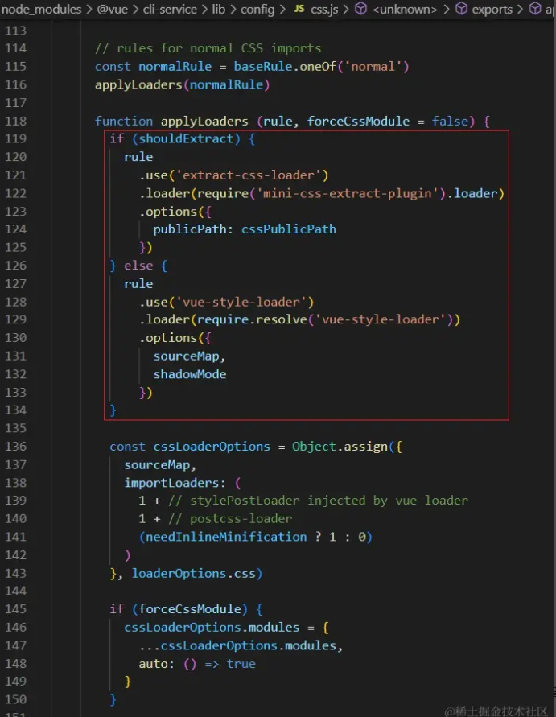
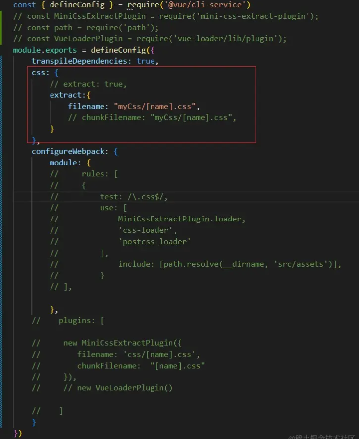
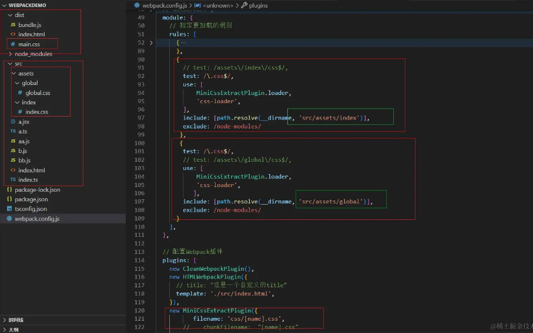
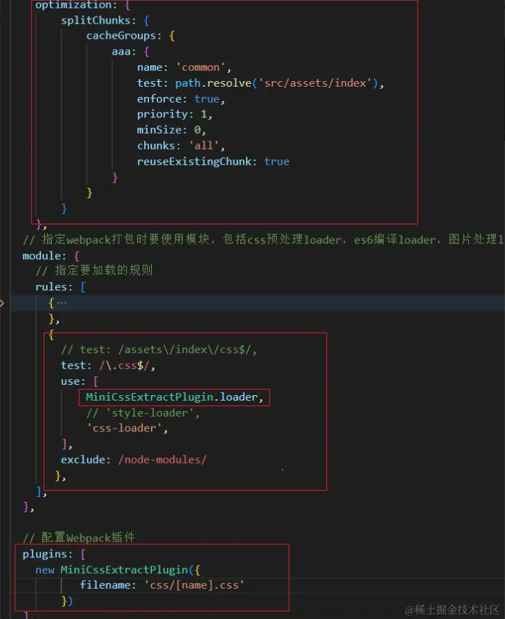
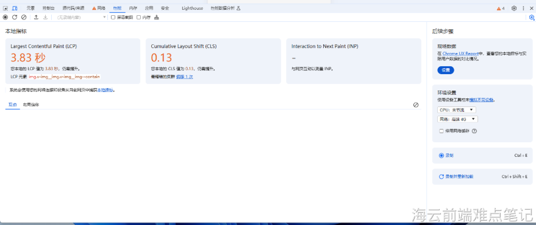
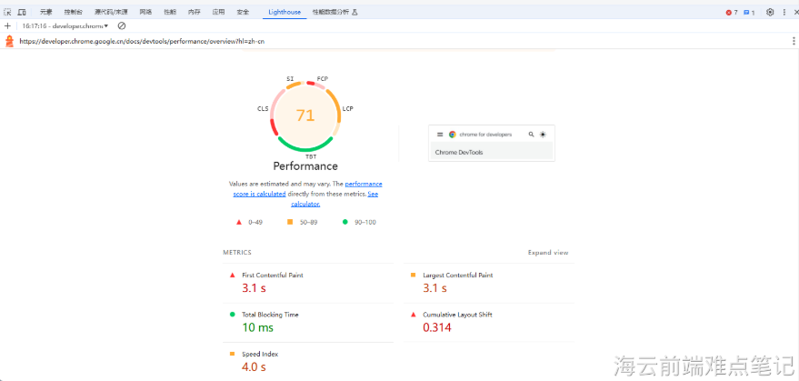

# 一、技术点描述

- [ ] **性能优化：**优化项目包体积，优化`web`端加载速度，采用`splitChunks`实现子项目共享字体包、`css`静态资源、`gzip`压缩包体积、浏览器强缓存`cache-control`等手段优化，解决了项目部署问题、字体闪动问题，加载慢问题，包体积从`36.61MB`减少至`18.41MB`，首次加载速度从`3023ms`减少至`1079ms`

# 二、关于该点回答

- [ ] 由于项目有明显的字体闪动问题，主要从共享静态资源，减小打包体积、利用浏览器缓存等方面来优化性能。

- [ ] 多个子项目共享基座的字体包，主要实现将字体`css`文件单独分离打包，子项目`nginx.conf`文件中配置rewrite来重定向到基座的字体包文件地址。

- [ ] 分离字体包的时候遇到问题，一开始尝试使用`webpack`中的`mini-css-extract-plugin`插件来单独分离`css`文件，一直报错，就去使用demo研究了一番。

- [ ] 一番研究之后的理解：`vue`其实已经给我们内置了`webpack`的`css`分离功能，可以通过源码查看并测试，注释了源码相关代码，再次打包确实不报错了

  

- [ ] 所以其实不需要像`webpack`中那样配置，只需要配置`vue.config.js`中的`css`选项的`extract`（内置`mini-css-extract-plugin`插件）即可，这个值默认就是true

  

- [ ] 思考之后再次理解“`mini-css-extract-plugin`插件来单独分离`css`文件”的含义是将`css`从`js`中分离出来，并且会将所有`css`文件打包合并生成一个`css`文件，并不能将特定的`css`文件单独打包成相应的`css`文件（比如`index.css->index.css，global.css->global.css`）

  

- [ ] 要实现将`css`打包成多个文件，需要结合`webpack`的代码分离特性`splitChunks`去实现。

  

  

# 三、衍生问题

#### 1、`webpack`

#### 2、共享静态资源/`cdn`

#### 3、浏览器缓存

#### 4、`gzip`

#### 5、首屏加载

- [ ] **spa -> 单页：**浏览器的加载过程是指将服务器上的静态资源（如：`CSS`、`JavaScript`文件）通过网络传输到用户的浏览器中，并存储在浏览器的内存中。

5.1、首先明白加载过程

 **(1) 拉取`html`，打包后的`html`里面只有`css`、`js`，此时就是`FP`的时候**

- [ ] `FP(First Paint)`：第一帧数据的像素落点，有一个东西回来渲染到页面上，第一帧绘制，`html`加载下来

  ```
  <静态资源>
  <div id="app"></div>
  ```

**(2) 加载静态资源、`css`、`js`，如果你的页面所有`js`全部都打包到`main.js`，下载的过程就很慢，需要加载的内容过多，时间过长，会出现长时间的白屏**

**(3) 解析`js` => 生成`html`(有了大致结构) 此时就是`FCP`的时候**

- [ ] `FCP(First Contentful Paint)`：结构出来了，标识渲染出第一个内容，有效的绘制。`css`、`js`加载下来（这个阶段很快）

  ```
  <div id="app">
      <div class="head"></div>
      <div class="body"></div>
  </div>
  ```

**(4) `ajax 0.5s`发请求获取项目接口数据**

- [ ] `LCP(Largest Contentful Paint)` ：结构和数据都出来了，真正有意义做优化的点，`ajax`数据请求回来了

  ```
  <div id="app">
      <div class="head">你好</div>
      <div class="body">新世界</div>
  </div>
  ```

- [ ] `FMP（First Meaningful Paint）`：首次渲染有意义的内容的时间，"有意义"没有一个标准的定义，`FMP`的计算方法也很复杂。比如新闻网页看标题加载出来，电商网站看图片加载出来。

- [ ] `LCP(Largest Contentful Paint)` ：首次渲染页面最大元素的时间（图片或文本），根据`W3C`网络性能工作组中讨论和Google所做的研究，我们发现，衡量页面主要内容的加载时间（首屏时间）的更准确方法是首次渲染页面最大元素的时间(`LCP`)

- [ ] 首屏时间指标原来一般用`fmp`，现在用`lcp`(都关注用户实际感知到的内容变化)，我优化也采用`LCP`作为首屏指标。

- [ ] 然后我就用谷歌浏览器的性能`Performance` 和 `Lighthouse`分析性能指标

- [ ] 性能面板：分析网站性能`lighthouse`：优化网站速度

  



- [ ] 分析完毕后我发现项目项目的首屏加载时间`LCP`要3秒左右
- [ ] 模拟首屏加载可以用`ctrl + f5`强制刷新浏览器，模拟首次加载，这样性能`Performance` 显示的`LCP`时间就是首次加载时间，因为第二次再刷新浏览器就会用缓存，那个`lcp`时间就会快很多，不是首次的，lighthouse你就直接分析就好。然后其实肉眼看的首屏加载速度是要比这个`lcp`指标快的，`lcp`并不完全等同于用户的主观感受，这个了解就好。
- [ ] 打包后的体积有`36.61`MB，主要是第三方库，字体包，还有`vue.js`
- [ ] 然后就从这两方面进行优化：从共享静态资源，代码分割、`gzip`压缩、利用浏览器缓存

#### 6、白屏 

